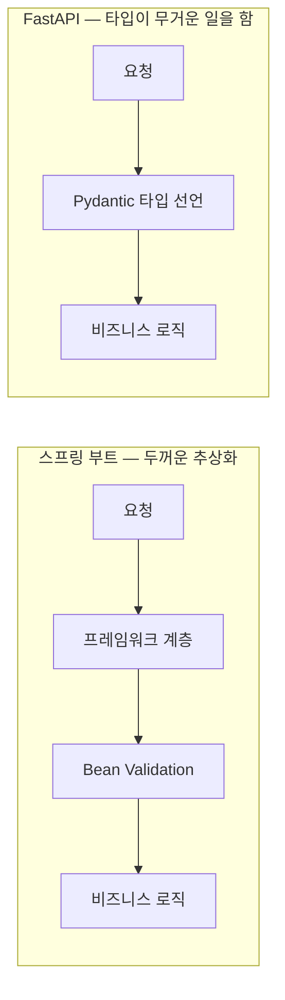

# 7장. 익숙한 스택을 떠날 때 — 잃어버린 checker를 다시 세우기

자바만 10년 쓰던 당신이 월요일 아침, 팀의 새 FastAPI 서비스를 맡았다고 해보자. 첫 엔드포인트 하나가 필요하다. AI에게 시켰더니 5초 만에 코드가 나온다. 데코레이터 한 줄, 함수 하나, 반환값 하나. 짧고 깔끔하다. 돌려보니 200이 떨어진다.

그런데 화면을 보는 당신의 표정이 개운하지 않다. 이게 맞는 코드인지 판단이 서지 않기 때문이다. 자바였다면 달랐을 것이다. 반환 타입이 계약과 어긋나면 컴파일러가 빨간 줄을 그었을 테고, 계층을 잘못 나눴으면 팀의 오래된 규약이 눈에 밟혔을 테고, 검증이 빠졌으면 어노테이션 자리가 허전해 보였을 것이다. 그 모든 신호가 지금은 없다. 코드는 돌아가는데, 이게 좋은 코드인지 나쁜 코드인지 당신 안에서 아무 경보도 울리지 않는다. 뭔가 잃어버린 느낌. 그 느낌의 정체를 이 장에서 함께 파헤쳐보자.

> **프론트엔드 독자라면** 이 장면을 이렇게 바꿔 읽어도 좋다. 느슨한 자바스크립트만 쓰던 당신이 팀의 엄격한 TypeScript(strict) 코드베이스에 합류했다. 혹은 익숙한 프레임워크를 떠나 새 프레임워크, 낯선 백엔드 스택을 처음 만졌다. 스택 이름만 다를 뿐, 이 장이 다루는 문제 — 익숙한 안전망을 떠날 때 무엇을 잃고 무엇으로 메우는가 — 는 똑같이 당신의 것이다. 백엔드 사례를 따라오다가, 중간중간 프론트 전용 대목에서 자기 상황으로 갈아타면 된다.

## 5초 만에 나온 코드가 개운하지 않은 이유

1장에서 우리는 타입 시스템과 컴파일러를 '공짜 checker'라고 불렀다. TypeScript가 GitHub에서 가장 많이 쓰는 언어로 올라선 것도(Octoverse 2025 기준), 에이전트 인프라가 Rust로 모여드는 것도, 결국 타입과 borrow checker라는 공짜 검증기를 루프 안에 끼워 넣으려는 움직임이라고 읽었다. AI가 코드를 쏟아낼수록, 그 코드를 자동으로 걸러줄 결정론적 게이트가 귀해지기 때문이다.

그런데 여기서 우리가 놓치기 쉬운 사실이 하나 있다. 그 공짜 checker는 언어와 프레임워크마다 **구성이 다르다**는 것이다.

자바와 스프링을 오래 쓴 사람은 자기도 모르게 두꺼운 안전망 위에서 일해 왔다. 정적 타입 컴파일러가 있고, `@Valid`·`@NotNull` 같은 선언적 검증이 있고, 무엇보다 스프링이라는 프레임워크 자체가 "컨트롤러는 여기, 서비스는 여기, 리포지토리는 여기"라고 강하게 정해주는 규약이 있었다. 이 세 겹은 너무 당연해서 평소엔 있는 줄도 몰랐다. 공기처럼. 그러다 그 공기가 얇아지는 곳으로 가면, 그제야 자기가 얼마나 그것에 기대고 있었는지 깨닫는다.

이 세 겹이 조용히 무슨 일을 하고 있었는지 잠깐 헤아려보자. 컴파일러는 타입이 어긋난 코드를 아예 실행 전에 걸러냈다. 선언적 검증은 "이 필드는 널이면 안 된다"는 계약을 코드 위에 붙여, 잘못된 데이터가 안으로 새어 드는 걸 입구에서 막았다. 강한 규약은 새 코드가 들어올 자리를 미리 정해둬서, 아무렇게나 흩어지지 않게 붙들었다. 요컨대 이 셋은 당신이 판단하기도 전에 상당수의 나쁜 코드를 **미리 쳐내주는 자동 필터**였다. 당신의 판단력은 그 필터를 통과한 것들만 상대하면 됐다. 그래서 편했고, 그래서 그게 있는 줄도 몰랐다.

파이썬과 FastAPI로 넘어온 순간이 바로 그 필터가 얇아지는 지점이다. 동적 타입이라 컴파일러의 빨간 줄이 없고, 프레임워크가 프로젝트 구조를 강제하지 않는다. AI가 뱉은 5초짜리 코드가 개운하지 않은 진짜 이유는 문법이 낯설어서가 아니다. **그 코드를 걸러주던 세 겹의 자동 필터가 통째로 사라졌기 때문**이다. 필터가 없으니, 필터가 하던 판단이 전부 당신 앞으로 돌아온다. 그런데 정작 당신은 이 스택에서 무엇이 좋고 나쁜지 아직 감이 없다. 판단의 근거는 없는데 판단의 책임만 커진 상태 — 마음이 놓일 리가 없다.

여기서 잠깐 멈추고 4장의 이야기를 떠올려보자. 하네스의 최종 품질 게이트는 결국 사람의 판단력이라고 했다. 그런데 그 판단력은 진공에서 작동하지 않는다. 익숙한 스택에서는 컴파일러와 규약이 판단의 상당 부분을 대신 짊어져 줬다. 새 스택에서는 그 짐이 고스란히 당신에게 돌아온다. 안전망이 얇아진 만큼, 사람이라는 최종 게이트의 부담이 커진다. 그러니 새 스택에서 AI와 일하는 건, 익숙한 스택에서보다 오히려 **더 깨어 있어야 하는** 국면이다. 역설적이지 않은가. 가장 손이 서툰 자리에서 가장 정신을 바짝 차려야 한다니. 하지만 이 역설을 받아들이는 데서 이 장의 이야기가 시작된다.

## FastAPI는 파이썬의 스프링 부트인가

낯선 곳에 떨어졌을 때 가장 먼저 필요한 건 지도다. 그리고 다행히도, 우리에겐 이미 훌륭한 지도가 하나 있다. 자바에서 쌓아온 스프링의 멘탈 모델이다. 완전히 처음부터 배우는 것과, 아는 것에 빗대어 배우는 것은 부담이 전혀 다르다. 익숙한 언어의 개념 위에 새 언어를 얹으면, 백지에서 시작할 때보다 훨씬 빠르게 지형이 눈에 들어온다.

실제로 자바 개발자를 위한 FastAPI 안내들이 반복해서 건네는 한 문장이 있다. "FastAPI is to Python what Spring Boot is to Java" — 파이썬 세계에서 FastAPI의 위치는 자바 세계에서 스프링 부트의 위치와 같다는 것이다. 이 대응을 몇 갈래로 펼쳐보면 지도가 제법 선명해진다.

- 요청을 받아 처리하는 웹 서버 층: 스프링에선 Tomcat이나 Undertow가 맡던 자리를, FastAPI에선 Uvicorn 같은 ASGI 서버가 맡는다.
- 들어온 데이터를 검증하고 형(型)을 맞추는 층: 스프링의 Bean Validation과 DTO가 하던 일을, FastAPI에선 Pydantic 모델이 한다.
- 요청을 함수에 연결하는 라우팅: `@GetMapping` 자리에 `@app.get`이 있다.

여기까지만 보면 "아, 그냥 이름만 다른 거네" 싶다. 자바에서 하던 걸 파이썬 방언으로 다시 말하는 정도로 느껴진다. 하지만 지도는 어디까지나 지도다. 실제 지형은 그 위에 없는 함정을 숨기고 있다.

가장 큰 차이는 철학에 있다. 스프링은 추상화 위에 추상화를 쌓아 올린 세계다. 개발자가 HTTP의 날것을 거의 만지지 않도록, 두꺼운 계층이 아래를 가려준다. 요청이 어떻게 파싱되고 어떻게 객체로 바뀌는지, 대부분 프레임워크가 보이지 않는 곳에서 처리한다. 반면 FastAPI는 HTTP에 훨씬 가깝게 붙어 있고, 스프링이 프레임워크의 무게로 처리하던 많은 일을 **타입 시스템에게 떠넘긴다.** 검증도, 직렬화도, API 문서 생성도, 상당 부분이 "이 값은 이 타입"이라는 선언 하나에서 파생된다.


그림 1. 같은 요청 처리라도 무게중심이 다르다 — 스프링은 프레임워크 계층에, FastAPI는 타입 선언에 일이 몰린다

이 차이를 놓치면 지도만 믿다가 길을 잘못 든다. 스프링 감각으로 "프레임워크가 알아서 해주겠지" 하고 타입 선언을 대충 하면, FastAPI에서는 검증이 통째로 헐거워진다. 무거운 일을 넘겨받은 쪽(타입)을 소홀히 했으니 당연한 결과다.

구체적으로 그려보자. AI에게 "사용자 생성 엔드포인트를 만들어 줘"라고 하면, 그럴듯한 라우터 함수 하나가 뚝딱 나온다. 자바 개발자의 눈은 본능적으로 익숙한 걸 찾는다. 계층은 잘 나뉘었나, 트랜잭션 경계는 맞나. 그런데 정작 이 스택에서 먼저 봐야 할 건 다른 데 있다. 요청 본문을 받는 자리에 Pydantic 모델이 제대로 서 있는가, 아니면 그냥 아무 타입이나 받아 넘기고 있는가. 스프링이라면 DTO 없이 요청을 받는 건 상상하기 어려운데, FastAPI에서는 AI가 태연히 그렇게 짜 놓을 수 있다. 그래도 코드는 돌아가니까. 지도가 "여기가 DTO 자리"라고 알려줘도, 실제로 그 자리에 계약을 세우는 건 당신 몫이다. 지도와 지형이 어긋나는 바로 그 지점에 배울 것이 있다. 그러니 대응표는 출발점으로만 쓰고, "어디가 1:1이 아닌가"를 늘 의심하는 편이 낫다.

## 진짜 통증은 문법이 아니다

자바 개발자가 FastAPI를 처음 만졌을 때 어디서 가장 크게 휘청이는지, 리서치 자료의 여러 목소리가 놀랍도록 한곳으로 모인다. 그 통증은 문법이 아니다. 세미콜론이 사라지고 중괄호가 들여쓰기로 바뀌는 건 며칠이면 적응한다. 진짜 통증은 두 가지 **부재**에서 온다. 규약의 부재, 그리고 타입 안전망의 부재.

먼저 규약의 부재를 보자. 한 자바 개발자의 전환기를 잘 요약한 문장이 있다. "FastAPI does not dictate a strict project structure like Spring Boot does" — FastAPI는 스프링 부트처럼 엄격한 프로젝트 구조를 강요하지 않는다는 것이다. 스프링에 익숙한 사람에게 이건 자유가 아니라 **공포**에 가깝다. 컨트롤러와 서비스를 어디에 둘지, 폴더를 어떻게 나눌지, 파일 하나에 무엇까지 담을지 — 아무도 정해주지 않는다. 열 명이 짜면 열 개의 구조가 나온다. 파이썬 세계 자체가 코딩 표준이 느슨한 편이라, 같은 문제를 두고도 사람마다 스타일이 크게 갈린다.

이게 왜 난감한가. 스프링에서는 규약이 곧 공용 언어였다. 처음 보는 코드베이스라도 "이건 컨트롤러, 저건 서비스" 하고 자리만 봐도 역할이 읽혔다. 규약이 팀 전체의 인지 부담을 줄여준 것이다. 그 공용 언어가 사라지면, 코드를 읽을 때마다 "이 파일은 대체 무슨 역할이지"를 매번 처음부터 추론해야 한다. 여기에 AI까지 끼면 혼란은 배가된다. AI는 물어볼 때마다 조금씩 다른 구조를 제안하기 때문이다. 어제는 이렇게, 오늘은 저렇게. 규약이라는 닻이 없으니 코드베이스가 조용히 표류한다.

여기에 두 번째 부재가 겹친다. 타입 안전망의 부재. 자바에서는 잘못된 타입을 넘기면 컴파일이 아예 안 됐다. 파이썬에서는 그냥 돌아간다. 돌아가다가 엉뚱한 데이터가 흘러 들어간 한참 뒤, 런타임에 가서야 터진다. 그것도 운이 좋아야 터지고, 운이 나쁘면 조용히 잘못된 값을 반환하고 만다. 정수가 와야 할 자리에 문자열이 들어와도 한동안 아무 일 없이 흘러가다가, 저 아래 어딘가에서 계산이 어긋나는 식이다. 자바 개발자가 무의식적으로 기대던 "타입이 안 맞으면 시작조차 안 된다"는 감각이, 여기선 통하지 않는다.

이제 이 두 부재가 왜 하필 **AI와 함께일 때** 특히 위험한지 생각해보자. 규약이 없고 컴파일러가 없다는 건, AI가 뱉은 코드를 걸러줄 자동 게이트가 그만큼 얇다는 뜻이다. 자바였다면 AI가 이상한 구조를 제안해도 컴파일러가 막거나 팀 규약이 어색함을 드러냈을 텐데, 여기선 그 방어선이 없다. AI는 그럴듯한 코드를 5초 만에 만들어내고, 그걸 판단할 checker는 사라졌다. 3장에서 우리는 조건에 따라 같은 도구가 정반대 결과를 낸다고 했다. 새 스택에 AI를 풀어놓는 건, 하필 안전망이 가장 얇은 조건에서 위임의 편안함에 몸을 맡기는 일이다. 찜찜할 수밖에 없다.

작은 예로 실감해보자. 자바였다면 상상하기 어려운 버그가 파이썬에서는 태연히 흘러간다. AI가 만든 함수가 사용자 나이를 문자열로 받아 그대로 다른 함수에 넘기고, 그 함수는 그걸 숫자처럼 비교한다고 해보자. 자바 컴파일러라면 시작조차 안 시켰을 코드다. 그런데 파이썬에서는 잘 돌아간다. 테스트 데이터가 우연히 다 정상 범위라면 며칠, 몇 주를 아무 문제 없이 지나간다. 그러다 어느 날 예외적인 입력이 들어오는 순간, 저 아래 엉뚱한 자리에서 조용히 터진다. 그 시점엔 "어디서부터 잘못됐지"를 되짚기가 훨씬 어렵다. 컴파일러가 입구에서 잡아줬을 문제를, 이제는 런타임 저 안쪽에서 사람이 손으로 캐내야 하는 것이다. 이런 일이 반복되면 왜 새 스택에서 checker의 부재가 뼈아픈지 몸으로 알게 된다.

## 잃어버린 checker를 다시 세우기

그렇다면 어떻게 해야 할까? 사라진 안전망을 그리워하며 손을 놓고 있을 수는 없다. 여기서 이 장의 핵심 발상이 나온다. 잃어버린 checker를, **다른 재료로 다시 세우는 것**이다.

핵심을 먼저 말하면 이렇다. 스프링에서 잃은 checker는 사라진 게 아니라, FastAPI에서는 **다른 자리로 옮겨간 것**뿐이다. 그 자리를 알면 다시 세울 수 있다.

FastAPI 공식 문서가 스스로를 소개하는 방식이 결정적인 단서다. "FastAPI is all based on these type hints" — FastAPI는 전부 이 타입 힌트에 기반한다. 그리고 검증은 Pydantic에 기반한다. 무슨 뜻인가. 스프링에서 프레임워크와 컴파일러가 나눠 지던 검증의 짐을, FastAPI에서는 **타입 힌트와 Pydantic이 도맡는다.** 그러니 checker를 되찾는 길은 분명하다. 타입 힌트를 성실히 붙이고, Pydantic 모델로 계약을 세우고, 그 위에 테스트를 얹는 것이다.

자바 개발자에게 이건 사실 완전히 새로운 사고가 아니다. 오히려 **이미 가진 무기를 새 언어로 옮기는 일**에 가깝다. 자바에서 몸에 밴 '타입은 곧 계약'이라는 감각 — 그걸 파이썬으로 그대로 가져오면 된다. 파이썬의 타입 힌트를 자바의 타입 선언처럼 진지하게 대하고, Pydantic 모델을 DTO처럼 데이터의 계약서로 삼는 것이다. 예를 들어 사용자 요청을 이렇게 계약으로 못 박아 둔다고 해보자.

```python
class CreateUserRequest(BaseModel):
    email: str
    age: int
```

겨우 몇 줄이지만, 이 선언 하나가 스프링에서 DTO와 `@Valid`가 하던 일의 상당 부분을 되살린다. 잘못된 타입의 데이터는 이 계약을 통과하지 못하고 입구에서 걸린다. 동적 타입 언어라고 타입을 대충 쓰는 게 아니라, 오히려 자바보다 더 의식적으로 타입을 계약으로 세우는 것이다. 그러면 잃었던 안전망의 상당 부분이 되돌아온다. (물론 검증 규칙의 구체적인 문법이나 옵션은 버전에 따라 달라질 수 있으니, 실제로 쓸 때는 공식 문서를 함께 확인해두자.)

여기서 5장의 흐름 안 기본값 하나가 이 전환에 절묘하게 들어맞는다. 바로 '선(先)설계 후(後)생성'이다. 새 스택이라고 AI에게 곧장 "엔드포인트 만들어 줘"부터 던지지 말고, 그 전에 이 계약(어떤 필드가 어떤 타입으로 오가는가)을 **내가 먼저 한 줄로 적어보는 것**이다. 그렇게 내가 세운 계약과 AI가 만든 코드를 맞대보면, 어긋나는 지점이 곧 내가 이 스택에서 아직 모르는 부분이다. 생성 효과가 여기서 조용히 일한다. 먼저 스스로 답을 만들어 본 뒤 확인하면 학습이 붙지만, 답부터 받으면 붙지 않는다고 했다. 새 스택은 그 원리를 적용하기에 더없이 좋은 땅이다.

이제 한 걸음 더 나아가, 이 checker를 사람의 성실함에만 맡기지 않고 **하네스에 인코딩**해보자. 5장에서 흐름 안 기본값을 CLAUDE.md 규칙과 훅과 커스텀 커맨드로 새겨 넣는 법을 이야기했는데, 새 스택 전환이야말로 그 도구가 빛나는 자리다. 몇 가지를 손에 잡히게 그려보자.

- **타입 검사와 린트를 훅으로 강제한다.** 파이썬에도 정적 타입 검사기와 린터가 있다. 자바 컴파일러가 자동으로 하던 일을, 여기선 이 도구들을 커밋 전 훅에 걸어 대신 시킨다. AI가 타입을 흐트러뜨린 코드를 내면, 사람의 눈이 아니라 훅이 먼저 막아준다. 잃어버린 컴파일러 게이트를 결정론적 훅으로 복원하는 셈이다.
- **Pydantic 모델을 데이터 계약으로 CLAUDE.md에 명시한다.** "새 엔드포인트는 요청·응답을 Pydantic 모델로 먼저 정의하고 시작한다" 같은 규칙 한 줄이면, AI에게 스프링의 DTO 규약에 해당하는 뼈대를 강제할 수 있다.
- **프로젝트 구조 규약을 스스로 정해 문서로 박는다.** 프레임워크가 안 정해주면, 팀이 정하면 된다. "라우터는 여기, 서비스 로직은 여기, 스키마는 여기"를 CLAUDE.md에 적어두면, AI가 매번 제멋대로 흩어놓던 구조에 규약의 뼈대가 생긴다. 스프링이 프레임워크의 무게로 주던 것을, 당신이 하네스의 규칙으로 준다.

이렇게 해두면 새 스택에서도 AI가 뱉은 코드가 자동으로 한 번 걸러진다. 다만 여기서 놓치지 말아야 할 게 있다. 이 도구들과 규칙들은 낯선 만큼, 처음엔 당신이 그 하나하나를 직접 만져보며 익혀야 한다는 것이다. 타입 검사기가 무엇을 잡고 무엇을 못 잡는지, Pydantic 모델이 어디까지 검증하는지 — 이걸 AI에게 통째로 맡겨 세팅하면, checker는 세워지되 그 checker를 이해하는 사람은 여전히 없다. 그건 안전망을 남의 손에 맡기고 그 밑에서 뛰어내리는 것과 같다. 그래서 새 스택에서는 위임 다이얼을 학습 모드 쪽으로 낮춰야 한다.

### 첫 엔드포인트를 이렇게 통과시켜 보자

말이 추상적으로 들릴 수 있으니, 지금까지의 이야기를 하나의 절차로 묶어보자. 새 스택에서 AI와 함께 첫 엔드포인트를 만들 때, 이렇게 밟아보는 편이 낫다.

먼저 **계약부터 내 손으로 적는다.** AI에게 코드를 시키기 전에, 이 엔드포인트가 어떤 데이터를 받고 무엇을 돌려주는지 Pydantic 모델의 형태로 스스로 먼저 스케치한다. 완벽할 필요는 없다. 틀려도 좋다. 중요한 건 AI의 답을 보기 전에 내 예측을 세우는 것이다. 앞서 말한 선설계 후생성이 여기서 작동한다.

그다음 **AI에게 시키되, 설명을 함께 요구한다.** "왜 이 구조로 짰는지, 어떤 대안을 버렸는지"를 코드와 함께 받는다. 스프링이라면 당연했을 계층 분리나 검증이 왜 여기선 이렇게 처리되는지, 그 이유를 AI의 입으로 듣는다. 5장에서 본 '설명 동봉' 기본값 그대로다.

그리고 **내 계약과 AI의 코드를 맞대본다.** 어긋나는 지점이 바로 내가 이 스택에서 아직 모르는 부분이다. 거기서 멈춰 공식 문서를 찾아보고, 왜 다른지 이해한다. 이 대조가 곧 학습이다.

마지막으로 **checker를 통과시키고, 스스로에게 설명할 수 있는지 묻는다.** 타입 검사와 린트 훅을 통과했는가. 그리고 이 코드를 동료에게 처음부터 설명할 수 있는가. 5장의 설명 가능성 게이트를 새 스택에서도 그대로 세우는 것이다. 이 네 걸음이 처음엔 번거롭게 느껴질 수 있다. 하지만 새 스택에 발을 들인 처음 몇 주가, 그 스택에 대한 당신의 멘탈 모델이 잡히느냐 마느냐를 가르는 결정적 구간이다. 이때 다이얼을 낮춰 직접 붙든 만큼, 나중이 편해진다. 위임 다이얼 이야기는 잠시 뒤 '이 전환에서 다이얼을 어디에 맞출까'에서 제대로 이어가자.

## 프론트엔드 독자를 위한 병렬 — 되찾은 checker

잠시 백엔드 사례에서 눈을 돌려, 프론트엔드 독자의 전환을 나란히 보자. 방향이 흥미롭게 뒤집히는 경우가 있기 때문이다.

느슨한 자바스크립트만 쓰던 개발자가 팀의 엄격한 TypeScript 코드베이스에 합류했다고 해보자. 여기서는 checker를 잃는 게 아니라, 오히려 **되찾는다.** 그동안 없던 타입 안전망이 갑자기 생기는 것이다. 처음엔 이 엄격함이 거추장스럽게 느껴질 수도 있다. 자바스크립트에서는 그냥 지나가던 게 여기선 사사건건 빨간 줄로 막히니까. 하지만 이 안전망의 가치는 AI 시대에 오히려 더 커졌다. LLM이 만들어내는 코드에서 컴파일 에러의 94%가 타입 체크 실패에서 나온다는 관찰이 있다(GitHub Octoverse 2025 리포트가 인용한 2025년 연구). 뒤집어 말하면, 타입 시스템이 AI가 저지르는 실수의 상당수를 사람이 보기도 전에 자동으로 잡아준다는 뜻이다. TypeScript가 GitHub 최다 언어로 올라선 것(Octoverse 2025 기준)도 이 맥락에서 읽을 수 있다. AI가 코드를 쏟아내는 시대에, 그걸 걸러줄 타입이라는 공짜 checker가 그만큼 값어치를 한다.

그런데 되찾은 checker에도 함정이 있다. AI에게 엄격 TypeScript 코드를 시키면, 타입이 까다로울 때 AI가 손쉬운 탈출구를 택하곤 한다. `any`를 남발하거나, 단언(assertion)으로 타입 검사를 우회하거나, 타입 오류를 억누르는 주석을 슬쩍 붙인다. 백엔드 개발자가 앞서 본 Pydantic 계약을 떠올린다면, 그 정반대 장면이라고 보면 된다. 이를테면 이런 식이다.

```typescript
// AI가 슬쩍 택하는 탈출구 — 타입이 까다로우니 그냥 우회
const user = response.data as any;
```

`as any` 한 줄이면 컴파일러는 입을 다문다. 코드는 컴파일되고 화면도 잘 돈다. 그런데 방금 되찾았던 안전망에 조용히 구멍이 뚫린 것이다. 겉으로는 멀쩡해서 더 위험하다. 백엔드에서 AI가 Pydantic 계약을 빼먹는 것과 정확히 대칭인 문제다. 도구가 다를 뿐, "AI가 타입이라는 안전망을 슬쩍 우회한다"는 본질은 같다.

그러니 프론트엔드 전환에서 학습 포인트는 분명하다. **AI가 타입을 우회하지 못하게 하는 것**이 곧 되찾은 checker를 지키는 일이다. 이것도 하네스에 새길 수 있다. "`any`와 타입 단언을 함부로 쓰지 않는다"를 팀 규칙(예컨대 Cursor Rules 같은 규칙 파일)에 박아두고, 타입 우회를 린트로 잡는 것이다. 프론트 팀들이 이미 Swagger에서 TypeScript 타입을 자동 생성하고, API 훅과 테스트와 PR 생성을 규칙으로 자동화해 온 흐름의 연장선이다. 백엔드 독자가 "잃어버린 checker를 다시 세운다"면, 프론트 독자는 "되찾은 checker에 뚫린 구멍을 막는다." 재료와 방향은 달라도, 원리는 하나다. **새 스택에서 AI를 믿을 수 있으려면, 그 코드를 걸러줄 결정론적 게이트를 내 손으로 세워야 한다.**

## 이 전환에서 다이얼을 어디에 맞출까

이제 6장에서 손에 쥔 위임 다이얼을 이 상황에 대봐야 할 차례다. 다이얼의 손잡이는 한 질문이었다. "나는 지금 생산 모드인가, 학습 모드인가."

새 스택 앞에서 이 질문의 답은 거의 자명하다. 명백히 학습 모드다. 멘탈 모델이 아직 없는 영역이기 때문이다. 6장에서 정한 원칙 그대로 — 멘탈 모델이 없는 새 도메인·새 언어·새 아키텍처에서는 위임을 낮추고 직접 작성과 설명 요구를 늘린다. 숙달 영역에서 공격적으로 위임하던 그 손을, 여기선 반대로 조여야 한다.

왜 그래야 하는지, 학습과학이 단단한 근거를 준다. 전이 연구에서 반복해서 확인되는 사실이 있다. 표면이 다를수록 — 학자들이 '먼 전이(far transfer)'라 부르는 상황일수록 — 지식은 잘 건너가지 않고, **오직 심층 원리를 제대로 익혔을 때만** 새 영역으로 전이된다는 것이다. 자바에서 파이썬으로, 익숙한 프레임워크에서 낯선 프레임워크로 건너가는 건 표면이 크게 다른 먼 전이다. 이럴 때 표면만 복사하면 — 즉 AI가 준 코드를 이해 없이 받아 붙이면 — 전이는 일어나지 않는다. `@GetMapping`을 `@app.get`으로 기계적으로 바꿔 넣는 수준에 머문다.

전문성이 무엇으로 이뤄지는지를 들여다보면 이 대목이 더 또렷해진다. 초보와 전문가가 같은 문제를 봐도, 초보는 표면적 특징에 매달리고 전문가는 심층 원리로 문제를 표상한다는 오래된 발견이 있다. 전문성이란 결국 지식이 얼마나 잘 **조직화**되어 있느냐의 문제라는 것이다. 그런데 이 조직화는 남이 대신 해줄 수 없다. AI가 짜 준 파이썬 코드를 눈으로 읽어 내려가는 것만으로는, 표면을 훑을 뿐 심층 구조가 내 안에 조직되지 않는다. 그래서 "AI 코드를 많이 읽으면 언젠가 이 스택의 시니어가 되겠지"라는 기대는 어긋난다. 디버깅에 필요한 인과 모델은, 스스로 만들어 보고 스스로 깨뜨려 본 경험에서만 조직되기 때문이다. 새 스택에서 위임을 낮추라는 건 금욕이 아니라, 바로 이 조직화의 기회를 스스로에게 주라는 뜻이다.

여기서 4장이 방어했던 반론 하나가 다시 힘을 얻는다. "모델이 좋아지면 인간 검증은 필요 없어지지 않나"라는 물음에, 우리는 "역량의 내용은 바뀌어도 구조는 남는다"고 답했다. 새 스택 전환이 바로 그 '구조는 남는다'의 생생한 증거다. 문법과 API라는 표면은 스택마다 갈아치워지지만, "타입을 계약으로 세운다", "잃은 checker를 다른 재료로 복원한다" 같은 심층 구조는 스택을 건너 살아남는다. 자바에서 벼린 '타입은 계약'이라는 감각이 파이썬에서 그대로 무기가 되는 것처럼 말이다. 그 구조를 손에 쥔 사람에게, 다음 스택 전환은 처음보다 덜 두렵다.

## 위험 균형추 — 익숙한 자리에도 함정은 있다

한쪽으로만 다이얼을 이야기하면 반쪽짜리 조언이 된다. 새 스택에서 위임을 낮추라고 했으니, 반대로 숙달 영역에서는 마음껏 위임하면 되는가? 대체로는 그렇다. 하지만 여기에도 균형추가 하나 걸린다.

2장에서 만난 METR 실험을 떠올려보자. 숙련된 개발자가 자기가 잘 아는 성숙한 코드베이스에서 AI를 썼더니, 스스로는 빨라졌다고 느꼈는데 실측은 오히려 느려졌다. 자기 홈그라운드에서조차 AI가 늘 이득은 아니라는 것이다.

이게 어떤 장면인지 그려보면 이렇다. 오래 다룬 큰 코드베이스에 작은 기능을 하나 얹는다. AI에게 시키면 금방 나올 것 같다. 그런데 이 코드베이스에는 문서에 없는 암묵적 규칙이 잔뜩 배어 있다. 이 모듈은 저 순서로 초기화해야 하고, 이 함수는 저 엣지 케이스를 특별히 다뤄야 하고 — 당신 머릿속엔 있지만 AI는 모르는 맥락이다. AI가 뱉은 코드를 그 맥락에 맞춰 고치고, 다시 시키고, 또 고친다. 그 왕복에 든 시간을 다 더하면, 그냥 당신 손으로 짰을 때보다 오래 걸린다. 그런데도 "AI가 뭔가 해줬다"는 느낌 때문에 빨랐다고 착각한다. METR가 잡아낸 게 바로 이 착각이다. 그러니 "숙달 영역이니 무조건 공격적으로 위임"도 방심이 될 수 있다. 코드베이스가 깊고 암묵적 맥락이 많은 영역에서는, 위임의 이득이 생각만큼 크지 않거나 심지어 뒤집힐 수 있다.

정리하면 다이얼은 양쪽 모두에서 신중해야 한다. 새 스택에서는 학습을 위해 낮추고, 숙달 영역에서는 속도를 위해 높이되 — 자기가 지금 정말 이득을 보고 있는지 이따금 실측으로 되물어야 한다. 다이얼은 한 번 맞춰두고 잊는 스위치가 아니라, 상황마다 다시 돌려야 하는 손잡이다.

익숙한 스택을 떠나는 일은 늘 조금 불안하다. 발밑의 안전망이 얇아지는 걸 몸이 먼저 느끼기 때문이다. 하지만 이 장을 지나온 지금, 그 불안의 정체는 분명해졌다. 사라진 건 checker였고, checker는 다른 재료로 다시 세울 수 있다. 그리고 그 checker를 스스로 세워본 경험은, 다음번 낯선 스택 앞에서 당신이 챙겨 갈 가장 단단한 짐이 된다. 스택은 갈아치워져도, 잃은 안전망을 되세우는 그 감각만은 당신 안에 남는다. 그리고 바로 그 감각이, 다음 장에서 만날 또 다른 사람들 — 아직 되세울 안전망조차 가져본 적 없는 이들 — 에게는 어떻게 주어질 수 있을지, 자연스레 묻게 된다.

### 이 장의 핵심

- 새 스택으로 옮기면 문법이 아니라 **세 겹의 자동 필터**(컴파일러·강한 규약·선언적 검증)를 잃는다. AI가 뱉은 코드가 개운하지 않은 진짜 이유가 이것이다.
- 잃은 checker는 사라진 게 아니라 자리를 옮긴 것뿐이다. FastAPI에서는 **타입 힌트·Pydantic·테스트**로, 그리고 훅·CLAUDE.md 규칙으로 다시 세울 수 있다. 자바의 '타입=계약' 감각이 그대로 다리가 된다.
- 프론트엔드 전환은 방향이 뒤집혀 checker를 **되찾는** 경우다. 이때는 AI의 `any` 남발·타입 우회를 규칙과 린트로 막는 것이 학습 포인트다.
- 새 스택은 멘탈 모델이 없는 영역이므로 위임 다이얼을 **학습 모드**로 낮춘다. 표면만 복사해선 전이되지 않고, 심층 원리를 스스로 조직해야 다음 스택으로 건너간다.
- 반대로 숙달 영역이라고 방심하면 METR의 함정에 걸린다. 다이얼은 양쪽 모두에서 신중히, 상황마다 다시 돌린다.
