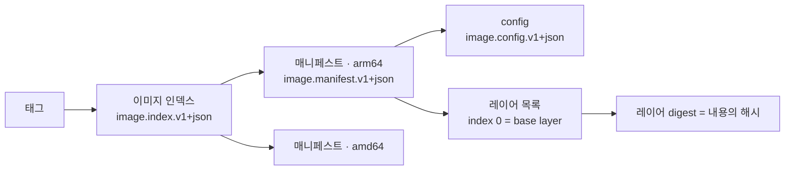
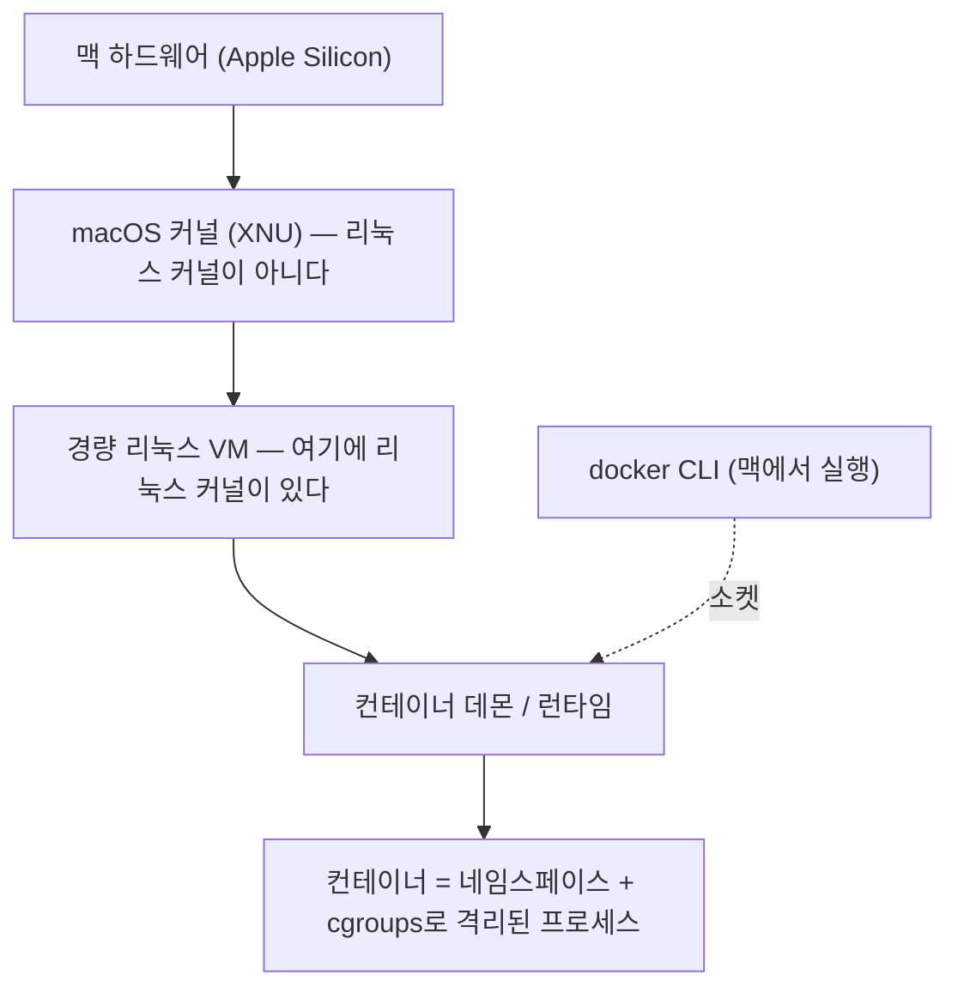
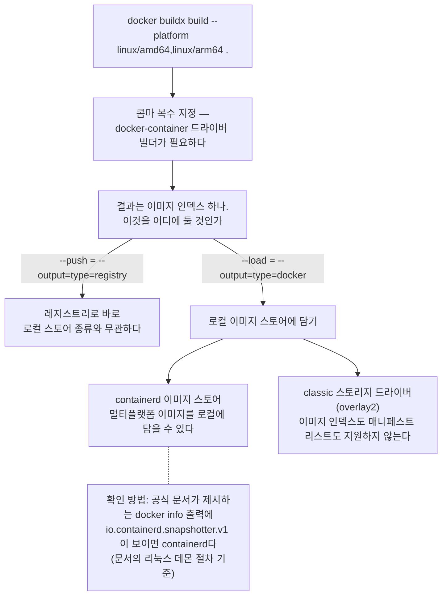
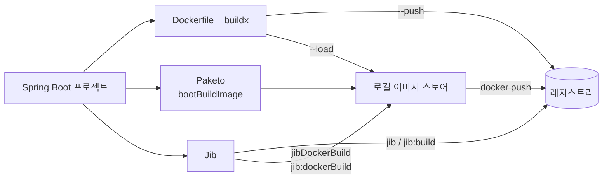
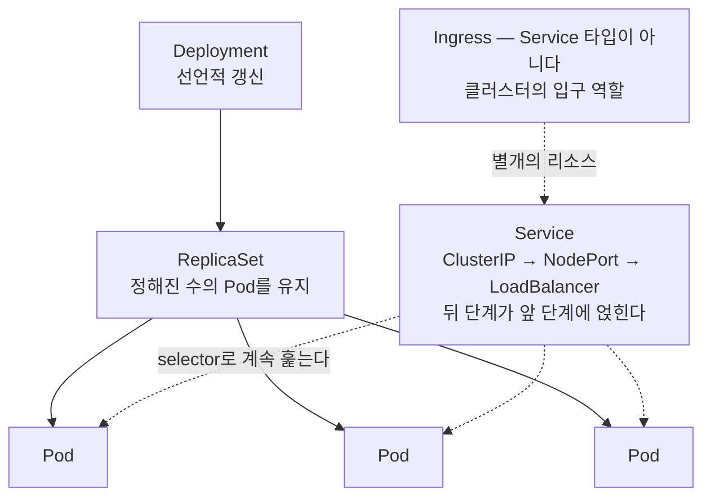
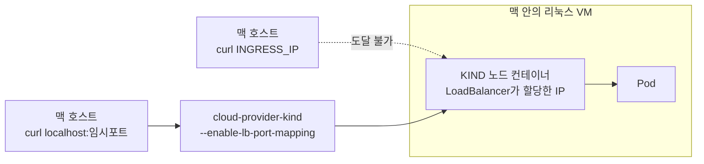

# 로컬에서는 잘 됐는데요

**Apple Silicon 맥에서 컨테이너 이미지를 만들고, 배포하고, 쿠버네티스까지**

## 저자
Toby-AI

**판본:** v1.0.0 · 2026-07-26

---

## 서문

이 책은 맥에서 컨테이너를 쓰다 며칠을 날려본 적 있는 사람을 위해 썼다.

`docker run`은 치는데 왜 그렇게 되는지는 모르는 상태. 맥에서 만든 이미지가 서버에서 안 돌아 원인을 못 찾고 헤맨 적이 있는 상태. 쿠버네티스는 아직 남의 일 같은 상태. 자바와 스프링으로 서비스를 만들어 왔지만 컨테이너 쪽은 어깨너머로 배운 상태. 그 자리에 서 있는 백엔드 개발자를 독자로 상정했다.

전제로 삼는 것은 자바·스프링 실무 경험 정도다. 컨테이너와 쿠버네티스 지식은 전제하지 않는다.

첫 장이 실패담으로 시작하니 서문은 여기서 짧게 끊고, 대신 이 책을 어떻게 쓰면 좋은지만 적어두겠다.

### 이 책이 약속하는 것

책을 덮었을 때 도착하는 자리를 네 문장으로 적으면 이렇다.

1. 문제가 생겼을 때 **무엇이 실행되고 어디에 붙는지**를 분리해서 물을 수 있다.
2. Spring Boot 앱을 세 경로 가운데 자기 상황에 맞는 것으로 근거를 대며 고르고, 배포 대상 아키텍처를 확인해 올릴 수 있다.
3. 태그·digest·캐시가 각각 무엇을 보장하고 무엇을 보장하지 않는지 알고, 베이스 갱신 루프를 도구로 굴릴 수 있다.
4. 쿠버네티스를 지금 도입할지 말지를 남의 논쟁이 아니라 자기 기준으로 판단하고, 맥에서 클러스터를 띄워 자기 이미지를 올려볼 수 있다.

### 어떻게 읽으면 좋은가

순서대로 읽는 쪽을 권하지만, 급하면 필요한 장부터 펴도 된다. 각 장은 중간에서 시작해도 읽히게 썼다.

예외가 하나 있다. **2장만은 건너뛰지 말자.** 이 책의 열두 장은 서로 다른 열두 가지 문제를 다루는 것처럼 보이지만, 그중 여섯 개는 2장에 나오는 한 문장의 다른 얼굴이다. 그 문장을 모르고 읽으면 같은 이야기를 여섯 번 처음 만나게 된다.

세 덩어리로 나뉜다. 1~5장은 왜 내 맥에서만 다른 일이 벌어지는가를 다루고, 6~10장은 이미지를 만들어 올리고 갱신하는 실무로 들어가며, 11~12장은 그 위에 쿠버네티스를 얹을 것인가를 판단하고 실제로 켜본다. 자바·스프링 이야기는 별도의 파트로 떼어놓지 않았다. 원리가 실무로 착지하는 자리마다 끼워 넣었다 — 2장의 cgroups는 8장의 힙 크기로, 6장의 멀티아키는 7장의 빌드 도구 세 갈래로 이어진다.

### 표기와 시점에 대하여

용어가 두 가지로 갈리는 자리가 몇 군데 있어 먼저 정해둔다.

- 제품 이름은 영문 정식 표기를 쓴다 — `Docker Desktop`, `Docker Engine`, `Docker Hub`. 일반 지칭도 `Docker`로 적는다. 다만 세 제품을 한 덩어리로 뭉뚱그려 부르는 현장의 화법을 그대로 옮기는 자리(1장 세 번째 절 등)에서는 「도커」를 그대로 둔다. 그 뭉뚱그림 자체가 그 절의 소재이기 때문이다.
- 태그와 매니페스트 사이에 끼어드는 층은 「이미지 인덱스」로 부른다. `manifest list`·`multi-platform index`는 원문을 축자로 옮기는 자리에만 나온다.
- 「매니페스트」는 두 곳에서 서로 다른 것을 가리킨다. 2·6·7·9·10장에서는 OCI 이미지 매니페스트이고, 11·12장에서는 쿠버네티스에 넘기는 선언 파일(YAML)이다. 12장이 그 자리에서 다시 짚는다.
- 쿠버네티스는 본문에서 한글로 적는다. `K8s`·`k8s`는 인용 안에만 나온다. 반면 `Pod`·`Deployment`·`Service`처럼 클러스터에 실제로 적어 넣는 이름은 영문 그대로 둔다.

그리고 이 책이 사실을 다루는 방식에 대해 한 가지. **모든 버전·수치·상태 표시에는 조회 시점이 붙어 있다.** 본문의 값은 대체로 2026년 7월에 1차 소스에서 확인한 것이고, 그 이후의 변경은 반영돼 있지 않다. 이 분야에서 그 시차는 짧지 않다. 시점 표기가 문장을 무겁게 만드는 자리가 여럿 있는데, 덜어내지 않았다. 그 문장을 언제까지 믿어도 되는지를 독자에게 넘기는 장치이기 때문이다. 같은 이유로 확인하지 못한 것은 확인하지 못했다고 적어두었다. 비어 있는 자리가 그럴듯하게 메워진 자리보다 낫다고 봤다.

## 목차

- 1장. 나만 안 되는 이유가 있다
- 2장. 컨테이너는 제품이 아니라 커널 기능이다
- 3장. Docker Desktop이 맥에서 실제로 하는 일
- 4장. 6GB를 주랬더니 11.5GB를 쓴다
- 5장. 무엇이 실행되고, 어디에 붙는가
- 6장. 같은 명령, 다른 결과 — arm64와 amd64
- 7장. Spring Boot 앱을 이미지로 만드는 세 갈래
- 8장. `FROM` 뒤의 선택, 그리고 그 안의 자바
- 9장. 코드를 고쳤는데 왜 그대로일까 — 태그·캐시·재현성
- 10장. 만든 뒤가 진짜다 — 갱신·스캔·승격
- 11장. 쿠버네티스는 언제 쓰는 기술인가
- 12장. 맥에서 쿠버네티스를 켜보기 — 그리고 마지막 벽
- 후기. 여섯 번 돌아온 한 문장
- 참고문헌
- 판권

---

# 1장. 나만 안 되는 이유가 있다

2025년 8월, 한국의 한 개발자가 velog에 「Docker 컨테이너가 나만 죽는 이유와 해결방안」이라는 글을 올렸다. 상황을 설명한 대목은 두 줄이 전부다.

> "Docker로 여러 컨테이너를 띄워놨는데, Redis 컨테이너가 자주 꺼짐
> 다른 팀원들은 잘 동작하지만, 나만 꺼지는 상황"

이 두 줄을 읽고 아무 감정도 들지 않았다면 운이 좋은 편이다. 컨테이너를 몇 달만 써봤어도 대부분은 저 문장을 한 번쯤 자기 입으로 말해봤을 것이다. 같은 저장소를 받았고, 같은 명령을 쳤고, 옆자리 동료는 아무 일 없이 일하고 있다. 그런데 내 화면에서만 뭔가가 꺼지거나, 안 뜨거나, 이상한 영어 한 줄을 뱉는다. 이럴 때 가장 먼저 드는 생각은 대개 기술적인 것이 아니다. **내가 뭘 잘못 건드렸나.** 그 의심이 며칠을 잡아먹는다.

### 나만 꺼지는 상황

앞의 글쓴이는 결국 단서를 하나 찾아낸다. `docker inspect`를 돌려보고 이렇게 적었다.

> "docker inspect 결과: `OOMKilled=true (exit=137)` → 메모리 부족(OOM Kill) 이 원인."

이 한 줄이 무엇을 말해주는지, 그리고 왜 하필 그의 맥에서만 그 일이 벌어졌는지는 뒤에서 제대로 다룬다. 지금 붙잡아 둘 것은 다른 쪽이다. 그가 도달한 원인은 코드에 있지 않았다는 것. 그의 코드도, 그의 Redis 설정도 팀원들 것과 같았다. 갈린 것은 각자의 맥이 컨테이너에게 내주고 있던 자원의 양이었고, 그건 저장소 어디에도 적혀 있지 않다.

시간을 3년 반쯤 앞으로 돌려보자. 2022년 1월, 또 다른 한국 개발자가 비슷한 벽에 부딪힌다. 이번엔 배포다. 이미지를 만드는 것도 성공했고, 레지스트리에 올리는 것도 성공했다. 그런데 배포만 계속 실패한다. 그가 처음 한 일은 우리가 실제로 하는 그 일이었다.

> "찾아보니 entrypoint.sh 파일의 실행 권한이 없을 경우에 발생할 수 있는 문제라고 해서 일단 `chmod +x entrypoint.sh` 를 통해 권한을 바꿔주고 다시 이미지를 생성해봤다.
> 사실 실행 권한을 확인해보니 이미 권한이 있기는 했다."

검색해서 나온 첫 번째 답을, 이미 아닌 걸 알면서도 해봤다. 원리를 모를 때 우리는 정확히 이렇게 행동한다. 당연히 결과는 같았다. 그다음이 이 글의 백미다.

> "이상하다 싶어서 다른 분의 노트북으로 이미지를 빌드해서 배포를 시도했더니 별 문제 없이 배포가 마무리되는 현상을 확인할 수 있었다.
> 차이점이라고는 코어의 차이(M1 or Intel) 였는데, 설마 그게 문제일까하는 생각이 들기는 했다."

"설마 그게 문제일까." 범인을 눈앞에 두고도 못 믿는 순간이다. 컨테이너는 어디서나 똑같이 돈다고 믿고 있으면, CPU가 다르다는 사실을 용의선상에 올릴 수가 없다. 그리고 글은 이렇게 끝난다.

> "정말 뭐가 문제인지 싶었는데,,,,,
> 문제 해결해 주신 리드님께 무한 감사,,,,😭"

혼자 못 풀었고, 아는 사람이 알려줬다. 이게 이 책이 다루려는 종류의 지식이다. 아는 사람에게는 3초, 모르는 사람에게는 며칠. 그 사이에 있는 건 실력의 차이가 아니라 **한 가지 사실을 들어봤느냐 아니냐의 차이**다.

두 사람은 3년 반 차이가 나고, 증상도 전혀 다르다. 한쪽은 컨테이너가 꺼졌고 한쪽은 아예 뜨지 않았다. 그런데 감정은 똑같다. 그리고 원인의 성격도 똑같다. 둘 다 코드의 문제가 아니었고, 둘 다 맥이라는 환경이 조용히 끼워 넣은 차이였다. 만약 비슷한 며칠을 보내고 스스로를 의심했던 적이 있다면, 먼저 이 말부터 해두고 싶다. 그건 대체로 당신 탓이 아니었다.

그렇다면 이제 질문을 제대로 세워보자. 같은 코드, 같은 명령인데 왜 내 맥에서만 다른 일이 벌어질까?

### 이 책이 답하려는 네 가지

이 책은 그 질문을 네 갈래로 나눠 따라간다. 전부 실무에서 실제로 부딪히는 순서다.

첫째, 맥에서 Docker로 개발할 때 무엇을 알아야 하는가. 설정 화면의 슬라이더들은 대체 무엇을 정하는 걸까? 내가 친 명령은 어디로 가서 누가 처리할까? DB와 캐시를 컨테이너로 띄워놓고 그 위에서 앱을 만드는 흔한 동선에서는 무엇이 어긋날 수 있을까? 3장·4장·5장이 여기에 답한다. 한 질문에 세 장을 쓰는 이유는 이게 사실 세 겹짜리 질문이기 때문이다. 무엇을 설정했는가, 그 설정이 정말 지켜지고 있는가, 그리고 그 위에서 하루치 개발이 굴러가는가.

다음은 Spring Boot 앱을 이미지로 만들어 올리는 일이다. 자바 개발자에게는 길이 하나가 아니라 여럿이라는 게 오히려 문제다. Dockerfile로 직접 쓸 수도, 빌드팩에 맡길 수도, 빌드 도구 플러그인에 맡길 수도 있다. 그리고 만드는 것과 **올려서 돌아가게 하는 것**은 다른 일이다. 7장이 그 둘을 이어 붙인다.

만든 다음에는 내 이미지를 계속 업데이트하는 일이 남는다. 태그를 붙였는데 왜 어제와 다른 것이 내려올까? 코드를 고쳤는데 이미지는 그대로인 일도 흔하다. 그리고 베이스 이미지가 바뀌었다는 걸 나는 어떻게 알게 될까? 9장은 만들 때를, 10장은 만든 뒤를 다룬다.

넷째, 쿠버네티스는 언제 쓰는 기술이며 맥에서 써보려면 무엇이 필요한가. 11장은 쓸 것인가 말 것인가를 판단하는 축을 세우고, 12장은 실제로 맥에서 클러스터를 띄워 내가 만든 이미지를 올려본다.

그런데 이 네 갈래는 각각 다른 뿌리에서 자란 게 아니다. 앞서 본 두 일화가 다른 증상이었지만 같은 종류의 원인을 가졌던 것처럼, 네 질문의 답도 상당 부분 **하나의 사실**로 수렴한다. 그 사실이 2장이다. 순서를 건너뛰고 싶더라도 2장만은 먼저 읽어두는 편이 낫다. 건너뛰면 그 하나를 뒤에서 네 번 다시 만나게 되는데, 그때마다 같은 이야기인 줄 모른 채 지나가기 때문이다.

### 도커 데스크톱·도커 엔진·도커 허브는 다른 물건이다

여기서 경계선을 하나 그어두자. 국내 개발자 커뮤니티에는 도커 데스크톱의 유료화와 도커 허브의 정책, 그리고 도커 엔진을 한 덩어리로 묶어 놓고 질문을 던진 글이 올라와 있다. 흔한 실수라서가 아니라, **아주 자연스러운 혼동**이라서 짚어둘 만하다. 셋 다 이름이 "도커"로 시작하고, 우리는 셋을 한꺼번에 설치했기 때문이다.

- **Docker Engine**은 실제로 컨테이너를 만들고 돌리는 쪽이다. 이미지를 굽고, 프로세스를 띄우고, 자원 한도를 거는 일이 전부 여기서 일어난다.
- **Docker Desktop**은 맥에 설치하는 제품이고, 그 Engine을 안에 담아 함께 배포한다. 설정 화면·GUI·업데이트가 붙어 있는 건 이쪽이다.
- **Docker Hub**는 만든 이미지를 올려두고 내려받는 레지스트리다. Docker 공식 문서는 이미지 태그에서 호스트를 생략하면 "Docker defaults to Docker Hub (docker.io)"라고 못 박아 두었다(2026년 7월 조회 기준). 이미지 이름 앞에 레지스트리 주소를 한 번도 적지 않았는데도 어디선가 뭔가가 내려오는 이유가 이것이다.

이 구분을 흐려두면 가장 먼저 꼬이는 게 버전 이야기다. 예를 들어 Docker Desktop 4.83.0의 릴리스 노트는 그 안에 Docker Engine v29.6.2가 들어 있다고 적고 있다(2026년 7월 조회 기준). 4.83.0과 29.6.2는 **서로 다른 제품의 번호**이지, 어느 쪽이 최신이라는 뜻이 아니다. 앞으로 이 책이 버전을 인용할 때마다 어느 제품의 번호인지 밝히는 이유이기도 하다. 돈이 걸리는 지점, 회사 정책이 걸리는 지점도 셋 중 어디냐에 따라 완전히 달라지는데, 그 이야기는 3장에서 제대로 하자.

### 이 책이 사실을 다루는 방식

기술서에서 가장 아찔한 일은 문장이 어려운 게 아니라 문장이 틀리는 것이다. 특히 이 책이 다루는 영역은 반년이면 표정이 바뀐다. 그래서 근거를 네 종류로 나눠 다루고, 각각이 무엇을 증명할 수 있는지를 다르게 취급한다.

**공식 문서와 릴리스 노트 같은 1차 소스**만이 버전·플래그·기본값의 근거다. 어떤 옵션의 기본값이 무엇인지는 커뮤니티에서 다섯 명이 같은 말을 해도 근거가 되지 않는다. 그리고 그런 사실을 인용할 때는 방금 앞 절에서 본 것처럼 "2026년 7월 조회 기준"이라고 시점을 붙인다. 장식이 아니라 유통기한 표시다. 그 문장을 언제까지 믿어도 되는지, 언제부터는 직접 다시 확인해야 하는지를 당신 손에 넘겨주는 장치다.

**커뮤니티 글과 이슈 트래커**는 사실의 근거가 아니라 **경험의 근거**다. 그래서 커뮤니티를 인용할 때는 "누가 언제 이렇게 말했다"는 형태를 지킨다. 앞서 인용한 두 편의 글도 그렇게 다뤘다. 그 글들이 증명하는 것은 "그런 일이 실제로 누군가에게 일어났다"이지, "원인은 항상 이것이다"가 아니다.

**논문**은 원리를 뒷받침하되, 측정한 해와 환경을 늘 함께 적는다. 2018년에 측정된 숫자는 2018년의 숫자다. 그대로 오늘로 옮기면 그 순간 오보가 된다.

**직접 실행해 얻은 출력**도 쓴다. 다만 그건 이 책을 쓴 맥 한 대에서 나온 표본 하나다. "이 환경에서는 이렇게 관측됐다"까지만 말하고, "원래 그렇다"로 넘어가지 않는다.

그리고 하나 더 약속해두자. **확인하지 못한 것은 확인하지 못했다고 쓴다.** 이 책에는 "이 부분은 공식 문서에서 확인하지 못했다"거나 "직접 쳐서 확인해보자"고 적힌 자리가 몇 군데 나온다. 그건 저자가 게을러서가 아니라, 모르는 자리를 그럴듯한 문장으로 덮는 게 독자에게 훨씬 위험하기 때문이다. 뒷맛이 찜찜한 문장보다는 비어 있는 자리가 낫다.

자, 이제 출발점으로 돌아가자. 어떤 사람은 컨테이너가 꺼지고, 어떤 사람은 이미지가 안 뜨고, 또 어떤 사람은 디스크가 가득 찼다는 말을 듣는다. 증상은 제각각인데 이상하게도 전부 맥에서만 생긴다. 그 원인은 놀랍도록 단순한 한 문장에서 출발한다.

# 2장. 컨테이너는 제품이 아니라 커널 기능이다

흔히 컨테이너를 "가벼운 가상 머신"이라고 설명한다. 무겁고 느린 VM 대신 가볍고 빠른 컨테이너를 쓴다는 대비다. 입문 강의에도, 사내 기술 공유 자료에도 이 문장은 거의 빠지지 않는다.

그런데 맥에서는 이 정의가 통째로 뒤집힌다. 당신의 컨테이너는 가상 머신을 대신한 무엇이 아니다. **가상 머신 안에** 있다.

앞 장에서 늘어놓은 이상한 일들의 뿌리가 여기서 시작한다. 그렇다면 왜 하필 VM일까? 맥은 컨테이너를 그냥 돌리지 못한다는 말인가. 답을 보려면 한 계단 아래로 내려가야 한다. 컨테이너가 대체 무엇으로 만들어진 물건인지부터 살펴보자.

### 컨테이너를 만드는 두 개의 커널 기능

먼저 오해 하나를 걷어내자. 컨테이너는 누가 만들어 파는 제품이 아니다. **리눅스 커널의 두 기능에 union 파일시스템을 얹은 조합**이다. 그 두 기능이 네임스페이스와 cgroups다.

네임스페이스가 하는 일은 커널 문서가 한 문장으로 정의한다.

> "A namespace wraps a global system resource in an abstraction that makes it appear to the processes within the namespace that they have their own isolated instance of the global resource."
> — namespaces(7), Linux man-pages 6.18 (페이지 날짜 2026-02-08)

전역 자원을 감싸서, 그 안의 프로세스에게는 **자기만의 몫인 것처럼 보이게** 만든다는 뜻이다. 감싸는 대상은 여덟 가지다(man-pages 6.18 / 2026-02 기준).

| Namespace | Flag | 격리 대상 |
|---|---|---|
| Cgroup | `CLONE_NEWCGROUP` | Cgroup root directory |
| IPC | `CLONE_NEWIPC` | System V IPC, POSIX message queues |
| Network | `CLONE_NEWNET` | Network devices, stacks, ports 등 |
| Mount | `CLONE_NEWNS` | Mount points |
| PID | `CLONE_NEWPID` | Process IDs |
| Time | `CLONE_NEWTIME` | Boot and monotonic clocks |
| User | `CLONE_NEWUSER` | User and group IDs |
| UTS | `CLONE_NEWUTS` | Hostname and NIS domain name |

표만 보면 그저 목록이다. 그런데 여덟 줄을 다 외우는 대신 세 줄만 골라 프로세스 입장이 되어 보면 감이 달라진다. Mount 네임스페이스 덕분에 컨테이너 안의 프로세스는 자기가 보는 루트 디렉터리가 세상의 전부라고 믿는다. PID 네임스페이스 덕분에 자기가 1번 프로세스라고 믿는다. Network 네임스페이스 덕분에 8080 포트가 비어 있다고 믿는다. 세 가지 믿음 모두 커널이 만들어 준 것이다.

그러니 이 표는 외울 대상이 아니라 **경계의 목록**으로 읽는 편이 낫다. 컨테이너 안에서 무언가가 안 보인다면 이유는 이 여덟 줄 가운데 하나다. 그런데 더 중요한 건 목록에 **없는 것**이다. 커널이 여기 없다. 프로세스마다 자기 커널을 하나씩 갖는 게 아니라, 전부가 하나의 커널을 함께 쓴다. 그러니 이렇게 정리해두자. **컨테이너 안의 프로세스는 여전히 호스트 커널이 돌리는 그냥 프로세스다.** 다른 커널 위에서 도는 게 아니다. 이 한 문장은 곧 두 가지를 한꺼번에 설명하게 된다. 맥에 왜 VM이 필요한지, 그리고 격리가 왜 보안 경계가 아닌지.

여기까지가 "무엇이 보이는가"를 나누는 장치라면, "얼마나 쓸 수 있는가"를 나누는 장치는 따로 있다.

> "Control groups, usually referred to as cgroups, are a Linux kernel feature which allow processes to be organized into hierarchical groups whose usage of various types of resources can then be limited and monitored."
> — cgroups(7), Linux man-pages 6.18 (2026-02-08)

프로세스를 계층적인 그룹으로 묶고, 그 그룹의 자원 사용량을 제한하고 관측한다. 정의 끝에 붙은 "monitored"라는 단어도 그냥 지나치지 말자. 제한만 거는 게 아니라 **그 값을 읽을 수도 있다**는 뜻이고, 이 읽기가 나중에 자바 개발자에게 꽤 중요해진다. cgroups v2가 가진 컨트롤러는 `cpu`, `cpuset`, `freezer`, `hugetlb`, `io`, `memory`, `perf_event`, `pids`, `rdma`다. v1도 호환성 때문에 아직 남아 있는데, **v2는 v1 컨트롤러의 부분집합만 구현한 상태**라는 점은 알아두는 편이 낫다(man-pages 6.18 / 2026-02 기준).

컨테이너에 메모리 한도를 걸면 그 숫자가 실제로 적히는 곳이 바로 이 memory 컨트롤러다. 그리고 이 이름은 한참 뒤에 다시 등장한다. JVM이 컨테이너 안에서 힙 크기를 알아서 정할 때 읽는 값이 바로 이 cgroup의 memory·cpu 제한이기 때문이다. 자바 개발자에게 이 연결은 생각보다 실용적이다. 힙이 예상과 다르게 잡혔다면 JVM 옵션을 뒤지기 전에 **cgroup에 무엇이 적혀 있는지**를 먼저 물어야 한다는 뜻이니까. 그 다리는 8장에서 건너기로 하자.

한 가지 오해는 지금 지워두는 게 좋겠다. 컨테이너 기동이 굼뜨게 느껴질 때 범인으로 지목되는 게 대개 이 격리 장치들이다. 그런데 2026년에 측정된 한 프리프린트 연구(Khan, arXiv:2602.15214, **동료심사 미확인 프리프린트**)는 네임스페이스 생성 비용을 7.94ms(SSD, σ=2.05)로 재고, 이것이 전체 기동 시간의 1.5%에 미치지 못한다고 보고했다. 격리 원시요소를 최적화 타깃으로 잡으면 헛수고일 가능성이 크다는 이야기다. 기동이 느리다면 시간은 다른 데서 새고 있다.

### 태그 하나가 가리키는 것들

컨테이너가 어떻게 격리되는지는 봤다. 그렇다면 그 안에서 도는 파일들, 그러니까 이미지는 어떤 물건일까?

이미지는 파일 하나가 아니다. 여러 조각이 digest로 서로를 가리키는 **사슬**이다. 우리가 손으로 치는 것은 사슬의 맨 앞, 태그뿐이다.


그림 1. OCI 이미지 사슬 — 태그에서 레이어 digest까지

OCI 이미지 스펙이 정한 이름을 그대로 옮기면 이렇다. 매니페스트의 미디어 타입은 `application/vnd.oci.image.manifest.v1+json`이고, 그 안의 `schemaVersion`은 "MUST be `2` to ensure backward compatibility with older versions of Docker."라고 못 박혀 있다. config는 `application/vnd.oci.image.config.v1+json`, layers는 descriptor 배열이며 **인덱스 0이 base layer**이고 그 뒤로 쌓인다. 그리고 조각과 조각을 잇는 digest는 **내용에서 계산한 해시**다.

이 이름들도 외울 필요는 없다. 대신 구조 하나만 눈에 담아두자. 사슬의 각 마디는 다음 마디를 **내용의 해시로** 가리킨다. digest가 내용에서 계산된다는 말이 정확히 그 뜻이다. 내용이 한 바이트만 달라져도 digest가 달라지고, digest가 달라지면 그것을 가리키던 위쪽 마디까지 달라진다. 그래서 사슬의 아래쪽은 전부 **내용으로 고정된 이름**을 갖는다. 예외는 딱 하나, 맨 앞의 태그다. 태그는 사람이 붙인 이름표일 뿐이라 언제든 다른 곳을 가리키도록 옮길 수 있다. 이 비대칭이 나중에 9장에서 통째로 한 장의 주제가 된다.

여기서 이 책이 두고두고 쓸 조각이 하나 더 나온다. 태그와 매니페스트 사이에 **이미지 인덱스**(`application/vnd.oci.image.index.v1+json`)가 끼어들 수 있다는 것. 흔히 멀티아키 매니페스트 리스트라고 부르는 그것이다. 태그 하나가 아키텍처별 매니페스트 여러 개를 가리키는 구조라서, 같은 태그를 쓰는데도 arm64 맥과 amd64 서버가 서로 다른 이미지를 받아 갈 수 있다. 명령도 같고 태그도 같은데 결과가 갈리는 통로가 여기 하나 열려 있는 셈이다. 이 한 문장이 6장에서는 "왜 내 맥은 arm64 이미지를 만드는가"로, 9장에서는 "왜 태그를 그대로 뒀는데 내용이 바뀌는가"로 되돌아온다.

그럼 레이어는 어떻게 겹쳐질까? 커널에 있는 overlay 파일시스템이 개념적인 답을 준다. 커널 문서는 "An overlay-filesystem tries to present a filesystem which is the result of overlaying one filesystem on top of the other."라고 설명하고, 마운트 시점에 `lowerdir`과 `upperdir`이 하나의 merged 디렉터리로 합쳐진다고 적는다. 핵심은 쓰기가 일어날 때다.

> "When a file in the lower filesystem is accessed in a way that requires write-access, such as opening for write access, changing some metadata etc., the file is first copied from the lower filesystem to the upper filesystem (copy_up)."
> — Linux Kernel Documentation, Overlay Filesystem (커널 버전 마커 미확인, 2026-07-25 열람)

아래 레이어의 파일을 고치려 하면 먼저 위로 복사된다. 이것이 copy_up이다. "레이어는 겹쳐지고, 쓰려고 하면 위로 복사된다" 정도만 손에 쥐고 있어도 9장의 캐시 이야기는 충분히 따라온다. 다만 한 가지는 정직하게 밝혀두자. **Docker의 스토리지 드라이버가 정확히 이 overlayfs로 구현된다는 연결은 커널 문서가 하지 않는다.** 여기서는 개념적 대응까지만이다.

### 그래서 맥에는 VM이 있다

이제 처음의 질문으로 돌아갈 차례다. 네임스페이스도 cgroups도 리눅스 커널의 기능이다. 그런데 macOS의 커널은 XNU이고, XNU는 리눅스 커널이 아니다.

논리는 잔인할 만큼 단순하다. 리눅스 커널에만 있는 기능을 쓰려면 리눅스 커널이 있어야 한다. 없으면 어디선가 가져와야 한다.

"가져온다"는 말의 무게를 한 번 재보자. 네임스페이스는 내려받아 설치할 수 있는 라이브러리가 아니다. 프로세스가 요청하면 커널이 만들어 주는 것이고, 그 요청을 받아 주는 커널이 리눅스 커널이다. 그러니 필요한 것은 소프트웨어 한 벌이 아니라 **커널 그 자체**다. 맥의 컨테이너 도구들이 고른 길도 흉내가 아니라 진짜 리눅스 커널을 하나 띄우는 쪽이었다. 경량 리눅스 VM을 돌리고, **그 안의 리눅스 커널이 컨테이너를 만든다.**


그림 2. 맥에서 컨테이너가 놓이는 자리 — 컨테이너는 macOS 위가 아니라 리눅스 VM 안에 있다

이 그림은 이 책 전체의 지도다. 한 번 더 천천히 읽어보자. 명령을 치는 것은 맥에서 도는 CLI다. 그런데 그 명령이 만들어 내는 컨테이너는 두 칸 아래, VM 안에 있다. 즉 **"내 컴퓨터에서 컨테이너를 돌린다"는 익숙한 표현은 이미 절반쯤 어긋나 있다.** 컨테이너는 내 컴퓨터 안에 있는 또 다른 컴퓨터에서 돈다.

또 다른 컴퓨터라는 말에는 따라오는 것이 있다. 경계다. 맥에 있는 소스 코드를 컨테이너가 읽으려면 그 경계를 넘어야 한다. 컨테이너에 메모리를 주려면 VM을 거쳐야 한다. 맥의 브라우저로 컨테이너의 포트에 닿으려면 역시 경계를 넘어야 한다. 컨테이너 안의 프로세스가 쓰는 CPU도 맥이 직접 준 CPU가 아니라 VM이 다시 나눠 준 CPU다. 리눅스 서버에서라면 넷 다 아예 존재하지 않는 경계인데, 맥에서는 매번 지나가야 하는 관문이다.

관문을 지날 때마다 값이 붙는다. 그래서 우리가 실제로 치르는 비용도 이 그림대로 쪼개진다.

```
독자가 보는 비용 = [컨테이너 오버헤드] + [VM 오버헤드] + [호스트↔게스트 파일/네트워크 경계]
                    ↑ 논문들이 측정한 것    ↑ 논문들이 대부분 측정하지 않은 것
```

논문들이 잰 것은 첫 항뿐이다. 이 사실이 왜 중요할까? 리눅스에서 측정한 컨테이너 오버헤드 수치를 맥 사용자가 자기 값으로 가져오면 안 되기 때문이다. **그 값은 우리에게 관측값이 아니라 바닥값이다.** 우리가 실제로 겪는 값은 반드시 그보다 위에 있고, 얼마나 위인지는 대체로 아무도 재 주지 않았다. 이 책이 뒤에서 "직접 재보자"고 여러 번 권하게 되는 이유도 여기 있다.

그런데 우리가 놓인 이 구조를 정확히 겨눈 문장이 11년 전 논문에 이미 있다.

> "We also question the practice of deploying containers inside VMs, since this imposes the performance overheads of VMs while giving no benefit compared to deploying containers directly on non-virtualized Linux."
> — Felter et al., ISPASS 2015, p.172 (**2014년 측정**)

IBM 연구자 네 사람이 2014년에 측정하고 2015년에 발표한 논문의 마지막 대목이다. 그들이 의문을 제기한 "컨테이너를 VM 안에 넣는 관행"이, 오늘 우리 맥북에서는 관행이 아니라 유일한 선택지다. 11년 전에 비효율로 지목된 구조 위에서 우리가 매일 개발하고 있는 셈이다.

오해는 말자. 이 문장은 "맥에서 컨테이너를 쓰지 말라"는 뜻이 아니다. 저자들이 문제 삼은 것은 리눅스 서버에서 **굳이** VM을 끼우는 관행이고, 맥에서 VM은 선택이 아니라 전제다. 그들에게는 걷어낼 수 있는 층이었지만 우리에게는 걷어낼 수 없는 층이라는 차이가 있다. 그러니 우리가 할 일은 그 층을 없애는 게 아니라, 그 층이 **어디에 무엇을 만들어 내는지**를 아는 것이다.

기억해두자. **맥에서는 리눅스 VM이 끼어 있다.** 이 문장 하나가 앞으로 여러 얼굴로 되돌아온다. 파일이 느리게 읽히는 것도, 메모리 회계가 어긋나는 것도, 자바 테스트가 소켓을 못 찾는 것도, 맥에서 만든 이미지가 서버에서 안 도는 것도 전부 같은 원인의 다른 얼굴이다. 그때마다 이 그림으로 돌아오면 된다.

### 격리는 보안이 아니다

네임스페이스가 프로세스에게 "자기만의 세상"을 보여준다고 했다. 여기서 위험한 도약이 하나 일어난다. 격리돼 있으니 안전하겠지, 하는 도약이다. 정말 그것으로 충분할까?

앞에서 붙잡아둔 문장을 여기서 쓸 차례다. 컨테이너 안의 프로세스는 호스트 커널이 돌리는 그냥 프로세스이고, 커널은 네임스페이스 목록에 없다. 그러니 남이 만든 이미지를 받아 돌린다는 건 **남이 쓴 코드를 내 커널 위에서 돌린다**는 뜻이기도 하다. 학계는 이 지점을 정면으로 측정했다.

> "We find the kernel security mechanisms such as Capability, Seccomp, and MAC play a more important role in preventing privilege escalation than the container isolation mechanisms (i.e., Namespace and Cgroup)."
> — Lin et al., ACSAC '18 (2018년 측정, Docker 17.09.1-ce 기준)

실제로 동작하는 익스플로잇 223건을 모아 대표 88건으로 측정한 연구다. 결론은 권한 상승을 막는 데 격리 기제(네임스페이스·cgroup)보다 Capability·Seccomp·MAC 같은 커널 보안 기제가 더 크게 기여한다는 것이다. 저자들은 이 기제들이 서로 의존하는 탓에 가장 약한 고리가 전체 방어력을 결정하는 "short board effect"에 빠질 수 있다고도 지적한다.

수치도 있긴 하다. 2018년 당시 Docker 17.09.1-ce와 취약 커널 조합이라는 조건에서, 88건 중 50건(56.82%)이 기본 설정 컨테이너 안에서 공격에 성공했고 11건은 격리를 뚫고 권한 상승까지 갔다. 다만 이 숫자를 오늘의 성공률로 읽으면 곤란하다. 패치된 커널의 값이 아니다. 여기서 가져올 것은 수치가 아니라 구조적 결론 쪽이다. 그 결론을 실무의 말로 옮기면 이렇게 된다. **컨테이너를 썼다는 사실 자체는 방어 항목이 아니다.** 방어는 그 위에 무엇을 얹었느냐가 한다.

업계는 이 문제에 어떻게 답했을까? AWS 엔지니어들이 쓴 Firecracker 논문의 초록이 그 답을 그대로 적어 놓았다.

> "The traditional view is that there is a choice between virtualization with strong security and high overhead, and container technologies with weaker security and minimal overhead. This tradeoff is unacceptable to public infrastructure providers, who need both strong security and minimal overhead."
> — Agache et al., NSDI '20 Abstract

공개 인프라 제공자에게 이 트레이드오프는 받아들일 수 없는 것이었다. 그래서 그들은 컨테이너 격리에 기대는 대신 Rust로 최소 VMM을 새로 썼다. 2020년 발표 시점 기준으로 내건 설계 목표치는 컨테이너당 메모리 오버헤드 5MB 미만, 애플리케이션 코드까지 부팅 125ms 미만, 호스트당 초당 최대 150개 MicroVM 생성이었다. 눈여겨볼 것은 그들이 고른 방향이다. 컨테이너를 더 단단히 조이는 쪽이 아니라 VM을 더 가볍게 만드는 쪽으로 갔다. 남의 코드를 대규모로 돌려야 하는 자리에서 업계가 내린 판단이 그쪽이었다는 사실은, 그 자체로 하나의 정보다.

그러니 "컨테이너는 안전하다" 또는 "위험하다"로 한 줄 정리하는 것은 피하자. 근거가 지지하는 문장은 이쪽이다. **네임스페이스와 cgroups는 격리를 위한 장치이지, 보안 경계로 설계된 물건이 아니다.** 이 구분을 갖고 있으면 출처를 모르는 이미지를 손쉽게 `docker run` 해 보기 전에 한 번은 멈추게 된다.

이 장의 제목을 한 번 더 시험해보자. 컨테이너가 제품이 아니라 표준과 커널 기능의 조합이라면, "Docker가 쿠버네티스에서 빠졌다"던 그 소동은 대체 무엇이었을까? 쿠버네티스 공식 블로그가 2022년 2월에 직접 답했다. "Yes, the images produced from `docker build` will work with all CRI implementations. **All your existing images will still work exactly the same.**"

빠진 것은 이미지가 아니라, 쿠버네티스가 Docker Engine과 대화하려고 임시로 끼워 두었던 어댑터(dockershim)다. 그 제거는 Kubernetes 1.24에서 일어났다(2022년 발표 기준). 이미지 포맷은 처음부터 OCI 표준이었기에 아래쪽 런타임을 갈아 끼워도 위쪽 이미지는 그대로 돌았다. 한 회사의 제품이었다면 벌어질 수 없는 일이다. 이 이야기는 11장에서 다시 만나게 된다.

오늘 챙겨 갈 문장은 하나로 충분하다. 컨테이너는 리눅스 커널의 기능이고, 맥에는 리눅스 커널이 없어서 VM이 끼어 있다.

그런데 그 VM은 누가 띄우고, 누가 관리할까?

# 3장. Docker Desktop이 맥에서 실제로 하는 일

문서가 스스로 "가장 최신이고 가장 성능이 좋다"고 말하는 옵션을 골랐는데, 바로 그 선택 때문에 amd64 빌드가 훨씬 느려질 수 있다면 — 우리는 그 설정 화면을 제대로 읽고 있는 걸까?

설정 화면은 목록처럼 생겼다. 드롭다운 하나, 체크박스 하나, 슬라이더 몇 개. 목록처럼 생긴 것은 대개 서로 독립적이라고 읽힌다. 하나를 바꾸면 그 하나만 바뀔 것 같다. 그런데 맥의 Docker Desktop에서는 그렇지 않다. 위에서 고른 것이 아래 있던 항목을 화면에서 지워버리고, 왜 지워졌는지는 어디에도 적혀 있지 않다. 그 관계를 하나씩 풀어보자.

### VMM을 고르면 Rosetta가 따라온다

Docker Desktop 설정 화면에는 이런 이름의 항목이 있다 — "Choose Virtual Machine Manager (VMM)". 2장에서 그려둔 그 리눅스 VM을 무엇으로 돌릴지 고르는 자리다. 고를 수 있는 것은 셋이다(Docker Desktop 공식 문서, 2026-07-25 열람 기준).

| 설정에 표기된 이름 | 문서의 서술 (축자) | Rosetta |
|---|---|---|
| **Docker VMM** | "the latest and most performant Hypervisor/Virtual Machine Manager. This option is available only on Apple Silicon Macs and is in Beta." | **미지원** |
| **Apple Virtualization framework** | "A stable and well-established option for managing virtual machines on Mac" | Rosetta 옵션의 전제 조건 |
| **QEMU** | 세 번째 선택지. VMM 문서는 QEMU와 HyperKit을 legacy·deprecated로 표기한다 | — |

여기까지는 그냥 옵션 목록이다. 그런데 같은 설정 화면 아래쪽에 "Use Rosetta for x86_64/amd64 emulation on Apple Silicon"이라는 항목이 따로 있고(기본값 Disabled), 그 설명에 이런 문장이 붙어 있다.

> "This option is only available if you have selected Apple Virtualization framework as the Virtual Machine Manager."

그리고 Docker VMM을 설명하는 별도 문서에는 이 문장이 있다.

> "Docker VMM does not currently support Rosetta, so emulation of amd64 architectures is slow."

두 문장을 나란히 놓아보자. 무엇이 보이는가? **가장 최신이고 가장 성능이 좋다는 VMM을 고르는 순간, Rosetta 스위치는 화면에서 사라진다.** 각각 좋은 걸 고르면 되는 관계가 아니라, 하나가 다른 하나의 존재 여부를 결정하는 관계다. amd64 에뮬레이션이 필요한 사람에게는 VMM 선택 자체가 트레이드오프인 셈이다. 이걸 모른 채 "성능 좋다는 걸로 바꿨는데 왜 더 느려졌지" 하고 며칠을 태우기 딱 좋다.

한 가지 더. Docker VMM에는 "requires a minimum of 4GB of memory to be allocated to the Docker Linux VM"이라는 조건이 붙는다. 맥에 램이 4GB 있어야 한다는 말이 아니라, **그 리눅스 VM에 할당된 메모리**가 4GB 이상이어야 한다는 말이다. 2장에서 계층을 그려두지 않았다면 이 문장부터 헷갈렸을 것이다.

그렇다면 아무것도 안 만졌을 때 기본으로 잡히는 VMM은 무엇일까? **모른다.** 공식 문서에서 "기본은 이것이다"라는 문장을 확인하지 못했다. 그래서 이 책은 그 자리를 비워둔다 — 1장에서 약속한 대로, 확인하지 못한 것은 확인하지 못했다고 쓴다. 대신 지금 이 맥에서 직접 열어 확인하는 편이 낫다. 위 문장의 **"not currently"**라는 단어도 눈여겨볼 만하다 — 지금 시점의 상태라는 뜻이고, 이 관계는 바뀔 수 있다. 설정을 만지기 전에 공식 문서를 한 번 같이 열어보자.

### 파일이 VM 경계를 넘는 방식

`docker run -v "$(pwd)":/app ...` 같은 명령을 별생각 없이 써왔다면, 그게 실제로 무슨 일인지 다시 보자. 왼쪽 경로는 맥 파일시스템에 있고, 오른쪽 경로는 **VM 안 리눅스**에 있다. 한 머신 안에서 디렉터리 두 개를 이어붙이는 게 아니라, 서로 다른 운영체제 두 개를 이어붙이는 일이다. 2장의 그 VM이 여기서 처음으로 얼굴을 내민다 — 그 경계가 있기 때문에 맥 쪽 디렉터리를 컨테이너 안에서 보이게 하려면 두 운영체제 사이에서 파일 접근을 중계해줄 무언가가 필요하고, 그 중계 방식이 설정 화면의 한 항목으로 올라와 있다.

그 항목의 이름 역시 축자로 이렇다 — "Choose file sharing implementation for your containers". 선택지는 VirtioFS(기본)와 gRPC FUSE 둘이다. 이름이 낯설어도 지금은 "맥과 VM 사이에서 파일을 중계하는 방식 두 가지"라고만 알아두면 충분하다. 여기서 먼저 눈여겨볼 것은 이름이 아니라 **선택지가 있다는 사실 자체**다. 리눅스에서 Docker를 쓰는 사람의 설정 화면에는 이런 항목이 없다. 고를 것이 생겼다는 건 그 자리에 무언가 값이 든다는 뜻이고, 그 값은 2장에서 본 경계의 청구서다.

문서는 두 선택지 가운데 VirtioFS에 이런 문장을 달아두었다.

> "VirtioFS has reduced the time taken to complete filesystem operations by up to 98%."

숫자가 크다. 그런데 잠시 멈추고 이 문장을 다시 읽어보자. **무엇 대비 98%인지가 안 적혀 있다.** 어떤 워크로드에서 잰 것인지도 없다. 그러니 이 책은 "VirtioFS로 바꾸면 98% 빨라진다"라고 우리 문장으로 옮기지 않는다. 우리가 아는 것은 Docker 공식 문서가 그렇게 적어두었다는 사실까지다.

이 구분을 그냥 깐깐함으로 넘기지 말자. 실무에서 이 차이는 꽤 크게 벌어진다. 문서가 준 것은 방향이다 — 두 구현 중 하나가 파일 작업에서 유리하다는 벤더의 주장. 문서가 주지 않은 것은 크기다. 당신의 프로젝트에서, 당신의 소스 트리 크기로, 당신이 실제로 돌리는 빌드와 테스트에서 그 차이가 몇 초인지는 그 문장이 답해주지 않는다. 그러니 이 항목을 만질 때 기대할 수 있는 것은 "이 방향으로 가면 나아질 여지가 있다"까지이고, 실제 크기는 자기 프로젝트에서 같은 작업을 두 번 돌려보는 수밖에 없다. 벤더의 숫자를 자기 환경의 예측치로 옮겨 적는 순간, 우리는 확인하지 않은 것을 확인한 것처럼 다루게 된다.

그리고 이 항목은 앞 소절과도 이어져 있다.

> "It is the only file sharing implementation supported by Docker VMM."

VMM 하나를 골랐을 뿐인데 파일 공유 구현까지 따라 정해진다. 사슬이 한 칸 더 길어진 것이다. 게다가 그 조합에는 이런 경고까지 붙어 있다.

> "Certain databases, like MongoDB and Cassandra, may fail when using virtiofs with Docker VMM."

성능이 좀 떨어진다가 아니라 **fail**이다. 이 문장이 왜 중요한지는 자기 개발 환경을 떠올려보면 바로 안다. 로컬에서 DB를 컨테이너로 띄워두고 작업해본 적이 있다면, 공식 문서가 이름을 대며 실패 가능성을 경고하는 대상이 바로 그 자리다. 다시 말해 이 드롭다운은 "조금 빠른 쪽을 고르는 취향의 문제"가 아니라, 어떤 조합에서는 뜨느냐 마느냐의 문제로 넘어간다. 성능 항목처럼 생긴 자리에 동작 여부가 걸려 있는 셈이다.

### Rosetta는 켜면 빨라지는 스위치가 아니다

앞에서 우리는 "Rosetta를 쓰려면 VMM을 이걸로 골라야 한다"까지 왔다. 그러면 그렇게 골라 켜기만 하면 amd64가 쾌적해질까?

`docker/for-mac#7075`(2023-11 등록, 2026-07-25 조회 시점 OPEN)에 올라온 빌드 로그를 보자. M2 Max 맥북 프로 사용자가 Rosetta를 **켠** 상태로 amd64 이미지를 빌드한 결과다.

```
[+] Building 33656.6s (15/22)
 => [builder 5/5] RUN yarn build      33186.8s
```

33,656초. 약 **9시간 21분**이다. 밤새 돌려놓고 아침에 출근했는데 아직 안 끝나 있었다는 이야기다. 물론 이 숫자 자체는 벤치마크가 아니다 — 한 사람의 한 환경, 한 워크로드에서 나온 자기 보고다. "Rosetta를 켜면 9시간이 걸린다"고 읽으면 안 된다. 다만 같은 증상은 M1·M2 Max·M3 Max·M3 Pro에 걸쳐 2023년 11월부터 2024년 6월까지 반복 보고됐고, 같은 이슈에 모인 다른 목소리들을 겹쳐 보면 그림이 좀 더 선명해진다. `AlexandreRoba`(M3 Max 64GB)는 Docker Desktop을 4.24.2로 내리고 Rosetta도 함께 끈 뒤 5분 만에 빌드가 끝났다고 적었고 — 두 가지를 같이 바꿨으니 어느 쪽 덕인지는 그 보고만으로 가릴 수 없다 — `alnaranjo`는 이렇게 말했다.

> "Using 4.25.x would cause docker build to hang indefinitely even when disabling 'use rosetta'. Building arm images is a breeze, though."

이 이슈는 한 번 닫힌 적이 있다. Docker 쪽에서 특정 버전을 제안했고 실제로 해결된 사용자가 있었다. 그런데 닫힌 뒤에도 같은 보고가 이어졌다.

> "why is this closed? I think the issue persists for latest macbook users" — `jinmel`, 2024-06-29

그리고 4.30·4.31에서도 같은 증상 보고가 올라왔으며, 2026-07-25에 조회한 시점에 이슈는 **다시 열려 있다.** 그래서 이 책은 두 문장을 다 쓰지 않는다. **"Rosetta를 켜면 빨라진다"도, "그 문제는 이제 해결됐다"도.** 켜서 좋아진 사람과 꺼서 살아난 사람이 같은 이슈 안에 나란히 있고, Docker Desktop 버전에 따라 결과가 뒤집힌다.

자바 쪽 판본도 하나 있다. 2026년 2월 한 커뮤니티 스레드에서 `p0w3n3d`라는 사용자가, **Podman에서** Rosetta를 켠 amd64 환경으로 `eclipse-temurin:25-jdk-ubi10-minimal` 이미지 위의 Spring Boot 앱을 띄운 결과를 이렇게 올렸다.

```
podman run   0.02s user 0.01s system 0% cpu 24.960 total
```

20초대다. 이건 런타임 비교로 읽으면 안 된다 — 같은 사람이 바로 앞에서 "내 머신에서 podman과 docker 사이에 차이가 없다"고 스스로 번복한 뒤에 올린 관측이고, 어느 쪽이든 한 사용자의 자기 보고다. 여기서 남는 건 딱 하나다. 에뮬레이션 위에 올라간 자바는 느리다. 그렇다면 가장 확실한 처방은 무엇일까? 에뮬레이션을 잘 켜는 게 아니라 **에뮬레이션을 안 하는 것**이다. 그러려면 내가 만드는 이미지가 어느 아키텍처인지부터 알아야 하는데, 그 이야기는 6장의 몫이다.

### 무료로 쓸 수 있는가 — 250인 AND $10M

설정 화면 바깥에도 결정이 하나 있다. **이걸 회사에서 써도 되는가.**

Docker의 공식 라이선스 페이지(`docs.docker.com/subscription/desktop-license/`, 2026-07-25 열람. 발행일은 페이지에서 확인하지 못했다)가 무료 사용 범위로 든 문구 가운데 하나는 축자로 이렇다.

> "Small businesses (fewer than 250 employees AND less than $10 million in annual revenue)"

그리고 같은 페이지는 "Professional use in larger organizations"와 "Government entities"에는 유료 구독이 필요하다고 적는다.

여기서 놓치면 안 되는 것이 두 가지다. 첫째, 직원 250명 미만 그리고 연매출 1,000만 달러 미만 — **AND 조건**이다. 둘 중 하나만 넘어도 무료 범위 밖이다. 사람 수만 보고 "우리는 100명이니까 괜찮다"고 넘어가기 쉬운데, 매출 쪽이 먼저 임계값을 넘는 회사가 적지 않다. 둘째, 이 임계값은 개인이 아니라 조직에 걸리고, 돈이 걸린 대상은 Docker Desktop이라는 제품이다. 1장에서 Docker Desktop·Docker Engine·Docker Hub의 경계를 먼저 그어둔 이유가 여기 있다 — 뭉뚱그려 놓으면 이 문장이 무엇에 대한 조건인지부터 흐려진다.

그런데 현장의 대화는 조건표보다 훨씬 어지럽다. 2026년 7월 한 커뮤니티 스레드에서 오간 두 마디다.

> `ifwinterco` (2026-07-02): "Docker CLI is free for commercial use, it's only docker desktop you have to pay for"
>
> `pjmlp` (2026-07-02): "I know, but companies legal or IT department make it easier, no docker of any kind being installed from https://www.docker.com."

앞의 말은 공식 문서의 서술이 아니라 한 사용자의 발언이라는 점을 분명히 해두자. 확인된 1차 소스는 위에 옮긴 라이선스 페이지 문구뿐이다. 그럼에도 이 두 마디에는 값이 있다. **논쟁이 실제로 벌어지는 자리가 기술이 아니라 구매 정책이라는 것**을 보여주기 때문이다. 조건을 아무리 정확히 읽어도, 법무나 IT가 "docker.com에서 받는 건 무엇이든 설치 금지"로 잘라버리면 개발자에게 남는 선택지는 다른 종류의 것이 된다.

이 풍경이 새롭지도 않다는 게 더 난감하다. 4년 앞선 2022년 1월의 스레드에는 회사를 설득해 비용을 승인받았다는 사람(`yuppie_scum`)과, 이런 사람이 나란히 있었다.

> `pseudoramble`: "Ah man, that must be a magical place. I spent months (on-and-off) trying to convince my company to do this and failed. ... it genuinely worries me that while IT considers it unapproved software that it won't stop its usage."

뒤의 말이 특히 마음에 걸린다. **승인되지 않은 소프트웨어라는 걸 조직이 알면서도, 아무도 쓰는 걸 멈추지는 않는 상태.** 한국의 SI·대기업에서 일해본 독자라면 이 회색지대가 남 이야기 같지 않을 것이다.

그러니 이 소절의 결론은 이렇게 두자. **라이선스 조건은 돈이 걸린 사실이고, 돈이 걸린 사실은 바뀐다.** 여기 옮긴 것은 2026년 7월 25일에 그 페이지가 그렇게 적혀 있었다는 사실 하나다. 회사에서 쓸지 말지를 실제로 판단해야 하는 자리라면, 기준으로 삼을 것은 이 책의 문장이 아니라 그날의 공식 라이선스 페이지다.

설정 화면을 한 번 더 내려보자. VMM·파일 공유·Rosetta 아래에는 메모리와 CPU, 디스크를 정하는 슬라이더들이 있고, 문서는 각각에 정해진 기본값을 적어두었다. 아무것도 만지지 않아도 이미 어떤 값이 잡혀 있다는 뜻이다.

설정 화면은 옵션 목록이 아니라 관계도다. 하나를 고르면 다른 하나가 화면에서 사라지고, 사라진 줄도 모른 채 시간이 지나간다. 그런데 이 관계도에는 아직 한 번도 손대지 않은 칸이 남아 있다. 아래쪽, 숫자가 적힌 그 슬라이더들이다.

# 4장. 6GB를 주랬더니 11.5GB를 쓴다

램 6GB를 쓰라고 설정해뒀는데, 11.5GB를 쓴다.

`bastibense`라는 사용자가 GitHub 이슈 docker/for-mac#7749("com.docker.krun using insane amount of memory", 2025년 8월 21일 등록, 2026년 7월 25일 조회 시점 OPEN)에 남긴 한 줄이다. 그가 밝힌 환경은 Docker Desktop 4.44.3에 VMM은 Docker VMM. 축자로는 이렇다.

> "Same here, set Docker Desktop to use 6 GB of RAM, instead it uses 11,5 GB. Using Docker VMM."
> (여기도 같다. Docker Desktop에 램 6GB를 쓰라고 설정했는데, 대신 11.5GB를 쓴다. Docker VMM 사용 중.)

같은 사람이 뒤에 한 줄을 더 붙인다 — "today I had 122 GB RAM usage for a container that usually took up like 200 MB."(오늘 평소 200MB쯤 쓰던 컨테이너 하나에 램 사용량 122GB가 찍혔다.)

200MB짜리 컨테이너에 122GB. 숫자를 두 번 읽게 되는 종류의 보고다. 물론 이건 한 사용자가 자기 화면에서 본 것을 적은 것이지 측정된 벤치마크가 아니다. 그래도 남는 것이 있다. 앞 장에서 우리는 설정 화면의 슬라이더를 꽤 자세히 들여다봤는데, 정작 그 슬라이더가 무엇을 상대로 한 약속인지는 한 번도 확인하지 않았다. 확인해보면 이야기가 달라진다.

### 슬라이더가 약속하는 것

어긋났다고 말하려면 먼저 무엇을 약속했는지 알아야 한다. Docker Desktop 설정 문서(2026년 7월 검색 기준)가 밝히는 값은 이렇다. 메모리 한도는 **"Defaults to 50% of your host's memory."**, 스왑은 **"1 GB default"**다. CPU 한도와 디스크 이미지 위치는 조정할 수 있고, "Include VM in Time Machine backups"는 기본 Disabled다.

그런데 이 값들이 정하는 대상은 **개별 컨테이너가 아니다.** Docker VMM 문서의 한 문장이 그것을 대신 말해준다 — "Docker VMM requires a minimum of 4GB of memory to be allocated to the Docker Linux VM."(Docker VMM은 Docker 리눅스 VM에 최소 4GB의 메모리가 할당되기를 요구한다.) 메모리는 "Docker 리눅스 VM에 할당"된다.

그러니까 슬라이더를 옮기는 순간 우리가 하는 일은 컨테이너 하나의 상한을 정하는 게 아니라, **맥 안에 사는 리눅스 한 대에게 방을 얼마나 내줄지를 정하는 일**이다. 맥에는 리눅스 VM이 끼어 있다던 2장의 그 문장이 여기서 첫 청구서를 내민다. 이 장에서 만날 이상한 숫자들은 전부 그 경계에서 나온다.

### 설정한 한도와 실제가 어긋날 때

앞서 본 이슈로 돌아가자. 보고는 한 건이 아니다. `YoannD42`(Docker Desktop 4.45.0 / Docker VMM)는 동료들과 자기들 맥에서 40GB까지 올라갔고, 컨테이너 하나만 몇 시간 돌게 놔둬도 사용량이 올라가며 Docker Desktop을 재시작해야만 메모리를 반환한다고 적었다. `VikiAnn`의 보고는 한술 더 뜬다. 맥북이 밤새 재부팅돼서 Docker는 아예 돌고 있지도 않은데 활성 상태 보기에는 `com.docker.krun` 프로세스가 "almost 140 GB memory and like 668% CPU"를 쓰고 있었다. `Fail-Safe`는 메모리보다 열로 먼저 알아차렸다고 적었다 — "I notice my MacBook M3 machine getting noticeably warm, which is rare. CPU usage stays constant at ~200%". 이 증언들은 전부 **Docker Desktop 자체**에 대한 것이다.

여기까지만 보면 결론이 간단해 보인다. 버그로 정리하고 넘어가면 그만일 것 같다. 그런데 그렇게 단정하기가 어렵다. 스레드에 Docker 컨트리뷰터 `djs55`가 직접 답을 달았기 때문이다.

> "The current theory is that the memory is being miscounted by the 'footprint' metric … the VM is signalling free memory to the host and macOS is informed with `madvise` … that it can drop the contents, but the footprint metric doesn't currently reflect that reliably."
> (현재 가설은 '풋프린트' 지표가 — 활성 상태 보기에서 '메모리'라고 붙은 그것이 — 메모리를 잘못 세고 있다는 것이다. 실제로는 VM이 호스트에 여유 메모리를 신호로 보내고 macOS는 `madvise`로 내용을 버려도 된다고 통보받는데, 풋프린트 지표가 아직 그걸 안정적으로 반영하지 못한다.)

읽고 나면 마음이 조금 놓인다. 진짜로 새는 게 아니라 **세는 쪽이 틀렸다**는 이야기니까. 하지만 반박이 바로 그 자리에 붙는다. `YoannD42`가 열을 바꿔 확인해보니 풋프린트는 45GB, 실제 메모리는 7.2GB, 같은 시각 컨테이너 메모리 사용량은 5.3GB였다. 그러고는 이렇게 썼다 — "Nonetheless, the mac displays memory pressure in red, things get in swap"(그런데도 맥은 메모리 압력을 빨간색으로 표시하고, 스왑으로 넘어간다). 단순히 표시만의 문제는 아닌 것 같고, 적어도 OS가 그 표시를 근거로 실제로 행동하고 있다는 이야기다. 컨트리뷰터의 재답변도 그 가능성을 인정한다 — "This is a definite possibility."

그러니까 이 이슈는 조회 시점에 여전히 열려 있고 원인은 규명 중이다. 표시가 틀린 것인지, 그 표시를 보고 OS가 실제로 스왑을 시작한 것인지조차 결론이 나지 않았다. 찜찜하지만 정직하게 말할 수 있는 건 여기까지다.

그래도 진단의 방향은 하나 얻었다. **화면에 뜬 숫자 하나로 결론을 내리지 말자.** 호스트가 세는 값, VM이 세는 값, 컨테이너가 세는 값이 서로 다를 수 있다. 세 값이 다르다는 사실 자체가 거기 VM 경계가 있다는 증거다.

### 나만 죽는 컨테이너 — `exit=137`을 읽는 법

1장에서 인용했던 한국어 글로 돌아가보자. 여러 컨테이너를 띄워놨는데 Redis 컨테이너가 자주 꺼지고, 다른 팀원들은 잘 동작하지만 나만 꺼지는 상황이었다(velog @js03210, 2025-08-13). 글쓴이가 원인을 잡아낸 경로가 깔끔하다.

> "docker inspect 결과: `OOMKilled=true (exit=137)` → 메모리 부족(OOM Kill) 이 원인."

`OOMKilled=true`와 `exit=137`. 이 신호는 언어와 무관하다. Redis든 Spring Boot든 파이썬이든, 컨테이너가 한도를 넘겨 커널에 의해 종료되면 같은 흔적이 남는다. 그러니 컨테이너가 조용히 사라졌을 때 가장 먼저 볼 곳이 여기다. 로그를 뒤지기 전에 종료 코드를 먼저 읽자.

그다음이 이 책의 논지와 정확히 겹친다. 글쓴이는 원인을 "Docker VM에서 사용 가능한 메모리가 적어서"라고 적었다. 컨테이너가 아니라 VM이라고. 남이 알려준 개념이 아니라 자기 문제를 파고들다가 스스로 그 경계에 도달한 것이다.

한 가지는 조심해서 읽자. 글쓴이는 자기 Docker Desktop 메모리 설정이 "기본값(2GB)"이었고 팀원들은 4GB 이상이었다고 적었다. 그런데 앞에서 본 공식 문서의 기본값은 호스트 메모리의 50%다(2026년 7월 검색 기준). 두 값이 왜 다른지는 이 책이 확인하지 못했다. 확실한 것은 **그 맥에서 주어진 몫이 팀원들보다 작았고, 그래서 나만 죽었다**는 사실이다. 그리고 한도를 올리자 Redis는 더 이상 종료되지 않았다.

### 메모리를 늘리면 빨라진다는 오해

방금 한도를 올려서 문제가 풀렸다. 그렇다면 메모리를 넉넉히 주면 이왕이면 빨라지기도 하지 않을까? 두 문제를 구분하자. **한도를 넘겨 죽는 것**과 **느린 것**은 다른 문제다.

2026년 2월 25일 Hacker News에서 오간 대화가 그 구분을 잘 보여준다. Podman Desktop 팀의 `cdrage`는 런타임에 따라 속도가 다른 이유 중 하나로 기본 할당량 차이를 들었다. Docker Desktop은 VM을 만들 때 기본적으로 램의 50%와 CPU 최대치를 쓰는 반면, Podman Desktop의 기본값은 훨씬 낮은 램 4GB에 CPU 50%다. 메인테이너급 발언이니 무게가 있다. 그런데 같은 스레드에서 처음 속도 차이를 보고했던 `p0w3n3d`가 직접 확인해보고 반증을 올린다. 램 양을 기준으로 재봤더니 **Podman에 8GB를 줘도 속도가 안 오르고, Docker는 4GB로도 여전히 9초**였다.

이 초 단위 수치는 한 사용자가 자기 맥에서 재본 자기 보고다. 머신도 이미지 태그도 반복 횟수도 공개되지 않았으니 벤치마크로 읽으면 안 된다. 다만 방향만은 분명하다. "느리면 메모리를 더 줘라"는 흔한 처방이 적어도 이 사람의 환경에서는 통하지 않았다.

기억해두자. 슬라이더를 오른쪽으로 미는 것은 "한도에 부딪혀 죽는 문제"의 처방이지 "느린 문제"의 처방이 아니다. 덤으로 하나 더 알게 됐다 — 런타임마다 기본 할당량이 다르다. 어느 런타임의 데몬에 붙어 있느냐가 숫자를 바꾼다. 이건 곧 다시 만나게 된다.

### 호스트 디스크와 VM 디스크는 다른 디스크다

메모리에서 벌어진 일이 디스크에서도 똑같이 벌어진다. `Stargator`가 2023년 4월 14일에 올린 이슈(rancher-sandbox/rancher-desktop#4457, CLOSED)의 한 줄을 보자 — "My HD has 120 GB free, so I don't understand the 'No space left on device' nor the references to `nerdctl`."(내 하드에 120GB가 남아 있다. 그래서 'No space left on device'도, `nerdctl` 언급도 이해가 안 된다.)

파인더는 120GB가 남았다고 말하는데 컨테이너는 공간이 없다며 죽는다. 아찔한 상황이다. 메인테이너 `jandubois`의 진단은 이랬다 — "You may be out of space inside the VM. The data volume has a default maximum size of 100GiB, so if you created/pulled a lot of images, it may be full."(VM **안**의 공간이 없는 것일 수 있다. 데이터 볼륨의 기본 최대 크기가 100GiB라서, 이미지를 많이 만들거나 받았다면 꽉 찼을 수 있다.) 그러고는 명령 하나를 알려준다.

```
$ rdctl shell df -h /mnt/data
```

사용자가 실행한 결과가 이것이다.

```
Filesystem                Size      Used Available Use% Mounted on
/dev/disk/by-label/data-volume
                         97.9G     93.1G         0 100% /mnt/data
```

97.9G 중 93.1G 사용, **남은 공간 0, 사용률 100%.** 맥의 디스크는 텅텅 비었는데 VM 안의 디스크는 꽉 찼다. 같은 "디스크"라는 단어를 쓰지만 다른 물건이다. 메모리가 호스트·VM·컨테이너 세 층에서 따로 세어지던 것과 정확히 같은 구조다. (100GiB라는 기본값은 2023년 4월 시점 메인테이너의 발언이다. 지금 쓰는 버전의 기본값은 공식 문서로 다시 확인하는 편이 낫다.) 이 이슈의 결말도 기억해둘 만하다. 원인을 찾지 못한 채 초기화(`rdctl factory-reset`)로 끝났다. 진단할 언어가 없으면 남는 선택지는 결국 "다 지우고 다시"뿐이다.

그렇다면 반대로 한 번 커진 VM 디스크를 도로 줄이면 되겠다 싶은데, 이게 생각보다 간단하지 않다. "Simple Way to Shrink Docker.raw Disk"라는 요청 이슈(docker/for-mac#7517, 2025-01-02 등록, CLOSED)에 달린 유일한 댓글은 Docker 컨트리뷰터 `bsousaa`의 한 줄이었다 — "closing as duplicate of https://github.com/docker/roadmap/issues/771". 즉 이 요청은 개별 버그로 닫히고 **로드맵 항목으로 넘어가 있다.** 그 로드맵 이슈의 내용까지는 이 책이 확인하지 않았으므로 해석은 여기서 멈추자.

### 맥에서는 CPU 제한이 잘 안 먹는다

메모리, 디스크 다음은 CPU다. 여기서도 같은 종류의 어긋남이 나온다.

`--cpus=0.5`는 CPU를 절반만 쓰라는 뜻이다. 목표치는 50%다. 그런데 macOS의 Docker Desktop에서 이 값을 걸고 실제 사용률을 잰 결과가 **평균 71.63%, 표준편차 36.14, 이상치 최대 247%**로 보고돼 있다(arXiv 프리프린트, 2026년 측정 — 단서는 이 소절 끝에 붙인다). 논문의 설명은 이렇다.

> "two-level scheduling (macOS → LinuxKit → CFS) produces compounding inaccuracy."
> (2단 스케줄링 — macOS에서 LinuxKit으로, 다시 CFS로 — 이 부정확성을 누적시킨다.)

맥의 스케줄러가 VM에게 CPU 시간을 나눠주고, VM 안의 리눅스 스케줄러가 그것을 다시 컨테이너에게 나눠준다. 우리가 건 `--cpus`는 **두 번째 층에만** 걸리는 제한이다. 첫 번째 층이 흔들리면 두 번째 층의 약속도 같이 흔들린다. 슬라이더가 VM에게 방을 내주는 일이었다는 첫 소절의 이야기가, 이번엔 CPU 쪽에서 똑같이 반복된다.

같은 자료에서 기동 시간의 변동계수도 macOS가 32.8%로 나온다(같은 실험의 SSD 환경은 3.4%). 평균이 나쁜 것보다 이쪽이 실무에서 더 성가시다. **결과가 재현되지 않는다는 것 자체가 맥 환경의 특징**이라는 뜻이기 때문이다. 어제와 오늘의 기동 시간이 눈에 띄게 다르다면, 무엇을 바꿔야 좋아졌다고 말할 수 있을까? 메모리 쪽 관측도 하나 더 있다. 페이지 캐시 공유 효율은 약 0%로 나타났다 — "three identical nginx containers consume 3× the memory of one"(똑같은 nginx 컨테이너 세 개가 하나의 3배 메모리를 쓴다). 흥미롭게도 이건 맥만의 일이 아니다. 논문은 이 0%가 측정한 모든 플랫폼에서 똑같이 나타났다고 적는다 — 컨테이너를 여러 개 띄우면 메모리는 그 수만큼 곱해서 든다고 보는 편이 안전하다.

다만 출처를 정확히 밝혀두자. arXiv:2602.15214(Khan, 2026)이며 단독 저자의 프리프린트다. 동료 심사 여부는 확인되지 않았다. 그리고 저자 본인이 고지를 달아뒀다 — macOS 결과는 개발자 환경을 특징짓기 위한 것이지 클라우드 CPU와의 아키텍처 비교가 아니라고 적었다. 그러니 "맥이 클라우드보다 부정확하다"로 옮겨 적으면 저자가 하지 않은 말을 하는 셈이 된다. 우리가 가져갈 것은 하나다. 맥에서는 `--cpus`가 건 약속이 그대로 지켜진다고 가정하지 말자.

이 관측은 곧 자바 쪽으로도 이어진다. JVM은 자기가 쓸 수 있는 프로세서 수를 보고 스레드 풀 크기를 계산하는데, 그 수를 손으로 못 박는 `-XX:ActiveProcessorCount` 옵션이 왜 필요한지가 여기서 반쯤 설명된다. 나머지 절반은 8장에서 만나자.

메모리도, 디스크도, CPU도 같은 방식으로 어긋났다. 우리가 정한 한도는 컨테이너가 아니라 그 사이에 낀 리눅스 VM에 걸리고, 값을 세는 주체는 층마다 다르다. 그러니 화면의 숫자 하나를 근거로 판단하기 전에 **어느 층이 센 숫자인지**를 먼저 묻는 습관을 들이는 편이 낫다.

마침 컨트리뷰터 `djs55`가 그 훈련에 딱 맞는 과제를 남겨뒀다 — "Perhaps try adding other memory columns in Activity Monitor … and see how they compare to the footprint metric."(활성 상태 보기에 다른 메모리 열을 추가해서 풋프린트 지표와 비교해보면 어떨까.) 지금 해보자. '메모리' 열 옆에 다른 메모리 열들을 꺼내 놓고, 컨테이너를 하나 띄운 뒤 값들이 어떻게 벌어지는지 보는 것이다. 몇 분이면 된다. 그 벌어진 간격이 바로 이 장에서 이야기한 경계다.

여기까지 오는 동안 우리는 한 가지를 계속 당연하게 여겼다. 그 한도를 강제하고 그 숫자를 보고하는 데몬이, 정말 우리가 생각하는 그 제품이 맞을까?

# 5장. 무엇이 실행되고, 어디에 붙는가

이 책을 쓴 맥에서 2026년 7월 25일에 연달아 친 명령 두 줄이다.

```
$ docker --version
Docker version 27.5.0-rd, build 7a37716

$ docker info --format '{{.ServerVersion}} / {{.OperatingSystem}} / {{.Architecture}}'
29.6.2 / Docker Desktop / aarch64
```

같은 터미널에서 이어 친 두 줄인데 버전이 다르다. 27.5.0과 29.6.2. 그리고 위쪽 버전에 붙은 `-rd`는 Rancher Desktop이 만든 빌드라는 표시이고, 아래쪽은 자기가 Docker Desktop이라고 답한다.

그러니까 명령을 받아든 CLI는 Rancher Desktop의 것이고, 그 명령을 실제로 처리한 데몬은 Docker Desktop의 것이다. 한 줄을 치면 두 회사의 제품을 차례로 거쳐 간다. 더 찜찜한 건 이 상태에서도 대부분의 명령이 그냥 잘 돈다는 점이다. 그래서 몇 달이고 모른 채 지낼 수 있다.

앞 장은 "그 데몬이 정말 우리가 생각하는 그 제품이 맞을까"로 끝났다. 적어도 이 맥에서는 아니었다. (표본은 하나다. 다른 맥의 기본 상태가 이렇다는 뜻이 아니라, 런타임을 둘 깔면 이런 조합이 만들어질 수 있다는 증거로만 읽자.)

### 첫 명령 세 줄

이런 상태를 알아채려면 무엇을 물어야 했을까? 질문을 둘로 쪼개는 게 먼저다. **무엇이 실행되는가와 어디에 붙는가**는 서로 다른 질문이고, 답이 있는 자리도 다르다.

첫째, 어느 바이너리가 실행되는가.

```
$ command -v docker
/Users/tobylee/.rd/bin/docker
```

`~/.rd/bin`은 Rancher Desktop이 PATH에 심어 둔 디렉터리이고, 같은 자리에 `docker-buildx`·`docker-compose`·`nerdctl`·`rdctl`·`kubectl`·`helm`이 함께 들어 있다. 런타임 하나를 설치하는 순간, 앞으로 칠 `docker`가 어느 회사 것인지가 PATH 순서로 조용히 결정된 것이다.

둘째, 그 CLI가 어느 데몬에 붙는가.

```
$ docker context ls
NAME              DESCRIPTION                               DOCKER ENDPOINT
default           Current DOCKER_HOST based configuration   unix:///var/run/docker.sock
desktop-linux *   Docker Desktop                            unix:///Users/tobylee/.docker/run/docker.sock
```

별표가 붙은 쪽이 활성 context이고, 그 엔드포인트가 Docker Desktop의 소켓이다. 여기서 이미 오프닝의 모순이 풀린다. 바이너리와 데몬이 각각 따로 결정된 것이다.

셋째, 그 선택을 누가 덮어쓰고 있지는 않은가. `echo $DOCKER_HOST`를 쳐보니 이 맥에서는 아무것도 나오지 않았다. 접속 대상을 정한 것이 환경변수가 아니라 context라는 뜻이다. 이 관계는 공식 문서가 축자로 정리해준다.

> "all `docker` commands run against this context, unless overridden with environment variables such as `DOCKER_HOST` and `DOCKER_CONTEXT`, or on the command-line with the `--context` and `--host` flags."

우선순위를 뽑아내면 이렇다. **CLI 플래그 > 환경변수 > 활성 context.** 뭔가 이상할 때 이 순서를 거꾸로 훑으면 대개 범인이 나온다.

세 줄로 세 가지를 갈라 물었으니, 이제 답을 맞춰볼 차례다. 네 번째 명령이 `docker info`다. 여기서 한 가지는 확실히 기억해두자. **`docker --version`은 클라이언트 버전이다.** 데몬 버전을 보려면 `docker info`나 `docker version`의 Server 섹션을 봐야 한다. 오프닝의 두 숫자가 갈렸던 이유가 정확히 그것이다.

다만 정직하게 밝혀둘 것이 있다. 공식 문서는 context의 우선순위까지는 설명하지만, **PATH가 고른 CLI와 context가 가리키는 데몬이 서로 다른 제품인 교차 상태 자체는 다루지 않는다.** 짝이 되는 커뮤니티 보고가 하나 있긴 하다 — Docker Desktop이 시작하면서 context를 바꿔놓는 바람에 `docker context use default`로 되돌리기 전까지 명령이 전부 실패했다는 `rancher-desktop#7712`(2024-11-01 등록, 2026-07-25 조회 시점 OPEN). 단, 이건 Windows 사례다. 맥 이야기로 옮겨 적을 수는 없으니 두 근거는 나란히 두자. 실패의 구조만은 같다 — 런타임 두 개가 `docker context`라는 하나의 전역 상태를 놓고 다투는데, 아무도 사용자에게 알려주지 않는다.

### 개발 환경을 컨테이너로 꾸리기

새 팀원이 들어와 저장소를 받았다고 해보자. 앱을 켜기 전에 준비할 것이 있다. Postgres가 있어야 하고, Redis도 있어야 하고, 프로젝트에 따라서는 메시지 브로커까지 있어야 한다. 예전에는 이걸 각자 맥에 직접 깔았다. 그러면 사람마다 버전이 갈리고, 프로젝트를 옮겨 다니는 사이 한 맥에 Postgres 세 벌이 쌓인다.

그래서 이제는 컨테이너로 띄운다. 사실 자바 백엔드 개발자가 맥에서 Docker를 쓰는 **흔한 이유 중 하나**가 이쪽이다. 내 앱을 이미지로 만들어 배포하려고가 아니라, **내 앱이 기대는 것들을 띄워놓고 그 위에서 개발하려고** 쓴다. 4장에서 본 그 velog 글쓴이도 배포하다 사고를 만난 게 아니었다. 여러 컨테이너를 띄워놓고 개발하다가 Redis가 자꾸 꺼진 것이었다.

이 방식에는 잔손이 붙는다. 앱을 켜기 전에 컨테이너를 올리고, 끝나면 내린다. 접속 정보도 애플리케이션 설정에 또 한 번 적어야 한다. 사소하지만 매일 반복되니 손이 간다.

Spring Boot에는 이 잔손을 걷어가는 모듈이 있다. `spring-boot-docker-compose`다. 메이븐은 이 좌표에 `<optional>true</optional>`을, 그레이들은 `developmentOnly(...)`를 붙인다. 둘 다 "개발 중에만"이라는 표시로, 배포되는 산출물에는 딸려 나가지 않는다.

붙이고 나면 무엇이 자동으로 일어날까? 공식 문서(표기 4.1.0, 2026년 7월 25일 검색 기준)가 밝히는 계약은 세 단계다. `compose.yml` 같은 통상적인 이름의 compose 파일을 찾아 `docker compose up`을 호출하고, 지원되는 컨테이너마다 **service connection 빈을 만들고**, 애플리케이션이 종료될 때 `docker compose stop`을 호출한다.

두 번째 단계가 잔손의 핵심을 걷어낸다. 컨테이너가 어느 포트에 떴는지를 Spring Boot가 직접 읽어 연결 정보를 만들어주므로, 같은 값을 설정 파일에 두 번 적을 일이 없다. 이 자동 연결이 붙는 서비스는 문서 기준 스무 종에 이른다 — PostgreSQL·MySQL·MariaDB·Oracle·Redis·MongoDB·Cassandra·Elasticsearch·RabbitMQ·Pulsar·Zipkin 등에 JDBC/R2DBC까지. 직접 만든 이미지에 붙이려면 `org.springframework.boot.service-connection: redis` 같은 라벨을, 반대로 건드리지 않게 하려면 `org.springframework.boot.ignore: true`를 단다.

자동으로 일어나는 일이 있으면 **끄는 법**도 같이 알아두자. 이미 손으로 띄워 둔 컨테이너를 앱이 마음대로 내려버리면 그것대로 곤란하다. 스위치는 `spring.docker.compose.lifecycle-management`이고 값은 셋이다 — `none`(아무것도 하지 않음), `start-only`(띄우기만 하고 내리지 않음), `start-and-stop`. 그 밖에 파일 위치(`file`)와 프로파일(`profiles.active`), 호출할 명령(`start.command`·`stop.command`)과 인자(`start.arguments[0]=--build`), 종료 대기 시간(`stop.timeout`)까지 문서가 프로퍼티로 열어두었다.

한 가지만 더 짚자. 이 모듈이 결국 하는 일은 **`docker compose up`을 대신 쳐주는 것**이다. 그 명령이 어느 데몬으로 나갈지는 이 모듈이 정하지 않는다. 앞 소절의 context가 정한다. 개발 환경을 컨테이너로 꾸린다는 건, 매일 아침 이 장의 첫 질문 위에서 일을 시작한다는 뜻이기도 하다. (compose 파일 자체의 문법은 이 책의 범위가 아니다. 그건 Compose 공식 문서의 몫이다.)

### 2026년의 대안 런타임 지형

그런데 왜 한 맥에 런타임이 두 개나 깔려 있었을까? `styfle`이라는 사용자의 한마디가 그 심리를 정확히 짚는다.

> "I have a machine with Colima and don't want to bork it if I try Orbstack."

새 걸 써보고는 싶은데, 쓰던 걸 지웠다가 지금 굴러가는 환경이 망가지는 게 무섭다. 그래서 일단 같이 깔아둔다. 이 책을 쓴 맥의 상태가 정확히 그 결과물이다.

같이 깔면 뭔가를 놓고 다툰다. 대표 선수가 `/var/run/docker.sock`이다. Colima가 그 소켓을 차지하게 해달라는 요청은 "너무 많은 도구가 그 경로를 하드코딩한다"는 이유로 반복해 올라오는데, Colima 저자 `abiosoft`의 답은 이랬다.

> "many tools are indeed catching up and utilising `docker context` instead. Another advantage of this approach is the ability to try out Colima without breaking your current workflow."

앞 소절에서 본 그 context를 쓰라는 이야기다. 2022년 7월에 등록된 이 이슈는 2026년 7월 25일 조회 시점에도 열려 있다. 4년째다.

그럼 2026년의 판세는 어떨까. 아래는 **추천이 아니라 사람들이 무엇을 쓰고 무엇을 말하는지의 요약**이고, 전부 커뮤니티 발언이라 "누가 언제 이렇게 말했다"까지만 유효하다.

2026년 7월 2일 Podman v6.0.0 발표 스레드에서 `spockz`가 남긴 댓글이 밀도가 높다. 그는 맥에서 Docker Desktop이 더 직관적이었다고 하면서도 "lately it has been very error prone"이라고 적는다. 파일 마운트·네트워킹·속도에서 문제를 겪었다는 것이다. 그러고는 이렇게 잇는다 — "Podman on macOS feels miles less refined. Orbstack is a way better choice." 흥미로운 건 같은 사람이 리눅스의 Podman은 "blazing fast"라고 적었다는 점이다. 제품의 우열이 아니라 **맥이라는 조건이 판단을 뒤집는다.** 2026년 2월 25일 스레드의 `bmurphy1976`은 Rancher Desktop으로 옮겨 "지금까지는 그냥 잘 된다"고 적었다.

칭찬은 OrbStack 쪽에 몰려 있는데, 같은 스레드의 `Shebanator`는 다른 축을 짚었다 — "products like this need security updates at the very least." 이 책은 OrbStack의 릴리스 라인을 조회하지 않았으니 그 물음에 답을 보태지 않겠다. Colima도 관측만 적어둔다. 2026년 7월 25일 조회 시점에 확인된 최신 릴리스는 2025년 6월 4일자였다.

그리고 2026년, 축이 하나 늘었다. Apple Containers다. 이걸 쓰는 도구(Davit)를 만든 `xinit`의 설명이 구조를 한 줄로 보여준다.

> "Docker Desktop/Obstack start a single VM that runs all your containers. This means that you'll have to scale it accordingly. Davit uses Apple Containers that runs a very thin VM for each container you spin up."

VM 하나에 컨테이너를 모두 태울 것인가, 컨테이너마다 얇은 VM을 하나씩 붙일 것인가. 2장의 그 문장이 여기서 얼굴을 바꾼 것이다. 어느 쪽을 고르든 **맥에서는 VM이 있다.** 물론 공짜는 아니어서, 바로 다음 날 `watermelon0`이 반론을 달았다 — 컨테이너마다 별도 VM을 만들면 리눅스 커널 오버헤드 때문에 메모리 사용량이 오히려 커진다는 것이다. 이 지형은 빠르게 바뀐다. 고를 때가 되면 각 제품의 공식 문서를 그날 기준으로 다시 열어보자.

### 이주하면 실제로 깨지는 것들

옮기기로 마음먹었다면 청구서를 먼저 보자. 커뮤니티가 실제로 겪고 보고한 목록이 있다.

가장 앞줄이 **Testcontainers와 Ryuk의 소켓**이다(2022-02 보고). 다음 소절 전체를 쓸 만큼 중요하니 여기서는 이름만 걸어둔다. 그다음은 `/var/run/docker.sock` 경로를 하드코딩한 도구들(colima#365, 2022-07) — 방금 본 논쟁이 남의 도구에서 에러로 나타나는 순간이다. Colima 쪽에는 볼륨 마운트의 권한·안정성 증언이(2024-09), OrbStack 쪽에는 백업 소프트웨어와 충돌하거나 오프라인에서 라이선스 서버에 닿지 못해 동작이 멈췄다는 증언이 있다(2024-09). 마지막이 앞에서 본 `docker context` 전역 상태 다툼이다.

목록만 보면 성가신 잔고장 모음처럼 읽힌다. 그 성격을 바꿔놓는 건 `nkmnz`의 한 줄이다. OrbStack의 로컬 네트워킹과 운영의 compose + nginx 조합이 "does not translate 1:1"이라는 지적이었다.

우리가 애초에 컨테이너를 쓰는 이유가 무엇이었나. **로컬과 운영을 같게 만들려는 것**이었다. 그런데 로컬의 런타임을 바꾸면 바로 그 등가성이 조금씩 깎인다. 얻는 것(속도·자원·라이선스)과 잃는 것(로컬이 운영과 닮은 정도)이 서로 다른 통장에 찍히기 때문에, 옮긴 직후에는 이득만 보이고 손실은 몇 달 뒤에 청구된다. 뒷맛이 찜찜한 거래다. 그러니 이주를 검토한다면 "무엇이 빨라지는가"만 재지 말자. **무엇이 운영과 달라지는가**를 같이 적어두는 편이 낫다.

### 런타임을 바꾸면 자바 테스트가 먼저 안다

등가성이 깨지는 걸 가장 먼저 알아채는 건 사람이 아니다. 테스트다. 자바 개발자에게는 대개 Testcontainers가 그 역할을 한다.

공식 문서는 런타임별 설정을 아예 직접 준다. Docker Desktop은 "automatically detected and used by Testcontainers without any additional configuration" — 손댈 게 없다. 반면 Colima·Podman·Rancher Desktop에는 각각 환경변수 묶음이 문서화돼 있고, 거기 반복해 나오는 두 변수가 이 장의 핵심을 다시 건드린다.

- `DOCKER_HOST` — 호스트(맥)에서 본 소켓 경로
- `TESTCONTAINERS_DOCKER_SOCKET_OVERRIDE` — 컨테이너 안에서 본 소켓 경로(`/var/run/docker.sock`)

같은 소켓을 가리키는데 값이 서로 다르다. 왜 그럴까? Testcontainers는 테스트가 끝난 뒤 남은 컨테이너를 치우려고 Ryuk이라는 정리용 컨테이너를 함께 띄우는데, **그 컨테이너도 데몬에 붙어야 하기 때문이다.** 맥에서 본 소켓의 주소와, VM 안에서 도는 컨테이너가 본 같은 소켓의 주소가 다르다. 그래서 둘을 따로 알려줘야 한다.

소켓 하나가 **VM 경계를 넘고 있고**, 경계 이쪽과 저쪽에서 이름이 달라진다. 2장의 그 VM이 이번엔 주소 두 개로 나타난 것이다. 4장의 메모리가 층마다 다르게 세어지던 것과 같은 구조다.

이 사정을 모른 채 마주치는 에러는 꽤 사납다. 그래서 커뮤니티에는 훨씬 짧은 처방이 돌아다닌다. `TESTCONTAINERS_RYUK_DISABLED=true`. 붙여넣으면 에러는 사라진다. 하지만 메인테이너 `kiview`의 답은 단호했다.

> "This will mask the error, rather than fixing the root cause, since it will simply disable Ryuk, thereby leaving you without reliable resource cleanup."

에러를 가린 것이지 고친 게 아니고, 대신 정리를 책임지던 장치를 잃는다는 것이다. 이 입장은 2026년에도 유지된다. 같은 해 1월 5일 이 값을 `testcontainers.properties`로 설정하게 해달라는 요청과 PR이 올라왔지만, 2월 3일 메인테이너가 빌드 도구 설정으로 같은 목적을 이룰 수 있다며 **병합하지 않고 닫았다**(병합 기록이 비어 있음을 2026년 7월 25일에 확인했다). 그러니 "이제 `ryuk.disabled` 프로퍼티를 지원한다"는 말을 들었다면 사실이 아니다. 요청은 반복되고, 메인테이너는 매번 우회 방법을 알려주며 반려한다.

설정을 다 맞춰도 얻어맞을 때가 있다. 2025년 12월 1일 등록되어 2026년 7월 25일 조회 시점에도 열려 있는 이슈에서, 한 컨트리뷰터가 버전을 이등분해가며 보고했다. `2.0.1`은 자기 환경의 Rancher Desktop이 제공하는 Docker Engine을 감지했는데 `2.0.2`와 `2.0.3`은 감지하지 못했고, "체인지로그에서 파괴적 변경을 하나도 못 찾겠다"는 것이다. 메인테이너의 답도 솔직했다 — "I would like to know when we broke this." (원인은 아직 확정되지 않았고 표본도 그의 환경 하나다. "2.0.2에서 회귀가 있었다"고 옮겨 적으면 안 된다.)

같은 글에 구조를 설명하는 한 줄이 붙어 있다.

> "the testcontainers' GitHub actions file does not test either Rancher Desktop or Docker Desktop."

맥 개발자가 왜 자꾸 이런 자리에 서게 되는지가 여기 있다. 우리가 매일 쓰는 조합은 라이브러리의 CI가 지나가는 길 위에 없다. 그러니 자바 테스트가 갑자기 "Could not find a valid Docker environment"를 뱉는다면, 코드를 뒤지기 전에 **어느 데몬에 붙으려 했는지**부터 확인하자. 이 장의 첫 세 줄이 거기서 다시 쓸모를 얻는다.

이제 두 가지를 손에 넣었다. 무엇이 실행되고 어디에 붙는지를 분리해 묻는 세 줄, 그리고 그 데몬 위에 개발 환경을 통째로 올려 쓰는 동선이다. 앱을 켜면 DB가 따라 뜨고, 테스트를 돌리면 컨테이너가 붙었다 사라진다.

그런데 우리는 여태 그 데몬에게 시킨 적이 없다. **자기 이미지를 하나 만들어보라고.** 지금까지 다룬 건 전부 남이 만든 이미지를 받아 띄우는 일이었다. 데몬이 제 손으로 무언가를 만들기 시작하는 순간, 사람들의 며칠을 가장 자주 잡아먹는 문제가 등장한다.

# 6장. 같은 명령, 다른 결과 — arm64와 amd64

앞 장에서 우리는 "어느 데몬에 붙는가"를 물었다. 그 질문에 답하고 나면 마음이 조금 놓인다. 적어도 내가 친 명령이 어디로 가는지는 알게 됐으니까.

그 데몬은 어디서 도는가. 2장의 계층도에 답이 이미 그려져 있다. 맥에는 리눅스 커널이 없어서 리눅스 VM이 끼어 있고, 데몬은 그 VM 안에서 돈다. 그리고 그 VM 안의 커널은 **arm64**다. 이 책을 쓴 맥에서 데몬의 아키텍처를 물어보면 `aarch64`가 돌아온다 — arm64의 다른 이름이다.

문제는 이 사실이 조용히 만들어내는 결과다. 아무 설정 없이 이미지를 만들면 그 이미지는 arm64가 된다. 2장에서 "6장에서 다시 만나게 된다"며 미뤄뒀던 질문의 답이 이것이다. 왜 내 맥은 arm64 이미지를 만드는가? 만드는 주체가 arm64 커널 위에 앉은 데몬이기 때문이다.

그리고 여기서 이 책에서 가장 값비싼 문장이 나온다. **맥에서는 그 이미지가 아무 경고 없이 그냥 잘 돌아간다.** 배포 대상이 amd64라면 거기서는 즉시 죽는데도 말이다. 신호가 늦게 오는 게 아니라 아예 오지 않는다. 잘못된 물건을 만들었다는 사실이 만든 자리에서는 드러나지 않고, 배포 시점까지 통째로 미뤄진다. 1장의 "아는 사람에게는 3초, 모르는 사람에게는 며칠"이 가장 잔인하게 작동하는 자리가 여기다.

### 하나의 원인, 다섯 개의 얼굴

이 문제를 진단하기 어렵게 만드는 건 원인의 복잡함이 아니다. 오히려 반대다. 원인은 "이 바이너리는 이 CPU의 것이 아니다" 하나뿐인데, **얼굴이 다섯 개다.**

| # | 실제로 보게 되는 메시지 | 무슨 일이 벌어진 것인가 | 출처 / 시점 |
|---|------------|------|------------|
| ① | `exec /entrypoint.sh: exec format error` | 커널이 바이너리 헤더를 거부 | docker/for-mac#7849 / 2026-02 |
| ② | `exec /bin/sh: exec format error` (busybox조차) | 동일 — 문제 범위가 "내 이미지"가 아님을 증명 | 위 이슈 댓글 / 2026-02 |
| ③ | `exec /cnb/process/web: exec format error` | 빌드팩이 만든 런치 프로세스가 거부됨 | paketo/spring-boot#491 / 2024-06 |
| ④ | `fork/exec .../ca-certificates-helper: exec format error` | **헬퍼 스크립트만** 실패. 나머지 레이어는 멀쩡 | 위 이슈 / 2024-06 |
| ⑤ | `qemu: uncaught target signal 11 (Segmentation fault) - core dumped` | 에뮬레이션이 시작은 됐는데 도중에 죽음 | docker/for-mac#7172 / 2024-02 |

다섯 줄을 한 덩어리로 읽으면 곤란하다. ⑤는 `exec format error`가 아니다. ①~④는 실행 자체가 거부된 경우이고, ⑤는 QEMU가 amd64 바이너리를 돌리다 중간에 죽은 경우다. 원인도 진단 경로도 다르다. "`exec format error`가 세그폴트로 나타나기도 한다"고 외워두면 틀린다. 정확한 문장은 이쪽이다 — **에뮬레이션 실패는 `exec format error`가 아닌 형태로도 나타난다.**

⑤가 특히 잔인한 이유는 따로 있다. 아키텍처 문제인데, **에러 메시지에 아키텍처라는 단어가 한 번도 안 나온다.** `qemu`, `signal 11`, `core dumped`. 이 세 단어를 그대로 검색창에 넣으면 메모리나 네이티브 라이브러리 문제로 안내하는 글들이 먼저 나온다. 아키텍처를 의심조차 하지 않은 채 며칠을 태우기 딱 좋은 조합이다.

④도 만만치 않게 얄궂다. 이미지 전체가 아니라 헬퍼 스크립트 하나만 남의 아키텍처인 상태다. 고친 것과 실제로 쓰인 것이 다를 수 있다는 신호인데, 그 정체는 이 장 끝에서 이야기하자.

그렇다면 이 다섯 얼굴을 만났을 때 무엇부터 해야 할까? Docker 모더레이터 `thaJeztah`가 실제 이슈에서 쓴 진단 절차가 그대로 답이 된다. **세상에서 가장 단순한 이미지로 범위를 좁히는 것**이다.

```bash
docker run -it --rm --platform=linux/amd64 busybox
```

busybox는 아무것도 안 든 이미지다. 이것조차 `exec format error`로 죽는다면 문제는 내 Dockerfile도 내 애플리케이션도 아니다. **에뮬레이션 계층 자체가 안 되고 있는 것이다.** 반대로 busybox는 잘 뜨는데 내 이미지만 죽는다면 범위는 내가 만든 것 안으로 좁혀진다. 명령 한 줄로 용의자가 절반으로 잘린다. 같은 이슈에는 `binfmt_misc` 등록 상태를 확인해보라는 다음 단계 제안도 달려 있지만, 그건 메인테이너의 가설이고 해당 이슈는 재현 불가로 종결됐다. 가설까지로만 받아두자.

한 가지는 정직하게 밝혀둔다. 이 책은 `exec format error`라는 문자열을 정면으로 설명하는 Docker 공식 페이지를 **확인한 페이지들에서는 찾지 못했다.** 없다고 단정하는 게 아니라 찾지 못했다는 뜻이다. 그래서 원인은 공식 문서가 명확히 말하는 다른 조각들로 재구성한다. 컨테이너 안의 프로세스는 호스트 커널이 돌리는 그냥 프로세스라고 2장에서 봤다. 그러니 그 안의 코드는 호스트 CPU와 호환돼야 한다. 에뮬레이션 없이 arm64 커널 위에서 amd64 바이너리를 실행하려 들면 커널은 그 헤더를 거부한다. ①~④의 정체다.

### 같은 경고, 정반대 두 방향

앞의 다섯은 이미 죽은 뒤의 얼굴이다. 그런데 죽기 전에 보내는 신호가 하나 있다. 하나의 경고 템플릿이다.

```
WARNING: The requested image's platform ({이미지}) does not match the detected host platform ({호스트})
```

이 경고를 한 번도 안 본 개발자는 드물다. 그리고 대부분은 무시한다. 무시해도 컨테이너가 뜨기 때문이다. 함정은 여기 있다. **이 경고는 방향이 두 가지인데, 원인 주체가 서로 다르다.**

| 방향 | 어디서 터졌나 | 원인을 결정한 주체 |
|------|--------------|----------|
| **amd64 이미지 → arm64 호스트** | 맥에서는 경고만 뜨고 돌아감. 죽은 곳은 arm64 클라우드 VM | **빌드 도구가 결정** — 빌드팩이 amd64를 만들었다 |
| **arm64 이미지 → amd64 서버** | 맥에서 빌드해 올린 뒤 배포 시점에 처음 발견 | **호스트가 결정** — 맥이 arm64니까 |

첫 번째 방향은 2024년 6월 Paketo 빌드팩 이슈(`paketo-buildpacks/spring-boot#491`)에서 나왔다. M1 맥에서 `bootBuildImage`로 만든 이미지가 **amd64**였다. 내 맥이 arm64인데 나온 이미지는 amd64였다는 것 — 직관이 거꾸로 배신하는 경우다. 여기서 놓치기 쉬운 대목이 있다. 맥도 arm64였고 배포 대상인 클라우드 VM도 arm64였는데, 맥에서는 경고만 뜬 채 돌았고 그 VM에서는 죽었다. 같은 불일치를 한쪽은 넘어가 주고 다른 쪽은 넘어가 주지 않은 것이다. 왜 빌드팩이 amd64를 만들었는지는 7장에서 도구별로 파헤친다.

두 번째 방향이 훨씬 흔하고, 한국어로 남은 기록도 있다. 2022년 11월 velog에 올라온 글(`@atoye1`)인데, **Node.js 앱이고 2022년의 이야기**라는 점은 먼저 밝혀두자. 자바가 아니다. 그럼에도 이 글을 여기 두는 이유는 증상이 아니라 **진단 경로** 때문이다.

> "하면 깔끔하게 성공되어야 하는데 도무지 도커 컨테이너가 실행 안되는거다. 당시에는 앱서비스 메뉴 중 어디에서 로그를 봐야하는지도 몰랐어서 무작정 1~3 과정을 반복하고, 좌절하고 스트레스만 쌓고 있었다."

여기서 이 사람이 무엇을 바꿨는지가 핵심이다. 증상을 더 노려본 게 아니라 **에러 메시지가 보이는 자리로 옮겨 갔다.**

> "다음날 다시 시도해보기로 했다. 이번에는 VM에 직접 배포하는 방식으로 시도했다. 콘솔에 명령어를 직접 입력해서 직접 에러메시지를 확인할 수 있으니 이 편이 더 디버깅하기 쉽다고 생각했기 때문이다."

그렇게 콘솔에서 직접 띄우자 그 경고 한 줄이 드디어 눈앞에 나타났고, 이틀간의 삽질이 그 자리에서 끝났다. 관리형 서비스의 매끈한 대시보드가 오히려 진단을 가로막고 있었던 셈이다. **원인을 못 찾는 게 아니라 메시지를 못 보고 있는 것 아닌가**를 먼저 의심하자.

두 방향의 공통 패턴은 한 줄로 요약된다. 맥에서는 경고만 뜨고 돌아간다 → 무시한다 → 배포 대상에서 처음 죽는다. "로컬에서는 잘 됐는데요"의 컨테이너판이다. 차이는 처방이다. 첫 번째 방향은 빌드 도구의 플랫폼 설정을 봐야 하고, 두 번째 방향은 애초에 두 아키텍처를 다 만들어 두었어야 한다.

### 어떻게 만들 것인가 — 멀티플랫폼 세 전략

그러면 amd64와 arm64를 다 담은 이미지는 어떻게 만들까? 공식 문서가 제시하는 길은 셋이다.

1. QEMU 에뮬레이션을 쓴다 — "Using emulation, via QEMU"
2. 네이티브 노드를 여러 개 둔 빌더를 쓴다 — "Use a builder with multiple native nodes"
3. 멀티스테이지 빌드로 크로스 컴파일한다 — "Use cross-compilation with multi-stage builds"

셋 중 손이 가장 덜 가는 것도 1번이고, 자바 개발자에게 가장 아픈 것도 1번이다. 문서가 직접 경고한다.

> "Emulation with QEMU can be much slower than native builds, especially for compute-heavy tasks like compilation and compression or decompression."

컴파일처럼 계산이 몰리는 작업에서 특히 느려진다는 것인데, **자바 빌드가 정확히 그 범주다.** 소스를 컴파일하고, 의존성을 풀고, 레이어를 압축한다. 에뮬레이션이 가장 싫어하는 일만 골라서 한다. 3장에서 본 그 밤샘 빌드 이야기의 구조적 이유가 여기 있다. QEMU는 "일단 되게 만드는" 길이지 "일하게 만드는" 길은 아닌 셈이다.

명령 형태 자체는 단순하다.

```console
$ docker buildx build --platform linux/amd64,linux/arm64 .
```

콤마 하나로 플랫폼을 여러 개 적었다. 이 콤마가 조건을 하나 부른다. 복수 플랫폼 지정은 `docker-container` 드라이버 빌더를 쓸 때 가능하고, 그 결과로 나오는 것이 모든 플랫폼에 대한 **이미지 인덱스**다. 2장에서 태그와 매니페스트 사이에 끼어든다고 본 그것이다. 문서와 커뮤니티는 이걸 흔히 "매니페스트 리스트"라고 부른다. 태그 하나가 아키텍처별 매니페스트 여러 개를 가리키게 된다. 태그 하나가 고정된 이미지 하나를 가리키지 않는다는 이 성질은 9장에서 훨씬 불편한 얼굴로 되돌아온다.

만들고 나면 곧바로 걸려 넘어지는 함정이 있다. 분명 빌드는 성공했는데 `docker images`에 아무것도 없는 것이다. 문서에 답이 있다.

> "Builds with the `docker-container` driver aren't automatically loaded to your Docker Engine image store."

결과물을 어디로 보낼지 직접 말해줘야 한다는 뜻이다. 그 지시가 `--load`와 `--push`이고, 둘 다 실은 축약형이다. `--load`는 "Shorthand for `--output=type=docker`", `--push`는 "Shorthand for `--output=type=registry`". 각각 로컬 이미지 스토어로, 레지스트리로 보내라는 뜻이다. 이름만 보면 대칭인 두 옵션 같은데, 이 둘 사이에는 대칭이 아닌 것이 하나 숨어 있다.

### 어디에 담을 것인가 — 이미지 스토어가 결정한다

인터넷에서 가장 자주 보게 되는 규칙이 하나 있다. **"멀티플랫폼 이미지는 `--load` 못 한다. `--push`만 된다."** 짧고 외우기 좋아 잘 퍼진다. 다만 이 문장을 절대 규칙으로 받아들이면 이 책 독자 상당수에게는 틀린 지시가 된다. 실제로 Docker 문서 두 곳은 정면으로 충돌하는 것처럼 보인다.

> (A) "The default image store in Docker Engine doesn't support loading multi-platform images." — buildx build CLI 레퍼런스
>
> (B) "Docker Desktop and Docker Engine 29.0+ use the containerd image store by default, which supports multi-platform images out of the box." — 멀티플랫폼 문서

한쪽은 안 된다고 하고 다른 쪽은 기본으로 된다고 한다. 어느 쪽을 믿어야 할까? 답은 세 번째 문서에 있었다. **모순이 아니라 이미지 스토어의 세대가 다르다.** (A)의 "default image store"는 containerd 전환 이전 세대, 즉 classic 스토리지 드라이버(overlay2)를 가리킨다. 그 classic 스토어에는 이런 규정이 붙어 있다.

> "It doesn't support image indices or manifest lists, so you can't load multi-platform images locally or build images with attestations."

이미지 인덱스도 매니페스트 리스트도 지원하지 않으니 멀티플랫폼 이미지를 로컬에 담을 수 없다. 정확한 문장은 "멀티플랫폼은 `--load` 못 한다"가 아니라 **"classic 스토어면 못 담고, containerd 스토어면 담을 수 있다"**이다. 조건부 규칙이지 무조건 규칙이 아니다.


그림 1. 멀티아키 빌드의 갈림길 — 출력 경로를 정하고 나면, 로컬에 담을 수 있는지는 이미지 스토어가 결정한다

그럼 내 맥은 어느 쪽일까? 좋은 소식부터 말하자면, **맥에서 Docker Desktop을 쓰는 이 책의 독자는 대체로 담을 수 있는 쪽이다.** 공식 문서 축자가 그렇게 말한다(아래 인용은 모두 2026년 7월 26일 조회 기준).

> "Docker Desktop uses containerd as its image store by default."
>
> "The containerd image store is enabled by default in Docker Desktop version 4.34 and later."

여기서 숫자 하나를 조심하자. 앞의 (B)에는 "Docker Engine 29.0+", 방금은 "Docker Desktop version 4.34". 한참 떨어진 두 숫자라 어느 하나가 오타 같지만, **둘 다 원문 그대로이고 모순도 아니다. 제품 라인이 다르다.** Docker Desktop은 Docker Engine을 번들해 파는 별개 제품이라 자기만의 버전 번호를 갖는다. 그래서 이 책은 어느 제품의 버전인지를 매번 함께 적는다. "도커는 4.34부터 containerd가 기본"이라고 뭉뚱그리면 틀린 문장이 된다.

Engine 쪽 문장에는 더 중요한 조건이 하나 더 붙어 있다.

> "The containerd image store is the default storage backend for Docker Engine 29.0 and later on fresh installations. If you upgraded from an earlier version, your daemon continues using the legacy graph drivers (overlay2) until you enable the containerd image store."

**신규 설치일 때만 기본값이라는 것.** 예전 버전에서 올려 쓴 데몬은 직접 켜기 전까지 overlay2를 계속 쓴다. 리눅스 빌드 서버를 몇 년째 업그레이드해 가며 굴리고 있다면 여기에 해당할 가능성이 높다. 인터넷의 그 짧은 규칙이 왜 그렇게 널리 퍼졌는지도 이걸로 설명된다. 어제 산 맥에서는 틀린 규칙이지만, 3년째 굴리는 빌드 서버에서는 맞는 규칙이다.

그러니 외우는 대신 확인하자. 공식 문서가 containerd 이미지 스토어를 쓰고 있는지 확인하는 방법으로 제시하는 명령은 이것이다.

```console
$ docker info -f '{{ .DriverStatus }}'
[[driver-type io.containerd.snapshotter.v1]]
```

이 명령의 사용법은 정확히 못 박아 두자. **`io.containerd.snapshotter.v1`이 보이면 containerd 스토어다.** 딱 이 방향으로만 읽는다. 반대로 "안 보이면 classic이다"라고 단정하지는 말자 — classic일 때 이 자리에 무엇이 찍히는지는 확인한 페이지에 나와 있지 않았다. 게다가 이 명령은 문서의 리눅스 데몬 설정 절차 안에 실려 있어서, macOS에서 똑같은 출력이 나온다고 문서가 말해주지도 않는다. 그러니 값을 외우려 말고 지금 맥을 열어 직접 쳐 보자. 확인하는 법을 아는 것이 값을 아는 것보다 오래간다.

Docker Desktop에서는 이 스토어를 화면에서 껐다 켤 수 있다. **Settings → General 탭 → "Use containerd for pulling and storing images" → Apply** 순서다. 다만 함정 하나는 알아두자. 두 스토어는 서로 다른 저장소를 쓰기 때문에, 전환하면 반대편 스토어의 이미지와 컨테이너는 디스크에 남아 있되 보이지 않게 된다. 사라진 게 아니라 숨은 것이니 아찔해할 필요는 없다. 참고로 containerd 스토어는 같은 이미지에 디스크를 더 쓴다 — 압축본과 비압축본을 둘 다 보관하기 때문이다.

마지막으로 경험칙 하나. 같은 코드를 두고 **동료의 맥에서는 되는데 내 맥에서만 안 된다면, 이 체크박스부터 비교해보자.** Spring Boot 쪽에 그런 보고가 있다. 2025년 10월 M1 사용자 `hojooo`가 토글을 켠 상태에서는 유사한 문제가 재현되고 끈 상태에서는 재현되지 않는다고 적었고, 2025년 11월 Spring Boot 커미터 `philwebb`도 on/off를 나눠 검증했다. 왜 그런 일이 벌어지는지는 7장에서 자바 빌드 도구와 함께 뜯어본다.

### 내 이미지가 무슨 아키텍처인지 확인하는 유일한 방법

여기까지 오면 남는 질문은 하나다. 만든 이미지가 정말 내가 의도한 플랫폼들을 담고 있을까? 빌드 로그가 성공이라고 말해주는 것과, 그 태그가 실제로 가리키는 것은 다르다. 이 책이 가르치는 확인 명령은 하나다.

```console
$ docker buildx imagetools inspect moby/buildkit:master --format "{{.Manifest}}"
$ docker buildx imagetools inspect --raw moby/buildkit:master | jq
```

`docker buildx imagetools inspect`의 설명은 "Show details of an image in the registry"다. 레지스트리에 있는 이미지의 상세를 보여준다는 뜻이니, 올린 뒤에 확인하는 데 쓰기 좋다. `--format`의 기본값이 `{{.Manifest}}`이고, `--raw`는 "Show original, unformatted JSON manifest" — 가공하지 않은 원본 JSON을 그대로 보여준다. 이미지 인덱스를 만들었다면 그 안에 플랫폼별 항목이 나열돼 보인다.

"유일한 방법"이라는 말은 세상에 다른 길이 없다는 뜻이 아니라, **이 책이 이 하나만 가르친다**는 뜻이다. 이미지의 OS와 아키텍처를 뽑아준다는 다른 명령들이 인터넷에 돌아다니지만, 이번 리서치에서 공식 문서로 확인하지 못했다. 확인하지 못한 것을 가르치지 않는다는 1장의 약속이 여기에도 적용된다. 대신 이 한 줄을 습관으로 만들면 이 장 전체가 예방으로 바뀐다. 태그를 올린 직후에 한 번 쳐 보는 것, 그게 배포 전 마지막 관문이다.

끝으로 아까 미뤄둔 얄궂음을 정리하자. **아키텍처를 제대로 고쳤는데도 같은 에러가 또 나온다면, 캐시를 의심하는 편이 낫다.** Paketo 메인테이너 `dmikusa`는 2024년 6월에 "just delete your existing app images and the build cache"라고 처방하면서 "or you can change the image name, that will trigger a fresh build too"라는 우회도 알려줬다. 흥미로운 것은 1년 넘게 지난 2025년 9월, 전혀 다른 사람이 같은 진단에 도달해 빌드가 "contaminated" 상태로 보였다고 적었다는 점이다. 앞서 본 ④번 증상이 정확히 그 얼굴이다. 고친 것과 실제로 쓰인 것이 다를 수 있다는 이 성질은 9장에서 캐시 규칙과 함께 제대로 다룬다.

이 장을 한 문장으로 줄이면 이렇다. **맥은 arm64 이미지를 만들고, 맥에서는 그게 문제로 보이지 않는다.** 그래서 처방도 하나다. 만들 때 대상 플랫폼을 명시하고, 올린 뒤에 무엇이 올라갔는지 확인한다.

지금까지 우리가 손에 쥔 건 `docker buildx build` 하나뿐이다. 자바 개발자의 손에는 도구가 더 있다. `bootBuildImage`도 있고, Dockerfile을 아예 안 쓰는 길도 있다. 그 도구들이 지금 이야기한 멀티플랫폼을 똑같이 해내는지는 각각 사정이 다르다.

# 7장. Spring Boot 앱을 이미지로 만드는 세 갈래

빌드팩을 소개하는 문장은 대체로 이렇게 시작한다. "Dockerfile을 쓰지 않아도 된다. 설정 없이 이미지가 나온다." `./gradlew bootBuildImage` 한 줄이면 정말로 이미지가 만들어지니 과장도 아니다.

그런데 arm64 맥에서는 바로 그 약속이 먼저 깨진다. 설정 없이 나온 그 이미지가 **무슨 아키텍처인지**를 설정 없이는 고를 수 없기 때문이다. 손이 덜 가는 대신 통제권을 내준 셈인데, 하필 그 통제권이 가장 필요한 지점이 아키텍처였다.

하나 더. 이 선택은 오랫동안 "빌드팩이냐 Dockerfile이냐"라는 2파전으로 이야기돼 왔다. 사실은 3파전이다. 세 번째 갈래는 Dockerfile을 쓰지 않으면서도 멀티아키 문제를 푼다. 표부터 보자.

### 세 갈래 비교표


그림 1. 세 경로가 각각 어디를 거쳐 레지스트리에 닿는가

| | **Dockerfile + buildx** | **Paketo** (`bootBuildImage`) | **Jib** |
|---|---|---|---|
| **1회 빌드로 멀티아키 출력** | ✅ 가능 — `--platform linux/amd64,linux/arm64` (`docker-container` 드라이버 필요) | ❌ **불가** — `imagePlatform`이 단일 값 | ✅ 가능 — `platforms`에 복수 지정 시 매니페스트 리스트 push (**incubating**) |
| **그 경로의 제약** | 로컬에 담을 수 있는지가 이미지 스토어 종류에 따라 갈린다 (6장) | 아키텍처별로 따로 빌드한 뒤 `docker manifest`로 합성해야 한다 | **레지스트리 push 전용** — `jibDockerBuild`·`jib:dockerBuild`·`jibBuildTar` 경로에서는 안 된다. **OCI image index 미지원**, **크로스 컴파일 미지원**, architecture·os만 지원(variant 미지원) |
| **베이스 이미지** | 직접 `FROM`으로 지정 | 빌더가 결정 (`paketobuildpacks/builder-noble-java-tiny:latest`) | 기본값 `eclipse-temurin:{ver}-jre` |
| **Docker 데몬** | 필요 | 필요 | `jib`·`jib:build`는 레지스트리로 직행, `jibDockerBuild`·`jib:dockerBuild`는 데몬 사용 |
| **`FROM` 고민** | 있다 | 없다 | 없다 (기본값 자동) |

가장 자주 의심받는 칸이 "Paketo ❌"다. 근거를 그 자리에 붙여둔다(전부 2026년 7월 검색 기준). 첫째, `pack build` CLI 레퍼런스의 플래그 타입이 `--platform string`, 즉 **단수**다. 같은 표의 `-t, --tag strings`·`-b, --buildpack strings`·`--pre-buildpack stringArray`와 나란히 놓으면 차이가 분명한데, 이 표기는 플래그 정의에서 기계적으로 생성되는 것이라 표현 실수일 여지가 거의 없다. 둘째, CNB 문서가 직접 말한다 — "We do not currently support building an app image for one architecture on a different architecture."(우리는 현재 한 아키텍처에서 다른 아키텍처용 앱 이미지를 빌드하는 것을 지원하지 않는다.) 셋째, Spring Boot의 Gradle·Maven 플러그인 레퍼런스가 글자 단위로 같은 문구로 `imagePlatform`을 `OS[/architecture[/variant]]` **단일 값**으로 정의한다. 넷째, CNB RFC 0128이 스스로 범위를 빌더·빌드팩 패키징으로 한정한다. 그래서 "CNB가 멀티아키를 지원한다"는 말은 패키징 이야기이지, 앱 이미지를 한 번에 두 아키텍처로 빌드한다는 뜻이 아니다 — 이 구분을 놓치면 위 결론이 CNB 자기 문서와 모순되는 것처럼 읽힌다.

Jib 쪽에는 나란히 읽으면 충돌처럼 보이는 두 문장이 있다. 공식 FAQ는 이렇게 말한다.

> "When multiple platforms are specified, Jib creates and pushes a manifest list (also known as a fat manifest) after building and pushing all the images for the specified platforms."
> (여러 플랫폼을 지정하면, Jib은 지정된 플랫폼들의 이미지를 모두 빌드해 push한 뒤 매니페스트 리스트를 만들어 push한다.)

여기서 말하는 "manifest list"는 2장에서 본 **이미지 인덱스**와 같은 층이다. 한편 같은 문서는 제약으로 **크로스 컴파일 미지원**을 든다. 매니페스트 리스트를 만든다면서 크로스 컴파일은 안 된다니 모순처럼 들리지 않는가? 모순이 아니다. 앞은 출력 이미지의 형태이고, 뒤는 플랫폼별 네이티브 바이너리가 필요할 때 Jib이 그것까지 만들어주지는 않는다는 이야기다. 층이 다르다. 버전을 부를 때도 주의하자 — `jib-maven-plugin` 3.5.2와 `jib-gradle-plugin` 3.5.4처럼 플러그인별로 따로 매겨진다(2026년 7월 조회 기준).

### `bootBuildImage`가 arm64를 만드는 2단계 이유

맥에서 `bootBuildImage`를 그냥 돌리면 arm64 이미지가 나온다. 널리 알려진 사실인데, 왜 그런지를 공식 문서 한 줄로 가리키기는 의외로 어렵다. 근거가 두 단계로 나뉘어 있어서다.

첫 단계는 플랫폼 기본값이다. Spring Boot 플러그인 레퍼런스(문서 표기 4.1.0, 2026년 7월 렌더 기준)의 `imagePlatform` 설명은 이렇다.

> "The platform (operating system and architecture) of any builder, run, and buildpack images that are pulled."
> (pull되는 빌더·run·빌드팩 이미지의 플랫폼(운영체제와 아키텍처).)

> "No default value, indicating that the platform of the host machine should be used."
> (기본값 없음. 호스트 머신의 플랫폼을 사용한다는 뜻이다.)

여기서 조심하자. 이 문장이 직접 말하는 것은 **pull해 오는 빌더·run·빌드팩 이미지의 플랫폼**이지 결과 이미지가 아니다. "공식 문서에 결과 이미지가 arm64라고 적혀 있다"고 옮기면 문서가 하지 않은 말을 하는 셈이 된다.

그래서 두 번째 단계가 필요하다. 그 빌더 이미지가 정말 arm64 매니페스트를 퍼블리시하고 있는가? 레지스트리에 직접 물어보면 된다.

```console
$ docker buildx imagetools inspect paketobuildpacks/builder-noble-java-tiny:latest --raw
{"schemaVersion":2,"mediaType":"application/vnd.oci.image.index.v1+json","manifests":[
 {..., "platform":{"architecture":"amd64","os":"linux"}},
 {..., "platform":{"architecture":"arm64","os":"linux"}}]}
```

2026년 7월 25일 조회 시점에 Spring Boot 기본 빌더인 `paketobuildpacks/builder-noble-java-tiny:latest`와 그 짝인 `paketobuildpacks/run-noble-tiny:latest` 모두 linux/amd64와 linux/arm64 두 매니페스트를 담고 있었다. 두 단계를 이으면 결론이 선다. 호스트가 arm64 맥이니 arm64 쪽 빌더가 당겨지고, 그 위에서 만들어진 이미지가 arm64가 된다.

옵션 자체에도 시점이 있다. `imagePlatform` 도입은 **3.4.0부터**다(Maven 플러그인 파라미터 상세에 명시). 그 아래 버전이라면 옵션을 찾을 게 아니라 프로젝트의 Spring Boot 버전부터 확인하는 편이 빠르다.

### 기본으로 켜져 있는 그 스토어가 빌드를 깨뜨릴 때

앞 장에서 "동료와 결과가 다르면 이 체크박스부터 비교하라"는 경험칙을 얻어 왔다. 그 체크박스가 왜 결과를 바꾸는지, 이제 메커니즘을 볼 차례다. 무대는 GitHub 이슈 spring-boot#46674("Image building may fail when specifying a platform if an image has already been built with a different platform", 2025년 8월 5일 등록, **CLOSED** — PR #47292로 대체됨)이고, 컨트리뷰터 `hojooo`의 분석이 정확하다.

> * "With the containerd image store, a tag like `builder-noble-java-tiny:latest` is kept as a multi-platform index (manifest list) locally."
>   (containerd 이미지 스토어에서는 `builder-noble-java-tiny:latest` 같은 태그가 로컬에 멀티플랫폼 인덱스(매니페스트 리스트)로 보관된다.)
> * "`DockerApi` still inspects images using API v1.41, where `GET /images/{name}/json` does not support selecting a platform. In this case the daemon resolves the index using the host default platform (on Apple Silicon -> `linux/arm64`)."
>   (`DockerApi`는 여전히 API v1.41로 이미지를 inspect하는데, 거기서는 `GET /images/{name}/json`이 플랫폼 선택을 지원하지 않는다. 그래서 데몬은 호스트 기본 플랫폼으로 인덱스를 해석한다 — Apple Silicon에서는 `linux/arm64`다.)

요컨대 스토어가 인덱스로 보관하는데, 플러그인이 쓰는 **API v1.41**로는 그 인덱스에서 플랫폼을 골라낼 수가 없다. 2장의 그 인덱스가 이번엔 내 맥 안에 앉아 있는 셈이다. 그래서 데몬이 호스트 기본 플랫폼인 arm64를 대신 고르는데, 빌드는 `imagePlatform = "linux/amd64"`를 요구하고 있다.

보고자가 제시한 임시 우회는 둘이다. `DOCKER_DEFAULT_PLATFORM=linux/amd64`를 지정하거나, containerd 이미지 스토어를 잠시 끄는 것. 두 번째가 6장의 그 체크박스다. 이 스토어는 Docker Desktop 4.34 이상에서 기본으로 켜져 있으므로(2026년 7월 검색 기준), 여기서 하는 일은 내가 켠 걸 되돌리는 게 아니라 **기본값을 임시로 내리는** 쪽에 가깝다.

선은 정확히 긋자. 이슈에 등장하는 API 버전 숫자(v1.41·v1.51·v1.52)는 보고자와 참여자들이 자기 환경에서 본 값이고, 이슈가 PR #47292로 대체되며 닫히긴 했지만 그 PR의 머지·릴리스 여부는 이 책이 확인하지 못했다 — **"고쳐졌다"고 읽지 말자.** 헷갈리기 쉬운 이웃 이슈도 있다. spring-boot#46665는 원인이 다르다. 플러그인이 내부적으로 실행하는 `docker pull`에는 플랫폼 플래그를 주면서 이어지는 `docker save`에는 주지 않아 Docker가 호스트를 가정한다는 진단이었다. 여기엔 Spring 팀 `wilkinsona`의 중요한 정정이 붙어 있다.

> "it sounds like the problem only occurs when trying to build an `amd64` image on an arm64 host."
> (이 문제는 arm64 호스트에서 amd64 이미지를 만들려고 할 때만 발생하는 것으로 보인다.)

그러니 "arm64 맥에서 `bootBuildImage`가 실패한다"는 요약은 틀렸다. 정확히는 **arm64 맥에서 amd64를 만들려 할 때** 부딪히는 문제다.

이 지점들을 시간 축에 올리면 하나의 이야기가 된다. 2022년 11월에는 빌더 자체가 amd64뿐이라 QEMU 위에서 돌았고 그 시절의 정답은 "Dockerfile을 직접 쓴다"였다. 2024년 6월에 arm64 지원이 생겼지만 빌더를 골라야 했고, 그해 11월 3.4.0의 `imagePlatform`은 한 번에 한 플랫폼만 허용했다. 2025년 8~11월에는 방금 본 스토어 조합 버그가 몰려 나왔고, 2026년 2월에도 M4에서 amd64 에뮬레이션이 죽는다는 보고가 올라왔다(재현 불가로 종결). 훨씬 나아진 건 분명하다. 다만 끝났다고 말하기에는 이르다.

### layered jar와 공식 멀티스테이지 Dockerfile

Dockerfile을 직접 쓰는 경로로 돌아가자. 실행 가능한 jar 하나를 통째로 `COPY`하는 Dockerfile을 본 적이 있을 것이다. 동작은 한다. 다만 코드 한 줄만 고쳐도 수십 MB짜리 레이어가 통째로 다시 만들어지고, 배포할 때마다 그만큼이 다시 오간다. 찜찜한 구조다. Spring Boot는 jar를 층으로 갈라내는 도구를 자기 안에 갖고 있다.

```console
$ java -Djarmode=tools -jar my-app.jar

Available commands:
  extract      Extract the contents from the jar
  list-layers  List layers from the jar that can be extracted
  help         Help about any command
```

검색하면 `-Djarmode=layertools`가 많이 나오는데, 지금 문서가 안내하는 것은 `-Djarmode=tools`다(문서 표기 4.1.0, 2026년 7월 렌더 기준). 어느 버전에서 바뀌었는지는 이 책이 확인하지 못했으니 자기 프로젝트에서 한 번 쳐 보자. 추출 명령을 감싼 공식 예제 Dockerfile은 이렇다.

```dockerfile
# Perform the extraction in a separate builder container
FROM bellsoft/liberica-openjre-debian:25-cds AS builder
WORKDIR /builder
ARG JAR_FILE=target/*.jar
COPY ${JAR_FILE} application.jar
RUN java -Djarmode=tools -jar application.jar extract --layers --destination extracted

FROM bellsoft/liberica-openjre-debian:25-cds
WORKDIR /application
COPY --from=builder /builder/extracted/dependencies/ ./
COPY --from=builder /builder/extracted/spring-boot-loader/ ./
COPY --from=builder /builder/extracted/snapshot-dependencies/ ./
COPY --from=builder /builder/extracted/application/ ./
ENTRYPOINT ["java", "-jar", "application.jar"]
```

`COPY`가 네 줄로 나뉜 것이 핵심이다. 문서 주석이 이유를 직접 말한다 — 복사 단계마다 새 Docker 레이어가 생기고, 그래야 Docker가 "only pull the changes it really needs"(정말 필요한 변경분만 당겨온다)는 것이다. 순서도 우연이 아니다. `dependencies/` → `spring-boot-loader/` → `snapshot-dependencies/` → `application/`, **자주 안 바뀌는 것부터** 아래에 깔린다. 내 코드만 고친 배포에서는 맨 위 한 층만 바뀐다. 여기서 흔한 기대 하나를 문서가 직접 끊어준다.

> "After startup, you should not expect any differences in execution time between running an executable jar and running an extracted jar."
> (기동 이후로는, 실행 가능한 jar를 돌릴 때와 추출된 jar를 돌릴 때의 실행 시간 차이를 기대해서는 안 된다.)

차이는 **시작**에 있지 **실행**에 있지 않다. 층을 갈랐다고 앱이 빨라지지는 않는다. 빨라지는 건 빌드와 전송이다.

### 레지스트리에 올리기 — 인증·태그·`--push`

이미지를 만들었다. 그런데 그 이미지는 아직 내 맥 안에 있다. 배포는 여기서부터고, 순서는 셋이다. **레지스트리에 나를 증명하고, 이름을 그 레지스트리 주소로 붙이고, 민다.**

먼저 인증이다. 문법은 `docker login [OPTIONS] [SERVER]`이고, 서버를 생략하고 그냥 `docker login`을 치면 문서 예제는 Docker Hub 흐름으로 간다. 2026년 7월 검색 기준으로 Docker Hub는 브라우저 디바이스 코드 흐름이 기본이며, `--username`을 주면 자격증명 입력 경로로 간다. 스크립트나 CI에서는 비밀번호를 인자로 넘기지 말고 표준 입력으로 넣자. 이유가 문서에 그대로 적혀 있다.

> "Using STDIN prevents the password from ending up in the shell's history, or log-files."
> (STDIN을 쓰면 비밀번호가 셸 히스토리나 로그 파일에 남는 것을 막을 수 있다.)

자체 호스팅 레지스트리에서 자주 밟는 지뢰도 문서가 짚어준다. **주소에 URL 경로를 붙이면 안 된다.** `docker login registry.example.com/foo/`는 틀리고 `docker login registry.example.com`이 맞다. 호스트명과, 필요하면 포트까지다. 그러면 그 자격증명은 어디에 남을까? 이 대목은 이 책에서 드물게 맥이 유리한 자리다.

> "If you use Docker Desktop, credentials are automatically saved to the native keychain of your operating system."
> (Docker Desktop을 쓰면 자격증명이 운영체제의 네이티브 키체인에 자동으로 저장된다.)

> "If you don't configure a credential store, Docker stores credentials in the config.json file in a base64-encoded format. This method is less secure than configuring and using a credential store."
> (자격증명 저장소를 설정하지 않으면, 도커는 자격증명을 config.json 파일에 base64로 인코딩해 저장한다. 이 방식은 저장소를 설정해 쓰는 것보다 안전하지 않다.)

base64는 암호화가 아니라 인코딩이다. 되돌리는 데 열쇠가 필요 없다. 그런데 공식 헬퍼 목록에는 **Apple macOS keychain**이 있고, 맥에서 Docker가 찾는 기본 바이너리 이름은 `osxkeychain`이며, 문서도 "With Docker Desktop, the credential store is already installed and configured for you."(Docker Desktop을 쓰면 자격증명 저장소가 이미 설치·설정돼 있다)라고 말한다. 그러니까 Docker Desktop을 쓰는 맥 개발 머신에서는 키체인에 들어가는데, Desktop이 없는 CI 서버에서는 아무 설정도 안 하면 base64 평문이 된다. 파이프라인을 짤 때 한 번쯤 확인해볼 만한 차이다. 다만 파일 경로를 단정하지는 말자 — 공식 문서가 경로를 명시하는 대상은 Linux와 Windows뿐이다.

실제 레지스트리 두 곳을 보자. 자바 개발자에게는 GHCR(GitHub Container Registry)이 시작하기 편하다. 대부분 GitHub 계정이 이미 있고 토큰 발급에 신용카드가 필요 없다.

```console
$ export CR_PAT=YOUR_TOKEN
$ echo $CR_PAT | docker login ghcr.io -u USERNAME --password-stdin
> Login Succeeded
$ docker push ghcr.io/NAMESPACE/IMAGE_NAME:2.5
```

방금 본 `--password-stdin` 권장이 실물로 어떻게 생겼는지 보여주는 예다(마지막 줄의 `push`는 곧 다룬다). 두 가지는 미리 알아두자. 하나, GitHub 문서가 못 박는다 — "GitHub Packages only supports authentication using a personal access token (classic)."(GitHub Packages는 개인 액세스 토큰(classic)을 이용한 인증만 지원한다.) 둘, 토큰을 만들 때 UI에서 `write:packages`를 고르면 **`repo` 스코프가 함께 선택된다.** 필요 이상으로 넓은 권한이라 문서 스스로 피하기를 권하고, 좁혀서 여는 URL(`https://github.com/settings/tokens/new?scopes=write:packages`)까지 알려준다. Actions 워크플로에서는 개인 토큰 대신 `GITHUB_TOKEN`을 쓰라고 권한다.

AWS ECR은 방식이 다르다. 토큰을 CLI로 받아 그대로 파이프에 태운다.

```console
$ aws ecr get-login-password --region region | docker login --username AWS --password-stdin aws_account_id.dkr.ecr.region.amazonaws.com
```

`region`과 `aws_account_id`는 문서가 쓰는 플레이스홀더 그대로다. 사용자 이름 자리에는 문자 그대로 `AWS`를 넣는다. 그리고 알아둘 값이 하나 — 이 토큰은 **12시간 유효**하다. 여러 레지스트리에 붙는다면 레지스트리마다 명령을 한 번씩 반복하게 된다.

증명했으니 이제 이름을 붙일 차례다. Docker의 이미지 참조 문법은 이렇게 정의돼 있다.

```
[HOST[:PORT]/]NAMESPACE/REPOSITORY[:TAG]
```

생략했을 때 채워지는 기본값이 셋이다. HOST를 생략하면 Docker Hub(`docker.io`), NAMESPACE를 생략하면 공식 이미지용 `library`, 그리고 **TAG를 생략하면 `latest`**다. 문서의 분해 예시를 그대로 옮기면 이렇다.

| 참조 | HOST | PORT | NAMESPACE | REPOSITORY | TAG |
|---|---|---|---|---|---|
| `example.com:5000/team/my-app:2.0` | example.com | 5000 | team | my-app | 2.0 |
| `alpine` | docker.io (기본값) | — | library (기본값) | alpine | latest (기본값) |

마지막 줄을 눈여겨보자. 아무것도 안 적었을 뿐인데 `latest`가 붙는다. **생략은 선택을 안 한 게 아니라 선택을 남에게 맡긴 것이다.** 9장에서는 그 `latest`가 무엇을 보장하지 않는지 보게 되고, 12장에서는 쿠버네티스가 태그 생략을 어떻게 해석하는지 보게 된다. 두 생략은 같은 방향으로 위험하다. 붙이는 명령 자체는 간단하다.

```console
$ docker tag my-app:1.0 ghcr.io/NAMESPACE/my-app:1.0
```

마지막이 push다. `docker image push [OPTIONS] NAME[:TAG]`, 별칭은 `docker push`다. 인증과의 관계는 문서가 한 줄로 정리한다 — "Registry credentials are managed by docker login."(레지스트리 자격증명은 docker login이 관리한다.) push가 인증 오류로 튕기면 push 명령이 아니라 login 상태부터 보는 게 순서다. 진행 표시줄에도 함정이 있다. 거기 뜨는 크기는 비압축 크기이고 실제로는 압축한 뒤 올라가므로 표시줄 숫자와 업로드량이 일치하지 않는다. 끝나면 `docker logout [SERVER]`으로 자격증명을 지울 수 있다.

한 줄만 미리 고지해두자. 프라이빗 레지스트리에서 이미지를 내려받아야 한다면 **쿠버네티스 쪽에도 별도의 자격증명 설정이 필요하다.** 이 책의 범위 밖이니, 쓸 일이 생기면 쿠버네티스 공식 문서를 함께 확인하자.

### 배포 대상에서 내려받아 돌리기 — 아키텍처 확인이 마지막 관문

올렸으면 반대편에서 받아 돌린다. 명령 자체는 시시할 만큼 간단하다.

```console
$ docker pull ghcr.io/NAMESPACE/my-app:2.5
$ docker run --rm -p 8080:8080 ghcr.io/NAMESPACE/my-app:2.5
```

시시한 건 명령이고, 갈리는 건 결과다. 지금까지 쌓아온 이야기가 전부 이 한 줄의 성패로 수렴한다. 그러니 `run`을 치기 전에 한 번 물어보자. **내가 올린 그 태그는 어느 플랫폼들을 담고 있는가?**

```console
$ docker buildx imagetools inspect ghcr.io/NAMESPACE/my-app:2.5 --raw
```

6장에서 본 그 명령이다. 이번에는 남의 이미지가 아니라 방금 내가 올린 태그에 쓴다. 출력의 `manifests` 배열에 배포 대상의 아키텍처가 들어 있는지 눈으로 확인하는 것 — 이 확인 한 번이 이 책 앞부분 전체의 실무적 결론이다.

왜 이렇게까지 필요한지는 사례가 말해준다. 2024년 6월, 한 개발자가 M1 맥에서 `bootBuildImage`로 만든 이미지를 클라우드에 올렸다. 산출물은 amd64였고 맥에서는 경고만 뜨고 잘 돌았다. 그리고 arm64 클라우드 VM에서 `exec /cnb/process/web: exec format error`로 즉시 죽었다. 2022년의 한 한국어 후기는 방향이 반대였지만 결말이 같다 — 맥에서 만든 arm64 이미지가 서버에서 뜨지 않았고, 글쓴이는 로그를 어디서 봐야 하는지조차 몰라 이틀을 썼다. **양쪽 다, 확인 한 번이면 배포 전에 끝났을 일이다.**

인덱스를 스스로 날려버리는 경로도 있다. `docker push`의 `--platform` 옵션(**API 1.46 이상**)에 문서가 직접 경고를 달아뒀다.

> "Push a platform-specific manifest as a single-platform image to the registry. Image index won't be pushed, meaning that other manifests, including attestations won't be preserved."
> (플랫폼별 매니페스트를 단일 플랫폼 이미지로 레지스트리에 push한다. 이미지 인덱스는 push되지 않으며, 이는 attestation을 포함한 다른 매니페스트들이 보존되지 않는다는 뜻이다.)

멀티아키로 잘 만들어놓고 이 옵션으로 밀면 인덱스가 사라진다. 올린 뒤에 확인해야 할 이유가 하나 더 붙는 셈이다. 그리고 Paketo 경로를 쓰면서 멀티아키 태그가 필요하다면 앞의 표가 말한 그대로다. **두 아키텍처를 각각 독립적으로 빌드한 뒤 `docker manifest`로 인덱스 이미지를 합성**한다. 손이 한 번 더 가지만 결과는 같은 태그 하나다.

쿠버네티스에 올릴 계획이라면 확인이 한 겹 더 붙는다. 클러스터가 이미지를 언제 다시 당겨오는지, 그 판단이 태그를 어떻게 읽는지에 달려 있기 때문이다. 그 이야기는 12장에서 하자.

세 갈래를 다 지나왔다. 표를 다시 보면 한 칸만 유독 다르다. `FROM`을 직접 고민해야 하는 경로는 셋 중 하나뿐이다. Paketo는 빌더가 정해주고, Jib은 기본값이 자동으로 붙는다.

그 하나가 만만치 않다.

# 8장. `FROM` 뒤의 선택, 그리고 그 안의 자바

이미지를 작게 만들면 정말 빨라질까?

Dockerfile 첫 줄을 고칠 때 우리가 은근히 기대하는 것이 이것이다. 그런데 무엇이 빨라진다는 걸까? 빌드가? 배포가? 아니면 앱의 기동이? 셋은 완전히 다른 이야기인데, 우리는 대개 구분하지 않은 채 한 줄을 고치고 뿌듯해한다. 그리고 며칠 뒤에도 체감은 그대로다. 무엇이 달라졌는지 말하기가 어렵다.

`FROM` 뒤에 무엇을 쓸지 정하고 나면 곧바로 두 번째 질문이 따라온다. 그 안에 앉은 자바가 자기 처지를 무엇으로 파악하고 있는지다. 힙의 상한을 정할 때 무엇을 보는지, 스레드 풀 크기를 계산할 때 코어를 몇 개로 셌는지. 두 질문은 사실 하나다. **이미지 안에 자바를 어떻게 앉힐 것인가.**

### 이미지 다이어트는 언제 효과가 있는가

논문 두 편을 나란히 놓으면 답이 꽤 선명해진다. 다만 둘은 반대되는 말을 하는 것처럼 보여서, 한 편만 읽으면 한쪽으로 치우친다. 먼저 오래된 쪽이다.

> "Our analysis shows that pulling packages accounts for 76% of container start time, but only 6.4% of that data is read."
> — Harter et al., FAST '16 Abstract (2016년 측정)

컨테이너가 뜨는 데 걸린 시간의 76%가 이미지를 내려받는 데 쓰였고, 그렇게 내려받은 데이터 중 실제로 읽힌 것은 6.4%뿐이었다. 처음 보면 한 번 더 읽게 되는 수치다. 우리가 이미지에 욱여넣은 것의 대부분은 한 번도 열리지 않은 채 네트워크만 왕복했다는 뜻이니까.

이제 최근 쪽이다. 같은 질문을 warm start, 즉 이미 내려받아 놓은 상태에서의 재기동으로 좁혀 잰 결과다. Premium SSD 환경에서 5MB짜리 alpine 이미지와 155MB짜리 `python:3.11-slim` 이미지의 기동 시간 차이는 554~568밀리초 구간, 비율로는 **2.5%**에 그쳤다(Khan, arXiv:2602.15214 Finding 1, 2026년, 프리프린트). 이 편차를 지배하는 것은 이미지 크기가 아니라 런타임 오버헤드 — 네임스페이스 생성, cgroup 설정, 파일시스템 마운트 준비 — 라는 것이 저자의 설명이다. 2장에서 컨테이너를 만드는 재료로 봤던 이름들이 여기서는 비용 항목으로 다시 나온다.

두 결과는 충돌하지 않는다. **재는 구간이 다를 뿐이다.** 그래서 "이미지를 줄이면 빨라진다"는 명제는 조건부로만 참이다. 처음 내려받는 경로 — CI 러너가 캐시 없이 도는 순간, 새 노드에 파드가 처음 스케줄되는 순간 — 에서는 크기가 곧 시간이다. 반대로 이미 이미지를 갖고 있는 내 맥에서 컨테이너를 껐다 켜는 동안에는 베이스를 무엇으로 바꾸든 체감이 거의 없다.

그러니 잠시 멈추고 물어보자. 지금 내가 줄이려는 그 100MB는 **누가 몇 번 내려받는 100MB인가?** 다이어트에 쓸 시간이 있다면, 그 답이 나오는 쪽에 쓰는 편이 낫다.

계보로 보면 첫 점은 더 앞에 있다. 구글의 Borg를 다룬 논문은 작업 기동 지연의 중앙값이 대략 25초였고 그중 **패키지 설치가 약 80%**를 차지한다고 적었다(Verma et al., EuroSys '15 §3.4, 2015년 기준). 다만 **Borg는 Kubernetes가 아니다** — 같은 계보의 선조일 뿐이므로 이 수치를 쿠버네티스의 숫자처럼 옮기면 안 된다. 10년 넘게 같은 자리에서 같은 병목이 관측됐다는 사실, 딱 거기까지가 우리 몫이다.

### 후보 다섯과 그 근거

그렇다면 `FROM` 뒤에 실제로 무엇을 쓸 수 있을까. 자바 이미지를 만들 때 현실적으로 손에 잡히는 후보는 다섯 정도다(전부 2026년 7월 25일 조회 기준).

| 후보 | 특징 | 근거 |
|------|------|------|
| `eclipse-temurin:{ver}-jre-{noble\|jammy}` | Ubuntu 기반, glibc, 무난한 기본값 | Docker Official Images의 Temurin README |
| `eclipse-temurin:{ver}-jdk-alpine-{ver}` | ~5MB 베이스, **musl libc 주의** | 같은 README의 caveat |
| `debian:{suite}-slim` | man page·문서 제거, 런타임은 그대로 | Docker Official Images의 debian README |
| `gcr.io/distroless/java{17\|21\|25}-debian13` | 셸·패키지 매니저 없음, `nonroot`/`debug` 변형 | GoogleContainerTools/distroless README |
| `bellsoft/liberica-openjre-debian:25-cds` | Spring Boot 공식 문서의 Dockerfile 예제가 쓰는 이미지 | Spring Boot 문서(표기 4.1.0) |

이 표에서 가장 자주 헷갈리는 두 칸부터 갈라놓자. **`-slim`과 Alpine은 같은 종류의 절약이 아니다.** Debian의 `-slim` 태그에 대한 공식 설명은 이렇다.

> "an experiment in providing a slimmer base (removing some extra files that are normally not necessary within containers, such as man pages and documentation)"

컨테이너 안에서 굳이 필요 없는 파일 — man page와 문서 같은 것 — 을 걷어낸 것이다. 리눅스 배포판도 그대로고 C 라이브러리도 그대로다. 반면 Alpine은 애초에 **musl libc와 busybox 위에 지어진** 배포판이라고 공식 소개가 밝힌다. 다시 말해 `-slim`은 짐을 덜어낸 같은 집이고, Alpine은 다른 집이다. 이 차이가 자바에서 갈리는 지점이다.

distroless는 이름이 주는 인상보다 이해하기 쉽다. 공식 README가 스스로 정의를 준다 — "Distroless" 이미지는 애플리케이션과 그 런타임 의존성만 담고 있고, "package managers, shells or any other programs you would expect to find in a standard Linux distribution"을 포함하지 않는다. 가장 빠른 설명은 3단 논리다. **셸이 없다 → `docker exec ... sh`로 들어갈 수가 없다 → 그래서 `debug` 태그가 따로 존재한다.** 디버그 이미지는 들어갈 수 있는 busybox 셸을 제공한다고 README가 명시한다. 공격 표면이 줄어드는 대신, 장애 났을 때 컨테이너에 들어가 뒤져보던 습관은 못 쓰게 된다. 어느 쪽이 비싼지는 팀마다 다르다. 자바 이미지는 arm64를 지원하니 맥에서 그대로 실습할 수 있다.

Temurin은 권고를 하나 남겨뒀는데, 의외로 "JRE 이미지를 쓰라"가 아니다.

> "JRE images are available for all versions of Eclipse Temurin but it is recommended that you produce a custom JRE-like runtime using `jlink`."

모든 버전에 JRE 이미지가 있긴 하지만, `jlink`로 필요한 모듈만 담은 런타임을 직접 만들어 쓰는 편을 권한다. 앞 소절의 계산을 대보면 이 권고의 값어치가 보인다 — cold path가 잦을수록 돈이 되고, 로컬에서만 도는 앱이면 손댈 이유가 약하다. 마지막 후보 BellSoft Liberica는 Spring Boot 공식 문서의 Dockerfile 예제가 빌더와 런타임 양쪽에서 쓰는 이미지다(그 예제는 7장에서 펼쳤다). 다만 태그 라인업은 이 책이 확인하지 못했으니, 쓰기로 했다면 벤더 문서를 열어보고 고르자.

### Alpine 논쟁은 무엇에 대한 논쟁인가

Alpine 이야기가 나오면 자바 진영에서 반사적으로 따라 나오는 문장이 하나 있다. 2023년 3월 Hacker News에서 `huksley`라는 사용자가 이렇게 적었다.

> "those java/jdk-*-alpine images... actually support only subset of a (gigantic) APIs available in Java."

Alpine용 JDK 이미지는 자바가 제공하는 거대한 API의 **부분집합만** 지원한다는 주장이다. 이 말이 널리 퍼진 이유는 짐작이 간다. 무섭고, 외우기 쉽고, 결론까지 한 번에 나오니까.

그런데 이 주장은 근거를 대기가 어렵다. 이 책이 확인한 범위에서는 뒷받침하는 공식 서술이 없었고, 오히려 반증이 우세하다. 첫째, Eclipse Temurin이 `eclipse-temurin:25-jdk-alpine-3.23`을 JDK로 배포하고 있다. 표준 API가 잘려 있는 런타임이라면 `jdk` 태그를 달 수 없다. 둘째, **Alpine 변형에 대한 공식 caveat이 가리키는 곳은 Java API가 아니라 libc다.**

> "Alpine Linux is much smaller than most distribution base images (~5MB), and thus leads to much slimmer images in general... the main caveat to note is that it does use musl libc instead of glibc and friends, so software will often run into issues depending on the depth of their libc requirements/assumptions."

glibc 대신 musl libc를 쓰기 때문에, libc에 대한 요구나 가정이 깊은 소프트웨어일수록 문제를 만난다는 이야기다. 자바로 옮기면 이렇게 읽는 편이 정확하다 — **위험한 것은 자바 표준 API가 아니라, 네이티브 라이브러리를 끼고 도는 의존성이다.** 이미지 처리나 암호화, 일부 DB 드라이버처럼 JNI로 네이티브 코드를 부르는 쪽이 먼저 삐끗한다. 덧붙이면 원 발언자 본인도 자기 말에 불확실 표시를 달아두었다. 커뮤니티의 말이 몇 다리를 건너며 단정문으로 굳는 과정을 보여주는 표본에 가깝다.

더 흥미로운 건 이 논쟁의 논거 자체가 교체됐다는 사실이다. 몇 년 전 대표 근거는 musl의 DNS 처리였는데, 논쟁이 오가던 당시 이미 수정이 진행 중이라는 지적이 같은 스레드에 달렸다. 2025년 9월 Hacker News에서 다시 불붙었을 때 중심에 있던 것은 DNS가 아니라 **musl 기본 할당자의 멀티스레드 성능**이었다.

> "Because engineers seem drawn like moths to the flame to Alpine container images. Yes they are small, but the ramifications of Alpine & using musl are significant."
> "Container size has always struck me as such a Goodhart's Law issue"
> — `jauntywundrkind`, 2025-09-08

엔지니어들이 불에 뛰어드는 나방처럼 Alpine 이미지에 끌리지만 musl을 쓰는 대가는 만만치 않다. 그리고 컨테이너 크기는 늘 굿하트의 법칙 문제로 보였다 — 측정치가 목표가 되는 순간 좋은 측정치이기를 멈춘다는 그 법칙. 반대편도 만만치 않다. 같은 날 `flohofwoe`는 "경합에 걸릴 만큼 높은 빈도로 할당할 때에만 문제가 된다. 지나치게 높은 접근 빈도는 '일반적 경우'가 아니라 그냥 잘못 설계된 멀티스레드 코드"라고 받았고, `masklinn`은 "2025년에, 멀티스레드 프로그램을 곤두박질치게 만들지 않는 할당자는 '특수화'의 반대말"이라고 재반박했다.

여기서 아주 조심할 것이 있다. **저 스레드는 JVM 이야기가 아니다.** 맥락은 Rust와 C 쪽이고, 대화 어디에도 자바나 JVM 언급이 없다. "그래서 Alpine 위의 Spring Boot가 느리다"로 이어 붙이면, 근거가 하지 않은 말을 우리가 대신 해주는 셈이다. 가져갈 수 있는 것은 여기까지다. 2025년 Alpine 논쟁의 논거는 할당자 성능으로 옮겨갔고, 그 논거가 성립하는 조건은 고빈도 할당과 멀티스레드다. 그 조건이 내 워크로드에 해당하는지는 남의 스레드가 아니라 내 애플리케이션으로 확인할 문제다.

한편 2025~2026년 사이에는 "CVE 0건"을 내세운 베이스 이미지가 하나의 상품 범주로 등장했다는 관측도 있다. 이 책은 그 제품군의 1차 자료를 열어보지 못했으니 존재를 언급하는 선에서 멈춘다. 이 축을 실제로 검토하게 되면 각 벤더의 공식 문서를 직접 열어 확인하자.

### JVM이 cgroup을 읽는다

2장에서 다리 하나를 놓고 건너지 않았다. JVM이 컨테이너 안에서 힙 크기를 정할 때 읽는 값이 바로 그 cgroup이라고만 말하고 넘어갔다. 이제 건널 차례다.

JDK 21의 `java` 문서는 컨테이너 인식 기능을 이렇게 설명한다.

> "Linux only: The VM now provides automatic container detection support, which allows the VM to determine the amount of memory and number of processors that are available to a Java process running in docker containers... The default for this flag is `true`, and container support is enabled by default."

읽자마자 걸리는 대목이 있을 것이다. "Linux only"라니, 나는 맥에서 개발하는데? 2장의 계층도를 떠올려보자. 컨테이너 안의 자바는 macOS 위가 아니라 **리눅스 VM의 커널 위에서** 돈다. 맥이라서 비켜가는 게 아니라, 한 겹 더 멀리 있을 뿐이다. 그리고 문서가 말하는 그 "사용 가능한 메모리와 프로세서 수"는 어디에 적혀 있을까. 2장에서 본 cgroups의 memory·cpu 컨트롤러, 우리가 `--memory`와 `--cpus`로 값을 적어 넣은 바로 그 자리다.

기능 이름은 `UseContainerSupport`이고 기본값은 `true`다. 켜져 있는 상태를 명시하려면 `-XX:+UseContainerSupport`, 굳이 끄려면 `-XX:-UseContainerSupport`를 쓴다. JVM이 컨테이너를 어떻게 인식했는지 확인하고 싶다면 문서가 진단 방법도 알려준다 — "Use `-Xlog:os+container=trace` for maximum logging of container information." 이상하다 싶을 때 추측으로 시작하지 말고 이 로그부터 켜보는 편이 낫다.

그런데 "메모리를 인식한다"와 "그만큼 힙으로 쓴다"는 다른 이야기다. 이 책을 쓴 맥에서 JDK 21.0.10으로 기본값들을 뽑아보면 이렇게 나온다(2026년 7월 25일, 호스트에서 실행).

```
$ java -XX:+PrintFlagsFinal -version | grep -Ei "RAMPercentage|ActiveProcessorCount|MaxRAM "
   int  ActiveProcessorCount   = -1            {product} {default}
double  InitialRAMPercentage   = 1.562500      {product} {default}
uint64_t MaxRAM               = 137438953472   {pd product} {default}
double  MaxRAMPercentage       = 25.000000     {product} {default}
double  MinRAMPercentage       = 50.000000     {product} {default}
```

눈여겨볼 값은 `MaxRAMPercentage = 25.0`이다. 이 JDK 빌드는 인식한 메모리의 25%를 최대 힙의 기본 상한으로 잡는다는 뜻이다. 산수를 해보자. 컨테이너에 2GB를 줬다면 힙 상한은 500MB 근처다. 넉넉히 줬다고 생각한 메모리의 4분의 3이 힙 바깥에 남는 셈이다.

여기서 선을 하나 긋자. **위 값은 이 책을 쓴 맥의 그 JDK 빌드에서 관측된 것이지, 모든 JVM의 기본값이라는 근거가 아니다.** `MaxRAMPercentage`에 대한 공식 문서 기재는 이 책이 확보하지 못했다. 그러니 숫자를 외우는 대신 재는 법을 익히자. 위 명령을 **직접 쓸 베이스 이미지로, 메모리 한도를 걸어놓은 컨테이너 안에서** 돌려보자. 위 출력은 컨테이너 밖 호스트에서 잰 것이니, 두 결과를 나란히 놓으면 간격이 보인다.

CPU 쪽도 같은 구조인데 맥에서는 사정이 한 겹 더 복잡하다. 4장에서 `--cpus`로 건 제한이 맥에서는 그대로 지켜지지 않는다는 관측을 보고, `-XX:ActiveProcessorCount`는 여기서 다시 만나자고 미뤄뒀다. 그 나머지 절반이 이것이다. 문서는 이 옵션이 "Overrides the number of CPUs that the VM will use to calculate the size of thread pools"라고 설명하고, 이어서 결정적인 한 줄을 붙인다 — "This flag is honored even if `UseContainerSupport` is not enabled." 컨테이너 지원이 켜져 있지 않아도 이 값은 존중된다. JVM이 코어 수를 스스로 추측하게 두면, 그 추측의 재료가 되는 층이 맥에서는 흔들린다. 스레드 풀 크기가 성능에 직결되는 서비스라면 **코어 수를 명시하는 편이 낫다.** 손으로 박아두면 적어도 어제와 오늘이 같아진다.

### 빌드팩은 메모리를 어떻게 계산하는가

`FROM`을 직접 쓰지 않는 길을 골랐다면 — 즉 빌드팩에 맡겼다면 — 위 계산을 누가 대신 하고 있을까? Paketo 자바 빌드팩에는 Memory Calculator라는 컴포넌트가 있고, 공식 문서가 공식을 그대로 공개한다.

```
Heap = Total Container Memory - Non-Heap - Headroom
```

컨테이너에 주어진 전체 메모리에서 힙이 아닌 몫과 여유분을 뺀 나머지가 힙이다. 중요한 건 **뺄셈의 대상들이 문서에 숫자로 적혀 있다**는 점이다. `-XX:MaxDirectMemorySize`는 10MB, `-XX:ReservedCodeCacheSize`는 240MB, `-XX:MaxMetaspaceSize`는 자동 계산, `-Xss`는 1MB에 스레드 250개를 곱한 값, 그리고 남은 것이 `-Xmx`다. 이 값들은 이미지에 굳어 있는 게 아니라 **런타임에 `JAVA_TOOL_OPTIONS`로 붙는다.** 컨테이너를 띄우고 그 환경변수를 찍어보면 JVM이 무엇을 받아 들었는지 그대로 보인다.

앞 소절과 견줘보면 성격 차이가 분명하다. 직접 만든 이미지에서는 우리가 비율을 정하거나 방치하고, 빌드팩 경로에서는 계산기가 항목별로 빼준다. 게다가 Spring Boot 전용 컴포넌트는 "can apply domain-specific knowledge to optimize the performance of Spring Boot applications"라고 되어 있고, 예로 리액티브 웹 앱의 스레드 수를 50으로 줄이는 경우를 든다. 편한 대신 결정권이 넘어간 것이니, 왜 그런 값이 나왔는지 읽을 줄 아는 것이 더 중요해진다.

기동을 더 당기고 싶다면 최근 JDK가 주는 장치도 있다. Spring Boot 공식 문서(표기 4.1.0 기준)는 클래스 데이터 공유(CDS)와 AOT 캐시 두 갈래를 예시로 보여주고, **Java 25 이상에서는 CDS보다 AOT 캐시를 권한다.**

| 기법 | 요구 버전 | 훈련 실행 | 실행 |
|------|-----------|----------|------|
| AOT 캐시 | Java 25+ | `RUN java -XX:AOTCacheOutput=app.aot -Dspring.context.exit=onRefresh -jar application.jar` | `ENTRYPOINT ["java", "-XX:AOTCache=app.aot", "-jar", "application.jar"]` |
| CDS | Java 24+ | `RUN java -XX:ArchiveClassesAtExit=application.jsa -Dspring.context.exit=onRefresh -jar application.jar` | `ENTRYPOINT ["java", "-XX:SharedArchiveFile=application.jsa", "-jar", "application.jar"]` |

여기서 버전 전제를 확인하자. 참고로 이 책이 실측에 쓴 맥의 자바는 **21.0.10**이라 둘 다 그대로는 쓸 수 없다. 당신의 JDK부터 확인하고, 조건이 맞지 않으면 이 표는 다음 업그레이드 때의 메모로 남겨두자.

이 장을 지나며 질문이 두 번 바뀌었다. 처음에는 "무엇을 담을 것인가"였고, 끝에서는 "그 안의 자바는 무엇을 보고 있는가"가 됐다. 둘 다 남에게 물어서는 끝나지 않는 질문이다. 베이스 선택은 내 의존성이 네이티브를 얼마나 쓰는지에 달렸고, 힙 상한은 내 컨테이너가 무엇을 인식했는지에 달렸다.

그래서 이 장의 숙제는 읽는 것이 아니라 재는 것이다. 지금 만들고 있는 이미지에 메모리 한도를 걸어 컨테이너로 띄우고, 그 안에서 `java -XX:+PrintFlagsFinal -version`을 돌려 세 값을 확인해보자. **`MaxRAMPercentage`**, **`MaxRAM`**, 그리고 **`ActiveProcessorCount`**. 예상한 값과 같다면 다행이고, 다르다면 그 간격이 이 장에서 이야기한 전부다.

# 9장. 코드를 고쳤는데 왜 그대로일까 — 태그·캐시·재현성

`nickname`이 계속 `null`로 들어간다.

Spring Boot 앱을 EC2에 올려둔 개발자가 남긴 기록이다. 처음 띄웠을 때 값이 비어 들어오길래 코드를 고쳤다. 고정된 문자열이 들어가도록 바꾸고, 다시 빌드해서 다시 밀었다. 그런데 결과는 그대로였다.

> "문제 : spring 처음에 띄운 것 대로 nickname이 null로 들어가고, "kakao", "apple"처럼 fix 된 string을 넣도록 코드를 고쳐서 다시 docker image 빌드를 했으나 계속해서 nickname이 null로 들어가는 문제 발생"
> — velog, 「[springboot&docker] push한 도커 이미지가 적용이 안된다면?」 (2022-11-20 게시, 2026-07-25 검색)

고쳤는데 안 고쳐진다. 이 한 줄에 등이 서늘해지는 이유는, 우리가 아는 디버깅 절차가 전부 헛돌기 때문이다. 로컬에서 돌리면 멀쩡하고, 코드를 다시 열어봐도 고친 그대로다. 의심할 곳이 코드에 없을 때 우리는 어디를 봐야 할까?

### 태그는 고정된 이미지를 가리키지 않는다

먼저 이 글에서 무엇을 가져올 수 있고 무엇은 가져올 수 없는지 갈라두자. 남의 기록을 읽는 일에는 이 작업이 늘 먼저다.

가져올 수 있는 건 **증상**이다. 코드를 고쳐 다시 빌드하고 다시 밀었는데 바뀐 내용이 반영되지 않았다 — 이건 이 개발자가 실제로 관측한 것이고, 남의 해석이 끼어들 자리가 없다. 반면 **원인**은 그렇지 않다. 글쓴이 본인이 그 대목을 "문제 예상 원인"이라고 적었고, "Ec2에서 docker가 어떤 생태 흐름으로 흘러가는지는 모르나"라고 스스로 단서를 달았다. 그러니 그가 추정한 메커니즘은 이 책이 사실로 옮기지 않는다. 시점도 붙여두자. 2022년 11월 글이고, 운영 장애가 아니라 개발 성격의 배포다. "프로덕션이 죽었다"는 이야기로 부풀리지 말자.

그럼 확인된 사실만으로 어디까지 갈 수 있을까. 뜻밖에도 꽤 멀리 간다. 출발점은 Docker 공식 문서의 이 한 문장이다(2026년 7월 검색 기준).

> "If you specify `FROM alpine:3.21` in your Dockerfile, `3.21` resolves to the latest patch version for `3.21`."
> (Dockerfile에 `FROM alpine:3.21`이라고 적으면, `3.21`은 `3.21`의 최신 패치 버전으로 해석된다.)

읽고 넘기기 쉬운 문장인데, 담긴 뜻은 제법 무겁다. **`3.21`이라는 글자는 특정 이미지의 이름이 아니라 "지금 그 자리에 놓인 것"을 가리키는 화살표다.** 어제의 `3.21`과 오늘의 `3.21`이 다른 내용일 수 있다. 즉 같은 Dockerfile이 어제와 오늘 다른 이미지를 만든다. 6장에서 태그가 인덱스를 거쳐 여러 매니페스트로 갈라지는 걸 봤는데, 그때 본 그 성질이 여기서 정체를 드러낸다. 태그는 내용에 붙는 이름이 아니라 내용을 갈아 끼울 수 있는 꼬리표다.

그 성질이 배포에도 그대로 작동한다. 같은 이름으로 다시 밀면 태그 글자는 그대로인 채 뒤에 놓인 내용만 바뀐다. 그러면 어느 시점의 내용이 지금 쓰이고 있는지, **태그만 봐서는 알 수 없다.** 위 글이 겪은 상황이 정확히 이 모양이었다 — 이름이 같은 이미지가 그 EC2에 세 개 있었다고 적혀 있다.

여기서 정직하게 멈추자. "그래서 그 서버가 왜 옛날 것을 돌렸는가"까지는 이 책이 말하지 않는다. 그 대목의 근거는 글쓴이의 추정뿐이고, 추정을 사실로 승격하는 순간 이 책은 자기가 하지 말자고 약속한 일을 하게 된다. 대신 확인된 것만으로도 실무에서 쓸 결론이 하나 남는다. **같은 태그를 여러 번 밀어놓고 나면, 지금 돌아가는 것이 어느 빌드인지 태그로는 증명할 수 없다.** 증명할 수 없다는 것 자체가 이미 문제다. 원인을 좁히려 해도 좁힐 근거가 없으니, 남는 건 재시작해보고 지워보는 식의 주먹구구뿐이다.

한 가지 더. 그 개발자는 사고를 정리하면서 이렇게 적었다. "이제까지 무지성으로 사용했던 `-t`가 이름과 태그를 붙이는 옵션이었다. 태그명은 생략 가능한데, 생략하면 기본적으로 `latest`가 붙는다." **7장에서 우리가 표로 미리 본 그 기본값이다.** 생략은 선택을 안 한 게 아니라 남에게 맡긴 것이라고 그때 말했는데, 맡긴 결과를 이 개발자는 사고를 겪고 나서 알았다. 그렇다면 태그가 못 하는 그 일 — 내용을 못 박는 일 — 은 무엇이 해줄까?

### digest가 보장하는 것

답은 2장에서 이미 지나쳤다. 이미지가 태그에서 시작해 매니페스트를 거쳐 레이어까지 이어지는 사슬이라고 했을 때, 그 조각들을 서로 붙들고 있던 것 — digest다. OCI 이미지 스펙의 규정은 이렇다.

> "The digest property of a Descriptor acts as a content identifier, enabling content addressability. It uniquely identifies content by taking a collision-resistant hash of the bytes."
> (Descriptor의 digest 속성은 콘텐츠 식별자로 동작하며 콘텐츠 주소 지정을 가능하게 한다. 바이트들의 충돌 저항 해시를 취해 콘텐츠를 고유하게 식별한다.)

핵심은 **내용에서 계산된다**는 점이다. 이름을 붙이는 게 아니라 바이트를 세어 지문을 뜬다. 그러니 내용이 한 바이트라도 달라지면 다른 digest가 나오고, 반대로 digest가 같으면 같은 내용이다. 태그가 갈아 끼울 수 있는 꼬리표였다면, digest는 갈아 끼울 수 없는 지문이다.

Dockerfile에는 이렇게 박는다.

```dockerfile
FROM alpine:3.21@sha256:a8560b36e8b8210634f77d9f7f9efd7ffa463e380b75e2e74aff4511df3ef88c
```

이 한 줄이 무엇을 보장하는지도 문서가 직접 말해준다.

> "By pinning your images to a digest, you're guaranteed to always use the same image version, even if a publisher replaces the tag with a new image."
> (이미지를 digest로 고정하면, 배포자가 그 태그를 새 이미지로 교체하더라도 항상 같은 이미지 버전을 쓰는 것이 보장된다.)

"even if a publisher replaces the tag" — 교체가 일어난다는 것을 전제에 깔고 쓴 문장이다. 실제로 태그 덮어쓰기를 막는 기능은 레지스트리가 **옵션으로 켜고 끄는 상품**이다. 즉 기본이 불변이 아니라는 뜻인데, 그 이야기는 운영 쪽 재료라 10장에서 다룬다.

작은 주의 하나. 위 예시가 `sha256:`으로 시작한다고 해서 digest가 곧 SHA-256인 것은 아니다. 스펙의 문법은 `algorithm ":" encoded`라는 일반형이고, `sha256`은 실무에서 흔히 보게 되는 형태일 뿐이다. 그리고 예고 한 줄 — **쿠버네티스에서는 태그로 두느냐 digest로 박느냐가 이미지를 내려받는 동작까지 바꾼다.** 그건 12장의 몫이다.

### `--pull`과 `--no-cache`는 다른 일을 한다

여기서 많은 사람이 두 플래그를 같은 것으로 뭉뚱그린다. "안 바뀌면 이거 붙여봐" 정도로 배우기 때문이다. 문서의 정의를 나란히 놓아보자.

> `--pull`: "forces Docker to check for and download a newer version of the base image, even if you have a version cached locally."
> (로컬에 캐시된 버전이 있더라도, 베이스 이미지의 새 버전을 확인하고 내려받도록 강제한다.)
>
> `--no-cache`: "disables the build cache, forcing Docker to rebuild all layers from scratch."
> (빌드 캐시를 비활성화하여, 모든 레이어를 처음부터 다시 만들도록 강제한다.)

```console
$ docker build --pull -t my-image:my-tag .
$ docker build --no-cache -t my-image:my-tag .
$ docker build --pull --no-cache -t my-image:my-tag .
```

건드리는 대상이 다르다. 앞은 **바깥에서 가져오는 재료**를 새로 확인하고, 뒤는 내가 만들어둔 중간 결과를 버린다. 이 정의 둘을 앞 소절과 겹쳐 놓으면 세 갈래가 저절로 갈린다.

digest로 고정했다면 `--pull`은 아무것도 바꾸지 못한다. 지문을 지정해뒀으니 확인하러 가도 같은 것이 돌아온다. **태그로 뒀다면 `--pull`이 베이스의 패치를 끌어온다.** 태그 뒤의 내용이 바뀌어 있을 수 있으니 확인이 의미를 갖는다. 그리고 내 코드가 반영되지 않는 문제는 이 둘 어느 쪽도 아니다 — 그건 캐시의 영역이다. 세 갈래를 구분하지 못하면 증상마다 아무 플래그나 붙여보게 되고, 운 좋게 고쳐진 날에도 왜 고쳐졌는지 모른 채 넘어간다. 뒷맛이 찜찜한 성공이다.

### 캐시는 언제 재사용되는가

그럼 캐시는 어떤 규칙으로 움직일까. 문서의 규정은 짧다.

> "a layer is reused from the build cache if the instruction and the files it depends on hasn't changed since it was previously built."
> (명령과 그 명령이 의존하는 파일이 이전 빌드 이후로 바뀌지 않았다면, 레이어는 빌드 캐시에서 재사용된다.)
>
> "a change causes a rebuild for steps that follow."
> (변경이 생기면 그 뒤에 오는 단계들이 다시 만들어진다.)

두 문장을 붙여 읽으면 Dockerfile의 줄 순서가 왜 성능을 좌우하는지가 보인다. 위쪽에서 한 번 깨지면 아래는 전부 따라 깨진다. 그래서 자주 바뀌는 것을 아래에 두는 것이고, 7장에서 본 layered jar의 `COPY` 네 줄이 바로 그 원리의 자바판이었다.

그런데 "그 명령이 의존하는 파일"은 어디까지를 말하는 걸까. 여기서 **빌드 컨텍스트**라는 말을 짚고 가자. 빌드를 시작할 때 우리가 마지막에 찍는 그 점(`docker build ... .`)이 컨텍스트다. 그 자리에 적은 디렉터리가 통째로 빌더에게 건네지고, `COPY`가 가져올 수 있는 범위도 거기까지다. 다시 말해 내 프로젝트 폴더 안에 있는 것들이 빌드의 입력이 된다. 그래서 무엇을 빼둘지가 캐시의 운명을 가른다. 빼는 데 쓰는 것이 `.dockerignore`이고, 그 규칙이 걸리는 범위는 이렇다.

> "Ignore-rules specified in the `.dockerignore` file apply to the entire build context, including subdirectories."
> (`.dockerignore` 파일에 지정한 무시 규칙은 하위 디렉터리를 포함한 빌드 컨텍스트 전체에 적용된다.)

하위 디렉터리까지 포함한다는 말은 뒤집으면 이렇게 읽힌다. **거기서 빠뜨린 파일 하나가 바뀔 때마다 캐시가 깨진다.** 자바 프로젝트라면 `build/`나 `target/` 같은 산출물 디렉터리가 후보다. 빌드할 때마다 값이 달라지는 것들이 컨텍스트에 들어 있으면, 매번 새로 만드는 셈이 된다.

반대로 캐시가 **너무 잘 들어서** 문제가 되는 고전 함정도 있다. 문서의 권고는 단호하다 — "Always combine `RUN apt-get update` with `apt-get install` in the same `RUN` statement." 두 줄로 나눠두면 `update` 줄이 캐시에 굳어버려서, 몇 달 뒤 빌드해도 낡은 패키지 목록으로 설치하게 된다. 아찔한 종류의 성공이다. 6장이 끝에서 처방만 남기고 넘긴 얄궂음 — 아키텍처를 제대로 고쳤는데 같은 에러가 또 나오던 일 — 도 뿌리가 여기다. 고친 것과 실제로 쓰인 것이 어긋날 수 있고, 그 틈을 만드는 것이 캐시다.

한편, 매번 다시 받는 게 아까운 것들은 따로 붙잡아둘 수 있다. BuildKit의 캐시 마운트다.

```dockerfile
RUN --mount=type=cache,target=/root/.npm npm install
RUN --mount=type=cache,target=/root/.cache/pip pip install -r requirements.txt
RUN --mount=type=cache,target=/var/cache/apt,sharing=locked apt update && apt-get install -y gcc
```

문서에 실린 예시 그대로다. 방금 본 레이어 캐시와는 성격이 다르다는 점을 눈여겨보자. 레이어 캐시가 단계를 통째로 건너뛰는 장치라면, 캐시 마운트는 **그 단계가 다시 돌아야 할 때 빈손으로 시작하지 않게** 해주는 쪽에 가깝다. 위 예시로 말하면, `package.json`이 바뀌어 그 줄의 캐시가 깨지면 `npm install`은 다시 돌아간다. 다만 이미 받아둔 것을 또 받지는 않는다.

자바 독자라면 여기서 `~/.gradle`이나 `~/.m2`를 떠올렸을 것이다. 의존성을 매번 새로 내려받는 빌드만큼 지치는 것도 없으니까. 그런데 **그 예시는 문서에 없다.** 원리상 같은 방식이 적용될 것 같지만, 이 책은 확인하지 못한 것을 확인한 척 쓰지 않기로 했다. 원리를 자기 프로젝트에 옮겨 적용해보고, 실제로 캐시가 살아나는지는 직접 재보자.

여러 사람이 캐시를 나눠 쓰고 싶다면 캐시를 레지스트리에 얹는 길도 있다(`docker buildx build --cache-from type=registry,ref=user/app:buildcache .`). CI에서 매번 빈 손으로 시작하는 것을 줄이는 용도다.

### 빌드 시크릿 — `ARG`는 이미지에 남는다

빌드 중에 비밀값이 필요할 때가 있다. 사설 저장소 자격증명이나 토큰 같은 것들이다. 손에 잡히는 대로 `ARG`나 `ENV`로 넘기기 쉬운데, 문서가 그 방식을 정면으로 막는다.

> "Build arguments and environment variables are inappropriate for passing secrets to your build, because they persist in the final image."
> (빌드 인자와 환경변수는 빌드에 비밀값을 넘기는 데 부적절하다. 최종 이미지에 남기 때문이다.)

"persist in the final image" — 빌드가 끝나면 사라질 것 같지만 남는다. 빌드할 때만 쓴 값이라는 감각과 실제가 어긋나는 지점이라, 모르고 지나가기 딱 좋다. 그리고 이 어긋남이 특히 끔찍한 이유는 회수가 안 되기 때문이다. 이미지는 만들어서 끝나는 게 아니라 레지스트리에 올려 남들이 내려받는 물건이다. 그러니 이미지에 남았다는 건 그 이미지를 받아본 사람 모두에게 남았다는 뜻이고, 그걸 뒤늦게 알아차렸을 때 할 수 있는 일은 이미지를 지우는 게 아니라 **비밀값 자체를 폐기하고 새로 발급받는 것**뿐이다. 대신 쓰라고 문서가 안내하는 것이 시크릿 마운트다.

```dockerfile
RUN --mount=type=secret,id=aws \
    AWS_SHARED_CREDENTIALS_FILE=/run/secrets/aws \
    aws s3 cp ...
```

```console
$ docker build --secret id=aws,src=$HOME/.aws/credentials .
$ docker build --secret id=kube,env=KUBECONFIG .
$ docker build --secret id=API_TOKEN .
```

파일에서, 환경변수에서, 혹은 이름만 주고 넘기는 세 형태다. 컨테이너 안에서 값이 놓이는 기본 경로도 정해져 있다 — "The default file path of the secret, inside the build container, is `/run/secrets/<id>`." 그러니까 `id=aws`로 넘겼으면 빌드 중에는 `/run/secrets/aws`에서 읽는다. 문서가 이 방식을 `ARG`·`ENV`의 대안으로 내세우는 이유는 앞 문장에 이미 나왔다 — 그쪽은 최종 이미지에 남고, 이쪽은 빌드에 비밀값을 "securely" 노출하는 방법으로 소개된다. 손이 한 번 더 가는 대신, 값을 이미지에 굳히지 않는다.

### 레이어를 뜯어보기

여기까지 오면 자연스럽게 드는 궁금증이 있다. 내 이미지는 어떤 층으로 쌓여 있고, 그중 무엇이 자리를 차지하고 있을까? 눈으로 확인할 방법이 둘 있다.

하나는 Docker에 들어 있다. `docker image history`, 한 줄 규정은 "Show the history of an image"다(옵션과 컬럼은 2026년 7월 검색 기준). 출력 컬럼은 `IMAGE`, `CREATED`, `CREATED BY`, `SIZE`, `COMMENT` 다섯이고, `CREATED BY`가 그 레이어를 만든 명령이라 Dockerfile을 거꾸로 읽는 느낌으로 볼 수 있다. 값은 여기 옮기지 않는다 — 문서의 예제 출력이 오래된 형식이라, 직접 친 결과가 훨씬 정확하다.

| 옵션 | 기본값 | 설명 |
|---|---|---|
| `--format` | | Format output using a custom template: 'table', 'json', or Go template |
| `-H`, `--human` | `true` | Print sizes and dates in human readable format |
| `--no-trunc` | | Don't truncate output |
| `--platform` | | Show history for the given platform (e.g., `linux/amd64`) |
| `-q`, `--quiet` | | Only show image IDs |

이 표에서 이 책에 특히 반가운 건 `--platform`이다. 6장에서 만든 멀티플랫폼 이미지를 **아키텍처별로 나눠서** 들여다볼 수 있다는 뜻이니까. 다만 문서는 이 옵션이 있다는 것까지만 말한다. 그 이상의 활용법은 확인된 바 없으니 직접 쳐 보고 판단하자.

다른 하나는 별도 도구다. `dive`는 스스로를 이렇게 소개한다 — "A tool for exploring a Docker image, layer contents, and discovering ways to shrink the size of your Docker/OCI image." 맥에서는 `brew install dive`로 깔고 `dive <your-image-tag>`로 연다. 재미있는 건 CI 모드다. 환경변수 `CI=true`를 주고 실행하면 이미지 효율과 낭비 공간을 기준으로 **통과/실패 결과**를 돌려준다. 파이프라인에 문지기를 세울 수 있다는 뜻이다. 물론 이건 이 도구가 자기 자신에 대해 하는 말이고, 이 책이 다른 도구와 견줘본 것은 아니다. 마음에 들면 쓰고, 아니면 `docker image history`만으로도 충분하다.

마지막으로 7장에서 본 멀티스테이지 Dockerfile을 이 눈으로 다시 보자. 앞 단계에서 jar를 풀어헤치고, 뒤 단계는 그중 필요한 디렉터리만 `COPY --from=builder`로 건네받았다. 그러니 레이어 목록에는 건네받은 것만 보인다. 추출하느라 만들었던 중간 산출물도, 그 작업에 쓴 도구도 최종 이미지의 이력에는 없다. 멀티스테이지가 이미지를 줄이는 원리를 한 줄로 줄이면 이것이다 — **남기지 않은 것은 뜯어봐도 없다.** 크기를 줄이려고 이것저것 지우는 대신, 애초에 옮기지 않는 쪽을 택한 설계다.

같은 명령이 다른 결과를 낼 때, 의심할 곳은 셋이다. **태그**(가리키는 대상이 바뀌었나), **캐시**(내가 고친 것이 반영되지 않았나), **컨텍스트**(빌드에 들어간 파일이 내 생각과 같은가). 이 셋을 나눠서 묻기 시작하면 "어제는 됐는데"라는 말이 수사에서 질문으로 바뀐다.

방금 digest로 못 박아둔 그 베이스 이미지 말이다. 고정해뒀으니 안심이라고 적었는데, 고정했다는 건 **바뀌어도 모른다**는 뜻이기도 하다. 마지막으로 갱신한 게 언제였더라?

# 10장. 만든 뒤가 진짜다 — 갱신·스캔·승격

Docker 이미지 안의 소프트웨어가 취약점 패치를 받기까지, 평균 **422일**이 걸렸다.

> "Vulnerability patching of software in Docker images is significantly delayed by 422 days on average."
> (도커 이미지 안 소프트웨어의 취약점 패치는 평균 422일만큼 유의하게 지연된다.)
> — Liu et al., ESORICS 2020 §1 (**2019년경 수집**, 약 220만 개 이미지 조사)

422일이면 1년 2개월이다. 그동안 그 이미지는 아무 일 없다는 듯 잘 돌았을 것이다. 같은 조사에서 커뮤니티 이미지의 64% 초과가 고위험 또는 치명 등급 취약점을 갖고 있었다. 논문이 지목한 원인도 담담하다 — 이미지 안의 프로그램들은 본류에서 떨어져 나와 있어서, 개발자가 그것을 갱신할 동기가 약하다는 것이다.

그런데 이 숫자를 지금 이 순간의 사실로 읽으면 곤란하다. 수집 시점이 2019년경이고, 그 뒤 Docker Hub는 Docker Scout, 자동 스캔, Verified Publisher 같은 장치를 차례로 들였다. 그러니 "요즘도 422일"이라고 말할 근거는 우리에게 없다. 재측정값 역시 확보하지 못했다. 남는 것은 수치가 아니라 구조다. 이미지를 만든 사람은 대개 다시 오지 않고, 그 안의 패키지들은 스스로 손을 들지 않는다.

9장까지가 "만들 때"의 이야기였다면, 여기서부터는 만든 뒤다. 그리고 만든 뒤에 반복해야 하는 일은 생각보다 또렷한 순서를 갖는다. 베이스가 바뀐 걸 알아채고, 다시 빌드하고, 태그를 파생시키고, 검증을 통과한 것을 승격하고, 그 전부를 사람 손에서 도구로 넘긴다. 하나씩 짚어보자.

### 베이스가 바뀌었다는 걸 어떻게 아는가

먼저 반가운 소식 하나. 맥에서 Docker Desktop을 쓰고 있다면 도구는 이미 손에 있다.

> "The Docker Scout CLI plugin comes pre-installed with Docker Desktop."
> (Docker Scout CLI 플러그인은 Docker Desktop에 사전 설치되어 나온다.)

Docker Desktop 없이 Docker Engine만 쓰는 환경이라면 별도 바이너리로 설치해야 한다고 같은 문서가 덧붙인다. 우리는 앞의 경우이니, 설치 절차 없이 바로 쳐볼 수 있다. `docker scout`의 하위 명령은 **19개**다(2026년 7월 25일 조회 기준). 그중 지금 우리 질문에 직접 답하는 것은 넷이다.

| 명령 | 문서의 한 줄 규정 |
|------|------------------|
| `docker scout quickview` | "Quick overview of an image" |
| `docker scout cves` | "Display CVEs identified in a software artifact" |
| `docker scout recommendations` | "**Display available base image updates and remediation recommendations**" |
| `docker scout sbom` | "Generate or display SBOM of an image" |

순서대로 읽으면 쓰임이 보인다. `quickview`로 이미지를 한눈에 훑고, 궁금한 데가 있으면 `cves`로 어떤 취약점이 잡혔는지 들여다본다. 그런데 이 장의 첫 질문 — "베이스가 바뀐 걸 어떻게 아는가" — 에 정확히 대응하는 것은 세 번째다. `recommendations`는 취약점 목록이 아니라 **지금 쓸 수 있는 베이스 이미지 업데이트와 개선 권고**를 보여준다고 문서가 스스로 규정한다. 매일 `docker pull`을 쳐보며 다이제스트가 바뀌었나 눈으로 비교하는 대신, 도구에게 물어보면 되는 것이다.

한 가지 주의. 같은 문서에서 `compare`·`policy`·`environment`·`stream`에는 **`(experimental)`** 표시가 붙어 있다. 실험 단계라는 뜻이니, 팀의 파이프라인에 못 박아 넣기 전에 그 표시부터 확인하는 편이 낫다.

여기까지 오면 다음 질문이 자연스럽게 따라붙는다. 도구가 "올릴 게 있다"고 알려준다면, 그걸 누가 언제 올리는가?

### 갱신을 도구에 맡기기

사람이 기억해서 하는 일은 결국 잊힌다. 그래서 Dockerfile의 `FROM` 줄을 **의존성으로 취급하는** 도구들이 있다. GitHub의 Dependabot과 Renovate 둘 다 이 일을 한다.

Dependabot 쪽 최소 설정은 놀랄 만큼 짧다.

```yaml
- package-ecosystem: "docker"
  directory: "/"
  schedule:
    interval: "weekly"
```

공식 문서가 이 예시에 붙여둔 주석이 그대로 설명이다 — "Look for a `Dockerfile` in the `root` directory"(루트 디렉터리에서 `Dockerfile`을 찾는다), "Check for updates once a week."(일주일에 한 번 업데이트를 확인한다). 생태계 값이 `"docker"`라는 것, 그리고 별도로 `"docker-compose"` 값도 있다는 것만 기억해두자.

Renovate는 접근이 조금 다르다. 문서는 "Renovate supports updating Dockerfile dependencies."라고 말한 뒤, 어떤 파일을 대상으로 삼는지를 정규식으로 공개한다.

```
/(^|/|\.)([Dd]ocker|[Cc]ontainer)file$/
/(^|/)([Dd]ocker|[Cc]ontainer)file[^/]*$/
```

파일 이름이 `Dockerfile.prod`처럼 변형돼 있어도 잡힌다는 뜻이다.

여기서 선을 하나 분명히 긋자. **두 문서 모두, 서술 범위는 "PR을 여는 것"까지다.** "Dependabot이 재빌드를 트리거한다"고 읽으면 틀린다. 재빌드는 그 PR에 붙은 CI가 하는 일이고, 그 연결을 명시한 1차 문장은 확보하지 못했다. 도구가 해주는 것은 `FROM` 줄을 고친 변경 제안을 올려놓는 것이고, 그 뒤는 우리 파이프라인의 몫이다.

그리고 9장을 떠올려보자. 베이스를 digest로 못 박아 뒀다면 `--pull`은 아무것도 바꾸지 못한다. 고정을 풀어 올리려면 **누군가 그 줄을 직접 고쳐야 한다.** 그 "누군가"를 사람에서 도구로 옮기는 것이 이 소절의 전부다.

### 자동 갱신 PR을 어떻게 굴릴 것인가 — 쿨다운과 자동 머지 논쟁

자동 PR이 열리기 시작하면, 남는 질문은 하나뿐이다. **머지는 누가, 언제 하는가?**

2026년 2월 20일 해커뉴스에 "Turn Dependabot off"라는 제목의 글이 올라와 647점을 받았다. 원문 블로그는 이 책이 열어보지 않았으므로 글쓴이의 주장은 옮기지 않는다. 대신 그 아래 달린 댓글들이 우리에게 재료다. 2025~2026년의 처방으로 반복해서 등장하는 단어가 하나 있는데, **쿨다운**이다.

> `esafak` (2026-02-20): "I automate updates with a cooldown, security scanning, and the usual tests. If it passes all that I don't worry about merging it."
> (나는 쿨다운·보안 스캔·평소 테스트를 붙여 업데이트를 자동화한다. 그걸 다 통과하면 머지를 걱정하지 않는다.)

> `seg_lol` (2026-02-20): "Be wary of upgrading dependencies too quickly. This is how supply chain incursions are able to spread too quickly. Time is a good firwall."
> (의존성을 너무 빨리 올리는 걸 경계하라. 공급망 침투가 빠르게 퍼지는 경로가 이것이다. 시간은 좋은 방화벽이다. — 원문의 `firwall` 오타 그대로)

자동화를 끄자는 말이 아니라, 자동화 **앞에** 시간과 검사를 세우자는 말이다. 갓 나온 릴리스를 그날 바로 밀어 넣지 않는 것만으로도 공급망 사고의 확산 경로 하나가 좁아진다.

물론 반대편도 만만치 않다. 같은 스레드에서 `robszumski`는 "우리는 무시하는 것보다 자동 머지를 원해야 하지 않나?"라고 물었고, `dotancohen`의 답은 한 단어였다 — "No". 또 다른 참여자는 "몇 단계를 건너뛰고, 당신이 당신 인프라에 직접 설치할 멀웨어 zip 파일을 내가 보내줄 수도 있다"고 비꼬았다. 정리하자면, **자동 머지에 대해 커뮤니티는 합의하지 않았다.** 이 책이 어느 쪽 손을 들어주기보다, 합의가 없다는 사실 자체를 판단 재료로 건네는 편이 정직하다.

도구를 만드는 쪽의 고백도 같은 스레드에 있다. Renovate 메인테이너 `jamietanna`(2026-02-20)는, 보안 PR을 올릴 때 `govulncheck` 같은 더 나은 데이터 소스를 흡수할 방법이 지금은 없다고 적었다. 도구가 무엇을 모르는지를 도구 쪽이 먼저 말한 셈이다.

무엇을 모르길래 문제가 되는가. 같은 스레드의 `indiekitai`(2026-02-21)가 남긴 문장은 **의존성 스캐너를 두고 나온 말이지만**, 그 답을 가장 날카롭게 담고 있다.

> "It knows you depend on package X, and X has a CVE, so it alerts you. But it has no idea whether you actually call the vulnerable code path. … The irony is that Dependabot's noise makes teams less secure, not more. When every PR has 12 security alerts, people stop reading them. Alert fatigue is a real attack surface."
> (당신이 패키지 X에 의존하고 X에 CVE가 있다는 것만 알고 알린다. 그런데 당신이 그 취약한 코드 경로를 실제로 호출하는지는 전혀 모른다. … 아이러니는 Dependabot의 소음이 팀을 더 안전하게가 아니라 덜 안전하게 만든다는 것이다. 모든 PR에 보안 경고가 12개씩 붙으면 사람들은 그걸 읽기를 멈춘다. 알림 피로는 실재하는 공격 표면이다.)

자바 쪽 도구를 묻는 대목도 있었다. `wpollock`(2026-02-21)이 OWASP dependency-check를 메이븐 빌드에 붙여 썼다고 답한 정도인데, 이건 한 스레드의 표본 하나다. "자바 생태계엔 도달 가능성을 아는 도구가 없다"로 단정할 근거는 되지 못한다.

마지막으로 이 소절의 경계를 정직하게 밝혀두자. **여기 인용한 증언은 전부 의존성 스캐너 이야기다.** `docker scout`이나 그에 준하는 도구로 컨테이너 이미지를 스캔한 뒤의 알림 피로에 대해서는, 2026년 7월 25일 재검색에서도 인용할 만한 증언을 찾지 못했다. 위 문장들을 이미지 스캔 쪽으로 옮겨 읽지 말자.

### 태그 하나에서 여러 태그를 파생시키기

이제 갱신된 베이스로 다시 빌드했다고 하자. 그 결과물에 어떤 태그를 붙일 것인가?

`v1.2.3`이라는 git 태그 하나에서 여러 개의 Docker 태그를 파생시키는 규칙을, GitHub Actions 공식 액션 `docker/metadata-action`(**v6**, 2026년 기준)이 표로 명문화해 두었다.

| Git tag | Pattern | Output |
|---|---|---|
| `v1.2.3` | `{{raw}}` | `v1.2.3` |
| `v1.2.3` | `{{version}}` | `1.2.3` |
| `v1.2.3` | `{{major}}.{{minor}}` | `1.2` |
| `v1.2.3` | `v{{major}}` | `v1` |
| `v2.0.8-beta.67` | `{{version}}` | `2.0.8-beta.67` |
| `v2.0.8-beta.67` | `{{major}}` | `2.0.8-beta.67` |
| `v2.0.8-beta.67` | `{{major}}.{{minor}}` | `2.0.8-beta.67` |

앞의 네 줄은 예상대로다. 릴리스 하나에서 정확한 버전(`1.2.3`), 마이너 라인(`1.2`), 메이저 라인(`v1`)이 한꺼번에 나온다. 뒤의 세 줄이 백미다. **프리릴리스 태그에 `{{major}}` 패턴을 걸어도 `2`가 나오지 않는다.** 원본이 그대로 나온다. 무슨 뜻일까? 베타를 하나 찍었다고 해서 `v1`이나 `1.2` 같은 이동 태그가 베타를 가리키게 되는 일이 없다는 뜻이다.

이 예외 하나가, 태깅을 직접 짠 셸 스크립트에 맡기지 않을 이유로 충분하다. 직접 짜면 대개 문자열을 점으로 잘라 앞 조각을 쓰는데, 그러면 `2.0.8-beta.67`은 조용히 `2`가 되어 운영 태그를 오염시킨다. 커밋 단위로 찍고 싶다면 `type=sha`가 "Output Git short commit (or long if specified) as Docker tag like `sha-860c190`."라고 규정돼 있고, `latest`는 별도 옵션이 아니라 `flavor` 입력으로 다뤄져 기본 `auto` 모드에서 생성된다.

한 가지는 분명히 해두자. 이 표의 출처는 **그 액션 자신의 README**다. 널리 쓰이는 구현이 채택한 규칙이라고는 말할 수 있어도, "semver 태깅의 업계 표준"이라고 부를 근거는 아니다.

### 재빌드 없이 태그만 옮기기 — 승격

스테이징에서 검증을 통과한 이미지를 운영으로 올린다고 해보자. 흔히 하는 실수는 운영 태그를 붙여 다시 빌드하는 것이다. 그런데 잠시 생각해보자. 다시 빌드한 그 이미지는, 방금 검증한 이미지와 정말 같은 이미지인가? 9장에서 봤듯 같은 Dockerfile이 어제와 오늘 다른 결과를 낸다. 검증한 것과 배포하는 것이 어긋나는 순간, 검증은 의미를 잃는다.

그래서 승격은 **다시 만드는 일이 아니라 이름을 하나 더 붙이는 일**이어야 한다. 이 일을 가장 명확하게 규정한 도구는 `crane`이다.

> `crane tag`: "Tag remote image without downloading it."
> (원격 이미지를 내려받지 않고 태그한다.)

```
crane tag ubuntu v1
```

문서는 `copy`와의 차이도 설명한다. 매니페스트가 이미 존재한다는 것을 알기 때문에 레이어 존재 확인을 건너뛸 수 있고, 그래서 `tag`가 `copy`보다 조금 더 빠르다는 것이다.

Docker 툴체인만으로 하고 싶다면 `docker buildx imagetools create`가 대안이다. 다만 소개하는 방식에 주의가 필요하다. 이 명령의 자기 규정은 여전히 "Create a new manifest list based on source manifests."이고, "태그만 붙이는 명령"이 아니다. 승격에 쓸 수 있는 근거는 도입부의 두 문장이다.

> "The source manifests … must already exist in the registry where the new manifest is created."
> (소스 매니페스트는 새 매니페스트가 만들어지는 레지스트리에 이미 존재해야 한다.)

> "If only one source is specified and that source is a manifest list or image index, create performs a carbon copy."
> (소스가 하나뿐이고 그것이 매니페스트 리스트나 이미지 인덱스라면, `create`는 그대로 복사한다.)

소스가 레지스트리에 이미 있어야 한다는 것은, 로컬 재빌드가 이 과정에 끼어들지 않는다는 뜻이다. 그리고 함정이 하나 있다. 소스가 **리스트나 인덱스가 아닌 단일 매니페스트**이면 출력은 이미지 인덱스(문서 표현으로는 `manifest list`)가 되고, 그 동작은 `--prefer-index=false`로만 끌 수 있다. 단일 아키텍처 이미지를 승격했더니 형식이 바뀌어 있을 수 있다는 이야기다. 알고 쓰면 문제가 아니지만, 모르고 만나면 꽤 난감하다.

### 같은 태그를 두 번 밀 수 없게 만들기

승격까지 왔는데도 뒷맛이 찜찜한 구석이 하나 남는다. 누군가 `v1.2.3`이라는 태그를 **다시** 밀어버리면 어떻게 되는가?

기억해둘 것은, 태그 불변성이 OCI 스펙의 성질이 아니라 **레지스트리가 켜고 끄는 기능**이라는 점이다. AWS ECR은 리포지터리 단위 설정으로 이것을 제공한다.

> "You can prevent image tags from being overwritten by turning on tag immutability in a repository. After tag immutability is turned on, the `ImageTagAlreadyExistsException` error is returned if you push an image with a tag that is already in the repository."
> (리포지터리에서 태그 불변성을 켜면 이미지 태그가 덮어써지는 것을 막을 수 있다. 켠 뒤에 이미 있는 태그로 push하면 `ImageTagAlreadyExistsException` 에러가 반환된다.)

푸시가 실패하는 것이 아니라 거부되는 것이다. 문서에는 예외 필터를 두는 옵션(`IMMUTABLE_WITH_EXCLUSION`)도 함께 실려 있다. 다만 같은 페이지에 "모든 태그에 적용되며 일부만 불변으로 만들 수는 없다"는 옛 문장도 남아 있어서 **페이지 안이 서로 어긋난다**(2026년 7월 25일 조회). 그러니 "ECR은 전부 아니면 전무"라고 외우지 말고, 쓰기 직전에 콘솔에서 직접 확인하는 편이 낫다.

다른 레지스트리는 어떨까. GitHub Container Registry(GHCR)에 대해서는 조심스럽게 말해야 한다. **이 책이 확인한 컨테이너 레지스트리 문서 페이지에는 태그 불변성·덮어쓰기 방지에 대한 언급이 없었다.** 이것은 "GHCR에 그런 기능이 없다"는 뜻이 아니라, 확인한 문서에 나오지 않았다는 뜻이다. 다른 페이지에 있을 수 있으니 필요하면 직접 찾아보자. Docker Hub는 이번 리서치에서 조회하지 않았다.

마지막으로, 이미지가 무엇으로 이루어졌고 어떻게 만들어졌는지를 함께 실어 보내는 장치도 있다. 여기서 계속 나오는 SBOM이라는 말부터 풀어두자. 이미지 안에 어떤 소프트웨어 부품이 들어 있는지를 적은 **자재 명세서**다. Docker Scout이 하는 일도 결국 이것을 만든 뒤 "계속 갱신되는 취약점 데이터베이스에 대조"하는 것이라고 문서가 설명한다. 부품 목록이 있어야 대조가 되고, 대조가 돼야 "이 이미지의 어느 부품이 문제인가"를 말할 수 있는 셈이다.

그 명세서를 조회만 하는 것이 아니라 이미지에 붙여 보낼 수도 있다. `docker buildx build --sbom=true`는 이미지에 담긴 소프트웨어 목록(SBOM)을, `--provenance=mode=max`는 빌드 경위를 첨부물로 붙인다. 문서는 `mode=min` 수준의 프로비넌스가 기본으로 붙는다고 말하는데, 빌더와 출력 종류에 따라 조건이 붙는지는 확인하지 못했으니 무조건적인 기본값으로 여기지는 말자. 앞서 본 `docker scout sbom`과 헷갈리기 쉬운데, **이쪽은 만들어 붙이는 일이고 저쪽은 이미 있는 것을 조회하는 일**이다. 층위가 다르다. 서명이 필요하다면 `cosign sign $IMAGE` 형태로 시작하면 되고, 검증 쪽 명령은 이 책이 1차 소스로 확인하지 못했으니 sigstore 문서를 직접 확인하자.

이 장에서 한 일을 한 줄로 이으면 이렇게 된다. 베이스가 바뀐 것을 `docker scout`으로 알아채고, 그 변경을 Dependabot이나 Renovate가 PR로 올리고, 쿨다운과 테스트를 통과한 것만 머지해 다시 빌드하고, `metadata-action`의 규칙으로 태그를 파생시키고, 검증을 통과한 그 이미지를 재빌드 없이 승격한다. 그리고 승격의 종착지인 태그를 아무도 덮어쓰지 못하게 잠근다.

이 다섯 걸음이 한 바퀴다. 한 번 만들어놓고 잊는 것과, 도구가 대신 돌려주는 이 바퀴를 갖는 것 사이에 얼마만큼의 거리가 있는지 — 그것을 2019년경의 이미지들에서 재본 숫자가 이 장의 첫머리에 있던 422일이었다. 오늘의 거리는 각자 자기 레지스트리에서 재볼 일이다.

# 11장. 쿠버네티스는 언제 쓰는 기술인가

2020년 3월, Hacker News에 「'쿠버네티스를 씁시다.' 이제 당신에겐 여덟 개의 문제가 생겼다」는 제목의 글이 올라왔다. 719점에 댓글 469개(2026년 7월 25일 조회 기준). 그 아래에서 한 사람이 이렇게 받았다.

> "If Kubernetes had only cost us a year and two hundred thousand dollars then we'd have been luckier than we actually are. It definitely has a place, but it is *so* not a good idea for a small team. You don't need K8s until you start to build a half-assed K8s."
> — `zeveb`, HN 22491170 (2020-03-05)

쿠버네티스가 1년과 20만 달러만 앗아갔다면 오히려 운이 좋은 축이었을 거라는 말이다. 그리고 마지막 문장이 유명해졌다. 반쪽짜리 쿠버네티스를 직접 만들기 시작하기 전까진 쿠버네티스가 필요 없다.

그로부터 5년 뒤, 같은 사이트의 다른 스레드에는 이런 문장이 있다.

> "'Avoid k8s' shouldn't mean 'avoid containers' because they have major velocity and reliability benefits for small teams with no ops engineers."
> — `dangus`, HN 44985447 (2025년 8월)

'k8s를 피하라'가 '컨테이너를 피하라'를 뜻해서는 안 된다는 것이다. 운영 엔지니어가 없는 작은 팀에게도 컨테이너 자체는 속도와 안정성 면에서 큰 이득이 있으니까.

두 문장 사이에 5년이 있고, 우리 쪽에는 앞의 열 개 장이 있다. 이미지를 만들고 올리고, 갱신을 도구에 맡겨 한 바퀴 돌려보는 데까지 앞 장에서 왔다. 남은 질문은 하나다. 그 위에 쿠버네티스를 얹을 것인가?

미리 말해두자. 이 장은 그 답을 주지 않는다. 근거를 양쪽 다 깔되 한쪽으로 정리하지 않을 텐데, 게으름이 아니라 설계다. 대신 논쟁을 자기 판단으로 번역할 축을 챙겨 가자.

### 공식 문서가 직접 말하는, 쿠버네티스가 안 해주는 것

논쟁을 읽기 전에 확인할 것이 있다. 이 기술이 스스로 무엇이 아니라고 말하는가?

쿠버네티스 공식 문서에는 「What Kubernetes is not」이라는 절이 있다. 남이 쓴 비판이 아니라 프로젝트가 자기 소개 페이지에 직접 실어둔 목록이다(kubernetes.io, 2026년 7월 25일 조회).

> "Kubernetes is not a traditional, all-inclusive PaaS (Platform as a Service) system."
> "Does not deploy source code and does not build your application. Continuous Integration, Delivery, and Deployment (CI/CD) workflows are determined by organization cultures and preferences..."
> "Does not provide application-level services, such as middleware (for example, message buses), data-processing frameworks (for example, Spark), databases (for example, MySQL), caches, nor cluster storage systems (for example, Ceph) as built-in services."
> "Does not dictate logging, monitoring, or alerting solutions."
> "Does not provide nor mandate a configuration language/system (for example, Jsonnet)."

한 줄씩 뜯어보면 꽤 서늘하다. 소스 코드를 배포하지도 애플리케이션을 빌드하지도 않으며, CI/CD는 조직의 문화와 선호가 정할 일이라고 못 박는다. 메시지 버스나 데이터베이스, 캐시 같은 애플리케이션 수준 서비스도, 로깅·모니터링·알림 솔루션도, 설정 언어도 주지 않는다.

도입만 하면 배포가 정리되고 DB 운영이 편해지리라는 기대를 공식 문서가 먼저 부정하는 셈이다. 논쟁의 절반은 이 목록을 안 읽은 채로 벌어진다.

그렇다면 무엇은 해주는가? 같은 문서의 반대편 목록은 서비스 디스커버리와 로드 밸런싱, 스토리지 오케스트레이션, 자동화된 롤아웃과 롤백, 자동 빈 패킹, 자가 치유, 시크릿과 설정 관리, 배치 실행, 수평 확장, IPv4-IPv6 듀얼 스택, 확장성을 염두에 둔 설계다. 전부 여러 대에 나눠 돌리는 상태를 유지하는 일이고, 뒤집으면 한 대에서 도는 앱에는 해당 사항이 별로 없다.

오해 하나만 다시 짚고 가자. 2장에서 답해두고 넘긴 "쿠버네티스에서 도커가 빠졌다"는 이야기다. 쿠버네티스 공식 블로그(2022년 2월 17일 발행)에 따르면, Docker Engine이 CRI라는 표준 인터페이스를 구현하지 않아 쿠버네티스가 전환용 코드를 자기 안에 넣어두었다. 그게 dockershim이고, 애초에 임시 해법으로 의도된 것이라 이름도 shim이라고 문서는 적는다. 제거는 쿠버네티스 1.24에서 일어났다. 정작 우리가 궁금한 대목의 답은 한 문장이다 — "All your existing images will still work exactly the same." 빠진 것은 어댑터이지 이미지 포맷이 아니다.

### 2020년의 논쟁 — 그때 오간 말들

이제 논쟁을 보자. 다만 시점을 붙들어야 한다. 아래는 전부 2020년 3월 스레드의 발언이다.

필요 없었다는 쪽부터. 한 사람은 자기가 아는 스타트업들이 "k8s/golang/마이크로서비스 물을 들이켠" 탓에 출시가 6~12개월 밀리고 수십만 달러의 엔지니어링·데브옵스 시간을 낭비했다고 적으며 이런 비유를 붙였다.

> "k8s on day one at a startup is like a mom and pop grocery store buying SAP."
> — `sho`, HN 22491170 (2020-03) (본인이 겪은 일이 아니라 전해 들은 이야기라 검증할 수 없다)

스타트업이 첫날부터 k8s를 쓰는 건 동네 구멍가게가 SAP를 사는 격이라는 것이다. 다만 본인이 겪은 일이 아니라 아는 회사들 이야기라는 점은 기억해두자.

숫자를 댄 사람도 있다. 사용자 1000명에 초당 요청이 거의 0인 서비스를 GKE로 3개 대륙에 배포하느라 월 1만 유로를 썼다는 증언이다(`mirko22`, 2020-03, 익명의 개인 경험이다). 이유는 기술이 아니었다. Docker와 그것이 제공한다는 '확장성'이 투자자 슬라이드에서 좋아 보였기 때문이라고 그는 적었다.

더 흥미로운 건 인과를 뒤집는 논거다.

> "Choosing to build microservices is what adds complexity and makes tools like k8s necessary, not the business."
> — `onion2k`, HN 22491170 (2020-03)

복잡도를 만든 것은 사업이 아니라 마이크로서비스를 고르기로 한 결정이라는 것이다. 규모가 커져서 쿠버네티스가 필요해졌다고 말하기 전에 되짚어보게 만드는 문장이다.

반대쪽도 만만치 않았다. 한 사람은 "이런 '너희에겐 k8s가 필요 없다' 글들에 지친다"고 운을 뗀 뒤, 2년 가까이 프로덕션에서 쓰면서 "not a single service downtime, great fault-tolerance, and absolutely zero management effort"였다고 적었다(`WnZ39p0Dgydaz1`). 다운타임 한 번 없었고 관리 노력은 사실상 0이었다는 것이다. `honkycat`은 더 도발적이다. Docker Compose든 ECS든 더 낮은 층위로 가면 결국 더 구린 버전의 쿠버네티스를 다시 만들게 될 뿐이라고 했다. 목적이 아예 다르다는 증언도 있다. `avereveard`는 스케일이 아니라 환경 재현성 때문에 쓴다고 했다 — 아무 브랜치나 네트워킹과 라우팅까지 프로덕션과 똑같이 띄울 수 있다는 것이다.

한쪽은 회사를 죽인다 하고 다른 쪽은 관리 노력이 0이라 한다. 어느 쪽이 거짓말을 하고 있을까? 아마 아무도 아닐 것이다. 이 어긋남 자체가 뒤에서 세울 축의 존재를 알려준다.

### 2025~2026년, 전제가 바뀌었다

5년이 지났으니 최신 논쟁을 보자. 재미있는 건 질문의 형태가 달라졌다는 점이다.

2025년 8월 21일, 같은 커뮤니티에 "2025년에도 초기 스타트업에 K8s는 여전히 금기인가"라는 질문이 올라왔다(27점, 댓글 50개). 질문자는 이미 반박을 깔고 시작한다.

> "However, hosted K8s options have improved significantly in recent years (all cloud providers have Kubernetes options that are pretty much self-managed), and I feel like with LLMs, it's become extremely easy to read & write deployment configs."
> — `herval`, HN 44976292 (2025-08-21)

호스팅형 쿠버네티스 선택지가 크게 좋아졌고 LLM 덕에 배포 설정을 읽고 쓰기가 쉬워졌다는 것이다. 2020년 논쟁의 주요 논거 두 개 — 셋업이 어렵다, YAML 배우는 데 시간이 든다 — 를 질문자가 먼저 무력화하고 들어온 셈이다.

그렇다면 답은 "이제 괜찮다"로 정리됐을까? 이 장에서 가장 조심해서 읽어야 할 대목이 여기다. 같은 스레드, 같은 날에 두 증언이 정면으로 부딪힌다. 그리고 둘 다 자체 운영이 아니라 매니지드 EKS 이야기다.

> "I set up managed k8s using EKS several years ago for a client and... it just chugs along, self-healing, with essentially zero maintenance. ... At this stage I consider managed k8s my default go-to unless it's something so lightweight I just want to push it to Vercel and forget about it."
> — `tnjm`, HN 44976744 (2025-08-21)

> "After 7 years, and me wanting to move off EKS since I got the job 4 years ago, we are moving to ECS... The time sink required for the care and feeding just isn't worth it. I pretty much have to dedicate one engineer about 50% of the year to keeping the dang thing updated."
> — `therealfiona`, HN 44978566 (2025-08-21)

한쪽은 EKS로 셋업해줬더니 자가 치유되며 그냥 굴러가고 유지보수가 사실상 0이라 매니지드가 자기 기본 선택이라고 한다. 다른 쪽은 7년을 굴리고 ECS로 내려가는 중이며, 그 물건을 최신으로 유지하는 데만 엔지니어 한 명을 1년의 절반쯤 붙여놔야 한다고 한다.

같은 제품, 같은 날, 정반대의 청구서다. 읽는 쪽은 난감하다. 그러니 "매니지드를 쓰면 해결된다"는 정리는 하지 않겠다. 그건 합의가 아니다. 한쪽을 골라 결론으로 삼는 순간 근거의 절반을 버리게 된다.

2026년으로 오면 무게중심이 한 번 더 옮겨간다. 2026년 1월, 쿠버네티스가 과했다며 Docker Compose로 내려왔다는 글이 올라왔고(22점, 댓글 17개), 댓글 중 하나가 이 대목을 짚었다.

> "That's when I realized: we'd built a dependency on one person's specialized knowledge. And that knowledge had nothing to do with our actual product."
> — `elthor89`가 기사에서 인용, HN 46577325 (2026-01-11)

한 사람의 특수 지식에 대한 의존성을 만들어놨는데 그 지식은 우리 제품과 아무 상관이 없었다는 것이다. 인용한 사람은 관찰을 덧붙인다. 작은 조직에서 이런 걸 자주 보는데, 운영에 세 명이 필요해서가 아니라 한 명이 자리를 비우면 지식이 통째로 사라지기 때문에 문제라는 것이다.

축이 옮겨간 지점이 여기다. 2020년의 질문은 "이 기술이 복잡한가"였고, 2026년의 질문은 "우리 조직이 그 지식을 감당할 수 있는가"에 가깝다.

### 「쓴다」와 「운영한다」는 다른 결정이다

앞 소절의 두 증언이 왜 그렇게 어긋났는지, 2020년 스레드에 이미 실마리가 있다.

> "k8s is raw technology like linux kernel. You shouldn't use it directly which will be hard to maintain. There are bunch of packaged solutions around k8s like Google GKE or AWS EKS."
> — `adieu`, HN 22491170 (2020-03)

쿠버네티스는 리눅스 커널 같은 날것의 기술이라 직접 쓰면 유지가 어렵고, 그래서 GKE나 EKS 같은 포장된 해법들이 있다는 것이다. 같은 스레드의 `supermatt`도 비슷한 선을 긋는다. 자기 하드웨어에서 직접 관리하면 작은 팀에게 부담이 되지만 "all of these pain points go away with a managed kubernetes"라고 적었다. 2020년 당시의 판단이며, `therealfiona`가 2025년에 매니지드 EKS를 두고 정반대 이야기를 했다는 사실과 나란히 놓고 읽는 편이 낫다.

그래도 두 사람이 그은 선 자체는 남는다. **쿠버네티스를 쓴다와 쿠버네티스를 운영한다는 다른 결정이다.** 앞의 것은 매니페스트를 쓰고 앱을 올리고 롤아웃을 지켜보는 일이고, 뒤의 것은 클러스터 자체를 살아 있게 유지하는 일이다. 논쟁 대부분이 이 둘을 안 나눠서 평행선을 달린다. 한쪽이 "그냥 굴러간다"고 할 때 말하는 건 앞의 것이고, 다른 쪽이 "인력 0.5명"이라 할 때 말하는 건 뒤의 것이다.

뒤쪽에 무엇이 얹히는지는 공식 문서로 확인할 수 있다. 쿠버네티스 프로젝트는 최근 세 개의 마이너 릴리스에 대해서만 릴리스 브랜치를 유지한다. 1.19 이후 버전은 대략 1년의 패치 지원을 받고, 릴리스는 "approximately three times per year" — 대략 연 3회 일어난다(kubernetes.io, 2026년 7월 25일 조회 기준). 같은 시점에 유지되던 라인은 1.36·1.35·1.34였고, 1.34의 수명 종료일은 2026년 10월 27일로 적혀 있다.

숫자만 보면 담백하다. 다만 이 책을 쓴 맥에 깔린 `kubectl` 클라이언트는 v1.32.1이다. 유지되는 세 라인이 1.34부터였으니 이미 범위 밖이고, 특별히 방치한 것도 아닌데 그렇게 됐다. 연 3회 릴리스와 1년 남짓한 패치 창은 문서에 적힌 사실이고, 그 위에서 "그래서 업데이트는 끝나지 않는 업무가 된다"는 해석은 `therealfiona`의 증언이 대신 말해준다.

### 그 사이에 무엇이 있는가

2020년 스레드에는 이 책의 독자가 서 있는 자리를 정확히 짚은 질문이 하나 있다.

> "It seems to me that there's something of a gap between 'for single machine setups' (eg docker-compose) and 'for 500-engineer teams' (eg kubernetes)."
> — `skrebbel`, HN 22491170 (2020-03)

한 대짜리 셋업용 도구와 500명 엔지니어 팀용 도구 사이에 간극이 있는 것 같다는 말이다. 우리 대부분은 그 간극 안에 있다. 그 사이에는 무엇이 있을까?

가장 자주 나온 답은 소박하다. `mrweasel`은 머신 두 대와 로드밸런서를 권하며 이유를 붙였다 — "when stuff breaks, you'll prefer that it's not the Kubernetes stuff." 뭔가 깨질 때, 그게 쿠버네티스 쪽이 아니길 바라게 될 거라는 것이다. 직접 굴린다면 디버깅이 극도로 복잡하다는 이유도 함께 들었다.

Compose를 그대로 쓰는 길도 있다. `supermatt`는 움직이는 부품이 적고 단일 VM에서 굴리기 쉽지만 규모가 커졌을 때 원하게 될 동적 기능들은 없다고 정리했다. 다만 그가 덧붙인 한 문장이 우리에게 특히 중요하다 — "The same containers can run on both." 앞의 열 개 장에서 만든 이미지는 어느 쪽을 고르든 그대로 쓰인다는 뜻이고, 선택을 미룰 수 있다는 건 생각보다 큰 자유다.

옮겨가는 경로 이야기도 있었다. 원글이 compose에서 쿠버네티스로 가는 마이그레이션이 사소하다고 적자 `mosselman`이 반박했다. compose에서 swarm으로 가는 길은 사실상 명령 한두 줄인데, "I have looked into k8s and it wasn't as easy as this"라는 것이다.

내려오는 방향의 증언도 최근에 나왔다. 앞 소절에서 본 2026년 1월의 글인데, 여덟 명짜리 팀이 기능을 내놓는 대신 주당 60시간을 쿠버네티스 관리에 쓰고 있었다는 대목이 인용되며 화제가 됐다. 이 수치는 조심해서 다루자. 이 책은 원 기사를 열어보지 않았고, 확인한 것은 그런 주장을 담은 글이 Hacker News에 올라왔고 댓글이 그 대목을 옮겨 적었다는 사실까지다. 반박도 곧바로 붙었다. 성장통을 받아들이는 대신 "throw the baby out with the bath water", 목욕물과 함께 아기까지 버린 것이라는 지적이었다(`halfmatthalfcat`, 2026-01-11).

여기서도 판정은 나지 않았다. 내려온 사람과 성급하다 보는 사람이 같은 자리에 있다.

### 판단 축을 나누기

논쟁을 다 읽고 나면 인상이 하나 남는다. 사람들이 서로 다른 질문에 답하고 있다. 챙겨 갈 것은 결론이 아니라 축이다.

첫째, 쓰는 일인가 운영하는 일인가. 이 축이 없으면 "유지보수 0"과 "인력 0.5명"이 왜 같은 제품 이야기인지 영영 이해되지 않는다.

둘째, 규모가 아니라 역량이다. 2020년 스레드에서 가장 균형 잡힌 발언은 성공 사례 쪽에서 나왔다. `theptip`은 2년 차부터 쿠버네티스를 썼고 엔지니어 15명이 될 때까지 전담 운영 인력이 필요 없었다고 하면서, 곧바로 조건을 붙인다.

> "I was also very familiar with k8s ahead of time. I would not recommend someone in my shoes to learn k8s from scratch at the stage I rolled it out."
> — `theptip`, HN 22491170 (2020-03)

자기는 미리 잘 알고 있었고, 같은 처지에서 맨바닥부터 배우라고는 권하지 않겠다는 것이다. 기준이 팀 규모에서 팀 안에 아는 사람이 있는가로 옮겨간다.

셋째, 문제의 위치를 먼저 확인했는가. 확장성 문제를 겪는 고객 대부분은 쿠버네티스보다 데이터베이스를 먼저 들여다볼 필요가 있다는 지적이다(`mrweasel`).

넷째, 원인이 어디서 왔는가. 지금 겪는 복잡도가 사업에서 온 것인지, 마이크로서비스를 고르기로 한 결정에서 온 것인지(`onion2k`).

다섯째, 기술 밖의 이유들. 그 시스템에 들어맞는다는 것 자체가 동료들에게 읽히는 값을 준다는 논거(`bertil`), 고객이 "당신들의 쿠버네티스 스토리는 뭐냐"고 묻더라는 B2B 쪽 압력(`TallGuyShort`), 신기술을 안 쓰면 엔지니어가 떠난다는 채용 쪽 반론(`marcinzm`). 진짜 이유가 아니라고 치울 수는 없다. 다만 기술적 필요와 섞으면 판단이 흐려지니, 어느 쪽 계정에 다는지는 알고 있는 편이 낫다.

2025년 스레드는 판정 문장을 보탰다. `more_corn`은 복잡도 증가·가시성 저하·잡일 증가라는 값을 치를 만큼 이득을 보는지 물은 뒤 잘랐다 — "If you can't immediately rattle off those three things, you don't need it." 잘하는 세 가지를 즉석에서 못 읊으면 필요 없는 것이라는 뜻이다. `tdsanchez`는 쿠버네티스에서 돌리기 위해서만 시스템을 재설계해야 한다면 아직 충분히 모르는 것이라고 했다.

축만 받아 들고 "그래서 나는?"에서 멈추면 이 장은 남의 이야기로 끝난다. 위 기준들을 질문으로 바꿔 여섯 개만 남긴다. 새로 만든 기준은 없다 — 인용한 사람들의 문장을 당신 쪽으로 돌려놓은 것뿐이다.

1. 쿠버네티스가 잘하는 것 세 가지를 지금 즉석에서 읊을 수 있는가?
2. 나는 쿠버네티스를 쓰려는 것인가, 운영하려는 것인가?
3. 매니지드를 쓴다면, 그 지식을 아는 사람이 팀을 떠나면 어떻게 되는가?
4. 먼저 데이터베이스를 봤는가?
5. 쿠버네티스에서 돌리기 위해서만 시스템을 재설계해야 하는가?
6. 지금 겪는 문제가 마이크로서비스 선택에서 왔는가, 사업에서 왔는가?

여섯 개가 술술 나온다면 이미 판단이 서 있는 것이고, 막히는 자리가 있다면 거기가 지금 알아봐야 할 것의 목록이다. 하나도 안 나온다고 부끄러워할 일은 아니다. 6년째 이 논쟁을 하는 사람들도 서로 다른 답을 들고 있다.

이 장을 열었던 두 문장으로 돌아가자. 2020년의 그 사람은 반쪽짜리 쿠버네티스를 만들기 전까진 필요 없다고 했고, 2025년의 그 사람은 k8s를 피하라는 말이 컨테이너를 피하라는 뜻이 되어선 안 된다고 했다. 둘은 싸우는 것 같지만 다른 층을 말한다. 앞의 문장은 클러스터를 운영하는 일에 대한 것이고, 뒤의 문장은 우리가 열 개 장에 걸쳐 만들어온 그 이미지에 대한 것이다.

그러니 결론은 비워둔 채로 두겠다. 대신 하나만 챙기자. 도입 여부는 아직 안 정해도 되지만, 그 판단을 하려면 이 물건이 실제로 어떻게 생겼는지는 한 번 봐야 한다. 남의 청구서만 읽어서는 자기 계산이 서지 않는다. 다행히 그건 클러스터를 사거나 팀을 꾸리지 않고도 할 수 있는 일이다. 맥 한 대면 된다.

# 12장. 맥에서 쿠버네티스를 켜보기 — 그리고 마지막 벽

이미지를 하나 막 빌드해 놓은 상황을 생각해보자. 태그도 붙였고 `docker run`으로 띄워보니 잘 뜬다. 이제 확인 하나만 남았다. 이 앱이 쿠버네티스 위에서도 그대로 도는지 로컬에서 한 번 보고 싶다. 머릿속으로 견적을 내면 이렇다. 클러스터 띄우는 데 30초, 이미지 넣는 데 한 줄, 밖에서 열어보는 데 한 줄. 커피 한 잔 마시는 사이에 끝날 일 같다.

그런데 그 세 줄이 세 번 다 맥에서 다른 길을 요구한다. 어디서 갈라지는지 한 단계씩 따라가 보자.

### 클러스터를 띄우는 두 갈래

Docker Desktop이 이미 깔려 있다면 가장 가까운 클러스터는 그 안에 있다. 다만 널리 알려진 방식과는 달라졌다. 스위치 하나를 켜면 클러스터가 뜨는 게 아니라, **어떤 종류의 클러스터를 만들 것인지 먼저 고르게 한다.**

> "Open the Docker Desktop Dashboard and select the **Kubernetes** view. Select **Create cluster**. Choose your cluster type: **Kubeadm** creates a single-node cluster and the version is set by Docker Desktop. **kind** creates a multi-node cluster and you can set the version and number of nodes."
> — Docker Docs, Docker Desktop Kubernetes 문서 (2026-07-25 열람)
> (대시보드에서 Kubernetes 뷰를 연 뒤 Create cluster를 누르고 클러스터 종류를 고른다. kubeadm은 단일 노드 클러스터를 만들며 버전은 Docker Desktop이 정한다. kind는 멀티 노드 클러스터를 만들고 버전과 노드 수를 직접 정할 수 있다.)

문서가 함께 싣는 비교표가 선택을 갈라준다(아래는 발췌다).

| 항목 | kubeadm | kind |
|---|---|---|
| 멀티 노드 지원 | No | Yes |
| 버전 선택 | No | Yes |
| 프로비저닝 속도 | ~1 min | ~30 seconds |
| **Docker image store 호환** | Yes | **No** |
| containerd image store 호환 | Yes | Yes |

앞의 세 줄만 보면 kind가 낫다. 빠르고, 노드도 여럿이고, 버전도 고를 수 있다. 그런데 넷째 줄이 이 장에서 가장 아픈 항목이다. **kind로 만든 클러스터는 Docker image store와 호환되지 않는다.** 방금 맥에서 `docker build`한 이미지를 클러스터가 바로 보지 못한다는 뜻이다. 지금은 이 한 줄만 기억해두자. 소절 두 개 뒤에서 이 줄 때문에 실습이 멈춘다.

번들된 쿠버네티스 버전은 여기서 말하지 않겠다. 문서가 그 숫자를 적어 두지 않고, 안내하는 것은 `kubectl version`으로 직접 확인하는 방법뿐이기 때문이다. 6장에서 이미지 스토어를 확인할 때와 같은 태도다.

Docker Desktop 밖에도 길은 있다. kind는 독립 도구로도 쓸 수 있고(v0.32.0 / 2026 기준), `kind create cluster` 한 줄이면 클러스터가 선다. minikube도 여전히 흔한 선택이며, Colima를 쓴다면 `--kubernetes` 플래그로 쿠버네티스를 켤 수 있다(어떤 배포판을 쓰는지는 Colima 문서가 밝히지 않는다).

그렇다면 이 중에 무엇이 가장 가벼울까? 아쉽게도 답을 줄 수 없다. 공표된 요구사항은 비교할 수 있다 — minikube는 *최소 요구사항*으로 2 CPU 이상·2GB 여유 메모리·20GB 여유 디스크를 적었고, Colima는 *기본 할당값*이 2 CPU·2GiB 메모리·100GiB 스토리지이며, k3s의 2코어·2GB는 *리눅스 노드 하드웨어 요구사항*이다(k3s 문서는 macOS를 지원 OS로 언급조차 않는다). 성질이 다른 세 수치를 한 줄에 세워 "최소 사양"이라 부르면 곤란하다. kind는 quick-start 페이지에 수치 자체가 없는데 그걸 "가볍다"로 읽지는 말자. **맥에서 실제로 얼마를 먹는지 잰 자료는 찾지 못했다.**

### 앱을 띄운다 — Deployment와 Service

클러스터가 떴으니 앱을 올릴 차례다. 쿠버네티스 공식 입문 튜토리얼을 따라가면 될 것 같은데, 그 튜토리얼이 시작하자마자 이런 문장을 단다.

> "This tutorial uses a container that requires the AMD64 architecture. If you are using minikube on a computer with a different CPU architecture, you could try using minikube with a driver that can emulate AMD64. For example, the Docker Desktop driver can do this."
> — Kubernetes, "Using kubectl to Create a Deployment" (2026-07-26 검색)
> (이 튜토리얼은 AMD64 아키텍처를 요구하는 컨테이너를 쓴다. CPU 아키텍처가 다른 컴퓨터에서 minikube를 쓰고 있다면 AMD64를 에뮬레이션할 수 있는 드라이버를 써 보라. 예를 들어 Docker Desktop 드라이버가 그렇게 할 수 있다.)

입문 문서의 첫 페이지가 Apple Silicon 사용자에게 별도 안내를 단다. 6장에서 며칠씩 잡아먹던 그 문제를 공식 문서가 스스로 증언하는 셈이다. 시작이 이러니 나머지가 그대로 통하리라 기대하진 말자. 오브젝트를 처음부터 세워야 하니 가장 작은 것부터 가자.

> "Pods are the smallest deployable units of computing that you can create and manage in Kubernetes."
> — Kubernetes, "Pods" (2026-07-26 검색)
> (Pod는 쿠버네티스에서 만들고 관리할 수 있는 가장 작은 배포 단위다.)

그런데 Pod가 무엇으로 격리되는지 설명하는 문장이, 2장에서 이미 본 단어들로 되어 있다.

> "The shared context of a Pod is a set of Linux namespaces, cgroups, and potentially other facets of isolation - the same things that isolate a container."
> — 동일 문서
> (Pod의 공유 컨텍스트란 리눅스 네임스페이스와 cgroups의 묶음, 그리고 컨테이너를 격리하는 바로 그것들이다.)

2장의 네임스페이스와 cgroups가 쿠버네티스 용어 안에 그대로 있다. 내가 이어 붙인 연결이 아니라 공식 문서의 문장이다. 새 개념이라기보다 아는 것에 새 이름표가 붙은 셈이다.

그렇다면 Pod를 직접 만들면 될까? 문서는 그러지 말라고 한다.

> "Pods are generally not created directly and are created using workload resources." / "Usually you don't need to create Pods directly, even singleton Pods. Instead, create them using workload resources such as Deployment or Job."
> — 동일 문서
> (보통 Pod는 직접 만들지 않고 워크로드 리소스를 통해 만든다. 싱글턴 Pod라 해도 직접 만들 필요는 없다. 대신 Deployment나 Job 같은 워크로드 리소스로 만들자.)

그 워크로드 리소스가 Deployment다. 정의는 한 줄이다 — "A Deployment provides declarative updates for Pods and ReplicaSets." 원하는 상태를 적어 두면 컨트롤러가 실제 상태를 그쪽으로 옮긴다. 그 사이에 ReplicaSet이라는 층이 하나 더 끼는데, 문서가 먼저 선을 그어 준다.

> "Therefore, we recommend using Deployments instead of directly using ReplicaSets, unless you require custom update orchestration or don't require updates at all." / "Do not manage ReplicaSets owned by a Deployment."
> — Kubernetes, "ReplicaSet" / "Deployments" (2026-07-26 검색)
> (그러므로 커스텀 업데이트 조율이 필요하거나 업데이트가 아예 필요 없는 경우가 아니라면, ReplicaSet을 직접 쓰는 대신 Deployment를 쓰기를 권한다. / Deployment가 소유한 ReplicaSet을 직접 관리하지 말라.)

즉 ReplicaSet은 **있다는 것만 알아두면 되는 층**이다. 하는 일도 하나다 — 정해진 수의 Pod를 계속 유지하는 것.


그림 1. 쿠버네티스 오브젝트 관계 — Deployment가 ReplicaSet을 소유하고, ReplicaSet이 Pod 수를 유지하고, Service는 selector로 Pod를 찾는다

이제 매니페스트를 써 보자. 여기서 말하는 매니페스트는 2장의 이미지 매니페스트가 아니라, 쿠버네티스에 넘기는 선언 파일이다. 같은 한국어 단어가 두 층에서 다른 것을 가리킨다. 공식 문서의 최소 Deployment 예제를 그대로 옮긴다.

```yaml
apiVersion: apps/v1
kind: Deployment
metadata:
  name: nginx-deployment
  labels:
    app: nginx
spec:
  replicas: 3
  selector:
    matchLabels:
      app: nginx
  template:
    metadata:
      labels:
        app: nginx
    spec:
      containers:
      - name: nginx
        image: nginx:1.14.2
        ports:
        - containerPort: 80
```

눈여겨볼 곳은 둘이다. `replicas: 3`은 Pod를 몇 개 유지할지 정하고, `selector`와 템플릿의 `labels`는 서로 맞물려 있어야 한다.

> "The .spec.selector field defines how the created ReplicaSet finds which Pods to manage. In this case, you select a label that is defined in the Pod template (app: nginx)."
> — Kubernetes, "Deployments" (2026-07-26 검색)
> (`.spec.selector` 필드는 생성된 ReplicaSet이 어떤 Pod를 관리할지 찾는 방법을 정한다. 이 경우 Pod 템플릿에 정의된 라벨(app: nginx)을 고른 것이다.)

라벨이 곧 주소인 셈이다. 그래서 문서는 다른 컨트롤러와 라벨이 겹치지 않게 하라고 못 박는다.

적용은 `kubectl apply -f ./my-manifest.yaml`이다. 근거도 문서에 있다 — "This is the recommended way of managing Kubernetes applications on production." 적용 직후의 상태는 이렇다.

```
NAME               READY   UP-TO-DATE   AVAILABLE   AGE
nginx-deployment   0/3     0            0           1s
```

`READY`의 `0/3`에 놀라지 말자. "ready/desired" 형식이라 방금 만든 직후에는 정상인 값이다. 롤아웃이 끝나기를 기다리려면 이걸 걸어 두면 된다.

```bash
kubectl rollout status deployment/nginx-deployment
```

끝나고 나서 `kubectl get rs`를 치면 세 층이 눈에 보인다.

```
NAME                          DESIRED   CURRENT   READY   AGE
nginx-deployment-75675f5897   3         3         3       18s
```

Deployment 하나만 만들었는데 ReplicaSet이 생겨 있고, 이름은 `[DEPLOYMENT-NAME]-[HASH]` 형식이다. `kubectl get pods --show-labels`로 한 층 더 내려가면 그 해시가 Pod 이름과 라벨에 그대로 붙어 있다 — 그림 1의 화살표를 출력으로 확인한 셈이다.

앱은 떴다. 그런데 어디로 접속할까? Pod마다 IP를 적어 두면 될까? 문서가 그 생각을 미리 막는다.

> "If you use a Deployment to run your app, that Deployment can create and destroy Pods dynamically. From one moment to the next, you don't know how many of those Pods are working and healthy; you might not even know what those healthy Pods are named." / "This leads to a problem: ... how do the frontends find out and keep track of which IP address to connect to ...?" / "Enter Services."
> — Kubernetes, "Service" (2026-07-26 검색)
> (Deployment로 앱을 돌리면 Deployment가 Pod를 동적으로 만들고 없앤다. 어느 순간에 몇 개의 Pod가 정상인지 알 수 없고, 그 정상인 Pod들의 이름조차 모를 수 있다. 여기서 문제가 생긴다 — 프론트엔드는 어느 IP에 접속해야 하는지 어떻게 알아내고 계속 추적할 것인가? 그래서 Service가 등장한다.)

```yaml
apiVersion: v1
kind: Service
metadata:
  name: my-service
spec:
  selector:
    app.kubernetes.io/name: MyApp
  ports:
    - protocol: TCP
      port: 80
      targetPort: 9376
```

읽는 법은 앞과 같다. `selector`가 Pod의 라벨을 가리키고, 그 Service의 컨트롤러가 "selector에 맞는 Pod를 계속 훑는다". 우리 Deployment에 붙이려면 이 selector를 그쪽 Pod 라벨에 맞추면 된다. 포트 둘은 헷갈리기 쉽다. `port`는 Service가 받는 포트, `targetPort`는 Pod가 듣는 포트이며 안 적으면 같은 값이 된다.

타입은 넷이다.

| 타입 | 공식 설명(발췌) |
|---|---|
| `ClusterIP` | "Exposes the Service on a cluster-internal IP... **This is the default that is used if you don't explicitly specify a type for a Service.**" |
| `NodePort` | "Exposes the Service on each Node's IP at a static port (the NodePort)." |
| `LoadBalancer` | "Exposes the Service externally using an external load balancer. **Kubernetes does not directly offer a load balancing component; you must provide one**, or you can integrate your Kubernetes cluster with a cloud provider." |
| `ExternalName` | "Maps the Service to the contents of the externalName field... No proxying of any kind is set up." |

병렬로 늘어선 목록이 아니다. 문서는 "designed as nested functionality - each level adds to the previous"라고 적는다. 뒤 단계가 앞 단계 위에 얹히고, 아무것도 안 적으면 `ClusterIP`다. 클러스터 안에서만 닿으니 밖에서 접속하려면 한 계단 올라가야 한다.

`NodePort`를 쓴다면 포트 범위에 조건을 붙여 기억해두자. 30000–32767은 **`--service-node-port-range` 플래그의 기본값**이라 운영자가 바꿀 수 있고, 같은 문서가 그 범위를 다시 정적 밴드 30000–30085와 동적 밴드 30086–32767로 쪼갠다. 로컬 실습에서 `nodePort` 숫자를 직접 박을 이유는 별로 없다는 뜻이다.

안 뜨면 어디부터 볼까? 문서가 첫 걸음을 지정한다 — "The first step in debugging a Pod is taking a look at it." `kubectl describe pods <이름>`으로 현재 상태와 최근 이벤트를 보라는 것이다. 거기서 자주 만나는 문자열 넷은 이렇다.

| 값 | 어디에 찍히는 값인가 | 뜻 |
|---|---|---|
| `Pending` | Pod **phase** | 노드에 스케줄되지 못했다. 대개 자원 부족 |
| `Waiting` | **container state** | 스케줄은 됐는데 컨테이너가 못 돈다. 대개 이미지 pull 실패 |
| `ImagePullBackOff` | kubectl이 보여주는 **Status** | 이미지를 못 받아서 점점 긴 간격으로 재시도 중 |
| `CrashLoopBackOff` | kubectl이 보여주는 **Status** | 떴다가 죽기를 반복 중 |

넷을 뭉뚱그려 "Pod 상태"라 부르지 않은 이유가 있다. 문서가 직접 경고한다 — "Make sure not to confuse Status, a kubectl display field for user intuition, with the pod's phase." 층이 다르다. `Pending`의 원인으로 문서가 첫손에 꼽는 것은 자원 부족이니, 맥에서 이 값을 만나면 앞 소절의 요구사항 표를 다시 보자. VM에 준 몫이 곧 클러스터가 가진 전부다. `CrashLoopBackOff`의 원인 목록에도 눈에 익은 항목이 있다 — "Resource constraints, where the container might not have enough memory or CPU to start properly." 4장의 한도와 8장의 힙 계산이 한 화면에 모이는 지점인데, 두 연결 모두 문서의 문장이 아니라 내가 놓은 다리다.

이미지를 갈아 끼우기도 어렵지 않다. 태그를 바꿔 다시 `apply`하면 새 ReplicaSet이 생기고 옛 것은 0으로 내려간다. 전략도 정할 필요가 없다 — "`RollingUpdate` is the default value"다. 하나만 유추로 남겨두자. 문서는 롤아웃이 "if and only if the Deployment's Pod template (that is, `.spec.template`) is changed" 트리거된다고만 적는다. "태그를 그대로 두고 apply하면 롤아웃이 안 일어나겠구나"는 거기서 읽어낸 유추이지 문서의 문장이 아니다.

### 내가 빌드한 이미지를 클러스터에 넣기

여기가 처음 걸려 넘어지는 자리다. 앞에서 미뤄 둔 그 한 줄 — kind는 Docker image store와 호환되지 않는다 — 이 이제 화면에 나타난다. 맥에서 `docker build`로 만든 이미지는 로컬 이미지 스토어에 있고, kind 클러스터는 그것을 보지 못한다. 매니페스트에 이름을 정확히 적어도 소용없다.

그래서 kind에는 이미지를 명시적으로 밀어 넣는 명령이 따로 있다.

```bash
kind load docker-image my-app:latest
kind load docker-image my-app:latest my-db:latest my-cache:latest
kind load docker-image my-app:latest --name test-cluster
```

minikube라면 경로가 여럿이다. `minikube image load`로 넣거나, `eval $(minikube docker-env)`로 셸의 Docker 명령을 클러스터 쪽 데몬에 붙이거나, `minikube image build`로 클러스터 안에서 빌드하거나, `minikube addons enable registry`로 레지스트리를 띄운다. 요지는 같다. **로컬에서 빌드한 것과 클러스터가 보는 것이 자동으로 같지 않다.**

이 단계를 건너뛰면 무슨 화면을 보게 될까? 앞 소절의 `Waiting`이다.

> "If a Pod is stuck in the Waiting state, then it has been scheduled to a worker node, but it can't run on that machine. ... The most common cause of Waiting pods is a failure to pull the image. There are three things to check: Make sure that you have the name of the image correct. / Have you pushed the image to the registry? / Try to manually pull the image to see if the image can be pulled."
> — Kubernetes, "Debug Pods" (2026-07-26 검색)
> (Pod가 Waiting에 머물러 있다면 워커 노드에 스케줄은 됐지만 그 머신에서 돌지 못하는 것이다. Waiting의 가장 흔한 원인은 이미지 pull 실패다. 세 가지를 확인하라 — 이미지 이름이 정확한가 / 레지스트리에 push했는가 / 직접 pull이 되는가.)

이 세 항목이 그대로 진단 절차가 된다. 맥의 로컬 클러스터에서는 두 번째 항목의 답이 대개 "안 했다"이다 — 레지스트리에 올리는 대신 로컬에서 빌드했으니까. 그 상태가 길어지면 `ImagePullBackOff`로 바뀌는데, 재시도 간격이 늘어나 최대 300초(5분)까지 벌어진다. 화면이 멈춘 것 같아도 실은 5분마다 두드리고 있는 것이다. 이 상태의 원인 목록에는 프라이빗 레지스트리에서 자격증명 없이 받으려는 경우도 있다. 쿠버네티스 쪽에도 별도 자격증명이 필요하다는 뜻인데, 그 설정은 이 책의 범위 밖이다.

이미지를 잘 넣었는데도 옛 이미지가 도는 경우가 있다. 이때 볼 것이 pull 정책이다. 흔히 "기본은 `IfNotPresent`인데 태그가 `:latest`면 `Always`"라고 알려져 있는데 절반만 맞다. 공식 문서가 정한 자동 설정은 네 갈래이고, **`imagePullPolicy` 필드를 생략했을 때만** 적용된다.

| 이미지를 어떻게 적었나 | 자동으로 정해지는 `imagePullPolicy` |
|---|---|
| digest를 지정 | `IfNotPresent` |
| 태그가 `:latest` | `Always` |
| **태그를 아예 생략** | **`Always`** |
| `:latest`가 아닌 태그 | `IfNotPresent` |

세 번째 줄이 빠지기 쉬운 갈래이고, 7장에서 본 규칙과 짝을 이룬다. Docker에서 태그를 생략하면 `latest`가 붙고, 쿠버네티스에서 태그를 생략하면 pull 정책이 `Always`가 된다. **두 생략이 같은 방향으로 위험하다.** 적지 않은 것은 아무것도 안 정한 게 아니라 남이 정해 준 값을 받는 것이다. 9장에서 digest로 고정한 이유가 여기서 한 번 더 확인된다.

### 지금 이 명령이 어느 클러스터로 나가는가

여기서 잠깐 멈추자. 앞에서 우리는 `kubectl apply`를 여러 번 쳤다. 그 명령들은 어디로 나갔을까?

이 책을 쓴 맥에서 컨텍스트 목록을 뽑아 보면 이렇다.

```
$ kubectl config get-contexts
CURRENT   NAME                                               CLUSTER
          docker-desktop                                     docker-desktop
          minikube                                           minikube
*         myname@prod-cluster.ap-northeast-2.eksctl.io       prod-cluster...
```

로컬 클러스터가 둘이나 있는데 별표는 원격 EKS에 찍혀 있다. 실습하려고 로컬 클러스터를 두 개나 깔아 둔 맥에서 `kubectl apply`를 치면 **서울 리전의 클라우드 클러스터로 나간다**는 뜻이다. 표본 하나짜리 관측이지만, 하필 이 책을 쓴 맥이 그랬다.

이게 얼마나 흔한 일인지는 커뮤니티가 말해 준다. 2024년 9월에 한 사용자(`millerm`)가 남긴 이야기다.

> "Hah! I accidentally deleted a production deployment the other day, because I thought it was mucking with my local Colima Kubernetes's cluster. I forgot that I had my context set to one of my AWS clusters."
> — Hacker News 41578274, 2024-09-21 댓글
> (얼마 전에 운영 배포를 실수로 지웠다. 로컬 Colima 쿠버네티스 클러스터를 만지는 줄 알았기 때문이다. 컨텍스트가 AWS 클러스터 중 하나로 맞춰져 있다는 걸 잊고 있었다.)

같은 스레드에 "나도 당했다"는 사람이 네 명 더 붙었다. 확인하는 명령 자체는 이미 있다.

```bash
kubectl config get-contexts                          # display list of contexts
kubectl config current-context                       # display the current-context
kubectl config use-context my-cluster-name           # set the default context to my-cluster-name
```

솔직하게 밝혀둘 것이 하나 있다. "실습 전에 컨텍스트를 확인하라"는 문장은 공식 문서에 없다. 공식 문서에서 가져온 것은 명령의 존재와 용법뿐이고, 확인하라는 당부는 위의 실측과 사고담에서 나왔다. 그러니 이건 규칙이 아니라 권유다.

그렇다면 어떻게 막을까? 이 질문에는 합의된 답이 없다. 커뮤니티가 내놓은 처방을 강한 순서로 늘어놓으면 이렇다. 프롬프트에 컨텍스트와 네임스페이스를 표시하기, 위험한 명령에 확인 프롬프트를 붙이기, 매번 `--context`를 명시하기, 기본 kubeconfig를 두지 않고 `KUBECONFIG`로만 지정하기, 셸을 열 때마다 current-context를 아예 비워두기, 디렉터리별 자동 전환을 걸기, 그리고 운영 kubeconfig를 로컬에 아예 두지 않고 필요할 때만 받아오기. 가장 흔한 첫 번째 처방조차 같은 2024년 9월 스레드에서 반박을 받는다 — `Telemaco019`는 "나도 zsh 설정에 넣어 뒀지만 그게 내가 망치는 걸 막아주지는 않았다"고 했고, `terinjokes`는 프롬프트가 한 번 그려지고 나면 다른 셸에서 컨텍스트를 바꿔도 낡은 정보를 계속 보여준다고 지적했다. 어느 처방을 고르든, 고른 뒤에도 한 번은 눈으로 확인하는 편이 낫다.

### 밖에서 닿아보기 — 그리고 맥에서 막히는 지점

이제 마지막 한 줄이다. 밖에서 열어보기만 하면 된다. 그런데 이 한 줄이 이 장에서 가장 길다.

먼저 지형이 최근에 바뀌었다는 것부터 짚자. 오래된 튜토리얼을 그대로 따라가면 지금은 위험하다. 공식 문서가 Ingress에 대해 이렇게 적는다.

> "The Kubernetes project recommends using Gateway instead of Ingress. The Ingress API has been frozen." / "The Ingress API is generally available, and is subject to the stability guarantees for generally available APIs. The Kubernetes project has no plans to remove Ingress from Kubernetes."
> — Kubernetes, "Ingress" (2026-07-25 검색)
> (쿠버네티스 프로젝트는 Ingress 대신 Gateway를 쓸 것을 권한다. Ingress API는 동결됐다. / Ingress API는 GA이며 GA API의 안정성 보장을 받는다. 쿠버네티스 프로젝트는 Ingress를 제거할 계획이 없다.)

두 문장을 함께 읽자. **동결(frozen)은 폐기(deprecated)가 아니다.** 새로 짓는다면 Gateway API를 보라는 것이지 곧 사라진다는 뜻이 아니어서, "Ingress는 없어진다"고 옮기면 공식 문서와 정반대의 말이 된다.

더 급한 소식은 컨트롤러 쪽이다. 널리 쓰이던 `ingress-nginx`가 **2026년 3월에 은퇴했고**, 이후로는 릴리스도 버그픽스도 보안 패치도 없다. 성명은 에두르지 않는다.

> "To be abundantly clear: choosing to remain with Ingress NGINX after its retirement leaves you and your users vulnerable to attack." / "Existing deployments will continue to work, so unless you proactively check, you may not know you are affected until you are compromised."
> — Kubernetes 블로그, Steering·Security Response Committee 성명 (발행 2026-01-29)
> (분명히 해 두겠다. 은퇴 이후에도 Ingress NGINX에 남기로 하는 것은 당신과 당신의 사용자를 공격에 노출시키는 일이다. / 기존 배포는 계속 동작하므로, 능동적으로 확인하지 않으면 침해당하기 전까지 영향을 받는지조차 모를 수 있다.)

그래서 이 책은 `minikube addons enable ingress`를 실습으로 싣지 않는다. minikube 문서가 스스로 "The ingress addon uses the ingress nginx controller"라고 적고 있어(2026-07-26 재확인), 그 한 줄을 아무 말 없이 실으면 패치가 끊긴 컨트롤러를 깔라고 시키는 셈이기 때문이다. 대신 추가 컴포넌트가 없어도 되는 경로부터 가자.

```bash
kubectl port-forward svc/my-service 5000                  # listen on local port 5000 and forward to port 5000 on Service backend
kubectl port-forward deploy/my-deployment 5000:6000       # listen on local port 5000 and forward to port 6000 on a Pod created by <my-deployment>
```

`LOCAL_PORT:REMOTE_PORT`라고 적혀 있지만 오른쪽의 의미가 대상에 따라 다르다. `svc/`면 Service의 target port 이름, `deploy/`면 그 Deployment가 만든 Pod의 포트다. "Service의 `port`로 간다"고 뭉뚱그리면 틀린다. 함정도 하나 있다 — "The forwarding session ends when the selected pod terminates, and a rerun of the command is needed to resume forwarding." 그럼에도 맥에서는 이 명령이 가장 확실한 경로다. 문서의 권고가 아니라 여기까지 따라온 내 결론이고, 왜인지는 바로 다음에 나온다.

그렇다면 진짜 서비스처럼 `LoadBalancer`로 노출하면 어떨까? 로컬에서는 대개 `EXTERNAL-IP`가 `<pending>`에 머문 채 움직이지 않는다. 두 겹으로 읽어야 정확한 현상이다. **왜 그런가**는 Service 공식 문서가 답한다.

> "Exposes the Service externally using an external load balancer. Kubernetes does not directly offer a load balancing component; you must provide one, or you can integrate your Kubernetes cluster with a cloud provider."
> — Kubernetes, "Service" (2026-07-26 검색)
> (외부 로드 밸런서를 이용해 Service를 외부에 노출한다. 쿠버네티스는 로드 밸런싱 컴포넌트를 직접 제공하지 않는다. 직접 대주거나, 클러스터를 클라우드 프로바이더와 통합해야 한다.)

**화면에 무엇이 보이는가**는 minikube 문서가 답한다.

> "Note that without `minikube tunnel`, Kubernetes will show the external IP as 'pending'."
> — minikube, "Accessing apps" (2026-07-25 검색)
> (`minikube tunnel` 없이는 쿠버네티스가 external IP를 'pending'으로 표시한다는 점에 유의하라.)

두 문장을 붙이면 그림이 완성된다. 쿠버네티스는 로드 밸런서를 직접 만들어 주지 않고, 클라우드에서는 프로바이더가 그 자리를 채운다. 로컬에는 채워 줄 사람이 없어서 영원히 대기 중인 것이다.

**그리고 마지막 벽이다.** kind는 이 구멍을 메우려고 `cloud-provider-kind`라는 컴포넌트를 따로 두었고, 현재 Ingress 가이드도 그것을 전제로 다시 쓰였다. 가이드가 안내하는 확인 흐름은 이렇다.

```bash
INGRESS_IP=$(kubectl get ingress example-ingress -o jsonpath='{.status.loadBalancer.ingress[0].ip}')
curl ${INGRESS_IP}/foo
```

문서대로 쳤는데 맥에서는 아무 응답이 없다. 이름이 틀린 것도, 앱이 죽은 것도 아니다. 그 이유를 그 컴포넌트의 README가 직접 적어 두었다.

> "Mac and Windows run the containers inside a VM and, on the contrary to Linux, the KIND nodes are not reachable from the host, so the LoadBalancer assigned IP is not working for users."
> — cloud-provider-kind README (2026-07-25 검색)
> (맥과 윈도우는 컨테이너를 VM 안에서 돌리며, 리눅스와 달리 KIND 노드에 호스트에서 닿을 수 없다. 그래서 LoadBalancer가 할당한 IP가 사용자에게 동작하지 않는다.)

2장의 그 한 문장이 열한 개 장을 지나 그대로 돌아왔다. 맥의 컨테이너는 VM 안에 있다. 그 VM 안에 kind 노드가 있고, LoadBalancer가 할당한 IP는 VM 안쪽의 주소다. 그러니 호스트에서 그 IP로 보낸 패킷은 갈 곳이 없다. 이번에는 그 경계가 **닿지 않음**이라는 얼굴로 나타난 것이다.


그림 2. 맥에서 끊기는 지점 — 호스트에서 KIND 노드로 직접 닿지 못하므로, 임시 호스트 포트를 열어 우회한다

우회 경로는 README가 함께 준다. `brew install cloud-provider-kind`로 설치하고, **맥에서는 `sudo`로 실행해야 한다**("On macOS and WSL2 you must run cloud-provider-kind using `sudo`"). 여기에 `--enable-lb-port-mapping`을 주면 Docker의 포트 매핑으로 임시 호스트 포트가 열리고, 그 포트로 `curl localhost:[port]`를 치면 비로소 응답이 온다. 로컬 실습 하나에 별도 프로세스와 관리자 권한이 붙는 셈이니 번거롭다는 말이 절로 나온다. 하지만 이 번거로움은 도구가 부실해서가 아니라 **경계가 실제로 거기 있어서** 생긴 값이다.

Ingress 리소스를 직접 써 보려면 공식 문서의 최소 예제(`networking.k8s.io/v1`의 `minimal-ingress`)가 안전하다. 그것만으로 아무 일도 일어나지 않는다는 점도 기억해두자 — "Only creating an Ingress resource has no effect. You must have an Ingress controller to satisfy an Ingress." 리소스는 요청서일 뿐이다.

커피 한 잔이면 끝날 줄 알았던 세 줄이 여기까지 왔다. 클러스터 종류를 골라야 했고, 이미지를 손으로 밀어 넣어야 했고, 마지막에는 IP 하나에 닿지 못해 별도 프로세스를 `sudo`로 띄웠다. 세 번 다 이유는 같다. 우리가 쓰는 클러스터가 맥 위가 아니라 맥 안의 VM 안에 있기 때문이다.

그러니 마지막으로 남길 당부는 하나다. 지금 읽은 화면들을 직접 자기 맥에서 재현해보자. arXiv 전체를 훑어도 초록에 `"Docker Desktop"`이 들어간 논문은 두 편뿐이었고, `"Apple Silicon"`과 컨테이너를 함께 다룬 논문 세 편 중 컨테이너 성능을 잰 것은 없었다(2026-07-25 전수 검색). **당신의 환경은 학계가 측정해 주지 않았다.** 남의 벤치마크를 옮겨 적는 대신 직접 재는 사람이, 이 환경에서는 가장 정확한 사람이다.

# 후기. 여섯 번 돌아온 한 문장

앞 장의 마지막 명령은 `curl` 한 줄이었다. 공식 가이드에 적힌 그대로 쳤는데 아무 응답이 없었고, 그 이유를 그 컴포넌트의 README가 직접 적어 두었다. 맥은 컨테이너를 VM 안에서 돌리기 때문에, 호스트에서 그 노드에 닿을 수 없다고.

그 문장을 우리는 2장에서 이미 읽었다. 열한 개 장 전에.

이 책은 겉으로는 열두 개의 서로 다른 문제를 다룬다. 설정 화면의 드롭다운, 활성 상태 보기의 메모리 숫자, 파인더가 비었다는데 꽉 찼다는 디스크, 자바 테스트가 못 찾는 소켓, 배포 시점에야 죽는 이미지, 그리고 영원히 `pending`에 머무는 IP. 증상만 늘어놓으면 공통점이 없다. 실제로 이 책이 인용한 사람들 대부분은 자기 증상을 검색창에 그대로 넣었다가 엉뚱한 답을 먼저 만났다.

그 여섯은 한 원인의 여섯 얼굴이었다.

첫째, 파일이 경계를 넘는다. 맥의 디렉터리를 컨테이너에 보이게 하려면 두 운영체제 사이에서 파일 접근을 중계할 무언가가 필요하다. 그래서 리눅스 사용자에게는 없는 항목이 맥의 설정 화면에는 있다. 고를 것이 생겼다는 건 그 자리에 값이 든다는 뜻이었다.

둘째, 세는 주체가 층마다 다르다. 6GB를 주랬는데 11.5GB를 쓴다는 보고도, 파인더는 120GB가 남았다는데 컨테이너는 공간이 없다며 죽는 상황도 같은 모양이었다. 우리가 옮긴 슬라이더는 컨테이너가 아니라 그 사이에 낀 리눅스 한 대에게 방을 내주는 일이었고, 호스트가 센 값과 VM이 센 값과 컨테이너가 센 값은 서로 달랐다.

셋째, 제한이 두 번 나뉜다. `--cpus=0.5`로 건 약속이 그대로 지켜지지 않은 것은 스케줄러가 하나가 아니라 둘이기 때문이었다. 맥이 VM에게 나눠주고, VM 안의 리눅스가 다시 컨테이너에게 나눠준다. 우리가 건 제한은 두 번째 층에만 걸린다.

넷째, 같은 소켓에 이름이 둘이다. 맥에서 본 주소와 VM 안에서 도는 컨테이너가 본 같은 소켓의 주소가 달라서, Testcontainers에는 그 둘을 따로 알려주는 환경변수가 있다. 자바 테스트가 갑자기 `Docker environment`를 못 찾는 사건의 뿌리가 거기였다.

다섯째, 만드는 쪽 커널이 arm64다. 그래서 아무 설정 없이 만든 이미지는 arm64가 되고, 맥에서는 아무 경고 없이 잘 돈다. 잘못된 물건을 만들었다는 사실이 만든 자리에서는 드러나지 않고 배포 시점까지 통째로 미뤄진다. 이 책에서 가장 값비싼 얼굴이다.

여섯째, 그 경계가 닿지 않음으로 나타난다. 노드가 VM 안에 있으니 그 안쪽 주소로 보낸 패킷은 갈 곳이 없다. 로컬 실습 하나에 별도 프로세스와 관리자 권한이 붙는 이유는 도구가 부실해서가 아니었다.

여섯 얼굴 뒤에 있는 문장은 하나다. **맥에서 컨테이너로 일한다는 건, VM 하나가 만들어내는 간극을 매번 계산에 넣는 일이다.**

이 문장이 실무에서 쓸모 있는 이유는 예언을 해주기 때문이 아니다. **질문의 순서를 바꿔주기 때문이다.** 이상한 일이 생겼을 때 처음 드는 생각이 "내가 뭘 잘못 건드렸나"에서 "이건 어느 층에서 벌어진 일인가"로 옮겨간다. 1장에서 며칠을 태웠던 두 사람에게 없었던 것이 실력이 아니라 그 질문이었다.

## 이 책이 답하지 못한 것

정직하게 남겨둘 자리가 여럿이다. 본문에서 그때그때 밝혔지만 한자리에 모아둔다.

- **아무것도 안 만졌을 때 기본으로 잡히는 VMM이 무엇인지** 공식 문서에서 확인하지 못했다.
- **`exec format error`를 정면으로 설명하는 Docker 공식 페이지**를 확인한 범위에서 찾지 못해, 원인을 다른 1차 소스 조각들로 재구성했다.
- **`MaxRAMPercentage`의 공식 문서 기재**를 확보하지 못했다. 본문의 25%는 이 책을 쓴 맥의 그 JDK 빌드에서 관측된 값이다.
- **캐시 마운트의 Gradle·Maven 예시**는 문서에 없다. 원리를 옮겨 적용해보라는 데까지가 이 책의 몫이었다.
- **GHCR의 태그 불변성**은 확인한 문서 페이지에 없었다는 것이지, 그런 기능이 없다는 뜻이 아니다.
- **맥에서 각 로컬 클러스터가 실제로 자원을 얼마나 먹는지** 잰 자료를 찾지 못했다. 공표된 요구사항 세 개는 성질이 서로 달라 나란히 세울 수 없었다.
- 그리고 **커뮤니티가 보고한 수치들** — 122GB, 33,656초, 24.96초 — 은 끝까지 벤치마크로 승격시키지 않았다. 그 값들이 증명하는 것은 "그런 일이 누군가에게 실제로 일어났다"까지다. 반대로 422일은 학술 측정값이었고, 그래서 다르게 다뤘다 — 측정 연도와 표본을 붙여서.

빈 자리가 많아 보인다면 그게 이 분야의 현재 상태다. 그리고 그 빈 자리는 대체로 우리 쪽 자리다 — 맥에서 컨테이너를 돌리는 사람은 아주 많은데, 그 조합을 재는 사람은 학계에도 벤더에도 드물다. 앞 장이 마지막에 남긴 당부가 그래서였다.

## 다음 걸음

읽는 것으로 끝내지 않으려면 손을 대야 한다. 세 가지만 고르면 이렇다.

1. 지금 이 맥에서 명령 네 줄을 쳐 보자. `command -v docker` → `docker context ls` → `echo $DOCKER_HOST` → `docker info`. 5장의 그 순서다. 오늘 아무 문제가 없더라도, 문제가 생긴 날 이 네 줄이 첫 번째 도구가 된다.
2. 이번 주에 올릴 이미지 하나에 `docker buildx imagetools inspect --raw`를 걸어보자. 배포 대상의 아키텍처가 `manifests` 배열에 들어 있는지 눈으로 확인하는 것. 6·7장이 반복해 권한 한 줄이고, 며칠짜리 사고를 배포 전에 끝낼 수 있는 가장 확실한 관문이다.
3. 컨테이너 안에서 `java -XX:+PrintFlagsFinal -version`을 돌려보자. 메모리 한도를 걸어놓고, `MaxRAMPercentage`·`MaxRAM`·`ActiveProcessorCount` 세 값을 호스트에서 잰 값과 나란히 놓는다. 8장의 숙제이고, 그 간격이 이 책 전체의 요약이다.

셋 다 몇 분이면 된다. 그리고 셋 다 같은 것을 확인시켜 준다. 내 컴퓨터에서 컨테이너를 돌린다는 익숙한 표현은 이미 절반쯤 어긋나 있다는 것.

# 참고문헌

본문이 실제로 인용한 것만 싣는다. 리서치 과정에서 열어봤으나 본문에 쓰이지 않은 자료는 넣지 않았다. 조회 시점을 항목마다 병기하는데, 장식이 아니라 유통기한 표시다 — 그 문장을 언제까지 믿어도 되는지를 판단하는 재료다.

## 1차 소스 — 공식 문서·스펙

1. Docker. *Docker Desktop 릴리스 노트* — 4.83.0에 번들된 Docker Engine v29.6.2. (2026년 7월 조회) (1장)
2. Docker. *이미지 태그와 레지스트리 기본값* — "Docker defaults to Docker Hub (docker.io)". (2026년 7월 조회) (1·7장)
3. Docker. *Docker Desktop 설정* — 메모리 "Defaults to 50% of your host's memory", 스왑 "1 GB default", Time Machine 백업 기본 Disabled. (2026년 7월 조회) (3·4장)
4. Docker. *Virtual Machine Manager 선택* — Docker VMM / Apple Virtualization framework / QEMU, Rosetta 옵션의 전제 조건, VM 최소 4GB. (2026-07-25 열람) (3·4장)
5. Docker. *Docker VMM* — "Docker VMM does not currently support Rosetta, so emulation of amd64 architectures is slow." (2026-07-25 열람) (3장)
6. Docker. *파일 공유 구현 선택* — VirtioFS / gRPC FUSE, "up to 98%", MongoDB·Cassandra 실패 경고. (2026-07-25 열람) (3장)
7. Docker. *Docker Desktop 라이선스*. https://docs.docker.com/subscription/desktop-license/ — "fewer than 250 employees AND less than $10 million in annual revenue". (2026-07-25 열람. 페이지 발행일은 확인하지 못했다) (3장)
8. Docker. *docker context* — "all `docker` commands run against this context, unless overridden…". (2026년 7월 조회) (5장)
9. Docker. *멀티플랫폼 빌드* — 세 전략(QEMU / 네이티브 노드 / 크로스 컴파일), QEMU 성능 경고. (2026-07-26 조회) (6장)
10. Docker. *`docker buildx build` CLI 레퍼런스* — `--load`·`--push` 축약형, "The default image store in Docker Engine doesn't support loading multi-platform images." (2026-07-26 조회) (6장)
11. Docker. *containerd 이미지 스토어* — classic 스토어 제약, Docker Desktop 4.34+ / Docker Engine 29.0+ 신규 설치 기본값, `docker info -f '{{ .DriverStatus }}'`. (2026-07-26 조회) (6장)
12. Docker. *`docker buildx imagetools inspect`* — `--format` 기본값, `--raw`. (2026년 7월 조회) (6·7장)
13. Docker. *`docker login`* — `--password-stdin` 권장 사유, 자격증명 저장소와 `config.json` base64, macOS 키체인 헬퍼. (2026년 7월 조회) (7장)
14. Docker. *`docker image push`* 및 이미지 참조 문법 `[HOST[:PORT]/]NAMESPACE/REPOSITORY[:TAG]` — 생략 시 기본값 셋, `--platform`(API 1.46 이상)의 이미지 인덱스 미보존 경고. (2026년 7월 조회) (7장)
15. Docker. *베이스 이미지 태그 해석과 digest 고정* — "`3.21` resolves to the latest patch version", "even if a publisher replaces the tag with a new image". (2026년 7월 조회) (9장)
16. Docker. *빌드 캐시* — 재사용 규칙, `--pull`·`--no-cache` 정의, `.dockerignore` 적용 범위, `RUN apt-get update` 결합 권고, BuildKit 캐시 마운트, 레지스트리 캐시. (2026년 7월 조회) (9장)
17. Docker. *빌드 시크릿* — "…they persist in the final image", `/run/secrets/<id>`. (2026년 7월 조회) (9장)
18. Docker. *`docker image history`* — 출력 컬럼과 옵션. (2026년 7월 조회) (9장)
19. Docker. *Docker Scout* — "The Docker Scout CLI plugin comes pre-installed with Docker Desktop.", 하위 명령 19개, `recommendations`·`cves`·`sbom`·`quickview`, `(experimental)` 표시. (2026-07-25 조회) (10장)
20. Docker. *`docker buildx imagetools create`* — 소스 매니페스트 사전 존재 조건, carbon copy, `--prefer-index`. (2026년 7월 조회) (10장)
21. Docker. *`--sbom` / `--provenance`*. (2026년 7월 조회) (10장)
22. Docker. *Docker Desktop Kubernetes* — Create cluster 흐름, kubeadm과 kind 비교표(Docker image store 호환 항목 포함). (2026-07-25 열람) (12장)
23. Open Container Initiative. *Image Format Specification* — 매니페스트·config 미디어 타입, `schemaVersion` MUST be 2, layers 배열과 base layer, descriptor digest의 `algorithm ":" encoded` 문법. (2026년 7월 조회) (2·9장)
24. Linux man-pages 6.18. *namespaces(7)* / *cgroups(7)* — 8종 네임스페이스 표, cgroups v2 컨트롤러 목록. (페이지 날짜 2026-02-08) (2장)
25. The Linux Kernel Documentation. *Overlay Filesystem* — `lowerdir`/`upperdir`/merged, copy_up. (커널 버전 마커 미확인, 2026-07-25 열람) (2장)
26. Spring Boot. *`spring-boot-docker-compose`* — 3단계 계약, 서비스 커넥션 지원 목록, `spring.docker.compose.lifecycle-management` 외 프로퍼티. (문서 표기 4.1.0, 2026-07-25 조회) (5장)
27. Spring Boot. *Gradle·Maven 플러그인 레퍼런스* — `imagePlatform`의 정의와 "No default value…", 3.4.0 도입. (문서 표기 4.1.0, 2026년 7월 렌더) (7장)
28. Spring Boot. *컨테이너 이미지 문서* — `-Djarmode=tools`, 공식 멀티스테이지 Dockerfile 예제, 추출 jar의 실행 시간 고지, CDS·AOT 캐시 표. (문서 표기 4.1.0, 2026년 7월 렌더) (7·8장)
29. Cloud Native Buildpacks. *`pack build` CLI 레퍼런스*(`--platform string`) · 크로스 아키텍처 빌드 미지원 서술 · *RFC 0128*. (2026년 7월 조회) (7장)
30. Google. *Jib FAQ* — 복수 플랫폼 지정 시 매니페스트 리스트 push, 크로스 컴파일·OCI image index 미지원. (2026년 7월 조회) (7장)
31. Testcontainers. *런타임별 설정* — Docker Desktop 자동 감지, Colima·Podman·Rancher Desktop의 `DOCKER_HOST`·`TESTCONTAINERS_DOCKER_SOCKET_OVERRIDE`. (2026-07-25 조회) (5장)
32. Oracle. *JDK 21 `java` 명령 문서* — 컨테이너 자동 감지("Linux only"), `UseContainerSupport` 기본값, `-Xlog:os+container=trace`, `ActiveProcessorCount`("This flag is honored even if `UseContainerSupport` is not enabled."). (2026년 7월 조회) (8장)
33. Docker Official Images. *eclipse-temurin README*(JRE 이미지와 `jlink` 권고, Alpine musl caveat) · *debian README*(`-slim`의 정의) · *alpine 공식 소개*. (2026-07-25 조회) (8장)
34. GoogleContainerTools. *distroless README* — "package managers, shells or any other programs…" 정의와 `debug` 태그. (2026-07-25 조회) (8장)
35. Paketo Buildpacks. *Java 빌드팩 Memory Calculator* — `Heap = Total Container Memory - Non-Heap - Headroom`과 항목별 기본값, Spring Boot 전용 컴포넌트. (2026년 7월 조회) (8장)
36. GitHub. *Dependabot 설정 레퍼런스* — `package-ecosystem: "docker"` 예시와 주석. (2026년 7월 조회) (10장)
37. Renovate. *Dockerfile 매니저* — 대상 파일 정규식 두 줄. (2026년 7월 조회) (10장)
38. `docker/metadata-action` README (v6) — 태그 파생 패턴 표, `type=sha`, `flavor`의 `latest` 처리. (2026년 기준 조회) (10장)
39. Google. *`crane` 문서* — "Tag remote image without downloading it.", `copy`와의 차이. (2026년 7월 조회) (10장)
40. Amazon Web Services. *ECR 태그 불변성* — `ImageTagAlreadyExistsException`, `IMMUTABLE_WITH_EXCLUSION`(같은 페이지 안에서 서술이 어긋나는 상태를 2026-07-25에 확인) · *`aws ecr get-login-password`*(토큰 12시간 유효). (2026-07-25 조회) (7·10장)
41. GitHub. *Container Registry(GHCR) 문서* — classic PAT만 지원, `write:packages` 선택 시 `repo` 동반 선택, 좁혀 여는 URL, Actions에서 `GITHUB_TOKEN` 권장. (2026-07-25 조회) (7·10장)
42. Kubernetes. *What Kubernetes is not* 및 기능 목록. https://kubernetes.io (2026-07-25 조회) (11장)
43. Kubernetes. *릴리스 버전 지원 정책* — 최근 세 마이너 라인, 1.19 이후 약 1년의 패치 창, "approximately three times per year", 1.34 수명 종료 2026-10-27. (2026-07-25 조회) (11장)
44. Kubernetes 블로그. *dockershim 제거 안내* (2022-02-17 발행) — "All your existing images will still work exactly the same.", 제거는 1.24. (2·11장)
45. Kubernetes. *Pods* · *Deployments* · *ReplicaSet* · *Service* · *Debug Pods* · *Using kubectl to Create a Deployment*(AMD64 요구 고지) — 최소 매니페스트 예제와 selector·라벨 규정, Service 네 타입과 nested functionality, `--service-node-port-range` 기본값과 밴드 분할, Pod phase / container state / kubectl Status의 층위 구분, `imagePullPolicy` 자동 설정 네 갈래. (2026-07-26 조회) (12장)
46. Kubernetes. *Ingress* — "The Kubernetes project recommends using Gateway instead of Ingress. The Ingress API has been frozen." 및 제거 계획 없음 서술, `minimal-ingress` 예제. (2026-07-25 조회) (12장)
47. Kubernetes 블로그. *Ingress NGINX 은퇴* — Steering Committee·Security Response Committee 공동 성명 (2026-01-29 발행). 은퇴 시점 2026년 3월. (12장)
48. minikube. *Accessing apps* — "without `minikube tunnel`, Kubernetes will show the external IP as 'pending'" · *ingress 애드온*이 ingress-nginx 컨트롤러를 쓴다는 서술(2026-07-26 재확인) · 최소 요구사항. (2026-07-25 조회) (12장)
49. kind. *quick start* 및 `kind load docker-image`. (2026년 기준 v0.32.0, 2026년 7월 조회) (12장)
50. `cloud-provider-kind` README — "Mac and Windows run the containers inside a VM… the KIND nodes are not reachable from the host…", macOS `sudo` 요구, `--enable-lb-port-mapping`. (2026-07-25 조회) (12장)
51. k3s. *하드웨어 요구사항*(리눅스 노드 기준) · Colima. *기본 할당값과 `--kubernetes` 플래그*. (2026년 7월 조회) (5·12장)
52. `dive` README — 자기 규정과 CI 모드. (2026년 7월 조회) (9장)

## 이슈 트래커·저장소 기록

53. docker/for-mac#7075 — Rosetta를 켠 상태의 amd64 빌드 33,656초 보고. (2023-11 등록, 2026-07-25 조회 시점 OPEN) (3장)
54. docker/for-mac#7749 "com.docker.krun using insane amount of memory" — 6GB 설정에 11.5GB, 122GB 보고, 컨트리뷰터 `djs55`의 풋프린트 지표 가설과 재답변. (2025-08-21 등록, 2026-07-25 조회 시점 OPEN) (4장)
55. docker/for-mac#7517 "Simple Way to Shrink Docker.raw Disk" — docker/roadmap#771 중복으로 종결. (2025-01-02 등록, CLOSED) (4장)
56. rancher-sandbox/rancher-desktop#4457 — VM 데이터 볼륨 100% 사용, `rdctl shell df -h /mnt/data`. (2023-04-14 등록, CLOSED) (4장)
57. rancher-sandbox/rancher-desktop#7712 — Docker Desktop이 context를 바꿔 명령이 실패한 사례. **Windows 사례다.** (2024-11-01 등록, 2026-07-25 조회 시점 OPEN) (5장)
58. abiosoft/colima#365 — `/var/run/docker.sock` 점유 요청과 저자 `abiosoft`의 `docker context` 답변. (2022-07 등록, 2026-07-25 조회 시점 OPEN) (5장)
59. Testcontainers 저장소 — `TESTCONTAINERS_RYUK_DISABLED`에 대한 메인테이너 `kiview`의 답변, `testcontainers.properties` 지원 요청과 PR의 미병합 종결(2026-01-05 요청 / 2026-02-03 종결, 병합 기록 없음을 2026-07-25 확인), Rancher Desktop 감지 회귀 보고(2025-12-01 등록, 2026-07-25 조회 시점 OPEN). (5장)
60. docker/for-mac#7849 (2026-02, 재현 불가로 종결 — `thaJeztah`의 busybox 범위 좁히기 절차) · docker/for-mac#7172 (2024-02, `qemu: uncaught target signal 11`). (6장)
61. paketo-buildpacks/spring-boot#491 — M1에서 만든 이미지가 amd64였던 사례, `dmikusa`의 캐시 삭제 처방. (2024-06) (6·7장)
62. spring-projects/spring-boot#46674 — containerd 이미지 스토어와 API v1.41의 조합, 보고자 `hojooo`의 분석. (2025-08-05 등록, CLOSED — PR #47292로 대체. **그 PR의 머지·릴리스 여부는 확인하지 못했다**) · spring-boot#46665 — `docker save`에 플랫폼 미전달 진단과 `wilkinsona`의 정정. (6·7장)

## 학술 문헌

63. Felter, W. 외. *An Updated Performance Comparison of Virtual Machines and Linux Containers*. IEEE ISPASS 2015, p.172. (**2014년 측정**) (2장)
64. Lin, X. 외. *A Measurement Study on Linux Container Security: Attacks and Countermeasures*. ACSAC '18. (**2018년 측정, Docker 17.09.1-ce 기준**) (2장)
65. Agache, A. 외. *Firecracker: Lightweight Virtualization for Serverless Applications*. USENIX NSDI '20. (2020년 발표 시점 설계 목표치) (2장)
66. Harter, T. 외. *Slacker: Fast Distribution with Lazy Docker Containers*. USENIX FAST '16. (**2016년 측정**) (8장)
67. Verma, A. 외. *Large-scale cluster management at Google with Borg*. EuroSys '15 §3.4. (**2015년 기준. Borg는 Kubernetes가 아니다** — 같은 계보의 선조로만 인용했다) (8장)
68. Liu 외. *Docker Hub 이미지의 보안 위험에 관한 측정 연구*. ESORICS 2020 §1. (**2019년경 수집**, 약 220만 개 이미지) (10장)
69. Khan. arXiv:2602.15214. (2026년 측정) — 네임스페이스 생성 비용, macOS `--cpus` 준수도와 기동 시간 변동계수, 페이지 캐시 공유 효율, warm start 이미지 크기 영향. **단독 저자 프리프린트이며 동료 심사 여부는 확인되지 않았다.** 저자 본인이 macOS 결과는 개발자 환경 특징화용이지 클라우드 CPU와의 아키텍처 비교가 아니라고 고지했다. (2·4·8장)
70. arXiv 전수 검색 결과 — 초록에 `"Docker Desktop"`이 들어간 논문 2편, `"Apple Silicon"`과 컨테이너를 함께 다룬 논문 3편 중 컨테이너 성능을 측정한 것 0편. (2026-07-25 실행) (12장)

## 커뮤니티 기록

71. `@js03210`. 「Docker 컨테이너가 나만 죽는 이유와 해결방안」. velog, 2025-08-13. — `OOMKilled=true (exit=137)` 진단과 "Docker VM에서 사용 가능한 메모리" 결론. (1·4·5장)
72. M1 맥에서 빌드한 이미지의 배포 실패 후기. 한국어 블로그, 2022년 1월. — "차이점이라고는 코어의 차이(M1 or Intel) 였는데, 설마 그게 문제일까". (1장)
73. `@atoye1`. 컨테이너 배포 실패 후기. velog, 2022년 11월. — 관리형 서비스에서 VM 직접 배포로 옮겨 에러 메시지를 확인한 진단 경로. **Node.js 앱이고 2022년 이야기다.** (6장)
74. 「[springboot&docker] push한 도커 이미지가 적용이 안된다면?」. velog, 2022-11-20 게시(2026-07-25 검색). — 증상만 인용했고 글쓴이가 "문제 예상 원인"이라 적은 대목은 사실로 옮기지 않았다. (9장)
75. Hacker News 22491170. "'Let's use Kubernetes.' Now you have 8 problems" (2020-03-05, 719점 / 댓글 469 — 2026-07-25 조회). — `zeveb`·`sho`·`mirko22`·`onion2k`·`adieu`·`supermatt`·`skrebbel`·`mrweasel`·`theptip` 외. (11장)
76. Hacker News 44976292 (2025-08-21, 27점 / 댓글 50 — `herval`·`tnjm`·`therealfiona`·`more_corn`·`tdsanchez`) · 44985447 (2025년 8월 — `dangus`) · 46577325 (2026-01-11, 22점 / 댓글 17 — `elthor89`·`halfmatthalfcat`). (11장)
77. Hacker News 41578274 (2024-09-21). — `millerm`의 kubectl 컨텍스트 사고담, `Telemaco019`·`terinjokes`의 프롬프트 표시 반박. (12장)
78. Hacker News. "Turn Dependabot off" 스레드 (2026-02-20, 647점). — `esafak`·`seg_lol`·`robszumski`·`dotancohen`·`indiekitai`·`jamietanna`·`wpollock`. **원문 블로그는 열어보지 않았다.** (10장)
79. Hacker News. Podman v6.0.0 발표 스레드(2026-07-02 — `spockz`·`ifwinterco`·`pjmlp`) · 런타임 비교 스레드(2026-02-25 — `cdrage`·`p0w3n3d`·`bmurphy1976`·`Shebanator`·`styfle`·`xinit`·`watermelon0`·`nkmnz`) · Docker Desktop 비용 스레드(2022-01 — `yuppie_scum`·`pseudoramble`) · Alpine·musl 스레드(2023-03 — `huksley` / 2025-09-08 — `jauntywundrkind`·`flohofwoe`·`masklinn`). (3·4·5·8장)

이 책은 커뮤니티 발언을 **사실의 근거가 아니라 경험의 근거**로 다뤘다. 그래서 인용할 때마다 "누가 언제 이렇게 말했다"의 형태를 지켰고, 수치가 등장하는 자리에서는 그때마다 한 사람의 자기 보고임을 본문에 밝혔다. 122GB·33,656초(9시간 21분)·24.96초 가운데 벤치마크로 승격된 것은 하나도 없다. 422일은 여기에 속하지 않는다 — 그건 학술 문헌의 측정값이고, 본문도 학계 귀속으로 실었다. 스레드 번호와 발언자 핸들을 여기에 남겨두는 것은 독자가 원문을 직접 열어 그 맥락까지 확인할 수 있게 하기 위해서다.

# 판권

**로컬에서는 잘 됐는데요**
**부제:** Apple Silicon 맥에서 컨테이너 이미지를 만들고, 배포하고, 쿠버네티스까지
**판본:** v1.0.0
**발행일:** 2026-07-26
**저자:** Toby-AI
**식별자:** urn:uuid:a0a1fadd-1b31-4d94-9df7-8c8f3961a70d

## 라이선스

이 책은 [Creative Commons BY-NC-SA 4.0](https://creativecommons.org/licenses/by-nc-sa/4.0/) 라이선스로 배포된다.

- **저작자 표시(BY):** 출처를 밝힐 것.
- **비상업적 이용(NC):** 상업적 목적으로 이용할 수 없다.
- **동일조건 변경허락(SA):** 변경·재배포 시 동일한 라이선스를 적용해야 한다.

## 출처

이 책은 [book-writer](https://github.com/tobyilee/book-writer) 하네스 v1.9.1로 자동 생성되었다.
