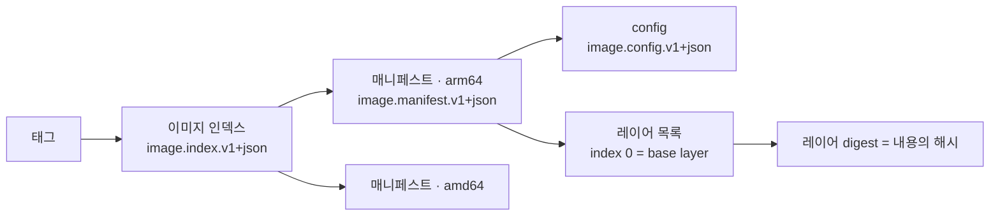
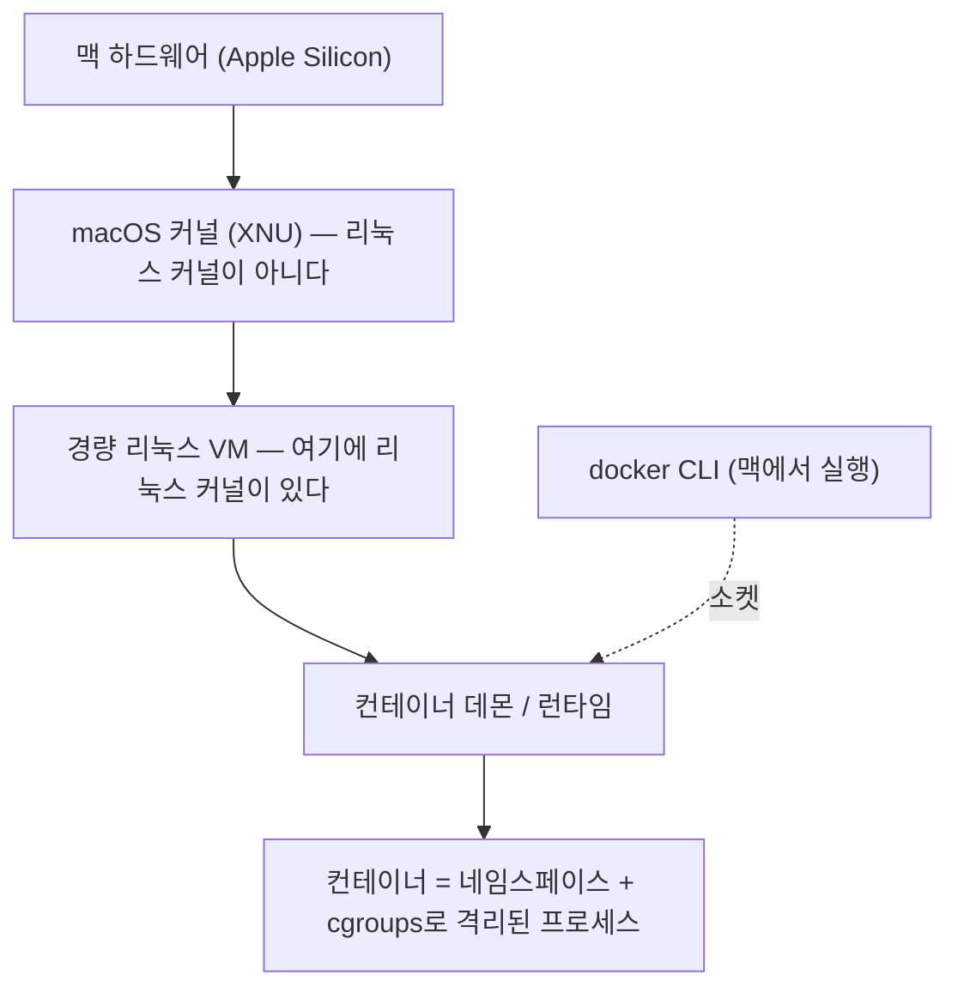

# 2장. 컨테이너는 제품이 아니라 커널 기능이다

흔히 컨테이너를 "가벼운 가상 머신"이라고 설명한다. 무겁고 느린 VM 대신 가볍고 빠른 컨테이너를 쓴다는 대비다. 입문 강의에도, 사내 기술 공유 자료에도 이 문장은 거의 빠지지 않는다.

그런데 맥에서는 이 정의가 통째로 뒤집힌다. 당신의 컨테이너는 가상 머신을 대신한 무엇이 아니다. **가상 머신 안에** 있다.

앞 장에서 늘어놓은 이상한 일들의 뿌리가 여기서 시작한다. 그렇다면 왜 하필 VM일까? 맥은 컨테이너를 그냥 돌리지 못한다는 말인가. 답을 보려면 한 계단 아래로 내려가야 한다. 컨테이너가 대체 무엇으로 만들어진 물건인지부터 살펴보자.

### 컨테이너를 만드는 두 개의 커널 기능

먼저 오해 하나를 걷어내자. 컨테이너는 누가 만들어 파는 제품이 아니다. **리눅스 커널의 두 기능에 union 파일시스템을 얹은 조합**이다. 그 두 기능이 네임스페이스와 cgroups다.

네임스페이스가 하는 일은 커널 문서가 한 문장으로 정의한다.

> "A namespace wraps a global system resource in an abstraction that makes it appear to the processes within the namespace that they have their own isolated instance of the global resource."
> — namespaces(7), Linux man-pages 6.18 (페이지 날짜 2026-02-08)

전역 자원을 감싸서, 그 안의 프로세스에게는 **자기만의 몫인 것처럼 보이게** 만든다는 뜻이다. 감싸는 대상은 여덟 가지다(man-pages 6.18 / 2026-02 기준).

| Namespace | Flag | 격리 대상 |
|---|---|---|
| Cgroup | `CLONE_NEWCGROUP` | Cgroup root directory |
| IPC | `CLONE_NEWIPC` | System V IPC, POSIX message queues |
| Network | `CLONE_NEWNET` | Network devices, stacks, ports 등 |
| Mount | `CLONE_NEWNS` | Mount points |
| PID | `CLONE_NEWPID` | Process IDs |
| Time | `CLONE_NEWTIME` | Boot and monotonic clocks |
| User | `CLONE_NEWUSER` | User and group IDs |
| UTS | `CLONE_NEWUTS` | Hostname and NIS domain name |

표만 보면 그저 목록이다. 그런데 여덟 줄을 다 외우는 대신 세 줄만 골라 프로세스 입장이 되어 보면 감이 달라진다. Mount 네임스페이스 덕분에 컨테이너 안의 프로세스는 자기가 보는 루트 디렉터리가 세상의 전부라고 믿는다. PID 네임스페이스 덕분에 자기가 1번 프로세스라고 믿는다. Network 네임스페이스 덕분에 8080 포트가 비어 있다고 믿는다. 세 가지 믿음 모두 커널이 만들어 준 것이다.

그러니 이 표는 외울 대상이 아니라 **경계의 목록**으로 읽는 편이 낫다. 컨테이너 안에서 무언가가 안 보인다면 이유는 이 여덟 줄 가운데 하나다. 그런데 더 중요한 건 목록에 **없는 것**이다. 커널이 여기 없다. 프로세스마다 자기 커널을 하나씩 갖는 게 아니라, 전부가 하나의 커널을 함께 쓴다. 그러니 이렇게 정리해두자. **컨테이너 안의 프로세스는 여전히 호스트 커널이 돌리는 그냥 프로세스다.** 다른 커널 위에서 도는 게 아니다. 이 한 문장은 곧 두 가지를 한꺼번에 설명하게 된다. 맥에 왜 VM이 필요한지, 그리고 격리가 왜 보안 경계가 아닌지.

여기까지가 "무엇이 보이는가"를 나누는 장치라면, "얼마나 쓸 수 있는가"를 나누는 장치는 따로 있다.

> "Control groups, usually referred to as cgroups, are a Linux kernel feature which allow processes to be organized into hierarchical groups whose usage of various types of resources can then be limited and monitored."
> — cgroups(7), Linux man-pages 6.18 (2026-02-08)

프로세스를 계층적인 그룹으로 묶고, 그 그룹의 자원 사용량을 제한하고 관측한다. 정의 끝에 붙은 "monitored"라는 단어도 그냥 지나치지 말자. 제한만 거는 게 아니라 **그 값을 읽을 수도 있다**는 뜻이고, 이 읽기가 나중에 자바 개발자에게 꽤 중요해진다. cgroups v2가 가진 컨트롤러는 `cpu`, `cpuset`, `freezer`, `hugetlb`, `io`, `memory`, `perf_event`, `pids`, `rdma`다. v1도 호환성 때문에 아직 남아 있는데, **v2는 v1 컨트롤러의 부분집합만 구현한 상태**라는 점은 알아두는 편이 낫다(man-pages 6.18 / 2026-02 기준).

컨테이너에 메모리 한도를 걸면 그 숫자가 실제로 적히는 곳이 바로 이 memory 컨트롤러다. 그리고 이 이름은 한참 뒤에 다시 등장한다. JVM이 컨테이너 안에서 힙 크기를 알아서 정할 때 읽는 값이 바로 이 cgroup의 memory·cpu 제한이기 때문이다. 자바 개발자에게 이 연결은 생각보다 실용적이다. 힙이 예상과 다르게 잡혔다면 JVM 옵션을 뒤지기 전에 **cgroup에 무엇이 적혀 있는지**를 먼저 물어야 한다는 뜻이니까. 그 다리는 8장에서 건너기로 하자.

한 가지 오해는 지금 지워두는 게 좋겠다. 컨테이너 기동이 굼뜨게 느껴질 때 범인으로 지목되는 게 대개 이 격리 장치들이다. 그런데 2026년에 측정된 한 프리프린트 연구(Khan, arXiv:2602.15214, **동료심사 미확인 프리프린트**)는 네임스페이스 생성 비용을 7.94ms(SSD, σ=2.05)로 재고, 이것이 전체 기동 시간의 1.5%에 미치지 못한다고 보고했다. 격리 원시요소를 최적화 타깃으로 잡으면 헛수고일 가능성이 크다는 이야기다. 기동이 느리다면 시간은 다른 데서 새고 있다.

### 태그 하나가 가리키는 것들

컨테이너가 어떻게 격리되는지는 봤다. 그렇다면 그 안에서 도는 파일들, 그러니까 이미지는 어떤 물건일까?

이미지는 파일 하나가 아니다. 여러 조각이 digest로 서로를 가리키는 **사슬**이다. 우리가 손으로 치는 것은 사슬의 맨 앞, 태그뿐이다.


그림 1. OCI 이미지 사슬 — 태그에서 레이어 digest까지

OCI 이미지 스펙이 정한 이름을 그대로 옮기면 이렇다. 매니페스트의 미디어 타입은 `application/vnd.oci.image.manifest.v1+json`이고, 그 안의 `schemaVersion`은 "MUST be `2` to ensure backward compatibility with older versions of Docker."라고 못 박혀 있다. config는 `application/vnd.oci.image.config.v1+json`, layers는 descriptor 배열이며 **인덱스 0이 base layer**이고 그 뒤로 쌓인다. 그리고 조각과 조각을 잇는 digest는 **내용에서 계산한 해시**다.

이 이름들도 외울 필요는 없다. 대신 구조 하나만 눈에 담아두자. 사슬의 각 마디는 다음 마디를 **내용의 해시로** 가리킨다. digest가 내용에서 계산된다는 말이 정확히 그 뜻이다. 내용이 한 바이트만 달라져도 digest가 달라지고, digest가 달라지면 그것을 가리키던 위쪽 마디까지 달라진다. 그래서 사슬의 아래쪽은 전부 **내용으로 고정된 이름**을 갖는다. 예외는 딱 하나, 맨 앞의 태그다. 태그는 사람이 붙인 이름표일 뿐이라 언제든 다른 곳을 가리키도록 옮길 수 있다. 이 비대칭이 나중에 9장에서 통째로 한 장의 주제가 된다.

여기서 이 책이 두고두고 쓸 조각이 하나 더 나온다. 태그와 매니페스트 사이에 **이미지 인덱스**(`application/vnd.oci.image.index.v1+json`)가 끼어들 수 있다는 것. 흔히 멀티아키 매니페스트 리스트라고 부르는 그것이다. 태그 하나가 아키텍처별 매니페스트 여러 개를 가리키는 구조라서, 같은 태그를 쓰는데도 arm64 맥과 amd64 서버가 서로 다른 이미지를 받아 갈 수 있다. 명령도 같고 태그도 같은데 결과가 갈리는 통로가 여기 하나 열려 있는 셈이다. 이 한 문장이 6장에서는 "왜 내 맥은 arm64 이미지를 만드는가"로, 9장에서는 "왜 태그를 그대로 뒀는데 내용이 바뀌는가"로 되돌아온다.

그럼 레이어는 어떻게 겹쳐질까? 커널에 있는 overlay 파일시스템이 개념적인 답을 준다. 커널 문서는 "An overlay-filesystem tries to present a filesystem which is the result of overlaying one filesystem on top of the other."라고 설명하고, 마운트 시점에 `lowerdir`과 `upperdir`이 하나의 merged 디렉터리로 합쳐진다고 적는다. 핵심은 쓰기가 일어날 때다.

> "When a file in the lower filesystem is accessed in a way that requires write-access, such as opening for write access, changing some metadata etc., the file is first copied from the lower filesystem to the upper filesystem (copy_up)."
> — Linux Kernel Documentation, Overlay Filesystem (커널 버전 마커 미확인, 2026-07-25 열람)

아래 레이어의 파일을 고치려 하면 먼저 위로 복사된다. 이것이 copy_up이다. "레이어는 겹쳐지고, 쓰려고 하면 위로 복사된다" 정도만 손에 쥐고 있어도 9장의 캐시 이야기는 충분히 따라온다. 다만 한 가지는 정직하게 밝혀두자. **Docker의 스토리지 드라이버가 정확히 이 overlayfs로 구현된다는 연결은 커널 문서가 하지 않는다.** 여기서는 개념적 대응까지만이다.

### 그래서 맥에는 VM이 있다

이제 처음의 질문으로 돌아갈 차례다. 네임스페이스도 cgroups도 리눅스 커널의 기능이다. 그런데 macOS의 커널은 XNU이고, XNU는 리눅스 커널이 아니다.

논리는 잔인할 만큼 단순하다. 리눅스 커널에만 있는 기능을 쓰려면 리눅스 커널이 있어야 한다. 없으면 어디선가 가져와야 한다.

"가져온다"는 말의 무게를 한 번 재보자. 네임스페이스는 내려받아 설치할 수 있는 라이브러리가 아니다. 프로세스가 요청하면 커널이 만들어 주는 것이고, 그 요청을 받아 주는 커널이 리눅스 커널이다. 그러니 필요한 것은 소프트웨어 한 벌이 아니라 **커널 그 자체**다. 맥의 컨테이너 도구들이 고른 길도 흉내가 아니라 진짜 리눅스 커널을 하나 띄우는 쪽이었다. 경량 리눅스 VM을 돌리고, **그 안의 리눅스 커널이 컨테이너를 만든다.**


그림 2. 맥에서 컨테이너가 놓이는 자리 — 컨테이너는 macOS 위가 아니라 리눅스 VM 안에 있다

이 그림은 이 책 전체의 지도다. 한 번 더 천천히 읽어보자. 명령을 치는 것은 맥에서 도는 CLI다. 그런데 그 명령이 만들어 내는 컨테이너는 두 칸 아래, VM 안에 있다. 즉 **"내 컴퓨터에서 컨테이너를 돌린다"는 익숙한 표현은 이미 절반쯤 어긋나 있다.** 컨테이너는 내 컴퓨터 안에 있는 또 다른 컴퓨터에서 돈다.

또 다른 컴퓨터라는 말에는 따라오는 것이 있다. 경계다. 맥에 있는 소스 코드를 컨테이너가 읽으려면 그 경계를 넘어야 한다. 컨테이너에 메모리를 주려면 VM을 거쳐야 한다. 맥의 브라우저로 컨테이너의 포트에 닿으려면 역시 경계를 넘어야 한다. 컨테이너 안의 프로세스가 쓰는 CPU도 맥이 직접 준 CPU가 아니라 VM이 다시 나눠 준 CPU다. 리눅스 서버에서라면 넷 다 아예 존재하지 않는 경계인데, 맥에서는 매번 지나가야 하는 관문이다.

관문을 지날 때마다 값이 붙는다. 그래서 우리가 실제로 치르는 비용도 이 그림대로 쪼개진다.

```
독자가 보는 비용 = [컨테이너 오버헤드] + [VM 오버헤드] + [호스트↔게스트 파일/네트워크 경계]
                    ↑ 논문들이 측정한 것    ↑ 논문들이 대부분 측정하지 않은 것
```

논문들이 잰 것은 첫 항뿐이다. 이 사실이 왜 중요할까? 리눅스에서 측정한 컨테이너 오버헤드 수치를 맥 사용자가 자기 값으로 가져오면 안 되기 때문이다. **그 값은 우리에게 관측값이 아니라 바닥값이다.** 우리가 실제로 겪는 값은 반드시 그보다 위에 있고, 얼마나 위인지는 대체로 아무도 재 주지 않았다. 이 책이 뒤에서 "직접 재보자"고 여러 번 권하게 되는 이유도 여기 있다.

그런데 우리가 놓인 이 구조를 정확히 겨눈 문장이 11년 전 논문에 이미 있다.

> "We also question the practice of deploying containers inside VMs, since this imposes the performance overheads of VMs while giving no benefit compared to deploying containers directly on non-virtualized Linux."
> — Felter et al., ISPASS 2015, p.172 (**2014년 측정**)

IBM 연구자 네 사람이 2014년에 측정하고 2015년에 발표한 논문의 마지막 대목이다. 그들이 의문을 제기한 "컨테이너를 VM 안에 넣는 관행"이, 오늘 우리 맥북에서는 관행이 아니라 유일한 선택지다. 11년 전에 비효율로 지목된 구조 위에서 우리가 매일 개발하고 있는 셈이다.

오해는 말자. 이 문장은 "맥에서 컨테이너를 쓰지 말라"는 뜻이 아니다. 저자들이 문제 삼은 것은 리눅스 서버에서 **굳이** VM을 끼우는 관행이고, 맥에서 VM은 선택이 아니라 전제다. 그들에게는 걷어낼 수 있는 층이었지만 우리에게는 걷어낼 수 없는 층이라는 차이가 있다. 그러니 우리가 할 일은 그 층을 없애는 게 아니라, 그 층이 **어디에 무엇을 만들어 내는지**를 아는 것이다.

기억해두자. **맥에서는 리눅스 VM이 끼어 있다.** 이 문장 하나가 앞으로 여러 얼굴로 되돌아온다. 파일이 느리게 읽히는 것도, 메모리 회계가 어긋나는 것도, 자바 테스트가 소켓을 못 찾는 것도, 맥에서 만든 이미지가 서버에서 안 도는 것도 전부 같은 원인의 다른 얼굴이다. 그때마다 이 그림으로 돌아오면 된다.

### 격리는 보안이 아니다

네임스페이스가 프로세스에게 "자기만의 세상"을 보여준다고 했다. 여기서 위험한 도약이 하나 일어난다. 격리돼 있으니 안전하겠지, 하는 도약이다. 정말 그것으로 충분할까?

앞에서 붙잡아둔 문장을 여기서 쓸 차례다. 컨테이너 안의 프로세스는 호스트 커널이 돌리는 그냥 프로세스이고, 커널은 네임스페이스 목록에 없다. 그러니 남이 만든 이미지를 받아 돌린다는 건 **남이 쓴 코드를 내 커널 위에서 돌린다**는 뜻이기도 하다. 학계는 이 지점을 정면으로 측정했다.

> "We find the kernel security mechanisms such as Capability, Seccomp, and MAC play a more important role in preventing privilege escalation than the container isolation mechanisms (i.e., Namespace and Cgroup)."
> — Lin et al., ACSAC '18 (2018년 측정, Docker 17.09.1-ce 기준)

실제로 동작하는 익스플로잇 223건을 모아 대표 88건으로 측정한 연구다. 결론은 권한 상승을 막는 데 격리 기제(네임스페이스·cgroup)보다 Capability·Seccomp·MAC 같은 커널 보안 기제가 더 크게 기여한다는 것이다. 저자들은 이 기제들이 서로 의존하는 탓에 가장 약한 고리가 전체 방어력을 결정하는 "short board effect"에 빠질 수 있다고도 지적한다.

수치도 있긴 하다. 2018년 당시 Docker 17.09.1-ce와 취약 커널 조합이라는 조건에서, 88건 중 50건(56.82%)이 기본 설정 컨테이너 안에서 공격에 성공했고 11건은 격리를 뚫고 권한 상승까지 갔다. 다만 이 숫자를 오늘의 성공률로 읽으면 곤란하다. 패치된 커널의 값이 아니다. 여기서 가져올 것은 수치가 아니라 구조적 결론 쪽이다. 그 결론을 실무의 말로 옮기면 이렇게 된다. **컨테이너를 썼다는 사실 자체는 방어 항목이 아니다.** 방어는 그 위에 무엇을 얹었느냐가 한다.

업계는 이 문제에 어떻게 답했을까? AWS 엔지니어들이 쓴 Firecracker 논문의 초록이 그 답을 그대로 적어 놓았다.

> "The traditional view is that there is a choice between virtualization with strong security and high overhead, and container technologies with weaker security and minimal overhead. This tradeoff is unacceptable to public infrastructure providers, who need both strong security and minimal overhead."
> — Agache et al., NSDI '20 Abstract

공개 인프라 제공자에게 이 트레이드오프는 받아들일 수 없는 것이었다. 그래서 그들은 컨테이너 격리에 기대는 대신 Rust로 최소 VMM을 새로 썼다. 2020년 발표 시점 기준으로 내건 설계 목표치는 컨테이너당 메모리 오버헤드 5MB 미만, 애플리케이션 코드까지 부팅 125ms 미만, 호스트당 초당 최대 150개 MicroVM 생성이었다. 눈여겨볼 것은 그들이 고른 방향이다. 컨테이너를 더 단단히 조이는 쪽이 아니라 VM을 더 가볍게 만드는 쪽으로 갔다. 남의 코드를 대규모로 돌려야 하는 자리에서 업계가 내린 판단이 그쪽이었다는 사실은, 그 자체로 하나의 정보다.

그러니 "컨테이너는 안전하다" 또는 "위험하다"로 한 줄 정리하는 것은 피하자. 근거가 지지하는 문장은 이쪽이다. **네임스페이스와 cgroups는 격리를 위한 장치이지, 보안 경계로 설계된 물건이 아니다.** 이 구분을 갖고 있으면 출처를 모르는 이미지를 손쉽게 `docker run` 해 보기 전에 한 번은 멈추게 된다.

이 장의 제목을 한 번 더 시험해보자. 컨테이너가 제품이 아니라 표준과 커널 기능의 조합이라면, "Docker가 쿠버네티스에서 빠졌다"던 그 소동은 대체 무엇이었을까? 쿠버네티스 공식 블로그가 2022년 2월에 직접 답했다. "Yes, the images produced from `docker build` will work with all CRI implementations. **All your existing images will still work exactly the same.**"

빠진 것은 이미지가 아니라, 쿠버네티스가 Docker Engine과 대화하려고 임시로 끼워 두었던 어댑터(dockershim)다. 그 제거는 Kubernetes 1.24에서 일어났다(2022년 발표 기준). 이미지 포맷은 처음부터 OCI 표준이었기에 아래쪽 런타임을 갈아 끼워도 위쪽 이미지는 그대로 돌았다. 한 회사의 제품이었다면 벌어질 수 없는 일이다. 이 이야기는 11장에서 다시 만나게 된다.

오늘 챙겨 갈 문장은 하나로 충분하다. 컨테이너는 리눅스 커널의 기능이고, 맥에는 리눅스 커널이 없어서 VM이 끼어 있다.

그런데 그 VM은 누가 띄우고, 누가 관리할까?
