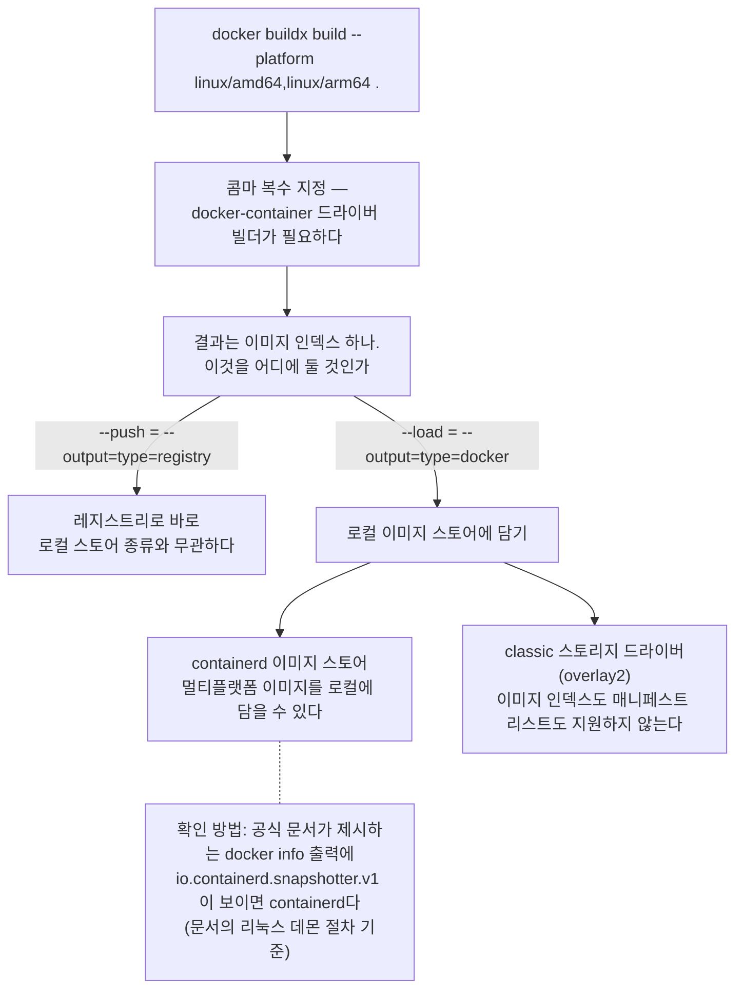

# 6장. 같은 명령, 다른 결과 — arm64와 amd64

앞 장에서 우리는 "어느 데몬에 붙는가"를 물었다. 그 질문에 답하고 나면 마음이 조금 놓인다. 적어도 내가 친 명령이 어디로 가는지는 알게 됐으니까.

그런데 그 데몬은 어디서 도는가. 2장의 계층도에 답이 이미 그려져 있다. 맥에는 리눅스 커널이 없어서 리눅스 VM이 끼어 있고, 데몬은 그 VM 안에서 돈다. 그리고 그 VM 안의 커널은 **arm64**다. 이 책을 쓴 맥에서 데몬의 아키텍처를 물어보면 `aarch64`가 돌아온다 — arm64의 다른 이름이다.

문제는 이 사실이 조용히 만들어내는 결과다. 아무 설정 없이 이미지를 만들면 그 이미지는 arm64가 된다. 2장에서 "6장에서 다시 만나게 된다"며 미뤄뒀던 질문의 답이 이것이다. 왜 내 맥은 arm64 이미지를 만드는가? 만드는 주체가 arm64 커널 위에 앉은 데몬이기 때문이다.

그리고 여기서 이 책에서 가장 값비싼 문장이 나온다. **맥에서는 그 이미지가 아무 경고 없이 그냥 잘 돌아간다.** 배포 대상이 amd64라면 거기서는 즉시 죽는데도 말이다. 신호가 늦게 오는 게 아니라 아예 오지 않는다. 잘못된 물건을 만들었다는 사실이 만든 자리에서는 드러나지 않고, 배포 시점까지 통째로 미뤄진다. 1장의 "아는 사람에게는 3초, 모르는 사람에게는 며칠"이 가장 잔인하게 작동하는 자리가 여기다.

### 하나의 원인, 다섯 개의 얼굴

이 문제를 진단하기 어렵게 만드는 건 원인의 복잡함이 아니다. 오히려 반대다. 원인은 "이 바이너리는 이 CPU의 것이 아니다" 하나뿐인데, **얼굴이 다섯 개다.**

| # | 실제로 보게 되는 메시지 | 무슨 일이 벌어진 것인가 | 출처 / 시점 |
|---|------------|------|------------|
| ① | `exec /entrypoint.sh: exec format error` | 커널이 바이너리 헤더를 거부 | docker/for-mac#7849 / 2026-02 |
| ② | `exec /bin/sh: exec format error` (busybox조차) | 동일 — 문제 범위가 "내 이미지"가 아님을 증명 | 위 이슈 댓글 / 2026-02 |
| ③ | `exec /cnb/process/web: exec format error` | 빌드팩이 만든 런치 프로세스가 거부됨 | paketo/spring-boot#491 / 2024-06 |
| ④ | `fork/exec .../ca-certificates-helper: exec format error` | **헬퍼 스크립트만** 실패. 나머지 레이어는 멀쩡 | 위 이슈 / 2024-06 |
| ⑤ | `qemu: uncaught target signal 11 (Segmentation fault) - core dumped` | 에뮬레이션이 시작은 됐는데 도중에 죽음 | docker/for-mac#7172 / 2024-02 |

다섯 줄을 한 덩어리로 읽으면 곤란하다. ⑤는 `exec format error`가 아니다. ①~④는 실행 자체가 거부된 경우이고, ⑤는 QEMU가 amd64 바이너리를 돌리다 중간에 죽은 경우다. 원인도 진단 경로도 다르다. "`exec format error`가 세그폴트로 나타나기도 한다"고 외워두면 틀린다. 정확한 문장은 이쪽이다 — **에뮬레이션 실패는 `exec format error`가 아닌 형태로도 나타난다.**

⑤가 특히 잔인한 이유는 따로 있다. 아키텍처 문제인데, **에러 메시지에 아키텍처라는 단어가 한 번도 안 나온다.** `qemu`, `signal 11`, `core dumped`. 이 세 단어를 그대로 검색창에 넣으면 메모리나 네이티브 라이브러리 문제로 안내하는 글들이 먼저 나온다. 아키텍처를 의심조차 하지 않은 채 며칠을 태우기 딱 좋은 조합이다.

④도 만만치 않게 얄궂다. 이미지 전체가 아니라 헬퍼 스크립트 하나만 남의 아키텍처인 상태다. 고친 것과 실제로 쓰인 것이 다를 수 있다는 신호인데, 그 정체는 이 장 끝에서 이야기하자.

그렇다면 이 다섯 얼굴을 만났을 때 무엇부터 해야 할까? Docker 모더레이터 `thaJeztah`가 실제 이슈에서 쓴 진단 절차가 그대로 답이 된다. **세상에서 가장 단순한 이미지로 범위를 좁히는 것**이다.

```bash
docker run -it --rm --platform=linux/amd64 busybox
```

busybox는 아무것도 안 든 이미지다. 이것조차 `exec format error`로 죽는다면 문제는 내 Dockerfile도 내 애플리케이션도 아니다. **에뮬레이션 계층 자체가 안 되고 있는 것이다.** 반대로 busybox는 잘 뜨는데 내 이미지만 죽는다면 범위는 내가 만든 것 안으로 좁혀진다. 명령 한 줄로 용의자가 절반으로 잘린다. 같은 이슈에는 `binfmt_misc` 등록 상태를 확인해보라는 다음 단계 제안도 달려 있지만, 그건 메인테이너의 가설이고 해당 이슈는 재현 불가로 종결됐다. 가설까지로만 받아두자.

한 가지는 정직하게 밝혀둔다. 이 책은 `exec format error`라는 문자열을 정면으로 설명하는 Docker 공식 페이지를 **확인한 페이지들에서는 찾지 못했다.** 없다고 단정하는 게 아니라 찾지 못했다는 뜻이다. 그래서 원인은 공식 문서가 명확히 말하는 다른 조각들로 재구성한다. 컨테이너 안의 프로세스는 호스트 커널이 돌리는 그냥 프로세스라고 2장에서 봤다. 그러니 그 안의 코드는 호스트 CPU와 호환돼야 한다. 에뮬레이션 없이 arm64 커널 위에서 amd64 바이너리를 실행하려 들면 커널은 그 헤더를 거부한다. ①~④의 정체다.

### 같은 경고, 정반대 두 방향

앞의 다섯은 이미 죽은 뒤의 얼굴이다. 그런데 죽기 전에 보내는 신호가 하나 있다. 하나의 경고 템플릿이다.

```
WARNING: The requested image's platform ({이미지}) does not match the detected host platform ({호스트})
```

이 경고를 한 번도 안 본 개발자는 드물다. 그리고 대부분은 무시한다. 무시해도 컨테이너가 뜨기 때문이다. 함정은 여기 있다. **이 경고는 방향이 두 가지인데, 원인 주체가 서로 다르다.**

| 방향 | 어디서 터졌나 | 원인을 결정한 주체 |
|------|--------------|----------|
| **amd64 이미지 → arm64 호스트** | 맥에서는 경고만 뜨고 돌아감. 죽은 곳은 arm64 클라우드 VM | **빌드 도구가 결정** — 빌드팩이 amd64를 만들었다 |
| **arm64 이미지 → amd64 서버** | 맥에서 빌드해 올린 뒤 배포 시점에 처음 발견 | **호스트가 결정** — 맥이 arm64니까 |

첫 번째 방향은 2024년 6월 Paketo 빌드팩 이슈(`paketo-buildpacks/spring-boot#491`)에서 나왔다. M1 맥에서 `bootBuildImage`로 만든 이미지가 **amd64**였다. 내 맥이 arm64인데 나온 이미지는 amd64였다는 것 — 직관이 거꾸로 배신하는 경우다. 여기서 놓치기 쉬운 대목이 있다. 맥도 arm64였고 배포 대상인 클라우드 VM도 arm64였는데, 맥에서는 경고만 뜬 채 돌았고 그 VM에서는 죽었다. 같은 불일치를 한쪽은 넘어가 주고 다른 쪽은 넘어가 주지 않은 것이다. 왜 빌드팩이 amd64를 만들었는지는 7장에서 도구별로 파헤친다.

두 번째 방향이 훨씬 흔하고, 한국어로 남은 기록도 있다. 2022년 11월 velog에 올라온 글(`@atoye1`)인데, **Node.js 앱이고 2022년의 이야기**라는 점은 먼저 밝혀두자. 자바가 아니다. 그럼에도 이 글을 여기 두는 이유는 증상이 아니라 **진단 경로** 때문이다.

> "하면 깔끔하게 성공되어야 하는데 도무지 도커 컨테이너가 실행 안되는거다. 당시에는 앱서비스 메뉴 중 어디에서 로그를 봐야하는지도 몰랐어서 무작정 1~3 과정을 반복하고, 좌절하고 스트레스만 쌓고 있었다."

여기서 이 사람이 무엇을 바꿨는지가 핵심이다. 증상을 더 노려본 게 아니라 **에러 메시지가 보이는 자리로 옮겨 갔다.**

> "다음날 다시 시도해보기로 했다. 이번에는 VM에 직접 배포하는 방식으로 시도했다. 콘솔에 명령어를 직접 입력해서 직접 에러메시지를 확인할 수 있으니 이 편이 더 디버깅하기 쉽다고 생각했기 때문이다."

그렇게 콘솔에서 직접 띄우자 그 경고 한 줄이 드디어 눈앞에 나타났고, 이틀간의 삽질이 그 자리에서 끝났다. 관리형 서비스의 매끈한 대시보드가 오히려 진단을 가로막고 있었던 셈이다. **원인을 못 찾는 게 아니라 메시지를 못 보고 있는 것 아닌가**를 먼저 의심하자.

두 방향의 공통 패턴은 한 줄로 요약된다. 맥에서는 경고만 뜨고 돌아간다 → 무시한다 → 배포 대상에서 처음 죽는다. "로컬에서는 잘 됐는데요"의 컨테이너판이다. 차이는 처방이다. 첫 번째 방향은 빌드 도구의 플랫폼 설정을 봐야 하고, 두 번째 방향은 애초에 두 아키텍처를 다 만들어 두었어야 한다.

### 어떻게 만들 것인가 — 멀티플랫폼 세 전략

그러면 amd64와 arm64를 다 담은 이미지는 어떻게 만들까? 공식 문서가 제시하는 길은 셋이다.

1. QEMU 에뮬레이션을 쓴다 — "Using emulation, via QEMU"
2. 네이티브 노드를 여러 개 둔 빌더를 쓴다 — "Use a builder with multiple native nodes"
3. 멀티스테이지 빌드로 크로스 컴파일한다 — "Use cross-compilation with multi-stage builds"

셋 중 손이 가장 덜 가는 것도 1번이고, 자바 개발자에게 가장 아픈 것도 1번이다. 문서가 직접 경고한다.

> "Emulation with QEMU can be much slower than native builds, especially for compute-heavy tasks like compilation and compression or decompression."

컴파일처럼 계산이 몰리는 작업에서 특히 느려진다는 것인데, **자바 빌드가 정확히 그 범주다.** 소스를 컴파일하고, 의존성을 풀고, 레이어를 압축한다. 에뮬레이션이 가장 싫어하는 일만 골라서 한다. 3장에서 본 그 밤샘 빌드 이야기의 구조적 이유가 여기 있다. QEMU는 "일단 되게 만드는" 길이지 "일하게 만드는" 길은 아닌 셈이다.

명령 형태 자체는 단순하다.

```console
$ docker buildx build --platform linux/amd64,linux/arm64 .
```

콤마 하나로 플랫폼을 여러 개 적었다. 이 콤마가 조건을 하나 부른다. 복수 플랫폼 지정은 `docker-container` 드라이버 빌더를 쓸 때 가능하고, 그 결과로 나오는 것이 모든 플랫폼에 대한 **이미지 인덱스**다. 2장에서 태그와 매니페스트 사이에 끼어든다고 본 그것이다. 문서와 커뮤니티는 이걸 흔히 "매니페스트 리스트"라고 부른다. 태그 하나가 아키텍처별 매니페스트 여러 개를 가리키게 된다. 태그 하나가 고정된 이미지 하나를 가리키지 않는다는 이 성질은 9장에서 훨씬 불편한 얼굴로 되돌아온다.

만들고 나면 곧바로 걸려 넘어지는 함정이 있다. 분명 빌드는 성공했는데 `docker images`에 아무것도 없는 것이다. 문서에 답이 있다.

> "Builds with the `docker-container` driver aren't automatically loaded to your Docker Engine image store."

결과물을 어디로 보낼지 직접 말해줘야 한다는 뜻이다. 그 지시가 `--load`와 `--push`이고, 둘 다 실은 축약형이다. `--load`는 "Shorthand for `--output=type=docker`", `--push`는 "Shorthand for `--output=type=registry`". 각각 로컬 이미지 스토어로, 레지스트리로 보내라는 뜻이다. 이름만 보면 대칭인 두 옵션 같은데, 이 둘 사이에는 대칭이 아닌 것이 하나 숨어 있다.

### 어디에 담을 것인가 — 이미지 스토어가 결정한다

인터넷에서 가장 자주 보게 되는 규칙이 하나 있다. **"멀티플랫폼 이미지는 `--load` 못 한다. `--push`만 된다."** 짧고 외우기 좋아 잘 퍼진다. 다만 이 문장을 절대 규칙으로 받아들이면 이 책 독자 상당수에게는 틀린 지시가 된다. 실제로 Docker 문서 두 곳은 정면으로 충돌하는 것처럼 보인다.

> (A) "The default image store in Docker Engine doesn't support loading multi-platform images." — buildx build CLI 레퍼런스
>
> (B) "Docker Desktop and Docker Engine 29.0+ use the containerd image store by default, which supports multi-platform images out of the box." — 멀티플랫폼 문서

한쪽은 안 된다고 하고 다른 쪽은 기본으로 된다고 한다. 어느 쪽을 믿어야 할까? 답은 세 번째 문서에 있었다. **모순이 아니라 이미지 스토어의 세대가 다르다.** (A)의 "default image store"는 containerd 전환 이전 세대, 즉 classic 스토리지 드라이버(overlay2)를 가리킨다. 그 classic 스토어에는 이런 규정이 붙어 있다.

> "It doesn't support image indices or manifest lists, so you can't load multi-platform images locally or build images with attestations."

이미지 인덱스도 매니페스트 리스트도 지원하지 않으니 멀티플랫폼 이미지를 로컬에 담을 수 없다. 정확한 문장은 "멀티플랫폼은 `--load` 못 한다"가 아니라 **"classic 스토어면 못 담고, containerd 스토어면 담을 수 있다"**이다. 조건부 규칙이지 무조건 규칙이 아니다.


그림 1. 멀티아키 빌드의 갈림길 — 출력 경로를 정하고 나면, 로컬에 담을 수 있는지는 이미지 스토어가 결정한다

그럼 내 맥은 어느 쪽일까? 좋은 소식부터 말하자면, **맥에서 Docker Desktop을 쓰는 이 책의 독자는 대체로 담을 수 있는 쪽이다.** 공식 문서 축자가 그렇게 말한다(아래 인용은 모두 2026년 7월 26일 조회 기준).

> "Docker Desktop uses containerd as its image store by default."
>
> "The containerd image store is enabled by default in Docker Desktop version 4.34 and later."

여기서 숫자 하나를 조심하자. 앞의 (B)에는 "Docker Engine 29.0+", 방금은 "Docker Desktop version 4.34". 한참 떨어진 두 숫자라 어느 하나가 오타 같지만, **둘 다 원문 그대로이고 모순도 아니다. 제품 라인이 다르다.** Docker Desktop은 Docker Engine을 번들해 파는 별개 제품이라 자기만의 버전 번호를 갖는다. 그래서 이 책은 어느 제품의 버전인지를 매번 함께 적는다. "도커는 4.34부터 containerd가 기본"이라고 뭉뚱그리면 틀린 문장이 된다.

Engine 쪽 문장에는 더 중요한 조건이 하나 더 붙어 있다.

> "The containerd image store is the default storage backend for Docker Engine 29.0 and later on fresh installations. If you upgraded from an earlier version, your daemon continues using the legacy graph drivers (overlay2) until you enable the containerd image store."

**신규 설치일 때만 기본값이라는 것.** 예전 버전에서 올려 쓴 데몬은 직접 켜기 전까지 overlay2를 계속 쓴다. 리눅스 빌드 서버를 몇 년째 업그레이드해 가며 굴리고 있다면 여기에 해당할 가능성이 높다. 인터넷의 그 짧은 규칙이 왜 그렇게 널리 퍼졌는지도 이걸로 설명된다. 어제 산 맥에서는 틀린 규칙이지만, 3년째 굴리는 빌드 서버에서는 맞는 규칙이다.

그러니 외우는 대신 확인하자. 공식 문서가 containerd 이미지 스토어를 쓰고 있는지 확인하는 방법으로 제시하는 명령은 이것이다.

```console
$ docker info -f '{{ .DriverStatus }}'
[[driver-type io.containerd.snapshotter.v1]]
```

이 명령의 사용법은 정확히 못 박아 두자. **`io.containerd.snapshotter.v1`이 보이면 containerd 스토어다.** 딱 이 방향으로만 읽는다. 반대로 "안 보이면 classic이다"라고 단정하지는 말자 — classic일 때 이 자리에 무엇이 찍히는지는 확인한 페이지에 나와 있지 않았다. 게다가 이 명령은 문서의 리눅스 데몬 설정 절차 안에 실려 있어서, macOS에서 똑같은 출력이 나온다고 문서가 말해주지도 않는다. 그러니 값을 외우려 말고 지금 맥을 열어 직접 쳐 보자. 확인하는 법을 아는 것이 값을 아는 것보다 오래간다.

Docker Desktop에서는 이 스토어를 화면에서 껐다 켤 수 있다. **Settings → General 탭 → "Use containerd for pulling and storing images" → Apply** 순서다. 다만 함정 하나는 알아두자. 두 스토어는 서로 다른 저장소를 쓰기 때문에, 전환하면 반대편 스토어의 이미지와 컨테이너는 디스크에 남아 있되 보이지 않게 된다. 사라진 게 아니라 숨은 것이니 아찔해할 필요는 없다. 참고로 containerd 스토어는 같은 이미지에 디스크를 더 쓴다 — 압축본과 비압축본을 둘 다 보관하기 때문이다.

마지막으로 경험칙 하나. 같은 코드를 두고 **동료의 맥에서는 되는데 내 맥에서만 안 된다면, 이 체크박스부터 비교해보자.** Spring Boot 쪽에 그런 보고가 있다. 2025년 10월 M1 사용자 `hojooo`가 토글을 켠 상태에서는 유사한 문제가 재현되고 끈 상태에서는 재현되지 않는다고 적었고, 2025년 11월 Spring Boot 커미터 `philwebb`도 on/off를 나눠 검증했다. 왜 그런 일이 벌어지는지는 7장에서 자바 빌드 도구와 함께 뜯어본다.

### 내 이미지가 무슨 아키텍처인지 확인하는 유일한 방법

여기까지 오면 남는 질문은 하나다. 만든 이미지가 정말 내가 의도한 플랫폼들을 담고 있을까? 빌드 로그가 성공이라고 말해주는 것과, 그 태그가 실제로 가리키는 것은 다르다. 이 책이 가르치는 확인 명령은 하나다.

```console
$ docker buildx imagetools inspect moby/buildkit:master --format "{{.Manifest}}"
$ docker buildx imagetools inspect --raw moby/buildkit:master | jq
```

`docker buildx imagetools inspect`의 설명은 "Show details of an image in the registry"다. 레지스트리에 있는 이미지의 상세를 보여준다는 뜻이니, 올린 뒤에 확인하는 데 쓰기 좋다. `--format`의 기본값이 `{{.Manifest}}`이고, `--raw`는 "Show original, unformatted JSON manifest" — 가공하지 않은 원본 JSON을 그대로 보여준다. 이미지 인덱스를 만들었다면 그 안에 플랫폼별 항목이 나열돼 보인다.

"유일한 방법"이라는 말은 세상에 다른 길이 없다는 뜻이 아니라, **이 책이 이 하나만 가르친다**는 뜻이다. 이미지의 OS와 아키텍처를 뽑아준다는 다른 명령들이 인터넷에 돌아다니지만, 이번 리서치에서 공식 문서로 확인하지 못했다. 확인하지 못한 것을 가르치지 않는다는 1장의 약속이 여기에도 적용된다. 대신 이 한 줄을 습관으로 만들면 이 장 전체가 예방으로 바뀐다. 태그를 올린 직후에 한 번 쳐 보는 것, 그게 배포 전 마지막 관문이다.

끝으로 아까 미뤄둔 얄궂음을 정리하자. **아키텍처를 제대로 고쳤는데도 같은 에러가 또 나온다면, 캐시를 의심하는 편이 낫다.** Paketo 메인테이너 `dmikusa`는 2024년 6월에 "just delete your existing app images and the build cache"라고 처방하면서 "or you can change the image name, that will trigger a fresh build too"라는 우회도 알려줬다. 흥미로운 것은 1년 넘게 지난 2025년 9월, 전혀 다른 사람이 같은 진단에 도달해 빌드가 "contaminated" 상태로 보였다고 적었다는 점이다. 앞서 본 ④번 증상이 정확히 그 얼굴이다. 고친 것과 실제로 쓰인 것이 다를 수 있다는 이 성질은 9장에서 캐시 규칙과 함께 제대로 다룬다.

이 장을 한 문장으로 줄이면 이렇다. **맥은 arm64 이미지를 만들고, 맥에서는 그게 문제로 보이지 않는다.** 그래서 처방도 하나다. 만들 때 대상 플랫폼을 명시하고, 올린 뒤에 무엇이 올라갔는지 확인한다.

지금까지 우리가 손에 쥔 건 `docker buildx build` 하나뿐이다. 자바 개발자의 손에는 도구가 더 있다. `bootBuildImage`도 있고, Dockerfile을 아예 안 쓰는 길도 있다. 그 도구들이 지금 이야기한 멀티플랫폼을 똑같이 해내는지는 각각 사정이 다르다.
