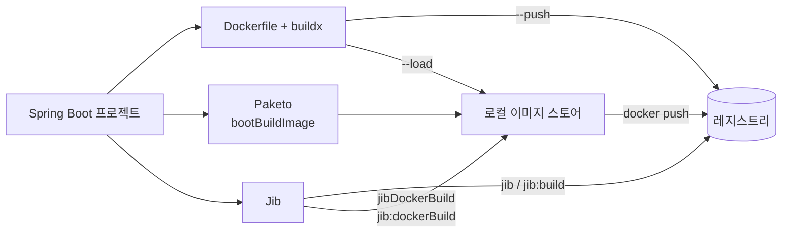

# 7장. Spring Boot 앱을 이미지로 만드는 세 갈래

빌드팩을 소개하는 문장은 대체로 이렇게 시작한다. "Dockerfile을 쓰지 않아도 된다. 설정 없이 이미지가 나온다." `./gradlew bootBuildImage` 한 줄이면 정말로 이미지가 만들어지니 과장도 아니다.

그런데 arm64 맥에서는 바로 그 약속이 먼저 깨진다. 설정 없이 나온 그 이미지가 **무슨 아키텍처인지**를 설정 없이는 고를 수 없기 때문이다. 손이 덜 가는 대신 통제권을 내준 셈인데, 하필 그 통제권이 가장 필요한 지점이 아키텍처였다.

하나 더. 이 선택은 오랫동안 "빌드팩이냐 Dockerfile이냐"라는 2파전으로 이야기돼 왔다. 사실은 3파전이다. 세 번째 갈래는 Dockerfile을 쓰지 않으면서도 멀티아키 문제를 푼다. 표부터 보자.

### 세 갈래 비교표


그림 1. 세 경로가 각각 어디를 거쳐 레지스트리에 닿는가

| | **Dockerfile + buildx** | **Paketo** (`bootBuildImage`) | **Jib** |
|---|---|---|---|
| **1회 빌드로 멀티아키 출력** | ✅ 가능 — `--platform linux/amd64,linux/arm64` (`docker-container` 드라이버 필요) | ❌ **불가** — `imagePlatform`이 단일 값 | ✅ 가능 — `platforms`에 복수 지정 시 매니페스트 리스트 push (**incubating**) |
| **그 경로의 제약** | 로컬에 담을 수 있는지가 이미지 스토어 종류에 따라 갈린다 (6장) | 아키텍처별로 따로 빌드한 뒤 `docker manifest`로 합성해야 한다 | **레지스트리 push 전용** — `jibDockerBuild`·`jib:dockerBuild`·`jibBuildTar` 경로에서는 안 된다. **OCI image index 미지원**, **크로스 컴파일 미지원**, architecture·os만 지원(variant 미지원) |
| **베이스 이미지** | 직접 `FROM`으로 지정 | 빌더가 결정 (`paketobuildpacks/builder-noble-java-tiny:latest`) | 기본값 `eclipse-temurin:{ver}-jre` |
| **Docker 데몬** | 필요 | 필요 | `jib`·`jib:build`는 레지스트리로 직행, `jibDockerBuild`·`jib:dockerBuild`는 데몬 사용 |
| **`FROM` 고민** | 있다 | 없다 | 없다 (기본값 자동) |

가장 자주 의심받는 칸이 "Paketo ❌"다. 근거를 그 자리에 붙여둔다(전부 2026년 7월 검색 기준). 첫째, `pack build` CLI 레퍼런스의 플래그 타입이 `--platform string`, 즉 **단수**다. 같은 표의 `-t, --tag strings`·`-b, --buildpack strings`·`--pre-buildpack stringArray`와 나란히 놓으면 차이가 분명한데, 이 표기는 플래그 정의에서 기계적으로 생성되는 것이라 표현 실수일 여지가 거의 없다. 둘째, CNB 문서가 직접 말한다 — "We do not currently support building an app image for one architecture on a different architecture."(우리는 현재 한 아키텍처에서 다른 아키텍처용 앱 이미지를 빌드하는 것을 지원하지 않는다.) 셋째, Spring Boot의 Gradle·Maven 플러그인 레퍼런스가 글자 단위로 같은 문구로 `imagePlatform`을 `OS[/architecture[/variant]]` **단일 값**으로 정의한다. 넷째, CNB RFC 0128이 스스로 범위를 빌더·빌드팩 패키징으로 한정한다. 그래서 "CNB가 멀티아키를 지원한다"는 말은 패키징 이야기이지, 앱 이미지를 한 번에 두 아키텍처로 빌드한다는 뜻이 아니다 — 이 구분을 놓치면 위 결론이 CNB 자기 문서와 모순되는 것처럼 읽힌다.

Jib 쪽에는 나란히 읽으면 충돌처럼 보이는 두 문장이 있다. 공식 FAQ는 이렇게 말한다.

> "When multiple platforms are specified, **Jib creates and pushes a manifest list (also known as a fat manifest)** after building and pushing all the images for the specified platforms."
> (여러 플랫폼을 지정하면, Jib은 지정된 플랫폼들의 이미지를 모두 빌드해 push한 뒤 매니페스트 리스트를 만들어 push한다.)

여기서 말하는 "manifest list"는 2장에서 본 **이미지 인덱스**와 같은 층이다. 한편 같은 문서는 제약으로 **크로스 컴파일 미지원**을 든다. 매니페스트 리스트를 만든다면서 크로스 컴파일은 안 된다니 모순처럼 들리지 않는가? 모순이 아니다. 앞은 **출력 이미지의 형태**이고, 뒤는 플랫폼별 네이티브 바이너리가 필요할 때 Jib이 그것까지 만들어주지는 않는다는 이야기다. 층이 다르다. 버전을 부를 때도 주의하자 — `jib-maven-plugin` 3.5.2와 `jib-gradle-plugin` 3.5.4처럼 플러그인별로 따로 매겨진다(2026년 7월 조회 기준).

### `bootBuildImage`가 arm64를 만드는 2단계 이유

맥에서 `bootBuildImage`를 그냥 돌리면 arm64 이미지가 나온다. 널리 알려진 사실인데, 왜 그런지를 공식 문서 한 줄로 가리키기는 의외로 어렵다. 근거가 두 단계로 나뉘어 있어서다.

첫 단계는 플랫폼 기본값이다. Spring Boot 플러그인 레퍼런스(문서 표기 4.1.0, 2026년 7월 렌더 기준)의 `imagePlatform` 설명은 이렇다.

> "The platform (operating system and architecture) of any builder, run, and buildpack images that are pulled."
> (pull되는 빌더·run·빌드팩 이미지의 플랫폼(운영체제와 아키텍처).)

> "**No default value, indicating that the platform of the host machine should be used.**"
> (기본값 없음. 호스트 머신의 플랫폼을 사용한다는 뜻이다.)

여기서 조심하자. 이 문장이 직접 말하는 것은 **pull해 오는 빌더·run·빌드팩 이미지의 플랫폼**이지 결과 이미지가 아니다. "공식 문서에 결과 이미지가 arm64라고 적혀 있다"고 옮기면 문서가 하지 않은 말을 하는 셈이 된다.

그래서 두 번째 단계가 필요하다. 그 빌더 이미지가 정말 arm64 매니페스트를 퍼블리시하고 있는가? 레지스트리에 직접 물어보면 된다.

```console
$ docker buildx imagetools inspect paketobuildpacks/builder-noble-java-tiny:latest --raw
{"schemaVersion":2,"mediaType":"application/vnd.oci.image.index.v1+json","manifests":[
 {..., "platform":{"architecture":"amd64","os":"linux"}},
 {..., "platform":{"architecture":"arm64","os":"linux"}}]}
```

2026년 7월 25일 조회 시점에 Spring Boot 기본 빌더인 `paketobuildpacks/builder-noble-java-tiny:latest`와 그 짝인 `paketobuildpacks/run-noble-tiny:latest` 모두 linux/amd64와 linux/arm64 두 매니페스트를 담고 있었다. 두 단계를 이으면 결론이 선다. 호스트가 arm64 맥이니 arm64 쪽 빌더가 당겨지고, 그 위에서 만들어진 이미지가 arm64가 된다.

옵션 자체에도 시점이 있다. `imagePlatform` 도입은 **3.4.0부터**다(Maven 플러그인 파라미터 상세에 명시). 그 아래 버전이라면 옵션을 찾을 게 아니라 프로젝트의 Spring Boot 버전부터 확인하는 편이 빠르다.

### 기본으로 켜져 있는 그 스토어가 빌드를 깨뜨릴 때

앞 장에서 "동료와 결과가 다르면 이 체크박스부터 비교하라"는 경험칙을 얻어 왔다. 그 체크박스가 왜 결과를 바꾸는지, 이제 메커니즘을 볼 차례다. 무대는 GitHub 이슈 spring-boot#46674("Image building may fail when specifying a platform if an image has already been built with a different platform", 2025년 8월 5일 등록, **CLOSED** — PR #47292로 대체됨)이고, 컨트리뷰터 `hojooo`의 분석이 정확하다.

> * "With the containerd image store, a tag like `builder-noble-java-tiny:latest` is kept as a multi-platform index (manifest list) locally."
>   (containerd 이미지 스토어에서는 `builder-noble-java-tiny:latest` 같은 태그가 로컬에 멀티플랫폼 인덱스(매니페스트 리스트)로 보관된다.)
> * "`DockerApi` still inspects images using API v1.41, where `GET /images/{name}/json` does not support selecting a platform. In this case the daemon resolves the index using the host default platform (on Apple Silicon -> `linux/arm64`)."
>   (`DockerApi`는 여전히 API v1.41로 이미지를 inspect하는데, 거기서는 `GET /images/{name}/json`이 플랫폼 선택을 지원하지 않는다. 그래서 데몬은 호스트 기본 플랫폼으로 인덱스를 해석한다 — Apple Silicon에서는 `linux/arm64`다.)

요컨대 스토어가 인덱스로 보관하는데, 플러그인이 쓰는 **API v1.41**로는 그 인덱스에서 플랫폼을 골라낼 수가 없다. 2장의 그 인덱스가 이번엔 내 맥 안에 앉아 있는 셈이다. 그래서 데몬이 호스트 기본 플랫폼인 arm64를 대신 고르는데, 빌드는 `imagePlatform = "linux/amd64"`를 요구하고 있다.

보고자가 제시한 임시 우회는 둘이다. `DOCKER_DEFAULT_PLATFORM=linux/amd64`를 지정하거나, containerd 이미지 스토어를 잠시 끄는 것. 두 번째가 6장의 그 체크박스다. 이 스토어는 Docker Desktop 4.34 이상에서 기본으로 켜져 있으므로(2026년 7월 검색 기준), 여기서 하는 일은 내가 켠 걸 되돌리는 게 아니라 **기본값을 임시로 내리는** 쪽에 가깝다.

선은 정확히 긋자. 이슈에 등장하는 API 버전 숫자(v1.41·v1.51·v1.52)는 **보고자와 참여자들이 자기 환경에서 본 값**이고, 이슈가 PR #47292로 대체되며 닫히긴 했지만 그 PR의 머지·릴리스 여부는 이 책이 확인하지 못했다 — **"고쳐졌다"고 읽지 말자.** 헷갈리기 쉬운 이웃 이슈도 있다. spring-boot#46665는 원인이 다르다. 플러그인이 내부적으로 실행하는 `docker pull`에는 플랫폼 플래그를 주면서 이어지는 `docker save`에는 주지 않아 Docker가 호스트를 가정한다는 진단이었다. 여기엔 Spring 팀 `wilkinsona`의 중요한 정정이 붙어 있다.

> "it sounds like the problem **only occurs when trying to build an `amd64` image on an arm64 host.**"
> (이 문제는 arm64 호스트에서 amd64 이미지를 만들려고 할 때만 발생하는 것으로 보인다.)

그러니 "arm64 맥에서 `bootBuildImage`가 실패한다"는 요약은 틀렸다. 정확히는 **arm64 맥에서 amd64를 만들려 할 때** 부딪히는 문제다.

이 지점들을 시간 축에 올리면 하나의 이야기가 된다. 2022년 11월에는 빌더 자체가 amd64뿐이라 QEMU 위에서 돌았고 그 시절의 정답은 "Dockerfile을 직접 쓴다"였다. 2024년 6월에 arm64 지원이 생겼지만 빌더를 골라야 했고, 그해 11월 3.4.0의 `imagePlatform`은 한 번에 한 플랫폼만 허용했다. 2025년 8~11월에는 방금 본 스토어 조합 버그가 몰려 나왔고, 2026년 2월에도 M4에서 amd64 에뮬레이션이 죽는다는 보고가 올라왔다(재현 불가로 종결). 훨씬 나아진 건 분명하다. 다만 끝났다고 말하기에는 이르다.

### layered jar와 공식 멀티스테이지 Dockerfile

Dockerfile을 직접 쓰는 경로로 돌아가자. 실행 가능한 jar 하나를 통째로 `COPY`하는 Dockerfile을 본 적이 있을 것이다. 동작은 한다. 다만 코드 한 줄만 고쳐도 수십 MB짜리 레이어가 통째로 다시 만들어지고, 배포할 때마다 그만큼이 다시 오간다. 찜찜한 구조다. Spring Boot는 jar를 층으로 갈라내는 도구를 자기 안에 갖고 있다.

```console
$ java -Djarmode=tools -jar my-app.jar

Available commands:
  extract      Extract the contents from the jar
  list-layers  List layers from the jar that can be extracted
  help         Help about any command
```

검색하면 `-Djarmode=layertools`가 많이 나오는데, 지금 문서가 안내하는 것은 `-Djarmode=tools`다(문서 표기 4.1.0, 2026년 7월 렌더 기준). 어느 버전에서 바뀌었는지는 이 책이 확인하지 못했으니 자기 프로젝트에서 한 번 쳐 보자. 추출 명령을 감싼 공식 예제 Dockerfile은 이렇다.

```dockerfile
# Perform the extraction in a separate builder container
FROM bellsoft/liberica-openjre-debian:25-cds AS builder
WORKDIR /builder
ARG JAR_FILE=target/*.jar
COPY ${JAR_FILE} application.jar
RUN java -Djarmode=tools -jar application.jar extract --layers --destination extracted

FROM bellsoft/liberica-openjre-debian:25-cds
WORKDIR /application
COPY --from=builder /builder/extracted/dependencies/ ./
COPY --from=builder /builder/extracted/spring-boot-loader/ ./
COPY --from=builder /builder/extracted/snapshot-dependencies/ ./
COPY --from=builder /builder/extracted/application/ ./
ENTRYPOINT ["java", "-jar", "application.jar"]
```

`COPY`가 네 줄로 나뉜 것이 핵심이다. 문서 주석이 이유를 직접 말한다 — 복사 단계마다 새 도커 레이어가 생기고, 그래야 도커가 "only pull the changes it really needs"(정말 필요한 변경분만 당겨온다)는 것이다. 순서도 우연이 아니다. `dependencies/` → `spring-boot-loader/` → `snapshot-dependencies/` → `application/`, **자주 안 바뀌는 것부터** 아래에 깔린다. 내 코드만 고친 배포에서는 맨 위 한 층만 바뀐다. 여기서 흔한 기대 하나를 문서가 직접 끊어준다.

> "After startup, you should not expect any differences in execution time between running an executable jar and running an extracted jar."
> (기동 이후로는, 실행 가능한 jar를 돌릴 때와 추출된 jar를 돌릴 때의 실행 시간 차이를 기대해서는 안 된다.)

차이는 **시작**에 있지 **실행**에 있지 않다. 층을 갈랐다고 앱이 빨라지지는 않는다. 빨라지는 건 빌드와 전송이다.

### 레지스트리에 올리기 — 인증·태그·`--push`

이미지를 만들었다. 그런데 그 이미지는 아직 내 맥 안에 있다. 배포는 여기서부터고, 순서는 셋이다. **레지스트리에 나를 증명하고, 이름을 그 레지스트리 주소로 붙이고, 민다.**

**먼저 인증이다.** 문법은 `docker login [OPTIONS] [SERVER]`이고, 서버를 생략하고 그냥 `docker login`을 치면 문서 예제는 Docker Hub 흐름으로 간다. 2026년 7월 검색 기준으로 Docker Hub는 브라우저 디바이스 코드 흐름이 기본이며, `--username`을 주면 자격증명 입력 경로로 간다. 스크립트나 CI에서는 비밀번호를 인자로 넘기지 말고 표준 입력으로 넣자. 이유가 문서에 그대로 적혀 있다.

> "Using STDIN prevents the password from ending up in the shell's history, or log-files."
> (STDIN을 쓰면 비밀번호가 셸 히스토리나 로그 파일에 남는 것을 막을 수 있다.)

자체 호스팅 레지스트리에서 자주 밟는 지뢰도 문서가 짚어준다. **주소에 URL 경로를 붙이면 안 된다.** `docker login registry.example.com/foo/`는 틀리고 `docker login registry.example.com`이 맞다. 호스트명과, 필요하면 포트까지다. 그러면 그 자격증명은 어디에 남을까? 이 대목은 이 책에서 드물게 맥이 유리한 자리다.

> "**If you use Docker Desktop, credentials are automatically saved to the native keychain of your operating system.**"
> (Docker Desktop을 쓰면 자격증명이 운영체제의 네이티브 키체인에 자동으로 저장된다.)

> "**If you don't configure a credential store, Docker stores credentials in the config.json file in a base64-encoded format. This method is less secure than configuring and using a credential store.**"
> (자격증명 저장소를 설정하지 않으면, 도커는 자격증명을 config.json 파일에 base64로 인코딩해 저장한다. 이 방식은 저장소를 설정해 쓰는 것보다 안전하지 않다.)

base64는 암호화가 아니라 인코딩이다. 되돌리는 데 열쇠가 필요 없다. 그런데 공식 헬퍼 목록에는 **Apple macOS keychain**이 있고, 맥에서 도커가 찾는 기본 바이너리 이름은 `osxkeychain`이며, 문서도 "With Docker Desktop, the credential store is already installed and configured for you."(Docker Desktop을 쓰면 자격증명 저장소가 이미 설치·설정돼 있다)라고 말한다. 그러니까 Docker Desktop을 쓰는 맥 개발 머신에서는 키체인에 들어가는데, Desktop이 없는 CI 서버에서는 아무 설정도 안 하면 base64 평문이 된다. 파이프라인을 짤 때 한 번쯤 확인해볼 만한 차이다. 다만 파일 경로를 단정하지는 말자 — 공식 문서가 경로를 명시하는 대상은 Linux와 Windows뿐이다.

**실제 레지스트리 두 곳을 보자.** 자바 개발자에게는 GHCR(GitHub Container Registry)이 시작하기 편하다. 대부분 GitHub 계정이 이미 있고 토큰 발급에 신용카드가 필요 없다.

```console
$ export CR_PAT=YOUR_TOKEN
$ echo $CR_PAT | docker login ghcr.io -u USERNAME --password-stdin
> Login Succeeded
$ docker push ghcr.io/NAMESPACE/IMAGE_NAME:2.5
```

방금 본 `--password-stdin` 권장이 실물로 어떻게 생겼는지 보여주는 예다(마지막 줄의 `push`는 곧 다룬다). 두 가지는 미리 알아두자. 하나, GitHub 문서가 못 박는다 — "GitHub Packages only supports authentication using a personal access token (classic)."(GitHub Packages는 개인 액세스 토큰(classic)을 이용한 인증만 지원한다.) 둘, 토큰을 만들 때 UI에서 `write:packages`를 고르면 **`repo` 스코프가 함께 선택된다.** 필요 이상으로 넓은 권한이라 문서 스스로 피하기를 권하고, 좁혀서 여는 URL(`https://github.com/settings/tokens/new?scopes=write:packages`)까지 알려준다. Actions 워크플로에서는 개인 토큰 대신 `GITHUB_TOKEN`을 쓰라고 권한다.

AWS ECR은 방식이 다르다. 토큰을 CLI로 받아 그대로 파이프에 태운다.

```console
$ aws ecr get-login-password --region region | docker login --username AWS --password-stdin aws_account_id.dkr.ecr.region.amazonaws.com
```

`region`과 `aws_account_id`는 문서가 쓰는 플레이스홀더 그대로다. 사용자 이름 자리에는 문자 그대로 `AWS`를 넣는다. 그리고 알아둘 값이 하나 — 이 토큰은 **12시간 유효**하다. 여러 레지스트리에 붙는다면 레지스트리마다 명령을 한 번씩 반복하게 된다.

**증명했으니 이제 이름을 붙일 차례다.** 도커의 이미지 참조 문법은 이렇게 정의돼 있다.

```
[HOST[:PORT]/]NAMESPACE/REPOSITORY[:TAG]
```

생략했을 때 채워지는 기본값이 셋이다. HOST를 생략하면 Docker Hub(`docker.io`), NAMESPACE를 생략하면 공식 이미지용 `library`, 그리고 **TAG를 생략하면 `latest`**다. 문서의 분해 예시를 그대로 옮기면 이렇다.

| 참조 | HOST | PORT | NAMESPACE | REPOSITORY | TAG |
|---|---|---|---|---|---|
| `example.com:5000/team/my-app:2.0` | example.com | 5000 | team | my-app | 2.0 |
| `alpine` | docker.io (기본값) | — | library (기본값) | alpine | latest (기본값) |

마지막 줄을 눈여겨보자. 아무것도 안 적었을 뿐인데 `latest`가 붙는다. **생략은 선택을 안 한 게 아니라 선택을 남에게 맡긴 것이다.** 9장에서는 그 `latest`가 무엇을 보장하지 않는지 보게 되고, 12장에서는 쿠버네티스가 태그 생략을 어떻게 해석하는지 보게 된다. 두 생략은 같은 방향으로 위험하다. 붙이는 명령 자체는 간단하다.

```console
$ docker tag my-app:1.0 ghcr.io/NAMESPACE/my-app:1.0
```

**마지막이 push다.** `docker image push [OPTIONS] NAME[:TAG]`, 별칭은 `docker push`다. 인증과의 관계는 문서가 한 줄로 정리한다 — "Registry credentials are managed by docker login."(레지스트리 자격증명은 docker login이 관리한다.) push가 인증 오류로 튕기면 push 명령이 아니라 login 상태부터 보는 게 순서다. 진행 표시줄에도 함정이 있다. 거기 뜨는 크기는 비압축 크기이고 실제로는 압축한 뒤 올라가므로 표시줄 숫자와 업로드량이 일치하지 않는다. 끝나면 `docker logout [SERVER]`으로 자격증명을 지울 수 있다.

한 줄만 미리 고지해두자. 프라이빗 레지스트리에서 이미지를 내려받아야 한다면 **쿠버네티스 쪽에도 별도의 자격증명 설정이 필요하다.** 이 책의 범위 밖이니, 쓸 일이 생기면 쿠버네티스 공식 문서를 함께 확인하자.

### 배포 대상에서 내려받아 돌리기 — 아키텍처 확인이 마지막 관문

올렸으면 반대편에서 받아 돌린다. 명령 자체는 시시할 만큼 간단하다.

```console
$ docker pull ghcr.io/NAMESPACE/my-app:2.5
$ docker run --rm -p 8080:8080 ghcr.io/NAMESPACE/my-app:2.5
```

시시한 건 명령이고, 갈리는 건 결과다. 지금까지 쌓아온 이야기가 전부 이 한 줄의 성패로 수렴한다. 그러니 `run`을 치기 전에 한 번 물어보자. **내가 올린 그 태그는 어느 플랫폼들을 담고 있는가?**

```console
$ docker buildx imagetools inspect ghcr.io/NAMESPACE/my-app:2.5 --raw
```

6장에서 본 그 명령이다. 이번에는 남의 이미지가 아니라 **방금 내가 올린 태그**에 쓴다. 출력의 `manifests` 배열에 배포 대상의 아키텍처가 들어 있는지 눈으로 확인하는 것 — 이 확인 한 번이 이 책 앞부분 전체의 실무적 결론이다.

왜 이렇게까지 필요한지는 사례가 말해준다. 2024년 6월, 한 개발자가 M1 맥에서 `bootBuildImage`로 만든 이미지를 클라우드에 올렸다. 산출물은 amd64였고 맥에서는 경고만 뜨고 잘 돌았다. 그리고 arm64 클라우드 VM에서 `exec /cnb/process/web: exec format error`로 즉시 죽었다. 2022년의 한 한국어 후기는 방향이 반대였지만 결말이 같다 — 맥에서 만든 arm64 이미지가 서버에서 뜨지 않았고, 글쓴이는 로그를 어디서 봐야 하는지조차 몰라 이틀을 썼다. **양쪽 다, 확인 한 번이면 배포 전에 끝났을 일이다.**

인덱스를 스스로 날려버리는 경로도 있다. `docker push`의 `--platform` 옵션(**API 1.46 이상**)에 문서가 직접 경고를 달아뒀다.

> "Push a platform-specific manifest as a single-platform image to the registry. **Image index won't be pushed, meaning that other manifests, including attestations won't be preserved.**"
> (플랫폼별 매니페스트를 단일 플랫폼 이미지로 레지스트리에 push한다. 이미지 인덱스는 push되지 않으며, 이는 attestation을 포함한 다른 매니페스트들이 보존되지 않는다는 뜻이다.)

멀티아키로 잘 만들어놓고 이 옵션으로 밀면 인덱스가 사라진다. 올린 뒤에 확인해야 할 이유가 하나 더 붙는 셈이다. 그리고 Paketo 경로를 쓰면서 멀티아키 태그가 필요하다면 앞의 표가 말한 그대로다. **두 아키텍처를 각각 독립적으로 빌드한 뒤 `docker manifest`로 인덱스 이미지를 합성**한다. 손이 한 번 더 가지만 결과는 같은 태그 하나다.

쿠버네티스에 올릴 계획이라면 확인이 한 겹 더 붙는다. 클러스터가 이미지를 언제 다시 당겨오는지, 그 판단이 태그를 어떻게 읽는지에 달려 있기 때문이다. 그 이야기는 12장에서 하자.

세 갈래를 다 지나왔다. 표를 다시 보면 한 칸만 유독 다르다. `FROM`을 직접 고민해야 하는 경로는 셋 중 하나뿐이다. Paketo는 빌더가 정해주고, Jib은 기본값이 자동으로 붙는다.

그 하나가 만만치 않다.
