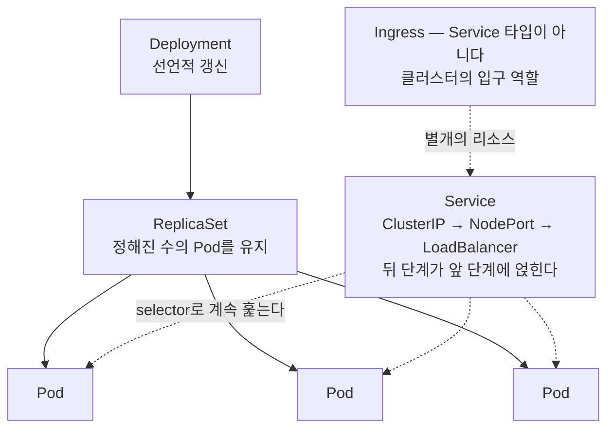
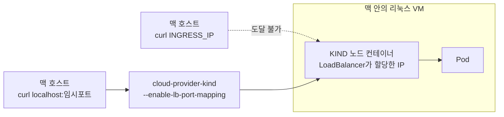

# 12장. 맥에서 쿠버네티스를 켜보기 — 그리고 마지막 벽

이미지를 하나 막 빌드해 놓은 상황을 생각해보자. 태그도 붙였고 `docker run`으로 띄워보니 잘 뜬다. 이제 확인 하나만 남았다. 이 앱이 쿠버네티스 위에서도 그대로 도는지 로컬에서 한 번 보고 싶다. 머릿속으로 견적을 내면 이렇다. 클러스터 띄우는 데 30초, 이미지 넣는 데 한 줄, 밖에서 열어보는 데 한 줄. 커피 한 잔 마시는 사이에 끝날 일 같다.

그런데 그 세 줄이 세 번 다 맥에서 다른 길을 요구한다. 어디서 갈라지는지 한 단계씩 따라가 보자.

### 클러스터를 띄우는 두 갈래

Docker Desktop이 이미 깔려 있다면 가장 가까운 클러스터는 그 안에 있다. 다만 널리 알려진 방식과는 달라졌다. 스위치 하나를 켜면 클러스터가 뜨는 게 아니라, **어떤 종류의 클러스터를 만들 것인지 먼저 고르게 한다.**

> "Open the Docker Desktop Dashboard and select the **Kubernetes** view. Select **Create cluster**. Choose your cluster type: **Kubeadm** creates a single-node cluster and the version is set by Docker Desktop. **kind** creates a multi-node cluster and you can set the version and number of nodes."
> — Docker Docs, Docker Desktop Kubernetes 문서 (2026-07-25 열람)
> (대시보드에서 Kubernetes 뷰를 연 뒤 Create cluster를 누르고 클러스터 종류를 고른다. kubeadm은 단일 노드 클러스터를 만들며 버전은 Docker Desktop이 정한다. kind는 멀티 노드 클러스터를 만들고 버전과 노드 수를 직접 정할 수 있다.)

문서가 함께 싣는 비교표가 선택을 갈라준다(아래는 발췌다).

| 항목 | kubeadm | kind |
|---|---|---|
| 멀티 노드 지원 | No | Yes |
| 버전 선택 | No | Yes |
| 프로비저닝 속도 | ~1 min | ~30 seconds |
| **Docker image store 호환** | Yes | **No** |
| containerd image store 호환 | Yes | Yes |

앞의 세 줄만 보면 kind가 낫다. 빠르고, 노드도 여럿이고, 버전도 고를 수 있다. 그런데 넷째 줄이 이 장에서 가장 아픈 항목이다. **kind로 만든 클러스터는 Docker image store와 호환되지 않는다.** 방금 맥에서 `docker build`한 이미지를 클러스터가 바로 보지 못한다는 뜻이다. 지금은 이 한 줄만 기억해두자. 소절 두 개 뒤에서 이 줄 때문에 실습이 멈춘다.

번들된 쿠버네티스 버전은 여기서 말하지 않겠다. 문서가 그 숫자를 적어 두지 않고, 안내하는 것은 `kubectl version`으로 직접 확인하는 방법뿐이기 때문이다. 6장에서 이미지 스토어를 확인할 때와 같은 태도다.

Docker Desktop 밖에도 길은 있다. kind는 독립 도구로도 쓸 수 있고(v0.32.0 / 2026 기준), `kind create cluster` 한 줄이면 클러스터가 선다. minikube도 여전히 흔한 선택이며, Colima를 쓴다면 `--kubernetes` 플래그로 쿠버네티스를 켤 수 있다(어떤 배포판을 쓰는지는 Colima 문서가 밝히지 않는다).

그렇다면 이 중에 무엇이 가장 가벼울까? 아쉽게도 답을 줄 수 없다. 공표된 요구사항은 비교할 수 있다 — minikube는 *최소 요구사항*으로 2 CPU 이상·2GB 여유 메모리·20GB 여유 디스크를 적었고, Colima는 *기본 할당값*이 2 CPU·2GiB 메모리·100GiB 스토리지이며, k3s의 2코어·2GB는 *리눅스 노드 하드웨어 요구사항*이다(k3s 문서는 macOS를 지원 OS로 언급조차 않는다). 성질이 다른 세 수치를 한 줄에 세워 "최소 사양"이라 부르면 곤란하다. kind는 quick-start 페이지에 수치 자체가 없는데 그걸 "가볍다"로 읽지는 말자. **맥에서 실제로 얼마를 먹는지 잰 자료는 찾지 못했다.**

### 앱을 띄운다 — Deployment와 Service

클러스터가 떴으니 앱을 올릴 차례다. 쿠버네티스 공식 입문 튜토리얼을 따라가면 될 것 같은데, 그 튜토리얼이 시작하자마자 이런 문장을 단다.

> "This tutorial uses a container that requires the AMD64 architecture. If you are using minikube on a computer with a different CPU architecture, you could try using minikube with a driver that can emulate AMD64. For example, the Docker Desktop driver can do this."
> — Kubernetes, "Using kubectl to Create a Deployment" (2026-07-26 검색)
> (이 튜토리얼은 AMD64 아키텍처를 요구하는 컨테이너를 쓴다. CPU 아키텍처가 다른 컴퓨터에서 minikube를 쓰고 있다면 AMD64를 에뮬레이션할 수 있는 드라이버를 써 보라. 예를 들어 Docker Desktop 드라이버가 그렇게 할 수 있다.)

입문 문서의 첫 페이지가 Apple Silicon 사용자에게 별도 안내를 단다. 6장에서 며칠씩 잡아먹던 그 문제를 공식 문서가 스스로 증언하는 셈이다. 시작이 이러니 나머지가 그대로 통하리라 기대하진 말자. 오브젝트를 처음부터 세워야 하니 가장 작은 것부터 가자.

> "Pods are the smallest deployable units of computing that you can create and manage in Kubernetes."
> — Kubernetes, "Pods" (2026-07-26 검색)
> (Pod는 쿠버네티스에서 만들고 관리할 수 있는 가장 작은 배포 단위다.)

그런데 Pod가 무엇으로 격리되는지 설명하는 문장이, 2장에서 이미 본 단어들로 되어 있다.

> "The shared context of a Pod is **a set of Linux namespaces, cgroups**, and potentially other facets of isolation - the same things that isolate a container."
> — 동일 문서
> (Pod의 공유 컨텍스트란 리눅스 네임스페이스와 cgroups의 묶음, 그리고 컨테이너를 격리하는 바로 그것들이다.)

2장의 네임스페이스와 cgroups가 쿠버네티스 용어 안에 그대로 있다. 내가 이어 붙인 연결이 아니라 공식 문서의 문장이다. 새 개념이라기보다 아는 것에 새 이름표가 붙은 셈이다.

그렇다면 Pod를 직접 만들면 될까? 문서는 그러지 말라고 한다.

> "Pods are generally not created directly and are created using workload resources." / "Usually you don't need to create Pods directly, even singleton Pods. Instead, create them using workload resources such as Deployment or Job."
> — 동일 문서
> (보통 Pod는 직접 만들지 않고 워크로드 리소스를 통해 만든다. 싱글턴 Pod라 해도 직접 만들 필요는 없다. 대신 Deployment나 Job 같은 워크로드 리소스로 만들자.)

그 워크로드 리소스가 Deployment다. 정의는 한 줄이다 — "A Deployment provides declarative updates for Pods and ReplicaSets." 원하는 상태를 적어 두면 컨트롤러가 실제 상태를 그쪽으로 옮긴다. 그 사이에 ReplicaSet이라는 층이 하나 더 끼는데, 문서가 먼저 선을 그어 준다.

> "Therefore, we recommend using Deployments instead of directly using ReplicaSets, unless you require custom update orchestration or don't require updates at all." / "Do not manage ReplicaSets owned by a Deployment."
> — Kubernetes, "ReplicaSet" / "Deployments" (2026-07-26 검색)
> (그러므로 커스텀 업데이트 조율이 필요하거나 업데이트가 아예 필요 없는 경우가 아니라면, ReplicaSet을 직접 쓰는 대신 Deployment를 쓰기를 권한다. / Deployment가 소유한 ReplicaSet을 직접 관리하지 말라.)

즉 ReplicaSet은 **있다는 것만 알아두면 되는 층**이다. 하는 일도 하나다 — 정해진 수의 Pod를 계속 유지하는 것.


그림 1. 쿠버네티스 오브젝트 관계 — Deployment가 ReplicaSet을 소유하고, ReplicaSet이 Pod 수를 유지하고, Service는 selector로 Pod를 찾는다

이제 매니페스트를 써 보자. 공식 문서의 최소 Deployment 예제를 그대로 옮긴다.

```yaml
apiVersion: apps/v1
kind: Deployment
metadata:
  name: nginx-deployment
  labels:
    app: nginx
spec:
  replicas: 3
  selector:
    matchLabels:
      app: nginx
  template:
    metadata:
      labels:
        app: nginx
    spec:
      containers:
      - name: nginx
        image: nginx:1.14.2
        ports:
        - containerPort: 80
```

눈여겨볼 곳은 둘이다. `replicas: 3`은 Pod를 몇 개 유지할지 정하고, `selector`와 템플릿의 `labels`는 서로 맞물려 있어야 한다.

> "The .spec.selector field defines how the created ReplicaSet finds which Pods to manage. In this case, you select a label that is defined in the Pod template (app: nginx)."
> — Kubernetes, "Deployments" (2026-07-26 검색)
> (`.spec.selector` 필드는 생성된 ReplicaSet이 어떤 Pod를 관리할지 찾는 방법을 정한다. 이 경우 Pod 템플릿에 정의된 라벨(app: nginx)을 고른 것이다.)

라벨이 곧 주소인 셈이다. 그래서 문서는 다른 컨트롤러와 라벨이 겹치지 않게 하라고 못 박는다.

적용은 `kubectl apply -f ./my-manifest.yaml`이다. 근거도 문서에 있다 — "This is the recommended way of managing Kubernetes applications on production." 적용 직후의 상태는 이렇다.

```
NAME               READY   UP-TO-DATE   AVAILABLE   AGE
nginx-deployment   0/3     0            0           1s
```

`READY`의 `0/3`에 놀라지 말자. "ready/desired" 형식이라 방금 만든 직후에는 정상인 값이다. 롤아웃이 끝나기를 기다리려면 이걸 걸어 두면 된다.

```bash
kubectl rollout status deployment/nginx-deployment
```

끝나고 나서 `kubectl get rs`를 치면 세 층이 눈에 보인다.

```
NAME                          DESIRED   CURRENT   READY   AGE
nginx-deployment-75675f5897   3         3         3       18s
```

Deployment 하나만 만들었는데 ReplicaSet이 생겨 있고, 이름은 `[DEPLOYMENT-NAME]-[HASH]` 형식이다. `kubectl get pods --show-labels`로 한 층 더 내려가면 그 해시가 Pod 이름과 라벨에 그대로 붙어 있다 — 그림 1의 화살표를 출력으로 확인한 셈이다.

앱은 떴다. 그런데 어디로 접속할까? Pod마다 IP를 적어 두면 될까? 문서가 그 생각을 미리 막는다.

> "If you use a Deployment to run your app, that Deployment can create and destroy Pods dynamically. From one moment to the next, you don't know how many of those Pods are working and healthy; you might not even know what those healthy Pods are named." / "This leads to a problem: ... how do the frontends find out and keep track of which IP address to connect to ...?" / "**Enter Services.**"
> — Kubernetes, "Service" (2026-07-26 검색)
> (Deployment로 앱을 돌리면 Deployment가 Pod를 동적으로 만들고 없앤다. 어느 순간에 몇 개의 Pod가 정상인지 알 수 없고, 그 정상인 Pod들의 이름조차 모를 수 있다. 여기서 문제가 생긴다 — 프론트엔드는 어느 IP에 접속해야 하는지 어떻게 알아내고 계속 추적할 것인가? 그래서 Service가 등장한다.)

```yaml
apiVersion: v1
kind: Service
metadata:
  name: my-service
spec:
  selector:
    app.kubernetes.io/name: MyApp
  ports:
    - protocol: TCP
      port: 80
      targetPort: 9376
```

읽는 법은 앞과 같다. `selector`가 Pod의 라벨을 가리키고, 그 Service의 컨트롤러가 "selector에 맞는 Pod를 계속 훑는다". 우리 Deployment에 붙이려면 이 selector를 그쪽 Pod 라벨에 맞추면 된다. 포트 둘은 헷갈리기 쉽다. `port`는 Service가 받는 포트, `targetPort`는 Pod가 듣는 포트이며 안 적으면 같은 값이 된다.

타입은 넷이다.

| 타입 | 공식 설명(발췌) |
|---|---|
| `ClusterIP` | "Exposes the Service on a cluster-internal IP... **This is the default that is used if you don't explicitly specify a type for a Service.**" |
| `NodePort` | "Exposes the Service on each Node's IP at a static port (the NodePort)." |
| `LoadBalancer` | "Exposes the Service externally using an external load balancer. **Kubernetes does not directly offer a load balancing component; you must provide one**, or you can integrate your Kubernetes cluster with a cloud provider." |
| `ExternalName` | "Maps the Service to the contents of the externalName field... No proxying of any kind is set up." |

병렬로 늘어선 목록이 아니다. 문서는 "designed as nested functionality - each level adds to the previous"라고 적는다. 뒤 단계가 앞 단계 위에 얹히고, 아무것도 안 적으면 `ClusterIP`다. 클러스터 안에서만 닿으니 밖에서 접속하려면 한 계단 올라가야 한다.

`NodePort`를 쓴다면 포트 범위에 조건을 붙여 기억해두자. 30000–32767은 **`--service-node-port-range` 플래그의 기본값**이라 운영자가 바꿀 수 있고, 같은 문서가 그 범위를 다시 정적 밴드 30000–30085와 동적 밴드 30086–32767로 쪼갠다. 로컬 실습에서 `nodePort` 숫자를 직접 박을 이유는 별로 없다는 뜻이다.

안 뜨면 어디부터 볼까? 문서가 첫 걸음을 지정한다 — "The first step in debugging a Pod is taking a look at it." `kubectl describe pods <이름>`으로 현재 상태와 최근 이벤트를 보라는 것이다. 거기서 자주 만나는 문자열 넷은 이렇다.

| 값 | 어디에 찍히는 값인가 | 뜻 |
|---|---|---|
| `Pending` | Pod **phase** | 노드에 스케줄되지 못했다. 대개 자원 부족 |
| `Waiting` | **container state** | 스케줄은 됐는데 컨테이너가 못 돈다. 대개 이미지 pull 실패 |
| `ImagePullBackOff` | kubectl이 보여주는 **Status** | 이미지를 못 받아서 점점 긴 간격으로 재시도 중 |
| `CrashLoopBackOff` | kubectl이 보여주는 **Status** | 떴다가 죽기를 반복 중 |

넷을 뭉뚱그려 "Pod 상태"라 부르지 않은 이유가 있다. 문서가 직접 경고한다 — "Make sure not to confuse Status, a kubectl display field for user intuition, with the pod's phase." 층이 다르다. `Pending`의 원인으로 문서가 첫손에 꼽는 것은 자원 부족이니, 맥에서 이 값을 만나면 앞 소절의 요구사항 표를 다시 보자. VM에 준 몫이 곧 클러스터가 가진 전부다. `CrashLoopBackOff`의 원인 목록에도 눈에 익은 항목이 있다 — "Resource constraints, where the container might not have enough memory or CPU to start properly." 4장의 한도와 8장의 힙 계산이 한 화면에 모이는 지점인데, 두 연결 모두 문서의 문장이 아니라 내가 놓은 다리다.

이미지를 갈아 끼우기도 어렵지 않다. 태그를 바꿔 다시 `apply`하면 새 ReplicaSet이 생기고 옛 것은 0으로 내려간다. 전략도 정할 필요가 없다 — "`RollingUpdate` is the default value"다. 하나만 유추로 남겨두자. 문서는 롤아웃이 "if and only if the Deployment's Pod template (that is, `.spec.template`) is changed" 트리거된다고만 적는다. "태그를 그대로 두고 apply하면 롤아웃이 안 일어나겠구나"는 거기서 읽어낸 유추이지 문서의 문장이 아니다.

### 내가 빌드한 이미지를 클러스터에 넣기

여기가 처음 걸려 넘어지는 자리다. 앞에서 미뤄 둔 그 한 줄 — kind는 Docker image store와 호환되지 않는다 — 이 이제 화면에 나타난다. 맥에서 `docker build`로 만든 이미지는 로컬 이미지 스토어에 있고, kind 클러스터는 그것을 보지 못한다. 매니페스트에 이름을 정확히 적어도 소용없다.

그래서 kind에는 이미지를 명시적으로 밀어 넣는 명령이 따로 있다.

```bash
kind load docker-image my-app:latest
kind load docker-image my-app:latest my-db:latest my-cache:latest
kind load docker-image my-app:latest --name test-cluster
```

minikube라면 경로가 여럿이다. `minikube image load`로 넣거나, `eval $(minikube docker-env)`로 셸의 도커 명령을 클러스터 쪽 데몬에 붙이거나, `minikube image build`로 클러스터 안에서 빌드하거나, `minikube addons enable registry`로 레지스트리를 띄운다. 요지는 같다. **로컬에서 빌드한 것과 클러스터가 보는 것이 자동으로 같지 않다.**

이 단계를 건너뛰면 무슨 화면을 보게 될까? 앞 소절의 `Waiting`이다.

> "If a Pod is stuck in the Waiting state, then it has been scheduled to a worker node, but it can't run on that machine. ... **The most common cause of Waiting pods is a failure to pull the image.** There are three things to check: Make sure that you have the name of the image correct. / Have you pushed the image to the registry? / Try to manually pull the image to see if the image can be pulled."
> — Kubernetes, "Debug Pods" (2026-07-26 검색)
> (Pod가 Waiting에 머물러 있다면 워커 노드에 스케줄은 됐지만 그 머신에서 돌지 못하는 것이다. Waiting의 가장 흔한 원인은 이미지 pull 실패다. 세 가지를 확인하라 — 이미지 이름이 정확한가 / 레지스트리에 push했는가 / 직접 pull이 되는가.)

이 세 항목이 그대로 진단 절차가 된다. 맥의 로컬 클러스터에서는 두 번째 항목의 답이 대개 "안 했다"이다 — 레지스트리에 올리는 대신 로컬에서 빌드했으니까. 그 상태가 길어지면 `ImagePullBackOff`로 바뀌는데, 재시도 간격이 늘어나 최대 300초(5분)까지 벌어진다. 화면이 멈춘 것 같아도 실은 5분마다 두드리고 있는 것이다. 이 상태의 원인 목록에는 프라이빗 레지스트리에서 자격증명 없이 받으려는 경우도 있다. 쿠버네티스 쪽에도 별도 자격증명이 필요하다는 뜻인데, 그 설정은 이 책의 범위 밖이다.

이미지를 잘 넣었는데도 옛 이미지가 도는 경우가 있다. 이때 볼 것이 pull 정책이다. 흔히 "기본은 `IfNotPresent`인데 태그가 `:latest`면 `Always`"라고 알려져 있는데 절반만 맞다. 공식 문서가 정한 자동 설정은 네 갈래이고, **`imagePullPolicy` 필드를 생략했을 때만** 적용된다.

| 이미지를 어떻게 적었나 | 자동으로 정해지는 `imagePullPolicy` |
|---|---|
| digest를 지정 | `IfNotPresent` |
| 태그가 `:latest` | `Always` |
| **태그를 아예 생략** | **`Always`** |
| `:latest`가 아닌 태그 | `IfNotPresent` |

세 번째 줄이 빠지기 쉬운 갈래이고, 7장에서 본 규칙과 짝을 이룬다. 도커에서 태그를 생략하면 `latest`가 붙고, 쿠버네티스에서 태그를 생략하면 pull 정책이 `Always`가 된다. **두 생략이 같은 방향으로 위험하다.** 적지 않은 것은 아무것도 안 정한 게 아니라 남이 정해 준 값을 받는 것이다. 9장에서 digest로 고정한 이유가 여기서 한 번 더 확인된다.

### 지금 이 명령이 어느 클러스터로 나가는가

여기서 잠깐 멈추자. 앞에서 우리는 `kubectl apply`를 여러 번 쳤다. 그 명령들은 어디로 나갔을까?

이 책을 쓴 맥에서 컨텍스트 목록을 뽑아 보면 이렇다.

```
$ kubectl config get-contexts
CURRENT   NAME                                               CLUSTER
          docker-desktop                                     docker-desktop
          minikube                                           minikube
*         myname@prod-cluster.ap-northeast-2.eksctl.io       prod-cluster...
```

로컬 클러스터가 둘이나 있는데 별표는 원격 EKS에 찍혀 있다. 실습하려고 로컬 클러스터를 두 개나 깔아 둔 맥에서 `kubectl apply`를 치면 **서울 리전의 클라우드 클러스터로 나간다**는 뜻이다. 표본 하나짜리 관측이지만, 하필 이 책을 쓴 맥이 그랬다.

이게 얼마나 흔한 일인지는 커뮤니티가 말해 준다. 2024년 9월에 한 사용자(`millerm`)가 남긴 이야기다.

> "Hah! I accidentally deleted a production deployment the other day, because I thought it was mucking with my local Colima Kubernetes's cluster. **I forgot that I had my context set to one of my AWS clusters.**"
> — Hacker News 41578274, 2024-09-21 댓글
> (얼마 전에 운영 배포를 실수로 지웠다. 로컬 Colima 쿠버네티스 클러스터를 만지는 줄 알았기 때문이다. 컨텍스트가 AWS 클러스터 중 하나로 맞춰져 있다는 걸 잊고 있었다.)

같은 스레드에 "나도 당했다"는 사람이 네 명 더 붙었다. 확인하는 명령 자체는 이미 있다.

```bash
kubectl config get-contexts                          # display list of contexts
kubectl config current-context                       # display the current-context
kubectl config use-context my-cluster-name           # set the default context to my-cluster-name
```

솔직하게 밝혀둘 것이 하나 있다. "실습 전에 컨텍스트를 확인하라"는 문장은 공식 문서에 없다. 공식 문서에서 가져온 것은 명령의 존재와 용법뿐이고, 확인하라는 당부는 위의 실측과 사고담에서 나왔다. 그러니 이건 규칙이 아니라 권유다.

그렇다면 어떻게 막을까? 이 질문에는 합의된 답이 없다. 커뮤니티가 내놓은 처방을 강한 순서로 늘어놓으면 이렇다. 프롬프트에 컨텍스트와 네임스페이스를 표시하기, 위험한 명령에 확인 프롬프트를 붙이기, 매번 `--context`를 명시하기, 기본 kubeconfig를 두지 않고 `KUBECONFIG`로만 지정하기, 셸을 열 때마다 current-context를 아예 비워두기, 디렉터리별 자동 전환을 걸기, 그리고 운영 kubeconfig를 로컬에 아예 두지 않고 필요할 때만 받아오기. 가장 흔한 첫 번째 처방조차 같은 2024년 9월 스레드에서 반박을 받는다 — `Telemaco019`는 "나도 zsh 설정에 넣어 뒀지만 그게 내가 망치는 걸 막아주지는 않았다"고 했고, `terinjokes`는 프롬프트가 한 번 그려지고 나면 다른 셸에서 컨텍스트를 바꿔도 낡은 정보를 계속 보여준다고 지적했다. 어느 처방을 고르든, 고른 뒤에도 한 번은 눈으로 확인하는 편이 낫다.

### 밖에서 닿아보기 — 그리고 맥에서 막히는 지점

이제 마지막 한 줄이다. 밖에서 열어보기만 하면 된다. 그런데 이 한 줄이 이 장에서 가장 길다.

먼저 지형이 최근에 바뀌었다는 것부터 짚자. 오래된 튜토리얼을 그대로 따라가면 지금은 위험하다. 공식 문서가 Ingress에 대해 이렇게 적는다.

> "**The Kubernetes project recommends using Gateway instead of Ingress. The Ingress API has been frozen.**" / "The Ingress API is generally available, and is subject to the stability guarantees for generally available APIs. **The Kubernetes project has no plans to remove Ingress from Kubernetes.**"
> — Kubernetes, "Ingress" (2026-07-25 검색)
> (쿠버네티스 프로젝트는 Ingress 대신 Gateway를 쓸 것을 권한다. Ingress API는 동결됐다. / Ingress API는 GA이며 GA API의 안정성 보장을 받는다. 쿠버네티스 프로젝트는 Ingress를 제거할 계획이 없다.)

두 문장을 함께 읽자. **동결(frozen)은 폐기(deprecated)가 아니다.** 새로 짓는다면 Gateway API를 보라는 것이지 곧 사라진다는 뜻이 아니어서, "Ingress는 없어진다"고 옮기면 공식 문서와 정반대의 말이 된다.

더 급한 소식은 컨트롤러 쪽이다. 널리 쓰이던 `ingress-nginx`가 **2026년 3월에 은퇴했고**, 이후로는 릴리스도 버그픽스도 보안 패치도 없다. 성명은 에두르지 않는다.

> "To be abundantly clear: **choosing to remain with Ingress NGINX after its retirement leaves you and your users vulnerable to attack.**" / "Existing deployments will continue to work, so unless you proactively check, you may not know you are affected until you are compromised."
> — Kubernetes 블로그, Steering·Security Response Committee 성명 (발행 2026-01-29)
> (분명히 해 두겠다. 은퇴 이후에도 Ingress NGINX에 남기로 하는 것은 당신과 당신의 사용자를 공격에 노출시키는 일이다. / 기존 배포는 계속 동작하므로, 능동적으로 확인하지 않으면 침해당하기 전까지 영향을 받는지조차 모를 수 있다.)

그래서 이 책은 `minikube addons enable ingress`를 실습으로 싣지 않는다. minikube 문서가 스스로 "The ingress addon uses the ingress nginx controller"라고 적고 있어(2026-07-26 재확인), 그 한 줄을 아무 말 없이 실으면 패치가 끊긴 컨트롤러를 깔라고 시키는 셈이기 때문이다. 대신 추가 컴포넌트가 없어도 되는 경로부터 가자.

```bash
kubectl port-forward svc/my-service 5000                  # listen on local port 5000 and forward to port 5000 on Service backend
kubectl port-forward deploy/my-deployment 5000:6000       # listen on local port 5000 and forward to port 6000 on a Pod created by <my-deployment>
```

`LOCAL_PORT:REMOTE_PORT`라고 적혀 있지만 오른쪽의 의미가 대상에 따라 다르다. `svc/`면 Service의 target port 이름, `deploy/`면 그 Deployment가 만든 Pod의 포트다. "Service의 `port`로 간다"고 뭉뚱그리면 틀린다. 함정도 하나 있다 — "The forwarding session ends when the selected pod terminates, and a rerun of the command is needed to resume forwarding." 그럼에도 맥에서는 이 명령이 가장 확실한 경로다. 문서의 권고가 아니라 여기까지 따라온 내 결론이고, 왜인지는 바로 다음에 나온다.

그렇다면 진짜 서비스처럼 `LoadBalancer`로 노출하면 어떨까? 로컬에서는 대개 `EXTERNAL-IP`가 `<pending>`에 머문 채 움직이지 않는다. 두 겹으로 읽어야 정확한 현상이다. **왜 그런가**는 Service 공식 문서가 답한다.

> "Exposes the Service externally using an external load balancer. **Kubernetes does not directly offer a load balancing component; you must provide one, or you can integrate your Kubernetes cluster with a cloud provider.**"
> — Kubernetes, "Service" (2026-07-26 검색)
> (외부 로드 밸런서를 이용해 Service를 외부에 노출한다. 쿠버네티스는 로드 밸런싱 컴포넌트를 직접 제공하지 않는다. 직접 대주거나, 클러스터를 클라우드 프로바이더와 통합해야 한다.)

**화면에 무엇이 보이는가**는 minikube 문서가 답한다.

> "Note that without `minikube tunnel`, Kubernetes will show the external IP as **'pending'**."
> — minikube, "Accessing apps" (2026-07-25 검색)
> (`minikube tunnel` 없이는 쿠버네티스가 external IP를 'pending'으로 표시한다는 점에 유의하라.)

두 문장을 붙이면 그림이 완성된다. 쿠버네티스는 로드 밸런서를 직접 만들어 주지 않고, 클라우드에서는 프로바이더가 그 자리를 채운다. 로컬에는 채워 줄 사람이 없어서 영원히 대기 중인 것이다.

**그리고 마지막 벽이다.** kind는 이 구멍을 메우려고 `cloud-provider-kind`라는 컴포넌트를 따로 두었고, 현재 Ingress 가이드도 그것을 전제로 다시 쓰였다. 가이드가 안내하는 확인 흐름은 이렇다.

```bash
INGRESS_IP=$(kubectl get ingress example-ingress -o jsonpath='{.status.loadBalancer.ingress[0].ip}')
curl ${INGRESS_IP}/foo
```

문서대로 쳤는데 맥에서는 아무 응답이 없다. 이름이 틀린 것도, 앱이 죽은 것도 아니다. 그 이유를 그 컴포넌트의 README가 직접 적어 두었다.

> "**Mac and Windows run the containers inside a VM and, on the contrary to Linux, the KIND nodes are not reachable from the host, so the LoadBalancer assigned IP is not working for users.**"
> — cloud-provider-kind README (2026-07-25 검색)
> (맥과 윈도우는 컨테이너를 VM 안에서 돌리며, 리눅스와 달리 KIND 노드에 호스트에서 닿을 수 없다. 그래서 LoadBalancer가 할당한 IP가 사용자에게 동작하지 않는다.)

2장의 그 한 문장이 열한 개 장을 지나 그대로 돌아왔다. 맥의 컨테이너는 VM 안에 있다. 그 VM 안에 kind 노드가 있고, LoadBalancer가 할당한 IP는 VM 안쪽의 주소다. 그러니 호스트에서 그 IP로 보낸 패킷은 갈 곳이 없다. 이번에는 그 경계가 **닿지 않음**이라는 얼굴로 나타난 것이다.


그림 2. 맥에서 끊기는 지점 — 호스트에서 KIND 노드로 직접 닿지 못하므로, 임시 호스트 포트를 열어 우회한다

우회 경로는 README가 함께 준다. `brew install cloud-provider-kind`로 설치하고, **맥에서는 `sudo`로 실행해야 한다**("On macOS and WSL2 you must run cloud-provider-kind using `sudo`"). 여기에 `--enable-lb-port-mapping`을 주면 도커의 포트 매핑으로 임시 호스트 포트가 열리고, 그 포트로 `curl localhost:[port]`를 치면 비로소 응답이 온다. 로컬 실습 하나에 별도 프로세스와 관리자 권한이 붙는 셈이니 번거롭다는 말이 절로 나온다. 하지만 이 번거로움은 도구가 부실해서가 아니라 **경계가 실제로 거기 있어서** 생긴 값이다.

Ingress 리소스를 직접 써 보려면 공식 문서의 최소 예제(`networking.k8s.io/v1`의 `minimal-ingress`)가 안전하다. 그것만으로 아무 일도 일어나지 않는다는 점도 기억해두자 — "Only creating an Ingress resource has no effect. You must have an Ingress controller to satisfy an Ingress." 리소스는 요청서일 뿐이다.

커피 한 잔이면 끝날 줄 알았던 세 줄이 여기까지 왔다. 클러스터 종류를 골라야 했고, 이미지를 손으로 밀어 넣어야 했고, 마지막에는 IP 하나에 닿지 못해 별도 프로세스를 `sudo`로 띄웠다. 세 번 다 이유는 같다. 우리가 쓰는 클러스터가 맥 위가 아니라 맥 안의 VM 안에 있기 때문이다.

그러니 마지막으로 남길 당부는 하나다. 지금 읽은 화면들을 직접 자기 맥에서 재현해보자. arXiv 전체를 훑어도 초록에 `"Docker Desktop"`이 들어간 논문은 두 편뿐이었고, `"Apple Silicon"`과 컨테이너를 함께 다룬 논문 세 편 중 컨테이너 성능을 잰 것은 없었다(2026-07-25 전수 검색). **당신의 환경은 학계가 측정해 주지 않았다.** 남의 벤치마크를 옮겨 적는 대신 직접 재는 사람이, 이 환경에서는 가장 정확한 사람이다.
