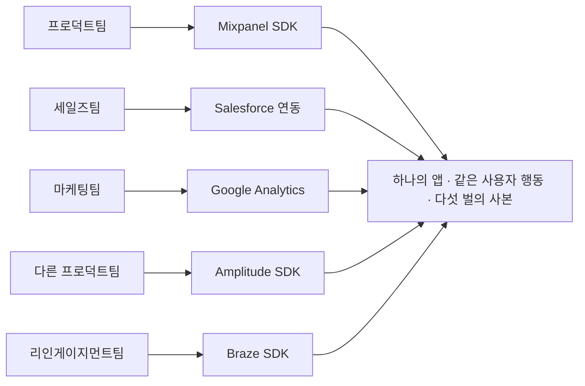
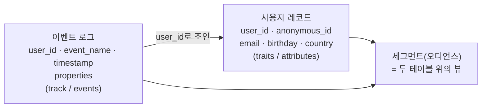
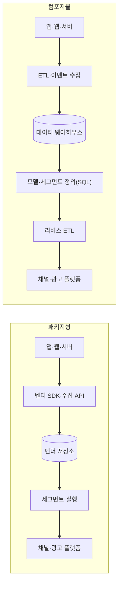
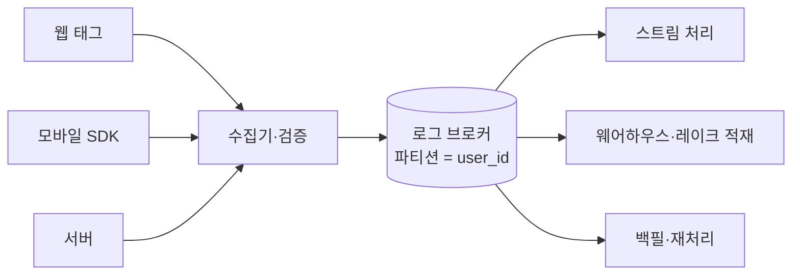
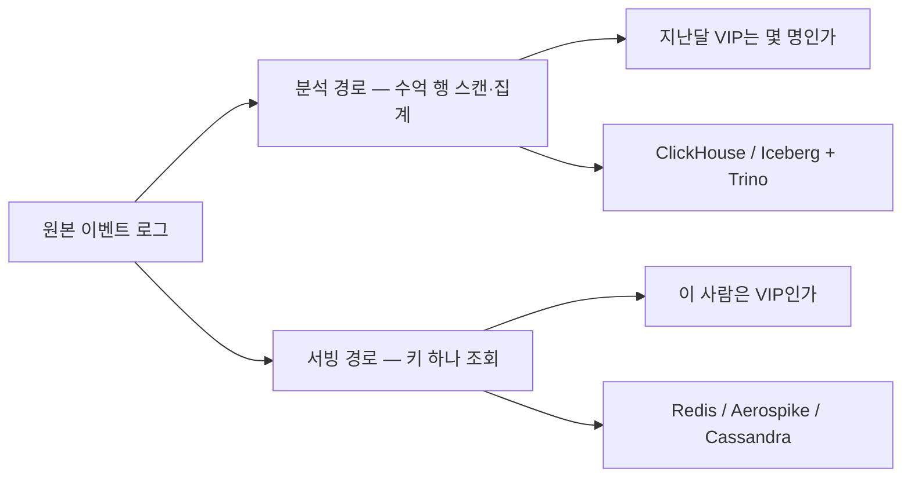
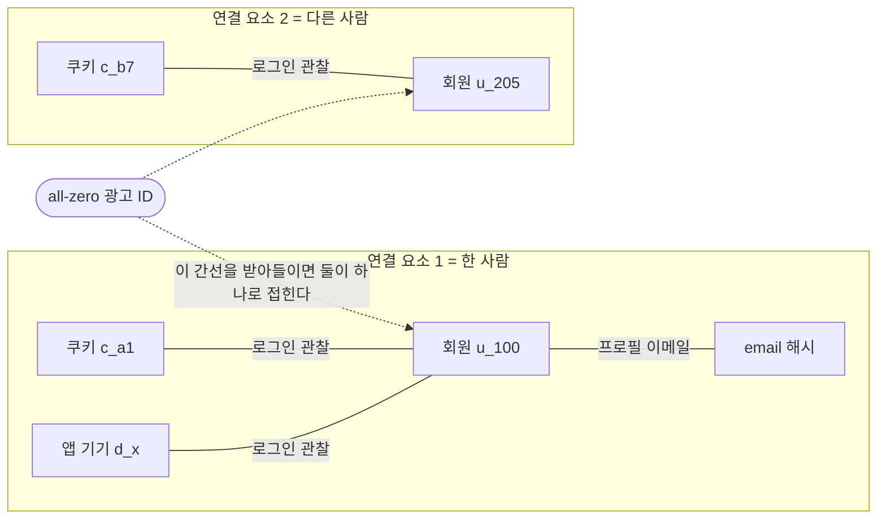
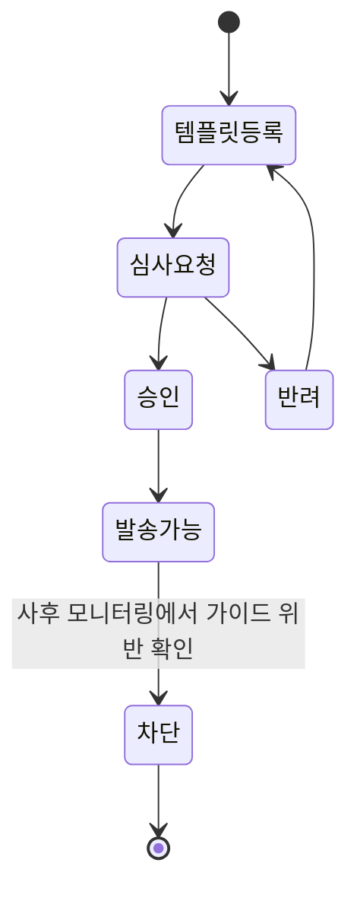
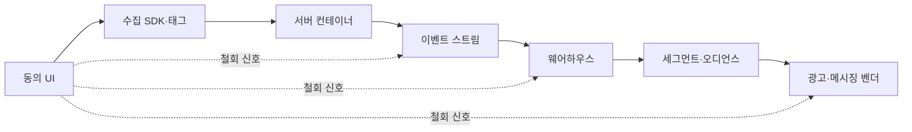
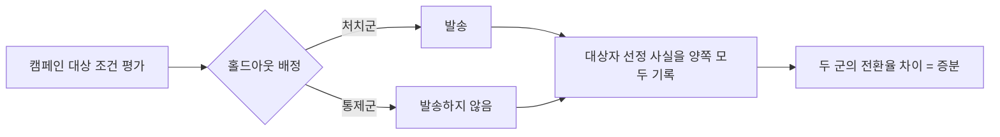

# 이벤트 하나가 캠페인이 되기까지

**Martech 회사로 가는 개발자를 위한 안내서**

## 저자

Toby-AI

**판본:** v1.0.0 · 2026-07-26

---

## 판권

**이벤트 하나가 캠페인이 되기까지 — Martech 회사로 가는 개발자를 위한 안내서**

**판본:** v1.0.0
**발행일:** 2026-07-26
**저자:** Toby-AI
**식별자:** urn:uuid:1a221305-04fa-4238-a3b3-99bdbf675fda

### 라이선스

이 책은 [Creative Commons BY-NC-SA 4.0](https://creativecommons.org/licenses/by-nc-sa/4.0/) 라이선스로 배포된다.

- **저작자 표시(BY):** 출처를 밝힐 것.
- **비상업적 이용(NC):** 상업적 목적으로 이용할 수 없다.
- **동일조건 변경허락(SA):** 변경·재배포 시 동일한 라이선스를 적용해야 한다.

### 출처

이 책은 [book-writer](https://github.com/tobyilee/book-writer) 하네스 v1.9.1로 자동 생성되었다.

---

## 머리말

마케팅팀에서 이벤트 하나를 쏴달라는 요청이 온다. 이름은 `purchase_completed`, 프로퍼티 다섯 개, 시점은 결제 완료 직후. 티켓으로 보면 반나절짜리다.

정작 오래 남는 건 그 반나절이 아니라 그동안 머릿속에 떠오른 물음들이다. 왜 하필 그 이름인가. 다섯 개는 누가 골랐나. 이 이벤트는 어디로 가서 무엇이 되나. 검색은 도움이 되지 않는다. 오케스트레이션이니 통합 플랫폼이니 하는 말들이 줄줄이 나올 뿐, 방금의 물음 어느 것에도 답하지 않는다.

이 책은 그 자리에서 시작한다.

### 누구를 위한 책인가

웹이나 앱 백엔드를 만들어본 개발자를 독자로 상정했다. HTTP와 REST API, 관계형 데이터베이스와 SQL, 큐와 비동기 처리, 클라우드 배포 정도가 손에 익어 있으면 충분하다.

전제하지 않는 것도 분명히 해두자. 마케팅 용어, 광고 생태계, 통계와 인과추론, 개인정보 법령 — 이 넷은 하나도 알고 있다고 가정하지 않는다. 이 도메인에 처음 발을 들인 개발자가 막히는 자리가 대개 코드 쪽이 아니어서다. 그 진단은 1장이 맡는다.

그러니 이 책이 겨냥하는 독자는 둘이다. Martech 회사로 옮길지 저울질하는 개발자, 그리고 이미 인하우스에서 마케팅팀의 요구를 받아 적고 있는 개발자. 둘이 필요로 하는 지도는 사실 같은 것이다.

### 무엇을 약속하는가

다 읽고 나면 다섯 가지를 할 수 있게 되는 것이 이 책의 목표다.

1. Martech 제품의 아키텍처 다이어그램을 보고 **각 컴포넌트가 왜 거기 있는지** 설명할 수 있다. "왜 저장소가 네 벌인가"에 답할 수 있다.
2. 마케터의 요구사항을 **지연·기수·조회 패턴** 세 축으로 번역해 배치와 스트리밍, 근사와 정확, OLAP과 KV 사이의 결정을 내릴 수 있다.
3. 벤더·업계·학계 주장의 **근거 강도를 구분해서 읽는다.**
4. 동의·삭제·야간 전송 같은 **규제 요구를 스키마와 코드로 옮길 수 있다.** 동의가 boolean 하나가 아닌 이유를 안다.
5. Martech 회사의 어느 자리에 지원할지, 무엇을 준비해야 하는지 **근거 있는 지도**를 갖는다.

### 어떻게 읽으면 좋은가

열두 장이 네 묶음으로 나뉜다. **1~4장**에서 어휘와 지도를 얻고, **5~7장**에서 이벤트가 흘러가는 경로를 실제로 걷는다. **8~11장**은 그 경로를 의심하는 구간이고, **12장**은 자기 자리를 찾는 장이다.

난이도가 평탄하지 않다는 점은 미리 말해두는 편이 낫겠다. 1~4장은 기술 난이도가 낮은 대신 도메인 난이도가 높다. 5~7장이 이 책에서 가장 무겁다 — 분산 로그, 컬럼 지향 저장, 확률적 자료구조, ID 그래프가 여기 몰려 있다. 8장 이후로는 기술 난이도가 내려가고 대신 판단 난이도가 올라간다.

처음부터 순서대로 읽는 것을 권하지만, 각 장은 중간부터 집어 들어도 문맥이 잡히도록 썼다. 지금 당장 필요한 장이 있다면 거기부터 펴도 된다. 다만 두 장만은 먼저 읽어두길 권한다. **2장**은 이 책의 첫 번째 안심 장치이고 — CDP의 핵심 스키마가 사실상 두 테이블이라는 이야기다 — **4장**은 이 도메인에서 근거를 다루는 태도를 세우는 장이다. 뒤의 여덟 장이 그 태도 위에 서 있다.

### 이 책의 표기 규약

인용마다 시점을 붙이는 것이 이 책의 규칙이다. 왜 그래야 하는지는 1장에서 다루고, 여기서는 표기만 미리 맞춰두자. 출처의 시점은 세 가지로 구분해 적는다.

- **문서 표기 {날짜}** — 그 페이지가 스스로 밝힌 발행일이나 갱신일이 있는 경우.
- **발행일 없음 — {날짜} 조회** — 발행일 표기가 아예 없어 이 책이 연 날짜만 남길 수 있는 경우.
- **상시 갱신** — 버전이나 날짜 없이 계속 고쳐지는 문서.

날짜만 단독으로 붙은 것(`— privacysandbox.google.com 블로그, 2025-04-22`)은 그 글의 발행일이고, 제품 이름 옆의 버전과 날짜(`Kafka 4.3.1 / 2026-06-23`)는 그 버전이 확인된 시점이다. 인용 블록 아래에 대괄호로 붙은 줄(`[docs.snowplow.io/… | 발행일 확인 불가 | 검색 시점 2026-07-25]`)은 URL까지 함께 남긴 형태이고, 담고 있는 정보는 위 세 가지와 같다.

번거로워 보이는 표기다. 왜 이렇게까지 하는지는 1장에서 숫자를 하나 놓고 설명한다. 여기서는 형식만 눈에 익혀두면 된다.

### 마지막으로

이 책에는 "확인하지 못했다", "이 리서치가 도달하지 못했다", "표본은 한 제품이니 업계 전체로 넓혀 읽지는 말자" 같은 문장이 자주 나온다. 산문이 장황해 보일 수 있다. 덜어내지 않은 이유가 있다.

이 도메인에서는 검증된 것과 그럴듯한 것이 같은 활자 크기로, 같은 문단 안에, 같은 확신의 어조로 놓인다. 그 둘을 섞어 쓰는 순간 이 책은 자기가 비판하는 문서들과 같은 것이 된다. 그러니 유보하는 문장을 만나면 저자가 덜 조사했다는 신호가 아니라, 여기까지가 근거가 닿은 자리라는 표시로 읽어주면 좋겠다.

이제 시작하자. 앱에 추적 SDK가 다섯 개 붙어 있는 이유부터다.

---

## 목차

- **1장.** 앱에 추적 SDK가 다섯 개 붙어 있는 이유
- **2장.** 결국 두 테이블이다 — 고객 데이터 모델과 이벤트 택소노미
- **3장.** 이 회사는 무엇을 파는가 — 카테고리 지도와 두 갈래
- **4장.** 마케터의 질문을 쿼리로 — 세그먼트·RFM·LTV의 원리
- **5장.** 이벤트를 잃지 않고 받아낸다 — 수집과 스트림
- **6장.** 같은 데이터가 왜 두 벌인가 — 저장·질의와 정확도의 협상
- **7장.** 한 사람으로 묶고, 다시 내보낸다 — 아이덴티티와 액티베이션
- **8장.** Martech의 AI는 대부분 LLM이 아니다 — 예측·랭킹·피처
- **9장.** 메시지가 나가는 순간 — 저니·채널·빈도·딜리버러빌리티
- **10장.** 동의는 boolean이 아니다 — 프라이버시·규제가 코드에 남기는 것
- **11장.** 숫자는 계기판이 아니라 방향 지시등이다 — 어트리뷰션·증분성·실험
- **12장.** Martech 회사에서 개발자로 산다는 것
- 맺음말
- 참고문헌

---

# 1장. 앱에 추적 SDK가 다섯 개 붙어 있는 이유

2025년 4월, 해커뉴스에 이런 댓글이 하나 올라왔다. 어떤 앱이 왜 이렇게 느려졌느냐는 물음에 한 개발자가 남긴 답이다.

> "내 경험상 컨슈머 웹 앱은 다 빠르게 시작한다. 그러다 누가 말한다. '모든 인터랙션을 Mixpanel로 추적해야 해. 일어난 걸 모르면 무슨 의미가 있어?' 그러면 세일즈팀이 말한다. 'Salesforce에도 추적해야 해. 우리 팀은 아무도 Mixpanel 안 봐.' 그러면 마케팅팀이 말한다. 'GA로 통합해야 해. 다른 건 우리 용도에 안 맞아.' 그러면 다른 프로덕트팀이 말한다. '우리는 Amplitude가 필요해.' 그러면 리인게이지먼트 마케팅팀이 말한다. '우리는 Braze요.'"
>
> — Swizec, Hacker News 댓글 43668825 (2025-04-12)

읽으면서 어딘가 낯익지 않았는가. 이건 한 사람의 경험 진술이고, 업계 전체를 대표하는 조사 결과가 아니다. 그런데도 이 짧은 댓글이 눈에 오래 남는 이유가 있다. 다섯 개의 SDK 가운데 어느 하나도 개발자가 기술적으로 필요해서 넣은 게 아니라는 것. 성능을 재려고 넣은 것도, 장애를 잡으려고 넣은 것도 아니다. 전부 다른 부서가 다른 질문에 답하려고 요구한 것이다.

이 장면 하나에 이 책이 다루려는 도메인의 성격이 거의 다 들어 있다. 다섯 줄짜리 댓글치고는 담고 있는 게 많다.

## 다섯 개의 SDK는 아무도 기술적으로 결정하지 않았다

위 댓글을 다시 읽어보면 이상한 점이 있다. 다섯 개의 도구가 **거의 같은 것을 수집한다.** 사용자가 무엇을 눌렀고 어느 화면에 머물렀고 무엇을 샀는지. 데이터의 내용은 다르지 않다. 다른 건 그 데이터를 누가 어떤 질문을 들고 열어보느냐다.

프로덕트팀은 "이 기능을 사람들이 쓰나?"를 묻는다. 세일즈팀은 "이 계정이 지금 어떤 상태인가?"를 묻는다. 마케팅팀은 "이 채널로 들어온 사람들이 결국 얼마를 썼나?"를 묻는다. 리인게이지먼트팀, 그러니까 멀어진 사용자를 다시 데려오는 일을 맡은 팀은 "이 사람이 방금 장바구니를 버렸으니 지금 메시지를 보내야 하나?"를 묻는다. 같은 로그를 보고도 서로 다른 네 개의 질문을 던지고, 각 질문에 맞춰 최적화된 제품이 이미 시장에 따로 있다.

그래서 도구가 겹친다. 리팩터링으로 해결되는 종류의 겹침이 아니다.

개발자 쪽에서 이 겹침이 실제로 어떤 모양인지 잠깐 그려보자. 결제 버튼 하나에 이벤트를 다섯 번 찍는 코드가 생긴다. 다섯 벤더의 초기화 코드가 앱 시작 경로에 나란히 붙고, 그중 하나가 느리면 첫 화면이 그만큼 늦어진다. 이벤트 이름도 다섯 벌이다. 어느 도구에서는 `purchase_completed`이고 다른 도구에서는 `Order Completed`이며, 어느 쪽에는 통화 코드 필드가 있고 어느 쪽에는 없다. 그리고 언젠가 회의실에서 이런 질문이 나온다. "어제 결제 건수가 A 대시보드랑 B 대시보드에서 다르게 나오는데요, 어느 쪽이 맞나요?"

이 질문에 답하는 사람이 개발자다. 초난감한 상황이다. 둘 다 버그가 아닐 수도 있기 때문이다. 어느 쪽이 취소 건을 빼고 세는지, 앱이 백그라운드로 내려간 사이 이벤트가 유실됐는지, 자정 경계를 서로 다른 타임존으로 잡았는지 — 코드에 에러가 하나도 없는데 숫자만 다른 경우의 수는 이렇게 얼마든지 세울 수 있다. 그리고 이건 드문 일이 아니다. 국내 마테크 회사 마티니의 솔루션 컨설턴트 채용 공고를 열어보면 주요 업무 항목에 **"데이터 불일치, Attribution 오류, 이벤트 누락 등 트러블슈팅"**이 그대로 적혀 있다(2026년 7월 원티드 공고 기준). 트러블슈팅이 직무기술서 본문에 실린다는 건, 그게 예외 상황이 아니라 상시 업무라는 뜻이다.


그림 1-1. 다섯 개의 SDK는 다섯 개의 팀에서 왔다

이걸 조금 더 일반화해서 말한 사람도 있다. 2019년 해커뉴스의 한 실무자 댓글이다.

> "이 문제의 서로 다른 부분을 푸는 제품들이 있는데, **대부분의 회사는 마케팅 스택으로 2~4개의 제품을 산다**(CDP, 마케팅 자동화, 어트리뷰션, 애널리틱스). LTV 예측 같은 걸 하려면 소프트웨어를 하나 더 사거나 직접 만들어야 한다. **회사마다 마케팅하는 방식이 충분히 달라서, 모두를 위해 이 문제를 end-to-end로 풀 수 있는 단일 제품이 없다.**"
>
> — dlevine, Hacker News 댓글 20299880 (2019-06-27)

괄호 안의 네 단어가 벌써 낯설 수 있다. 지금은 대략 이렇게만 잡아두자. 고객 데이터를 한곳에 모으는 제품(CDP), 그 데이터로 메시지를 자동 발송하는 제품(마케팅 자동화), 어떤 광고가 이 구매를 만들었는지 따지는 제품(어트리뷰션), 그리고 그걸 들여다보는 분석 제품(애널리틱스). 이 장 뒤쪽에 열한 개 용어의 최소 정의를 모아둘 테니 지금 외울 필요는 없다.

중요한 건 마지막 문장이다. 회사마다 마케팅하는 방식이 충분히 다르다. 이 한 문장이 마케팅 스택이 왜 항상 여러 제품의 조합인지를 설명한다. 결제나 인증이라면 "우리 회사만의 특수한 결제"라는 게 그리 많지 않다. 그런데 어떤 고객에게 무엇을 언제 왜 말할 것인가는 회사의 사업 모델 그 자체다. 커머스와 게임과 은행이 같은 방식으로 고객에게 말을 걸 리가 없다. 그러니 단일 제품이 모두를 커버하지 못하고, 회사는 두세 개를 사서 붙이고, 그걸 붙이는 사람이 개발자가 된다.

연동 지옥이라는 말이 여기서 유독 자주 나오는 이유가 이것이다. 그건 누가 게을러서 생긴 부채가 아니라 시장 구조의 결과다. 물론 부채가 아니라고 해서 안 아픈 건 아니다. 오히려 더 난감하다. 원인이 코드 안에 없으니 코드로만은 못 고친다.

## 그래서 이 바닥은 대체 무엇을 하는 곳인가

용어부터 정리하자. Martech은 marketing과 technology를 합친 말이고, 우리말로는 마테크 또는 마케팅 기술 정도로 옮긴다. 그런데 이 정의는 아무것도 설명해주지 않는다. 벤더 홈페이지를 열면 사정이 더 나빠진다. "고객 여정을 오케스트레이션하는 통합 플랫폼" 같은 문장이 줄줄이 나오는데, 읽고 나면 처음보다 덜 알게 된 기분이 든다.

이번 리서치에서 가장 명료했던 정의가 나온 곳은 뜻밖에도 한 실무 리드의 인터뷰였다. 국내 마테크 회사 AB180의 데이터 파이프라인 팀 리드 김재원의 말이다.

> "마케팅 성과 분석이란 어떤 광고를 사용자가 봤다는 것에 대한 기록, 이를 통해 설치나 구매 등의 전환을 일으켰다는 기록을 놓치지 않고 수집해서 인과관계 분석을 돕는 것인데요, Mar-Tech는 이 과정을 기술적으로 풀어 가는 비즈니스 분야라고 생각해 주시면 됩니다."
>
> — AB180 엔지니어링 블로그, 데이터 파이프라인 팀 인터뷰 (게시일 미상)

이 문장이 좋은 이유는 동사가 셋뿐이기 때문이다. **기록하고, 놓치지 않고 수집하고, 인과관계 분석을 돕는다.**

앞의 둘은 개발자에게 익숙한 언어다. 기록은 이벤트 로깅이고, 놓치지 않는 수집은 내구성 있는 파이프라인이다. 유실률, 재시도, 멱등성, 순서 보장. 여기까지는 우리가 이미 하던 일이다.

문제는 세 번째다. 인과관계. 서버 로그를 다룰 때 우리는 인과를 거의 묻지 않는다. 응답이 500이면 원인은 스택 트레이스 안에 있고, 없으면 로그를 더 남기면 된다. 그런데 "이 사람이 이 앱을 깐 이유가 어제 본 그 광고인가"는 스택 트레이스로 답할 수 없다. 그 사람이 광고를 안 봤어도 앱을 깔았을지 우리는 영원히 관측하지 못한다. 관측할 수 없는 것에 답하려고 만든 시스템 — 마테크가 유독 복잡하고, 유독 논쟁이 많고, 유독 벤더가 많은 근본 이유다. (이 문제를 정면으로 다루는 건 11장이다.)

여기서 한 가지 의문이 생긴다. **왜 이 도메인은 개발자에게 유독 불투명하게 느껴질까?** 우리가 익숙한 시스템은 결과가 눈앞에 있다. 페이지가 그려지거나 안 그려지고, 응답이 200이거나 500이다. 그런데 우리가 만든 이 파이프라인의 진짜 결과물은 화면이 아니라 **다른 사람이 다른 방에서 내리는 판단**이다. 마케터가 세그먼트를 보고 예산을 옮기고, 캠페인이 나가고, 몇 주 뒤에 매출이 조금 움직인다. 개발자는 그 끝을 거의 보지 못한 채 중간 구간만 맡는다. 무엇을 위해 이걸 만드는지 모르는 상태로 요구사항만 받는 경험이 반복되면, 시스템은 잘 돌아가는데도 계속 뒷맛이 찜찜하다.

얼마나 많으냐고? 스콧 브링커의 chiefmartec이 집계하는 마테크 랜드스케이프 조사의 2026년판 기준 15,505개다.

> "The martech landscape effectively stopped growing this year, up just 0.79% to 15,505 products."
>
> — chiefmartec, 2026 Marketing Technology Landscape Supergraphic (2026-05-05)

숫자 자체보다 그 안의 움직임이 흥미롭다. 전년 대비 증가율은 0.79%로 사실상 멈췄는데, 그 안에서 **1,488개가 새로 들어오고 1,367개가 빠져나갔다.** 총량은 정지했고 내부 회전은 계속되고 있다.

이 사실이 이 책을 읽는 방식에 직접 영향을 준다. 지금 잘나가는 벤더 하나를 붙잡고 그 제품 문서를 통째로 외우는 공부는 수명이 짧다. 3장에서 보겠지만 이 시장에서는 인수와 합병으로 회사의 간판이 바뀌는 일이 실제로 벌어진다. 그래서 이 책이 다루는 건 제품 사용법보다 구조 쪽이다. 이벤트가 어디로 들어와서 어디에 쌓이고 어떤 계산을 거쳐 어느 채널로 나가는지. 그 구조는 벤더가 바뀌어도 잘 안 바뀐다.

## 한국 독자를 위한 첫 번째 함정 — "CRM"이라는 세 글자

이제 이 도메인에 발을 들이는 한국 개발자가 가장 먼저 밟는 지뢰를 하나 치워두자. 지뢰의 이름은 CRM이다.

영미권에서 CRM이 무엇을 가리키는지는 비교적 또렷하다. Salesforce의 공식 학습 사이트인 Trailhead 문서를 열어보면(발행일 없음 — 2026년 7월 조회) CRM의 세계는 **영업**의 세계다. 핵심 객체가 Account, Contact, Lead, Opportunity이고, 하는 일은 잠재 고객(Lead)을 기회(Opportunity)로 바꿔 파이프라인을 관리하는 것이다. 주 사용자는 영업사원이다.

그런데 한국에서 "CRM 마케팅"이라는 말은 다른 걸 가리킨다. 국내 CDP·메시징 벤더인 노티플라이는 이 말을 이런 뜻으로 쓴다.

> CRM 마케팅이란 "고객이 자사 플랫폼(서비스)에 유입되었을때, 말을 걸고, 구매를 유도하고, 구매한 이후 재탐색을 유도하는 등, **리텐션을 높이는 모든 고객대상 마케팅**"
>
> 채널: "푸시, 모달(IAM), 카카오 알림톡, 카카오 친구톡, 문자 메시지, 이메일 - 총 6가지가 대표적인 매체"
>
> — 노티플라이 블로그 (2023-10-24)

같은 계열의 다른 국내 벤더도 결이 같다. FlareLane은 CRM 마케팅을 "고객 관리와 데이터 분석을 통해 고객 가치를 극대화하는 전략"이며 "신규 고객을 유치하고 기존 고객의 충성도를 높이는 것을 목표로" 한다고 설명한다(FlareLane 블로그, 2025-04-22). 인용한 대목 어디에도 영업 파이프라인이라는 말은 나오지 않는다.

여기서 리텐션이라는 단어를 한 번 받아두자. 한 번 온 고객이 떠나지 않고 계속 오게 만드는 것, 그게 리텐션이다. 그러니까 한국에서 CRM 마케팅이라 부르는 일의 무게중심은 메시지 발송 쪽에 있다. 주 사용자도 마케터고, 핵심 객체는 세그먼트와 캠페인과 메시지다.

여기서 두 출처의 성격을 정직하게 밝혀두는 편이 낫다. 영미권 쪽 서술은 Salesforce의 공식 문서에서 직접 확인한 것이지만, 한국 쪽 서술의 출처는 **둘 다 국내 마테크 벤더의 자사 블로그**다. 그러니 이건 "한국에서 CRM의 학술적 정의가 다르다"는 주장이 아니라, **업계에서 그 말이 실제로 그렇게 쓰인다는 용법의 증거**로 읽는 게 맞다. 근거의 성격이 다르면 주장의 강도도 달라야 한다 — 이 태도는 바로 다음 절의 주제이기도 하다.

용법의 증거로만 봐도 개발자에게는 충분히 실용적이다. 한국 회사에서 "CRM 팀"이 요구사항을 들고 왔다고 해보자. 당신이 영미권 문서로 CRM을 배웠다면 영업 파이프라인 연동을 떠올릴 텐데, 그들이 원하는 건 십중팔구 푸시와 알림톡을 조건에 맞춰 쏘는 시스템이다. 여기서 첫 미팅 한 시간을 통째로 날리는 일이 실제로 벌어진다. 같은 세 글자가 태평양을 건너면서 뜻이 바뀐 탓이다.

그리고 **2023년 시점의 그 채널 목록**에 카카오 알림톡과 친구톡이 상위에 올라와 있다는 사실 자체를 기억해두자. 목록의 구체 구성은 3년 사이 달라졌을 수 있지만, 국내 벤더가 채널을 꼽을 때 카카오 채널이 당연히 끼어 있다는 점은 그대로다. 왜 이 채널만 유독 까다로운지는 9장에서 제대로 연다.

## 이 책을 읽는 법 — 근거의 강도를 구분하는 습관

이 도메인을 공부하다 보면 곤란한 순간이 반복된다. 어떤 숫자나 공식이 마치 오래전에 검증된 정설처럼 문서마다 반복되는데, 정작 출처를 따라가면 아무 데도 도착하지 못하는 것이다.

그래서 이 책은 주장을 인용할 때마다 그 주장이 어디서 왔는지를 같이 적는다. 크게 네 갈래다.

- **벤더 자체 주장** — 벤더가 자기 제품에 대해 한 말. 사실이 아니라 그들이 그렇게 말했다는 사실이다.
- **1차 확인** — 원문 문서나 조문, 릴리스 노트를 직접 열어 확인한 것.
- **학술 근거** — 심사를 거친 저널·학회 논문. 심사를 거치지 않은 기술 보고서와는 구분해서 적는다.
- **업계 관행** — 널리 쓰이지만 뒷받침하는 연구를 찾지 못한 것. 이걸 학술 근거처럼 쓰지 않는 게 이 책의 규칙이다.

말로만 하면 잔소리처럼 들리니 사례를 하나 보자. 고객 생애 가치를 예측할 때 파이썬 쪽에서 자주 등장하는 `lifetimes` 라이브러리에는 `GammaGammaFitter`라는 클래스가 있다. 고객이 앞으로 얼마를 쓸지 금액 쪽을 모델링하는 감마-감마 모델의 구현이다. 사내 위키에 "감마-감마 모델을 적용했다"고 적으면 꽤 학술적으로 들린다.

그런데 이 모델의 출처는 저널 논문이 아니다. **브루스 하디의 개인 웹사이트에 올라온 미간행 기술 노트**(brucehardie.com Note #25, 문서 표기 2013-02-25)다. 이번 리서치에서 랜딩 페이지를 열어 저널 게재 논문이 아님을 확인했다.

이걸 두고 그 모델이 틀렸다거나 쓰면 안 된다고 말하려는 게 아니다. 요점은 다르다. **널리 쓰인다는 것과 검증됐다는 것은 다른 말이고, 라이브러리가 구현했다는 것도 검증의 증거가 아니다.** 그런 항목이 하나가 아니다. 이 책의 리서치는 업계가 학술적 권위처럼 사용하지만 실제로는 근거가 끊기는 항목을 열두 건 추려냈고, 그 목록을 4장의 뼈대로 삼는다. 거기에는 마케팅 지표뿐 아니라 여러분이 아마 기술 용어로 알고 있을 이름들도 섞여 있다.

같은 이유로 이 책은 인용마다 시점을 붙인다. 몇 년에 나온 문서인지, 언제 확인한 페이지인지. 발행일이 아예 없는 문서라면 그 사실까지 적는다. 번거로워 보이지만 앞 절의 숫자를 떠올리면 납득이 될 것이다. 한 해에 천 개 넘는 제품이 들어오고 나가는 시장에서, 시점 없는 문장은 몇 년 뒤 참인지 거짓인지조차 판정할 수 없는 문장이 된다. 버전 없는 API 문서를 읽는 기분과 비슷하다.

이게 태도의 문제로만 들린다면, 이 습관이 실제로 쓰이는 순간을 세어보면 된다. 라이브러리를 고를 때. 벤더가 "저희는 AI 기반으로"라고 시작할 때. 그리고 마케터가 가져온 숫자를 시스템 요구사항으로 옮길 때. 세 번 다 던질 질문이 달라진다. 마테크에 들어와서 가장 먼저 늘어야 하는 감각이 이것이다. 코드보다 먼저 는다.

## 이 책에서 반복될 열한 개의 단어

앞 절들을 읽으며 이미 눈치챘겠지만, 이 도메인이 개발자에게 불투명한 첫 번째 이유는 어려운 알고리즘이 아니라 어휘다. 어휘를 모르는 상태로 아키텍처 문서를 읽으면 문장은 다 해석되는데 의미가 안 잡힌다. 그 경험이 몇 번 반복되면 "나는 이 분야가 안 맞나 보다"라는 엉뚱한 결론에 도달하기 쉽다. 찜찜한 일이다. 어휘 문제를 적성 문제로 오해한 것이니까.

그래서 지도를 먼저 깔아두자. 아래 열한 개는 이번 리서치에서 **국내외 채용 공고 본문·실무 블로그·개발자 커뮤니티 글에 실제로 등장한 것만** 추린 목록이다. 사전에서 옮겨온 게 아니라, 누군가가 실제로 그 단어를 써서 사람을 뽑거나 일을 설명한 자리에서 가져왔다. 여기서 정의를 끝내려는 게 아니다. 지금은 "아, 이건 뒤에서 제대로 다루는구나"를 알아둘 정도면 충분하다.

| 용어 | 지금 알아둘 최소한 | 제대로 여는 곳 |
|---|---|---|
| **Attribution (어트리뷰션)** | 광고를 봤다는 기록과 설치·구매 같은 전환 기록을 이어 붙여, 그 전환이 어디서 왔는지 귀속시키는 일 | 11장 |
| **MMP (Mobile Measurement Partner)** | 모바일 측정 파트너. 모바일 앱 쪽 어트리뷰션을 다루는 제품을 가리키는 말로 채용 공고에 등장한다 | 3장·11장 |
| **CDP (Customer Data Platform)** | 계정 데이터만이 아니라 온·오프라인 상호작용 행동 데이터까지 모으는 플랫폼 | 3장 |
| **CDI (Customer Data Infrastructure)** | CDP의 대안 명칭. 한 벤더 창업자가 "더 정확한데 아는 사람이 거의 없다"고 말한 이름이다 | — |
| **이벤트 택소노미 (Event Taxonomy)** | 이벤트 유형(Category) + 이벤트(Event) + 속성(Property)의 3층 분류 체계 | 2장 |
| **PA (Product Analytics)** | 제품 분석. 이 장 첫머리에 나온 Amplitude·Mixpanel이 이 계열이다 | — |
| **Identity Graph / Identity Resolution** | 여러 식별자를 한 사람으로 묶는 것 | 7장 |
| **Reverse ETL** | 웨어하우스에서 SaaS 도구로 데이터를 되돌려 보내는 것. 한 실무자의 표현으로는 "기본적으로 SQL에서 API로" | 3장·7장 |
| **Deliverability (딜리버러빌리티)** | 메일이 실제로 수신함에 도달하는 능력. SPF·DKIM·DMARC, IP 평판, 블랙리스트가 여기 얽힌다 | 9장 |
| **Segment (세그먼트)** | 조건으로 뽑아낸 사용자 집합 | 4장 |
| **알림톡 / 친구톡** | 한국 전용 채널. 알림톡은 정보성(채널 추가가 필요 없고 템플릿 사전 심사를 받는다), 친구톡은 광고성 | 9장 |

표에 손댈 곳이 몇 군데 있으니 짚어두자.

Segment는 두 가지를 가리킨다. 소문자로 쓰면 조건으로 뽑아낸 사용자 집합이고, 대문자로 시작하는 Segment는 회사이자 제품 이름이다. 2장에서 "Segment의 스펙"을 이야기할 때는 후자다. 문맥으로 구분되긴 하는데, 처음에는 이게 은근히 헷갈린다.

CDP는 여기서 최소 정의만 두고 넘어간다. 이 말을 만든 사람의 원문과 시장이 실제로 쓰는 뜻이 갈라져 있고, 그 갈라진 틈이 3장 전체의 소재이기 때문이다. 지금 정의를 단단히 굳혀두면 3장에서 오히려 불편해진다.

CDI와 PA에는 담당 장 표시가 없다. 뒤에서 슬쩍 다루겠다는 뜻은 아니다. 이 두 단어는 위 한 줄이 사실상 전부여서 따로 열 장이 없다는 뜻이다. 공고나 문서에서 마주쳤을 때 당황하지 않을 정도면 충분하다.

CDI에는 곁가지 이야기가 하나 붙는다. 이 말은 RudderStack의 창업자가 해커뉴스에서 자기 회사의 포지셔닝 이야기를 하다가 꺼낸 것이다(2021년). CDP라는 말은 널리 알려졌지만 범위가 너무 넓고, CDI가 더 적확한데 아는 사람이 거의 없다는 취지였다. 재미있지 않은가. 이 바닥에서 제품을 만드는 사람조차 자기가 만드는 것을 뭐라고 불러야 할지 고르기 어려워한다. 앞에서 불투명하다고 했는데, 그 불투명함이 바깥에서 들여다보는 사람만의 문제가 아니라는 증거다.

## 이벤트 하나가 캠페인이 되기까지

지도를 마지막으로 한 번 더 넓혀보자. 이 책은 열두 장 동안 **이벤트 하나가 발생해서 캠페인으로 나가기까지의 경로**를 따라간다. 네 걸음이다.

**첫째, 어휘와 지도를 얻는다(1~4장).** 지금 읽고 있는 이 장이 그 시작이고, 2장에서 곧바로 안심 장치가 하나 놓인다. 벤더가 다르고 이름이 달라도 핵심 스키마는 놀랄 만큼 단순하다는 것. 여기서 여러분의 백엔드 직관이 처음으로 작동하기 시작한다. 3장은 그 위에 시장 지도를 얹고, 4장은 마케터가 그 데이터로 무슨 질문을 던지는지를 본다.

**둘째, 실제로 걷는다(5~7장).** 이벤트를 잃지 않고 받아내고, 수억 행을 집계하고, 밀리초 안에 한 사람의 프로필을 꺼내 밖으로 내보낸다. 이 책에서 기술적으로 가장 무거운 구간이다.

**셋째, 걸어본 경로를 의심한다(8~11장).** 그 위에 얹히는 예측 모델, 메시지가 나가는 순간 등장하는 채널과 빈도의 제약, 파이프라인 전체를 관통하는 규제, 그리고 마지막 의심. 우리가 만든 이 시스템이 내놓는 숫자를 믿어도 되는가.

**넷째, 자리를 찾는다(12장).** 이 지도 위 어디에 앉을 것인가.

여기까지 읽고 나면 처음의 그 앱으로 돌아갈 수 있다. SDK 다섯 개가 붙은 앱 말이다. 그 앱을 느리게 만든 건 잘못 짠 코드가 아니었다. 프로덕트팀과 세일즈팀과 마케팅팀이 서로 다른 질문을 들고 왔고, 그 질문들이 각자의 제품을 데려온 것이다. 그리고 그 질문들이 무슨 뜻인지 몰랐기 때문에, 개발자는 요구를 그대로 받아 적는 것 말고는 할 수 있는 일이 없었다.

부족했던 건 코드가 아니라 어휘였다. 지도는 손에 들었다. 그런데 지도가 알려주지 않는 게 하나 있다. 이 많은 제품이 실제로 무엇을 저장하고 있는가. 답은 허탈할 만큼 단순하다.


# 2장. 결국 두 테이블이다 — 고객 데이터 모델과 이벤트 택소노미

CDP는 흔히 "흩어진 고객 데이터를 하나로 통합하는 플랫폼"이라고 소개된다. 벤더 홈페이지의 도식을 보면 그 말이 맞는 것 같기도 하다. 왼쪽에서 웹·앱·POS·콜센터·광고 플랫폼의 화살표가 몰려들고, 가운데에 상자가 열 개쯤 쌓여 있고, 오른쪽으로 다시 화살표가 뻗어 나간다. 상자마다 붙은 이름도 하나같이 크다 — 통합, 프로필, 인텔리전스, 오케스트레이션. 이런 그림을 보면 "여기 들어가려면 내가 모르는 뭔가 거대한 게 있겠구나" 싶어진다.

그런데 소개 페이지를 닫고 개발자 문서를 열면 이야기가 달라진다. Adobe, Segment, RudderStack, Insider One, Bloomreach, Klaviyo. 회사도 나라도 붙인 이름도 다른데, 스키마 문서가 설명하는 구조는 놀랍도록 똑같다. **사용자 레코드 하나, 시계열 이벤트 로그 하나.**

그러니 정의를 한 번 뒤집어보자. CDP는 "고객 데이터를 통합하는 플랫폼"이기 이전에, 개발자에게는 **두 테이블 위에 뷰와 조인과 인덱스를 잔뜩 얹어놓은 것**에 훨씬 가깝다. 이 문장이 이 장의 전부이고, 아마 이 책에서 가장 먼저 안심하게 될 지점이다.

## 두 테이블이라는 발견

가장 명시적인 언어로 이걸 말해주는 건 Adobe다. Adobe Experience Platform의 데이터 모델인 XDM(Experience Data Model)에는 스키마를 세울 때 바닥에 까는 클래스라는 개념이 있는데, 그중 대표 격인 둘의 정의문이 이렇다.

> **XDM Individual Profile**: "A record-based class that forms a singular representation of the attributes of both identified and partially identified subjects."
>
> **XDM ExperienceEvent**: "A time-series-based class used to capture the state of the system when an event (or set of events) occurred, including the point in time and identity of the subject involved."
>
> — Adobe Experience League, XDM 문서 (문서 표기 "Last update May 23, 2026")

읽어보면 어렵지 않다. 하나는 record-based, 레코드 기반이다. 사용자 한 명당 한 줄이고, 그 줄에는 시간과 무관하게 성립하는 속성이 들어간다. 다른 하나는 time-series-based, 시계열 기반이다. "언제 무슨 일이 일어났는가"가 계속 쌓인다. 이 두 문장을 읽고 백엔드 개발자가 머릿속에 그리는 그림은 정확히 맞다. `users` 테이블 하나와 append-only 로그 테이블 하나.

그리고 이 구조는 Adobe만의 것이 아니다. 이번 리서치에서 실제로 문서를 열어본 벤더들을 같은 축에 놓아보면 이렇게 된다.

| 개념 | Segment Spec | RudderStack | Insider One (UCD) | Adobe (XDM) | Bloomreach | Klaviyo |
|---|---|---|---|---|---|---|
| 사용자 식별 | `identify` + `userId` / `anonymousId` | `Identify` | `identifiers`(`email`/`phone_number`/`uuid`) 또는 `insider_id` | (identity graph 언급만) | hard IDs / soft IDs | `Profiles` |
| 사용자 속성 | `traits` | (Identify의 traits) | `attributes` + `custom` | XDM Individual Profile | Customers | `Profiles` |
| 행동 이벤트 | `track` + `event` + `properties` | `Track` | `events[]` + `event_name` + `event_params` | XDM ExperienceEvent | Events | `Events` |
| 화면/페이지 | `page` / `screen` | `Page` / `Screen` | `type: 'home'`·`'product'`·`'cart'` 등 고정 타입 | 확인 불가 | 확인 불가 | 확인 불가 |
| 신원 병합 | `alias` | `Alias` | Update Identifiers API | 확인 불가 | (hard/soft ID 병합) | 확인 불가 |

표를 읽기 전에 한 가지 짚어두자. 여기 적힌 **"확인 불가"는 "그 제품에 그 기능이 없다"는 뜻이 아니다.** 이번 리서치가 실제로 열어본 페이지 범위 안에서 해당 문장을 찾지 못했다는 뜻일 뿐이다. 사소해 보여도 사소하지 않다. 벤더 비교를 하다 보면 "문서에서 못 찾았다"가 어느새 "그 제품은 그걸 못 한다"로 둔갑하고, 그렇게 만들어진 비교표가 팀의 기술 선택 회의에 올라간다.

이제 표를 보자. 속성과 이벤트의 두 줄이 전 벤더에서 예외 없이 반복된다. Segment는 `traits`와 `track`, Insider는 `attributes`와 `events`, Bloomreach는 Customers와 Events, Klaviyo는 `Profiles`와 `Events`다. 이름만 바꿔 부르고 있을 뿐이다.

Insider One의 CDP 레이어인 UCD(Unified Customer Database) 문서는 자기 개념을 셋으로 소개하는데, 개발자 언어로 옮기면 구조가 더 선명해진다.

- **Identifiers** — "anything specific to the user". 여러 소스의 데이터를 한 사람으로 묶는 조인 키다.
- **Events** — "User actions across all online and offline channels, including add-to-carts, purchases, visits, and logins". append-only 시계열이다.
- **Attributes** — "enable you to collect users' information, such as age, gender, birthday…". 사용자 행의 컬럼이다.

조인 키, 시계열 로그, 행의 컬럼. 새로 배울 게 없다. 관계는 이렇게 그려진다.


그림 2-1. 사용자 레코드와 이벤트 로그, 그리고 그 위에 얹히는 것

마케터가 "최근 30일 안에 장바구니에 담고 결제는 안 한, 서울 거주 20대"를 달라고 할 때 — 벤더에 따라 세그먼트라고도 오디언스라고도 부른다 — 그 요구가 도착하는 곳이 이 그림이다. 앞부분은 이벤트 로그의 시간 조건, 뒷부분은 사용자 레코드의 컬럼 조건이다. 조인 하나와 `WHERE` 절 몇 개. 나머지는 전부 그 위의 뷰·조인·인덱스다.

물론 실제 제품이 이렇게 단순하다는 뜻은 아니다. 이 두 테이블을 실시간으로 유지하면서 수억 행을 몇 초 안에 스캔하고 동시에 밀리초 단위로 한 사람을 꺼내오는 일은 전혀 만만하지 않다. 다만 모르는 게 구조가 아니라 규모라는 것을 아는 쪽이 훨씬 든든하다.

## 식별자는 왜 항상 둘인가

두 테이블이라는 그림을 그리고 나면 곧바로 의문 하나가 생긴다. 이벤트 로그의 각 행을 사용자 레코드에 조인하려면 `user_id`가 있어야 하는데, 로그인하지 않은 사람의 이벤트는 어디에 붙는가?

사변적인 질문이 아니다. 상품 상세를 열 번 보고 장바구니에 담은 다음 결제 직전에야 로그인하는 사람을 생각해보자. 흥미로운 행동은 전부 로그인 전에 일어났다. 그 열 번을 붙이지 못하면 "장바구니 이탈자에게 그 상품 쿠폰을 보내주세요"라는 요구에 보낼 상품이 없다.

그래서 이 문제를, 이번 리서치가 문서를 연 벤더들이 하나같이 같은 방식으로 풀어놓았다. 식별자를 두 등급으로 나눈다.

- Segment는 `userId`와 `anonymousId`를 나눈다.
- Bloomreach는 아예 hard ID / soft ID라는 이름을 붙였다.
- Insider One은 파트너가 넘기는 `identifiers`(`email`·`phone_number`·`uuid`)와 자기가 발급하는 `insider_id`를 구분한다.

한쪽은 "이 사람이 누구인지 우리가 확실히 아는 키"이고, 다른 쪽은 "같은 브라우저·같은 기기라는 것만 아는 키"다. 서로를 언급한 적도 없는 회사들이 같은 이원 구조에 도달했다. 이건 취향으로 설명되지 않는다. 도메인이 그 구조를 강제한다는 쪽에 가깝다.

문제는 그다음이다. 익명 키로 쌓인 이벤트를 언제, 어떤 규칙으로 식별 키에 합칠 것인가. 노트북에서 보고 폰에서 사고 회사 PC에서 다시 들어오면 익명 키가 셋이 된다. 그중 둘이 같은 사람이라는 판단은 누가 하는가. 이 문제에는 아이덴티티 레졸루션(Identity Resolution)과 ID 그래프(Identity Graph)라는 이름이 붙어 있고, 7장에서 union-find까지 끌고 내려가 다룬다. 지금은 "식별자가 둘로 나뉘고, 그 둘을 잇는 일이 따로 있다"는 것만 챙겨두면 충분하다.

## 수집의 전부가 여섯 개 질문이다

두 테이블에 데이터를 넣으려면 클라이언트에서 서버로 뭔가를 보내야 한다. 그 문법을 가장 깔끔하게 정리해둔 것이 Segment Spec이다. 정의된 API 콜은 여섯 개뿐이고, 각각의 한 줄 정의는 이렇다.

| 콜 | 원문 정의 |
|---|---|
| **Identify** | "who is the customer?" |
| **Track** | "what are they doing?" |
| **Page** | "what web page are they on?" |
| **Screen** | "what app screen are they on?" |
| **Group** | "what account or organization are they part of?" |
| **Alias** | "what was their past identity?" |

인용 경로는 정직하게 밝혀두자. 이 문장들은 렌더된 문서 사이트에서 가져온 게 아니다. `segment.com/docs`는 **2026년 7월 조회 시점에** 403으로 막혀 있었고, 위 원문은 **Segment가 공개해둔 문서 소스 리포지터리(`segmentio/segment-docs`)의 `develop` 브랜치 raw 마크다운**에서 확인한 것이다. 이 파일들에는 발행일 표기가 없어 시점은 조회일 기준일 수밖에 없다. 1차 소스이긴 하되 경로가 다르다.

여섯 질문이 마케팅 데이터 수집의 전부다. 이보다 짧은 도메인 입문은 아마 없을 것이다.

`identify`는 사용자 레코드를 채우고 `track`은 이벤트 로그에 한 줄을 넣는다. 앞 절의 두 테이블이 그대로 두 콜에 대응한다. `identify`에는 예약 `traits`가 정해져 있어 — `email`·`firstName`·`phone`·`birthday`·`company` 등 열일곱 가지다 — 그대로 쓰면 다운스트림 도구들이 별도 매핑 없이 알아듣는다. `track` 쪽 예약 property는 셋뿐이다. `revenue`("Amount of revenue an event resulted in"), `currency`, `value`. 돈에 관한 것만 예약해뒀다는 점이 인상적이다.

여섯 개가 다 똑같이 중요하지는 않다. B2B와 B2C의 갈림길이 `group` 콜에 있다. 한 사용자를 회사·조직·계정에 묶는 이 콜은 B2C 서비스에서는 거의 죽어 있지만, B2B SaaS에서는 계정 단위 분석과 과금이 통째로 여기 걸린다. 어느 스펙을 만나든 "우리 서비스에서 이 필드는 살아 있나"를 먼저 물어보는 편이 낫다.

### `context.channel` — 스펙에 박혀 있는 설계 문제

모든 콜에는 `context`라는 객체가 따라붙는다. 열여덟 개 필드에 앱 정보·기기·OS·로케일·타임존·IP 같은 환경 정보가 담긴다. 그중 하나가 유독 눈에 띈다.

> `channel` (String): "Where the request originated from: server, browser, or mobile."

이 이벤트가 서버에서 왔는지, 브라우저에서 왔는지, 모바일 앱에서 왔는지가 스펙의 일급 필드로 박혀 있다. 이걸 왜 스펙 레벨에서 구분해뒀을까. 같은 구매 이벤트라도 브라우저에서 쏜 것과 서버에서 쏜 것은 신뢰도가 다르다. 광고 차단기와 브라우저 정책의 영향을 받는 정도도 다르다. 그리고 무엇보다, 사라질 확률이 다르다. "이벤트를 어디서 쏠 것인가"는 취향의 문제가 아니다. 서버사이드 태깅이라는 이름으로 10장에서 다시 만난다.

### 개발자가 가장 자주 틀리는 지점: `alias`

여섯 개 중 마지막 `alias`가 함정이다. 이름이 "예전 정체는 무엇인가"이니, 앞 절에서 본 문제 — 익명 사용자가 로그인했을 때 이전 이벤트를 이어 붙이는 일 — 을 여기서 처리하면 될 것 같다. 실제로 그렇게 짜는 사람이 많다.

그런데 문서는 이렇게 말한다.

> "an advanced method used to merge 2 unassociated user identities, effectively connecting 2 sets of user data in one profile."

그리고 곧바로, 이건 고급 유스케이스 전용이며 Segment의 Unify 제품 안에서 프로필을 병합하는 용도로는 쓸 수 없다고 못박는다. 그건 아이덴티티 레졸루션이 하는 일이다. 즉 `alias`는 "다운스트림 목적지 호환 때문에 추적 중인 ID를 명시적으로 바꿔야 할 때" 쓰는 도구지, 익명→식별 전환의 표준 경로가 아니다.

이름이 딱 맞아 보이는 API가 사실 그 용도가 아니었다는 걸 개발자는 언제 알게 될까. 컴파일 에러도 4xx도 없다. 호출은 성공하고 응답은 200이다. 몇 주 뒤 마케터가 "왜 이 사람 프로필이 두 개죠?"라고 물을 때 안다. 뒷맛이 찜찜한 종류의 버그다. 그리고 이 도메인에서 가장 흔한 버그이기도 하다 — 아무것도 깨지지 않으면서 틀리는 버그.

## 커머스 이벤트는 이미 이름이 정해져 있다

`track`으로 이벤트를 보낼 때 이름은 자유 문자열이다. `Product Viewed`라고 써도 되고 `PDP_ENTER`라고 써도 된다. 자유로운 건 좋아 보이지만, 팀마다 다르게 짓기 시작하면 몇 달 뒤 아무도 이벤트 테이블을 못 믿는 상태가 온다.

그래서 Segment는 커머스 영역의 이벤트 이름을 아예 예약해뒀다. v2 스펙 기준으로 그룹과 대표 이벤트를 추리면 이렇다.

| 그룹 | 예약 이벤트 이름 (일부) |
|---|---|
| Browsing | `Products Searched`, `Product List Viewed` 등 |
| Promotions | `Promotion Viewed`, `Promotion Clicked` |
| Core Ordering | `Product Added`, `Product Removed`, `Checkout Started`, `Order Completed` 등 |
| Coupons | `Coupon Applied`, `Coupon Denied` 등 |
| Wishlisting | `Product Added to Wishlist`, `Wishlist Product Added to Cart` 등 |
| Sharing | `Product Shared`, `Cart Shared` |
| Reviewing | `Product Reviewed` |

문서가 밝히는 효용은 명확하다. 이 이름을 그대로 쓰면 다운스트림 도구가 별도 매핑 없이 해석한다.

뒤집어 읽으면 더 흥미롭다. 목록에 없는 이름은 커스텀 이벤트가 되고, 그 무료 해석을 받지 못한다. 도구마다 매핑을 손으로 붙여야 하고, 붙이지 않으면 그 행동은 다운스트림에서 그냥 보이지 않는다.

이제 목록을 다시 훑어보자. 쿠폰이 거절당한 것도, 위시리스트에서 상품을 뺀 것도, 장바구니를 공유한 것도 각자 이름을 갖고 있다. 그런데 전체 목록을 봐도 "상품 두 개를 비교했다"에 해당하는 이름은 없다. 스크롤 깊이도, 리뷰를 몇 초 읽었는지도 없다.

이게 무엇을 뜻하는가. 예약 이벤트 목록이 커버하는 행동 범위가, 마케터가 별다른 준비 없이 던질 수 있는 질문의 경계와 대략 일치한다는 뜻이다. "쿠폰을 넣었다가 거절당한 사람"은 이름이 있으니 곧바로 세그먼트가 된다. "두 상품을 놓고 저울질하다 이탈한 사람"은 이름이 없으니, 누군가 이벤트를 설계하고 개발자가 심기 전까지 그 질문은 성립조차 하지 않는다. **측정하지 않은 것은 마케팅할 수 없다.** 마케터가 어떤 질문을 하지 않는 이유는 그게 안 중요해서가 아니라 그 행동에 이름이 없어서인 경우가 많고, 이름을 붙이는 사람은 대개 개발자다.

한 가지 더. 같은 커머스 도메인 지식을 벤더마다 다르게 인코딩한다. Insider One은 페이지 타입을 메서드에 못박았고(`type: 'product'` → `product_detail_page_view`), Segment는 문자열 규약으로 풀었다(`track('Product Viewed')`). 강한 타입이냐 유연한 컨벤션이냐 — 개발자가 다른 맥락에서 이미 수백 번 마주쳐본 트레이드오프다. 다만 이 대조는 이번 리서치가 두 문서를 나란히 놓고 관찰한 것이고, 어느 벤더도 상대를 언급한 적은 없다.

## 개발자가 실제로 만지는 표면

개념은 여기까지다. 실제 코드는 어떤 모양일까. Insider One의 문서(문서 표기 2026-07-23)에 나오는 웹 SDK 통합은 이렇게 시작한다.

```html
<script async src="//{partnerName}.api.useinsider.com/ins.js?id={partnerId}"></script>
```

```javascript
window.InsiderQueue = window.InsiderQueue || [];
window.InsiderQueue.push({ type: 'method_type', value: { /* ... */ } });
```

익숙하지 않은가? 전역 배열을 만들어두고 푸시하는 패턴은 웹 분석 스크립트들이 오래 써온 방식이다. 문서는 큐가 태그보다 먼저 정의되어야 한다고 명시한다. 스크립트가 도착하기 전의 호출을 잃지 않으려면 이 순서를 지켜야 한다. 이 한 줄이 뒤집혀 "왜 초기 진입 이벤트만 안 찍히지?"로 며칠을 태우는 일이 실제로 있다.

사용자 속성 스키마(`type: 'user'`)를 보면 앞에서 본 개념이 그대로 필드로 나타난다.

| Field | Type | Sample |
|---|---|---|
| `uuid` | String | "INS123" |
| `email` | String | "jdoe@useinsider.com" |
| `phone_number` | String (E.164) | "+120394879878" |
| `email_optin` / `sms_optin` / `whatsapp_optin` / `gdpr_optin` | Boolean | true |
| `custom` | Object | {"membership": "Silver"} |

표에서 눈여겨볼 게 세 군데 있다.

먼저 `uuid`·`email`·`phone_number` 중 최소 하나는 있어야 한다. 앞 절의 식별자 이야기가 여기서 필수 조건으로 나타난 것이다. 사용자 레코드는 조인 키 없이 존재할 수 없다.

그리고 페이지 타입이 메서드로 고정돼 있다. `product`를 넣으면 `product_detail_page_view`가, `cart`를 넣으면 `cart_page_view`가 발생하고, 목록에 없는 화면은 `other`로 떨어진다. 앞에서 말한 "강한 타입" 쪽의 실물이다. 사용자·페이지 데이터를 다 넣은 뒤 페이지당 한 번 쏘는 `init`은 "critical initialization trigger"로 지정돼 있다.

가장 중요한 건 세 번째다. `gdpr_optin`·`email_optin`·`sms_optin`이 `custom` 안 어딘가에 끼워 넣는 값이 아니라 이름·생일과 나란한 일급 필드다. 마케팅 데이터 모델에서 **동의는 스키마의 뼈대**라는 뜻이고, 10장에서 "동의는 왜 boolean 하나가 아닌가"를 파고들 때 이 필드들이 출발점이 된다.

잔재미 하나. 브랜드와 문서 도메인은 `insiderone.com`인데 태그 스크립트 호스트·샘플 이메일·API 호스트는 여전히 `useinsider.com`이다. 리브랜딩이 프레젠테이션 레이어에만 닿고 데이터 평면은 레거시 도메인을 유지하는, 실무에서 흔한 패턴이다. **벤더가 설명한 게 아니라 이번 리서치가 문서를 대조하며 관찰한 것이다(2026년 7월 조회).**

이 절 전체가 한 벤더의 표면이라는 점도 분명히 해두자. 다른 벤더의 SDK는 다르게 생겼다. 여기서 가져갈 것은 API 이름이 아니다. 개념이 코드 표면에 어떻게 내려앉는지, 그 감각이다.

## 그 스키마는 누가 정하는가

두 테이블의 구조는 벤더가 정해준다. 그런데 이벤트 이름과 프로퍼티를 무엇으로 채울지는 아무도 정해주지 않는다. 이 작업에는 이벤트 택소노미(event taxonomy) 설계라는 이름이 붙어 있고, 국내 채용 공고에서도 심심찮게 보이는 업무다.

한 국내 벤더가 자사 기술블로그에 이 과정을 여덟 단계로 정리해둔 글이 있다(마티니, 2024-05-30, 문소윤). 목적·방향성 수립에서 출발해 주요 지표 설정과 사용자 여정 스케치, 이벤트·프로퍼티 설계로 내려온 다음, 마케터 협의(5)와 개발자 협의(6)를 거쳐 QA와 최종 수정으로 끝난다. 여기까지는 어느 설계 문서에나 있을 법한데, 정작 눈에 띄는 건 그 글이 5-6단계에 대해 스스로 적어둔 문장이다.

> "5-6번 프로세스의 경우 수차례 반복될 수 있습니다. 모든 담당자들과의 합의점이 반영된 택소노미를 설계하기까지란 많은 소통과 협의가 필요한 데다, 마케터의 요구사항을 운 좋게 완벽히 반영했다고 하더라도 기능상 점검과 동작 검증이 불가피하기 때문입니다."

이 글이 자사 방법론을 알리는 성격의 콘텐츠라는 점은 감안하고 읽어야 한다. 그런데 바로 그래서 이 대목이 의미 있다. **자기 방법론을 소개하는 글에서조차 "마케터 협의 ↔ 개발자 협의가 수차례 반복된다"고 적어놓았다면**, 그 반복은 프로세스가 미숙해서 생기는 예외가 아니다. 이 일의 기본 사양에 가깝다. 요구사항이 한 번에 확정되지 않는다는 것 하나만 알고 들어가도 훨씬 덜 지친다.

## 이벤트 스키마는 API 스펙이다

백엔드 개발자는 API 응답 형식을 바꿀 때 어떻게 하는가. 버전을 올리고, 컨슈머에게 알리고, 마이그레이션 기간을 둔다. 필드 이름 하나 바꾸는 데도 릴리스 노트를 쓴다.

그런데 프론트엔드 이벤트는 어떤가. 자기 팀의 지난 릴리스를 떠올려보면 답이 나올 것이다 — 이벤트 필드 이름이 바뀔 때 릴리스 노트가 나갔는가? 그런 팀도 있겠지만, 대개는 아니다. 이유는 시시할 정도로 단순하다. 이벤트에는 컴파일러도, 타입 체커도, 통합 테스트도 없다. 아무것도 깨지지 않으니 아무도 막지 않는다.

문제는 실제로는 깨진다는 것이다. 조용히 깨진다. 이게 새로 생긴 문제도 아니다. Snowplow 저장소에서 "스키마 검증" 이슈를 찾아보면 2014년 4월에 열린 것부터 나온다 — "Add JSON Schema-based validation for incoming unstructured events"(#611). 이벤트 데이터가 스키마 강제 없이는 썩는다는 문제의식이 10년을 넘겼다는 뜻이다(2026년 7월 조회). 어떻게 깨지는지, 네 가지 시나리오를 세워보자. 실제 사고 기록은 아니다. 구조를 보여주려고 구성한 것이다.

하나, 필드 이름이 바뀐다. 앱 릴리스에서 `purchase_amount`를 `amount`로 정리했다. 리팩터링으로는 훌륭하다. 그런데 세그먼트 SQL은 여전히 `purchase_amount`를 참조한다. 값이 NULL이 되고, "고액 구매자" 세그먼트가 0명이 된다. 아무도 에러를 보지 못한다 — 쿼리는 성공했으니까. 마케터는 3주 뒤에 묻는다. "이번 달 VIP 캠페인 성과가 왜 없죠?"

둘, 타입이 바뀐다. `amount`가 숫자에서 `"39,900"` 같은 문자열이 된다. 집계가 이상해지거나 조용히 0이 된다.

셋, 단위가 바뀐다. 원 단위로 보내던 값을 어느 릴리스부터 센트로 보내기 시작한다. "10만원 이상 구매자" 세그먼트가 전 사용자가 된다. 그리고 전 사용자에게 VIP 쿠폰이 나간다. 돈이 나가는 사고다. 상상만 해도 아찔하다.

넷, 이벤트가 중복 발송된다. SDK 초기화 문제로 `purchase`가 두 번 찍히면 구매 횟수 기반 세그먼트가 전부 부풀려진다. 신규 고객이 충성 고객으로 승격되고, 충성 고객 캠페인이 엉뚱한 사람에게 나간다.

네 시나리오의 **공통점을 보자. 시스템은 아무 에러도 내지 않는다.** 파이프라인은 성공했고, SQL은 실행됐고, 캠페인은 발송됐다. 틀린 대상에게. 이 도메인에서 일해본 사람은 이걸 "조각들이 계속 모양을 바꾼다"고 표현했다. 그리고 덧붙였다 — "한 단계라도 놓치면(필드 하나 빠뜨리는 것처럼) 어떻게 되는지 아는가? 처음부터 다시다."(HN 39103276, shkan, 2024-01-23) 일반 백엔드에서 잘못된 데이터는 에러 로그를 남기고 알림을 울린다. **Martech에서 잘못된 이벤트는 조용히 잘못된 캠페인을 발송한다.**

그렇다면 어떻게 해야 할까? 프레임 자체를 바꾸는 편이 낫다. 이벤트 스키마를 API 스펙과 같은 등급으로 취급하는 것이다. 이 발상에 붙은 이름이 **데이터 계약(data contract)**이고, 실무에서는 대략 다음과 같은 모습으로 구현된다.

- 스키마를 코드 저장소에 두고 PR로 리뷰한다. 이벤트 필드 변경이 코드 리뷰를 거친다.
- CI에서 호환성을 검사한다. 하위 호환을 깨는 변경이면 빌드가 실패한다.
- 프로듀서 SDK가 스키마에서 타입을 생성한다. 오타가 컴파일 타임에 잡힌다.
- 런타임에 검증하고, 통과하지 못한 이벤트는 버리지 않고 실패 스트림으로 격리한다.
- 어느 세그먼트 SQL과 어느 모델이 그 필드에 의존하는지 계보를 추적해 영향 범위를 산정한다.

네 번째가 특히 중요하다. 검증만 하고 실패한 이벤트를 버리면 그건 데이터 손실이다. Snowplow 문서는 이 짝을 함께 말한다 — enrich 단계가 "validates each event against its schema"하고, 걸러진 것은 "failed events can be reprocessed"된다. 검증하고, 격리해서 보관하고, 고친 뒤 다시 흘려보낼 수 있게 만드는 것이 완성형이다.

스키마를 어디에 두고 호환성 정책을 강제할 것인가에는 스키마 레지스트리라는 부품이 있다. Snowplow 생태계의 Iglu, Kafka 생태계의 Confluent Schema Registry가 그 자리를 맡는다. 세부 규칙은 각 문서를 확인하는 편이 낫고, 여기서 기억할 것은 역할이다 — **스키마의 단일 진실 원천이 되고, 호환성 정책을 강제한다.**

개발자는 타입 안정성의 가치를 이미 안다. 이벤트 데이터가 타입 없는 세계라는 걸 깨닫는 순간, 이 도메인의 데이터 팀이 왜 스키마에 그토록 집착하는지도 함께 이해된다. 그들은 까다로운 게 아니라, 컴파일러가 없는 곳에서 컴파일러 역할을 하고 있다.

---

두 테이블이라는 그림은 안심하라고 그린 것이지 방심하라고 그린 것이 아니다. 구조가 단순하다는 건 틀렸을 때 알려줄 구조도 없다는 뜻이기도 하다. 이 단순함 위에서 필드 이름 하나가 조용히 캠페인 하나를 망가뜨린다.

지금 이벤트를 쏘고 있는 팀에 있다면 오늘 자기 팀의 이벤트 목록을 한번 열어보자. 이름을 누가 지었는지, 마지막으로 바뀐 게 언제인지, 그 필드에 의존하는 쿼리가 몇 개인지 아는 사람이 있는지. 셋 다 답할 수 있는 팀은 생각보다 드물다.

그리고 이 두 테이블이 어디에 어떤 이름으로 담겨 팔리고 있는지는 — CDP, CEP, MMP, DMP 같은 세 글자들이 실제로 무엇을 가리키는지는 — 아직 열어보지 않은 서랍이다.


# 3장. 이 회사는 무엇을 파는가 — 카테고리 지도와 두 갈래

당신이 지원하려는 그 회사는 자기를 뭐라고 부를까?

채용 공고에는 CDP라고 적혀 있다. 회사 홈페이지 맨 위에는 Customer Engagement Platform이라고 적혀 있다. 그리고 개발자 문서 첫 페이지에는 아무것도 적혀 있지 않다. 곧바로 태그 스크립트 붙이는 법과 엔드포인트 목록이 나온다. 셋 다 같은 회사 이야기다.

이 책의 리서치는 마테크 벤더 20곳의 개발자 문서를 훑었다(2026년 7월 조회). 그중 **자기 카테고리를 개발자 문서 첫 화면에 명시한 곳은 손에 꼽는다** — Adobe Real-Time CDP, mParticle, Insider의 UCD가 자기를 "Customer Data Platform"이라 밝혔고, CleverTap이 "Customer retention platform", OneSignal이 "omnichannel messaging"이라 썼다. 이 리서치가 확인한 건 여기까지다. 나머지 대부분은 자기가 무슨 카테고리인지 말하지 않는다. 굳이 말할 이유가 없기 때문이다. 개발자 문서를 읽는 사람은 이미 계약이 끝난 뒤에 온다. (덧붙이면 20곳 중 세 곳은 문서를 여는 것조차 실패했다 — 사이트 오류가 하나, 404가 하나, 403이 하나였다.)

카테고리는 개발자 문서가 아니라 세일즈 자료에 산다. 그러니 CDP·CEP·DMP·MA·MMP 같은 약어를 외워서 이 시장의 지도를 그리려는 시도는 처음부터 어긋난 방향이다. 그렇다면 개발자는 무엇을 보고 판단해야 할까. 답은 조금 미뤄두는 게 낫겠다. 이 이름들이 애초에 어디서 왔는지를 먼저 알아야 그 답이 납득되기 때문이다.

## 이름을 붙인 사람의 원문

CDP라는 말에는 창시 시점이 있다. 2013년 4월 25일, 마케팅 기술 애널리스트 David Raab이 자기 블로그에 "I've Discovered a New Class of System: the Customer Data Platform"을 올렸다. 작명자답게 세 단어를 왜 그렇게 골랐는지 직접 밝혀두었다.

> "Customer" shows the scope extends to all customer-related functions, not just marketing;
> "Data" shows the primary focus is on data, **not execution**; and
> "Platform" shows it does more than data management while supporting other systems
> — David Raab, 2013-04-25

개발자가 눈여겨볼 것은 가운데 줄이다. 초점은 데이터이지 실행이 아니다. 메시지를 보내는 일은 이 시스템의 몫이 아니었다. 그 선언이 **이름 안에 이미 들어 있었다.**

2년 뒤 2015년 1월 18일, 같은 저자가 정의를 한 문장으로 다듬는다.

> "a marketer-controlled system that builds a multi-source customer database and exposes it to external execution systems"
> — David Raab, 2015-01-18

두 글을 나란히 놓으면 달라진 데가 보인다(정의문 자체는 원문이고, 이 비교는 이 책의 관찰이다). 2013년 정의의 "예측 분석을 수행한다"가 빠지고, 두 표현이 핵심 자리로 올라왔다 — marketer-controlled(마케터가 통제한다)와 exposes it to external execution systems(외부 실행 시스템에 노출한다).

CDP는 왜 데이터를 자기 안에 가둬두지 않고 굳이 밖으로 내보내는가. 그 답이 정의에 박혀 있다. 데이터를 모으는 일과 그걸 쓰는 일은 애초에 다른 문제로 취급됐고, 업계는 후자를 **액티베이션(activation)**이라 부른다. 모아둔 고객 데이터를 광고 플랫폼·메시징 도구·영업 시스템처럼 실제로 무언가를 하는 시스템으로 내보내는 일이다. 쓸 수 없는 데이터는 없는 데이터와 같다.

나머지 한 단어, "marketer-controlled"도 마찬가지다. 세그먼트 조건 하나를 바꾸려고 티켓을 넣고 다음 스프린트를 기다리는 조직에서는, 캠페인이 데이터의 속도가 아니라 티켓 큐의 속도로 나간다. **이 산업 상당 부분이 그 답답함 위에 세워졌다.**

2018년 11월 3일 글에서 Raab은 CDP를 세 유형으로 나눈다. **2018년 Raab 기준**이며, 지금으로부터 8년 전 분류다.

Data CDP는 "CDPs with a customer database", Analytics CDP는 "CDPs with a customer database plus customer analytics", Personalization CDP는 "a customer Database, analytics, and personalization"이다. 이 분류가 유용한 이유는 레이어가 쌓이는 순서이기 때문이다. 데이터베이스만 있는가, 그 위에 분석이 있는가, 그 위에 실행까지 있는가. 다른 자료에서 이 목록이 넷으로 늘어난 형태를 보더라도, 이 책은 원문에서 확인한 셋만 쓴다.

같은 글에 이런 문장도 있다.

> "CDPs are not simple: the industry has rapidly evolved numerous subspecies of CDPs that are as different from each other as the different kinds of dinosaurs."

카테고리를 만든 사람이 5년 만에 "공룡의 종류만큼 서로 다른 아종들"이라고 쓴다. 그러면서 못 박는다 — "For CDP to have any meaning, it must describe a system whose primary purpose is to build a persistent, sharable customer database." 2015년 정의가 개방성을 앞세웠다면 이 문장은 영속적인 데이터베이스를 짓는 것 자체를 앞세운다. 정의는 한 사람의 글 안에서도 한 점으로 수렴하지 않는다.

이 절의 인용은 전부 명명자 개인의 블로그에서 왔다. 기관 이름을 단 정의문도 널리 회자되지만, 그 기관 사이트는 리서치 시점(2026년 7월)에 접근이 막혀 원문을 확인하지 못했다. 그래서 이 책은 기관 정의문을 쓰지 않는다.

## 인접 카테고리와의 대비, 그리고 그 표의 빈칸

CDP만 놓고는 지도가 안 그려진다. 옆에 무엇이 있는지 알아야 한다. Raab은 2017년 3월 23일 글에서 카테고리들을 **세 개의 예/아니오 질문**으로 갈랐다. 제품 이름 스무 개보다 이 세 질문이 오래 남는다.

1. 고객 데이터를 통합하는가?
2. 다른 시스템이 그 데이터를 읽게 하는가?
3. 메시지를 고르는가?

| 시스템 | 데이터 통합 | 외부 접근 허용 | 메시지 선택 |
|---|---|---|---|
| **CDP** | ✅ | ✅ | ❌ |
| **저니(고객 경로) 오케스트레이션 엔진(JOE)** | ✅ | ❌ | ✅ |
| **MDM**(마스터 데이터 관리) | ✅ | ❌ | ❌ |
| **마케팅 자동화(MAP)** | ❌ | ❌ | ✅ |
| **DMP** | ❌ | ❌ | ✅ |
| **CRM** | ❌ | ❌ | ✅ (영업 중심) |
| **데이터 레이크** | ❌ | ✅ | ❌ |

> 이 표는 Raab의 2017년 벤 다이어그램과 산문 서술을 표로 재구성한 것이다. 원문은 표 형태가 아니다.

세 질문의 조합만으로 CDP의 자리가 드러난다. 데이터를 통합하면서 동시에 남에게 열어주는 칸은 CDP와 데이터 레이크뿐이고, 그중 마케터가 쓰는 쪽이 CDP다.

개발자에게 가장 빠른 길은 늘 스키마다. CRM은 고객 DB이기 전에 영업 파이프라인 DB다. 1장에서 본 네 객체 — Account(거래하는 회사)·Contact(거기서 일하는 사람)·Lead·Opportunity — 에 Salesforce의 공식 학습 문서(발행일 없음 — 2026년 7월 조회)가 결정적인 규칙을 하나 붙인다. Lead를 전환하면 세 레코드가 한꺼번에 생긴다. B2B 영업 프로세스가 스키마에 그대로 박혀 있는 셈이다.

마케팅 자동화(MA)는 점수를 두 개 매긴다. 같은 문서 계열의 score는 숫자로 "얼마나 관심을 보였나"를, grade는 문자(A·B·C…)로 "이상적인 고객상에 얼마나 맞나"를 나타낸다. **행동과 속성을 일부러 분리해 각각 채점한 뒤 조합하는 것**이라, 리드 스코어링을 단일 점수로 여기면 이 설계를 놓친다.

DMP는 광고 쪽 언어를 쓴다. Adobe의 DMP 제품 문서(문서 표기 2026년 5월)는 자기를 "online audience data management" 서비스로 소개하고 대상 사용자를 "digital advertisers and publishers"라고 밝힌다. 자사 고객 프로필을 다루는 CDP와는 대상도 목적도 다르다는 간접 근거다.

여기까지가 이 표로 말할 수 있는 전부다. 그런데 이 표에서 더 오래 볼 곳은 따로 있다. **비어 있는 칸이다.**

첫째, **DMP 행에서 두 출처가 정면으로 충돌한다.** 위 표는 애널리스트 분류라 DMP를 "데이터를 통합하지 않는다"로 놓는데, 방금 인용한 Adobe 문서는 자사 DMP가 여러 소스의 오디언스 프로필을 만든다고 말한다. 어느 쪽이 맞는지 판정할 근거가 없어 둘을 나란히 적어둔다. 애널리스트가 그은 경계와 벤더의 자기 규정이 다르다는 사실 자체가 이 장의 증거다.

둘째, "등장 시점" 행은 아예 만들지 못했다. 1차 소스로 확정한 연대는 CDP의 2013년 4월 하나뿐이고, CRM·DMP·MA의 기원은 블로그마다 답이 달랐다. 카테고리 연대기를 자신 있게 늘어놓는 글을 보면 그 연도가 어디서 왔는지 한 번쯤 되짚어보는 편이 낫다.

셋째, CEM/CXM은 이 표에 들어오지 못했다. 1차 정의를 확보하지 못해서다. 검색 요약에 그럴듯한 정의가 떠 있었지만, 그걸 특정 조사기관의 정의라고 적는 순간 없는 출처가 하나 생긴다. 같은 이유로, DMP와 CDP를 **데이터의 출처 종류**로 갈라 설명하는 통설도 쓰지 않는다. 어떤 1차 소스로도 확인하지 못했고, Adobe의 DMP 문서에는 쿠키나 익명 데이터 언급 자체가 없었다. 확인되지 않았다는 게 틀렸다는 뜻은 아니다. 다만 확인하지 않은 문장을 확인한 것처럼 쓰지 않는다.

카테고리 표로 이 시장을 읽으려는 시도는 여기서 벽에 부딪힌다. 절반이 "확인 불가"이고 채워진 칸끼리도 싸운다. 그렇다면 무엇을 봐야 할까?

## API 카탈로그가 카테고리를 가른다

마케팅 문구를 걷어내고 제품을 구분하는 가장 확실한 방법이 있다. **엔드포인트 목록을 여는 것이다.** 제품 소개 페이지는 놀랍도록 비슷하게 읽힌다. 고객을 이해하고, 개인화된 경험을 전하고, 성장을 이끈다는 문장 사이에서 차이를 찾기는 어렵다. API 목록은 그렇게 못 쓴다. 없는 엔드포인트를 적을 수는 없기 때문이다.

이 리서치가 문서를 연 벤더들의 대비가 그걸 보여준다. 어트리뷰션 제품인 Airbridge의 API 목록에는 `Attribution Result`와 `Tracking Link`가 있고 Insider의 목록에는 없다. 반대로 Insider에는 `Send Transactional Emails`가 있고 Airbridge에는 없다. 두 회사 모두 "고객 데이터"와 "마케팅"을 말하지만, 하나는 어느 광고가 이 설치와 전환을 만들었는지 귀속(attribute)하는 제품이고, 다른 하나는 프로필을 만들어 메시지를 보내는 제품이다. 소개 문구로는 몇 문단을 읽어야 갈리는 차이가 엔드포인트 이름 하나로 즉시 갈린다.

> 단서를 하나 달아둔다. "있다"는 것은 문서에서 직접 확인한 사실이지만, **"없다"는 것은 이 리서치가 연 페이지 범위 안에서만 유효하다.** 어떤 제품에 특정 기능이 없다고 단정하기 전에, 판단 근거가 "문서 전체"인지 "내가 연 페이지 몇 장"인지 구분하는 습관을 들이자.

라벨을 밝힌 소수도 제각각이다. 앞서 본 두 라벨 옆에, 회사 소개에서 쓰는 표현까지 넣으면 국내 벤더 그루비의 "마테크 솔루션", 빅인의 "CRM 자동화"가 더해진다. 하는 일이 상당 부분 겹치는 제품들이 각자 다른 이름표를 달고 있다.

경계가 흐려지는 방식 중 가장 흥미로운 건 **같은 카테고리가 누구에게는 부품이고 누구에게는 모듈**이라는 점이다. 메시징 벤더 Airship은 CDP를 "파트너 연동" 목록(analytics, CRMs, CDPs, marketing tools)에 넣는다 — 데이터 공급자로 본다는 뜻이다. 반면 Insider와 Adobe는 CDP를 자기 제품 안에 내장한다. 같은 세 글자가 어디에 서 있느냐에 따라 다른 것을 가리킨다.

그러니 회사를 살펴볼 때 순서를 바꿔보자. 제품 소개 페이지는 나중이다. 개발자 문서의 첫 페이지를 열고 엔드포인트 목록과 SDK 목록을 훑는다. 데이터를 받는 API가 대부분이면 그 제품의 무게중심은 수집에 있고, 발송·캠페인 계열이 두꺼우면 실행에 있다. 다만 전제가 하나 필요하다 — 열어볼 문서가 있어야 한다. 이 리서치가 시도한 국내 벤더 세 곳은 **공개 개발자 문서를 확인할 수 없었다.** 글로벌 벤더는 문서를 공개 자산으로 운영하고 국내 벤더는 계약과 어드민 뒤에 두는 경우가 많았다는 관찰인데, 입사 전에 제품을 파악하려는 개발자에게는 꽤 난감한 차이가 된다. 다만 이건 스무 곳 남짓을 열어본 표본에서 나온 인상이지 국내 벤더 전체를 센 결과가 아니다.

## CDP와 CEP는 어떻게 붙어 있나

CDP를 이해하고 나면 곧바로 CEP라는 약어를 만난다. Customer Engagement Platform. 둘의 관계가 가장 또렷한 곳이 Adobe의 제품 문서다. Adobe는 Real-Time CDP를 "여러 전사 소스의 알려진 데이터와 익명 데이터를 한데 모아 고객 프로필을 만드는" 제품으로 소개하고, 그 위에 얹히는 실행 제품 Journey Optimizer는 이렇게 소개한다.

> "An enterprise application for creating and delivering connected, contextual, and personalized customer experiences across all channels and touchpoints."

두 제품의 관계를 밝히는 문장이 결정적이다. Journey Optimizer는 "is built natively on Adobe Experience Platform, sharing its **data foundation, identity graph, and governance services**"라고 쓰여 있다(문서 표기 2026년 7월 1일).

이 한 줄이 아키텍처 다이어그램 한 장만큼 말해준다. 데이터 기반(프로필·아이덴티티 그래프·거버넌스)이 아래에 하나 있고 그 위에 실행 애플리케이션이 얹힌다. 프로필 저장소와 저니 실행기가 별개 서비스이되 같은 데이터 평면을 본다는 뜻이다.

같은 분리가 다른 벤더에서도 보인다. Insider는 데이터 계층을 UCD(Unified Customer Database)라 부르며 "the core Customer Data Platform (CDP) that powers all Insider One products"라 적어두었고, 저니를 실행하는 제품에는 Architect라는 별도 이름을 붙였다. 다만 **Architect의 개요 문서 페이지는 이 리서치 시점에 열리지 않았고**, 데이터 인입 API 문서의 한 옵션 설명에 "Architect journeys"가 등장하는 데서 간접 확인한 것이다. 그 안에서 어떤 저장소가 돌아가는지는 공개 자료를 찾지 못했으므로 추정하지 않는다.

그런데 같은 회사가 회사 차원에서는 자기를 "Agentic Customer Engagement Platform"이라 부른다. 제품 문서에서는 데이터 계층을 CDP라 부르고, 회사 소개에서는 CEP라 부른다. 한 회사가 두 카테고리를 동시에 주장하는 것이다. 여기서 CEP라는 라벨의 성격이 드러난다 — 애널리스트가 밖에서 그어준 경계라기보다, 벤더가 자기를 어디에 놓고 싶은지 밝히는 라벨에 가깝다.

그렇다면 개발자가 던질 질문은 따로 있다. **데이터 계층과 실행 계층이 한 제품 안에 있는가, 나뉘어 있는가. 그 경계에 API가 있는가.** 나뉘어 있고 경계에 API가 있다면 그 API가 곧 당신이 붙을 자리다.

## 두 갈래 — 데이터를 복사할 것인가, 그냥 읽을 것인가

여기까지가 이름의 지도다. 그런데 개발자에게 정말로 중요한 갈림길은 카테고리 이름에 있지 않다. **고객 데이터가 물리적으로 어디에 앉느냐다.** 한 문장으로 말하면 이렇다 — **패키지형 CDP는 데이터를 복사해 자기 저장소에 넣고, 컴포저블(웨어하우스 네이티브) CDP는 웨어하우스를 그대로 읽는다.**

컴포저블 쪽 주장을 가장 날 세워 하는 건 Hightouch다. 이 회사의 제품 페이지에는 이런 문장들이 붙어 있다.

> "Don't copy your data to an incompatible and less secure data silo. Turn your existing data into a CDP instead."
>
> "Hightouch doesn't store your data. Instead we simply read from your data warehouse where it stays safe and sound."

같은 회사가 2023년 6월에 올린 글은 컴포저블 CDP를 "이미 갖고 있는 데이터 인프라에서 곧바로 마케팅 용례를 구동하게 해주는 CDP"로 정의한다. 어디까지나 벤더 자신의 주장이다.

반대편은 어떤가. 이 장에서 이미 본 Insider의 UCD가 그 예다. 이벤트와 사용자 속성을 자기 데이터베이스에 담고, 그 위에서 세그먼트와 채널 실행이 돌아간다. 데이터를 저장하지 않는다고 내세우는 쪽과 자기 DB에 담는 쪽이 둘 다 CDP라는 같은 이름으로 불린다. 이름이 아키텍처를 말해주지 않는다는 증거로 이만한 게 없다.

대형 스위트 쪽도 서술의 결이 같다. Salesforce의 고객 데이터 제품 문서는 자기 아키텍처를 "designed to ingest, process, unify, and activate customer data from various sources"라고 소개한다. 수집부터 액티베이션까지가 한 제품의 서술 안에 들어 있다. (2026년 7월 조회 시점의 개발자 문서는 이 제품을 Data 360으로 표기하는데 URL 경로와 일부 섹션 제목에는 Data Cloud가 남아 있다. 개명 사건으로 서술할 근거는 확인하지 못했으니 두 이름이 함께 쓰인다는 사실만 적어둔다.)

두 경로를 그림으로 보면 차이가 더 분명하다.


그림 3-1. 같은 데이터가 어디에 앉는가 — 두 경로의 대비

그림에서 눈여겨볼 것은 원통이 어디에 있느냐 하나다. 패키지형에서는 진실의 원천이 벤더 저장소이고, 컴포저블에서는 이미 회사가 갖고 있는 웨어하우스다. 나머지 차이는 대부분 여기서 파생된다.

원통 하나 자리가 바뀐 것뿐인데, 이 차이가 개발자에게 왜 그렇게 큰가. 데이터가 앉은 자리는 이후의 거의 모든 결정을 끌고 다닌다. 삭제 요청이 들어왔을 때 지워야 할 사본이 몇 벌인지, 스키마를 바꿨을 때 무엇이 함께 깨지는지, 6개월 치를 다시 처리해야 할 때 원본이 어디 있는지, 그 데이터의 정확성을 누가 책임지는지가 전부 달라진다. 데이터가 두 곳에 나뉜 시스템에서 "어느 쪽이 맞는 값인가"를 매번 따져야 하는 하루는, 겪어본 사람은 안다. 초난감하다.

앞서 본 세 유형 눈금자 위에 두 갈래를 얹으면 지도가 한번에 그려진다. 데이터를 저장조차 하지 않고 액티베이션 레이어로만 존재하는 제품이 한쪽 끝에, 데이터베이스·세그먼트·채널 실행까지 한 제품 안에 갖춘 쪽이 반대쪽 끝에 있다. 당신이 지원하는 회사가 이 축의 어디에 있는지는 그 회사에서 당신이 무엇을 만들게 될지와 거의 같은 질문인데, 이 프레임을 커리어 판단에 쓰는 방법은 마지막 장에서 다시 꺼낸다.

마지막으로 이 장의 주제와 정확히 맞아떨어지는 관찰 하나. **위에 인용한 강한 아키텍처 주장들은 전부 마케팅 페이지에 있었고, 같은 회사의 개발자 문서에는 그런 문장이 없었다.** 개발자 문서는 Source가 무엇이고 Sync가 무엇인지만 담담하게 설명한다. 뜨거운 문장은 세일즈 쪽에 살고, 문서 쪽에는 명세가 산다.

## 컴포저블의 멘탈 모델, 그리고 새어나오는 추상화

컴포저블 CDP를 "웨어하우스를 읽는 CDP"라고만 알고 넘어가면 실무에서 쓸모가 없다. 다행히 이 방식에는 잘 정돈된 멘탈 모델이 있다. Hightouch의 개발자 문서(문서 표기 2026년 7월 17일)가 네 개념으로 정리해두었고, 이건 리버스 ETL 전반의 표준 어휘로 그대로 쓸 수 있다.

| 개념 | 문서 원문 | 개발자용 번역 |
|---|---|---|
| **Source** | "any system where your data resides" | 데이터가 이미 사는 곳. Snowflake·BigQuery·Databricks·PostgreSQL 등 |
| **Model** | "defines what data to query from a source" | 무엇을 뽑을지 정의하는 쿼리. 사용자·이벤트·상품 어느 것이든 |
| **Sync** | "defines how data appears in the destination and when" | 목적지에 **어떻게, 언제** 나타날지. 타입·모드(insert/update/upsert/archive)·매핑·스케줄 |
| **Destination** | "any system where data is consumed" | 데이터를 소비하는 시스템. CRM·광고 플랫폼·지원 도구·자체 API |

네 개념을 이어 붙이면 문장 하나가 된다. 어디서(Source) 무엇을(Model) 어떤 모양과 주기로(Sync) 어디로(Destination) 보낼 것인가. 리버스 ETL이라는 말이 낯설다면 이 문장을 그대로 정의로 삼아도 된다.

눈여겨볼 것은 Sync의 명세다. 모드에 upsert와 archive가 나란히 있다는 건 "이 사용자를 목적지에서 지워야 하는 상황"이 일급 시나리오라는 뜻이고, 스케줄에 간격·크론·외부 트리거가 함께 있다는 건 이 동기화가 파이프라인 오케스트레이션의 일부로 취급된다는 뜻이다. Sync 하나를 실제로 열어 재시도·스로틀·목적지별 제약을 들여다보는 일은 7장에서 한다. 지금은 네 개념의 자리만 잡아두면 충분하다.

그리고 이 방식이 파는 것도 결국 앞에서 본 그 욕구다. **마케터가 자기 데이터를 자기 손으로 쓰게 하는 것.** 달라진 건 소유권이 놓이는 자리다. 벤더 저장소에서, 회사가 이미 갖고 있는 웨어하우스로 옮겨두겠다는 것. 정의의 무게중심이 2015년에 "marketer-controlled"로 옮겨간 이야기가 10년 뒤 인프라 배치의 문제로 되돌아온 셈이다.

그럼 이쪽이 정답일까? 실무자들의 이야기를 들어보면 그렇게 간단하지 않다.

이 주제로 실제 토론이 붙은 자리는 흔치 않은데, 그중 하나가 **2021년 11월 Hightouch 제품 런칭 시점의 해커뉴스 스레드**(댓글 47개)다. 아래 발언은 전부 이 한 스레드에서 나왔고, 5년 가까이 지난 스냅숏이라는 점을 먼저 밝혀둔다. 그 사이 도구는 나아졌을 수 있다.

먼저 웨어하우스 우선을 지지하는 쪽. 한 실무자는 이렇게 썼다.

> "제품과 CRM에 걸쳐 데이터를 합치는 복잡한 워크플로우로 들어가면 전부 웨어하우스가 먼저가 된다. (…) 웨어하우스에 들어가고 나면 그걸 다시 운영 시스템으로 되돌려야 하는데, **그게 까다로운 부분이다.** 나는 웨어하우스에서 Salesforce로 가는 일회성 연동들을 직접 해봤다."

벤더가 아니라 **그 일회성 연동을 손으로 짜본 사람**의 말이라는 점이 이 발언의 무게다. 웨어하우스에 다 모아놨는데 정작 그걸 쓰는 도구로 되돌려 보내는 일이 매번 새 프로젝트가 되는 상황은, 이 책의 독자가 입사 후 꽤 높은 확률로 마주칠 장면이다.

그런데 같은 스레드에서 가장 날카로운 반박도 나왔다.

> "SQL에서 타깃으로의 암묵적 매핑은 좋다. 그런데 **애초에 SQL 작성자가 어떤 SQL을 써야 하는지는 어떻게 아나?** 나도 이런 연동을 숱하게 해봤는데, 데이터를 맞게 빚으려면 타깃 SaaS 문서를 읽어서 스키마가 어떻게 생겼는지 파악하는 걸 피할 방법이 없다. **그 단계 없이는 SQL을 시작조차 못 한다.**"

**"SQL만 알면 된다"는 약속이 새는 지점이 정확히 여기다.** 목적지가 어떤 필드를 어떤 타입으로 받는지 모르면 쿼리의 첫 줄도 못 쓴다. 이 지적에 대한 벤더 측 답변도 솔직했다 — 선언형이고 문서·자동완성·스키마 탐색으로 돕고 있지만 **"still early days there"**(아직 초기 단계다)라고 인정했다.

한 가지 더 짚어둘 게 있다. 이 책은 **"업계가 패키지형과 컴포저블 두 진영으로 갈렸다"는 식으로 쓰지 않는다.** 대비가 선명해 그렇게 쓰고 싶은 유혹이 크지만, 이 리서치가 커뮤니티를 뒤진 범위 안에서는 **그 프레이밍 자체로 큰 논쟁이 붙은 적이 없었다.** 컴포저블을 주장하는 글은 거의 전부 벤더가 올린 것이었고 대부분 1~2점을 받고 묻혔다. 실질적인 토론이 붙은 건 제품 런칭 스레드 하나뿐이다.

즉 진영 대립은 벤더와 애널리스트의 담론에서 더 뜨겁고, 실무자들은 진영이 아니라 구체적인 마찰로 말한다. 목적지 스키마를 누가 아느냐, 동기화가 얼마나 늦느냐, 실패한 쓰기를 어디서 보느냐. 면접에서 "저희는 컴포저블 CDP입니다"라는 말을 들었을 때 되물을 것도 이 세 가지다. 그 답이 어느 쪽으로 기우는지는 앞 절의 네 질문이 정한다. 웨어하우스가 이미 돌아가고 그걸 맡은 팀이 따로 있다면 지울 사본도 재처리 원본도 정확성 책임도 그쪽에 있으니, 컴포저블의 마찰은 나눠 지는 마찰이다. 둘 다 없는 회사라면 네 가지가 통째로 당신 몫이 되고, 그때는 벤더 저장소가 떠맡아주는 몫이 작지 않다. 기억해두자 — **아키텍처 논쟁의 승패보다 그 아키텍처가 만들어내는 구체적인 마찰이 당신의 하루를 결정한다.**

같은 스레드에서 경쟁사 창업자 둘이 축을 직접 말한 대목도 있다. RudderStack 쪽은 자사 포지셔닝이 "end to end customer data infrastructure"에 맞춰져 있다고 했고, Hightouch 쪽은 "RudderStack은 번들이고 그럴 자리가 있다"며 자기는 액티베이션에만 집중한다고 답했다. 양쪽 다 벤더의 말이지만, **번들이냐 단일 기능이냐**가 이 시장의 실제 축이라는 건 당사자들이 서로 인정한 셈이다.

## 시장은 움직인다

지금까지 그린 지도에는 유통기한이 있다. 카테고리 경계를 가장 빠르게 지우는 힘은 애널리스트의 정의가 아니다. 인수합병이다.

2025년 5월 1일, 데이터 통합 회사 Fivetran이 리버스 ETL 회사 Census 인수를 발표했다. 보도자료는 Census를 "the leader in Reverse ETL, data activation, and operational analytics"라 소개하고 거래 조건은 공개되지 않았다고 밝힌다. 2026년 7월 시점에 `getcensus.com`은 `fivetran.com`으로 리다이렉트된다. 다만 리다이렉트만으로 브랜드나 제품이 완전히 사라졌다고 단정할 수는 없다 — 확인된 것은 발표 사실과 도메인 이동까지다.

비슷한 시기에 커머스 광고 회사 Rokt가 CDP 벤더 mParticle을 "$300 million merger"로 합쳤다(발표일은 1차 자료에서 확인하지 못해 적지 않는다). 이쪽 결과는 달랐다 — mParticle은 문서 사이트가 살아 있고 여전히 자기를 "a customer data platform (CDP)"라고 규정한다. 한 실무자는 2025년 10월 이 흐름을 "**The whole Modern Data Stack has either died, acquired or merged by now.**"라고 요약했다. 개인의 관측이니 업계의 결론으로 격상할 말은 아니지만, 실무적 함의는 분명하다. **"이 분야는 A·B·C 세 회사가 주도한다" 같은 서술은 몇 달 단위로 낡는다.**

그러니 이 장이 남기려는 건 지도가 아니라 읽는 법이다. 엔드포인트 목록이 그 제품이 무엇을 받고 무엇을 내보내는지 말해주고, 데이터가 어디에 앉는지가 그 제품이 당신에게 안길 문제의 종류를 말해준다.

그런데 데이터가 어디에 앉든, 마케터는 결국 그걸로 무언가를 계산해달라고 한다. "VIP 고객", "이탈 위험군", "고가치 세그먼트" 같은 말로. 이 말들은 도대체 어떤 계산을 가리키는 걸까. 그리고 그 계산법은 누가 정한 걸까.


# 4장. 마케터의 질문을 쿼리로 — 세그먼트·RFM·LTV의 원리

LTV:CAC 3:1. 고객 한 명을 데려오는 데 쓴 비용보다 그 고객이 남길 생애 가치가 최소 세 배는 되어야 한다는 규칙이다. 이 비율은 대시보드 맨 위에 지표로 박혀 있고, 투자 심사 자료의 한 장을 차지하고, 그로스 회의에서 목표치로 불린다.

이 책의 리서치는 3:1이라는 값을 지지하는 peer-reviewed 연구를 찾아봤다. 찾지 못했다. 확인된 것은 이 규칙이 SaaS 투자자·운영자 커뮤니티에서 널리 반복되는 경험칙(rule of thumb)으로 서술된다는 사실까지다(2026년 7월 25일 조회).

그리고 이 사례는 하나로 끝나지 않는다. 같은 리서치가 같은 방식으로 출처를 따라가다 근거가 끊긴 항목을 세어보니 열둘이었다. 몇 개는 마케팅 지표고, 몇 개는 여러분이 기술 용어로 알고 있는 이름이다.

마케터가 "VIP 고객에게 보내주세요"라고 말하면 개발자는 그 문장을 계산으로 옮긴다. 그런데 옮기려고 손을 대는 순간 질문이 하나 생긴다. 이 계산들은 애초에 어디서 온 것인가. 그 질문의 답이 생각만큼 단단하지 않다.

## 모두가 아는 숫자에 근거가 없다

3:1에 아무 논리가 없다는 말은 아니다. 생애 가치의 3분의 1까지만 획득 비용에 쓰면 나머지로 원가와 운영비를 감당하고 성장 여력도 남는다는 정당화가 따라다닌다. 말이 되는 이야기다. 다만 말이 되는 것과 실증된 것은 다른 층위에 있고, 이 숫자가 최적이라는 연구는 확인되지 않는다.

개발자에게 이 구분이 실무가 되는 자리는 따로 있다. **경험칙이 시스템의 임계값으로 승격되는 순간**이다. 어느 스프린트에선가 "LTV가 CAC의 3배 미만인 세그먼트는 캠페인 대상에서 자동 제외"라는 요구가 들어오고, 그 3이라는 상수가 설정 파일 어딘가에 박힌다. 반년쯤 지나면 아무도 그 숫자의 출처를 기억하지 못하고, 그때부터 그건 회사의 정책처럼 취급된다. 다시 반년이 지나면 그 상수를 바꾸자는 제안이 나왔을 때 반박할 근거도, 지지할 근거도 아무도 못 찾는다. 이런 상수를 코드 리뷰에서 마주칠 때 어딘가 찜찜한 기분이 든다면 그 감각이 맞다.

오해를 막기 위해 미리 못 박아두자. **근거가 약한 것을 쓰지 말라는 뜻이 아니다.** 이 업계에서 근거가 약한 것을 전부 걷어내면 남는 게 거의 없다. 요점은 라벨이다. 학술 근거가 있는 것과 업계 관행인 것을 같은 목소리로 말하지 않는 것, 그리고 상수 옆에 그 출처를 한 줄 적어두는 것. 그 정도가 이 도메인에서 개발자가 지킬 수 있는 위생 수준이다.

리서치가 추려낸 열두 건은 이렇다.

| # | 항목 | 확인된 실제 출처 | 이 책에서 다루는 곳 |
|---|---|---|---|
| 1 | LTV:CAC 3:1 | SaaS 투자자·운영자 커뮤니티의 경험칙 — 이 값이 최적이라는 실증 연구 없음 | 이 장 |
| 2 | Gamma-Gamma 지출 모델 | Bruce Hardie의 미간행 개인 웹사이트 노트 (brucehardie.com Note #25, 2013 갱신) | 1장·이 장 |
| 3 | Send-time optimization | 벤더 기능 — 최상위 저널 검증 미확인 | 9장 |
| 4 | Lambda 아키텍처 | Marz & Warren, *Big Data* (Manning, 2015) — 책 | 이 장·8장 |
| 5 | Kappa 아키텍처 | Jay Kreps, "Questioning the Lambda Architecture," O'Reilly Radar, 2014 블로그 글 | 이 장·8장 |
| 6 | Feature store | 산업계 엔지니어링 블로그·벤더 문서 — 학술 정전 논문 부재 | 8장 |
| 7 | Meridian / Robyn의 학술 계보 | 각각 기업 기술 보고서 + 베이지안 통계 교과서, 그리고 오픈소스 저장소 | 11장 |
| 8 | Google 지오 실험 방법론 | Vaver & Koehler (2011), Google Inc. 기술 보고서 | 11장 |
| 9 | 상시 홀드아웃 / universal control 설계 | 마테크 실무 관행 — 독립 정전 논문 미확인 | 이 장·11장 |
| 10 | Kafka 원 논문의 위상 | NetDB'11 워크숍 논문, DOI 없음 | 5장 |
| 11 | RFM의 기원 | 다이렉트 마케팅 업계 통설 — 1차 학술 문헌 확인 불가 | 이 장 |
| 12 | DMARC를 "표준"이라 부르는 것 | RFC 7489는 Informational 분류 | 9장 |

이 표에서 이 장이 직접 짚고 갈 행은 넷이고, 4번과 5번은 결이 달라 바로 뒤에 절을 따로 뗐다. 1번은 방금 봤고, 2번은 1장에서 이미 다룬 사례다 — 파이썬 `lifetimes` 라이브러리의 `GammaGammaFitter`가 구현하는 대상의 출처가 저자 개인 웹사이트의 미간행 노트였다는 이야기. 이 장 뒷부분에서 그 노트가 LTV 계산의 어느 칸을 맡고 있는지 다시 만난다.

11번은 손이 조금 더 간다. RFM이라는 기법이 미국 다이렉트 마케팅 업계에서 나왔다는 서술은 도처에 있는데, 이번 리서치는 그 기원을 확정해주는 1차 문헌에 도달하지 못했다. 그래서 이 책은 RFM을 누가 언제 만들었다고 적지 않는다. 확인하지 않은 연도를 적는 순간 이 장이 비판하는 바로 그 문장을 하나 더 만드는 셈이 되기 때문이다.

9번은 실무자들이 가장 놀라는 항목이다. 전체 사용자 중 일정 비율을 어떤 캠페인도 받지 않는 통제군으로 항상 남겨두는 상시 홀드아웃 설계는 성숙한 마케팅 조직이라면 대개 갖추고 있는 장치인데, 이걸 정식화한 독립 정전 논문은 특정되지 않았다. 통제 실험 일반론에서 정당화하는 수밖에 없다. 그렇다고 이 장치를 걷어내자는 이야기로 읽히면 곤란하다. 특정되지 않은 것은 이 관행을 정식화한 논문 한 편이고, 통제군을 두어 효과를 재려는 발상 자체에는 통제 실험이라는 훨씬 넓은 근거가 깔려 있다. 실제로 이 책에서 학술 근거가 가장 단단한 장이 11장이고, 그 장이 도달하는 결론도 결국 실험 쪽이다.

이 목록을 이 장의 앞머리에 놓는 이유가 있다. 이제부터 볼 세그먼트와 생애 가치 계산은 학술 근거가 제법 단단한 쪽에 속하는데, 그 계산들이 실무에 도착할 때는 위 표의 항목들과 같은 문장 안에 뒤섞여 들어온다. 어느 쪽이 어느 쪽인지 구분해서 읽는 감각이 이 도메인에서 개발자가 챙길 첫 번째 기술이다.

### 판정 하나 — Lambda와 Kappa

표의 4번과 5번은 결이 다르다. 둘 다 데이터 엔지니어링 어휘이고, 아마 이 책의 독자 상당수가 이미 알고 있는 이름일 것이다.

Lambda 아키텍처의 출처는 Nathan Marz와 James Warren이 쓴 *Big Data: Principles and Best Practices of Scalable Realtime Data Systems*(Manning, 2015)다. Kappa 아키텍처의 출처는 카프카 공동 창시자 Jay Kreps가 2014년 O'Reilly Radar에 올린 "Questioning the Lambda Architecture"라는 글이다. **하나는 책이고 하나는 블로그 글이다. 둘 다 peer-reviewed 문헌이 아니다.** (두 원전 자체는 이번 리서치가 직접 열어보지 못했고, 서지 사항만 교차 확인했다.)

데이터 엔지니어링에서 가장 자주 인용되는 두 이름이 학술 문헌 바깥에서 왔다는 사실은, 이 분야의 지식이 어떻게 만들어지는지를 보여준다. 현장에서 반복되는 패턴에 누군가 이름을 붙이고, 그 이름이 쓸모 있으면 어휘가 된다. 앞의 2번 항목이 마케팅 쪽에서 똑같은 경로를 밟은 사례다.

그러니 문서나 발표에서 이 이름을 볼 때 "논문에 따르면"이라는 말은 붙이지 않는 편이 낫다. 두 아키텍처가 실제로 어떤 모양이고 왜 그런 구조가 필요한지는, 실물 사례를 하나 놓고 8장에서 본다. 지금 필요한 건 출처의 성격을 정확히 아는 것까지다.

## "VIP 고객"을 SQL로 옮기면 세 개의 컬럼이 남는다

이제 마케터의 문장으로 돌아가자. "VIP 고객에게 보내주세요"를 받아 든 개발자가 가장 먼저 할 일은 되묻는 것이다. VIP가 누구입니까?

돌아오는 답은 대체로 비슷한 모양을 한다. 최근에 산 사람. 자주 사는 사람. 많이 쓴 사람. 이 세 가지가 마케팅에서 RFM이라 부르는 축이다. Recency(최근성), Frequency(빈도), Monetary(금액). 1장의 용어 지도에서 세그먼트를 "조건으로 뽑아낸 사용자 집합"이라고만 적어두고 넘어갔는데, 실무에서 그 조건의 대부분은 이 세 축의 조합이다.

세 축을 쿼리로 옮기면 놀랄 만큼 평범한 것이 나온다. 예를 들면 이런 모양이다.

```sql
-- 최근 1년 구매 이력으로 세 축을 계산한다 (형태 예시)
select
  user_id,
  max(occurred_at)  as last_purchase_at,  -- Recency
  count(*)          as purchase_count,    -- Frequency
  sum(amount)       as total_amount       -- Monetary
from purchases
where occurred_at >= current_date - interval '365 days'
group by user_id
```

집계 함수 세 개와 기간 하나. 여기에 "최근 구매가 90일 이내이고 구매 횟수가 3회 이상이며 누적 금액이 얼마 이상"이라는 조건을 붙이면 VIP 세그먼트가 만들어진다. 마케팅 회의에서 위엄 있게 오가던 단어가 SQL로는 이 정도 크기다.

축이 왜 하필 이 세 개인지도 짚어둘 만하다. 세 축 모두 어떤 커머스 서비스에나 존재하고, 추가 계측 없이 이미 쌓인 거래 기록만으로 계산되며, 마케터가 눈으로 읽으면 곧바로 뜻이 통한다. 심리 성향이나 취향 같은 축은 이 조건을 하나도 만족하지 못한다. 세 축이 이렇게 오래 살아남은 이유가 여기 있다.

그래서 개발자가 캐물어야 할 자리는 그 옆에 붙은 숫자다. 90일은 왜 90일이고 3회는 왜 3회인가. **그 임계값을 누가 언제 어떤 근거로 정했는지**를 물으면, 대개 답이 즉시 나오지 않는다. 몇 년 전 누군가 정했고 그 뒤로 아무도 건드리지 않았다는 답이 가장 흔하다. 3:1과 같은 종류의 상수가 하나 더 있는 셈이다.

그렇다면 RFM 자체는 어디서 온 걸까. 학계 쪽 기록을 따라가면 흥미로운 장면이 나온다. **학계는 RFM을 정립하려 한 게 아니라 대체하려 했다.** Bult와 Wansbeek의 1995년 논문 "Optimal Selection for Direct Mail"(*Marketing Science* 14(4))은 다이렉트 메일에서 "누구에게 보낼 것인가"를 수익 기준으로 최적화하는 문제를 정식화한 초기 정전인데, 그 접근의 출발점이 RFM류 휴리스틱 대신 응답 확률 모형에 기반한 선택 규칙을 세우는 것이었다.

10년 뒤 Fader, Hardie, Lee가 쓴 "RFM and CLV: Using Iso-Value Curves for Customer Base Analysis"(*JMR* 42(4), 2005)는 두 세계를 잇는 다리를 놓는다. 이 연구가 제시한 등가치 곡선(iso-value curve)이라는 개념은 서로 다른 RFM 조합이 같은 고객 생애 가치를 가질 수 있음을 보여준다. **RFM은 생애 가치의 저차원 프록시**라는 서술이 여기서 나온다.

> 이 장에 인용한 마케팅 논문들은 저자·연도·게재지·DOI 같은 서지 레코드까지 확인한 것이고, 본문 전체를 확인한 것은 아니다(2026년 7월 25일 조회). 그래서 이 책은 각 연구의 개념적 기여까지만 적고, 곡선의 형태나 구체적인 수치는 옮기지 않는다. 뒤에 나올 생애 가치 모형과 이탈 모형에도 같은 기준이 그대로 적용된다. 이 장의 주제를 생각하면 이 정도 조심성은 지불할 만하다.

정리하면 이렇다. RFM이 오래 살아남은 이유는 계산이 싸고, 어떤 데이터베이스에서든 돌아가고, 마케터에게 설명하기 쉬웠다는 데 있다. 프록시에는 프록시의 값이 있으니 이건 흠이 아니다. 다만 **최적이라서 쓰는 게 아니라 싸고 설명 가능해서 쓴다**는 걸 알고 쓰는 사람과 모르고 쓰는 사람은, 마케터가 "VIP 기준을 조금 바꿔볼까요"라고 할 때 전혀 다른 대화를 하게 된다.

## 그런데도 2026년 제품 문서에 살아 있다

여기서 김이 좀 새는 이야기를 하나 해야겠다. 이 리서치가 Insider의 개발자 문서 색인을 훑다가 발견한 것인데, 이 제품은 세그먼트 문서 아래에 RFM 세그먼트를 위한 페이지를 따로 두고 있다. 동적 세그먼트, 예측 세그먼트와 나란히 놓인 목록에 그 항목이 있다(문서 색인에서 URL 존재를 확인, 2026년 7월 25일 조회. 페이지 본문은 열어보지 못해 내용은 확인하지 못했다).

한쪽에서는 고객 가치를 예측한다는 기능을 팔고, 같은 문서 트리 안에서 이 고전적인 세 축이 여전히 자기 페이지를 갖고 있다. 이 병존이 알려주는 게 있다. **마케팅 원리의 수명은 그것을 구현하는 기술의 수명보다 길다.** 여러분이 5년 뒤 어떤 스택에서 일하든, "최근에 샀고 자주 사고 많이 쓴 사람"이라는 질문은 그 스택 위에 그대로 얹혀 있을 가능성이 높다.

## LTV 계산식에 단일 답이 없는 이유

마케터의 다음 요구는 대개 한 단계 더 나아간다. "고객 생애 가치가 높은 사람들만 뽑아주세요." 흔히 소개되는 공식은 단순하다. 평균 구매 금액에 구매 빈도를 곱하고 예상 거래 기간을 한 번 더 곱한다. 곱셈 세 번이면 끝날 것처럼 보인다.

그런데 그 공식을 이벤트 로그에 대고 짜기 시작하면 곧 막힌다. 예상 거래 기간은 어디서 오는가? 이미 떠난 사람과 아직 안 떠난 사람을 어떻게 구분하는가? 이 지점에서 학계의 답은 명확하다. **LTV는 문제 설정에 따라 갈리는 모델 패밀리다.** Gupta 등이 2006년 *Journal of Service Research*에 실은 CLV 모델링 서베이가 RFM·확률 모형·계량경제 모형·머신러닝 등 여러 접근을 한자리에 모아 비교한 것도 그래서다. 이 서베이가 그려 보이는 것은 단일 답이 성립하지 않는 문제의 지형이다.

첫 갈림길은 관계의 종류다. 구독 서비스에는 해지라는 이벤트가 있다. 사용자가 버튼을 누르고, 그 시각이 테이블에 남는다. 이런 계약형 관계에서는 "이 사람이 언제 떠날 것인가"를 시간에 대한 위험률 모형으로 직접 다룰 수 있다. 종료 시점이 관측되니 학습할 정답도 있다. 반면 커머스와 대부분의 앱에는 그런 이벤트가 없다. 사용자는 작별 인사를 하지 않고 그냥 조용히 안 온다. 이런 비계약형(non-contractual) 관계를 다루는 확률 모형 계열의 출발점이 1987년 Schmittlein, Morrison, Colombo의 Pareto/NBD 논문 "Counting Your Customers"(*Management Science* 33(1))이고, 이 계열이 세운 관점 하나가 개발자에게 특히 중요하다. **이탈은 관측 라벨이 아니라 잠재 변수다.**

이 문장의 실무적 의미는 꽤 크다. CDP에서 "휴면 고객" 플래그를 만들 때 그 컬럼에 실제로 들어가는 값의 정체가 여기서 갈린다. 90일간 구매가 없다는 조건은 관측이다. 그 사람이 떠났다는 판단은 추정이다. 둘이 같은 boolean 컬럼에 담기면 나중에 아무도 구분하지 못한다.

그리고 그 컬럼은 곧바로 다른 곳에서 소비된다. 휴면 플래그가 켜진 사용자에게 복귀 캠페인이 나가고, 같은 플래그가 월간 리포트의 활성 사용자 수에서 빠지고, 얼마 뒤에는 그 플래그가 다른 모델의 입력 피처가 된다. 원래 추정이었던 값이 세 단계를 거치는 동안 사실처럼 취급되는 것이다. 이걸 막는 방법은 거창하지 않다. 확률 모형을 쓰는 팀이라면 판정 결과 옆에 그 확률값을 같이 저장하고, 규칙으로 자르는 팀이라면 컬럼 이름에 그 규칙을 남기면 된다. `is_dormant`보다 `no_purchase_90d`가 정직하고, 정직한 이름은 반년 뒤 그 컬럼을 처음 보는 사람에게 기준을 그대로 알려준다.

같은 계열의 후속 모델들은 각자 다른 가정을 걸고 계산을 단순화한다. 널리 쓰이는 BG/NBD 모델은 **이탈이 구매 직후에만 일어날 수 있다**고 가정한다. 파이썬 `lifetimes`나 `PyMC-Marketing`에서 `BetaGeoFitter`를 부를 때 함께 딸려 오는 것이 이 가정이다. 구매와 무관하게 관심이 식는 도메인에서 결과가 이상하게 나온다면, 버그를 찾기 전에 이 가정부터 의심하는 편이 낫다. 거래가 이산적인 기회에서만 일어나는 경우 — 연 1회 기부나 시즌 단위 구매 같은 — 를 위한 BG/BB 모델이 따로 있다는 사실도 같은 이야기를 한다. 데이터의 그레인이 달라지면 골라야 할 모델도 달라진다.

거래 횟수를 예측했으면 금액도 필요하다. 그 자리를 맡는 것이 1장에서 본 감마-감마 모델이고, 횟수 모델과 곱해 생애 가치를 만드는 조합이 파이썬 생태계의 표준 사용법이다. 한쪽은 저널 논문 계열이고 다른 한쪽은 개인 웹사이트의 미간행 노트다. 같은 한 줄의 계산 안에 근거 강도가 다른 두 재료가 들어가 있다는 뜻이고, 이 사실을 아는 것과 모르는 것의 차이가 이 장 전체가 말하려는 습관이다.

코호트와 리텐션도 같은 계열 안에 있다. 코호트는 같은 시기에 들어온 사용자를 한 덩어리로 묶은 것이고, 리텐션은 그 덩어리가 시간이 지나면서 얼마나 남아 있는지다. 개발자에게는 가입 주차별 잔존율 그래프라고 하면 곧바로 그림이 그려질 것이다. 비계약형 관계에서 이 둘과 생존 분석의 학술적 뿌리는 지금까지 본 확률 모형 계열과 사실상 같다 — 잠재 생존 시간을 다루는 모형이 곧 생존 분석의 역할을 한다.

다만 여기에도 조심할 곳이 있다. "코호트 리텐션 커브는 시간이 지나면 멱법칙이나 로그 형태로 안정된다." 이 서술은 실무에서 흔하게 오간다. 그런데 이 주장을 확립한 정전 논문이 무엇이냐고 물으면, 이번 리서치는 답을 내놓지 못한다. 곡선의 모양을 근거로 예산이나 목표치를 잡는 자리라면 이 점을 알고 있는 편이 낫다.

이 절이 남기려는 건 하나다. **라이브러리 한 줄 뒤에는 늘 가정이 있다.** 그리고 그 가정이 우리 도메인에서 성립하는지 확인하는 일은 보통 30분이면 끝난다. `pip install`이 너무 쉬워서 그 30분을 건너뛰게 되는 게 문제일 뿐이다.

## `churn = 1`로 뭉개면 안 되는 이유

"이탈 위험 고객에게 리텐션 쿠폰을 보내주세요." 이 요구를 받으면 개발자는 자연스럽게 이탈 여부를 나타내는 컬럼 하나를 떠올린다. 참이면 위험군, 거짓이면 아니고. 모델을 붙인다면 그 컬럼이 정답 라벨이 된다.

그런데 이탈이라는 한 단어 아래에는 성격이 완전히 다른 사건들이 들어 있다. 서비스가 마음에 안 들어 스스로 떠난 사람, 결제 카드가 만료돼 자동 결제가 실패한 사람, 이사를 갔거나 상황이 바뀌어 더는 이 카테고리를 살 일이 없는 사람. Braun과 Schweidel이 2011년 *Marketing Science*에 실은 연구가 다루는 것이 이 문제다. 고객의 이탈을 **여러 원인이 경쟁하는 위험(competing risks)** 으로 모델링하자는 관점이다.

이 구분이 마케팅에서 왜 결정적인지는 한 장면이면 충분하다. 결제 실패로 떠난 사람에게 리텐션 할인 쿠폰을 보내면 어떻게 될까. 그 사람은 애초에 서비스를 떠날 마음이 없었다. 필요한 건 **카드 정보를 갱신할 수 있는 화면 하나**다. 쿠폰은 마진만 깎고 아무것도 되돌리지 못한다. 원인이 다르면 개입도 달라져야 하는데, `churn = 1`이라는 컬럼은 그 차이를 이미 지워버린 상태다.

그래서 이 문제는 모델을 붙이기 한참 전, **스키마를 정하는 자리**에서 갈린다. 구독 종료 레코드에 사유 코드를 남기지 않으면, 결제 실패와 자발적 해지를 나중에 나누고 싶어도 나눌 재료 자체가 없다. 2장에서 이벤트 택소노미가 마케터가 던질 수 있는 질문의 경계를 정한다고 이야기했는데, 같은 원리가 여기서 한 번 더 나타난다. 지금 기록하지 않은 구분은 나중에 어떤 모델로도 복원되지 않는다. 잊지 말자.

## 세그먼트를 코드로 관리한다

여기까지 오면 이 장에 등장한 상수들이 한자리에 모인다. 3이라는 비율, 90일, 3회, 이탈 판정 기준. 전부 누군가의 판단이고, 전부 조용히 바뀔 수 있고, 전부 바뀐 순간 캠페인 대상자 수가 달라진다. 이런 것들을 어디에 두어야 할까?

가장 널리 쓰이는 답이 dbt다. dbt 공식 문서는 자기 모델을 이렇게 설명한다(발행일 없음 — 2026년 7월 25일 조회).

> "Models are primarily written as a `select` statement and saved as a `.sql` file."
>
> "When you execute `dbt run`, you are running a model that will transform your data without that data ever leaving your warehouse."

한 문장으로 줄이면 세그먼트 정의가 곧 저장소에 커밋된 SQL 파일 하나라는 뜻이다. 실무에서 흔히 보이는 배치는 세 계층이다. 원본 이벤트를 정규화하는 staging 계층, 아이덴티티 해석이나 세션화처럼 중간 가공을 맡는 intermediate 계층, 그리고 고객 360과 세그먼트가 놓이는 marts 계층. 마지막 계층에 `seg_high_value`나 `seg_churn_risk` 같은 이름의 모델들이 나란히 앉는다.

이 배치가 만들어내는 실무적 미덕은 개발자에게 설명할 필요가 거의 없다. **세그먼트가 코드가 되면 코드에 쓰는 도구가 전부 따라온다.** VIP 기준을 90일에서 60일로 바꾸는 일이 풀 리퀘스트가 되어 리뷰를 거치고, 반년 뒤 누군가 기준을 물으면 `git blame` 한 번으로 누가 언제 바꿨는지 나오고, 그 커밋에 걸린 PR을 따라가면 왜 바꿨는지도 남아 있다. 테스트도 붙는다. 예를 들어 세그먼트 크기가 전일 대비 절반 이상 달라지면 실패하도록 걸어두면, 잘못된 캠페인이 나가기 전에 파이프라인이 먼저 멈춘다.

이 테스트가 실제로 잡아내는 것이 무엇인지는 짚어둘 만하다. 세그먼트 크기가 갑자기 반토막 나는 원인은 대개 상류에 있다. 이벤트 필드 이름이 바뀌었거나, 적재 잡이 한 번 실패했거나, 결제 시스템이 금액 단위를 바꿨거나 하는 것들이다. 2장에서 본 사고들이 여기 그대로 도착한다. 세그먼트 크기는 그 상류 전체의 상태를 하나의 정수로 요약한 값이고, 그래서 이 한 줄짜리 테스트가 파이프라인 어디서든 생긴 이상을 캠페인 직전에 붙잡는 그물이 된다.

**"VIP 세그먼트 기준이 언제 바뀐 거야?"**라는 질문이 회의에서 사라지는 것 — 마케팅 데이터 팀이 이 도구에 정착하는 이유를 하나만 꼽으라면 여기다. 2장에서 이벤트 스키마를 API 스펙처럼 다뤄야 한다고 했다면, 세그먼트 정의는 그 스펙 위에 세운 비즈니스 로직에 해당한다. 로직을 버전 관리하지 않는 관행이 개발 쪽에서는 오래전에 사라졌는데, 마케팅 지표 쪽에서는 아직 사라지는 중이다.

버전 관리가 실제로 방어해주는 사고는 조금 더 구체적이다. 같은 "VIP"라는 이름이 한 회사 안에서 여러 벌로 존재하는 상황을 떠올려보자. 데이터 팀의 SQL에 한 벌, 마케팅 도구의 세그먼트 빌더 화면에 또 한 벌, 월간 보고서를 만드는 스프레드시트에 다시 한 벌. 어느 날 한 사람이 기준을 90일에서 60일로 조정하면 세 벌 중 하나만 바뀌고, 그다음 회의에서 대시보드 숫자와 캠페인 발송 건수가 서로 다른 이유를 아무도 설명하지 못한다. 이런 자리에서 개발자가 지켜야 할 것은 정의의 유일성이다.

물론 이 방식에도 대가가 있다. dbt는 스케줄에 맞춰 도는 배치이고, 그 성질이 "실시간 세그먼트"라는 요구와 만나면 결정이 필요해진다. 그 결정은 5장에서 지연이라는 축을 세운 다음에 다루는 게 순서에 맞다.

마지막으로 벤더 쪽 풍경도 한 번 보자. 앞서 나온 Insider는 예측 세그먼트(Predictive Segments)라는 이름으로 다섯 종류를 제품 기능으로 제공한다 — Likelihood to Purchase, User Engagement, Customer Lifecycle Status, Discount Affinity, Attribute Affinity(문서 표기 2026년 4월 12일, 2026년 7월 25일 조회). 문서는 사용자의 구매 가능성을 예측하는 알고리즘을 활용한다고 설명하는데, 어떤 모델과 어떤 피처를 쓰는지에 대한 공개 자료는 찾지 못했다.

이 상황에서 이 장이 훈련한 습관이 어디까지 통하는지가 드러난다. 모델의 가정을 확인하려 해도 확인할 문서가 없다. 그렇다고 물어볼 게 없는 건 아니다. 벤더에게 던질 수 있는 질문은 여전히 남아 있다. **무엇을 정답 라벨로 삼아 학습했는가**, 예측 결과가 언제 갱신되는가, 그리고 그 결과를 우리 쪽으로 내보낼 수 있는가. 셋 다 모델 내부를 몰라도 답을 받아낼 수 있고, 셋 다 답에 따라 우리가 만들 파이프라인이 달라진다.

---

이 장을 실제로 써먹는 방법은 하나면 충분하다. 지금 여러분의 저장소에서 마케팅 조건이 들어 있는 파일을 하나 찾아보자. 세그먼트를 뽑는 SQL이든, 캠페인 제외 규칙이 담긴 설정 파일이든, 이탈 판정을 하는 배치 잡이든 상관없다. 그 안에 박혀 있는 상수를 전부 표시한다. 90일, 3회, 3:1, 상위 20% 같은 것들이다.

그리고 각 상수 옆에 한 줄씩 적어본다. **이 숫자의 출처.**

"2025년 3분기 분석 결과, 재현 노트북 링크"라고 적을 수 있는 상수가 있을 것이다. 그건 이 조직이 스스로 만든 근거이니 링크와 함께 남겨두면 된다. "업계 관행"이라고밖에 적을 수 없는 상수도 있을 것이다. 그것도 괜찮다 — 그렇게 적어두면 된다. 진짜 문제는 세 번째 부류다. 아무것도 적을 수 없는 상수. 그 숫자가 몇 개인지 세어보면, 이 장이 무슨 이야기를 하려던 것인지가 표로 정리된다.

그 작업이 왜 개발자 몫인가. 그 숫자들이 최종적으로 박히는 곳이 우리 저장소다.


# 5장. 이벤트를 잃지 않고 받아낸다 — 수집과 스트림

새벽 1시 12분에 쿠폰이 나갔다.

받은 사람은 세 시간 전에 결제를 마친 고객이었다. 장바구니에 담고 30분 안에 결제하지 않은 사용자에게 할인 쿠폰을 보내는 룰이 있었고, 그 룰은 설계된 대로 정확히 동작했다. 다만 이 사람은 지하철에서 앱을 열었다. 담기 이벤트는 단말에 쌓여 있다가 지상에 올라온 20분 뒤에야 서버로 올라왔다. 반면 결제는 앱을 거치지 않고 결제 서버에서 발생해 지연 없이 곧장 파이프라인에 들어갔다.

그래서 시스템이 본 순서는 이랬다. 결제, 그다음 장바구니 담기.

룰 엔진의 판단은 그 순서 위에서 완벽하게 합리적이었다. 방금 장바구니를 담은 사람이 있고, 30분이 지나도록 결제가 없다. 쿠폰을 보낸다.

아무것도 고장 나지 않았다. 컨슈머 랙도 정상이고, 에러 로그도 없고, 알림도 울리지 않았다. 2장에서 봤듯이 이 도메인의 잘못된 데이터는 500 에러로 나타나지 않는다. 잘못된 캠페인으로 나타난다.

이런 사고는 원인을 짚기가 유난히 난감하다. 로컬에서는 재현되지 않고, 테스트 환경에서는 이벤트가 순서대로 들어오고, 코드를 아무리 들여다봐도 룰 엔진은 명세대로 짜여 있다. 원인은 코드 안에 없다. 코드가 딛고 선 전제에 있다 — 이벤트는 발생한 순서대로 도착한다는 전제 말이다.

## 늦게 도착하는 게 정상인 이벤트들

이 사고를 파헤치려면 먼저 무엇이 들어오는지부터 봐야 한다. 초당 수만 건이 들어온다고 해보자. 그런데 규모 자체는 이 축에서 가장 쉬운 문제다. 어려운 건 **들어오는 것들의 성질이 저마다 다르다**는 데 있다.

출발점이 셋이다. 브라우저에서 태그 스크립트가 쏘는 이벤트, 모바일 앱의 SDK가 쏘는 이벤트, 그리고 결제·주문·회원 시스템 같은 서버가 쏘는 이벤트. 셋의 도착 특성이 전혀 다르다.

브라우저 이벤트는 탭이 닫히는 순간 전송이 끊긴다. 마지막 이벤트 몇 개는 원래 잘 안 온다. 모바일 앱 이벤트는 배터리와 네트워크 정책 때문에 모아서 보내고, 기기가 오프라인이면 며칠 뒤에 한꺼번에 올라오기도 한다. 서버 이벤트는 즉시 도착하지만 대신 다른 문제를 안고 있다 — 데이터베이스 트랜잭션은 커밋됐는데 이벤트 발행은 실패하는 경우다. 이건 뒤에서 따로 다룬다.

여기에 하나가 더 붙는다. **과거를 다시 흘려야 한다는 요구**다. 세그먼트 로직에 버그가 있었다는 걸 3주 뒤에 알게 되거나, 6개월 뒤 새 모델을 학습시키려고 과거 이벤트 전체가 필요해지는 일은 이 도메인에서 흔하다.

그리고 이 워크로드에는 웹 서비스 개발에서 익숙하던 여유가 없다. 조회 API는 요청이 몇 건 실패해도 클라이언트가 재시도하면 그만이고, 사용자도 대개 눈치채지 못한다. 그런데 이벤트는 재시도해줄 사람이 없다. 놓친 구매 이벤트 하나는 그 사용자의 구매 횟수를 영원히 하나 적게 만들고, 그 값 위에서 세그먼트가 계산되고 캠페인이 나간다. 잃어버린 이벤트는 조용히 잘못된 세그먼트가 되어 남는다.

정리하면 제약이 셋이다. **순서**를 지켜야 하고, 받은 것을 **잃지 않아야** 하고, 나중에 **다시 읽을 수 있어야** 한다. 지금부터 나올 도구 선택은 전부 이 셋 가운데 무엇을 어디까지 포기할 수 있는가의 문제로 환원된다.

## 스키마를 검증하고, 실패한 것을 버리지 않는다

2장에서는 이벤트 스키마를 어디에 두고 호환성을 어떻게 강제할 것인가를 봤다. 그 스키마가 정작 수집 시점에 무슨 일을 하는지는 아직 보지 않았다. 여기서부터가 그 이야기다.

이 대목을 가장 선명하게 보여주는 건 Snowplow의 파이프라인이다. 수집기가 원본을 스토리지에 먼저 보존하고, 그다음 Enrich라는 단계가 붙는다. 공식 문서의 표현은 이렇다.

> "The Enrich application cleanses the data and validates each event against its schema to ensure it meets the criteria you have designed and set."
>
> [docs.snowplow.io/docs/fundamentals/ | 발행일 확인 불가 | 검색 시점 2026-07-25]

검증한다는 것까지는 예상 가능한 설계다. 정작 중요한 문장은 그다음에 있다.

> "failed events can be reprocessed"
>
> — 같은 문서 (docs.snowplow.io/docs/fundamentals/)

두 문장을 함께 읽어야 한다. 검증만 하고 실패한 이벤트를 버리면 그건 품질 관리가 아니라 데이터 손실이다. 앱 릴리스에서 필드 타입 하나가 바뀌었다고 해보자. 그날 하루치 구매 이벤트가 전부 검증에 걸린다. 버리는 설계였다면 그 하루는 영원히 사라지고, 한 달 뒤 "왜 이날만 매출 이벤트가 비어 있지"라는 질문에 아무도 답할 수 없다. 격리해두는 설계였다면 스키마를 고친 뒤 그 스트림만 다시 흘리면 된다.

물론 격리만으로 끝나지도 않는다. 실패 스트림을 아무도 안 보면 검증은 없는 것과 같다. 오히려 더 나쁠 수도 있다 — 검증이 있으니 데이터가 깨끗할 거라고 다들 믿는 사이에, 유효 스트림은 멀쩡해 보이고 실패 스트림에만 조용히 하루치가 쌓인다. 실패 건수는 대시보드에 올려두고, 평소 대비 급증하면 알림이 울리게 걸어두자. 그 알림이야말로 배포된 앱의 이벤트 스키마가 바뀌었다는 사실을 데이터 팀이 가장 빨리 알 수 있는 통로다.

그런데 이 도구를 "오픈소스 CDP 스택"의 일부로 고를 생각이라면, 그 전에 확인해둘 것이 하나 있다.

> 🚨 **Snowplow의 핵심 컴포넌트는 OSI 오픈소스가 아니다.** 공식 라이선스 FAQ 원문은 이렇게 적혀 있다.
>
> > "Licensee is not granted the right to, and Licensee shall not, exercise the License for any Competing Use, and Licensee may exercise the License only for Non-Production Use or Non-Commercial Use."
>
> SLULA(Snowplow Limited Use License Agreement)는 2024년 1월 v1.0으로 도입됐고, **v1.1이 2024년 12월에 적용되면서** v1.0에 있던 "Highly Available" 조항이 제거됐다. 그 결과 고가용성 구성 여부와 무관하게 **모든 프로덕션 사용이 상용 라이선스를 요구**하는 것으로 정리됐다.
> [docs.snowplow.io/docs/licensing/limited-use-license-faq/ | v1.1 = 2024-12(문서 표기) | 검색 시점 2026-07-25]
>
> Apache 2.0 포크(OpenSnowcat)가 존재한다는 언급은 확인했으나, 이 책의 리서치는 그 포크의 유지보수 현황까지는 확인하지 못했다.

기술 검토를 마치고 PoC까지 돌린 다음 배포 승인 단계에서 법무팀이 이 조항을 발견하는 상황을 상상해보자. 꽤 아찔한 일이다. GitHub 저장소가 공개돼 있다는 것과 그 코드를 프로덕션에 써도 된다는 것은 다른 이야기이고, 이 카테고리는 라이선스가 특히 자주 바뀐다. 실제로 이 책의 리서치는 RudderStack과 Redis의 현행 라이선스 조건을 확인하는 데 실패했다. 확인하지 못한 것을 "오픈소스"라고 적을 수는 없으니 여기서도 단정하지 않는다. 스택을 고를 때는 배지나 위키 문서 말고 저장소의 라이선스 파일과 벤더의 라이선스 FAQ를 직접 여는 습관을 들이자.

## 읽어도 남는 로그

수집한 이벤트는 어딘가에 넣어야 한다. 이 자리에 거의 예외 없이 Kafka(2026-06-23 기준 4.3.1)가 앉는데, 그 이유를 "표준이니까"로 넘기면 정작 중요한 성질을 놓친다.

참고로 4장에서 예고한 항목 하나가 여기 있다. 이 도구의 원 논문(Kreps·Narkhede·Rao, "Kafka: a Distributed Messaging System for Log Processing")은 2011년 NetDB 워크숍 논문이고 DOI가 없다. 이 책의 리서치는 Crossref에서 정규 레코드를 찾지 못했다(2026년 7월 25일 조회). 인프라 문서에서 "Kafka 논문에 따르면"이라는 말을 만나거든, 그 출처가 저널이나 주요 학회 논문이라고 넘겨짚지 말자. 설계의 완성도와는 무관한 이야기다. 이 분야에서는 가장 널리 쓰이는 인프라의 근거조차 학술 문헌의 위상과 어긋난 자리에 있다는 사실을 알고 인용하자는 것이다.

메시지 큐라고 부르면 절반만 맞다. **큐는 읽으면 사라지지만 로그는 읽어도 남는다.** 이 한 가지 차이가 앞 절의 세 번째 제약을 그대로 푼다. 같은 클릭스트림을 실시간 세그먼트 엔진이 읽고, 웨어하우스 적재기가 자기 속도로 읽고, 6개월 뒤 새 모델 학습용 백필이 처음부터 다시 읽는다. 셋은 서로의 존재를 몰라도 된다.

읽는 쪽의 진행 상황은 소비자 그룹별 오프셋으로 관리된다. 오프셋은 그 그룹이 다음에 읽을 레코드를 가리키는 정수이고, 데이터 자체와 분리되어 따로 저장된다. 그래서 소비자를 하나 새로 붙이는 일이 저렴하다 — 마케팅팀이 반년 뒤 "이벤트를 광고 플랫폼에도 흘려달라"고 요구하면 새 소비자 그룹을 만들어 원하는 지점부터 읽게 하면 되고, 기존 소비자들은 아무 영향도 받지 않는다. 세그먼트 로직의 버그를 고쳤을 때도 마찬가지다. 오프셋을 되감으면 지난 30일이 다시 흐르고, 그 사이 잘못 계산됐던 세그먼트가 복구된다. 읽는 순간 사라지는 큐 위에서는 이 가운데 어느 것도 성립하지 않는다.

순서는 어떻게 지킬까. Confluent의 설계 문서가 못 박는다.

> "messages in each partition log are then read sequentially"
>
> "Each partition is consumed by exactly one consumer within each consumer group at any given time."
>
> [docs.confluent.io/kafka/design/consumer-design.html | 발행일 확인 불가 | 검색 시점 2026-07-25]

순서는 **파티션 안에서만** 보장된다. 이 한 줄이 실무에서 무엇을 뜻하는지가 이 절의 핵심이다.

사용자 이벤트를 `user_id`로 파티셔닝하면 한 사용자의 이벤트는 반드시 같은 파티션에 들어간다. 담기 → 결제 → 환불의 순서가 뒤집히지 않는다. 반대로 `event_type`으로 파티셔닝하면 구매는 구매 파티션으로, 장바구니는 장바구니 파티션으로 흩어지고, 두 파티션의 소비 속도는 다르다. 이 장의 첫 장면에서 본 순서 역전이 여기서도 만들어진다. 그래서 **파티션 키 선택은 성능 튜닝이 아니라 데이터 모델링 결정이다.** 실제 사례로는 LINE이 2016년 사내 메시지 전송 파이프라인에서 `userId`를 파티션 키로 삼은 기록을 공개한 적이 있다(engineering.linecorp.com, 2016-08-18. 2016년 글이라 API 서술의 근거로는 낡았고, 파티션 키 선택의 고전 사례로만 유효하다).

**저니(journey)**를 여기서 한 번 제대로 짚고 가야겠다. 3장 비교표에 라벨로만 지나갔던 그 단어다. 마케팅 자동화 제품에서 캠페인을 실행하는 단위이고, 실체는 상태 머신이다. 사용자의 행동에 따라 다음 단계로 넘어가고, 일정 시간 대기하고, 조건에 따라 분기하고, 종료 조건을 만나면 빠져나온다. 이 장 첫머리의 "장바구니 담기 → 30분 대기 → 그 사이 결제가 없으면 쿠폰, 있으면 종료"가 가장 단순한 저니다. 마케터가 이걸 어떤 화면에서 어떻게 그리는지, 그리고 그 화면이 개발자에게 무슨 요구로 돌아오는지는 9장에서 본격적으로 다룬다.

파티션에는 되돌리기 어려운 결정이 하나 더 숨어 있다. 파티션 수를 늘리면 `hash(key) % partition_count`가 바뀌면서 기존 키의 배치가 통째로 달라진다. 그 순간 사용자별 순서 보장이 한 번 끊긴다. 운영에서는 이게 "그날 저니가 한 번 꼬였다"로 나타난다. 반대로 파티션을 넉넉히 잡아도 안심은 이르다 — `user_id` 해시의 균등성은 봇과 크롤러와 내부 테스트 계정 앞에서 쉽게 깨지고, 한 파티션만 밀리기 시작한다.


그림 5-1. 세 출발점에서 들어온 이벤트가 하나의 로그를 거쳐 서로 다른 속도의 소비자에게 흘러간다

## exactly-once가 보장하지 않는 것

이 도메인의 면접에서 자주 나오고 그만큼 자주 오해되는 단어가 exactly-once다. Kafka의 트랜잭션 설계 문서인 KIP-98은 프로듀서마다 고유 ID를 부여하고 시퀀스 번호를 증가시키는 방식으로 중복을 걸러낸다고 설명하며, 이렇게 적는다.

> "Every message write will be persisted exactly once, without duplicates and without data loss"
>
> [cwiki.apache.org/confluence/display/KAFKA/KIP-98 | 발행일 확인 불가 | 검색 시점 2026-07-25]

그런데 같은 문서가 보장하지 않는 것도 명시한다. 이쪽이 훨씬 중요하다.

> "We cannot guarantee that all the messages of a committed transaction will be consumed all together"
>
> — 같은 KIP-98 문서

문서가 드는 이유는 넷이다. 컴팩션된 토픽이 트랜잭션 메시지를 덮어쓸 수 있고, 로그 세그먼트를 넘나드는 트랜잭션은 세그먼트가 삭제될 때 일부를 잃고, 컨슈머가 임의 지점으로 seek하면 앞부분을 놓치고, 컨슈머가 그 트랜잭션에 참여한 파티션을 전부 읽지 않을 수도 있다. 즉 exactly-once가 다루는 범위는 쓰기 쪽이고, 읽는 쪽이 그 원자성을 그대로 물려받지는 않는다. 학술 쪽에도 대응물이 있다 — Carbone 등이 2017년에 발표한 Flink 상태 관리 논문이 스트림 처리에서 일관된 상태 스냅샷을 어떻게 저비용으로 찍고 복구하는지를 다룬다. exactly-once라는 말이 어떤 마법을 가리키는 게 아니고 체크포인트와 재생과 멱등성을 조합해 만들어낸 결과라고 이해하는 편이 실무에 훨씬 도움이 된다.

이 대목을 처음 읽으면 뒷맛이 조금 찜찜하다. 브로커가 exactly-once를 보장한다고 했는데 정작 우리가 원하는 "이 사용자에게 쿠폰이 딱 한 번 나간다"는 그 보장의 사정권 밖에 있다. 그래도 이렇게 알고 있는 편이 낫다. 보장의 경계를 모른 채 이름만 믿고 설계하면, 중복 발송이 났을 때 브로커 설정만 몇 주 들여다보게 된다.

게다가 트랜잭션 코디네이터와 격리 수준이 붙으면 처리량과 지연이 나빠진다. 그래서 실무에서 도달하는 답은 대개 소박하다. **at-least-once로 받고, 다운스트림에서 이벤트 ID 기준으로 멱등 처리한다.** 캠페인 발송처럼 외부에 부수효과를 일으키는 동작에는 어차피 브로커의 보장이 그대로 적용되지 않으니, 중복 방지 책임을 발송 직전 단계에 두는 편이 낫다.

한 가지 더. "Kafka가 exactly-once를 지원한다"와 "주문 저장과 이벤트 발행이 하나의 원자적 단위다"는 서로 다른 문제다. 주문 테이블에는 커밋됐는데 이벤트가 안 나가면, 마케팅 쪽에서는 그 구매가 없었던 일이 된다. 우아한형제들 기술블로그(2024-05-30)는 이 문제를 두고 "데이터와 메시지 발행의 트랜잭션을 하나로 관리하여 데이터 정합성을 확보할 필요가 있었습니다"라고 적었고, 그 답으로 Transactional Outbox 패턴을 택했다. 같은 트랜잭션 안에서 아웃박스 테이블에 이벤트를 쓰고, 별도 프로세스가 그 테이블의 변경을 읽어 브로커로 발행하는 구조다.

## 이벤트 타임과 워터마크 — "실시간"에 숫자를 붙이는 법

이제 이 장 첫 장면의 진짜 원인으로 돌아가자. 순서 문제의 절반은 파티션 키가 풀지만, 나머지 절반은 **어느 시각을 기준으로 계산할 것인가**의 문제다.

Flink 문서는 두 시각을 구분한다.

> "Event time is the time that each individual event occurred on its producing device."
>
> [nightlies.apache.org/flink/flink-docs-release-2.0/docs/concepts/time/ | 2.0 문서 브랜치 기준 · 발행일 확인 불가 | 검색 시점 2026-07-25]

이벤트가 단말에서 실제로 일어난 시각이 이벤트 타임이고, 파이프라인이 그걸 집어든 시각이 처리 타임이다. 처리 타임 기준으로 계산하면 지하철 사용자는 "20분 뒤에 장바구니를 담은 사람"이 되고, 같은 데이터를 다시 흘려도 매번 다른 답이 나온다. 이벤트 타임 기준이면 실제로 담은 시각으로 계산되고, 재처리해도 결과가 같다.

그런데 이벤트 타임을 쓰기로 하면 곧바로 곤란한 질문이 생긴다. 늦게 오는 이벤트가 정상이라면, 도대체 언제 "이 시간대 계산은 끝났다"고 선언할 것인가? 그 선언에 붙은 이름이 워터마크다.

> "A Watermark(t) declares that event time has reached time t in that stream, meaning that there should be no more elements from the stream with a timestamp t' <= t."
>
> — 같은 문서 (nightlies.apache.org/flink/flink-docs-release-2.0/docs/concepts/time/)

읽어두면 오래 남는 정의다. 워터마크는 관측이 아니라 **선언**이다. "이 시각 이전 것은 다 왔다고 치자"고 시스템이 스스로 정하는 값이고, 그 뒤에 도착한 이벤트는 지각 데이터가 된다. 허용 지각 시간을 두면 결과를 갱신할 수도 있지만, 그 창도 결국 어디선가는 닫힌다.

여기가 이 장에서 마케터와 개발자의 언어가 처음 맞부딪히는 지점이다. 워터마크 지연을 5초로 잡으면 시스템은 확실히 빠르지만 모바일 오프라인 이벤트를 대량으로 놓친다. 30분으로 잡으면 거의 다 받아내지만 "실시간"이라고 부르던 것이 30분 지연 시스템이 된다. 어느 쪽도 기술적으로 틀리지 않았다. 다만 **어느 쪽을 고를지는 개발자 혼자 정할 문제가 아니다.**

그럼 실제로는 어떻게 정할까. 어디선가 본 기준값을 가져다 쓰는 것보다, 먼저 자기 서비스의 지각 분포를 직접 재보는 편이 낫다. 이벤트에 담긴 발생 시각과 파이프라인이 그걸 받은 시각의 차이를 며칠간 쌓아두면 이 서비스의 지연이 실제로 어떻게 분포하는지 보인다. 그 분포의 어디에 선을 그을지가 곧 워터마크 지연이고, 선을 조금 뒤로 물릴 때마다 더 많은 지각 이벤트를 건지는 대신 결과가 그만큼 늦게 확정된다. 이 교환을 숫자로 볼 수 있게 되면 마케팅팀과의 대화도 훨씬 수월해진다.

여기서 정리해두면 쓸모가 있다. "실시간으로 해주세요"라는 요구는 사실 **지연 예산(latency budget) 협상**이다. 몇 분까지의 지연을 감수하고 대신 얼마나 많은 지각 이벤트를 건질 것인가. 마케터에게 실시간이라는 단어를 쓰기 전에 이 숫자부터 합의하자. 합의하지 않으면 나중에 "실시간이라면서요"라는 말을 듣게 되는데, 그때는 이미 아키텍처가 굳어 있다.

이 문제 설정 자체는 마테크가 발명한 것이 아니다. Akidau 등이 2015년에 발표한 Dataflow Model 논문이 무한하고 순서가 뒤섞인 스트림 처리를 네 갈래 질문으로 분해했다 — 무엇을 계산하는가, 이벤트 시간의 어디를 묶는가, 처리 시간의 언제 결과를 내보내는가, 나중에 도착한 것을 어떻게 반영하는가. 그리고 정확성과 지연과 비용은 동시에 최대화할 수 없고 명시적으로 교환해야 한다는 것이 그 논문의 관점이다. 이 책의 리서치가 확인한 것은 이 논문의 서지 레코드까지이고 초록 본문은 열지 못했다(2026년 7월 25일 조회). 그래서 여기서는 이 분야에서 널리 통용되는 개념적 기여를 소개하는 선까지만 쓰고, 논문 안의 어떤 수치도 옮기지 않는다. 워터마크 값을 두고 마케팅팀과 나누는 대화가 사실은 이 분야가 오래 붙들어 온 설계 문제의 로컬 버전이라는 것만 알아둬도 충분하다.

## 스트리밍이 어려운 진짜 이유

여기까지 읽으면 스트림 처리가 답처럼 보인다. Flink(2026-06-25 기준 2.3.0, 병행 유지되는 LTS 라인은 1.20.5)로 상태를 들고 이벤트마다 세그먼트를 갱신하면 지연은 초 단위가 된다. 그런데 이 경로를 실제로 운영해본 팀들이 공통으로 부딪히는 벽이 있다.

첫 번째는 상태가 끝없이 자란다는 것이다. 사용자별 상태에 TTL을 걸지 않으면 상태 크기가 사용자 수에 비례해 계속 커진다. 마테크는 사용자가 수천만인 도메인이다. 이 문제는 규모가 커진 뒤에 찾아오지 않는다. 처음부터 있다. 3년 전에 한 번 앱을 열고 사라진 사용자의 카운터가 지금도 상태 저장소 어딘가에 남아 있는 상황을 떠올려보면, 상태 설계 없이 시작하는 게 왜 위험한지 감이 온다. 그래서 상태를 만들 때는 값보다 만료 정책을 먼저 정하자. 언제 지워지는지, 지워진 뒤 그 사용자가 돌아오면 어떻게 되는지까지 정해두지 않으면 "복귀 사용자가 신규로 잡힌다"는 사고가 몇 달 뒤에 나타난다.

두 번째는 "일어나지 않은 일"을 감지해야 한다는 것이다. 마케터가 요구하는 조건의 상당수가 부재 조건이다. "최근 7일간 앱을 열지 않은 사용자", "장바구니에 담고 30분간 결제하지 않은 사용자". 이벤트가 오면 처리하는 구조에서 아무 이벤트도 오지 않는 사용자를 어떻게 알아챌까? 방법은 하나뿐이다. 사용자마다 타이머를 걸어두고, 그 타이머가 울릴 때 아무 일도 없었는지 확인해야 한다. 사용자 수만큼의 타이머가 상태와 함께 관리된다는 뜻이고, 앞의 첫 번째 문제와 곧장 겹친다.

나머지 둘은 짧게 짚고 넘어가자. 운영 난이도가 이 스택에서 가장 높다 — 체크포인트 튜닝, 백프레셔, 상태 백엔드 선택, 사바포인트 기반 무중단 배포가 전부 따라온다. 그리고 **컨슈머 랙이 이 도메인의 진짜 SLA다.** 실시간 세그먼트라고 팔았는데 랙이 20분이면 그건 실시간이 아니고, 랙 모니터링은 마케팅팀에 약속한 지연 시간을 증명할 수 있는 유일한 근거다.

소규모 팀이 스트림 엔진을 도입했다가 유지하지 못하고 배치로 돌아가는 일은 드물지 않다. 그리고 그 회귀가 늘 패배인 것도 아니다.

## 이 세그먼트가 5분 늦으면 무슨 일이 일어나나요

우리는 지금까지 그림 5-1에서 브로커 오른쪽으로 갈라진 세 갈래 가운데 스트림 처리 쪽만 걸었다. 같은 요구를 웨어하우스·레이크 적재 쪽 갈래로 풀면 무엇이 달라지는지 확인해보자.

세그먼트 하나를 놓고 비교해보자. **"최근 30일 내 3회 이상 구매했고, 최근 7일간 앱을 열지 않은 사용자."** 이 조건은 두 방식 모두로 구현할 수 있고, 결과도 사실상 같다. 다른 것은 비용과 지연과 복잡도다.

> 아래 대비와 이어지는 비용·결정 규칙 서술은 특정 벤더나 제품의 공식 권고가 아니다. 이 책의 리서치가 세 도구의 공개 문서 특성을 대조해 정리한 설계 서술이며, 조직의 규모와 데이터 양에 따라 달라진다.

| | 배치 경로 | 스트리밍 경로 |
|---|---|---|
| 파이프라인 | 로그 브로커 → 레이크·웨어하우스 적재 → dbt 모델 야간 실행 → 리버스 ETL | 로그 브로커 → 스트림 처리(사용자별 상태 + 타이머) → KV·실시간 OLAP |
| 지연 | 최대 24시간 | 초 단위 |
| 비용 | 하루 한 번 전체 스캔 — 계산량에 비례 | 24시간 상시 가동 — 시간에 비례 |
| 복잡도 | SQL 한 파일. 신규 입사자도 읽는다 | 상태 관리·워터마크·체크포인트·상태 스키마 진화 |
| 정정 | 로직을 바꾸면 다음 실행에 자동 반영된다 | 이미 쌓인 상태를 어떻게 할 것인지가 문제가 된다 |
| 정확도 | 매번 원본에서 재계산하므로 드리프트가 없다 | 30일 윈도우를 상태로 들거나 근사해야 한다 |

표에서 가장 자주 놓치는 행은 비용이다. 개발자는 보통 두 경로의 비용을 "규모에 비례하는 것" 정도로 뭉뚱그리는데, 실제로는 비례하는 대상이 다르다. **배치는 계산량에 비례하고, 스트리밍은 시간에 비례한다.** 세그먼트 100개를 배치로 돌리면 하루에 100번의 스캔 비용이 든다. 같은 100개를 스트리밍으로 돌리면 100개의 잡이 24시간 켜져 있다. 사용자가 아무도 접속하지 않는 새벽 4시에도 클러스터는 그대로 돌아간다.

배치 쪽 도구는 대개 dbt(2026-07-16 기준 dbt-core 1.12.0)를 중심에 둔다. 세그먼트 정의를 SQL 모델 파일로 두고 웨어하우스 안에서 변환을 돌리는 도구인데, 4장에서 본 것처럼 세그먼트가 코드가 되어 리뷰와 이력 추적의 대상이 된다는 장점이 있다. 다만 지연 축에서 보면 이 도구에는 두 가지 함정이 따라온다.

하나는 증분 모델이다. 대형 이벤트 테이블을 매번 풀스캔하면 비용이 감당되지 않으니 증분으로 돌리게 되는데, **증분 모델은 늦게 도착한 데이터를 놓치기 쉽다.** 이 장 전체가 다룬 그 성질 — 모바일 이벤트는 늦게 오는 게 정상이라는 성질 — 이 여기서 다시 발목을 잡는다. 어제 새벽에 이미 처리한 구간으로 오늘 오전에 이벤트가 도착하면, 증분 조건을 어떻게 잡느냐에 따라 그 이벤트는 조용히 빠진다. 조용히 빠진다는 게 이 함정의 고약한 부분이다.

다른 하나는 비용 구조다. **웨어하우스 비용은 실행 빈도에 거의 그대로 비례한다.** 그래서 "세그먼트를 1시간마다 갱신해주세요"라는 요구는 기술 난이도의 문제이기 전에 청구서의 문제가 된다. 하루 한 번을 24번으로 늘리자는 말이니까.

그렇다면 결정 규칙은 이렇게 정리된다. 세그먼트 개수가 많고 지연 요구가 느슨하면 배치가 압도적으로 싸다. 세그먼트가 소수인데 지연이 결정적이면 스트리밍이 정당하다. 그리고 실무의 답은 대개 "둘 다"다 — 대부분의 세그먼트는 배치로 밤에 계산하고, 전환에 직결되는 소수만 스트리밍으로 돌린다. 장바구니 이탈, 결제 실패, 첫 구매 축하 정도가 그 소수에 들어간다.

두 경로를 함께 두는 선택에도 대가가 따른다는 건 미리 알아두는 게 좋겠다. 같은 세그먼트 정의를 배치 쪽에서는 SQL로, 스트리밍 쪽에서는 처리 엔진의 코드로 각각 구현하게 되고, 두 구현이 조금씩 갈라지면 대시보드의 숫자와 실제로 발송된 대상이 어긋나기 시작한다. 마케터가 "지난주에 VIP가 3만 명이라더니 왜 캠페인은 2만 8천 명한테 나갔냐"고 물어오는 순간부터 이 어긋남은 기술 문제를 넘어선다. 이 이중 구현 문제를 실제로 어떻게 다루는지는 8장에서 머신러닝 파이프라인을 볼 때 구체적인 사례로 만난다.

문제는 어느 세그먼트가 그 소수인지를 개발자가 혼자 판단할 수 없다는 데 있다. 마케터는 대개 전부 실시간이면 좋겠다고 말하고, 그 말이 거짓도 아니다. 그러니 요구사항을 받아 적기 전에 질문을 하나 던지자.

> 🎯 **"이 세그먼트가 5분 늦으면 무슨 일이 일어나나요?"**

돌아오는 답은 대체로 두 갈래다.

**"아무 일도 안 일어나요."** 그러면 배치다. 이탈 위험군에게 보내는 리텐션 메시지가 오늘 밤에 나가든 내일 밤에 나가든 성과는 거의 같다. 이 세그먼트를 스트리밍으로 만들면 아무도 체감하지 못하는 신선도를 위해 클러스터 비용과 운영 난이도를 매달 지불하게 된다.

**"고객이 이미 경쟁사에서 샀어요."** 그러면 스트리밍이다. 장바구니에 담고 이탈한 사람에게 다음 날 아침에 도착하는 알림은 늦다. 결제가 실패한 고객에게 하루 뒤에 안내를 보내는 것도 마찬가지다. 이 경우 지연은 운영 비용 문제를 넘어 성과 자체를 깎아먹는다.

이 한 질문이 아키텍처 비용을 몇 배 가른다. 그리고 대규모 서비스가 실제로 고른 답은 "모든 게 실시간이어야 한다"는 직관과 꽤 다르다.

그러니 다음에 누군가 "실시간으로 해주세요"라고 말하거든, 대답 대신 숫자를 하나 되묻자.


# 6장. 같은 데이터가 왜 두 벌인가 — 저장·질의와 정확도의 협상

회의실 프로젝터에 대시보드가 떠 있다. 마케터가 묻는다. "지난달 VIP 세그먼트가 몇 명이었죠?" 화면 가운데 스피너가 몇 초 돈다. 그 몇 초를 이상하게 여기는 사람은 아무도 없다.

같은 순간, 여러분이 만든 앱 서버는 상품 상세 페이지를 그리려고 다른 질문을 던지고 있다. "이 사람은 VIP인가?" 이쪽에는 몇 초를 쓸 수 없다. 페이지 하나를 200밀리초 안에 그린다고 치면 프로필 조회에 떼어줄 수 있는 몫은 그 십분의 일 안팎이다. 게다가 이 질문은 초당 수만 번 들어온다.

두 질문은 한국어로 옮겨놓으면 거의 같은 문장이다. 둘 다 "VIP"를 묻고, 둘 다 같은 이벤트 로그에서 답이 나온다. 그런데 하나의 저장소로는 못 푼다.

## 두 질문, 두 경로

이 책의 리서치가 스택 문서들을 대조해 정리한 그림은 이렇다.

| | 분석 경로 | 서빙 경로 |
|---|---|---|
| 질문 | "지난달 VIP 세그먼트는 몇 명?" | "이 사람은 VIP인가?" |
| 접근 | 수억 행 스캔·집계 | 키 하나 조회 |
| 지연 | 초~분 | 밀리초 |
| 동시성 | 수십 | 수만 |
| 스토어 | ClickHouse / Iceberg+Trino | Redis / Aerospike / Cassandra |


그림 6-1. 같은 이벤트 로그에서 갈라지는 두 경로

이 표를 읽을 때 지연 줄부터 눈에 들어오기 쉬운데, 지연은 결과다. 원인은 그 위의 접근 줄, 곧 **조회 패턴**이다.

수억 행을 훑어 하나의 숫자로 접는 일을 생각해보자. 이런 질의가 실제로 만지는 컬럼은 서너 개뿐이고 나머지 수십 개는 읽을 필요조차 없다. 같은 컬럼의 값들이 디스크에 연속으로 누워 있으면 필요한 만큼만 순차로 긁어올 수 있고, 한 컬럼 안의 값은 성질이 비슷하니 압축도 잘 먹는다. 반대로 키 하나로 한 사람을 찍어 오는 일에서는 그 배치가 최악이다. 한 사람의 속성 스무 개를 모으려면 스무 군데를 따로 읽어야 하니까.

앞의 일에는 컬럼별로 눕히는 배치가, 뒤의 일에는 한 사람 것을 한자리에 모으는 배치가 유리하다. 하나의 물리 레이아웃으로 둘 다 잘하는 방법은 없다. 저장소를 두 벌 두는 설계는 이 물리적 사실에 대한 항복 선언에 가깝다.

개발자가 마테크 아키텍처 다이어그램을 처음 볼 때 "왜 이렇게 중복이 많지?"라고 느끼는 이유가 여기 있다. 저장소가 여러 벌인 건 팀이 정리를 못 해서 생긴 사고가 아니다. 같은 데이터에 성질이 다른 질문 두 종류가 꽂힌 결과다.

이 장은 표의 왼쪽만 다룬다. 오른쪽 — 밀리초 안에 한 사람을 꺼내는 일 — 은 다음 장의 몫이다.

## 왜 컬럼 지향인가

왼쪽 경로의 대표 선수부터 뜯어보자. ClickHouse의 기본 테이블 엔진인 MergeTree는 공식 문서 한 줄로 자기 성격을 다 설명한다.

> "The primary key also does not reference individual rows but blocks of 8192 rows called granules."
>
> — ClickHouse MergeTree 문서 (발행일 없음 — 2026년 7월 25일 조회)

여기서 "primary key"라는 단어에 속으면 안 된다. 우리가 아는 B-tree 인덱스는 행 하나하나를 가리킨다. 그래서 인덱스가 데이터 크기를 따라 함께 커지고, 결국 디스크로 밀려난다. MergeTree의 인덱스는 8192행짜리 덩어리(그래뉼) 하나당 한 항목만 갖는다. 행이 8192개 늘어날 때 인덱스는 한 항목만 늘어난다는 뜻이고, 그래서 데이터가 아무리 커져도 인덱스는 통째로 메모리에 들어앉는다.

대가가 있다. 사용자 한 명의 행 하나를 찍어 가져오는 일이 안 된다. 정확히는 8192행을 읽어와서 걸러내야 한다. 대시보드 집계에서는 아무 문제가 없고, 사용자 한 명의 프로필을 초당 수만 번 조회하는 일에서는 재앙이다. OLAP에 강하고 OLTP에 약하다는 흔한 요약이 이 한 줄에서 전부 나온다.

같은 이유로 이 엔진에서는 정렬 키가 곧 성능이다. MergeTree의 primary key는 파트 안에서 행이 어떤 순서로 눕는지를 정한다. 이벤트 테이블을 `ORDER BY (user_id, event_time)`으로 두면 한 사용자의 행동 시퀀스가 물리적으로 붙어 있어 사용자별 스캔이 빨라지고, `ORDER BY (event_time, event_name)`으로 두면 시간 범위 집계가 빨라진다. 마테크에서 자주 요구되는 퍼널 — 조회에서 장바구니로, 장바구니에서 구매로 넘어가며 단계마다 몇 명이 남는지 — 과 리텐션은 사용자별 시퀀스를 봐야 답이 나오므로, 보통 `user_id`가 앞에 온다. 그리고 이걸 나중에 인덱스 하나 더 붙여 만회하기는 어렵다. 테이블을 만들 때 한 번 정해지는 물리 배치이고, 뒤늦게 바꾸려면 테이블을 다시 쓰게 된다.

한 층 위의 질의 엔진도 같은 경고를 한다. Trino 문서는 스스로 못을 박는다.

> "Do not mistake the fact that Trino understands SQL with it providing the features of a standard database."
> "Trino was not designed to handle Online Transaction Processing (OLTP)."
>
> — Trino 공식 문서 (발행일 없음 — 2026년 7월 25일 조회. 버전은 483 / 2026-07-17 기준)

SQL을 받아준다는 사실과 데이터베이스라는 사실은 다르다. Trino는 여러 저장소에 흩어진 데이터를 하나의 SQL로 질의하게 해주는 엔진이고, 데이터를 자기가 들고 있지 않다. 마테크 팀에서 이 구분이 무너지면 "SQL 되니까 여기다 프로필 조회 붙이자"는 결정이 나오고, 그 결정은 트래픽이 붙는 날 확인된다.

## ClickHouse와 Pinot의 자리는 다르다

같은 왼쪽 경로 안에서도 갈래가 하나 더 있다. ClickHouse와 Apache Pinot을 놓고 어느 쪽이 빠른지 겨루는 글이 많은데, 리서치가 문서를 대조해 얻은 그림에서는 둘이 경쟁 관계로 보이지 않는다. 자리가 다르다.

ClickHouse가 앉는 자리는 분석가와 마케터가 대시보드에서 던지는 무거운 애드혹 쿼리다. 쿼리가 미리 정해져 있지 않고, 데이터는 크고, 동시에 던지는 사람은 수십 명 규모다. Pinot이 앉는 자리는 **최종 사용자에게 직접 노출되는 분석**이다. 광고주가 자기 콘솔에서 "내 캠페인 지금 성과"를 누르는 화면, 판매자 대시보드 같은 것. 쿼리 모양은 정형화돼 있고 대신 동시성이 수천에서 수만으로 뛴다.

그러니 둘 사이에서 고를 때 성능 순위표를 먼저 펼칠 이유가 없다. 확인할 것은 두 가지다. **이 화면을 누가 보는가**(내부 분석가인가 최종 사용자인가), 그리고 **동시에 몇 개가 들어오는가.** 사내 대시보드를 Pinot으로 지을 이유는 별로 없고, 고객사 콘솔을 ClickHouse 한 대로 버티려는 계획은 트래픽이 올라가면 흔들린다.

이 기준이 실무에서 유용한 건 요구사항을 받는 순간 바로 적용되기 때문이다. "이 리포트 화면 하나 만들어주세요"라는 요청을 받았을 때 쿼리 모양부터 물을 필요는 없다. 먼저 확인할 건 이 화면을 우리 회사 사람이 보는지 고객이 보는지, 그리고 동시에 몇 명이 볼 수 있는지다. 답이 "고객이, 아무 때나"로 나오면 그때부터는 다른 종류의 저장소를 검토하는 대화가 된다.

Pinot 프로젝트 문서는 자기 성능을 이렇게 표방한다 — "Ultra low-latency queries (as low as 10ms P95)", "High query concurrency (as many as 100,000 queries per second)". 이 두 수치를 쓸 때는 조건을 반드시 붙여야 한다. **프로젝트 자체 문서의 표방 수치이며 독립적으로 검증된 벤치마크가 아니다.** (2026년 7월 25일 조회, Pinot 1.5.1 / 2026년 중반 기준.) 같은 이유로 이 책은 ClickBench 수치를 쓰지 않는다. 제3자 중립 벤치마크처럼 인용되는 경우가 많다. 운영 주체는 ClickHouse 쪽이고, 방법론 문서까지는 이번 리서치가 닿지 못했다.

Apache Druid도 이 자리 근처에 자주 등장한다. 다만 이번 리서치는 Druid 아키텍처 문서를 열지 못했다. 버전(37.0.0 / 2026-05-06)만 확인했고, "실시간 수집에 강한 OLAP"이라는 흔한 성격 규정은 1차 확인을 거치지 않은 통념 수준이라는 것을 밝혀둔다.

## 왜 Iceberg가 고객 데이터의 기본값이 되었나

대시보드 아래에는 원본이 쌓이는 층이 하나 더 있다. 요즘 이 자리의 기본값은 Apache Iceberg(1.11.0 / 2026-05)다. 왜 하필 이 테이블 포맷인지는, 고객 데이터라는 소재의 성질을 보면 납득이 된다.

Iceberg 스펙은 포맷 버전을 나눠 관리한다. v1은 불변 파일 관리, v2는 **행 수준 삭제**("delete files to encode rows that are deleted in existing data files"), v3는 타입 확장과 기본값, 행 계보까지. (스펙 원문은 main 브랜치 기준, 2026년 7월 25일 조회.)

마테크에서 결정적인 것은 네 가지다.

첫째, 지울 수 있어야 한다. 고객 데이터에는 삭제 요청이 법으로 강제된다. 행 수준 삭제가 없는 포맷에서 "사용자 한 명 지우기"는 그 사람의 행이 섞여 있는 파일 전부를 다시 쓰는 작업이 된다. 수 TB 재작성이 사용자 한 명 때문에 돈다고 생각하면 아찔하다. 그리고 이 비용은 요청이 들어온 뒤에 협상할 수 있는 종류가 아니다. 이미 몇 년치 원본이 그 포맷으로 쌓여 있을 테니까. **테이블 포맷 선택이 규제 대응 능력을 결정한다** — 이 문장은 10장에서 다시 만난다.

둘째, 스키마가 계속 변한다. 제품이 바뀔 때마다 이벤트에 필드가 붙는다. 셋째, 타임 트래블이 감사와 재현의 근거가 된다. "3월 캠페인 때 이 사용자가 정말 VIP였나?"를 그 시점 스냅샷으로 증명할 수 있고, 이건 정산 분쟁에서 실제로 필요해진다. 넷째, 엔진 중립이다. 벤더 락인을 피하는 실용적인 경로가 사실상 이것뿐이다.

물론 공짜는 아니다. 스트리밍으로 적재하면 작은 파일이 대량으로 생기고, 컴팩션이 상시 운영 업무가 된다. 그리고 스냅샷 만료 정책이 묘하게 찜찜한 자리에 놓인다. 안 걸면 비용이 계속 늘고, 짧게 걸면 방금 챙긴 타임 트래블과 삭제 감사 능력을 스스로 반납한다. 규제 요구와 비용이 정면으로 부딪히는 지점이다.

ClickHouse 쪽에도 대응되는 함정이 있다. mutation은 파트를 다시 쓰기 때문에, 삭제 요청 하나가 테이블 전체 재작성으로 번질 수 있다. `ReplacingMergeTree`나 파티션 단위 DROP 같은 설계를 미리 해두는 편이 낫다. 나중에 하면 늦는 종류의 설계다.

## 정확도는 협상 가능하다

여기까지가 저장 레이아웃 이야기다. 이제 이 장에서 가장 새로울 대목으로 들어간다. 마테크의 집계는 대부분 **정확할 필요가 없고**, 그 사실을 이용하면 메모리를 수천 배 아낀다.

그 전에 마케터가 쓰는 지표 세 개의 뜻을 맞춰두자. 뒤에 나올 자료구조들의 짝짓기가 여기서 갈린다.

- **노출(impression)** — 광고나 콘텐츠가 화면에 뜬 **횟수**의 총합. 같은 사람에게 열 번 떴으면 10이다.
- **도달(reach)** — 최소 한 번이라도 닿은 **사람 수**. 같은 사람에게 열 번 떴어도 1이다.
- **빈도(frequency)** — 그 둘의 비율. 도달한 사람 한 명이 평균 몇 번 봤는가.

정의를 늘어놓으면 계산의 성격이 갈린다. 노출은 그냥 더하면 된다. 도달은 중복을 걸러야 하니 고유 개수 세기이고, 빈도는 개별 대상의 등장 횟수 추적이다. 이 세 문장이 이 절에 나올 자료구조들의 배치도다.

도달부터 보자. 1,000만 명의 고유 방문자를 정확히 세려면, 중복을 걸러내기 위해 이미 본 사용자 ID를 전부 들고 있어야 한다. 그런데 Redis 공식 문서는 자기 HyperLogLog 구현이 최대 12KB 메모리를 쓰고 0.81%의 표준 오차를 제공한다고 적는다. 문서가 직접 드는 사용 사례도 그대로 우리 이야기다 — "How many unique visits has this page had on this day?" (이 절이 인용하는 Redis 문서 네 건 — HyperLogLog·Bloom filter·Count-Min Sketch·t-digest — 은 전부 발행일이 없다. 2026년 7월 25일 조회.)

이 자료구조의 이론적 뿌리는 Flajolet, Fusy, Gandouet, Meunier의 2007년 HyperLogLog 논문이다. 다만 방금 인용한 12KB와 0.81%는 **Redis 구현의 값이지 그 논문의 값이 아니다.** 이 구분을 흐리는 글이 흔한데, 근사 자료구조를 다룰 때는 "어떤 알고리즘인가"와 "누가 어떤 파라미터로 구현했는가"가 늘 별개다.

HLL에는 실무에서 자주 걸리는 한계가 하나 있다. **합집합은 되고 교집합은 안 된다.** 스케치 두 개를 합쳐 "A 또는 B에 속한 고유 사용자 수"는 구할 수 있지만, "A와 B 둘 다에 속한 수"는 직접 못 구한다. 포함배제 원리로 우회하면 오차가 증폭된다. 두 근사값의 차를 구하는 계산이라 원래 오차는 그대로인데 결과 숫자만 작아진다. 작은 교집합일수록 상대 오차가 커지니, 하필 가장 조심해야 할 자리에서 가장 많이 흔들린다.

그런데 세그먼트 빌더에서 마케터가 실제로 누르는 조합이 바로 그것이다. "지난달 구매자 **그리고** 앱 미방문자, **단** 이미 쿠폰 받은 사람 제외." 화면에서는 체크박스 세 개지만 계산으로는 교집합과 차집합이라, HLL만으로는 이 숫자를 정직하게 채울 수 없다.

그 연산을 감당하는 자료구조가 따로 있다. Theta Sketch다. 근거 논문은 Dasgupta, Lang, Rhodes, Thaler의 "A Framework for Estimating Stream Expression Cardinalities"(arXiv:1510.01455, ICDT 2016)이고, 각 스트림의 샘플을 보편적으로 결합해 합집합·교집합·차집합의 카디널리티를 추정하는 틀을 제시한다. Apache DataSketches의 Theta Sketch가 이 계열의 구현이다.

곁가지가 하나 붙는다. 이 리서치는 저자 표기를 arXiv API로 직접 조회했고, 그 결과가 위의 네 사람이다. 검색 중에 다른 저자 조합으로 적힌 자료를 만났지만 기준은 API 응답이다. 서지 정보는 기억으로 복원할 수 있는 종류가 아니다. **인용은 조회하는 것이고, 기억나는 인용일수록 조회해야 한다.**

이제 "봤는가"와 "몇 번 봤는가" 쪽이다. "이 사용자가 이 광고를 이미 봤나?"에는 Bloom filter가 쓰인다. Redis 공식 문서가 광고 사용 사례를 직접 예로 든다 — "Has the user already seen this ad? Has the user already bought this product?" 그리고 보장의 비대칭성을 이렇게 설명한다. 없다는 답(부정)은 확실하고, 있다는 답(긍정)은 N번에 한 번 틀린다. 문서가 적은 메모리 값은 0.1% 오류율에서 항목당 14.378비트, 1% 오류율에서 9.585비트다. 개념의 원류는 1970년 Bloom의 논문이지만, 방금의 비트 수는 Redis 문서의 값이다.

이 비대칭성의 방향이 마케팅에서 왜 다행인가. 틀리는 쪽은 "안 봤는데 봤다고 판정하는" 경우뿐이라, 그 사람에게 광고 노출을 한 번 건너뛴다. 반대 방향 — 이미 본 사람에게 또 보여주는 사고 — 는 구조적으로 일어나지 않는다. 광고 기회를 조금 잃을 뿐 사용자를 괴롭히지는 않으니, 보수적으로 안전하다.

빈도로 가면 Count-Min Sketch인데, 성격이 또 다르다. Redis 문서가 스스로 강한 경고를 붙인다. 오류율로 결정되는 임계값 아래의 카운트는 잡음으로 보고 사실상 0으로 취급하라는 것이다. 문서는 한 발 더 나가, 균등 분포 스트림의 빈도를 세는 데는 최선의 자료구조가 아닐 수 있다고 인정한다. CMS는 롱테일을 세는 도구가 아니라 헤비히터를 찾는 도구다. "가장 많이 노출된 광고 TOP N"에는 맞고, "이 사용자가 이 상품을 몇 번 봤나"에는 안 맞는다. 개념의 학술적 출처는 Cormode와 Muthukrishnan의 2005년 논문이다.

마지막으로 분위수. "세션 길이 p50/p90/p99는?"이나 "VIP 임계값을 데이터로 정하자"는 요구에는 t-digest가 쓰인다. 개념의 출처는 Dunning과 Ertl의 2019년 논문이다. 그리고 Redis 문서 기준으로 t-digest 명령에는 trimmed mean이 있다. 상하위 컷오프 백분위 바깥의 관측값을 빼고 낸 평균, 즉 이상치를 제외한 평균 객단가다. 마케팅 리포트가 "평균"으로 원하는 숫자가 대개 이쪽이라 특히 유용하다.

## 어느 숫자가 어느 쪽인가

원리를 알았으니 이제 진짜 질문이 남는다. 어떤 숫자를 근사해도 되고 어떤 숫자는 안 되는가.

ClickHouse는 이 결정을 함수 이름으로 노출한다. `uniqCombined`는 적응형 3단 구조로, 기수가 작으면 배열, 중간이면 해시테이블, 커지면 HyperLogLog로 넘어간다. `uniqExact`는 정확한 답을 주는 대신 문서 표현으로 상태 크기가 "unbounded growth"를 갖는다. 문서는 정확한 결과가 꼭 필요한 경우에만 `uniqExact`를 쓰라고 권한다. (두 문서 모두 발행일 없음 — 2026년 7월 25일 조회. ClickHouse는 26.x 계열 / 2026 기준.)

리서치가 정리한 번역은 이렇다. "이번 캠페인 도달 유니크 사용자 수"는 `uniqCombined`로 충분하다. 대시보드 숫자가 0.5% 틀려도 아무도 안 죽는다. 반면 "이 쿠폰을 실제로 받은 사용자 수", 즉 정산 대상자 수는 `uniqExact`다. 돈이 걸리면 근사는 안 된다.

그리고 이 구분을 못 한 팀이 겪는 사고가 있다. 마케팅 대시보드의 유니크 수와 정산 리포트의 유니크 수가 안 맞아서 며칠을 추적하는 것이다. 로그를 뒤지고 조인을 의심하고 중복 적재를 찾다가 마지막에 발견한다. 원인은 버그가 아니라 함수 선택이었다. 코드는 처음부터 의도대로 돌고 있었고, 두 리포트가 서로 다른 정의로 세고 있었을 뿐이다. 며칠을 태우고 나온 결론이 "함수 이름이 달랐다"일 때의 기분은 꽤 난감하다.

그래서 요구를 받는 순간 던질 판별 질문을 정리해두면 좋다. 근거가 단단한 것부터 순서대로다.

- **이 숫자로 누가 돈을 받거나 잃는가.** 정산·환급·쿠폰 예산처럼 금액이 딸려 나오면 정확해야 한다. 리서치가 명시적으로 이 선을 긋는다.
- **이 숫자에 집합 연산이 붙는가.** 교집합·차집합이 걸리면 HLL만으로는 안 되고 Theta Sketch 계열이 필요하다. 세그먼트 빌더의 요구가 대개 여기 해당한다.

아래 둘은 리서치가 내린 판정은 아니다. 위 두 기준에서 자연스럽게 따라오는 실무 어림에 가까우니, 규칙으로 굳히기보다 점검 항목으로 쓰는 편이 낫다. 하나는 **이 숫자가 다른 리포트와 대조되는가.** 두 숫자가 나란히 놓여 "왜 다르냐"는 질문을 받게 될 자리라면, 양쪽 정의를 같은 쪽으로 맞춰두는 게 안전하다. 다른 하나는 **이 숫자가 회사 밖으로 나가는가.** 광고주 콘솔이나 고객사 리포트처럼 외부에 고지되는 값은 나중에 근거를 대야 할 수 있다.

여기서 흔한 오해를 하나 정리하자. "그럼 다 정확하게 세면 되지 않나"는 생각이 자연스럽지만, 정확에도 값이 붙는다. `uniqExact`의 상태는 사용자가 늘어나는 만큼 함께 늘어난다. 세그먼트 100개를 매시간 정확히 세겠다는 선택은 조용히 클러스터 예산을 갉아먹고, 그렇게 확보한 정확도가 실제 의사결정을 바꾸는 경우는 드물다. MAU가 2,847,193이든 2,847,900이든 마케팅 의사결정은 하나도 달라지지 않는다. 근사를 고르는 건 어차피 아무도 읽지 않을 자릿수에 돈을 그만 쓰겠다는 선택에 가깝다.

또 하나. "논문을 읽었으니 구현을 안다"도 자주 틀린다. Heule, Nunkesser, Hall의 2013년 "HyperLogLog in practice"는 작은 카디널리티에서의 편향 보정, 64비트 해시, 희소 표현 같은 실무적 개선을 담았고, BigQuery의 `APPROX_COUNT_DISTINCT`나 Redis의 `PFCOUNT`가 실제로 구현하는 쪽은 원 논문 그 자체보다 이 개선판 계열에 가깝다. 그러니 특정 시스템의 오차 특성이 궁금하다면 알고리즘 이름 말고 그 시스템의 문서를 봐야 한다. 같은 "HyperLogLog"라는 이름 아래에서도 시스템마다 파라미터와 보정이 다르다.

말로만 보면 감이 잘 안 오니 하나 돌려보자. 이 장에서 유일하게 노트북에서 그대로 재현되는 실습이다. `pip install duckdb` 한 줄이면 준비가 끝난다(DuckDB 1.5.5 / 2026-07-22 기준, LTS는 1.4.5 계열).

```python
import duckdb

duckdb.sql("""
CREATE TABLE users AS
  SELECT i, 'u_' || md5(i::VARCHAR) AS user_id FROM range(1000000) t(i);

CREATE TABLE events AS
          SELECT user_id, 'view_item'   AS event_name FROM users
UNION ALL SELECT user_id, 'add_to_cart' FROM users WHERE i % 3  = 0
UNION ALL SELECT user_id, 'purchase'    FROM users WHERE i % 17 = 0;
""")

print(duckdb.sql("""
SELECT event_name, count(DISTINCT user_id) AS users
FROM events
GROUP BY event_name
ORDER BY users DESC;
"""))
```

100만 명짜리 이벤트 로그에 퍼널 쿼리 하나를 던진 것이고, 조회 → 장바구니 → 구매의 단계별 고유 사용자 수가 나온다. DuckDB 문서 표현으로 이 엔진은 별도 프로세스로 돌지 않고 "completely embedded within a host process" 방식이며, 컬럼 지향 벡터화 실행 엔진을 쓴다(발행일 없음 — 2026년 7월 25일 조회). 앞에서 본 컬럼 지향의 성질을 설치 없이 만져볼 수 있는 셈이다.

여기서 `count(DISTINCT user_id)`를 근사 함수로 바꾸면 어떻게 될까. DuckDB에도 `approx_count_distinct`가 있으니 직접 바꿔 두 숫자를 나란히 놓아보면 된다. 다만 그때 눈에 보이는 차이를 "근사 집계는 원래 이만큼 틀린다"로 일반화하지는 말자. 방금 이야기한 대로 오차 특성은 구현과 파라미터가 정한다. 여기서 확인할 것은 오차의 크기보다는, 같은 질문에 대해 정확과 근사가 **함수 이름 하나로** 갈린다는 사실이다. 그 한 단어를 누가 언제 골랐는지 아무도 기록해두지 않은 팀에서 앞의 사고가 난다.

## 저장소가 네 벌인 이유

이 장의 이야기가 실무에서 어떻게 생겼는지는 채용 공고 한 장에 꽤 정직하게 드러난다. 2026년 7월 원티드에 올라와 있던 국내 마테크 회사 빅인사이트의 Data Platform Engineer 공고를 보면, 주요 업무에 저장소가 줄줄이 나열된다. MongoDB, Vitess/MySQL 샤딩 환경, ClickHouse, 그리고 Apache Iceberg 기반 데이터 레이크. 여기에 Flink 기반 스트리밍·배치 워크로드와 Argo Workflows 파이프라인이 붙는다.

처음 보면 "왜 이렇게 많지" 싶다. 그런데 이 장의 축을 대면 하나씩 자리가 잡힌다. 프로필은 필드가 계속 늘어나니 스키마리스 문서 저장소가 편하다. 주문·계약처럼 트랜잭션이 필요한 데이터는 샤딩된 RDBMS에 남는다. 대시보드 집계는 OLAP 스토어로 간다. 원본 이벤트는 삭제 가능하고 시점 조회가 되는 테이블 포맷으로 쌓인다. 그리고 이 네 벌 사이를 흐르는 물길이 스트리밍 처리기다. 이 장은 두 벌에서 출발했는데 실물은 네 벌이다. 늘어난 자리마다 성질이 다른 조회 패턴이 하나씩 서 있다.

같은 공고의 인재상 항목에는 이런 줄도 있다. "DB, 스토리지, 워크플로우, 인프라를 분리해서 보지 않고 전체 병목을 추적할 수 있는 분." 저장소를 여러 벌 두는 설계의 청구서가 이 문장에 적혀 있다. 벌 수가 늘어난 만큼 경계도 늘고, 느려진 이유는 대개 그 경계 어딘가에 있다. 대시보드가 느리다는 제보를 받았을 때 OLAP 스토어만 들여다봐서는 답이 안 나오고, 적재가 밀렸는지 컴팩션이 밀렸는지부터 거슬러 올라가야 한다.

바로 옆 줄에는 "실패한 워크플로우를 단순 재실행하지 않고 원인과 재발 방지까지 보는 분"이라는 항목도 있다. 채용 공고에 이 문장이 굳이 들어갔다는 건, 재실행 버튼으로 덮고 넘어가고 싶은 유혹이 이 일에 상시 존재한다는 뜻이기도 하다. 파이프라인이 여러 저장소를 관통하는 구조에서는 한 번의 재실행이 어느 저장소에 무엇을 두 번 쓰는지가 늘 명확하지는 않다.

### 이 장의 핵심

- 같은 고객 데이터가 두 벌 존재하는 근본 원인은 조회 패턴의 차이다. 수억 행 스캔과 키 하나 조회는 하나의 물리 레이아웃으로 둘 다 잘할 수 없다.
- 컬럼 지향 스토어가 빠른 이유와 단건 조회에 약한 이유는 같은 설계에서 나온다. MergeTree의 인덱스가 8192행 그래뉼 단위로만 데이터를 가리킨다는 사실 하나가 양쪽을 다 설명한다.
- 테이블 포맷 선택은 성능 문제이기 전에 규제 대응 능력의 문제다. 행 수준 삭제가 되느냐가 "사용자 한 명 지우기"의 비용을 결정한다.
- 근사 자료구조는 각자 다른 한계를 갖는다. HLL은 교집합이 안 되고, Bloom filter는 한쪽 방향으로만 틀리며, Count-Min Sketch는 헤비히터에만 쓸 수 있다.
- 정확도는 협상 대상이다. 돈이 걸리는가, 집합 연산이 붙는가가 먼저 물어야 할 두 질문이다.

---

앞 장에서 우리는 시간을 협상했다. 이 이벤트가 얼마나 늦게 도착해도 되는가, 이 세그먼트가 몇 분 늦어도 되는가. 그 협상표에 숫자를 채우고 나면 시스템 설계가 끝난 것처럼 보인다.

이 장을 지나고 나면 그 표가 절반짜리였다는 게 보인다. 남은 절반의 칸에는 다른 질문이 들어간다. **이 숫자는 얼마나 틀려도 되는가.** 마케터는 두 질문 모두 물어본 적이 없고, 대개 둘 다 개발자가 대신 물어야 한다.


# 7장. 한 사람으로 묶고, 다시 내보낸다 — 아이덴티티와 액티베이션

```
00000000-0000-0000-0000-000000000000
```

iOS에서 사용자가 추적 권한을 거부했을 때 앱이 읽어오는 광고 식별자 값이다. Apple의 사용자 프라이버시·데이터 이용 문서는 이렇게 적는다.

> "Unless you receive permission from the user to enable tracking, the device's advertising identifier value will be all zeros and you may not track them as described above."
>
> — Apple, App Store 사용자 프라이버시·데이터 이용 페이지 (발행일 없음 — 2026년 7월 25일 조회)

이 값에서 눈여겨볼 것은 형식이다. 하이픈 위치까지 규격에 맞는, 완벽하게 유효한 UUID다. 파싱도 되고 검증도 통과하고 UUID 컬럼에 얌전히 들어간다. 어느 계층에서도 경고가 뜨지 않는다.

그런데 이 값을 "같은 사람임을 알려주는 키"로 쓰는 시스템에 그대로 흘려보내면 어떻게 될까. 추적을 거부한 사용자 전원이 같은 키를 공유하게 되니, **시스템의 눈에 그들은 한 사람이다.** 수백만 명의 행동 이력이 하나의 프로필로 접힌다. 그 프로필로 개인화를 하면 아무에게도 맞지 않는 추천이 모두에게 나간다.

이 장은 그 반대편 일을 다룬다. 흩어진 식별자를 한 사람으로 묶는 일, 그리고 묶어놓은 결과를 다시 밖으로 내보내는 일. 두 작업 모두 앞 장에서 미뤄둔 오른쪽 칸 위에서 벌어진다.

## 밀리초 안에 답해야 하는 질문들

앞 장의 표에서 왼쪽만 채우고 넘어왔다. 오른쪽은 이런 요구였다. 키 하나로 한 사람을 꺼내고, 밀리초 안에 답하고, 동시성은 수만.

숫자를 붙여보면 왜 별도 저장소가 필요한지가 분명해진다. 페이지 하나를 200밀리초에 그린다고 하면 프로필 조회에 떼어줄 수 있는 몫은 10~20밀리초 남짓이다. 그 안에 "이 사람이 어느 세그먼트에 속하는가", "오늘 이 사람에게 푸시를 몇 번 보냈나"에 답해야 한다. 앞 장에서 본 컬럼 지향 스토어는 이 일에 구조적으로 맞지 않는다. 8192행 그래뉼 단위로만 데이터를 가리키는 인덱스로는 한 사람을 찍어 올 수 없으니까.

그래서 이 자리에는 KV 스토어가 온다. 그리고 마케팅이 던지는 질문들은 의외로 자료구조와 깔끔하게 짝이 맞는다.

| Redis 자료구조 | 대응하는 마케팅 질문 |
|---|---|
| Hash | "이 사용자의 프로필 속성은?" |
| Set / Sorted Set | "이 사용자가 속한 세그먼트는?" / "실시간 인기 TOP 10" |
| Bitmap | "이 사용자가 오늘 방문했나?" (1천만 명 ≈ 1.25MB) |
| String + TTL | "오늘 푸시를 몇 번 보냈나?" |
| HyperLogLog | "오늘 이 캠페인의 고유 도달 수는?" |
| Bloom filter | "이 광고를 이미 봤나?" |

집합 연산이 그대로 세그먼트의 AND가 되고, 사용자당 1비트면 오늘 방문 여부가 풀린다. 뒤의 두 줄은 앞 장에서 원리를 뜯어본 근사 자료구조가 서빙 쪽에서 쓰이는 자리다. 나머지 넷은 정확한 답을 주는 대신 메모리를 그만큼 쓴다.

이 표를 읽을 때 자료구조 이름보다 중요한 건 쓰기 쪽이다. 세그먼트 소속을 Set에 담아두면 조회는 O(1)로 끝나지만, 세그먼트 정의가 하나 바뀔 때마다 수백만 개의 멤버십을 다시 써야 한다. 5장에서 본 배치와 스트리밍의 갈림길이 이 층에서는 "언제, 얼마나 많은 키를 갱신할 것인가"라는 모양으로 다시 나타난다.

여기서 개발자가 자주 밟는 지뢰가 TTL이다. 마케팅 상태값은 성격상 계속 늘어난다. 사용자 수 곱하기 캠페인 수만큼 키가 생기는 설계를 아무 생각 없이 하면 순식간에 터진다. 캠페인 하나에 사용자 천만 명이면 키 천만 개이고, 캠페인이 백 개면 십억 개다. **만료를 걸지 않은 키는 캠페인이 끝난 뒤에도 영원히 남는다.**

그리고 뒤늦게 알게 되는 고약한 함정이 하나 더 있다. 발송 횟수 카운터를 이 스토어에 두면 그 카운터의 수명이 저장소의 내구성 모델에 묶인다. 인스턴스가 재시작되면서 카운터가 리셋되면, 하루 한 번으로 제한해둔 광고가 같은 사람에게 열 번 나간다. 이 사고에서 **코드는 처음부터 끝까지 명세대로 돈다.**

이 자리에 Aerospike가 반복해서 등장하는 것도 같은 맥락이다. 인덱스는 메모리에 두고 데이터는 SSD에 두는 구조라 수억 프로필 규모에서 전량 메모리보다 비용이 낫고, 토스 피처 스토어의 온라인 스토어가 이것이며 Feast(0.65.0 / 2026 기준)도 온라인 스토어 목록에 이걸 추가했다.

## ID 그래프는 union-find 문제다

이제 키 하나로 조회하는 층이 준비됐다. 그런데 그 "키 하나"를 정하는 일이 남았다.

한 사람이 남기는 식별자를 세어보자. 로그인 전 웹 쿠키, 로그인 후 회원 ID, 모바일 앱 디바이스 ID, 이메일 해시, 광고 ID. 2장에서 식별자가 확실한 것과 짐작뿐인 것 두 등급으로 갈린다는 걸 봤는데, 실제 시스템에서는 그 등급 안에서 개수가 계속 늘어난다. 이 다섯 개가 같은 사람이라는 사실을 알아야 개인화가 성립한다.

개발자에게 익숙한 말로 옮기면 이건 union-find 문제다. 식별자가 노드이고, "같은 사람"이라는 관찰이 간선이고, 연결 요소 하나가 한 사람이다.


그림 7-1. 식별자 노드와 관찰 간선, 그리고 그래프를 무너뜨리는 값 하나

union이라는 연산 이름이 붙는 순간 두 가지가 따라온다. 간선 하나를 잘못 받아들이면 두 사람이 한 사람이 된다. 그리고 **그 union을 되돌리는 연산은 이 자료구조에 없다.**

간선의 성격도 짚어둘 만하다. "같은 사람"이라는 간선은 어디까지나 관찰이다. 로그인은 꽤 믿을 만한 관찰이고, 같은 기기에서 접속했다는 것은 훨씬 약한 관찰이다. 그런데 union-find 자체는 간선의 신뢰도를 구분하지 않는다. 강한 관찰과 약한 관찰이 같은 자료구조에 들어가는 순간 둘은 같은 무게를 갖고, 그 결과가 다음 절에서 볼 손잡이들이 존재하는 이유다.

저장 전략은 대체로 세 갈래로 갈린다.

| 전략 | 방식 | 대가 |
|---|---|---|
| 정규 ID 매핑 | `식별자 → 대표 사람 ID`를 KV에 평탄화 | 조회는 O(1). 병합할 때 한쪽의 모든 식별자를 다시 써야 한다 |
| 간선 저장 + 배치 해석 | 관찰된 간선만 쌓고 배치로 연결 요소 계산 | 정확하지만 지연이 있다 |
| 그래프 DB | 관계를 1급 시민으로 | 유연하지만 밀리초 조회 요구와 궁합이 나쁠 수 있다 |

실무에서 자주 보이는 모양은 앞의 둘을 겹친 하이브리드다. 배치로 정확히 연결 요소를 계산해 KV에 물질화해두고, 스트림에서는 새로 들어온 간선을 즉시 반영하되 완전한 재해석은 다음 배치로 미룬다. 5장에서 본 배치와 스트리밍의 이중 구조가 여기서 한 번 더 나타나는 셈인데, 이유도 같다. 정확한 계산은 느리고, 마케팅은 지금 답을 원한다.

한 가지 밝혀둘 것이 있다. 이 세 갈래 정리는 이 책의 리서치가 여러 스택 문서를 대조해 추론한 아키텍처 정리다. 어느 벤더 문서에도 이렇게 적혀 있지는 않다. 일반적인 패턴으로 읽되 특정 제품의 구현이라는 뜻으로 읽지는 말자.

## 다른 이름, 같은 두 손잡이

그렇다면 실제 제품들은 이 문제를 어떻게 다룰까. 이 책의 리서치는 Segment, Adobe Experience Platform, mParticle, Bloomreach의 공식 문서를 각각 열어 아이덴티티 기능 서술을 대조했다. 기능 이름은 전부 다르다. 그런데 개발자에게 노출되는 손잡이는 같았다.

| | 우선순위 장치 | 개수 제한 | 오병합 방지 |
|---|---|---|---|
| Segment | priority (`user_id` 1위, `email` 2위, 나머지 알파벳순) | `user_id` 1개, 그 외 5개 (기본값) | blocked values |
| Adobe AEP | namespace priority | unique namespace = 그래프당 1개 | "graph collapse" 방지 |
| mParticle | identity priority (오름차순 순회) | 확인 불가 | (명칭 미확인) |
| Bloomreach | hard ID > soft ID | soft ID 타입당 64개 (초과 시 LRU 제거) | hard ID 지정 권고 |

**우선순위와 개수 제한.** 이 둘이 아이덴티티 해석 엔진이 개발자에게 내주는 조종간의 거의 전부다.

Segment의 문서는 이 손잡이가 실제로 어떻게 작동하는지를 예시로 보여준다. 기존 프로필이 `user_id: abc123`과 `email: jane@example1.com`을 갖고 있는데, 같은 이메일에 다른 `user_id: abc456`을 단 이벤트가 들어온다. `user_id`의 개수 제한은 1이고 우선순위는 `email`보다 높다. 그래서 이메일 쪽이 강등되고 새 `user_id`를 위한 새 프로필이 만들어진다. (문서 소스 리포지터리 기준, 발행일 없음 — 2026년 7월 25일 조회.)

이 예시에서 규칙보다 눈여겨볼 것은 태도다. 두 관찰이 충돌할 때 시스템은 판단을 보류하지 않는다. 어느 쪽이든 고르고, 그 선택의 기준을 우리가 설정값으로 미리 정해두게 되어 있다.

Adobe는 이 실패에 이름까지 붙였다. 서로 다른 프로필이 하나로 합쳐지려는 상황을 문서가 "graph collapse"라 부르고, 그걸 막는 기능을 별도 문서로 둔다. 문서가 드는 유발 시나리오에는 여러 사람이 로그인하는 공유 기기, 사용자가 넣은 허위 연락처, 그리고 `user_null`이나 `not-specified` 같은 오류 식별자 값이 들어 있다. (문서 표기 2026년 6월 18일.)

mParticle 문서에는 왜 우선순위가 필요한지를 한 줄로 설명한 대목이 있다.

> "a customer ID or email address is more likely to be unique to a single user than a device ID, because a device ID could be shared by multiple users."
>
> — mParticle IDSync 문서 (문서 표기 2026년 7월 16일)

**기기는 공유되고 계정은 덜 공유된다.** 우선순위표는 그 확률 차이를 코드에 박아 넣은 것이다.

Bloomreach는 그래프 크기에 구체적인 숫자를 붙여둔 유일한 곳이었다. soft ID는 같은 타입당 64개까지 유지되고, 넘으면 가장 오래 쓰지 않은 항목부터 밀려난다. 다만 **이 64는 Bloomreach 문서의 값이다.** 다른 제품에 옮겨 쓰면 안 된다. 나머지 세 곳은 이번 리서치 범위에서 그래프 크기 제한 숫자를 확인하지 못했다.

마지막으로, 개발자가 오늘 당장 확인할 수 있는 항목 하나. Segment 문서는 기본으로 차단할 값들을 열거해둔다. `-1`, `null`, `anonymous`, 그리고 0과 대시로만 이루어진 값. 마지막 항목이 눈에 익다면 이 장의 첫 페이지 덕분이다. 벤더들이 차단 목록을 문서 앞쪽에 배치해두는 데는 이유가 있다.

## 결정적과 확률적 사이

식별자를 잇는 방법은 크게 두 가지다. 결정적 매칭은 조인 키가 있는 `JOIN`에 가깝다. 같은 이메일, 같은 회원 ID. 이 사람이 그걸 했다는 사실을 우리가 안다.

확률적 매칭은 유사도 임계값이 있는 `fuzzy match`에 가깝다. IP 대역, 기기 특성, 접속 시간대가 비슷하니 아마 같은 사람일 것이다. 임계값을 낮추면 더 많이 묶이고, 그만큼 서로 다른 사람이 한 프로필로 합쳐질 확률도 올라간다.

이 대비를 쓸 때 조심할 것이 있다. 두 방식의 정확도를 숫자로 이야기하는 자료가 돌아다니는데, 이번 리서치는 그 숫자들의 1차 출처를 확보하지 못했다. 확률적 매칭의 정확도를 독립적으로 검증한 자료도 마찬가지다. 그래서 이 책은 어느 쪽 숫자도 쓰지 않는다. **없다는 뜻이 아니라 확인하지 못했다는 뜻이다.**

대신 확실한 계보는 있다. 이 문제를 처음 이론으로 정리한 것은 1969년의 통계학 논문이다. Ivan P. Fellegi와 Alan B. Sunter의 "A Theory for Record Linkage"(*JASA* 64권 328호). 마테크 벤더가 "identity resolution"이라 부르는 기능의 학술적 조상이 인구조사 통계학에 있는 셈이다. 이 논문의 개념적 기여는 두 레코드가 같은 실체를 가리키는지를 확률적 결정 문제로 정식화했다는 것이다. 밝혀둘 것은, 이 책의 리서치가 확인한 범위가 서지 메타데이터까지이고 본문을 직접 대조하지는 못했다는 점이다. 그래서 여기서는 이름과 개념적 기여 이상은 적지 않는다.

그럼에도 이 계보가 실무에 주는 함의는 뚜렷하다. 확률적 판정에는 원래 "확신하지 못하는 구간"이 있다. 마테크 도구가 그 구간을 사람에게 물어보지 않고 자동으로 이어붙일 때 문제가 시작된다.

그래서 임계값을 정하는 일은 성능 튜닝처럼 보이지만 실제로는 정책 결정에 가깝다. 값을 올리면 프로필이 잘게 쪼개져 개인화의 재료가 줄고, 내리면 앞으로 볼 오병합의 확률이 올라간다. 어느 쪽 실수를 더 감당할 수 있는지는 회사가 무엇을 파느냐에 따라 달라진다. 그리고 그 판단을 개발자가 혼자 슬라이더로 결정하고 있다면, 그 사실 자체를 회의에 올려두는 편이 낫다.

식별자 표준화 쪽에서는 UID2가 자주 언급된다. 이 프로젝트 문서는 자신을 "a framework that enables deterministic identity for advertising opportunities on the open internet"이라 소개한다(문서 표기 2026년 7월 23일). 이 소개 문장을 읽은 것이 전부다. 파생 절차도, 토큰 운영 방식도 열어보지 못했다. 그러니 이 책에서 UID2에 대해 더 나올 말은 없다. 업계 표준 식별자가 무엇인지에 대한 단정도 하지 않는다.

한 가지만 짚고 넘어가자. 이메일을 SHA-256으로 해싱해서 넘기는 관행이 익명화처럼 이야기될 때가 있는데, 같은 이메일은 언제나 같은 해시가 된다. 즉 **그 값은 여전히 조인 키다.** 익명화보다는 가명화에 가깝다. 해싱했으니 괜찮다고 말하기 전에, 그 값으로 무엇을 조인할 수 있는지부터 세어보는 편이 낫다.

## 과병합은 버그가 아니라 사고다

가족이 함께 쓰는 거실 PC를 떠올려보자. 한 브라우저 쿠키에 두 사람이 번갈아 로그인한다. 그 쿠키를 두 계정에 잇는 간선이 두 개 생기고, union-find는 성실하게 자기 일을 한다. 두 사람이 한 프로필이 된다.

여기서 벌어지는 일은 데이터 품질 저하가 아니다. A가 무엇을 샀는지가 B의 화면에 개인화라는 이름으로 뜬다. 추천 목록으로도 뜨고, 재구매 유도 메시지로도 뜨고, 장바구니에 남은 상품 알림으로도 뜬다. 개인정보를 유출하는 코드는 어디에도 없다. **유출은 개인화라는 정상 기능을 타고 나간다.**

이런 사고는 알아채기도 어렵다. 서버는 200을 반환하고, 데이터 파이프라인은 정상이고, 대시보드 숫자는 오히려 좋아 보인다. 프로필 하나에 이력이 두 배로 쌓였으니 세그먼트도 더 잘 잡히는 것처럼 보인다. 신고가 들어오기 전까지는 아무도 모른다.

대표적인 유발 조건은 몇 가지로 정리된다. 여러 사람이 쓰는 공용 기기, 이 장을 연 all-zero 값처럼 널이나 플레이스홀더가 그대로 식별자에 들어가는 경우, `info@`나 `noreply@` 같은 역할 계정, 그리고 기기를 초기화한 뒤 광고 ID가 새로 발급되면서 생기는 유령 간선. 목록을 보면 공통점이 있다. 전부 정상적인 데이터 흐름이다. 어느 것도 예외로 잡히지 않는다.

그리고 가장 아픈 대목. 병합은 되돌리기 어렵다. 정규 ID 매핑만 들고 있는 시스템에서는 두 사람의 식별자가 이미 한 대표 ID로 평탄화돼 있어서, 어느 간선이 잘못된 것이었는지 알아낼 방법이 없다. 그래서 관찰된 간선의 원장을 append-only로 남겨야 한다는 결론이 나온다. 앞의 저장 전략 표에서 두 번째 갈래가 느린데도 실무에서 살아남는 진짜 이유가 이것이다. **되돌릴 수 있는 유일한 형태다.**

이 요구를 설계로 옮기면 할 일은 단순한 편이다. 간선을 만드는 자리를 코드 한 곳에 모으고, 각 간선에 무엇을 근거로 이었는지와 언제 이었는지를 함께 남긴다. 그러면 잘못된 규칙 하나가 밝혀졌을 때 그 규칙으로 만들어진 간선만 골라 빼고 다시 계산할 수 있다. 이 기록을 남기지 않은 시스템에서 오병합을 정정하는 유일한 방법은 그래프를 통째로 다시 만드는 것이고, 그 사이 개인화는 계속 나간다.

반대 방향의 실패도 사고다. 익명 세션에서 상품을 담고 로그인한 다음 결제한 사람을 잇지 못하면, 시스템은 그를 첫 구매 고객으로 분류한다. 그리고 이미 여러 번 산 단골에게 신규 가입자용 쿠폰이 나간다. 예산이 새는 것도 문제지만 더 오래 남는 쪽은 측정이다. 신규 고객 수가 부풀려지고, 그 숫자를 다음 분기 계획의 입력으로 쓰는 조직이라면 왜곡이 한 번으로 끝나지 않는다. Bloomreach 문서는 이 계열의 더 사소한 버전도 경고한다. hard ID가 대소문자를 구분하기 때문에 같은 이메일이 다른 표기로 들어오면 프로필이 둘로 갈리고, 결과는 "같은 고객에게 이메일을 두 번 보내는" 일이다.

마지막으로, 이 그래프가 정확해야 하는 이유가 하나 더 있다. "내 데이터를 지워달라"는 요청은 그 사람의 모든 식별자에 매달린 데이터를 지우라는 뜻이다. **그래프가 부정확하면 삭제도 부정확해진다.** 이 요구가 파이프라인 전체를 어떻게 관통하는지는 10장에서 본다.

## Sync 하나를 열어본다

묶는 이야기는 여기까지다. 이제 반대 방향 — 만들어둔 세그먼트를 밖으로 내보내는 일, 이 도메인에서 액티베이션이라 부르는 작업으로 간다.

3장에서 컴포저블 CDP의 네 개념을 세워뒀다. Source, Model, Sync, Destination. 그때 남겨둔 숙제가 이것이다. 그중 Sync 하나를 실제로 열면 무엇이 들어 있는가.

Hightouch 개발자 문서(문서 표기 2026년 7월 17일)가 명세하는 Sync의 축은 넷이다. 타입, 모드, 매핑, 스케줄. 이 목록이 1차 문서로 확인된 범위이고, 아래는 각 축이 어떤 운영 문제 위에 놓여 있는지를 읽어낸 것이다.

**모드**부터 보자. insert, update, upsert, archive가 나란히 있다. upsert가 명세에 있다는 건 같은 레코드를 다시 보내도 안전해야 한다는 요구가 처음부터 전제돼 있다는 뜻이다. 네트워크가 끊기거나 목적지가 잠시 죽었을 때 이 동기화는 재전송된다. 재전송이 중복을 만들지 않으려면 목적지에서의 식별 키가 안정적이어야 하고, 그 키는 대개 앞 절에서 만든 그래프에서 나온다. **아이덴티티가 흔들리면 액티베이션도 함께 흔들린다.** 병합이 잘못된 프로필은 잘못된 채로 광고 플랫폼과 CRM에 복제되고, 그 사본들에는 우리 쪽 append-only 원장이 따라가지 않는다.

archive가 함께 있다는 사실이 더 많은 것을 말한다. 목적지에서 사람을 빼는 일이 일급 시나리오로 명세에 들어와 있다는 뜻이니까. 마케팅에서 이건 제외(suppression)라고 불린다. 이미 산 사람에게 그 상품을 더 광고하지 않는 것, 이미 연간 요금제를 결제한 사람에게 같은 상품을 계속 권하지 않는 것. **타겟팅 목록을 만드는 일만큼이나 제외 목록을 정확히 유지하는 일이 중요하다.** 그리고 제외는 타겟팅보다 실패하기 쉽다. 목록에 넣는 일은 캠페인을 만드는 사람이 챙기지만, 빼는 일은 아무도 자기 일이라고 생각하지 않는 자리에 놓이기 쉽다. 9장이 그 실패 이야기로 열린다.

**매핑**은 소스 컬럼이 목적지 필드에 어떻게 대응하는지를 정하는 축이다. 3장에서 한 실무자가 지적한 마찰 — 목적지 SaaS의 문서를 읽지 않으면 SQL의 첫 줄도 못 쓴다는 — 이 여기서는 운영 비용의 형태로 돌아온다. 목적지가 필드 하나를 바꾸면 매핑이 깨지고, 그 사실은 대개 동기화가 실패한 다음에 알게 된다.

**스케줄**에는 간격과 크론에 더해 dbt Cloud나 Airflow 같은 도구의 트리거가 들어간다. 이 동기화가 파이프라인 오케스트레이션의 마지막 단계로 취급된다는 신호다. 상류의 배치가 실패했는데 하류의 동기화만 제 시각에 도는 구성은, 어제 계산된 세그먼트를 오늘 다시 내보내는 결과를 낳는다. 세그먼트가 어제 것이라는 사실은 목적지 어디에도 표시되지 않는다.

**타입**은 오브젝트인지 이벤트인지 오디언스인지를 가른다. 이 선택은 목적지 API의 어느 엔드포인트로 나가느냐를 정하고, 그 엔드포인트가 초당 몇 건을 받아주느냐가 곧 이 동기화의 실질 속도를 정한다. **스로틀은 우리가 고르는 값이 아니라 목적지에서 내려오는 값이다.** 목적지가 429를 던지기 시작하면 그때부터 이 동기화의 완료 시각은 우리 클러스터 크기와 무관해진다.

여기서 설계자가 답해야 할 질문이 하나 생긴다. 만 명을 내보내는 동기화에서 삼백 명이 목적지 검증에 걸려 거절됐다면, 이 동기화는 성공인가 실패인가? 전체를 실패로 처리하면 나머지 9,700명의 갱신이 밀리고, 성공으로 처리하면 삼백 명은 조용히 최신 상태에서 벗어난다. 어느 쪽을 고르든 그 삼백 명이 어디에 기록되는지가 이 시스템의 운영 가능성을 정한다. 이 부분의 구체적인 동작은 제품마다 다르고, 이번 리서치는 그 세부를 1차 문서로 확인하지 못했다. 그러니 벤더를 평가할 때 물어볼 질문 목록에 넣어두는 편이 낫다.

목적지가 얼마나 극단적인 제약을 내려보낼 수 있는지는 숫자를 보는 쪽이 빠르다.

## 데이터는 들어오기 쉽고 나가기 어렵다

Insider One의 API 레이트 리밋 문서에서 몇 줄만 뽑아보자. 아래 숫자는 전부 2026년 7월 문서 기준이고, 이런 값은 벤더가 예고 없이 바꾼다.

| API | 리밋 |
|---|---|
| Upsert User Data | 25,000 requests per minute |
| Export Raw User Data | 1 request per day |
| Send Transactional Emails | 9,000 requests per second |
| Create Email Campaigns | 1 request per second |

첫 두 줄을 나란히 놓으면 이 도메인의 성질 하나가 드러난다. 데이터를 밀어 넣는 문은 분당 2만 5천 번 열리고, 요청 하나에 사용자 천 명씩 최대 5MB를 담을 수 있다. 원본 데이터를 통째로 꺼내오는 문은 **하루에 한 번 열린다.**

이 비대칭은 성능 문제로는 설명되지 않는다. 내보내는 쪽이 무거운 작업인 건 맞지만, 하루 한 번이라는 값은 기술적 한계보다 이 제품을 쓰는 관계의 모양에 더 가깝다. 벤더 교체를 검토할 때, 감사 요구가 들어왔을 때, 데이터를 우리 웨어하우스로 되가져와 다시 계산하고 싶을 때 이 한 줄이 일정표를 정한다. 3장에서 데이터가 어디에 앉느냐가 중요하다고 했던 이야기가 여기서 숫자로 확인된다.

뒤의 두 줄도 읽어둘 만하다. 한 명에게 지금 즉시 보내는 트랜잭셔널 발송과 모두에게 한 번에 나가는 캠페인 생성 사이에 초당 9천 대 1의 격차가 있다. 두 기능은 이름만 나란할 뿐 **완전히 다른 시스템이고**, 이 격차를 모르고 캠페인 API로 개인별 발송을 구현하려 들면 첫 부하 테스트에서 벽을 만난다. 이 차이가 채널 설계에서 무엇을 의미하는지는 9장에서 이어진다.

같은 제품의 인입 API에는 눈여겨볼 플래그가 하나 있다. 사용자 데이터를 밀어 넣을 때 `skip_hook`으로 이 임포트가 저니를 깨울지 말지를 정한다 — 과거 데이터 백만 건을 밀어 넣는 순간 백만 명분의 자동화가 동시에 발화하는 사고를 막는 스위치다.

마지막으로 API 목록 자체를 세어보자. 이 제품의 사용자 데이터 API는 여섯 개인데, 그중 넷이 삭제하거나 식별자를 고치는 계열이다(속성 삭제, 식별자 갱신, 식별자 삭제, 그리고 별도의 프로필 삭제와 개인정보 삭제까지 세면 더 늘어난다). **이 제품에서는 API 표면의 절반 이상이 삭제와 정정 요구를 처리하는 데 쓰인다는 뜻이다.** 표본은 한 제품이니 업계 전체로 넓혀 읽지는 말자. 그래도 규제가 이 도메인에서 어떤 위치인지 보여주는 자료를 찾는다면, API 목차보다 정직한 것은 없다.

### 이 장의 핵심

- 서빙 경로는 밀리초·수만 동시성·단건 조회라는 요구 위에 서 있고, 그래서 분석 경로와 다른 저장소를 쓴다. 마케팅 질문들은 KV 자료구조와 거의 일대일로 대응한다.
- ID 그래프는 union-find다. 식별자가 노드, 관찰이 간선, 연결 요소가 한 사람이며, union은 자료구조 차원에서 되돌릴 수 없는 연산이다.
- 아이덴티티 제품들은 이름이 달라도 개발자에게 같은 두 손잡이를 준다. 우선순위와 개수 제한. 여기에 차단할 값의 목록이 안전장치로 붙는다.
- 과병합은 개인정보 사고이고, 정상 기능인 개인화를 타고 밖으로 나간다. 되돌리려면 간선 원장이 append-only로 남아 있어야 한다.
- 액티베이션의 난이도는 목적지가 정하는 제약에서 나온다. 재전송 안전성, 제외 목록, 매핑 유지, 그리고 레이트 리밋.

---

이 장은 답 대신 확인 목록을 남기려 한다. 세 가지를 물어보자.

지금 여러분이 만지는 시스템에서, 두 프로필이 잘못 합쳐진 것을 오늘 발견했다면 되돌릴 수 있는가. 되돌릴 수 있다면 어떤 기록 덕분인가.

그리고, 식별자로 들어오면 안 되는 값의 목록이 어딘가에 코드로 존재하는가. 존재한다면 마지막으로 갱신한 것이 언제인가.

마지막으로, 벤더에 쌓인 우리 고객 데이터를 전부 되가져오라는 요청을 내일 받는다면, 며칠이 걸린다고 답해야 하는가.

세 질문 모두 문서에는 잘 적혀 있지 않다. 답을 아는 사람은 대개 그 코드를 쓴 사람뿐이다.


# 8장. Martech의 AI는 대부분 LLM이 아니다 — 예측·랭킹·피처

6장과 7장에서 우리는 같은 고객 데이터가 두 벌 존재하는 이유를 봤다. 수억 행을 훑어 하나의 숫자로 접는 분석 경로와, 밀리초 안에 한 사람을 꺼내는 서빙 경로. 물리가 다르니 저장소도 두 벌이라는 결론이었다.

그 위에 머신러닝을 얹으면 두 경로가 새로운 방식으로 만난다. 모델은 분석 경로에서 학습하고 서빙 경로에서 예측한다. **두 경로가 같은 세계를 보여준다는 보장은 누군가 그 보장을 설계에 명시적으로 넣었을 때만 생긴다.** 그리고 대부분의 팀은 그걸 넣은 적이 없다.

거기까지 가기 전에 지형부터 정리해두자. 2026년에 "AI 마케팅 도구"라는 말을 들으면 대부분 LLM을 떠올린다. 그런데 공개된 프로덕션 사례를 열어보면 실제로 돌아가고 있는 것은 임베딩과 랭킹과 클러스터링이다. LLM은 그 위에 얹히는 인터페이스 층에 가깝다.

## 광고 하나를 고르는 데 모델이 셋 들어간다

가장 좋은 출발점은 국내 사례다. 토스가 2025년 4월 21일에 공개한 광고 ML 구조는, 국내 서비스가 자기 모델 파이프라인을 이 정도 해상도로 밝힌 글이다. 흥미로운 건 "추천 시스템"이라는 한 덩어리 대신 단계가 셋으로 나뉘어 있다는 점이다.

1. 타겟팅 — 유저 임베딩을 만든다. 글의 표현으로는 "유저의 행동 로그를 학습하거나 Two-tower 모델을 통해 유저와 광고 간의 상호작용을 학습하여 유저 임베딩을 생성"한다.
2. 필터링 — 그 임베딩으로 수백만 개 광고 가운데 관련성 높은 후보군을 빠르게 추린다.
3. 랭킹 — 추려진 후보에 CTR 예측 모델을 돌린다. "CTR 예측 모델은 광고 ID, 유저 속성 등 고차원의 희소 특징 간의 상호작용을 효과적으로 학습"하고, FM·DeepFM·DCN 구조로 eCPM을 산출한다.

왜 한 번에 고르지 않고 세 단계로 나눌까? 수백만 개 후보 전부에 무거운 모델을 돌릴 시간이 없기 때문이다. 앞 단계는 싸고 거칠게 범위를 좁히고, 뒤 단계는 좁혀진 것에만 비싼 계산을 쓴다. 6장에서 조회 패턴이 저장소를 갈랐듯이, **여기서는 후보의 개수가 모델을 가른다.**

세 번째 단계에서 마케팅 원리 하나가 기술과 맞물린다. eCPM은 노출 1,000회당 기대 수익이다. 클릭할 확률을 예측하는 일이 곧 이 노출 한 번이 얼마짜리인지를 매기는 일이 되고, 그 값으로 광고들의 순위가 정해진다. 광고 랭킹 모델의 성능이 곧 매출로 환산되는 구조가 여기 있다. 다만 그 값이 실제 경매에서 어떤 규칙으로 낙찰과 과금으로 이어지는지는 이 책의 리서치가 다루지 않은 영역이라, 여기서는 랭킹 지표까지만 적는다.

첫 단계에 붙은 룩얼라이크라는 말도 짚어둘 만하다. 마케팅에서 이 말은 "우리 고객과 닮은 사람을 찾아 광고를 태운다"는 뜻이다. 광고를 보낼 사람을 정하는 방식이 여기서 한 번 바뀐다. 한쪽 방식은 마케터가 조건을 문장으로 적는 것이다 — 이 연령대, 이 지역, 이 카테고리에 관심 있는 사람. 조건을 읽으면 누구를 겨냥했는지 바로 보이고, 대신 마케터가 언어로 옮길 수 있는 것만 조건이 된다. 룩얼라이크는 그 자리를 비운다. 조건을 적는 대신 **이미 우리 고객인 사람들을 통째로 건네고, 닮았다는 판정을 임베딩 공간의 거리에 맡긴다.** 언어로 옮길 수 없던 행동 패턴까지 판정 재료가 되는 대신, 왜 이 사람이 뽑혔는지는 설명하기 어려워진다.

개발자에게 이 전환은 요구사항의 모양이 바뀐다는 뜻이다. 룩얼라이크 요구가 들어오면 "어떤 조건인가요"라고 물을 자리가 없다. 대신 물을 것은 씨앗 집합이다. 닮음의 기준이 될 그 고객 목록이 어떻게 만들어졌는지, 거기에 이상한 것이 섞여 있지 않은지. 씨앗에 내부 테스트 계정이나 대량 구매 봇이 들어가 있으면 모델은 성실하게 그것들과 닮은 사람을 찾아온다.

이 3단 구조에는 학술 계보가 있다. Covington, Adams, Sargin이 2016년 RecSys에 발표한 유튜브 추천 논문이 후보 생성과 랭킹을 분리한 2단계 구조를 제시했고, 토스의 파이프라인은 그 구조에 필터링 단계를 명시적으로 드러낸 형태에 가깝다. 이 책의 리서치는 이 논문의 서지 레코드까지 확인했으므로, 여기서는 그 구조적 기여를 소개하는 선에서 멈춘다. 여기에 "오늘날 이 2단 분리는 산업 표준"이라고 덧붙인다면, 그건 논문이 보증하는 범위를 넘어선 이 책의 관찰이다.

세 번째 단계에 등장한 모델 이름들에도 계보가 있다. 광고 클릭 예측 쪽에는 McMahan 등의 2013년 FTRL, He 등의 2014년 연구, Juan 등의 2016년 Field-aware Factorization Machines, Cheng 등의 2016년 Wide & Deep, Guo 등의 2017년 DeepFM, Zhou 등의 2017년·2018년 연구가 줄지어 있다. 이 목록에서 어느 쪽이 더 낫다는 결론을 읽어내면 안 된다. 여기 적힌 것은 제목과 연도와 저자뿐이다. 어느 논문이 어느 논문을 얼마나 이겼는지는 이 책이 열어보지 않은 페이지에 있다. 여기서 눈여겨볼 것은 순위표보다 경로다. 최상위 학회에서 나온 구조가 몇 년 뒤 국내 서비스의 프로덕션 파이프라인에 이름 그대로 등장한다.

## 가장 중요한 논문은 회의론이다

여기까지 읽으면 다음 할 일이 정해진 것처럼 보인다. 저 계보를 따라 최신 모델을 도입하는 것. 그런데 이 도메인에서 가장 인용할 가치가 있는 논문 한 편이 정확히 그 반대편에 서 있다.

Ferrari Dacrema, Cremonesi, Jannach가 2019년 RecSys에 발표한 "정말 진전이 있었나?"는 최상위 학회에 발표된 신경망 추천 알고리즘들을 체계적으로 재현해봤다. 초록의 문장은 이렇다.

> "Specifically, we considered 18 algorithms that were presented at top-level research conferences in the last years. Only 7 of them could be reproduced with reasonable effort. For these methods, it however turned out that 6 of them can often be outperformed with comparably simple heuristic methods, e.g., based on nearest-neighbor or graph-based techniques."
>
> [arXiv:1907.06902 | RecSys 2019 | DOI 10.1145/3298689.3347058]

18개를 다뤘고, 합리적인 노력으로 재현된 것이 7개였고, 그 7개 가운데 6개는 최근접 이웃이나 그래프 기반 같은 단순한 휴리스틱에 자주 능가당했다. 저자들은 평가 코드를 공개해두었다.

숫자를 다시 읽어보면 뒷맛이 꽤 쓰다. 재현 자체가 절반을 넘기지 못했고, 재현된 것들도 대부분 단순한 방법을 확실히 이기지 못했다는 뜻이니까.

같은 방향의 후속 논의도 있다. Rendle과 공저자들이 2020년에 내놓은 연구는 신경망 협업 필터링과 행렬 분해를 다시 세워놓고 비교한다. 이 책의 리서치는 이 논문의 서지까지 확인했으므로 결론의 방향이나 수치를 여기 옮기지는 않는다. 다만 제1저자가 Factorization Machines를 만든 사람이라는 점은 적어둘 만하다. 같은 계열을 오래 판 사람이 내놓은 반박이라 무게가 다르다.

실무로 번역하면 답은 단순해진다. "우리도 딥러닝 추천을 도입해야 하나요"라는 질문에는 **잘 튜닝된 단순한 베이스라인을 먼저 세우고 그것을 이기는지로 판단하자**고 답하는 편이 낫다. 이 답이 지루하게 들린다면, 방금 본 논문이 바로 그 지루한 답을 학술적 권위로 뒷받침하고 있다는 점을 기억해두자.

재현이라는 단어도 남의 이야기로만 읽지 말자. 최상위 학회에 발표되고 코드까지 딸린 결과가 절반 넘게 재현되지 않았다면, 우리 팀의 반년 전 실험은 어떨까. 마케팅 쪽 모델은 특히 불리한 조건에 놓여 있다. 학습에 쓴 이벤트 테이블이 그 사이 스키마가 바뀌었고, 세그먼트 정의가 조용히 조정됐고, 실험을 돌린 사람은 다른 팀으로 옮겼다. 그래서 "이 모델이 규칙 기반보다 얼마나 나았지"라는 질문에 답할 수 있는 팀이 드물다. 모델 산출물과 함께 학습에 쓴 데이터의 시점과 비교 대상이 무엇이었는지를 같이 남겨두는 습관이, 이 장 뒷부분에서 볼 피처 스토어의 문제의식과 사실 같은 뿌리에서 나온다.

4장에서 우리는 근거 강도를 구분해 읽는 습관을 세웠다. 여기서 그 습관이 한 번 더 필요하다. 벤더가 "최신 딥러닝 기반 추천"이라고 말할 때, 그 문장이 실제로 보증하는 범위는 모델 종류까지다. 성능을 보증하려면 무엇과 비교했는지가 함께 나와야 하고, 그 비교 대상이 제대로 튜닝된 단순 모델인 경우는 생각보다 드물다.

## 세그먼테이션도 월 배치로 돈다

토스의 다른 글 하나가 이 회의론에 실물을 붙인다. 2026년 6월 16일 공개된 TUES(Toss User Engagement Segment) 이야기다. 플랫폼 수준의 사용자 세그먼테이션 프레임워크이고, 글은 이걸 "각 유저의 서비스 이용 패턴을 기준으로 비슷한 유저들끼리 묶어둔 세그먼트"라고 설명한다.

여기서 개발자가 먼저 볼 것은 모델 종류보다 처리 모델이다. **TUES는 월 단위 배치로 계산된다.** 실시간이 아니다.

5장 끝에서 우리는 마케터에게 던질 질문 하나를 준비했다. "이 세그먼트가 5분 늦으면 무슨 일이 일어나나요?" 그리고 답이 "아무 일도 안 일어나요"면 배치로 가는 게 맞다고 정리했다. 대규모 서비스의 플랫폼 세그먼테이션이 실제로 도착한 자리가 거기다. 한 사람이 어떤 유형의 사용자인가는 오늘과 내일 사이에 달라지지 않고, 그 판정이 한 달에 한 번 갱신돼도 마케팅 의사결정은 흔들리지 않는다. 이걸 스트리밍으로 만들었다면 아무도 체감하지 못하는 신선도를 위해 상시 가동 비용을 매달 지불했을 것이다. **"모든 게 실시간이어야 한다"는 직관은 이 자리에서 조용히 틀린다.**

배치를 고른 대가로 따라오는 성질도 함께 보자. 5장의 대비표에서 배치 칸에 적어둔 것들이 그대로 실현된다. 매달 원본에서 다시 계산하니 상태가 조금씩 어긋나는 드리프트가 없고, 군집 기준을 바꾸고 싶으면 다음 실행에 반영되고, 세그먼트 정의를 읽으려는 신규 입사자는 잡 하나만 열어보면 된다. 대신 이번 달에 사용 패턴이 확 바뀐 사람은 다음 계산 때까지 예전 라벨을 달고 있다. 이 지연이 감당 가능한가는 그 라벨을 무엇에 쓰는지가 정한다.

모델 쪽에도 눈여겨볼 전환이 있다. V1은 K-Means, 즉 각 사용자를 정확히 하나의 군집에 배정하는 하드 클러스터링이었고, V2는 NMF로 넘어가면서 확률적 세그먼트 멤버십이 됐다. 사람은 하나의 세그먼트에 딱 떨어지지 않는다는 사실을 모델 구조가 인정한 셈이다.

확률적 멤버십은 캠페인 대상을 고르는 자리에서 성격이 한 번 더 달라진다. 하드 클러스터링에서는 대상이 그냥 정해져 있다. A형 사용자 전부. 소프트 클러스터링에서는 어디서 자를지가 남는다. 0.5 이상인가, 0.8 이상인가. 이 임계값은 모델이 정해주지 않고, 예산과 캠페인 성격이 정한다. 프리미엄 상품 안내처럼 잘못 보내면 손해가 큰 캠페인은 선을 높이고, 가벼운 리텐션 메시지는 낮춰도 된다. 모델을 소프트로 바꾼 대가로 개발자가 마케터와 합의해야 할 숫자가 하나 늘어난 셈이다.

이 전환에는 실무적 뒷맛이 따라온다. 4장에서 휴면 플래그를 이야기하며 관측과 추정을 같은 boolean 컬럼에 담지 말자고 했는데, 소프트 클러스터링의 결과도 정확히 같은 처지에 놓인다. "이 사용자는 A형"이라는 라벨 하나만 저장하고 그 뒤의 확률값을 버리면, 0.9로 A형인 사람과 0.35로 간신히 A형인 사람이 캠페인 앞에서 똑같이 취급된다. 모델이 애써 만든 정보를 스키마가 한 칸에서 지워버리는 것이다.

## Pinterest — 두 경로를 하나의 정의로

5장에서 배치와 스트리밍을 나란히 놓고 결정 규칙을 세웠을 때, 마지막에 대가를 하나 예고해뒀다. 실무의 답이 대개 "둘 다"라면, 같은 세그먼트 정의를 양쪽에 각각 구현하게 된다는 것.

이 이중 구현이 이 장에서 다룰 문제의 원형이다. 배치 쪽에서는 SQL로, 스트리밍 쪽에서는 처리 엔진의 코드로 같은 조건을 두 번 쓴다. 두 구현이 조금씩 갈라지면 5장 끝에서 미리 그려본 장면이 도착한다. 대시보드에 뜬 세그먼트 크기와 실제로 메시지를 받은 사람 수가 어긋나고, 마케터가 그 차이의 이유를 물어오는 순간부터 이건 기술 문제를 넘어선다. 신뢰를 잃은 시스템은 아무리 정확해져도 다시 쓰이지 않는다. 참고로 이 이중 구현 서술의 출처는 이 책의 리서치가 스택 문서들을 대조해 정리한 관찰이다. 어느 벤더의 공식 진단도 아님을 밝혀둔다.

이 구조에는 이름이 붙어 있다. 배치 층과 속도 층을 함께 두고 조회 시점에 합치는 Lambda 아키텍처다. 4장에서 이 이름의 출처를 이미 확인했다. Lambda는 Marz와 Warren의 책(Manning, 2015)에서, Kappa는 Kreps가 2014년 O'Reilly Radar에 쓴 글에서 나왔다. 하나는 책이고 하나는 블로그 글이며, 둘 다 peer-reviewed 문헌이 아니다. 그때는 출처의 성격만 확인하고 실물은 뒤로 미뤄뒀는데, 그 실물이 여기 있다.

Pinterest 엔지니어링이 2026년 5월 21일 공개한 사용자 시퀀스 데이터 플랫폼 이야기다. ML 모델이 읽을 사용자 이벤트 시퀀스를 만드는 시스템이고, 경로가 둘이다. 스트리밍 경로에서는 실시간 인덱서가 들어오는 이벤트를 "filters incoming events, converts them into a normalized representation, applies enrichments, and writes incremental updates" 한다. 배치 경로에서는 스케줄 잡이 과거 원본 이벤트를 다시 읽어 "apply the same filter and enrichment definitions, and produce longer sequences" 한다. 결과는 컬럼 레이아웃으로 저장돼 모델이 필요한 필드만 읽는다.

배치 경로 문장에 열쇠가 있다. **같은 필터와 보강 정의를 적용한다.** 경로는 둘인데 정의는 하나다. 이 리서치는 Pinterest의 재설계를 요약하는 표현으로 "one definition, many runtimes"를 기록해뒀는데, 방금 인용한 배치 경로 문장이 그 표현의 기술적 알맹이다.

여기서 오해하기 쉬운 지점을 짚어두자. Pinterest는 자기 구조를 스스로 "lambda-style"이라고 부른다. Lambda는 그대로 있다. **런타임을 하나로 줄인 것이 아니라 정의를 하나로 줄인 것이다.** 두 층이 존재하는 데는 물리적인 이유가 있다. 정확성과 신선도를 동시에 최대화할 수 없다는 사실은 그대로 남는다. 다만 그 물리가 강제하는 것은 실행 경로가 둘이라는 것까지이고, 로직을 두 벌 쓰는 것까지 강제하지는 않는다.

그렇다면 아예 스트림 하나로 통일하고 배치를 없애면 되지 않을까. 그 발상에도 이름이 있다. 4장 표의 다섯 번째 줄, Kappa다. 이벤트 로그를 진실의 원천으로 두고 파생은 전부 재계산 가능하게 만들자는 관점이고, 이 철학 자체는 오늘날 거의 모든 고객 데이터 스택에 스며 있다. 그런데 순수한 형태의 Kappa로 가는 Martech 스택은 드물다. 전제가 잘 성립하지 않기 때문이다. 이벤트 로그가 세계의 전부여야 하는데, 이 도메인에서는 회원 등급이 CRM에서 오고, 환불이 결제 시스템에서 오고, 오프라인 매장 구매는 아예 스트림 밖에서 온다. 이 서술 역시 이 책의 리서치가 스택 문서들을 대조해 정리한 관찰이라는 점을 밝혀둔다.

그러니 Pinterest가 경로를 둘로 유지한 것은 타협이라기보다 이 도메인의 조건에 맞춘 선택에 가깝다. 그리고 이 글은 그 구조가 무엇을 없앴는지 한 문장으로 적는다.

> "This lambda-style architecture balances freshness (streaming updates) with completeness (batch corrections), eliminating the historical problem where training and serving systems diverged."
>
> [medium.com/pinterest-engineering | 2026-05-21 | 검색 시점 2026-07-25]

학습 시스템과 서빙 시스템이 갈라지던 역사적 문제. 두 구현이 갈라져 두 답이 나오는 병이, 데이터 파이프라인에서 머신러닝으로 자리를 옮기면 무슨 얼굴을 하는지가 저 문장 안에 들어 있다.

## 학습 때 본 세계와 예측할 때 보는 세계

이탈 예측 모델을 하나 만든다고 해보자. 피처 가운데 하나는 "지난 30일 구매 횟수"다. 평범한 선택이고, 어느 팀에서든 나올 법한 피처다.

학습 데이터는 분석가가 만든다. 웨어하우스에서 `SELECT count(*) ... WHERE date BETWEEN ...` 형태의 배치 SQL을 돌려 사용자별로 뽑는다. 서빙은 백엔드 개발자가 붙인다. 실시간 예측이 필요하니 Redis에 올려둔 카운터를 읽어 모델에 넣는다. 두 사람 다 자기 몫을 정확히 했다.

그런데 두 계산이 미묘하게 다르다. 학습 쪽 SQL은 환불된 주문을 제외했는데 서빙 쪽 카운터는 결제 시점에 그냥 증가한다. 학습은 웨어하우스 관행대로 UTC 날짜 경계를 쓰고, 서빙 카운터는 KST 자정에 리셋된다. 어느 쪽도 틀리지 않았고, 어느 쪽도 상대의 구현을 본 적이 없다.

결과는 이렇게 나타난다. 오프라인 평가에서 AUC 0.85가 나온 모델이 프로덕션에서는 형편없다. 이게 학습-서빙 스큐(training-serving skew)다.

이 사고가 유난히 난감한 건 어디를 봐야 할지가 잘 안 보이기 때문이다. 모델 코드에는 문제가 없고, 학습 파이프라인도 정상이고, 서빙 API도 정상 응답을 준다. 그래서 팀은 대개 모델부터 의심한다. 피처를 더 넣고, 하이퍼파라미터를 돌리고, 다른 알고리즘을 시도한다. **모델이 실패한 원인은 모델이 아니라 피처의 계산 방식이었는데**, 그 사실은 두 계산을 나란히 놓고 값을 대조해보기 전에는 드러나지 않는다.

피처 스토어를 도입하기 전이라도 이 스큐를 확인하는 방법은 있다. 서빙 시점에 모델로 들어간 피처 값을 예측 결과와 함께 로그로 남겨두면, 나중에 같은 사용자·같은 시각에 대해 학습 파이프라인이 계산한 값과 나란히 놓고 대조할 수 있다. 두 열이 어긋나는 행이 눈에 보이는 순간 논쟁이 끝난다. 이 로그가 없으면 팀은 몇 주 동안 모델 쪽만 파게 되고, 그 몇 주가 지나고 나면 예측 품질보다 팀의 신뢰가 먼저 깎여 있다.

데이터 누수는 한층 더 고약하다. "2026년 3월 1일에 이탈했는가"를 정답 라벨로 쓰면서 피처는 오늘 기준의 "지난 30일 구매 횟수"를 쓴다고 해보자. 모델은 이탈이 일어난 뒤의 행동까지 들여다보고 학습한다. 이탈한 사람은 그 뒤로 아무것도 안 했을 테니 피처가 유난히 깔끔하게 갈라지고, 오프라인 성능은 환상적으로 나온다. 그리고 프로덕션에서는 미래를 볼 수 없으니 그 성능이 재현되지 않는다. 이탈·전환 예측 모델에서 오프라인 성능과 프로덕션 성능이 갈리는 대표적인 경로가 이것이다.

두 문제의 뿌리는 같다. 피처가 **어느 시점의 세계를 보고 계산된 값인가**가 어디에도 정의돼 있지 않다는 것.

그래서 피처 스토어가 있다. Feast 공식 문서는 자기가 푸는 문제를 이렇게 적는다.

> "Feast is able to join features from one or more feature views onto an entity dataframe in a point-in-time correct way."
>
> "the TTL time is relative to each timestamp within the entity dataframe. TTL is not relative to the current point in time (when you run the query)."
>
> [docs.feast.dev/getting-started/concepts/point-in-time-joins | 발행일 확인 불가 | 검색 시점 2026-07-25]

두 번째 문장이 실무의 핵심이다. 피처의 유효 기간을 학습 샘플 각각의 시점 기준으로 계산한다는 뜻이고, 쿼리를 실행하는 지금은 기준이 되지 않는다. 3월 1일 라벨에는 3월 1일까지의 세계만 붙는다. 데이터 누수를 사람의 주의력 대신 조인 방식으로 막는 설계다.

토스는 같은 문제를 사내 구현에서 이렇게 다뤘다(2025년 8월 14일 글). "Target 데이터를 기준으로 시간 파티션을 Shift 할 수 있어요. 예를들어, 01시에 발생한 피드백 데이터라도 Shift 기능을 사용하여 00시에 발생한 Feature들과 조인하여 데이터 누수를 방지할 수 있습니다." 오픈소스 표준과 사내 구현이 같은 문제를 같은 방식으로 푼다는 사실이, 이게 실무라는 가장 좋은 증거다. 같은 글은 학습-서빙 스큐 자체도 피처 정의를 한곳에 모으고 중앙 메타데이터에 등록해 막는다고 적는다. 피처 스토어가 하는 일을 한 줄로 줄이면, 앞 절의 "one definition, many runtimes"를 피처 계층에서 하는 것이다.

여기서 이 책이 4장에 걸어둔 항목 하나가 회수된다. 근거가 끊긴 열두 건 목록의 여섯 번째, 피처 스토어였다. 이 개념을 정의하고 평가한 정전 논문은 이번 리서치에서 찾지 못했다. 산업계 엔지니어링 블로그와 벤더 문서에서 형성된 이름이고, 학술적으로 가장 가까운 대응물을 찾아가면 프로덕션 ML 플랫폼을 다룬 Baylor 등의 2017년 TFX 논문과, Sculley 등이 2015년 NIPS에 낸 ML 시스템의 숨겨진 기술 부채 논문에 닿는다. 후자의 첫 문장은 개발자가 읽으면 바로 알아듣는 종류다.

> "Machine learning offers a fantastically powerful toolkit for building useful complex prediction systems quickly. This paper argues it is dangerous to think of these quick wins as coming for free."
>
> [Sculley et al., "Hidden Technical Debt in Machine Learning Systems," *NIPS 28* | 2015 | 검색 시점 2026-07-25]

이 논문이 열거하는 위험 요인 가운데 마케팅 스택에서 특히 자주 만나는 것이 둘 있다. 하나는 선언되지 않은 소비자다. 세그먼트 정의를 고쳤더니 아무도 존재를 몰랐던 다운스트림 캠페인 몇 개가 함께 깨지는 상황이 여기 해당한다. 다른 하나는 숨은 피드백 루프다. 추천 모델이 노출을 바꾸고, 그 노출이 다음 학습 데이터가 된다. Lambda와 Kappa가 그랬듯 피처 스토어도 현장에서 붙은 이름이지만, 그 이름이 가리키는 고통에는 이렇게 학술적 뿌리가 있다.

## 무엇이 확인됐고 무엇이 확인되지 않았나

지금까지 본 것들의 근거 상태를 한자리에 정리해두자. 이 책의 리서치가 공개 1차 문서로 확인한 것과, 확인하지 못한 것이 명확히 갈린다.

| 과제 | 접근 | 이 책의 리서치가 확인한 범위 |
|---|---|---|
| 룩얼라이크 오디언스 | Two-tower 임베딩 + 근사 최근접 이웃 검색 | 토스 공개 글로 확인 |
| CTR·전환 예측 | FM / DeepFM / DCN | 토스 공개 글로 확인 |
| 세그먼테이션 | K-Means에서 NMF로 | 토스 공개 글로 확인 |
| 이탈 예측 | 지도학습 분류 | 어느 제품이 무엇을 쓰는지 미확인 |
| 발송 시각 최적화 | 사용자별 최적 발송 시각 예측 | 어느 제품이 무엇을 쓰는지 미확인 |
| 카피 생성 | 생성 모델 | 어느 제품이 무엇을 쓰는지 미확인 |
| 자연어 세그먼트 질의 | LLM + 스키마 컨텍스트 | 어느 제품이 무엇을 쓰는지 미확인 |

오른쪽 열의 "미확인"이 무슨 뜻인지 정확히 읽어야 한다. 이 네 가지가 현장에 없다는 뜻으로 읽히면 곤란하다. 업계에서 널리 언급되는 과제 영역이고, 4장에서 본 예측 세그먼트처럼 제품 문서에 기능 이름이 올라 있는 경우도 있다. 다만 **어느 제품이 실제로 어떤 모델과 어떤 피처를 쓰는지 밝힌 공개 1차 문서에 이 리서치가 도달하지 못했다.** 그래서 이 책은 이 넷에 대해 "이런 과제 영역이 있다"까지만 쓴다. 벤더 소개 자료의 문장을 근거로 승격시키지 않는 것이 4장 이후 이 책이 지켜온 규율이다.

이 규율이 특히 중요해지는 항목이 카피 생성이다. 이 리서치는 LLM이 생성한 마케팅 카피의 효과 크기를 다룬 연구를 찾는 데 실패했다. 못 찾았다는 것이 없다는 증명은 아니지만, 적어도 이 책은 "LLM 카피가 성과를 몇 퍼센트 올린다"는 문장을 뒷받침할 근거를 갖고 있지 않다. 그런 수치를 제안서나 벤더 자료에서 보게 되면, 그 숫자가 어느 실험에서 무엇과 비교해 나온 것인지 물어보는 편이 낫다.

발송 시각 최적화도 결이 비슷하다. 사용자마다 다른 최적 발송 시각을 예측한다는 기능인데, 이 리서치는 이 주장을 검증한 최상위 저널 연구를 확인하지 못했다. 그런데 같은 채널 설정 화면 안에서도 근거의 무게가 이것과 전혀 다른 기능이 나란히 놓여 있다. 두 토글을 가르는 법이 9장의 소재다.

자연어 세그먼트 질의, 즉 "지난달 세 번 산 사람"이라는 문장을 SQL로 바꿔주는 기능에는 학술 대응물이 있다. text-to-SQL 벤치마크 계열이다. Yu 등이 2018년에 낸 Spider는 학습에서 본 적 없는 데이터베이스로 일반화하는 설정을 세웠고, Li 등이 2023년에 낸 BIRD는 값이 지저분하고 도메인 지식이 필요한 현실적인 데이터베이스로 무대를 옮겼다. Hong 등의 서베이가 이 축 전체를 조감한다. 세 편의 점수판은 이 책에 옮기지 않는다 — 서지 너머로는 들어가지 않았기 때문이다. 다만 벤치마크가 존재한다는 사실 자체가 알려주는 게 있다. 이 문제는 정의되고 측정되고 있는 어려운 문제이고, 벤치마크에서 잘한다는 것과 컬럼 이름이 `col_23`인 우리 회사 웨어하우스에서 잘한다는 것은 다른 층위에 있다.

마지막으로 4장에서 만난 예측 세그먼트로 돌아가자. 규칙 기반 세그먼트를 예측 모델이 언제 이기는가에는 이 장이 세운 것 말고 새로 꺼낼 근거가 없다. 그러니 그것으로만 답해보자. 예측 모델은 규칙이 놓치는 상호작용을 잡아낼 때 이긴다. 반대로 지지 않으려면 두 가지가 필요하다. 잘 튜닝된 규칙 기반 베이스라인과 비교해서 실제로 이겼다는 확인, 그리고 학습 때 쓴 피처가 서빙 시점에도 같은 값으로 계산된다는 보장. 앞의 것이 없으면 성능을 알 수 없고, 뒤의 것이 없으면 오프라인 성능이 프로덕션까지 오지 못한다.

그래서 "저희 제품에는 AI가 들어가 있습니다"라는 말을 들었을 때 확인할 것도 여기서 정해진다. 어떤 모델을 쓰는지는 답을 받아도 판단에 별 쓸모가 없다. 대신 이 셋을 묻자. 무엇을 정답 라벨로 삼아 학습했는가. 그 라벨의 시점 이후 데이터가 피처에 섞이지 않았다는 걸 무엇으로 보장하는가. 학습에 쓴 피처와 서빙에 쓰는 피처가 같은 정의에서 나왔는가. 셋 다 모델 내부를 열어보지 않고 답을 받아낼 수 있고, 곧바로 답이 나오지 않는다면 그 자체가 정보다.

---

이 장에 등장한 토스의 세 글을 나란히 놓으면 하나의 궤적이 보인다. 광고 랭킹에서는 학회 논문의 구조가 프로덕션에 그대로 들어와 있고, 플랫폼 세그먼테이션은 화려한 실시간 대신 월 배치로 돌고, 피처 스토어에서는 시간 파티션을 한 칸 밀어 데이터 누수를 막는다. 셋 다 LLM 없이 돌아가고, 셋 다 새 모델을 들여오는 대신 데이터를 다루는 방식을 고쳐서 얻은 결과다. 세 글이 공통으로 공들여 설명하는 것은 모델의 종류가 아니라 모델에 들어가는 데이터가 어느 시점의 세계를 보고 있는가다.

세 글을 쓴 팀들이 공을 들인 자리도 거기다. 시간 파티션을 한 칸 미는 코드는 논문이 되지 않고, 월 배치로 돌리기로 한 결정은 발표 자료의 첫 장에 오르지 않는다. 그런데 프로덕션에서 모델을 살려두는 것은 그쪽이었다.


# 9장. 메시지가 나가는 순간 — 저니·채널·빈도·딜리버러빌리티

2024년 1월, 해커뉴스에 이런 댓글이 올라왔다. 푸시 알림이 왜 이렇게 지겨워졌느냐는 스레드에서 한 사용자가 남긴 경험담이다.

> "푸시 알림만의 문제가 아니다. 모든 커뮤니케이션 채널을 합친 결과다. 나는 최근에 어떤 서비스를 해지했다. 이미 그쪽 연간 프리미엄 요금제를 쓰고 있는데도 평생 구독권을 계속 보내왔기 때문이다. 2주 동안 푸시 4번, 이메일 4번, 앱을 열었더니 전면 광고가 2번. 이 제품은 다시 안 쓸 거다. 아이러니하게도 이 앱은 수면의 질과 집중, 명상을 다룬다."
>
> — winkelwagen, Hacker News 댓글 38840135 (2024-01-02). 한 사용자의 개인 진술이다.

발송한 쪽의 시스템을 상상해보면 이 장면이 조금 다르게 보인다. 아마 아무것도 고장 나지 않았을 것이다.

푸시 캠페인은 자기 대상자 목록대로 정확히 나갔다. 이메일 캠페인도 마찬가지다. 인앱 메시지를 띄우는 SDK도 서버가 내려준 조건을 그대로 평가했다. **세 시스템 모두 명세대로 동작했고, 셋 중 무엇도 에러를 뱉지 않았다.**

그런데 사고는 났다. 사고의 자리는 세 곳이다. 이미 연간 요금제를 결제한 사람이 대상자 목록에서 걸러지지 않았다 — 7장에서 액티베이션의 일급 요구로 봤던 제외(suppression)가 빠진 것이다. 두 번째로, 세 채널이 각자의 발송 규칙만 지켰고 셋을 합쳐서 세는 곳이 아무 데도 없었다. 마지막으로, 이 모든 일이 대시보드 위에서는 잘 굴러가는 캠페인 세 개로 보였을 것이다.

5장부터 8장까지 우리가 만든 것은 "누구에게"까지였다. 이벤트를 잃지 않고 받아 저장하고, 한 사람으로 묶고, 조건에 맞는 집합을 뽑았다. 남은 구간은 짧아 보인다. 목록이 나왔으니 보내면 된다. 그런데 이 마지막 한 칸에 지금까지와 성격이 전혀 다른 제약이 들어온다.

## 보내는 쪽은 하나의 시스템이 아니다

같은 스레드에 이런 요구도 있었다.

> "이 방식의 문제는 알림을 통째로 켜거나 끄게 만든다는 거다. 나는 알림이 이메일처럼 두 종류로 나뉘면 좋겠다. 거래성과 마케팅성. 아마존 배송 알림을 포기하지 않고도 아마존 마케팅 푸시만 끌 수 있어야 한다."
>
> — joshmanders, Hacker News 댓글 38842663 (2024-01-02)

개발자에게 이 문장은 불만보다 스펙에 가깝다. 수신 설정이 채널마다 boolean 하나면 이 요구를 구현할 수 없다. 필요한 건 **채널과 목적을 교차한 격자**다. 이메일-거래성, 이메일-광고성, 푸시-거래성, 푸시-광고성. 그리고 실무에서 이 격자는 곧 더 쪼개진다. 목적이 두 종류로 끝나지 않고, 지역이 달라지면 기본값이 달라지기 때문이다. 동의를 어디까지 쪼개야 하는지는 10장이 맡는다.

이 분리는 수신 설정에서 멈추지 않는다. 보내는 시스템 자체가 갈린다. 7장에서 본 벤더 API의 레이트 리밋 표가 그걸 그대로 보여준다. 2026년 7월 문서 기준으로 Insider의 트랜잭셔널 이메일 발송은 초당 9,000요청까지 허용되는데, 이메일 캠페인 생성은 초당 1요청이다. 이 격차에는 이유가 있다. 결제 완료 알림은 한 명에게 즉시, 지연 없이, 실패하면 곤란한 발송이고, 캠페인은 수백만 명에게 한 번에 예약해 밀어내는 작업이다. 요구되는 가용성도 다르고, 큐 구조도 다르고, 재시도 정책도 다르다.

그래서 광고성 발송 경로에는 거래성 경로에 없는 관문이 줄줄이 붙는다. 발송 직전에 동의 상태를 확인하고, 스케줄러가 허용된 시간대인지 보고, 빈도 상한에 걸리는지 세고, 제외 목록에 있는지 확인한다. 관문 하나하나가 다 코드고, 어느 하나가 빠져도 오프닝의 그 사고가 난다. 이 관문들의 법적 근거는 10장에서 정리한다. 여기서는 채널이 지우는 공학적 제약으로만 다룬다.

## 저니를 실행 시스템으로 연다

5장에서 저니라는 말을 꺼내면서 최소한의 정의만 주고 넘어갔다. 캠페인을 실행하는 단위이고 실체는 상태 머신이라는 것, 그리고 "장바구니 담기 → 30분 대기 → 그 사이 결제가 없으면 쿠폰, 있으면 종료"가 가장 단순한 형태라는 것까지였다. 마케터가 이걸 어떤 화면에서 그리는지, 그 화면이 개발자에게 무슨 요구로 돌아오는지는 미뤄뒀다. 이제 열어보자.

마케터가 보는 화면은 대개 캔버스다. 노드를 끌어다 놓고 선으로 잇는다. 노드의 종류는 제품마다 이름이 달라도 대체로 다섯 갈래다. 누가 이 저니에 들어오는지를 정하는 진입 조건, 시간을 흘려보내는 대기, 조건에 따라 길을 가르는 분기, 실제로 무언가를 하는 액션(대개 발송), 그리고 빠져나가는 종료. 앞의 장바구니 예시는 이 다섯 개를 한 줄로 이어놓은 것이다.

노드 하나하나가 개발자에게는 요구사항 하나씩이다.

진입 조건은 이벤트 스트림 구독이다. 여기서 곧바로 정책 질문이 붙는다. 같은 사람이 하루에 장바구니를 세 번 담으면 저니 인스턴스가 세 개 생기는가? 재진입을 허용할지, 허용한다면 쿨다운을 얼마로 둘지가 정해지지 않으면 한 사람에게 쿠폰 세 장이 나간다.

대기는 겉보기에 가장 쉬워 보이는데 실은 이 캔버스에서 가장 무거운 노드다. 대기 중인 사용자 수만큼 타이머가 살아 있어야 하고, 그 수는 캠페인 하나에서도 수백만이 될 수 있다. 배포로 프로세스가 재시작돼도 타이머가 살아남아야 하고, 30분짜리 대기가 서버 시계 기준인지 사용자 시간대 기준인지도 정해야 한다.

분기는 판정 시점의 프로필을 읽는다. 7장에서 본 서빙 경로가 여기서 호출된다. 밀리초 단위 단건 조회가 왜 별도 저장소로 존재하는지가 저니 캔버스 위에서 실물로 드러나는 지점이다.

액션은 앞 절의 관문들을 전부 통과해야 하고, 그 위에 멱등성이 얹힌다. 발송 API 호출이 타임아웃 났을 때 재시도하면 중복 발송이 될 수 있다. 발송 요청마다 고유 키를 실어 보내고 벤더 쪽이나 우리 쪽에서 중복을 걸러내는 설계가 필요하다.

종료는 잊기 쉽다. 종료 조건이 어느 경로에도 걸리지 않는 인스턴스는 상태 저장소에 영원히 남는다. 반년 뒤 원인 모를 저장소 증가를 추적하다 만나는 게 대개 이런 인스턴스들이다.

여기에 운영 질문이 하나 더 붙는다. 마케터가 저니를 수정했을 때, 지금 대기 노드에 앉아 있는 사용자 30만 명은 옛 버전으로 끝나는가 새 버전으로 갈아타는가. 정답은 없지만 정해두지 않으면 난감해진다. 답을 안 정해둔 채로 마케터가 화면에서 노드를 하나 옮기는 순간, 진행 중인 인스턴스가 어떻게 될지 아무도 설명하지 못하는 상태가 된다.

제품 구조로 보면 이 실행기는 데이터 계층과 분리되어 있다. 3장에서 봤듯이 Adobe는 Journey Optimizer가 Experience Platform 위에 네이티브로 얹혀 같은 데이터 기반과 아이덴티티 그래프를 공유한다고 문서에 적어두었고, 같은 분리가 다른 벤더에서도 반복된다. 프로필을 쌓는 쪽과 저니를 돌리는 쪽은 다른 서비스이되 같은 데이터를 본다.

학술 쪽에도 이 어휘의 뿌리가 있다. 고객 여정을 학술 개념으로 정리한 계열에서 가장 많이 인용되는 논문은 Lemon & Verhoef (2016), "Understanding Customer Experience Throughout the Customer Journey," *Journal of Marketing* 80(6), 69–96이다. 다만 이 책의 리서치는 이 논문의 서지와 피인용 수까지만 확인했고 초록을 확보하지 못했다. 그래서 여기서는 이름과 "이 어휘에 학술적 계보가 있다"는 사실까지만 옮긴다. 11장에서 만날 어트리뷰션·증분성 연구들과 같은 무게로 읽지는 말자. 그쪽에는 초록과 수치까지 확인한 근거가 있고, 이쪽은 아직 이름뿐이다.

## 같은 콘솔의 두 토글, 다른 근거 강도

캠페인 설정 화면을 떠올려보자. 어느 제품에서든 비슷한 위치에 비슷한 토글이 있다. 하나는 "빈도 상한", 다른 하나는 "AI 발송 시각 최적화". 둘 다 체크박스 하나고, 둘 다 도움말 아이콘이 붙어 있고, 세일즈 자료에서는 나란히 소개된다. 그런데 두 기능 뒤에 쌓여 있는 근거의 양은 같지 않다.

먼저 빈도 쪽이다. 커뮤니케이션을 얼마나 자주 보내야 하는가에는 최상위 마케팅 저널에 실린 연구가 있다. Godfrey, Seiders & Voss (2011), "Enough Is Enough! The Fine Line in Executing Multichannel Relational Communication," *Journal of Marketing* 75(4), 94–109다. 제목이 이미 방향을 말한다 — 이만하면 충분한 선이 있고, 그 선을 넘으면 곤란해진다. 빈도에 최적점이 있다는 구조 자체가 학술 문헌의 주제가 됐다는 뜻이다.

다만 이 책이 읽은 것은 제목과 서지와 피인용 수다. 초록 본문은 열지 못했다. 그러니 "주당 몇 회가 최적"이라는 식의 수치는 이 논문에 귀속시키지 않는다. 방향까지가 안전선이다.

같은 축에 놓이는 논문이 하나 더 있다. Zhang, Kumar & Cosguner (2017), "Dynamically Managing a Profitable Email Marketing Program," *Journal of Marketing Research* 54(6), 851–866. 이쪽은 확인 범위가 더 좁아서(서지는 확인했지만 피인용 수까지는 확보하지 못했다), 이 책은 제목과 서지를 옮기는 데서 멈춘다. 무엇을 발견했는지는 원문을 열어본 사람만 말할 수 있다.

이제 발송 시각 쪽이다. 사용자마다 열어볼 확률이 가장 높은 시각을 예측해 그 시각에 보낸다는 기능은 거의 모든 메시징 제품이 판다. 이 책의 리서치는 2026년 7월 25일 조회 기준으로 최상위 마케팅 저널에서 이 기능을 검증한 연구를 찾지 못했다. 찾은 것은 세 종류다. 업계 블로그의 "최적 발송 시간" 통계, 특허 문서, 그리고 응용 저널 논문 한 편 — Araújo et al. (2022), "A Novel Approach for Send Time Prediction on Email Marketing," *Applied Sciences* 12(16), 8310. 다만 이 저널은 마케팅 분야의 최상위 저널이 아니어서, 이 논문으로 말할 수 있는 것은 "그런 시도가 학술 문헌에 존재한다"까지다.

정리하면 한쪽은 학술 문헌에 뿌리가 있고, 다른 쪽은 벤더가 주도해 만든 기능이다. 이건 그 기능을 끄라는 말이 아니라, 두 토글에 같은 크기의 확신을 얹지 말자는 말이다. 4장에서 근거가 끊긴 항목 열두 건을 표로 정리했는데, 그 3번 행이 바로 이 기능이었다. 여기가 그 행을 갚는 자리다.

왜 이 구분에 한 절을 쓸까? 발송 시각 최적화 하나를 판별하려는 게 아니기 때문이다. 이 도메인의 제품 설명서에서는 검증된 것과 그럴듯한 것이 같은 활자 크기로, 같은 문단 안에, 같은 확신의 어조로 놓인다. 어느 쪽이 어느 쪽인지 매번 되짚는 습관이 없으면 개발자는 둘을 같은 무게로 받아 적게 되고, 그 무게가 로드맵과 코드에 그대로 실린다.

실무에서 이 구분은 질문 두 개로 바뀐다. 벤더 데모에서 "AI가 최적 시각을 찾아줍니다"라는 설명을 들으면 물어보자. **그 최적이 무엇으로 검증됐습니까.** 자사 고객 데이터에서 나온 관찰인지, 공개된 연구가 있는지. 그리고 하나 더. **이 기능을 켠 집단과 끈 집단을 우리 쪽에서 나눠 재볼 수 있습니까.** 두 질문 다 모델 내부를 몰라도 답을 받아낼 수 있고, 답에 따라 우리가 이 기능을 어떻게 다룰지가 갈린다. 근거가 얇은 기능일수록 홀드아웃을 남겨둘 이유가 커진다.

## 빈도 상한을 구현한다는 것

빈도에 근거가 있다는 걸 알았으니 이제 세는 문제가 남는다. 7장에서 봤듯이 이런 카운터는 대개 키-값 저장소에 String과 TTL 조합으로 앉는다. `freq:{user_id}:{채널}:{날짜}` 같은 키를 만들고, 발송할 때마다 증가시키고, 하루가 지나면 만료시킨다. 코드로 옮기면 몇 줄이다.

몇 줄짜리 로직이 실제로 어려워지는 건 그다음부터다.

먼저 검사 시점이다. 세그먼트 계산 시점에 상한을 확인하면 늦다. 그 목록은 몇 시간 전에 뽑혔고, 그사이 그 사람은 다른 캠페인에서 메시지를 두 통 더 받았을 수 있다. 상한 검사는 발송 직전에 한 번 더 해야 한다.

다음은 무엇을 하나로 셀 것인가다. 오프닝의 그 사람이 받은 열 번은 세 채널에 흩어져 있었다. 채널별로 상한을 걸면 각 채널은 자기 규칙을 완벽히 지키면서도 합계는 아무도 책임지지 않는 상태가 된다. 그래서 채널을 가로지르는 통합 상한이 필요한데, 이건 카운터 키 하나 바꾸는 일로 끝나지 않는다. 각 채널 발송기가 발송 직전에 같은 카운터를 보고 같은 규칙으로 판정해야 하고, 그러려면 발송 경로가 어디에 몇 개나 있는지부터 파악돼야 한다. 대개는 그것부터가 잘 안 된다.

윈도의 정의도 정해야 한다. 자정에 리셋되는 하루 단위인지, 최근 24시간을 굴리는 슬라이딩 윈도인지. 자정 기준이라면 어느 시간대의 자정인지. 밤 11시 50분과 0시 10분에 각각 한 통씩 나가면 규칙상으로는 이틀에 한 통씩이다.

그리고 무엇을 세지 **않을** 것인지가 남는다. 이 장 첫머리에서 갈라놓은 두 종류가 여기서 다시 필요하다. 결제 완료 안내나 배송 출발 알림이 빈도 상한에 걸려 나가지 않으면 그건 곧바로 장애다. **상한 검사는 광고성 발송 경로에만 걸리고, 카운터도 광고성 발송에서만 증가해야 한다.** 이 분기를 발송기마다 따로 구현해두면 언젠가 한 곳이 어긋나고, 어긋난 쪽이 어디인지는 고객 문의로 알게 된다. 판정을 한 곳에 모아두는 편이 낫다.

마지막으로 카운터의 내구성이다. 7장에서 짚었듯이 저장소의 내구성 모델에 따라 카운터는 사라질 수 있다. 카운터가 날아간 뒤에 벌어지는 일은 상한이 조금 느슨해지는 정도로 끝나지 않는다. 그 시간 동안 상한이 아예 없어진다. 하필 그날이 대형 프로모션 날이었다면 꽤 아찔하다. 이 카운터는 정확도를 협상할 수 있는 숫자인가, 아닌가. 6장에서 익힌 질문이 여기서 다시 필요하다.

이 문제가 오래됐다는 정황도 하나 남겨둔다. 이 책이 열어본 해커뉴스 스레드에서 마케팅 알림이 채널 자체를 망가뜨린다는 불만은 2012년 7월(dirtae)에도 있었고 2025년 9월(callalex)에도 있었다. 13년 넘게 같은 말이 반복되는 셈이다. 다만 이건 이 리서치가 확보한 표본에서의 관찰이고, 그 표본은 영어권 해커뉴스에 크게 치우쳐 있다. 업계 전체의 통계로 읽으면 안 된다.

## 딜리버러빌리티라는 토끼굴

빈도까지 지켰다고 하자. 그래도 메시지가 도착했는지는 별개 문제다 — 보낸 메일이 실제로 받는 사람의 인박스에 들어가느냐, 업계에서 딜리버러빌리티라 부르는 영역이다.

> "이메일, 특히 딜리버러빌리티는 토끼굴이다. 설정해서 '기본적으로' 돌아가게 만드는 건 쉽다. 그런데 그게 되는 게 아니다. (…) 볼륨이 커지면 진작 했어야 할 관행들이 있는데 그건 경험으로만 배우게 되고, 그걸 안 지키면 앞의 걸 다 해도 아무것도 안 들어간다."
>
> — sbov, Hacker News 댓글 9115955 (2015-02-26)

개발자에게 이 영역이 낯선 이유는 분명하다. 우리가 익숙한 세계에서 200 OK는 성공을 뜻한다. 그런데 메일 발송 API의 200은 "요청을 접수했다"까지만 보장한다. 그다음에 수신 측 메일 서버가 이 메일을 받을지, 스팸함에 넣을지, 조용히 버릴지는 우리 코드 바깥에서 결정된다.

그 결정에 가장 크게 관여하는 것이 인증 체계 세 가지다. 그리고 여기서 업계 어휘와 실제 문서의 위상이 어긋난다.

| 문서 | 무엇 | 발행 | IETF 카테고리 |
|---|---|---|---|
| RFC 7208 | SPF (Sender Policy Framework) v1 | 2014-04 | Standards Track |
| RFC 6376 | DKIM Signatures | 2011-09 | Standards Track |
| RFC 7489 | DMARC | 2015-03 | **Informational** |

셋을 "이메일 인증 표준 삼종 세트"로 묶어 부르는 게 업계 관행이다. 그런데 IETF의 발행 분류로는 SPF와 DKIM만 Standards Track이고, DMARC는 Informational이다. 이 책의 리서치는 세 RFC의 원문 페이지를 직접 열어 이 분류를 확인했다.

여기서 엉뚱한 결론으로 가지 않도록 한 줄 덧붙여둔다. Informational은 IETF가 이 문서를 어느 트랙에 올렸는지를 가리키는 분류다. 주요 메일 수신 사업자들은 DMARC 정책을 실제로 참조해 메일을 처리하고, 그래서 운영상으로는 사실상 필수에 가깝다. 이 문서를 빼도 된다는 이야기로 읽지는 말자. 요점은 우리가 "표준"이라고 부를 때 **그 권위가 어디서 오는지**를 정확히 아는 데 있다. 4장에서 훈련한 습관이 여기에도 그대로 적용된다.

기능으로 보면 DMARC는 SPF와 DKIM의 검증 결과를 발신 주소 도메인과 정렬(alignment)시키고, 정렬에 실패했을 때 수신 측이 어떻게 처리할지(none / quarantine / reject)와 리포트를 어디로 보낼지를 발신 도메인이 선언하게 해준다. 마케팅 메일을 본 도메인에서 빼내 별도 서브도메인으로 보내는 설계가 여기서 나온다. 발송량이 큰 마케팅 메일이 평판을 깎더라도 거래성 메일과 사내 메일이 같이 다치지 않게 하려는 것이다.

설정이 틀렸을 때 이 영역이 특히 고약한 이유는 조용하기 때문이다. 한 사용자는 DMARC 리포트를 모아보는 도구를 붙이고 나서야, 인증됐다고 믿었던 캠페인 메일이 실제로는 검증에 실패하고 있었고 일부 기업 메일 시스템이 그 메일을 배달하지 않고 있었다는 걸 알게 됐다고 적었다(HN 9720330 / spdustin / 2015-06-15). 발송 로그에는 아무 문제도 없었을 것이다.

인증을 다 맞춰도 끝이 아니다. 같은 커뮤니티에서 반복되는 조언은 결국 평판으로 수렴한다. 받는 사람이 원하고 예상하는 메일을 보내는 것이 인박스에 들어가는 열쇠이고, 주문 확인 페이지에 미리 체크된 수신 동의 박스 같은 걸로 선을 넘으면 대가를 치른다는 진술이 2014년에 이미 나와 있다(HN 7621371 / davideous / 2014-04-21). 발송 시스템 쪽으로 옮기면 바운스와 스팸 신고를 받아 자동으로 발송 대상에서 빼는 파이프라인이 있느냐의 문제가 된다.

이 영역이 별도의 직무가 될 만큼 깊다는 정황도 있다. 2026년 7월 25일 Greenhouse 공고를 조회한 시점에 Braze는 이메일 딜리버러빌리티 컨설턴트와 팀 리드를, Klaviyo는 Deliverability Strategist를, Hightouch는 Deliverability Specialist를 각각 채용 중이었다. 이 채용 지형이 커리어 선택에 무엇을 뜻하는지는 12장에서 다시 본다.

## 심사를 통과해야 나가는 메시지

지금까지 본 채널에서 우리가 통과해야 할 관문은 두 가지였다. 수신자의 동의, 그리고 우리가 만든 발송 시스템. 둘 다 우리 손안에 있거나 우리가 코드로 구현하는 것들이다.

그런데 한국 서비스가 흔히 쓰는 채널 하나에는 관문이 하나 더 붙는다. 그리고 그 관문은 우리 바깥에 있다. 플랫폼의 사전 심사다. 1장의 용어 지도에서 알림톡을 "템플릿 사전 심사를 받는 정보성 채널"이라고만 적어두고 넘어갔는데, 그 한 줄이 개발자에게 무엇을 요구하는지가 이 소절의 내용이다.

먼저 출처를 밝혀둔다. 이 책의 리서치는 카카오의 공식 개발 문서 세 개 주소를 모두 열지 못했다. 그래서 아래 내용은 국내 메시징 벤더가 카카오 가이드를 인용해 정리한 실무 문서(2025년 8월 26일 발행)에서 가져온 것이다. 벤더 자사 블로그이므로 이해관계가 있다는 점을 감안하고 읽어야 하고, 실제로 구축할 때는 카카오의 최신 공식 가이드를 다시 확인하는 편이 낫다.

> "알림톡은 고객의 휴대폰 번호만 있으면 카카오톡 채널 추가 여부와 관계없이 발송이 가능하며, 문자 메시지(SMS, LMS)보다 비용이 합리적인 장점이 있습니다. 하지만 광고성 문구는 허용되지 않으며, 사전에 카카오톡 심사를 통과해야지만 발송할 수 있습니다."

앞 문장은 매력적이고 뒤 문장은 이 채널의 성격을 통째로 바꾼다. 메시지의 내용 자체가 배포 파이프라인의 심사 대상이 된다는 뜻이기 때문이다.

개발자가 만들어야 하는 것은 그래서 발송 API 연동이 아니라 승인 워크플로우다. 템플릿을 등록하고, 심사를 요청하고, 상태를 조회해 승인 여부를 받아오고, 승인된 템플릿에만 발송을 허용하는 흐름. 전부 비동기다.


그림 9-1. 알림톡 템플릿의 생애 — 발송은 승인 상태에서만 가능하고, 승인 이후에도 차단될 수 있다

이 그림이 시스템에 들어오는 순간 템플릿의 위상이 달라진다. 설정값이던 것이 **릴리스 산출물**이 된다. 마케터가 문구 한 줄을 바꾸고 싶다고 하면 그건 배포 요청이고, 배포 시점은 우리가 정하지 못한다. 캠페인 일정을 잡을 때 심사 기간을 앞에 끼워 넣어야 하는데, 그 기간이 며칠인지는 이 책이 확인하지 못했다. 검색 결과에서 리드타임 수치를 보긴 했으나 1차 확인에 실패해서 숫자를 적지 않는다. 실제 프로젝트에서는 이 값부터 벤더나 카카오 쪽에 확인하고 일정을 잡는 편이 낫다.

무엇이 반려되는지도 개발자가 알아야 할 도메인 지식이다. 같은 문서가 발송 불가 유형을 이렇게 나열한다.

> "1) 특가 상품 알림 안내(친구톡 권장)
> 2) 장바구니 등록 상품 안내(친구톡 권장)
> 3) 포인트 지급에 명시적으로 동의하지 않은 수신자에게 발송하는 포인트 적립/소멸 메시지(마일리지, 쿠폰, 적립금 포함) 발송
> 4) 쿠폰 발급(마일리지, 포인트, 적립금 포함) 후 빠른 시일 내 소멸하는 쿠폰의 메시지
> 5) 변수만으로 구성된 메시지 불가 ex) #{상품명} #{송장정보}"

2번을 보고 잠깐 멈춰보자. 장바구니에 담고 결제하지 않은 사람에게 안내를 보내는 것, 이 책이 5장부터 예시로 써온 바로 그 캠페인이다. 서구권 메시징 제품에서 가장 기본적인 자동화로 소개되는 시나리오이기도 하다. 그게 이 채널에서는 안 된다. 광고성으로 분류되는 친구톡으로 보내야 하고, 친구톡은 채널 친구인 사람에게만 나간다.

이게 캠페인 엔진 설계에 뜻하는 바는 분명하다. 채널 선택이 마케터의 취향에 맡겨질 수 없고 **규칙으로 굳는다**는 것이다. 캠페인의 목적과 문구 성격에 따라 알림톡인지 친구톡인지가 갈리고, 친구톡이면 대상자가 채널 친구 여부로 한 번 더 걸러지고, 거기서 빠진 사람에게는 다른 채널로 보낼지 안 보낼지를 정해야 한다. 서구권 제품 문서를 그대로 옮겨 만든 캠페인 엔진에는 이 분기가 아예 없다.

5번도 가볍지 않다. 변수만으로 구성된 메시지는 안 된다는 제약은 템플릿 엔진 설계에 직접 걸린다. 고정 문구와 치환 변수의 비율을 검사하는 규칙이 등록 단계에 들어가야 하고, 그걸 모르고 만들면 심사에서 반려당한 뒤에야 알게 된다.

포인트나 쿠폰을 안내하는 템플릿이라면 요건이 더 구체적이다. 같은 문서는 본문에 업체명, 지급 또는 소멸되는 포인트 금액, 유효기간을 기재해야 하고, 발송 근거도 본문 상단이나 하단에 반드시 넣어야 한다고 적는다. 목록을 읽는 순간 이게 문구 문제로 끝나지 않는다는 게 보인다. 스키마 문제다. 업체명·금액·유효기간·발송 근거가 전부 템플릿 변수의 필수 필드가 되고, 그 값을 어디서 가져올지가 다시 데이터 문제로 돌아온다.

마지막으로 장애 대응에 넣어야 할 문장이 하나 있다.

> "템플릿이 승인된 이후에도 모니터링을 통해 가이드 위반이 확인될 경우 해당 템플릿에 대해 차단 조치가 취해질 수 있습니다."

승인은 영구 자격이 아니다. 잘 돌던 템플릿이 어느 날 갑자기 죽을 수 있다는 뜻이고, 그 순간 그 템플릿에 물려 있던 저니가 전부 멈춘다. 발송 실패 코드를 구분해 감지하고, 대체 채널로 폴백할지 저니를 멈춰 세울지 정해두고, 알림을 받을 사람을 정해두는 일이 필요하다. 이걸 준비 안 한 상태에서 주문 확인 알림톡이 차단되면 그날은 꽤 긴 하루가 된다.

야간 발송처럼 법이 직접 걸리는 제약은 10장에서 조문과 함께 본다. 여기서 기억해둘 것은 채널마다 관문의 개수와 위치가 다르고, 그 차이가 스케줄러와 템플릿 저장소와 장애 대응 문서에 각각 흔적을 남긴다는 사실이다.

## 사야 하나, 만들어야 하나

메시징 인프라를 직접 운영할 것인가는 오래된 논쟁이다. 사라는 쪽의 논리는 간명하다 — 이메일 딜리버러빌리티와 DNS와 바운스와 화이트리스팅의 전문가가 될 것인가, 제품을 팔 것인가(HN 5648393 / 13rules / 2013-05-03). 스타트업이라면 직접 메일러를 돌리지 말라는 조언도 같은 스레드 계열에서 반복된다(HN 8532692 / shizcakes / 2014-10-30). 반대편에는 볼륨이 커지면 건당 요금이 없는 자체 운영이 경제적이라는 주장이 있는데, 이건 메일 전송 제품을 만드는 회사 쪽 인사의 발언이라 이해관계를 감안해 읽어야 한다(HN 9471320 / davideous / 2015-05-01).

이 논쟁이 이 책의 독자에게 흥미로운 건 답이 회사에 따라 뒤집히기 때문이다. 인하우스 개발자라면 사는 쪽이 대체로 합리적이고, Martech 벤더에 간다면 이 토끼굴 자체가 회사의 제품이다. 어느 쪽에 앉을 것인가는 12장의 질문이다.

---

이 장에서 본 제약들은 무시해도 당장은 아무 일도 일어나지 않는다. 그게 이 구간의 성질이다.

빈도 상한을 안 걸어도 발송은 성공하고, 대시보드의 발송 건수는 오히려 올라간다. 대가는 나중에 온다. 수신 거부는 한 번 눌리면 되돌릴 방법이 없고, 오프닝의 그 사람은 다시 오지 않는다. 근거 강도를 구분하지 않고 벤더의 기능 설명을 그대로 믿으면 검증되지 않은 기능에 로드맵 한 칸을 내주게 되는데, 효과가 없었다는 사실조차 홀드아웃을 남기지 않았으면 확인할 수 없다. 인증 설정이 어긋난 채로 발송하면 API는 계속 200을 돌려주고, 메일은 조용히 안 도착한다. 알림톡 템플릿의 승인 상태를 시스템이 모르면, 마케터가 문구를 고친 캠페인이 심사 대기 상태로 예정일을 넘긴다.

네 대가에는 공통점이 하나 있다. 어느 것도 에러 로그에 남지 않는다. 2장에서 이 도메인의 잘못된 데이터가 500 에러가 아니라 잘못된 캠페인으로 나타난다고 했는데, 발송 구간에서는 한 걸음 더 나간다. **잘못된 발송은 잘 나간 캠페인의 모습을 하고 있다.**


# 10장. 동의는 boolean이 아니다 — 프라이버시·규제가 코드에 남기는 것

마케팅팀에서 요청이 하나 올라왔다고 해보자. "오후 10시에 푸시를 보내면 열람률이 두 배예요. 야간 발송 옵션 좀 넣어주세요."

티켓으로 보면 한 줄짜리다. 캠페인 설정에 시간 필드를 하나 열고 스케줄러가 그 값을 읽게 하면 된다. 반나절이면 끝난다.

그 반나절짜리 티켓을 집어 드는 순간, 당신은 법률 문서 한 조항의 구현자가 된다. 그 조항의 번호도 모르고, 그런 조항이 있다는 사실도 모른 채로.

이 도메인의 규제는 법무팀 검토서에 머물지 않는다. 스케줄러의 조건문으로, 테이블의 컬럼으로, 배치 잡의 주기로 내려온다. 그 흔적을 하나씩 찾아보자. 조문을 펴기 전에 할 일이 하나 있다.

## 알고 있다고 생각하는 것부터 지우자

서드파티 쿠키는 어떻게 됐나. 2024년까지 답은 꽤 분명했다. Chrome이 단계적으로 없애는 중이고, Privacy Sandbox의 새 API들이 그 자리를 메운다는 것. 2026년 7월 기준으로 두 문장 다 성립하지 않는다.

먼저 폐지 계획 쪽. 2025년 4월 22일 Privacy Sandbox 부사장 Anthony Chavez 명의의 글이 이렇게 적었다.

> "made the decision to maintain our current approach to offering users third-party cookie choice in Chrome"
>
> — privacysandbox.google.com 블로그, 2025-04-22

새 프롬프트도 띄우지 않고 현재 방식을 유지하겠다는 발표다. 일정을 미룬 공지로 읽기 쉽지만, 계획 자체를 거둬들였다.

그해 10월 17일, 같은 블로그가 한 번 더 방향을 틀었다.

> "After evaluating ecosystem feedback about their expected value and in light of their low levels of adoption, we've decided to retire the following Privacy Sandbox technologies."
>
> — privacysandbox.google.com 블로그, 2025-10-17

은퇴 목록에는 Topics, Protected Audience, Attribution Reporting, IP Protection 등 열한 개가 열거됐다. 광고 쪽 API가 대부분인데, 전부 죽지는 않았다. 같은 글은 CHIPS, FedCM, Private State Tokens는 계속 지원한다고 밝힌다.

가장 교훈적인 항목은 IP Protection이다. 4월 글이 3분기 런칭을 예고했는데 10월 상태 페이지에서는 출시하지 않음으로 뒤집혔다. 반년 만의 번복.

여기서 오독이 생긴다. Privacy Sandbox가 접혔으니 서드파티 쿠키가 예전처럼 동작하는 것 아니냐는 것인데, 그렇지 않다. 브라우저 벤더별로 보자.

Safari는 2020년 3월부터 크로스사이트 리소스의 쿠키를 기본으로 차단한다. Firefox는 2022년 6월부터 데스크톱 기본값으로 사이트마다 별도의 쿠키 항아리를 만든다. 쿠키를 없애는 대신 사이트 경계를 넘지 못하게 가두는 방식이다. Chrome은 폐지를 접었지만 CHIPS로 파티션 쿠키를 표준화하는 방향은 유지한다.

문제는 그대로인데 표준 해법만 사라진 셈이다. 그래서 압력은 오히려 커졌다. 퍼스트파티 데이터로, 로그인 기반 식별로, 서버사이드 수집으로, 벤더에 종속된 클린룸으로.

## 브라우저가 이미 해놓은 일

압력의 구체적 모양은 벤더 문서에 있다.

Safari의 ITP를 다룬 2020년 3월 24일 WebKit 블로그(저자 John Wilander)는 쿠키 차단만 발표하지 않았다.

> "ITP has aligned the remaining script-writable storage forms with the existing client-side cookie restriction, deleting all of a website's script-writable storage after seven days of Safari use without user interaction on the site."

삭제 대상은 IndexedDB, LocalStorage, SessionStorage, Service Worker 등록과 캐시다. 개발자에게 이 문장의 뜻은 하나다. `localStorage`에 심어둔 익명 방문자 ID가 7일 뒤에 사라진다는 것. "왜 우리 재방문 식별률이 계속 떨어지지"의 상당 부분이 여기서 설명된다.

같은 해 11월 12일 글에서 WebKit은 한 발 더 나갔다. 서브도메인을 서드파티 쪽으로 CNAME 매핑해 퍼스트파티인 척하는 요청을 탐지하고, 그 응답으로 설정되는 쿠키의 만료를 7일로 자른다. 다음 절에서 다시 필요한 사실이다.

앱 쪽에는 ATT가 있다. Apple의 사용자 프라이버시·데이터 이용 페이지가 "tracking"을 정의한다.

> "Tracking refers to the act of linking user or device data collected from your app with user or device data collected from other companies' apps, websites, or offline properties for targeted advertising or advertising measurement purposes."
>
> — 발행일 표기가 없는 정책 페이지다. 2026년 7월 25일 조회 기준.

이 정의의 핵심 동사는 "linking"이다. 데이터를 모았느냐를 묻지 않고 회사 경계를 넘어 이었느냐를 묻는다. 7장에서 본 과병합 트리거가 바로 이 정의를 거부당했을 때 남는 all-zero IDFA다.

## 그래서 수집이 서버로 옮겨갔다

브라우저에서 잃는 게 늘어나면 답은 뻔한 쪽으로 간다. 벤더에게 직접 쏘던 것을 우리 서버를 거쳐 보낸다.

Google의 서버사이드 태깅 문서는 이 구조의 핵심 개념에 client라는 이름을 붙였다.

> "Clients are adapters between the software running on a user's device and your server-side Tag Manager container."
>
> — 날짜 표기가 없는 문서다(2026년 7월 25일에 열어봤다).

같은 문서에 따르면 client는 기기가 보낸 측정 데이터를 이벤트로 바꿔 컨테이너에서 처리하고 결과를 기기로 돌려보낸다. 진짜 퍼스트파티 맥락으로 보내려면 Google 스크립트조차 자기 서버에서 서빙하라고도 적는다.

여기서 martech 백엔드 개발자가 입사 첫 주에 만나는 코드가 나온다. 같은 구매를 브라우저와 서버 양쪽에서 보내면 전환이 두 번 잡힌다. Meta의 중복 제거 문서는 픽셀의 `eventID`와 Conversions API의 `event_id`가 같고 픽셀의 `event`와 API의 `event_name`이 같으면 같은 이벤트로 본다. 조건이 하나 더 붙는다.

> "If we find the same server key combination (`event_id` and `event_name`) **and** browser key combination (`eventID` and `event`) sent to the same Pixel ID within 48 hours, we discard the subsequent events."
>
> — 상시 갱신되는 개발자 문서다. 2026년 7월 25일 확인.

주문 ID로 `event_id`를 만들어 양쪽에 똑같이 실어 보내는 코드는 몇 줄이면 된다. 문제는 48시간이라는 창이 배치 잡 설계를 제약한다는 것이다. 서버 쪽 전환을 하루 한 번 도는 잡으로 올리다가 재처리가 밀리면 창을 넘기고, 그날 이후 중복은 그대로 통과한다. 광고 리포트의 전환 수만 부풀고 에러는 어디에도 없다. 발견하기 전까지 계속 찜찜한 자리다.

그렇다면 다 서버에서 보내면 되지 않을까. Segment의 수집 가이드가 거기서 선을 긋는다. 결제 이벤트는 정확도가 중요하고 민감한 정보는 브라우저 밖에 두는 게 나으니 서버로. UTM 파라미터와 디바이스 정보, 재방문자 쿠키 데이터는 클라이언트 몫이다. 일부 분석 목적지가 쿠키에 의존해 브라우저 발신 이벤트만 받는다는 이유도 적혀 있다. 2장에서 `context.channel`이 왜 일급 필드인지 물었는데, 답이 이 가이드에 있다.

서버사이드 태깅의 정체를 두고 두 진영이 정면으로 갈린다는 점도 짚어두자. Google 문서는 이 아키텍처의 이점으로 더 세밀한 사용자 프라이버시 통제를 든다. WebKit은 앞 절에서 본 대로 CNAME 방식을 추적 방지 우회로 규정하고 쿠키 수명을 잘라낸다. 어느 쪽이 옳은지 판정하지는 않겠다. 다만 이 긴장을 모르면, 잘 돌던 수집 경로가 브라우저 업데이트 한 번에 짧아지는 이유를 설명하지 못한다. (CAPI가 광고 차단기 때문에 만들어졌다는 설명이 널리 도는데, Meta 공식 문서에서 그 문장을 찾지는 못했다. 통설로 알아두자.)

## 동의를 관리한다는 것

수집 경로를 어디에 두든 그 앞에 같은 질문이 선다. 이 사용자가 허락했는가?

광고 생태계는 이 질문을 문자열 하나로 주고받는다. IAB Europe의 TCF가 그 규약이고, 2026년 7월 기준 현재 버전은 v2.3이다. 기억이 흔히 v2.2에서 멈춰 있는 지점이다. 전환 안내 문서(2025-06-19)가 날짜를 못 박았다.

> "Starting 1st March, 2026: Any TC String created without the disclosedVendor segment will be deemed invalid."

한 버전 전인 v2.2가 남긴 변화가 더 흥미롭다. 개인화 광고와 콘텐츠 프로필 생성·이용에 해당하는 목적들에서 정당한 이익을 법적 근거로 고를 수 없게 하고 동의만 허용했다. GDPR 제6조 제1항은 처리의 적법 근거를 여섯 가지로 두는데, martech에서 오래 다퉈진 건 (a) 동의와 (f) 정당한 이익 사이였다. 광고 타겟팅을 정당한 이익으로 밀 수 있느냐는 물음에 업계 표준 규약이 내놓은 실무적 답이 그 변경이다.

동의를 태그에 전달하는 쪽에는 Google Consent Mode가 있다. 파라미터는 일곱 개다. 광고 저장소, 광고용 사용자 데이터 전송, 광고 개인화, 분석 저장소, 기능 저장소, 개인화 저장소, 보안 저장소. 동의를 boolean 하나로 들고 있으면 이 일곱 칸 어디에도 정확히 매핑되지 않는다.

개발자가 고르는 갈림길은 따로 있다. 기본 모드는 사용자가 배너와 상호작용하기 전까지 태그를 로드하지 않고, 고급 모드는 태그를 먼저 로드해 동의 전에도 쿠키 없는 측정값을 보낸다. 대가도 문서에 적혀 있다 — 기본 모드는 일반 모델로 덜 정교한 전환 모델링을, 고급 모드는 광고주별 모델로 더 정교한 모델링을 받는다. 동의 전에 무언가를 보내는 대신 더 나은 추정치를 얻는 거래이고, 그 선택을 개발자가 설정 한 줄로 확정한다. (이 문서에서 확인할 수 있는 시점은 우리가 연 날짜뿐이다 — 2026년 7월 25일.)

반대편에는 훨씬 단순한 신호가 있다. W3C의 Global Privacy Control 초안(Working Draft, 2026-06-11)이 정의하는 건 헤더 한 줄이다.

```
Sec-GPC: 1
```

브라우저에서는 `navigator.globalPrivacyControl`로도 읽힌다. 기술적으로 예전의 DNT와 다를 게 없어 보이는데, 차이는 법에 있다. 캘리포니아 법무장관실 페이지는 이 신호에 사업자의 존중 의무가 있다고 적는다(발행일 표기가 없어 조회일만 남긴다 — 2026년 7월 25일). `req.headers['sec-gpc'] === '1'`은 아마 개발자가 만나는 헤더 중 법적 효력이 붙은 최초의 한 줄일 것이다.

## 한국법이 스펙의 일부다

앞의 규약들은 대체로 EU와 미국에서 만들어졌다. 한국에서 서비스를 만든다면 스펙을 정하는 문서가 따로 있다.

개인정보 보호법부터 보자. 2025년 10월 2일 시행, 법률 제20897호다. 개발자의 코드에 가장 자주 닿는 조문은 의외로 처리방침 조항이다. 제30조 제1항이 열거하는 항목 중 7호가 "인터넷 접속정보파일 등 자동수집 장치에 관한 사항"이다. 쿠키와 픽셀과 SDK가 법령 문언에 등장하는 자리이고, 태그 하나 붙이는 일이 문서 개정 사유가 된다. 태그 추가는 그래서 배포 절차의 일부가 되어야 한다.

같은 법 시행령 제31조 제1항은 처리방침에 국외 이전 근거와, 해외에서 국내 정보주체의 개인정보를 직접 수집·처리하는 경우 그 처리 국가명을 적게 한다. 벤더 리전을 바꾸는 결정이 법무 문서를 고치는 일과 물려 있다는 얘기다.

동의 화면 쪽에는 시행령 제17조가 있다(법률 제17조와 헷갈리기 쉬우니 조심하자). 동의가 유효하려면 네 조건을 모두 채워야 한다. 자유로운 의사로 결정할 수 있을 것, 내용이 구체적이고 명확할 것, 쉽게 읽고 이해할 문구를 쓸 것, 동의 여부를 명확히 표시할 방법을 제공할 것. 동의 버튼만 크고 진하게 두고 거부를 흐리게 만든 화면은 첫째와 넷째 조건에 걸린다. 동의 배너를 띄우고 그 선택을 저장·전달하는 도구를 업계는 CMP라 부르는데, **그 화면은 디자인 문제가 아니라 컴플라이언스 문제다.**

가입 플로우에는 제75조 제2항이 걸린다. 원문에 이런 항목이 있다.

> "제16조제3항ㆍ제22조제5항을 위반하여 재화 또는 서비스의 제공을 거부한 자"

선택 동의를 거부했다는 이유로 서비스 제공을 거부하면 과태료 대상이라는 뜻이다. "마케팅 수신에 동의하지 않으면 가입 불가"는 성립하지 않고, 선택 동의 체크박스는 미체크 상태로도 가입이 끝까지 통과해야 한다. 과징금은 과태료와 별개의 제재인데, 상한 비율은 자료마다 숫자가 달라 원문을 확인하기 전까지 적지 않는다.

여기서 GDPR과 나란히 놓을 조문이 하나 있다. 제37조의2 제4항은 자동화된 결정의 기준과 절차, 처리 방식을 정보주체가 쉽게 확인하도록 공개하라고 한다. GDPR 제22조가 전적으로 자동화된 처리에 근거한 결정의 대상이 되지 않을 권리를 두고 계약·법률·명시적 동의를 예외로 드는 것과 대응 관계다. 추천 알고리즘과 자동 등급 산정을 굴리는 제품이라면 두 조문은 같은 요구로 읽힌다. 모델을 설명하는 문서를 제품 안에 두라는 것. (시행일은 부칙을 확인하지 못해 적지 않는다.)

이제 오프닝의 티켓으로 돌아가자. 야간 발송을 지배하는 법은 따로 있다. 정보통신망법, 2026년 7월 7일 시행, 법률 제21305호다. 제50조 제1항은 영리목적의 광고성 정보를 전송하려면 수신자의 명시적인 사전 동의를 받으라고 한다. 제3항이 문제의 조항이다.

> "오후 9시부터 그 다음 날 오전 8시까지의 시간에 전자적 전송매체를 이용하여 영리목적의 광고성 정보를 전송하려는 자는 제1항에도 불구하고 그 수신자로부터 별도의 사전 동의를 받아야 한다. 다만, 대통령령으로 정하는 매체의 경우에는 그러하지 아니하다."

두 가지를 정확히 읽자. 첫 문장은 전면 금지를 뜻하지 않는다. 별도의 사전 동의를 받으라는 요구다. 그리고 뒤에 단서가 붙어 있다. 대통령령이 정하는 매체는 이 규칙을 따르지 않는다. 그 매체가 무엇인지는 시행령이 정하는데, **전자우편**이다. 즉 야간 시간대에 별도 동의 없이 나갈 수 있는 매체는 이메일뿐이고, **앱 푸시는 면제 대상이 아니다.** 다만 확인 등급은 밝혀두자(2026년 7월 25일 조회). 이 책은 법제처 원문 프레임에 끝내 도달하지 못했고, 이 조문은 문언을 그대로 인용한 복수의 2차 소스 — 발송 사업자와 앱 푸시 SDK 벤더가 각자 자기 서비스의 법적 의무를 안내한 문서 — 로 확인했다. 문언이 서로 다른 출처에서 일치하지만, 1차 원문을 봤다고는 쓰지 않겠다. **시행령의 개정 이력도 확인하지 못했다.**

확인하고 나면 설계 결론은 더 분명해진다. 야간 발송을 스케줄러의 시간 조건 하나로 처리하면 틀린다. 채널마다 규칙이 실제로 다르니 채널별 정책 테이블이 필요하고, 동의도 일반 수신동의와 야간 수신동의가 별개로 존재해야 한다. 반나절이 어디까지 늘어나는지는 이 장 끝에서 세어보자.

같은 조에 제8항이 하나 더 있다. 수신동의를 받은 자는 정기적으로 수신동의 여부를 확인해야 한다는 요구다. 이 한 줄이 이 장의 제목이다. **동의는 한 번 받고 끝나는 boolean이 아니라 만료되는 상태다.**

지금까지 본 한국법 조문과 GDPR은 같은 문법을 쓴다. 받아야 처리할 수 있다는 문법, 즉 opt-in이다. 캘리포니아는 반대쪽에서 출발한다. 그쪽 법은 크로스컨텍스트 행태 광고를 위한 공유를 정의해두고, 소비자가 판매·공유를 중단해달라고 요청하면 멈추라고 한다. 처리하다가 거부되면 멈추는 구조, 즉 opt-out이다.

같은 코드베이스로 두 지역에 서비스한다면 이 대비는 문서 위에서 끝나지 않는다. 신규 사용자의 기본 상태가 지역에 따라 갈리고, 동의 없이 어디까지 수집할 수 있는지가 갈리고, 앞에서 본 GPC 헤더를 존중 의무로 볼지 참고 신호로 볼지도 갈린다. 요청이 어느 법역에 속하는지를 런타임에 판정하는 분기가 시스템 안에 실재하게 된다는 뜻이다. 국내법을 국제 규제와 나란히 놓아야 이 결론이 보인다. 따로 보면 각각 준수 항목 목록으로만 읽힌다.

## 규제가 코드에 남기는 것

5장부터 9장까지 만든 파이프라인을 다시 훑어보자. 규제의 흔적은 한 층에 몰려 있지 않고 전 구간에 흩어져 있다.

| 규제가 실제로 닿는 곳 | 무엇에서 나오나 |
|---|---|
| 배포 절차 | 처리방침의 자동수집 장치 항목 |
| 인프라 선택 | 국외 이전·처리 국가명 기재 의무 |
| 가입·동의 화면 | 동의 4조건, 서비스 제공 거부 금지 |
| 저장 수명 | 보유 기간 기재와 최소 수집 원칙 |
| 삭제 경로 전체 | GDPR 제17조와 국내법의 삭제권 |
| 지역별 런타임 분기 | opt-in과 opt-out의 공존 |
| 배치 잡 주기 | Meta CAPI의 48시간 창 |
| 익명 식별 설계 | ITP의 7일 스토리지 삭제 |
| 감사 로그 | 자동화된 결정의 공개 의무 |

이 표는 법령과 벤더 문서에서 이 책이 도출한 정리이지 공식 목록은 아니다.

개발자를 가장 오래 붙잡는 건 삭제다. 지워야 할 자리를 세어보기 시작하면 손이 멎는다. OLTP 데이터베이스, 아직 리텐션이 남은 이벤트 스트림 구간, 웨어하우스 파티션, 컬럼 지향 포맷으로 쌓인 원본, 백업 스냅샷, 검색 인덱스, 그리고 이미 벤더 쪽으로 싱크된 오디언스. 6장에서 테이블 포맷 선택이 규제 대응 능력을 결정한다고 했던 문장이 여기서 청구서로 돌아온다. 행 수준 삭제가 없는 포맷이면 사용자 한 명 때문에 파일 무더기를 다시 써야 한다. 7장에서 ID 그래프가 부정확하면 삭제도 부정확해진다고 한 것도 같은 자리다. 지워야 할 대상은 그 사람의 식별자 전부이기 때문이다.

여기서 웹 백엔드의 습관 하나가 깨진다. 삭제를 플래그 한 칸으로 처리하는 소프트 삭제 말이다.

> "GDPR, among other regulations, requires that you be able to do this sometimes; and it requires that the data REALLY BE GONE."
>
> — jacksnipe, Hacker News 댓글 32158458 (2022-07-19). 소프트 삭제 시스템에서 영구 삭제가 어렵다는 맥락의 발언이며, 법률 비전문가의 진술이다.

우회책도 같은 커뮤니티에 있다. 사용자별 키로 개인정보를 암호화해두고 삭제 요청이 오면 키만 파기하는 크립토 셰레딩이다. 곳곳에 흩어진 데이터를 물리적으로 지우는 게 사실상 불가능하다는 문제를 비껴간다. 다만 이 방식을 소개한 사람 본인이 일반적인 회사에는 당분간 현실성이 없다고 덧붙였다(HN 30684445 / tybit / 2022-03-15). 관행 소개이지 권고가 아니다.

삭제만큼 자주 새는 건 동의 신호다. UI에서 한 번 받고 끝날 수 없고, 파이프라인 끝까지 따라가야 한다.


그림 10-1. 실선은 데이터가 흐르는 길, 점선은 철회가 닿아야 하는 지점

점선 중 한 곳이라도 끊기면 결과는 하나다. 분명히 거부했는데 광고가 계속 따라온다는 민원. 이 전파 범위를 정할 때 쓸 만한 구분을 한 개발자가 2019년 논쟁에서 던졌다. 수집과 처리는 다른 일이며, 동의 없이 수집된 데이터에도 처리 단계의 동의 판단이 따라붙느냐를 물어야 한다는 것이다(HN 18989137 / scrollaway / 2019-01-24). 역시 비전문가의 법 해석이지만, 어느 지점에 동의 검사를 세울지 정할 때 실질적인 도움이 된다.

## 결과가 조용히 비어 있는 SQL

퍼스트파티 데이터만으로 광고 성과를 보려면 결국 플랫폼의 데이터와 맞춰봐야 한다. 그 자리가 클린룸이다. 양쪽이 원본을 보여주지 않고 질의만 주고받는 환경이다.

임계값을 수치로 공개한 곳은 많지 않다. Ads Data Hub 문서는 노이즈 주입에 결과 행당 약 20명, difference check에 약 50명, 클릭·전환 데이터만 조회할 때 약 10명의 고유 사용자가 필요하다고 적는다(2026년 7월 25일 조회). 다만 **이 세 숫자는 Ads Data Hub 문서의 값이다.** 다른 클린룸에 옮겨 쓰면 안 된다 — AMC나 Snowflake의 임계값은 이 책이 확인하지 못했다. SQL은 평소처럼 쓰는데, 조건이 좁아 대상이 임계값에 못 미치면 그 행이 결과에서 그냥 빠진다. 문법 오류도 권한 오류도 없이 결과만 조용히 비는 쿼리를 디버깅하는 게 일상이다. 같은 문서는 값이 0이거나 null인 사용자 ID의 이벤트가 임계값 계산에 포함되지 않는다고 적는다. 7장의 그 UUID가 여기까지 따라왔다.

AWS Clean Rooms 쪽은 통제 수단을 이름으로 나열해뒀다. SQL을 제한하는 분석 규칙, 질의 중에도 암호화 상태를 유지하는 연산, 감사를 뒷받침하는 분석 로그, 차등 프라이버시, 엔티티 해석을 위한 ID 네임스페이스(2026년 7월 25일 조회). 마지막 항목에서 7장의 아이덴티티 문제가 이 장의 프라이버시 문제와 만난다.

하나는 정직하게 남기자. 이 리서치는 클린룸 벤더 문서에서 PSI(Private Set Intersection)나 k-익명성이라는 용어를 확인하지 못했다. 기법 자체는 학계에 오래 있었다 — k-익명성은 Sweeney(2002), PSI는 Pinkas, Schneider & Zohner(2018), 차등 프라이버시는 Dwork, McSherry, Nissim & Smith(2006)의 계보다. 어떤 제품이 그중 무엇을 쓰는지는 제품 문서가 말한 만큼만 말할 수 있다.

## 개인화는 세게 할수록 좋아지지 않는다

여기까지가 규제의 제약이다. 그런데 개인화를 세게 밀수록 성과가 좋아진다는 전제 자체가 규제 이전에 이미 흔들렸다.

Goldfarb & Tucker (2011), "Online Display Advertising: Targeting and Obtrusiveness," *Marketing Science* 30(3), 389–404의 초록이다.

> "Ads that match both website content and are obtrusive do worse at increasing purchase intent than ads that do only one or the other. This failure appears to be related to privacy concerns: the negative effect of combining targeting with obtrusiveness is strongest for people who refuse to give their income and for categories where privacy matters most."

콘텐츠에 맞추는 것과 눈에 띄게 만드는 것은 각각 하면 효과가 있는데, 둘을 같이 하면 하나만 한 것보다 못했다. 범위는 정확히 지키자. 이 연구의 종속변수는 구매 의향이지 실제 매출이 아니고, 매체는 온라인 디스플레이 광고다. "개인화는 역효과다"로 넓히면 논문이 말하지 않은 것을 말하게 된다.

인접한 연구로는 과도한 개인화가 심리적 반발을 부른다는 White et al. (2007/2008), 개인화를 원한다면서도 프로파일링에는 동의하지 않는다는 개인화-프라이버시 역설의 Awad & Krishnan (2006)이 있다. 둘 다 서지까지만 확인해 이름만 적어둔다.

반대 방향의 결과도 있다. Tucker의 "Social Networks, Personalized Advertising, and Privacy Controls"(DOI `10.1509/jmr.10.0355`, 서지에 권과 연도가 상충해 2013/2014로 적는다)는 소셜 네트워크가 이용자에게 프라이버시 통제권을 더 준 뒤 개인화 광고 성과가 오히려 올라갔다는 계열의 연구이고, 동의와 통제 UI를 성과의 비용으로만 여기는 가정에 대한 반례다. 이쪽도 서지와 요지까지만 확인했다.

두 방향을 같이 놓으면 이 장의 작업이 달리 보인다. 동의를 쪼개고 지역을 분기하고 철회를 전파하는 일이 성과를 깎아 치르는 세금이라는 생각은 흔한데, 그 가정이 실증으로 확정된 적은 없다.

### 이 장의 핵심

- 이 축의 사실은 빠르게 뒤집힌다. 서드파티 쿠키 폐지 계획은 2025년 4월에 철회됐고 광고용 Privacy Sandbox API 대부분은 그해 10월에 은퇴했다. 기억으로 쓰면 틀리는 영역이다.
- 표준 해법이 사라졌을 뿐 문제는 남았다. Safari의 기본 차단, Firefox의 파티셔닝, ITP의 7일 삭제가 그대로라 압력이 서버사이드 수집과 클린룸 쪽으로 옮겨갔다.
- 동의는 목적·지역·채널·시간대로 쪼개지고 만료된다. Consent Mode의 일곱 파라미터와 정보통신망법 제50조의 두 가지 별도 동의가 근거다.
- 규제의 흔적은 파이프라인 전체에 흩어져 있다. 삭제 요청 하나가 저장 포맷 선택부터 벤더에 싱크된 오디언스까지 관통한다.
- opt-in과 opt-out은 런타임 분기다. 요청의 법역을 판정하는 코드가 실재해야 한다.

---

이 장의 논의를 코드로 착지시키면 레코드 하나의 모양으로 남는다. 동의를 boolean 컬럼 하나로 들고 있던 자리에 이런 이벤트 로그가 들어선다.

```
consent_event
  user_id
  purpose      -- 광고성 / 분석 / 개인화 …
  channel      -- email / push / sms / kakao …
  region       -- 적용 법역
  time_window  -- 일반 / 야간
  state        -- granted / revoked
  source       -- 어느 화면, 어느 문구 버전
  occurred_at
  verified_at
```

`purpose`와 `channel`은 Consent Mode의 파라미터와 정보통신망법 제50조가 밀어 넣은 축이고, `region`은 opt-in과 opt-out의 공존이, `time_window`는 제3항의 별도 동의가 남긴 축이다. `verified_at`은 제8항의 정기 재확인 의무 때문에, `source`는 시행령 제17조의 네 조건을 나중에 증명할 때 필요하다. 이 테이블을 append-only로 두는 이유는 철회와 처리 결과 통지가 현재 상태만으로 설명되지 않기 때문이다. 지금 동의 상태는 이 로그의 파생물이다.

마케팅팀의 그 티켓으로 돌아가면, 이제 필요한 건 시간 필드 하나가 아니다. 채널별 정책 테이블, `time_window`가 야간인 동의 레코드를 확인하는 발송 직전 검사, 만료된 동의를 걸러내는 배치. 이 셋이 준비돼 있으면 야간 발송은 정말로 반나절짜리 작업이 된다.


# 11장. 숫자는 계기판이 아니라 방향 지시등이다 — 어트리뷰션·증분성·실험

광고 채널별 성과를 전부 더했더니 실제 매출보다 크다. 구글이 자기 몫이라 보고한 전환과 메타가 자기 몫이라 보고한 전환을 합치면 그 달에 실제로 팔린 것보다 많다. 누가 거짓말을 하고 있는가?

아무도 안 한다. 각 플랫폼은 자기 규칙대로 정확하게 계산했고, 그 규칙들이 서로 겹칠 뿐이다.

5장부터 9장까지 우리는 이벤트를 받아 저장하고, 세그먼트를 계산하고, 메시지로 내보내는 경로를 만들었다. 10장에서는 그 경로를 규제가 어떻게 관통하는지 봤다. 남은 질문은 하나다. 그 경로 끝에 붙은 대시보드가 내놓는 숫자를, 그걸 만든 우리가 믿어도 되는가.

## 합계가 매출을 넘는다

겹침의 구조부터 보자. 각 광고 채널은 자기 화면에서 광고를 본 사람과 클릭한 사람의 목록을 갖고 있다. 그 사람이 나중에 구매하면 자기 목록에 있던 사람이니 자기 공로로 집계한다. 두 채널의 목록에 같은 사람이 들어 있으면 그 한 건의 구매가 양쪽에서 각각 한 건으로 잡힌다. 어느 쪽도 규칙을 어기지 않았고, 어느 쪽도 상대 목록을 볼 수 없다.

어트리뷰션 회사를 운영한다는 한 실무자가 커뮤니티에 이렇게 정리해뒀다.

> "구글과 페이스북의 자체 보고 성과 수치가 부풀려지는 가장 흔한 원인은 여러 광고 채널이 같은 주문에 대해 공로를 가져가는 것이다. 고객이 구글 광고를 클릭하고, 그다음 페이스북 광고를 클릭하고, 그다음 구매하면, 각 광고 채널이 그 구매를 자기 공로라고 주장한다."
>
> — fourseventy, Hacker News 댓글 28855010 (2021-10-13). 어트리뷰션 제품을 파는 회사 운영자의 진술이라 이해관계가 있다.

발언자의 위치를 감안해도 이 설명 자체는 산수다. 그리고 이 산수가 **개발자가 마케터에게 설명해야 하는 첫 번째 개념**이다. 마케터가 채널별 성과표를 들고 와서 "이 숫자 합이 왜 매출이랑 안 맞죠"라고 물으면, 대시보드 버그를 찾으러 갈 일이 아니다. 애초에 합해서는 안 되는 숫자를 합한 것이다.

3장에서 어트리뷰션 제품과 CDP·CEP를 API 카탈로그로 갈랐던 걸 기억할 것이다. `Attribution Result`라는 엔드포인트가 있느냐 없느냐로 제품의 정체가 드러난다고 했다. 그 엔드포인트가 돌려주는 값이 바로 지금 이야기하는 귀속의 결과다. 어트리뷰션 — 전환 하나를 어느 접점의 공로로 돌릴지 정하는 일 — 은 무언가를 측정해서 얻은 값이라기보다 **배분 규칙이 만들어낸 값**이다. 그래서 규칙을 바꾸면 같은 데이터에서 다른 숫자가 나온다. 이게 이 장 전체를 관통하는 성질이다. 우리가 5~9장에서 만든 파이프라인은 이벤트를 정확하게 받고 정확하게 저장했는데, 그 위에서 계산되는 성과 숫자는 정확도와 다른 종류의 축 위에 있다.

## 라스트터치는 안 쓰느니만 못하다

널리 쓰이는 배분 규칙 하나가 라스트터치다. 전환 직전의 마지막 접점에 공로 100%를 준다. 구현이 단순하고 설명하기 쉬워서 오랫동안 기본값 자리를 지켜왔다. 바로 아래 인용할 Berman의 초록도 이 방식을 "널리 쓰이는(common) 어트리뷰션 방법"이라고 부른다.

이 규칙에 대한 학술적 판정은 생각보다 강하다.

> "널리 쓰이는 어트리뷰션 방법인 라스트터치를 분석한 결과, 라스트터치는 어트리뷰션을 아예 쓰지 않는 경우와 비교해 광고주의 이익을 감소시킨다. 그리고 강한 광고주는 어트리뷰션 과정에서 비롯된 과다 입찰 때문에 소비자 노출 배분이 왜곡되는 손해를 본다. Shapley value에 기반한 어트리뷰션 방식을 분석한 결과로는, 시장의 전환율이 너무 높지 않을 때 광고주의 이익을 개선한다."
>
> — Ron Berman, "Beyond the Last Touch: Attribution in Online Advertising," *Marketing Science* 37(5), 771–792, 2018. DOI `10.1287/mksc.2018.1104`. 초록의 해당 대목을 옮겼다.

"라스트터치는 부정확하다"와 "라스트터치를 쓰면 안 쓰느니만 못하다"는 다른 층위의 주장이다. 뒤쪽은 이 규칙이 오차를 남기는 데서 그치지 않고, 그 오차가 입찰 행동을 왜곡해 광고주 자신의 이익을 깎는다고 말한다.

여기에 두 가지 한정을 반드시 붙여야 한다. 하나, 이 논문은 **이론 모델과 분석적 결과**를 제시한다. 대규모 관측 데이터로 검증한 실증 연구가 아니다. 둘, Shapley value가 이익을 개선한다는 결론에는 **"시장의 전환율이 너무 높지 않을 때"라는 조건**이 붙어 있다. 이 조건을 떼고 "Shapley를 쓰면 개선된다"로 옮기면 논문이 하지 않은 말이 된다. 벤더 자료에서 Shapley를 근거로 든 슬라이드를 보게 되면, 그 조건이 함께 적혀 있는지 확인해볼 만하다.

Shapley value가 마테크 문서에 유난히 자주 등장하는 것도 이 판정과 무관하지 않다. 여럿이 함께 만들어낸 성과를 각자의 기여도로 나누는 게임 이론 쪽 도구인데, 여러 접점이 함께 만든 전환을 나누는 문제와 형태가 맞아떨어진다. 마테크 업계 바깥에서 빌려온 도구라는 뜻인데, 빌려오는 과정에서 조건 한 줄이 자주 떨어져 나간다.

그렇다면 왜 라스트터치가 아직도 기본값 자리에 있을까. 계산이 싸고, 설명이 쉽고, 채널 팀 사이의 정치적 분쟁이 적기 때문이다. 기술적으로 편하고 조직적으로도 조용한 규칙이 자리를 지킨다는 이야기인데, 이런 종류의 관성은 개발자에게 낯익다.

마르코프 기반 어트리뷰션도 자주 함께 등장한다. 고객 여정을 그래프로 놓고 특정 채널을 제거했을 때 전환 확률이 얼마나 떨어지는지로 기여도를 나누는 방식이다. 개발자에게는 이 접근이 오히려 직관적이다 — 어트리뷰션이 그래프 알고리즘 문제로 환원되기 때문이다. 학술적 대응물로는 Anderl et al. (2016)의 그래프 기반 저니 어트리뷰션 연구가 있다.

Anderl 쪽은 이 책의 리서치가 서지 정보까지만 확인했다. Berman은 초록 전문을 확보해 조건까지 옮길 수 있었지만 이쪽은 그렇지 못했고, 그래서 이름과 개념적 기여를 가리키는 데서 멈춘다. **효과 크기나 "마르코프가 라스트터치보다 낫다"는 결론 방향은 이 책이 뒷받침할 수 있는 범위 밖이다.** 이 장은 근거가 단단한 항목과 이름만 아는 항목을 나란히 놓되, 어느 쪽인지 매번 표시하면서 간다.

## 데이터가 더 많으면 되는 것 아닌가

배분 규칙이 문제라면 규칙을 정교하게 만들면 되지 않을까. 사용자 단위 데이터를 충분히 모으고, 머신러닝으로 광고를 본 사람과 안 본 사람을 정교하게 매칭하면 진짜 효과를 뽑아낼 수 있지 않을까.

개발자가 가장 자연스럽게 떠올리는 방향이고, 벤더 제안서가 가장 자주 파는 방향이기도 하다. 이 직관을 정면으로 검증한 연구가 있다. Gordon, Moakler, Zettelmeyer가 2023년에 발표한 "Close Enough?"다.

이 연구는 Facebook의 **대규모 실험 663건**과 **5,000개 이상의 사용자 수준 피처**를 동원해, 무작위 통제 실험(RCT)이 말하는 실제 리프트와 비실험 방법이 추정한 리프트를 비교한 연구다. 비교 대상 방법은 두 가지 — double/debiased machine learning(DML)과 stratified propensity score matching(SPSM). 5,000개 이상의 피처는 대부분의 광고주나 측정 파트너가 접근할 수 있는 것보다 훨씬 풍부한 데이터다.

| 퍼널 단계 | RCT 리프트 중앙값 | DML 추정 중앙값 | SPSM 추정 중앙값 |
|---|---|---|---|
| 상단 | 29% | 83% | 173% |
| 중단 | 18% | 58% | 176% |
| 하단 | 5% | 24% | 64% |

출처: Gordon, Moakler & Zettelmeyer, "Close Enough? A Large-Scale Exploration of Non-Experimental Approaches to Advertising Measurement," *Marketing Science* 42(4), 768–793, 2023. DOI `10.1287/mksc.2022.1413` / arXiv:2201.07055. 위 값은 모두 이 2023년 논문의 초록에 실린 **중앙값**이다.

하단 퍼널을 보자. 실제 리프트 중앙값이 5%인데 DML은 24%, SPSM은 64%를 보고했다. 5와 24, 5와 64를 나눠보면 대략 다섯 배에서 열세 배다. 이 배수 계산은 논문 초록에 그대로 실린 문장이 아니고 위 표의 값을 이 책이 나눈 결과지만, 나눗셈에 해석의 여지는 없다.

그리고 저자들의 결론은 이렇다.

> "전반적으로, 대규모 실험과 풍부한 사용자 수준 데이터에 접근할 수 있었음에도 우리는 광고 캠페인의 인과 효과를 신뢰성 있게 추정할 수 없었다."
>
> — Gordon, Moakler & Zettelmeyer (2023), arXiv:2201.07055. 초록의 마지막 대목을 옮겼다.

이 문장을 처음 읽으면 조금 허탈하다. 쓴 사람들이 자원이 부족한 팀이 아니었기 때문이다. 실험 663건과 피처 5,000개 이상을 손에 쥐고도 안 됐다면, 우리가 만든 파이프라인이 모으는 데이터로는 더더욱 안 된다. 데이터를 더 모으는 방향으로 이 문제를 풀 수 있다는 기대는 여기서 접는 게 정직하다. 반년쯤 걸릴 사용자 단위 매칭 파이프라인을 로드맵에 올리기 전에 이 표를 한 번 보면, 그 반년의 기대값이 조금 다르게 계산된다.

퍼널 단계별로 오차 폭이 다르다는 것도 실무적으로 쓸모가 있다. 상단 지표는 실제 리프트도 크고 추정 오차도 크며, 하단 지표는 실제 리프트가 작은데 과대추정 배수는 가장 크다. 마케터가 "구매 전환 기준으로 이 채널이 몇 배 효율"이라고 말할 때가 정확히 오차가 가장 크게 벌어지는 지점이다.

한 가지 오독은 미리 막아두자. 이 결과는 광고 플랫폼이 숫자를 부풀린다는 고발이 아니다. 연구를 수행한 쪽은 Facebook의 실험과 사용자 데이터에 직접 접근한 팀이었고, 평가 대상은 관측 데이터로 인과 효과를 추정하는 방법론 전반이었다. 같은 방법론을 우리가 사내에서 구현해도 같은 종류의 오차가 난다는 뜻이다. 그래서 이 표는 우리 대시보드의 숫자를 어느 등급으로 다룰지 정하는 데 쓰는 게 맞다. 벤더를 의심하는 용도로 쓰면 방향을 잘못 잡은 것이다.

## 그렇다고 광고가 무용하다는 뜻은 아니다

여기까지 읽고 "그럼 광고는 다 헛돈"이라는 결론으로 건너뛰면 너무 멀리 간 것이다. 그 결론을 지지하는 근거로 자주 끌려 나오는 연구가 있는데, 실제로 그 연구가 말한 것은 훨씬 결이 다르다.

eBay가 유료 검색광고를 대규모 현장 실험으로 검증한 연구다. 결과는 세 갈래로 나뉜다.

**브랜드 키워드 광고**, 그러니까 검색창에 "eBay"를 친 사람에게 붙는 광고에서는 측정 가능한 단기 효익이 없었다. 이미 eBay를 찾아온 사람이 광고를 한 번 더 클릭했을 뿐이다. **비브랜드 키워드**에서는 달랐다. 신규 고객과 저빈도 고객은 광고에 긍정적으로 반응했다. 그런데 광고비의 대부분은 광고가 없어도 구매했을 기존·상시 이용자에게 지출되고 있었고, 그 결과 **전체 평균 수익률이 마이너스**로 나왔다.

Thomas Blake, Chris Nosko, Steven Tadelis, "Consumer Heterogeneity and Paid Search Effectiveness: A Large-Scale Field Experiment," *Econometrica* 83(1), 155–174, 2015. DOI `10.3982/ecta12423` (NBER Working Paper No. 20171, 2014).

세 갈래를 다 읽어야 이 연구를 인용할 수 있다. "온라인 광고는 효과가 없다"는 브랜드 키워드 쪽만 떼어낸 문장이고, 비브랜드 쪽을 빼면 정반대 방향의 발견 하나를 지운 셈이 된다. 그리고 맥락 하나가 더 붙는다. **이건 eBay라는 이미 강한 브랜드의 검색광고 실험이다.** 아무도 이름을 모르는 신규 서비스가 자기 브랜드 키워드에 광고를 걸었을 때 같은 결과가 나온다는 보장은 이 연구 안에 없다.

정리하면 문제는 광고가 아니라 배분이었다. 효과가 있는 곳과 없는 곳이 갈리는데 지출이 없는 쪽으로 몰려 있었다. 어트리뷰션을 통째로 기각할 수 없는 이유가 여기 있다 — 어디에 효과가 있는지를 알아내는 일 자체는 여전히 필요하고, 다만 관측된 전환을 세는 방식으로는 그 답이 안 나온다.

그리고 이 연구의 두 번째 갈래는 우리가 만드는 시스템 쪽에서도 익숙한 모양이다. 신규 고객과 저빈도 고객에게서 반응이 갈렸다는 말은 처치 효과가 사람마다 다르다는 뜻이고, 4장에서 세그먼트를 나눴던 이유와 같은 이야기다. 캠페인 전체의 평균 효과 하나로 성패를 판정하면 그 안에서 갈리는 두 집단이 서로를 상쇄해 아무 신호도 남지 않는다. 실험 결과를 저장할 때 집단별로 쪼개 볼 수 있게 설계해두는 것과 전체 평균만 남겨두는 것의 차이가 여기서 벌어진다.

## 그래서 실험한다

관측으로 안 되면 남는 방법은 하나다. 나눠서 재는 것. 이 축의 표준 참조 문헌부터 잡아두자. Kohavi, Longbotham, Sommerfield, Henne의 "Controlled experiments on the web: survey and practical guide," *Data Mining and Knowledge Discovery* 18, 140–181이다. DOI는 `10.1007/s10618-008-0114-1`이고, 통상 2009년으로 인용되지만 서지 등록상 발행 연도는 2008로 잡혀 있어 연도 표기가 갈린다. 웹 A/B 테스트의 통계적 기초와 흔한 함정, 조직 운영 원칙을 한 문서에 모아둔 실무 정전으로 통한다. 여기서 말하는 흔한 함정에는 표본 비율 불일치(SRM), 계측 오류, 심슨의 역설이 포함된다. 같은 저자 계열이 실험 결과가 틀어지는 방식을 따로 카탈로그화한 문헌(*KDD 2012*, DOI `10.1145/2339530.2339653`)과 실험을 플랫폼으로 운영할 때의 설계 이슈를 다룬 문헌(*KDD 2013*, DOI `10.1145/2487575.2488217`)도 있다. 사내 실험 기능을 처음 만드는 팀이라면 뒤쪽 두 편의 목차만 훑어도 얻을 게 있다.

여기서부터는 서술의 성격이 바뀐다. 아래 네 문단의 근거 논문은 이 책의 리서치가 **서지 정보까지만 확인**한 것들이다. 그래서 각 논문이 보고한 수치나 효과 크기는 옮기지 않고, 각 논문이 제기한 문제와 처방만 쓴다. 마침 이 네 가지는 수치 없이도 설계 결정으로 바로 번역된다 — 실험 기능을 만드는 사람이 기본값을 어디에 둘 것이냐의 문제이기 때문이다.

**함정 하나는 실험 화면 그 자체에 있다.** 고정된 표본 크기를 전제하고 계산한 p-값을 실험 진행 중에 반복해서 들여다보다가 유의해지는 순간 멈추면, 1종 오류율이 크게 부풀어 오른다. 피킹(peeking)이라 부르는 문제이고, Johari, Koomen, Pekelis, Walsh가 KDD 2017의 "Peeking at A/B Tests"(DOI `10.1145/3097983.3097992`)와 그 저널 확장판 "Always Valid Inference: Continuous Monitoring of A/B Tests"(*Operations Research* 70(3), 1806–1821, 2022. DOI `10.1287/opre.2021.2135`)에서 다뤘다. 저자들은 언제 멈춰도 유효한 순차적 p-값과 신뢰구간을 제시한다.

이 항목이 마테크에서 유난히 성가신 데는 이유가 있다. 마테크 대시보드는 유의성을 실시간으로 보여준다. 마케터가 캠페인을 돌려놓고 초록색 표시가 떴는지 하루에 세 번 확인하는 것은 그 화면이 설계상 유도하는 행동이다. 개인의 습관 문제로 돌리면 영영 고쳐지지 않는다. 실험 기능을 우리가 만든다면 **순차 검정을 기본값으로 놓는 결정**이 여기서 나온다. 마케터에게 "보지 마세요"라고 부탁하는 것보다 언제 봐도 유효한 통계량을 보여주는 쪽이 훨씬 현실적이다.

다중 검정도 같은 종류의 문제다. 캠페인 하나에 지표 스무 개를 붙여놓고 그중 뭐라도 유의하면 성공이라고 보고하는 관행 말이다. 여러 가설을 동시에 검정할 때 거짓 발견을 어떻게 통제할지는 Benjamini와 Hochberg가 1995년 *JRSS-B* 57(1), 289–300에 실은 FDR 논문(DOI `10.1111/j.2517-6161.1995.tb02031.x`)이 표준 참조다. 실험 결과 화면에 지표를 몇 개까지 띄울지, 그중 무엇을 사전에 지정된 주요 지표로 표시할지가 이 논문이 건드리는 설계 지점이다. 지표를 사후에 고르게 두는 UI는 그 자체로 다중 검정 문제를 유발한다.

표본 부족은 마테크 실험의 고질적인 조건이다. 대상자 수가 원래 적다. 전체 사용자를 상대로 하는 웹 A/B 테스트와 달리, 캠페인 대상 세그먼트는 수천 명 규모인 경우가 흔하다. Deng, Xu, Kohavi, Walker가 WSDM 2013에 발표한 CUPED(DOI `10.1145/2433396.2433413`)는 실험 이전 기간의 지표를 공변량으로 써서 분산을 줄이는 방법이다. 같은 트래픽으로 더 작은 효과를 검출할 수 있게 해준다. 구현하려면 실험 시작 시점 이전 구간의 사용자별 지표를 보관하고 있어야 하는데, 이건 8장의 피처 스토어에서 다룬 시점 정합성 문제와 정확히 같은 종류의 요구다.

마지막으로 간섭이 있다. A그룹에 준 처치의 효과가 B그룹으로 새어나가면 두 군의 차이가 처치 효과를 나타내지 못한다. Eckles, Karrer, Ugander의 네트워크 실험 설계 연구(*Journal of Causal Inference* 5, DOI `10.1515/jci-2015-0021`)가 이 편향과 그걸 줄이는 설계를 다룬다. 마테크에서 이게 현실이 되는 자리는 좁고 분명하다. 친구 초대 캠페인, 공유 쿠폰, 재고를 공유하는 마켓플레이스. 처치군 사용자가 통제군 친구에게 쿠폰 링크를 보내는 순간 실험 설계가 무너진다. 그리고 Saveski와 공저자들이 KDD 2017에서 제시한 처방(DOI `10.1145/3097983.3098192`)이 실무적으로 유용하다 — **간섭이 있는지 없는지를 가정하지 말고 검정하라**는 것이다. 개인 단위 무작위화와 클러스터 단위 무작위화를 함께 돌려 결과가 갈리는지 보는 설계다.

## 홀드아웃, 지오 실험, 그리고 MMM

4장에서 근거가 끊긴 열두 항목을 표로 놓았을 때, 그중 세 행에 "11장"이라는 포인터가 붙어 있었다. 이제 그 세 행을 갚을 자리다.

첫 번째가 상시 홀드아웃이다. 전체 사용자 중 일정 비율을 어떤 캠페인도 받지 않는 통제군으로 항상 남겨두는 설계이고, 성숙한 마케팅 조직이라면 대개 갖추고 있다. 그런데 이 설계를 정식화한 독립 정전 논문은 이번 리서치에서 특정되지 않았다. 통제 실험 일반론과 아래 고스트 광고 계열에서 정당화를 빌려 와야 한다.

고스트 광고는 Johnson, Lewis, Nubbemeyer가 2017년 *Journal of Marketing Research* 54(6), 867–884에 발표한 설계다(DOI `10.1509/jmr.15.0297`). 전통적인 광고 리프트 실험은 통제군에게도 공익광고 같은 대체 광고를 실제로 노출해야 해서 비용이 든다. 고스트 광고는 대신 **"이 사용자가 통제군이 아니었다면 이 광고에 노출됐을 것"이라는 사실만 기록**하고 실제로는 아무것도 띄우지 않는다. 통제군 노출 비용 없이 정확한 비교군을 얻는 셈이다. 이렇게 두 군의 차이로 잡아내는 값 — 광고가 없었어도 어차피 일어났을 전환을 걷어내고 남는 순수한 증가분 — 을 증분(incrementality)이라 부른다. 이 장의 부제에 어트리뷰션과 나란히 올라간 그 단어다.

개발자에게 이 발상이 중요한 건 그대로 구현할 수 있어서다. 자사 캠페인에서도 발송 대상으로 선정되었으나 발송하지 않은 그룹을 로깅해두면 같은 원리가 작동한다. 핵심은 **발송하지 않은 사건도 기록으로 남긴다**는 것 하나다.


그림 11-1. 발송하지 않은 대상자까지 기록해야 증분을 잴 수 있다

발송 로그만 남기는 시스템에서는 이 그림의 아래쪽 가지가 통째로 사라진다. 그러면 나중에 어떤 쿼리를 짜도 증분은 나오지 않는다. 스키마를 정할 때 결정되는 문제라서, 캠페인 도메인을 처음 설계하는 자리에 앉은 사람이 챙겨야 한다.

두 번째 행은 지오 실험이다. 겹치지 않는 지리적 지역을 무작위로 통제군과 처치군에 배정하고, 지역 타깃 광고로 각 조건을 실현하는 설계다. Vaver와 Koehler가 2011년에 낸 "Measuring Ad Effectiveness Using Geo Experiments"에 정리돼 있는데, **이건 Google Inc.의 기술 보고서이고 peer-reviewed 논문이 아니다.** 4장의 표에 이 항목이 올라간 이유가 그것이다.

그럼에도 이 설계가 지금 시점에 값이 오르는 이유는 10장과 붙여 읽으면 보인다. 지오 실험은 쿠키나 디바이스 ID 없이도 인과 효과를 잰다. 개인 단위 식별이 계속 어려워지는 방향으로 브라우저와 규제가 움직이는 동안, 지역 단위 무작위화는 그 흐름의 영향을 거의 받지 않는다.

세 번째 행은 MMM, 미디어 믹스 모델링이다. 개인 단위 데이터 없이 채널별 지출과 매출의 시계열로 기여도를 추정하는 접근이고, 같은 이유로 최근 다시 주목받는다. 여기서 가장 인용할 만한 문서는 Jin, Wang, Sun, Chan, Koehler가 2017년에 낸 베이지안 MMM 기술 보고서다. **앞의 지오 실험 문서와 같은 자리에 있는 글이다 — 낸 곳도 Google, 심사를 거치지 않은 것도 같다.** 흥미로운 건 이 문서의 초록이 스스로 밝힌 한계 쪽이다.

> "시뮬레이션 연구는 이 모델이 큰 규모의 데이터셋에서는 매우 잘 추정될 수 있지만, 표본 크기가 작을 때는 사전분포가 사후분포에 큰 영향을 주어 편향된 추정으로 이어질 수 있음을 보여준다."
>
> "우리는 나아가 이 모델에 기반한 최적 미디어 믹스가 파라미터 추정치의 분산 때문에 그 자체로 큰 분산을 갖는다는 것을 보인다."

MMM을 만든 당사자가 "최적 믹스의 분산이 크다"고 자기 문서에 적어둔 것이다. MMM 대시보드가 뱉는 채널별 최적 예산을 점 추정치로 받아들이면 안 된다는 근거를, 그 방법론을 개발한 쪽의 문서로 말할 수 있다.

오픈소스 MMM 프레임워크로 Google Meridian과 Meta Robyn이 자주 언급된다. 두 도구의 학술 계보를 확인해보면 기업 사내 기술 보고서와 베이지안 통계 교과서로 이어지고, 방법론도 서로 다르다. 이름값을 peer-reviewed 근거로 읽지 않는 것 — 4장의 표가 이 두 이름에 붙여둔 주의사항이 그거였다.

세 행을 갚고 나면 성과 숫자가 세 갈래로 갈린다는 것도 보인다. 광고 플랫폼이 자기 규칙으로 귀속한 값, 우리가 남긴 통제군과 비교해 나온 차이, 그리고 모델이 지출과 매출의 관계에서 추정한 기여도. 셋 다 쓸모가 있고 셋 다 대시보드에 나란히 놓여도 되지만, 첫 번째 값을 근거로 예산을 옮기는 결정과 두 번째 값을 근거로 옮기는 결정은 위험의 크기가 다르다.

## 방향 지시등으로 읽는다

커뮤니티에서 이 주제로 오래 반복되는 논쟁이 있다. 한쪽은 불완전해도 쓸모가 있다고 말한다. 종합적인 분석을 원한다면 종합적인 측정 계획을 세우는 데 시간을 들여야 한다는 것이다(HN 9257502 / ssharp / 2015-03-24). 앞서 인용한 fourseventy도 같은 댓글에서, 자체 보고 성과 수치가 부풀려진 것은 잘 알려진 사실이지만 그 광고 채널들이 실제 가치를 만드는 것도 사실이라고 덧붙였다.

반대편은 이렇게 말한다.

> "답은, 정말로 알 수 없다는 것이다. 몇 가지 가정에 기반한 어떤 공식을 만들어낼 뿐이다. 결국 나는 매우 회의적이다. 애드테크는 거의 언제나 같은 제품을 새 이름으로 다시 포장하는 일이다."
>
> — etempleton, Hacker News 댓글 48180365 (2026-05-18). 이 조사에서 확보한 이 논쟁의 발언 가운데 가장 최근 것이다.

이 장에서 본 연구들은 어느 한쪽 손을 완전히 들어주지 않는다. Berman과 Gordon 쪽 결과는 회의적인 편에 힘을 싣고, Blake 쪽 결과는 낙관적인 편을 완전히 기각하지 못하게 만든다.

실무 휴리스틱 하나를 나란히 놓아보자. 어트리뷰션을 100% 맞추려 하지 말고 85% 정도를 목표로 하라는 조언이 커뮤니티에 있다(HN 9258007 / bduerst / 2015-03-24). **85%는 근거 없는 어림수다.** 다만 완전성을 포기하고 KPI를 먼저 정하라는 순서 자체는 여러 소스가 공유한다. 이 장의 학술 근거들과 방향이 맞는 조언이기도 하다 — 정확한 값을 얻으려는 시도는 663건의 실험과 5,000개 이상의 피처를 가진 팀도 실패했으니까.

그래서 이 숫자들의 자리를 다시 잡아야 한다. **어트리뷰션 숫자는 계기판이 아니라 방향 지시등이다.** 계기판은 지금 시속 몇 킬로미터인지 알려주고, 그 값이 틀리면 계기판이 고장 난 것이다. 방향 지시등은 어느 쪽으로 갈지를 가리킬 뿐이고, 그 방향조차 실험으로 교정하지 않으면 몇 배씩 틀린다. 우리가 만든 시스템이 내놓는 숫자를 이 등급으로 취급하는 것이 이 장의 결론이다.

---

그래서 실험 기능을 만드는 사람이 처음에 정할 것은 결국 기본값이다. 여기서는 셋을 고른다.

발송 파이프라인에는 **홀드아웃을 구조로** 넣는다. 설정 파일의 비율 값 하나로 두면 캠페인이 급할 때 0으로 바뀌고, 그렇게 몇 번 지나가면 남아 있는 게 없다. 캠페인마다 대상자 선정 결과를 처치군과 통제군 양쪽 모두 기록하고, 통제군에게 발송하지 않았다는 사실도 이벤트로 남긴다. 이 로그가 없으면 나중에 어떤 분석 도구를 붙여도 증분은 계산되지 않는다. 추가하기 가장 쉬운 시점은 캠페인 도메인을 처음 만들 때이고, 가장 어려운 시점은 반년 치 발송 로그가 쌓인 뒤다.

실험 결과 화면에는 **순차 검정을 기본값으로** 놓는다. 실시간으로 유의성을 보여주면서 고정 표본 전제의 p-값을 쓰면, 그 화면은 사용자에게 피킹을 시키는 도구가 된다. 그리고 주요 지표는 실험 생성 시점에 지정하게 만들고, 나머지 지표는 탐색용으로 구분해 표시한다.

세 번째로 손댈 곳은 표기다. 대시보드에 뜨는 숫자마다 **어디서 온 값인지를 라벨로 붙인다.** 앞 절에서 갈라둔 세 갈래를 값 옆에 적어두는 일이다. 셋은 같은 화면에 나란히 놓이면 같은 무게로 읽히는데, 이 장에서 봤듯 그 값들이 견디는 하중은 전혀 다르다. 표기 한 줄 더하는 일이고, 그게 있으면 마케터가 어느 숫자로 예산을 옮기려 하는지 개발자도 함께 볼 수 있다.

대단한 기술을 요구하는 일은 하나도 없다. 다만 나중에 붙이기가 유난히 어렵고, 처음 설계할 때 붙이면 거의 공짜다.


# 12장. Martech 회사에서 개발자로 산다는 것

1장에서 이 도메인의 정의를 빌려온 인터뷰가 있었다. 국내 마테크 회사 AB180의 엔지니어링 블로그에 실린 데이터 파이프라인 팀 리드 인터뷰다(페이지에 게시일이 없어 시점은 미상이다). 그 글에는 정의 말고도 한 대목이 더 있다.

> "많은 고객사가 월 수억 원에 달하는 마케팅 예산을 집행하고 비용을 정산할 때 사용하는 데이터를 다루기 때문에, 저희 팀에게는 안정성과 효율성이 가장 중요한 키워드입니다. (…) 보통 최적화나 안정화 작업은 잘 보이지도 않고, 설명하기도 쉽지 않아 외부에서는 잘 몰라줄 때가 많지만, 정말 중요한 작업이고 나름의 성취감도 커서 보람을 많이 느낍니다. 특히 큰 장애를 잘 방지했거나 큰 비용 절감을 이뤄낸 작업을 했을 땐 **'오늘 밥값 했다'** 하며 자랑할 때가 많아요."
>
> — AB180 엔지니어링 블로그, 데이터 파이프라인 팀 인터뷰 (게시일 미상)

밥값. 이 단어가 가리키는 자리가 정확하다. 안 터진 장애와, 청구되지 않은 비용. 둘 다 화면에 뜨지 않고 릴리스 노트에도 안 적힌다. 열한 개 장을 지나온 지금이라면 왜 그 둘이 유독 큰 성취로 꼽히는지 짐작이 갈 것이다. 우리가 지금까지 그린 것은 남의 회사 마케팅 예산이 흘러가는 파이프였다.

이 장은 그 파이프 옆에 선 사람들 이야기다. 어떤 자리가 있고, 무엇이 반복해서 아프고, 무엇을 준비해야 하며, 이 일을 계속하는 게 마음 편한지.

이 장의 재료가 어디서 왔는지부터 밝혀두자. 앞의 열한 장은 벤더 공식 문서와 법령 조문과 심사를 거친 논문을 근거로 쓸 수 있었다. 이 장에는 그런 것이 없다. 여기 쓰인 것은 세 종류다. **채용 공고**, **벤더가 자기 블로그에 쓴 글**, 그리고 **해커뉴스 댓글**. 셋 다 약점이 뚜렷하다. 공고는 마감되면 사라지는 스냅숏이고, 벤더 블로그는 회사를 잘 보이게 쓸 이유가 있으며, 해커뉴스는 영어권에 심하게 치우친 표본이다. 국내 개발자 커뮤니티의 목소리는 이번 리서치가 사실상 확보하지 못했고(레딧은 조회 자체가 막혔다), 그래서 한국 쪽 서술은 대부분 이해관계가 있는 소스에 기댄다. 이 장에 "업계는 이렇다"는 문장이 거의 없는 이유가 그것이다. 대신 "이 시점에 이 표본에서는 이렇게 보였다"고 쓴다.

## 자리는 생각보다 넓고, 대부분이 개발자 자리가 아니다

마테크 회사에 가고 싶은 개발자가 채용 페이지를 열면 처음 드는 느낌은 대개 막막함이다. 아는 직무 이름이 별로 없다.

한 국내 회사의 공고를 통째로 펼쳐보면 이유가 보인다. **2026년 7월 원티드 active 공고 기준** AB180에 올라와 있던 스물네 건 가운데, 소프트웨어를 만드는 일이 직무의 중심인 공고는 세 건이었다 — Backend Engineer(Data Pipeline), DevOps Engineer, Endpoint Security Engineer. 그런데 개발자가 아니면서 기술을 매일 만지는 자리는 그보다 많았다. Solution Architect, Technical Support Manager 계열 둘, Customer Success Manager 둘(하나는 온보딩, 하나는 Amplitude·Braze 담당), QA Engineer, Technical Writer. 나머지는 세일즈·재무·프로덕트·파트너십 같은 익숙한 이름들이다.

이 숫자에는 두 가지를 함께 붙여야 한다. 공고는 채워지면 내려가므로 이 비율은 그날 그 회사의 사진일 뿐이고, QA를 개발 직무로 셀지 말지에는 세는 사람의 판단이 들어간다. 그러니 "세 건 대 일곱 건"이라는 비율보다 직무 이름의 목록 자체가 더 많은 것을 말해준다고 보는 편이 낫다.

같은 모양이 해외에서도 반복된다. Braze·Klaviyo·Twilio·Hightouch 네 회사의 채용 보드를 2026년 7월 25일에 조회했을 때도 같은 직무군이 계속 나타났다. 국내 공고에서 본 것들과 나란히 놓고, 각 자리가 이 책의 어느 장을 쓰게 되는지까지 붙여보자. 오른쪽 칸은 공고 본문과 이 책의 목차를 대조한 것이지 회사가 그렇게 분류했다는 뜻이 아니다.

| 직무 | 공고가 적어둔 일 | 주로 쓰게 될 장 |
|---|---|---|
| Backend / Data Pipeline Engineer | 이벤트 수집 서버, 실시간 대용량 이벤트 처리, 광고 파트너사와의 서버 대 서버 연동 | 5·7 |
| Data Platform Engineer | 쿠버네티스·워크플로우·레이크·OLAP 운영, backfill과 멱등성 | 5·6 |
| DevOps / SRE | 인프라·CI/CD·옵저버빌리티, 그리고 FinOps | 5·6 |
| Solutions Engineer (프리세일즈) | 기술 검증과 아키텍처 솔루셔닝, SDK 설치 세션 | 2·3 |
| Solution Consultant | 이벤트 택소노미 설계, 트래킹 전략 수립, 데이터 불일치·어트리뷰션 오류 트러블슈팅 | 2·11 |
| Implementation / Onboarding | 초기 연동 가이드, SDK·API 데이터 전송 구조 설계와 적용 관리 | 2·7 |
| Technical Account Manager | 계약 기간 전체의 기술 관계와 기술 전략 | 3·9 |
| Analytics Engineer | 도메인 데이터 모델 소유, 모호한 요구를 데이터 제품으로 번역 | 4·6 |
| Forward Deployed Engineer | 고객사 현장 진단부터 구현·검증까지, 기존 리포트 로직 역설계 | 전 장 |
| Deliverability 전담 | (공고 본문은 열지 못했다 — 이 자리가 있다는 사실 자체가 관찰이다) | 9 |

마지막 줄을 한 번 더 보자. 9장에서 딜리버러빌리티를 토끼굴이라고 불렀는데, 그 토끼굴에 정규직으로 앉은 사람들이 이 중 세 회사에 있다.

엔지니어 공고 쪽은 이름이 특이하다. Twilio의 `Principal Software Engineer - Identity Graph`와 `Software Engineer, (L2) CDP`, Klaviyo의 `Senior Software Engineer - Profiles, Lists and Segments` 같은 타이틀이 있고, 스트리밍 시스템이나 메시징 인프라를 팀 이름으로 단 자리도 여럿이다. 제품 도메인이 그대로 팀 이름이 된 것인데, 이 세 타이틀만으로도 이 책이 왜 6장과 7장을 길게 썼는지가 드러난다. 아이덴티티 해석, 그리고 프로필과 세그먼트의 저장·조회. 일반 웹 백엔드 조직에는 이런 이름의 팀이 없다.

한국 시장에는 이 표의 아래쪽을 한 겹 더 두껍게 만드는 구조가 있다. AB180은 자사 제품 Airbridge를 만들면서 Braze와 Amplitude를 국내에 공급한다(공고 타이틀과 두 건의 직무기술서 본문에서 교차 확인된다). 그래서 CSM과 Solution Architect의 업무 설명에 "여러 제품의 연동"이 들어간다. 만드는 회사와 파는 회사가 한 몸이면 고객사 개발팀과 마주 앉는 자리가 늘어난다. 다만 여기 적은 것은 전부 회사가 자기 채널에서 한 말이다. 규모도 투자도 고객사 수도, 바깥에서 대조할 1차 자료 없이는 그 이상을 적을 수 없다.

3장에서 국내 벤더 세 곳의 공개 개발자 문서를 찾지 못했다고 했던 그 관찰은 입사 준비에서 이렇게 쓰인다. 지원하려는 회사의 API 문서를 열 수 없다면 대신 공고를 연다. 거기 적힌 스택과 우대사항이 그 회사가 어디서 아픈지를 정직하게 알려준다.

## 역할 경계는 생각보다 흐리다

"나는 어느 직무로 가야 하나." 가장 현실적인 답은 앞의 그 인터뷰에 있다.

> "저를 포함한 AB180 백엔드 그룹의 엔지니어 분들은 흔히 말하는 백엔드, 데브옵스, 데이터 엔지니어가 하는 일을 복합적으로 하고 있습니다. Data Pipline팀도 마찬가지인데요, 데이터 수집부터 처리, 적재 관리 등 흔히 데이터 엔지니어가 하는 영역까지 담당하고 있습니다."

한 회사 한 팀의 이야기이고, 다른 회사가 같은 방식으로 조직을 짰다는 근거는 아니다. 그런데 6장에서 저장소가 네 벌인 이유를 설명하려고 인용했던 그 공고를 다시 열면 같은 흐릿함이 다른 각도에서 나타난다. 국내 마테크 회사 빅인사이트의 Data Platform Engineer 공고다(2026년 7월 원티드 공고 기준). 이번에는 그 아래 붙은 "What Makes A Strong Fit" 항목을 보자.

> "데이터 파이프라인과 Kubernetes 운영을 함께 볼 수 있는 분 / **실패한 워크플로우를 단순 재실행하지 않고 원인과 재발 방지까지 보는 분** / DB, 스토리지, 워크플로우, 인프라를 분리해서 보지 않고 전체 병목을 추적할 수 있는 분 / 배치 처리의 idempotency, backfill, retry, 중복 처리 문제를 중요하게 생각하는 분 / 비용과 안정성 사이의 트레이드오프를 숫자로 판단할 수 있는 분"

다섯 항목 가운데 특정 언어나 프레임워크를 요구하는 것이 하나도 없다. 두 번째 항목이 특히 솔직하다. 실패한 워크플로우를 그냥 다시 돌리고 싶은 유혹이 상시 존재한다는 뜻이니까. 5장에서 이벤트를 잃지 않는 이야기를, 6장에서 수억 행을 집계하는 이야기를 했지만, 그 시스템을 매일 붙드는 사람의 진짜 일상은 "어제 새벽에 죽은 잡을 어떻게 처리할 것인가"다.

그래서 직무 이름을 고르는 일이 생각만큼 결정적이지 않다. 백엔드로 들어가도 쿠버네티스 리소스를 조정하고, 데이터 엔지니어로 들어가도 광고 파트너사와의 서버 대 서버 연동을 짠다. 전문성이 옅어지지 않느냐는 걱정에는, 인터뷰이 본인이 여러 분야를 다 겪고 싶은 쪽이라 오히려 도움이 됐다고 답한다. 취향의 문제로 남겨두자.

## 신입의 첫 벽은 기술이 아니다

같은 인터뷰에 이 책 전체와 가장 직접 맞닿는 대목이 있다.

> "제가 처음 입사했을 때 **비즈니스 로직이 어렵다고 느꼈고, 동시에 이해가 되지 않는 로직이 많았습니다.** 그래서 당시 CTO, CPO님 자리에 찾아가 옆에 앉아서 로직에 대해 토론하는 시간을 자주 가졌는데…"

경력 있는 백엔드 개발자가 마테크 회사에서 처음 부딪히는 벽이 언어나 프레임워크 쪽에 있지 않다는 이야기다. 코드는 읽힌다. 그런데 **그 코드가 왜 그렇게 되어 있는지가 안 읽힌다.** 어트리뷰션 윈도가 왜 7일인지, 이 세그먼트에서 왜 특정 사용자군이 통째로 빠지는지, 같은 전환을 왜 두 시스템이 각자 자기 것이라 세는지.

그리고 벽의 상당 부분은 같은 단어를 두 직군이 다르게 쓰는 데서 온다. 마케터가 "실시간"이라고 말할 때 그건 즉시라는 뜻이지만, 5장을 지나온 우리에게 실시간은 워터마크 설정값이다. 마케터의 "세그먼트"는 사람들의 묶음이고 개발자의 세그먼트는 조건 쿼리인데, 그 쿼리를 밤 배치로 돌릴지 스트림으로 돌릴지가 4·5장이 붙들었던 결정이었다. "이벤트"는 마케터에게 캠페인 소재이고 개발자에게는 2장의 택소노미가 정한 계약이다. "전환"은 마케터에게 성과이고 개발자에게는 11장의 귀속 문제다. "리텐션"은 1장에서 본 그 일인데, 시스템 쪽에서는 측정 기준부터 합의해야 한다. 회의에서 말이 안 통한다는 느낌이 들면, 이 다섯 단어 중 하나가 양쪽에서 다른 뜻으로 쓰이는지부터 확인해볼 만하다.

이 벽은 왜 유독 높을까. 다른 도메인이라면 사양서나 표준 문서를 찾으면 된다. 그런데 4장에서 봤듯 이 도메인의 상수 중 상당수는 어느 시점 누군가의 합의에서 왔고, 그 사람은 이미 퇴사했고, 문서는 없다. 옆자리로 찾아가 물어보는 것 말고 다른 경로가 없었다는 그 인터뷰의 서술이 과장이 아닌 이유다.

이 책은 그 벽을 조금 낮춰보려고 쓴 것이다. 열한 개 장 동안 마케팅 원리를 끼워 넣고 지표마다 근거가 어디서 끊기는지 따라간 것이 그 목적이었다. 물론 책이 대체할 수 없는 부분은 남는다. 여러분 회사의 어트리뷰션 윈도가 왜 7일인지는 이 책에 없다. 다만 그걸 물어볼 대상과 방식은 이제 손에 있을 것이다.

## 같은 문제로 매일 아침 깨어난다

2024년 1월, 한 실무자가 마케팅팀을 위한 커뮤니케이션 서비스를 만드는 일에 대해 해커뉴스에 글을 썼다. 댓글은 하나도 달리지 않았다. 그러니까 이건 커뮤니티의 합의가 아니라 한 사람의 토로다. 그 점을 알고 읽자.

> "이건 직업이 아니라 기술판 사랑의 블랙홀이다. 같은 문제로 매일 아침 깨어난다. 버그가 알람시계고, 모든 연동이 데자뷰다."
>
> "데이터를 퍼즐이라고 생각해보라. 그런데 함정이 있다. 조각들의 모양이 계속 바뀐다."
>
> — shkan, Hacker News 39103276 (2024-01-23, 댓글 0개)

한 사람의 토로치고는 이 책의 목차와 지나치게 잘 겹친다. 리서치가 커뮤니티에서 반복 관찰한 불만을 늘어놓아 보면 그렇다. 아래는 이 표본에서 눈에 띈 것들이지 업계의 순위표가 아니다. 그래도 각 항목이 이 책의 어느 장에 앉아 있는지는 또렷하다.

가장 자주 나온 것은 어트리뷰션이 원리적으로 안 맞는다는 호소였다. 이 축은 커뮤니티·채용 공고·벤더 문서 세 곳에서 모두 나왔고, 11장이 통째로 이 문제에 배정된 이유다. 두 번째는 이벤트 택소노미가 망가진다는 것. 재미있는 건 이게 새 불만이 아니라는 점이다. Snowplow 저장소에는 들어오는 이벤트를 스키마로 검증하자는 취지의 이슈가 2014년부터 여러 건 남아 있다(확인한 것은 이슈 제목과 번호, 날짜까지다). 스키마를 강제하지 않으면 이벤트 데이터가 썩는다는 문제의식이 10년을 넘겼다는 뜻이고, 2장이 데이터 계약을 강조한 배경이다.

세 번째는 리버스 ETL의 운영 고통이다. 웨어하우스에서 SaaS로 데이터를 되돌려 보내는 일이 기술적으로는 SQL에서 API로 옮기는 것에 불과한데, 데이터의 정확성은 결국 다른 누군가의 골칫거리로 남는다는 지적이 반복됐다(7장).

나머지 넷은 이 책의 장 번호를 그대로 따라간다. SDK가 계속 늘어난다는 것(1장), 거래성 알림과 광고성 알림이 분리되지 않는다는 것(9·10장), 딜리버러빌리티(9장), 그리고 격리 실패. 마지막 것은 사람이 쓴 글이 아닌 저장소의 흔적에서 확인됐다 — RudderStack의 `rudder-server` 저장소에 "목적지 하나가 죽으면 전체가 극도로 느려진다"는 제목의 이슈가 2024년 7월에 열려 조회 시점까지 그대로였다(제목·상태·날짜·댓글 수만 확인했다). 7장에서 목적지가 429를 던지는 순간 동기화 완료 시각이 우리 클러스터 크기와 무관해진다고 했는데, 그 제약이 파이프라인 전체로 번진 모습이다.

이 목록을 보고 진이 빠졌다면 정상이다. 다르게 읽을 수도 있다. 열거된 문제들이 하나같이 **10년 넘게 살아남은 문제**라는 것. 쉽게 풀렸다면 이미 누가 풀었을 테고, 그랬다면 이 자리들도 없었을 것이다. 1장에서 확인했듯 국내 컨설턴트 공고는 "데이터 불일치, Attribution 오류, 이벤트 누락 등 트러블슈팅"을 주요 업무로 적어둔다. **남들의 반복되는 고통이 누군가에게는 직무기술서다.**

이 고통이 계속 재생산되는 배경도 이 장 첫머리의 인용에 나와 있다. 마케팅 데이터는 "월 수억 원에 달하는 마케팅 예산을 집행하고 비용을 정산할 때" 쓰인다. 정산에 들어가는 숫자는 틀리면 돈이 틀어지고, 집행 판단에 들어가는 숫자는 늦으면 판단이 밀린다. 마케팅 조직의 요구가 늘 더 빠르게·더 정확하게·더 많이로 수렴하는 자리에 이 구조가 있다. 그러면 요구사항의 톤도 다르게 들린다. "실시간으로 해주세요"라는 말은 대개 어떤 결정이 그 지연만큼 밀린다는 뜻이고, 그렇다면 5장에서 만든 그 되물음 — 이 세그먼트가 5분 늦으면 무슨 일이 일어나느냐 — 은 예산 이야기를 꺼내는 질문이 된다.

## 그래서 무엇을 준비하나

이제 이 책을 집어든 실질적인 이유로 가보자. 이번 리서치는 국내외 채용 공고와 실무자 글을 대조해 반복 등장하는 역량을 정리하면서 각 항목에 근거 강도를 함께 매겼다. 별 셋은 여러 공고 본문에 반복 등장하면서 커뮤니티 증언과도 교차한 것, 별 둘은 한쪽에서만 확인된 것이다. 이 구분을 빼고 목록만 옮기면 이 책이 열한 장 동안 비판해온 서술 방식이 된다.

| 강도 | 역량 | 이 책의 어디 |
|---|---|---|
| ⭐⭐⭐ | 대용량 이벤트 스트림 처리 (Kafka/큐, 실시간과 배치 양쪽) | 5장 |
| ⭐⭐⭐ | 클라우드 + Kubernetes 운영 | — |
| ⭐⭐⭐ | 비용을 숫자로 판단하는 감각 (FinOps) | 6장 |
| ⭐⭐⭐ | 개발자·비개발자 양쪽과 소통 | 전 장 |
| ⭐⭐⭐ | 데이터 흐름을 처음부터 끝까지 설명하는 능력 | 전 장 |
| ⭐⭐ | 멱등성·backfill·retry·중복 처리 | 5장 |
| ⭐⭐ | SQL과 데이터 웨어하우스 | 6장 |
| ⭐⭐ | 모니터링·옵저버빌리티 | — |
| ⭐⭐ | SDK 통합 경험 (iOS/Android/Web) | 2장 |
| ⭐⭐ | 비즈니스 영어 | — |
| ⭐⭐ | Go 또는 Kotlin | — |
| ⭐⭐ | 실패 내성·회복 탄력성 | — |

이 표에서 눈에 걸리는 건 별 셋 칸의 구성이다. **비용 감각과 소통이 대용량 스트림 처리·쿠버네티스 운영과 같은 칸에 있고, SQL도 모니터링도 SDK 통합도 그 아래 칸이다.** 표본이 작아 생긴 착시일까 싶지만, 여러 공고가 각각 이 요구를 적어두어서 올라온 칸이다. 앞서 본 AB180의 DevOps 공고는 FinOps를 4대 업무 중 하나로 못 박아두었고, 같은 회사 백엔드 공고는 "더 적은 비용으로 시스템을 운영하는 비용 관리 경험"을 우대사항에 적었으며, 앞 절의 그 공고는 비용과 안정성의 트레이드오프를 숫자로 판단하라고 요구한다. 6장에서 정확도를 협상하는 기술을 다룰 때 이야기한 그 감각이 채용 요건으로 실체화되어 있는 셈이다.

소통 항목도 마찬가지다. 국내 공고 여러 건이 "개발자 및 비개발자와 논리적이고 구조화된 커뮤니케이션"을 자격요건에 넣는다. 어떤 회사의 Forward Deployed Engineer 공고는 자격요건 다섯 개에 기술 스택을 하나도 적지 않고, 첫 항목이 회복 탄력성이다 — 복잡한 이해관계와 반복되는 실패 속에서 빠르게 회복하는 사람. 앞 절의 목록을 보고 나면 그게 왜 첫 번째인지 납득이 된다.

한 가지는 분명히 해두자. 이 리서치는 **면접에서 어떤 질문이 나오는지에 대한 자료를 확보하지 못했다.** 후기 사이트나 커뮤니티를 조회하지 못했기 때문이다. 그러니 위 표가 말할 수 있는 범위는 "공고가 이것을 요구한다"까지다. "면접에서 이게 나온다"로 읽으면 없는 근거를 만드는 일이 된다.

역량 목록 옆에 어휘 목록을 하나 더 놓자. 1장에서 열한 개 단어의 지도를 깔면서 정의를 끝내지 않고 담당 장만 표시해뒀다. 아래 표는 그 정의를 다시 적지 않고, 각 단어가 어느 장에서 무엇으로 채워졌는지만 적는다.

| 용어 | 채워진 곳 | 그 장이 남긴 것 |
|---|---|---|
| Attribution | 11장 | 숫자는 계기판이 아니라 방향 지시등이다 |
| MMP | 3장·11장 | 카테고리를 가르는 건 라벨이 아니라 API 카탈로그다 |
| CDP | 3장 | 정의가 두 갈래이고, 해소하지 않는 편이 정직하다 |
| 이벤트 택소노미 | 2장 | 스키마를 강제하지 않으면 이벤트 데이터는 썩는다 |
| Identity Graph / Resolution | 7장 | 과병합은 성능 사고가 아니라 개인정보 사고다 |
| Reverse ETL | 3장·7장 | 난이도는 목적지가 거는 제약이 정한다 |
| Deliverability | 9장 | 잘못된 발송은 잘 나간 캠페인의 모습을 하고 있다 |
| Segment | 4장 | 조건에 박힌 상수마다 출처를 물어야 한다 |
| 알림톡 / 친구톡 | 9장 | 메시지 내용 자체가 배포 파이프라인의 심사 대상이 된다 |
| CDI · PA | — | 한 줄이 전부였고, 지금도 그렇다 |

1장에서 이 표를 볼 때는 낯선 단어 열한 개였다. 지금은 각 줄 뒤에 한 장씩의 맥락이 붙어 있다. 부족했던 게 어휘였다는 1장의 진단이 맞았다면, 그 진단의 검산이 이 표다.

남은 질문은 어느 회사로 가느냐다. 3장에서 패키지형과 컴포저블이라는 두 갈래를 봤고, 9장에서는 메시징 인프라를 사야 하느냐 만들어야 하느냐는 논쟁이 회사에 따라 정반대로 답이 갈린다는 것을 봤다. 그 두 갈래가 여기서 하나의 판단으로 모인다.

인하우스로 간다면 여러분은 이 제품들을 **사서 붙이는 쪽**이다. 그러면 딜리버러빌리티는 사는 게 대체로 합리적이고, 1장의 그 앱처럼 SDK가 늘어나는 문제를 방어하는 일이 상시 업무가 되며, 목적지 API 문서를 읽는 시간이 SQL을 쓰는 시간보다 길어진다. 마테크 벤더로 간다면 정확히 그 반대다. 딜리버러빌리티는 회사의 제품이고, 여러분이 만든 것이 남의 회사 SDK 목록에 한 줄로 추가된다. 규모의 성격도 다르다 — 벤더 쪽의 트래픽은 전 고객사 이벤트의 총합이다. 다만 이 대비의 양쪽 표본이 대칭이 아니다. 벤더 쪽은 공고를 통째로 펼쳐볼 수 있었고 인하우스 쪽은 그러지 못했다. 공고와 블로그에서 읽어낸 윤곽이지 두 세계를 겪은 사람의 증언이 아니다.

## 이 일은 마음 편한가

이제 미뤄둔 질문 하나가 남았다. 앞 절들이 "어디에 앉을까"를 다뤘다면, 이건 "앉아도 되는가"에 가깝다.

이번 리서치에서 반복 관찰된 정서가 있다. 마테크 회사에 다니는 사람들이 자기가 무슨 일을 하는지 설명하기를 불편해한다는 것이다. 어느 인수 소식 스레드에서 한 사람은 위키백과의 정의를 옮겨 붙인 뒤 이렇게 덧붙였다. **"그래서 아무도 자기가 하는 일을 편하게 이야기하지 못한다."**(HN 24737006 / m463 / 2020-10-10) 다른 스레드에서는 더 냉소적인 진단이 나왔다. 이 제품들의 설명이 모르는 사람에게 일부러 불투명하게 쓰인 것 같고, 정작 데이터가 상세히 저장되고 처리되는 당사자는 일반 대중인데, 그 사실을 너무 자세히 알지 않는 편이 마음 편하다는 것이다(HN 27555225 / salicideblock / 2021-06-18).

반대편의 목소리도 분명히 있다. 같은 커뮤니티에서 어떤 이는 장바구니 이탈 이메일 캠페인 정도는 무해하다고 썼고(HN 45106650 / jacobr1 / 2025-09-02), 또 어떤 이는 사용자를 다른 사이트까지 따라다니지 않는 분석 도구도 얼마든지 있다고 반박했다(HN 11267213 / robbiemitchell / 2016-03-11). 결제가 실패한 고객에게 안내를 보내는 일과 사람의 사생활을 추론해 광고를 붙이는 일을 한 범주에 묶는다면, 그건 게으른 일반화다.

가장 정직한 형태는 양쪽을 **한 사람이 동시에 말하는 대목**에서 나왔다. 방금 인용한 그 2025년 9월 댓글이다. 장바구니 이탈 캠페인은 무해하다고 쓴 바로 그 사람이, 이어서 이렇게 적는다. 몇 년 전 어느 소매업체의 임신·육아 용품 타겟 광고가 공분을 샀던 일이 뉴스에 오른 적이 있는데, 그건 더 정교한 데이터 신호가 가능케 하는 일의 시작일 뿐이라고. 그리고 자기 입장을 이렇게 정리한다. 소매업체 대부분이 자기가 뭘 사는지 아는 건 별로 신경 쓰이지 않는다. 그런데 **그 데이터를 내가 무엇을 사고 어디에 가고 언제 가는지를 전부 아는 대형 집계 업체에 되파는 것은 신경이 쓰인다.**

경계가 어디에 그어졌는지 보이는가. 데이터를 모으느냐 마느냐가 아니다. **모은 데이터가 어디까지 흘러가느냐**다.

그리고 이 책을 여기까지 읽은 사람에게 이 경계는 추상적인 윤리 명제로 남지 않는다. 정확히 우리가 배운 기술로 결정되는 지점들에 놓여 있다. 7장에서 여러 식별자를 한 사람으로 묶는 방법을 봤는데, 그 간선을 하나 더 이을지 말지가 곧 "이 사람이 저기서도 같은 사람이라고 단정할 것인가"의 결정이었다. 그때 과병합을 개인정보 사고라고 부른 이유가 여기서 다시 보인다. 10장의 동의 필드와 삭제 요청은 그 흐름에 실제로 밸브를 다는 일이었다. 액티베이션에서 어느 목적지로 어떤 필드를 내보낼지 고르는 매핑 한 줄도 마찬가지다. 그 한 줄이 데이터가 회사 밖으로 나가는 지점이다.

그러니 이 질문이 놓이는 자리는 입사 면접이 아니다. 스키마 리뷰이고, 목적지를 추가하는 풀 리퀘스트이고, "이 필드도 같이 보내달라"는 요청을 받은 화요일 오후다. 그리고 그 자리에서 질문할 사람은 대개 그 코드를 쓰는 개발자뿐이다. 마케터는 그 필드가 어디까지 복제되는지 모르고, 법무는 파이프라인의 모양을 모른다.

이 절이 답을 주지 못한다는 걸 인정하겠다. 이 책의 리서치는 마테크 종사자들이 이 불편감을 어떻게 정리하는지에 대한 체계적인 자료를 갖고 있지 않고, 여기 인용한 것도 결국 몇 명의 댓글이다. 다만 질문을 정확한 형태로 세워두는 것까지는 할 수 있다. 여러분이 만들 시스템에서 데이터가 회사 밖으로 나가는 화살표를 전부 그릴 수 있는가? 그리고 그 화살표마다 누가 승인했는지 말할 수 있는가? 이 둘에 답할 수 없는 상태로 그 시스템을 오래 만지는 일이야말로, 앞의 그 사람들이 말한 "너무 자세히 알지 않는 편이 편하다"에 해당한다.

## 처음부터 다 짓지는 않는다

여기까지 왔으니 마지막으로 압박을 하나 덜어내자.

이 책이 그린 스택 지도는 한 장에 다 안 들어온다. 수집 계층 뒤에 로그 기반 브로커와 스트림 처리기가 붙고, 컬럼 지향 저장소와 레이크하우스가 따로 있고, 밀리초 조회를 감당할 프로필 저장소가 또 한 벌 있고, 그 위에 아이덴티티 그래프와 피처 스토어와 캠페인 엔진이 얹힌다. 채용 공고 하나에 저장소 이름이 네 개씩 나오는 걸 보고 나면, 이걸 다 아는 사람만 이 바닥에 들어갈 수 있는 것처럼 느껴진다.

그렇지 않다는 증거를 하나 놓고 이 책을 닫으려 한다. 쿠팡 엔지니어링 블로그가 2022년 8월 3일에 공개한 데이터 플랫폼 진화기다. 이 회사의 플랫폼은 네 단계를 거쳤는데, 첫 단계인 2010년부터 2013년까지의 구성은 **관계형 데이터베이스**였다. 하둡과 MPP가 들어온 것은 2014년부터고, 클라우드로 전면 이전한 것은 2016년 이후이며, 서비스 기반 모델로 재편된 것은 2019년부터다. 2022년 글이니 지금 구성은 또 달라졌을 것이다. 여기서 가져갈 것은 순서다.

그러니까 우리가 열두 장에 걸쳐 본 그림은 어느 팀이 첫날에 한꺼번에 그린 것에 가깝지 않다. 관계형 DB 한 대로 시작해서, 그게 안 되는 지점을 하나씩 만나고, 만날 때마다 한 층씩 붙여온 결과다. 5장의 브로커는 이벤트를 잃어봤기 때문에 있고, 6장의 컬럼 지향 저장소는 집계 쿼리가 죽어봤기 때문에 있으며, 7장의 별도 프로필 저장소는 밀리초 안에 한 사람을 꺼내야 했기 때문에 있다. 이 책이 그 지도를 한꺼번에 펼쳐 보인 이유는 하나다. 어느 층을 만나든 그게 왜 거기 있는지 알아볼 수 있도록.

이제 1장의 그 앱으로 돌아가자. 추적 SDK가 다섯 개 붙어 있던 앱 말이다. 그때 우리는 그 앱을 느리게 만든 것이 서로 다른 질문을 들고 온 다섯 개의 팀이었다는 데까지 갔다. 그리고 그 질문들이 무슨 뜻인지 몰라서, 개발자는 요구를 받아 적는 것 말고 할 수 있는 일이 없었다고 했다.

지금은 다르다. 그 다섯 개의 SDK를 다시 보면 프로덕트팀의 질문은 제품 분석 도구로, 리인게이지먼트팀의 질문은 세그먼트와 캠페인 엔진으로, 마케팅팀의 질문은 어트리뷰션으로 갈라진다는 게 보인다. 어느 것이 실시간이어야 하고 어느 것이 밤 배치로 충분한지, 어느 숫자가 정확해야 하고 어느 숫자는 근사로 족한지, 어느 필드가 동의에 묶여 있는지도 이제 물어볼 수 있다.

결국 이 책이 여러분 손에 쥐여주려 한 것은 도구 목록이 아니었다. 세 개의 축이다. 이 일이 얼마나 늦어도 되는가(지연), 얼마나 많은 것을 세어야 하는가(기수), 그리고 한 번에 하나를 꺼내는가 전체를 훑는가(조회 패턴). 새 도구를 만나든 새 벤더를 만나든 이 세 축 위에 올려놓으면 그 도구가 왜 그렇게 생겼는지 대체로 설명된다.

그리고 습관이 하나 붙는다. 어떤 주장을 만났을 때 그게 어디서 왔는지 묻는 것. 심사를 거친 논문인지, 벤더가 자기 제품에 대해 한 말인지, 검증된 적 없이 반복되어 온 어림수인지. 이 습관이 이 도메인에서 특히 값나가는 이유는, 여기서 틀린 숫자가 에러 로그를 남기지 않고 그냥 잘못된 캠페인으로 조용히 나가버리기 때문이다.

**축 세 개와 습관 하나.** 첫 출근 날 들고 가기에 가벼운 짐이다. 그리고 여러분이 처음으로 "오늘 밥값 했다"고 말하게 되는 날, 그 일도 아마 화면에는 뜨지 않을 것이다.

---

## 맺음말

열두 장을 걸어왔다. 이벤트 하나가 발생해서 캠페인으로 나가기까지, 그 경로를 처음부터 끝까지 따라간 셈이다.

돌아보면 이 책이 실제로 한 일은 두 가지다. 하나는 지도를 그린 것이고, 다른 하나는 그 지도의 어느 선이 실측이고 어느 선이 전언인지 표시한 것이다. 뒤쪽이 훨씬 손이 많이 갔다. 그리고 그 표시들이 남긴 자국이 이 책의 마지막 성격을 결정한다.

### 이 책이 답하지 못한 것

정직하게 세어두자. 열두 장을 쓰는 동안 확인에 실패한 것들이 남았다.

카카오의 공식 개발 문서는 끝내 열지 못했다. 그래서 9장의 알림톡 서술은 국내 메시징 벤더가 정리한 2차 문서에 기대고 있고, 템플릿 심사 리드타임이 며칠인지는 숫자를 적지 못했다. 법제처 원문 프레임에도 도달하지 못해, 10장의 정보통신망법 제50조 제3항은 문언이 일치하는 복수의 2차 소스로 확인한 것이다. 시행령의 개정 이력은 확인하지 못했다.

학술 쪽은 사정이 더 뚜렷하다. 이 책이 인용한 논문 가운데 **본문 전체를 확인한 것은 한 편도 없다.** 리서치가 초록까지 연 것이 여덟 편이고, 나머지는 저자·연도·게재지·DOI 같은 서지 레코드까지다. 그래서 뒤쪽 참고문헌은 각 항목의 확인 수준을 함께 적었다. 어느 문장이 어느 등급의 근거 위에 서 있는지 독자가 되짚을 수 있어야 한다고 봤기 때문이다.

국내 개발자 커뮤니티의 목소리도 사실상 확보하지 못했다. 12장이 "업계는 이렇다" 대신 "이 시점에 이 표본에서는 이렇게 보였다"고 쓰는 이유가 그것이다.

그리고 이 책이 아예 다루지 않은 영역도 있다. 광고 경매의 낙찰과 과금 규칙, 광고 크리에이티브 제작 파이프라인, B2B 마케팅의 ABM 계열, 오프라인 매장 데이터의 통합. 각각 한 권씩 필요한 주제라 손대지 않았다.

### 다음 걸음

책을 덮고 나서 할 만한 일을 꼽아보자. 전부 이 책의 어느 장에서 이미 한 번 제안한 것들이다.

첫째, 지금 다니는 회사의 저장소에서 마케팅 조건이 들어 있는 파일을 하나 찾아 그 안의 상수마다 출처를 한 줄씩 적어보는 것(4장). 아무것도 적을 수 없는 상수가 몇 개인지 세어보면 이 도메인의 성질이 표로 정리된다.

둘째, 여러분이 만지는 시스템에서 데이터가 회사 밖으로 나가는 화살표를 전부 그려보는 것(12장). 그리고 화살표마다 누가 승인했는지 말할 수 있는지 확인해보자.

셋째, 이 책이 인용한 문서 가운데 하나를 직접 열어보는 것. Segment Spec의 여섯 개 콜이든, Raab의 2013년 원문이든, RFC 7489의 첫 페이지든 좋다. 이 책이 그 문서에서 무엇을 가져왔고 무엇을 남겨뒀는지 대조해보는 경험이, 앞으로 만날 모든 벤더 자료를 읽는 방식을 바꿔놓을 것이다.

### 가장 먼저 낡을 문장들

이 책은 확인하지 못한 것을 확인하지 못했다고 적는 데 꽤 많은 지면을 썼다. 그 문장들이 이 책에서 가장 먼저 낡을 부분이기도 하다. 카카오 문서가 열리는 날, 법제처 원문 프레임에 닿는 날, 누군가 그 논문의 본문을 여는 날. 그때마다 이 책의 어느 문장은 한 등급 더 강하게 다시 쓰일 수 있게 된다.

그러니 본문에서 "여기까지가 확인된 것"이라는 표시를 만났던 자리들은 전부 다음 사람이 이어 쓸 자리다. 여러분이 그 문서를 열 수 있는 위치에 있다면, 이 책보다 한 칸 더 나간 문장을 쓸 수 있다.

---

## 참고문헌

> **확인 수준을 함께 적는다.** 이 책은 인용마다 근거의 강도를 밝히는 것을 규칙으로 삼았고(1장·4장), 참고문헌에도 같은 규칙을 적용한다. 각 항목 끝의 대괄호는 본문 인용 줄의 대괄호와 쓰임이 다르다 — 시점이 아니라 **이 책의 리서치가 어디까지 열어봤는가**를 가리킨다.
>
> - **[1차 확인]** — 원문 문서·조문·릴리스 노트를 직접 열어 확인.
> - **[초록 확인]** — 학술 논문의 초록까지 확인. 초록에 실린 문장·수치는 인용 가능.
> - **[서지 확인]** — 저자·연도·게재지·DOI 등 서지 레코드까지만 확인. **본문의 수치나 결론 방향을 이 문헌에 귀속시키지 않는다.**
> - **[문서 확인 · peer-review 아님]** — 기업 기술 보고서나 미간행 노트처럼 심사를 거치지 않은 문헌을 직접 열어 확인한 경우. 단행본과 블로그 글도 이 성격에 속하지만, **문헌의 성격과 이 책이 열어본 깊이는 별개라서 접근 깊이는 항목별 표기를 따른다.**
> - **[2차 소스 확인]** — 1차 원문에 도달하지 못하고, 그 문언을 그대로 인용한 복수의 2차 문서로 대조한 경우. 원고 전체에서 한 항목(#50)에만 쓴다.
>
> 학술 문헌 가운데 **본문 전체(full text)를 확인한 것은 한 건도 없다.** 조회일은 별도 표기가 없는 한 2026년 7월 25일이다.

### 카테고리와 정의

1. Raab, David. "I've Discovered a New Class of System: the Customer Data Platform." *Customer Experience Matrix*, 2013-04-25. — [1차 확인] · 3장
2. Raab, David. "Customer Data Platforms Revisited: The Future of Marketing Data." *Customer Experience Matrix*, 2015-01-18. — [1차 확인] · 3장
3. Raab, David. "Why Are There So Many Types of Customer Data Platforms? It's Complicated." *Customer Experience Matrix*, 2018-11-03. — [1차 확인] · 3장
4. Raab, David. 카테고리 비교(데이터 통합 / 외부 접근 / 메시지 선택) 관련 글, 2017-03-23. — [1차 확인] · 3장. 본문의 표는 원문의 벤 다이어그램과 산문 서술을 이 책이 표로 재구성한 것이다.
5. Brinker, Scott. "2026 Marketing Technology Landscape Supergraphic." *chiefmartec*, 2026-05-05. — [1차 확인] · 1장
6. Adobe. "Adobe Real-Time Customer Data Platform" / "Adobe Journey Optimizer" 제품 문서. 문서 표기 2026년 7월 1일. — [1차 확인] · 3장·9장
7. Adobe. "XDM System Overview." 문서 표기 "Last update May 23, 2026". — [1차 확인] · 2장
8. Kline, Luke. "What is a Composable CDP?" *Hightouch*, 2023-06-20. — [1차 확인] · 3장. 벤더 자체 주장이다.
9. Fivetran. "Fivetran Signs Agreement to Acquire Census." 보도자료, 2025-05-01. — [1차 확인] · 3장

### 개발자 표면 스펙

10. Segment. Spec — index / identify / track / page / screen / group / alias / common / ecommerce v2. 문서 소스 리포지터리(`segmentio/segment-docs`)의 `develop` 브랜치 raw 마크다운. 발행일 없음. — [1차 확인] · 2장. 렌더된 문서 사이트(`segment.com/docs`)는 조회 당시 403이었다.
11. Segment. "Collecting Data on the Client or Server" / Identity Resolution 문서. 발행일 없음. — [1차 확인] · 7장·10장
12. Insider One. Web SDK Integration Guide(문서 표기 2026-07-23) / UCD / Upsert User Data API / API Rate Limits / Predictive Segments(문서 표기 2026년 4월 12일). — [1차 확인] · 2장·4장·7장
13. mParticle. IDSync 문서. 문서 표기 2026년 7월 16일. — [1차 확인] · 7장
14. Bloomreach. Customers / Events / hard ID·soft ID 문서. — [1차 확인] · 2장·7장
15. Klaviyo. API Overview. API 버전 v2026-07-15. — [1차 확인] · 2장
16. Hightouch. Source / Model / Sync / Destination 개발자 문서. 문서 표기 2026년 7월 17일. — [1차 확인] · 3장·7장
17. Airbridge. API 문서(Attribution Result / Tracking Link). — [1차 확인] · 3장
18. Salesforce. Trailhead — CRM 기본 개념(Account·Contact·Lead·Opportunity) / 리드 스코어링. 발행일 없음. — [1차 확인] · 1장·3장
19. Unified ID 2.0(UID2). 프로젝트 문서 개요. 문서 표기 2026년 7월 23일. — [1차 확인] · 7장. 소개 문장 외에는 열지 못했다.

### 기술 스택 문서

20. Apache Kafka. 공식 아카이브(4.3.1 / 2026-06-23) / KIP-98 Exactly Once / Confluent Consumer Design. — [1차 확인] · 5장
21. Apache Flink. Downloads(2.3.0 / 2026-06-25, LTS 1.20.5) / Timely Stream Processing(2.0 문서 브랜치). — [1차 확인] · 5장
22. Apache Iceberg. Table Spec(main 브랜치) / 릴리스 아카이브(1.11.0 / 2026-05). — [1차 확인] · 6장
23. Apache Pinot. 아카이브(1.5.1) / 프로젝트 문서의 성능 표방 수치. — [1차 확인] · 6장. **표방 수치는 프로젝트 자체 문서의 값이며 독립 벤치마크가 아니다.**
24. Trino. Release Notes(483 / 2026-07-17) / Use Cases. 발행일 없음. — [1차 확인] · 6장
25. ClickHouse. MergeTree / `uniqCombined` / `uniqExact` 문서(26.x 계열 / 2026). 발행일 없음. — [1차 확인] · 6장
26. DuckDB. News(1.5.5 / 2026-07-22, LTS 1.4.5 계열) / Why DuckDB. 발행일 없음. — [1차 확인] · 6장
27. dbt. About dbt models / dbt-core 릴리스(1.12.0 / 2026-07-16). 발행일 없음. — [1차 확인] · 4장·5장
28. Redis. HyperLogLog / Bloom filter / Count-Min Sketch / t-digest 문서. 네 건 모두 발행일 없음. — [1차 확인] · 6장·7장. **12KB·0.81% 등의 수치는 Redis 구현의 값이지 원 논문의 값이 아니다.**
29. Feast. Architecture Overview / Point-in-time joins(0.65.0 / 2026). 발행일 없음. — [1차 확인] · 8장
30. Snowplow. Fundamentals / **Limited Use License FAQ(SLULA v1.1, 문서 표기 2024-12)**. — [1차 확인] · 5장
31. Snowplow. GitHub 이슈 #611 "Add JSON Schema-based validation for incoming unstructured events"(2014-04). — [1차 확인 · 제목·번호·날짜까지] · 2장·12장
32. RudderStack. `rudder-server` 이슈(2024-07 개설). — [1차 확인 · 제목·상태·날짜·댓글 수까지] · 12장

### 아키텍처 사례

33. Pinterest Engineering. "Making user sequence data more cost-efficient, faster, and easier to use." 2026-05-21. — [1차 확인] · 8장
34. 토스. "광고 ML"(2025-04-21) / "Feature Store & Trainkit"(2025-08-14) / "TUES"(2026-06-16). — [1차 확인] · 8장
35. 우아한형제들 기술블로그. Kafka 활용과 Transactional Outbox, 2024-05-30. — [1차 확인] · 5장
36. LINE Engineering. Kafka Streams 적용기, 2016-08-18. — [1차 확인] · 5장. **2016년 글이라 API 서술의 근거로는 낡았다.**
37. 쿠팡 엔지니어링. 데이터 플랫폼 진화기, 2022-08-03. — [1차 확인] · 12장. **2022년 글이다.**

### 프라이버시·규제

38. Chavez, Anthony. "Next steps for Privacy Sandbox and tracking protections in Chrome." Google, 2025-04-22. — [1차 확인] · 10장
39. Google. "Update on Plans for Privacy Sandbox Technologies." 2025-10-17. — [1차 확인] · 10장
40. Wilander, John. WebKit. "Full Third-Party Cookie Blocking and More"(2020-03-24) / "CNAME Cloaking and Bounce Tracking Defense"(2020-11-12). — [1차 확인] · 10장
41. Mozilla. Total Cookie Protection, 2022-06(데스크톱 기본값). — [1차 확인] · 10장
42. Apple. "User Privacy and Data Use" / AppTrackingTransparency. 발행일 없음. — [1차 확인] · 7장·10장
43. Google. Server-side tagging(client 정의) / Consent mode overview(일곱 파라미터·기본/고급 모드) / Ads Data Hub Privacy checks(20·50·10). 발행일 없음. — [1차 확인] · 10장. **세 임계값은 Ads Data Hub 문서의 값이다.**
44. Meta. Conversions API / "Deduplicate Pixel and Server Events"(48시간 창). 상시 갱신. — [1차 확인] · 10장
45. IAB Europe. "Transition to TCF v2.3," 2025-06-19. — [1차 확인] · 10장
46. W3C. "Global Privacy Control." Working Draft, 2026-06-11. — [1차 확인] · 10장
47. AWS. "What is AWS Clean Rooms?" 2026년 7월 25일 조회. — [1차 확인] · 10장
48. IETF. RFC 7208(SPF, 2014-04, Standards Track) / RFC 6376(DKIM, 2011-09, Standards Track) / **RFC 7489(DMARC, 2015-03, Informational)**. — [1차 확인] · 9장
49. 법제처 국가법령정보센터. 「개인정보 보호법」(시행 2025-10-02, 법률 제20897호) — 제30조·제37조의2·제75조, 시행령 제17조·제31조. — [1차 확인] · 10장
50. 「정보통신망 이용촉진 및 정보보호 등에 관한 법률」 제50조(시행 2026-07-07, 법률 제21305호). — [2차 소스 확인] · 10장. **법제처 원문 프레임에 도달하지 못해, 문언을 그대로 인용한 복수의 2차 소스로 확인했다. 시행령 개정 이력은 확인하지 못했다.**
51. EU. Regulation (EU) 2016/679 (GDPR) 제6조·제17조·제22조 / California AG, CCPA·GPC 안내 페이지. — [1차 확인] · 10장

### 학술 문헌 — 초록까지 확인 (직접 인용 가능)

52. Goldfarb, A., & Tucker, C. (2011). "Online Display Advertising: Targeting and Obtrusiveness." *Marketing Science*, 30(3), 389–404. DOI `10.1287/mksc.1100.0583`. — [초록 확인] · 10장
53. Ferrari Dacrema, M., Cremonesi, P., & Jannach, D. (2019). "Are We Really Making Much Progress? A Worrying Analysis of Recent Neural Recommendation Approaches." *RecSys 2019*. arXiv:1907.06902. DOI `10.1145/3298689.3347058`. — [초록 확인] · 8장
54. Berman, R. (2018). "Beyond the Last Touch: Attribution in Online Advertising." *Marketing Science*, 37(5), 771–792. DOI `10.1287/mksc.2018.1104`. — [초록 확인] · 11장
55. Gordon, B. R., Moakler, R., & Zettelmeyer, F. (2023). "Close Enough? A Large-Scale Exploration of Non-Experimental Approaches to Advertising Measurement." *Marketing Science*, 42(4), 768–793. DOI `10.1287/mksc.2022.1413` / arXiv:2201.07055. — [초록 확인] · 11장. 본문의 29/18/5 · 83/58/24 · 173/176/64는 모두 초록에 실린 중앙값이다.
56. Blake, T., Nosko, C., & Tadelis, S. (2015). "Consumer Heterogeneity and Paid Search Effectiveness: A Large-Scale Field Experiment." *Econometrica*, 83(1), 155–174. DOI `10.3982/ecta12423` (NBER WP No. 20171, 2014). — [초록 확인 · NBER 페이지] · 11장
57. Sculley, D., et al. (2015). "Hidden Technical Debt in Machine Learning Systems." *NIPS 28*. DOI 없음. — [초록 확인] · 8장. 본문이 옮긴 영어 원문은 이 논문 초록의 첫 두 문장이다.

### 학술 문헌 — 서지 메타데이터까지 확인

> 아래 항목들은 **저자·연도·게재지·DOI까지만 확인했고 초록 본문은 열지 못했다.** 그래서 이 책은 각 연구의 개념적 기여만 소개하고, 수치나 효과 크기, 결론의 방향은 옮기지 않았다.

58. Schmittlein, D. C., Morrison, D. G., & Colombo, R. (1987). "Counting Your Customers: Who Are They and What Will They Do Next?" *Management Science*, 33(1), 1–24. DOI `10.1287/mnsc.33.1.1`. — 4장
59. Bult, J. R., & Wansbeek, T. (1995). "Optimal Selection for Direct Mail." *Marketing Science*, 14(4). DOI `10.1287/mksc.14.4.378`. — 4장
60. Benjamini, Y., & Hochberg, Y. (1995). "Controlling the False Discovery Rate." *JRSS-B*, 57(1), 289–300. DOI `10.1111/j.2517-6161.1995.tb02031.x`. — 11장
61. Fader, P. S., Hardie, B. G. S., & Lee, K. L. (2005). "RFM and CLV: Using Iso-Value Curves for Customer Base Analysis." *Journal of Marketing Research*, 42(4). DOI `10.1509/jmkr.2005.42.4.415`. — 4장
62. Fader, P. S., Hardie, B. G. S., & Lee, K. L. (2005). "'Counting Your Customers' the Easy Way: An Alternative to the Pareto/NBD Model"(BG/NBD). *Marketing Science*, 24(2), 275–284. DOI `10.1287/mksc.1040.0098`. — 4장
63. Awad, N. F., & Krishnan, M. S. (2006). 개인화-프라이버시 역설. *MIS Quarterly*. DOI `10.2307/25148715`. — 10장
64. Gupta, S., et al. (2006). "Modeling Customer Lifetime Value." *Journal of Service Research*, 9(2), 139–155. DOI `10.1177/1094670506293810`. — 4장
65. White, T. B., et al. (2007/2008). 개인화 리액턴스. DOI `10.1007/s11002-007-9027-9`. **서지에 연도가 상충한다.** — 10장
66. Kohavi, R., Longbotham, R., Sommerfield, D., & Henne, R. M. "Controlled Experiments on the Web: Survey and Practical Guide." *Data Mining and Knowledge Discovery*, 18, 140–181. DOI `10.1007/s10618-008-0114-1`. **통상 2009년으로 인용되나 서지 등록상 2008이다.** — 11장
67. Fader, P. S., Hardie, B. G. S., & Shang, J. (2010). BG/BB 모델. *Marketing Science*. DOI `10.1287/mksc.1100.0580`. — 4장
68. Braun, M., & Schweidel, D. A. (2011). 경쟁 위험(competing risks) 이탈 모형. *Marketing Science*. DOI `10.1287/mksc.1110.0665`. — 4장
69. Godfrey, A., Seiders, K., & Voss, G. B. (2011). "Enough Is Enough! The Fine Line in Executing Multichannel Relational Communication." *Journal of Marketing*, 75(4), 94–109. — 9장. 서지와 피인용 수까지 확인했다.
70. Kohavi, R., et al. (2012). "Trustworthy Online Controlled Experiments: Five Puzzling Outcomes Explained." *KDD 2012*. DOI `10.1145/2339530.2339653`. — 11장
71. Deng, A., Xu, Y., Kohavi, R., & Walker, T. (2013). "Improving the Sensitivity of Online Controlled Experiments by Utilizing Pre-Experiment Data"(CUPED). *WSDM 2013*. DOI `10.1145/2433396.2433413`. — 11장
72. Kohavi, R., et al. (2013). "Online Controlled Experiments at Large Scale." *KDD 2013*. DOI `10.1145/2487575.2488217`. — 11장
73. Tucker, C. (2013/2014). "Social Networks, Personalized Advertising, and Privacy Controls." DOI `10.1509/jmr.10.0355`. **서지에 권과 연도가 상충한다.** — 10장
74. Eckles, D., Karrer, B., & Ugander, J. (2016). 네트워크 간섭 하의 실험 설계. *Journal of Causal Inference*, 5. DOI `10.1515/jci-2015-0021`. — 11장
75. Covington, P., Adams, J., & Sargin, E. (2016). "Deep Neural Networks for YouTube Recommendations." *RecSys 2016*, 191–198. DOI `10.1145/2959100.2959190`. — 8장
76. Anderl, E., et al. (2016). 그래프 기반 저니 어트리뷰션. — 11장
77. Lemon, K. N., & Verhoef, P. C. (2016). "Understanding Customer Experience Throughout the Customer Journey." *Journal of Marketing*, 80(6), 69–96. — 9장. 서지와 피인용 수까지 확인했다.
78. Johari, R., Koomen, P., Pekelis, L., & Walsh, D. (2017). "Peeking at A/B Tests." *KDD 2017*, 1517–1525. DOI `10.1145/3097983.3097992` / (2022) "Always Valid Inference." *Operations Research*, 70(3), 1806–1821. DOI `10.1287/opre.2021.2135`. — 11장
79. Saveski, M., et al. (2017). "Detecting Network Effects: Randomizing Over Randomized Experiments." *KDD 2017*. DOI `10.1145/3097983.3098192`. — 11장
80. Johnson, G. A., Lewis, R. A., & Nubbemeyer, E. C. (2017). "Ghost Ads: Improving the Economics of Measuring Online Ad Effectiveness." *Journal of Marketing Research*, 54(6), 867–884. DOI `10.1509/jmr.15.0297`. — 11장
81. Zhang, X., Kumar, V., & Cosguner, K. (2017). "Dynamically Managing a Profitable Email Marketing Program." *Journal of Marketing Research*, 54(6), 851–866. — 9장. **피인용 수까지는 확보하지 못했다.**
82. Rendle, S., et al. (2020). "Neural Collaborative Filtering vs. Matrix Factorization Revisited." arXiv:2005.09683. — 8장
83. Araújo, et al. (2022). "A Novel Approach for Send Time Prediction on Email Marketing." *Applied Sciences*, 12(16), 8310. — 9장. **마케팅 분야 최상위 저널이 아니다.**
84. CTR·전환 예측 계보 — McMahan et al.(2013, FTRL) / He et al.(2014) / Juan et al.(2016, FFM) / Cheng et al.(2016, Wide & Deep) / Guo et al.(2017, DeepFM) / Zhou et al.(2017·2018). — 8장. **제목·연도·저자만 확인했다. 어느 쪽이 더 낫다는 결론은 이 책의 근거 범위 밖이다.**
85. 근사 자료구조 계보 — Bloom(1970) DOI `10.1145/362686.362692` / Cormode & Muthukrishnan(2005) DOI `10.1016/j.jalgor.2003.12.001` / Flajolet et al.(2007, HyperLogLog) DOI `10.46298/dmtcs.3545` / Heule, Nunkesser & Hall(2013) DOI `10.1145/2452376.2452456` / Dunning & Ertl(2019, t-digest) arXiv:1902.04023. — 6장
86. Dasgupta, A., Lang, K., Rhodes, L., & Thaler, J. "A Framework for Estimating Stream Expression Cardinalities"(Theta Sketch). arXiv:1510.01455 / ICDT 2016. — 6장. **저자 표기는 arXiv API 응답을 기준으로 삼았다. 다른 저자 조합으로 적힌 자료가 돌아다닌다.**
87. 스트림 처리 계보 — Kreps, Narkhede & Rao(2011, Kafka, NetDB 워크숍, **DOI 없음**) / Akidau et al.(2015, Dataflow Model) / Carbone et al.(2017, Flink 상태 관리). — 5장
88. Fellegi, I. P., & Sunter, A. B. (1969). "A Theory for Record Linkage." *JASA*, 64(328). — 7장
89. 프라이버시 기법 계보 — Sweeney(2002, k-익명성) / Dwork, McSherry, Nissim & Smith(2006, 차등 프라이버시) / Pinkas, Schneider & Zohner(2018, PSI). — 10장. **어느 클린룸 제품이 이 중 무엇을 쓰는지는 확인하지 못했다.**
90. Baylor, D., et al. (2017). "TFX: A TensorFlow-Based Production-Scale Machine Learning Platform." *KDD 2017*, 1387–1395. DOI `10.1145/3097983.3098021`. — 8장. 같은 대목에서 함께 인용한 Sculley et al.(2015)은 확인 수준이 달라 위 「초록까지 확인」 절에 따로 실었다.
91. text-to-SQL 벤치마크 — Yu et al.(2018, Spider) / Li et al.(2023, BIRD) / Hong et al. 서베이. — 8장. **점수판은 옮기지 않았다.**

### 심사를 거치지 않은 문헌 (확인 수준은 항목별 표기 참조)

92. Marz, N., & Warren, J. (2015). *Big Data: Principles and Best Practices of Scalable Realtime Data Systems*. Manning. — [서지 확인 · 단행본] · 4장·8장. Lambda 아키텍처의 출처다.
93. Kreps, J. (2014). "Questioning the Lambda Architecture." *O'Reilly Radar*. — [서지 확인 · 블로그 글] · 4장·8장. Kappa 아키텍처의 출처다.
94. Hardie, B. G. S. "The Gamma-Gamma Model of Monetary Value." brucehardie.com Note #25, 문서 표기 2013-02-25. — [문서 확인 · 미간행 개인 노트] · 1장·4장
95. Vaver, J., & Koehler, J. (2011). "Measuring Ad Effectiveness Using Geo Experiments." **Google Inc. 기술 보고서.** — [초록 확인 · peer-review 아님] · 11장
96. Jin, Y., Wang, Y., Sun, Y., Chan, D., & Koehler, J. (2017). "Bayesian Methods for Media Mix Modeling with Carryover and Shape Effects." **Google Inc. 기술 보고서.** — [초록 확인 · peer-review 아님] · 11장
97. Google Meridian / Meta Robyn. 오픈소스 MMM 프레임워크 저장소. — [문서 확인] · 11장. **학술 계보는 기업 기술 보고서와 베이지안 통계 교과서로 이어진다.**

### 커리어·업계·커뮤니티

98. 원티드 채용 공고 — AB180 / 빅인사이트 / 마티니아이오. 2026-07-25 active 스냅샷. — [1차 확인] · 1장·6장·12장. **공고는 마감되면 사라진다.**
99. Greenhouse Job Board API — Braze / Klaviyo / Twilio / Hightouch. 2026-07-25 조회. — [1차 확인] · 9장·12장
100. AB180 엔지니어링 블로그. "Data Pipeline Team 인터뷰." **게시일 미상.** — [1차 확인] · 1장·12장. 벤더 자사 채널이다.
101. 마티니. 문소윤, "이벤트 택소노미 완벽 설계하기(1)," 2024-05-30. — [1차 확인] · 2장. 벤더 자사 블로그다.
102. 노티플라이. "CRM 마케팅이란?"(2023-10-24) / "카카오 알림톡 심사 한번에 통과하기"(2025-08-26). — [1차 확인] · 1장·9장. **벤더 자사 블로그이며, 알림톡 서술은 카카오 공식 문서를 열지 못해 이 2차 문서에 의존한다.**
103. FlareLane. "CRM 마케팅이란 무엇일까?" 2025-04-22. — [1차 확인] · 1장. 벤더 자사 블로그다.
104. Hacker News 댓글 — Swizec(43668825, 2025-04-12) / dlevine(20299880, 2019-06-27) / shkan(39103276, 2024-01-23) / winkelwagen(38840135, 2024-01-02) / joshmanders(38842663, 2024-01-02) / sbov(9115955, 2015-02-26) / spdustin(9720330, 2015-06-15) / davideous(7621371, 2014-04-21; 9471320, 2015-05-01) / 13rules(5648393, 2013-05-03) / shizcakes(8532692, 2014-10-30) / fourseventy(28855010, 2021-10-13) / ssharp(9257502, 2015-03-24) / bduerst(9258007, 2015-03-24) / etempleton(48180365, 2026-05-18) / jacksnipe(32158458, 2022-07-19) / tybit(30684445, 2022-03-15) / scrollaway(18989137, 2019-01-24) / m463(24737006, 2020-10-10) / salicideblock(27555225, 2021-06-18) / jacobr1(45106650, 2025-09-02) / robbiemitchell(11267213, 2016-03-11) 외. — [1차 확인 · 개별 댓글] · 전 장. **개인의 진술이며 업계 통계가 아니다. 표본은 영어권 해커뉴스에 크게 치우쳐 있다.**
