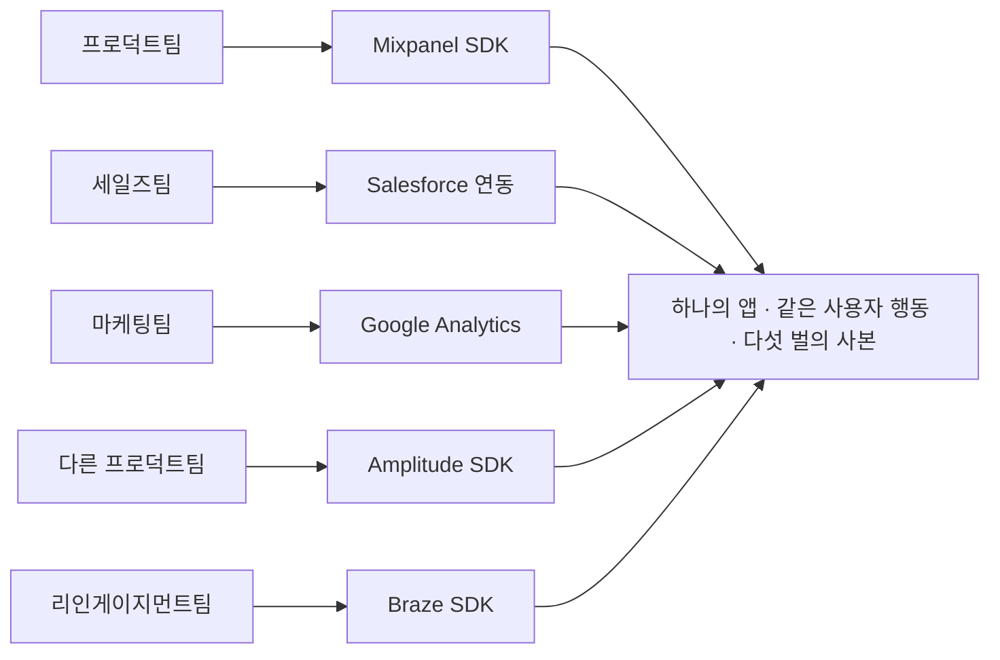

<!-- 개정: 2026-07-26 style_log 편차 7건(Critical 1/Should 4/Nice 2) + factcheck_log 판정 5건(❌1/🕒2/⚠️2) 반영 -->

# 1장. 앱에 추적 SDK가 다섯 개 붙어 있는 이유

2025년 4월, 해커뉴스에 이런 댓글이 하나 올라왔다. 어떤 앱이 왜 이렇게 느려졌느냐는 물음에 한 개발자가 남긴 답이다.

> "내 경험상 컨슈머 웹 앱은 다 빠르게 시작한다. 그러다 누가 말한다. '모든 인터랙션을 Mixpanel로 추적해야 해. 일어난 걸 모르면 무슨 의미가 있어?' 그러면 세일즈팀이 말한다. 'Salesforce에도 추적해야 해. 우리 팀은 아무도 Mixpanel 안 봐.' 그러면 마케팅팀이 말한다. 'GA로 통합해야 해. 다른 건 우리 용도에 안 맞아.' 그러면 다른 프로덕트팀이 말한다. '우리는 Amplitude가 필요해.' 그러면 리인게이지먼트 마케팅팀이 말한다. '우리는 Braze요.'"
>
> — Swizec, Hacker News 댓글 43668825 (2025-04-12)

읽으면서 어딘가 낯익지 않았는가. 이건 한 사람의 경험 진술이고, 업계 전체를 대표하는 조사 결과가 아니다. 그런데도 이 짧은 댓글이 눈에 오래 남는 이유가 있다. 다섯 개의 SDK 가운데 어느 하나도 개발자가 기술적으로 필요해서 넣은 게 아니라는 것. 성능을 재려고 넣은 것도, 장애를 잡으려고 넣은 것도 아니다. 전부 다른 부서가 다른 질문에 답하려고 요구한 것이다.

이 장면 하나에 이 책이 다루려는 도메인의 성격이 거의 다 들어 있다. 다섯 줄짜리 댓글치고는 담고 있는 게 많다.

## 다섯 개의 SDK는 아무도 기술적으로 결정하지 않았다

위 댓글을 다시 읽어보면 이상한 점이 있다. 다섯 개의 도구가 **거의 같은 것을 수집한다.** 사용자가 무엇을 눌렀고 어느 화면에 머물렀고 무엇을 샀는지. 데이터의 내용은 다르지 않다. 다른 건 그 데이터를 누가 어떤 질문을 들고 열어보느냐다.

프로덕트팀은 "이 기능을 사람들이 쓰나?"를 묻는다. 세일즈팀은 "이 계정이 지금 어떤 상태인가?"를 묻는다. 마케팅팀은 "이 채널로 들어온 사람들이 결국 얼마를 썼나?"를 묻는다. 리인게이지먼트팀, 그러니까 멀어진 사용자를 다시 데려오는 일을 맡은 팀은 "이 사람이 방금 장바구니를 버렸으니 지금 메시지를 보내야 하나?"를 묻는다. 같은 로그를 보고도 서로 다른 네 개의 질문을 던지고, 각 질문에 맞춰 최적화된 제품이 이미 시장에 따로 있다.

그래서 도구가 겹친다. 리팩터링으로 해결되는 종류의 겹침이 아니다.

개발자 쪽에서 이 겹침이 실제로 어떤 모양인지 잠깐 그려보자. 결제 버튼 하나에 이벤트를 다섯 번 찍는 코드가 생긴다. 다섯 벤더의 초기화 코드가 앱 시작 경로에 나란히 붙고, 그중 하나가 느리면 첫 화면이 그만큼 늦어진다. 이벤트 이름도 다섯 벌이다. 어느 도구에서는 `purchase_completed`이고 다른 도구에서는 `Order Completed`이며, 어느 쪽에는 통화 코드 필드가 있고 어느 쪽에는 없다. 그리고 언젠가 회의실에서 이런 질문이 나온다. "어제 결제 건수가 A 대시보드랑 B 대시보드에서 다르게 나오는데요, 어느 쪽이 맞나요?"

이 질문에 답하는 사람이 개발자다. 초난감한 상황이다. 둘 다 버그가 아닐 수도 있기 때문이다. 어느 쪽이 취소 건을 빼고 세는지, 앱이 백그라운드로 내려간 사이 이벤트가 유실됐는지, 자정 경계를 서로 다른 타임존으로 잡았는지 — 코드에 에러가 하나도 없는데 숫자만 다른 경우의 수는 이렇게 얼마든지 세울 수 있다. 그리고 이건 드문 일이 아니다. 국내 마테크 회사 마티니의 솔루션 컨설턴트 채용 공고를 열어보면 주요 업무 항목에 **"데이터 불일치, Attribution 오류, 이벤트 누락 등 트러블슈팅"**이 그대로 적혀 있다(2026년 7월 원티드 공고 기준). 트러블슈팅이 직무기술서 본문에 실린다는 건, 그게 예외 상황이 아니라 상시 업무라는 뜻이다.

그림 1. 다섯 개의 SDK는 다섯 개의 팀에서 왔다

이걸 조금 더 일반화해서 말한 사람도 있다. 2019년 해커뉴스의 한 실무자 댓글이다.

> "이 문제의 서로 다른 부분을 푸는 제품들이 있는데, **대부분의 회사는 마케팅 스택으로 2~4개의 제품을 산다**(CDP, 마케팅 자동화, 어트리뷰션, 애널리틱스). LTV 예측 같은 걸 하려면 소프트웨어를 하나 더 사거나 직접 만들어야 한다. **회사마다 마케팅하는 방식이 충분히 달라서, 모두를 위해 이 문제를 end-to-end로 풀 수 있는 단일 제품이 없다.**"
>
> — dlevine, Hacker News 댓글 20299880 (2019-06-27)

괄호 안의 네 단어가 벌써 낯설 수 있다. 지금은 대략 이렇게만 잡아두자. 고객 데이터를 한곳에 모으는 제품(CDP), 그 데이터로 메시지를 자동 발송하는 제품(마케팅 자동화), 어떤 광고가 이 구매를 만들었는지 따지는 제품(어트리뷰션), 그리고 그걸 들여다보는 분석 제품(애널리틱스). 이 장 뒤쪽에 열한 개 용어의 최소 정의를 모아둘 테니 지금 외울 필요는 없다.

중요한 건 마지막 문장이다. 회사마다 마케팅하는 방식이 충분히 다르다. 이 한 문장이 마케팅 스택이 왜 항상 여러 제품의 조합인지를 설명한다. 결제나 인증이라면 "우리 회사만의 특수한 결제"라는 게 그리 많지 않다. 그런데 어떤 고객에게 무엇을 언제 왜 말할 것인가는 회사의 사업 모델 그 자체다. 커머스와 게임과 은행이 같은 방식으로 고객에게 말을 걸 리가 없다. 그러니 단일 제품이 모두를 커버하지 못하고, 회사는 두세 개를 사서 붙이고, 그걸 붙이는 사람이 개발자가 된다.

연동 지옥이라는 말이 여기서 유독 자주 나오는 이유가 이것이다. 그건 누가 게을러서 생긴 부채가 아니라 시장 구조의 결과다. 물론 부채가 아니라고 해서 안 아픈 건 아니다. 오히려 더 난감하다. 원인이 코드 안에 없으니 코드로만은 못 고친다.

## 그래서 이 바닥은 대체 무엇을 하는 곳인가

용어부터 정리하자. Martech은 marketing과 technology를 합친 말이고, 우리말로는 마테크 또는 마케팅 기술 정도로 옮긴다. 그런데 이 정의는 아무것도 설명해주지 않는다. 벤더 홈페이지를 열면 사정이 더 나빠진다. "고객 여정을 오케스트레이션하는 통합 플랫폼" 같은 문장이 줄줄이 나오는데, 읽고 나면 처음보다 덜 알게 된 기분이 든다.

이번 리서치에서 가장 명료했던 정의가 나온 곳은 뜻밖에도 한 실무 리드의 인터뷰였다. 국내 마테크 회사 AB180의 데이터 파이프라인 팀 리드 김재원의 말이다.

> "마케팅 성과 분석이란 어떤 광고를 사용자가 봤다는 것에 대한 기록, 이를 통해 설치나 구매 등의 전환을 일으켰다는 기록을 놓치지 않고 수집해서 인과관계 분석을 돕는 것인데요, Mar-Tech는 이 과정을 기술적으로 풀어 가는 비즈니스 분야라고 생각해 주시면 됩니다."
>
> — AB180 엔지니어링 블로그, 데이터 파이프라인 팀 인터뷰 (게시일 미상)

이 문장이 좋은 이유는 동사가 셋뿐이기 때문이다. **기록하고, 놓치지 않고 수집하고, 인과관계 분석을 돕는다.**

앞의 둘은 개발자에게 익숙한 언어다. 기록은 이벤트 로깅이고, 놓치지 않는 수집은 내구성 있는 파이프라인이다. 유실률, 재시도, 멱등성, 순서 보장. 여기까지는 우리가 이미 하던 일이다.

문제는 세 번째다. 인과관계. 서버 로그를 다룰 때 우리는 인과를 거의 묻지 않는다. 응답이 500이면 원인은 스택 트레이스 안에 있고, 없으면 로그를 더 남기면 된다. 그런데 "이 사람이 이 앱을 깐 이유가 어제 본 그 광고인가"는 스택 트레이스로 답할 수 없다. 그 사람이 광고를 안 봤어도 앱을 깔았을지 우리는 영원히 관측하지 못한다. 관측할 수 없는 것에 답하려고 만든 시스템 — 마테크가 유독 복잡하고, 유독 논쟁이 많고, 유독 벤더가 많은 근본 이유다. (이 문제를 정면으로 다루는 건 11장이다.)

여기서 한 가지 의문이 생긴다. **왜 이 도메인은 개발자에게 유독 불투명하게 느껴질까?** 우리가 익숙한 시스템은 결과가 눈앞에 있다. 페이지가 그려지거나 안 그려지고, 응답이 200이거나 500이다. 그런데 우리가 만든 이 파이프라인의 진짜 결과물은 화면이 아니라 **다른 사람이 다른 방에서 내리는 판단**이다. 마케터가 세그먼트를 보고 예산을 옮기고, 캠페인이 나가고, 몇 주 뒤에 매출이 조금 움직인다. 개발자는 그 끝을 거의 보지 못한 채 중간 구간만 맡는다. 무엇을 위해 이걸 만드는지 모르는 상태로 요구사항만 받는 경험이 반복되면, 시스템은 잘 돌아가는데도 계속 뒷맛이 찜찜하다.

얼마나 많으냐고? 스콧 브링커의 chiefmartec이 집계하는 마테크 랜드스케이프 조사의 2026년판 기준 15,505개다.

> "The martech landscape effectively stopped growing this year, up just 0.79% to 15,505 products."
>
> — chiefmartec, 2026 Marketing Technology Landscape Supergraphic (2026-05-05)

숫자 자체보다 그 안의 움직임이 흥미롭다. 전년 대비 증가율은 0.79%로 사실상 멈췄는데, 그 안에서 **1,488개가 새로 들어오고 1,367개가 빠져나갔다.** 총량은 정지했고 내부 회전은 계속되고 있다.

이 사실이 이 책을 읽는 방식에 직접 영향을 준다. 지금 잘나가는 벤더 하나를 붙잡고 그 제품 문서를 통째로 외우는 공부는 수명이 짧다. 3장에서 보겠지만 이 시장에서는 인수와 합병으로 회사의 간판이 바뀌는 일이 실제로 벌어진다. 그래서 이 책이 다루는 건 제품 사용법보다 구조 쪽이다. 이벤트가 어디로 들어와서 어디에 쌓이고 어떤 계산을 거쳐 어느 채널로 나가는지. 그 구조는 벤더가 바뀌어도 잘 안 바뀐다.

## 한국 독자를 위한 첫 번째 함정 — "CRM"이라는 세 글자

이제 이 도메인에 발을 들이는 한국 개발자가 가장 먼저 밟는 지뢰를 하나 치워두자. 지뢰의 이름은 CRM이다.

영미권에서 CRM이 무엇을 가리키는지는 비교적 또렷하다. Salesforce의 공식 학습 사이트인 Trailhead 문서를 열어보면(2026년 7월 조회 기준 — 이 페이지에는 발행일이 없다) CRM의 세계는 **영업**의 세계다. 핵심 객체가 Account, Contact, Lead, Opportunity이고, 하는 일은 잠재 고객(Lead)을 기회(Opportunity)로 바꿔 파이프라인을 관리하는 것이다. 주 사용자는 영업사원이다.

그런데 한국에서 "CRM 마케팅"이라는 말은 다른 걸 가리킨다. 국내 CDP·메시징 벤더인 노티플라이는 이 말을 이런 뜻으로 쓴다.

> CRM 마케팅이란 "고객이 자사 플랫폼(서비스)에 유입되었을때, 말을 걸고, 구매를 유도하고, 구매한 이후 재탐색을 유도하는 등, **리텐션을 높이는 모든 고객대상 마케팅**"
>
> 채널: "푸시, 모달(IAM), 카카오 알림톡, 카카오 친구톡, 문자 메시지, 이메일 - 총 6가지가 대표적인 매체"
>
> — 노티플라이 블로그 (2023-10-24)

같은 계열의 다른 국내 벤더도 결이 같다. FlareLane은 CRM 마케팅을 "고객 관리와 데이터 분석을 통해 고객 가치를 극대화하는 전략"이며 "신규 고객을 유치하고 기존 고객의 충성도를 높이는 것을 목표로" 한다고 설명한다(FlareLane 블로그, 2025-04-22). 인용한 대목 어디에도 영업 파이프라인이라는 말은 나오지 않는다.

여기서 리텐션이라는 단어를 한 번 받아두자. 한 번 온 고객이 떠나지 않고 계속 오게 만드는 것, 그게 리텐션이다. 그러니까 한국에서 CRM 마케팅이라 부르는 일의 무게중심은 메시지 발송 쪽에 있다. 주 사용자도 마케터고, 핵심 객체는 세그먼트와 캠페인과 메시지다.

여기서 두 출처의 성격을 정직하게 밝혀두는 편이 낫다. 영미권 쪽 서술은 Salesforce의 공식 문서에서 직접 확인한 것이지만, 한국 쪽 서술의 출처는 **둘 다 국내 마테크 벤더의 자사 블로그**다. 그러니 이건 "한국에서 CRM의 학술적 정의가 다르다"는 주장이 아니라, **업계에서 그 말이 실제로 그렇게 쓰인다는 용법의 증거**로 읽는 게 맞다. 근거의 성격이 다르면 주장의 강도도 달라야 한다 — 이 태도는 바로 다음 절의 주제이기도 하다.

용법의 증거로만 봐도 개발자에게는 충분히 실용적이다. 한국 회사에서 "CRM 팀"이 요구사항을 들고 왔다고 해보자. 당신이 영미권 문서로 CRM을 배웠다면 영업 파이프라인 연동을 떠올릴 텐데, 그들이 원하는 건 십중팔구 푸시와 알림톡을 조건에 맞춰 쏘는 시스템이다. 여기서 첫 미팅 한 시간을 통째로 날리는 일이 실제로 벌어진다. 같은 세 글자가 태평양을 건너면서 뜻이 바뀐 탓이다.

그리고 **2023년 시점의 그 채널 목록**에 카카오 알림톡과 친구톡이 상위에 올라와 있다는 사실 자체를 기억해두자. 목록의 구체 구성은 3년 사이 달라졌을 수 있지만, 국내 벤더가 채널을 꼽을 때 카카오 채널이 당연히 끼어 있다는 점은 그대로다. 왜 이 채널만 유독 까다로운지는 9장에서 제대로 연다.

## 이 책을 읽는 법 — 근거의 강도를 구분하는 습관

이 도메인을 공부하다 보면 곤란한 순간이 반복된다. 어떤 숫자나 공식이 마치 오래전에 검증된 정설처럼 문서마다 반복되는데, 정작 출처를 따라가면 아무 데도 도착하지 못하는 것이다.

그래서 이 책은 주장을 인용할 때마다 그 주장이 어디서 왔는지를 같이 적는다. 크게 네 갈래다.

- **벤더 자체 주장** — 벤더가 자기 제품에 대해 한 말. 사실이 아니라 그들이 그렇게 말했다는 사실이다.
- **1차 확인** — 원문 문서나 조문, 릴리스 노트를 직접 열어 확인한 것.
- **학술 근거** — 심사를 거친 저널·학회 논문. 심사를 거치지 않은 기술 보고서와는 구분해서 적는다.
- **업계 관행** — 널리 쓰이지만 뒷받침하는 연구를 찾지 못한 것. 이걸 학술 근거처럼 쓰지 않는 게 이 책의 규칙이다.

말로만 하면 잔소리처럼 들리니 사례를 하나 보자. 고객 생애 가치를 예측할 때 파이썬 쪽에서 자주 등장하는 `lifetimes` 라이브러리에는 `GammaGammaFitter`라는 클래스가 있다. 고객이 앞으로 얼마를 쓸지 금액 쪽을 모델링하는 감마-감마 모델의 구현이다. 사내 위키에 "감마-감마 모델을 적용했다"고 적으면 꽤 학술적으로 들린다.

그런데 이 모델의 출처는 저널 논문이 아니다. **브루스 하디의 개인 웹사이트에 올라온 미간행 기술 노트**(brucehardie.com Note #25, 최종 갱신 2013-02-25)다. 이번 리서치에서 랜딩 페이지를 열어 저널 게재 논문이 아님을 확인했다.

이걸 두고 그 모델이 틀렸다거나 쓰면 안 된다고 말하려는 게 아니다. 요점은 다르다. **널리 쓰인다는 것과 검증됐다는 것은 다른 말이고, 라이브러리가 구현했다는 것도 검증의 증거가 아니다.** 그런 항목이 하나가 아니다. 이 책의 리서치는 업계가 학술적 권위처럼 사용하지만 실제로는 근거가 끊기는 항목을 열두 건 추려냈고, 그 목록을 4장의 뼈대로 삼는다. 거기에는 마케팅 지표뿐 아니라 여러분이 아마 기술 용어로 알고 있을 이름들도 섞여 있다.

같은 이유로 이 책은 인용마다 시점을 붙인다. 몇 년에 나온 문서인지, 언제 확인한 페이지인지. 발행일이 아예 없는 문서라면 그 사실까지 적는다. 번거로워 보이지만 앞 절의 숫자를 떠올리면 납득이 될 것이다. 한 해에 천 개 넘는 제품이 들어오고 나가는 시장에서, 시점 없는 문장은 몇 년 뒤 참인지 거짓인지조차 판정할 수 없는 문장이 된다. 버전 없는 API 문서를 읽는 기분과 비슷하다.

이게 태도의 문제로만 들린다면, 이 습관이 실제로 쓰이는 순간을 세어보면 된다. 라이브러리를 고를 때. 벤더가 "저희는 AI 기반으로"라고 시작할 때. 그리고 마케터가 가져온 숫자를 시스템 요구사항으로 옮길 때. 세 번 다 던질 질문이 달라진다. 마테크에 들어와서 가장 먼저 늘어야 하는 감각이 이것이다. 코드보다 먼저 는다.

## 이 책에서 반복될 열한 개의 단어

앞 절들을 읽으며 이미 눈치챘겠지만, 이 도메인이 개발자에게 불투명한 첫 번째 이유는 어려운 알고리즘이 아니라 어휘다. 어휘를 모르는 상태로 아키텍처 문서를 읽으면 문장은 다 해석되는데 의미가 안 잡힌다. 그 경험이 몇 번 반복되면 "나는 이 분야가 안 맞나 보다"라는 엉뚱한 결론에 도달하기 쉽다. 찜찜한 일이다. 어휘 문제를 적성 문제로 오해한 것이니까.

그래서 지도를 먼저 깔아두자. 아래 열한 개는 이번 리서치에서 **국내외 채용 공고 본문·실무 블로그·개발자 커뮤니티 글에 실제로 등장한 것만** 추린 목록이다. 사전에서 옮겨온 게 아니라, 누군가가 실제로 그 단어를 써서 사람을 뽑거나 일을 설명한 자리에서 가져왔다. 여기서 정의를 끝내려는 게 아니다. 지금은 "아, 이건 뒤에서 제대로 다루는구나"를 알아둘 정도면 충분하다.

| 용어 | 지금 알아둘 최소한 | 제대로 여는 곳 |
|---|---|---|
| **Attribution (어트리뷰션)** | 광고를 봤다는 기록과 설치·구매 같은 전환 기록을 이어 붙여, 그 전환이 어디서 왔는지 귀속시키는 일 | 11장 |
| **MMP (Mobile Measurement Partner)** | 모바일 측정 파트너. 모바일 앱 쪽 어트리뷰션을 다루는 제품을 가리키는 말로 채용 공고에 등장한다 | 3장·11장 |
| **CDP (Customer Data Platform)** | 계정 데이터만이 아니라 온·오프라인 상호작용 행동 데이터까지 모으는 플랫폼 | 3장 |
| **CDI (Customer Data Infrastructure)** | CDP의 대안 명칭. 한 벤더 창업자가 "더 정확한데 아는 사람이 거의 없다"고 말한 이름이다 | — |
| **이벤트 택소노미 (Event Taxonomy)** | 이벤트 유형(Category) + 이벤트(Event) + 속성(Property)의 3층 분류 체계 | 2장 |
| **PA (Product Analytics)** | 제품 분석. 이 장 첫머리에 나온 Amplitude·Mixpanel이 이 계열이다 | — |
| **Identity Graph / Identity Resolution** | 여러 식별자를 한 사람으로 묶는 것 | 7장 |
| **Reverse ETL** | 웨어하우스에서 SaaS 도구로 데이터를 되돌려 보내는 것. 한 실무자의 표현으로는 "기본적으로 SQL에서 API로" | 3장·7장 |
| **Deliverability (딜리버러빌리티)** | 메일이 실제로 수신함에 도달하는 능력. SPF·DKIM·DMARC, IP 평판, 블랙리스트가 여기 얽힌다 | 9장 |
| **Segment (세그먼트)** | 조건으로 뽑아낸 사용자 집합 | 4장 |
| **알림톡 / 친구톡** | 한국 전용 채널. 알림톡은 정보성(채널 추가가 필요 없고 템플릿 사전 심사를 받는다), 친구톡은 광고성 | 9장 |

표에 손댈 곳이 몇 군데 있으니 짚어두자.

Segment는 두 가지를 가리킨다. 소문자로 쓰면 조건으로 뽑아낸 사용자 집합이고, 대문자로 시작하는 Segment는 회사이자 제품 이름이다. 2장에서 "Segment의 스펙"을 이야기할 때는 후자다. 문맥으로 구분되긴 하는데, 처음에는 이게 은근히 헷갈린다.

CDP는 여기서 최소 정의만 두고 넘어간다. 이 말을 만든 사람의 원문과 시장이 실제로 쓰는 뜻이 갈라져 있고, 그 갈라진 틈이 3장 전체의 소재이기 때문이다. 지금 정의를 단단히 굳혀두면 3장에서 오히려 불편해진다.

CDI와 PA에는 담당 장 표시가 없다. 뒤에서 슬쩍 다루겠다는 뜻은 아니다. 이 두 단어는 위 한 줄이 사실상 전부여서 따로 열 장이 없다는 뜻이다. 공고나 문서에서 마주쳤을 때 당황하지 않을 정도면 충분하다.

CDI에는 곁가지 이야기가 하나 붙는다. 이 말은 RudderStack의 창업자가 해커뉴스에서 자기 회사의 포지셔닝 이야기를 하다가 꺼낸 것이다(2021년). CDP라는 말은 널리 알려졌지만 범위가 너무 넓고, CDI가 더 적확한데 아는 사람이 거의 없다는 취지였다. 재미있지 않은가. 이 바닥에서 제품을 만드는 사람조차 자기가 만드는 것을 뭐라고 불러야 할지 고르기 어려워한다. 앞에서 불투명하다고 했는데, 그 불투명함이 바깥에서 들여다보는 사람만의 문제가 아니라는 증거다.

## 이벤트 하나가 캠페인이 되기까지

지도를 마지막으로 한 번 더 넓혀보자. 이 책은 열두 장 동안 **이벤트 하나가 발생해서 캠페인으로 나가기까지의 경로**를 따라간다. 네 걸음이다.

**첫째, 어휘와 지도를 얻는다(1~4장).** 지금 읽고 있는 이 장이 그 시작이고, 2장에서 곧바로 안심 장치가 하나 놓인다. 벤더가 다르고 이름이 달라도 핵심 스키마는 놀랄 만큼 단순하다는 것. 여기서 여러분의 백엔드 직관이 처음으로 작동하기 시작한다. 3장은 그 위에 시장 지도를 얹고, 4장은 마케터가 그 데이터로 무슨 질문을 던지는지를 본다.

**둘째, 실제로 걷는다(5~7장).** 이벤트를 잃지 않고 받아내고, 수억 행을 집계하고, 밀리초 안에 한 사람의 프로필을 꺼내 밖으로 내보낸다. 이 책에서 기술적으로 가장 무거운 구간이다.

**셋째, 걸어본 경로를 의심한다(8~11장).** 그 위에 얹히는 예측 모델, 메시지가 나가는 순간 등장하는 채널과 빈도의 제약, 파이프라인 전체를 관통하는 규제, 그리고 마지막 의심. 우리가 만든 이 시스템이 내놓는 숫자를 믿어도 되는가.

**넷째, 자리를 찾는다(12장).** 이 지도 위 어디에 앉을 것인가.

여기까지 읽고 나면 처음의 그 앱으로 돌아갈 수 있다. SDK 다섯 개가 붙은 앱 말이다. 그 앱을 느리게 만든 건 잘못 짠 코드가 아니었다. 프로덕트팀과 세일즈팀과 마케팅팀이 서로 다른 질문을 들고 왔고, 그 질문들이 각자의 제품을 데려온 것이다. 그리고 그 질문들이 무슨 뜻인지 몰랐기 때문에, 개발자는 요구를 그대로 받아 적는 것 말고는 할 수 있는 일이 없었다.

부족했던 건 코드가 아니라 어휘였다. 지도는 손에 들었다. 그런데 지도가 알려주지 않는 게 하나 있다. 이 많은 제품이 실제로 무엇을 저장하고 있는가. 답은 허탈할 만큼 단순하다.
