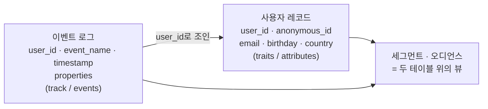

# 2장. 결국 두 테이블이다 — 고객 데이터 모델과 이벤트 택소노미

CDP는 흔히 "흩어진 고객 데이터를 하나로 통합하는 플랫폼"이라고 소개된다. 벤더 홈페이지의 도식을 보면 그 말이 맞는 것 같기도 하다. 왼쪽에서 웹·앱·POS·콜센터·광고 플랫폼의 화살표가 몰려들고, 가운데에 상자가 열 개쯤 쌓여 있고, 오른쪽으로 다시 화살표가 뻗어 나간다. 상자마다 붙은 이름은 하나같이 크다. 통합, 프로필, 인텔리전스, 오케스트레이션. 이런 그림을 보면 "여기 들어가려면 내가 모르는 뭔가 거대한 게 있겠구나" 싶어진다.

그런데 소개 페이지를 닫고 **개발자 문서**를 열면 이야기가 달라진다. Adobe, Segment, RudderStack, Insider One, Bloomreach, Klaviyo. 회사도 나라도 붙인 이름도 다른데, 스키마 문서가 설명하는 구조는 놀랍도록 똑같다. **사용자 레코드 하나, 시계열 이벤트 로그 하나.**

그러니 정의를 한 번 뒤집어보자. CDP는 "고객 데이터를 통합하는 플랫폼"이기 이전에, 개발자에게는 **두 테이블 위에 뷰와 조인과 인덱스를 잔뜩 얹어놓은 것**에 훨씬 가깝다. 이 문장이 이 장의 전부이고, 아마 이 책에서 가장 먼저 안심하게 될 지점이다.

## 두 테이블이라는 발견

가장 명시적인 언어로 이걸 말해주는 건 Adobe다. Adobe Experience Platform의 데이터 모델인 XDM(Experience Data Model)에는 스키마를 세울 때 바닥에 까는 **클래스**라는 개념이 있는데, 그중 대표 격인 둘의 정의문이 이렇다.

> **XDM Individual Profile**: "A record-based class that forms a singular representation of the attributes of both identified and partially identified subjects."
>
> **XDM ExperienceEvent**: "A time-series-based class used to capture the state of the system when an event (or set of events) occurred, including the point in time and identity of the subject involved."
>
> — Adobe Experience League, XDM 문서 (페이지 표기 "Last update May 23, 2026")

읽어보면 어렵지 않다. 하나는 **record-based**, 레코드 기반이다. 사용자 한 명당 한 줄이고, 그 줄에는 시간과 무관하게 성립하는 속성이 들어간다. 다른 하나는 **time-series-based**, 시계열 기반이다. "언제 무슨 일이 일어났는가"가 계속 쌓인다. 이 두 문장을 읽고 백엔드 개발자가 머릿속에 그리는 그림은 정확히 맞다. `users` 테이블 하나와 append-only 로그 테이블 하나.

그리고 이 구조는 Adobe만의 것이 아니다. 이번 리서치에서 실제로 문서를 열어본 벤더들을 같은 축에 놓아보면 이렇게 된다.

| 개념 | Segment Spec | RudderStack | Insider One (UCD) | Adobe (XDM) | Bloomreach | Klaviyo |
|---|---|---|---|---|---|---|
| 사용자 식별 | `identify` + `userId` / `anonymousId` | `Identify` | `identifiers`(`email`/`phone_number`/`uuid`) 또는 `insider_id` | (identity graph 언급만) | hard IDs / soft IDs | `Profiles` |
| 사용자 속성 | `traits` | (Identify의 traits) | `attributes` + `custom` | **XDM Individual Profile** | Customers | `Profiles` |
| 행동 이벤트 | `track` + `event` + `properties` | `Track` | `events[]` + `event_name` + `event_params` | **XDM ExperienceEvent** | Events | `Events` |
| 화면/페이지 | `page` / `screen` | `Page` / `Screen` | `type: 'home'`·`'product'`·`'cart'` 등 고정 타입 | 확인 불가 | 확인 불가 | 확인 불가 |
| 신원 병합 | `alias` | `Alias` | Update Identifiers API | 확인 불가 | (hard/soft ID 병합) | 확인 불가 |

표를 읽기 전에 한 가지 짚어두자. 여기 적힌 **"확인 불가"는 "그 제품에 그 기능이 없다"는 뜻이 아니다.** 이번 리서치가 실제로 열어본 페이지 범위 안에서 해당 문장을 찾지 못했다는 뜻일 뿐이다. 사소해 보여도 사소하지 않다. 벤더 비교를 하다 보면 "문서에서 못 찾았다"가 어느새 "그 제품은 그걸 못 한다"로 둔갑하고, 그렇게 만들어진 비교표가 팀의 기술 선택 회의에 올라간다.

이제 표를 보자. **속성과 이벤트**의 두 줄이 전 벤더에서 예외 없이 반복된다. Segment는 `traits`와 `track`, Insider는 `attributes`와 `events`, Bloomreach는 Customers와 Events, Klaviyo는 `Profiles`와 `Events`다. 이름만 바꿔 부르고 있을 뿐이다.

Insider One의 CDP 레이어인 UCD(Unified Customer Database) 문서는 자기 개념을 셋으로 소개하는데, 개발자 언어로 옮기면 구조가 더 선명해진다.

- **Identifiers** — "anything specific to the user". 여러 소스의 데이터를 한 사람으로 묶는 **조인 키**다.
- **Events** — "User actions across all online and offline channels, including add-to-carts, purchases, visits, and logins". **append-only 시계열**이다.
- **Attributes** — "enable you to collect users' information, such as age, gender, birthday…". **사용자 행의 컬럼**이다.

조인 키, 시계열 로그, 행의 컬럼. 새로 배울 게 없다. 관계는 이렇게 그려진다.


그림 1. 사용자 레코드와 이벤트 로그, 그리고 그 위에 얹히는 것

마케터가 "최근 30일 안에 장바구니에 담고 결제는 안 한, 서울 거주 20대"를 달라고 할 때 그 요구가 도착하는 곳이 이 그림이다. 앞부분은 이벤트 로그의 시간 조건, 뒷부분은 사용자 레코드의 컬럼 조건이다. 조인 하나와 `WHERE` 절 몇 개. **나머지는 전부 그 위의 뷰·조인·인덱스다.**

물론 실제 제품이 이렇게 단순하다는 뜻은 아니다. 이 두 테이블을 실시간으로 유지하면서 수억 행을 몇 초 안에 스캔하고 동시에 밀리초 단위로 한 사람을 꺼내오는 일은 전혀 만만하지 않다. 다만 **모르는 게 구조가 아니라 규모라는 것**을 아는 쪽이 훨씬 든든하다.

## 식별자는 왜 항상 둘인가

두 테이블이라는 그림을 그리고 나면 곧바로 의문 하나가 생긴다. 이벤트 로그의 각 행을 사용자 레코드에 조인하려면 `user_id`가 있어야 하는데, **로그인하지 않은 사람의 이벤트는 어디에 붙는가?**

사변적인 질문이 아니다. 상품 상세를 열 번 보고 장바구니에 담은 다음 결제 직전에야 로그인하는 사람을 생각해보자. 흥미로운 행동은 전부 로그인 **전에** 일어났다. 그 열 번을 로그인한 사람에게 붙이지 못하면, "장바구니 이탈자에게 그 상품 쿠폰을 보내주세요"라는 요구에 보낼 상품이 없다.

그래서 이 문제를, 이번 리서치가 문서를 연 벤더들이 하나같이 같은 방식으로 풀어놓았다. **식별자를 두 등급으로 나눈다.**

- Segment는 `userId`와 `anonymousId`를 나눈다.
- Bloomreach는 아예 **hard ID / soft ID**라는 이름을 붙였다.
- Insider One은 파트너가 넘기는 `identifiers`(`email`·`phone_number`·`uuid`)와 자기가 발급하는 `insider_id`를 구분한다.

한쪽은 "이 사람이 누구인지 우리가 확실히 아는 키"이고, 다른 쪽은 "같은 브라우저·같은 기기라는 것만 아는 키"다. 서로를 언급한 적도 없는 회사들이 같은 이원 구조에 도달했다는 관찰은, 이게 벤더의 취향이 아니라 **도메인이 강제하는 구조**라는 쪽을 가리킨다.

문제는 그다음이다. 익명 키로 쌓인 이벤트를 언제, 어떤 규칙으로 식별 키에 합칠 것인가. 한 사람이 노트북에서 보고 폰에서 사고 회사 PC에서 다시 들어오면 익명 키가 셋이 된다. 그중 둘이 사실 같은 사람이라는 판단은 누가 하는가. 이 문제에는 **아이덴티티 레졸루션(Identity Resolution)**과 **ID 그래프(Identity Graph)**라는 이름이 붙어 있고, 7장에서 union-find 자료구조까지 끌고 내려가 다룬다. 지금은 "식별자가 둘로 나뉘어 있고, 그 둘을 잇는 일이 따로 있다"는 것만 챙겨두면 충분하다.

## 수집의 전부가 여섯 개 질문이다

두 테이블에 데이터를 넣으려면 클라이언트에서 서버로 뭔가를 보내야 한다. 그 문법을 가장 깔끔하게 정리해둔 것이 **Segment Spec**이다. 이 스펙이 정의하는 API 콜은 여섯 개뿐이고, 각각의 한 줄 정의는 이렇다.

| 콜 | 원문 정의 |
|---|---|
| **Identify** | "who is the customer?" |
| **Track** | "what are they doing?" |
| **Page** | "what web page are they on?" |
| **Screen** | "what app screen are they on?" |
| **Group** | "what account or organization are they part of?" |
| **Alias** | "what was their past identity?" |

인용 경로는 정직하게 밝혀두자. 이 문장들은 렌더된 문서 사이트에서 가져온 게 아니다. `segment.com/docs`는 조회 시점에 403으로 막혀 있었고, 위 원문은 **Segment가 공개해둔 문서 소스 리포지터리의 raw 마크다운**에서 확인한 것이다. 1차 소스이긴 하되 경로가 다르다.

여섯 개 질문을 한국어로 늘어놓으면 이렇다. **누구인가 / 무엇을 하는가 / 어느 페이지인가 / 어느 화면인가 / 어느 조직인가 / 예전 정체는 무엇인가.** 마케팅 데이터 수집의 전부다. 이보다 짧은 도메인 입문은 아마 없을 것이다.

`identify`는 사용자 레코드를 채우고 `track`은 이벤트 로그에 한 줄을 넣는다. 앞 절의 두 테이블이 그대로 두 개의 콜로 대응한다. `identify`에는 예약 `traits`가 정해져 있고 — `email`, `firstName`, `lastName`, `phone`, `birthday`, `company` 등 열일곱 가지다 — 이 이름을 그대로 쓰면 다운스트림 도구들이 별도 매핑 없이 알아듣는다. `track` 쪽 예약 property는 셋뿐이다. `revenue`("Amount of revenue an event resulted in"), `currency`, `value`. 돈에 관한 것만 예약해뒀다는 점이 인상적이다.

여섯 개가 다 똑같이 중요한 건 아니다. **B2B와 B2C의 갈림길이 `group` 콜에 있다.** 한 사용자를 회사·조직·계정에 묶는 이 콜은 B2C 서비스에서는 거의 죽어 있는 필드지만, B2B SaaS에서는 계정 단위 분석과 과금이 통째로 여기 걸린다. 어느 스펙을 만나든 "우리 서비스에서 이 필드는 살아 있나"를 먼저 물어보는 편이 낫다.

### `context.channel` — 스펙에 박혀 있는 설계 문제

모든 콜에는 `context`라는 객체가 따라붙는다. 열여덟 개 필드에 앱 정보·기기·OS·로케일·타임존·IP 같은 환경 정보가 담긴다. 그중 하나가 유독 눈에 띈다.

> `channel` (String): "Where the request originated from: server, browser, or mobile."

이 이벤트가 **서버에서 왔는지, 브라우저에서 왔는지, 모바일 앱에서 왔는지**가 스펙의 일급 필드로 박혀 있다. 왜 이걸 스펙 레벨에서 구분할까? 같은 구매 이벤트라도 브라우저에서 쏜 것과 서버에서 쏜 것은 신뢰도가 다르고, 광고 차단기와 브라우저 정책의 영향을 받는 정도가 다르고, 무엇보다 **사라질 확률이 다르기 때문이다.** "이벤트를 어디서 쏠 것인가"는 취향이 아니라 설계 문제이고, 서버사이드 태깅이라는 이름으로 10장에서 다시 만난다.

### 개발자가 가장 자주 틀리는 지점: `alias`

여섯 개 중 마지막 `alias`가 함정이다. 이름이 "예전 정체는 무엇인가"이니, 앞 절에서 본 문제 — 익명 사용자가 로그인했을 때 이전 이벤트를 이어 붙이는 일 — 을 여기서 처리하면 될 것 같다. 실제로 그렇게 짜는 사람이 많다.

그런데 문서는 이렇게 말한다.

> "an advanced method used to merge 2 unassociated user identities, effectively connecting 2 sets of user data in one profile."

그리고 곧바로, 이건 **고급 유스케이스 전용**이며 Segment의 Unify 제품 안에서 프로필을 병합하는 용도로는 **쓸 수 없다**고 못박는다. 그건 아이덴티티 레졸루션이 하는 일이라는 것이다. 즉 `alias`는 "다운스트림 목적지 호환 때문에 추적 중인 ID를 명시적으로 바꿔야 할 때" 쓰는 도구지, 익명→식별 전환의 표준 경로가 아니다.

이름이 딱 맞아 보이는 API가 사실은 그 용도가 아니었다는 걸, 개발자는 언제 알게 될까. 컴파일 에러도 없고 4xx도 없다. 호출은 성공하고 응답은 200이다. 몇 주 뒤 마케터가 "왜 이 사람 프로필이 두 개죠?"라고 물을 때, 그때 안다. 뒷맛이 찜찜한 종류의 버그다. 이 장의 마지막 절이 바로 이 찜찜함에 관한 이야기다.

## 커머스 이벤트는 이미 이름이 정해져 있다

`track`으로 이벤트를 보낼 때 이름은 자유 문자열이다. `Product Viewed`라고 써도 되고 `product_view`나 `PDP_ENTER`라고 써도 된다. 자유로운 건 좋은 일 같지만, 팀마다 다르게 짓기 시작하면 몇 달 뒤 아무도 이벤트 테이블을 못 믿는 상태가 온다.

그래서 Segment는 커머스 영역의 이벤트 이름을 아예 **예약**해뒀다. v2 스펙 기준으로 그룹과 대표 이벤트를 추리면 이렇다.

| 그룹 | 예약 이벤트 이름 (일부) |
|---|---|
| **Browsing** | `Products Searched`, `Product List Viewed`, `Product List Filtered` |
| **Promotions** | `Promotion Viewed`, `Promotion Clicked` |
| **Core Ordering** | `Product Viewed`, `Product Added`, `Product Removed`, `Cart Viewed`, `Checkout Started`, `Order Completed`, `Order Refunded` 등 |
| **Coupons** | `Coupon Entered`, `Coupon Applied`, `Coupon Denied`, `Coupon Removed` |
| **Wishlisting** | `Product Added to Wishlist`, `Product Removed from Wishlist`, `Wishlist Product Added to Cart` |
| **Sharing** | `Product Shared`, `Cart Shared` |
| **Reviewing** | `Product Reviewed` |

문서가 밝히는 효용은 명확하다. **이 이름을 그대로 쓰면 다운스트림 도구가 별도 매핑 없이 해석한다.**

이 문장은 뒤집어 읽을 때 더 흥미롭다. 목록에 없는 이름을 쓰면? 커스텀 이벤트가 되고, 커스텀 이벤트는 그 무료 해석을 받지 못한다. 도구마다 매핑을 손으로 붙여야 하고, 붙이지 않으면 그 행동은 다운스트림에서 그냥 보이지 않는다.

이제 목록을 다시 훑어보자. `Product Removed`는 있다. `Coupon Denied`도 있다. 위시리스트에 담고 빼는 것도, 장바구니를 공유하는 것도 각자 이름을 갖고 있다. 그런데 **"상품 두 개를 비교했다"에 해당하는 이름은 없다.** 스크롤을 얼마나 내렸는지도, 리뷰를 몇 초 읽었는지도 없다.

이게 무엇을 뜻하는가. **예약 이벤트 목록이 커버하는 행동 범위가, 그 도구를 쓰는 마케터가 별다른 준비 없이 던질 수 있는 질문의 경계와 대략 일치한다는 뜻이다.** "쿠폰을 넣었다가 거절당한 사람"은 이름이 있으니 곧바로 세그먼트가 된다. "두 상품을 놓고 저울질하다 이탈한 사람"은 이름이 없으니, 누군가 먼저 이벤트를 설계하고 개발자가 심어야 그 질문이 성립한다. 아무도 시작하지 않으면 그 질문은 영영 던져지지 않는다.

여기에 이 도메인의 규칙 하나가 있다. **측정하지 않은 것은 마케팅할 수 없다.** 마케터가 어떤 질문을 하지 않는 이유가, 그게 중요하지 않아서가 아니라 **애초에 그 행동에 이름이 없어서**인 경우가 생각보다 많다. 그리고 이름을 붙이는 사람은 대개 개발자다.

한 가지 더. 같은 커머스 도메인 지식을 벤더마다 다르게 인코딩한다는 점도 개발자에게는 흥미롭다. Insider One의 웹 SDK는 페이지 타입을 메서드에 못박아뒀다 — `type: 'product'`를 넣으면 `product_detail_page_view`가 발생한다. 반면 Segment는 문자열 규약으로 풀었다 — `track('Product Viewed')`. **강한 타입이냐 유연한 컨벤션이냐**는, 개발자가 다른 맥락에서 이미 수백 번 마주쳐본 트레이드오프다. 다만 이 대조는 이번 리서치가 두 문서를 나란히 놓고 관찰한 것이고, 어느 벤더도 상대를 언급한 적은 없다.

## 개발자가 실제로 만지는 표면

여기까지가 개념이라면, 실제 코드는 어떤 모양일까. 한 벤더의 웹 SDK를 열어보자. Insider One의 문서(페이지 표기 2026-07-23)에 나오는 통합 방식은 이렇게 시작한다.

```html
<script async src="//{partnerName}.api.useinsider.com/ins.js?id={partnerId}"></script>
```

```javascript
window.InsiderQueue = window.InsiderQueue || [];
window.InsiderQueue.push({ type: 'method_type', value: { /* ... */ } });
```

익숙하지 않은가? 전역 배열을 만들어두고 푸시하는 패턴은 웹 분석 스크립트들이 오래 써온 방식이다. 문서는 **큐가 태그보다 먼저 정의되어야 한다**고 명시한다. 비동기로 로드되는 스크립트가 도착하기 전의 호출을 잃지 않으려면 이 순서를 지켜야 한다. 이 한 줄이 뒤집혀 "왜 초기 진입 이벤트만 안 찍히지?"로 며칠을 태우는 일이 실제로 있다.

사용자 속성을 밀어 넣는 스키마(`type: 'user'`)를 보면 앞에서 본 개념이 그대로 필드로 나타난다.

| Field | Type | Sample |
|---|---|---|
| `uuid` | String | "INS123" |
| `email` | String | "jdoe@useinsider.com" |
| `phone_number` | String (E.164) | "+120394879878" |
| `birthday` | Datetime | "2000-01-20T00:00:00Z" |
| `email_optin` / `sms_optin` / `whatsapp_optin` | Boolean | true |
| `gdpr_optin` | Boolean | true |
| `custom` | Object | {"membership": "Silver"} |

세 가지를 짚어두자.

첫째, **`uuid`·`email`·`phone_number` 중 최소 하나는 있어야 한다.** 앞 절의 식별자 이야기가 여기서 필수 조건으로 나타난다. 사용자 레코드는 조인 키 없이 존재할 수 없다.

둘째, 페이지 타입이 메서드로 고정돼 있다. `home` → `home_page_view`, `category` → `listing_page_view`(`breadcrumb` 배열을 요구한다), `product` → `product_detail_page_view`, `cart` → `cart_page_view`, `purchase` → `confirmation_page_view`, 나머지는 `other`. 앞에서 말한 "강한 타입" 쪽의 실물이다. 여기에 `add_to_cart`·`remove_from_cart`·`custom_event` 같은 이벤트 메서드가 붙고, 사용자·페이지 데이터를 다 넣은 뒤 페이지당 한 번 쏘는 `init`이 "critical initialization trigger"로 지정돼 있다.

셋째가 가장 중요하다. **`gdpr_optin`, `email_optin`, `sms_optin`이 커스텀 속성이 아니라 사용자 속성 스키마의 일급 필드다.** 동의 여부가 `custom` 안 어딘가에 끼워 넣는 값이 아니라 이름·생일과 나란한 자리를 차지한다. 마케팅 데이터 모델에서 **동의는 부가 정보가 아니라 스키마의 뼈대**라는 뜻이다. 10장에서 "동의는 왜 boolean 하나가 아닌가"를 파고들 때 이 필드들이 출발점이 된다.

잔재미 하나. 브랜드와 문서 도메인은 `insiderone.com`인데 **태그 스크립트 호스트는 여전히 `useinsider.com`**이고, 샘플 이메일과 API 호스트도 마찬가지다. 리브랜딩이 프레젠테이션 레이어에만 적용되고 데이터 평면은 레거시 도메인을 유지하는, 실무에서 흔한 패턴이다. 벤더가 설명한 게 아니라 이번 리서치가 문서들을 대조하며 관찰한 것이다(2026년 7월 시점).

이 절 전체가 **한 벤더의 표면**이라는 점도 분명히 해두자. 다른 벤더의 SDK는 다르게 생겼다. 여기서 가져갈 것은 API 이름이 아니라 **개념이 코드 표면에 어떻게 내려앉는지의 감각**이다.

## 그 스키마는 누가 정하는가

두 테이블의 구조는 벤더가 정해준다. 그런데 **이벤트 이름과 프로퍼티를 실제로 무엇으로 채울지**는 아무도 정해주지 않는다. 이 작업에는 **이벤트 택소노미(event taxonomy)** 설계라는 이름이 붙어 있고, 국내 채용 공고에서도 심심찮게 보이는 업무다.

한 국내 벤더가 자사 기술블로그에 이 과정을 여덟 단계로 정리해둔 글이 있다(마티니, 2024-05-30, 문소윤). 목적·방향성 수립에서 출발해 주요 지표 설정, 사용자 여정 스케치, 이벤트·프로퍼티 설계로 내려온 다음, **마케터 협의(5)와 개발자 협의(6)**를 거쳐 QA와 최종 수정으로 끝난다. 여기까지는 어느 설계 문서에나 있을 법한데, 정작 눈에 띄는 건 그 글이 5-6단계에 대해 스스로 적어둔 문장이다.

> "5-6번 프로세스의 경우 수차례 반복될 수 있습니다. 모든 담당자들과의 합의점이 반영된 택소노미를 설계하기까지란 많은 소통과 협의가 필요한 데다, 마케터의 요구사항을 운 좋게 완벽히 반영했다고 하더라도 기능상 점검과 동작 검증이 불가피하기 때문입니다."

이 글이 자사 방법론을 알리는 성격의 콘텐츠라는 점은 감안하고 읽어야 한다. 그런데 바로 그래서 이 대목이 의미 있다. **자기 방법론을 소개하는 글에서조차 "마케터 협의 ↔ 개발자 협의가 수차례 반복된다"고 적어놓았다면**, 그 반복은 프로세스가 미숙해서 생기는 예외가 아니라 이 일의 기본 사양에 가깝다. 요구사항이 한 번에 확정되지 않는다는 것, 그게 누가 서툴러서가 아니라는 것. 알고 들어가면 훨씬 덜 지친다.

## 이벤트 스키마는 API 스펙이다

백엔드 개발자는 API 응답 형식을 바꿀 때 어떻게 하는가? 버전을 올리고, 컨슈머에게 알리고, 마이그레이션 기간을 두고, 문서를 고친다. 필드 이름 하나 바꾸는 데도 릴리스 노트를 쓴다.

그런데 **같은 개발자가 프론트엔드 이벤트는 아무 협의 없이 바꾼다.** 왜 그럴까? 답은 시시할 정도로 단순하다. 이벤트에는 컴파일러도, 타입 체커도, 통합 테스트도 없기 때문이다. 아무것도 깨지지 않으니 아무도 막지 않는다.

문제는 실제로는 깨진다는 것이다. 조용히 깨진다. 대표적인 사고 네 가지를 보자.

**하나, 필드 이름이 바뀐다.** 앱 릴리스에서 `purchase_amount`를 `amount`로 정리했다. 리팩터링으로는 훌륭하다. 그런데 세그먼트 SQL은 여전히 `purchase_amount`를 참조한다. 값이 NULL이 되고, "고액 구매자" 세그먼트가 **0명이 된다.** 아무도 에러를 보지 못한다 — 쿼리는 성공했으니까. 마케터는 3주 뒤에 묻는다. "이번 달 VIP 캠페인 성과가 왜 없죠?"

**둘, 타입이 바뀐다.** `amount`가 숫자에서 `"39,900"` 같은 문자열이 된다. 집계가 이상해지거나 조용히 0이 된다.

**셋, 단위가 바뀐다.** 원 단위로 보내던 값을 어느 릴리스부터 센트로 보내기 시작한다. "10만원 이상 구매자" 세그먼트가 **전 사용자**가 된다. 그리고 전 사용자에게 VIP 쿠폰이 나간다. 돈이 나가는 사고다. 상상만 해도 아찔하다.

**넷, 이벤트가 중복 발송된다.** SDK 초기화 문제로 `purchase`가 두 번 찍히면 구매 횟수 기반 세그먼트가 전부 부풀려진다. 신규 고객이 충성 고객으로 승격되고, 충성 고객 캠페인이 엉뚱한 사람에게 나간다.

네 사고의 **공통점을 보자. 시스템은 아무 에러도 내지 않는다.** 파이프라인은 성공했고, SQL은 실행됐고, 캠페인은 발송됐다. 틀린 대상에게. 일반 백엔드에서 잘못된 데이터는 에러 로그를 남기고 알림을 울린다. **Martech에서 잘못된 이벤트는 조용히 잘못된 캠페인을 발송한다.** 이 차이가 이 도메인의 성격을 상당 부분 설명한다.

그렇다면 어떻게 해야 할까? 프레임 자체를 바꾸는 편이 낫다. **이벤트 스키마를 API 스펙과 같은 등급으로 취급하는 것**이다. 이 발상에 붙은 이름이 **데이터 계약(data contract)**이고, 실무에서는 대략 다음과 같은 모습으로 구현된다.

- 스키마를 코드 저장소에 두고 **PR로 리뷰**한다. 이벤트 필드 변경이 코드 리뷰를 거친다.
- **CI에서 호환성을 검사**한다. 하위 호환을 깨는 변경이면 빌드가 실패한다.
- **프로듀서 SDK가 스키마에서 타입을 생성**한다. 오타가 컴파일 타임에 잡힌다.
- **런타임에 검증**하고, 통과하지 못한 이벤트는 버리지 않고 **실패 스트림으로 격리**한다.
- 어느 세그먼트 SQL과 어느 모델이 그 필드에 의존하는지 **계보를 추적**해 영향 범위를 산정한다.

네 번째가 특히 중요하다. 검증만 하고 실패한 이벤트를 버리면 그건 데이터 손실이다. Snowplow 문서는 이 짝을 함께 말한다 — enrich 단계가 "validates each event against its schema"하고, 걸러진 것은 "failed events can be reprocessed"된다. **검증하고, 격리해서 보관하고, 고친 뒤 다시 흘려보낼 수 있게 만드는 것**이 완성형이다.

스키마를 어디에 두고 호환성 정책을 강제할 것인가에는 스키마 레지스트리라는 부품이 있다. Snowplow 생태계의 Iglu, Kafka 생태계의 Confluent Schema Registry가 그 자리를 맡는다. 세부 규칙은 각 문서를 확인하는 편이 낫고, 여기서 기억할 것은 역할이다 — **스키마의 단일 진실 원천이 되고, 호환성 정책을 강제한다.**

개발자는 타입 안정성의 가치를 이미 안다. 이벤트 데이터가 **타입 없는 세계**라는 걸 깨닫는 순간, 이 도메인의 데이터 팀이 왜 스키마에 그토록 집착하는지도 함께 이해된다. 그들은 까다로운 게 아니라, 컴파일러가 없는 곳에서 컴파일러 역할을 하고 있다.

---

두 테이블이라는 그림은 안심하라고 그린 것이지 방심하라고 그린 것이 아니다. 구조가 단순하다는 건 **틀렸을 때 알려줄 구조도 없다는 뜻**이기도 하다. 이 단순함 위에서 필드 이름 하나가 조용히 캠페인 하나를 망가뜨린다.

지금 이벤트를 쏘고 있는 팀에 있다면, 오늘 자기 팀의 이벤트 목록을 한번 열어보자. 이름을 누가 지었는지, 마지막으로 바뀐 게 언제인지, 그 필드에 의존하는 쿼리가 몇 개인지 아는 사람이 있는지. 셋 다 답할 수 있는 팀은 생각보다 드물다.

그리고 이 두 테이블이 어디에 어떤 이름으로 담겨 팔리고 있는지는 — CDP, CEP, MMP, DMP 같은 세 글자들이 실제로 무엇을 가리키는지는 — 아직 열어보지 않은 서랍이다.
