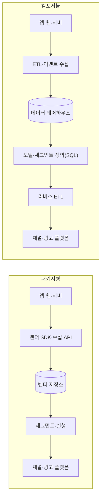

# 3장. 이 회사는 무엇을 파는가 — 카테고리 지도와 두 갈래

당신이 지원하려는 그 회사는 자기를 뭐라고 부를까?

채용 공고에는 CDP라고 적혀 있다. 회사 홈페이지 맨 위에는 Customer Engagement Platform이라고 적혀 있다. 그리고 개발자 문서 첫 페이지에는 아무것도 적혀 있지 않다. 곧바로 태그 스크립트 붙이는 법과 엔드포인트 목록이 나온다. 셋 다 같은 회사 이야기다.

이 책의 리서치는 마테크 벤더 20곳의 개발자 문서를 훑었다(2026년 7월 기준). 그중 **자기 카테고리를 개발자 문서 첫 화면에 명시한 곳은 손에 꼽는다** — Adobe Real-Time CDP, mParticle, Insider의 UCD가 자기를 "Customer Data Platform"이라 밝혔고, CleverTap이 "Customer retention platform", OneSignal이 "omnichannel messaging"이라 썼다. 이 리서치가 확인한 건 여기까지다. 나머지 대부분은 자기가 무슨 카테고리인지 말하지 않는다. 굳이 말할 이유가 없기 때문이다. 개발자 문서를 읽는 사람은 이미 계약이 끝난 뒤에 온다. (덧붙이면 20곳 중 세 곳은 문서를 여는 것조차 실패했다 — 사이트 오류가 하나, 404가 하나, 403이 하나였다.)

카테고리는 개발자 문서가 아니라 세일즈 자료에 산다. 그러니 CDP·CEP·DMP·MA·MMP 같은 약어를 외워서 이 시장의 지도를 그리려는 시도는 처음부터 어긋난 방향이다. 그렇다면 개발자는 무엇을 보고 판단해야 할까. 답은 조금 미뤄두는 게 낫겠다. 이 이름들이 애초에 어디서 왔는지를 먼저 알아야 그 답이 납득되기 때문이다.

## 이름을 붙인 사람의 원문

CDP라는 말에는 창시 시점이 있다. 2013년 4월 25일, 마케팅 기술 애널리스트 David Raab이 자기 블로그에 "I've Discovered a New Class of System: the Customer Data Platform"을 올렸다. 작명자답게 세 단어를 왜 그렇게 골랐는지 직접 밝혀두었다.

> "Customer" shows the scope extends to all customer-related functions, not just marketing;
> "Data" shows the primary focus is on data, **not execution**; and
> "Platform" shows it does more than data management while supporting other systems
> — David Raab, 2013-04-25

개발자가 눈여겨볼 것은 가운데 줄이다. 초점은 데이터이지 실행이 아니다. 메시지를 보내는 일은 이 시스템의 몫이 아니었다. 그 선언이 **이름 안에 이미 들어 있었다.**

2년 뒤 2015년 1월 18일, 같은 저자가 정의를 한 문장으로 다듬는다.

> "a marketer-controlled system that builds a multi-source customer database and exposes it to external execution systems"
> — David Raab, 2015-01-18

두 글을 나란히 놓으면 달라진 데가 보인다(정의문 자체는 원문이고, 이 비교는 이 책의 관찰이다). 2013년 정의의 "예측 분석을 수행한다"가 빠지고, 두 표현이 핵심 자리로 올라왔다 — marketer-controlled(마케터가 통제한다)와 exposes it to external execution systems(외부 실행 시스템에 노출한다).

CDP는 왜 데이터를 자기 안에 가둬두지 않고 굳이 밖으로 내보내는가. 그 답이 정의에 박혀 있다. 데이터를 모으는 일과 그걸 쓰는 일은 애초에 다른 문제로 취급됐고, 업계는 후자를 **액티베이션(activation)**이라 부른다. 모아둔 고객 데이터를 광고 플랫폼·메시징 도구·영업 시스템처럼 실제로 무언가를 하는 시스템으로 내보내는 일이다. 쓸 수 없는 데이터는 없는 데이터와 같다.

나머지 한 단어, "marketer-controlled"도 마찬가지다. 세그먼트 조건 하나를 바꾸려고 티켓을 넣고 다음 스프린트를 기다리는 조직에서는, 캠페인이 데이터의 속도가 아니라 티켓 큐의 속도로 나간다. **이 산업 상당 부분이 그 답답함 위에 세워졌다.**

2018년 11월 3일 글에서 Raab은 CDP를 세 유형으로 나눈다. **2018년 Raab 기준**이며, 지금으로부터 8년 전 분류다.

Data CDP는 "CDPs with a customer database", Analytics CDP는 "CDPs with a customer database plus customer analytics", Personalization CDP는 "a customer Database, analytics, and personalization"이다. 이 분류가 유용한 이유는 레이어가 쌓이는 순서이기 때문이다. 데이터베이스만 있는가, 그 위에 분석이 있는가, 그 위에 실행까지 있는가. 다른 자료에서 이 목록이 넷으로 늘어난 형태를 보더라도, 이 책은 원문에서 확인한 셋만 쓴다.

같은 글에 이런 문장도 있다.

> "CDPs are not simple: the industry has rapidly evolved numerous subspecies of CDPs that are as different from each other as the different kinds of dinosaurs."

카테고리를 만든 사람이 5년 만에 "공룡의 종류만큼 서로 다른 아종들"이라고 쓴다. 그러면서 못 박는다 — "For CDP to have any meaning, it must describe a system whose primary purpose is to build a persistent, sharable customer database." 2015년 정의가 개방성을 앞세웠다면 이 문장은 영속적인 데이터베이스를 짓는 것 자체를 앞세운다. 정의는 한 사람의 글 안에서도 한 점으로 수렴하지 않는다.

이 절의 인용은 전부 명명자 개인의 블로그에서 왔다. 기관 이름을 단 정의문도 널리 회자되지만, 그 기관 사이트는 리서치 시점(2026년 7월)에 접근이 막혀 원문을 확인하지 못했다. 그래서 이 책은 기관 정의문을 쓰지 않는다.

## 인접 카테고리와의 대비, 그리고 그 표의 빈칸

CDP만 놓고는 지도가 안 그려진다. 옆에 무엇이 있는지 알아야 한다. Raab은 2017년 3월 23일 글에서 카테고리들을 **세 개의 예/아니오 질문**으로 갈랐다. 제품 이름 스무 개보다 이 세 질문이 오래 남는다.

1. 고객 데이터를 통합하는가?
2. 다른 시스템이 그 데이터를 읽게 하는가?
3. 메시지를 고르는가?

| 시스템 | 데이터 통합 | 외부 접근 허용 | 메시지 선택 |
|---|---|---|---|
| **CDP** | ✅ | ✅ | ❌ |
| **저니(고객 경로) 오케스트레이션 엔진(JOE)** | ✅ | ❌ | ✅ |
| **MDM**(마스터 데이터 관리) | ✅ | ❌ | ❌ |
| **마케팅 자동화(MAP)** | ❌ | ❌ | ✅ |
| **DMP** | ❌ | ❌ | ✅ |
| **CRM** | ❌ | ❌ | ✅ (영업 중심) |
| **데이터 레이크** | ❌ | ✅ | ❌ |

> 이 표는 Raab의 2017년 벤 다이어그램과 산문 서술을 표로 재구성한 것이다. 원문은 표 형태가 아니다.

세 질문의 조합만으로 CDP의 자리가 드러난다. 데이터를 통합하면서 동시에 남에게 열어주는 칸은 CDP와 데이터 레이크뿐이고, 그중 마케터가 쓰는 쪽이 CDP다.

개발자에게 가장 빠른 길은 늘 스키마다. CRM은 고객 DB이기 전에 영업 파이프라인 DB다. 1장에서 본 네 객체 — Account(거래하는 회사)·Contact(거기서 일하는 사람)·Lead·Opportunity — 에 Salesforce의 공식 학습 문서(2026년 7월 조회 기준 — 이 페이지들에는 발행일 표기가 없다)가 결정적인 규칙을 하나 붙인다. Lead를 전환하면 세 레코드가 한꺼번에 생긴다. B2B 영업 프로세스가 스키마에 그대로 박혀 있는 셈이다.

마케팅 자동화(MA)는 점수를 두 개 매긴다. 같은 문서 계열의 score는 숫자로 "얼마나 관심을 보였나"를, grade는 문자(A·B·C…)로 "이상적인 고객상에 얼마나 맞나"를 나타낸다. **행동과 속성을 일부러 분리해 각각 채점한 뒤 조합하는 것**이라, 리드 스코어링을 단일 점수로 여기면 이 설계를 놓친다.

DMP는 광고 쪽 언어를 쓴다. Adobe의 DMP 제품 문서(2026년 5월 갱신 표기)는 자기를 "online audience data management" 서비스로 소개하고 대상 사용자를 "digital advertisers and publishers"라고 밝힌다. 자사 고객 프로필을 다루는 CDP와는 대상도 목적도 다르다는 간접 근거다.

여기까지가 이 표로 말할 수 있는 전부다. 그런데 이 표에서 더 오래 볼 곳은 따로 있다. **비어 있는 칸이다.**

첫째, **DMP 행에서 두 출처가 정면으로 충돌한다.** 위 표는 애널리스트 분류라 DMP를 "데이터를 통합하지 않는다"로 놓는데, 방금 인용한 Adobe 문서는 자사 DMP가 여러 소스의 오디언스 프로필을 만든다고 말한다. 어느 쪽이 맞는지 판정할 근거가 없어 둘을 나란히 적어둔다. 애널리스트가 그은 경계와 벤더의 자기 규정이 다르다는 사실 자체가 이 장의 증거다.

둘째, "등장 시점" 행은 아예 만들지 못했다. 1차 소스로 확정한 연대는 CDP의 2013년 4월 하나뿐이고, CRM·DMP·MA의 기원은 블로그마다 답이 달랐다. 카테고리 연대기를 자신 있게 늘어놓는 글을 보면 그 연도가 어디서 왔는지 한 번쯤 되짚어보는 편이 낫다.

셋째, CEM/CXM은 이 표에 들어오지 못했다. 1차 정의를 확보하지 못해서다. 검색 요약에 그럴듯한 정의가 떠 있었지만, 그걸 특정 조사기관의 정의라고 적는 순간 없는 출처가 하나 생긴다. 같은 이유로, DMP와 CDP를 **데이터의 출처 종류**로 갈라 설명하는 통설도 쓰지 않는다. 어떤 1차 소스로도 확인하지 못했고, Adobe의 DMP 문서에는 쿠키나 익명 데이터 언급 자체가 없었다. 확인되지 않았다는 게 틀렸다는 뜻은 아니다. 다만 확인하지 않은 문장을 확인한 것처럼 쓰지 않는다.

카테고리 표로 이 시장을 읽으려는 시도는 여기서 벽에 부딪힌다. 절반이 "확인 불가"이고 채워진 칸끼리도 싸운다. 그렇다면 무엇을 봐야 할까?

## API 카탈로그가 카테고리를 가른다

마케팅 문구를 걷어내고 제품을 구분하는 가장 확실한 방법이 있다. **엔드포인트 목록을 여는 것이다.** 제품 소개 페이지는 놀랍도록 비슷하게 읽힌다. 고객을 이해하고, 개인화된 경험을 전하고, 성장을 이끈다는 문장 사이에서 차이를 찾기는 어렵다. API 목록은 그렇게 못 쓴다. 없는 엔드포인트를 적을 수는 없기 때문이다.

이 리서치가 문서를 연 벤더들의 대비가 그걸 보여준다. 어트리뷰션 제품인 Airbridge의 API 목록에는 `Attribution Result`와 `Tracking Link`가 있고 Insider의 목록에는 없다. 반대로 Insider에는 `Send Transactional Emails`가 있고 Airbridge에는 없다. 두 회사 모두 "고객 데이터"와 "마케팅"을 말하지만, 하나는 어느 광고가 이 설치와 전환을 만들었는지 귀속(attribute)하는 제품이고, 다른 하나는 프로필을 만들어 메시지를 보내는 제품이다. 소개 문구로는 몇 문단을 읽어야 갈리는 차이가 엔드포인트 이름 하나로 즉시 갈린다.

> 단서를 하나 달아둔다. "있다"는 것은 문서에서 직접 확인한 사실이지만, **"없다"는 것은 이 리서치가 연 페이지 범위 안에서만 유효하다.** 어떤 제품에 특정 기능이 없다고 단정하기 전에, 판단 근거가 "문서 전체"인지 "내가 연 페이지 몇 장"인지 구분하는 습관을 들이자.

라벨을 밝힌 소수도 제각각이다. 앞서 본 두 라벨 옆에, 회사 소개에서 쓰는 표현까지 넣으면 국내 벤더 그루비의 "마테크 솔루션", 빅인의 "CRM 자동화"가 더해진다. 하는 일이 상당 부분 겹치는 제품들이 각자 다른 이름표를 달고 있다.

경계가 흐려지는 방식 중 가장 흥미로운 건 **같은 카테고리가 누구에게는 부품이고 누구에게는 모듈**이라는 점이다. 메시징 벤더 Airship은 CDP를 "파트너 연동" 목록(analytics, CRMs, CDPs, marketing tools)에 넣는다 — 데이터 공급자로 본다는 뜻이다. 반면 Insider와 Adobe는 CDP를 자기 제품 안에 내장한다. 같은 세 글자가 어디에 서 있느냐에 따라 다른 것을 가리킨다.

그러니 회사를 살펴볼 때 순서를 바꿔보자. 제품 소개 페이지는 나중이다. 개발자 문서의 첫 페이지를 열고 엔드포인트 목록과 SDK 목록을 훑는다. 데이터를 받는 API가 대부분이면 그 제품의 무게중심은 수집에 있고, 발송·캠페인 계열이 두꺼우면 실행에 있다. 다만 전제가 하나 필요하다 — 열어볼 문서가 있어야 한다. 이 리서치가 시도한 국내 벤더 세 곳은 **공개 개발자 문서를 확인할 수 없었다.** 글로벌 벤더는 문서를 공개 자산으로 운영하고 국내 벤더는 계약과 어드민 뒤에 두는 경우가 많았다는 관찰인데, 입사 전에 제품을 파악하려는 개발자에게는 꽤 난감한 차이가 된다. 다만 이건 스무 곳 남짓을 열어본 표본에서 나온 인상이지 국내 벤더 전체를 센 결과가 아니다.

## CDP와 CEP는 어떻게 붙어 있나

CDP를 이해하고 나면 곧바로 CEP라는 약어를 만난다. Customer Engagement Platform. 둘의 관계가 가장 또렷한 곳이 Adobe의 제품 문서다. Adobe는 Real-Time CDP를 "여러 전사 소스의 알려진 데이터와 익명 데이터를 한데 모아 고객 프로필을 만드는" 제품으로 소개하고, 그 위에 얹히는 실행 제품 Journey Optimizer는 이렇게 소개한다.

> "An enterprise application for creating and delivering connected, contextual, and personalized customer experiences across all channels and touchpoints."

두 제품의 관계를 밝히는 문장이 결정적이다. Journey Optimizer는 "is built natively on Adobe Experience Platform, sharing its **data foundation, identity graph, and governance services**"라고 쓰여 있다(문서 표기 2026년 7월 1일).

이 한 줄이 아키텍처 다이어그램 한 장만큼 말해준다. 데이터 기반(프로필·아이덴티티 그래프·거버넌스)이 아래에 하나 있고 그 위에 실행 애플리케이션이 얹힌다. 프로필 저장소와 저니 실행기가 별개 서비스이되 같은 데이터 평면을 본다는 뜻이다.

같은 분리가 다른 벤더에서도 보인다. Insider는 데이터 계층을 UCD(Unified Customer Database)라 부르며 "the core Customer Data Platform (CDP) that powers all Insider One products"라 적어두었고, 저니를 실행하는 제품에는 Architect라는 별도 이름을 붙였다. 다만 **Architect의 개요 문서 페이지는 이 리서치 시점에 열리지 않았고**, 데이터 인입 API 문서의 한 옵션 설명에 "Architect journeys"가 등장하는 데서 간접 확인한 것이다. 그 안에서 어떤 저장소가 돌아가는지는 공개 자료를 찾지 못했으므로 추정하지 않는다.

그런데 같은 회사가 회사 차원에서는 자기를 "Agentic Customer Engagement Platform"이라 부른다. 제품 문서에서는 데이터 계층을 CDP라 부르고, 회사 소개에서는 CEP라 부른다. 한 회사가 두 카테고리를 동시에 주장하는 것이다. 여기서 CEP라는 라벨의 성격이 드러난다 — 애널리스트가 밖에서 그어준 경계라기보다, 벤더가 자기를 어디에 놓고 싶은지 밝히는 라벨에 가깝다.

그렇다면 개발자가 던질 질문은 따로 있다. **데이터 계층과 실행 계층이 한 제품 안에 있는가, 나뉘어 있는가. 그 경계에 API가 있는가.** 나뉘어 있고 경계에 API가 있다면 그 API가 곧 당신이 붙을 자리다.

## 두 갈래 — 데이터를 복사할 것인가, 그냥 읽을 것인가

여기까지가 이름의 지도다. 그런데 개발자에게 정말로 중요한 갈림길은 카테고리 이름에 있지 않다. **고객 데이터가 물리적으로 어디에 앉느냐다.** 한 문장으로 말하면 이렇다 — **패키지형 CDP는 데이터를 복사해 자기 저장소에 넣고, 컴포저블(웨어하우스 네이티브) CDP는 웨어하우스를 그대로 읽는다.**

컴포저블 쪽 주장을 가장 날 세워 하는 건 Hightouch다. 이 회사의 제품 페이지에는 이런 문장들이 붙어 있다.

> "Don't copy your data to an incompatible and less secure data silo. Turn your existing data into a CDP instead."
>
> "Hightouch doesn't store your data. Instead we simply read from your data warehouse where it stays safe and sound."

같은 회사가 2023년 6월에 올린 글은 컴포저블 CDP를 "이미 갖고 있는 데이터 인프라에서 곧바로 마케팅 용례를 구동하게 해주는 CDP"로 정의한다. 어디까지나 벤더 자신의 주장이다.

반대편은 어떤가. 이 장에서 이미 본 Insider의 UCD가 그 예다. 이벤트와 사용자 속성을 자기 데이터베이스에 담고, 그 위에서 세그먼트와 채널 실행이 돌아간다. 데이터를 저장하지 않는다고 내세우는 쪽과 자기 DB에 담는 쪽이 둘 다 CDP라는 같은 이름으로 불린다. 이름이 아키텍처를 말해주지 않는다는 증거로 이만한 게 없다.

대형 스위트 쪽도 서술의 결이 같다. Salesforce의 고객 데이터 제품 문서는 자기 아키텍처를 "designed to ingest, process, unify, and activate customer data from various sources"라고 소개한다. 수집부터 액티베이션까지가 한 제품의 서술 안에 들어 있다. (2026년 7월 조회 시점의 개발자 문서는 이 제품을 Data 360으로 표기하는데 URL 경로와 일부 섹션 제목에는 Data Cloud가 남아 있다. 개명 사건으로 서술할 근거는 확인하지 못했으니 두 이름이 함께 쓰인다는 사실만 적어둔다.)

두 경로를 그림으로 보면 차이가 더 분명하다.

그림 1. 같은 데이터가 어디에 앉는가 — 두 경로의 대비

그림에서 눈여겨볼 것은 원통이 어디에 있느냐 하나다. 패키지형에서는 진실의 원천이 벤더 저장소이고, 컴포저블에서는 이미 회사가 갖고 있는 웨어하우스다. 나머지 차이는 대부분 여기서 파생된다.

원통 하나 자리가 바뀐 것뿐인데, 이 차이가 개발자에게 왜 그렇게 큰가. 데이터가 앉은 자리는 이후의 거의 모든 결정을 끌고 다닌다. 삭제 요청이 들어왔을 때 지워야 할 사본이 몇 벌인지, 스키마를 바꿨을 때 무엇이 함께 깨지는지, 6개월 치를 다시 처리해야 할 때 원본이 어디 있는지, 그 데이터의 정확성을 누가 책임지는지가 전부 달라진다. 데이터가 두 곳에 나뉜 시스템에서 "어느 쪽이 맞는 값인가"를 매번 따져야 하는 하루는, 겪어본 사람은 안다. 초난감하다.

앞서 본 세 유형 눈금자 위에 두 갈래를 얹으면 지도가 한번에 그려진다. 데이터를 저장조차 하지 않고 액티베이션 레이어로만 존재하는 제품이 한쪽 끝에, 데이터베이스·세그먼트·채널 실행까지 한 제품 안에 갖춘 쪽이 반대쪽 끝에 있다. 당신이 지원하는 회사가 이 축의 어디에 있는지는 그 회사에서 당신이 무엇을 만들게 될지와 거의 같은 질문인데, 이 프레임을 커리어 판단에 쓰는 방법은 마지막 장에서 다시 꺼낸다.

마지막으로 이 장의 주제와 정확히 맞아떨어지는 관찰 하나. **위에 인용한 강한 아키텍처 주장들은 전부 마케팅 페이지에 있었고, 같은 회사의 개발자 문서에는 그런 문장이 없었다.** 개발자 문서는 Source가 무엇이고 Sync가 무엇인지만 담담하게 설명한다. 뜨거운 문장은 세일즈 쪽에 살고, 문서 쪽에는 명세가 산다.

## 컴포저블의 멘탈 모델, 그리고 새어나오는 추상화

컴포저블 CDP를 "웨어하우스를 읽는 CDP"라고만 알고 넘어가면 실무에서 쓸모가 없다. 다행히 이 방식에는 잘 정돈된 멘탈 모델이 있다. Hightouch의 개발자 문서(페이지 표기 2026년 7월 17일)가 네 개념으로 정리해두었고, 이건 리버스 ETL 전반의 표준 어휘로 그대로 쓸 수 있다.

| 개념 | 문서 원문 | 개발자용 번역 |
|---|---|---|
| **Source** | "any system where your data resides" | 데이터가 이미 사는 곳. Snowflake·BigQuery·Databricks·PostgreSQL 등 |
| **Model** | "defines what data to query from a source" | 무엇을 뽑을지 정의하는 쿼리. 사용자·이벤트·상품 어느 것이든 |
| **Sync** | "defines how data appears in the destination and when" | 목적지에 **어떻게, 언제** 나타날지. 타입·모드(insert/update/upsert/archive)·매핑·스케줄 |
| **Destination** | "any system where data is consumed" | 데이터를 소비하는 시스템. CRM·광고 플랫폼·지원 도구·자체 API |

네 개념을 이어 붙이면 문장 하나가 된다. 어디서(Source) 무엇을(Model) 어떤 모양과 주기로(Sync) 어디로(Destination) 보낼 것인가. 리버스 ETL이라는 말이 낯설다면 이 문장을 그대로 정의로 삼아도 된다.

눈여겨볼 것은 Sync의 명세다. 모드에 upsert와 archive가 나란히 있다는 건 "이 사용자를 목적지에서 지워야 하는 상황"이 일급 시나리오라는 뜻이고, 스케줄에 간격·크론·외부 트리거가 함께 있다는 건 이 동기화가 파이프라인 오케스트레이션의 일부로 취급된다는 뜻이다. Sync 하나를 실제로 열어 재시도·스로틀·목적지별 제약을 들여다보는 일은 7장에서 한다. 지금은 네 개념의 자리만 잡아두면 충분하다.

그리고 이 방식이 파는 것도 결국 앞에서 본 그 욕구다. **마케터가 자기 데이터를 자기 손으로 쓰게 하는 것.** 달라진 건 소유권이 놓이는 자리다. 벤더 저장소에서, 회사가 이미 갖고 있는 웨어하우스로 옮겨두겠다는 것. 정의의 무게중심이 2015년에 "marketer-controlled"로 옮겨간 이야기가 10년 뒤 인프라 배치의 문제로 되돌아온 셈이다.

그럼 이쪽이 정답일까? 실무자들의 이야기를 들어보면 그렇게 간단하지 않다.

이 주제로 실제 토론이 붙은 자리는 흔치 않은데, 그중 하나가 **2021년 11월 Hightouch 제품 런칭 시점의 해커뉴스 스레드**(댓글 47개)다. 아래 발언은 전부 이 한 스레드에서 나왔고, 5년 가까이 지난 스냅숏이라는 점을 먼저 밝혀둔다. 그 사이 도구는 나아졌을 수 있다.

먼저 웨어하우스 우선을 지지하는 쪽. 한 실무자는 이렇게 썼다.

> "제품과 CRM에 걸쳐 데이터를 합치는 복잡한 워크플로우로 들어가면 전부 웨어하우스가 먼저가 된다. (…) 웨어하우스에 들어가고 나면 그걸 다시 운영 시스템으로 되돌려야 하는데, **그게 까다로운 부분이다.** 나는 웨어하우스에서 Salesforce로 가는 일회성 연동들을 직접 해봤다."

벤더가 아니라 **그 일회성 연동을 손으로 짜본 사람**의 말이라는 점이 이 발언의 무게다. 웨어하우스에 다 모아놨는데 정작 그걸 쓰는 도구로 되돌려 보내는 일이 매번 새 프로젝트가 되는 상황은, 이 책의 독자가 입사 후 꽤 높은 확률로 마주칠 장면이다.

그런데 같은 스레드에서 가장 날카로운 반박도 나왔다.

> "SQL에서 타깃으로의 암묵적 매핑은 좋다. 그런데 **애초에 SQL 작성자가 어떤 SQL을 써야 하는지는 어떻게 아나?** 나도 이런 연동을 숱하게 해봤는데, 데이터를 맞게 빚으려면 타깃 SaaS 문서를 읽어서 스키마가 어떻게 생겼는지 파악하는 걸 피할 방법이 없다. **그 단계 없이는 SQL을 시작조차 못 한다.**"

**"SQL만 알면 된다"는 약속이 새는 지점이 정확히 여기다.** 목적지가 어떤 필드를 어떤 타입으로 받는지 모르면 쿼리의 첫 줄도 못 쓴다. 이 지적에 대한 벤더 측 답변도 솔직했다 — 선언형이고 문서·자동완성·스키마 탐색으로 돕고 있지만 **"still early days there"**(아직 초기 단계다)라고 인정했다.

한 가지 더 짚어둘 게 있다. 이 책은 **"업계가 패키지형과 컴포저블 두 진영으로 갈렸다"는 식으로 쓰지 않는다.** 대비가 선명해 그렇게 쓰고 싶은 유혹이 크지만, 이 리서치가 커뮤니티를 뒤진 범위 안에서는 **그 프레이밍 자체로 큰 논쟁이 붙은 적이 없었다.** 컴포저블을 주장하는 글은 거의 전부 벤더가 올린 것이었고 대부분 1~2점을 받고 묻혔다. 실질적인 토론이 붙은 건 제품 런칭 스레드 하나뿐이다.

즉 진영 대립은 벤더와 애널리스트의 담론에서 더 뜨겁고, 실무자들은 진영이 아니라 구체적인 마찰로 말한다. 목적지 스키마를 누가 아느냐, 동기화가 얼마나 늦느냐, 실패한 쓰기를 어디서 보느냐. 면접에서 "저희는 컴포저블 CDP입니다"라는 말을 들었을 때 되물을 것도 이 세 가지다. 그 답이 어느 쪽으로 기우는지는 앞 절의 네 질문이 정한다. 웨어하우스가 이미 돌아가고 그걸 맡은 팀이 따로 있다면 지울 사본도 재처리 원본도 정확성 책임도 그쪽에 있으니, 컴포저블의 마찰은 나눠 지는 마찰이다. 둘 다 없는 회사라면 네 가지가 통째로 당신 몫이 되고, 그때는 벤더 저장소가 떠맡아주는 몫이 작지 않다. 기억해두자 — **아키텍처 논쟁의 승패보다 그 아키텍처가 만들어내는 구체적인 마찰이 당신의 하루를 결정한다.**

같은 스레드에서 경쟁사 창업자 둘이 축을 직접 말한 대목도 있다. RudderStack 쪽은 자사 포지셔닝이 "end to end customer data infrastructure"에 맞춰져 있다고 했고, Hightouch 쪽은 "RudderStack은 번들이고 그럴 자리가 있다"며 자기는 액티베이션에만 집중한다고 답했다. 양쪽 다 벤더의 말이지만, **번들이냐 단일 기능이냐**가 이 시장의 실제 축이라는 건 당사자들이 서로 인정한 셈이다.

## 시장은 움직인다

지금까지 그린 지도에는 유통기한이 있다. 카테고리 경계를 가장 빠르게 지우는 힘은 애널리스트의 정의가 아니다. 인수합병이다.

2025년 5월 1일, 데이터 통합 회사 Fivetran이 리버스 ETL 회사 Census 인수를 발표했다. 보도자료는 Census를 "the leader in Reverse ETL, data activation, and operational analytics"라 소개하고 거래 조건은 공개되지 않았다고 밝힌다. 2026년 7월 시점에 `getcensus.com`은 `fivetran.com`으로 리다이렉트된다. 다만 리다이렉트만으로 브랜드나 제품이 완전히 사라졌다고 단정할 수는 없다 — 확인된 것은 발표 사실과 도메인 이동까지다.

비슷한 시기에 커머스 광고 회사 Rokt가 CDP 벤더 mParticle을 "$300 million merger"로 합쳤다(발표일은 1차 자료에서 확인하지 못해 적지 않는다). 이쪽 결과는 달랐다 — mParticle은 문서 사이트가 살아 있고 여전히 자기를 "a customer data platform (CDP)"라고 규정한다. 한 실무자는 2025년 10월 이 흐름을 "**The whole Modern Data Stack has either died, acquired or merged by now.**"라고 요약했다. 개인의 관측이니 업계의 결론으로 격상할 말은 아니지만, 실무적 함의는 분명하다. **"이 분야는 A·B·C 세 회사가 주도한다" 같은 서술은 몇 달 단위로 낡는다.**

그러니 이 장이 남기려는 건 지도가 아니라 읽는 법이다. 엔드포인트 목록이 그 제품이 무엇을 받고 무엇을 내보내는지 말해주고, 데이터가 어디에 앉는지가 그 제품이 당신에게 안길 문제의 종류를 말해준다.

그런데 데이터가 어디에 앉든, 마케터는 결국 그걸로 무언가를 계산해달라고 한다. "VIP 고객", "이탈 위험군", "고가치 세그먼트" 같은 말로. 이 말들은 도대체 어떤 계산을 가리키는 걸까. 그리고 그 계산법은 누가 정한 걸까.
