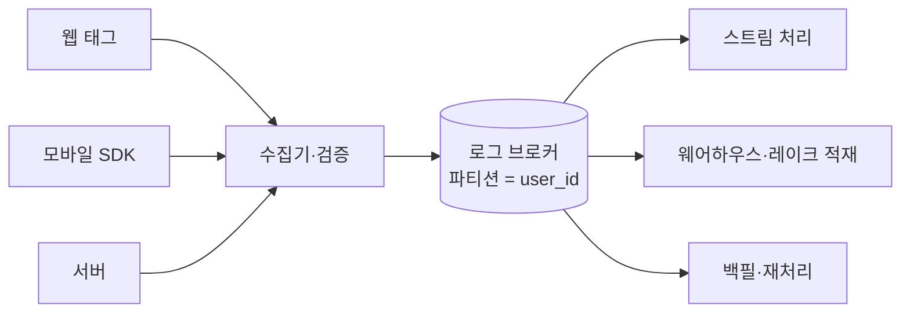

# 5장. 이벤트를 잃지 않고 받아낸다 — 수집과 스트림

새벽 1시 12분에 쿠폰이 나갔다.

받은 사람은 세 시간 전에 결제를 마친 고객이었다. 장바구니에 담고 30분 안에 결제하지 않은 사용자에게 할인 쿠폰을 보내는 룰이 있었고, 그 룰은 설계된 대로 정확히 동작했다. 다만 이 사람은 지하철에서 앱을 열었다. 담기 이벤트는 단말에 쌓여 있다가 지상에 올라온 20분 뒤에야 서버로 올라왔다. 반면 결제는 앱을 거치지 않고 결제 서버에서 발생해 지연 없이 곧장 파이프라인에 들어갔다.

그래서 시스템이 본 순서는 이랬다. 결제, 그다음 장바구니 담기.

룰 엔진의 판단은 그 순서 위에서 완벽하게 합리적이었다. 방금 장바구니를 담은 사람이 있고, 30분이 지나도록 결제가 없다. 쿠폰을 보낸다.

아무것도 고장 나지 않았다. 컨슈머 랙도 정상이고, 에러 로그도 없고, 알림도 울리지 않았다. 2장에서 봤듯이 이 도메인의 잘못된 데이터는 500 에러로 나타나지 않는다. 잘못된 캠페인으로 나타난다.

이런 사고는 원인을 짚기가 유난히 난감하다. 로컬에서는 재현되지 않고, 테스트 환경에서는 이벤트가 순서대로 들어오고, 코드를 아무리 들여다봐도 룰 엔진은 명세대로 짜여 있다. 원인은 코드 안에 없다. 코드가 딛고 선 전제에 있다 — 이벤트는 발생한 순서대로 도착한다는 전제 말이다.

## 늦게 도착하는 게 정상인 이벤트들

이 사고를 파헤치려면 먼저 무엇이 들어오는지부터 봐야 한다. 초당 수만 건이 들어온다고 해보자. 그런데 규모 자체는 이 축에서 가장 쉬운 문제다. 어려운 건 **들어오는 것들의 성질이 저마다 다르다**는 데 있다.

출발점이 셋이다. 브라우저에서 태그 스크립트가 쏘는 이벤트, 모바일 앱의 SDK가 쏘는 이벤트, 그리고 결제·주문·회원 시스템 같은 서버가 쏘는 이벤트. 셋의 도착 특성이 전혀 다르다.

브라우저 이벤트는 탭이 닫히는 순간 전송이 끊긴다. 마지막 이벤트 몇 개는 원래 잘 안 온다. 모바일 앱 이벤트는 배터리와 네트워크 정책 때문에 모아서 보내고, 기기가 오프라인이면 며칠 뒤에 한꺼번에 올라오기도 한다. 서버 이벤트는 즉시 도착하지만 대신 다른 문제를 안고 있다 — 데이터베이스 트랜잭션은 커밋됐는데 이벤트 발행은 실패하는 경우다. 이건 뒤에서 따로 다룬다.

여기에 하나가 더 붙는다. **과거를 다시 흘려야 한다는 요구**다. 세그먼트 로직에 버그가 있었다는 걸 3주 뒤에 알게 되거나, 6개월 뒤 새 모델을 학습시키려고 과거 이벤트 전체가 필요해지는 일은 이 도메인에서 흔하다.

그리고 이 워크로드에는 웹 서비스 개발에서 익숙하던 여유가 없다. 조회 API는 요청이 몇 건 실패해도 클라이언트가 재시도하면 그만이고, 사용자도 대개 눈치채지 못한다. 그런데 이벤트는 재시도해줄 사람이 없다. 놓친 구매 이벤트 하나는 그 사용자의 구매 횟수를 영원히 하나 적게 만들고, 그 값 위에서 세그먼트가 계산되고 캠페인이 나간다. 잃어버린 이벤트는 조용히 잘못된 세그먼트가 되어 남는다.

정리하면 제약이 셋이다. **순서**를 지켜야 하고, 받은 것을 **잃지 않아야** 하고, 나중에 **다시 읽을 수 있어야** 한다. 지금부터 나올 도구 선택은 전부 이 셋 가운데 무엇을 어디까지 포기할 수 있는가의 문제로 환원된다.

## 스키마를 검증하고, 실패한 것을 버리지 않는다

2장에서는 이벤트 스키마를 어디에 두고 호환성을 어떻게 강제할 것인가를 봤다. 그 스키마가 정작 수집 시점에 무슨 일을 하는지는 아직 보지 않았다. 여기서부터가 그 이야기다.

이 대목을 가장 선명하게 보여주는 건 Snowplow의 파이프라인이다. 수집기가 원본을 스토리지에 먼저 보존하고, 그다음 Enrich라는 단계가 붙는다. 공식 문서의 표현은 이렇다.

> "The Enrich application cleanses the data and validates each event against its schema to ensure it meets the criteria you have designed and set."
>
> [docs.snowplow.io/docs/fundamentals/ | 발행일 확인 불가 | 검색 시점 2026-07-25]

검증한다는 것까지는 예상 가능한 설계다. 정작 중요한 문장은 그다음에 있다.

> "failed events can be reprocessed"
>
> — 같은 문서 (docs.snowplow.io/docs/fundamentals/)

두 문장을 함께 읽어야 한다. 검증만 하고 실패한 이벤트를 버리면 그건 품질 관리가 아니라 데이터 손실이다. 앱 릴리스에서 필드 타입 하나가 바뀌었다고 해보자. 그날 하루치 구매 이벤트가 전부 검증에 걸린다. 버리는 설계였다면 그 하루는 영원히 사라지고, 한 달 뒤 "왜 이날만 매출 이벤트가 비어 있지"라는 질문에 아무도 답할 수 없다. 격리해두는 설계였다면 스키마를 고친 뒤 그 스트림만 다시 흘리면 된다.

물론 격리만으로 끝나지도 않는다. 실패 스트림을 아무도 안 보면 검증은 없는 것과 같다. 오히려 더 나쁠 수도 있다 — 검증이 있으니 데이터가 깨끗할 거라고 다들 믿는 사이에, 유효 스트림은 멀쩡해 보이고 실패 스트림에만 조용히 하루치가 쌓인다. 실패 건수는 대시보드에 올려두고, 평소 대비 급증하면 알림이 울리게 걸어두자. 그 알림이야말로 배포된 앱의 이벤트 스키마가 바뀌었다는 사실을 데이터 팀이 가장 빨리 알 수 있는 통로다.

그런데 이 도구를 "오픈소스 CDP 스택"의 일부로 고를 생각이라면, 그 전에 확인해둘 것이 하나 있다.

> 🚨 **Snowplow의 핵심 컴포넌트는 OSI 오픈소스가 아니다.** 공식 라이선스 FAQ 원문은 이렇게 적혀 있다.
>
> > "Licensee is not granted the right to, and Licensee shall not, exercise the License for any Competing Use, and Licensee may exercise the License only for Non-Production Use or Non-Commercial Use."
>
> SLULA(Snowplow Limited Use License Agreement)는 2024년 1월 v1.0으로 도입됐고, **v1.1이 2024년 12월에 적용되면서** v1.0에 있던 "Highly Available" 조항이 제거됐다. 그 결과 고가용성 구성 여부와 무관하게 **모든 프로덕션 사용이 상용 라이선스를 요구**하는 것으로 정리됐다.
> [docs.snowplow.io/docs/licensing/limited-use-license-faq/ | v1.1 = 2024-12(문서 표기) | 검색 시점 2026-07-25]
>
> Apache 2.0 포크(OpenSnowcat)가 존재한다는 언급은 확인했으나, 이 책의 리서치는 그 포크의 유지보수 현황까지는 확인하지 못했다.

기술 검토를 마치고 PoC까지 돌린 다음 배포 승인 단계에서 법무팀이 이 조항을 발견하는 상황을 상상해보자. 꽤 아찔한 일이다. GitHub 저장소가 공개돼 있다는 것과 그 코드를 프로덕션에 써도 된다는 것은 다른 이야기이고, 이 카테고리는 라이선스가 특히 자주 바뀐다. 실제로 이 책의 리서치는 RudderStack과 Redis의 현행 라이선스 조건을 확인하는 데 실패했다. 확인하지 못한 것을 "오픈소스"라고 적을 수는 없으니 여기서도 단정하지 않는다. 스택을 고를 때는 배지나 위키 문서 말고 저장소의 라이선스 파일과 벤더의 라이선스 FAQ를 직접 여는 습관을 들이자.

## 읽어도 남는 로그

수집한 이벤트는 어딘가에 넣어야 한다. 이 자리에 거의 예외 없이 Kafka(2026-06-23 기준 4.3.1)가 앉는데, 그 이유를 "표준이니까"로 넘기면 정작 중요한 성질을 놓친다.

참고로 4장에서 예고한 항목 하나가 여기 있다. 이 도구의 원 논문(Kreps·Narkhede·Rao, "Kafka: a Distributed Messaging System for Log Processing")은 2011년 NetDB 워크숍 논문이고 DOI가 없다. 이 책의 리서치는 Crossref에서 정규 레코드를 찾지 못했다(2026년 7월 25일 조회 기준). 인프라 문서에서 "Kafka 논문에 따르면"이라는 말을 만나거든, 그 출처가 저널이나 주요 학회 논문이라고 넘겨짚지 말자. 설계의 완성도와는 무관한 이야기다. 이 분야에서는 가장 널리 쓰이는 인프라의 근거조차 학술 문헌의 위상과 어긋난 자리에 있다는 사실을 알고 인용하자는 것이다.

메시지 큐라고 부르면 절반만 맞다. **큐는 읽으면 사라지지만 로그는 읽어도 남는다.** 이 한 가지 차이가 앞 절의 세 번째 제약을 그대로 푼다. 같은 클릭스트림을 실시간 세그먼트 엔진이 읽고, 웨어하우스 적재기가 자기 속도로 읽고, 6개월 뒤 새 모델 학습용 백필이 처음부터 다시 읽는다. 셋은 서로의 존재를 몰라도 된다.

읽는 쪽의 진행 상황은 소비자 그룹별 오프셋으로 관리된다. 오프셋은 그 그룹이 다음에 읽을 레코드를 가리키는 정수이고, 데이터 자체와 분리되어 따로 저장된다. 그래서 소비자를 하나 새로 붙이는 일이 저렴하다 — 마케팅팀이 반년 뒤 "이벤트를 광고 플랫폼에도 흘려달라"고 요구하면 새 소비자 그룹을 만들어 원하는 지점부터 읽게 하면 되고, 기존 소비자들은 아무 영향도 받지 않는다. 세그먼트 로직의 버그를 고쳤을 때도 마찬가지다. 오프셋을 되감으면 지난 30일이 다시 흐르고, 그 사이 잘못 계산됐던 세그먼트가 복구된다. 읽는 순간 사라지는 큐 위에서는 이 가운데 어느 것도 성립하지 않는다.

순서는 어떻게 지킬까. Confluent의 설계 문서가 못 박는다.

> "messages in each partition log are then read sequentially"
>
> "Each partition is consumed by exactly one consumer within each consumer group at any given time."
>
> [docs.confluent.io/kafka/design/consumer-design.html | 발행일 확인 불가 | 검색 시점 2026-07-25]

순서는 **파티션 안에서만** 보장된다. 이 한 줄이 실무에서 무엇을 뜻하는지가 이 절의 핵심이다.

사용자 이벤트를 `user_id`로 파티셔닝하면 한 사용자의 이벤트는 반드시 같은 파티션에 들어간다. 담기 → 결제 → 환불의 순서가 뒤집히지 않는다. 반대로 `event_type`으로 파티셔닝하면 구매는 구매 파티션으로, 장바구니는 장바구니 파티션으로 흩어지고, 두 파티션의 소비 속도는 다르다. 이 장의 첫 장면에서 본 순서 역전이 여기서도 만들어진다. 그래서 **파티션 키 선택은 성능 튜닝이 아니라 데이터 모델링 결정이다.** 실제 사례로는 LINE이 2016년 사내 메시지 전송 파이프라인에서 `userId`를 파티션 키로 삼은 기록을 공개한 적이 있다(engineering.linecorp.com, 2016-08-18. 2016년 글이라 API 서술의 근거로는 낡았고, 파티션 키 선택의 고전 사례로만 유효하다).

**저니(journey)**를 여기서 한 번 제대로 짚고 가야겠다. 3장 비교표에 라벨로만 지나갔던 그 단어다. 마케팅 자동화 제품에서 캠페인을 실행하는 단위이고, 실체는 상태 머신이다. 사용자의 행동에 따라 다음 단계로 넘어가고, 일정 시간 대기하고, 조건에 따라 분기하고, 종료 조건을 만나면 빠져나온다. 이 장 첫머리의 "장바구니 담기 → 30분 대기 → 그 사이 결제가 없으면 쿠폰, 있으면 종료"가 가장 단순한 저니다. 마케터가 이걸 어떤 화면에서 어떻게 그리는지, 그리고 그 화면이 개발자에게 무슨 요구로 돌아오는지는 9장에서 본격적으로 다룬다.

파티션에는 되돌리기 어려운 결정이 하나 더 숨어 있다. 파티션 수를 늘리면 `hash(key) % partition_count`가 바뀌면서 기존 키의 배치가 통째로 달라진다. 그 순간 사용자별 순서 보장이 한 번 끊긴다. 운영에서는 이게 "그날 저니가 한 번 꼬였다"로 나타난다. 반대로 파티션을 넉넉히 잡아도 안심은 이르다 — `user_id` 해시의 균등성은 봇과 크롤러와 내부 테스트 계정 앞에서 쉽게 깨지고, 한 파티션만 밀리기 시작한다.

그림 1. 세 출발점에서 들어온 이벤트가 하나의 로그를 거쳐 서로 다른 속도의 소비자에게 흘러간다

## exactly-once가 보장하지 않는 것

이 도메인의 면접에서 자주 나오고 그만큼 자주 오해되는 단어가 exactly-once다. Kafka의 트랜잭션 설계 문서인 KIP-98은 프로듀서마다 고유 ID를 부여하고 시퀀스 번호를 증가시키는 방식으로 중복을 걸러낸다고 설명하며, 이렇게 적는다.

> "Every message write will be persisted exactly once, without duplicates and without data loss"
>
> [cwiki.apache.org/confluence/display/KAFKA/KIP-98 | 발행일 확인 불가 | 검색 시점 2026-07-25]

그런데 같은 문서가 보장하지 않는 것도 명시한다. 이쪽이 훨씬 중요하다.

> "We cannot guarantee that all the messages of a committed transaction will be consumed all together"
>
> — 같은 KIP-98 문서

문서가 드는 이유는 넷이다. 컴팩션된 토픽이 트랜잭션 메시지를 덮어쓸 수 있고, 로그 세그먼트를 넘나드는 트랜잭션은 세그먼트가 삭제될 때 일부를 잃고, 컨슈머가 임의 지점으로 seek하면 앞부분을 놓치고, 컨슈머가 그 트랜잭션에 참여한 파티션을 전부 읽지 않을 수도 있다. 즉 exactly-once가 다루는 범위는 쓰기 쪽이고, 읽는 쪽이 그 원자성을 그대로 물려받지는 않는다. 학술 쪽에도 대응물이 있다 — Carbone 등이 2017년에 발표한 Flink 상태 관리 논문이 스트림 처리에서 일관된 상태 스냅샷을 어떻게 저비용으로 찍고 복구하는지를 다룬다. exactly-once라는 말이 어떤 마법을 가리키는 게 아니고 체크포인트와 재생과 멱등성을 조합해 만들어낸 결과라고 이해하는 편이 실무에 훨씬 도움이 된다.

이 대목을 처음 읽으면 뒷맛이 조금 찜찜하다. 브로커가 exactly-once를 보장한다고 했는데 정작 우리가 원하는 "이 사용자에게 쿠폰이 딱 한 번 나간다"는 그 보장의 사정권 밖에 있다. 그래도 이렇게 알고 있는 편이 낫다. 보장의 경계를 모른 채 이름만 믿고 설계하면, 중복 발송이 났을 때 브로커 설정만 몇 주 들여다보게 된다.

게다가 트랜잭션 코디네이터와 격리 수준이 붙으면 처리량과 지연이 나빠진다. 그래서 실무에서 도달하는 답은 대개 소박하다. **at-least-once로 받고, 다운스트림에서 이벤트 ID 기준으로 멱등 처리한다.** 캠페인 발송처럼 외부에 부수효과를 일으키는 동작에는 어차피 브로커의 보장이 그대로 적용되지 않으니, 중복 방지 책임을 발송 직전 단계에 두는 편이 낫다.

한 가지 더. "Kafka가 exactly-once를 지원한다"와 "주문 저장과 이벤트 발행이 하나의 원자적 단위다"는 서로 다른 문제다. 주문 테이블에는 커밋됐는데 이벤트가 안 나가면, 마케팅 쪽에서는 그 구매가 없었던 일이 된다. 우아한형제들 기술블로그(2024-05-30)는 이 문제를 두고 "데이터와 메시지 발행의 트랜잭션을 하나로 관리하여 데이터 정합성을 확보할 필요가 있었습니다"라고 적었고, 그 답으로 Transactional Outbox 패턴을 택했다. 같은 트랜잭션 안에서 아웃박스 테이블에 이벤트를 쓰고, 별도 프로세스가 그 테이블의 변경을 읽어 브로커로 발행하는 구조다.

## 이벤트 타임과 워터마크 — "실시간"에 숫자를 붙이는 법

이제 이 장 첫 장면의 진짜 원인으로 돌아가자. 순서 문제의 절반은 파티션 키가 풀지만, 나머지 절반은 **어느 시각을 기준으로 계산할 것인가**의 문제다.

Flink 문서는 두 시각을 구분한다.

> "Event time is the time that each individual event occurred on its producing device."
>
> [nightlies.apache.org/flink/flink-docs-release-2.0/docs/concepts/time/ | 2.0 문서 브랜치 기준 · 발행일 확인 불가 | 검색 시점 2026-07-25]

이벤트가 단말에서 실제로 일어난 시각이 이벤트 타임이고, 파이프라인이 그걸 집어든 시각이 처리 타임이다. 처리 타임 기준으로 계산하면 지하철 사용자는 "20분 뒤에 장바구니를 담은 사람"이 되고, 같은 데이터를 다시 흘려도 매번 다른 답이 나온다. 이벤트 타임 기준이면 실제로 담은 시각으로 계산되고, 재처리해도 결과가 같다.

그런데 이벤트 타임을 쓰기로 하면 곧바로 곤란한 질문이 생긴다. 늦게 오는 이벤트가 정상이라면, 도대체 언제 "이 시간대 계산은 끝났다"고 선언할 것인가? 그 선언에 붙은 이름이 워터마크다.

> "A Watermark(t) declares that event time has reached time t in that stream, meaning that there should be no more elements from the stream with a timestamp t' <= t."
>
> — 같은 문서 (nightlies.apache.org/flink/flink-docs-release-2.0/docs/concepts/time/)

읽어두면 오래 남는 정의다. 워터마크는 관측이 아니라 **선언**이다. "이 시각 이전 것은 다 왔다고 치자"고 시스템이 스스로 정하는 값이고, 그 뒤에 도착한 이벤트는 지각 데이터가 된다. 허용 지각 시간을 두면 결과를 갱신할 수도 있지만, 그 창도 결국 어디선가는 닫힌다.

여기가 이 장에서 마케터와 개발자의 언어가 처음 맞부딪히는 지점이다. 워터마크 지연을 5초로 잡으면 시스템은 확실히 빠르지만 모바일 오프라인 이벤트를 대량으로 놓친다. 30분으로 잡으면 거의 다 받아내지만 "실시간"이라고 부르던 것이 30분 지연 시스템이 된다. 어느 쪽도 기술적으로 틀리지 않았다. 다만 **어느 쪽을 고를지는 개발자 혼자 정할 문제가 아니다.**

그럼 실제로는 어떻게 정할까. 어디선가 본 기준값을 가져다 쓰는 것보다, 먼저 자기 서비스의 지각 분포를 직접 재보는 편이 낫다. 이벤트에 담긴 발생 시각과 파이프라인이 그걸 받은 시각의 차이를 며칠간 쌓아두면 이 서비스의 지연이 실제로 어떻게 분포하는지 보인다. 그 분포의 어디에 선을 그을지가 곧 워터마크 지연이고, 선을 조금 뒤로 물릴 때마다 더 많은 지각 이벤트를 건지는 대신 결과가 그만큼 늦게 확정된다. 이 교환을 숫자로 볼 수 있게 되면 마케팅팀과의 대화도 훨씬 수월해진다.

여기서 정리해두면 쓸모가 있다. "실시간으로 해주세요"라는 요구는 사실 **지연 예산(latency budget) 협상**이다. 몇 분까지의 지연을 감수하고 대신 얼마나 많은 지각 이벤트를 건질 것인가. 마케터에게 실시간이라는 단어를 쓰기 전에 이 숫자부터 합의하자. 합의하지 않으면 나중에 "실시간이라면서요"라는 말을 듣게 되는데, 그때는 이미 아키텍처가 굳어 있다.

이 문제 설정 자체는 마테크가 발명한 것이 아니다. Akidau 등이 2015년에 발표한 Dataflow Model 논문이 무한하고 순서가 뒤섞인 스트림 처리를 네 갈래 질문으로 분해했다 — 무엇을 계산하는가, 이벤트 시간의 어디를 묶는가, 처리 시간의 언제 결과를 내보내는가, 나중에 도착한 것을 어떻게 반영하는가. 그리고 정확성과 지연과 비용은 동시에 최대화할 수 없고 명시적으로 교환해야 한다는 것이 그 논문의 관점이다. 이 책의 리서치가 확인한 것은 이 논문의 서지 레코드까지이고 초록 본문은 열지 못했다(2026년 7월 25일 조회 기준). 그래서 여기서는 이 분야에서 널리 통용되는 개념적 기여를 소개하는 선까지만 쓰고, 논문 안의 어떤 수치도 옮기지 않는다. 워터마크 값을 두고 마케팅팀과 나누는 대화가 사실은 이 분야가 오래 붙들어 온 설계 문제의 로컬 버전이라는 것만 알아둬도 충분하다.

## 스트리밍이 어려운 진짜 이유

여기까지 읽으면 스트림 처리가 답처럼 보인다. Flink(2026-06-25 기준 2.3.0, 병행 유지되는 LTS 라인은 1.20.5)로 상태를 들고 이벤트마다 세그먼트를 갱신하면 지연은 초 단위가 된다. 그런데 이 경로를 실제로 운영해본 팀들이 공통으로 부딪히는 벽이 있다.

첫 번째는 상태가 끝없이 자란다는 것이다. 사용자별 상태에 TTL을 걸지 않으면 상태 크기가 사용자 수에 비례해 계속 커진다. 마테크는 사용자가 수천만인 도메인이다. 이 문제는 규모가 커진 뒤에 찾아오지 않는다. 처음부터 있다. 3년 전에 한 번 앱을 열고 사라진 사용자의 카운터가 지금도 상태 저장소 어딘가에 남아 있는 상황을 떠올려보면, 상태 설계 없이 시작하는 게 왜 위험한지 감이 온다. 그래서 상태를 만들 때는 값보다 만료 정책을 먼저 정하자. 언제 지워지는지, 지워진 뒤 그 사용자가 돌아오면 어떻게 되는지까지 정해두지 않으면 "복귀 사용자가 신규로 잡힌다"는 사고가 몇 달 뒤에 나타난다.

두 번째는 "일어나지 않은 일"을 감지해야 한다는 것이다. 마케터가 요구하는 조건의 상당수가 부재 조건이다. "최근 7일간 앱을 열지 않은 사용자", "장바구니에 담고 30분간 결제하지 않은 사용자". 이벤트가 오면 처리하는 구조에서 아무 이벤트도 오지 않는 사용자를 어떻게 알아챌까? 방법은 하나뿐이다. 사용자마다 타이머를 걸어두고, 그 타이머가 울릴 때 아무 일도 없었는지 확인해야 한다. 사용자 수만큼의 타이머가 상태와 함께 관리된다는 뜻이고, 앞의 첫 번째 문제와 곧장 겹친다.

나머지 둘은 짧게 짚고 넘어가자. 운영 난이도가 이 스택에서 가장 높다 — 체크포인트 튜닝, 백프레셔, 상태 백엔드 선택, 사바포인트 기반 무중단 배포가 전부 따라온다. 그리고 **컨슈머 랙이 이 도메인의 진짜 SLA다.** 실시간 세그먼트라고 팔았는데 랙이 20분이면 그건 실시간이 아니고, 랙 모니터링은 마케팅팀에 약속한 지연 시간을 증명할 수 있는 유일한 근거다.

소규모 팀이 스트림 엔진을 도입했다가 유지하지 못하고 배치로 돌아가는 일은 드물지 않다. 그리고 그 회귀가 늘 패배인 것도 아니다.

## 이 세그먼트가 5분 늦으면 무슨 일이 일어나나요

우리는 지금까지 그림 1에서 브로커 오른쪽으로 갈라진 세 갈래 가운데 스트림 처리 쪽만 걸었다. 같은 요구를 웨어하우스·레이크 적재 쪽 갈래로 풀면 무엇이 달라지는지 확인해보자.

세그먼트 하나를 놓고 비교해보자. **"최근 30일 내 3회 이상 구매했고, 최근 7일간 앱을 열지 않은 사용자."** 이 조건은 두 방식 모두로 구현할 수 있고, 결과도 사실상 같다. 다른 것은 비용과 지연과 복잡도다.

> 아래 대비와 이어지는 비용·결정 규칙 서술은 특정 벤더나 제품의 공식 권고가 아니다. 이 책의 리서치가 세 도구의 공개 문서 특성을 대조해 정리한 설계 서술이며, 조직의 규모와 데이터 양에 따라 달라진다.

| | 배치 경로 | 스트리밍 경로 |
|---|---|---|
| 파이프라인 | 로그 브로커 → 레이크·웨어하우스 적재 → dbt 모델 야간 실행 → 리버스 ETL | 로그 브로커 → 스트림 처리(사용자별 상태 + 타이머) → KV·실시간 OLAP |
| 지연 | 최대 24시간 | 초 단위 |
| 비용 | 하루 한 번 전체 스캔 — 계산량에 비례 | 24시간 상시 가동 — 시간에 비례 |
| 복잡도 | SQL 한 파일. 신규 입사자도 읽는다 | 상태 관리·워터마크·체크포인트·상태 스키마 진화 |
| 정정 | 로직을 바꾸면 다음 실행에 자동 반영된다 | 이미 쌓인 상태를 어떻게 할 것인지가 문제가 된다 |
| 정확도 | 매번 원본에서 재계산하므로 드리프트가 없다 | 30일 윈도우를 상태로 들거나 근사해야 한다 |

표에서 가장 자주 놓치는 행은 비용이다. 개발자는 보통 두 경로의 비용을 "규모에 비례하는 것" 정도로 뭉뚱그리는데, 실제로는 비례하는 대상이 다르다. **배치는 계산량에 비례하고, 스트리밍은 시간에 비례한다.** 세그먼트 100개를 배치로 돌리면 하루에 100번의 스캔 비용이 든다. 같은 100개를 스트리밍으로 돌리면 100개의 잡이 24시간 켜져 있다. 사용자가 아무도 접속하지 않는 새벽 4시에도 클러스터는 그대로 돌아간다.

배치 쪽 도구는 대개 dbt(2026-07-16 기준 dbt-core 1.12.0)를 중심에 둔다. 세그먼트 정의를 SQL 모델 파일로 두고 웨어하우스 안에서 변환을 돌리는 도구인데, 4장에서 본 것처럼 세그먼트가 코드가 되어 리뷰와 이력 추적의 대상이 된다는 장점이 있다. 다만 지연 축에서 보면 이 도구에는 두 가지 함정이 따라온다.

하나는 증분 모델이다. 대형 이벤트 테이블을 매번 풀스캔하면 비용이 감당되지 않으니 증분으로 돌리게 되는데, **증분 모델은 늦게 도착한 데이터를 놓치기 쉽다.** 이 장 전체가 다룬 그 성질 — 모바일 이벤트는 늦게 오는 게 정상이라는 성질 — 이 여기서 다시 발목을 잡는다. 어제 새벽에 이미 처리한 구간으로 오늘 오전에 이벤트가 도착하면, 증분 조건을 어떻게 잡느냐에 따라 그 이벤트는 조용히 빠진다. 조용히 빠진다는 게 이 함정의 고약한 부분이다.

다른 하나는 비용 구조다. **웨어하우스 비용은 실행 빈도에 거의 그대로 비례한다.** 그래서 "세그먼트를 1시간마다 갱신해주세요"라는 요구는 기술 난이도의 문제이기 전에 청구서의 문제가 된다. 하루 한 번을 24번으로 늘리자는 말이니까.

그렇다면 결정 규칙은 이렇게 정리된다. 세그먼트 개수가 많고 지연 요구가 느슨하면 배치가 압도적으로 싸다. 세그먼트가 소수인데 지연이 결정적이면 스트리밍이 정당하다. 그리고 실무의 답은 대개 "둘 다"다 — 대부분의 세그먼트는 배치로 밤에 계산하고, 전환에 직결되는 소수만 스트리밍으로 돌린다. 장바구니 이탈, 결제 실패, 첫 구매 축하 정도가 그 소수에 들어간다.

두 경로를 함께 두는 선택에도 대가가 따른다는 건 미리 알아두는 게 좋겠다. 같은 세그먼트 정의를 배치 쪽에서는 SQL로, 스트리밍 쪽에서는 처리 엔진의 코드로 각각 구현하게 되고, 두 구현이 조금씩 갈라지면 대시보드의 숫자와 실제로 발송된 대상이 어긋나기 시작한다. 마케터가 "지난주에 VIP가 3만 명이라더니 왜 캠페인은 2만 8천 명한테 나갔냐"고 물어오는 순간부터 이 어긋남은 기술 문제를 넘어선다. 이 이중 구현 문제를 실제로 어떻게 다루는지는 8장에서 머신러닝 파이프라인을 볼 때 구체적인 사례로 만난다.

문제는 어느 세그먼트가 그 소수인지를 개발자가 혼자 판단할 수 없다는 데 있다. 마케터는 대개 전부 실시간이면 좋겠다고 말하고, 그 말이 거짓도 아니다. 그러니 요구사항을 받아 적기 전에 질문을 하나 던지자.

> 🎯 **"이 세그먼트가 5분 늦으면 무슨 일이 일어나나요?"**

돌아오는 답은 대체로 두 갈래다.

**"아무 일도 안 일어나요."** 그러면 배치다. 이탈 위험군에게 보내는 리텐션 메시지가 오늘 밤에 나가든 내일 밤에 나가든 성과는 거의 같다. 이 세그먼트를 스트리밍으로 만들면 아무도 체감하지 못하는 신선도를 위해 클러스터 비용과 운영 난이도를 매달 지불하게 된다.

**"고객이 이미 경쟁사에서 샀어요."** 그러면 스트리밍이다. 장바구니에 담고 이탈한 사람에게 다음 날 아침에 도착하는 알림은 늦다. 결제가 실패한 고객에게 하루 뒤에 안내를 보내는 것도 마찬가지다. 이 경우 지연은 운영 비용 문제를 넘어 성과 자체를 깎아먹는다.

이 한 질문이 아키텍처 비용을 몇 배 가른다. 그리고 대규모 서비스가 실제로 고른 답은 "모든 게 실시간이어야 한다"는 직관과 꽤 다르다.

그러니 다음에 누군가 "실시간으로 해주세요"라고 말하거든, 대답 대신 숫자를 하나 되묻자.
