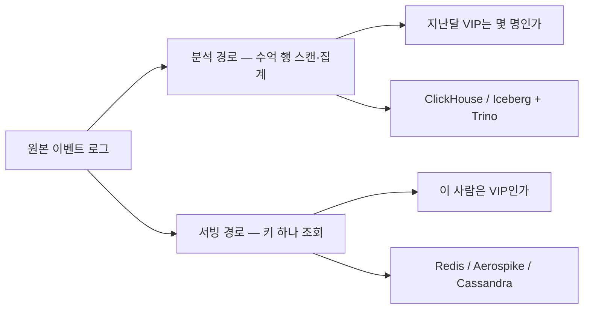

# 6장. 같은 데이터가 왜 두 벌인가 — 저장·질의와 정확도의 협상

화요일 오전 회의실. 마케터가 대시보드를 띄워놓고 묻는다. "지난달 VIP 세그먼트가 몇 명이었죠?" 화면 가운데 스피너가 몇 초 돈다. 그 몇 초를 이상하게 여기는 사람은 아무도 없다.

같은 순간, 여러분이 만든 앱 서버는 상품 상세 페이지를 그리려고 다른 질문을 던지고 있다. "이 사람은 VIP인가?" 이쪽에는 몇 초를 쓸 수 없다. 페이지 하나를 200밀리초 안에 그린다고 치면 프로필 조회에 떼어줄 수 있는 몫은 그 십분의 일 안팎이다. 게다가 이 질문은 초당 수만 번 들어온다.

두 질문은 한국어로 옮겨놓으면 거의 같은 문장이다. 둘 다 "VIP"를 묻고, 둘 다 같은 이벤트 로그에서 답이 나온다. 그런데 하나의 저장소로는 못 푼다.

## 두 질문, 두 경로

이 책의 리서치가 스택 문서들을 대조해 정리한 그림은 이렇다.

| | 분석 경로 | 서빙 경로 |
|---|---|---|
| 질문 | "지난달 VIP 세그먼트는 몇 명?" | "이 사람은 VIP인가?" |
| 접근 | 수억 행 스캔·집계 | 키 하나 조회 |
| 지연 | 초~분 | 밀리초 |
| 동시성 | 수십 | 수만 |
| 스토어 | ClickHouse / Iceberg+Trino | Redis / Aerospike / Cassandra |


그림 1. 같은 이벤트 로그에서 갈라지는 두 경로

이 표를 읽을 때 지연 줄부터 눈에 들어오기 쉬운데, 지연은 결과다. 원인은 그 위의 접근 줄, 곧 **조회 패턴**이다.

수억 행을 훑어 하나의 숫자로 접는 일을 생각해보자. 이런 질의가 실제로 만지는 컬럼은 서너 개뿐이고 나머지 수십 개는 읽을 필요조차 없다. 같은 컬럼의 값들이 디스크에 연속으로 누워 있으면 필요한 만큼만 순차로 긁어올 수 있고, 한 컬럼 안의 값은 성질이 비슷하니 압축도 잘 먹는다. 반대로 키 하나로 한 사람을 찍어 오는 일에서는 그 배치가 최악이다. 한 사람의 속성 스무 개를 모으려면 스무 군데를 따로 읽어야 하니까.

앞의 일에는 컬럼별로 눕히는 배치가, 뒤의 일에는 한 사람 것을 한자리에 모으는 배치가 유리하다. 하나의 물리 레이아웃으로 둘 다 잘하는 방법은 없다. 저장소를 두 벌 두는 설계는 이 물리적 사실에 대한 항복 선언에 가깝다.

개발자가 마테크 아키텍처 다이어그램을 처음 볼 때 "왜 이렇게 중복이 많지?"라고 느끼는 이유가 여기 있다. 저장소가 여러 벌인 건 팀이 정리를 못 해서 생긴 사고가 아니다. 같은 데이터에 성질이 다른 질문 두 종류가 꽂힌 결과다.

이 장은 표의 왼쪽만 다룬다. 오른쪽 — 밀리초 안에 한 사람을 꺼내는 일 — 은 다음 장의 몫이다.

## 왜 컬럼 지향인가

왼쪽 경로의 대표 선수부터 뜯어보자. ClickHouse의 기본 테이블 엔진인 MergeTree는 공식 문서 한 줄로 자기 성격을 다 설명한다.

> "The primary key also does not reference individual rows but blocks of 8192 rows called granules."
>
> — ClickHouse MergeTree 문서 (이 페이지에는 발행일이 없다 — 2026년 7월 25일 조회 기준)

여기서 "primary key"라는 단어에 속으면 안 된다. 우리가 아는 B-tree 인덱스는 행 하나하나를 가리킨다. 그래서 인덱스가 데이터 크기를 따라 함께 커지고, 결국 디스크로 밀려난다. MergeTree의 인덱스는 8192행짜리 덩어리(그래뉼) 하나당 한 항목만 갖는다. 행이 8192개 늘어날 때 인덱스는 한 항목만 늘어난다는 뜻이고, 그래서 데이터가 아무리 커져도 인덱스는 통째로 메모리에 들어앉는다.

대가가 있다. 사용자 한 명의 행 하나를 찍어 가져오는 일이 안 된다. 정확히는 8192행을 읽어와서 걸러내야 한다. 대시보드 집계에서는 아무 문제가 없고, 사용자 한 명의 프로필을 초당 수만 번 조회하는 일에서는 재앙이다. OLAP에 강하고 OLTP에 약하다는 흔한 요약이 이 한 줄에서 전부 나온다.

같은 이유로 이 엔진에서는 정렬 키가 곧 성능이다. MergeTree의 primary key는 파트 안에서 행이 어떤 순서로 눕는지를 정한다. 이벤트 테이블을 `ORDER BY (user_id, event_time)`으로 두면 한 사용자의 행동 시퀀스가 물리적으로 붙어 있어 사용자별 스캔이 빨라지고, `ORDER BY (event_time, event_name)`으로 두면 시간 범위 집계가 빨라진다. 마테크에서 자주 요구되는 퍼널과 리텐션은 사용자별 시퀀스를 봐야 답이 나오므로, 보통 `user_id`가 앞에 온다. 그리고 이걸 나중에 인덱스 하나 더 붙여 만회하기는 어렵다. 테이블을 만들 때 한 번 정해지는 물리 배치이고, 뒤늦게 바꾸려면 테이블을 다시 쓰게 된다.

한 층 위의 질의 엔진도 같은 경고를 한다. Trino 문서는 스스로 못을 박는다.

> "Do not mistake the fact that Trino understands SQL with it providing the features of a standard database."
> "Trino was not designed to handle Online Transaction Processing (OLTP)."
>
> — Trino 공식 문서 (발행일 없음 — 2026년 7월 25일 조회 기준. 버전은 483 / 2026-07-17 기준)

SQL을 받아준다는 사실과 데이터베이스라는 사실은 다르다. Trino는 여러 저장소에 흩어진 데이터를 하나의 SQL로 질의하게 해주는 엔진이고, 데이터를 자기가 들고 있지 않다. 마테크 팀에서 이 구분이 무너지면 "SQL 되니까 여기다 프로필 조회 붙이자"는 결정이 나오고, 그 결정은 트래픽이 붙는 날 확인된다.

## ClickHouse와 Pinot의 자리는 다르다

같은 왼쪽 경로 안에서도 갈래가 하나 더 있다. ClickHouse와 Apache Pinot을 놓고 어느 쪽이 빠른지 겨루는 글이 많은데, 리서치가 문서를 대조해 얻은 그림에서는 둘이 경쟁 관계로 보이지 않는다. 자리가 다르다.

ClickHouse가 앉는 자리는 분석가와 마케터가 대시보드에서 던지는 무거운 애드혹 쿼리다. 쿼리가 미리 정해져 있지 않고, 데이터는 크고, 동시에 던지는 사람은 수십 명 규모다. Pinot이 앉는 자리는 **최종 사용자에게 직접 노출되는 분석**이다. 광고주가 자기 콘솔에서 "내 캠페인 지금 성과"를 누르는 화면, 판매자 대시보드 같은 것. 쿼리 모양은 정형화돼 있고 대신 동시성이 수천에서 수만으로 뛴다.

그러니 둘 사이에서 고를 때 성능 순위표를 먼저 펼칠 이유가 없다. 확인할 것은 두 가지다. **이 화면을 누가 보는가**(내부 분석가인가 최종 사용자인가), 그리고 **동시에 몇 개가 들어오는가.** 사내 대시보드를 Pinot으로 지을 이유는 별로 없고, 고객사 콘솔을 ClickHouse 한 대로 버티려는 계획은 트래픽이 올라가면 흔들린다.

이 기준이 실무에서 유용한 건 요구사항을 받는 순간 바로 적용되기 때문이다. "이 리포트 화면 하나 만들어주세요"라는 요청을 받았을 때 쿼리 모양부터 물을 필요는 없다. 먼저 확인할 건 이 화면을 우리 회사 사람이 보는지 고객이 보는지, 그리고 동시에 몇 명이 볼 수 있는지다. 답이 "고객이, 아무 때나"로 나오면 그때부터는 다른 종류의 저장소를 검토하는 대화가 된다.

Pinot 프로젝트 문서는 자기 성능을 이렇게 표방한다 — "Ultra low-latency queries (as low as 10ms P95)", "High query concurrency (as many as 100,000 queries per second)". 이 두 수치를 쓸 때는 조건을 반드시 붙여야 한다. **프로젝트 자체 문서의 표방 수치이며 독립적으로 검증된 벤치마크가 아니다.** (검색 시점 2026년 7월 25일, Pinot 1.5.1 / 2026-06-30 기준.) 같은 이유로 이 책은 ClickBench 수치를 쓰지 않는다. 제3자 중립 벤치마크처럼 인용되는 경우가 많지만 운영 주체가 ClickHouse 쪽이고, 방법론 문서는 이번 리서치에서 확인하지 못했다.

Apache Druid도 이 자리 근처에 자주 등장한다. 다만 이번 리서치는 Druid 아키텍처 문서를 열지 못했다. 버전(37.0.0 / 2026-05-06)만 확인했고, "실시간 수집에 강한 OLAP"이라는 흔한 성격 규정은 1차 확인을 거치지 않은 통념 수준이라는 것을 밝혀둔다.

## 왜 Iceberg가 고객 데이터의 기본값이 되었나

대시보드 아래에는 원본이 쌓이는 층이 하나 더 있다. 요즘 이 자리의 기본값은 Apache Iceberg(1.11.0 / 2026-05-19)다. 왜 하필 이 테이블 포맷인지는, 고객 데이터라는 소재의 성질을 보면 납득이 된다.

Iceberg 스펙은 포맷 버전을 나눠 관리한다. v1은 불변 파일 관리, v2는 **행 수준 삭제**("delete files to encode rows that are deleted in existing data files"), v3는 타입 확장과 기본값, 행 계보까지. (스펙 원문은 main 브랜치 기준, 2026년 7월 25일 조회.)

마테크에서 결정적인 것은 네 가지다.

첫째, 지울 수 있어야 한다. 고객 데이터에는 삭제 요청이 법으로 강제된다. 행 수준 삭제가 없는 포맷에서 "사용자 한 명 지우기"는 그 사람의 행이 섞여 있는 파일 전부를 다시 쓰는 작업이 된다. 수 TB 재작성이 사용자 한 명 때문에 돈다고 생각하면 아찔하다. 그리고 이 비용은 요청이 들어온 뒤에 협상할 수 있는 종류가 아니다. 이미 몇 년치 원본이 그 포맷으로 쌓여 있을 테니까. **테이블 포맷 선택이 규제 대응 능력을 결정한다** — 이 문장은 10장에서 다시 만난다.

둘째, 스키마가 계속 변한다. 제품이 바뀔 때마다 이벤트에 필드가 붙는다. 셋째, 타임 트래블이 감사와 재현의 근거가 된다. "3월 캠페인 때 이 사용자가 정말 VIP였나?"를 그 시점 스냅샷으로 증명할 수 있고, 이건 정산 분쟁에서 실제로 필요해진다. 넷째, 엔진 중립이다. 벤더 락인을 피하는 실용적인 경로가 사실상 이것뿐이다.

물론 공짜는 아니다. 스트리밍으로 적재하면 작은 파일이 대량으로 생기고, 컴팩션이 상시 운영 업무가 된다. 그리고 스냅샷 만료 정책이 묘하게 찜찜한 자리에 놓인다. 안 걸면 비용이 계속 늘고, 짧게 걸면 방금 챙긴 타임 트래블과 삭제 감사 능력을 스스로 반납한다. 규제 요구와 비용이 정면으로 부딪히는 지점이다.

ClickHouse 쪽에도 대응되는 함정이 있다. mutation은 파트를 다시 쓰기 때문에, 삭제 요청 하나가 테이블 전체 재작성으로 번질 수 있다. `ReplacingMergeTree`나 파티션 단위 DROP 같은 설계를 미리 해두는 편이 낫다. 나중에 하면 늦는 종류의 설계다.

## 정확도는 협상 가능하다

여기까지가 저장 레이아웃 이야기였다. 이제 이 장에서 가장 새로울 이야기로 들어간다. 마테크의 집계는 대부분 **정확할 필요가 없고**, 그 사실을 이용하면 메모리를 수천 배 아낀다.

그 전에 마케터가 쓰는 지표 세 개의 뜻을 맞춰두자. 뒤에 나올 자료구조들이 왜 그렇게 짝지어지는지가 여기서 갈린다.

- **노출(impression)** — 광고나 콘텐츠가 화면에 뜬 **횟수**의 총합. 같은 사람에게 열 번 떴으면 10이다.
- **도달(reach)** — 최소 한 번이라도 닿은 **사람 수**. 같은 사람에게 열 번 떴어도 1이다.
- **빈도(frequency)** — 그 둘의 비율. 도달한 사람 한 명이 평균 몇 번 봤는가.

정의를 늘어놓고 보면 계산의 성격이 다르다는 게 보인다. 노출은 그냥 더하면 되니 어렵지 않다. 도달은 중복을 걸러내야 하니 고유 개수를 세는 문제이고, 빈도는 개별 대상의 등장 횟수를 추적하는 문제다. 이 세 문장이 이 절에 나올 자료구조들의 배치도다.

도달부터 보자. 1,000만 명의 고유 방문자를 정확히 세려면 어떻게 해야 할까. 중복을 걸러야 하니 이미 본 사용자 ID를 전부 들고 있어야 한다. 그런데 Redis 공식 문서는 자기 HyperLogLog 구현이 최대 12KB 메모리를 쓰고 0.81%의 표준 오차를 제공한다고 적는다. 문서가 직접 드는 사용 사례도 그대로 우리 이야기다 — "How many unique visits has this page had on this day?" (발행일 없음 — 2026년 7월 25일 조회 기준.)

이 자료구조의 이론적 뿌리는 Flajolet, Fusy, Gandouet, Meunier의 2007년 HyperLogLog 논문이다. 다만 방금 인용한 12KB와 0.81%는 **Redis 구현의 값이지 그 논문의 값이 아니다.** 이 구분을 흐리는 글이 흔한데, 근사 자료구조를 다룰 때는 "어떤 알고리즘인가"와 "누가 어떤 파라미터로 구현했는가"가 늘 별개다.

HLL에는 실무에서 자주 걸리는 한계가 하나 있다. **합집합은 되고 교집합은 안 된다.** 스케치 두 개를 합쳐 "A 또는 B에 속한 고유 사용자 수"는 구할 수 있지만, "A와 B 둘 다에 속한 수"는 직접 못 구한다. 포함배제 원리로 우회하면 오차가 증폭된다. 두 개의 근사값을 빼는 계산이라 원래의 오차가 그대로 남아 있는데, 결과 숫자는 훨씬 작아지기 때문이다. 작은 교집합일수록 상대 오차가 커지는 방향이라 하필 가장 조심해야 할 자리에서 가장 많이 흔들린다.

그런데 세그먼트 빌더에서 마케터가 실제로 누르는 조합이 바로 그것이다. "지난달 구매자 **그리고** 앱 미방문자, **단** 이미 쿠폰 받은 사람 제외." 화면에서는 체크박스 세 개지만 계산으로는 교집합과 차집합이고, HLL만 들고 있으면 이 화면의 숫자를 정직하게 채울 수 없다.

그 연산을 감당하려고 나온 자료구조가 따로 있다. Theta Sketch다. 근거 논문은 Dasgupta, Lang, Rhodes, Thaler의 "A Framework for Estimating Stream Expression Cardinalities"(arXiv:1510.01455, ICDT 2016)이고, 각 스트림의 샘플을 보편적으로 결합해 합집합·교집합·차집합의 카디널리티를 추정하는 틀을 제시한다. Apache DataSketches의 Theta Sketch가 이 계열의 구현이다.

이 논문에는 곁가지가 하나 붙는데, 이 책의 태도와 맞닿아 있어 적어둔다. 이 리서치는 저자 표기를 arXiv API로 직접 조회했고, 그 결과가 위의 네 사람이다. 검색 중에 다른 저자 조합으로 적힌 자료를 만났지만 API 응답이 기준이 된다. 서지 정보는 기억으로 복원할 수 있는 종류가 아니다. **인용은 조회하는 것이고, 기억나는 인용일수록 조회해야 한다.**

이제 "봤는가"와 "몇 번 봤는가" 쪽이다. "이 사용자가 이 광고를 이미 봤나?"에는 Bloom filter가 쓰인다. Redis 공식 문서가 광고 사용 사례를 직접 예로 든다 — "Has the user already seen this ad? Has the user already bought this product?" 그리고 보장의 비대칭성을 이렇게 설명한다. 집합에 없다는 답(부정)은 확실하고, 있다는 답(긍정)은 N번에 한 번 틀린다. 문서가 적은 메모리 값은 0.1% 오류율에서 항목당 14.378비트, 1% 오류율에서 9.585비트다. (같은 조회 기준.) 개념의 원류는 1970년 Bloom의 논문이지만, 방금의 비트 수는 Redis 문서의 값이다.

이 비대칭성의 방향이 마케팅에서 왜 다행인지 보자. 틀리는 쪽은 "안 봤는데 봤다고 판정하는" 경우뿐이다. 그러면 그 사람에게 광고 노출을 한 번 건너뛴다. 반대 방향 — 이미 본 사람에게 또 보여주는 사고 — 는 구조적으로 일어나지 않는다. 광고 기회를 조금 잃을 뿐 사용자를 괴롭히지는 않는 방향이고, 그래서 보수적으로 안전하다.

빈도로 가면 Count-Min Sketch가 나오는데, 성격이 또 다르다. Redis 문서가 스스로 강한 경고를 붙인다. 오류율로 결정되는 임계값 아래의 결과는 무시하고 사실상 0으로 취급해야 하며, 낮은 카운트는 잡음으로 봐야 한다는 것이다. 문서는 한 발 더 나가 균등 분포 스트림의 빈도를 세는 데는 최선의 자료구조가 아닐 수 있다고 인정한다. CMS는 롱테일을 세는 도구가 아니라 헤비히터를 찾는 도구다. "가장 많이 노출된 광고 TOP N"에는 맞고, "이 사용자가 이 상품을 몇 번 봤나"에는 안 맞는다. 개념의 학술적 출처는 Cormode와 Muthukrishnan의 2005년 논문이다.

마지막으로 분위수. "세션 길이 p50/p90/p99는?"이나 "VIP 임계값을 데이터로 정하자"는 요구에는 t-digest가 쓰인다. 개념의 출처는 Dunning과 Ertl의 2019년 t-digest 논문이다. 그리고 마케팅 리포트에 특히 유용한 기능이 하나 붙어 있는데, Redis 문서 기준으로 t-digest 명령에는 trimmed mean이 있다. 상하위 컷오프 백분위 바깥의 관측값을 빼고 낸 평균, 즉 이상치를 제외한 평균 객단가다. 리포트를 받아보는 사람이 "평균"이라는 단어로 실제로 원하는 숫자가 대개 이쪽이다.

## 어느 숫자가 어느 쪽인가

원리를 알았으니 이제 진짜 질문이 남는다. 어떤 숫자를 근사해도 되고 어떤 숫자는 안 되는가.

ClickHouse는 이 결정을 함수 이름으로 노출한다. `uniqCombined`는 적응형 3단 구조로, 기수가 작으면 배열, 중간이면 해시테이블, 커지면 HyperLogLog로 넘어간다. `uniqExact`는 정확한 답을 주는 대신 문서 표현으로 상태 크기가 "unbounded growth"를 갖는다. 문서는 정확한 결과가 꼭 필요한 경우에만 `uniqExact`를 쓰라고 권한다. (두 문서 모두 발행일 없음 — 2026년 7월 25일 조회 기준. ClickHouse는 26.x 계열 / 2026 기준.)

리서치가 정리한 번역은 이렇다. "이번 캠페인 도달 유니크 사용자 수"는 `uniqCombined`로 충분하다. 대시보드 숫자가 0.5% 틀려도 아무도 안 죽는다. 반면 "이 쿠폰을 실제로 받은 사용자 수", 즉 정산 대상자 수는 `uniqExact`다. 돈이 걸리면 근사는 안 된다.

그리고 이 구분을 못 한 팀이 겪는 사고가 있다. 마케팅 대시보드의 유니크 수와 정산 리포트의 유니크 수가 안 맞아서 며칠을 추적하는 것이다. 로그를 뒤지고 조인을 의심하고 중복 적재를 찾다가 마지막에 발견한다. 원인은 버그가 아니라 함수 선택이었다. 코드는 처음부터 의도대로 돌고 있었고, 두 리포트가 서로 다른 정의로 세고 있었을 뿐이다. 며칠을 태우고 나온 결론이 "함수 이름이 달랐다"일 때의 기분은 꽤 난감하다.

그래서 요구를 받는 순간 던질 판별 질문을 정리해두면 좋다. 근거가 단단한 것부터 순서대로다.

- **이 숫자로 누가 돈을 받거나 잃는가.** 정산·환급·쿠폰 예산처럼 금액이 딸려 나오면 정확해야 한다. 리서치가 명시적으로 이 선을 긋는다.
- **이 숫자에 집합 연산이 붙는가.** 교집합·차집합이 걸리면 HLL만으로는 안 되고 Theta Sketch 계열이 필요하다. 세그먼트 빌더의 요구가 대개 여기 해당한다.

아래 둘은 리서치가 내린 판정은 아니다. 위 두 기준에서 자연스럽게 따라오는 실무 어림에 가까우니, 규칙으로 굳히기보다 점검 항목으로 쓰는 편이 낫다. 하나는 **이 숫자가 다른 리포트와 대조되는가.** 두 숫자가 나란히 놓여 "왜 다르냐"는 질문을 받게 될 자리라면, 양쪽 정의를 같은 쪽으로 맞춰두는 게 안전하다. 다른 하나는 **이 숫자가 회사 밖으로 나가는가.** 광고주 콘솔이나 고객사 리포트처럼 외부에 고지되는 값은 나중에 근거를 대야 할 수 있다.

여기서 흔한 오해를 하나 정리하자. "그럼 다 정확하게 세면 되지 않나"는 생각이 자연스럽지만, 정확에도 값이 붙는다. `uniqExact`의 상태는 사용자가 늘어나는 만큼 함께 늘어난다. 세그먼트 100개를 매시간 정확히 세겠다는 선택은 조용히 클러스터 예산을 갉아먹고, 그렇게 확보한 정확도가 실제 의사결정을 바꾸는 경우는 드물다. MAU가 2,847,193이든 2,847,900이든 마케팅 의사결정은 하나도 달라지지 않는다. 근사를 고르는 건 어차피 아무도 읽지 않을 자릿수에 돈을 그만 쓰겠다는 선택에 가깝다.

또 하나. "논문을 읽었으니 구현을 안다"도 자주 틀린다. Heule, Nunkesser, Hall의 2013년 "HyperLogLog in practice"는 작은 카디널리티에서의 편향 보정, 64비트 해시, 희소 표현 같은 실무적 개선을 담았고, BigQuery의 `APPROX_COUNT_DISTINCT`나 Redis의 `PFCOUNT`가 실제로 구현하는 쪽은 원 논문 그 자체보다 이 개선판 계열에 가깝다. 그러니 특정 시스템의 오차 특성이 궁금하다면 알고리즘 이름 말고 그 시스템의 문서를 봐야 한다. 같은 "HyperLogLog"라는 이름 아래에서도 시스템마다 파라미터와 보정이 다르다.

말로만 보면 감이 잘 안 오니 하나 돌려보자. 이 장에서 유일하게 노트북에서 그대로 재현되는 실습이다. `pip install duckdb` 한 줄이면 준비가 끝난다(DuckDB 1.5.5 / 2026-07-22 기준, LTS는 1.4.5 계열).

```python
import duckdb

duckdb.sql("""
CREATE TABLE users AS
  SELECT i, 'u_' || md5(i::VARCHAR) AS user_id FROM range(1000000) t(i);

CREATE TABLE events AS
          SELECT user_id, 'view_item'   AS event_name FROM users
UNION ALL SELECT user_id, 'add_to_cart' FROM users WHERE i % 3  = 0
UNION ALL SELECT user_id, 'purchase'    FROM users WHERE i % 17 = 0;
""")

print(duckdb.sql("""
SELECT event_name, count(DISTINCT user_id) AS users
FROM events
GROUP BY event_name
ORDER BY users DESC;
"""))
```

100만 명짜리 이벤트 로그에 퍼널 쿼리 하나를 던진 것이고, 조회 → 장바구니 → 구매의 단계별 고유 사용자 수가 나온다. DuckDB 문서 표현으로 이 엔진은 별도 프로세스로 돌지 않고 "completely embedded within a host process" 방식이며, 컬럼 지향 벡터화 실행 엔진을 쓴다(발행일 없음 — 2026년 7월 25일 조회 기준). 앞에서 본 컬럼 지향의 성질을 설치 없이 만져볼 수 있는 셈이다.

여기서 `count(DISTINCT user_id)`를 근사 함수로 바꾸면 어떻게 될까. DuckDB에도 `approx_count_distinct`가 있으니 직접 바꿔 두 숫자를 나란히 놓아보면 된다. 다만 그때 눈에 보이는 차이를 "근사 집계는 원래 이만큼 틀린다"로 일반화하지는 말자. 방금 이야기한 대로 오차 특성은 구현과 파라미터가 정한다. 여기서 확인할 것은 오차의 크기보다는, 같은 질문에 대해 정확과 근사가 **함수 이름 하나로** 갈린다는 사실이다. 그 한 단어를 누가 언제 골랐는지 아무도 기록해두지 않은 팀에서 앞의 사고가 난다.

## 저장소가 네 벌인 이유

이 장의 이야기가 실무에서 어떻게 생겼는지는 채용 공고 한 장에 꽤 정직하게 드러난다. 2026년 7월 원티드에 올라와 있던 국내 마테크 회사 빅인사이트의 Data Platform Engineer 공고를 보면, 주요 업무에 저장소가 줄줄이 나열된다. MongoDB, Vitess/MySQL 샤딩 환경, ClickHouse, 그리고 Apache Iceberg 기반 데이터 레이크. 여기에 Flink 기반 스트리밍·배치 워크로드와 Argo Workflows 파이프라인이 붙는다.

처음 보면 "왜 이렇게 많지" 싶다. 그런데 이 장의 축을 대면 하나씩 자리가 잡힌다. 프로필은 필드가 계속 늘어나니 스키마리스 문서 저장소가 편하다. 주문·계약처럼 트랜잭션이 필요한 데이터는 샤딩된 RDBMS에 남는다. 대시보드 집계는 OLAP 스토어로 간다. 원본 이벤트는 삭제 가능하고 시점 조회가 되는 테이블 포맷으로 쌓인다. 그리고 이 네 벌 사이를 흐르는 물길이 스트리밍 처리기다. 저장소가 네 벌인 건 취향의 결과가 아니라 조회 패턴의 결과다.

같은 공고의 인재상 항목에는 이런 줄도 있다. "DB, 스토리지, 워크플로우, 인프라를 분리해서 보지 않고 전체 병목을 추적할 수 있는 분." 저장소를 여러 벌 두는 설계의 청구서가 이 문장에 적혀 있다. 벌 수가 늘어난 만큼 경계도 늘고, 느려진 이유는 대개 그 경계 어딘가에 있다. 대시보드가 느리다는 제보를 받았을 때 OLAP 스토어만 들여다봐서는 답이 안 나오고, 적재가 밀렸는지 컴팩션이 밀렸는지부터 거슬러 올라가야 한다.

바로 옆 줄에는 "실패한 워크플로우를 단순 재실행하지 않고 원인과 재발 방지까지 보는 분"이라는 항목도 있다. 채용 공고에 이 문장이 굳이 들어갔다는 건, 재실행 버튼으로 덮고 넘어가고 싶은 유혹이 이 일에 상시 존재한다는 뜻이기도 하다. 파이프라인이 여러 저장소를 관통하는 구조에서는 한 번의 재실행이 어느 저장소에 무엇을 두 번 쓰는지가 늘 명확하지는 않다.

### 이 장의 핵심

- 같은 고객 데이터가 두 벌 존재하는 근본 원인은 조회 패턴의 차이다. 수억 행 스캔과 키 하나 조회는 하나의 물리 레이아웃으로 둘 다 잘할 수 없다.
- 컬럼 지향 스토어가 빠른 이유와 단건 조회에 약한 이유는 같은 설계에서 나온다. MergeTree의 인덱스가 8192행 그래뉼 단위로만 데이터를 가리킨다는 사실 하나가 양쪽을 다 설명한다.
- 테이블 포맷 선택은 성능 문제이기 전에 규제 대응 능력의 문제다. 행 수준 삭제가 되느냐가 "사용자 한 명 지우기"의 비용을 결정한다.
- 근사 자료구조는 각자 다른 한계를 갖는다. HLL은 교집합이 안 되고, Bloom filter는 한쪽 방향으로만 틀리며, Count-Min Sketch는 헤비히터에만 쓸 수 있다.
- 정확도는 협상 대상이다. 돈이 걸리는가, 집합 연산이 붙는가가 먼저 물어야 할 두 질문이다.

---

앞 장에서 우리는 시간을 협상했다. 이 이벤트가 얼마나 늦게 도착해도 되는가, 이 세그먼트가 몇 분 늦어도 되는가. 그 협상표에 숫자를 채우고 나면 시스템 설계가 끝난 것처럼 보인다.

이 장을 지나고 나면 그 표가 절반짜리였다는 게 보인다. 남은 절반의 칸에는 다른 질문이 들어간다. **이 숫자는 얼마나 틀려도 되는가.** 마케터는 두 질문 모두 물어본 적이 없고, 대개 둘 다 개발자가 대신 물어야 한다.
