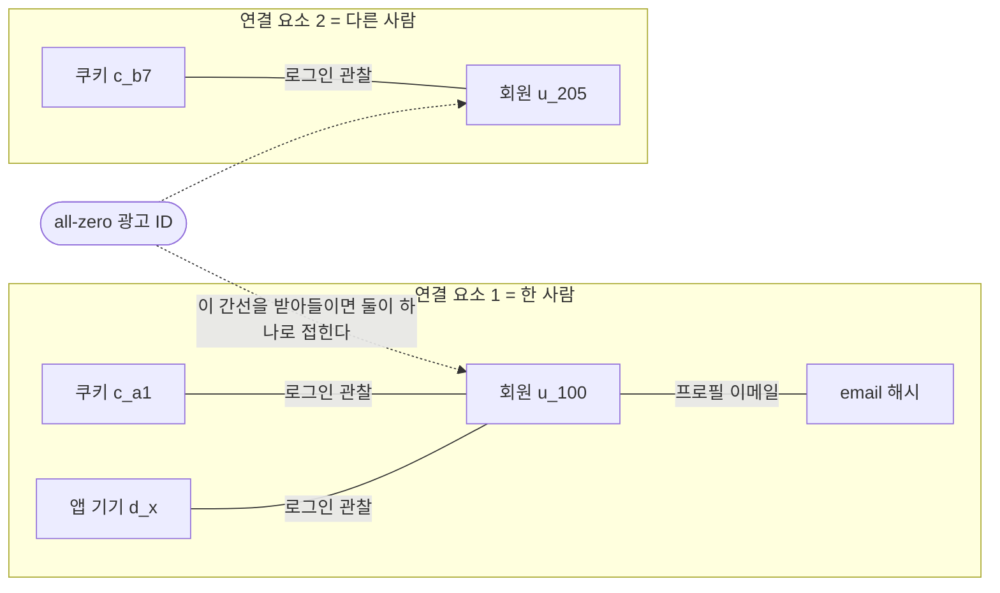

# 7장. 한 사람으로 묶고, 다시 내보낸다 — 아이덴티티와 액티베이션

```
00000000-0000-0000-0000-000000000000
```

iOS에서 사용자가 추적 권한을 거부했을 때 앱이 읽어오는 광고 식별자 값이다. Apple의 사용자 프라이버시·데이터 이용 문서는 이렇게 적는다.

> "Unless you receive permission from the user to enable tracking, the device's advertising identifier value will be all zeros and you may not track them as described above."
>
> — Apple, App Store 사용자 프라이버시·데이터 이용 페이지 (발행일 표기 없음 — 2026년 7월 25일 조회 기준)

이 값에서 눈여겨볼 것은 형식이다. 하이픈 위치까지 규격에 맞는, 완벽하게 유효한 UUID다. 파싱도 되고 검증도 통과하고 UUID 컬럼에 얌전히 들어간다. 어느 계층에서도 경고가 뜨지 않는다.

그런데 이 값을 "같은 사람임을 알려주는 키"로 쓰는 시스템에 그대로 흘려보내면 어떻게 될까. 추적을 거부한 사용자 전원이 같은 키를 공유하게 되니, **시스템의 눈에 그들은 한 사람이다.** 수백만 명의 행동 이력이 하나의 프로필로 접힌다. 그 프로필로 개인화를 하면 아무에게도 맞지 않는 추천이 모두에게 나간다.

이 장은 그 반대편 일을 다룬다. 흩어진 식별자를 한 사람으로 묶는 일, 그리고 묶어놓은 결과를 다시 밖으로 내보내는 일. 두 작업 모두 앞 장에서 미뤄둔 오른쪽 칸 위에서 벌어진다.

## 밀리초 안에 답해야 하는 질문들

앞 장의 표에서 왼쪽만 채우고 넘어왔다. 오른쪽은 이런 요구였다. 키 하나로 한 사람을 꺼내고, 밀리초 안에 답하고, 동시성은 수만.

숫자를 붙여보면 왜 별도 저장소가 필요한지가 분명해진다. 페이지 하나를 200밀리초에 그린다고 하면 프로필 조회에 떼어줄 수 있는 몫은 10~20밀리초 남짓이다. 그 안에 "이 사람이 어느 세그먼트에 속하는가", "오늘 이 사람에게 푸시를 몇 번 보냈나"에 답해야 한다. 앞 장에서 본 컬럼 지향 스토어는 이 일에 구조적으로 맞지 않는다. 8192행 그래뉼 단위로만 데이터를 가리키는 인덱스로는 한 사람을 찍어 올 수 없으니까.

그래서 이 자리에는 KV 스토어가 온다. 그리고 마케팅이 던지는 질문들은 의외로 자료구조와 깔끔하게 짝이 맞는다.

| Redis 자료구조 | 대응하는 마케팅 질문 |
|---|---|
| Hash | "이 사용자의 프로필 속성은?" |
| Set / Sorted Set | "이 사용자가 속한 세그먼트는?" / "실시간 인기 TOP 10" |
| Bitmap | "이 사용자가 오늘 방문했나?" (1천만 명 ≈ 1.25MB) |
| String + TTL | "오늘 푸시를 몇 번 보냈나?" |
| HyperLogLog | "오늘 이 캠페인의 고유 도달 수는?" |
| Bloom filter | "이 광고를 이미 봤나?" |

집합 연산이 그대로 세그먼트의 AND가 되고, 사용자당 1비트면 오늘 방문 여부가 풀린다. 뒤의 두 줄은 앞 장에서 원리를 뜯어본 근사 자료구조가 서빙 쪽에서 쓰이는 자리다. 나머지 넷은 정확한 답을 주는 대신 메모리를 그만큼 쓴다.

이 표를 읽을 때 자료구조 이름보다 중요한 건 쓰기 쪽이다. 세그먼트 소속을 Set에 담아두면 조회는 O(1)로 끝나지만, 세그먼트 정의가 하나 바뀔 때마다 수백만 개의 멤버십을 다시 써야 한다. 5장에서 본 배치와 스트리밍의 갈림길이 이 층에서는 "언제, 얼마나 많은 키를 갱신할 것인가"라는 모양으로 다시 나타난다.

여기서 개발자가 자주 밟는 지뢰가 TTL이다. 마케팅 상태값은 성격상 계속 늘어난다. 사용자 수 곱하기 캠페인 수만큼 키가 생기는 설계를 아무 생각 없이 하면 순식간에 터진다. 캠페인 하나에 사용자 천만 명이면 키 천만 개이고, 캠페인이 백 개면 십억 개다. **만료를 걸지 않은 키는 캠페인이 끝난 뒤에도 영원히 남는다.**

그리고 뒤늦게 알게 되는 고약한 함정이 하나 더 있다. 발송 횟수 카운터를 이 스토어에 두면 그 카운터의 수명이 저장소의 내구성 모델에 묶인다. 인스턴스가 재시작되면서 카운터가 리셋되면, 하루 한 번으로 제한해둔 광고가 같은 사람에게 열 번 나간다. 이 사고에서 **코드는 처음부터 끝까지 명세대로 돈다.**

이 자리에 Aerospike가 반복해서 등장하는 것도 같은 맥락이다. 인덱스는 메모리에 두고 데이터는 SSD에 두는 구조라 수억 프로필 규모에서 전량 메모리보다 비용이 낫고, 토스 피처 스토어의 온라인 스토어가 이것이며 Feast(0.65.0 / 2026 기준)도 온라인 스토어 목록에 이걸 추가했다.

## ID 그래프는 union-find 문제다

이제 키 하나로 조회하는 층이 준비됐다. 그런데 그 "키 하나"를 정하는 일이 남았다.

한 사람이 남기는 식별자를 세어보자. 로그인 전 웹 쿠키, 로그인 후 회원 ID, 모바일 앱 디바이스 ID, 이메일 해시, 광고 ID. 2장에서 식별자가 확실한 것과 짐작뿐인 것 두 등급으로 갈린다는 걸 봤는데, 실제 시스템에서는 그 등급 안에서 개수가 계속 늘어난다. 이 다섯 개가 같은 사람이라는 사실을 알아야 개인화가 성립한다.

개발자에게 익숙한 말로 옮기면 이건 union-find 문제다. 식별자가 노드이고, "같은 사람"이라는 관찰이 간선이고, 연결 요소 하나가 한 사람이다.


그림 1. 식별자 노드와 관찰 간선, 그리고 그래프를 무너뜨리는 값 하나

union이라는 연산 이름이 붙는 순간 두 가지가 따라온다. 간선 하나를 잘못 받아들이면 두 사람이 한 사람이 된다. 그리고 **그 union을 되돌리는 연산은 이 자료구조에 없다.**

간선의 성격도 짚어둘 만하다. "같은 사람"이라는 간선은 어디까지나 관찰이다. 로그인은 꽤 믿을 만한 관찰이고, 같은 기기에서 접속했다는 것은 훨씬 약한 관찰이다. 그런데 union-find 자체는 간선의 신뢰도를 구분하지 않는다. 강한 관찰과 약한 관찰이 같은 자료구조에 들어가는 순간 둘은 같은 무게를 갖고, 그 결과가 다음 절에서 볼 손잡이들이 존재하는 이유다.

저장 전략은 대체로 세 갈래로 갈린다.

| 전략 | 방식 | 대가 |
|---|---|---|
| 정규 ID 매핑 | `식별자 → 대표 사람 ID`를 KV에 평탄화 | 조회는 O(1). 병합할 때 한쪽의 모든 식별자를 다시 써야 한다 |
| 간선 저장 + 배치 해석 | 관찰된 간선만 쌓고 배치로 연결 요소 계산 | 정확하지만 지연이 있다 |
| 그래프 DB | 관계를 1급 시민으로 | 유연하지만 밀리초 조회 요구와 궁합이 나쁠 수 있다 |

실무에서 자주 보이는 모양은 앞의 둘을 겹친 하이브리드다. 배치로 정확히 연결 요소를 계산해 KV에 물질화해두고, 스트림에서는 새로 들어온 간선을 즉시 반영하되 완전한 재해석은 다음 배치로 미룬다. 5장에서 본 배치와 스트리밍의 이중 구조가 여기서 한 번 더 나타나는 셈인데, 이유도 같다. 정확한 계산은 느리고, 마케팅은 지금 답을 원한다.

한 가지 밝혀둘 것이 있다. 이 세 갈래 정리는 이 책의 리서치가 여러 스택 문서를 대조해 추론한 아키텍처 정리다. 어느 벤더 문서에도 이렇게 적혀 있지는 않다. 일반적인 패턴으로 읽되 특정 제품의 구현이라는 뜻으로 읽지는 말자.

## 다른 이름, 같은 두 손잡이

그렇다면 실제 제품들은 이 문제를 어떻게 다룰까. 이 책의 리서치는 Segment, Adobe Experience Platform, mParticle, Bloomreach의 공식 문서를 각각 열어 아이덴티티 기능 서술을 대조했다. 기능 이름은 전부 다르다. 그런데 개발자에게 노출되는 손잡이는 같았다.

| | 우선순위 장치 | 개수 제한 | 오병합 방지 |
|---|---|---|---|
| Segment | priority (`user_id` 1위, `email` 2위, 나머지 알파벳순) | `user_id` 1개, 그 외 5개 (기본값) | blocked values |
| Adobe AEP | namespace priority | unique namespace = 그래프당 1개 | "graph collapse" 방지 |
| mParticle | identity priority (오름차순 순회) | 확인 불가 | (명칭 미확인) |
| Bloomreach | hard ID > soft ID | soft ID 타입당 64개 (초과 시 LRU 제거) | hard ID 지정 권고 |

**우선순위와 개수 제한.** 이 둘이 아이덴티티 해석 엔진이 개발자에게 내주는 조종간의 거의 전부다.

Segment의 문서는 이 손잡이가 실제로 어떻게 작동하는지를 예시로 보여준다. 기존 프로필이 `user_id: abc123`과 `email: jane@example1.com`을 갖고 있는데, 같은 이메일에 다른 `user_id: abc456`을 단 이벤트가 들어온다. `user_id`의 개수 제한은 1이고 우선순위는 `email`보다 높다. 그래서 이메일 쪽이 강등되고 새 `user_id`를 위한 새 프로필이 만들어진다. (문서 소스 리포지터리 기준, 발행일 표기 없음 — 2026년 7월 25일 조회.)

이 예시에서 규칙보다 눈여겨볼 것은 태도다. 두 관찰이 충돌할 때 시스템은 판단을 보류하지 않는다. 어느 쪽이든 고르고, 그 선택의 기준을 우리가 설정값으로 미리 정해두게 되어 있다.

Adobe는 이 실패에 이름까지 붙였다. 서로 다른 프로필이 하나로 합쳐지려는 상황을 문서가 "graph collapse"라 부르고, 그걸 막는 기능을 별도 문서로 둔다. 문서가 드는 유발 시나리오에는 여러 사람이 로그인하는 공유 기기, 사용자가 넣은 허위 연락처, 그리고 `user_null`이나 `not-specified` 같은 오류 식별자 값이 들어 있다. (갱신 2026년 6월 18일 기준.)

mParticle 문서에는 왜 우선순위가 필요한지를 한 줄로 설명한 대목이 있다.

> "a customer ID or email address is more likely to be unique to a single user than a device ID, because a device ID could be shared by multiple users."
>
> — mParticle IDSync 문서 (갱신 2026년 7월 16일 기준)

**기기는 공유되고 계정은 덜 공유된다.** 우선순위표는 그 확률 차이를 코드에 박아 넣은 것이다.

Bloomreach는 그래프 크기에 구체적인 숫자를 붙여둔 유일한 곳이었다. soft ID는 같은 타입당 64개까지 유지되고, 넘으면 가장 오래 쓰지 않은 항목부터 밀려난다. 다만 **이 64는 Bloomreach 문서의 값이다.** 다른 제품에 옮겨 쓰면 안 된다. 나머지 세 곳은 이번 리서치 범위에서 그래프 크기 제한 숫자를 확인하지 못했다.

마지막으로, 개발자가 오늘 당장 확인할 수 있는 항목 하나. Segment 문서는 기본으로 차단할 값들을 열거해둔다. `-1`, `null`, `anonymous`, 그리고 0과 대시로만 이루어진 값. 마지막 항목이 눈에 익다면 이 장의 첫 페이지 덕분이다. 벤더들이 차단 목록을 문서 앞쪽에 배치해두는 데는 이유가 있다.

## 결정적과 확률적 사이

식별자를 잇는 방법은 크게 두 가지다. 결정적 매칭은 조인 키가 있는 `JOIN`에 가깝다. 같은 이메일, 같은 회원 ID. 이 사람이 그걸 했다는 사실을 우리가 안다.

확률적 매칭은 유사도 임계값이 있는 `fuzzy match`에 가깝다. IP 대역, 기기 특성, 접속 시간대가 비슷하니 아마 같은 사람일 것이다. 임계값을 낮추면 더 많이 묶이고, 그만큼 서로 다른 사람이 한 프로필로 합쳐질 확률도 올라간다.

이 대비를 쓸 때 조심할 것이 있다. 두 방식의 정확도를 숫자로 이야기하는 자료가 돌아다니는데, 이번 리서치는 그 숫자들의 1차 출처를 확보하지 못했다. 확률적 매칭의 정확도를 독립적으로 검증한 자료도 마찬가지다. 그래서 이 책은 어느 쪽 숫자도 쓰지 않는다. **없다는 뜻이 아니라 확인하지 못했다는 뜻이다.**

대신 확실한 계보는 있다. 이 문제를 처음 이론으로 정리한 것은 1969년의 통계학 논문이다. Ivan P. Fellegi와 Alan B. Sunter의 "A Theory for Record Linkage"(*JASA* 64권 328호). 마테크 벤더가 "identity resolution"이라 부르는 기능의 학술적 조상이 인구조사 통계학에 있는 셈이다. 이 논문의 개념적 기여는 두 레코드가 같은 실체를 가리키는지를 확률적 결정 문제로 정식화했다는 것이다. 밝혀둘 것은, 이 책의 리서치가 확인한 범위가 서지 메타데이터까지이고 본문을 직접 대조하지는 못했다는 점이다. 그래서 여기서는 이름과 개념적 기여 이상은 적지 않는다.

그럼에도 이 계보가 실무에 주는 함의는 뚜렷하다. 확률적 판정에는 원래 "확신하지 못하는 구간"이 있다. 마테크 도구가 그 구간을 사람에게 물어보지 않고 자동으로 이어붙일 때 문제가 시작된다.

그래서 임계값을 정하는 일은 성능 튜닝처럼 보이지만 실제로는 정책 결정에 가깝다. 값을 올리면 프로필이 잘게 쪼개져 개인화의 재료가 줄고, 내리면 앞으로 볼 오병합의 확률이 올라간다. 어느 쪽 실수를 더 감당할 수 있는지는 회사가 무엇을 파느냐에 따라 달라진다. 그리고 그 판단을 개발자가 혼자 슬라이더로 결정하고 있다면, 그 사실 자체를 회의에 올려두는 편이 낫다.

식별자 표준화 쪽에서는 UID2가 자주 언급된다. 이 프로젝트 문서는 자신을 "a framework that enables deterministic identity for advertising opportunities on the open internet"이라 소개한다(문서 최종 갱신 2026년 7월 23일 기준). 이 소개 문장을 읽은 것이 전부다. 파생 절차도, 토큰 운영 방식도 열어보지 못했다. 그러니 이 책에서 UID2에 대해 더 나올 말은 없다. 업계 표준 식별자가 무엇인지에 대한 단정도 하지 않는다.

한 가지만 짚고 넘어가자. 이메일을 SHA-256으로 해싱해서 넘기는 관행이 익명화처럼 이야기될 때가 있는데, 같은 이메일은 언제나 같은 해시가 된다. 즉 **그 값은 여전히 조인 키다.** 익명화보다는 가명화에 가깝고, 이 구분은 10장에서 법 조문과 만난다.

## 과병합은 버그가 아니라 사고다

가족이 함께 쓰는 거실 PC를 떠올려보자. 한 브라우저 쿠키에 두 사람이 번갈아 로그인한다. 그 쿠키를 두 계정에 잇는 간선이 두 개 생기고, union-find는 성실하게 자기 일을 한다. 두 사람이 한 프로필이 된다.

여기서 벌어지는 일은 데이터 품질 저하가 아니다. A가 무엇을 샀는지가 B의 화면에 개인화라는 이름으로 뜬다. 추천 목록으로도 뜨고, 재구매 유도 메시지로도 뜨고, 장바구니에 남은 상품 알림으로도 뜬다. 개인정보를 유출하는 코드는 어디에도 없다. **유출은 개인화라는 정상 기능을 타고 나간다.**

이런 사고는 알아채기도 어렵다. 서버는 200을 반환하고, 데이터 파이프라인은 정상이고, 대시보드 숫자는 오히려 좋아 보인다. 프로필 하나에 이력이 두 배로 쌓였으니 세그먼트도 더 잘 잡히는 것처럼 보인다. 신고가 들어오기 전까지는 아무도 모른다.

대표적인 유발 조건은 몇 가지로 정리된다. 여러 사람이 쓰는 공용 기기, 이 장을 연 all-zero 값처럼 널이나 플레이스홀더가 그대로 식별자에 들어가는 경우, `info@`나 `noreply@` 같은 역할 계정, 그리고 기기를 초기화한 뒤 광고 ID가 새로 발급되면서 생기는 유령 간선. 목록을 보면 공통점이 있다. 전부 정상적인 데이터 흐름이다. 어느 것도 예외로 잡히지 않는다.

그리고 가장 아픈 대목. 병합은 되돌리기 어렵다. 정규 ID 매핑만 들고 있는 시스템에서는 두 사람의 식별자가 이미 한 대표 ID로 평탄화돼 있어서, 어느 간선이 잘못된 것이었는지 알아낼 방법이 없다. 그래서 관찰된 간선의 원장을 append-only로 남겨야 한다는 결론이 나온다. 앞의 저장 전략 표에서 두 번째 갈래가 느린데도 실무에서 살아남는 진짜 이유가 이것이다. **되돌릴 수 있는 유일한 형태다.**

이 요구를 설계로 옮기면 할 일은 단순한 편이다. 간선을 만드는 자리를 코드 한 곳에 모으고, 각 간선에 무엇을 근거로 이었는지와 언제 이었는지를 함께 남긴다. 그러면 잘못된 규칙 하나가 밝혀졌을 때 그 규칙으로 만들어진 간선만 골라 빼고 다시 계산할 수 있다. 이 기록을 남기지 않은 시스템에서 오병합을 정정하는 유일한 방법은 그래프를 통째로 다시 만드는 것이고, 그 사이 개인화는 계속 나간다.

반대 방향의 실패도 사고다. 익명 세션에서 상품을 담고 로그인한 다음 결제한 사람을 잇지 못하면, 시스템은 그를 첫 구매 고객으로 분류한다. 그리고 이미 여러 번 산 단골에게 신규 가입자용 쿠폰이 나간다. 예산이 새는 것도 문제지만 더 오래 남는 쪽은 측정이다. 신규 고객 수가 부풀려지고, 그 숫자를 다음 분기 계획의 입력으로 쓰는 조직이라면 왜곡이 한 번으로 끝나지 않는다. Bloomreach 문서는 이 계열의 더 사소한 버전도 경고한다. hard ID가 대소문자를 구분하기 때문에 같은 이메일이 다른 표기로 들어오면 프로필이 둘로 갈리고, 결과는 "같은 고객에게 이메일을 두 번 보내는" 일이다.

마지막으로, 이 그래프가 정확해야 하는 이유가 하나 더 있다. "내 데이터를 지워달라"는 요청은 그 사람의 모든 식별자에 매달린 데이터를 지우라는 뜻이다. **그래프가 부정확하면 삭제도 부정확해진다.** 이 요구가 파이프라인 전체를 어떻게 관통하는지는 10장에서 본다.

## Sync 하나를 열어본다

묶는 이야기는 여기까지다. 이제 반대 방향 — 만들어둔 세그먼트를 밖으로 내보내는 일, 이 도메인에서 액티베이션이라 부르는 작업으로 간다.

3장에서 컴포저블 CDP의 네 개념을 세워뒀다. Source, Model, Sync, Destination. 그때 남겨둔 숙제가 이것이다. 그중 Sync 하나를 실제로 열면 무엇이 들어 있는가.

Hightouch 개발자 문서(페이지 표기 2026년 7월 17일)가 명세하는 Sync의 축은 넷이다. 타입, 모드, 매핑, 스케줄. 이 목록이 1차 문서로 확인된 범위이고, 아래는 각 축이 어떤 운영 문제 위에 놓여 있는지를 읽어낸 것이다.

**모드**부터 보자. insert, update, upsert, archive가 나란히 있다. upsert가 명세에 있다는 건 같은 레코드를 다시 보내도 안전해야 한다는 요구가 처음부터 전제돼 있다는 뜻이다. 네트워크가 끊기거나 목적지가 잠시 죽었을 때 이 동기화는 재전송된다. 재전송이 중복을 만들지 않으려면 목적지에서의 식별 키가 안정적이어야 하고, 그 키는 대개 앞 절에서 만든 그래프에서 나온다. **아이덴티티가 흔들리면 액티베이션도 함께 흔들린다.** 병합이 잘못된 프로필은 잘못된 채로 광고 플랫폼과 CRM에 복제되고, 그 사본들에는 우리 쪽 append-only 원장이 따라가지 않는다.

archive가 함께 있다는 사실이 더 많은 것을 말한다. 목적지에서 사람을 빼는 일이 일급 시나리오로 명세에 들어와 있다는 뜻이니까. 마케팅에서 이건 제외(suppression)라고 불린다. 이미 산 사람에게 그 상품을 더 광고하지 않는 것, 이미 연간 요금제를 결제한 사람에게 같은 상품을 계속 권하지 않는 것. **타겟팅 목록을 만드는 일만큼이나 제외 목록을 정확히 유지하는 일이 중요하다.** 그리고 제외는 타겟팅보다 실패하기 쉽다. 목록에 넣는 일은 캠페인을 만드는 사람이 챙기지만, 빼는 일은 아무도 자기 일이라고 생각하지 않는 자리에 놓이기 쉽다. 9장이 그 실패 이야기로 열린다.

**매핑**은 소스 컬럼이 목적지 필드에 어떻게 대응하는지를 정하는 축이다. 3장에서 한 실무자가 지적한 마찰 — 목적지 SaaS의 문서를 읽지 않으면 SQL의 첫 줄도 못 쓴다는 — 이 여기서는 운영 비용의 형태로 돌아온다. 목적지가 필드 하나를 바꾸면 매핑이 깨지고, 그 사실은 대개 동기화가 실패한 다음에 알게 된다.

**스케줄**에는 간격과 크론에 더해 dbt Cloud나 Airflow 같은 도구의 트리거가 들어간다. 이 동기화가 파이프라인 오케스트레이션의 마지막 단계로 취급된다는 신호다. 상류의 배치가 실패했는데 하류의 동기화만 제 시각에 도는 구성은, 어제 계산된 세그먼트를 오늘 다시 내보내는 결과를 낳는다. 세그먼트가 어제 것이라는 사실은 목적지 어디에도 표시되지 않는다.

**타입**은 오브젝트인지 이벤트인지 오디언스인지를 가른다. 이 선택은 목적지 API의 어느 엔드포인트로 나가느냐를 정하고, 그 엔드포인트가 초당 몇 건을 받아주느냐가 곧 이 동기화의 실질 속도를 정한다. **스로틀은 우리가 고르는 값이 아니라 목적지에서 내려오는 값이다.** 목적지가 429를 던지기 시작하면 그때부터 이 동기화의 완료 시각은 우리 클러스터 크기와 무관해진다.

여기서 설계자가 답해야 할 질문이 하나 생긴다. 만 명을 내보내는 동기화에서 삼백 명이 목적지 검증에 걸려 거절됐다면, 이 동기화는 성공인가 실패인가? 전체를 실패로 처리하면 나머지 9,700명의 갱신이 밀리고, 성공으로 처리하면 삼백 명은 조용히 최신 상태에서 벗어난다. 어느 쪽을 고르든 그 삼백 명이 어디에 기록되는지가 이 시스템의 운영 가능성을 정한다. 이 부분의 구체적인 동작은 제품마다 다르고, 이번 리서치는 그 세부를 1차 문서로 확인하지 못했다. 그러니 벤더를 평가할 때 물어볼 질문 목록에 넣어두는 편이 낫다.

목적지가 얼마나 극단적인 제약을 내려보낼 수 있는지는 숫자를 보는 쪽이 빠르다.

## 데이터는 들어오기 쉽고 나가기 어렵다

Insider One의 API 레이트 리밋 문서에서 몇 줄만 뽑아보자. 아래 숫자는 전부 2026년 7월 문서 기준이고, 이런 값은 벤더가 예고 없이 바꾼다.

| API | 리밋 |
|---|---|
| Upsert User Data | 25,000 requests per minute |
| Export Raw User Data | 1 request per day |
| Send Transactional Emails | 9,000 requests per second |
| Create Email Campaigns | 1 request per second |

첫 두 줄을 나란히 놓으면 이 도메인의 성질 하나가 드러난다. 데이터를 밀어 넣는 문은 분당 2만 5천 번 열리고, 요청 하나에 사용자 천 명씩 최대 5MB를 담을 수 있다. 원본 데이터를 통째로 꺼내오는 문은 **하루에 한 번 열린다.**

이 비대칭은 성능 문제로는 설명되지 않는다. 내보내는 쪽이 무거운 작업인 건 맞지만, 하루 한 번이라는 값은 기술적 한계보다 이 제품을 쓰는 관계의 모양에 더 가깝다. 벤더 교체를 검토할 때, 감사 요구가 들어왔을 때, 데이터를 우리 웨어하우스로 되가져와 다시 계산하고 싶을 때 이 한 줄이 일정표를 정한다. 3장에서 데이터가 어디에 앉느냐가 중요하다고 했던 이야기가 여기서 숫자로 확인된다.

뒤의 두 줄도 읽어둘 만하다. 한 명에게 지금 즉시 보내는 트랜잭셔널 발송과 모두에게 한 번에 나가는 캠페인 생성 사이에 초당 9천 대 1의 격차가 있다. 두 기능은 이름만 나란할 뿐 **완전히 다른 시스템이고**, 이 격차를 모르고 캠페인 API로 개인별 발송을 구현하려 들면 첫 부하 테스트에서 벽을 만난다. 이 차이가 채널 설계에서 무엇을 의미하는지는 9장에서 이어진다.

같은 제품의 인입 API에는 눈여겨볼 플래그가 하나 있다. 사용자 데이터를 밀어 넣을 때 `skip_hook`으로 이 임포트가 저니를 깨울지 말지를 정한다 — 과거 데이터 백만 건을 밀어 넣는 순간 백만 명분의 자동화가 동시에 발화하는 사고를 막는 스위치다.

마지막으로 API 목록 자체를 세어보자. 이 제품의 사용자 데이터 API는 여섯 개인데, 그중 넷이 삭제하거나 식별자를 고치는 계열이다(속성 삭제, 식별자 갱신, 식별자 삭제, 그리고 별도의 프로필 삭제와 개인정보 삭제까지 세면 더 늘어난다). **이 제품에서는 API 표면의 절반 이상이 삭제와 정정 요구를 처리하는 데 쓰인다는 뜻이다.** 표본은 한 제품이니 업계 전체로 넓혀 읽지는 말자. 그래도 규제가 이 도메인에서 어떤 위치인지 보여주는 자료를 찾는다면, API 목차보다 정직한 것은 없다.

### 이 장의 핵심

- 서빙 경로는 밀리초·수만 동시성·단건 조회라는 요구 위에 서 있고, 그래서 분석 경로와 다른 저장소를 쓴다. 마케팅 질문들은 KV 자료구조와 거의 일대일로 대응한다.
- ID 그래프는 union-find다. 식별자가 노드, 관찰이 간선, 연결 요소가 한 사람이며, union은 자료구조 차원에서 되돌릴 수 없는 연산이다.
- 아이덴티티 제품들은 이름이 달라도 개발자에게 같은 두 손잡이를 준다. 우선순위와 개수 제한. 여기에 차단할 값의 목록이 안전장치로 붙는다.
- 과병합은 개인정보 사고이고, 정상 기능인 개인화를 타고 밖으로 나간다. 되돌리려면 간선 원장이 append-only로 남아 있어야 한다.
- 액티베이션의 난이도는 목적지가 정하는 제약에서 나온다. 재전송 안전성, 제외 목록, 매핑 유지, 그리고 레이트 리밋.

---

이 장은 답 대신 확인 목록을 남기려 한다. 세 가지를 물어보자.

지금 여러분이 만지는 시스템에서, 두 프로필이 잘못 합쳐진 것을 오늘 발견했다면 되돌릴 수 있는가. 되돌릴 수 있다면 어떤 기록 덕분인가.

그리고, 식별자로 들어오면 안 되는 값의 목록이 어딘가에 코드로 존재하는가. 존재한다면 마지막으로 갱신한 것이 언제인가.

마지막으로, 벤더에 쌓인 우리 고객 데이터를 전부 되가져오라는 요청을 내일 받는다면, 며칠이 걸린다고 답해야 하는가.

세 질문 모두 문서에는 잘 적혀 있지 않다. 답을 아는 사람은 대개 그 코드를 쓴 사람뿐이다.
