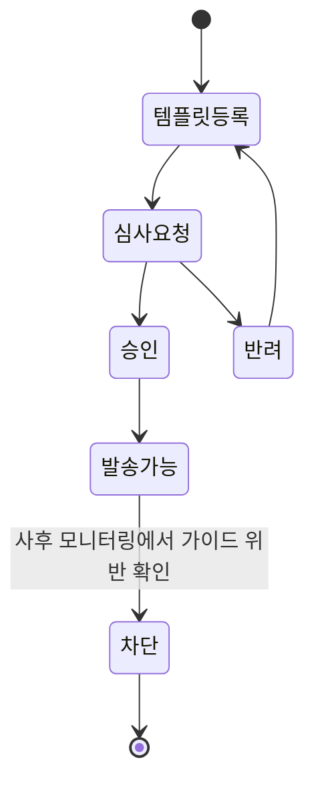

<!-- 개정: 2026-07-26 style_log 편차 7건(Should 4/Nice 3, Critical 0) + factcheck_log 판정 2건(⚠️2) 반영 -->

# 9장. 메시지가 나가는 순간 — 저니·채널·빈도·딜리버러빌리티

2024년 1월, 해커뉴스에 이런 댓글이 올라왔다. 푸시 알림이 왜 이렇게 지겨워졌느냐는 스레드에서 한 사용자가 남긴 경험담이다.

> "푸시 알림만의 문제가 아니다. 모든 커뮤니케이션 채널을 합친 결과다. 나는 최근에 어떤 서비스를 해지했다. 이미 그쪽 연간 프리미엄 요금제를 쓰고 있는데도 평생 구독권을 계속 보내왔기 때문이다. 2주 동안 푸시 4번, 이메일 4번, 앱을 열었더니 전면 광고가 2번. 이 제품은 다시 안 쓸 거다. 아이러니하게도 이 앱은 수면의 질과 집중, 명상을 다룬다."
>
> — winkelwagen, Hacker News 댓글 38840135 (2024-01-02). 한 사용자의 개인 진술이다.

발송한 쪽의 시스템을 상상해보면 이 장면이 조금 다르게 보인다. 아마 아무것도 고장 나지 않았을 것이다.

푸시 캠페인은 자기 대상자 목록대로 정확히 나갔다. 이메일 캠페인도 마찬가지다. 인앱 메시지를 띄우는 SDK도 서버가 내려준 조건을 그대로 평가했다. **세 시스템 모두 명세대로 동작했고, 셋 중 무엇도 에러를 뱉지 않았다.**

그런데 사고는 났다. 사고의 자리는 세 곳이다. 이미 연간 요금제를 결제한 사람이 대상자 목록에서 걸러지지 않았다 — 7장에서 액티베이션의 일급 요구로 봤던 제외(suppression)가 빠진 것이다. 두 번째로, 세 채널이 각자의 발송 규칙만 지켰고 셋을 합쳐서 세는 곳이 아무 데도 없었다. 마지막으로, 이 모든 일이 대시보드 위에서는 잘 굴러가는 캠페인 세 개로 보였을 것이다.

5장부터 8장까지 우리가 만든 것은 "누구에게"까지였다. 이벤트를 잃지 않고 받아 저장하고, 한 사람으로 묶고, 조건에 맞는 집합을 뽑았다. 남은 구간은 짧아 보인다. 목록이 나왔으니 보내면 된다. 그런데 이 마지막 한 칸에 지금까지와 성격이 전혀 다른 제약이 들어온다.

## 보내는 쪽은 하나의 시스템이 아니다

같은 스레드에 이런 요구도 있었다.

> "이 방식의 문제는 알림을 통째로 켜거나 끄게 만든다는 거다. 나는 알림이 이메일처럼 두 종류로 나뉘면 좋겠다. 거래성과 마케팅성. 아마존 배송 알림을 포기하지 않고도 아마존 마케팅 푸시만 끌 수 있어야 한다."
>
> — joshmanders, Hacker News 댓글 38842663 (2024-01-02)

개발자에게 이 문장은 불만보다 스펙에 가깝다. 수신 설정이 채널마다 boolean 하나면 이 요구를 구현할 수 없다. 필요한 건 **채널과 목적을 교차한 격자**다. 이메일-거래성, 이메일-광고성, 푸시-거래성, 푸시-광고성. 그리고 실무에서 이 격자는 곧 더 쪼개진다. 목적이 두 종류로 끝나지 않고, 지역이 달라지면 기본값이 달라지기 때문이다. 동의를 어디까지 쪼개야 하는지는 10장이 맡는다.

이 분리는 수신 설정에서 멈추지 않는다. 보내는 시스템 자체가 갈린다. 7장에서 본 벤더 API의 레이트 리밋 표가 그걸 그대로 보여준다. 2026년 7월 문서 기준으로 Insider의 트랜잭셔널 이메일 발송은 초당 9,000요청까지 허용되는데, 이메일 캠페인 생성은 초당 1요청이다. 이 격차에는 이유가 있다. 결제 완료 알림은 한 명에게 즉시, 지연 없이, 실패하면 곤란한 발송이고, 캠페인은 수백만 명에게 한 번에 예약해 밀어내는 작업이다. 요구되는 가용성도 다르고, 큐 구조도 다르고, 재시도 정책도 다르다.

그래서 광고성 발송 경로에는 거래성 경로에 없는 관문이 줄줄이 붙는다. 발송 직전에 동의 상태를 확인하고, 스케줄러가 허용된 시간대인지 보고, 빈도 상한에 걸리는지 세고, 제외 목록에 있는지 확인한다. 관문 하나하나가 다 코드고, 어느 하나가 빠져도 오프닝의 그 사고가 난다. 이 관문들의 법적 근거는 10장에서 정리한다. 여기서는 채널이 지우는 공학적 제약으로만 다룬다.

## 저니를 실행 시스템으로 연다

5장에서 저니라는 말을 꺼내면서 최소한의 정의만 주고 넘어갔다. 캠페인을 실행하는 단위이고 실체는 상태 머신이라는 것, 그리고 "장바구니 담기 → 30분 대기 → 그 사이 결제가 없으면 쿠폰, 있으면 종료"가 가장 단순한 형태라는 것까지였다. 마케터가 이걸 어떤 화면에서 그리는지, 그 화면이 개발자에게 무슨 요구로 돌아오는지는 미뤄뒀다. 이제 열어보자.

마케터가 보는 화면은 대개 캔버스다. 노드를 끌어다 놓고 선으로 잇는다. 노드의 종류는 제품마다 이름이 달라도 대체로 다섯 갈래다. 누가 이 저니에 들어오는지를 정하는 진입 조건, 시간을 흘려보내는 대기, 조건에 따라 길을 가르는 분기, 실제로 무언가를 하는 액션(대개 발송), 그리고 빠져나가는 종료. 앞의 장바구니 예시는 이 다섯 개를 한 줄로 이어놓은 것이다.

노드 하나하나가 개발자에게는 요구사항 하나씩이다.

진입 조건은 이벤트 스트림 구독이다. 여기서 곧바로 정책 질문이 붙는다. 같은 사람이 하루에 장바구니를 세 번 담으면 저니 인스턴스가 세 개 생기는가? 재진입을 허용할지, 허용한다면 쿨다운을 얼마로 둘지가 정해지지 않으면 한 사람에게 쿠폰 세 장이 나간다.

대기는 겉보기에 가장 쉬워 보이는데 실은 이 캔버스에서 가장 무거운 노드다. 대기 중인 사용자 수만큼 타이머가 살아 있어야 하고, 그 수는 캠페인 하나에서도 수백만이 될 수 있다. 배포로 프로세스가 재시작돼도 타이머가 살아남아야 하고, 30분짜리 대기가 서버 시계 기준인지 사용자 시간대 기준인지도 정해야 한다.

분기는 판정 시점의 프로필을 읽는다. 7장에서 본 서빙 경로가 여기서 호출된다. 밀리초 단위 단건 조회가 왜 별도 저장소로 존재하는지가 저니 캔버스 위에서 실물로 드러나는 지점이다.

액션은 앞 절의 관문들을 전부 통과해야 하고, 그 위에 멱등성이 얹힌다. 발송 API 호출이 타임아웃 났을 때 재시도하면 중복 발송이 될 수 있다. 발송 요청마다 고유 키를 실어 보내고 벤더 쪽이나 우리 쪽에서 중복을 걸러내는 설계가 필요하다.

종료는 잊기 쉽다. 종료 조건이 어느 경로에도 걸리지 않는 인스턴스는 상태 저장소에 영원히 남는다. 반년 뒤 원인 모를 저장소 증가를 추적하다 만나는 게 대개 이런 인스턴스들이다.

여기에 운영 질문이 하나 더 붙는다. 마케터가 저니를 수정했을 때, 지금 대기 노드에 앉아 있는 사용자 30만 명은 옛 버전으로 끝나는가 새 버전으로 갈아타는가. 정답은 없지만 정해두지 않으면 난감해진다. 답을 안 정해둔 채로 마케터가 화면에서 노드를 하나 옮기는 순간, 진행 중인 인스턴스가 어떻게 될지 아무도 설명하지 못하는 상태가 된다.

제품 구조로 보면 이 실행기는 데이터 계층과 분리되어 있다. 3장에서 봤듯이 Adobe는 Journey Optimizer가 Experience Platform 위에 네이티브로 얹혀 같은 데이터 기반과 아이덴티티 그래프를 공유한다고 문서에 적어두었고, 같은 분리가 다른 벤더에서도 반복된다. 프로필을 쌓는 쪽과 저니를 돌리는 쪽은 다른 서비스이되 같은 데이터를 본다.

학술 쪽에도 이 어휘의 뿌리가 있다. 고객 여정을 학술 개념으로 정리한 계열에서 가장 많이 인용되는 논문은 Lemon & Verhoef (2016), "Understanding Customer Experience Throughout the Customer Journey," *Journal of Marketing* 80(6), 69–96이다. 다만 이 책의 리서치는 이 논문의 서지와 피인용 수까지만 확인했고 초록을 확보하지 못했다. 그래서 여기서는 이름과 "이 어휘에 학술적 계보가 있다"는 사실까지만 옮긴다. 11장에서 만날 어트리뷰션·증분성 연구들과 같은 무게로 읽지는 말자. 그쪽에는 초록과 수치까지 확인한 근거가 있고, 이쪽은 아직 이름뿐이다.

## 같은 콘솔의 두 토글, 다른 근거 강도

캠페인 설정 화면을 떠올려보자. 어느 제품에서든 비슷한 위치에 비슷한 토글이 있다. 하나는 "빈도 상한", 다른 하나는 "AI 발송 시각 최적화". 둘 다 체크박스 하나고, 둘 다 도움말 아이콘이 붙어 있고, 세일즈 자료에서는 나란히 소개된다. 그런데 두 기능 뒤에 쌓여 있는 근거의 양은 같지 않다.

먼저 빈도 쪽이다. 커뮤니케이션을 얼마나 자주 보내야 하는가에는 최상위 마케팅 저널에 실린 연구가 있다. Godfrey, Seiders & Voss (2011), "Enough Is Enough! The Fine Line in Executing Multichannel Relational Communication," *Journal of Marketing* 75(4), 94–109다. 제목이 이미 방향을 말한다 — 이만하면 충분한 선이 있고, 그 선을 넘으면 곤란해진다. 빈도에 최적점이 있다는 구조 자체가 학술 문헌의 주제가 됐다는 뜻이다.

다만 이 책이 읽은 것은 제목과 서지와 피인용 수다. 초록 본문은 열지 못했다. 그러니 "주당 몇 회가 최적"이라는 식의 수치는 이 논문에 귀속시키지 않는다. 방향까지가 안전선이다.

같은 축에 놓이는 논문이 하나 더 있다. Zhang, Kumar & Cosguner (2017), "Dynamically Managing a Profitable Email Marketing Program," *Journal of Marketing Research* 54(6), 851–866. 이쪽은 확인 범위가 더 좁아서(서지는 확인했지만 피인용 수까지는 확보하지 못했다), 이 책은 제목과 서지를 옮기는 데서 멈춘다. 무엇을 발견했는지는 원문을 열어본 사람만 말할 수 있다.

이제 발송 시각 쪽이다. 사용자마다 열어볼 확률이 가장 높은 시각을 예측해 그 시각에 보낸다는 기능은 거의 모든 메시징 제품이 판다. 이 책의 리서치는 2026년 7월 25일 조회 기준으로 최상위 마케팅 저널에서 이 기능을 검증한 연구를 찾지 못했다. 찾은 것은 세 종류다. 업계 블로그의 "최적 발송 시간" 통계, 특허 문서, 그리고 응용 저널 논문 한 편 — Araújo et al. (2022), "A Novel Approach for Send Time Prediction on Email Marketing," *Applied Sciences* 12(16), 8310. 다만 이 저널은 마케팅 분야의 최상위 저널이 아니어서, 이 논문으로 말할 수 있는 것은 "그런 시도가 학술 문헌에 존재한다"까지다.

정리하면 한쪽은 학술 문헌에 뿌리가 있고, 다른 쪽은 벤더가 주도해 만든 기능이다. 이건 그 기능을 끄라는 말이 아니라, 두 토글에 같은 크기의 확신을 얹지 말자는 말이다. 4장에서 근거가 끊긴 항목 열두 건을 표로 정리했는데, 그 3번 행이 바로 이 기능이었다. 여기가 그 행을 갚는 자리다.

왜 이 구분에 한 절을 쓸까? 발송 시각 최적화 하나를 판별하려는 게 아니기 때문이다. 이 도메인의 제품 설명서에서는 검증된 것과 그럴듯한 것이 같은 활자 크기로, 같은 문단 안에, 같은 확신의 어조로 놓인다. 어느 쪽이 어느 쪽인지 매번 되짚는 습관이 없으면 개발자는 둘을 같은 무게로 받아 적게 되고, 그 무게가 로드맵과 코드에 그대로 실린다.

실무에서 이 구분은 질문 두 개로 바뀐다. 벤더 데모에서 "AI가 최적 시각을 찾아줍니다"라는 설명을 들으면 물어보자. **그 최적이 무엇으로 검증됐습니까.** 자사 고객 데이터에서 나온 관찰인지, 공개된 연구가 있는지. 그리고 하나 더. **이 기능을 켠 집단과 끈 집단을 우리 쪽에서 나눠 재볼 수 있습니까.** 두 질문 다 모델 내부를 몰라도 답을 받아낼 수 있고, 답에 따라 우리가 이 기능을 어떻게 다룰지가 갈린다. 근거가 얇은 기능일수록 홀드아웃을 남겨둘 이유가 커진다.

## 빈도 상한을 구현한다는 것

빈도에 근거가 있다는 걸 알았으니 이제 세는 문제가 남는다. 7장에서 봤듯이 이런 카운터는 대개 키-값 저장소에 String과 TTL 조합으로 앉는다. `freq:{user_id}:{채널}:{날짜}` 같은 키를 만들고, 발송할 때마다 증가시키고, 하루가 지나면 만료시킨다. 코드로 옮기면 몇 줄이다.

몇 줄짜리 로직이 실제로 어려워지는 건 그다음부터다.

먼저 검사 시점이다. 세그먼트 계산 시점에 상한을 확인하면 늦다. 그 목록은 몇 시간 전에 뽑혔고, 그사이 그 사람은 다른 캠페인에서 메시지를 두 통 더 받았을 수 있다. 상한 검사는 발송 직전에 한 번 더 해야 한다.

다음은 무엇을 하나로 셀 것인가다. 오프닝의 그 사람이 받은 열 번은 세 채널에 흩어져 있었다. 채널별로 상한을 걸면 각 채널은 자기 규칙을 완벽히 지키면서도 합계는 아무도 책임지지 않는 상태가 된다. 그래서 채널을 가로지르는 통합 상한이 필요한데, 이건 카운터 키 하나 바꾸는 일로 끝나지 않는다. 각 채널 발송기가 발송 직전에 같은 카운터를 보고 같은 규칙으로 판정해야 하고, 그러려면 발송 경로가 어디에 몇 개나 있는지부터 파악돼야 한다. 대개는 그것부터가 잘 안 된다.

윈도의 정의도 정해야 한다. 자정에 리셋되는 하루 단위인지, 최근 24시간을 굴리는 슬라이딩 윈도인지. 자정 기준이라면 어느 시간대의 자정인지. 밤 11시 50분과 0시 10분에 각각 한 통씩 나가면 규칙상으로는 이틀에 한 통씩이다.

그리고 무엇을 세지 **않을** 것인지가 남는다. 이 장 첫머리에서 갈라놓은 두 종류가 여기서 다시 필요하다. 결제 완료 안내나 배송 출발 알림이 빈도 상한에 걸려 나가지 않으면 그건 곧바로 장애다. **상한 검사는 광고성 발송 경로에만 걸리고, 카운터도 광고성 발송에서만 증가해야 한다.** 이 분기를 발송기마다 따로 구현해두면 언젠가 한 곳이 어긋나고, 어긋난 쪽이 어디인지는 고객 문의로 알게 된다. 판정을 한 곳에 모아두는 편이 낫다.

마지막으로 카운터의 내구성이다. 7장에서 짚었듯이 저장소의 내구성 모델에 따라 카운터는 사라질 수 있다. 카운터가 날아간 뒤에 벌어지는 일은 상한이 조금 느슨해지는 정도로 끝나지 않는다. 그 시간 동안 상한이 아예 없어진다. 하필 그날이 대형 프로모션 날이었다면 꽤 아찔하다. 이 카운터는 정확도를 협상할 수 있는 숫자인가, 아닌가. 6장에서 익힌 질문이 여기서 다시 필요하다.

이 문제가 오래됐다는 정황도 하나 남겨둔다. 이 책이 열어본 해커뉴스 스레드에서 마케팅 알림이 채널 자체를 망가뜨린다는 불만은 2012년 7월(dirtae)에도 있었고 2025년 9월(callalex)에도 있었다. 13년 넘게 같은 말이 반복되는 셈이다. 다만 이건 이 리서치가 확보한 표본에서의 관찰이고, 그 표본은 영어권 해커뉴스에 크게 치우쳐 있다. 업계 전체의 통계로 읽으면 안 된다.

## 딜리버러빌리티라는 토끼굴

빈도까지 지켰다고 하자. 그래도 메시지가 도착했는지는 별개 문제다 — 보낸 메일이 실제로 받는 사람의 인박스에 들어가느냐, 업계에서 딜리버러빌리티라 부르는 영역이다.

> "이메일, 특히 딜리버러빌리티는 토끼굴이다. 설정해서 '기본적으로' 돌아가게 만드는 건 쉽다. 그런데 그게 되는 게 아니다. (…) 볼륨이 커지면 진작 했어야 할 관행들이 있는데 그건 경험으로만 배우게 되고, 그걸 안 지키면 앞의 걸 다 해도 아무것도 안 들어간다."
>
> — sbov, Hacker News 댓글 9115955 (2015-02-26)

개발자에게 이 영역이 낯선 이유는 분명하다. 우리가 익숙한 세계에서 200 OK는 성공을 뜻한다. 그런데 메일 발송 API의 200은 "요청을 접수했다"까지만 보장한다. 그다음에 수신 측 메일 서버가 이 메일을 받을지, 스팸함에 넣을지, 조용히 버릴지는 우리 코드 바깥에서 결정된다.

그 결정에 가장 크게 관여하는 것이 인증 체계 세 가지다. 그리고 여기서 업계 어휘와 실제 문서의 위상이 어긋난다.

| 문서 | 무엇 | 발행 | IETF 카테고리 |
|---|---|---|---|
| RFC 7208 | SPF (Sender Policy Framework) v1 | 2014-04 | Standards Track |
| RFC 6376 | DKIM Signatures | 2011-09 | Standards Track |
| RFC 7489 | DMARC | 2015-03 | **Informational** |

셋을 "이메일 인증 표준 삼종 세트"로 묶어 부르는 게 업계 관행이다. 그런데 IETF의 발행 분류로는 SPF와 DKIM만 Standards Track이고, DMARC는 Informational이다. 이 책의 리서치는 세 RFC의 원문 페이지를 직접 열어 이 분류를 확인했다.

여기서 엉뚱한 결론으로 가지 않도록 한 줄 덧붙여둔다. Informational은 IETF가 이 문서를 어느 트랙에 올렸는지를 가리키는 분류다. 주요 메일 수신 사업자들은 DMARC 정책을 실제로 참조해 메일을 처리하고, 그래서 운영상으로는 사실상 필수에 가깝다. 이 문서를 빼도 된다는 이야기로 읽지는 말자. 요점은 우리가 "표준"이라고 부를 때 **그 권위가 어디서 오는지**를 정확히 아는 데 있다. 4장에서 훈련한 습관이 여기에도 그대로 적용된다.

기능으로 보면 DMARC는 SPF와 DKIM의 검증 결과를 발신 주소 도메인과 정렬(alignment)시키고, 정렬에 실패했을 때 수신 측이 어떻게 처리할지(none / quarantine / reject)와 리포트를 어디로 보낼지를 발신 도메인이 선언하게 해준다. 마케팅 메일을 본 도메인에서 빼내 별도 서브도메인으로 보내는 설계가 여기서 나온다. 발송량이 큰 마케팅 메일이 평판을 깎더라도 거래성 메일과 사내 메일이 같이 다치지 않게 하려는 것이다.

설정이 틀렸을 때 이 영역이 특히 고약한 이유는 조용하기 때문이다. 한 사용자는 DMARC 리포트를 모아보는 도구를 붙이고 나서야, 인증됐다고 믿었던 캠페인 메일이 실제로는 검증에 실패하고 있었고 일부 기업 메일 시스템이 그 메일을 배달하지 않고 있었다는 걸 알게 됐다고 적었다(HN 9720330 / spdustin / 2015-06-15). 발송 로그에는 아무 문제도 없었을 것이다.

인증을 다 맞춰도 끝이 아니다. 같은 커뮤니티에서 반복되는 조언은 결국 평판으로 수렴한다. 받는 사람이 원하고 예상하는 메일을 보내는 것이 인박스에 들어가는 열쇠이고, 주문 확인 페이지에 미리 체크된 수신 동의 박스 같은 걸로 선을 넘으면 대가를 치른다는 진술이 2014년에 이미 나와 있다(HN 7621371 / davideous / 2014-04-21). 발송 시스템 쪽으로 옮기면 바운스와 스팸 신고를 받아 자동으로 발송 대상에서 빼는 파이프라인이 있느냐의 문제가 된다.

이 영역이 별도의 직무가 될 만큼 깊다는 정황도 있다. 2026년 7월 25일 Greenhouse 공고를 조회한 시점에 Braze는 이메일 딜리버러빌리티 컨설턴트와 팀 리드를, Klaviyo는 Deliverability Strategist를, Hightouch는 Deliverability Specialist를 각각 채용 중이었다. 이 채용 지형이 커리어 선택에 무엇을 뜻하는지는 12장에서 다시 본다.

## 심사를 통과해야 나가는 메시지

지금까지 본 채널에서 우리가 통과해야 할 관문은 두 가지였다. 수신자의 동의, 그리고 우리가 만든 발송 시스템. 둘 다 우리 손안에 있거나 우리가 코드로 구현하는 것들이다.

그런데 한국 서비스가 흔히 쓰는 채널 하나에는 관문이 하나 더 붙는다. 그리고 그 관문은 우리 바깥에 있다. 플랫폼의 사전 심사다. 1장의 용어 지도에서 알림톡을 "템플릿 사전 심사를 받는 정보성 채널"이라고만 적어두고 넘어갔는데, 그 한 줄이 개발자에게 무엇을 요구하는지가 이 소절의 내용이다.

먼저 출처를 밝혀둔다. 이 책의 리서치는 카카오의 공식 개발 문서 세 개 주소를 모두 열지 못했다. 그래서 아래 내용은 국내 메시징 벤더가 카카오 가이드를 인용해 정리한 실무 문서(2025년 8월 26일 발행)에서 가져온 것이다. 벤더 자사 블로그이므로 이해관계가 있다는 점을 감안하고 읽어야 하고, 실제로 구축할 때는 카카오의 최신 공식 가이드를 다시 확인하는 편이 낫다.

> "알림톡은 고객의 휴대폰 번호만 있으면 카카오톡 채널 추가 여부와 관계없이 발송이 가능하며, 문자 메시지(SMS, LMS)보다 비용이 합리적인 장점이 있습니다. 하지만 광고성 문구는 허용되지 않으며, 사전에 카카오톡 심사를 통과해야지만 발송할 수 있습니다."

앞 문장은 매력적이고 뒤 문장은 이 채널의 성격을 통째로 바꾼다. 메시지의 내용 자체가 배포 파이프라인의 심사 대상이 된다는 뜻이기 때문이다.

개발자가 만들어야 하는 것은 그래서 발송 API 연동이 아니라 승인 워크플로우다. 템플릿을 등록하고, 심사를 요청하고, 상태를 조회해 승인 여부를 받아오고, 승인된 템플릿에만 발송을 허용하는 흐름. 전부 비동기다.

그림 1. 알림톡 템플릿의 생애 — 발송은 승인 상태에서만 가능하고, 승인 이후에도 차단될 수 있다

이 그림이 시스템에 들어오는 순간 템플릿의 위상이 달라진다. 설정값이던 것이 **릴리스 산출물**이 된다. 마케터가 문구 한 줄을 바꾸고 싶다고 하면 그건 배포 요청이고, 배포 시점은 우리가 정하지 못한다. 캠페인 일정을 잡을 때 심사 기간을 앞에 끼워 넣어야 하는데, 그 기간이 며칠인지는 이 책이 확인하지 못했다. 검색 결과에서 리드타임 수치를 보긴 했으나 1차 확인에 실패해서 숫자를 적지 않는다. 실제 프로젝트에서는 이 값부터 벤더나 카카오 쪽에 확인하고 일정을 잡는 편이 낫다.

무엇이 반려되는지도 개발자가 알아야 할 도메인 지식이다. 같은 문서가 발송 불가 유형을 이렇게 나열한다.

> "1) 특가 상품 알림 안내(친구톡 권장)
> 2) 장바구니 등록 상품 안내(친구톡 권장)
> 3) 포인트 지급에 명시적으로 동의하지 않은 수신자에게 발송하는 포인트 적립/소멸 메시지(마일리지, 쿠폰, 적립금 포함) 발송
> 4) 쿠폰 발급(마일리지, 포인트, 적립금 포함) 후 빠른 시일 내 소멸하는 쿠폰의 메시지
> 5) 변수만으로 구성된 메시지 불가 ex) #{상품명} #{송장정보}"

2번을 보고 잠깐 멈춰보자. 장바구니에 담고 결제하지 않은 사람에게 안내를 보내는 것, 이 책이 5장부터 예시로 써온 바로 그 캠페인이다. 서구권 메시징 제품에서 가장 기본적인 자동화로 소개되는 시나리오이기도 하다. 그게 이 채널에서는 안 된다. 광고성으로 분류되는 친구톡으로 보내야 하고, 친구톡은 채널 친구인 사람에게만 나간다.

이게 캠페인 엔진 설계에 뜻하는 바는 분명하다. 채널 선택이 마케터의 취향에 맡겨질 수 없고 **규칙으로 굳는다**는 것이다. 캠페인의 목적과 문구 성격에 따라 알림톡인지 친구톡인지가 갈리고, 친구톡이면 대상자가 채널 친구 여부로 한 번 더 걸러지고, 거기서 빠진 사람에게는 다른 채널로 보낼지 안 보낼지를 정해야 한다. 서구권 제품 문서를 그대로 옮겨 만든 캠페인 엔진에는 이 분기가 아예 없다.

5번도 가볍지 않다. 변수만으로 구성된 메시지는 안 된다는 제약은 템플릿 엔진 설계에 직접 걸린다. 고정 문구와 치환 변수의 비율을 검사하는 규칙이 등록 단계에 들어가야 하고, 그걸 모르고 만들면 심사에서 반려당한 뒤에야 알게 된다.

포인트나 쿠폰을 안내하는 템플릿이라면 요건이 더 구체적이다. 같은 문서는 본문에 업체명, 지급 또는 소멸되는 포인트 금액, 유효기간을 기재해야 하고, 발송 근거도 본문 상단이나 하단에 반드시 넣어야 한다고 적는다. 목록을 읽는 순간 이게 문구 문제로 끝나지 않는다는 게 보인다. 스키마 문제다. 업체명·금액·유효기간·발송 근거가 전부 템플릿 변수의 필수 필드가 되고, 그 값을 어디서 가져올지가 다시 데이터 문제로 돌아온다.

마지막으로 장애 대응에 넣어야 할 문장이 하나 있다.

> "템플릿이 승인된 이후에도 모니터링을 통해 가이드 위반이 확인될 경우 해당 템플릿에 대해 차단 조치가 취해질 수 있습니다."

승인은 영구 자격이 아니다. 잘 돌던 템플릿이 어느 날 갑자기 죽을 수 있다는 뜻이고, 그 순간 그 템플릿에 물려 있던 저니가 전부 멈춘다. 발송 실패 코드를 구분해 감지하고, 대체 채널로 폴백할지 저니를 멈춰 세울지 정해두고, 알림을 받을 사람을 정해두는 일이 필요하다. 이걸 준비 안 한 상태에서 주문 확인 알림톡이 차단되면 그날은 꽤 긴 하루가 된다.

야간 발송처럼 법이 직접 걸리는 제약은 10장에서 조문과 함께 본다. 여기서 기억해둘 것은 채널마다 관문의 개수와 위치가 다르고, 그 차이가 스케줄러와 템플릿 저장소와 장애 대응 문서에 각각 흔적을 남긴다는 사실이다.

## 사야 하나, 만들어야 하나

메시징 인프라를 직접 운영할 것인가는 오래된 논쟁이다. 사라는 쪽의 논리는 간명하다 — 이메일 딜리버러빌리티와 DNS와 바운스와 화이트리스팅의 전문가가 될 것인가, 제품을 팔 것인가(HN 5648393 / 13rules / 2013-05-03). 스타트업이라면 직접 메일러를 돌리지 말라는 조언도 같은 스레드 계열에서 반복된다(HN 8532692 / shizcakes / 2014-10-30). 반대편에는 볼륨이 커지면 건당 요금이 없는 자체 운영이 경제적이라는 주장이 있는데, 이건 메일 전송 제품을 만드는 회사 쪽 인사의 발언이라 이해관계를 감안해 읽어야 한다(HN 9471320 / davideous / 2015-05-01).

이 논쟁이 이 책의 독자에게 흥미로운 건 답이 회사에 따라 뒤집히기 때문이다. 인하우스 개발자라면 사는 쪽이 대체로 합리적이고, Martech 벤더에 간다면 이 토끼굴 자체가 회사의 제품이다. 어느 쪽에 앉을 것인가는 12장의 질문이다.

---

이 장에서 본 제약들은 무시해도 당장은 아무 일도 일어나지 않는다. 그게 이 구간의 성질이다.

빈도 상한을 안 걸어도 발송은 성공하고, 대시보드의 발송 건수는 오히려 올라간다. 대가는 나중에 온다. 수신 거부는 한 번 눌리면 되돌릴 방법이 없고, 오프닝의 그 사람은 다시 오지 않는다. 근거 강도를 구분하지 않고 벤더의 기능 설명을 그대로 믿으면 검증되지 않은 기능에 로드맵 한 칸을 내주게 되는데, 효과가 없었다는 사실조차 홀드아웃을 남기지 않았으면 확인할 수 없다. 인증 설정이 어긋난 채로 발송하면 API는 계속 200을 돌려주고, 메일은 조용히 안 도착한다. 알림톡 템플릿의 승인 상태를 시스템이 모르면, 마케터가 문구를 고친 캠페인이 심사 대기 상태로 예정일을 넘긴다.

네 대가에는 공통점이 하나 있다. 어느 것도 에러 로그에 남지 않는다. 2장에서 이 도메인의 잘못된 데이터가 500 에러가 아니라 잘못된 캠페인으로 나타난다고 했는데, 발송 구간에서는 한 걸음 더 나간다. **잘못된 발송은 잘 나간 캠페인의 모습을 하고 있다.**
