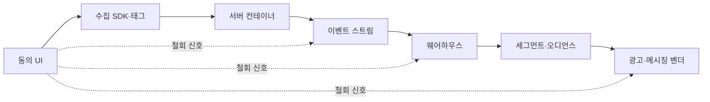

# 10장. 동의는 boolean이 아니다 — 프라이버시·규제가 코드에 남기는 것

마케팅팀에서 요청이 하나 올라왔다고 해보자. "오후 10시에 푸시를 보내면 열람률이 두 배예요. 야간 발송 옵션 좀 넣어주세요."

티켓으로 보면 한 줄짜리다. 캠페인 설정에 시간 필드를 하나 열고 스케줄러가 그 값을 읽게 하면 된다. 반나절이면 끝난다.

그 반나절짜리 티켓을 집어 드는 순간, 당신은 법률 문서 한 조항의 구현자가 된다. 그 조항의 번호도 모르고, 그런 조항이 있다는 사실도 모른 채로.

이 도메인의 규제는 법무팀 검토서에 머물지 않는다. 스케줄러의 조건문으로, 테이블의 컬럼으로, 배치 잡의 주기로 내려온다. 흔적을 하나씩 찾아보자. 조문을 펴기 전에 먼저 할 일이 있다. 알고 있다고 생각하는 것들을 지우는 일이다.

## 알고 있다고 생각하는 것부터 지우자

서드파티 쿠키는 어떻게 됐나. 2024년까지 답은 꽤 분명했다. Chrome이 단계적으로 없애는 중이고, Privacy Sandbox의 새 API들이 그 자리를 메운다는 것. 2026년 7월 기준으로 두 문장 다 성립하지 않는다.

먼저 폐지 계획 쪽. 2025년 4월 22일 Privacy Sandbox 부사장 Anthony Chavez 명의의 글이 이렇게 적었다.

> "made the decision to maintain our current approach to offering users third-party cookie choice in Chrome"
>
> — privacysandbox.google.com 블로그, 2025-04-22

새 프롬프트도 띄우지 않고 현재 방식을 유지하겠다는 발표다. 일정을 미룬 공지로 읽기 쉽지만, 계획 자체를 거둬들인 것이다.

그해 10월 17일, 같은 블로그가 한 번 더 방향을 틀었다.

> "After evaluating ecosystem feedback about their expected value and in light of their low levels of adoption, we've decided to retire the following Privacy Sandbox technologies."
>
> — privacysandbox.google.com 블로그, 2025-10-17

은퇴 목록에는 Topics, Protected Audience, Attribution Reporting, IP Protection 등 열한 개가 열거됐다. 광고 쪽 API가 대부분인데, 전부 죽지는 않았다. 같은 글은 CHIPS, FedCM, Private State Tokens는 계속 지원한다고 밝힌다.

가장 교훈적인 항목은 IP Protection이다. 4월 글은 3분기 런칭을 예고했는데, 10월 상태 페이지에서는 출시하지 않음으로 뒤집혔다. 반년 만의 번복.

여기서 오독이 생긴다. Privacy Sandbox가 접혔으니 서드파티 쿠키가 예전처럼 동작하는 것 아니냐는 것이다. 그렇지 않다. 브라우저 벤더별로 따로 보자.

Safari는 2020년 3월부터 크로스사이트 리소스의 쿠키를 기본으로 차단한다. Firefox는 2022년 6월부터 데스크톱 기본값으로 사이트마다 별도의 쿠키 항아리를 만든다. 쿠키를 없애는 대신 사이트 경계를 넘지 못하게 가두는 방식이다. Chrome은 폐지를 접었지만 CHIPS로 파티션 쿠키를 표준화하는 방향은 유지한다.

문제는 그대로인데 표준 해법만 사라진 셈이다. 그래서 압력은 오히려 커졌다. 퍼스트파티 데이터로, 로그인 기반 식별로, 서버사이드 수집으로, 벤더에 종속된 클린룸으로.

## 브라우저가 이미 해놓은 일

압력의 구체적 모양은 벤더 문서에 적혀 있다.

Safari의 ITP를 다룬 2020년 3월 24일 WebKit 블로그(저자 John Wilander)는 쿠키 차단만 발표하지 않았다.

> "ITP has aligned the remaining script-writable storage forms with the existing client-side cookie restriction, deleting all of a website's script-writable storage after seven days of Safari use without user interaction on the site."

삭제 대상에는 IndexedDB, LocalStorage, SessionStorage, Service Worker 등록과 캐시가 포함된다. 개발자에게 이 문장의 뜻은 하나다. `localStorage`에 심어둔 익명 방문자 ID가 7일 뒤에 사라진다는 것. "왜 우리 재방문 식별률이 계속 떨어지지"의 상당 부분이 여기서 설명된다.

같은 해 11월 12일 글에서 WebKit은 한 발 더 나갔다. 서브도메인을 서드파티 쪽으로 CNAME 매핑해 퍼스트파티인 척하는 요청을 탐지하고, 그 응답으로 설정되는 쿠키의 만료를 7일로 자른다. 이 사실은 다음 절에서 다시 필요하다.

앱 쪽에는 ATT가 있다. Apple의 사용자 프라이버시·데이터 이용 페이지가 "tracking"을 정의한다.

> "Tracking refers to the act of linking user or device data collected from your app with user or device data collected from other companies' apps, websites, or offline properties for targeted advertising or advertising measurement purposes. Tracking also refers to sharing user or device data with data brokers."
>
> — 발행일 표기가 없는 정책 페이지다. 2026년 7월 25일 조회 기준.

이 정의의 핵심 동사는 "linking"이다. 데이터를 모았느냐를 묻지 않고 회사 경계를 넘어 이었느냐를 묻는다. 7장에서 본 과병합 트리거가 바로 이 정의를 거부당했을 때 남는 all-zero IDFA다.

## 그래서 수집이 서버로 옮겨갔다

브라우저에서 잃는 게 늘어나면 답은 뻔한 쪽으로 간다. 벤더에게 직접 쏘던 것을 우리 서버를 거쳐 보내는 것이다.

Google의 서버사이드 태깅 문서는 이 구조의 핵심 개념에 client라는 이름을 붙였다.

> "Clients are adapters between the software running on a user's device and your server-side Tag Manager container. They receive measurement data from a device, transform that data into one or more events, process the data in the container, and package the results to be sent back to the device."
>
> — 날짜 표기가 없는 문서다(2026년 7월 25일에 열어봤다).

같은 문서는 진짜 퍼스트파티 맥락으로 보내려면 Google 스크립트조차 자기 서버에서 서빙하라고 적는다.

여기서 martech 백엔드 개발자가 입사 첫 주에 만나는 코드가 나온다. 같은 구매를 브라우저와 서버 양쪽에서 보내면 전환이 두 번 잡힌다. Meta의 중복 제거 문서는 픽셀의 `eventID`와 Conversions API의 `event_id`가 같고 픽셀의 `event`와 API의 `event_name`이 같으면 같은 이벤트로 본다고 정한다. 조건이 하나 더 붙는다.

> "If we find the same server key combination (`event_id` and `event_name`) **and** browser key combination (`eventID` and `event`) sent to the same Pixel ID within 48 hours, we discard the subsequent events."
>
> — 상시 갱신되는 개발자 문서다. 2026년 7월 25일 확인.

주문 ID로 `event_id`를 만들어 양쪽에 똑같이 실어 보내는 코드는 몇 줄이면 된다. 문제는 48시간이라는 창이 배치 잡 설계를 조용히 제약한다는 것이다. 서버 쪽 전환을 하루 한 번 도는 잡으로 올리다가 재처리가 한 번 밀리면 창을 넘기고, 그날 이후의 중복은 그대로 통과한다. 광고 리포트의 전환 수만 부풀고 에러는 어디에도 없다. 발견하기 전까지 계속 찜찜한 자리다.

그렇다면 다 서버에서 보내면 되지 않을까. Segment의 수집 가이드가 그 지점에서 선을 긋는다. 결제 이벤트는 정확도가 중요하고 민감한 정보는 브라우저 밖에 두는 편이 나으니 서버로. 반대로 UTM 파라미터와 디바이스 정보, 재방문자 쿠키 데이터는 클라이언트 몫이다. 일부 분석 목적지는 쿠키에 의존해 브라우저에서 보낸 이벤트만 받는다는 이유도 적혀 있다. 2장에서 `context.channel`이 왜 일급 필드인지 물었는데, 그 답이 이 가이드에 있다.

서버사이드 태깅의 정체를 두고 두 진영의 서술이 정면으로 갈린다는 점도 짚어두자. Google 문서는 이 아키텍처의 이점으로 더 세밀한 사용자 프라이버시 통제를 든다. WebKit은 앞 절에서 본 대로 CNAME 방식을 추적 방지 우회로 규정하고 쿠키 수명을 잘라낸다. 어느 쪽이 옳은지 판정하지는 않겠다. 다만 이 긴장을 모르고 구축하면, 잘 돌던 수집 경로가 브라우저 업데이트 한 번에 짧아지는 이유를 설명하지 못한다. (CAPI가 광고 차단기 때문에 만들어졌다는 설명이 널리 도는데, Meta 공식 문서에서 그 문장을 찾지는 못했다. 통설로 알아두자.)

## 동의를 관리한다는 것

수집 경로를 어디에 두든 그 앞에 같은 질문이 선다. 이 사용자가 허락했는가.

광고 생태계는 이 질문을 문자열 하나로 주고받는다. IAB Europe의 TCF가 그 규약이고, 2026년 7월 기준 현재 버전은 v2.3이다. 기억이 흔히 v2.2에서 멈춰 있는 지점이다. 전환 안내 문서(2025-06-19)가 날짜를 못 박아뒀다.

> "Starting 1st March, 2026: Any TC String created without the disclosedVendor segment will be deemed invalid."

한 버전 전인 v2.2가 남긴 변화가 더 흥미롭다. 개인화 광고와 콘텐츠 프로필 생성·이용에 해당하는 목적들에서 정당한 이익을 법적 근거로 고를 수 없게 하고 동의만 허용했다. GDPR 제6조 제1항은 처리의 적법 근거를 여섯 가지로 두는데, martech에서 오래 다퉈진 건 (a) 동의와 (f) 정당한 이익 사이였다. 광고 타겟팅을 정당한 이익으로 밀 수 있느냐는 물음에 업계 표준 규약이 내놓은 실무적 답이 그 변경이다.

동의를 태그에 전달하는 쪽에는 Google Consent Mode가 있다. 파라미터는 일곱 개다. 광고 저장소, 광고용 사용자 데이터 전송, 광고 개인화, 분석 저장소, 기능 저장소, 개인화 저장소, 보안 저장소. 동의를 boolean 하나로 들고 있으면 이 일곱 칸 어디에도 정확히 매핑되지 않는다.

개발자가 실제로 고르는 갈림길은 따로 있다. 기본 모드는 사용자가 배너와 상호작용하기 전까지 태그를 로드하지 않고, 고급 모드는 태그를 먼저 로드해 동의 전에도 쿠키 없는 측정값을 보낸다. 대가도 문서에 적혀 있다. 기본 모드는 일반 모델로 덜 정교한 전환 모델링을, 고급 모드는 광고주별 모델로 더 정교한 모델링을 받는다. 동의 전에 무언가를 보내는 대신 더 나은 추정치를 얻는 거래이고, 그 선택을 개발자가 설정 한 줄로 확정한다. (역시 날짜가 없는 문서다 — 2026년 7월 25일 조회.)

반대편에는 훨씬 단순한 신호가 있다. W3C의 Global Privacy Control 초안(Working Draft, 2026-06-11)이 정의하는 건 헤더 한 줄이다.

```
Sec-GPC: 1
```

브라우저에서는 `navigator.globalPrivacyControl`로도 읽힌다. 기술적으로는 예전의 DNT와 다를 게 없어 보이는데, 차이는 법에 있다. 캘리포니아 법무장관실 페이지는 이 신호에 사업자의 존중 의무가 있다고 적는다(발행일 표기가 없어 조회일만 남긴다 — 2026년 7월 25일). `req.headers['sec-gpc'] === '1'`은 아마 개발자가 만나는 헤더 중 법적 효력이 붙은 최초의 한 줄일 것이다.

## 한국법이 스펙의 일부다

앞의 규약들은 대체로 EU와 미국에서 만들어졌다. 한국에서 서비스를 만든다면 스펙을 정하는 문서가 따로 있다.

개인정보 보호법부터 보자. 2025년 10월 2일 시행, 법률 제20897호다. 개발자의 코드에 가장 자주 닿는 조문은 의외로 처리방침 조항이다. 제30조 제1항이 열거하는 항목 중 7호가 "인터넷 접속정보파일 등 자동수집 장치에 관한 사항"이다. 쿠키와 픽셀과 SDK가 법령 문언에 등장하는 자리이고, 태그 하나 붙이는 일이 문서 개정 사유가 된다. 태그 추가는 그래서 배포 절차의 일부가 되어야 한다.

같은 법 시행령 제31조 제1항은 처리방침에 국외 이전 근거와, 해외에서 국내 정보주체의 개인정보를 직접 수집·처리하는 경우 그 처리 국가명을 적게 한다. 벤더 리전을 바꾸는 결정이 법무 문서를 고치는 일과 물려 있다는 얘기다.

동의 화면 쪽에는 시행령 제17조가 있다(법률 제17조와 헷갈리기 쉬우니 조심하자). 동의가 유효하려면 네 조건을 모두 채워야 한다. 자유로운 의사로 결정할 수 있을 것, 내용이 구체적이고 명확할 것, 쉽게 읽고 이해할 문구를 쓸 것, 동의 여부를 명확히 표시할 방법을 제공할 것. 동의 버튼만 크고 진하게 두고 거부를 흐리게 만든 화면은 첫째와 넷째 조건에 걸린다. **CMP 화면은 디자인 문제가 아니라 컴플라이언스 문제다.**

가입 플로우에는 제75조 제2항이 걸린다. 원문에 이런 항목이 있다.

> "제16조제3항ㆍ제22조제5항을 위반하여 재화 또는 서비스의 제공을 거부한 자"

선택 동의를 거부했다는 이유로 서비스 제공을 거부하면 과태료 대상이라는 뜻이다. "마케팅 수신에 동의하지 않으면 가입 불가"는 성립하지 않고, 선택 동의 체크박스는 미체크 상태로도 가입이 끝까지 통과해야 한다. 과징금은 과태료와 별개의 제재인데, 상한 비율은 자료마다 숫자가 달라 원문을 확인하기 전까지 적지 않는다.

여기서 GDPR과 나란히 놓을 조문이 하나 있다. 제37조의2 제4항은 자동화된 결정의 기준과 절차, 처리 방식을 정보주체가 쉽게 확인하도록 공개하라고 한다. GDPR 제22조가 전적으로 자동화된 처리에 근거한 결정의 대상이 되지 않을 권리를 두고 계약·법률·명시적 동의를 예외로 드는 것과 대응 관계다. 추천 알고리즘과 자동 등급 산정을 굴리는 제품이라면 두 조문은 같은 요구로 읽힌다. 모델을 설명하는 문서를 제품 안에 두라는 것. (시행일은 부칙을 확인하지 못해 적지 않는다.)

이제 오프닝의 티켓으로 돌아가자. 야간 발송을 지배하는 법은 따로 있다. 정보통신망법, 2026년 7월 7일 시행, 법률 제21305호다. 제50조 제1항은 영리목적의 광고성 정보를 전송하려면 수신자의 명시적인 사전 동의를 받으라고 한다. 제3항이 문제의 조항이다.

> "오후 9시부터 그 다음 날 오전 8시까지의 시간에 전자적 전송매체를 이용하여 영리목적의 광고성 정보를 전송하려는 자는 제1항에도 불구하고 그 수신자로부터 별도의 사전 동의를 받아야 한다. 다만, 대통령령으로 정하는 매체의 경우에는 그러하지 아니하다."

두 가지를 정확히 읽자. 첫 문장은 전면 금지를 뜻하지 않는다. 별도의 사전 동의를 받으라는 요구다. 그리고 뒤에 단서가 붙어 있다. 대통령령이 정하는 매체는 이 규칙을 따르지 않는데, 어떤 매체가 면제되는지와 앱 푸시가 거기 들어가는지는 이 책이 시행령 원문으로 확인하지 못했다. "밤 9시 이후엔 아무것도 못 보낸다"도, "우리 채널은 예외다"도 지금 여기서 쓸 수 없다. (사실 확인 필요 — 시행령의 면제 매체 범위)

확인되지 않은 부분이 남아도 설계 결론은 나온다. 야간 발송을 스케줄러의 시간 조건 하나로 처리하면 틀린다. 채널마다 규칙이 다를 수 있으니 채널별 정책 테이블이 필요하고, 동의도 일반 수신동의와 야간 수신동의가 별개로 존재해야 한다. 반나절짜리 티켓이 아니었던 것이다.

같은 조에 제8항이 하나 더 있다. 수신동의를 받은 자는 정기적으로 수신동의 여부를 확인해야 한다는 요구다. 이 한 줄이 이 장의 제목이다. **동의는 한 번 받고 끝나는 boolean이 아니라 만료되는 상태다.**

지금까지 본 한국법 조문과 GDPR은 같은 문법을 쓴다. 받아야 처리할 수 있다는 문법, 즉 opt-in이다. 캘리포니아는 반대쪽에서 출발한다. 그쪽 법은 크로스컨텍스트 행태 광고를 위한 공유를 정의해두고, 소비자가 판매·공유를 중단해달라고 요청하면 멈추라고 한다. 처리하다가 거부되면 멈추는 구조, 즉 opt-out이다.

같은 코드베이스로 두 지역에 서비스한다면 이 대비는 문서 위에서 끝나지 않는다. 신규 사용자의 기본 상태가 지역에 따라 갈리고, 동의 없이 어디까지 수집할 수 있는지가 갈리고, 앞에서 본 GPC 헤더를 존중 의무로 볼지 참고 신호로 볼지도 갈린다. 요청이 어느 법역에 속하는지를 런타임에 판정하는 분기가 시스템 안에 실재하게 된다는 뜻이다. 국내법을 국제 규제와 나란히 놓아야 이 결론이 보인다. 따로 보면 각각 준수 항목 목록으로만 읽힌다.

## 규제가 코드에 남기는 것

5장부터 9장까지 만든 파이프라인을 다시 훑어보자. 규제의 흔적은 한 층에 몰려 있지 않고 전 구간에 흩어져 있다.

| 규제가 실제로 닿는 곳 | 무엇에서 나오나 |
|---|---|
| 배포 절차 | 처리방침의 자동수집 장치 항목 |
| 인프라 선택 | 국외 이전·처리 국가명 기재 의무 |
| 가입·동의 화면 | 동의 4조건, 서비스 제공 거부 금지 |
| 저장 수명 | 보유 기간 기재와 최소 수집 원칙 |
| 삭제 경로 전체 | GDPR 제17조와 국내법의 삭제권 |
| 지역별 런타임 분기 | opt-in과 opt-out의 공존 |
| 배치 잡 주기 | Meta CAPI의 48시간 창 |
| 익명 식별 설계 | ITP의 7일 스토리지 삭제 |
| 감사 로그 | 자동화된 결정의 공개 의무 |

이 표는 법령과 벤더 문서에서 이 책이 도출한 정리이지 공식 목록은 아니다.

개발자를 가장 오래 붙잡는 건 삭제다. 지워야 할 자리를 세어보는 순간 난감해진다. OLTP 데이터베이스, 아직 리텐션이 남은 이벤트 스트림 구간, 웨어하우스 파티션, 컬럼 지향 포맷으로 쌓인 원본, 백업 스냅샷, 검색 인덱스, 그리고 이미 벤더 쪽으로 싱크된 오디언스. 6장에서 테이블 포맷 선택이 규제 대응 능력을 결정한다고 했던 문장이 여기서 청구서로 돌아온다. 행 수준 삭제가 없는 포맷이면 사용자 한 명 때문에 파일 무더기를 다시 써야 한다. 7장에서 ID 그래프가 부정확하면 삭제도 부정확해진다고 한 것도 같은 자리다. 지워야 할 대상은 그 사람의 식별자 전부이기 때문이다.

여기서 웹 백엔드의 습관 하나가 깨진다. 삭제를 플래그 한 칸으로 처리하는 소프트 삭제 말이다.

> "GDPR, among other regulations, requires that you be able to do this sometimes; and it requires that the data REALLY BE GONE."
>
> — jacksnipe, Hacker News 댓글 32158458 (2022-07-19). 소프트 삭제 시스템에서 영구 삭제가 어렵다는 맥락의 발언이며, 법률 비전문가의 진술이다.

우회책도 같은 커뮤니티에 있다. 사용자별 키로 개인정보를 암호화해두고 삭제 요청이 오면 키만 파기하는 크립토 셰레딩이다. 곳곳에 흩어진 데이터를 물리적으로 지우는 게 사실상 불가능하다는 문제를 비껴간다. 다만 이 방식을 소개한 사람 본인이 일반적인 회사에는 당분간 현실성이 없다고 덧붙였다(HN 30684445 / tybit / 2022-03-15). 관행 소개이지 권고가 아니다.

삭제만큼 자주 새는 건 동의 신호다. UI에서 한 번 받고 끝날 수 없고, 파이프라인 끝까지 따라가야 한다.


그림 1. 실선은 데이터가 흐르는 길, 점선은 철회가 닿아야 하는 지점

점선 중 한 곳이라도 끊기면 결과는 하나다. 분명히 거부했는데 광고가 계속 따라온다는 민원. 이 전파 범위를 정할 때 쓸 만한 구분을 한 개발자가 2019년 논쟁에서 던졌다. 수집과 처리는 다른 일이며, 동의 없이 수집된 데이터에도 처리 단계의 동의 판단이 따라붙느냐를 물어야 한다는 것이다(HN 18989137 / scrollaway / 2019-01-24). 역시 비전문가의 법 해석이지만, 어느 지점에 동의 검사를 세울지 정할 때 실질적인 도움이 된다.

## 결과가 조용히 비어 있는 SQL

퍼스트파티 데이터만으로 광고 성과를 보려면 결국 플랫폼이 가진 데이터와 맞춰봐야 한다. 그 자리에 클린룸이 온다. 양쪽이 원본을 보여주지 않은 채 질의만 주고받는 환경이다.

임계값을 수치로 공개한 곳은 많지 않다. Ads Data Hub 문서는 노이즈 주입에 결과 행당 약 20명, difference check에 약 50명, 클릭·전환 데이터만 조회할 때 약 10명의 고유 사용자가 필요하다고 적는다(조회 시점 2026년 7월 25일). SQL은 평소처럼 쓰는데, 조건이 좁아 대상이 임계값에 못 미치면 그 행이 결과에서 그냥 빠진다. 문법 오류도 권한 오류도 없이 결과만 조용히 비는 쿼리를 디버깅하는 게 이쪽 일상이다. 같은 문서는 값이 0이거나 null인 사용자 ID의 이벤트가 임계값 계산에 포함되지 않는다고 적는다. 7장의 그 UUID가 여기까지 따라왔다.

AWS Clean Rooms 쪽은 통제 수단을 이름으로 나열해뒀다. SQL을 제한하는 분석 규칙, 질의 중에도 암호화 상태를 유지하는 연산, 감사를 뒷받침하는 분석 로그, 차등 프라이버시, 엔티티 해석을 위한 ID 네임스페이스(2026년 7월 25일 기준). 마지막 항목에서 7장의 아이덴티티 문제와 이 장의 프라이버시 문제가 만난다.

하나는 정직하게 남기자. 이 리서치는 클린룸 벤더 문서에서 PSI(Private Set Intersection)나 k-익명성이라는 용어를 확인하지 못했다. 기법 자체는 학계에 오래 있었다 — k-익명성은 Sweeney(2002), PSI는 Pinkas, Schneider & Zohner(2018), 차등 프라이버시는 Dwork, McSherry, Nissim & Smith(2006)의 계보다. 어떤 제품이 그중 무엇을 쓰는지는 제품 문서가 말한 만큼만 말할 수 있다.

## 개인화는 세게 할수록 좋아지지 않는다

여기까지가 규제가 만든 제약이다. 그런데 개인화를 세게 밀수록 성과가 좋아진다는 전제 자체가, 규제 이전에 실증에서 이미 흔들렸다.

Goldfarb & Tucker (2011), "Online Display Advertising: Targeting and Obtrusiveness," *Marketing Science* 30(3), 389–404의 초록이다.

> "Ads that match both website content and are obtrusive do worse at increasing purchase intent than ads that do only one or the other. This failure appears to be related to privacy concerns: the negative effect of combining targeting with obtrusiveness is strongest for people who refuse to give their income and for categories where privacy matters most."

콘텐츠에 맞추는 것과 눈에 띄게 만드는 것은 각각 하면 효과가 있는데, 둘을 같이 하면 하나만 한 것보다 못했다. 범위는 정확히 지키자. 이 연구의 종속변수는 구매 의향이지 실제 매출이 아니고, 매체는 온라인 디스플레이 광고다. "개인화는 역효과다"로 넓히면 논문이 말하지 않은 것을 말하게 된다.

인접한 연구로는 과도한 개인화가 심리적 반발을 부른다는 White et al. (2007/2008), 개인화를 원한다고 말하면서도 프로파일링에는 동의하지 않는다는 개인화-프라이버시 역설의 Awad & Krishnan (2006)이 있다. 둘 다 서지까지만 확인해 이름만 적어둔다.

반대 방향의 결과도 있다. Tucker의 "Social Networks, Personalized Advertising, and Privacy Controls"(DOI `10.1509/jmr.10.0355`, 서지에 권과 연도가 상충해 2013/2014로 적는다)는 소셜 네트워크가 이용자에게 프라이버시 통제권을 더 준 뒤 개인화 광고 성과가 오히려 올라갔다는 계열의 연구다. 동의와 통제 UI를 성과의 비용으로만 여기는 가정에 대한 반례로 읽힌다. 이쪽도 서지와 요지까지만 확인했다.

두 방향을 같이 놓으면 이 장의 작업이 다르게 보인다. 동의를 쪼개고 지역을 분기하고 철회를 전파하는 일이 성과를 깎아 치르는 세금이라는 생각은 흔한데, 그 가정이 실증으로 확정된 적은 없다.

### 이 장의 핵심

- 이 축의 사실은 빠르게 뒤집힌다. 서드파티 쿠키 폐지 계획은 2025년 4월에 철회됐고 광고용 Privacy Sandbox API 대부분은 그해 10월에 은퇴했다. 기억으로 쓰면 틀리는 영역이다.
- 표준 해법이 사라졌을 뿐 문제는 남았다. Safari의 기본 차단, Firefox의 파티셔닝, ITP의 7일 삭제는 그대로이고, 그래서 압력이 서버사이드 수집과 클린룸 쪽으로 옮겨갔다.
- 동의는 목적·지역·채널·시간대로 쪼개지고 만료된다. Consent Mode의 일곱 파라미터와 정보통신망법 제50조의 두 가지 별도 동의가 근거다.
- 규제의 흔적은 파이프라인 전체에 흩어져 있다. 삭제 요청 하나가 저장 포맷 선택부터 벤더에 싱크된 오디언스까지 관통한다.
- opt-in과 opt-out은 문서상의 대비로 끝나지 않는다. 요청의 법역을 판정하는 런타임 분기가 실재해야 한다.

---

이 장의 논의를 코드로 착지시키면 레코드 하나의 모양으로 남는다. 동의를 boolean 컬럼 하나로 들고 있던 자리에 이런 이벤트 로그가 들어선다.

```
consent_event
  user_id
  purpose      -- 광고성 / 분석 / 개인화 …
  channel      -- email / push / sms / kakao …
  region       -- 적용 법역
  time_window  -- 일반 / 야간
  state        -- granted / revoked
  source       -- 어느 화면, 어느 문구 버전
  occurred_at
  verified_at
```

`purpose`와 `channel`은 Consent Mode의 파라미터와 정보통신망법 제50조가 각각 밀어 넣은 축이고, `region`은 opt-in과 opt-out의 공존이, `time_window`는 제3항의 별도 동의가 남긴 축이다. `verified_at`은 제8항의 정기 재확인 의무 때문에 필요하고, `source`는 시행령 제17조의 네 조건을 나중에 증명할 때 필요하다. 이 테이블을 append-only로 두는 이유는 철회와 처리 결과 통지가 현재 상태만으로 설명되지 않기 때문이다. 지금 동의 상태는 이 로그의 파생물로 계산하면 된다.

마케팅팀의 그 티켓으로 돌아가면, 이제 필요한 건 시간 필드 하나가 아니다. 채널별 정책 테이블, `time_window`가 야간인 동의 레코드를 확인하는 발송 직전 검사, 만료된 동의를 걸러내는 배치. 이 셋이 준비돼 있으면 야간 발송은 정말로 반나절짜리 작업이 된다.
