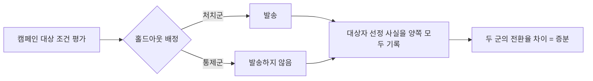

# 11장. 숫자는 계기판이 아니라 방향 지시등이다 — 어트리뷰션·증분성·실험

광고 채널별 성과를 전부 더했더니 실제 매출보다 크다. 구글이 자기 몫이라 보고한 전환과 메타가 자기 몫이라 보고한 전환을 합치면 그 달에 실제로 팔린 것보다 많다. 누가 거짓말을 하고 있는가?

아무도 안 한다. 각 플랫폼은 자기 규칙대로 정확하게 계산했고, 그 규칙들이 서로 겹칠 뿐이다.

5장부터 9장까지 우리는 이벤트를 받아 저장하고, 세그먼트를 계산하고, 메시지로 내보내는 경로를 만들었다. 10장에서는 그 경로를 규제가 어떻게 관통하는지 봤다. 남은 질문은 하나다. 그 경로 끝에 붙은 대시보드가 내놓는 숫자를, 그걸 만든 우리가 믿어도 되는가.

## 합계가 매출을 넘는다

겹침의 구조부터 보자. 각 광고 채널은 자기 화면에서 광고를 본 사람과 클릭한 사람의 목록을 갖고 있다. 그 사람이 나중에 구매하면 자기 목록에 있던 사람이니 자기 공로로 집계한다. 두 채널의 목록에 같은 사람이 들어 있으면 그 한 건의 구매가 양쪽에서 각각 한 건으로 잡힌다. 어느 쪽도 규칙을 어기지 않았고, 어느 쪽도 상대 목록을 볼 수 없다.

어트리뷰션 회사를 운영한다는 한 실무자가 커뮤니티에 이렇게 정리해뒀다.

> "구글과 페이스북의 자체 보고 성과 수치가 부풀려지는 가장 흔한 원인은 여러 광고 채널이 같은 주문에 대해 공로를 가져가는 것이다. 고객이 구글 광고를 클릭하고, 그다음 페이스북 광고를 클릭하고, 그다음 구매하면, 각 광고 채널이 그 구매를 자기 공로라고 주장한다."
>
> — fourseventy, Hacker News 댓글 28855010 (2021-10-13). 어트리뷰션 제품을 파는 회사 운영자의 진술이라 이해관계가 있다.

발언자의 위치를 감안해도 이 설명 자체는 산수다. 그리고 이 산수가 **개발자가 마케터에게 설명해야 하는 첫 번째 개념**이다. 마케터가 채널별 성과표를 들고 와서 "이 숫자 합이 왜 매출이랑 안 맞죠"라고 물으면, 대시보드 버그를 찾으러 갈 일이 아니다. 애초에 합해서는 안 되는 숫자를 합한 것이다.

3장에서 어트리뷰션 제품과 CDP·CEP를 API 카탈로그로 갈랐던 걸 기억할 것이다. `Attribution Result`라는 엔드포인트가 있느냐 없느냐로 제품의 정체가 드러난다고 했다. 그 엔드포인트가 돌려주는 값이 바로 지금 이야기하는 귀속의 결과다. 어트리뷰션 — 전환 하나를 어느 접점의 공로로 돌릴지 정하는 일 — 은 무언가를 측정해서 얻은 값이라기보다 **배분 규칙이 만들어낸 값**이다. 그래서 규칙을 바꾸면 같은 데이터에서 다른 숫자가 나온다. 이게 이 장 전체를 관통하는 성질이다. 우리가 5~9장에서 만든 파이프라인은 이벤트를 정확하게 받고 정확하게 저장했는데, 그 위에서 계산되는 성과 숫자는 정확도와 다른 종류의 축 위에 있다.

## 라스트터치는 안 쓰느니만 못하다

가장 널리 쓰이는 배분 규칙은 라스트터치다. 전환 직전의 마지막 접점에 공로 100%를 준다. 구현이 단순하고 설명하기 쉬워서 거의 모든 도구의 기본값 자리에 앉아 있다.

이 규칙에 대한 학술적 판정은 생각보다 강하다.

> "널리 쓰이는 어트리뷰션 방법인 라스트터치를 분석한 결과, 라스트터치는 어트리뷰션을 아예 쓰지 않는 경우와 비교해 광고주의 이익을 감소시킨다. 그리고 강한 광고주는 어트리뷰션 과정에서 비롯된 과다 입찰 때문에 소비자 노출 배분이 왜곡되는 손해를 본다. Shapley value에 기반한 어트리뷰션 방식을 분석한 결과로는, 시장의 전환율이 너무 높지 않을 때 광고주의 이익을 개선한다."
>
> — Ron Berman, "Beyond the Last Touch: Attribution in Online Advertising," *Marketing Science* 37(5), 771–792, 2018. DOI `10.1287/mksc.2018.1104`. 초록의 해당 대목을 옮겼다.

"라스트터치는 부정확하다"와 "라스트터치를 쓰면 안 쓰느니만 못하다"는 다른 층위의 주장이다. 뒤쪽은 이 규칙이 오차를 남기는 데서 그치지 않고, 그 오차가 입찰 행동을 왜곡해 광고주 자신의 이익을 깎는다고 말한다.

여기에 두 가지 한정을 반드시 붙여야 한다. 하나, 이 논문은 **이론 모델과 분석적 결과**를 제시한다. 대규모 관측 데이터로 검증한 실증 연구가 아니다. 둘, Shapley value가 이익을 개선한다는 결론에는 **"시장의 전환율이 너무 높지 않을 때"라는 조건**이 붙어 있다. 이 조건을 떼고 "Shapley를 쓰면 개선된다"로 옮기면 논문이 하지 않은 말이 된다. 벤더 자료에서 Shapley를 근거로 든 슬라이드를 보게 되면, 그 조건이 함께 적혀 있는지 확인해볼 만하다.

Shapley value가 마테크 문서에 유난히 자주 등장하는 것도 이 판정과 무관하지 않다. 여럿이 함께 만들어낸 성과를 각자의 기여도로 나누는 게임 이론 쪽 도구인데, 여러 접점이 함께 만든 전환을 나누는 문제와 형태가 맞아떨어진다. 마테크 업계 바깥에서 빌려온 도구라는 뜻인데, 빌려오는 과정에서 조건 한 줄이 자주 떨어져 나간다.

그렇다면 왜 라스트터치가 아직도 기본값 자리에 있을까. 계산이 싸고, 마케터에게 설명하기 쉽고, 무엇보다 채널마다 자기가 마지막 접점이었던 건만 세면 되기 때문에 채널 간 데이터 교환이 필요 없다. 기술적으로 가장 편한 규칙이 가장 널리 쓰인다는 이야기인데, 이런 종류의 관성은 개발자에게 낯익다.

마르코프 기반 어트리뷰션도 자주 함께 등장한다. 고객 여정을 그래프로 놓고 특정 채널을 제거했을 때 전환 확률이 얼마나 떨어지는지로 기여도를 나누는 방식이다. 개발자에게는 이 접근이 오히려 직관적이다 — 어트리뷰션이 그래프 알고리즘 문제로 환원되기 때문이다. 학술적 대응물로는 Anderl et al. (2016)의 그래프 기반 저니 어트리뷰션 연구가 있다.

Anderl 쪽은 이 책의 리서치가 서지 정보까지만 확인했다. Berman은 초록 전문을 확보해 조건까지 옮길 수 있었지만 이쪽은 그렇지 못했고, 그래서 이름과 개념적 기여를 가리키는 데서 멈춘다. **효과 크기나 "마르코프가 라스트터치보다 낫다"는 결론 방향은 이 책이 뒷받침할 수 있는 범위 밖이다.** 이 장은 근거가 단단한 항목과 이름만 아는 항목을 나란히 놓되, 어느 쪽인지 매번 표시하면서 간다.

## 데이터가 더 많으면 되는 것 아닌가

배분 규칙이 문제라면 규칙을 정교하게 만들면 되지 않을까. 사용자 단위 데이터를 충분히 모으고, 머신러닝으로 광고를 본 사람과 안 본 사람을 정교하게 매칭하면 진짜 효과를 뽑아낼 수 있지 않을까.

개발자가 가장 자연스럽게 떠올리는 방향이고, 벤더 제안서가 가장 자주 파는 방향이기도 하다. 이 직관을 정면으로 검증한 연구가 있다. Gordon, Moakler, Zettelmeyer가 2023년에 발표한 "Close Enough?"다.

이 연구는 Facebook의 **대규모 실험 663건**과 **5,000개 이상의 사용자 수준 피처**를 동원해, 무작위 통제 실험(RCT)이 말하는 실제 리프트와 비실험 방법이 추정한 리프트를 비교한 연구다. 비교 대상 방법은 두 가지 — double/debiased machine learning(DML)과 stratified propensity score matching(SPSM). 5,000개 이상의 피처는 대부분의 광고주나 측정 파트너가 접근할 수 있는 것보다 훨씬 풍부한 데이터다.

| 퍼널 단계 | RCT 리프트 중앙값 | DML 추정 중앙값 | SPSM 추정 중앙값 |
|---|---|---|---|
| 상단 | 29% | 83% | 173% |
| 중단 | 18% | 58% | 176% |
| 하단 | 5% | 24% | 64% |

출처: Gordon, Moakler & Zettelmeyer, "Close Enough? A Large-Scale Exploration of Non-Experimental Approaches to Advertising Measurement," *Marketing Science* 42(4), 768–793, 2023. DOI `10.1287/mksc.2022.1413` / arXiv:2201.07055. 위 값은 모두 이 2023년 논문의 초록에 실린 **중앙값**이다.

하단 퍼널을 보자. 실제 리프트 중앙값이 5%인데 DML은 24%, SPSM은 64%를 보고했다. 5와 24, 5와 64를 나눠보면 대략 다섯 배에서 열세 배다. 이 배수 계산은 논문 초록에 그대로 실린 문장이 아니고 위 표의 값을 이 책이 나눈 결과지만, 나눗셈에 해석의 여지는 없다.

그리고 저자들의 결론은 이렇다.

> "전반적으로, 대규모 실험과 풍부한 사용자 수준 데이터에 접근할 수 있었음에도 우리는 광고 캠페인의 인과 효과를 신뢰성 있게 추정할 수 없었다."
>
> — Gordon, Moakler & Zettelmeyer (2023), arXiv:2201.07055. 초록의 마지막 대목을 옮겼다.

이 문장을 처음 읽으면 조금 허탈하다. 쓴 사람들이 자원이 부족한 팀이 아니었기 때문이다. 실험 663건과 피처 5,000개 이상을 손에 쥐고도 안 됐다면, 우리가 만든 파이프라인이 모으는 데이터로는 더더욱 안 된다. 데이터를 더 모으는 방향으로 이 문제를 풀 수 있다는 기대는 여기서 접는 게 정직하다. 반년쯤 걸릴 사용자 단위 매칭 파이프라인을 로드맵에 올리기 전에 이 표를 한 번 보면, 그 반년의 기대값이 조금 다르게 계산된다.

퍼널 단계별로 오차 폭이 다르다는 것도 실무적으로 쓸모가 있다. 상단 지표는 실제 리프트도 크고 추정 오차도 크며, 하단 지표는 실제 리프트가 작은데 과대추정 배수는 가장 크다. 마케터가 "구매 전환 기준으로 이 채널이 몇 배 효율"이라고 말할 때가 정확히 오차가 가장 크게 벌어지는 지점이다.

한 가지 오독은 미리 막아두자. 이 결과는 광고 플랫폼이 숫자를 부풀린다는 고발이 아니다. 연구를 수행한 쪽은 Facebook의 실험과 사용자 데이터에 직접 접근한 팀이었고, 평가 대상은 관측 데이터로 인과 효과를 추정하는 방법론 전반이었다. 같은 방법론을 우리가 사내에서 구현해도 같은 종류의 오차가 난다는 뜻이다. 그래서 이 표는 우리 대시보드의 숫자를 어느 등급으로 다룰지 정하는 데 쓰는 게 맞다. 벤더를 의심하는 용도로 쓰면 방향을 잘못 잡은 것이다.

## 그렇다고 광고가 무용하다는 뜻은 아니다

여기까지 읽고 "그럼 광고는 다 헛돈"이라는 결론으로 건너뛰면 곤란하다. 그 결론을 지지하는 근거로 자주 끌려 나오는 연구가 있는데, 실제로 그 연구가 말한 것은 훨씬 결이 다르다.

eBay가 유료 검색광고를 대규모 현장 실험으로 검증한 연구다. 결과는 세 갈래로 나뉜다.

1. **브랜드 키워드 광고**(검색창에 "eBay"를 친 사람에게 붙는 광고)에서는 측정 가능한 단기 효익이 없었다. 이미 eBay를 찾아온 사람이 광고를 한 번 더 클릭했을 뿐이다.
2. **비브랜드 키워드**에서는 달랐다. 신규 고객과 저빈도 고객은 광고에 긍정적으로 반응했다.
3. 그런데 광고비의 대부분은 광고가 없어도 구매했을 기존·상시 이용자에게 지출되고 있었고, 그 결과 **전체 평균 수익률이 마이너스**로 나왔다.

Thomas Blake, Chris Nosko, Steven Tadelis, "Consumer Heterogeneity and Paid Search Effectiveness: A Large-Scale Field Experiment," *Econometrica* 83(1), 155–174, 2015. DOI `10.3982/ecta12423` (NBER Working Paper No. 20171, 2014).

세 갈래를 다 읽어야 이 연구를 인용할 수 있다. "온라인 광고는 효과가 없다"는 1번만 떼어낸 문장이고, 2번을 빼면 정반대 방향의 발견 하나를 지운 셈이 된다. 그리고 맥락 하나가 더 붙는다. **이건 eBay라는 이미 강한 브랜드의 검색광고 실험이다.** 아무도 이름을 모르는 신규 서비스가 자기 브랜드 키워드에 광고를 걸었을 때 같은 결과가 나온다는 보장은 이 연구 안에 없다.

정리하면 문제는 광고가 아니라 배분이었다. 효과가 있는 곳과 없는 곳이 갈리는데 지출이 없는 쪽으로 몰려 있었다. 어트리뷰션을 통째로 기각할 수 없는 이유가 여기 있다 — 어디에 효과가 있는지를 알아내는 일 자체는 여전히 필요하고, 다만 관측된 전환을 세는 방식으로는 그 답이 안 나온다.

그리고 이 연구의 두 번째 갈래는 우리가 만드는 시스템 쪽에서도 익숙한 모양이다. 신규 고객과 저빈도 고객에게서 반응이 갈렸다는 말은 처치 효과가 사람마다 다르다는 뜻이고, 4장에서 세그먼트를 나눴던 이유와 같은 이야기다. 캠페인 전체의 평균 효과 하나로 성패를 판정하면 그 안에서 갈리는 두 집단이 서로를 상쇄해 아무 신호도 남지 않는다. 실험 결과를 저장할 때 집단별로 쪼개 볼 수 있게 설계해두는 것과 전체 평균만 남겨두는 것의 차이가 여기서 벌어진다.

## 그래서 실험한다

관측으로 안 되면 남는 방법은 하나다. 나눠서 재는 것. 이 축의 표준 참조 문헌부터 잡아두자. Kohavi, Longbotham, Sommerfield, Henne의 "Controlled experiments on the web: survey and practical guide," *Data Mining and Knowledge Discovery* 18, 140–181이다. DOI는 `10.1007/s10618-008-0114-1`이고, 통상 2009년으로 인용되지만 서지 등록상 발행 연도는 2008로 잡혀 있어 연도 표기가 갈린다. 웹 A/B 테스트의 통계적 기초와 흔한 함정, 조직 운영 원칙을 한 문서에 모아둔 실무 정전으로 통한다. 여기서 말하는 흔한 함정에는 표본 비율 불일치(SRM), 계측 오류, 심슨의 역설이 포함된다. 같은 저자 계열이 실험 결과가 틀어지는 방식을 따로 카탈로그화한 문헌(*KDD 2012*, DOI `10.1145/2339530.2339653`)과 실험을 플랫폼으로 운영할 때의 설계 이슈를 다룬 문헌(*KDD 2013*, DOI `10.1145/2487575.2488217`)도 있다. 사내 실험 기능을 처음 만드는 팀이라면 뒤쪽 두 편의 목차만 훑어도 얻을 게 있다.

여기서부터는 서술의 성격이 바뀐다. 아래 네 문단의 근거 논문은 이 책의 리서치가 **서지 정보까지만 확인**한 것들이다. 그래서 각 논문이 보고한 수치나 효과 크기는 옮기지 않고, 각 논문이 제기한 문제와 처방만 쓴다. 마침 이 네 가지는 수치 없이도 설계 결정으로 바로 번역된다 — 실험 기능을 만드는 사람이 기본값을 어디에 둘 것이냐의 문제이기 때문이다.

**함정 하나는 실험 화면 그 자체에 있다.** 고정된 표본 크기를 전제하고 계산한 p-값을 실험 진행 중에 반복해서 들여다보다가 유의해지는 순간 멈추면, 1종 오류율이 크게 부풀어 오른다. 피킹(peeking)이라 부르는 문제이고, Johari, Koomen, Pekelis, Walsh가 KDD 2017의 "Peeking at A/B Tests"(DOI `10.1145/3097983.3097992`)와 그 저널 확장판 "Always Valid Inference: Continuous Monitoring of A/B Tests"(*Operations Research* 70(3), 1806–1821, 2022. DOI `10.1287/opre.2021.2135`)에서 다뤘다. 저자들은 언제 멈춰도 유효한 순차적 p-값과 신뢰구간을 제시한다.

이 항목이 마테크에서 유난히 성가신 데는 이유가 있다. 마테크 대시보드는 유의성을 실시간으로 보여준다. 마케터가 캠페인을 돌려놓고 초록색 표시가 떴는지 하루에 세 번 확인하는 것은 그 화면이 설계상 유도하는 행동이다. 개인의 습관 문제로 돌리면 영영 고쳐지지 않는다. 실험 기능을 우리가 만든다면 **순차 검정을 기본값으로 놓는 결정**이 여기서 나온다. 마케터에게 "보지 마세요"라고 부탁하는 것보다 언제 봐도 유효한 통계량을 보여주는 쪽이 훨씬 현실적이다.

다중 검정도 같은 종류의 문제다. 캠페인 하나에 지표 스무 개를 붙여놓고 그중 뭐라도 유의하면 성공이라고 보고하는 관행 말이다. 여러 가설을 동시에 검정할 때 거짓 발견을 어떻게 통제할지는 Benjamini와 Hochberg가 1995년 *JRSS-B* 57(1), 289–300에 실은 FDR 논문(DOI `10.1111/j.2517-6161.1995.tb02031.x`)이 표준 참조다. 실험 결과 화면에 지표를 몇 개까지 띄울지, 그중 무엇을 사전에 지정된 주요 지표로 표시할지가 이 논문이 건드리는 설계 지점이다. 지표를 사후에 고르게 두는 UI는 그 자체로 다중 검정 문제를 유발한다.

표본 부족은 마테크 실험의 고질적인 조건이다. 대상자 수가 원래 적다. 전체 사용자를 상대로 하는 웹 A/B 테스트와 달리, 캠페인 대상 세그먼트는 수천 명 규모인 경우가 흔하다. Deng, Xu, Kohavi, Walker가 WSDM 2013에 발표한 CUPED(DOI `10.1145/2433396.2433413`)는 실험 이전 기간의 지표를 공변량으로 써서 분산을 줄이는 방법이다. 같은 트래픽으로 더 작은 효과를 검출할 수 있게 해준다. 구현하려면 실험 시작 시점 이전 구간의 사용자별 지표를 보관하고 있어야 하는데, 이건 8장의 피처 스토어에서 다룬 시점 정합성 문제와 정확히 같은 종류의 요구다.

마지막으로 간섭이 있다. A그룹에 준 처치의 효과가 B그룹으로 새어나가면 두 군의 차이가 처치 효과를 나타내지 못한다. Eckles, Karrer, Ugander의 네트워크 실험 설계 연구(*Journal of Causal Inference* 5, DOI `10.1515/jci-2015-0021`)가 이 편향과 그걸 줄이는 설계를 다룬다. 마테크에서 이게 현실이 되는 자리는 좁고 분명하다. 친구 초대 캠페인, 공유 쿠폰, 재고를 공유하는 마켓플레이스. 처치군 사용자가 통제군 친구에게 쿠폰 링크를 보내는 순간 실험 설계가 무너진다. 그리고 Saveski와 공저자들이 KDD 2017에서 제시한 처방(DOI `10.1145/3097983.3098192`)이 실무적으로 유용하다 — **간섭이 있는지 없는지를 가정하지 말고 검정하라**는 것이다. 개인 단위 무작위화와 클러스터 단위 무작위화를 함께 돌려 결과가 갈리는지 보는 설계다.

## 홀드아웃, 지오 실험, 그리고 MMM

4장에서 근거가 끊긴 열두 항목을 표로 놓았을 때, 그중 세 행에 "11장"이라는 포인터가 붙어 있었다. 이제 그 세 행을 갚을 자리다.

첫 번째가 상시 홀드아웃이다. 전체 사용자 중 일정 비율을 어떤 캠페인도 받지 않는 통제군으로 항상 남겨두는 설계이고, 성숙한 마케팅 조직이라면 대개 갖추고 있다. 그런데 이 설계를 정식화한 독립 정전 논문은 이번 리서치에서 특정되지 않았다. 통제 실험 일반론과 아래 고스트 광고 계열에서 정당화를 빌려 와야 한다.

고스트 광고는 Johnson, Lewis, Nubbemeyer가 2017년 *Journal of Marketing Research* 54(6), 867–884에 발표한 설계다(DOI `10.1509/jmr.15.0297`). 전통적인 광고 리프트 실험은 통제군에게도 공익광고 같은 대체 광고를 실제로 노출해야 해서 비용이 든다. 고스트 광고는 대신 **"이 사용자가 통제군이 아니었다면 이 광고에 노출됐을 것"이라는 사실만 기록**하고 실제로는 아무것도 띄우지 않는다. 통제군 노출 비용 없이 정확한 비교군을 얻는 셈이다.

개발자에게 이 발상이 중요한 이유는 그대로 구현 가능한 패턴이기 때문이다. 자사 캠페인에서도 발송 대상으로 선정되었으나 발송하지 않은 그룹을 로깅해두면 같은 원리가 작동한다. 핵심은 **발송하지 않은 사건도 기록으로 남긴다**는 것 하나다.

그림 1. 발송하지 않은 대상자까지 기록해야 증분을 잴 수 있다

발송 로그만 남기는 시스템에서는 이 그림의 아래쪽 가지가 통째로 사라진다. 그러면 나중에 어떤 쿼리를 짜도 증분은 나오지 않는다. 스키마를 정할 때 결정되는 문제라서, 캠페인 도메인을 처음 설계하는 자리에 앉은 사람이 챙겨야 한다.

두 번째 행은 지오 실험이다. 겹치지 않는 지리적 지역을 무작위로 통제군과 처치군에 배정하고, 지역 타깃 광고로 각 조건을 실현하는 설계다. Vaver와 Koehler가 2011년에 낸 "Measuring Ad Effectiveness Using Geo Experiments"에 정리돼 있는데, **이건 Google Inc.의 기술 보고서이고 peer-reviewed 논문이 아니다.** 4장의 표에 이 항목이 올라간 이유가 그것이다.

그럼에도 이 설계가 지금 시점에 값이 오르는 이유는 10장과 붙여 읽으면 보인다. 지오 실험은 쿠키나 디바이스 ID 없이도 인과 효과를 잰다. 개인 단위 식별이 계속 어려워지는 방향으로 브라우저와 규제가 움직이는 동안, 지역 단위 무작위화는 그 흐름의 영향을 거의 받지 않는다.

세 번째 행은 MMM, 미디어 믹스 모델링이다. 개인 단위 데이터 없이 채널별 지출과 매출의 시계열로 기여도를 추정하는 접근이고, 같은 이유로 최근 다시 주목받는다. 여기서 가장 인용할 만한 문서는 Jin, Wang, Sun, Chan, Koehler가 2017년에 낸 베이지안 MMM 기술 보고서인데 — **이것 역시 Google의 기술 보고서로 peer-reviewed가 아니다** — 흥미로운 건 이 문서의 초록이 스스로 밝힌 한계 쪽이다.

> "시뮬레이션 연구는 이 모델이 큰 규모의 데이터셋에서는 매우 잘 추정될 수 있지만, 표본 크기가 작을 때는 사전분포가 사후분포에 큰 영향을 주어 편향된 추정으로 이어질 수 있음을 보여준다."
>
> "우리는 나아가 이 모델에 기반한 최적 미디어 믹스가 파라미터 추정치의 분산 때문에 그 자체로 큰 분산을 갖는다는 것을 보인다."

MMM을 만든 당사자가 "최적 믹스의 분산이 크다"고 자기 문서에 적어둔 것이다. MMM 대시보드가 뱉는 채널별 최적 예산을 점 추정치로 받아들이면 안 된다는 근거를, 그 방법론을 개발한 쪽의 문서로 말할 수 있다.

오픈소스 MMM 프레임워크로 Google Meridian과 Meta Robyn이 자주 언급된다. 두 도구의 학술 계보를 확인해보면 기업 사내 기술 보고서와 베이지안 통계 교과서로 이어지고, 방법론도 서로 다르다. 이름값을 peer-reviewed 근거로 읽지 않는 것 — 4장의 표가 이 두 이름에 붙여둔 주의사항이 그거였다.

세 행을 갚고 나면 성과 숫자가 세 갈래로 갈린다는 것도 보인다. 광고 플랫폼이 자기 규칙으로 귀속한 값, 우리가 남긴 통제군과 비교해 나온 차이, 그리고 모델이 지출과 매출의 관계에서 추정한 기여도. 셋 다 쓸모가 있고 셋 다 대시보드에 나란히 놓여도 되지만, 첫 번째 값을 근거로 예산을 옮기는 결정과 두 번째 값을 근거로 옮기는 결정은 위험의 크기가 다르다.

## 방향 지시등으로 읽는다

커뮤니티에서 이 주제로 오래 반복되는 논쟁이 있다. 한쪽은 불완전해도 쓸모가 있다고 말한다. 종합적인 분석을 원한다면 종합적인 측정 계획을 세우는 데 시간을 들여야 한다는 것이다(HN 9257502 / ssharp / 2015-03-24). 앞서 인용한 fourseventy도 같은 댓글에서, 자체 보고 성과 수치가 부풀려진 것은 잘 알려진 사실이지만 그 광고 채널들이 실제 가치를 만드는 것도 사실이라고 덧붙였다.

반대편은 이렇게 말한다.

> "답은, 정말로 알 수 없다는 것이다. 몇 가지 가정에 기반한 어떤 공식을 만들어낼 뿐이다. 결국 나는 매우 회의적이다. 애드테크는 거의 언제나 같은 제품을 새 이름으로 다시 포장하는 일이다."
>
> — etempleton, Hacker News 댓글 48180365 (2026-05-18). 이 조사에서 확보한 이 논쟁의 발언 가운데 가장 최근 것이다.

이 장에서 본 연구들은 어느 한쪽 손을 완전히 들어주지 않는다. Berman과 Gordon 쪽 결과는 회의적인 편에 힘을 싣고, Blake 쪽 결과는 낙관적인 편을 완전히 기각하지 못하게 만든다.

실무 휴리스틱 하나를 나란히 놓아보자. 어트리뷰션을 100% 맞추려 하지 말고 85% 정도를 목표로 하라는 조언이 커뮤니티에 있다(HN 9258007 / bduerst / 2015-03-24). **85%는 근거 없는 어림수다.** 다만 완전성을 포기하고 KPI를 먼저 정하라는 순서 자체는 여러 소스가 공유한다. 이 장의 학술 근거들과 방향이 맞는 조언이기도 하다 — 정확한 값을 얻으려는 시도는 663건의 실험과 5,000개 이상의 피처를 가진 팀도 실패했으니까.

그래서 이 숫자들의 자리를 다시 잡아야 한다. **어트리뷰션 숫자는 계기판이 아니라 방향 지시등이다.** 계기판은 지금 시속 몇 킬로미터인지 알려주고, 그 값이 틀리면 계기판이 고장 난 것이다. 방향 지시등은 어느 쪽으로 갈지를 가리킬 뿐이고, 그 방향조차 실험으로 교정하지 않으면 몇 배씩 틀린다. 우리가 만든 시스템이 내놓는 숫자를 이 등급으로 취급하는 것이 이 장의 결론이다.

---

이 판정을 코드로 옮기면 세 가지 기본값이 남는다.

발송 파이프라인에는 **홀드아웃을 구조로** 넣는다. 설정 파일의 비율 값 하나로 두면 캠페인이 급할 때 0으로 바뀌고, 그렇게 몇 번 지나가면 남아 있는 게 없다. 캠페인마다 대상자 선정 결과를 처치군과 통제군 양쪽 모두 기록하고, 통제군에게 발송하지 않았다는 사실도 이벤트로 남긴다. 이 로그가 없으면 나중에 어떤 분석 도구를 붙여도 증분은 계산되지 않는다. 추가하기 가장 쉬운 시점은 캠페인 도메인을 처음 만들 때이고, 가장 어려운 시점은 반년 치 발송 로그가 쌓인 뒤다.

실험 결과 화면에는 **순차 검정을 기본값으로** 놓는다. 실시간으로 유의성을 보여주면서 고정 표본 전제의 p-값을 쓰면, 그 화면은 사용자에게 피킹을 시키는 도구가 된다. 그리고 주요 지표는 실험 생성 시점에 지정하게 만들고, 나머지 지표는 탐색용으로 구분해 표시한다.

대시보드의 숫자에는 **출처 등급을 함께 표시**한다. 앞 절에서 갈라둔 세 갈래를 값 옆에 라벨로 붙이는 일이다. 셋은 같은 화면에 나란히 놓이면 같은 무게로 읽히는데, 이 장에서 봤듯 그 값들이 견디는 하중은 전혀 다르다. 라벨 한 줄 붙이는 일이고, 그게 붙어 있으면 마케터가 어느 숫자로 예산을 옮기려 하는지 개발자도 함께 볼 수 있다.

세 가지 모두 대단한 기술을 요구하지 않는다. 다만 셋 다 나중에 붙이기가 유난히 어렵고, 셋 다 처음 설계할 때 붙이면 거의 공짜다.
