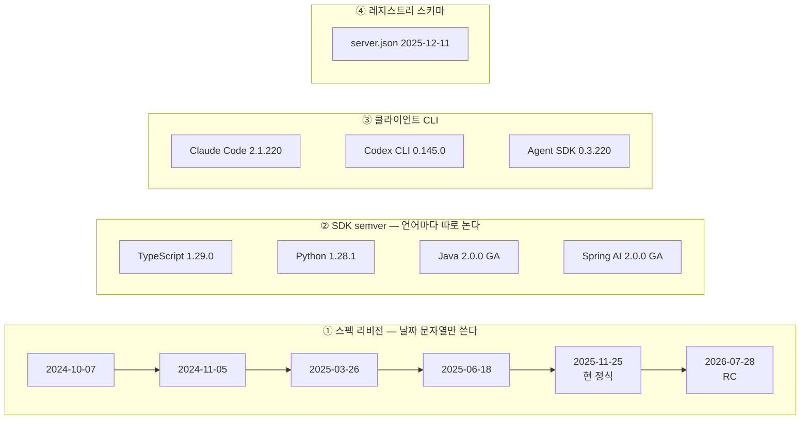
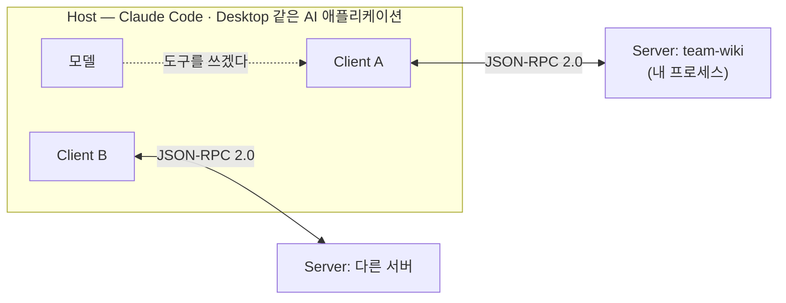
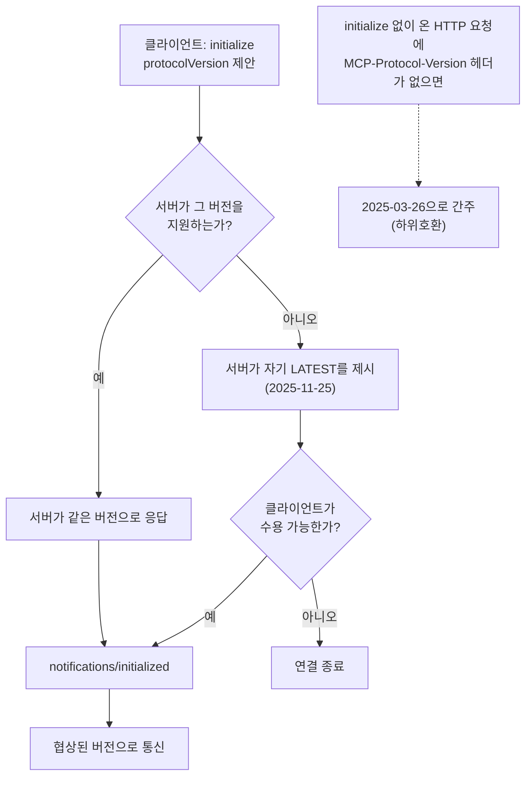
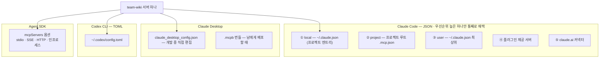
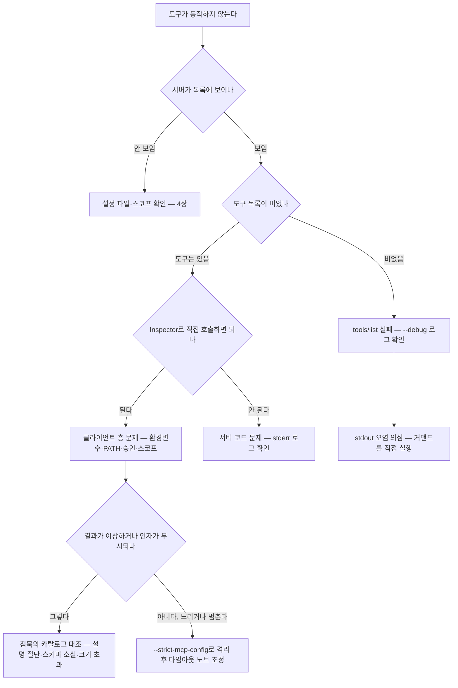
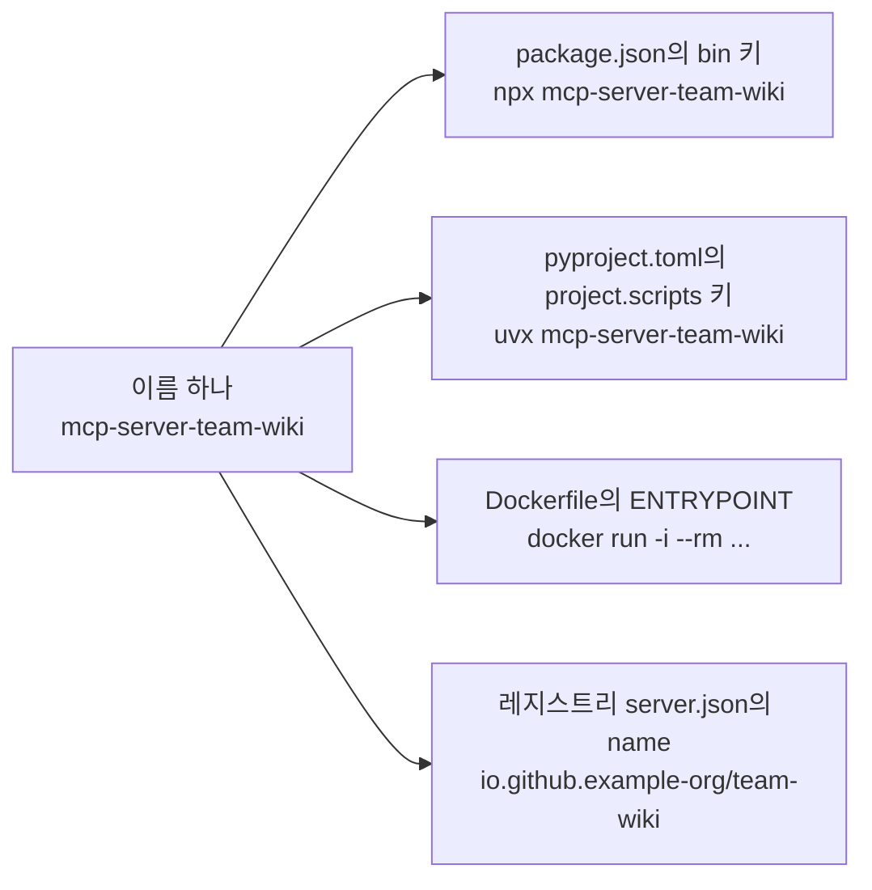
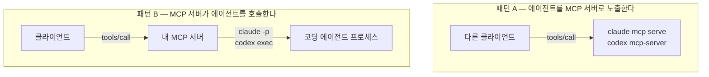
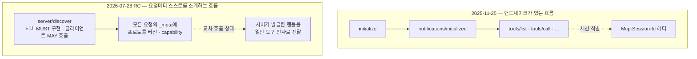

# MCP 서버 개발 실전

**TypeScript·Python·Java로 만들고 Claude Code에 붙이기**

## 저자

Toby-AI

**판본:** v1.0.0 · 2026-07-26

## 판권

**MCP 서버 개발 실전 — TypeScript·Python·Java로 만들고 Claude Code에 붙이기**
**판본:** v1.0.0
**발행일:** 2026-07-26
**저자:** Toby-AI
**식별자:** urn:uuid:14818174-89f1-489b-9314-6326def17e98

### 라이선스

이 책은 [Creative Commons BY-NC-SA 4.0](https://creativecommons.org/licenses/by-nc-sa/4.0/) 라이선스로 배포된다.

- **저작자 표시(BY):** 출처를 밝힐 것.
- **비상업적 이용(NC):** 상업적 목적으로 이용할 수 없다.
- **동일조건 변경허락(SA):** 변경·재배포 시 동일한 라이선스를 적용해야 한다.

### 출처

이 책은 [book-writer](https://github.com/tobyilee/book-writer) 하네스 v1.9.1로 자동 생성되었다.

## 머리말

### 이 책의 기준 시점은 2026년 7월 26일이다

머리말에서 가장 먼저 밝혀야 할 게 날짜라는 건 좀 이상한 일이다. 이 주제에서는 그게 가장 중요한 정보다.

MCP를 검색하면 서로 어긋나는 말들이 한 화면에 같이 뜬다. "2.0에서 달라진 점"을 정리한 글이 있고, "MCP는 죽었다"는 글이 있고, 그 아래에 "아직도 MCP를 쓰는 이유"가 있다. 대부분은 거짓말이 아니다. **각자 다른 시점에 쓰였고, 그 시점을 적어두지 않았을 뿐이다.**

그래서 이 책은 자기 시점을 본문 안에 박아두는 쪽을 택했다. 버전이나 수치가 나오는 자리마다 "2026-07-26 시점에 무엇이 관측됐는가"로 쓴다. "1.29.0을 써라"가 아니라 "그날 dist-tag는 `latest: 1.29.0` 하나뿐이었다"고 쓴다. 번거로워 보이지만, 이렇게 써두면 그 값이 바뀌어도 문장이 틀리지 않는다. 독자는 관측값을 자기 시점 값으로 갈아 끼우기만 하면 된다.

기준선은 셋이다.

- **주 서술 대상은 스펙 리비전 `2025-11-25`다.** 저술 시점의 유일한 정식 리비전이고, 예제 코드가 실제로 동작하는 지반이다.
- **차기 리비전 `2026-07-28`은 12장에 격리했다.** 저술 시점에 이것은 RC였다. 앞 장에서는 "여기가 나중에 바뀐다"는 표지만 남기고 지나간다. 앞 장들에 섞어 뿌리면 정식화되는 날 여러 장이 한꺼번에 낡는다.
- **SDK 버전은 권고가 아니라 관측으로 적는다.** 위에 말한 그 습관이다.

### 누가 읽으면 좋은가

MCP 서버를 **직접 만들어 쓰려는 개발자**를 위한 책이다.

TypeScript·Python·Java 중 하나 이상을 실무에서 써봤다면 충분하다. LLM이나 에이전트 개발 경험은 전제하지 않는다 — MCP가 그 세계와의 첫 접점이어도 읽힌다. 반대로 이 책이 답하지 않는 것도 밝혀두자. 모델을 고르거나 프롬프트를 다듬는 이야기는 없고, 이미 만들어진 남의 서버를 골라 쓰는 이야기도 거의 없다. 이 책의 주어는 처음부터 끝까지 **내가 만드는 서버**다.

### 어떻게 읽으면 좋은가

순서대로 읽어도 되지만, 두 개의 지름길을 안내해둔다.

**① 언어별 경로 — Python·Java 독자도 3장은 읽자.**

3장(TypeScript)이 정본 워크스루다. 여기서 `team-wiki`라는 서버를 처음부터 끝까지 만들고, 이 책이 반복해서 쓰는 개념 — 도구·리소스·프롬프트, 반환값이 둘로 갈리는 이유, 오류를 프로토콜 실패가 아니라 도구 실행 결과로 돌려주는 규정 — 이 전부 여기서 처음 나온다. 5장(Python)과 6장(Java·Spring AI)은 그것을 각 언어로 옮기는 장이라, 3장을 건너뛰면 "왜 이렇게 하는가"가 통째로 빠진다. 자기 언어 장만 읽고 싶더라도 **3장 → 자기 언어 장** 순서를 권한다.

그리고 3장부터 10장까지, 진단 훈련인 8장 하나를 빼면 같은 서버 하나를 계속 손본다. 3장에서 만들고, 4장에서 붙이고, 5·6장에서 옮기고, 7장에서 도구 목록을 다시 짜고, 9장에서 포장하고, 10장에서 밖에 연다. 예제가 장마다 바뀌지 않으니 새 코드를 처음부터 이해하느라 매번 다시 출발할 일은 없다.

**② 빠른 경로 — 당장 만들어보고 싶으면 3장 → 4장 → 1장.**

1·2장은 손을 대기 전에 지형을 정리하는 장이다. 버전 혼동을 걷어내고("MCP 2.0 스펙"은 존재하지 않는다), 프로토콜의 뼈대를 세운다. 필요한 순서라고 판단해 앞에 두었지만, 그 대가로 코드가 나오기까지 두 장을 지나야 한다. 손이 근질거린다면 **3장부터 펴자.** 서버 하나를 만들어 클라이언트에 붙여본 다음 1장으로 돌아오면, 그 장의 논쟁이 훨씬 구체적으로 읽힌다. 2장은 그다음에 읽어도 늦지 않다.

이 경로로 읽으면 3장이 "1장에서 봤듯이" 하며 넘기는 대목이 두어 군데 나온다. 거기서 멈추지 말고 그냥 지나가자 — 서버 하나를 붙여본 다음 1장으로 돌아오면 그 대목들이 한꺼번에 풀린다.

무엇이 안 될 때 어디를 볼지는 **8장**에 모아두었다. 급하면 그 장만 따로 펴도 된다.

### 표기에 대한 몇 가지

- **버전 숫자를 만나면 어느 축인지부터 가른다.** 이 책은 네 개의 축을 절대 섞지 않는다 — ① 스펙 리비전(날짜 문자열) ② SDK semver ③ 클라이언트 CLI 버전 ④ 레지스트리 스키마. 1장의 표가 그 좌표계다.
- **리비전은 `2025-11-25`처럼 날짜꼴 그대로 적는다.** 이름이 날짜일 뿐, 크고 작음을 비교하는 숫자가 아니다.
- **인용은 원문 그대로 싣는다.** 공식 문서·릴리스 노트·이슈의 문장은 번역해 옮기면 뉘앙스가 바뀌는 경우가 많아, 결정적인 대목은 영어 원문을 그대로 두고 앞뒤에서 풀어 설명했다.
- **`team-wiki`는 가상의 사내 위키 서버다.** 실재하는 제품이 아니라 이 책이 만드는 예제다.

## 목차

- **1장. "MCP 2.0"은 없다 — 그리고 왜 아직도 MCP인가**
- **2장. 프로토콜 해부 — JSON-RPC 위에 무엇이 얹혀 있나**
- **3장. 첫 서버 — TypeScript로 `team-wiki` 만들기**
- **4장. 클라이언트에 붙이기 — Claude Code·Desktop·Agent SDK·Codex**
- **5장. Python 서버 — FastMCP, 그리고 `MCPServer`로 가는 길**
- **6장. Java와 Spring AI — `@McpTool`, 그리고 GA인 2.0의 진짜 의미**
- **7장. 도구를 몇 개나 만들 것인가 — 설계가 곧 보안이다**
- **8장. 침묵과 진단 — 에러 없이 실패하는 MCP를 보이게 만들기**
- **9장. 포장해서 남에게 주기 — npm·PyPI·Docker·레지스트리**
- **10장. 원격으로 열기, 그리고 도구를 의심하기**
- **11장. 방향을 뒤집다 — MCP 서버가 코딩 에이전트를 부를 때**
- **12장. 2026-07-28과 그 이후 — 이 지식은 언제 낡는가**
- **에필로그**
- **부록 — MCP 서버 보안 체크리스트**
- **참고문헌**

# 1장. "MCP 2.0"은 없다 — 그리고 왜 아직도 MCP인가

"MCP 2.0"을 검색해보자. 블로그 글이 나오고, 발표 자료가 나오고, "2.0에서 달라진 점 정리" 같은 제목도 나온다. 그런데 그런 스펙은 존재하지 않는다.

과장이 아니다. 2026년 7월 26일에 스펙 저장소의 `schema/` 디렉터리를 직접 열어보면 안에 든 것은 `2024-11-05`, `2025-03-26`, `2025-06-18`, `2025-11-25`, 그리고 `draft` — 다섯 개뿐이다. 릴리스 태그를 전부 훑어도 `2.0`이라는 이름은 하나도 없다. MCP 스펙은 `2024-10-07` 이후 지금까지 **날짜 문자열만** 리비전 이름으로 써왔다.

그렇다면 사람들이 말하는 그 "2.0"은 대체 무엇을 가리키는 말일까? 그리고 왜 같은 검색 결과에 "MCP는 죽었다"는 글까지 섞여 나올까? 첫 서버 코드를 한 줄이라도 쓰기 전에 이 두 가지를 정리하고 넘어가는 편이 낫다. 그러지 않으면 남은 열한 장을 내내 "내가 지금 맞는 걸 배우고 있나" 하는 의심을 안고 읽게 된다.

## 혼동은 어디서 시작되는가

첫 번째 경로는 어이없을 만큼 단순하다. 모든 리비전의 스키마 파일에 이런 상수가 들어 있다.

```
JSONRPC_VERSION = "2.0"
```

이 `"2.0"`은 MCP 버전이 아니라 **JSON-RPC 2.0** 스펙의 버전이다. MCP가 JSON-RPC 위에 얹혀 있으니 당연히 들어 있는 값이고, 리비전이 몇 번을 바뀌어도 이 줄은 그대로다. 코드를 읽다 이걸 보고 "아, 지금 2.0이구나" 하고 넘어갔다면 그 순간 첫 단추가 어긋난 것이다.

두 번째 경로가 진짜 원인이다. **SDK의 메이저 버전이 2.0으로 올라갔다.** 그리고 SDK 버전은 스펙 리비전과 아무 관계가 없는 별개의 숫자다. 여기까지만 알아도 검색 결과의 절반은 해석이 된다.

문제는 실무에서 마주치는 버전 숫자가 이 둘만이 아니라는 데 있다.

## 네 개의 축을 분리하자

MCP를 다루다 보면 서로 다른 네 종류의 버전을 만나게 된다. 이들은 각자의 속도로 움직이고, 서로를 기다려주지 않는다. 이 표가 이 책 전체의 좌표계다.

| 축 | 무엇의 버전인가 | 2026-07-26 관측값 |
|---|---|---|
| **① 스펙 리비전** | 프로토콜 자체 | 정식 `2025-11-25` / 차기 `2026-07-28`은 RC |
| **② SDK semver** | 언어별 구현 라이브러리 | TS `1.29.0` · Python `1.28.1` · Java `2.0.0` · Spring AI `2.0.0` |
| **③ 클라이언트 CLI** | 서버를 붙여 쓰는 도구 | Claude Code `2.1.220` · Codex CLI `0.145.0` · Agent SDK `0.3.220`/`0.2.128` |
| **④ 레지스트리 스키마** | `server.json` 형식 | `2025-12-11` |


그림 1. 네 개의 버전 축 — 나란히 흐르지만 서로 만나지 않는다 (2026-07-26 관측 기준)

축을 섞으면 어떤 일이 벌어질까? "최신 SDK를 썼으니 최신 스펙이겠지"라고 넘겨짚는 순간, 실제로는 한 세대 전 리비전으로 통신하는 서버를 만들어놓고 왜 안 되는지 몰라 헤매게 된다. 잊지 말자. **숫자가 크다고 최신이 아니다. 어느 축의 숫자인지부터 확인해야 한다.**

## 그런데 "2.0"은 실재한다 — SDK 세대로서

여기서 오해를 하나 풀어야 한다. "MCP 2.0 스펙은 없다"는 말이 "2.0이라는 건 다 헛소문이다"라는 뜻은 아니다. SDK 축에서 2.0은 분명히 존재하고, 그것도 아주 큰 사건이다. 다만 **언어마다 성숙도가 전혀 다르다.**

| SDK | 2.0의 상태 | 시점 | 실제로 구현하는 스펙 |
|---|---|---|---|
| Java (`io.modelcontextprotocol.sdk:mcp`) | **2.0.0 GA** | 2026-06-11 | **`2025-11-25`** (릴리스 노트 명시) |
| Spring AI (`spring-ai-starter-mcp-*`) | **2.0.0 GA** | 2026-06-12 | `2025-11-25` 계열 |
| TypeScript (신규 스코프 패키지) | `2.0.0-beta.5` | 2026-07-21 | 런타임은 `2025-11-25`까지 협상 |
| Python (`mcp`) | `2.0.0b2` | 2026-07-14 | `2025-11-25`와 `2026-07-28` 병행 |

이 표에서 가장 중요한 칸은 맨 오른쪽이다. **Java SDK 2.0.0은 GA인데 따르는 스펙은 `2025-11-25`다.** 릴리스 노트가 직접 그렇게 쓰고 있다 — *"It tracks the latest 2025-11-25 MCP specification."* 숫자만 보고 "2.0이니까 최신 스펙이겠지" 했다면 정반대로 읽은 셈이다.

TypeScript와 Python도 같은 `2.0`이라는 숫자를 달고 있지만 속은 또 다르다. 2026-07-26 관측 시점에 TS `2.0.0-beta.5` 패키지의 런타임 번들을 풀어 상수를 읽어봤다. `SUPPORTED_PROTOCOL_VERSIONS` 목록에 `2026-07-28`은 **없었다.** 패키지 안에 그 문자열이 210회나 등장하지만 전부 JSDoc 주석이다. 즉 그 시점의 TS 2.0 베타는 새 리비전을 향해 설계되고 있었을 뿐, 와이어 위에서 그것을 제안하지는 않았다. 반면 Python `mcp-types 2.0.0b2`는 `MODERN_PROTOCOL_VERSIONS = ("2026-07-28",)`을 런타임 상수로 못 박아두었다. 설계도는 양쪽에 다 있었지만, 차가 실제로 다리를 건너고 있던 건 Python 쪽뿐이었다.

그러니 "생태계가 2.0으로 넘어갔다"는 한 문장으로 뭉뚱그리지 말자. 세 가지 사실 — Java·Spring AI는 GA다 / TS·Python은 그 시점에 프리릴리스였다 / 같은 2.0이라도 구현하는 스펙이 다르다 — 는 각각 따로 서 있어야 한다. 하나로 묶는 순간, 3장에서 "TypeScript는 1.x가 프로덕션 지원 라인"이라는 말을 만나고 독자는 되묻게 된다. 그래서 2.0을 쓰라는 거야, 말라는 거야?

## "MCP는 죽었다"는 무슨 말인가

버전 혼동을 걷어내도 검색 결과에는 더 불편한 게 남아 있다. "MCP는 죽었다, CLI 만세" 류의 글이다. 이걸 그냥 어그로라고 넘겨도 될까? 그러기엔 규모가 좀 크다.

해커뉴스에서 이 논쟁을 다룬 대형 스레드를 점수 순으로 늘어놓으면 이렇다. "I still prefer MCP over skills"가 460점·375댓글(2026-04-10), "When does MCP make sense vs CLI?"가 447점·284댓글(2026-03-01, 원제는 "MCP is dead, long live the CLI"), "MCP is dead?"가 400점·410댓글(2026-05-29). 여기에 300점 안팎 스레드가 둘 더 붙는다. **2026년 2월부터 5월까지 넉 달 연속**이다. 단발성 백래시라면 이렇게 규칙적으로 재발하지 않는다.

회의론의 요지는 이렇다. 우리에겐 이미 curl과 HTTP와 OpenAPI가 있었고, 커맨드라인 도구는 파이프로 자유롭게 조합된다. 그런데 MCP는 모든 조합이 모델을 한 번 거쳐야 하고, 서버를 붙일수록 모델이 읽어야 할 도구 설명이 늘어난다. 게다가 서버 하나가 늘어나는 건 샌드박스 밖으로 나갈 통로가 하나 늘어나는 일이기도 하다. 실제로 MCP 서버를 쓰다가 CLI 도구를 직접 만들어주는 쪽으로 갈아탄 개발자들이 있고, 그들은 그쪽이 더 쉬웠다고 말한다. (도구가 컨텍스트를 얼마나 먹는가는 숫자로 따져야 할 문제인데, 그 계산은 7장에서 제대로 하자.)

반론도 만만치 않다. 가장 먼저 나오는 건 **CLI가 아예 존재할 수 없는 자리**에 대한 지적이다.

> "I have a couple MCP servers connected to my **Claude web & mobile** clients. **How would your clis work there?**" — 0x696C6961

웹과 모바일에는 셸이 없다. 사내 업무 담당자에게 "에이전트 만들 때 CLI를 쓰세요"라고 말할 수도 없다. 그리고 조직 규모가 커지면 도구를 어떻게 배포하고 갱신할지가 문제가 되는데, MCP는 거기에 표준 답을 준다.

가장 프레임을 크게 뒤집는 관점은 이것이다.

> "**MCP exists to take capability away from agents** ... tightly allowlist what the agent is capable of executing" — bb88

MCP를 "에이전트에게 능력을 주는 장치"로 생각하면 CLI와 비교당할 수밖에 없다. 그런데 반대로 **능력을 깎아내는 장치**로 보면 이야기가 달라진다. 셸을 통째로 열어주는 대신 내가 허락한 동작만 노출하는 것, 자격 증명을 서버 안에 가둬 개발자도 에이전트도 끝내 보지 못하게 하는 것 — 이게 목적이라면 CLI는 애초에 대안이 아니다. 재미있는 건 bb88이 회의론 쪽에서도 인용되는 인물이라는 점이다. 같은 사람이 각도를 바꿔 양쪽에 다 서 있다.

그리고 논쟁의 온도를 가장 잘 정리한 건 "죽었다"고 쓴 사람 본인이었다.

> "The article title and content is **intentionally provocative**" — ejholmes

국내 실무자들의 감각은 좀 더 실용적이다.

> "개발할때는 쓸만하고 **서비스할때에는 비용문제 때문에 skill정도만** 쓰고있어요" — kaydash

죽었느냐 살았느냐가 아니라 **어느 단계에서 쓰느냐**로 답한 것이다. 이 책은 이쪽 태도를 따른다. 우리가 답해야 할 질문은 "MCP가 옳은가"가 아니라 "내 상황에서 MCP가 맞는 도구인가"다. 그 판단은 한 번 만들어보기 전에는 내려지지 않는다.

## 이 책이 서 있는 자리

혼동을 걷어냈으니 이제 기준을 못 박자.

**이 책의 주 서술 대상은 스펙 `2025-11-25`다.** 오늘 기준으로 유일한 정식 리비전이고, Java SDK 2.0도 Spring AI 2.0도 이것을 구현한다. 예제 코드가 실제로 동작하려면 여기에 서야 한다.

**`2026-07-28`은 12장에 격리한다.** 2026-07-26 시점에 이 리비전은 여전히 RC였다 — 릴리스에 `prerelease` 플래그가 붙어 있고 `schema/2026-07-28/` 디렉터리는 아직 만들어지지 않았다. 정식이 되면 상당히 큰 변화가 온다. 하지만 그 변화를 앞 장들에 섞어 뿌려두면 정식화되는 날 여러 장이 한꺼번에 낡는다. 그래서 한 장에 모아두었다. 중간에 RC 이야기가 스쳐 지나갈 때는 "RC 기준이고 확정 시 달라질 수 있다"는 단서를 함께 달아두었으니, 그 표시가 보이면 12장을 기억하면 된다.

**SDK 버전에 대한 서술은 "권고"가 아니라 "관측"으로 쓴다.** "1.29.0을 써라"가 아니라 "2026-07-26 시점에 dist-tag는 `latest: 1.29.0` 하나뿐이었다"고 쓴다는 뜻이다. 번거로워 보이지만 이유가 있다. 이 원고를 쓰는 지금도 TS와 Python의 2.0 정식은 며칠 안에 나올 수 있다. 관측으로 써두면 그날이 와도 문장이 틀리지 않는다. 독자도 같은 습관을 들이는 편이 낫다 — 어떤 글에서 버전 이야기를 읽든, **그게 언제 관측된 값인지**부터 찾아보자.

### 이 장의 핵심

- "MCP 2.0 스펙"은 존재하지 않는다. 스펙은 `2024-10-07` 이후 날짜 리비전만 써왔고, 코드에 보이는 `JSONRPC_VERSION = "2.0"`은 JSON-RPC의 버전이다.
- 버전 숫자를 만나면 네 축 중 어디인지부터 가른다 — 스펙 리비전 / SDK semver / 클라이언트 CLI / 레지스트리 스키마.
- "2.0"은 SDK 세대로서 실재하되 언어마다 성숙도가 다르다. Java·Spring AI는 GA이면서 `2025-11-25`를 구현하고, TS·Python은 관측 시점에 프리릴리스였다.
- "MCP는 죽었다" 논쟁은 넉 달 연속 대형 스레드가 이어진 실재하는 논쟁이다. 쟁점은 옳고 그름이 아니라 적용 단계와 환경이다.
- 이 책의 기준은 스펙 `2025-11-25`이고, `2026-07-28`은 12장에 격리했다. SDK 상태는 관측 시점과 함께 서술한다.

좌표계는 세웠다. 그런데 좌표계만으로 답이 나오지 않는 질문이 하나 남는다. 논쟁의 양쪽 주장을 다 읽고 나면 결국 하나로 돌아오게 된다. **그래서, 내 경우엔 만들 만한가?**

그건 읽어서 알 수 있는 게 아니다. 만들어봐야 안다.

# 2장. 프로토콜 해부 — JSON-RPC 위에 무엇이 얹혀 있나

최신 스펙을 지원한다는 SDK를 썼는데, 어째서 어떤 요청은 `2025-03-26`으로 처리될까? 한 세대도 아니고 두 세대나 옛날 리비전이다.

SDK 코드를 뒤져보면 그 문자열이 정말로 상수에 박혀 있다. 이름은 `DEFAULT_NEGOTIATED_PROTOCOL_VERSION`, 직역하면 "협상된 기본 버전"이다. 그런데 이 상수가 실제로 하는 일은 이름이 풍기는 인상과 꽤 다르다. 이 값이 어디서 와서 어디에 쓰이는지 정확히 짚으려면, 클라이언트와 내 서버가 실제로 주고받는 메시지부터 봐야 한다. 이 장을 다 읽고 나면 로그에 찍힌 JSON-RPC 한 줄을 보고 어느 단계에서 어긋났는지 짚어낼 수 있게 된다.

## 세 자리에 앉은 셋

공식 문서는 MCP를 "AI 애플리케이션을 위한 USB-C 포트"라고 소개한다. 감은 오지만 무엇이 표준화됐는지는 알려주지 않는다. 에이전트 프로토콜을 다룬 서베이 한 편(arXiv 2505.02279)의 한 줄 규정이 훨씬 정확하다.

> "MCP provides a **JSON-RPC client-server interface for secure tool invocation and typed data exchange**."

문장 하나에 이 프로토콜의 정체가 다 들어 있다. 전송 형식은 JSON-RPC 2.0이고, 표준화한 것은 도구 호출과 타입 있는 데이터 교환이다. 새로운 직렬화 포맷도, 새로운 네트워크 프로토콜도 아니다. 이미 있던 JSON-RPC 위에 "무엇을 어떤 이름으로 주고받을지"를 규정해 얹은 얇은 층이다.

참여자는 셋이다.


그림 1. Host / Client / Server — 클라이언트 하나가 서버 하나를 전담한다

**Host**는 사람이 켜서 쓰는 애플리케이션이다. 모델을 품고 있고, 서버를 몇 개 붙일지 결정한다. **Client**는 호스트 안에서 서버 하나와 1:1로 연결을 유지하는 부품이다. 서버를 셋 붙이면 클라이언트도 셋이 뜬다. 그리고 **Server**가 이 책에서 만들 물건이다.

이 구조가 중요한 이유가 있다. 내 서버는 모델과 직접 말하지 않는다. 언제나 클라이언트를 거치고, 그 클라이언트가 속한 호스트의 정책을 거친다. 8장에서 볼 침묵성 실패의 상당수가 이 중간 층에서 벌어진다.

## 서버가 내놓는 세 가지

서버가 호스트에 제공할 수 있는 것은 세 종류다. 이 세 가지를 **프리미티브**라고 부른다.

| 프리미티브 | 성격 | 주요 메서드 |
|---|---|---|
| `tools` | 모델이 **실행**하는 것 | `tools/list`, `tools/call` |
| `resources` | 모델이 **읽는** 것 | `resources/list`, `resources/read`, `resources/templates/list` |
| `prompts` | 사용자가 **고르는** 것 | `prompts/list`, `prompts/get` |

메서드 이름에는 규칙이 있다. 목록을 받는 `list`, 실제로 쓰는 `call`·`read`·`get`. 서버 개발자가 하는 일은 결국 이 몇 개의 요청에 응답 핸들러를 붙이는 것이다. 생각보다 단출하다.

방향이 반대인 것들도 있다. **서버가 클라이언트에게 요청하는** 메서드들이다. 작업 디렉터리를 물어보는 `roots/list`, 클라이언트의 모델을 빌려 쓰는 `sampling/createMessage`, 사용자에게 되묻는 `elicitation/create`, 그리고 `logging`. 서버가 일방적으로 응답만 하는 존재는 아닌 셈이다.

다만 여기엔 단서가 붙는다. 아직 RC인 차기 리비전 `2026-07-28`에서 이 기능들의 지위가 달라진다. 지금 새로 배우기 시작한다면 이쪽에 시간을 크게 쏟지 않는 편이 낫다. 무엇이 어떻게 되는지는 12장에서 정리한다.

> 보안 이야기를 조금 앞당겨 해두자. 서버가 만드는 공격면은 도구만이 아니다. **리소스와 프롬프트도 각각 구조적인 취약점을 가진다.** 위협을 검토할 때 셋을 따로 놓고 봐야 한다는 뜻인데, 이 이야기는 7장에서 본격적으로 한다.

## 악수 없이는 아무것도 시작되지 않는다

연결이 열리면 가장 먼저 일어나는 일이 **핸드셰이크**다. 순서는 이렇다.

1. 클라이언트가 `initialize`를 보낸다 — 자기가 지원하는 프로토콜 버전과 capability를 실어서
2. 서버가 응답한다 — 자기가 선택한 버전과 capability를 실어서
3. 클라이언트가 `notifications/initialized`를 보낸다 — 이제 시작해도 좋다는 신호

capability 교환이 여기서 끝난다는 게 핵심이다. 서버가 도구를 제공한다고 이 단계에서 말하지 않으면 클라이언트는 이후로 `tools/list`를 아예 부르지 않는다. 코드를 아무리 잘 짜놨어도 소용이 없다.

그리고 여기서 아까의 `2025-03-26`이 튀어나온다. TypeScript SDK `1.29.0`(2026-03-30 기준)의 타입 파일에는 이런 상수 셋이 있다.

```js
LATEST_PROTOCOL_VERSION = '2025-11-25'
DEFAULT_NEGOTIATED_PROTOCOL_VERSION = '2025-03-26'
SUPPORTED_PROTOCOL_VERSIONS = ['2025-11-25', '2025-06-18', '2025-03-26', '2024-11-05', '2024-10-07']
```

읽어보자. 이 SDK가 **아는 최신은 `2025-11-25`**이고, **협상할 수 있는 목록은 다섯 개**다.

세 번째 상수는 성격이 다르다. `DEFAULT_NEGOTIATED_PROTOCOL_VERSION`은 `initialize` 협상의 실패값이 아니라, **Streamable HTTP에서 `MCP-Protocol-Version` 헤더 없이 들어온 요청을 어느 리비전으로 간주할지 정하는 하위호환 가정값**이다. 이 헤더는 `2025-06-18`에서 도입됐으니, 헤더를 안 보내는 클라이언트는 그 이전 세대로 보고 `2025-03-26`으로 취급하는 것이다. Python SDK `1.28.1`(2026-06-26 기준)도 같은 값을 같은 자리에 둔다(이름은 `DEFAULT_NEGOTIATED_VERSION`).

그러면 `initialize`에서 버전이 어긋나면 어떻게 될까? 서버는 자기가 아는 **최신**을 제시한다. 클라이언트가 제안한 값이 `SUPPORTED_PROTOCOL_VERSIONS`에 없으면 `LATEST_PROTOCOL_VERSION`으로 응답하고, 클라이언트가 그것을 받아들이지 못하면 연결이 끊긴다. 즉 **조용히 구버전으로 떨어지는 경로는 stdio 핸드셰이크가 아니라 HTTP 헤더 쪽에 있다.**


그림 2. `initialize` 협상 경로와, 그와 별개인 헤더 부재 시의 간주값

이 구분이 왜 중요할까? 핸드셰이크가 어긋나면 **연결이 끊어지므로 어쨌든 눈에 보인다.** 반면 헤더가 빠진 HTTP 요청은 조용히 두 세대 전 리비전으로 처리되고 아무 에러도 뜨지 않는다. 에러가 나는 실패보다 나지 않는 실패가 늘 더 얄궂다. 원격으로 연 서버가 구버전처럼 굴면 이 헤더부터 의심하는 편이 낫다.

## 버전 문자열을 부등호로 비교하지 마라

리비전 이름이 전부 날짜꼴이다 보니 이런 코드를 짜고 싶어진다.

```js
if (peerVersion >= '2025-11-25') { /* 신 기능 사용 */ }
```

편해 보이는데, 하면 안 된다. 공식 SDK가 주석으로 직접 경고하고 있다.

> "Date-string protocol revisions happen to sort lexicographically, but versions are an **enumerated set, not an ordered scalar**: future identifiers are not guaranteed to be date-shaped, and unrecognized peer strings must compare conservatively instead of accidentally (e.g. `"zzz" > "2025-11-25"`)."

날짜처럼 생긴 건 **우연**이라는 것이다. 앞으로 나올 식별자가 날짜꼴이라는 보장이 없고, 상대가 보낸 알 수 없는 문자열이 사전순으로 최신보다 커버릴 수도 있다. 인용문의 `"zzz"`가 그 사례다. 그 코드는 정체불명의 상대에게 최신 기능을 켜준다. 아찔하지 않은가?

**리비전은 순서 있는 스칼라가 아니라 열거된 집합이다.** 아는 값 목록에 있는지 확인하는 방식으로 다루자. 이건 취향 문제가 아니라 SDK 저자가 못 박아둔 규율이다.

## 어디로 흐르는가 — 트랜스포트 세 가지

메시지가 오가는 통로는 세 종류이고, 지위가 서로 다르다.

| 트랜스포트 | 지위 (2026-07-26 기준) |
|---|---|
| **stdio** | 전 리비전 지원. 로컬 프로세스의 기본 |
| **Streamable HTTP** | `2025-03-26`에서 도입. 현재 권장 |
| **HTTP+SSE** (구) | `2025-03-26`부터 deprecated |

이 책의 러닝 예제는 stdio로 시작한다. 클라이언트가 내 서버를 자식 프로세스로 띄우고 표준 입출력으로 JSON-RPC를 주고받는 방식이다. 설치도 인증도 필요 없어서 첫 서버로는 이만한 게 없다.

대신 stdio에는 구조적인 약점이 넷 있다.

첫째, **stdout이 프로토콜 채널이다.** `2025-11-25`가 정리했듯 stdio 서버는 모든 로깅에 stderr를 쓸 수 있다. 뒤집으면 stdout에는 JSON-RPC 말고 아무것도 나가면 안 된다는 뜻이다. 서버 개발자가 가장 많이 밟는 지뢰이고, 8장에서 제대로 다룬다.

둘째, **분산 추적 컨텍스트를 실을 자리가 없다.** HTTP라면 헤더에 넣으면 될 것을 파라미터나 환경변수로 손수 넘겨야 한다.

셋째, **프로세스 생명주기가 클라이언트 몫이다.** 제대로 정리되지 않으면 좀비 프로세스가 남고 메모리가 샌다.

넷째, **끊겼을 때의 동작이 문서와 어긋난 이력이 있다.** HTTP 계열은 재연결을 시도하지만 stdio는 그렇지 않다. 이 차이는 4장에서 다시 본다.

## `2025-11-25`가 가져온 것

기준 리비전이 무엇을 바꿨는지 훑어두자. 지금 다 이해할 필요는 없고, 나중에 "이 기능 언제 들어왔지?" 싶을 때 돌아올 수 있으면 된다.

- **인증 쪽:** OpenID Connect Discovery 지원, `WWW-Authenticate` 기반 incremental scope consent, OAuth Client ID Metadata Documents를 권장 등록 방식으로 채택
- **표현 쪽:** 도구·리소스·템플릿·프롬프트에 **icons** 메타데이터 추가, elicitation 개편(단일·다중 선택), URL 방식 elicitation 추가
- **실행 쪽:** sampling에 **도구 호출 지원** 추가, **tasks 실험적 도입**(폴링으로 지연된 결과 회수)

그리고 사소해 보이지만 서버 개발자에게 직접 영향을 주는 변경이 다섯 있다. stdio 서버의 stderr 로깅 허용, JSON Schema 2020-12 기본 dialect 채택, 잘못된 `Origin` 헤더에 HTTP 403 응답, SDK 티어링 시스템 도입, 그리고 **입력 검증 오류의 처리 방식 변경**이다.

마지막 하나가 특히 중요하다. **입력 검증 오류는 Protocol Error가 아니라 Tool Execution Error로 돌려주라**는 규정이다. 왜 이렇게 바뀌었을까? Protocol Error로 던지면 대화가 거기서 끊긴다. 반면 Tool Execution Error로 돌려주면 모델이 그 메시지를 읽고 **스스로 인자를 고쳐 다시 호출**할 수 있다. 사람이 개입하지 않아도 복구되는 것이다. 3장에서 이 규정을 코드로 시연한다.

### 이 장의 핵심

- MCP는 JSON-RPC 2.0 위에 얹힌 얇은 층이다. 표준화한 것은 도구 호출과 타입 있는 데이터 교환이며, Host / Client / Server 3자 구조로 동작한다.
- 서버가 내놓는 프리미티브는 `tools`·`resources`·`prompts` 셋이고, 반대 방향 기능(roots·sampling·elicitation·logging)도 있으나 일부는 RC에서 deprecated 됐다.
- capability는 `initialize` 한 번에 결정된다. 여기서 선언하지 않은 기능은 이후로 호출되지 않는다.
- `MCP-Protocol-Version` 헤더가 없는 HTTP 요청은 `2025-03-26`으로 간주된다. "왜 구버전으로 붙지?"는 핸드셰이크가 아니라 이 헤더를 의심할 자리다.
- 리비전은 열거된 집합이지 순서 있는 스칼라가 아니다. 버전 문자열을 부등호로 비교하지 말자.

핸드셰이크가 끝나면 클라이언트가 묻는다. 그래서, 무엇을 할 수 있지? 이제 그 질문에 답할 차례다.

# 3장. 첫 서버 — TypeScript로 `team-wiki` 만들기

사내 위키를 클로드가 직접 읽게 해달라는 요청이 왔다고 해보자. 지금은 누군가 문서를 찾아 복사해서 대화창에 붙여넣고 있다. 문서가 열 개면 견딜 만하지만 수백 개가 되면 이야기가 달라진다.

요구사항을 정리하면 두 줄이다. **문서를 검색할 수 있을 것.** **찾은 문서의 본문을 가져올 수 있을 것.** 이걸 MCP 서버로 만들어보자. 이름은 `team-wiki`로 하고, 이 서버는 앞으로 여러 장에 걸쳐 우리를 따라다닌다. 5장에서는 Python으로, 6장에서는 Spring AI로 같은 걸 다시 만들고, 9장에서 배포하고, 10장에서 원격으로 연다.

## 무엇으로 시작할 것인가

TypeScript로 MCP 서버를 만들려면 공식 SDK를 쓴다. 그런데 여기서 첫 번째 결정을 해야 한다. 1장에서 봤듯이 SDK에는 2.0 세대가 있기 때문이다.

이 결정은 "무엇이 옳다"가 아니라 **"내가 조회한 시점에 무엇이 관측됐는가"**로 접근하는 편이 낫다. 2026-07-26 시점의 관측값은 이랬다.

- `npm view @modelcontextprotocol/sdk dist-tags`의 결과는 **`latest: 1.29.0` 하나뿐**이었다. `next`도 `beta`도 없었다.
- 같은 시점 저장소 README는 v2가 베타이며 **"v1.x remains the supported release for production"**이라고 명시했고, v2가 나온 뒤에도 **최소 6개월간** v1.x에 버그 수정과 보안 패치를 계속한다고 약속했다.

그래서 이 장은 `1.29.0`(2026-03-30 게시) 기준으로 쓴다. 다만 이 값은 이 책을 읽는 시점에 이미 바뀌어 있을 수 있다. **시작하기 전에 한 번 직접 조회해보자.**

```bash
npm view @modelcontextprotocol/sdk dist-tags
```

정식 2.0이 올라와 있다면 이 장의 코드가 틀린 게 아니라 선택지가 하나 늘어난 것이다. 무엇이 달라지는지는 이 장 후반부에 따로 정리해두었다.

## 뼈대 세우기

프로젝트를 만들고 `package.json`을 이렇게 잡는다.

```json
{
  "name": "mcp-server-team-wiki",
  "version": "0.1.0",
  "type": "module",
  "bin": { "mcp-server-team-wiki": "./build/index.js" },
  "dependencies": {
    "@modelcontextprotocol/sdk": "^1.29.0",
    "zod": "^3.25"
  }
}
```

두 가지만 짚자.

**`"type": "module"`** — SDK가 ESM 전제로 만들어졌다. 이 줄이 없으면 import 문에서부터 막힌다.

`bin` 키는 패키지 이름과 똑같이 맞췄다. 지금은 그냥 실행 파일 등록으로 보이겠지만, 이 사소한 결정이 9장에서 회수된다. 이름 하나가 세 갈래 배포 경로를 동시에 결정하기 때문이다. 지금은 "맞춰둔다"만 기억하고 넘어가자.

`tsconfig.json`에서는 `outDir`을 `build`로 잡아둔다. `bin`이 가리키는 경로와 컴파일 결과가 어긋나면 실행이 안 되니 이 둘은 늘 같이 확인하자.

의존성은 SDK와 zod 둘이다. zod는 도구의 입력 스키마를 선언하는 데 쓴다. SDK `1.29.0`은 zod 3과 4를 모두 받아준다.

이제 서버 객체를 만든다.

```ts
// src/index.ts
import { McpServer, ResourceTemplate } from "@modelcontextprotocol/sdk/server/mcp.js";
import { StdioServerTransport } from "@modelcontextprotocol/sdk/server/stdio.js";
import { z } from "zod";

const server = new McpServer({ name: "team-wiki", version: "0.1.0" });
```

`McpServer`는 고수준 API다. 저수준 `Server`를 직접 쓰면 `tools/list` 같은 요청 핸들러를 손수 등록해야 하는데, `McpServer`는 도구를 등록하면 목록 응답까지 알아서 만들어준다. 2장에서 본 capability 선언도 등록 내용에 맞춰 자동으로 채워진다. 첫 서버라면 고민할 것 없이 이쪽이다.

## 도구 두 개 붙이기

첫 번째 도구는 검색이다.

```ts
server.registerTool(
  "wiki_search",
  {
    title: "위키 검색",
    description: "제목과 본문에서 문서를 검색해 경로 목록을 돌려준다.",
    inputSchema: {
      query: z.string().describe("검색어"),
      limit: z.number().int().min(1).max(50).default(10)
    },
    outputSchema: {
      results: z.array(z.object({ path: z.string(), title: z.string() }))
    }
  },
  async ({ query, limit }) => {
    const results = await wiki.search(query, limit);   // 위키 백엔드 호출
    return {
      content: [{
        type: "text",
        text: results.map(r => `${r.path} — ${r.title}`).join("\n")
      }],
      structuredContent: { results }
    };
  }
);
```

`registerTool`은 인자를 셋 받는다. **이름**, **설정 객체**, **핸들러**다. 설정 객체에 넣을 수 있는 필드는 `title`·`description`·`inputSchema`·`outputSchema`·`annotations`·`_meta`이고, 전부 선택이다.

`inputSchema`에 zod 스키마를 넣으면 SDK가 JSON Schema로 변환해 모델에게 내보낸다. `limit`에 `.default(10)`을 붙였으니 이 필드는 필수 목록에서 빠진다. 모델이 생략하면 10이 들어온다.

여기서 눈여겨볼 건 **반환값이 둘로 갈린다**는 점이다. `content`는 모델이 읽을 텍스트고, `structuredContent`는 클라이언트 프로그램이 파싱할 데이터다. 같은 결과를 두 벌 만드는 게 낭비처럼 보이는가? 그렇지 않다. 모델에게는 읽기 좋은 요약을, 프로그램에게는 다루기 좋은 구조를 주는 것이다. 5장에서 Python SDK가 이 분리를 어떻게 표현하는지 보면 설계 의도가 더 선명해진다.

한 가지 주의할 점이 있다. `outputSchema`를 선언했다면 `structuredContent`도 함께 돌려줘야 한다. 빠뜨리면 SDK가 검증 단계에서 오류를 던진다. 그리고 와이어 위의 `structuredContent`는 객체이지 배열이 아니다. 그래서 `{path, title}` 배열을 `results` 키로 한 번 감쌌다.

두 번째 도구는 훨씬 단순하다.

```ts
server.registerTool(
  "wiki_get",
  {
    title: "위키 문서 가져오기",
    description: "경로로 문서 본문을 가져온다.",
    inputSchema: { path: z.string().describe("문서 경로") }
  },
  async ({ path }) => {
    const doc = await wiki.get(path);
    return { content: [{ type: "text", text: doc.body }] };
  }
);
```

도구 이름에 `wiki_` 접두사를 붙인 것도, 도구를 딱 둘만 만든 것도 우연이 아니다. 왜 이렇게 하는 게 나은지는 7장에서 근거와 함께 다룬다.

## 리소스와 프롬프트

도구 말고 나머지 두 프리미티브도 하나씩 붙여보자.

```ts
server.registerResource(
  "wiki-page",
  new ResourceTemplate("wiki://{path}", { list: undefined }),
  { description: "위키 문서 한 건", mimeType: "text/markdown" },
  async (uri, { path }) => {
    const doc = await wiki.get(String(path));
    return { contents: [{ uri: uri.href, text: doc.body }] };
  }
);
```

`ResourceTemplate`의 두 번째 인자에 `{ list: undefined }`를 넘긴 게 어색해 보일 것이다. 실수가 아니다. SDK가 이 필드를 **명시적으로 요구**한다. 목록 콜백을 안 주더라도 `undefined`라고 적게 만들어서, 리소스 목록 제공을 깜빡 잊는 일을 막으려는 설계다. 친절한 강제라고 할까.

프롬프트도 붙이자.

```ts
server.registerPrompt(
  "summarize_page",
  {
    title: "문서 요약",
    description: "위키 문서 한 건을 요약한다.",
    argsSchema: { path: z.string() }
  },
  ({ path }) => ({
    messages: [{
      role: "user",
      content: { type: "text", text: `wiki://${path} 문서를 세 문단으로 요약해줘.` }
    }]
  })
);
```

프롬프트는 모델이 고르는 게 아니라 **사용자가 고르는** 것이다. 슬래시 명령처럼 노출된다고 생각하면 이해하기 쉽다.

마지막으로 트랜스포트를 연결한다.

```ts
const transport = new StdioServerTransport();
await server.connect(transport);
```

두 줄이 전부다. 이제 클라이언트가 이 프로세스를 띄우면 표준 입출력으로 JSON-RPC가 오간다.

## 없는 문서를 물어보면 어떻게 되나

여기서 잠시 멈추자. `wiki_get("없는/경로")`가 들어오면 어떻게 해야 할까?

가장 먼저 떠오르는 건 예외를 던지는 것이다. 그런데 그렇게 하면 프로토콜 레벨 오류가 되고, 모델 입장에서는 대화가 그냥 끊긴 것처럼 보인다. 무엇이 잘못됐는지도, 어떻게 고쳐야 하는지도 모른 채로 말이다. 뒷맛이 개운하지 않다.

`2025-11-25`가 이 부분을 정리했다. **입력 검증 오류는 Protocol Error가 아니라 Tool Execution Error로 돌려주라**는 것이다(SEP-1303). 이유는 명확하다. 모델이 스스로 고칠 기회를 주기 위해서다.

```ts
async ({ path }) => {
  const doc = await wiki.get(path);
  if (!doc) {
    return {
      isError: true,
      content: [{
        type: "text",
        text: `'${path}' 문서를 찾을 수 없다. wiki_search로 경로를 먼저 확인해보라.`
      }]
    };
  }
  return { content: [{ type: "text", text: doc.body }] };
}
```

`isError: true`를 실어 정상 응답으로 돌려준다. 그러면 모델은 이 텍스트를 읽고 `wiki_search`를 먼저 부른 다음 다시 시도한다. 사람이 개입하지 않아도 복구되는 것이다.

부수적인 이점도 있다. SDK는 `isError`가 붙은 결과에 대해서는 **`outputSchema` 검증을 건너뛴다.** 출력 스키마를 선언한 도구라도 오류 경로에서 구조화 데이터를 억지로 만들어 붙일 필요가 없다는 뜻이다.

**이 오류 케이스를 기억해두자.** 5장과 6장에서 Python과 Spring AI로 똑같은 상황을 재현한다. 세 언어가 같은 규정을 각자의 방식으로 어떻게 표현하는지 비교하는 게 이 책의 한 축이다.

## 별도 절 — SDK 2.0 계열은 무엇이 다른가

v1으로 시작하기로 했지만, 2.0 세대가 어떻게 생겼는지는 알아둘 필요가 있다. 아래는 `2.0.0-beta.5`(2026-07-21 기준) 관측 내용이다.

**패키지가 쪼개졌다.** 단일 `@modelcontextprotocol/sdk` 하나이던 것이 모노레포로 갈렸다 — `server`, `client`, `core`(공개 스키마), `node`(HTTP 트랜스포트 래퍼), 그리고 `express`·`hono`·`fastify` 프레임워크 어댑터, 마이그레이션용 `codemod`까지. 어댑터는 의도적으로 얇게 설계됐다. 새 기능이나 비즈니스 로직을 넣지 않는다는 게 명시된 방침이다.

스키마 라이브러리 정책도 달라졌다. v1은 zod 3에 묶여 있었지만 v2는 Standard Schema를 채택해 zod 4·Valibot·ArkType 등을 골라 쓸 수 있다. zod를 계속 쓴다면 3에서 4로 넘어가는 메이저 점프가 따라온다.

새 진입점과 트랜스포트도 생겼다. stdio 서버를 한 줄로 띄우는 `serveStdio`, Cloudflare Workers 같은 환경을 겨냥한 `WebStandardStreamableHTTPServerTransport` 등이 추가됐다. 반면 `McpServer`·`registerTool`·`registerResource`·`registerPrompt`·`ResourceTemplate`은 그대로 남아 있다. 이 장에서 익힌 형태가 통째로 버려지지는 않는다는 뜻이다.

마지막으로 관측된 사실 하나를 덧붙인다. beta.5 패키지는 새 리비전용 타입(`DiscoverRequest` 등)과 세대 분기 유틸을 export하지만, 런타임의 `SUPPORTED_PROTOCOL_VERSIONS` 목록에는 `2026-07-28`이 들어 있지 **않았다.** 즉 그 시점에는 새 리비전을 실제로 협상하지 않았다. README가 새 스펙 구현을 표방한 것과 런타임 동작 사이에 아직 거리가 있었던 셈이다. 이 부분은 빠르게 바뀔 수 있으니 공식 저장소를 함께 확인하자.

## 붙여서 확인하기

빌드하고 한 줄로 붙여보자.

```bash
npx tsc
claude mcp add team-wiki -- node /절대/경로/build/index.js
```

`claude mcp list`로 목록에 뜨는지 확인한다. 붙었다면 클로드에게 "위키에서 배포 절차 문서 찾아줘"라고 시켜보자. `wiki_search`가 호출되고 결과가 돌아오면 성공이다.

물론 한 번에 되지 않을 가능성이 꽤 높다. 등록은 됐는데 도구가 안 보이거나, 붙었다는 표시는 뜨는데 아무 반응이 없거나. 그럴 때 어디를 봐야 하는지는 4장과 8장에서 차근차근 다룬다. 지금은 붙는 것 자체를 확인하는 데까지만 가면 충분하다.

여기까지 왔으면 도구 둘, 리소스 하나, 프롬프트 하나를 가진 서버가 손에 있다. 넘어가기 전에 하나만 해보자.

**`wiki_list_spaces`라는 도구를 하나 더 붙여보자.** 위키의 공간(스페이스) 목록을 돌려주는 도구다. 인자는 없어도 되고, 반환은 이름 목록이면 된다. `registerTool`의 설정 객체에서 `inputSchema`를 아예 빼면 인자 없는 도구가 된다.

붙여봤다면 도구가 셋이 된다. 넷, 다섯으로 늘리면 어떻게 될지는 7장에서 다시 만난다.

# 4장. 클라이언트에 붙이기 — Claude Code·Desktop·Agent SDK·Codex

같은 서버, 같은 설정 파일. 터미널에서 실행한 CLI에서는 도구가 멀쩡히 뜬다. 그런데 에디터 확장에서는 아무것도 뜨지 않는다. 설정을 세 번 다시 읽어봐도 오타는 없다.

이런 상황을 실제로 겪은 사람이 한둘이 아니다. 원인은 대개 서버가 아니라 **서버를 띄우는 쪽**에 있다. 3장에서 만든 `team-wiki`를 여러 클라이언트에 붙여보면서, 같은 서버가 왜 클라이언트마다 다르게 동작하는지 지형을 파악해보자. 이걸 버그가 아니라 지형으로 읽을 수 있게 되는 게 이 장의 목표다.

## Claude Code에 붙이기

가장 짧은 경로부터 보자.

```bash
claude mcp add team-wiki -- node /절대/경로/build/index.js
```

문법은 `claude mcp add [options] <name> -- <command> [args...]`다. 여기서 `--`가 결정적이다. 공식 문서 표현으로 그 뒤는 **"passed to the server untouched"** — 서버 실행 커맨드로 손대지 않고 그대로 넘어간다. 서버에 플래그를 넘겨야 한다면 전부 `--` 뒤에 둔다.

옵션은 이렇다.

| 옵션 | 값 | 비고 |
|---|---|---|
| `-s, --scope` | `local` \| `user` \| `project` | **기본값 `local`** |
| `-t, --transport` | `stdio` \| `sse` \| `http` | 미지정 시 stdio |
| `-e, --env` | `KEY=VALUE` | 여러 개 지정 가능 |
| `-H, --header` | `헤더: 값` | 원격 서버용 |
| OAuth 계열 | `--client-id`, `--client-secret`, `--callback-port` | 시크릿은 `MCP_CLIENT_SECRET`으로도 |

원격 서버를 붙일 때는 이런 모양이 된다.

```bash
claude mcp add --transport http sentry https://mcp.sentry.dev/mcp
```

설정 파일에 직접 쓸 때 알아두면 좋은 게 하나 있다. **`type` 필드는 `streamable-http`를 `http`의 별칭으로 받는다.** 스펙이 쓰는 이름과 클라이언트가 쓰는 이름이 달라서 생긴 흡수 조치인데, 어느 쪽으로 적어도 동작한다.

## 스코프는 3단계가 아니라 5단계다

여기가 이 장에서 가장 많은 사고가 나는 지점이다.

같은 이름의 서버가 여러 곳에 정의돼 있으면 Claude Code는 **우선순위가 가장 높은 한 곳의 정의만 골라 쓴다.** 순서는 이렇다.

① Local scope → ② Project scope → ③ User scope → ④ 플러그인이 제공하는 서버 → ⑤ claude.ai 커넥터

블로그 글에서 흔히 보는 "local > project > user" 3단계는 **절반만 맞는 이야기다.** 플러그인과 커넥터 계층이 빠져 있다. 그리고 중복을 판정하는 기준도 다르다. **앞의 세 스코프는 이름으로 중복을 가리고, 플러그인과 커넥터는 엔드포인트로 가린다.**

그런데 실무에서 정말 중요한 건 따로 있다. 공식 문서 원문을 그대로 옮긴다.

> "The entire server entry from that source is used; **fields are not merged across scopes.**"

**필드는 스코프를 넘어 병합되지 않는다.** 이게 무슨 뜻일까? user 스코프에 `team-wiki`를 환경변수까지 넣어 잘 등록해뒀다고 하자. 그런데 어느 프로젝트에서 커맨드만 바꾸려고 local 스코프에 같은 이름으로 하나 더 추가했다. 이때 user 쪽 환경변수가 함께 적용될까? 안 된다. local 엔트리가 통째로 이기고, user 쪽에 적어둔 환경변수는 통째로 사라진다. 설정을 겹쳐 쓰는 습관이 있다면 이 규칙 하나로 몇 시간을 아낄 수 있다.

저장 위치는 이 표 하나로 정리된다.

| 스코프 | 저장 위치 | 공유 범위 |
|---|---|---|
| `local` (기본) | `~/.claude.json`의 해당 프로젝트 엔트리 아래 | 나만, 이 프로젝트에서만 |
| `project` | 프로젝트 루트의 `.mcp.json` | 이 저장소를 클론한 모두 |
| `user` | `~/.claude.json`의 최상위 `mcpServers` 키 | 나만, 모든 프로젝트에서 |
| — | ⚠️ `~/.claude/.mcp.json`, `~/.claude/mcp.json`, `%APPDATA%\Claude\mcp.json` | **읽지 않는다** (흔한 오설정) |

윈도우에서 `~/.claude.json`은 `%USERPROFILE%\.claude.json`이다. 마지막 줄이 특히 중요하다. 그럴듯한 경로에 파일을 만들어두고 왜 안 읽히는지 몰라 헤매는 경우가 많다.


그림 1. 클라이언트별 설정 지형 — 서버는 하나인데 붙는 자리는 저마다 다르다

## 어제는 됐는데 오늘은 안 보인다

스코프가 만드는 가장 흔한 사고가 이것이다.

`--scope`를 지정하지 않고 서버를 추가하면 기본값이 `local`이다. 그리고 local 스코프는 **추가한 디렉터리에 묶인다.** 정확히는 저장소 루트, 깃 저장소가 아니라면 그 디렉터리 자체다. 그러니 다른 프로젝트에서 클로드를 켜면 어제 잘 되던 서버가 감쪽같이 사라져 있다. 설정 파일은 그대로인데 말이다. 답답할 노릇이지만 버그가 아니라 설계다.

해법은 목적에 따라 갈린다. 나 혼자 어디서나 쓸 도구라면 `--scope user`, 팀 전체가 이 저장소에서 쓸 도구라면 `--scope project`다.

그런데 `project` 스코프를 고르는 순간 함께 따라오는 게 있다. **`.mcp.json`을 커밋한다는 건 임의의 프로세스 실행 커맨드를 커밋한다는 뜻이다.** 저장소를 클론한 사람의 기계에서 그 커맨드가 실행된다. 아찔한 이야기 아닌가? 그래서 Claude Code는 이 경로를 조여왔다.

- **v2.1.154**부터 팀원 환경에서 커밋된 서버가 `⏸ Pending approval`로 표시된다 — 자동으로 붙지 않고 승인을 기다린다.
- **v2.1.196**부터 저장소가 자기 자신의 설정을 자기가 승인하는 경로가 차단됐다.

두 변경은 별개의 릴리스에서 온 별개의 조치다. 한 문장으로 뭉뚱그리지 말고 각각 기억해두자.

연결 동작에 관한 노브도 몇 개 알아두면 좋다. 설정에 `"timeout": 600000`(밀리초)을 줄 수 있고, HTTP·SSE 계열에는 **첫 응답 바이트까지 60초**를 재는 별도 타이머가 따로 있다. 끊겼을 때 HTTP·SSE는 1초에서 시작해 2배씩 늘리는 지수 백오프로 **최대 5회** 재연결을 시도한다. 그런데 **stdio는 자동으로 재연결하지 않는다.** 로컬 서버가 죽으면 죽은 채로 있다. 이 비대칭은 8장에서 다시 만난다.

## Claude Desktop — 경로가 둘인데 목적이 다르다

Desktop에 붙이는 방법은 두 가지이고, **어느 쪽이 공식이냐는 질문은 잘못됐다.** 둘 다 공식이고 대상이 다르다.

**개발 중 내 서버를 붙일 때는 설정 파일을 직접 편집하는 편이 낫다.** 코드를 고치고 다시 붙이기를 수십 번 반복하게 되는데, 그때 JSON 한 줄 고치는 게 가장 빠르다. 절차는 이렇다.

1. **시스템 메뉴 바의 Claude 메뉴** → Settings… — 공식 문서가 굵게 경고하는 지점이다. *"not the settings within the Claude window itself."* 창 안의 설정이 아니라 화면 맨 위 메뉴 바다. 가장 많이 헤매는 곳이니 잊지 말자.
2. 좌측 사이드바 Developer 탭 → Edit Config 버튼
3. JSON 편집
4. 완전히 종료했다가 다시 시작

설정 파일 경로는 macOS가 `~/Library/Application Support/Claude/claude_desktop_config.json`, 윈도우가 `%APPDATA%\Claude\claude_desktop_config.json`이다. **리눅스 경로는 없다** — 공식 문서 표현으로 *"not yet available on Linux."* 그럴듯한 경로를 짐작해 만들어봐야 소용없다.

내용은 이렇게 생겼다. 확인된 필드는 `command`·`args`·`env` 셋이다.

```json
{
  "mcpServers": {
    "team-wiki": {
      "command": "node",
      "args": ["/절대/경로/build/index.js"]
    }
  }
}
```

윈도우에서는 경로의 백슬래시를 이중으로 쓴다(`C:\\Users\\...`). 그리고 문서의 보안 경고를 그대로 옮겨둔다.

> "**The server runs with your user account permissions, so it can perform any file operations you can perform manually.**"

등록이 됐는지 확인하려면 입력창 좌하단에서 **Connectors → Manage connectors**로 들어간다. 오래된 자료에 나오는 "망치 아이콘"은 낡은 표현이니 그 안내를 따라 헤매지 말자.

붙지 않을 때는 8장으로 가면 된다. 로그를 어디서 찾고 어떻게 읽는지, 어떤 순서로 범위를 좁히는지 전부 거기에 모아두었다.

**남에게 배포할 때는 `.mcpb` 번들이 답이다.** 사용자가 JSON을 만질 필요가 없기 때문이다. 설치 경로는 셋 — 파일 더블클릭, 창에 드래그 앤 드롭, Settings → Extensions에서 설치 — 이고, 자료에서 `.dxt`라는 확장자를 만나면 **구버전 표기**라고 보면 된다(DXT에서 MCPB로 개명됐다). 다만 이건 2차 배포 경로이며, 번들을 어떻게 만드는지는 9장에서 다룬다.

## Claude Agent SDK — 서버를 프로세스 밖에 둘 필요가 있을까

에이전트를 직접 코드로 만든다면 Agent SDK에도 서버를 붙일 수 있다. 설정은 `mcpServers` 옵션 하나로 들어가고, 받을 수 있는 형태는 네 가지다(TS `0.3.220` / Python `0.2.128`, 2026-07 기준).

셋은 지금까지 본 것과 같다 — stdio·SSE·HTTP. 나머지 하나가 다르다. `createSdkMcpServer`(Python은 `create_sdk_mcp_server`)로 도구를 정의하면 **별도 프로세스 없이 같은 프로세스 안에서** MCP 서버가 동작한다.

이건 언제 쓸까? 프로세스 경계를 넘지 않으니 stdout 오염 걱정이 없고, 실행 파일 경로나 PATH 문제도 없다. 기동도 빠르다. 대신 잃는 것도 분명하다. **그 도구는 그 애플리케이션 안에서만 산다.** Claude Code에도 Desktop에도 붙일 수 없고, 남에게 줄 수도 없다. 언어도 호스트와 같아야 한다.

그러니 판단 기준은 단순하다. 여러 클라이언트에서 쓰거나 남에게 배포할 물건이라면 별도 프로세스 서버로, 이 에이전트 안에서만 쓸 도구라면 인프로세스로 만드는 편이 낫다. 참고로 Agent SDK는 아직 0.x이고 릴리스 간격이 며칠 단위다. 시그니처를 확인할 때는 버전을 함께 적어두자.

## Codex CLI — 같은 개념, 다른 문법

다른 코딩 에이전트도 대개 같은 개념을 쓴다. Codex CLI(`0.145.0` 기준)에는 `codex mcp` 아래에 `list`·`get`·`add`·`remove`·`login`·`logout`이 있다. Claude Code와 서브커맨드 구성이 거의 겹친다.

다른 건 설정 파일이다. Claude Code가 JSON을 쓰는 자리에서 Codex는 **`~/.codex/config.toml`**, 즉 TOML을 쓴다. 같은 서버를 두 도구에 붙이려면 같은 내용을 두 문법으로 각각 써야 한다는 뜻이다.

## "build once, integrate everywhere"의 실제

공식 문서는 MCP를 "한 번 만들어 어디에나 붙인다"고 소개한다. 절반은 사실이다. 프로토콜은 같다. 서버 코드를 클라이언트마다 다시 짤 필요는 없다.

나머지 절반은 그렇게 매끄럽지 않다. 설정 파일 형식이 갈리고, 지원하는 기능이 갈리고, 심지어 같은 서버가 같은 기계에서 다르게 동작하기도 한다. 실제로 보고된 사례 둘만 보자.

**윈도우에서 같은 설정, 다른 결과.** VS Code 확장에서는 stdio 서버 기동이 실패하는데 CLI에서는 정상 동작한 사례가 있다(2026-06-08 보고). 원인은 서버가 아니라 **PATH 상속 차이**였다. 확장이 물려받은 환경과 셸이 물려받은 환경이 달랐던 것이다. 억울한 종류의 실패다 — 내 코드에는 손댈 곳이 없다.

**클라이언트 이름 때문에 등록이 거부되기도 한다.** Desktop이 동적 클라이언트 등록에서 자기 이름을 `"Claude Desktop (…)"` 형태로 보내는데, 이 값 때문에 특정 원격 서버가 403으로 거부한 사례가 있다(2026-07-06 보고). 같은 서버를 CLI로 붙이면 `"Claude Code"`가 전달돼 성공했다. 서버도 내 설정도 문제가 없는데 **클라이언트가 자기를 어떻게 소개하느냐**가 결과를 갈랐다.

이런 종류의 어긋남은 또 있다. 확장으로 설치한 도구가 한쪽 UI에서만 보이는데 양쪽 다 "연결됨"이라고 표시된 경우도 보고돼 있다.

여기서 얻을 교훈은 "MCP는 별로다"가 아니다. **한 클라이언트에서 됐다고 다른 클라이언트에서 된다고 가정하지 말자**는 것이다. 배포할 서버라면 실제로 붙일 클라이언트마다 한 번씩 확인해보는 편이 낫다.

이제 `team-wiki`가 진짜로 동작한다. 검색을 시키면 결과가 오고, 문서를 달라고 하면 본문이 온다. 만들고 붙여서 확인하는 한 바퀴가 여기서 닫혔다.

다음은 같은 서버를 다른 언어로 옮길 차례다. Python으로 만들면 무엇이 같고 무엇이 달라질까?

# 5장. Python 서버 — FastMCP, 그리고 `MCPServer`로 가는 길

`mcp` 2.0.0b2 휠을 통째로 내려받아 파일 전체에서 `fastmcp`라는 문자열을 찾아보면, 결과가 한 건도 나오지 않는다. 대소문자를 무시하고 뒤져도 0건이다.

Python으로 MCP 서버를 만들어본 사람이라면 이 문장이 얼마나 이상하게 들리는지 알 것이다. `from mcp.server.fastmcp import FastMCP` — Python MCP 서버는 사실상 이 한 줄에서 시작했다. 튜토리얼도, 블로그도, 사내 위키에 붙여둔 스니펫도 전부 저 줄로 시작한다. 다음 세대 패키지 안에 그 이름은 없다.

당황할 필요는 없다. 다만 이 장은 두 개의 시간대를 오간다는 것만 미리 알아두자. **지금 만들어 쓸 수 있는 라인**과 **곧 올 라인**이다. 두 시간대를 한 문단에 섞는 순간 코드가 동작하지 않는다.

## 지금 만들 수 있는 것 — 1.28.1의 FastMCP

먼저 좌표부터 찍자. 2026-07-26 시점에 PyPI가 `mcp` 패키지의 `info.version`으로 돌려주는 값은 **`1.28.1`**(2026-06-26 릴리스) 하나다. 2.x는 정식 릴리스가 아니라 프리릴리스 다섯 개(a1 → a2 → a3 → b1 → b2)로만 존재한다. `requires-python`은 `>=3.10`이고, 이 라인이 지원하는 스펙 리비전은 `2025-11-25`다. 그리고 `MCP-Protocol-Version` 헤더 없이 들어온 Streamable HTTP 요청은 `2025-03-26`으로 간주한다(2장 참고).

설치는 `uv`로 한다.

```bash
uv init team-wiki && cd team-wiki
uv venv
uv add "mcp[cli]"
```

`[cli]` extra가 `mcp` 커맨드까지 함께 깔아준다.

여기서 한 가지 짚고 넘어가자. 검색하다 보면 `uvx`로 서버를 띄우는 예제를 자주 만나게 되는데, **로컬에서 개발 중인 서버를 실행할 때 쓰는 건 `uvx`가 아니라 `uv run`이다.** 공식 Python 퀵스타트가 안내하는 경로도 `uv init` → `uv venv` → `uv add` → `uv run server.py`다. `uvx`는 이미 PyPI에 올라간 패키지를 받아서 실행하는 도구이니, 아직 아무 데도 올리지 않은 내 코드에는 맞지 않는다. 배포 후의 이야기는 9장에서 이어가자.

그래서 클라이언트 등록도 이렇게 된다.

```json
{
  "command": "uv",
  "args": ["--directory", "/absolute/path/to/team-wiki", "run", "server.py"]
}
```

`--directory`에 **절대경로**를 준다는 점이 중요하다. 상대경로로 적어두고 "어제는 됐는데" 하며 헤매는 경우가 의외로 많다.

## 같은 `team-wiki`를 Python으로

3장에서 TypeScript로 만든 것과 똑같은 서버를 만들어보자. 도구 두 개(`wiki_search`, `wiki_get`), 리소스 템플릿 하나(`wiki://{path}`), 프롬프트 하나(`summarize_page`)다.

```python
from mcp.server.fastmcp import FastMCP

mcp = FastMCP("team-wiki")


@mcp.tool()
def wiki_search(query: str, limit: int = 10) -> list[dict]:
    """문서 제목과 본문에서 query를 검색해 상위 결과를 돌려준다."""
    hits = store.search(query)[:limit]
    return [{"path": h.path, "title": h.title} for h in hits]


@mcp.tool()
def wiki_get(path: str) -> str:
    """주어진 경로의 문서 본문을 돌려준다."""
    return store.read(path)


@mcp.resource("wiki://{path}")
def wiki_resource(path: str) -> str:
    return store.read(path)


@mcp.prompt()
def summarize_page(path: str) -> str:
    return f"다음 문서를 세 문장으로 요약해줘.\n\n{store.read(path)}"


if __name__ == "__main__":
    mcp.run()
```

3장의 TypeScript 코드와 나란히 놓으면 차이가 선명하다. TypeScript에서는 `registerTool`에 이름·설명·입력 스키마를 **명시적으로 건네준다.** Python에서는 그걸 하나도 적지 않았다. 이름은 함수명에서, 설명은 docstring에서, 입력 스키마는 타입 힌트에서 SDK가 알아서 읽어간다. `limit: int = 10`처럼 기본값을 주면 그 인자는 필수 목록에서 빠진다.

편하다. 그런데 편한 만큼 **타입 힌트를 대충 적으면 그게 그대로 모델에게 전달되는 계약이 된다.** 주석이 아니라 계약이다.

## 없는 문서를 물어보면 무슨 일이 일어나야 하나

러닝 예제에는 오류 케이스가 하나 박혀 있다. 존재하지 않는 `path`로 `wiki_get`을 부르는 경우다. 여기서 어떻게 응답하느냐가 이 서버의 품질을 가른다.

3장에서 이야기했듯, 이건 **Protocol Error가 아니라 Tool Execution Error로 돌려주는 게 맞다.** `2025-11-25` 리비전의 SEP-1303이 정한 원칙이 그것이다 — 입력 검증 오류는 프로토콜 레벨에서 실패시키지 말고 도구 실행 결과로 돌려줘서, 모델이 스스로 고칠 수 있게 하라는 것이다. 엄밀히 말하면 지금 우리 상황은 조금 다르다. "형식은 맞지만 실재하지 않는 경로"이니 스키마 검증 실패가 아니라 조회 실패다. 그래도 같은 논리가 그대로 통한다.

왜 그럴까? Protocol Error로 던지면 모델은 "이 도구는 고장 났다"까지만 알게 된다. 반면 결과로 돌려주면 "`docs/onbording.md`는 없다. 비슷한 경로로 `docs/onboarding.md`가 있다"까지 읽고 모델이 알아서 오타를 고쳐 다시 부른다. 같은 실패인데 하나는 막다른 길이고 하나는 우회로다.

3장의 TypeScript 코드에서는 이 결정이 눈에 잘 보였다. 반환 객체를 직접 조립하니 `isError` 플래그와 안내 텍스트를 손으로 넣게 된다. Python은 그 지점이 한 겹 감춰져 있다. 앞서 봤듯 이 SDK는 함수 시그니처와 docstring에서 계약을 읽어낸다. 그래서 성공 경로에서 우리가 만든 건 `list[dict]`와 `str`뿐이었다. **반환 봉투는 한 번도 만진 적이 없다.**

다행히 SDK가 이 자리를 이미 마련해두었다. `mcp` 1.28.1에서 **도구 함수가 예외를 던지면 SDK가 그것을 `isError: true` 결과로 감싸서 내보낸다.** FastMCP가 예외를 `ToolError("Error executing tool wiki_get: …")`로 감싸고, 그 아래 저수준 서버가 그것을 잡아 `CallToolResult(isError=True)`로 바꾼다. 즉 프로토콜 에러로 새지 않는다.

```python
@mcp.tool()
def wiki_get(path: str) -> str:
    """주어진 경로의 문서 본문을 돌려준다."""
    doc = store.read(path)
    if doc is None:
        raise ValueError(f"'{path}' 문서를 찾을 수 없다. wiki_search로 경로를 먼저 확인하라.")
    return doc
```

단, 모델에게 도달하는 텍스트는 **예외 메시지 그 자체**다. 그러니 메시지에 다음 행동을 적어 넣어야 3장에서 손으로 조립하던 그 안내와 같은 값을 한다. 문구를 완전히 통제하고 싶다면 `types.CallToolResult(isError=True, content=[...])`를 직접 반환해도 된다 — SDK가 이 경우 변환 없이 그대로 실어 보낸다.

**"없는 문서"는 서버의 버그가 아니라 대화의 한 장면이다.** 6장에서 Spring AI로 같은 케이스를 다시 만난다.

## 2.0이 오면 무엇이 달라지나

이제 다른 시간대로 넘어가자.

가장 큰 변화는 서두에서 말한 그것이다. **`FastMCP` 클래스가 `MCPServer`로 이름이 바뀌었다.** 이 사실은 두 갈래 독립 경로가 똑같이 가리킨다. 하나는 앞서 본 휠 문자열 검색 0건이고, 다른 하나는 마이그레이션 문서 원문이다.

> "The `FastMCP` class has been renamed to `MCPServer`."

같은 결론에 서로 다른 방법으로 도달했으니, 이건 추측이 아니라 사실로 받아들여도 된다.

그럼 코드는 어떻게 생겼을까? 2.0.0b2 태그의 문서 예제(`docs_src/index/tutorial001.py`) 원문이다.

```python
from mcp.server import MCPServer

mcp = MCPServer("Demo")


@mcp.tool()
def add(a: int, b: int) -> int:
    """Add two numbers."""
    return a + b


@mcp.resource("greeting://{name}")
def greeting(name: str) -> str:
    """Greet someone by name."""
    return f"Hello, {name}!"
```

보고 나면 조금 허탈할지도 모르겠다. 클래스 이름 한 줄만 바뀌었을 뿐, `@mcp.tool()`도 `@mcp.resource()`도 그대로다. 공식 문서는 도구 등록 철학을 이렇게 못 박는다.

> "You declare one by putting `@mcp.tool()` on a plain Python function. **That's the whole API.**"

그리고 앞서 감각으로 잡아두라고 한 그 이야기를, 문서가 직접 말한다.

> "Type hints aren't documentation here. They are **the contract**."

한 가지 더, 우리 서버 설계에 직결되는 변화가 있다. **도구의 반환이 두 갈래로 갈린다** — 모델이 읽는 텍스트인 `result.content`와, 클라이언트가 타입을 유지한 채 받아가는 `result.structured_content`다. `wiki_search`가 `{path, title}` 객체 배열을 돌려주도록 명세를 잡은 이유가 여기에 있다. 모델에게는 "세 건을 찾았고 제목은 이렇다"는 요약 텍스트가 가고, 클라이언트에게는 타입이 살아 있는 구조화 데이터가 간다. 하나의 반환을 두 청중에게 나눠 보내는 셈이다.

한 가지 알아둘 게 있다. **구조화 출력은 와이어 위에서 반드시 객체다.** 그래서 `list[dict]`를 돌려주면 SDK가 말없이 `{"result": [...]}`로 한 겹 감싸서 내보낸다. 3장에서 우리가 `{path, title}` 배열을 `results` 키로 직접 감쌌던 것과 정확히 같은 제약이고, 다만 TypeScript에서는 손으로, Python에서는 SDK가 대신 한다는 차이다. 키 이름이 `results`가 아니라 `result`가 된다는 것도 함께 기억해두자 — 클라이언트를 짜는 사람에게는 이 한 글자가 계약이다.

`import` 경로에 대해서는 주의가 하나 필요하다. 문서마다 `from mcp.server import MCPServer`와 `from mcp.server.mcpserver import MCPServer` 두 형태가 섞여 등장한다. 이 책은 튜토리얼·README·실제 소스가 모두 쓰는 앞의 형태를 따르되, **둘이 완전히 같다고 단정하지는 않는다.**

## 잔가지들, 그리고 무엇을 잠글 것인가

2.0의 파괴적 변경은 클래스 이름 하나로 끝나지 않는다. 굵직한 것만 모아보자.

| 항목 | 1.x | 2.0 |
|---|---|---|
| 서버 클래스 | `FastMCP` | `MCPServer` |
| 타입 | `mcp.types` | 별도 패키지 `mcp-types` |
| 예외 | `McpError` | `MCPError` |
| 리소스 URI | `AnyUrl` | `str` |
| 필드 표기 | camelCase | snake_case |
| 트랜스포트 지정 | 생성자 | `run` / `app` |
| HTTP 클라이언트 | `streamablehttp_client` | 제거 |
| 동기 핸들러 | — | 워커 스레드에서 실행 |

의존성도 갈아엎었다. `httpx`가 빠지고 `httpx2`가 들어왔으며, **`opentelemetry-api`가 하드 의존성으로 승격**됐다. 관찰성이 선택 사항에서 기본값으로 옮겨간 것이다. 이 변화의 의미는 8장에서 다시 만나게 된다. Roots·Sampling·Logging은 deprecated 표시가 붙었다.

그리고 Python 진영에만 있는 특별한 사실이 하나 있다. `mcp-types` 2.0.0b2의 `version.py`가 리비전을 **세대로 쪼개 상수로 못 박아 뒀다.**

```python
KNOWN_PROTOCOL_VERSIONS = ("2024-11-05","2025-03-26","2025-06-18","2025-11-25","2026-07-28")
HANDSHAKE_PROTOCOL_VERSIONS = ("2024-11-05","2025-03-26","2025-06-18","2025-11-25")
MODERN_PROTOCOL_VERSIONS = ("2026-07-28",)
```

3장에서 TypeScript SDK 2.0.0-beta.5를 볼 때, 신형 타입은 export되지만 지원 리비전 목록에 새 리비전이 **없다**는 관측을 했다. Python은 다르다. 여기서는 새 세대가 실제 협상 대상 상수 안에 들어 있다. **설계도는 양쪽에 다 있지만, 차가 건너고 있는 건 Python 쪽이다.** 다만 이 둘을 한 문장으로 묶어 "생태계가 2.0으로 넘어갔다"고 요약하는 순간 틀린 말이 된다는 것도 기억해두자.

그렇다면 당장 무엇을 해야 할까? 공식 README가 답을 대신 말해준다.

> "**Do not use v2 in production.** … **v1.x is the only stable release line**"

그리고 이렇게 덧붙인다 — 패키지가 `mcp`에 의존한다면 안정 v2가 나오기 전에 `mcp>=1.27,<2`처럼 **상한을 걸어두라**고. 지루한 조언 같지만, 어느 날 CI가 2.0을 끌어와 `FastMCP`를 못 찾고 무너지는 것보다는 훨씬 낫다. 덧붙이면, 같은 README는 정식 v2의 목표일로 2026-07-27을 적어두고 있다. 이 장의 버전 표기가 며칠 만에 낡을 수 있다는 뜻이니, 코드를 옮겨 적기 전에 공식 문서를 한 번 열어보는 습관을 들이자.

마지막으로 함정 두 가지만 짚어두자. 첫째, PyPI에 `fastmcp`라는 **별개 패키지**(3.4.4)가 있다. 공식 `mcp`에 통합됐던 그 FastMCP와 이름만 같은 다른 노선이다. 검색하다 섞어 쓰면 난감해진다. 둘째, 인자에 `Optional[str]`을 쓰면 생성되는 `anyOf [X, null]` 스키마가 **모델에 도달하기 전에 사라질 수 있다.** 아무도 에러를 내지 않는데 도구가 이상하게 동작하는 유형이다 — 8장에서 정면으로 다룬다.

여기까지가 Python이다. 데코레이터 몇 개로 서버 하나가 완성됐고, 다음 세대가 어떤 모양일지도 눈으로 확인했다. 그런데 같은 서버를 JVM에서 만들면 어떨까? 애너테이션 몇 개로 끝날까, 아니면 스타터 고르는 데만 반나절이 걸릴까?

# 6장. Java와 Spring AI — `@McpTool`, 그리고 GA인 2.0의 진짜 의미

공식 Java SDK 2.0.0 릴리스 노트에 이런 문장이 있다.

> "**General Availability of the MCP Java SDK 2.0.0** — the first major release since 1.x… It **tracks the latest 2025-11-25 MCP specification**."

한 문장 안에 `2.0.0`과 `2025-11-25`가 나란히 붙어 있다. 잠시 멈추고 이 문장을 들여다보자. 버전이 2.0인데, 따르는 스펙은 이 책이 주로 다루는 그 리비전, 그러니까 **현행 정식**이다. 1장에서 네 개의 버전 축을 따로 세워둔 이유가 바로 이 문장이다. SDK의 메이저 번호가 올라간 것과 스펙 리비전이 바뀌는 것은 애초에 다른 축에서 벌어지는 일이다.

숫자만 보고 "2.0이니까 최신 스펙이겠지"라고 넘겨짚는 순간, JVM 진영의 지형이 통째로 어긋나 보이기 시작한다. 그러니 순서를 지켜 하나씩 보자.

## GA가 된 2.0이 실제로 가져온 것

먼저 좌표다. 2026-07-26 시점의 관측값이다.

| 항목 | 값 |
|---|---|
| 버전 | `2.0.0` GA (2026-06-11) |
| 좌표 | `io.modelcontextprotocol.sdk:mcp` |
| 구현 스펙 | `2025-11-25` |
| 경로 | M1 → M2(05-13) → M3(05-21) → RC1(06-04) → 2.0.0(06-11) |
| 병행 유지 | `1.1.3`(2026-05-21), `0.18.3`(2026-06-09) |

마일스톤 넷을 지나 GA에 도달했고, 이전 라인 둘도 계속 살아 있다. 급하게 밀어붙인 릴리스가 아니라는 뜻이다.

내용 쪽에서 눈여겨볼 것은 **검증이 엄격해졌다**는 점이다. 스펙에 충실한 스키마를 쓰되 들어오는 메시지는 관대하게 역직렬화하고, 도구 입력은 JSON Schema 2020-12로 종단에서 검증한다. elicitation이 URL·폼까지 받을 수 있게 넓어졌고 아이콘 지원(SEP-973)도 들어왔다.

그리고 릴리스 하이라이트에 이런 한 줄이 있다.

> "Streamable HTTP first: SSE transports are now deprecated"

2장에서 트랜스포트 3종의 지위를 정리하며 짚었던 그 방향이, JVM SDK에서도 릴리스 노트 문구로 확정됐다.

파괴적 변경은 세 가지가 대표적이다. `McpSchema`의 필수 필드가 강제되고(#928), 도구 입력 검증이 들어갔으며(#873), `JsonSchema` 타입이 사라지고 `inputSchema`가 `Map`으로 바뀌었다(#749). 1.x에서 올라온다면 `MIGRATION-2.0.md`를 먼저 펴는 편이 낫다. 특히 필수 필드 강제가 고약하다. "예전엔 비워둬도 돌아가던 것"을 깨뜨리는데, **컴파일은 멀쩡히 통과하고 런타임에 가서야 걸린다.** 배포 파이프라인에서 만나면 꽤 아찔하다.

## 스타터는 다섯 개가 전부다

Spring AI 2.0.0은 Java SDK 2.0.0이 나온 **바로 다음 날**(2026-06-12) 릴리스됐다. `spring-ai-bom`도 같은 2.0.0이다.

여기서 가장 많이 헤매는 지점을 먼저 정리하고 가자. `org.springframework.ai` 아래에 있는 MCP 관련 스타터는 **다섯 개가 전부다.** 서버 셋(`spring-ai-starter-mcp-server`, `-server-webmvc`, `-server-webflux`)과 클라이언트 둘(`-client`, `-client-webflux`)이다.

그런데 실제로 고를 수 있는 서버 조합은 일곱 가지다. 아티팩트가 일곱 개여서가 아니라, **프로토콜을 아티팩트가 아니라 프로퍼티로 고르기 때문**이다.

| 서버 유형 | artifactId | 활성화 프로퍼티 |
|---|---|---|
| STDIO | `spring-ai-starter-mcp-server` | `spring.ai.mcp.server.stdio=true` |
| SSE WebMVC *(2.0.0에서 deprecated)* | `-server-webmvc` | `spring.ai.mcp.server.protocol=SSE` |
| Streamable HTTP WebMVC | `-server-webmvc` | `protocol=STREAMABLE` |
| Stateless WebMVC | `-server-webmvc` | `protocol=STATELESS` |
| SSE WebFlux *(2.0.0에서 deprecated)* | `-server-webflux` | `protocol=SSE` |
| Streamable HTTP WebFlux | `-server-webflux` | `protocol=STREAMABLE` |
| Stateless WebFlux | `-server-webflux` | `protocol=STATELESS` |

그래서 Maven Central에서 "WebMVC용 Streamable 스타터"를 찾고 있다면 지금 멈추자. **그런 아티팩트는 없다.** 있을 필요도 없다. `-server-webmvc` 하나가 SSE·STREAMABLE·STATELESS 셋을 다 덮는다. Maven Central을 뒤지며 이름을 짐작해 넣어보는 시간이 통째로 절약된다.

`STATELESS`가 무엇에 좋은지도 문서가 직접 말해준다 — *"ideal for microservices architectures and cloud-native deployments"*. 세션 상태를 서버가 들고 있지 않아도 되는 배치라면 이쪽이 자연스럽다.

## `@Tool`이 아니라 `@McpTool`이다

Spring AI를 써봤다면 `@Tool`과 `ToolCallbackProvider`가 손에 익었을 것이다. 그래서 MCP 서버도 그 조합으로 만들려다 한참을 돌아가는 경우가 있다. 애플리케이션은 뜨는데 도구 목록이 비어 있고, 로그에는 아무것도 안 남는다. 익숙한 것을 썼다가 헤매는 상황만큼 뒷맛이 찜찜한 것도 없다.

그렇다면 무엇을 써야 할까? MCP 도구는 **별도 애너테이션 체계**를 쓴다. 이름이 비슷하다고 같은 등록 경로일 거라 넘겨짚지 말자 — 공식 레퍼런스가 안내하는 것은 `@McpTool`이다.

공식 레퍼런스 문서에 실린 계산기 예제를 그대로 옮겨 보자.

```java
@Component
public class CalculatorTools {
    @McpTool(name = "add", description = "Add two numbers together")
    public int add(
        @McpToolParam(description = "First number", required = true) int a,
        @McpToolParam(description = "Second number", required = true) int b) {
        return a + b;
    }
}
```

문서의 설명은 이렇다 — *"The `@McpTool` annotation marks a method as an MCP tool implementation with **automatic JSON schema generation**."* 메서드 하나에 애너테이션을 붙이면 JSON 스키마가 자동으로 만들어진다. 5장의 Python이 타입 힌트에서 스키마를 읽어냈다면, 여기서는 메서드 시그니처와 `@McpToolParam`이 그 자리를 대신한다.

속성도 몇 개 알아두면 편하다. `name`은 생략하면 메서드명이 되고, `title`은 `annotations.title` > `title` > `name` 순으로 결정된다. 출력 스키마 생성(`generateOutputSchema`)은 기본값이 `false`다. 리소스 쪽에는 `@McpResource`가 짝으로 있다.

의존성을 어디서 끌어와야 하는지도 짚고 가자. `@McpTool` 계열 애너테이션은 `org.springframework.ai:spring-ai-mcp-annotations`에 들어 있고, 패키지는 `org.springframework.ai.mcp.annotation`이다. 다행히 따로 추가할 필요는 없다 — 서버 스타터가 이 아티팩트를 의존으로 선언하고 있어서 스타터를 넣으면 따라 들어온다. Spring AI 2.0.0이 고정하는 Java SDK는 `io.modelcontextprotocol.sdk:mcp-bom:2.0.0`이다.

여기서 한 가지 주의할 게 있다. 커뮤니티 인큐베이터 저장소에서 출발한 같은 이름의 애너테이션들이 `org.springaicommunity.mcp.annotation` 패키지를 쓴다. **옛 블로그의 import 문을 그대로 베끼면 컴파일이 안 되거나, 되더라도 다른 물건을 쓰게 된다.** import는 IDE 자동 완성으로 채우고, 헷갈리면 의존성 트리를 한 번 열어보자.

## `team-wiki`를 JVM에서 완성하기

계산기는 문법을 보여주는 예제일 뿐이다. 우리가 만들 서버는 3장·5장과 같은 `team-wiki`다.

```java
@Component
public class WikiTools {

    private final WikiStore store;

    public WikiTools(WikiStore store) {
        this.store = store;
    }

    @McpTool(name = "wiki_search", description = "문서 제목과 본문에서 검색어를 찾는다")
    public List<WikiHit> wikiSearch(
        @McpToolParam(description = "검색어", required = true) String query,
        @McpToolParam(description = "최대 결과 수", required = false) Integer limit) {
        return store.search(query, limit == null ? 10 : limit);
    }

    @McpTool(name = "wiki_get", description = "주어진 경로의 문서 본문을 돌려준다")
    public String wikiGet(
        @McpToolParam(description = "문서 경로", required = true) String path) {
        return store.read(path);
    }
}

public record WikiHit(String path, String title) {}
```

메서드 이름은 자바 관례대로 `wikiSearch`로 두되, 도구 이름은 `name` 속성으로 `wiki_search`를 명시했다. 세 언어에서 만든 서버가 클라이언트 쪽에서 **똑같은 도구 이름**으로 보여야 하기 때문이다. 이름이 언어마다 달라지면 4장에서 만든 설정을 그대로 못 쓰고, 7장에서 이야기할 네임스페이스 규칙도 무너진다.

이제 남은 건 그 오류 케이스다. `wiki_get`에 없는 경로가 들어오면 어떻게 될까?

원칙은 세 언어가 같다. **프로토콜 레벨에서 실패시키지 말고, 도구 실행 결과로 "그 문서는 없다"를 돌려주자.** 그래야 모델이 오타를 고쳐 다시 부른다. 스택 트레이스가 프로토콜 오류로 올라가 버리면 모델 입장에서는 도구가 통째로 고장 난 것과 구분되지 않는다.

그런데 JVM에서는 이 결정이 눈에 잘 안 띈다. `@McpTool`이 붙은 메서드의 반환 타입이 곧 도구의 성공 결과라서, `String`을 돌려주는 `wikiGet`의 시그니처만 봐서는 실패를 어디에 실을지 보이지 않는다. 3장의 TypeScript에서는 반환 객체를 손으로 조립하느라 이 선택이 코드에 드러났고, 5장의 Python에서는 한 겹 감춰져 있었다면, 여기서는 **애너테이션 뒤로 완전히 들어가 있다.**

실은 자리가 둘이나 있는데도 그렇다 — 예외를 던지거나, 반환 타입을 `CallToolResult`로 두고 직접 조립하거나. 그리고 반가운 소식이 있다. 자바 개발자가 십 년 넘게 길들여진 그 습관, 그러니까 **예외를 던지는 쪽이 여기서는 정답**이다.

Spring AI 2.0.0의 `@McpTool` 처리기는 메서드에서 나온 **예외를 잡아 `CallToolResult`의 `isError`를 켜서 돌려준다.** 대상 예외 타입의 기본값이 `Exception`이니 사실상 전부다. 모델이 읽게 되는 텍스트는 `예외 메시지 + 루트 원인 메시지`이므로, 메시지 자체에 다음 행동을 적어두면 세 언어가 똑같은 결과에 도달한다.

```java
@McpTool(name = "wiki_get", description = "주어진 경로의 문서 본문을 돌려준다")
public String wikiGet(@McpToolParam(description = "문서 경로", required = true) String path) {
    String body = store.read(path);
    if (body == null) {
        throw new IllegalArgumentException(
            "'" + path + "' 문서를 찾을 수 없다. wiki_search로 경로를 먼저 확인하라.");
    }
    return body;
}
```

`@McpToolParam`의 `required`가 잡아주는 범위와 헷갈리지 말자. 필수 여부는 스키마 단계에서 걸러지지만, "형식은 맞는데 실재하지 않는 값"은 스키마가 잡아줄 수 없다. 그 판단은 결국 메서드 본문 안에 있다.

한 가지 덧붙이자면, JVM 진영의 MCP는 아직 이야깃거리가 적은 동네다. 논문도 없고, 커뮤니티에 쌓인 삽질 회고도 거의 없다. 그래서 이 장은 처음부터 끝까지 SDK와 Spring AI의 공식 문서 위에만 서 있다. "실무에서는 보통 이렇게 한다"는 말을 이 장에서 한 번도 하지 않은 이유다.

세 언어로 같은 서버를 만들어봤다. 이제 "어떻게 만드는가"보다 훨씬 어려운 질문이 남았다 — **무엇을 만들 것인가.**

# 7장. 도구를 몇 개나 만들 것인가 — 설계가 곧 보안이다

잘 만들어진 MCP 서버들은 자기 백엔드 API가 가진 오퍼레이션의 **중앙값 19%**만 도구로 노출한다. 공식 서버 116개를 실측한 연구(arXiv 2507.16044)의 수치다. 열 개 중 여덟 개는 일부러 내놓지 않았다는 뜻이다.

처음 이 숫자를 보면 좀 이상하게 느껴진다. 이왕 만드는 김에 다 열어두면 모델이 알아서 골라 쓰지 않나? 그렇게 만든 서버가 실제로 어떤 모습이 되는지, 우리 `team-wiki`로 직접 확인해보자.

## `team-wiki` v0 — 위키 API를 그대로 옮기면

사내 위키에는 REST API가 이미 있다. 오퍼레이션은 열두 개다. 이걸 1:1로 도구로 만들면 목록이 이렇게 나온다.

```
search          list_spaces      get_space
list_pages      get_page         get_page_children
get_page_html   create_page      update_page
delete_page     list_attachments get_attachment
```

한 시간이면 만든다. 스키마도 API 문서에서 그대로 베껴 오면 된다. 그런데 이 목록을 모델의 눈으로 한 번 읽어보자.

`get_page`와 `get_page_html`은 무엇이 다른가? `search`와 `list_pages`는 언제 갈라 써야 하나? "온보딩 문서 찾아줘"라는 한마디에 모델은 `search`, `list_pages`, `list_spaces` 중 무엇을 먼저 불러야 할지 판단해야 한다. 우리는 알지만 모델은 모른다. 우리가 아는 이유는 이 API를 만든 팀의 회의록을 기억하기 때문이지, 이름에 그 정보가 담겨 있어서가 아니다.

게다가 `delete_page`가 이 목록에 앉아 있는 게 어쩐지 아찔하지 않은가. 위키를 읽히려고 만든 서버에 삭제 도구가 왜 필요할까? "API에 있으니까 넣었다"가 유일한 이유라면, 그건 이유가 아니라 관성이다.

이 목록의 진짜 문제는 도구가 열두 개라는 것 자체가 아니다. **선택의 부담을 전부 모델에게 떠넘겼다는 것**이다. 우리가 하지 않은 판단은 사라지지 않는다. 실행 시점으로 밀려나서, 매 호출마다 다시 내려질 뿐이다.

## 열두 개에서 넷으로, 넷에서 둘로

줄여보자. 기준은 하나다 — **모델이 아니라 사람이 봐도 구분되는 의미 단위인가.**

먼저 같은 일을 하는 것들을 합친다. `get_page`·`get_page_html`·`get_attachment`는 "문서 하나의 내용을 가져온다"는 한 가지 일이다. 반환 형식이 다를 뿐이니 도구를 나눌 이유가 없다. `search`·`list_pages`도 "조건에 맞는 문서를 찾는다"로 합쳐진다.

다음은 버릴 것을 버린다. `create_page`·`update_page`·`delete_page`는 이 서버의 용도에 없다. 이 셋을 빼는 결정이 곧 보안 결정이라는 점을 기억해두자 — 도구가 없으면 그 도구를 통한 사고도 없다.

여기까지 오면 넷이 남는다.

```
wiki_search   wiki_get   wiki_list_spaces   wiki_recent
```

넷도 나쁘지 않다. 다만 `wiki_list_spaces`와 `wiki_recent`는 결국 검색의 특수한 형태다. 공간 목록은 `wiki_search`에 필터를 하나 두면 되고, 최근 문서도 정렬 조건에 지나지 않는다. 그래서 최종 명세는 **둘**이다.

```
wiki_search(query: string, limit?: number = 10)
wiki_get(path: string)
```

열두 개가 둘이 됐다. 그리고 이 서버가 할 수 있는 일은 하나도 줄지 않았다.

물론 공짜는 아니다. 합치면 파라미터가 늘고, 한 도구의 설명이 감당해야 할 경우의 수도 늘어난다. `wiki_search` 하나가 검색·목록·최근 문서를 다 맡으면 그만큼 설명이 길어질 위험이 있다. 그래서 합치기의 기준을 다시 확인하자 — **파라미터 하나로 갈리는 차이면 합치고, 사용자의 의도 자체가 다르면 나눈다.** "찾는다"와 "읽는다"는 의도가 다르다. 그래서 둘은 끝까지 나뉜 채로 남았다.

이름도 그냥 지은 게 아니다. `search`가 아니라 `wiki_search`인 이유가 있다. 사용자의 클라이언트에는 우리 서버만 붙어 있지 않다. 지라 서버, 슬랙 서버, 파일시스템 서버가 나란히 앉아 있고 그중 `search`라는 이름을 쓰고 싶어 하는 서버는 한둘이 아니다. **접두사는 예의가 아니라 방어**다.

설명은 짧고 정확하게 쓰자. 길게 쓴 설명이 끝까지 전달된다는 보장이 없기 때문인데, 그 이유는 8장에서 아주 구체적으로 확인하게 된다. 지금은 "설명은 길게 쓸수록 안전하다"는 직관이 틀렸다는 것만 짚어두자.

## 줄이는 게 손해가 아닌 이유

여기까지는 취향처럼 보일 수 있다. 숫자를 붙여보자.

앞서 인용한 공식 서버 116개 실측(arXiv 2507.16044)은 이렇게 말한다. 서버의 **88.6%가 전부 또는 일부 REST 백엔드**이고, **92%는 도구를 API 껍데기로 구현**한다. 그런데 노출 비율은 중앙값 19%다. 다시 말해 **거의 모두가 API 래퍼를 만들면서도, 거의 모두가 대부분을 감춘다.** 그 선택은 무작위가 아니라 명세로부터 예측 가능한 패턴을 따른다고 논문은 덧붙인다. 같은 연구에서 필터링과 재그룹화만으로 API당 도구 개수 중앙값이 **3분의 1만큼 감소**했다.

더 반가운 소식은 도구를 줄이는 게 **모델의 선택 정확도 자체를 올린다**는 것이다. arXiv 2605.24660의 실험을 보자. 도구 370개짜리 벤치마크에서 평균 7개만 골라 제시한 정책이 50개를 제시한 경우와 커버리지가 **90.3% 대 90.8%**였다. 일곱 분의 일로 줄였는데 손실이 0.5%p다. 하위 과제로 내려가면 격차가 뒤집힌다 — 짧은 적응형 목록이 항상 5개를 제시하는 방식보다 선택 정확도 **93.1% 대 87.1%**로 앞섰고, 중난도 질의에서는 **76.8% 대 60.9%**로 벌어졌다.

반대 방향 증거도 정직하게 놓아두자. 같은 연구에서 도구가 3,251개인 환경을 보면, 고정 5개 제시가 총 커버리지에서는 앞선다(**64.7% 대 61.9%**). 다만 단서가 붙는다 — 그 방식은 **어려운 질의에서 아무것도 찾아내지 못한다.** 쉬운 것만 잘 맞혀서 평균을 올린 셈이다. 숫자를 인용할 때는 이 단서까지 같이 옮기는 편이 정직하다.

## 컨텍스트 비용 비판은 어느 시점의 것인가

도구 개수 이야기가 나오면 반드시 따라오는 비판이 있다. "MCP는 컨텍스트를 낭비한다"는 것이다.

가장 자주 인용되는 계산은 이렇다. 도구 하나에 설명이 150토큰쯤 든다고 보면, 도구 50개면 *"150 \* 50, or **7500 tokens**, dumped into the beginning of every session"*이 된다. 실측 보고도 있다. 2025년 9월에 올라온 이슈에서는 한 사용자의 세션 토큰이 79k(40%) → 36k(18%) → 20k(10%)로 널뛰었고, 도구 정의만 약 59.4k 토큰을 차지했다.

숫자만 보면 반박하기 어렵다. 그런데 이 비판을 읽을 때 반드시 함께 봐야 할 것이 있다. **어느 시점의, 어느 클라이언트 동작을 전제한 계산인가.**

클라이언트들이 deferred tool loading — 도구 정의를 처음부터 전부 싣지 않고 이름만 올려두는 방식 — 을 도입한 이후, 저 계산의 전제가 달라졌다. 한 국내 실무자의 관찰이 이 동작을 잘 요약한다. *"claude 같은 경우 deferred tool로 분류해서 이름만 넣도록 최적화하긴 합니다."* 논쟁 스레드에서도 "그 수치들은 deferred loading 도입 이전 데이터라 이미 여러 달 낡았다"는 반박이 나왔다.

그러니 이렇게 하자. 컨텍스트 비용 비판을 만나면 **먼저 날짜를 보자.** 그리고 자기 환경에서 실제로 측정하자. 남의 계산을 그대로 옮겨 적는 것이 이 주제에서 가장 위험한 습관이다.

물론 이 모든 것이 "도구를 많이 만들어도 된다"는 뜻은 아니다. 앞 절에서 본 대로 개수를 줄이는 근거는 컨텍스트 절약이 아니라 **선택 정확도**다. 이 근거는 클라이언트 최적화와 무관하게 유지된다.

## 모델의 선의를 방어선으로 계산하지 말자

이제 마지막 축이다. 도구 목록을 다듬는 일은 어디까지가 설계이고 어디부터가 보안일까? 사실 이 둘은 나뉘지 않는다.

먼저 불편한 숫자부터 보자. 실제 서버 45개·실제 도구 353개로 만든 벤치마크(MCPTox, AAAI-26 게재)에서 도구 설명에 심어둔 악성 지시의 공격 성공률은 o1-mini 기준 **72.8%**였다. 그리고 이 논문의 가장 반직관적인 발견은 이것이다.

> "We find that **more capable models are often more susceptible**, as the attack exploits their superior instruction-following abilities."

**더 유능한 모델이 오히려 더 잘 뚫린다.** 지시를 잘 따르는 능력이 그대로 약점이 되기 때문이다. 거부율은 가장 잘 거부한 모델(Claude-3.7-Sonnet)조차 3% 미만이었다. 그러니 "모델이 이상한 지시는 알아서 거를 것"이라는 기대를 방어선 계산에 넣지 말자.

더 곤란한 것은 공격의 진입점이다. 레지스트리 6곳의 서버 67,057개를 훑은 연구(arXiv 2510.16558, DSN 2026 게재)는 취약 서버 833개와 의심스러운 설명 18건을 찾아냈는데, 핵심 주장은 이렇다 — 코드 레벨 취약점은 **필요조건이 아니다.** 있으면 피해가 커질 뿐, 없어도 공격은 성립한다. 오픈소스 서버 1,899개를 분석한 다른 연구(arXiv 2506.13538)도 같은 방향을 가리킨다. 7.2%가 일반 취약점, 5.5%가 MCP 고유의 tool poisoning을 가졌는데, 식별된 취약점 8종 중 **전통적 소프트웨어 취약점과 겹치는 건 3종뿐**이었다.

정적 분석 도구를 돌려 깨끗하게 통과했다는 사실이 안전의 근거가 못 되는 이유가 여기 있다. 우리가 방어해야 할 표면의 상당 부분은 코드가 아니라 **문자열**이다.

그럼 어디에 방어선을 세울까? 모델 밖이다. 셋만 챙기자.

- **권한을 도구 설계 단계에서 줄인다.** `delete_page`를 뺀 그 결정이 첫 번째 방어선이었다.
- **승인을 도구 정의의 해시에 묶는다.** rug pull의 본질은 "승인받을 때의 정의"와 "나중에 실행될 때의 정의"가 다르다는 것이다. 정의가 바뀌면 재승인을 요구하게 만들자(ETDI, arXiv 2506.01333).
- **보안 점검 시점을 생성·배포·운영·유지보수 넷으로 쪼갠다.** 특히 마지막이 중요하다 — 업데이트 시점이 rug pull의 진입점이기 때문이다.

### 이 장의 핵심

- 백엔드 API를 1:1로 노출하지 말자. 잘 만들어진 공식 서버들은 중앙값 19%만 내놓는다.
- 도구를 줄이는 것은 손해가 아니다. 짧고 적응적인 목록이 선택 정확도 자체를 올린다(93.1% 대 87.1%).
- 컨텍스트 비용 비판은 **날짜와 함께** 읽자. 상당수가 deferred tool loading 도입 이전의 계산이다.
- 이름에는 네임스페이스 접두사를 붙이고, 설명은 짧고 정확하게 쓴다.
- 모델의 alignment는 방어선이 아니다. 거부율은 가장 잘 거부한 모델조차 3% 미만이었다.

설계 단계의 보안은 여기까지다. 서버를 인터넷에 여는 순간 필요한 보안 — 세션, Origin 검증, OAuth — 은 10장에 있고, 우리가 쓰는 도구 자체가 공격 경로가 됐던 이야기도 거기서 이어진다. 흩어진 항목을 한 번에 훑고 싶다면 책 뒤의 보안 체크리스트를 펴자. 그리고 지금 열려 있는 도구 목록에서 하나를 지워보는 것으로 이 장을 닫자.

# 8장. 침묵과 진단 — 에러 없이 실패하는 MCP를 보이게 만들기

10,780자짜리 도구 설명이 2,048자에서 잘렸다. 81%가 사라졌다. 서버는 그 사실을 끝내 듣지 못했다.

2026-07-26에 올라온 한 이슈(claude-code #81268, v2.1.220 기준, open)가 이 현상을 실측했다. 확인된 절단만 502건이고, 영향받은 목록에는 Anthropic 자체 커넥터도 들어 있다. 이슈 본문의 한 줄이 이 장 전체를 요약한다.

> "the server is **never told it happened**: no error, no field in the response, no warning."

에러도, 응답의 필드도, 경고도 없다. 더 얄궂은 건 `/mcp` 화면이 **잘리지 않은 원문**을 보여준다는 점이다. 눈으로 확인하려고 들어간 그 화면이 오히려 "멀쩡하다"고 말해준다.

초보자는 에러 메시지 읽는 법을 배운다. MCP 서버를 만드는 사람은 **아무 일도 일어나지 않은 것처럼 보이는 상황을 의심하는 법**을 배워야 한다. 이 장은 그 훈련이다.

## 침묵의 카탈로그

먼저 어떤 것들이 조용히 사라지는지 목록으로 알아두자. 알고 나면 증상을 만났을 때 후보를 좁히는 속도가 달라진다.

- **설명이 2,048자에서 잘린다.** 앞서 본 그 케이스다. 도구 설명과 지침을 정성껏 길게 쓴 서버일수록 크게 당한다. 7장에서 "설명은 짧고 정확하게"라고 한 이유가 이것이다.
- **도구 목록이 두 번째 페이지부터 사라진다.** `tools/list`의 페이지네이션에서 2페이지 이후가 조용히 드롭되던 문제가 있었다(v2.1.144에서 수정). 도구를 많이 만든 서버라면 반드시 밟게 되는 지뢰다.
- **`Optional[X]`가 통째로 뭉개진다.** Python으로 서버를 짜다 보면 자연스럽게 쓰게 되는 그 타입이다. 생성되는 `anyOf [X, null]` 스키마가 모델에 도달하기 전에 제거되는 문제가 보고돼 있다(#56263, 2026-05-05, open). 5장에서 예고했던 함정이 바로 이거다. 서버는 스키마를 정확히 만들어 보냈고, 모델은 그 스키마를 못 받았다. 양쪽 다 잘못한 게 없는데 결과가 틀린다.
- **입력 스키마가 16KB를 넘으면 도구가 드롭된다**(#77296, 2026-07-13). 중첩이 깊은 객체를 인자로 받는 도구가 여기 걸린다.
- **헤드리스에서는 연결 실패조차 신호가 없다**(#43968, 2026-04-05). 대화형 화면이 없으니 "안 붙었다"는 표시를 보여줄 곳도 없다.

그리고 이 장의 논지 한복판에 있는 사례가 하나 더 있다. 토큰은 맞는데 401이 나는 경우다. 원인은 설정값 앞뒤에 붙은 **눈에 보이지 않는 공백**이다. 문자 그대로 보이지 않는다. 값을 복사해 붙여 넣고, 눈으로 열 번을 확인하고, 다시 발급받아 넣어도 똑같이 401이다. 클라이언트가 이 경우에 경고를 띄우기 시작한 건 v2.1.219부터다. 그 전까지는 순전히 의심의 영역이었다.

## `✓ Connected`는 거짓말을 한다

이제 가장 많이 속는 표시를 보자.

`claude mcp list`를 쳤을 때 나오는 `✓ Connected`는 **핸드셰이크가 성공했다**는 뜻이지, 도구를 쓸 수 있다는 뜻이 아니다. 둘 사이에는 `tools/list`라는 단계가 하나 더 있다. 이 표시가 v2.1.181에서 `! Connected · tools fetch failed`로 갈라진 이유가 여기 있다. 붙긴 붙었는데 도구가 없는 상태를, 그 전에는 표현할 방법이 없었던 것이다.

"왜 내 서버가 안 붙나"라고 물었던 적이 있는가? 그 질문의 상당수는 실은 **"붙었는데 도구가 없다"**였다. 방향이 완전히 다른 질문이다. 전자는 설정과 경로를 보는 일이고, 후자는 서버가 `tools/list`에 무엇을 돌려주는지를 보는 일이다.

이 간극이 얼마나 실질적인 문제인지 가장 정확하게 증언한 사례가 있다(#80996, 2026-07-24, open).

> "our agents' **only inbound-message path is an MCP server**, so a session that resumes with the MCP down is **functionally deaf while looking alive from the outside**."

밖에서 보면 살아 있는데 기능적으로 귀머거리다. 이보다 정확한 표현을 찾기 어렵다. 게다가 `/mcp`는 대화형 전용이라 무인 세션에는 자동 복구 경로가 없다. 그래서 이 팀이 택한 우회책은 "MCP 도구가 없으면 잠깐 재시도하고, 안 되면 생존 신호를 스스로 끄고 턴을 끝내서 외부 감시자가 세션을 통째로 재시작하게 만든다"였다. 그 대가는 이렇게 적혀 있다 — *"~15 min penalty per event"*.

사고 한 번에 15분이다. 침묵의 비용은 이런 식으로 청구된다.

## stdout 함정 — 한 번은 다 당하는 실수

세 번째는 조금 다르다. 침묵이 아니라 소음이 원인이고, 그래서 오히려 잡기 쉽다. 다만 **거의 모두가 한 번은 당한다.**

증상부터 보자. stdio 서버를 붙였는데 이런 것들이 나온다.

```
Parse error: Unexpected token ... '[2m2026-0' ... is not valid JSON
Protocol error: Method not found: notifications/initialized
Connection closed
```

첫 줄의 `[2m`이 힌트다. ANSI 컬러 코드의 일부다. 즉 **누군가 stdout에 색깔 있는 로그를 찍었다.**

원인은 늘 같다. stdio 트랜스포트에서 stdout은 프로토콜 채널인데, 거기에 배너·타임스탬프·컬러 코드·`print()`·의존 라이브러리의 로그가 섞여 들어간 것이다. 특히 안 보이는 두 가지를 의심해보자. **래퍼 셸 스크립트의 출력**과 **셸 시작 파일(`.zshrc` 같은)의 출력**이다. 내 서버 코드에는 `print()`가 한 줄도 없는데 파싱 에러가 난다면 십중팔구 이쪽이다.

해결은 간단하다. 이슈에서 제안된 문서 문구가 그대로 규칙이 된다.

> "**Important:** For stdio MCP servers, stdout is reserved for MCP protocol messages. Do not print banners, logs, or other non-JSON text to stdout. Send diagnostics to stderr instead."

다만 stderr도 공짜는 아니다. stdio 서버의 stderr가 서버당 최대 64MB까지 쌓이던 누수가 v2.1.208에서 수정됐다. 로그를 stderr로 몰아넣는 건 맞지만, 그 양까지 신경 쓰지 않아도 된다는 뜻은 아니다.

## 도구함과 노브

증상을 알았으니 이제 연장을 챙기자.

**MCP Inspector.** `npx @modelcontextprotocol/inspector`로 띄운다. 2026-07-18에 1.0.0이 나왔는데, 직전 버전이 0.22.0(2026-06-04)이었으니 이제 막 1.0에 도달한 셈이다. 서버가 무엇을 노출하는지 눈으로 보고 도구를 직접 호출해볼 수 있다.

그런데 여기에 **구조적 한계**가 하나 있고, 이게 "Inspector에선 되는데 Claude Code에선 안 된다"의 정체다. Inspector는 당신의 서버와 **직접** 말한다. 그 말은 클라이언트가 얹는 층 — 스코프, 환경변수, PATH, 승인 상태 — 을 하나도 재현하지 않는다는 뜻이다. 그럼 Inspector는 쓸모가 없는 걸까? 그렇지 않다. 통과했다는 건 "서버는 멀쩡하다"까지를 알려준다. 나쁜 소식이 아니라 좋은 소식이다. **범위가 절반으로 줄었기 때문이다.**

로그는 어디에 쌓일까? Claude Code는 `~/Library/Caches/claude-cli-nodejs/*/mcp-logs-*/*.jsonl`에 남긴다(macOS, 2.1.220 기준). JSONL이라 `jq`로 바로 걸러 볼 수 있다. Claude Desktop은 `~/Library/Logs/Claude`(Windows는 `%APPDATA%\Claude\logs`)에 두 종류를 남긴다 — `mcp.log`는 연결 일반, `mcp-server-{서버이름}.log`는 그 서버의 stderr다. 앞 절의 stdout 사고를 추적할 때 정확히 이 파일을 본다.

```bash
tail -n 20 -f ~/Library/Logs/Claude/mcp*.log
```

Desktop에서 서버가 안 붙는다면 순서가 정해져 있다. **완전 재시작 → JSON 문법 확인 → 경로가 절대경로인지 확인 → 로그 확인 → 커맨드를 터미널에서 직접 실행해보기.** 마지막 단계가 의외로 많은 걸 잡아준다. 클라이언트가 실행하는 그 커맨드를 손으로 쳐보면, 서버가 시작조차 못 하고 있었다는 게 그냥 보인다.

그다음은 `--debug`다. 실제 출력은 이렇게 생겼다.

```
[DEBUG] MCP server "X": Successfully connected (transport: stdio) in 3727ms
[DEBUG] MCP server "X": Tool 'my_tool' still running (30s elapsed)
[DEBUG] MCP server "X": Tool 'my_tool' failed after 68s: MCP error -32000: Connection closed
```

`MCP error -32000: Connection closed`가 실무에서 가장 자주 보게 될 문자열이다. 외워두면 검색이 빨라진다.

격리 스위치도 둘 있다. `--safe-mode`(v2.1.169)는 CLAUDE.md·플러그인·스킬·훅·MCP를 전부 끄고 기동한다. 이분 탐색의 출발점이다. `--strict-mcp-config`는 지정한 설정만 로드해 특정 서버만 남긴다. 실제 진단에서 서버 11개 전체로는 68초를 넘겨 행이던 것이 하나만 남기니 약 5초로 떨어진 사례가 있다(#68375).

**타임아웃 노브**는 표로 압축해두자. 하나씩 외우기보다 "이런 게 있다"만 알아두고 필요할 때 찾는 편이 낫다.

| 노브 | 도입·수정 버전 | 내용 |
|---|---|---|
| 기본 타임아웃 60초 | v2.1.206 | `request_timeout_ms`가 무시되던 버그가 여기서 수정됐다 |
| 2분 초과 시 자동 백그라운드 | v2.1.212 | `CLAUDE_CODE_MCP_AUTO_BACKGROUND_MS`로 조절·비활성 |
| 원격 서버 5분 무응답 | v2.1.187 | `CLAUDE_CODE_MCP_TOOL_IDLE_TIMEOUT`로 오버라이드 |
| 1000ms 미만 값 무시 | v2.1.162 | 그 전에는 sub-1000ms 설정이 모든 호출을 죽였다 |
| 연결 배치 크기 | — | `MCP_SERVER_CONNECTION_BATCH_SIZE`. 커뮤니티에 돌던 다른 이름은 실측으로 반증됐다 |

이제 이 연장들을 순서로 엮어보자. 침묵을 만났을 때 무엇부터 볼지가 정해져 있으면 한밤중에도 흔들리지 않는다.


그림 1. 침묵 판정 이분 탐색 절차

출발점은 언제나 `--safe-mode`다. 전부 끈 상태에서 하나씩 켜면서 어느 단계에서 증상이 돌아오는지 본다. 진단의 목적은 원인을 맞히는 게 아니라 **범위를 반으로 줄이는 것**임을 기억해두자.

## 관찰성 — 디버깅의 프로덕션 판

지금까지는 내 노트북에서 벌어지는 일이었다. 서버가 팀에, 그리고 프로덕션에 올라가면 같은 문제를 **나 없이** 진단해야 한다. 그게 관찰성이다.

권장할 만한 span 계층은 `session → task → turn → tool.call`이다. 어느 세션의, 어느 작업의, 몇 번째 턴에서 그 도구가 불렸는지가 한 줄로 이어져야 한다.

여기서 stdio에는 구조적 제약이 있다. HTTP 계열은 헤더에 trace context를 실어 자연스럽게 전파하지만, **stdio에는 헤더가 없다.** 그래서 파라미터나 환경변수로 명시적으로 실어 보내야 한다. 번거롭지만 이걸 안 하면 서버 안쪽의 span이 바깥 트레이스와 이어지지 않는다.

클라이언트 쪽에서 켤 수 있는 것도 있다. `OTEL_LOG_TOOL_DETAILS=1`을 주면 도구 결정 이벤트에 파라미터까지 포함된다(v2.1.157). 비용이 궁금하다면 `/usage`가 MCP 서버별로 분해해 보여준다(v2.1.149). 그리고 도구가 많으면 CPU 비용도 든다 — 도구 풀 조립을 캐싱해 최대 7배 빨라진 최적화가 v2.1.208에 들어갔다. 7장에서 도구 개수를 억제하라고 한 이유가 여기서 한 번 더 확인된다.

관찰성이 기본값 쪽으로 옮겨가고 있다는 신호도 있다. 5장에서 봤듯 Python SDK 2.0은 `opentelemetry-api`를 하드 의존성으로 승격시켰다(2.0.0b2 기준). 관찰성이 "여유 있으면 붙이는 것"에서 "패키지에 딸려 오는 것"이 된 셈이다.

마지막으로 관점 하나를 덧붙이고 싶다. **관찰성은 운영 편의가 아니라 공격의 사후 탐지 수단이다.** 로그에 "무엇을 실행했는가"만 남아 있으면, 그 호출이 정당했는지를 나중에 판별할 수 없다. 어떤 컨텍스트가, 어떤 도구 설명이 그 호출을 유발했는지까지 남아야 한다. 7장에서 본 tool poisoning은 코드가 아니라 문자열로 들어오기 때문에, 문자열을 기록하지 않으면 흔적 자체가 남지 않는다.

### 이 장의 핵심

- MCP의 실패는 대개 에러가 아니라 **침묵**으로 온다. 설명 절단, 스키마 소실, 크기 초과 드롭은 모두 아무 신호 없이 일어난다.
- `✓ Connected`는 핸드셰이크 성공일 뿐이다. "안 붙는다"의 상당수는 실은 "붙었는데 도구가 없다"이다.
- stdio에서 stdout은 프로토콜 채널이다. 로그는 전부 stderr로 보내되, 래퍼 스크립트와 셸 시작 파일의 출력까지 의심하자.
- Inspector가 통과했다는 건 "서버는 멀쩡하다"까지다 — 클라이언트 층은 재현되지 않는다. 이 한계가 오히려 범위를 절반으로 줄여준다.
- 관찰성은 편의 기능이 아니다. 어떤 컨텍스트가 그 호출을 유발했는지까지 남겨야 사후 판별이 가능하다.

이제 당신 차례다. 지금 만들고 있는 서버로 이분 탐색을 한 번 돌려보자. `--safe-mode`로 띄워 아무것도 없는 상태를 확인하고, 서버 하나만 붙이고, Inspector로 같은 도구를 불러보고, 로그에 무엇이 남는지 본다. 아무 문제도 없는 서버로 이 절차를 한 번 밟아두는 것 — 그게 이 장에서 가져갈 수 있는 가장 값진 준비다. 정작 침묵이 찾아오는 날, 절차를 처음부터 만들고 있을 여유는 없기 때문이다.

# 9장. 포장해서 남에게 주기 — npm·PyPI·Docker·레지스트리

서버가 내 노트북에서 잘 돈다고 해보자. `team-wiki`가 붙었고, `wiki_search`도 `wiki_get`도 기대한 대로 답한다. 이제 팀에게 줄 차례다.

뭘 주지? 저장소 주소를 슬랙에 던지고 "클론하고 빌드해서 절대경로로 등록하세요"라고 쓰는 순간, 당신은 동료 다섯 명의 오후를 가져간 셈이 된다. 누군가는 Node 버전이 달라서 막히고, 누군가는 경로를 상대경로로 적어서 조용히 실패하고, 누군가는 아예 시도하지 않는다.

우리가 원하는 건 한 줄이다. 설치 커맨드 한 줄, 또는 등록 커맨드 한 줄. 그 한 줄을 만들려면 무엇을 준비해야 할까?

## 이름 하나가 네 갈래를 동시에 정한다

포장 이야기는 보통 "npm은 이렇게, PyPI는 저렇게, Docker는 또 이렇게"라는 나열로 흐른다. 그런데 이 네 경로를 실제로 만들어보면 반복되는 게 하나 있다. **이름이다.**

3장에서 `package.json`의 `bin` 키를 패키지 이름과 똑같이 맞추라고 하고는 이유를 미뤄뒀다. 여기서 회수하자. `bin` 키는 `npx`가 실행할 커맨드 이름이 된다. Python 쪽에서 같은 자리에 서는 건 `pyproject.toml`의 `[project.scripts]` 키인데, 이 키 하나가 `uvx <이름>`이 되고, 그대로 Dockerfile의 `ENTRYPOINT`가 되고, `pip`로 설치했을 때 PATH에 걸리는 실행 파일 이름이 된다.


그림 1. 이름 하나가 네 배포 경로를 동시에 결정한다

그래서 이 장은 네 개의 절차서가 아니라 하나의 결정에서 갈라져 나온 네 갈래다. 이름을 아무렇게나 정해두고 나중에 맞추려 들면, 네 군데를 따로 고치면서 어디 하나를 반드시 빠뜨린다. 그 빠뜨린 하나가 "설치는 됐는데 커맨드를 못 찾겠다"는 이슈로 돌아온다.

러닝 예제의 이름은 이렇게 고정한다. npm·PyPI 패키지는 `mcp-server-team-wiki`, `bin` 키와 `[project.scripts]` 키와 `ENTRYPOINT`도 전부 `mcp-server-team-wiki`, 레지스트리 이름만 역DNS 형식이라 `io.github.example-org/team-wiki`다. 클라이언트에 등록할 때 쓰는 짧은 이름은 계속 `team-wiki`다.

## npm과 `npx` — `bin` 키가 곧 커맨드 이름이다

공식 quickstart가 공개한 실물 `package.json`에서 짚을 게 네 가지다. 우리 예제 이름으로 옮기면 이렇게 된다(의존성 줄의 버전은 공식 예제의 값이 아니라 2026-07-26 관측 시점의 dist-tag를 넣은 것이다).

```json
{
  "name": "mcp-server-team-wiki",
  "version": "1.0.0",
  "type": "module",
  "bin": { "mcp-server-team-wiki": "./build/index.js" },
  "scripts": {
    "build": "tsc && node -e \"require('fs').chmodSync('build/index.js', '755')\""
  },
  "files": ["build"],
  "dependencies": { "@modelcontextprotocol/sdk": "^1.29.0" }
}
```

`"type": "module"`은 ESM 전제다. `"files": ["build"]`는 tarball에 빌드 산출물만 담는다는 뜻이고, 이걸 빼면 소스와 테스트까지 통째로 남에게 배달된다. `bin`은 앞서 말한 그 자리다.

네 번째가 재미있다. build 스크립트가 `chmod` 커맨드 대신 **Node 인라인 스크립트로 755를 건다.** 실행 권한이 없으면 `npx`가 실패하는데, `chmod`는 Windows에서 쓸 수 없다. 빌드 환경이 섞여 있는 팀이라면 이 한 줄이 "내 맥에선 되는데 저 친구 윈도우에선 안 된다"를 미리 막아준다.

통념 하나를 정정하고 가자. `npx`로 실행되는 파일에는 `#!/usr/bin/env node` 셔뱅이 반드시 있어야 한다고 알려져 있는데, **그 공식 예제의 `bin` 타깃에는 셔뱅이 없다.** 소스 첫 줄이 그냥 `import`다. 그렇다고 "셔뱅은 필요 없다"로 뒤집으라는 말은 아니다. 통념과 공식 예제가 어긋나 있으니, 어느 쪽을 베끼든 **배포 전에 실제로 `npx`를 한 번 돌려서 확인하는 편이 낫다.** 이건 30초짜리 확인이고, 안 하면 첫 사용자가 대신 밟는다.

배포 자체는 짧다.

```bash
npm install && npm run build
npm adduser
npm publish
```

### 곁가지 — 스코프 패키지의 `--access public` 함정

우리 예제 `mcp-server-team-wiki`는 스코프가 없어서 위 커맨드로 끝난다. 그런데 사내 규칙 때문에 `@example/mcp-server-team-wiki`처럼 스코프를 붙여야 하는 상황이라면 이야기가 달라진다. **스코프 패키지는 기본이 private이라 `--access public` 없이는 배포가 실패한다.** 처음 겪으면 권한 문제로 오해하고 토큰부터 다시 발급받게 되는, 뒷맛이 꽤 찜찜한 함정이다.

```bash
npm publish --access public   # 스코프 패키지일 때만
```

기억해두자. 스코프를 붙이는 순간 배포 커맨드가 달라진다.

## Python — `uv run`은 개발 중, `uvx`는 배포 후

5장에서 로컬 개발은 `uv run`으로 돌렸다. 클라이언트에도 `command: "uv"`에 `--directory <절대경로>`를 붙여 등록했다. 그 방식은 내 노트북에서만 성립한다 — 남의 노트북에 그 절대경로가 있을 리 없다.

배포 후의 경로가 `uvx`다. 두 커맨드를 헷갈리면 배포한 서버를 여전히 절대경로로 등록하게 되니, 확실히 갈라두자.

`uvx`는 `uv tool run`의 별칭이다. uv 문서가 "정확히 동등하다"고 못 박는다. 그리고 이름 규약이 다시 걸린다 — **패키지명과 커맨드명이 다르면 `--from`을 붙여야 한다.** 붙이기 싫으면 처음부터 같게 두면 된다.

```toml
[project.scripts]
mcp-server-team-wiki = "mcp_server_team_wiki:main"
```

키는 배포 패키지명 그대로, 값은 모듈명(언더스코어):함수다. 공식 레퍼런스 서버 실물 두 건(`src/fetch`, `src/git`)이 정확히 이 규약으로 일치하고, 두 서버 모두 빌드 백엔드는 `hatchling`, `requires-python`은 `">=3.10"`이다. 다만 uv가 이 키를 어떻게 해석하는지에 대한 명문 규정을 찾지는 못했으니, 근거는 "공식 서버들이 실제로 이렇게 쓰고 있다"까지다.

이렇게 두면 사용자 쪽 등록은 한 줄이 된다.

```bash
claude mcp add team-wiki -- uvx mcp-server-team-wiki
```

한 가지 정직하게 밝혀둘 게 있다. **Claude Code 공식 문서에는 `uvx` 리터럴 예시가 없다.** 레퍼런스와 워크스루 두 페이지를 전문 검색해도 출현이 0건이고, 로컬 stdio 예시는 전부 `npx` 기반이다. 보증된 것은 일반 문법(`claude mcp add [options] <name> -- <command> [args...]`)과 "`--` 뒤는 서버에 그대로 전달된다"는 규정뿐이다. 위 한 줄은 그 문법에 `uvx`를 대입한 것이지 문서가 제시한 예시가 아니다.

## Docker — 공식 서버 일곱 개가 실제로 쓰는 패턴

공식 레퍼런스 서버 저장소에서 Dockerfile을 가진 서버는 일곱 개다(Python 3: fetch·git·time / Node 4: everything·filesystem·memory·sequentialthinking). Python 세 건은 사실상 같은 템플릿이라 한 장으로 읽힌다. 아래는 **구조가 보이도록 핵심만 남긴 축약형**이다 — 캐시 마운트 옵션까지 포함한 전문은 공식 저장소의 `src/fetch/Dockerfile`을 보자.

```dockerfile
# 빌드 스테이지 — uv는 여기서만 쓴다
FROM ghcr.io/astral-sh/uv:python3.12-bookworm-slim AS uv
ENV UV_COMPILE_BYTECODE=1        # 바이트코드 미리 컴파일 → 콜드 스타트 단축
ENV UV_LINK_MODE=copy            # 캐시 마운트 하드링크 회피
WORKDIR /app
# 의존성 먼저, 소스는 나중에 — "Installing separately from its
# dependencies allows optimal layer caching" (원문 주석)
RUN uv sync --locked --no-install-project --no-dev --no-editable
ADD . /app
RUN uv sync --locked --no-dev --no-editable   # --locked로 재현성 강제

# 런타임 스테이지 — 순정 python 이미지. uv는 최종 이미지에 없다
FROM python:3.12-slim-bookworm
COPY --from=uv /app/.venv /app/.venv
ENV PATH="/app/.venv/bin:$PATH"
ENTRYPOINT ["mcp-server-team-wiki"]   # [project.scripts]가 만든 실행 파일
```

마지막 줄이 이 장의 논지가 착지하는 자리다. `ENTRYPOINT`에 적힌 건 새로 정한 이름이 아니라 `[project.scripts]` 키가 만들어낸 실행 파일이다.

Node 네 건도 결이 같다. alpine 멀티스테이지(`node:22.12-alpine` → `node:22-alpine`)에 `NODE_ENV=production`, 그리고 `npm ci --ignore-scripts --omit-dev`로 설치한 뒤 `dist/`만 런타임으로 옮긴다. 여기서 눈여겨볼 건 `--ignore-scripts`다. 의존성 패키지의 설치 스크립트를 실행하지 않겠다는 뜻이고, 공급망 관점에서는 이게 핵심이다.

종료 지시자에 대해서는 표현을 조심하자. 일곱 개 전수를 확인하면 **`ENTRYPOINT`가 6개, `CMD`가 1개**다(`CMD`를 쓰는 건 전 기능 시연용 데모 서버 하나뿐이다). 그런데 `ENTRYPOINT`를 쓰라는 명문 규정은 어디에도 없다. 그러니 "공식이 권장한다"가 아니라 **"공식 서버 일곱 중 여섯이 그렇게 한다"는 측정치로** 읽는 게 정확하다. 근거의 성격을 바꿔 쓰면 그 순간부터 책이 조금씩 거짓말을 시작한다.

컨테이너로 stdio 서버를 돌릴 때 클라이언트 설정은 이렇다.

```json
"command": "docker", "args": ["run", "-i", "--rm", "mcp/fetch"]
```

`-i`가 없으면 stdin이 유지되지 않아 프로토콜 채널 자체가 성립하지 않는다. `-t`는 쓰지 않는다 — TTY가 붙으면 터미널 제어 문자가 섞여 JSON-RPC 프레이밍을 깨뜨린다. (`-i`/`-t`의 이 해설은 필자 설명이고, 검증된 건 커맨드 형태까지다.)

참고로 Docker Hub의 `mcp/` 네임스페이스에는 공개 저장소가 245개 있고(2026-07-26 실측), 공식 문서는 카탈로그의 로컬 서버를 Docker가 직접 빌드하고 서명한다고 밝힌다.

## 레지스트리 — 메타데이터만 호스팅한다

MCP 레지스트리는 "MCP 서버판 앱스토어"에 비유되지만, 실제 동작을 알면 순서가 뒤집힌다. **레지스트리는 아티팩트를 보관하지 않고 메타데이터만 호스팅한다.** 그래서 패키지를 npm이나 PyPI에 **먼저** 올리고, 그다음에 레지스트리에 등록한다. 반대로 생각하고 있으면 첫 시도에서 반드시 막힌다.

게시는 여섯 단계다.

1. 소유권 마커 추가
2. 패키지 게시(npm·PyPI 등)
3. `brew install mcp-publisher`
4. `mcp-publisher init`
5. `mcp-publisher login github`
6. `mcp-publisher publish`

1번이 패키지 타입마다 다르다는 점을 놓치기 쉽다. **npm은 `package.json`에 `mcpName` 필드를 넣고, PyPI와 NuGet은 README에 `mcp-name: <서버 이름>` 줄을 넣는다.** 실물을 보면 `src/fetch/README.md`의 3행이 그 줄이다.

```
<!-- mcp-name: io.github.example-org/team-wiki -->
```

`server.json`의 필수 필드는 `$schema`·`name`·`description`·`version`·`repository{url,source}`·`packages[]{registryType, identifier, version}`이고, `name`은 `dns-namespace/name` 형식이 강제된다.

인증은 네 가지다 — `github`(device flow), `github-oidc`(CI), `dns`/`http` 키쌍, `none`. 혼자 처음 올린다면 device flow 하나만 알면 된다. `mcp-publisher login github` 한 줄로 끝난다. 그리고 `--help`가 보여주는 서브커맨드가 전부가 아니다 — `validate`와 `status`는 문서에만 나온다.

1장의 좌표계가 여기서 한 번 더 확인된다. `server.json`의 `$schema`는 `2025-12-11`이다. 스펙 리비전도, SDK semver도, 클라이언트 CLI 버전도 아닌 **네 번째 독립 축**이다. 레지스트리 API 응답과 게시 문서라는 서로 다른 두 경로가 같은 값을 주니 이건 안심하고 못 박아도 된다.

다만 레지스트리 자체는 **여전히 preview**다. 공식 문서가 "breaking change나 데이터 리셋이 GA 전에 일어날 수 있다"고 직접 경고한다. 등록해두되, 유일한 배포 경로로 삼지는 말자.

## `.mcpb` — Desktop 사용자에게 건네는 두 번째 경로

4장에서 예고한 `.mcpb`가 여기서 닫힌다. 빌드는 네 단계다.

```bash
npm install -g @anthropic-ai/mcpb
# (stdio 서버 준비)
mcpb init    # manifest 생성
mcpb pack    # 번들 생성
```

`manifest.json`이 유일한 필수 파일이다. Python 서버라면 MCPB v0.4 이상에서 manifest의 `server.type`을 `"uv"`로 두고 `pyproject.toml`만 넣어주면 호스트가 Python과 의존성을 알아서 관리한다 — 앞 절의 uv 논의가 이렇게 마무리된다. 단, **MCPB는 2차 배포 경로**다. 공식 문서가 원격 MCP 서버를 우선 권장하므로, "이게 권장 배포 방식"이라고 소개하면 안 된다.

## 그래서 무엇을 준비하면 되나

정리하면 준비물은 생각보다 적다. 이름 하나를 정하고, 그 이름을 `bin`·`[project.scripts]`·`ENTRYPOINT`·`server.json`에 똑같이 박고, 실행 권한과 `files` 범위를 확인하고, 패키지를 먼저 올린 뒤 레지스트리에 등록한다. 배포 전에 `npx`나 `uvx`를 실제로 한 번 돌려보는 것까지가 세트다.

그런데 여기까지는 전부 **남에게 파일을 건네는** 이야기였다. 설치하는 쪽이 자기 컴퓨터에서 프로세스를 띄우고, 신뢰의 경계는 그 사람의 계정 안에 머문다.

서버를 인터넷에 열어두고 누구든 HTTP로 접속하게 만드는 건 같은 종류의 일일까? 세션은 누가 들고 있고, 요청이 진짜 우리 사용자에게서 온 건지는 무엇으로 판별하며, 열어둔 순간 무엇이 공격면이 되나. 포장을 마쳤다고 개방까지 마친 건 아니다.

# 10장. 원격으로 열기, 그리고 도구를 의심하기

CVSS 9.4. 취약했던 건 당신이 만든 서버가 아니라, 당신이 디버깅에 쓰던 도구였다.

이 이야기는 이 장 마지막 절에서 제대로 하자. 먼저 할 일이 있다. 9장에서 `team-wiki`를 포장해 남에게 건넸으니, 이번엔 그 서버를 인터넷에 열어볼 차례다. 사내 위키는 어차피 사내 서버에 있고, 팀원마다 로컬에서 stdio 프로세스를 띄우는 것보다 한 곳에 Streamable HTTP로 세워두고 다 같이 붙는 편이 나아 보인다.

그럴듯한 판단이다. 그런데 stdio를 걷어내는 순간, 지금까지 없던 질문 세 가지가 한꺼번에 생긴다. 세션은 누가 들고 있나, 지금 들어온 요청이 정말 브라우저 밖에서 온 건가, 그리고 이 사람이 누구인지는 무엇으로 아나.

## stdio를 걷어내면 세션이 생긴다

stdio 서버에는 세션 관리라는 개념이 사실상 없었다. 프로세스 하나가 클라이언트 하나에 붙어 있었고, 프로세스가 죽으면 그게 세션 종료였다. 편했다.

Streamable HTTP는 다르다. `2025-11-25`까지의 스펙에서 세션은 `Mcp-Session-Id` 헤더로 식별된다. 서버가 세션을 발급하고, 클라이언트가 이후 요청에 그 값을 실어 보내고, 서버는 그 키로 상태를 찾는다. 즉 **서버가 상태를 들고 있어야 한다.**

재미있는 건, 트랜스포트를 바꾸는 코드 자체는 놀랄 만큼 작다는 점이다. 5장의 Python 서버라면 실행 한 줄만 바꾸면 된다.

```python
mcp.run(transport="streamable-http")
```

6장의 Spring AI라면 아티팩트를 갈아끼우는 게 아니라 프로퍼티 하나를 `protocol=STREAMABLE`로 두는 것으로 끝난다. 그러니 "원격으로 열었다"는 커밋 diff는 몇 줄 되지 않는다. **진짜 변경은 diff에 안 보이는 쪽에서 일어난다.** 인스턴스를 두 개로 늘리는 순간 세션 상태를 어디에 둘 것인가라는, 웹 서버를 만들어본 사람이라면 익숙한 문제가 그대로 따라온다. 로드밸런서 뒤에 인스턴스를 늘려놓고 "왜 어떤 요청은 세션을 못 찾지?"로 반나절을 보내는 건 꽤 번거로운 일이다. Spring AI가 `STATELESS`라는 선택지를 따로 두고 공식 문서가 그걸 *"microservices architectures and cloud-native deployments"*에 적합하다고 적어둔 이유도 여기에 있다.

여기서 하나만 예고해두자. `2026-07-28` RC는 이 프로토콜 레벨 세션을 아예 없앤다. 교차 호출 상태는 서버가 발급한 핸들을 **일반 도구 인자로** 주고받는 방식으로 바뀐다. 왜 그런 방향으로 갔는지, 그래서 지금 만드는 코드가 어떻게 되는지는 12장에서 한꺼번에 다룬다.

## Origin과 Host — 403으로 막아야 하는 것

로컬에 HTTP 서버를 띄워두고 개발하는 상황을 생각해보자. `localhost:3000`에 `team-wiki`가 떠 있다. 이때 사용자가 아무 웹사이트나 방문하면, 그 사이트의 자바스크립트가 `http://localhost:3000`으로 요청을 보낼 수 있다. 공격자가 DNS를 조작해 자기 도메인이 내부 주소를 가리키게 만드는 DNS rebinding까지 얹으면, **브라우저가 공격자의 대리인이 되어 당신의 로컬 서버를 호출한다.** 사내 위키 전체가 읽히는 시나리오다. 상상만 해도 아찔하다.

방어의 기본은 단순하다. 요청의 `Origin`과 `Host`를 검증하고, 허용 목록에 없으면 **HTTP 403**으로 잘라낸다.

여기서 버전 계열을 못 박고 가자. 이름은 계열마다 다르지만 **v1 라인에도 방어 수단이 이미 들어 있다.** `1.29.0` 기준으로 Streamable HTTP·SSE 트랜스포트가 `allowedHosts`·`allowedOrigins`·`enableDnsRebindingProtection` 세 옵션을 받는다.

```ts
const transport = new StreamableHTTPServerTransport({
  sessionIdGenerator: () => randomUUID(),
  enableDnsRebindingProtection: true,
  allowedHosts: ['localhost', '127.0.0.1', '[::1]'],
  allowedOrigins: ['https://wiki.example.com']
});
```

Express를 쓴다면 `hostHeaderValidation(['localhost', '127.0.0.1', '[::1]'])` 미들웨어를 얹거나, 아예 `createMcpExpressApp()`으로 앱을 만들면 된다 — 후자는 localhost에 바인딩할 때 DNS rebinding 방어를 **자동으로** 켠다. SDK 2.0 계열의 `validateHostHeader`·`validateOriginHeader`는 같은 방어를 함수 단위로 노출한 것이다. **미들웨어를 손으로 짜기 전에 쓰는 SDK의 트랜스포트 옵션부터 확인하자.**

## OAuth는 진화했고, 진화한 만큼 터졌다

원격으로 열면 "이 사람이 누구인가"에 답해야 한다. stdio 시절엔 왜 이 질문이 없었을까? 서버는 사용자 계정으로 뜬 자식 프로세스였고, 인증은 이미 운영체제가 해준 뒤였다. HTTP로 나오는 순간 그 공짜 답이 사라진다.

`2025-11-25`는 이 영역을 꽤 정돈했다. OIDC Discovery로 인가 서버를 찾고, 필요한 권한을 한 번에 몰아 받는 대신 필요할 때마다 늘려 받는 incremental scope consent가 들어왔으며, 클라이언트 식별에 Client ID Metadata Documents라는 경로가 생겼다. 특히 incremental scope consent는 서버 저자에게 실질적인 의미가 있다 — 사용자에게 처음부터 위키 전체 권한을 요구하는 대신, `wiki_search`가 실제로 필요할 때 검색 권한만 받아낼 수 있다. 7장에서 도구 개수를 억제하라고 한 것과 같은 방향의 절제다.

그런데 스펙이 정돈됐다는 것과 현장이 조용하다는 건 전혀 다른 이야기다. 실제로 올라온 이슈들을 보면 OAuth는 이 생태계에서 가장 많이 터진 구간이다.

가장 뼈아픈 건 **자체 호스팅 IdP** 사례다. 클라이언트가 scope를 지정하지 않으면 인가 서버가 광고하는 `scopes_supported` 카탈로그를 통째로 요청해버렸고, GitLab self-hosted 같은 엔터프라이즈 IdP가 이걸 `invalid_scope`로 거절했다(v2.1.196에서 수정). 사내 IdP를 직접 운영하는 조직이라면 남 일이 아니다 — 퍼블릭 SaaS IdP에서는 잘 돌던 흐름이 사내에서만 실패하고, 로그에는 "scope가 잘못됐다"는 말만 남는다.

나머지 실패들도 성격이 제각각이라 표로 두고 눈에 익혀두자.

| 증상 | 참조 | 시점 |
|---|---|---|
| OAuth를 요구하는 HTTP 서버가 **CLI 전체를 얼림** | claude-code #67291 | 2026-06-11 |
| MCP OAuth SDK가 **빈 User-Agent**를 보내 WAF·Cloudflare 보호 서버에서 403 | #47390 | 2026-04-13 |
| 403 이후 step-up 재인가가 동작하지 않음 | #44652 | — |
| Google Desktop OAuth 시크릿 거부 | #67999 | — |

패턴이 보이는가? **인증 실패가 인증 실패처럼 생기지 않았다.** CLI가 얼어붙거나, WAF가 403을 주거나, scope 이름이 이상하다고 하거나. 8장에서 익힌 습관 — 증상과 원인이 다른 층에 있다고 의심하는 습관 — 이 여기서도 그대로 쓰인다.

그렇다면 서버를 만드는 쪽에서 미리 할 수 있는 게 있을까. 위 목록에서 거꾸로 읽으면 세 가지가 나온다. 첫째, **필요한 scope를 명시적으로 지정하자.** 비워두면 클라이언트가 무엇을 요청하게 될지 통제할 수 없고, 그 결과가 위의 `invalid_scope`였다. 둘째, **붙일 IdP가 사내 것이라면 퍼블릭 IdP에서의 성공을 근거로 삼지 말자.** 자체 호스팅 IdP는 카탈로그 구성도 검증 정책도 다르다. 셋째, **인가 흐름이 WAF나 프록시를 지나는지 확인하자.** 요청 헤더 한 칸이 비어 있다는 이유로 403이 돌아오면, 서버 로그만 봐서는 영영 알 수 없다.

한 가지 더. `2026-07-28` RC는 OAuth 동적 클라이언트 등록(DCR)을 deprecated로 돌리고 Client ID Metadata Documents 쪽으로 방향을 잡았다. 지금 DCR 위에 무언가를 두껍게 쌓고 있다면 그 사실만 알아두자. 상세는 12장 소관이다.

## 그리고 당신의 도구 자체가 공격 경로였다

이제 첫 문장으로 돌아가자.

**CVE-2025-49596.** CVSS 9.4, 2025년 7월 공개. 대상은 MCP Inspector — 우리가 8장 내내 "먼저 Inspector로 붙여보자"고 권했던 그 디버깅 도구다. **0.14.1 미만 버전**에서 클라이언트와 프록시 사이에 인증이 없었고, 여기에 브라우저의 이른바 "0.0.0.0 Day" 취약점과 CSRF를 체이닝하면 **사용자가 악성 웹사이트를 방문하는 것만으로 개발자 워크스테이션에서 원격 코드 실행이 성립했다.**

여기서 무너진 건 특정 코드가 아니라 가정이다. **"로컬 개발 도구니까 안전하다"**는 가정. 우리는 프로덕션 서버에는 방화벽과 인증을 걸면서, 개발 머신에서 도는 도구에는 아무것도 걸지 않는다. 그런데 그 개발 머신에는 사내 위키 토큰도, 프로덕션 접근 키도, 서명 키도 다 있다.

이 취약점의 구조는 앞 절과 정확히 닮았다. 브라우저를 대리인으로 삼아 로컬에 떠 있는 서비스를 두드리는 것 — Origin·Host 검증으로 막으려던 바로 그 형태다. 다만 이번엔 그 로컬 서비스가 우리가 만든 서버가 아니라, 우리가 서버를 고치려고 켜둔 도구였다. 물론 취약점은 `0.14.1`에서 이미 닫혔고, Inspector는 그 뒤로 `1.0.0`(2026-07-18 릴리스)까지 왔다. 그래도 뒷맛이 남는다 — 그때 그 버전을 켜둔 채 웹서핑을 했던 개발자는 자기가 무엇에 노출됐는지 알 방법이 없었다.

같은 종류의 사고가 클라이언트 쪽에서도 여러 번 있었다. 항목별로 버전을 나눠서 보자.

- **v2.1.161** — `claude mcp list`가 시크릿을 터미널에 그대로 출력하던 문제가 수정됐다. 그 이전 버전에서는 출력을 이슈나 슬랙에 붙여넣는 순간 토큰이 샜다. "설정 좀 보여줘"라는 흔한 요청이 유출 경로였던 셈이다.
- **v2.1.196** — 커밋된 `.mcp.json`이 스스로를 승인하는 경로가 차단됐다. 4장에서 짚었듯 설정 파일을 커밋한다는 건 임의 프로세스 실행을 커밋한다는 뜻이고, 그 파일이 자기 자신을 승인할 수 있으면 승인 게이트가 의미를 잃는다.
- **v2.1.207** — `headersHelper`의 셸 인젝션이 수정됐다. 헤더 값을 조립하는 보조 기능조차 실행 경로가 될 수 있다는 사례다.

세 항목 모두 같은 방향을 가리킨다. **툴체인은 신뢰 경계 밖에 있다.** 도구가 나를 대신해 무언가를 실행한다면, 그 도구도 업데이트를 따라가고 출력을 함부로 공유하지 않고 버전 이력을 확인해야 할 대상이다.

7장에서 우리는 "내가 만드는 도구를 남이 믿을 수 있게 하려면"을 물었다. 도구 개수를 줄이고, 이름에 네임스페이스를 붙이고, 승인을 도구 정의 해시에 묶는 이야기였다. 이 장의 질문은 그 반대편이다 — **내가 쓰는 도구를 나는 얼마나 믿을 것인가.** 두 질문은 대칭이고, 둘 다 답이 "모델이 알아서 걸러주겠지"가 아니라는 점에서 같다.

## 열기 전에 한 번 더

원격으로 열기 전에 확인할 것들을 마지막으로 붙여둔다.

- 세션 상태를 어디에 둘지 정했는가
- DNS rebinding 방어를 켜고, 잘못된 Origin에 실제로 403이 나가는지 눈으로 확인했는가
- scope를 명시적으로 지정하고 있는가 — 특히 붙일 IdP가 사내 것이라면
- 이 서버에 붙는 디버깅 도구들의 버전은 최신인가

넷은 이 장에서 다룬 것만 추린 출발점이다. 7장의 설계 단계 항목까지 합친 전체 목록은 책 뒤의 부록 「MCP 서버 보안 체크리스트」에 모아두었다.

한 가지만 남긴다. **stdio를 벗어나는 순간, 지켜야 할 것은 서버 하나가 아니라 서버를 둘러싼 도구 전부다.**

# 11장. 방향을 뒤집다 — MCP 서버가 코딩 에이전트를 부를 때

`SinanTufekci/agent-intern`의 README는 첫 화면에 이런 경고를 달아두고 시작한다.

> **This runs unsandboxed code with your privileges.** … with **no usable approval gate**

문서 맨 앞에 이런 문장을 스스로 박아두는 프로젝트는 흔치 않다. 무엇을 하는 물건이길래 그럴까? 이 저장소가 만드는 건 **MCP 서버가 코딩 에이전트를 호출하게 만드는 다리**다. 지금까지 열 장 동안 우리는 에이전트가 서버를 부르는 방향만 봤다. 화살표를 뒤집으면 무슨 일이 생기는지, 이 장에서 살펴보자.

## 먼저 두 패턴을 갈라놓자

이 주제를 검색하면 성격이 전혀 다른 두 가지가 뒤섞여 나온다. 갈라놓지 않으면 대화가 계속 어긋난다.


그림 1. 패턴 A와 패턴 B — 화살표의 방향이 반대다

두 CLI 모두 표면이 양방향으로 열려 있다. 에이전트가 서버를 **소비**하는 쪽은 우리가 4장에서 쓴 `claude mcp add`와 `codex mcp add`다. 에이전트 자신이 **서버가 되는** 쪽이 `claude mcp serve`와 `codex mcp-server`고(패턴 A), 헤드리스로 **불려 나가는** 쪽이 `claude -p`와 `codex exec`다(패턴 B).

이 장의 주제는 B다. 내 MCP 서버가 도구 하나로 코딩 에이전트를 통째로 부린다는 발상 — 예컨대 `team-wiki`에 "문서 전체를 훑어 목차를 재구성해라" 같은 무거운 도구를 두고, 그 안에서 헤드리스 에이전트를 돌리는 그림이다. 매력적으로 들리지 않는가?

매력의 정체를 짚고 가자. 지금까지 우리가 만든 도구들은 전부 **한 번의 왕복으로 끝나는 것들**이었다. `wiki_search`는 검색해서 목록을 주고 끝나고, `wiki_get`은 본문을 주고 끝난다. 판단이 필요한 부분은 전부 호출한 쪽 모델의 몫이었다. 그런데 어떤 일은 그 형태에 안 맞는다. 문서 300개를 읽고 중복을 판정하고 병합안을 만드는 작업을 도구 하나로 표현하려면, 그 도구 안에 판단하는 무언가가 들어 있어야 한다. 코딩 에이전트를 그 자리에 끼워 넣자는 것이 패턴 B의 발상이고, 말하자면 **에이전트를 서브루틴처럼 쓰는 것**이다.

## 그런데 이건 베스트 프랙티스가 아니다

이 장에서 가장 정직하게 말해야 할 부분을 먼저 말하겠다. **이 패턴은 정착된 실무 관행이 아니다.**

저장소를 실제로 세어보면 확인되는 구현체가 세 개뿐이다. 별 **1,313개**를 받은 대표 격 프로젝트 `steipete/claude-code-mcp`은 **아카이브**됐다(마지막 푸시 2026-05-15). 두 번째인 `grahama1970/claude-code-mcp-enhanced`(125⭐)는 14개월째 방치돼 있다(2025-05-20). 활발히 움직이는 건 앞서 인용한 `SinanTufekci/agent-intern`(16⭐, 2026-07-24 기준) 하나다. 검색어를 바꿔가며 찾아봐도 사례가 더 나오지 않는다.

이 숫자들을 어떻게 읽어야 할까? 두 가지 해석이 가능하다. 하나는 "아직 아무도 제대로 안 해봤으니 기회다"이고, 다른 하나는 "해본 사람들이 그만뒀다"이다. 대표 저장소가 스스로 아카이브를 눌렀다는 사실은 후자 쪽에 무게를 싣는다.

실무적으로도 함의가 분명하다. 아카이브된 저장소는 이슈를 받지 않고 보안 수정도 오지 않는다. 그런데 이 계열의 도구는 하필 **승인 게이트를 끄고 사용자 권한으로 프로세스를 띄우는** 종류다. 유지보수가 멈춘 물건 중에서 가장 멈춰 있으면 곤란한 종류인 셈이다. 남의 래퍼를 가져다 쓸 생각이라면 마지막 커밋 날짜부터 확인하자.

그래서 이 장은 튜토리얼이 아니다. 지뢰 지도에 가깝다. 시도할지 말지를 판단하는 데 필요한 재료를 깔고, 그래도 하겠다면 어디를 밟지 말아야 하는지 표시해두는 것이 목적이다.

## 문서화된 함정

아래 번호는 이 책의 자체 번호가 아니라 리서치 문서가 매긴 함정 번호를 그대로 따른다. 원문 이슈를 찾아갈 때 헷갈리지 않게 하기 위해서다. 그리고 첫 번째 함정은 나머지와 무게가 다르므로 따로 떼어 본다.

### #1 — 샌드박스는 상속되지 않는다

래퍼 README가 직접 밝히듯 이런 도구는 OS 수준 샌드박스가 아니며, 부모 MCP 클라이언트에 속한 승인 프롬프트를 대신 승인해줄 수도 없다. 그래서 진입 조건 자체가 `--dangerously-skip-permissions`를 요구하게 된다. 승인 게이트를 통과하는 게 아니라 꺼버리는 것이다.

한 가지 예외는 있다 — `codex exec`의 `sandbox` 플래그(기본값 `read-only`)는 실제로 강제되는 경계다. 반면 여러 도구가 받는 `workspace` 인자는 **시작 컨텍스트일 뿐 보안 경계가 아니다.** 이름만 보고 울타리로 오해하기 딱 좋은 지점이다.

결과를 그려보면 아찔하다. 사용자가 `team-wiki`의 도구 하나를 승인한다. 그 도구 안에서 승인 게이트가 꺼진 에이전트가 사용자 권한으로 뜬다. 사용자가 승인한 것은 "위키 목차 재구성"이었는데 실제로 열린 것은 그 계정이 할 수 있는 모든 일이다. 10장에서 툴체인을 신뢰 경계 밖에 두자고 했던 이야기가 여기서는 훨씬 더 직접적인 형태로 돌아온다.

### 나머지 다섯

**#2 — 시간 스케일이 다르다.** 일반 MCP 도구의 타임아웃은 60초에서 5분 사이를 오간다(8장의 노브 표를 떠올려보자). 그런데 이런 래퍼는 그 두 자릿수 배 위에서 논다 — **일부 래퍼 구현의 기본 타임아웃이 3,600초, 그러니까 한 시간이었다.** 어느 구현의 기본값인지가 특정되지 않으므로 업계 규범으로 읽지는 말자. 다만 규모의 차이는 분명하다. 도구 하나가 한 시간을 붙들고 있을 수 있다면, 그 도구를 호출한 세션과 그 위의 사용자는 그동안 무엇을 하고 있어야 하나?

**#3 — 에이전트마다 답을 돌려주는 방식이 다르다.** 이게 은근히 사람을 지치게 한다. 어떤 CLI는 stdout으로 결과를 주고, 어떤 CLI는 `-o/--output-last-message`로 파일에 쓰고, 또 어떤 CLI는 특정 버전·플랫폼에서만 stdout을 주고 그 밖에는 `transcript.jsonl`을 **스크래핑**해야 한다. 즉 내 서버가 **에이전트의 출력 규약에 인질로 잡힌다.** 상대가 출력 형식을 바꾸면 내 도구가 조용히 빈 문자열을 돌려주기 시작한다.

**#4 — 병렬로 돌리면 `HOME`이 부딪친다.** 에이전트 CLI들은 홈 디렉터리에 상태를 쓴다. 여러 개를 동시에 띄우면 그 상태가 경합한다. 활발한 쪽 구현이 격리된 `HOME`으로 실행한다고 명시해둔 이유가 이것이다.

**#5 — 헤드리스에서 MCP 실패가 무신호다.** 이건 8장의 침묵 카탈로그와 정확히 같은 종류다. 이슈 원문의 표현을 그대로 빌리면 **"stderr에도 `stream-json` 출력에도 신호가 전혀 없다"**. 실제 로그를 대조하면 1차 요청에서 `tools: 70`이던 것이 `--resume` 이후 `tools: 22, mcp_servers: []`로 줄어 있다. 오케스트레이터 입장에서 이 실패를 탐지할 방법은 **도구 개수를 세는 것밖에 없다.** (세션이 재개된 뒤 MCP가 죽은 채 겉으로만 살아 있는 사례는 8장에서 이미 다뤘다.)

**#7 — 함대가 커지면 헤드리스 호출이 행에 걸린다.** 서버 11개를 전부 물린 상태에서 헤드리스 작업이 68초를 넘겨 멈춰버렸고, `--strict-mcp-config`로 하나만 로드하니 약 5초에 끝났다. 서버가 서버를 부르는 구조에서는 이 비용이 곱해진다.

## 먼저 터지는 건 비용이 아니다

이 패턴을 이야기하면 열에 아홉은 같은 걱정을 한다. 에이전트가 에이전트를 부르다가 무한 재귀에 빠지면? 토큰 비용이 폭발하면?

그런데 실제 보고를 뒤져보면 **비용 폭발이나 무한 재귀 사고 보고가 하나도 없다.** 더 뜻밖인 건 이 패턴의 명시적 동기가 오히려 **비용 절감**이라는 사실이다. 값싼 쿼터를 가진 에이전트에게 잡일을 떠넘기고 비싼 쪽 토큰을 아끼는, 일종의 쿼터 차익거래다.

먼저 터지는 건 **권한과 상태**다. 위 함정 목록을 다시 훑어보면 #1은 권한, #4는 상태, #3과 #5는 경계를 넘나드는 통신의 신뢰성 문제다. 비용은 목록에 없다. 우리가 걱정한 곳과 실제로 터지는 곳이 이렇게 어긋나 있는 영역은 흔치 않다.

## 그럼에도 시도한다면

말리기만 하는 것도 성의 없는 태도다. 굳이 해보겠다면 최소한 이 넷은 설계에 넣고 가자.

- **타임아웃을 두 층으로 분리하자.** 에이전트 호출의 상한과 MCP 도구 응답의 상한은 다른 숫자여야 한다. 같은 값으로 두면 둘 중 하나가 반드시 거짓말을 한다.
- **출력 규약은 어댑터로 감싸자.** stdout이든 파일이든 스크래핑이든, 붙일 CLI마다 얇은 어댑터를 두고 본체는 그 뒤에서 하나의 형식만 보게 한다.
- **`HOME`을 격리하자.** 동시 실행을 조금이라도 염두에 둔다면 처음부터 넣는 편이 낫다. 나중에 넣으면 이미 섞인 상태를 풀어야 한다.
- **실패 탐지를 도구 개수로 하자.** 우아하지 않지만, 지금으로선 무신호 실패를 잡아낼 수 있는 방법이 이것뿐이다.

그리고 하나 더. 이 패턴을 쓰는 서버를 남에게 배포한다면, 9장에서 배운 포장 기술이 여기서는 조금 다른 무게를 갖는다. 설치하는 사람은 자기 계정 권한으로, 승인 게이트가 꺼진 채로, 한 시간짜리 프로세스를 돌리게 된다. 그 사실을 README 첫 화면에 적어두는 프로젝트가 왜 있는지 이제 이해가 될 것이다.

여기까지 오면서 우리는 참 많은 것을 봤다. 그런데 이 장의 재료는 대부분 아카이브된 저장소와 열려 있는 이슈에서 나왔다. 대표 구현이 멈춘 영역, 검색해도 사례가 안 나오는 영역이다.

스펙 자체가 `initialize`를 없애겠다고 예고해둔 마당이다. 생태계가 이 정도로 흔들리는데, 지금 배운 것들은 얼마나 갈까?

# 12장. 2026-07-28과 그 이후 — 이 지식은 언제 낡는가

1장에서 우리는 "MCP 2.0 스펙은 없다"로 출발했다. 날짜 리비전만 써온 스펙에 `2.0`이라는 이름표는 붙은 적이 없고, 유일한 `"2.0"`은 JSON-RPC 2.0을 가리키는 상수였다.

이름표는 지금도 없다. 그런데 앞에 놓인 리비전은 **`initialize`를 없앤다.** 2장에서 우리가 시퀀스 다이어그램까지 그려가며 짚었던 그 핸드셰이크를 통째로 걷어낸다. 스펙에 메이저 버전 번호가 없을 뿐, 하는 일로 보면 이게 메이저다.

이 원고를 쓰며 저장소를 다시 조회한 시점(2026-07-26) 기준으로 `schema/` 트리에는 아직 `2026-07-28/` 디렉터리가 없었고, 해당 릴리스는 `prerelease: true` 상태였다. 정식 예정일은 이틀 뒤다. 즉 이 장은 **RC를 보고 쓰는 장**이며, 당신이 이 책을 읽는 시점에는 이미 정식일 가능성이 높다. 그러니 여기서는 "무엇이 바뀌는가"보다 **"바뀌면 내가 배운 것은 어떻게 되는가"**에 무게를 두자.

## RC가 바꾸는 것


그림 1. 핸드셰이크가 있는 흐름과, 요청마다 봉투를 붙이는 무상태 흐름

큰 줄기는 셋이다.

첫째, 프로토콜 레벨 세션이 사라진다. `Mcp-Session-Id` 헤더가 삭제되고, list 계열 응답이 연결마다 달라지지 않는다. 교차 호출 상태가 필요하면 서버가 발급한 핸들을 **일반 도구 인자로** 주고받는다. 10장에서 "인스턴스를 늘리면 세션 상태를 어디에 둘 것인가"로 고민했던 그 문제를, 스펙이 프로토콜 밖으로 밀어낸 셈이다.

둘째, `initialize`와 `notifications/initialized`가 제거된다. 대신 모든 요청이 `_meta`에 프로토콜 버전과 capability, 클라이언트 정보를 싣고 다닌다. 버전이 맞지 않으면 전용 에러가 돌아온다. 서버가 자기 능력을 알리는 자리는 새로 생긴 `server/discover`인데, **서버는 반드시 구현해야 하고 클라이언트는 호출해도 되고 안 해도 된다.** 이 비대칭이 무상태 설계의 핵심이다 — 클라이언트가 먼저 인사를 건네지 않아도 대화가 성립해야 하니까.

셋째, 곁가지들이 정리된다. `ping`과 `logging/setLevel`이 사라지고, 로그 레벨은 요청별 `_meta`로 옮겨간다. HTTP GET과 구독 API는 `subscriptions/listen`이라는 단일 스트림으로 합쳐진다. tasks는 코어 밖 공식 확장으로 이관되고, 블로킹 호출 대신 폴링 방식이 들어온다. 서버가 먼저 클라이언트에 요청을 거는 패턴은 MRTR로 대체돼, 서버가 "입력이 더 필요하다"는 결과를 돌려주면 **클라이언트가 원 요청을 재시도**한다. 모든 결과에는 `resultType`이 필수가 되고, 구버전 서버가 이걸 생략하면 완료로 간주한다. SSE 재개·재전달은 제거돼, 끊기면 새 요청 ID로 다시 보내야 한다.

정확한 필드 시그니처와 봉투 전체 구조는 이 책이 changelog 수준까지만 확인했다. 예제 코드를 지어내지 않는 이유가 이것이다 — 지금 여기에 `server/discover` 요청 예시를 그럴듯하게 적어두면, 그게 이 책에서 가장 빨리 틀리는 페이지가 된다.

## 무엇을 배우지 말아야 하는가

새 리비전에서 더 중요한 건 추가된 것이 아니라 **접힌 것**이다.

Roots·Sampling·Logging이 **기능 자체로** deprecated 된다. 공식 대체안까지 제시됐는데, 이게 꽤 실용적이다. Roots가 하던 일은 도구 파라미터나 리소스 URI, 서버 설정으로 넘어간다. Sampling — 서버가 클라이언트의 LLM을 빌려 쓰던 그 우아한 기능 — 은 **LLM 공급자 API를 직접 연동하라**는 권고로 대체된다. Logging은 stdio라면 stderr로, 그 밖에는 OpenTelemetry로 가라고 한다.

마지막 줄을 다시 읽어보자. 8장에서 관찰성을 OTel 중심으로 다룬 게 저자 취향이 아니었다는 뜻이다. 스펙이 그 방향을 공식 권고로 못 박았다. OAuth 쪽에서도 동적 클라이언트 등록이 deprecated로 내려가고 Client ID Metadata Documents가 그 자리를 받는다.

그러니 지금 새로 시작하는 사람이라면, 위 세 기능 위에 두껍게 쌓지 않는 편이 낫다. 이미 쌓아뒀다면? 그건 다음 절에서 이야기하자.

## 스펙이 스스로를 부정한 사건

한 가지는 짚고 넘어가야 공정하다. **`2025-11-25`는 sampling에 도구 호출 기능을 *추가*했다.** 그리고 불과 한 리비전 뒤, RC가 sampling 자체를 폐기했다.

이걸 어떻게 볼 것인가. 한쪽에서는 이렇게 말한다 — 서버가 클라이언트의 모델을 빌려 쓰는 설계는 개념적으로 우아하지만 실제로 구현한 클라이언트가 적었고, 보안과 비용의 책임 소재가 모호했다. 안 쓰이는 기능을 걷어내는 건 건강한 정리다. 다른 쪽에서는 이렇게 말한다 — 한 리비전 만에 강화했다가 폐기하는 진동은 거버넌스의 불안정성을 드러내고, 그런 진동이 정확히 채택을 늦춘다. 방금 sampling 위에 무언가를 만든 사람 입장에서는 뒷맛이 아주 찜찜하다.

두 관점 다 일리가 있다. 다만 독자로서 여기서 가져갈 실용적 교훈은 하나다. **"최신 리비전이 추가했다"는 사실 자체는 그 기능의 수명을 보장하지 않는다.** 새로 들어온 기능일수록 채택 폭을 한 번 확인하고 올라타는 편이 낫다.

## 앞 장들과 이어지는 조각들

RC에는 앞에서 우리가 겪은 불편을 정면으로 겨냥한 항목들도 있다.

- **분산 추적이 프로토콜에 들어왔다.** `_meta`를 통한 `traceparent`·`tracestate`·`baggage` 전파가 문서화됐다. 8장에서 "stdio는 헤더가 없어 trace context를 파라미터나 환경변수로 직접 실어야 한다"고 했던 그 불편이, 프로토콜 차원의 자리를 얻은 것이다.
- **결과에 캐시 정보가 붙는다.** list·read 계열에 `ttlMs`와 `cacheScope`가 들어온다. `cacheScope`가 `"public"`인지 `"private"`인지가 공유 중계자의 캐싱 여부를 가른다 — 원격으로 여는 서버라면 이 값을 잘못 두는 게 곧 정보 유출이다.
- **`tools/list`의 순서가 결정적이어야 한다**는 권고가 붙었다. 클라이언트 캐싱과 프롬프트 캐시 적중률을 위해서다.
- **에러코드 대역이 정리됐다.** `-32000`부터 `-32019`까지는 구현 정의로 남기고, `-32020`부터 `-32099`까지를 스펙이 예약했다. 8장에서 지겹도록 만났던 `MCP error -32000`이 왜 저 대역에 있었는지가 여기서 설명된다.

## 그래도 앞의 열한 장은 낡지 않는다

가장 중요한 질문이 남았다. 스펙이 핸드셰이크를 없애는데, 그 핸드셰이크를 설명한 2장은 폐지되는가?

RC 릴리스 노트가 직접 답한다.

> "SDKs will adopt this version at their own pace, and the prior version of the spec may remain in use for an undetermined amount of time."

**SDK는 각자의 속도로 채택하고, 이전 리비전은 정해지지 않은 기간 동안 계속 쓰인다.** 여기에 스펙이 스스로 정한 정책이 더해진다 — 기능 생애주기를 Active·Deprecated·Removed 세 상태로 나누고, **최소 12개월의 deprecation 창**을 보장한다.

그리고 이미 증거가 있다. **공식 Java SDK 2.0.0(2026-06-11 기준)은 GA이면서 릴리스 노트에 자신이 따르는 스펙이 `2025-11-25`라고 명시한다.** 메이저 버전 2.0을 정식 출시한 SDK가 최신 리비전이 아니라 그 앞 리비전을 따르고 있는 것이다. 그리고 Spring AI 2.0.0의 빌드 파일은 `mcp-bom`을 **2.0.0**으로 고정한다. 즉 Spring AI 2.0.0 → Java SDK 2.0.0 → 스펙 `2025-11-25`로 사슬이 끝까지 이어진다. 숫자가 크다고 최신 스펙이 아니라는 말의 가장 깔끔한 증거다. 1장에서 세운 네 개의 축이 여기서 마지막으로 증명되는 셈이다. 스펙이 바뀐다고 SDK가 곧바로 따라가지는 않는다.

## 그래서 v1으로 배울 것인가, v2로 배울 것인가

이 책을 쓰는 내내 따라다닌 질문이다. 관점 A는 v1으로 배우라고 한다 — TypeScript SDK의 README가 v1.x를 프로덕션 지원 라인으로 명시하고 v2 출시 후에도 최소 6개월 수정을 약속했으며, JVM 진영의 GA 조합이 실제로 `2025-11-25` 위에 서 있다. 관점 B는 v2로 배우라고 한다 — 어차피 새 리비전이 오고, 거기서 `initialize`는 사라진다.

그런데 이 질문의 형태 자체가 함정이라는 게 열두 장을 지나온 지금의 답이다. **"둘 중 하나"가 아니라 "네 개의 축을 분리해서 읽는 습관"이 답이다.** 스펙 리비전이 무엇인지, 내가 쓰는 SDK의 semver가 무엇인지, 그 SDK가 실제로 협상하는 리비전이 무엇인지, 클라이언트 CLI와 레지스트리 스키마는 또 어떤 날짜를 쓰는지. 이 넷을 따로 볼 줄 알면 "2.0을 써야 하나"라는 질문은 애초에 생기지 않는다. 그 자리에 훨씬 구체적인 질문이 들어선다 — "내가 지금 쓰는 이 버전은 어느 리비전을 협상하는가?"

이 습관에 하나만 덧붙이자. 자기 언어의 SDK를 고를 때는 **공식 지원 등급을 확인하는 것**도 같은 종류의 일이다. `2025-11-25`가 SDK 티어링을 도입한 이유가 여기에 있다. 별 개수나 마지막 커밋 날짜 말고, 공식적으로 어느 등급에 놓인 SDK인지를 먼저 보자.

## 닫는 매듭

우리는 "MCP 2.0은 없다"로 시작해 열두 장을 지나왔다.

혼동을 걷어내고(1·2장), TypeScript로 `team-wiki`를 만들어 클라이언트에 붙이고(3·4장), 같은 서버를 Python과 Spring AI로 옮기고(5·6장), 도구를 몇 개나 어떻게 노출할지 정하고(7장), 에러 없이 실패하는 침묵을 보이게 만들고(8장), 이름 하나로 네 갈래 배포 경로를 묶고(9장), 밖에 열면서 지킬 것을 지키고(10장), 화살표를 뒤집으면 무엇이 기다리는지까지 봤다(11장).

이 여정에서 가져갈 것을 셋으로 줄이면 이렇다. **만들 줄 아는 손.** 세 언어 중 하나로 서버를 세우고 클라이언트에 붙여 동작을 확인할 수 있다. **침묵을 의심하는 눈.** 아무 에러도 안 뜰 때 오히려 긴장하고, 어디를 이분 탐색할지 안다. **언제 쓰지 말아야 할지 아는 판단.** CLI로 충분한 자리, 도구를 더 붙이면 오히려 정확도가 떨어지는 자리, 그리고 지금은 아직 손대지 않는 게 나은 자리를 구분할 수 있다.

마지막으로 하나만 더 남기고 싶다. MCP는 에이전트 프로토콜 스택의 **첫 단계**이지 전부가 아니다. 학계의 분류를 빌리면 MCP는 "컨텍스트 지향 × 범용" 사분면에 놓이고, 에이전트끼리 협업하는 프로토콜은 다른 축에 있다. 그러니 **"MCP냐 A2A냐"는 애초에 잘못된 질문이다.** 대개는 둘 다 필요하다.

`initialize`는 사라질 것이다. `Mcp-Session-Id`도, sampling도 그럴 것이다. 그래도 도구를 몇 개 노출할지 고민하는 일, 침묵을 의심하는 일, 이름 하나를 네 군데에 똑같이 박는 일은 남는다. 리비전이 아무리 바뀌어도 **그것들은 프로토콜이 아니라 우리가 일하는 방식**이기 때문이다.

# 에필로그

이 책이 **답하지 못한 것**을 적어두고 싶다. 여정은 12장이 이미 매듭지었으니 다시 훑지 않겠다. 안 다룬 것을 다룬 척하지 않는 게 빠르게 변하는 주제를 다루는 책의 최소한의 예의다.

**프로덕션 운영은 문턱까지만 갔다.** 10장에서 원격으로 여는 데까지는 갔고, 인스턴스를 늘리면 세션 상태를 어디에 둘 것인가라는 문제까지는 세워뒀다. 그 답은 적지 않았다. 멀티테넌시를 어떻게 가를지, 도구 호출에 레이트 리밋을 어떻게 걸지도 마찬가지다. 이 영역은 MCP 고유의 문제라기보다 웹 서비스를 운영해본 사람이 이미 아는 문제에 가까워서, 굳이 얇게 반복하기보다 비워두는 쪽을 택했다.

"좋은 서버"를 재는 자는 아직 없다. 도구를 몇 개 노출할지는 7장에서 근거를 갖고 정했지만, 그 결정이 실제로 좋았는지 내 서버에서 측정하는 방법은 이 책에 없다. 생태계 전체가 아직 그 자를 만드는 중이다. 도구 선택 정확도를 다룬 연구들이 나오고 있으니, 이쪽은 앞으로 몇 달 안에 재료가 늘 영역이다.

세 언어 밖은 비어 있다. Go·Rust·C#·Kotlin에도 SDK가 있고, 어떤 것은 꽤 성숙했다. 이 책이 셋만 고른 건 그 셋이 최선이라서가 아니라 한 권이 감당할 수 있는 폭이 거기까지였기 때문이다. 다만 3장에서 5·6장으로 옮겨가며 확인했듯, **옮기는 일 자체는 생각보다 얕다.** 프리미티브도 오류 규정도 같으니, 다른 언어로 옮기는 것도 같은 방식으로 하면 된다.

레지스트리 이후의 지형도 모른다. 9장에서 다룬 레지스트리는 여전히 preview이고, 공식 문서가 직접 breaking change 가능성을 경고한다. GA가 되면 배포 지형이 어떻게 정리될지는 지금 예측해서 적어봐야 틀릴 확률이 높다.

## 다음 걸음

이어서 할 만한 것을 남긴다.

- **구독할 것을 정하자.** 스펙 changelog와 자기 언어 SDK의 릴리스 노트 둘이면 충분하다. 이 책이 반복해서 말한 "관측 시점을 적는 습관"은 결국 이 둘을 주기적으로 여는 습관이다.
- **하나를 끝까지 내보내자.** 만든 서버를 npm이나 PyPI에 올리고, 레지스트리에 등록하고, 다른 사람 기계에서 한 줄로 붙는 것까지 확인해보자. 9장의 이름 규약이 왜 그렇게 집요한지는 그 왕복을 한 번 돌아봐야 몸에 남는다.
- **보안 논문 두 편은 직접 읽자.** 참고문헌의 동료 심사 확인 두 편(DSN 2026·AAAI-26)이 좋은 출발점이다. 7장이 인용한 건 결론 몇 줄뿐이고, 공격이 실제로 어떻게 성립하는지는 원문의 실험 절에 있다.

그리고 만들다 막히면, 8장을 펴자. 아무 에러도 안 뜬다면 특히 그렇다.

# 부록 — MCP 서버 보안 체크리스트

MCP의 보안은 한 장에 모이지 않는다. **설계 결정 자체가 보안 결정**이기 때문이다. 도구를 몇 개 노출할지 정하는 순간 이미 공격면의 크기가 정해지고, 그 판단은 서버를 인터넷에 열기 한참 전에 내려진다. 그래서 이 책은 보안을 7장(설계)과 10장(운영·툴체인) 두 갈래로 나눠 다뤘다.

여기서는 그 두 장에 흩어진 항목만 한 목록으로 모은다. **새로운 항목은 없다.** 각 줄 끝의 장 번호가 근거와 맥락이 있는 자리다.

## 1. 설계 — 서버를 만들 때 (7장)

- [ ] **백엔드 API를 1:1로 노출하지 않았는가.** 실측된 공식 서버들은 백엔드 오퍼레이션의 중앙값 19%만 도구로 내놓는다. `(7장)`
- [ ] **이 서버의 용도에 없는 쓰기·삭제 도구를 뺐는가.** 도구가 없으면 그 도구를 통한 사고도 없다. 러닝 예제에서 `create_page`·`update_page`·`delete_page`를 뺀 것이 첫 번째 방어선이었다. `(7장)`
- [ ] **도구를 의미 단위로 합쳤는가.** 파라미터 하나로 갈리는 차이면 합치고, 사용자의 의도 자체가 다르면 나눈다. `(7장)`
- [ ] **도구 이름에 네임스페이스 접두사를 붙였는가.** 사용자의 클라이언트에는 우리 서버만 붙어 있지 않다. `search`가 아니라 `wiki_search`다. `(7장)`
- [ ] **설명을 짧고 정확하게 썼는가.** 길게 쓴 설명은 끝까지 전달된다는 보장이 없다 — 2,048자에서 조용히 잘린 사례가 실측돼 있다. `(7장 · 8장)`
- [ ] **모델의 거부 능력을 방어선으로 계산하지 않았는가.** 도구 설명에 심어둔 악성 지시의 공격 성공률은 실험 기준 72.8%였고, 가장 잘 거부한 모델조차 거부율이 3% 미만이었다. **더 유능한 모델이 오히려 더 잘 뚫린다.** `(7장)`
- [ ] **정적 분석 통과를 안전의 근거로 삼지 않았는가.** 식별된 MCP 취약점 8종 중 전통적 소프트웨어 취약점과 겹치는 건 3종뿐이다. 방어할 표면의 상당 부분은 코드가 아니라 **문자열**이다. `(7장)`
- [ ] **승인을 도구 정의의 해시에 묶었는가.** rug pull의 본질은 승인 시점의 정의와 실행 시점의 정의가 다르다는 것이다. 정의가 바뀌면 재승인을 요구하게 만들자. `(7장)`
- [ ] **보안 점검 시점을 생성·배포·운영·유지보수 넷으로 쪼갰는가.** 특히 마지막이 중요하다 — 업데이트 시점이 rug pull의 진입점이다. `(7장)`
- [ ] **리소스와 프롬프트도 따로 검토했는가.** 서버가 만드는 공격면은 도구만이 아니다. 세 프리미티브를 각각 놓고 봐야 한다. `(2장 · 7장)`

## 2. 개방 — 서버를 인터넷에 열 때 (10장)

- [ ] **세션 상태를 어디에 둘지 정했는가.** stdio에는 없던 문제다. 인스턴스를 둘로 늘리는 순간 따라온다. `(10장)`
- [ ] **`Origin`과 `Host`를 검증하고, 허용 목록 밖의 요청에 HTTP 403이 실제로 나가는지 눈으로 확인했는가.** DNS rebinding을 얹으면 브라우저가 공격자의 대리인이 되어 로컬 서버를 호출한다. `(10장)`
- [ ] **미들웨어를 손으로 짜기 전에 SDK의 트랜스포트 옵션부터 확인했는가.** v1 라인에도 `allowedHosts`·`allowedOrigins`·`enableDnsRebindingProtection`이 이미 들어 있다. `(10장)`
- [ ] **필요한 scope를 명시적으로 지정하고 있는가.** 비워두면 클라이언트가 인가 서버의 카탈로그를 통째로 요청할 수 있고, 엔터프라이즈 IdP가 그걸 `invalid_scope`로 거절한 사례가 있다. `(10장)`
- [ ] **붙일 IdP가 사내 것이라면, 퍼블릭 IdP에서의 성공을 근거로 삼지 않았는가.** 자체 호스팅 IdP는 카탈로그 구성도 검증 정책도 다르다. `(10장)`
- [ ] **인가 흐름이 WAF나 프록시를 지나는지 확인했는가.** 헤더 한 칸이 비어 있다는 이유로 403이 돌아오면 서버 로그만 봐서는 영영 알 수 없다. `(10장)`
- [ ] **필요한 권한을 한 번에 몰아 받는 대신 필요할 때 늘려 받고 있는가.** 도구 개수를 억제하는 것과 같은 방향의 절제다. `(7장 · 10장)`

## 3. 툴체인 — 내가 쓰는 도구를 나는 얼마나 믿는가 (10장)

- [ ] **디버깅 도구의 버전이 최신인가.** MCP Inspector의 `0.14.1` 미만 버전에는 CVSS 9.4짜리 원격 코드 실행 취약점이 있었다(CVE-2025-49596). "로컬 개발 도구니까 안전하다"는 가정이 무너진 자리다. `(10장)`
- [ ] **설정 출력을 이슈나 채팅에 붙여넣기 전에 시크릿이 섞이지 않았는지 확인했는가.** 목록 커맨드가 시크릿을 그대로 출력하던 시기가 있었다. `(10장)`
- [ ] **커밋된 설정 파일이 자기 자신을 승인하고 있지 않은가.** 설정 파일을 커밋한다는 건 임의의 프로세스 실행 커맨드를 커밋한다는 뜻이다. `(4장 · 10장)`
- [ ] **관찰성 로그에 "무엇을 실행했는가"만이 아니라 "무엇이 그 호출을 유발했는가"까지 남는가.** tool poisoning은 코드가 아니라 문자열로 들어오므로, 문자열을 기록하지 않으면 흔적 자체가 없다. `(8장 · 10장)`
- [ ] **남의 래퍼를 쓴다면 마지막 커밋 날짜를 확인했는가.** 아카이브된 저장소는 이슈도 보안 수정도 받지 않는다. `(11장)`

## 4. 방향을 뒤집는 서버라면 (11장)

서버가 코딩 에이전트를 호출하는 패턴을 쓸 생각이라면, 위 항목에 더해 이것부터 보자.

- [ ] **샌드박스가 상속되지 않는다는 것을 알고 있는가.** 이 계열의 도구는 진입 조건 자체가 승인 게이트를 끄는 것이다. 사용자가 승인한 것은 도구 하나인데 실제로 열리는 것은 그 계정이 할 수 있는 모든 일이다. `(11장)`
- [ ] **`workspace` 같은 인자를 보안 경계로 오해하고 있지 않은가.** 그건 시작 컨텍스트일 뿐이다. 실제로 강제되는 경계인지 문서로 확인하자. `(11장)`
- [ ] **배포한다면 그 사실을 README 첫 화면에 적었는가.** 설치하는 사람은 자기 계정 권한으로, 승인 게이트가 꺼진 채로, 긴 프로세스를 돌리게 된다. `(11장)`

# 참고문헌

이 책의 모든 사실 주장은 아래 소스에 근거한다. **1차 소스를 우선했고**, 버전·수치·API 시그니처는 공식 저장소·패키지·API를 직접 조회해 확인했다. 조회 시점은 별도 표기가 없으면 **2026-07-26**이다.

각 항목 끝의 장 번호는 그 소스가 쓰인 자리다.

## 1차 소스 — 스펙

1. Model Context Protocol Specification, `schema/` 디렉터리 트리. https://github.com/modelcontextprotocol/modelcontextprotocol/tree/main/schema `(1장 · 12장)`
2. `schema/2025-11-25/schema.ts` — `LATEST_PROTOCOL_VERSION = "2025-11-25"`. `(1장 · 2장)`
3. MCP Specification Changelog (`2025-11-25`). https://modelcontextprotocol.io/specification/2025-11-25/changelog `(2장 · 10장)`
4. MCP Specification Draft Changelog (`2026-07-28`). https://modelcontextprotocol.io/specification/draft/changelog `(12장)`
5. MCP GitHub Releases — 태그 전수 및 `2026-07-28-RC` 릴리스 노트 (2026-05-29, `prerelease: true`). https://github.com/modelcontextprotocol/modelcontextprotocol/releases `(1장 · 12장)`
6. MCP 공식 소개 문서. https://modelcontextprotocol.io/docs/getting-started/intro `(2장 · 4장)`
7. MCP 공식 서버 개발 퀵스타트 `docs/develop/build-server.mdx` — Python은 `uv init` → `uv venv` → `uv add` → `uv run`. `(5장)`

## 1차 소스 — SDK

8. `@modelcontextprotocol/sdk` npm — `1.29.0` (게시 2026-03-30), `dist-tags`는 `latest` 하나. `(2장 · 3장 · 9장 · 10장)`
9. `@modelcontextprotocol/{server,client,core,node,express,hono,fastify,codemod}` npm — `2.0.0-beta.5` (2026-07-21). `(3장 · 10장)`
10. TypeScript SDK README (main 브랜치 = v2 베타) — *"v1.x remains the supported release for production"*. https://github.com/modelcontextprotocol/typescript-sdk `(3장 · 12장)`
11. PyPI `mcp` — `1.28.1` (2026-06-26) / `2.0.0b2` (2026-07-14). https://pypi.org/project/mcp/ `(5장)`
12. PyPI `mcp-types` `2.0.0b2` — `version.py`의 `KNOWN`/`HANDSHAKE`/`MODERN_PROTOCOL_VERSIONS`. `(5장)`
13. python-sdk v2 마이그레이션 문서 및 `docs_src/index/tutorial001.py` (태그 `v2.0.0b2`) — `FastMCP` → `MCPServer` 개명. `(5장)`
14. PyPI `fastmcp` `3.4.4` (jlowin) — 공식 `mcp`와 **이름만 같은 별개 패키지**. https://pypi.org/project/fastmcp/ `(5장)`
15. MCP Java SDK v2.0.0 릴리스 노트 (2026-06-11) — *"It tracks the latest 2025-11-25 MCP specification."* https://github.com/modelcontextprotocol/java-sdk/releases/tag/v2.0.0 `(1장 · 6장 · 12장)`
16. MCP Java SDK `MIGRATION-2.0.md`. `(6장)`
17. Spring AI Maven Central `maven-metadata.xml` — `2.0.0` (2026-06-12). https://repo1.maven.org/maven2/org/springframework/ai/ `(6장)`
18. Spring AI 레퍼런스 원문 `mcp-server-boot-starter-docs.adoc`·`mcp-annotations-server.adoc` — `@McpTool`·프로토콜 매트릭스·`STATELESS` 설명. https://github.com/spring-projects/spring-ai `(6장 · 10장)`

## 1차 소스 — 배포·도구·클라이언트

19. MCP Registry README + publish quickstart — `mcpName`·`mcp-publisher`·*"currently in preview"*. https://github.com/modelcontextprotocol/registry `(9장)`
20. MCP Registry Live API — `GET /v0/servers`, `server.json` 스키마 `2025-12-11`. https://registry.modelcontextprotocol.io/v0/servers `(1장 · 9장)`
21. `modelcontextprotocol/servers` — Dockerfile 7종 전수, `src/fetch`·`src/git`의 `pyproject.toml`·README. https://github.com/modelcontextprotocol/servers `(9장)`
22. `modelcontextprotocol/quickstart-resources` `weather-server-typescript/package.json`. https://github.com/modelcontextprotocol/quickstart-resources `(3장 · 9장)`
23. uv 공식 문서 — `uvx`는 `uv tool run`의 별칭. https://docs.astral.sh/uv/ `(5장 · 9장)`
24. `@anthropic-ai/mcpb` — `.mcpb` 번들 빌드(`mcpb init`·`mcpb pack`), MCPB v0.4의 `server.type: "uv"`. `(4장 · 9장)`
25. Docker Hub `mcp/` 네임스페이스 — 공개 저장소 245개 (2026-07-26 실측). https://hub.docker.com/u/mcp `(9장)`
26. `@modelcontextprotocol/inspector` npm `1.0.0` (2026-07-18; 직전 `0.22.0`은 2026-06-04). `(8장 · 10장)`
27. Claude Code MCP 문서. https://code.claude.com/docs/en/mcp · https://code.claude.com/docs/en/mcp-quickstart `(4장 · 9장)`
28. Claude Code CLI `2.1.220` 실측 — `claude mcp --help`, `claude mcp add --help` (로컬 조회 2026-07-26). `(4장 · 8장)`
29. `anthropics/claude-code` CHANGELOG.md (2026-07-26 스냅샷, 최신 `2.1.220`). https://github.com/anthropics/claude-code/blob/main/CHANGELOG.md `(4장 · 8장 · 10장)`
30. Claude Desktop MCP 설정 문서 — 메뉴 바 경로·설정 파일 위치·*"not yet available on Linux."* `(4장 · 8장)`
31. `@anthropic-ai/claude-agent-sdk` `0.3.220` / PyPI `claude-agent-sdk` `0.2.128` (2026-07-25). `(4장)`
32. Claude Agent SDK 커스텀 도구 문서 — `createSdkMcpServer`. https://platform.claude.com/docs/en/agent-sdk/custom-tools `(4장)`
33. Codex CLI `0.145.0` 실측 — `codex mcp --help`, `~/.codex/config.toml` (로컬 조회 2026-07-26). `(4장 · 11장)`

## 논문

동료 심사를 확인한 것을 먼저 놓았다. 나머지는 arXiv 프리프린트이며, 인용할 때 그 사실을 함께 밝히는 편이 정확하다.

**동료 심사 확인**

34. Li, X., Gao, X. (2025). *A First Look at the Security Issues in the Model Context Protocol Ecosystem.* arXiv:2510.16558 (v2 2026-04-27). **DSN 2026 게재.** https://arxiv.org/abs/2510.16558 `(7장)`
35. Wang, Z., Gao, Y., Wang, Y., et al. (2025). *MCPTox: A Benchmark for Tool Poisoning on Real-World MCP Servers.* **AAAI-26**, Vol.40 Iss.42, pp.35811–35819. DOI: 10.1609/aaai.v40i42.40895. arXiv:2508.14925. — arXiv판 제목에는 "Attack"이 붙어 있고 게재판에는 없다. `(7장)`
36. Yao, S., Zhao, J., Yu, D., et al. (2022). *ReAct: Synergizing Reasoning and Acting in Language Models.* arXiv:2210.03629 (v3 2023-03-10). **ICLR camera ready.** https://react-lm.github.io — 도구 사용의 계보를 짚은 배경 문헌으로, 본문에서 직접 인용하지는 않았다.

**프리프린트**

37. Mastouri, M., Ksontini, E., Barrak, A., Kessentini, W. (2025). *From REST to MCP: An Empirical Study of API Wrapping and Automated Server Generation for LLM Agents.* arXiv:2507.16044 (v4 2026-04-06). — 공식 서버 116개 실측, 노출 비율 중앙값 19%. `(7장)`
38. Repantis, V., Gawde, A., Singh, H., Blackwell II, J. (2026). *How Many Tools Should an LLM Agent See? A Chance-Corrected Answer.* arXiv:2605.24660 (v2 2026-06-07). `(7장)`
39. Hasan, M. M., Li, H., Fallahzadeh, E., Rajbahadur, G. K., Adams, B., Hassan, A. E. (2025). *MCP at First Glance: Studying the Security and Maintainability of MCP Servers.* arXiv:2506.13538 (v5 2026-04-13). `(7장)`
40. Bhatt, M., Narajala, V. S., Habler, I. (2025). *ETDI: Mitigating Tool Squatting and Rug Pull Attacks in MCP by using OAuth-Enhanced Tool Definitions and Policy-Based Access Control.* arXiv:2506.01333. `(7장)`
41. Ehtesham, A., Singh, A., Gupta, G. K., Kumar, S. (2025). *A survey of agent interoperability protocols: MCP, ACP, A2A, and ANP.* arXiv:2505.02279 (v2 2025-05-23). `(2장)`
42. Yang, Y., Chai, H., Song, Y., et al. (2025). *A Survey of AI Agent Protocols.* arXiv:2504.16736 (v3 2025-06-21). — MCP를 "context-oriented × general-purpose" 사분면에 놓는 2차원 분류. `(12장)`

## 커뮤니티

### GitHub 이슈 (`anthropics/claude-code`)

전부 원문을 직접 열어 작성일·상태·해당 버전을 확인했다.

43. #81268 — 도구 설명 2,048자 조용한 절단 (2026-07-26, open, `2.1.220`). `(8장)`
44. #80996 — `--resume` 이후 MCP 복구 경로 없음, *"functionally deaf while looking alive"* (2026-07-24, open). `(8장 · 11장)`
45. #77296 — 입력 스키마 16KB 초과 시 도구 드롭 (2026-07-13). `(8장)`
46. #68375 — `claude -p` 도구 호출 행, 서버 11개 → 하나로 격리 시 68초 → 약 5초 (2026-06-14, open). `(8장 · 11장)`
47. #67291 — OAuth를 요구하는 HTTP 서버가 CLI 전체를 얼림 (2026-06-11, open). `(10장)`
48. #56263 — `Optional[X]`의 `anyOf [X, null]` 스키마 제거 (2026-05-05, open). `(5장 · 8장)`
49. #48866 — stdio 서버의 stdout/stderr 규약 문서 누락 (2026-04-16, closed as not planned). `(8장)`
50. #47390 — MCP OAuth SDK가 빈 User-Agent를 보내 WAF·Cloudflare 뒤에서 403 (2026-04-13). `(10장)`
51. #44652 — 403 이후 step-up 재인가 미동작. `(10장)`
52. #43968 — 헤드리스에서 MCP 연결 실패가 무신호 (2026-04-05). `(8장 · 11장)`
53. #67999 — Google Desktop OAuth 시크릿 거부. `(10장)`
54. #66262 · #74768 · #77388 · #80016 · #80276 — 클라이언트별 동작 차이 및 Desktop 함정 (2026-06~07). 윈도우 PATH 상속 차이(2026-06-08 보고), 동적 클라이언트 등록 이름으로 인한 403(2026-07-06 보고)이 여기 포함된다. `(4장)`
55. #8288 — 스코프 가시성 및 세션 토큰 79k/36k/20k 실측 (2025-09-28, closed). **deferred tool loading 도입 이전 데이터일 가능성이 있다.** `(7장)`

### Hacker News (Algolia API로 점수·댓글 수 확인)

56. "I still prefer MCP over skills" (47712718) — 460점 · 375댓글, 2026-04-10. `(1장)`
57. "When does MCP make sense vs CLI?" (47208398) — 447점 · 284댓글, 2026-03-01. 원제는 "MCP is dead, long live the CLI". `(1장)`
58. "MCP is dead?" (48330436) — 400점 · 410댓글, 2026-05-29. `(1장)`
59. "MCP is dead; long live MCP" (47380270) — 295점 · 205댓글, 2026-03-14. `(1장)`
60. "Zero-Touch OAuth for MCP" (48592163) — 278점 · 103댓글, 2026-06-18. `(1장)`

> 1장이 인용한 `0x696C6961`·`bb88`·`ejholmes`의 코멘트는 위 스레드들에서 가져왔다.

### 국내 커뮤니티

61. GeekNews "MCP는 죽었나?" (topic 30028, ~2026-05). https://news.hada.io/topic?id=30028 — `kaydash`의 개발/운영 단계 분기, `newdps`의 deferred tool loading 관찰이 여기서 나왔다. `(1장 · 7장)`
62. GeekNews "MCP는 죽었다. CLI 만세" (topic 27129, ~2026-03). `(1장)`

### 저장소 (`gh repo view`로 별·마지막 푸시 확인)

63. `steipete/claude-code-mcp` — 1,313⭐, **아카이브됨** (마지막 푸시 2026-05-15). `(11장)`
64. `grahama1970/claude-code-mcp-enhanced` — 125⭐, 마지막 푸시 2025-05-20. `(11장)`
65. `SinanTufekci/agent-intern` — 16⭐, 활발 (2026-07-24 기준). `(11장)`

### 보안 공시

66. CVE-2025-49596 — MCP Inspector 원격 코드 실행, CVSS 9.4, 영향 범위 `<0.14.1`, 2025년 7월 공개. GHSA-7f8r-222p-6f5g. `(10장)`
