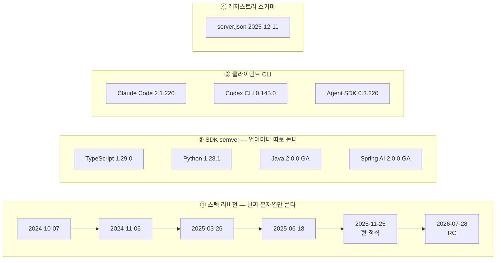

# 1장. "MCP 2.0"은 없다 — 그리고 왜 아직도 MCP인가

"MCP 2.0"을 검색해보자. 블로그 글이 나오고, 발표 자료가 나오고, "2.0에서 달라진 점 정리" 같은 제목도 나온다. 그런데 그런 스펙은 존재하지 않는다.

과장이 아니다. 2026년 7월 26일에 스펙 저장소의 `schema/` 디렉토리를 직접 열어보면 안에 든 것은 `2024-11-05`, `2025-03-26`, `2025-06-18`, `2025-11-25`, 그리고 `draft` — 다섯 개뿐이다. 릴리스 태그를 전부 훑어도 `2.0`이라는 이름은 하나도 없다. MCP 스펙은 `2024-10-07` 이후 지금까지 **날짜 문자열만** 리비전 이름으로 써왔다.

그렇다면 사람들이 말하는 그 "2.0"은 대체 무엇을 가리키는 말일까? 그리고 왜 같은 검색 결과에 "MCP는 죽었다"는 글까지 섞여 나올까? 첫 서버 코드를 한 줄이라도 쓰기 전에 이 두 가지를 정리하고 넘어가는 편이 낫다. 그러지 않으면 남은 열한 장을 내내 "내가 지금 맞는 걸 배우고 있나" 하는 의심을 안고 읽게 된다.

## 혼동은 어디서 시작되는가

첫 번째 경로는 어이없을 만큼 단순하다. 모든 리비전의 스키마 파일에 이런 상수가 들어 있다.

```
JSONRPC_VERSION = "2.0"
```

이 `"2.0"`은 MCP 버전이 아니라 **JSON-RPC 2.0** 스펙의 버전이다. MCP가 JSON-RPC 위에 얹혀 있으니 당연히 들어 있는 값이고, 리비전이 몇 번을 바뀌어도 이 줄은 그대로다. 코드를 읽다 이걸 보고 "아, 지금 2.0이구나" 하고 넘어갔다면 그 순간 첫 단추가 어긋난 것이다.

두 번째 경로가 진짜 원인이다. **SDK의 메이저 버전이 2.0으로 올라갔다.** 그리고 SDK 버전은 스펙 리비전과 아무 관계가 없는 별개의 숫자다. 여기까지만 알아도 검색 결과의 절반은 해석이 된다.

문제는 실무에서 마주치는 버전 숫자가 이 둘만이 아니라는 데 있다.

## 네 개의 축을 분리하자

MCP를 다루다 보면 서로 다른 네 종류의 버전을 만나게 된다. 이들은 각자의 속도로 움직이고, 서로를 기다려주지 않는다. 이 표가 이 책 전체의 좌표계다.

| 축 | 무엇의 버전인가 | 2026-07-26 관측값 |
|---|---|---|
| **① 스펙 리비전** | 프로토콜 자체 | 정식 `2025-11-25` / 차기 `2026-07-28`은 RC |
| **② SDK semver** | 언어별 구현 라이브러리 | TS `1.29.0` · Python `1.28.1` · Java `2.0.0` · Spring AI `2.0.0` |
| **③ 클라이언트 CLI** | 서버를 붙여 쓰는 도구 | Claude Code `2.1.220` · Codex CLI `0.145.0` · Agent SDK `0.3.220`/`0.2.128` |
| **④ 레지스트리 스키마** | `server.json` 형식 | `2025-12-11` |


그림 1. 네 개의 버전 축 — 나란히 흐르지만 서로 만나지 않는다 (2026-07-26 관측 기준)

축을 섞으면 어떤 일이 벌어질까? "최신 SDK를 썼으니 최신 스펙이겠지"라고 넘겨짚는 순간, 실제로는 한 세대 전 리비전으로 통신하는 서버를 만들어놓고 왜 안 되는지 몰라 헤매게 된다. 잊지 말자. **숫자가 크다고 최신이 아니다. 어느 축의 숫자인지부터 확인해야 한다.**

## 그런데 "2.0"은 실재한다 — SDK 세대로서

여기서 오해를 하나 풀어야 한다. "MCP 2.0 스펙은 없다"는 말이 "2.0이라는 건 다 헛소문이다"라는 뜻은 아니다. SDK 축에서 2.0은 분명히 존재하고, 그것도 아주 큰 사건이다. 다만 **언어마다 성숙도가 전혀 다르다.**

| SDK | 2.0의 상태 | 시점 | 실제로 구현하는 스펙 |
|---|---|---|---|
| Java (`io.modelcontextprotocol.sdk:mcp`) | **2.0.0 GA** | 2026-06-11 | **`2025-11-25`** (릴리스 노트 명시) |
| Spring AI (`spring-ai-starter-mcp-*`) | **2.0.0 GA** | 2026-06-12 | `2025-11-25` 계열 |
| TypeScript (신규 스코프 패키지) | `2.0.0-beta.5` | 2026-07-21 | 런타임은 `2025-11-25`까지 협상 |
| Python (`mcp`) | `2.0.0b2` | 2026-07-14 | `2025-11-25`와 `2026-07-28` 병행 |

이 표에서 가장 중요한 칸은 맨 오른쪽이다. **Java SDK 2.0.0은 GA인데 따르는 스펙은 `2025-11-25`다.** 릴리스 노트가 직접 그렇게 쓰고 있다 — *"It tracks the latest 2025-11-25 MCP specification."* 숫자만 보고 "2.0이니까 최신 스펙이겠지" 했다면 정반대로 읽은 셈이다.

TypeScript와 Python도 같은 `2.0`이라는 숫자를 달고 있지만 속은 또 다르다. 2026-07-26 관측 시점에 TS `2.0.0-beta.5` 패키지의 런타임 번들을 풀어 상수를 읽어보면 `SUPPORTED_PROTOCOL_VERSIONS` 목록에 `2026-07-28`이 **들어 있지 않았다.** 패키지 안에 그 문자열이 210회나 등장하지만 전부 JSDoc 주석이다. 즉 그 시점의 TS 2.0 베타는 새 리비전을 향해 설계되고 있었을 뿐, 와이어 위에서 그것을 제안하지는 않았다. 반면 Python `mcp-types 2.0.0b2`는 `MODERN_PROTOCOL_VERSIONS = ("2026-07-28",)`을 런타임 상수로 못 박아두었다. 설계도는 양쪽에 다 있었지만, 차가 실제로 다리를 건너고 있던 건 Python 쪽뿐이었다.

그러니 "생태계가 2.0으로 넘어갔다"는 한 문장으로 뭉뚱그리지 말자. 세 가지 사실 — Java·Spring AI는 GA다 / TS·Python은 그 시점에 프리릴리스였다 / 같은 2.0이라도 구현하는 스펙이 다르다 — 는 각각 따로 서 있어야 한다. 하나로 묶는 순간, 3장에서 "TypeScript는 1.x가 프로덕션 지원 라인"이라는 말을 만나고 독자는 되묻게 된다. 그래서 2.0을 쓰라는 거야, 말라는 거야?

## "MCP는 죽었다"는 무슨 말인가

버전 혼동을 걷어내도 검색 결과에는 더 불편한 게 남아 있다. "MCP는 죽었다, CLI 만세" 류의 글이다. 이걸 그냥 어그로라고 넘겨도 될까? 그러기엔 규모가 좀 크다.

해커뉴스에서 이 논쟁을 다룬 대형 스레드를 점수 순으로 늘어놓으면 이렇다. "I still prefer MCP over skills"가 460점·375댓글(2026-04-10), "When does MCP make sense vs CLI?"가 447점·284댓글(2026-03-01, 원제는 "MCP is dead, long live the CLI"), "MCP is dead?"가 400점·410댓글(2026-05-29). 여기에 300점 안팎 스레드가 둘 더 붙는다. **2026년 2월부터 5월까지 넉 달 연속**이다. 단발성 백래시라면 이렇게 규칙적으로 재발하지 않는다.

회의론의 요지는 이렇다. 우리에겐 이미 curl과 HTTP와 OpenAPI가 있었고, 커맨드라인 도구는 파이프로 자유롭게 조합된다. 그런데 MCP는 모든 조합이 모델을 한 번 거쳐야 하고, 서버를 붙일수록 모델이 읽어야 할 도구 설명이 늘어난다. 게다가 서버 하나가 늘어나는 건 샌드박스 밖으로 나갈 통로가 하나 늘어나는 일이기도 하다. 실제로 MCP 서버를 쓰다가 CLI 도구를 직접 만들어주는 쪽으로 갈아탄 개발자들이 있고, 그들은 그쪽이 더 쉬웠다고 말한다. (도구가 컨텍스트를 얼마나 먹는가는 숫자로 따져야 할 문제인데, 그 계산은 7장에서 제대로 하자.)

반론도 만만치 않다. 가장 먼저 나오는 건 **CLI가 아예 존재할 수 없는 자리**에 대한 지적이다.

> "I have a couple MCP servers connected to my **Claude web & mobile** clients. **How would your clis work there?**" — 0x696C6961

웹과 모바일에는 셸이 없다. 사내 업무 담당자에게 "에이전트 만들 때 CLI를 쓰세요"라고 말할 수도 없다. 그리고 조직 규모가 커지면 도구를 어떻게 배포하고 갱신할지가 문제가 되는데, MCP는 거기에 표준 답을 준다.

가장 프레임을 크게 뒤집는 관점은 이것이다.

> "**MCP exists to take capability away from agents** ... tightly allowlist what the agent is capable of executing" — bb88

MCP를 "에이전트에게 능력을 주는 장치"로 생각하면 CLI와 비교당할 수밖에 없다. 그런데 반대로 **능력을 깎아내는 장치**로 보면 이야기가 달라진다. 셸을 통째로 열어주는 대신 내가 허락한 동작만 노출하는 것, 자격 증명을 서버 안에 가둬 개발자도 에이전트도 끝내 보지 못하게 하는 것 — 이게 목적이라면 CLI는 애초에 대안이 아니다. 재미있는 건 bb88이 회의론 쪽에서도 인용되는 인물이라는 점이다. 같은 사람이 각도를 바꿔 양쪽에 다 서 있다.

그리고 논쟁의 온도를 가장 잘 정리한 건 "죽었다"고 쓴 사람 본인이었다.

> "The article title and content is **intentionally provocative**" — ejholmes

국내 실무자들의 감각은 좀 더 실용적이다.

> "개발할때는 쓸만하고 **서비스할때에는 비용문제 때문에 skill정도만** 쓰고있어요" — kaydash

죽었느냐 살았느냐가 아니라 **어느 단계에서 쓰느냐**로 답한 것이다. 이 책은 이쪽 태도를 따른다. 우리가 답해야 할 질문은 "MCP가 옳은가"가 아니라 "내 상황에서 MCP가 맞는 도구인가"다. 그 판단은 한 번 만들어보기 전에는 내려지지 않는다.

## 이 책이 서 있는 자리

혼동을 걷어냈으니 이제 기준을 못 박자.

**이 책의 주 서술 대상은 스펙 `2025-11-25`다.** 오늘 기준으로 유일한 정식 리비전이고, Java SDK 2.0도 Spring AI 2.0도 이것을 구현한다. 예제 코드가 실제로 동작하려면 여기에 서야 한다.

**`2026-07-28`은 12장에 격리한다.** 2026-07-26 시점에 이 리비전은 여전히 RC였다 — 릴리스에 `prerelease` 플래그가 붙어 있고 `schema/2026-07-28/` 디렉토리는 아직 만들어지지 않았다. 정식이 되면 상당히 큰 변화가 온다. 하지만 그 변화를 앞 장들에 섞어 뿌려두면 정식화되는 날 여러 장이 한꺼번에 낡는다. 그래서 한 장에 모아두었다. 중간에 RC 이야기가 스쳐 지나갈 때는 "RC 기준이고 확정 시 달라질 수 있다"는 단서를 함께 달아두었으니, 그 표시가 보이면 12장을 기억하면 된다.

**SDK 버전에 대한 서술은 "권고"가 아니라 "관측"으로 쓴다.** "1.29.0을 써라"가 아니라 "2026-07-26 시점에 dist-tag는 `latest: 1.29.0` 하나뿐이었다"고 쓴다는 뜻이다. 번거로워 보이지만 이유가 있다. 이 원고를 쓰는 지금도 TS와 Python의 2.0 정식은 며칠 안에 나올 수 있다. 관측으로 써두면 그날이 와도 문장이 틀리지 않는다. 독자도 같은 습관을 들이는 편이 낫다 — 어떤 글에서 버전 이야기를 읽든, **그게 언제 관측된 값인지**부터 찾아보자.

### 이 장의 핵심

- "MCP 2.0 스펙"은 존재하지 않는다. 스펙은 `2024-10-07` 이후 날짜 리비전만 써왔고, 코드에 보이는 `JSONRPC_VERSION = "2.0"`은 JSON-RPC의 버전이다.
- 버전 숫자를 만나면 네 축 중 어디인지부터 가른다 — 스펙 리비전 / SDK semver / 클라이언트 CLI / 레지스트리 스키마.
- "2.0"은 SDK 세대로서 실재하되 언어마다 성숙도가 다르다. Java·Spring AI는 GA이면서 `2025-11-25`를 구현하고, TS·Python은 관측 시점에 프리릴리스였다.
- "MCP는 죽었다" 논쟁은 넉 달 연속 대형 스레드가 이어진 실재하는 논쟁이다. 쟁점은 옳고 그름이 아니라 적용 단계와 환경이다.
- 이 책의 기준은 스펙 `2025-11-25`이고, `2026-07-28`은 12장에 격리했다. SDK 상태는 관측 시점과 함께 서술한다.

---

좌표계는 세웠다. 그런데 좌표계만으로 답이 나오지 않는 질문이 하나 남는다. 논쟁의 양쪽 주장을 다 읽고 나면, 결국 "그래서 내 경우엔 만들 만한가"로 돌아오게 된다.

그건 읽어서 알 수 있는 게 아니다. 만들어봐야 안다. 하나 만들어보고 나서 다시 이 질문으로 돌아오자.
