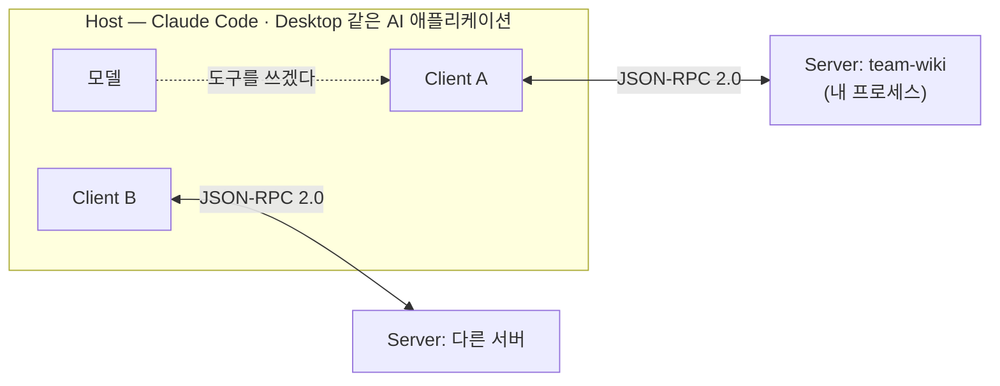
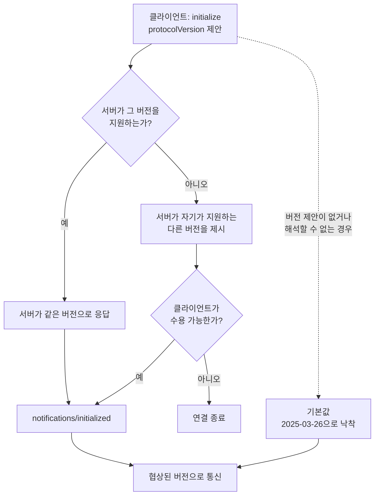

# 2장. 프로토콜 해부 — JSON-RPC 위에 무엇이 얹혀 있나

최신 스펙을 지원한다는 SDK를 받아서 서버를 띄웠다. 그런데 로그를 열어보니 협상된 프로토콜 버전이 `2025-03-26`이라고 찍혀 있다. 한 세대도 아니고 두 세대나 옛날 것이다. 버그일까?

버그가 아니다. 그렇게 동작하도록 만들어진 것이고, 심지어 SDK 코드에 상수로 박혀 있다. 왜 그런지 이해하려면 클라이언트와 내 서버가 실제로 주고받는 메시지가 어떻게 생겼는지부터 봐야 한다. 이 장을 다 읽고 나면 로그에 찍힌 JSON-RPC 한 줄을 보고 어느 단계에서 어긋났는지 짚어낼 수 있게 된다.

## 세 자리에 앉은 셋

공식 문서는 MCP를 "AI 애플리케이션을 위한 USB-C 포트"라고 소개한다. 감은 오지만 무엇이 표준화됐는지는 알려주지 않는다. 학계 쪽 정의가 훨씬 정확하다.

> "MCP provides a **JSON-RPC client-server interface for secure tool invocation and typed data exchange**."

문장 하나에 이 프로토콜의 정체가 다 들어 있다. **전송 형식은 JSON-RPC 2.0이고, 표준화한 것은 도구 호출과 타입 있는 데이터 교환이다.** 새로운 직렬화 포맷도, 새로운 네트워크 프로토콜도 아니다. 이미 있던 JSON-RPC 위에 "무엇을 어떤 이름으로 주고받을지"를 규정해 얹은 얇은 층이다.

참여자는 셋이다.


그림 1. Host / Client / Server — 클라이언트 하나가 서버 하나를 전담한다

**Host**는 사람이 실제로 켜서 쓰는 애플리케이션이다. 모델을 품고 있고, 서버를 몇 개 붙일지 결정한다. **Client**는 호스트 안에서 서버 하나와 1:1로 연결을 유지하는 부품이다. 서버를 셋 붙이면 클라이언트도 셋이 뜬다. 그리고 **Server**가 우리가 이 책에서 만들 물건이다.

이 구조가 왜 중요할까? 내 서버는 모델과 직접 말하지 않는다. 언제나 클라이언트를 거치고, 클라이언트가 속한 호스트의 정책을 거친다. 8장에서 볼 침묵성 실패의 상당수가 바로 이 중간 층에서 벌어진다.

## 서버가 내놓는 세 가지

서버가 호스트에 제공할 수 있는 것은 세 종류다. 이 세 가지를 **프리미티브**라고 부른다.

| 프리미티브 | 성격 | 주요 메서드 |
|---|---|---|
| `tools` | 모델이 **실행**하는 것 | `tools/list`, `tools/call` |
| `resources` | 모델이 **읽는** 것 | `resources/list`, `resources/read`, `resources/templates/list` |
| `prompts` | 사용자가 **고르는** 것 | `prompts/list`, `prompts/get` |

메서드 이름을 보면 규칙이 보인다. 목록을 받는 `list`, 실제로 쓰는 `call`·`read`·`get`. 서버 개발자가 하는 일은 결국 이 몇 개의 요청에 응답 핸들러를 붙이는 것이다. 생각보다 단출하지 않은가?

방향이 반대인 것들도 있다. **서버가 클라이언트에게 요청하는** 메서드들이다. 작업 디렉터리를 물어보는 `roots/list`, 클라이언트의 모델을 빌려 쓰는 `sampling/createMessage`, 사용자에게 되묻는 `elicitation/create`, 그리고 `logging`. 서버가 일방적으로 응답만 하는 존재가 아니라는 뜻이다.

다만 이 반대 방향 기능들에는 단서가 붙는다. 차기 리비전 `2026-07-28`은 아직 RC이지만, 여기서 이 기능들의 지위가 달라진다. 지금 새로 배우기 시작한다면 이쪽에 시간을 크게 쏟지 않는 편이 낫다. 무엇이 어떻게 되는지는 12장에서 따로 정리한다.

> 보안 이야기를 조금 앞당겨 해두자. 서버가 만드는 공격면은 도구만이 아니다. **리소스와 프롬프트도 각각 구조적인 취약점을 가진다.** 위협을 검토할 때 셋을 따로 놓고 봐야 한다는 뜻인데, 이 이야기는 7장에서 본격적으로 한다.

## 악수 없이는 아무것도 시작되지 않는다

연결이 열리면 가장 먼저 일어나는 일이 **핸드셰이크**다. 순서는 이렇다.

1. 클라이언트가 `initialize`를 보낸다 — 자기가 지원하는 프로토콜 버전과 capability를 실어서
2. 서버가 응답한다 — 자기가 선택한 버전과 capability를 실어서
3. 클라이언트가 `notifications/initialized`를 보낸다 — 이제 시작해도 좋다는 신호

capability 교환이 여기서 끝난다는 게 핵심이다. 서버가 도구를 제공한다고 이 단계에서 말하지 않으면, 클라이언트는 이후로 `tools/list`를 아예 부르지 않는다. 도구 코드를 아무리 잘 짜놨어도 소용이 없다.

그리고 여기서 아까의 `2025-03-26`이 튀어나온다. TypeScript SDK `1.29.0`(2026-03-30 기준)의 타입 파일을 열어보면 이런 상수 셋이 있다.

```js
LATEST_PROTOCOL_VERSION = '2025-11-25'
DEFAULT_NEGOTIATED_PROTOCOL_VERSION = '2025-03-26'
SUPPORTED_PROTOCOL_VERSIONS = ['2025-11-25', '2025-06-18', '2025-03-26', '2024-11-05', '2024-10-07']
```

읽어보자. 이 SDK가 **아는 최신은 `2025-11-25`**이고, **협상할 수 있는 목록은 다섯 개**다. 그런데 세 번째 상수, 협상이 어긋났을 때 떨어지는 기본값은 최신이 아니라 **`2025-03-26`**이다. Python SDK `1.28.1`(2026-06-26 기준)도 같은 값을 쓴다.


그림 2. `initialize` 버전 협상 — 성공 경로와 fallback 분기

"왜 내 서버가 구버전으로 붙지?"의 답이 여기 있다. 최신 SDK를 썼다는 사실과 최신 리비전으로 협상됐다는 사실은 별개다. 양쪽 중 한쪽이 버전을 제대로 싣지 못하면 조용히 두 세대 전으로 떨어진다. 에러가 뜨지 않으니 더 얄궂다. 로그에서 협상 결과를 직접 확인하는 습관을 들이자.

## 버전 문자열을 부등호로 비교하지 마라

리비전 이름이 전부 날짜꼴이다 보니 이런 코드를 짜고 싶어진다.

```js
if (peerVersion >= '2025-11-25') { /* 신 기능 사용 */ }
```

편해 보이는데, 하면 안 된다. 공식 SDK가 주석으로 직접 경고하고 있다.

> "Date-string protocol revisions happen to sort lexicographically, but versions are an **enumerated set, not an ordered scalar**: future identifiers are not guaranteed to be date-shaped, and unrecognized peer strings must compare conservatively instead of accidentally (e.g. `"zzz" > "2025-11-25"`)."

날짜처럼 생긴 건 **우연**이라는 것이다. 앞으로 나올 식별자가 날짜꼴이라는 보장이 없고, 상대가 보낸 알 수 없는 문자열이 사전순으로 최신보다 커버릴 수도 있다. 인용문의 `"zzz"`가 바로 그 사례다. 사전순으로 비교하면 `"zzz"`가 `"2025-11-25"`보다 크다. 그 코드는 정체불명의 상대에게 최신 기능을 켜준다. 아찔하지 않은가?

**리비전은 순서 있는 스칼라가 아니라 열거된 집합이다.** 아는 값 목록에 있는지 확인하는 방식으로 다루자. 이건 취향 문제가 아니라 SDK 저자가 못 박아둔 규율이다.

## 어디로 흐르는가 — 트랜스포트 세 가지

메시지가 오가는 통로는 세 종류이고, 지위가 서로 다르다.

| 트랜스포트 | 지위 (2026-07-26 기준) |
|---|---|
| **stdio** | 전 리비전 지원. 로컬 프로세스의 기본 |
| **Streamable HTTP** | `2025-03-26`에서 도입. 현재 권장 |
| **HTTP+SSE** (구) | `2025-03-26`부터 deprecated |

이 책의 러닝 예제는 stdio로 시작한다. 클라이언트가 내 서버를 자식 프로세스로 띄우고, 표준 입출력으로 JSON-RPC를 주고받는 방식이다. 설치도 인증도 필요 없어서 첫 서버로는 이만한 게 없다.

대신 stdio에는 구조적인 약점이 넷 있다. 미리 알아두면 나중에 덜 헤맨다.

첫째, **stdout이 프로토콜 채널이다.** `2025-11-25`가 명시적으로 정리했듯이 stdio 서버는 모든 로깅에 stderr를 쓸 수 있다. 뒤집으면 stdout에는 JSON-RPC 말고 아무것도 나가면 안 된다는 뜻이다. 이게 서버 개발자가 가장 많이 밟는 지뢰인데, 8장에서 제대로 다룬다.

둘째, **분산 추적 컨텍스트를 실을 자리가 없다.** HTTP라면 헤더에 넣으면 될 것을, stdio에는 헤더가 없다. 파라미터나 환경변수로 손수 넘겨야 한다.

셋째, **프로세스 생명주기 관리가 클라이언트 몫이다.** 클라이언트가 제대로 정리해주지 않으면 좀비 프로세스가 남고 메모리가 샌다.

넷째, **끊겼을 때의 동작이 문서와 실제가 어긋난 이력이 있다.** HTTP 계열은 재연결을 시도하지만 stdio는 그렇지 않다. 이 차이도 4장에서 실물 설정과 함께 다시 본다.

## `2025-11-25`가 가져온 것

이 책의 기준 리비전이 직전 세대에서 무엇을 바꿨는지 훑어두자. 지금 전부 이해할 필요는 없고, 나중에 "이 기능 언제 들어왔지?" 싶을 때 돌아올 수 있으면 된다.

- **인증 쪽:** OpenID Connect Discovery 지원, `WWW-Authenticate` 기반 incremental scope consent, OAuth Client ID Metadata Documents를 권장 등록 방식으로 채택
- **표현 쪽:** 도구·리소스·템플릿·프롬프트에 **icons** 메타데이터 추가, elicitation 개편(단일·다중 선택), URL 방식 elicitation 추가
- **실행 쪽:** sampling에 **도구 호출 지원** 추가, **tasks 실험적 도입**(폴링으로 지연된 결과 회수)

그리고 사소해 보이지만 서버 개발자에게 직접 영향을 주는 변경이 다섯 있다. **stdio 서버의 stderr 로깅 허용**, **JSON Schema 2020-12를 기본 dialect로 채택**, **잘못된 `Origin` 헤더에 HTTP 403 응답**, **SDK 티어링 시스템** 도입, 그리고 **입력 검증 오류의 처리 방식 변경**이다.

마지막 하나가 특히 중요하다. **입력 검증 오류는 Protocol Error가 아니라 Tool Execution Error로 돌려주라**는 규정이다. 왜 이렇게 바뀌었을까? Protocol Error로 던지면 대화가 거기서 끊긴다. 반면 Tool Execution Error로 돌려주면 모델이 그 메시지를 읽고 **스스로 인자를 고쳐 다시 호출**할 수 있다. 사람이 개입하지 않아도 복구되는 것이다. 3장에서 이 규정을 코드로 시연한다.

### 이 장의 핵심

- MCP는 JSON-RPC 2.0 위에 얹힌 얇은 층이다. 표준화한 것은 도구 호출과 타입 있는 데이터 교환이며, Host / Client / Server 3자 구조로 동작한다.
- 서버가 내놓는 프리미티브는 `tools`·`resources`·`prompts` 셋이고, 반대 방향 기능(roots·sampling·elicitation·logging)도 있으나 일부는 RC에서 deprecated 됐다.
- capability는 `initialize` 한 번에 결정된다. 여기서 선언하지 않은 기능은 이후로 호출되지 않는다.
- 협상 실패 시 기본값은 최신이 아니라 `2025-03-26`이다. "왜 구버전으로 붙지?"의 정체가 이것이다.
- 리비전은 열거된 집합이지 순서 있는 스칼라가 아니다. 버전 문자열을 부등호로 비교하지 말자.

---

핸드셰이크가 끝나면 클라이언트가 묻는다. 그래서, 무엇을 할 수 있지? 이제 그 질문에 답할 차례다.
