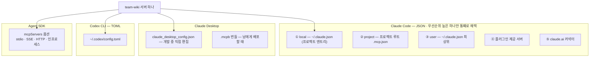

# 4장. 클라이언트에 붙이기 — Claude Code·Desktop·Agent SDK·Codex

같은 서버, 같은 설정 파일. 터미널에서 실행한 CLI에서는 도구가 멀쩡히 뜬다. 그런데 에디터 확장에서는 아무것도 뜨지 않는다. 설정을 세 번 다시 읽어봐도 오타는 없다.

이런 상황을 실제로 겪은 사람이 한둘이 아니다. 원인은 대개 서버가 아니라 **서버를 띄우는 쪽**에 있다. 3장에서 만든 `team-wiki`를 여러 클라이언트에 붙여보면서, 같은 서버가 왜 클라이언트마다 다르게 동작하는지 지형을 파악해보자. 이걸 버그가 아니라 지형으로 읽을 수 있게 되는 게 이 장의 목표다.

## Claude Code에 붙이기

가장 짧은 경로부터 보자.

```bash
claude mcp add team-wiki -- node /절대/경로/build/index.js
```

문법은 `claude mcp add [options] <name> -- <command> [args...]`다. 여기서 `--`가 결정적이다. 공식 문서 표현으로 그 뒤는 **"passed to the server untouched"** — 서버 실행 커맨드로 손대지 않고 그대로 넘어간다. 서버에 플래그를 넘겨야 한다면 전부 `--` 뒤에 둔다.

옵션은 이렇다.

| 옵션 | 값 | 비고 |
|---|---|---|
| `-s, --scope` | `local` \| `user` \| `project` | **기본값 `local`** |
| `-t, --transport` | `stdio` \| `sse` \| `http` | 미지정 시 stdio |
| `-e, --env` | `KEY=VALUE` | 여러 개 지정 가능 |
| `-H, --header` | `헤더: 값` | 원격 서버용 |
| OAuth 계열 | `--client-id`, `--client-secret`, `--callback-port` | 시크릿은 `MCP_CLIENT_SECRET`으로도 |

원격 서버를 붙일 때는 이런 모양이 된다.

```bash
claude mcp add --transport http sentry https://mcp.sentry.dev/mcp
```

설정 파일에 직접 쓸 때 알아두면 좋은 게 하나 있다. **`type` 필드는 `streamable-http`를 `http`의 별칭으로 받는다.** 스펙이 쓰는 이름과 클라이언트가 쓰는 이름이 달라서 생긴 흡수 조치인데, 어느 쪽으로 적어도 동작한다.

## 스코프는 3단계가 아니라 5단계다

여기가 이 장에서 가장 많은 사고가 나는 지점이다.

같은 이름의 서버가 여러 곳에 정의돼 있으면 Claude Code는 **우선순위가 가장 높은 한 곳의 정의만 골라 쓴다.** 순서는 이렇다.

① Local scope → ② Project scope → ③ User scope → ④ 플러그인이 제공하는 서버 → ⑤ claude.ai 커넥터

블로그 글에서 흔히 보는 "local > project > user" 3단계는 **절반만 맞는 이야기다.** 플러그인과 커넥터 계층이 빠져 있다. 그리고 중복을 판정하는 기준도 다르다. **앞의 세 스코프는 이름으로 중복을 가리고, 플러그인과 커넥터는 엔드포인트로 가린다.**

그런데 실무에서 정말 중요한 건 따로 있다. 공식 문서 원문을 그대로 옮긴다.

> "The entire server entry from that source is used; **fields are not merged across scopes.**"

**필드는 스코프를 넘어 병합되지 않는다.** 이게 무슨 뜻일까? user 스코프에 `team-wiki`를 환경변수까지 넣어 잘 등록해뒀다고 하자. 그런데 어느 프로젝트에서 커맨드만 바꾸려고 local 스코프에 같은 이름으로 하나 더 추가했다. 이때 user 쪽 환경변수가 함께 적용될까? 안 된다. local 엔트리가 통째로 이기고, user 쪽에 적어둔 환경변수는 통째로 사라진다. 설정을 겹쳐 쓰는 습관이 있다면 이 규칙 하나로 몇 시간을 아낄 수 있다.

저장 위치는 이 표 하나로 정리된다.

| 스코프 | 저장 위치 | 공유 범위 |
|---|---|---|
| `local` (기본) | `~/.claude.json`의 해당 프로젝트 엔트리 아래 | 나만, 이 프로젝트에서만 |
| `project` | 프로젝트 루트의 `.mcp.json` | 이 저장소를 클론한 모두 |
| `user` | `~/.claude.json`의 최상위 `mcpServers` 키 | 나만, 모든 프로젝트에서 |
| — | ⚠️ `~/.claude/.mcp.json`, `~/.claude/mcp.json`, `%APPDATA%\Claude\mcp.json` | **읽지 않는다** (흔한 오설정) |

윈도우에서 `~/.claude.json`은 `%USERPROFILE%\.claude.json`이다. 마지막 줄이 특히 중요하다. 그럴듯한 경로에 파일을 만들어두고 왜 안 읽히는지 몰라 헤매는 경우가 많다.


그림 1. 클라이언트별 설정 지형 — 서버는 하나인데 붙는 자리는 저마다 다르다

## 어제는 됐는데 오늘은 안 보인다

스코프가 만드는 가장 흔한 사고가 이것이다.

`--scope`를 지정하지 않고 서버를 추가하면 기본값이 `local`이다. 그리고 local 스코프는 **추가한 디렉터리에 묶인다.** 정확히는 저장소 루트, 깃 저장소가 아니라면 그 디렉터리 자체다. 그러니 다른 프로젝트에서 클로드를 켜면 어제 잘 되던 서버가 감쪽같이 사라져 있다. 설정 파일은 그대로인데 말이다. 답답할 노릇이지만 버그가 아니라 설계다.

해법은 목적에 따라 갈린다. 나 혼자 어디서나 쓸 도구라면 `--scope user`, 팀 전체가 이 저장소에서 쓸 도구라면 `--scope project`다.

그런데 `project` 스코프를 고르는 순간 함께 따라오는 게 있다. **`.mcp.json`을 커밋한다는 건 임의의 프로세스 실행 커맨드를 커밋한다는 뜻이다.** 저장소를 클론한 사람의 기계에서 그 커맨드가 실행된다. 아찔한 이야기 아닌가? 그래서 Claude Code는 이 경로를 조여왔다.

- **v2.1.154**부터 팀원 환경에서 커밋된 서버가 `⏸ Pending approval`로 표시된다 — 자동으로 붙지 않고 승인을 기다린다.
- **v2.1.196**부터 저장소가 자기 자신의 설정을 자기가 승인하는 경로가 차단됐다.

두 변경은 별개의 릴리스에서 온 별개의 조치다. 한 문장으로 뭉뚱그리지 말고 각각 기억해두자.

연결 동작에 관한 노브도 몇 개 알아두면 좋다. 설정에 `"timeout": 600000`(밀리초)을 줄 수 있고, HTTP·SSE 계열에는 **첫 응답 바이트까지 60초**를 재는 별도 타이머가 따로 있다. 끊겼을 때 HTTP·SSE는 1초에서 시작해 2배씩 늘리는 지수 백오프로 **최대 5회** 재연결을 시도한다. 그런데 **stdio는 자동으로 재연결하지 않는다.** 로컬 서버가 죽으면 죽은 채로 있다. 이 비대칭은 8장에서 다시 만난다.

## Claude Desktop — 경로가 둘인데 목적이 다르다

Desktop에 붙이는 방법은 두 가지이고, **어느 쪽이 공식이냐는 질문은 잘못됐다.** 둘 다 공식이고 대상이 다르다.

**개발 중 내 서버를 붙일 때는 설정 파일을 직접 편집하는 편이 낫다.** 코드를 고치고 다시 붙이기를 수십 번 반복하게 되는데, 그때 JSON 한 줄 고치는 게 가장 빠르다. 절차는 이렇다.

1. **시스템 메뉴 바의 Claude 메뉴** → Settings… — 공식 문서가 굵게 경고하는 지점이다. *"not the settings within the Claude window itself."* 창 안의 설정이 아니라 화면 맨 위 메뉴 바다. 가장 많이 헤매는 곳이니 잊지 말자.
2. 좌측 사이드바 Developer 탭 → Edit Config 버튼
3. JSON 편집
4. 완전히 종료했다가 다시 시작

설정 파일 경로는 macOS가 `~/Library/Application Support/Claude/claude_desktop_config.json`, 윈도우가 `%APPDATA%\Claude\claude_desktop_config.json`이다. **리눅스 경로는 없다** — 공식 문서 표현으로 *"not yet available on Linux."* 그럴듯한 경로를 짐작해 만들어봐야 소용없다.

내용은 이렇게 생겼다. 확인된 필드는 `command`·`args`·`env` 셋이다.

```json
{
  "mcpServers": {
    "team-wiki": {
      "command": "node",
      "args": ["/절대/경로/build/index.js"]
    }
  }
}
```

윈도우에서는 경로의 백슬래시를 이중으로 쓴다(`C:\\Users\\...`). 그리고 문서의 보안 경고를 그대로 옮겨둔다.

> "**The server runs with your user account permissions, so it can perform any file operations you can perform manually.**"

등록이 됐는지 확인하려면 입력창 좌하단에서 **Connectors → Manage connectors**로 들어간다. 오래된 자료에 나오는 "망치 아이콘"은 낡은 표현이니 그 안내를 따라 헤매지 말자.

붙지 않을 때는 8장으로 가면 된다. 로그를 어디서 찾고 어떻게 읽는지, 어떤 순서로 범위를 좁히는지 전부 거기에 모아두었다.

**남에게 배포할 때는 `.mcpb` 번들이 답이다.** 사용자가 JSON을 만질 필요가 없기 때문이다. 설치 경로는 셋 — 파일 더블클릭, 창에 드래그 앤 드롭, Settings → Extensions에서 설치 — 이고, 자료에서 `.dxt`라는 확장자를 만나면 **구버전 표기**라고 보면 된다(DXT에서 MCPB로 개명됐다). 다만 이건 2차 배포 경로이며, 번들을 어떻게 만드는지는 9장에서 다룬다.

## Claude Agent SDK — 서버를 프로세스 밖에 둘 필요가 있을까

에이전트를 직접 코드로 만든다면 Agent SDK에도 서버를 붙일 수 있다. 설정은 `mcpServers` 옵션 하나로 들어가고, 받을 수 있는 형태는 네 가지다(TS `0.3.220` / Python `0.2.128`, 2026-07 기준).

셋은 지금까지 본 것과 같다 — stdio·SSE·HTTP. 나머지 하나가 다르다. `createSdkMcpServer`(Python은 `create_sdk_mcp_server`)로 도구를 정의하면 **별도 프로세스 없이 같은 프로세스 안에서** MCP 서버가 동작한다.

이건 언제 쓸까? 프로세스 경계를 넘지 않으니 stdout 오염 걱정이 없고, 실행 파일 경로나 PATH 문제도 없다. 기동도 빠르다. 대신 잃는 것도 분명하다. **그 도구는 그 애플리케이션 안에서만 산다.** Claude Code에도 Desktop에도 붙일 수 없고, 남에게 줄 수도 없다. 언어도 호스트와 같아야 한다.

그러니 판단 기준은 단순하다. 여러 클라이언트에서 쓰거나 남에게 배포할 물건이라면 별도 프로세스 서버로, 이 에이전트 안에서만 쓸 도구라면 인프로세스로 만드는 편이 낫다. 참고로 Agent SDK는 아직 0.x이고 릴리스 간격이 며칠 단위다. 시그니처를 확인할 때는 버전을 함께 적어두자.

## Codex CLI — 같은 개념, 다른 문법

다른 코딩 에이전트도 대개 같은 개념을 쓴다. Codex CLI(`0.145.0` 기준)에는 `codex mcp` 아래에 `list`·`get`·`add`·`remove`·`login`·`logout`이 있다. Claude Code와 서브커맨드 구성이 거의 겹친다.

다른 건 설정 파일이다. Claude Code가 JSON을 쓰는 자리에서 Codex는 **`~/.codex/config.toml`**, 즉 TOML을 쓴다. 같은 서버를 두 도구에 붙이려면 같은 내용을 두 문법으로 각각 써야 한다는 뜻이다.

## "build once, integrate everywhere"의 실제

공식 문서는 MCP를 "한 번 만들어 어디에나 붙인다"고 소개한다. 절반은 사실이다. 프로토콜은 같다. 서버 코드를 클라이언트마다 다시 짤 필요는 없다.

나머지 절반은 그렇게 매끄럽지 않다. 설정 파일 형식이 갈리고, 지원하는 기능이 갈리고, 심지어 같은 서버가 같은 기계에서 다르게 동작하기도 한다. 실제로 보고된 사례 둘만 보자.

**윈도우에서 같은 설정, 다른 결과.** VS Code 확장에서는 stdio 서버 기동이 실패하는데 CLI에서는 정상 동작한 사례가 있다(2026-06-08 보고). 원인은 서버가 아니라 **PATH 상속 차이**였다. 확장이 물려받은 환경과 셸이 물려받은 환경이 달랐던 것이다. 억울한 종류의 실패다 — 내 코드에는 손댈 곳이 없다.

**클라이언트 이름 때문에 등록이 거부되기도 한다.** Desktop이 동적 클라이언트 등록에서 자기 이름을 `"Claude Desktop (…)"` 형태로 보내는데, 이 값 때문에 특정 원격 서버가 403으로 거부한 사례가 있다(2026-07-06 보고). 같은 서버를 CLI로 붙이면 `"Claude Code"`가 전달돼 성공했다. 서버도 내 설정도 문제가 없는데 **클라이언트가 자기를 어떻게 소개하느냐**가 결과를 갈랐다.

이런 종류의 어긋남은 또 있다. 확장으로 설치한 도구가 한쪽 UI에서만 보이는데 양쪽 다 "연결됨"이라고 표시된 경우도 보고돼 있다.

여기서 얻을 교훈은 "MCP는 별로다"가 아니다. **한 클라이언트에서 됐다고 다른 클라이언트에서 된다고 가정하지 말자**는 것이다. 배포할 서버라면 실제로 붙일 클라이언트마다 한 번씩 확인해보는 편이 낫다.

이제 `team-wiki`가 진짜로 동작한다. 검색을 시키면 결과가 오고, 문서를 달라고 하면 본문이 온다. 만들고 붙여서 확인하는 한 바퀴가 여기서 닫혔다.

다음은 같은 서버를 다른 언어로 옮길 차례다. Python으로 만들면 무엇이 같고 무엇이 달라질까?
