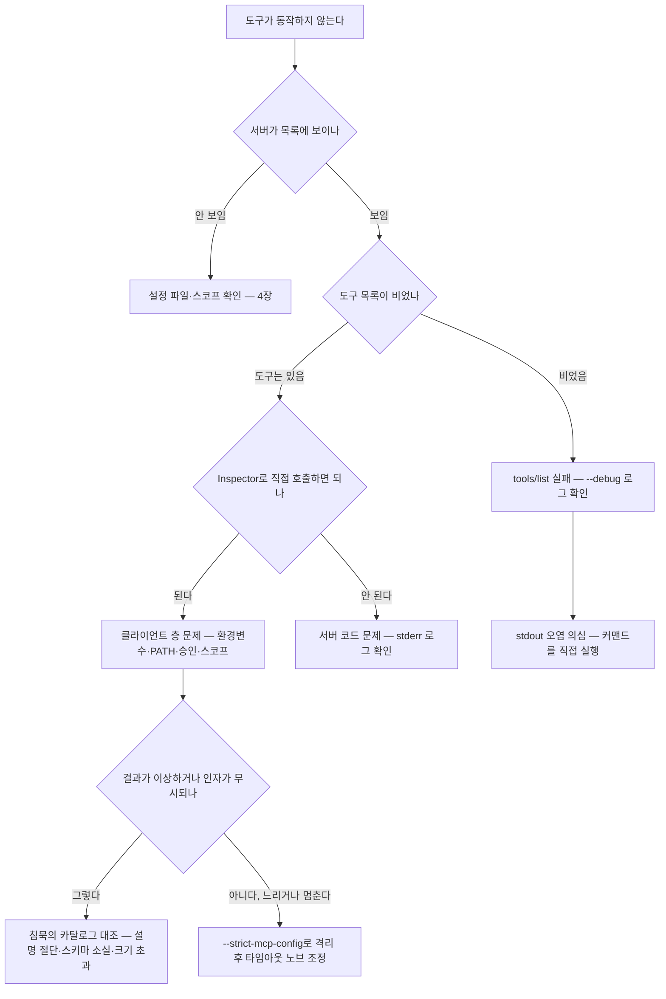

# 8장. 침묵과 진단 — 에러 없이 실패하는 MCP를 보이게 만들기

10,780자짜리 도구 설명이 2,048자에서 잘렸다. 81%가 사라졌다. 서버는 그 사실을 끝내 듣지 못했다.

2026-07-26에 올라온 한 이슈(claude-code #81268, v2.1.220 기준, open)가 이 현상을 실측했다. 확인된 절단만 502건이고, 영향받은 목록에는 Anthropic 자체 커넥터도 들어 있다. 이슈 본문의 한 줄이 이 장 전체를 요약한다.

> "the server is **never told it happened**: no error, no field in the response, no warning."

에러도, 응답의 필드도, 경고도 없다. 더 얄궂은 건 `/mcp` 화면이 **잘리지 않은 원문**을 보여준다는 점이다. 눈으로 확인하려고 들어간 그 화면이 오히려 "멀쩡하다"고 말해준다.

초보자는 에러 메시지 읽는 법을 배운다. MCP 서버를 만드는 사람은 **아무 일도 일어나지 않은 것처럼 보이는 상황을 의심하는 법**을 배워야 한다. 이 장은 그 훈련이다.

## 침묵의 카탈로그

먼저 어떤 것들이 조용히 사라지는지 목록으로 알아두자. 알고 나면 증상을 만났을 때 후보를 좁히는 속도가 달라진다.

- **설명이 2,048자에서 잘린다.** 앞서 본 그 케이스다. 도구 설명과 지침을 정성껏 길게 쓴 서버일수록 크게 당한다. 7장에서 "설명은 짧고 정확하게"라고 한 이유가 이것이다.
- **도구 목록이 두 번째 페이지부터 사라진다.** `tools/list`의 페이지네이션에서 2페이지 이후가 조용히 드롭되던 문제가 있었다(v2.1.144에서 수정). 도구를 많이 만든 서버라면 반드시 밟게 되는 지뢰다.
- **`Optional[X]`가 통째로 뭉개진다.** Python으로 서버를 짜다 보면 자연스럽게 쓰게 되는 그 타입이다. 생성되는 `anyOf [X, null]` 스키마가 모델에 도달하기 전에 제거되는 문제가 보고돼 있다(#56263, 2026-05-05, open). 5장에서 예고했던 함정이 바로 이거다. 서버는 스키마를 정확히 만들어 보냈고, 모델은 그 스키마를 못 받았다. 양쪽 다 잘못한 게 없는데 결과가 틀린다.
- **입력 스키마가 16KB를 넘으면 도구가 드롭된다**(#77296, 2026-07-13). 중첩이 깊은 객체를 인자로 받는 도구가 여기 걸린다.
- **헤드리스에서는 연결 실패조차 신호가 없다**(#43968, 2026-04-05). 대화형 화면이 없으니 "안 붙었다"는 표시를 보여줄 곳도 없다.

그리고 이 장의 논지 한복판에 있는 사례가 하나 더 있다. 토큰은 맞는데 401이 나는 경우다. 원인은 설정값 앞뒤에 붙은 **눈에 보이지 않는 공백**이다. 문자 그대로 보이지 않는다. 값을 복사해 붙여 넣고, 눈으로 열 번을 확인하고, 다시 발급받아 넣어도 똑같이 401이다. 클라이언트가 이 경우에 경고를 띄우기 시작한 건 v2.1.219부터다. 그 전까지는 순전히 의심의 영역이었다.

## `✓ Connected`는 거짓말을 한다

이제 가장 많이 속는 표시를 보자.

`claude mcp list`를 쳤을 때 나오는 `✓ Connected`는 **핸드셰이크가 성공했다**는 뜻이지, 도구를 쓸 수 있다는 뜻이 아니다. 둘 사이에는 `tools/list`라는 단계가 하나 더 있다. 이 표시가 v2.1.181에서 `! Connected · tools fetch failed`로 갈라진 이유가 여기 있다. 붙긴 붙었는데 도구가 없는 상태를, 그 전에는 표현할 방법이 없었던 것이다.

"왜 내 서버가 안 붙나"라고 물었던 적이 있는가? 그 질문의 상당수는 실은 **"붙었는데 도구가 없다"**였다. 방향이 완전히 다른 질문이다. 전자는 설정과 경로를 보는 일이고, 후자는 서버가 `tools/list`에 무엇을 돌려주는지를 보는 일이다.

이 간극이 얼마나 실질적인 문제인지 가장 정확하게 증언한 사례가 있다(#80996, 2026-07-24, open).

> "our agents' **only inbound-message path is an MCP server**, so a session that resumes with the MCP down is **functionally deaf while looking alive from the outside**."

밖에서 보면 살아 있는데 기능적으로 귀머거리다. 이보다 정확한 표현을 찾기 어렵다. 게다가 `/mcp`는 대화형 전용이라 무인 세션에는 자동 복구 경로가 없다. 그래서 이 팀이 택한 우회책은 "MCP 도구가 없으면 잠깐 재시도하고, 안 되면 생존 신호를 스스로 끄고 턴을 끝내서 외부 감시자가 세션을 통째로 재시작하게 만든다"였다. 그 대가는 이렇게 적혀 있다 — *"~15 min penalty per event"*.

사고 한 번에 15분이다. 침묵의 비용은 이런 식으로 청구된다.

## stdout 함정 — 한 번은 다 당하는 실수

세 번째는 조금 다르다. 침묵이 아니라 소음이 원인이고, 그래서 오히려 잡기 쉽다. 다만 **거의 모두가 한 번은 당한다.**

증상부터 보자. stdio 서버를 붙였는데 이런 것들이 나온다.

```
Parse error: Unexpected token ... '[2m2026-0' ... is not valid JSON
Protocol error: Method not found: notifications/initialized
Connection closed
```

첫 줄의 `[2m`이 힌트다. ANSI 컬러 코드의 일부다. 즉 **누군가 stdout에 색깔 있는 로그를 찍었다.**

원인은 늘 같다. stdio 트랜스포트에서 stdout은 프로토콜 채널인데, 거기에 배너·타임스탬프·컬러 코드·`print()`·의존 라이브러리의 로그가 섞여 들어간 것이다. 특히 안 보이는 두 가지를 의심해보자. **래퍼 셸 스크립트의 출력**과 **셸 시작 파일(`.zshrc` 같은)의 출력**이다. 내 서버 코드에는 `print()`가 한 줄도 없는데 파싱 에러가 난다면 십중팔구 이쪽이다.

해결은 간단하다. 이슈에서 제안된 문서 문구가 그대로 규칙이 된다.

> "**Important:** For stdio MCP servers, stdout is reserved for MCP protocol messages. Do not print banners, logs, or other non-JSON text to stdout. Send diagnostics to stderr instead."

다만 stderr도 공짜는 아니다. stdio 서버의 stderr가 서버당 최대 64MB까지 쌓이던 누수가 v2.1.208에서 수정됐다. 로그를 stderr로 몰아넣는 건 맞지만, 그 양까지 신경 쓰지 않아도 된다는 뜻은 아니다.

## 도구함과 노브

증상을 알았으니 이제 연장을 챙기자.

**MCP Inspector.** `npx @modelcontextprotocol/inspector`로 띄운다. 2026-07-18에 1.0.0이 나왔는데, 직전 버전이 0.22.0(2026-06-04)이었으니 이제 막 1.0에 도달한 셈이다. 서버가 무엇을 노출하는지 눈으로 보고 도구를 직접 호출해볼 수 있다.

그런데 여기에 **구조적 한계**가 하나 있고, 이게 "Inspector에선 되는데 Claude Code에선 안 된다"의 정체다. Inspector는 당신의 서버와 **직접** 말한다. 그 말은 클라이언트가 얹는 층 — 스코프, 환경변수, PATH, 승인 상태 — 을 하나도 재현하지 않는다는 뜻이다. 그럼 Inspector는 쓸모가 없는 걸까? 그렇지 않다. 통과했다는 건 "서버는 멀쩡하다"까지를 알려준다. 나쁜 소식이 아니라 좋은 소식이다. **범위가 절반으로 줄었기 때문이다.**

로그는 어디에 쌓일까? Claude Code는 `~/Library/Caches/claude-cli-nodejs/*/mcp-logs-*/*.jsonl`에 남긴다(macOS, 2.1.220 기준). JSONL이라 `jq`로 바로 걸러 볼 수 있다. Claude Desktop은 `~/Library/Logs/Claude`(Windows는 `%APPDATA%\Claude\logs`)에 두 종류를 남긴다 — `mcp.log`는 연결 일반, `mcp-server-{서버이름}.log`는 그 서버의 stderr다. 앞 절의 stdout 사고를 추적할 때 정확히 이 파일을 본다.

```bash
tail -n 20 -f ~/Library/Logs/Claude/mcp*.log
```

Desktop에서 서버가 안 붙는다면 순서가 정해져 있다. **완전 재시작 → JSON 문법 확인 → 경로가 절대경로인지 확인 → 로그 확인 → 커맨드를 터미널에서 직접 실행해보기.** 마지막 단계가 의외로 많은 걸 잡아준다. 클라이언트가 실행하는 그 커맨드를 손으로 쳐보면, 서버가 시작조차 못 하고 있었다는 게 그냥 보인다.

그다음은 `--debug`다. 실제 출력은 이렇게 생겼다.

```
[DEBUG] MCP server "X": Successfully connected (transport: stdio) in 3727ms
[DEBUG] MCP server "X": Tool 'my_tool' still running (30s elapsed)
[DEBUG] MCP server "X": Tool 'my_tool' failed after 68s: MCP error -32000: Connection closed
```

`MCP error -32000: Connection closed`가 실무에서 가장 자주 보게 될 문자열이다. 외워두면 검색이 빨라진다.

격리 스위치도 둘 있다. `--safe-mode`(v2.1.169)는 CLAUDE.md·플러그인·스킬·훅·MCP를 전부 끄고 기동한다. 이분 탐색의 출발점이다. `--strict-mcp-config`는 지정한 설정만 로드해 특정 서버만 남긴다. 실제 진단에서 서버 11개 전체로는 68초를 넘겨 행이던 것이 하나만 남기니 약 5초로 떨어진 사례가 있다(#68375).

**타임아웃 노브**는 표로 압축해두자. 하나씩 외우기보다 "이런 게 있다"만 알아두고 필요할 때 찾는 편이 낫다.

| 노브 | 도입·수정 버전 | 내용 |
|---|---|---|
| 기본 타임아웃 60초 | v2.1.206 | `request_timeout_ms`가 무시되던 버그가 여기서 수정됐다 |
| 2분 초과 시 자동 백그라운드 | v2.1.212 | `CLAUDE_CODE_MCP_AUTO_BACKGROUND_MS`로 조절·비활성 |
| 원격 서버 5분 무응답 | v2.1.187 | `CLAUDE_CODE_MCP_TOOL_IDLE_TIMEOUT`로 오버라이드 |
| 1000ms 미만 값 무시 | v2.1.162 | 그 전에는 sub-1000ms 설정이 모든 호출을 죽였다 |
| 연결 배치 크기 | — | `MCP_SERVER_CONNECTION_BATCH_SIZE`. 커뮤니티에 돌던 다른 이름은 실측으로 반증됐다 |

이제 이 연장들을 순서로 엮어보자. 침묵을 만났을 때 무엇부터 볼지가 정해져 있으면 한밤중에도 흔들리지 않는다.


그림 1. 침묵 판정 이분 탐색 절차

출발점은 언제나 `--safe-mode`다. 전부 끈 상태에서 하나씩 켜면서 어느 단계에서 증상이 돌아오는지 본다. 진단의 목적은 원인을 맞히는 게 아니라 **범위를 반으로 줄이는 것**임을 기억해두자.

## 관찰성 — 디버깅의 프로덕션 판

지금까지는 내 노트북에서 벌어지는 일이었다. 서버가 팀에, 그리고 프로덕션에 올라가면 같은 문제를 **나 없이** 진단해야 한다. 그게 관찰성이다.

권장할 만한 span 계층은 `session → task → turn → tool.call`이다. 어느 세션의, 어느 작업의, 몇 번째 턴에서 그 도구가 불렸는지가 한 줄로 이어져야 한다.

여기서 stdio에는 구조적 제약이 있다. HTTP 계열은 헤더에 trace context를 실어 자연스럽게 전파하지만, **stdio에는 헤더가 없다.** 그래서 파라미터나 환경변수로 명시적으로 실어 보내야 한다. 번거롭지만 이걸 안 하면 서버 안쪽의 span이 바깥 트레이스와 이어지지 않는다.

클라이언트 쪽에서 켤 수 있는 것도 있다. `OTEL_LOG_TOOL_DETAILS=1`을 주면 도구 결정 이벤트에 파라미터까지 포함된다(v2.1.157). 비용이 궁금하다면 `/usage`가 MCP 서버별로 분해해 보여준다(v2.1.149). 그리고 도구가 많으면 CPU 비용도 든다 — 도구 풀 조립을 캐싱해 최대 7배 빨라진 최적화가 v2.1.208에 들어갔다. 7장에서 도구 개수를 억제하라고 한 이유가 여기서 한 번 더 확인된다.

관찰성이 기본값 쪽으로 옮겨가고 있다는 신호도 있다. 5장에서 봤듯 Python SDK 2.0은 `opentelemetry-api`를 하드 의존성으로 승격시켰다(2.0.0b2 기준). 관찰성이 "여유 있으면 붙이는 것"에서 "패키지에 딸려 오는 것"이 된 셈이다.

마지막으로 관점 하나를 덧붙이고 싶다. **관찰성은 운영 편의가 아니라 공격의 사후 탐지 수단이다.** 로그에 "무엇을 실행했는가"만 남아 있으면, 그 호출이 정당했는지를 나중에 판별할 수 없다. 어떤 컨텍스트가, 어떤 도구 설명이 그 호출을 유발했는지까지 남아야 한다. 7장에서 본 tool poisoning은 코드가 아니라 문자열로 들어오기 때문에, 문자열을 기록하지 않으면 흔적 자체가 남지 않는다.

### 이 장의 핵심

- MCP의 실패는 대개 에러가 아니라 **침묵**으로 온다. 설명 절단, 스키마 소실, 크기 초과 드롭은 모두 아무 신호 없이 일어난다.
- `✓ Connected`는 핸드셰이크 성공일 뿐이다. "안 붙는다"의 상당수는 실은 "붙었는데 도구가 없다"이다.
- stdio에서 stdout은 프로토콜 채널이다. 로그는 전부 stderr로 보내되, 래퍼 스크립트와 셸 시작 파일의 출력까지 의심하자.
- Inspector가 통과했다는 건 "서버는 멀쩡하다"까지다 — 클라이언트 층은 재현되지 않는다. 이 한계가 오히려 범위를 절반으로 줄여준다.
- 관찰성은 편의 기능이 아니다. 어떤 컨텍스트가 그 호출을 유발했는지까지 남겨야 사후 판별이 가능하다.

이제 당신 차례다. 지금 만들고 있는 서버로 이분 탐색을 한 번 돌려보자. `--safe-mode`로 띄워 아무것도 없는 상태를 확인하고, 서버 하나만 붙이고, Inspector로 같은 도구를 불러보고, 로그에 무엇이 남는지 본다. 아무 문제도 없는 서버로 이 절차를 한 번 밟아두는 것 — 그게 이 장에서 가져갈 수 있는 가장 값진 준비다. 정작 침묵이 찾아오는 날, 절차를 처음부터 만들고 있을 여유는 없기 때문이다.
