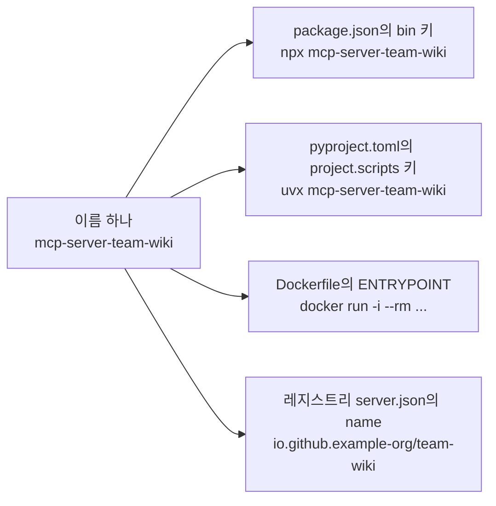

# 9장. 포장해서 남에게 주기 — npm·PyPI·Docker·레지스트리

서버가 내 노트북에서 잘 돈다고 해보자. `team-wiki`가 붙었고, `wiki_search`도 `wiki_get`도 기대한 대로 답한다. 이제 팀에게 줄 차례다.

뭘 주지? 저장소 주소를 슬랙에 던지고 "클론하고 빌드해서 절대경로로 등록하세요"라고 쓰는 순간, 당신은 동료 다섯 명의 오후를 가져간 셈이 된다. 누군가는 Node 버전이 달라서 막히고, 누군가는 경로를 상대경로로 적어서 조용히 실패하고, 누군가는 아예 시도하지 않는다.

우리가 원하는 건 한 줄이다. 설치 커맨드 한 줄, 또는 등록 커맨드 한 줄. 그 한 줄을 만들려면 무엇을 준비해야 할까?

## 이름 하나가 네 갈래를 동시에 정한다

포장 이야기는 보통 "npm은 이렇게, PyPI는 저렇게, Docker는 또 이렇게"라는 나열로 흐른다. 그런데 이 네 경로를 실제로 만들어보면 반복되는 게 하나 있다. **이름이다.**

3장에서 `package.json`의 `bin` 키를 패키지 이름과 똑같이 맞추라고 하고는 이유를 미뤄뒀다. 여기서 회수하자. `bin` 키는 `npx`가 실행할 커맨드 이름이 된다. Python 쪽에서 같은 자리에 서는 건 `pyproject.toml`의 `[project.scripts]` 키인데, 이 키 하나가 `uvx <이름>`이 되고, 그대로 Dockerfile의 `ENTRYPOINT`가 되고, `pip`로 설치했을 때 PATH에 걸리는 실행 파일 이름이 된다.


그림 1. 이름 하나가 네 배포 경로를 동시에 결정한다

그래서 이 장은 네 개의 절차서가 아니라 하나의 결정에서 갈라져 나온 네 갈래다. 이름을 아무렇게나 정해두고 나중에 맞추려 들면, 네 군데를 따로 고치면서 어디 하나를 반드시 빠뜨린다. 그 빠뜨린 하나가 "설치는 됐는데 커맨드를 못 찾겠다"는 이슈로 돌아온다.

러닝 예제의 이름은 이렇게 고정한다. npm·PyPI 패키지는 `mcp-server-team-wiki`, `bin` 키와 `[project.scripts]` 키와 `ENTRYPOINT`도 전부 `mcp-server-team-wiki`, 레지스트리 이름만 역DNS 형식이라 `io.github.example-org/team-wiki`다. 클라이언트에 등록할 때 쓰는 짧은 이름은 계속 `team-wiki`다.

## npm과 `npx` — `bin` 키가 곧 커맨드 이름이다

공식 quickstart가 공개한 실물 `package.json`에서 짚을 게 네 가지다. 우리 예제 이름으로 옮기면 이렇게 된다(의존성 줄의 버전은 공식 예제의 값이 아니라 2026-07-26 관측 시점의 dist-tag를 넣은 것이다).

```json
{
  "name": "mcp-server-team-wiki",
  "version": "1.0.0",
  "type": "module",
  "bin": { "mcp-server-team-wiki": "./build/index.js" },
  "scripts": {
    "build": "tsc && node -e \"require('fs').chmodSync('build/index.js', '755')\""
  },
  "files": ["build"],
  "dependencies": { "@modelcontextprotocol/sdk": "^1.29.0" }
}
```

`"type": "module"`은 ESM 전제다. `"files": ["build"]`는 tarball에 빌드 산출물만 담는다는 뜻이고, 이걸 빼면 소스와 테스트까지 통째로 남에게 배달된다. `bin`은 앞서 말한 그 자리다.

네 번째가 재미있다. build 스크립트가 `chmod` 커맨드 대신 **Node 인라인 스크립트로 755를 건다.** 실행 권한이 없으면 `npx`가 실패하는데, `chmod`는 Windows에서 쓸 수 없다. 빌드 환경이 섞여 있는 팀이라면 이 한 줄이 "내 맥에선 되는데 저 친구 윈도우에선 안 된다"를 미리 막아준다.

통념 하나를 정정하고 가자. `npx`로 실행되는 파일에는 `#!/usr/bin/env node` 셔뱅이 반드시 있어야 한다고 알려져 있는데, **그 공식 예제의 `bin` 타깃에는 셔뱅이 없다.** 소스 첫 줄이 그냥 `import`다. 그렇다고 "셔뱅은 필요 없다"로 뒤집으라는 말은 아니다. 통념과 공식 예제가 어긋나 있으니, 어느 쪽을 베끼든 **배포 전에 실제로 `npx`를 한 번 돌려서 확인하는 편이 낫다.** 이건 30초짜리 확인이고, 안 하면 첫 사용자가 대신 밟는다.

배포 자체는 짧다.

```bash
npm install && npm run build
npm adduser
npm publish
```

### 곁가지 — 스코프 패키지의 `--access public` 함정

우리 예제 `mcp-server-team-wiki`는 스코프가 없어서 위 커맨드로 끝난다. 그런데 사내 규칙 때문에 `@example/mcp-server-team-wiki`처럼 스코프를 붙여야 하는 상황이라면 이야기가 달라진다. **스코프 패키지는 기본이 private이라 `--access public` 없이는 배포가 실패한다.** 처음 겪으면 권한 문제로 오해하고 토큰부터 다시 발급받게 되는, 뒷맛이 꽤 찜찜한 함정이다.

```bash
npm publish --access public   # 스코프 패키지일 때만
```

기억해두자. 스코프를 붙이는 순간 배포 커맨드가 달라진다.

## Python — `uv run`은 개발 중, `uvx`는 배포 후

5장에서 로컬 개발은 `uv run`으로 돌렸다. 클라이언트에도 `command: "uv"`에 `--directory <절대경로>`를 붙여 등록했다. 그 방식은 내 노트북에서만 성립한다 — 남의 노트북에 그 절대경로가 있을 리 없다.

배포 후의 경로가 `uvx`다. 두 커맨드를 헷갈리면 배포한 서버를 여전히 절대경로로 등록하게 되니, 확실히 갈라두자.

`uvx`는 `uv tool run`의 별칭이다. uv 문서가 "정확히 동등하다"고 못 박는다. 그리고 이름 규약이 다시 걸린다 — **패키지명과 커맨드명이 다르면 `--from`을 붙여야 한다.** 붙이기 싫으면 처음부터 같게 두면 된다.

```toml
[project.scripts]
mcp-server-team-wiki = "mcp_server_team_wiki:main"
```

키는 배포 패키지명 그대로, 값은 모듈명(언더스코어):함수다. 공식 레퍼런스 서버 실물 두 건(`src/fetch`, `src/git`)이 정확히 이 규약으로 일치하고, 두 서버 모두 빌드 백엔드는 `hatchling`, `requires-python`은 `">=3.10"`이다. 다만 uv가 이 키를 어떻게 해석하는지에 대한 명문 규정을 찾지는 못했으니, 근거는 "공식 서버들이 실제로 이렇게 쓰고 있다"까지다.

이렇게 두면 사용자 쪽 등록은 한 줄이 된다.

```bash
claude mcp add team-wiki -- uvx mcp-server-team-wiki
```

한 가지 정직하게 밝혀둘 게 있다. **Claude Code 공식 문서에는 `uvx` 리터럴 예시가 없다.** 레퍼런스와 워크스루 두 페이지를 전문 검색해도 출현이 0건이고, 로컬 stdio 예시는 전부 `npx` 기반이다. 보증된 것은 일반 문법(`claude mcp add [options] <name> -- <command> [args...]`)과 "`--` 뒤는 서버에 그대로 전달된다"는 규정뿐이다. 위 한 줄은 그 문법에 `uvx`를 대입한 것이지 문서가 제시한 예시가 아니다.

## Docker — 공식 서버 일곱 개가 실제로 쓰는 패턴

공식 레퍼런스 서버 저장소에서 Dockerfile을 가진 서버는 일곱 개다(Python 3: fetch·git·time / Node 4: everything·filesystem·memory·sequentialthinking). Python 세 건은 사실상 같은 템플릿이라 한 장으로 읽힌다. 아래는 **구조가 보이도록 핵심만 남긴 축약형**이다 — 캐시 마운트 옵션까지 포함한 전문은 공식 저장소의 `src/fetch/Dockerfile`을 보자.

```dockerfile
# 빌드 스테이지 — uv는 여기서만 쓴다
FROM ghcr.io/astral-sh/uv:python3.12-bookworm-slim AS uv
ENV UV_COMPILE_BYTECODE=1        # 바이트코드 미리 컴파일 → 콜드 스타트 단축
ENV UV_LINK_MODE=copy            # 캐시 마운트 하드링크 회피
WORKDIR /app
# 의존성 먼저, 소스는 나중에 — "Installing separately from its
# dependencies allows optimal layer caching" (원문 주석)
RUN uv sync --locked --no-install-project --no-dev --no-editable
ADD . /app
RUN uv sync --locked --no-dev --no-editable   # --locked로 재현성 강제

# 런타임 스테이지 — 순정 python 이미지. uv는 최종 이미지에 없다
FROM python:3.12-slim-bookworm
COPY --from=uv /app/.venv /app/.venv
ENV PATH="/app/.venv/bin:$PATH"
ENTRYPOINT ["mcp-server-team-wiki"]   # [project.scripts]가 만든 실행 파일
```

마지막 줄이 이 장의 논지가 착지하는 자리다. `ENTRYPOINT`에 적힌 건 새로 정한 이름이 아니라 `[project.scripts]` 키가 만들어낸 실행 파일이다.

Node 네 건도 결이 같다. alpine 멀티스테이지(`node:22.12-alpine` → `node:22-alpine`)에 `NODE_ENV=production`, 그리고 `npm ci --ignore-scripts --omit-dev`로 설치한 뒤 `dist/`만 런타임으로 옮긴다. 여기서 눈여겨볼 건 `--ignore-scripts`다. 의존성 패키지의 설치 스크립트를 실행하지 않겠다는 뜻이고, 공급망 관점에서는 이게 핵심이다.

종료 지시자에 대해서는 표현을 조심하자. 일곱 개 전수를 확인하면 **`ENTRYPOINT`가 6개, `CMD`가 1개**다(`CMD`를 쓰는 건 전 기능 시연용 데모 서버 하나뿐이다). 그런데 `ENTRYPOINT`를 쓰라는 명문 규정은 어디에도 없다. 그러니 "공식이 권장한다"가 아니라 **"공식 서버 일곱 중 여섯이 그렇게 한다"는 측정치로** 읽는 게 정확하다. 근거의 성격을 바꿔 쓰면 그 순간부터 책이 조금씩 거짓말을 시작한다.

컨테이너로 stdio 서버를 돌릴 때 클라이언트 설정은 이렇다.

```json
"command": "docker", "args": ["run", "-i", "--rm", "mcp/fetch"]
```

`-i`가 없으면 stdin이 유지되지 않아 프로토콜 채널 자체가 성립하지 않는다. `-t`는 쓰지 않는다 — TTY가 붙으면 터미널 제어 문자가 섞여 JSON-RPC 프레이밍을 깨뜨린다. (`-i`/`-t`의 이 해설은 필자 설명이고, 검증된 건 커맨드 형태까지다.)

참고로 Docker Hub의 `mcp/` 네임스페이스에는 공개 저장소가 245개 있고(2026-07-26 실측), 공식 문서는 카탈로그의 로컬 서버를 Docker가 직접 빌드하고 서명한다고 밝힌다.

## 레지스트리 — 메타데이터만 호스팅한다

MCP 레지스트리는 "MCP 서버판 앱스토어"에 비유되지만, 실제 동작을 알면 순서가 뒤집힌다. **레지스트리는 아티팩트를 보관하지 않고 메타데이터만 호스팅한다.** 그래서 패키지를 npm이나 PyPI에 **먼저** 올리고, 그다음에 레지스트리에 등록한다. 반대로 생각하고 있으면 첫 시도에서 반드시 막힌다.

게시는 여섯 단계다.

1. 소유권 마커 추가
2. 패키지 게시(npm·PyPI 등)
3. `brew install mcp-publisher`
4. `mcp-publisher init`
5. `mcp-publisher login github`
6. `mcp-publisher publish`

1번이 패키지 타입마다 다르다는 점을 놓치기 쉽다. **npm은 `package.json`에 `mcpName` 필드를 넣고, PyPI와 NuGet은 README에 `mcp-name: <서버 이름>` 줄을 넣는다.** 실물을 보면 `src/fetch/README.md`의 3행이 그 줄이다.

```
<!-- mcp-name: io.github.example-org/team-wiki -->
```

`server.json`의 필수 필드는 `$schema`·`name`·`description`·`version`·`repository{url,source}`·`packages[]{registryType, identifier, version}`이고, `name`은 `dns-namespace/name` 형식이 강제된다.

인증은 네 가지다 — `github`(device flow), `github-oidc`(CI), `dns`/`http` 키쌍, `none`. 혼자 처음 올린다면 device flow 하나만 알면 된다. `mcp-publisher login github` 한 줄로 끝난다. 그리고 `--help`가 보여주는 서브커맨드가 전부가 아니다 — `validate`와 `status`는 문서에만 나온다.

1장의 좌표계가 여기서 한 번 더 확인된다. `server.json`의 `$schema`는 `2025-12-11`이다. 스펙 리비전도, SDK semver도, 클라이언트 CLI 버전도 아닌 **네 번째 독립 축**이다. 레지스트리 API 응답과 게시 문서라는 서로 다른 두 경로가 같은 값을 주니 이건 안심하고 못 박아도 된다.

다만 레지스트리 자체는 **여전히 preview**다. 공식 문서가 "breaking change나 데이터 리셋이 GA 전에 일어날 수 있다"고 직접 경고한다. 등록해두되, 유일한 배포 경로로 삼지는 말자.

## `.mcpb` — Desktop 사용자에게 건네는 두 번째 경로

4장에서 예고한 `.mcpb`가 여기서 닫힌다. 빌드는 네 단계다.

```bash
npm install -g @anthropic-ai/mcpb
# (stdio 서버 준비)
mcpb init    # manifest 생성
mcpb pack    # 번들 생성
```

`manifest.json`이 유일한 필수 파일이다. Python 서버라면 MCPB v0.4 이상에서 manifest의 `server.type`을 `"uv"`로 두고 `pyproject.toml`만 넣어주면 호스트가 Python과 의존성을 알아서 관리한다 — 앞 절의 uv 논의가 이렇게 마무리된다. 단, **MCPB는 2차 배포 경로**다. 공식 문서가 원격 MCP 서버를 우선 권장하므로, "이게 권장 배포 방식"이라고 소개하면 안 된다.

## 그래서 무엇을 준비하면 되나

정리하면 준비물은 생각보다 적다. 이름 하나를 정하고, 그 이름을 `bin`·`[project.scripts]`·`ENTRYPOINT`·`server.json`에 똑같이 박고, 실행 권한과 `files` 범위를 확인하고, 패키지를 먼저 올린 뒤 레지스트리에 등록한다. 배포 전에 `npx`나 `uvx`를 실제로 한 번 돌려보는 것까지가 세트다.

그런데 여기까지는 전부 **남에게 파일을 건네는** 이야기였다. 설치하는 쪽이 자기 컴퓨터에서 프로세스를 띄우고, 신뢰의 경계는 그 사람의 계정 안에 머문다.

서버를 인터넷에 열어두고 누구든 HTTP로 접속하게 만드는 건 같은 종류의 일일까? 세션은 누가 들고 있고, 요청이 진짜 우리 사용자에게서 온 건지는 무엇으로 판별하며, 열어둔 순간 무엇이 공격면이 되나. 포장을 마쳤다고 개방까지 마친 건 아니다.
