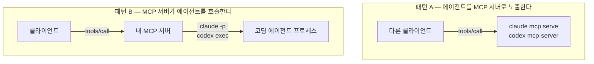

# 11장. 방향을 뒤집다 — MCP 서버가 코딩 에이전트를 부를 때

`SinanTufekci/agent-intern`의 README는 첫 화면에 이런 경고를 달아두고 시작한다.

> **This runs unsandboxed code with your privileges.** … with **no usable approval gate**

문서 맨 앞에 이런 문장을 스스로 박아두는 프로젝트는 흔치 않다. 무엇을 하는 물건이길래 그럴까? 이 저장소가 만드는 건 **MCP 서버가 코딩 에이전트를 호출하게 만드는 다리**다. 지금까지 열 장 동안 우리는 에이전트가 서버를 부르는 방향만 봤다. 화살표를 뒤집으면 무슨 일이 생기는지, 이 장에서 살펴보자.

## 먼저 두 패턴을 갈라놓자

이 주제를 검색하면 성격이 전혀 다른 두 가지가 뒤섞여 나온다. 갈라놓지 않으면 대화가 계속 어긋난다.

그림 1. 패턴 A와 패턴 B — 화살표의 방향이 반대다

두 CLI 모두 표면이 양방향으로 열려 있다. 에이전트가 서버를 **소비**하는 쪽은 우리가 4장에서 쓴 `claude mcp add`와 `codex mcp add`다. 에이전트 자신이 **서버가 되는** 쪽이 `claude mcp serve`와 `codex mcp-server`고(패턴 A), 헤드리스로 **불려 나가는** 쪽이 `claude -p`와 `codex exec`다(패턴 B).

이 장의 주제는 B다. 내 MCP 서버가 도구 하나로 코딩 에이전트를 통째로 부린다는 발상 — 예컨대 `team-wiki`에 "문서 전체를 훑어 목차를 재구성해라" 같은 무거운 도구를 두고, 그 안에서 헤드리스 에이전트를 돌리는 그림이다. 매력적으로 들리지 않는가?

매력의 정체를 짚고 가자. 지금까지 우리가 만든 도구들은 전부 **한 번의 왕복으로 끝나는 것들**이었다. `wiki_search`는 검색해서 목록을 주고 끝나고, `wiki_get`은 본문을 주고 끝난다. 판단이 필요한 부분은 전부 호출한 쪽 모델의 몫이었다. 그런데 어떤 일은 그 형태에 안 맞는다. 문서 300개를 읽고 중복을 판정하고 병합안을 만드는 작업을 도구 하나로 표현하려면, 그 도구 안에 판단하는 무언가가 들어 있어야 한다. 코딩 에이전트를 그 자리에 끼워 넣자는 것이 패턴 B의 발상이고, 말하자면 **에이전트를 서브루틴처럼 쓰는 것**이다.

## 그런데 이건 베스트 프랙티스가 아니다

이 장에서 가장 정직하게 말해야 할 부분을 먼저 말하겠다. **이 패턴은 정착된 실무 관행이 아니다.**

저장소를 실제로 세어보면 확인되는 구현체가 세 개뿐이다. 별 **1,313개**를 받은 대표 격 프로젝트 `steipete/claude-code-mcp`은 **아카이브**됐다(마지막 푸시 2026-05-15). 두 번째인 `grahama1970/claude-code-mcp-enhanced`(125⭐)는 14개월째 방치돼 있다(2025-05-20). 활발히 움직이는 건 앞서 인용한 `SinanTufekci/agent-intern`(16⭐, 2026-07-24 기준) 하나다. 검색어를 바꿔가며 찾아봐도 사례가 더 나오지 않는다.

이 숫자들을 어떻게 읽어야 할까? 두 가지 해석이 가능하다. 하나는 "아직 아무도 제대로 안 해봤으니 기회다"이고, 다른 하나는 "해본 사람들이 그만뒀다"이다. 대표 저장소가 스스로 아카이브를 눌렀다는 사실은 후자 쪽에 무게를 싣는다.

실무적으로도 함의가 분명하다. 아카이브된 저장소는 이슈를 받지 않고 보안 수정도 오지 않는다. 그런데 이 계열의 도구는 하필 **승인 게이트를 끄고 사용자 권한으로 프로세스를 띄우는** 종류다. 유지보수가 멈춘 물건 중에서 가장 멈춰 있으면 곤란한 종류인 셈이다. 남의 래퍼를 가져다 쓸 생각이라면 마지막 커밋 날짜부터 확인하자.

그래서 이 장은 튜토리얼이 아니다. 지뢰 지도에 가깝다. 시도할지 말지를 판단하는 데 필요한 재료를 깔고, 그래도 하겠다면 어디를 밟지 말아야 하는지 표시해두는 것이 목적이다.

## 문서화된 함정

아래 번호는 이 책의 자체 번호가 아니라 리서치 문서가 매긴 함정 번호를 그대로 따른다. 원문 이슈를 찾아갈 때 헷갈리지 않게 하기 위해서다. 그리고 첫 번째 함정은 나머지와 무게가 다르므로 따로 떼어 본다.

### #1 — 샌드박스는 상속되지 않는다

래퍼 README가 직접 밝히듯 이런 도구는 OS 수준 샌드박스가 아니며, 부모 MCP 클라이언트에 속한 승인 프롬프트를 대신 승인해줄 수도 없다. 그래서 진입 조건 자체가 `--dangerously-skip-permissions`를 요구하게 된다. 승인 게이트를 통과하는 게 아니라 꺼버리는 것이다.

한 가지 예외는 있다 — `codex exec`의 `sandbox` 플래그(기본값 `read-only`)는 실제로 강제되는 경계다. 반면 여러 도구가 받는 `workspace` 인자는 **시작 컨텍스트일 뿐 보안 경계가 아니다.** 이름만 보고 울타리로 오해하기 딱 좋은 지점이다.

결과를 그려보면 아찔하다. 사용자가 `team-wiki`의 도구 하나를 승인한다. 그 도구 안에서 승인 게이트가 꺼진 에이전트가 사용자 권한으로 뜬다. 사용자가 승인한 것은 "위키 목차 재구성"이었는데 실제로 열린 것은 그 계정이 할 수 있는 모든 일이다. 10장에서 툴체인을 신뢰 경계 밖에 두자고 했던 이야기가 여기서는 훨씬 더 직접적인 형태로 돌아온다.

### 나머지 다섯

**#2 — 시간 스케일이 다르다.** 일반 MCP 도구의 타임아웃은 60초에서 5분 사이를 오간다(8장의 노브 표를 떠올려보자). 그런데 이런 래퍼는 그 두 자릿수 배 위에서 논다 — **일부 래퍼 구현의 기본 타임아웃이 3,600초, 그러니까 한 시간이었다.** 어느 구현의 기본값인지가 특정되지 않으므로 업계 규범으로 읽지는 말자. 다만 규모의 차이는 분명하다. 도구 하나가 한 시간을 붙들고 있을 수 있다면, 그 도구를 호출한 세션과 그 위의 사용자는 그동안 무엇을 하고 있어야 하나?

**#3 — 에이전트마다 답을 돌려주는 방식이 다르다.** 이게 은근히 사람을 지치게 한다. 어떤 CLI는 stdout으로 결과를 주고, 어떤 CLI는 `-o/--output-last-message`로 파일에 쓰고, 또 어떤 CLI는 특정 버전·플랫폼에서만 stdout을 주고 그 밖에는 `transcript.jsonl`을 **스크래핑**해야 한다. 즉 내 서버가 **에이전트의 출력 규약에 인질로 잡힌다.** 상대가 출력 형식을 바꾸면 내 도구가 조용히 빈 문자열을 돌려주기 시작한다.

**#4 — 병렬로 돌리면 `HOME`이 부딪친다.** 에이전트 CLI들은 홈 디렉터리에 상태를 쓴다. 여러 개를 동시에 띄우면 그 상태가 경합한다. 활발한 쪽 구현이 격리된 `HOME`으로 실행한다고 명시해둔 이유가 이것이다.

**#5 — 헤드리스에서 MCP 실패가 무신호다.** 이건 8장의 침묵 카탈로그와 정확히 같은 종류다. 이슈 원문의 표현을 그대로 빌리면 **"stderr에도 `stream-json` 출력에도 신호가 전혀 없다"**. 실제 로그를 대조하면 1차 요청에서 `tools: 70`이던 것이 `--resume` 이후 `tools: 22, mcp_servers: []`로 줄어 있다. 오케스트레이터 입장에서 이 실패를 탐지할 방법은 **도구 개수를 세는 것밖에 없다.** (세션이 재개된 뒤 MCP가 죽은 채 겉으로만 살아 있는 사례는 8장에서 이미 다뤘다.)

**#7 — 함대가 커지면 헤드리스 호출이 행에 걸린다.** 서버 11개를 전부 물린 상태에서 헤드리스 작업이 68초를 넘겨 멈춰버렸고, `--strict-mcp-config`로 하나만 로드하니 약 5초에 끝났다. 서버가 서버를 부르는 구조에서는 이 비용이 곱해진다.

## 먼저 터지는 건 비용이 아니다

이 패턴을 이야기하면 열에 아홉은 같은 걱정을 한다. 에이전트가 에이전트를 부르다가 무한 재귀에 빠지면? 토큰 비용이 폭발하면?

그런데 실제 보고를 뒤져보면 **비용 폭발이나 무한 재귀 사고 보고가 하나도 없다.** 더 뜻밖인 건 이 패턴의 명시적 동기가 오히려 **비용 절감**이라는 사실이다. 값싼 쿼터를 가진 에이전트에게 잡일을 떠넘기고 비싼 쪽 토큰을 아끼는, 일종의 쿼터 차익거래다.

먼저 터지는 건 **권한과 상태**다. 위 함정 목록을 다시 훑어보면 #1은 권한, #4는 상태, #3과 #5는 경계를 넘나드는 통신의 신뢰성 문제다. 비용은 목록에 없다. 우리가 걱정한 곳과 실제로 터지는 곳이 이렇게 어긋나 있는 영역은 흔치 않다.

## 그럼에도 시도한다면

말리기만 하는 것도 성의 없는 태도다. 굳이 해보겠다면 최소한 이 넷은 설계에 넣고 가자.

- **타임아웃을 두 층으로 분리하자.** 에이전트 호출의 상한과 MCP 도구 응답의 상한은 다른 숫자여야 한다. 같은 값으로 두면 둘 중 하나가 반드시 거짓말을 한다.
- **출력 규약은 어댑터로 감싸자.** stdout이든 파일이든 스크래핑이든, 붙일 CLI마다 얇은 어댑터를 두고 본체는 그 뒤에서 하나의 형식만 보게 한다.
- **`HOME`을 격리하자.** 동시 실행을 조금이라도 염두에 둔다면 처음부터 넣는 편이 낫다. 나중에 넣으면 이미 섞인 상태를 풀어야 한다.
- **실패 탐지를 도구 개수로 하자.** 우아하지 않지만, 지금으로선 무신호 실패를 잡아낼 수 있는 방법이 이것뿐이다.

그리고 하나 더. 이 패턴을 쓰는 서버를 남에게 배포한다면, 9장에서 배운 포장 기술이 여기서는 조금 다른 무게를 갖는다. 설치하는 사람은 자기 계정 권한으로, 승인 게이트가 꺼진 채로, 한 시간짜리 프로세스를 돌리게 된다. 그 사실을 README 첫 화면에 적어두는 프로젝트가 왜 있는지 이제 이해가 될 것이다.

여기까지 오면서 우리는 참 많은 것을 봤다. 그런데 이 장의 재료는 대부분 아카이브된 저장소와 열려 있는 이슈에서 나왔다. 대표 구현이 멈춘 영역, 검색해도 사례가 안 나오는 영역이다.

스펙 자체가 `initialize`를 없애겠다고 예고해둔 마당이다. 생태계가 이 정도로 흔들리는데, 지금 배운 것들은 얼마나 갈까?
