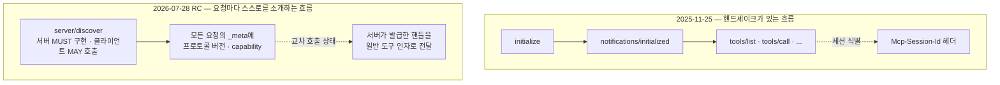

# 12장. 2026-07-28과 그 이후 — 이 지식은 언제 낡는가

1장에서 우리는 "MCP 2.0 스펙은 없다"로 출발했다. 날짜 리비전만 써온 스펙에 `2.0`이라는 이름표는 붙은 적이 없고, 유일한 `"2.0"`은 JSON-RPC 2.0을 가리키는 상수였다.

그런데 이름표가 없다고 변화가 없는 건 아니다. 지금 앞에 놓인 리비전은 **`initialize`를 없앤다.** 2장에서 우리가 시퀀스 다이어그램까지 그려가며 짚었던 그 핸드셰이크를 통째로 걷어낸다. 스펙에 메이저 버전 번호가 없을 뿐, 하는 일로 보면 이게 메이저다.

이 원고를 쓰며 저장소를 다시 조회한 시점(2026-07-26) 기준으로 `schema/` 트리에는 아직 `2026-07-28/` 디렉터리가 없었고, 해당 릴리스는 `prerelease: true` 상태였다. 정식 예정일은 이틀 뒤다. 즉 이 장은 **RC를 보고 쓰는 장**이며, 당신이 이 책을 읽는 시점에는 이미 정식일 가능성이 높다. 그러니 여기서는 "무엇이 바뀌는가"보다 **"바뀌면 내가 배운 것은 어떻게 되는가"**에 무게를 두자.

## RC가 바꾸는 것

그림 1. 핸드셰이크가 있는 흐름과, 요청마다 봉투를 붙이는 무상태 흐름

큰 줄기는 셋이다.

**첫째, 프로토콜 레벨 세션이 사라진다.** `Mcp-Session-Id` 헤더가 삭제되고, list 계열 응답이 연결마다 달라지지 않는다. 교차 호출 상태가 필요하면 서버가 발급한 핸들을 **일반 도구 인자로** 주고받는다. 10장에서 "인스턴스를 늘리면 세션 상태를 어디에 둘 것인가"로 고민했던 그 문제를, 스펙이 프로토콜 밖으로 밀어낸 셈이다.

**둘째, `initialize`와 `notifications/initialized`가 제거된다.** 대신 모든 요청이 `_meta`에 프로토콜 버전과 capability, 클라이언트 정보를 싣고 다닌다. 버전이 맞지 않으면 전용 에러가 돌아온다. 서버가 자기 능력을 알리는 자리는 새로 생긴 `server/discover`인데, **서버는 반드시 구현해야 하고 클라이언트는 호출해도 되고 안 해도 된다.** 이 비대칭이 무상태 설계의 핵심이다 — 클라이언트가 먼저 인사를 건네지 않아도 대화가 성립해야 하니까.

**셋째, 곁가지들이 정리된다.** `ping`과 `logging/setLevel`이 사라지고, 로그 레벨은 요청별 `_meta`로 옮겨간다. HTTP GET과 구독 API는 `subscriptions/listen`이라는 단일 스트림으로 합쳐진다. tasks는 코어 밖 공식 확장으로 이관되고, 블로킹 호출 대신 폴링 방식이 들어온다. 서버가 먼저 클라이언트에 요청을 거는 패턴은 MRTR로 대체돼, 서버가 "입력이 더 필요하다"는 결과를 돌려주면 **클라이언트가 원 요청을 재시도**한다. 모든 결과에는 `resultType`이 필수가 되고, 구버전 서버가 이걸 생략하면 완료로 간주한다. SSE 재개·재전달은 제거돼, 끊기면 새 요청 ID로 다시 보내야 한다.

정확한 필드 시그니처와 봉투 전체 구조는 이 책이 changelog 수준까지만 확인했다. 예제 코드를 지어내지 않는 이유가 이것이다 — 지금 여기에 `server/discover` 요청 예시를 그럴듯하게 적어두면, 그게 이 책에서 가장 빨리 틀리는 페이지가 된다.

## 무엇을 배우지 말아야 하는가

새 리비전에서 더 중요한 건 추가된 것이 아니라 **접힌 것**이다.

**Roots·Sampling·Logging이 기능 자체로 deprecated 된다.** 공식 대체안까지 제시됐는데, 이게 꽤 실용적이다. Roots가 하던 일은 도구 파라미터나 리소스 URI, 서버 설정으로 넘어간다. Sampling — 서버가 클라이언트의 LLM을 빌려 쓰던 그 우아한 기능 — 은 **LLM 공급자 API를 직접 연동하라**는 권고로 대체된다. Logging은 stdio라면 stderr로, 그 밖에는 OpenTelemetry로 가라고 한다.

마지막 줄을 다시 읽어보자. 8장에서 관찰성을 OTel 중심으로 다룬 게 저자 취향이 아니었다는 뜻이다. 스펙이 그 방향을 공식 권고로 못 박았다. OAuth 쪽에서도 동적 클라이언트 등록이 deprecated로 내려가고 Client ID Metadata Documents가 그 자리를 받는다.

그러니 지금 새로 시작하는 사람이라면, 위 세 기능 위에 두껍게 쌓지 않는 편이 낫다. 이미 쌓아뒀다면? 그건 다음 절에서 이야기하자.

## 스펙이 스스로를 부정한 사건

한 가지는 짚고 넘어가야 공정하다. **`2025-11-25`는 sampling에 도구 호출 기능을 *추가*했다.** 그리고 불과 한 리비전 뒤, RC가 sampling 자체를 폐기했다.

이걸 어떻게 볼 것인가. 한쪽에서는 이렇게 말한다 — 서버가 클라이언트의 모델을 빌려 쓰는 설계는 개념적으로 우아하지만 실제로 구현한 클라이언트가 적었고, 보안과 비용의 책임 소재가 모호했다. 안 쓰이는 기능을 걷어내는 건 건강한 정리다. 다른 쪽에서는 이렇게 말한다 — 한 리비전 만에 강화했다가 폐기하는 진동은 거버넌스의 불안정성을 드러내고, 그런 진동이 정확히 채택을 늦춘다. 방금 sampling 위에 무언가를 만든 사람 입장에서는 뒷맛이 아주 찜찜하다.

두 관점 다 일리가 있다. 다만 독자로서 여기서 가져갈 실용적 교훈은 하나다. **"최신 리비전이 추가했다"는 사실 자체는 그 기능의 수명을 보장하지 않는다.** 새로 들어온 기능일수록 채택 폭을 한 번 확인하고 올라타는 편이 낫다.

## 앞 장들과 이어지는 조각들

RC에는 앞에서 우리가 겪은 불편을 정면으로 겨냥한 항목들도 있다.

- **분산 추적이 프로토콜에 들어왔다.** `_meta`를 통한 `traceparent`·`tracestate`·`baggage` 전파가 문서화됐다. 8장에서 "stdio는 헤더가 없어 trace context를 파라미터나 환경변수로 직접 실어야 한다"고 했던 그 불편이, 프로토콜 차원의 자리를 얻은 것이다.
- **결과에 캐시 정보가 붙는다.** list·read 계열에 `ttlMs`와 `cacheScope`가 들어온다. `cacheScope`가 `"public"`인지 `"private"`인지가 공유 중계자의 캐싱 여부를 가른다 — 원격으로 여는 서버라면 이 값을 잘못 두는 게 곧 정보 유출이다.
- **`tools/list`의 순서가 결정적이어야 한다**는 권고가 붙었다. 클라이언트 캐싱과 프롬프트 캐시 적중률을 위해서다.
- **에러코드 대역이 정리됐다.** `-32000`부터 `-32019`까지는 구현 정의로 남기고, `-32020`부터 `-32099`까지를 스펙이 예약했다. 8장에서 지겹도록 만났던 `MCP error -32000`이 왜 저 대역에 있었는지가 여기서 설명된다.

## 그런데 왜 앞의 열한 장이 낡지 않는가

가장 중요한 질문이 남았다. 스펙이 핸드셰이크를 없애는데, 그 핸드셰이크를 설명한 2장은 폐지되는가?

RC 릴리스 노트가 직접 답한다.

> "SDKs will adopt this version at their own pace, and the prior version of the spec may remain in use for an undetermined amount of time."

**SDK는 각자의 속도로 채택하고, 이전 리비전은 정해지지 않은 기간 동안 계속 쓰인다.** 여기에 스펙이 스스로 정한 정책이 더해진다 — 기능 생애주기를 Active·Deprecated·Removed 세 상태로 나누고, **최소 12개월의 deprecation 창**을 보장한다.

그리고 이미 증거가 있다. **공식 Java SDK 2.0.0(2026-06-11 기준)은 GA이면서 릴리스 노트에 자신이 따르는 스펙이 `2025-11-25`라고 명시한다.** 메이저 버전 2.0을 정식 출시한 SDK가 최신 리비전이 아니라 그 앞 리비전을 따르고 있는 것이다. Spring AI 2.0.0은 그 바로 다음 날(2026-06-12 기준) GA로 나와 같은 라인 위에 섰다 — 다만 Spring AI가 어느 java-sdk 버전을 고정하는지는 이 책이 1차 소스로 확인하지 못했으니, 여기서 근거로 삼는 것은 Java SDK 쪽 명시다. 1장에서 세운 네 개의 축이 여기서 마지막으로 증명되는 셈이다. 숫자가 크다고 최신 스펙이 아니고, 스펙이 바뀐다고 SDK가 곧바로 따라가지 않는다.

## 그래서 v1으로 배울 것인가, v2로 배울 것인가

이 책을 쓰는 내내 따라다닌 질문이다. 관점 A는 v1으로 배우라고 한다 — TypeScript SDK의 README가 v1.x를 프로덕션 지원 라인으로 명시하고 v2 출시 후에도 최소 6개월 수정을 약속했으며, JVM 진영의 GA 조합이 실제로 `2025-11-25` 위에 서 있다. 관점 B는 v2로 배우라고 한다 — 어차피 새 리비전이 오고, 거기서 `initialize`는 사라진다.

그런데 이 질문의 형태 자체가 함정이라는 게 열두 장을 지나온 지금의 답이다. **"둘 중 하나"가 아니라 "네 개의 축을 분리해서 읽는 습관"이 답이다.** 스펙 리비전이 무엇인지, 내가 쓰는 SDK의 semver가 무엇인지, 그 SDK가 실제로 협상하는 리비전이 무엇인지, 클라이언트 CLI와 레지스트리 스키마는 또 어떤 날짜를 쓰는지. 이 넷을 따로 볼 줄 알면 "2.0을 써야 하나"라는 질문은 애초에 생기지 않는다. 그 자리에 훨씬 구체적인 질문이 들어선다 — "내가 지금 쓰는 이 버전은 어느 리비전을 협상하는가?"

이 습관에 하나만 덧붙이자. 자기 언어의 SDK를 고를 때는 **공식 지원 등급을 확인하는 것**도 같은 종류의 일이다. `2025-11-25`가 SDK 티어링을 도입한 이유가 여기에 있다. 별 개수나 마지막 커밋 날짜 말고, 공식적으로 어느 등급에 놓인 SDK인지를 먼저 보자.

## 닫는 매듭

우리는 "MCP 2.0은 없다"로 시작해 열두 장을 지나왔다.

혼동을 걷어내고(1·2장), TypeScript로 `team-wiki`를 만들어 클라이언트에 붙이고(3·4장), 같은 서버를 Python과 Spring AI로 옮기고(5·6장), 도구를 몇 개나 어떻게 노출할지 정하고(7장), 에러 없이 실패하는 침묵을 보이게 만들고(8장), 이름 하나로 네 갈래 배포 경로를 묶고(9장), 밖에 열면서 지킬 것을 지키고(10장), 화살표를 뒤집으면 무엇이 기다리는지까지 봤다(11장).

이 여정에서 가져갈 것을 셋으로 줄이면 이렇다. **만들 줄 아는 손.** 세 언어 중 하나로 서버를 세우고 클라이언트에 붙여 동작을 확인할 수 있다. **침묵을 의심하는 눈.** 아무 에러도 안 뜰 때 오히려 긴장하고, 어디를 이분 탐색할지 안다. **언제 쓰지 말아야 할지 아는 판단.** CLI로 충분한 자리, 도구를 더 붙이면 오히려 정확도가 떨어지는 자리, 그리고 지금은 아직 손대지 않는 게 나은 자리를 구분할 수 있다.

마지막으로 하나만 더 남기고 싶다. MCP는 에이전트 프로토콜 스택의 **첫 단계**이지 전부가 아니다. 학계의 분류를 빌리면 MCP는 "컨텍스트 지향 × 범용" 사분면에 놓이고, 에이전트끼리 협업하는 프로토콜은 다른 축에 있다. 그러니 **"MCP냐 A2A냐"는 애초에 잘못된 질문이다.** 대개는 둘 다 필요하다.

`initialize`는 사라질 것이다. `Mcp-Session-Id`도, sampling도 그럴 것이다. 그래도 도구를 몇 개 노출할지 고민하는 일, 침묵을 의심하는 일, 이름 하나를 네 군데에 똑같이 박는 일은 남는다. 리비전이 아무리 바뀌어도 **그것들은 프로토콜이 아니라 우리가 일하는 방식**이기 때문이다.
