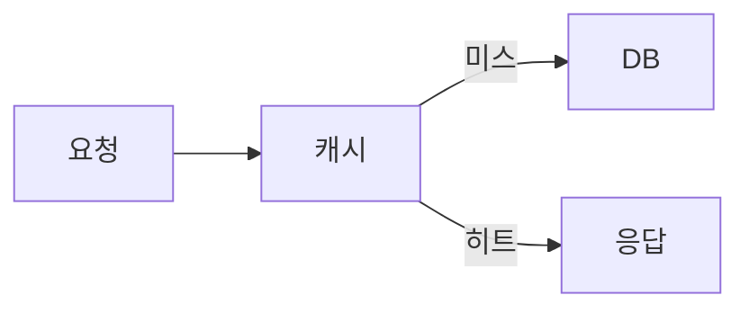

# tech-book 챕터 스캐폴드

기술서 챕터 유형별 구조다. 억지로 스캐폴드에 맞추지 말고, 자연스럽게 흘러가는 흐름을 우선한다.

## 1. 개념 도입형

새로운 개념을 처음 소개하는 챕터.

```
[오프닝] 상황 가정 — "~라고 상상해보자"
[질문] "이런 상황에서 우리는 어떻게 해야 할까?"
[개념 도입] 개념 이름을 꺼내며 정의
[비유·예시] 일상 비유 + 단순한 코드 예시
[오해 정정] "물론 ~라고 생각할 수 있다. 하지만 ~"
[실전 조언] "~하는 편이 낫다"
[당부·이음] "기억해두자. 다음 장에서는 ~"
```

## 2. 문제-해결형

잘못된 코드·관행을 비판하고 대안을 제시.

```
[오프닝] 찜찜한 코드 제시
[공감] "이 코드를 본 순간 어딘가 난감하다는 느낌이 들지 않는가?"
[문제 분석] 무엇이 왜 문제인지 단계별 짚기
[잘못된 대안] "이렇게 고치면 될까? 그것도 찜찜하다"
[올바른 대안] "그렇다면 어떻게 해야 할까?"
[개선 코드] 리팩토링 결과
[교훈] "기억해두자"
```

## 3. 사례 분석형

구체 사례에서 원리를 추출.

```
[오프닝] 사례 배경 소개
[현상] 실제로 어떤 일이 있었는지
[분석] 왜 그랬는가 — 수사적 질문 반복
[원리 추출] "이 사례가 알려주는 것은 ~다"
[일반화] "비슷한 상황에서 어떻게 대응하자"
```

## 4. 비교 대조형

여러 접근법을 비교.

```
[오프닝] 여러 선택지가 있는 상황 제시
[선택지 A] 장단점 서술
[선택지 B] 장단점 서술
[기준] "어느 쪽이 나을까? 상황에 따라 다르다"
[의사결정 가이드] "~한 상황이라면 A, ~라면 B"
[흔한 오해] "A가 항상 낫다고 여기기 쉽다. 하지만 ~"
```

## 5. 종합 정리형

앞 챕터들의 내용을 통합.

```
[오프닝] "지금까지의 여정을 돌아보자"
[되짚기] 핵심 개념 3~5개 요약 (나열 아닌 연결)
[통합 관점] 개념들이 어떻게 맞물리는지
[실전 프레임워크] 종합한 사고 절차
[다음 단계] "이제 ~로 나아갈 준비가 되었다"
```

## 오프닝 메뉴

모든 장이 똑같이 "~라고 상상해보자"로 열리면 책 전체가 한 가지 리듬에 갇혀 지루해진다. 아래 기법 가운데 이 챕터의 소재에 맞는 하나를 고른다. 같은 책 안에서 다양하게 섞는 것이 핵심이다.

| 기법 | 한 줄 예시 |
|------|----------|
| 상황 가정 | "금요일 저녁, 배포 직전에 빌드가 깨졌다고 해보자." |
| 수사적 질문 | "왜 어떤 코드는 6개월만 지나도 손대기 무서워질까?" |
| 충격적 수치·사실 | "장애의 70%는 배포 후 첫 한 시간 안에 터진다." |
| 인용·일화 | "한 동료가 이런 말을 한 적이 있다. '테스트는 미래의 나에게 보내는 편지다.'" |
| 실패 장면(in medias res) | "오전 3시, 알림이 울린다. 결제가 멈췄다." |
| 앞 장 콜백 | "앞 장에서 우리는 의존성을 끊어냈다. 그런데 끊고 나니 새 문제가 생긴다." |
| 정의 뒤집기 | "흔히 캐시는 '빠르게 하는 것'이라고 한다. 사실은 '늦게 갱신하는 것'에 더 가깝다." |

## 클로징 패턴 (챕터 역할별)

마지막 한 문단까지 모든 장이 "## 마무리 + 다음 장에서는 ~" 공식으로 닫히면, 독자는 매 장 끝에서 같은 장치를 만나 피로해진다. 클로징은 **챕터의 역할**에 따라 달라진다.

- **중간 장** — 변주된 이음말. 핵심 한 가지를 짧게 매듭짓고, 다음 흐름으로 가볍게 넘긴다. 매번 "다음 장에서는 ~를 다룬다"를 반복하지 않는다 — 질문을 남기거나, 적용 과제를 던지거나, 한 문장으로 여운을 두는 등 형태를 바꾼다. `## 마무리` 헤딩을 의무로 달지 않아도 된다.
- **종합·마지막 장** — 닫는 매듭. 책 전체의 여정을 회고하고, 독자가 가져갈 관점을 분명히 한다. 여기서는 회고형 클로징이 자연스럽다.

## 핵심 요약 규약 (선택)

장 끝에 그 장의 요점을 짧게 모아주는 **"이 장의 핵심"** 박스를 둘 수 있다. 의무가 아니라 선택이며, 쓰기로 했다면 책 전체에서 형식을 통일한다.

- 헤딩은 정확히 `### 이 장의 핵심` 하나로 고정한다 (표기 흔들림 금지).
- 3~5개 불릿으로, 본문에서 이미 다룬 결론만 압축한다. 새 정보를 여기서 처음 꺼내지 않는다.
- 모든 장에 강제하지 않는다 — 개념 밀도가 높은 장에만 선택적으로 둔다. (narrative·essay 장르에는 쓰지 않는다.)

## 그림·다이어그램 규약

구조·관계·흐름(아키텍처, 상태 전이, 호출 순서, 의존 그래프 등)은 산문으로만 늘어놓지 말고 다이어그램으로 보여준다. ` ```mermaid ` 코드 블록으로 작성하고, 바로 아래에 캡션 줄 `그림 N. {설명}`을 붙인다. N은 **챕터마다 1부터** 매긴다.

````

그림 1. 캐시 히트·미스 경로
````

빌드 스크립트가 `mmdc`로 미리 렌더한다. `mmdc`가 없으면 mermaid 블록을 그대로 두고 넘어가므로(graceful degradation), 그림 규약은 하드 의존이 아니다 — 환경에 mmdc가 없어도 빌드는 깨지지 않는다.

## 공통 가이드

- 오프닝은 위 **오프닝 메뉴**에서 고른다. 메타 선언("이 장에서는 ~") 금지
- **인접 챕터는 같은 오프닝 기법을 반복하지 않는다.** 앞 챕터가 '상황 가정'으로 열었다면 이 챕터는 다른 기법으로 연다
- **전체 책에서 '상황 가정' 오프닝은 약 1/3 챕터 이하로 제한한다** — 한 기법에 쏠리지 않게 분산한다
- 본문 중간에 최소 2~3회의 수사적 질문, 2~3회의 감정적 공감 표현을 배치 (단, 한 챕터에 과포화되지 않게 — 같은 표현 반복은 변주·삭제)
- 마무리는 위 **클로징 패턴**을 따른다 — 중간 장은 변주된 이음말, 마지막 장은 닫는 매듭
- 분량 가이드: 챕터당 3,000~6,000자(한글). 너무 짧으면 몰입 어려움, 너무 길면 호흡 흐트러짐
- 소절(`###`)은 챕터당 3~7개가 적당
- 버전·API·수치는 출처에 근거하고 시점을 명기한다 (voice.md §6 신선도 규율)
