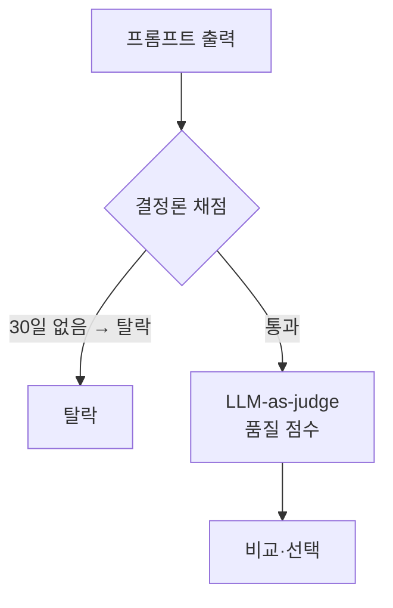

# 11장. 프롬프트도 코드처럼 테스트한다 — 자동 평가

GPT-4를 심판으로 세워 답변을 채점하게 했더니, 그 채점이 사람 평가와 80% 넘게 일치했다 [Zheng 2023, arXiv:2306.05685]. 사람 둘이 같은 답을 채점해도 그 정도 일치하기가 쉽지 않다. 그렇다면 한 가지 도발적인 질문이 떠오른다. 채점을, 기계에게 맡겨도 되지 않을까?

10장에서 우리는 환불 정책 요약 프롬프트 A·B를 손으로 채점했다. rubric을 짜고, 체크리스트로 거르고, 순서를 섞었다. 그 과정에서 한 가지 한계도 분명히 봤다. 테스트가 다섯 개를 넘어 수백 개가 되고, 프롬프트를 고칠 때마다 그 전부를 다시 채점해야 한다면, 사람의 손으로는 감당이 안 된다. 이번 장에서는 **바로 그 작업** — 10장의 그 A·B, 그 "30일"과 환불 불가 조건 — 을 이제 코드로 자동화한다. 새 작업을 꺼내지 않는다. 무대만 손에서 기계로 옮긴다.

## 두 개의 트랙으로 읽는다

먼저 이 장을 어떻게 읽을지부터 정하자. 이 장에는 코드가 제법 나온다. 이 책에서 코드가 가장 빽빽한 대목이다. 그런데 자동 평가의 **개념**은 코드를 한 줄도 안 봐도 온전히 이해할 수 있다. 그래서 이 장을 두 트랙으로 나눠 적었다.

- **개념 트랙(먼저)** — 코드 없이, "자동 평가가 무엇을 왜 하는가"만 그림으로 잡는다. 일반 사용자라면 여기까지만 읽고 12장으로 넘어가도 좋다. 자동 평가의 원리와 언제 쓰는지는 이 트랙에서 다 잡힌다.
- **코드 트랙(뒤)** — pytest, promptfoo, CI까지 실제로 돌아가는 코드를 따라간다. 코드 블록마다 **〔개발자 트랙〕** 표식을 달아뒀다. 개발자가 아니라면 이 표식이 붙은 블록은 건너뛰어도 개념엔 구멍이 안 생긴다.

코드가 부담스러우면 개념 트랙만 읽고 12장으로 넘어가도 좋다. 진심이다. 자동 평가의 핵심은 도구가 아니라 발상이니까.

---

## 개념 트랙 — 코드 없이 보는 자동 평가

### 채점을 두 종류로 나눈다

자동 평가의 첫걸음은 채점을 두 종류로 가르는 것이다.

하나는 **결정론 채점**이다. 정답이 딱 떨어지는 검사다. "출력에 '30일'이 들어 있는가?"는 들어 있거나 없거나 둘 중 하나다. "출력이 올바른 JSON 형식인가?"도 마찬가지다. 사람의 판단이 끼어들 여지가 없다. 이런 검사는 코드가 눈 깜짝할 새에, 매번 똑같은 기준으로, 공짜에 가깝게 해치운다. 10장 체크리스트의 "30일이 들어 있는가" 항목, 기억나는가? 그게 바로 결정론 채점이다.

다른 하나는 **판단이 필요한 채점**이다. "이 요약이 정중한가?", "환불 불가 조건을 자연스럽게 녹였는가?" — 이건 정규식으로 잡히지 않는다. 누군가가 읽고 판단해야 한다. 사람이 하면 느리고 비싸다. 그래서 등장하는 발상이 **LLM-as-judge**, 채점을 또 다른 모델에게 맡기는 것이다. 10장에서 우리가 rubric으로 매기던 그 점수를, 이번엔 모델이 매긴다.


그림 1. 두 단계 채점 — 싼 검사로 거르고, 통과분만 비싼 채점으로

### 싼 것 먼저, 비싼 것 나중에

여기서 중요한 순서 감각 하나. 결정론 채점은 빠르고 거의 공짜다. 반면 LLM-as-judge는 매 채점이 모델 호출이라 돈과 시간이 든다. 그렇다면 어떻게 배치하는 게 현명할까?

**싼 검사로 먼저 거르고, 거기서 살아남은 답만 비싼 채점으로 보낸다.** "30일"이 아예 없는 답은 결정론 단계에서 곧장 탈락이다. 그런 답을 굳이 judge 모델에게 보내 "정중한가요?"라고 물어볼 이유가 없다. 어차피 탈락인데 채점비만 나간다. 이 "결정론 먼저, 통과분만 judge" 순서는 비용을 크게 아껴준다. 12장에서 다시 만날 원칙이니 지금 새겨두자.

### 회귀 테스트가 지키는 것

자동 평가가 진짜 위력을 발휘하는 순간은 따로 있다. 바로 **프롬프트를 고칠 때**다.

상상해보자. 환불 요약 프롬프트가 잘 돌고 있었는데, 톤을 좀 더 따뜻하게 만들려고 지시 한 줄을 고쳤다고 하자. 톤은 좋아졌다. 그런데 그 수정 때문에 모델이 "30일" 명시를 슬그머니 흘리기 시작했다면? 손으로 채점하던 시절엔 이런 걸 놓치기 십상이다. 톤만 확인하고 만족해서 배포해버린다. 끔찍한 일이다.

**회귀 테스트**는 이걸 막는다. 한번 통과한 검사들을 데이터셋으로 고정해두고, 프롬프트를 고칠 때마다 그 전부를 자동으로 다시 돌린다. 톤을 고쳤더니 "30일" 검사가 깨졌다면, 배포 전에 빨간불이 켜진다. 소프트웨어 개발자가 코드를 고칠 때마다 테스트를 돌려 "예전에 되던 게 깨지지 않았나" 확인하는 것과 똑같다. 그래서 이 장의 제목이 "프롬프트도 코드처럼 테스트한다"인 것이다.

개념 트랙은 여기까지다. 자동 평가란 결국 (1) 싼 결정론 검사로 거르고, (2) 통과분을 모델 심판으로 채점하고, (3) 그 검사들을 고정해 프롬프트가 바뀔 때마다 회귀를 감시하는 일이다. 이 세 가지만 손에 쥐고 12장으로 넘어가도 좋다. 더 깊이 — 실제로 돌려보고 싶은 독자는 코드 트랙으로 함께 가자.

---

## 코드 트랙 — 실제로 돌려보는 자동 평가

여기서부터는 개발자를 위한 워크스루다. Python과 약간의 YAML이 나온다. 코드 블록의 **〔개발자 트랙〕** 표식을 안내판 삼으면 된다.

### 결정론 채점을 pytest로

가장 먼저, 코드로 딱 떨어지는 검사부터 pytest로 적어보자. 10장 체크리스트를 거의 그대로 코드로 옮긴 것이다.

〔개발자 트랙〕
```python
import json
import re

# call_model(prompt, **vars)은 모델을 호출해 출력 문자열을 돌려준다고 하자.

REFUND_POLICY = "...(환불 정책 전문)..."

def test_mentions_30_days():
    out = call_model(PROMPT_B, policy=REFUND_POLICY)
    # 체크리스트 1번: "30일"이 들어 있는가
    assert "30일" in out

def test_includes_nonrefundable_conditions():
    out = call_model(PROMPT_B, policy=REFUND_POLICY)
    # 환불 불가 조건의 핵심 키워드가 모두 등장하는가
    for keyword in ("개봉", "디지털", "맞춤 제작"):
        assert keyword in out, f"환불 불가 조건 누락: {keyword}"

def test_length_is_reasonable():
    out = call_model(PROMPT_B, policy=REFUND_POLICY)
    # 한 줄로 끝나거나 장황하지 않은가 (대략적 길이 가드)
    assert 60 <= len(out) <= 600
```

여기에 출력 형식을 JSON으로 받는 변형이라면, 형식 검사도 결정론으로 깔끔하게 잡힌다. 레퍼런스의 회귀 테스트 예시와 같은 발상이다.

〔개발자 트랙〕
```python
def test_output_is_valid_json():
    out = call_model(PROMPT_JSON, policy=REFUND_POLICY)
    data = json.loads(out)                      # 파싱 가능한가?
    assert set(data) >= {"summary", "deadline"} # 필수 키가 있는가?
    assert "30일" in data["deadline"]           # 기한 필드에 30일이 있는가?
```

이 검사들은 모델 호출을 빼면 거의 공짜이고, 매번 똑같은 기준으로 판정한다. "30일"이 빠지면 그 자리에서 빨간불이다. `pytest`를 돌리면 끝이다.

〔개발자 트랙〕
```bash
pytest test_refund_prompt.py -v
```

### 품질은 promptfoo로 — 결정론과 judge를 한 파일에

결정론 검사만으로는 "정중한가", "정확히 요약했는가" 같은 품질을 잴 수 없다. 여기서 **promptfoo**가 편하다. 결정론 assertion과 LLM-rubric(judge 채점)을 하나의 YAML에 담아, A와 B를 나란히 평가해준다. 10장에서 손으로 하던 side-by-side 채점의 자동화판이다.

〔개발자 트랙〕
```yaml
# promptfooconfig.yaml — 환불 요약 A vs B
prompts:
  - prompt_a.txt   # 10장의 프롬프트 A (한 줄 부탁)
  - prompt_b.txt   # 10장의 프롬프트 B (골격을 갖춘 지시)

providers:
  - anthropic:claude-opus-4-8
  - openai:gpt-5.5

tests:
  - vars:
      policy: file://refund_policy.txt
    assert:
      # 1단계: 결정론 — 싸고 빠르다. 여기서 떨어지면 끝.
      - type: contains
        value: "30일"
      - type: contains
        value: "개봉"
      # 2단계: LLM-rubric — judge 모델에게 품질을 묻는다.
      - type: llm-rubric
        value: "정중하고, 정책을 정확히 요약하며, 환불 불가 조건을 명시하는가"
        provider: anthropic:claude-opus-4-8   # judge를 한 모델로 고정
```

돌리는 명령은 단 두 줄이다. 그리고 이 똑같은 명령을 나중에 CI에도 그대로 물린다.

〔개발자 트랙〕
```bash
npx promptfoo eval && npx promptfoo view
```

`eval`이 채점을 돌리고, `view`가 결과를 표로 띄운다. A와 B가 케이스별로 몇 점을 받았는지, 어떤 assertion에서 떨어졌는지가 한눈에 들어온다. 10장에서 손으로 만들던 그 채점표가, 이제 명령 한 줄로 뽑힌다.

여기서 `assert` 블록의 순서를 다시 보자. `contains` 검사가 위에, `llm-rubric`이 아래에 있다. 의도된 배치다. 결정론 검사가 싸니까 먼저 두고, 비싼 judge 채점은 뒤에 둔다. 개념 트랙에서 말한 "싼 것 먼저"가 이렇게 파일 안에 그대로 박혀 있다.

### LLM-as-judge — 편향을 길들이는 가드레일

judge 모델은 강력하지만, 그냥 믿고 쓰면 위험하다. 10장에서 사람에게 위치 편향이 있다고 했는데, 모델 심판에게는 그게 더 심하다. 세 가지 편향을 알고, 각각에 가드레일을 걸어야 한다 [Zheng 2023, arXiv:2306.05685].

- **위치 편향(position bias):** 먼저 제시된 답을 더 후하게 본다. → **A/B 순서를 무작위화**하거나, 순서를 바꿔 두 번 채점하고 평균을 낸다.
- **장황함 편향(verbosity bias):** 긴 답을 더 좋게 본다. → judge 지시에 **"길이로 점수 주지 말라"**고 명시하고, 필요하면 길이를 정규화한다.
- **자기 선호 편향(self-enhancement bias):** 자기가 만든 답을 더 좋게 본다. → **judge 모델을 피평가 모델과 다르게** 둔다. Claude로 만든 답이라면 judge는 다른 계열로.

그리고 가능하면, 사람이 채점한 라벨 일부로 judge를 보정하자. judge 점수와 사람 점수가 얼마나 어긋나는지 한번 맞춰보는 것이다. 앞서 본 "사람과 80%+ 일치"라는 수치도, 가드레일을 건 상태에서의 이야기다. 가드레일 없는 judge는 그 일치율을 믿을 수 없다.

〔개발자 트랙〕
```yaml
# judge 지시에 가드레일을 녹인 rubric 예시
- type: llm-rubric
  value: |
    아래 기준으로만 1~5점을 매겨라. 길이가 길다고 점수를 더 주지 마라.
    - 정중한 말투인가
    - 환불 기한(30일)과 환불 불가 조건을 정확히 포함했는가
    - 정책에 없는 내용을 지어내지 않았는가
  provider: openai:gpt-5.5   # 피평가가 Claude면 judge는 다른 계열로 (자기 선호 편향 회피)
```

judge에게 줄 rubric 지시도, 결국 2장에서 배운 좋은 프롬프트의 골격을 그대로 따른다는 점을 눈여겨보자. 채점 기준을 명확히, 긍정형으로("~하지 마라"는 꼭 필요한 곳에만), 출력 형식을 못 박아서. judge도 모델이니, 좋은 프롬프트가 좋은 채점을 만든다.

### 테스트셋과 CI — 코드처럼 지킨다

마지막 조각은 회귀 테스트를 CI에 물리는 것이다. 입력(환불 정책 여러 건)과 기대 기준을 데이터셋으로 고정해두고, 프롬프트를 고쳐 푸시할 때마다 평가가 자동으로 돈다. OpenAI Evals처럼 JSON 데이터셋 + YAML 설정으로 모델이 답하고 모델이 판정하는 2단계(model-graded) 구조를 짜도 좋다 [github.com/openai/evals].

〔개발자 트랙〕
```yaml
# .github/workflows/eval.yml (개념 골격)
name: prompt-eval
on: [pull_request]
jobs:
  eval:
    runs-on: ubuntu-latest
    steps:
      - uses: actions/checkout@v4
      - run: npx promptfoo eval --config promptfooconfig.yaml
      # 점수가 기준선 아래로 떨어지면 CI가 실패 → 회귀를 머지 전에 잡는다
```

이렇게 해두면, 누가 환불 프롬프트를 건드려 "30일"을 깨뜨리는 순간 PR에 빨간불이 켜진다. 사람이 깜빡해도 파이프라인은 깜빡하지 않는다. 프롬프트가 정말로 코드처럼 보호받기 시작하는 지점이다.

---

## 두 트랙이 다시 만나는 곳

개념 트랙으로 읽었든 코드 트랙까지 따라왔든, 손에 남는 그림은 같다. 싼 결정론 검사로 먼저 거르고, 통과한 것만 judge로 품질을 재고, 그 검사들을 고정해 회귀를 감시한다. 이것이 자동 평가의 골격이다.

그런데 한 가지가 아직 빠져 있다. 우리는 A와 B의 품질 점수를 자동으로 뽑을 수 있게 됐지만, 정작 **무엇을 배포할지**는 아직 안 정했다. 게다가 품질만으로 정해도 될까? B가 A보다 점수는 높은데, 추론을 더 많이 써서 비용이 세 배라면? 느려서 고객을 기다리게 만든다면? 다음 장에서 우리는 10장과 11장에서 다룬 바로 그 A·B를 들고, 작성부터 평가, 비교, 그리고 마침내 **선택**까지 한 바퀴를 끝까지 돌려본다. 점수표 하나로는 답이 안 나오는, 진짜 결정의 순간이다.
