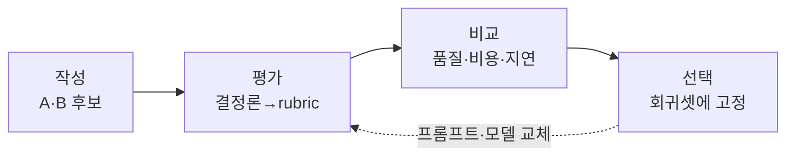
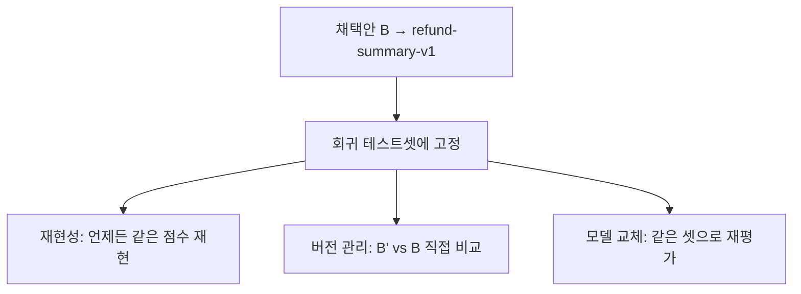

# 12장. 작성→평가→비교→선택, 한 바퀴 돌려보기

환불 정책을 요약하는 프롬프트 두 개를 손에 들고 있다고 해보자. 10장에서 손으로 채점했고, 11장에서 코드로 자동화한 바로 그 A와 B다. 둘 다 그럴듯하다. 점수표도 뽑았다. 그런데 막상 "둘 중 무엇을 제품에 배포할까?"라는 물음 앞에 서면, 손이 멈춘다. 점수가 높은 쪽을 고르면 되는 거 아니냐고? 그렇게 간단하면 이 장이 필요 없다.

이번 장은 이 책의 클라이맥스다. 지금까지 배운 모든 것 — 좋은 프롬프트 작성(2장), 모델별 차이(3~6장), 수동 평가(10장), 자동 평가(11장) — 을 하나의 워크플로우로 꿰어, 그 A와 B를 **작성 → 평가 → 비교 → 선택**까지 끝까지 돌린다. 그리고 마지막 "선택"에서, 우리는 품질이라는 한 축만 보던 시야를 넓힐 것이다.

## 한 바퀴의 전체 모습

먼저 우리가 돌릴 한 바퀴가 어떻게 생겼는지 보자.

그림 1. 작성→평가→비교→선택의 순환 — 선택은 끝이 아니라 다음 반복의 시작이다

화살표가 한 방향으로 흐르다가 마지막에 점선으로 되돌아온다는 점을 눈여겨보자. 이 루프는 한 번 돌고 끝나는 게 아니다. 채택안을 고정해두면, 나중에 프롬프트를 고치거나 모델을 바꿀 때 같은 자리로 돌아와 다시 돈다. 그게 이 워크플로우의 진짜 값어치다. 자, 한 단계씩 밟아보자.

## 1단계 — 작성: 후보를 손에 쥔다

작성 단계는 이미 끝나 있다. 10장에서 만든 A(한 줄짜리 부탁)와 B(역할·제약·형식을 갖춘 지시)가 우리의 두 후보다. 여기서 욕심을 조금 내, 변형을 더해도 좋다. 예컨대 B를 그대로 두고 모델만 바꾸거나, 추론 강도(effort)를 올린 변형을 추가하는 식이다.

왜 변형을 더할까? 6장에서 우리는 effort나 reasoning_effort, thinking_level을 올리면 추론 토큰이 늘어 품질은 오르지만 비용과 지연도 함께 오른다고 했다. 그 tradeoff를 이 작업에서 눈으로 확인해보려는 것이다. 그래서 후보를 이렇게 늘려보자.

- A: 한 줄짜리 부탁 (기준선)
- B: 골격을 갖춘 지시
- B-high: B와 똑같은 프롬프트인데, 추론 강도를 한 단계 올린 변형

이제 세 후보가 손에 있다. 평가대에 올려보자.

## 2단계 — 평가: 거르고, 점수 매긴다

평가는 11장에서 만든 파이프라인을 그대로 돌린다. 순서가 핵심이다.

**먼저 결정론 assertion으로 거른다.** "30일"이 있는가, 환불 불가 조건이 다 들어 있는가, 형식이 맞는가. 여기서 떨어지는 후보는 그 자리에서 탈락이다. 품질을 따져볼 자격조차 없다. 환불 안내문에서 "30일"이 빠진 건, 문장이 아무리 우아해도 결함품이기 때문이다.

가령 A가 여러 케이스에서 "30일"을 종종 흘린다면, A는 이 단계에서 신뢰도에 금이 간다. 반면 B와 B-high는 제약을 명시한 덕에 결정론 검사를 안정적으로 통과한다.

**통과한 후보만 rubric과 LLM-rubric로 품질을 비교한다.** 비싼 judge 채점을 자격 미달 후보에 낭비하지 않는 것 — 11장에서 새긴 "결정론 먼저, 통과분만 judge"가 여기서 돈을 아낀다. 통과한 B와 B-high를 judge에 보내, 정중함·정확성·완결성을 점수로 받는다.

여기까지만 보면 결론이 뻔해 보인다. B-high가 추론을 더 썼으니 품질 점수가 가장 높을 것이고, 그럼 B-high를 배포하면 끝. 정말 그럴까? 이 방식에 문제는 없을까?

## 3단계 — 비교: 품질만 보면 함정에 빠진다

여기서 이 장의 승부처가 나온다. **품질 점수 하나만 보고 고르면, 거의 반드시 비싸고 느린 후보를 고르게 된다.** 추론을 더 쓰면 대개 품질이 조금 더 오르기 때문이다. 문제는 그 "조금"을 위해 치르는 대가다.

그래서 우리는 점수 옆에 두 개의 열을 더 세운다. 비용과 지연이다. 환불 요약은 고객 문의가 들어올 때마다 돌아가는 작업이다. 하루에 수천 건이 쌓이고, 고객은 응답을 기다린다. 그러니 1,000건을 처리할 때 드는 비용과, 한 건이 돌아오는 데 걸리는 시간(p50, 즉 절반의 요청이 그 안에 끝나는 시간)이 품질만큼이나 중요하다.

세 후보를 한 표에 나란히 놓아보자. (구체적인 절대 가격·지연 수치는 모델마다 주 단위로 바뀌므로 부록 A의 모델 스냅샷 표를 참조하자. 여기서는 후보 사이의 *상대적* 관계를 본다.)

| 후보 | 품질 점수(25점) | 1,000건당 비용 | p50 지연 | 채택 |
|------|----------------|----------------|----------|------|
| A (한 줄 부탁) | 17 | 1배(기준) | 1배(기준) | ✗ — "30일" 누락, 결정론에서 탈락 |
| B (골격 지시) | 23 | 1.2배 | 1.1배 | ✓ 채택 |
| B-high (추론↑) | 24 | 3배 | 2.5배 | ✗ — 품질 +1점에 비용 3배 |

표를 천천히 읽어보자. A는 애초에 결정론 단계에서 탈락이라 품질 비교의 무대에도 못 올랐다. 진짜 승부는 B와 B-high 사이다. 그리고 그 승부에서, 품질 점수만 보면 B-high(24점)가 B(23점)를 이긴다.

그런데 그 1점을 얻으려고 B-high는 비용을 세 배, 지연을 두 배 반 치른다. 환불 안내문 품질이 23점에서 24점으로 오른다고 고객이 알아챌까? 거의 못 알아챈다. 반면 비용 세 배는 월말 청구서에 또렷이 찍히고, 지연 두 배 반은 고객을 더 오래 기다리게 만든다. **품질이 5% 높지만 비용·지연이 세 배인 후보는, 그래서 탈락이다.** 우리가 고르는 건 "최고 품질"이 아니라 "이 작업에 맞는 최적 지점"이다.

이 표가 바로 6장에서 예고한 그 tradeoff의 실물이다. effort를 올리면 추론 토큰이 늘고, 그 토큰이 비용과 지연을 밀어올린다 — 그 추상적인 원리가, 환불 요약이라는 구체적 작업에서 "B-high 탈락"이라는 결정으로 손에 잡힌다. 기억해두자. **선택의 축은 품질만이 아니다. 비용과 지연을 같은 표에 세워야 진짜 결정이 보인다.**

물론 모든 작업에서 답이 B처럼 나오는 건 아니다. 만약 이게 환불 안내문이 아니라, 한 번 잘못되면 법적 분쟁으로 번지는 계약서 검토였다면? 그때는 품질 1점이 비용 세 배보다 훨씬 무겁다. 호출 빈도가 하루 몇 건뿐이라면 비용 세 배라 해봐야 절대 금액은 미미하니, 망설임 없이 B-high를 고른다. 그러니 표를 읽는 법은 "무조건 싼 걸 골라라"가 아니다. **이 작업에서 품질 한 점의 값어치와 비용·지연 한 배의 값어치를 같은 저울에 올려보라**는 것이다. 환불 요약처럼 빈번하고 실수의 대가가 작은 작업에서는 비용·지연이 무겁고, 드물고 치명적인 작업에서는 품질이 무겁다. 같은 표를 놓고도 작업의 성격에 따라 다른 후보가 채택된다.

그래서 채택 여부 열에 단순히 ✓/✗만 적지 말고, **왜 그렇게 정했는지 한 줄을 함께 적어두는** 편이 낫다. "품질 +1점에 비용 3배"라는 메모가 표에 남아 있으면, 석 달 뒤 누가 "왜 더 좋은 B-high를 안 썼냐"고 물어도 표가 대신 답한다. 결정의 근거를 표 안에 박아두는 것 — 이게 느낌과 측정의 차이다.

## 4단계 — 선택과 고정: 회귀 테스트셋이라는 닻

B를 채택했다. 그런데 "채택"은 결정을 내리는 것으로 끝이 아니다. 그 결정을 *고정*해야 한다.

무슨 말인가. 우리가 B를 평가할 때 썼던 테스트셋 — 환불 정책 여러 건과 그에 대한 기대 기준 — 을 그대로 회귀 테스트셋으로 못 박아 저장하는 것이다. 그리고 채택한 프롬프트 B에 버전을 붙인다. `refund-summary-v1`처럼.

이렇게 고정해두면 세 가지가 따라온다.

먼저 재현성이다. 석 달 뒤에 누가 "B가 정말 그렇게 좋았어?"라고 물으면, 그 테스트셋을 다시 돌려 같은 점수를 재현해 보여줄 수 있다. 느낌이 아니라 기록이다.

다음은 버전 관리다. 프롬프트 B를 고쳐 B'를 만들면, 같은 회귀 테스트셋에 B'를 돌려 B와 점수를 직접 비교한다. 좋아졌으면 v2로 올리고, 나빠졌으면 되돌린다. 프롬프트가 코드처럼 버전을 갖고, 그 버전이 점수로 검증된다.

마지막은 모델 교체 대응이다. 이게 특히 중요하다. 몇 주 뒤 더 싸고 빠른 새 모델이 나왔다고 하자. 갈아탈까 말까? 답은 간단하다. **같은 회귀 테스트셋에 새 모델을 돌려본다.** 점수가 유지되면서 비용·지연이 줄면 갈아탄다. 점수가 떨어지면 안 갈아탄다. 모델이 주 단위로 바뀌는 시대(레퍼런스 §0)에, 이 고정된 테스트셋은 "갈아탈지 말지"를 감이 아니라 측정으로 정하게 해주는 닻이다.

그림 2. 채택안을 고정하면 따라오는 세 가지 — 재현성·버전 관리·모델 교체 대응

## 수동과 자동, 그리고 멀티모델을 어디에 섞나

한 바퀴를 다 돌았으니, 실전에서 자주 나오는 두 가지 의문을 짚고 가자.

첫째, 수동 평가와 자동 평가를 언제 섞나? 처음 작업을 정의할 때, 그리고 judge를 보정할 때는 사람의 손이 필요하다. rubric을 짜고 성공 기준을 못 박는 일(10장), judge 점수가 사람과 어긋나지 않는지 일부 케이스를 직접 채점해 맞춰보는 일은 자동화가 대신 못 한다. 반면 매번 반복되는 회귀 검사, 수백 건의 채점은 자동에 맡긴다. **정의와 보정은 손으로, 반복은 기계로.** 이 분업이 핵심이다.

둘째, 멀티모델은 eval에 어떻게 반영하나? 3~5장에서 봤듯 모델마다 같은 프롬프트에도 출력 길이·말투·구조가 다르다. 그러니 모델을 바꾸려면 프롬프트도 그 모델에 맞게 손봐야 하고, 손본 프롬프트는 **같은 회귀 테스트셋으로 다시 평가**해야 한다. "Gemini가 더 싸다더라"는 소문만 믿고 갈아타지 않는다. 그 소문을 우리 테스트셋 위에서 점수로 확인한 뒤에 결정한다.

### 이 장의 핵심

- "더 나은 프롬프트"는 작성 → 평가 → 비교 → 선택의 한 바퀴로 가려낸다. 선택은 끝이 아니라 다음 반복의 출발점이다.
- 평가는 싼 결정론 검사로 먼저 거르고, 통과분만 비싼 judge로 품질을 잰다.
- 선택의 축은 품질만이 아니다. 품질·비용·지연을 한 표에 세워야 진짜 결정이 보인다 — 품질 5%를 위해 비용·지연 3배를 치르는 후보는 탈락이다.
- 채택안을 회귀 테스트셋에 고정하면 재현성·버전 관리·모델 교체 대응이 따라온다.
- 정의와 보정은 손으로, 반복은 기계로. 모델 교체는 소문이 아니라 같은 테스트셋의 점수로 정한다.

여기까지가 이 책이 처음부터 약속한 그 한 바퀴다. "더 나은 프롬프트는 측정으로 가린다"던 1장의 약속을, 우리는 환불 요약이라는 작은 작업 하나로 끝까지 증명해냈다. 이 루프는 환불 요약에만 쓰는 게 아니다. 글쓰기든, 코딩 에이전트든, 어떤 작업에든 그대로 감아 돌리면 된다. 이제 마지막으로, 이 루프를 돌리다 흔히 빠지는 함정들과, 안전하게 프롬프트를 다루는 법을 짚으며 책을 닫자.
