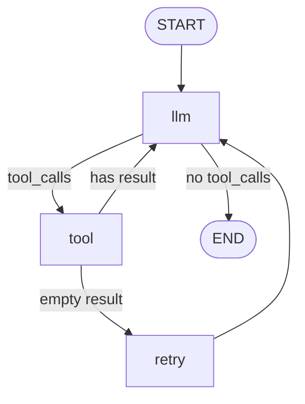

# 10장. LCEL의 한계와 그래프의 등장 — mini_agent를 세 번째로 짓기

요구사항 한 줄을 추가해 보자.

> "웹 검색 결과가 비어 있으면 검색어를 다시 만들어서, 한 번만 더 시도하자."

별것 아닌 문장이다. 검색이 빈손으로 돌아왔을 때, 같은 질의를 그대로 다시 던지지 말고, LLM에게 "더 나은 검색어를 생각해" 시킨 뒤 한 번만 더 시도하자는 것. 사람이 검색창에서 늘 하는 그 동작이다. 9장에서 우리는 LangChain이 잘 받는 자리와 못 받는 자리를 갈라 봤다. 7장에서 짠 `mini_agent_lc.py`에 이 한 줄을 끼워 보자. 30~50줄짜리 작은 변경이면 충분할 것 같지 않은가. 그렇다면 한 번 짜 보자.

짜 보면, 막힌다. 정확히 어디서 막히는지부터 차근차근 살펴보자.

## 우리가 짜야 했던 것은 "한 번 더 시도"였다

`web_search` 도구가 빈 결과를 돌려줬다고 해 보자. 7장의 ReAct 루프는 그냥 그 빈 결과를 `ToolMessage`로 담아 다시 LLM에게 던지고 만다. LLM이 다음 턴에서 "아무것도 못 찾았으니 다시 검색해 볼게"라고 *알아서 판단해 주기를* 기대하는 셈이다. 운이 좋으면 그렇게 동작한다. 운이 나쁘면 LLM이 "아무것도 못 찾았네요"라고 사용자에게 답해 버린다. 이건 결정적이지 않다.

우리는 결정적인 동작을 원한다. "검색 결과가 비면, 무조건 검색어를 한 번 더 만들어 재시도. 두 번째도 비면 그제야 포기." 이걸 코드에 박아 두고 싶다. LLM의 변덕에 맡기지 말고. 자, LCEL로 짜 보자.

LCEL은 셸 파이프 같다고 7장에서 배웠다. `prompt | llm | parser`. 왼쪽에서 오른쪽으로 흐른다. 그런데 우리가 짜야 할 건 *흐름이 한 번 되돌아가는 모양*이다. 검색 결과를 본 뒤 "비었다 → 재시도", "있다 → 다음 단계." 분기는 `RunnableBranch`로 받을 수 있다. 그런데 "재시도"는 같은 노드로 *되돌아가는 엣지*다. LCEL의 파이프는 정의상 단방향이다. 왼쪽이 오른쪽으로 흐를 뿐, 오른쪽이 왼쪽으로 돌아오는 건 없다.

물론 우회로는 있다. while 루프를 바깥에 두고, LCEL chain을 그 안에서 *재호출*하면 된다. 이렇게.

```python
# mini_agent_lc.py에 "재시도 한 번"을 끼우려는 시도
# (실제로 짜 보면 코드가 자꾸 더러워진다)

from langchain_core.prompts import ChatPromptTemplate
from langchain_core.output_parsers import StrOutputParser

# 검색어 재작성 프롬프트
rewrite_prompt = ChatPromptTemplate.from_messages([
    ("system", "기존 검색어가 빈 결과를 돌려줬다. 더 일반적인 표현으로 다시 만들어."),
    ("user", "원래 검색어: {query}\n다시 만든 검색어 한 줄만 답해."),
])
rewrite_chain = rewrite_prompt | llm | StrOutputParser()

def run_agent_with_retry(user_input: str, max_iter: int = 10) -> str:
    messages = [HumanMessage(content=user_input)]
    for i in range(max_iter):
        ai_msg: AIMessage = llm.invoke(messages)
        messages.append(ai_msg)

        if not ai_msg.tool_calls:
            return ai_msg.content

        for call in ai_msg.tool_calls:
            tool_fn = TOOL_MAP[call["name"]]
            try:
                result = tool_fn.invoke(call["args"])
            except Exception as e:
                result = f"Tool error: {e}"

            # ▼ 여기부터 우회로 — 추가된 18줄
            if call["name"] == "web_search":
                is_empty = (
                    not result
                    or "no result" in str(result).lower()
                    or len(str(result).strip()) < 10
                )
                if is_empty:
                    # 1) 검색어를 재작성한다
                    new_query = rewrite_chain.invoke(
                        {"query": call["args"].get("query", "")}
                    ).strip()
                    # 2) 같은 도구를 한 번 더 호출한다
                    result = tool_fn.invoke({"query": new_query})
                    # 3) "재시도했다"는 사실을 메시지에 남긴다
                    #    (안 남기면 LLM이 같은 쿼리로 또 호출할 수 있다)
                    result = (
                        f"[Retried with query: {new_query}]\n{result}"
                    )
            # ▲ 우회로 끝

            messages.append(ToolMessage(
                content=str(result), tool_call_id=call["id"]
            ))
    return "[iteration cap reached]"
```

코드가 자꾸 더러워진다. 무엇이 더러운가. 다섯 가지를 짚어 보자.

첫째, **재시도 로직이 ReAct 루프 안에 끼어 있다**. 도구 실행 루프는 본래 "모델이 도구를 부르면 실행하고 결과를 돌려준다"는 단순한 일을 한다. 거기에 "근데 web_search가 빈 결과를 주면…"이라는 도구별 특수 로직이 박혔다. 도구가 늘어나면 이 if-블록도 늘어난다. 곧 ReAct 루프는 도구별 우회로의 잡탕이 된다.

둘째, **빈 결과 판정이 문자열 매칭에 의존한다**. `"no result" in result`. 도구 구현이 바뀌면 깨진다. 도구가 영어 메시지를 한국어로 바꾸기만 해도 깨진다. 빈 결과를 "도구가 알려 주는 방식"이 형식화돼 있지 않으니까.

셋째, **재시도 사실을 LLM에게 알리는 길이 비공식적이다**. 결과 문자열 앞에 `[Retried with query: ...]`를 그냥 붙였다. LLM이 그걸 보고 "재시도였구나" 알아채기를 바라는 셈이다. 알아채면 다행, 못 알아채면 또 검색을 부른다. 결정적이지 않다.

넷째, **재시도 상태를 추적하는 변수가 없다**. 만약 "한 번만 더 시도, 그다음엔 포기"를 강제하고 싶으면 어디다 카운터를 둬야 할까. 함수의 지역 변수? 그럼 같은 사용자 쿼리 안에서 검색이 두 번 나오면 카운터가 합쳐진다. tool_call_id별로? 그럼 dict가 또 하나 생긴다. *상태*가 흩어진다.

다섯째, **chain의 매끄러움이 깨졌다**. 7장의 자랑은 `prompt | llm | parser`였다. 이 함수는 LCEL chain이 아니다. while 루프와 if-else가 섞인 파이썬 명령형 코드다. 그 안에서 LCEL chain (`rewrite_chain`)을 *호출*만 하고 있다. LCEL의 합성 미학은 여기서 끝났다.

그렇다면 어떻게 해야 할까. 우리가 진짜로 원한 건 이런 모양이다.

```
[LLM 추론] ──▶ [도구 실행] ──▶ [결과 검사]
                                  │
                                  ├── 비어 있나? ──▶ [검색어 재작성] ──▶ [도구 실행]
                                  │
                                  └── 채워졌나? ──▶ [LLM 추론] (또는 종료)
```

화살표가 한 번 되돌아간다. 노드 사이로 상태가 흘러간다. "재시도했는가"가 어딘가에 명시적으로 적혀 있다. 코드가 아니라 *그래프*다. 그리고 그게 정확히 LangGraph가 받는 자리다.

같은 요구를 LangGraph로 옮겨 보자.

```python
# mini_agent_lg.py — 같은 요구를 푼 LangGraph 버전
from typing import TypedDict, Annotated
from langchain_anthropic import ChatAnthropic
from langchain_core.messages import (
    BaseMessage, HumanMessage, ToolMessage, AIMessage,
)
from langchain_core.tools import tool
from langgraph.graph import StateGraph, START, END
from langgraph.graph.message import add_messages

# --- 상태 정의: TypedDict 한 장 ---
class AgentState(TypedDict):
    messages: Annotated[list[BaseMessage], add_messages]
    retried: bool  # web_search를 이미 한 번 재시도했는가

# --- 도구는 7장과 동일 ---
@tool
def web_search(query: str) -> str:
    """Search the web. Returns empty string when no result."""
    # 데모 stub: 'unknown' 들어오면 비운다
    if "unknown" in query.lower():
        return ""
    return f"Top result for '{query}': example.com/2026"

TOOLS = [web_search]
TOOL_MAP = {t.name: t for t in TOOLS}
llm = ChatAnthropic(model="claude-sonnet-4-5", temperature=0).bind_tools(TOOLS)

# --- 노드: state -> partial state ---
def call_llm(state: AgentState) -> dict:
    return {"messages": [llm.invoke(state["messages"])]}

def run_tool(state: AgentState) -> dict:
    last = state["messages"][-1]
    new_msgs, retried = [], state.get("retried", False)
    for call in last.tool_calls:
        result = TOOL_MAP[call["name"]].invoke(call["args"])
        # 빈 결과 + 아직 재시도 안 했으면 표시만 한다 (재시도 노드가 처리)
        if call["name"] == "web_search" and not result and not retried:
            new_msgs.append(ToolMessage(
                content="[empty — will retry]", tool_call_id=call["id"]
            ))
            return {"messages": new_msgs, "_needs_retry": True}
        new_msgs.append(ToolMessage(content=str(result), tool_call_id=call["id"]))
    return {"messages": new_msgs}

def rewrite_and_retry(state: AgentState) -> dict:
    # 마지막 tool_call의 쿼리를 가져와 다시 만든다
    ai_msg = state["messages"][-2]  # 직전 AIMessage
    original_query = ai_msg.tool_calls[0]["args"].get("query", "")
    new_query = llm.invoke([HumanMessage(
        content=f"이 검색어가 빈 결과였다: '{original_query}'. 더 일반적인 표현으로 한 줄만 답해."
    )]).content.strip()
    result = web_search.invoke({"query": new_query})
    return {
        "messages": [ToolMessage(
            content=f"[Retried with '{new_query}'] {result}",
            tool_call_id=ai_msg.tool_calls[0]["id"],
        )],
        "retried": True,
    }

# --- 라우팅 함수: 조건부 엣지의 코드 부분 ---
def route_after_llm(state: AgentState) -> str:
    return "tool" if state["messages"][-1].tool_calls else END

def route_after_tool(state: AgentState) -> str:
    last = state["messages"][-1]
    if "[empty — will retry]" in last.content and not state.get("retried", False):
        return "retry"
    return "llm"

# --- 그래프 조립 ---
graph = StateGraph(AgentState)
graph.add_node("llm", call_llm)
graph.add_node("tool", run_tool)
graph.add_node("retry", rewrite_and_retry)
graph.add_edge(START, "llm")
graph.add_conditional_edges("llm", route_after_llm, {"tool": "tool", END: END})
graph.add_conditional_edges("tool", route_after_tool, {"retry": "retry", "llm": "llm"})
graph.add_edge("retry", "llm")
agent = graph.compile()

if __name__ == "__main__":
    out = agent.invoke({
        "messages": [HumanMessage(content="2026년 unknown technology 동향 알려줘")],
        "retried": False,
    })
    print(out["messages"][-1].content)
```

길이를 세 보면 80줄 안팎이다. 7장 `mini_agent_lc.py`의 71줄에서 그리 늘지 않았다. 그런데 안의 *생김새*가 다르다. 무엇이 다른가.

세 가지를 짚어 보자. 첫째, **상태가 한 장의 TypedDict로 모였다**. `retried` 플래그가 코드 어딘가의 지역 변수가 아니라, 그래프 전체가 들여다보는 *상태 스키마의 일부*다. 노드 어디서든 읽고 쓸 수 있다. 둘째, **흐름이 코드가 아니라 그래프로 적혔다**. "도구 결과가 비면 retry 노드로, 아니면 llm 노드로"가 `add_conditional_edges` 한 줄에 박혔다. 코드 흐름과 의도 흐름이 같은 모양이다. 셋째, **각 노드가 하나의 일만 한다**. `call_llm`은 LLM을 부른다. `run_tool`은 도구를 실행한다. `rewrite_and_retry`는 재시도한다. 책임이 분리돼 있다. 도구별 우회로가 ReAct 루프에 끼어들지 않는다.

코드가 깔끔해졌다. 그리고 무엇보다, *그래프가 머리에 그려진다*. 이게 LangGraph가 받는 자리의 진짜 가치다.

## DAG가 못 하는 다섯 가지

위에서 본 "한 번 더 시도"는 LCEL이 못 받는 영역의 시작일 뿐이다. LCEL은 본질적으로 DAG — directed acyclic graph — 다. 사이클이 없는 방향 그래프. 실제 에이전트가 마주치는 다섯 가지 요구를 정리해 보자. 어느 하나라도 들어오면, DAG로는 부담스러워진다.

첫째, **사이클**이다. "한 번 더 시도", "조건이 만족될 때까지 반복", "사용자 피드백을 받아 다시 생성." 같은 노드로 돌아가는 엣지가 필요하다. LCEL의 파이프는 단방향이라 우회로(외부 while)로만 가능하다.

둘째, **공유 상태**다. 여러 노드가 같은 변수를 읽고 쓰는 자리. `retried` 같은 플래그, 누적된 메시지 목록, 사용자 프로필 등. LCEL은 chain 사이로 dict를 흘려보내는 모양이라, *그 dict의 스키마를 보장하는 길*이 없다. 그래서 큰 LCEL chain을 짜다 보면 각 단계의 입력/출력이 무엇인지 자꾸 까먹고, 디버깅이 미궁이 된다.

셋째, **human-in-the-loop**(HITL)다. "이메일을 보내기 전 사람의 승인을 기다리자." 그래프가 특정 노드에서 멈추고, 외부에서 신호가 올 때까지 *기다린다*. 그 뒤에 멈춘 자리에서 다시 시작한다. LCEL chain은 한 번 `.invoke()`되면 끝까지 흐른다. 중간에서 멈추고 기다리는 추상이 없다.

넷째, **persistence/checkpointing**이다. 장시간 대화나 며칠짜리 에이전트 작업의 상태를 디스크에 저장하고, 실패 시 같은 지점에서 부활시키는 능력. LangGraph는 `compile(checkpointer=...)` 한 줄로 이걸 받는다. LCEL은 그런 길이 없다. 직접 짠다면 매 step마다 상태를 직렬화해 디스크에 쓰는 코드를 손으로 짜야 한다. 12장에서 본격적으로 다룰 주제다.

다섯째, **멀티 에이전트 핸드오프**다. 한 에이전트가 다른 에이전트에게 작업을 위임하는 모양. supervisor가 worker를 부르고, 그 결과를 받아 다음 worker를 부른다. 핸드오프 사이로 상태가 흘러야 한다. 이걸 LCEL chain의 합성으로 짤 수도 있지만, supervisor의 "다음 누구를 부를까"가 LLM의 판단이라면, 그 판단을 다시 그래프의 라우팅으로 받아야 한다. 11장에서 본격적으로 다룬다.

이 다섯 가지 중 하나라도 들어오면 그래프 추상이 필요하다. *둘 이상이* 들어오면 거의 무조건 LangGraph가 낫다. 7장의 mini_agent는 사이클 하나만 빠진 ReAct 루프였기에 LCEL 위에서 깔끔했다. "재시도 한 번"이라는 한 줄이 들어오자 그 깔끔함이 깨졌다. 사이클이 들어왔기 때문이다.

## StateGraph — 약속은 단 하나

LangGraph의 핵심 API는 단순하다. 한 화면에 다 들어간다. 살펴보자.

```python
from langgraph.graph import StateGraph, START, END
from typing import TypedDict

class MyState(TypedDict):
    foo: str
    bar: int

def node_a(state: MyState) -> dict:
    return {"foo": state["foo"].upper()}

def node_b(state: MyState) -> dict:
    return {"bar": state["bar"] + 1}

graph = StateGraph(MyState)
graph.add_node("a", node_a)
graph.add_node("b", node_b)
graph.add_edge(START, "a")
graph.add_edge("a", "b")
graph.add_edge("b", END)
agent = graph.compile()
```

다섯 개의 부품이 전부다.

**`StateGraph(StateSchema)`** — 그래프의 모양을 잡는 컨테이너. 인자로 받는 TypedDict가 상태의 스키마다. 노드들이 읽고 쓸 변수 목록이 여기 박힌다. 큰 시스템에서 이 한 장의 TypedDict가 *살아 있는 문서* 역할을 한다. 어떤 상태가 그래프 안을 흐르는지 한눈에 보인다.

**`add_node(name, fn)`** — 노드는 함수다. 시그니처가 정해져 있다. `state -> partial state`. 인자로 현재 상태 전체를 받고, 자기가 바꾸고 싶은 키만 담은 dict를 돌려준다. 이게 LangGraph의 단 하나의 약속이다. "노드는 상태 일부를 갱신한다." 단순하지 않은가. 노드 안에서 무얼 하든 자유다. LLM을 부르든, 외부 API를 두드리든, 파일을 쓰든. 약속은 단 하나, 입력은 상태고 출력은 상태의 일부라는 것.

**`add_edge(from, to)`** — 무조건 다음 노드로 가는 정적 엣지. 흐름이 결정돼 있을 때 쓴다.

**`add_conditional_edges(from, route_fn, route_map)`** — 조건부 분기. `route_fn(state)`이 라우팅 키를 돌려주고, `route_map`이 그 키를 노드 이름으로 매핑한다. *여기가 그래프와 일반 chain의 결정적 차이*다. 다음 노드를 코드(파이썬 함수)가 결정하지만, 그 함수 안에서 LLM에게 물어볼 수도 있다. "**라우팅 로직은 코드, 의사결정은 LLM**." LangGraph가 추천하는 분업 한 줄이다.

**`compile()`** — 정의된 그래프를 실행 가능한 객체로 만든다. 인자로 `checkpointer=`, `store=` 같은 부가물을 끼울 수 있다. 한 번 compile하면 `.invoke()`, `.stream()`, `.batch()`로 실행한다. LCEL의 Runnable과 같은 인터페이스를 가진다. 그래서 LangGraph 그래프 자체를 더 큰 LCEL chain의 일부로 끼울 수도 있다.

다섯 부품으로 이뤄지는 단순한 API다. 그러나 이 다섯이 받는 모양의 폭은 LCEL보다 훨씬 넓다. LCEL이 "셸 파이프"라면, LangGraph는 "유한 상태 기계 + 함수형 갱신"이다. *모든 사이클 가능한 워크플로*가 이 다섯 부품 안에 들어온다.

## 노드 함수 — state in, partial state out

"노드는 `state -> partial state` 함수다." 이 약속을 조금 더 들여다보자. 작은 데서 출발해 보자.

```python
class CounterState(TypedDict):
    count: int

def increment(state: CounterState) -> dict:
    return {"count": state["count"] + 1}
```

`increment`가 돌려주는 dict는 `{"count": ...}` 단 한 키만 있다. 상태 전체가 아니다. LangGraph가 알아서 기존 상태와 *얕은 병합*을 한다. 키가 같으면 덮어쓰고, 없으면 추가한다. 그래서 노드는 *자기가 책임지는 키만 갱신*하면 된다. 이게 함수의 작은 책임을 유지해 준다.

그런데 메시지 목록처럼 *누적되는* 상태는 어떻게 다룰까. 매번 덮어쓰면 이전 메시지가 다 사라진다. 매번 손으로 `state["messages"] + [new_msg]`를 하는 것도 번거롭다. LangGraph가 받는 길이 두 가지 있다. 첫째는 노드가 직접 누적 리스트를 돌려주는 것. 둘째는 reducer를 박는 것.

```python
from typing import Annotated
from langgraph.graph.message import add_messages

class AgentState(TypedDict):
    messages: Annotated[list, add_messages]
```

`Annotated[list, add_messages]` — 이게 reducer 선언이다. "이 키는 덮어쓰지 말고, `add_messages` 함수로 합쳐 줘." `add_messages`는 LangGraph가 기본 제공하는 reducer로, 메시지 목록에 새 메시지를 *append* 한다. 노드가 `{"messages": [new_msg]}`를 돌려주면, 그래프는 알아서 기존 messages 뒤에 붙인다. 우리가 매번 `messages + [new]`를 손으로 짜지 않아도 된다.

reducer는 직접 정의할 수도 있다. set의 합집합, 카운터의 합산, 최댓값. 상태 키마다 자기에게 맞는 합성 규칙을 박을 수 있다. *상태의 모양*이 그래프의 한가운데에 명시적으로 박혀 있는 셈이다. 이게 LCEL에는 없다. LCEL의 chain은 입력 dict가 어떻게 흘러가는지를 *추상적으로*만 보장한다. LangGraph는 상태 스키마와 reducer로 *그 흐름을 형식화*한다.

기억해 두자. **노드는 작게, 상태는 한 장에, reducer로 합성을 통제.** 이 세 줄이 LangGraph로 짤 때의 호흡이다.

## 조건부 엣지 — 라우팅은 코드, 판단은 LLM

`add_conditional_edges`를 다시 들여다보자. 위 mini_agent_lg의 한 부분이다.

```python
def route_after_llm(state: AgentState) -> str:
    return "tool" if state["messages"][-1].tool_calls else END

graph.add_conditional_edges("llm", route_after_llm, {"tool": "tool", END: END})
```

`route_after_llm`은 *그냥 파이썬 함수*다. LLM의 마지막 응답에 `tool_calls`가 있는지 보고 문자열을 돌려준다. 이 함수 안에 LLM 호출은 *없다*. 라우팅 자체는 가벼운 코드다.

그런데 "supervisor 노드가 다음 worker를 결정한다" 같은 자리는 어떨까. 다음 노드 이름을 *LLM이* 골라야 한다. 이때는 어떻게 짜는가. 정답은 단순하다. **라우팅 함수는 코드, 의사결정은 LLM 노드 안에서.** 즉, "supervisor 노드"가 따로 있고, 그 노드 안에서 LLM을 부른 뒤, LLM의 결과를 상태에 적어 둔다. 그러면 그 다음 라우팅 함수는 *상태에 적힌 값을 읽기만* 한다.

```python
def supervisor_node(state: AgentState) -> dict:
    # LLM에게 다음 worker를 물어본다
    decision = llm.invoke([
        SystemMessage(content="다음 어떤 worker를 부를까? researcher/writer/editor 중 하나만."),
        *state["messages"],
    ])
    return {"next_worker": decision.content.strip()}

def route_to_worker(state: AgentState) -> str:
    return state["next_worker"]  # 그냥 읽기만 한다

graph.add_conditional_edges("supervisor", route_to_worker,
    {"researcher": "researcher", "writer": "writer", "editor": "editor"})
```

이 분업이 LangGraph의 미덕이다. 의사결정이 LLM의 손에 있되, 그 결정을 *그래프 위의 명시적 라우팅 키*로 변환해 적어 둔다. 라우팅 함수는 가볍게, 결정적으로 그 키를 읽는다. 디버깅할 때 상태 스냅숏을 들여다보면 "supervisor가 어디로 보냈는가"가 한 자리에 적혀 있다. 11장에서 multi-agent supervisor를 짤 때 이 패턴이 다시 등장한다. 기억해 두자.

## mini_agent의 LangGraph 버전 — 다시 본다

앞에서 한 번 흘렸으니 한 번 더 짚어 보자. `mini_agent_lg.py`의 그래프 모양은 노드 셋, 엣지 다섯이다.

```
START ──▶ [llm] ─조건─▶ [tool] ─조건─▶ [retry] ──▶ [llm] ...
                │            │
                ▼            └────────▶ [llm] ...
              END
```

`llm` 노드가 LLM을 부른다. 응답에 `tool_calls`가 있으면 `tool`로, 없으면 `END`로 분기한다. `tool` 노드가 도구를 실행한다. 결과가 비었고 아직 재시도 안 했으면 `retry`로, 아니면 `llm`으로 돌려보낸다. `retry`는 검색어를 다시 만들어 한 번 더 호출하고, `retried=True`로 표시한 뒤 `llm`으로 보낸다.

7장 `mini_agent_lc.py`와 비교했을 때, 코드 줄 수는 비슷하다. 그런데 *생김새가 다르다*. LCEL 버전은 `for i in range(max_iter)` 루프 안에 모든 게 들어가 있었다. 도구 실행, 분기, 종료 판정이 한 함수 안에 평평하게 깔려 있었다. LangGraph 버전은 그 모든 게 그래프의 위상에 박혀 있다. 노드와 엣지가 그 자체로 *흐름 문서*다.

> 7장과 10장의 mini_agent를 한자리에 두고 보면, 같은 동작이 두 가지 추상 위에서 어떻게 다른 모양을 가지는지가 보인다. LCEL은 "셸 파이프", LangGraph는 "유한 상태 기계." 두 추상이 받는 자리는 겹치지 않는다.

## 5종 워크플로, 이제 다 받는다

1장에서 Anthropic의 다섯 가지 워크플로를 처음 만났다. 7장에서 그 중 셋(prompt chaining, routing, parallelization)을 LCEL이 매끄럽게 받는다는 표를 그렸고, 둘(orchestrator-workers, evaluator-optimizer)이 미해결 칸으로 남았다. 그 미해결 칸을 LangGraph가 어떻게 채우는지 표로 못 박아 두자.

| 워크플로 | LCEL 표현 | LangGraph 표현 | 매끄러움 |
|---|---|---|---|
| **Prompt chaining** | `step1 \| step2 \| step3` | 노드 셋, 직선 엣지 | LCEL이 더 간결 |
| **Routing** | `RunnableBranch` | `add_conditional_edges` | 둘 다 자연스럽 |
| **Parallelization** | `RunnableParallel` | 여러 노드에 같은 엣지로 분기 → reducer로 합류 | LCEL이 더 간결 |
| **Orchestrator-workers** | (강제로 끼우면 가능) | supervisor 노드 + worker 노드들, conditional edges | **LangGraph가 매끄럽다** |
| **Evaluator-optimizer** | (사이클 필요, 거의 불가) | generator 노드 ↔ evaluator 노드, 조건 충족까지 사이클 | **LangGraph 전용** |

7장 표의 미해결 두 칸이 마침내 자연스러운 표현을 얻었다. orchestrator-workers는 supervisor 노드가 도구 호출(또는 LLM 응답)로 다음 worker를 고르고, 그 결정을 라우팅 함수가 받아 해당 worker 노드로 보낸다. evaluator-optimizer는 generator 노드와 evaluator 노드 사이에 사이클을 두면 된다. evaluator가 "통과"를 돌려줄 때까지 generator로 다시 보낸다. 코드가 추하게 부풀어 오를 일이 없다.

여기서 한 가지 더 짚어 보자. **prompt chaining이나 parallelization은 여전히 LCEL이 더 간결하다.** 그래프로 짤 수도 있지만, 두 줄이면 끝날 합성을 굳이 노드 셋으로 풀어 헤칠 이유가 없다. **둘을 같이 쓰는 게 정답이다.** 합성에는 LCEL, 사이클·상태·HITL에는 LangGraph. 사실 LangGraph 노드 안에서 LCEL chain을 그대로 부를 수도 있다. 두 추상은 서로를 배제하지 않는다.

## 그래프를 그림으로 본다

LangGraph가 주는 작은 선물이 하나 있다. 컴파일된 그래프를 *그림으로* 뽑아 볼 수 있다. mermaid 형식이라 README에 그대로 박을 수 있다.

```python
print(agent.get_graph().draw_mermaid())
```

`mini_agent_lg`의 그래프를 뽑으면 이런 모양이 찍힌다.



이걸 보면, 우리가 짠 흐름이 그대로 그림이 된다. 코드 리뷰에서 동료에게 "이 에이전트는 이렇게 동작한다"를 설명할 때 이 그림 한 장이면 충분하다. LCEL 버전에서 같은 설명을 하려면 함수 본문을 줄 단위로 짚어 가며 "여기서 이렇게 분기하고, 여기서 이렇게 돌아오고…"를 해야 했다. 시각화가 거의 공짜인 추상에는 그 자체의 가치가 있다.

`draw_png()`, `draw_ascii()`도 있다. 발표 자료에 박을 거면 PNG, 터미널에서 빨리 보고 싶으면 ASCII, 마크다운에 박을 거면 mermaid. 골라 쓰면 된다.

## 세 mini_agent를 한 줄에 세워 보자

Part 1의 `mini_agent.py` v3, Part 2의 `mini_agent_lc.py`, Part 3의 `mini_agent_lg.py`. 세 친구를 한 자리에 세워 비교해 보자. 6장과 7장의 비교표를 확장한 모양이다.

| 항목 | v3 (Part 1) | LangChain (Part 2) | LangGraph (Part 3) |
|---|---|---|---|
| 실 코드 라인 (재시도 없는 baseline) | ~140줄 | ~50줄 | ~70줄 |
| "재시도 한 번"을 끼웠을 때 | +30줄, 우회로 | +20줄, 우회로 | +20줄, 노드 하나 |
| 직접 import 의존성 | `anthropic` 하나 | `langchain-anthropic`, `langchain-core` | + `langgraph` |
| 추상 단 수 (호출 트레이스 깊이) | 1 (SDK 직접) | 3~4 (Runnable → Chat → SDK) | 4~5 (Graph → Runnable → Chat → SDK) |
| 사이클 지원 | 직접 짠 while로 (자유) | 외부 while로 우회 | **그래프의 일급 시민** |
| 상태 형식화 | 지역 변수, dict | dict 흐름 (스키마 보장 없음) | **TypedDict, reducer** |
| HITL 끼우기 | 직접 input() 등으로 (자유) | LCEL 자체로는 없음 | `interrupt()` 한 줄 |
| Persistence | 직접 짠다 | LCEL 자체로는 없음 | `compile(checkpointer=...)` |
| 시각화 | 손으로 그린다 | LCEL Visualizer | `draw_mermaid()` 한 줄 |
| 변경 용이성 (요구사항 한 줄 추가) | 코드 어딘가에 끼움 | 우회로 코드가 부푼다 | **노드/엣지 하나 추가** |
| 디버깅 난이도 | 낮음 (한 화면) | 중 (traceback 깊음) | 중 (상태 스냅숏으로 추적) |
| 어울리는 자리 | 작은 단일 루프, 학습용 | 합성 위주 chain, 단일 ReAct | 사이클·상태·HITL·multi-agent |

이 표를 보면 *세 추상이 받는 자리가 겹치지 않는다*는 게 분명해진다. 작은 ReAct 루프 하나만 짤 거면 v3, 다섯 워크플로 중 셋(chaining, routing, parallel)을 깔끔하게 합성할 거면 LangChain, 사이클·상태·HITL·multi-agent를 자연스럽게 받을 거면 LangGraph. 셋 중 하나를 *고를 게* 아니라, 셋 다 *손에 쥐고 자리에 맞게 쓰는* 게 정답이다.

물론 LangGraph도 그냥 다 좋은 건 아니다. 추상이 한 단 더 쌓이고, 의존성이 또 늘고, 디버깅할 때 *그래프 안에서 노드 사이로 흐르는 상태*를 머릿속에 그려야 한다. 사이클이 들어오면 무한 루프의 가능성도 떠안는다. 자기 자신으로 돌아가는 엣지를 두면 `recursion_limit`이나 카운터 같은 길로 멈춤을 보장해야 한다. *그래프는 공짜가 아니다*. 그러나 위 다섯 가지(사이클·상태·HITL·persistence·multi-agent) 중 하나라도 들어오는 자리라면, 이 비용을 떠안는 편이 LCEL의 우회로를 매번 짜는 것보다 *훨씬* 낫다. 이 책의 권고는 한 줄이다. **요구사항이 5종 워크플로 중 셋 안에 들어가면 LCEL, 둘 쪽이면 LangGraph. 섞여 있으면 둘 다.**

## 마무리 — 다음은 여러 명이 같이 일한다

이 장에서 우리는 mini_agent를 세 번째이자 마지막으로 다시 지었다. "재시도 한 번"이라는 한 줄짜리 요구가 LCEL에서 어떻게 막혔고, LangGraph에서 어떻게 풀렸는지를 따라가 봤다. DAG가 못 받는 다섯 가지를 짚었고, StateGraph의 다섯 부품을 살펴봤고, 5종 워크플로의 매핑 표를 마지막 칸까지 채웠다.

기억해 두자. LangGraph의 단 하나의 약속은 "노드는 `state -> partial state` 함수다"라는 것. 이 한 줄이 사이클·상태·HITL·persistence·핸드오프를 다 받아 준다. 그리고 LCEL이 매끄러운 자리는 여전히 LCEL이 맡는다. 둘은 경쟁이 아니라 분업이다.

그런데 우리는 아직 한 자리를 안 다뤘다. **여러 에이전트가 같이 일하는 자리.** supervisor가 worker를 부르고, worker가 또 다른 worker를 부르고, 사이로 상태가 흐르고 핸드오프가 일어난다. 진짜로 멀티 에이전트가 필요한 자리는 어디일까. 멀티가 필요해 보였지만 사실 단일 에이전트 한 명이 더 잘했던 자리는 어디일까. 11장에서 supervisor 패턴과 핸드오프의 함정을 같이 살펴보자.
