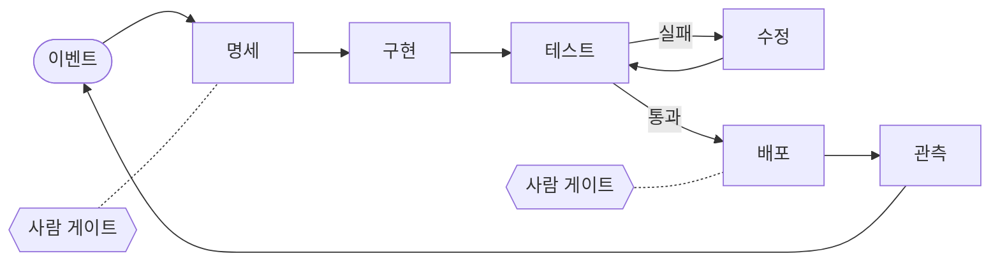

# 1장. 사람이 코드를 쓰지도 읽지도 않는 곳 — 소프트웨어 팩토리란 무엇인가

> Code must not be written by humans.
>
> Code must not be reviewed by humans.

코드는 사람이 써서는 안 된다. 코드는 사람이 리뷰해서도 안 된다. 2026년 2월, StrongDM의 AI 팀이 자기들이 일하는 방식을 공개하며 맨 앞에 내건 원칙이다. 이 두 문장을 처음 읽었을 때 어떤 기분이 들었는가? 코웃음이 나왔을 수도 있고, 등이 서늘해졌을 수도 있다. 매일 PR을 열어 diff를 읽고 코멘트를 다는 일을 개발자의 본업으로 배워 온 사람에게, 이 원칙은 직업의 정의를 통째로 지우는 말처럼 들린다.

원칙에는 세 번째 줄이 붙어 있다. 오늘 사람 엔지니어 한 명당 토큰에 1,000달러 이상을 쓰지 않았다면, 당신의 소프트웨어 팩토리(software factory)에는 아직 개선할 여지가 있다는 것이다. 코드를 쓰지도 읽지도 말고, 대신 토큰을 태우라니. 과장된 구호로 넘기고 싶어지는 것도 무리는 아니다.

그런데 이 팀은 구호만 외친 게 아니었다. 실제로 그렇게 돌아가는 시스템을 만들었고, 거기에 '팩토리'라는 이름을 붙였다. 비슷한 시기에 같은 이름, 혹은 같은 현상을 가리키는 다른 이름이 업계 곳곳에서 튀어나왔다. 옳은지 그른지는 잠시 미뤄 두자. 판정하려면 먼저 그들이 무엇을 했는지, 그리고 그것을 무엇이라고 불러야 하는지부터 알아야 한다.

## 세 줄짜리 선언

### StrongDM은 무엇을 만들었나

StrongDM의 AI 팀은 공동창업자이자 CTO인 Justin McCarthy와 Jay Taylor, Navan Chauhan으로 2025년 7월 14일에 꾸려졌다. 팀이 원칙과 기법을 정리해 공개한 것은 2026년 2월 6일 무렵이고, 2월 19일에는 회사 블로그에 요약이 올라왔다. 한국 개발자들에게는 같은 달 GeekNews가 「어떻게 코드를 보지 않고도 뛰어난 소프트웨어를 개발하는가?」라는 제목으로 소개하면서 알려졌다.

그들이 설명하는 일의 분담은 단순하다. 사람은 의도를 정의한다. 무엇을 만들지 적은 명세, 사용자가 겪을 시나리오, 지켜야 할 제약이 사람의 몫이다. 코드를 생성하고, 그 코드가 실제로 의도대로 동작하는지 확인하고, 어긋나면 다시 고치는 일은 에이전트가 맡는다. 이 반복은 결과가 수렴할 때까지 이어진다. 팀이 공개한 도구 가운데 Attractor가 이 방식을 잘 보여 준다. 여러 단계를 그래프로 엮은 비대화형 코딩 에이전트인데, 작업이 완전히 명세되어 있으면 처음부터 끝까지 스스로 돈다.

회사 블로그는 이 구조를 한 줄로 요약했다.

> validation replaces code review

검증이 코드 리뷰를 대체한다. 같은 글은 이 시스템이 실제 시나리오를 돌리고, 실제 동작을 검증하고, 루프 안에 사람 없이 스스로를 교정한다고 적었다. 여기서 말하는 검증은 우리에게 익숙한 단위 테스트 몇 개와는 결이 다르다. 그들은 테스트 스위트의 통과·실패라는 불리언 대신, 시나리오를 따라간 여러 실행 궤적 가운데 사용자를 만족시켰을 비율, 곧 만족도(satisfaction)를 성공 기준으로 삼았다. 이를 떠받치는 장치도 있다. 코딩 에이전트가 볼 수 없는 곳에 따로 두고 채점에만 쓰는 홀드아웃 시나리오, 그리고 Okta·Jira·Slack 같은 외부 서비스의 동작을 복제한 Digital Twin Universe(이하 디지털 트윈)다. 이 장치들이 어떻게 맞물려 돌아가는지는 6장에서 자세히 뜯어볼 테니, 지금은 이름만 기억해두자.

한 가지 짚어 둘 것이 있다. 이 팀의 공개 자료에는 어떤 모델을 썼는지가 나와 있지 않다. 이 사례에서 배울 것은 특정 모델의 힘보다 시스템의 짜임새다.

### 윌리슨의 두 질문

이 사례를 널리 알린 사람은 Simon Willison이다. 그는 2025년 10월 StrongDM 팀을 직접 방문했고, 2026년 2월 7일 블로그에 그 내용을 정리했다. X에는 지금까지 본 AI 보조 개발 가운데 가장 야심 찬 형태라고 적었다. 그러면서도 블로그 글에서 두 가지 질문을 던졌다. 이 두 질문은 앞으로도 여러 번 돌아올 것이다.

첫 번째 질문은 정확성에 관한 것이다.

> how can you prove that software you are producing works if both the implementation and the tests are being written for you by coding agents?

구현도 테스트도 코딩 에이전트가 써 준다면, 만들어 낸 소프트웨어가 동작한다는 것을 무엇으로 증명할 수 있을까? 곰곰이 생각해 보면 꽤 난감한 질문이다. 에이전트가 기능을 구현하고, 같은 에이전트가 그 기능을 검사할 테스트를 쓰고, 테스트가 통과하면 완료라고 보고한다. 시험을 보는 사람과 채점하는 사람이 같은 셈이다. StrongDM이 홀드아웃 시나리오를 에이전트 눈에 띄지 않는 곳에 숨겨 둔 이유가 바로 여기에 있다.

두 번째 질문은 비용이다. 하루 1,000달러를 한 달로 늘리면 엔지니어 한 명당 대략 2만 달러가 된다. Willison은 이 패턴이 정말로 엔지니어 한 명당 예산에 월 2만 달러를 더한다면 자신에게는 훨씬 덜 흥미롭다고 썼다. 여기서 월 2만 달러는 Willison이 하루 기준을 가정해 환산한 조건부 계산이다. StrongDM이 실제로 매달 그만큼 쓴다고 밝힌 적은 없으니, 옮겨 말할 때 조심하자.

두 질문은 서로 얽혀 있다. 검증을 튼튼하게 하려면 루프를 더 많이 돌려야 하고, 루프를 돌릴수록 비용이 쌓인다. 반대로 비용을 아끼려고 검증을 느슨하게 하면 첫 번째 질문에 답할 수 없다. 이 선언을 두고 개발자 커뮤니티의 반응도 크게 갈렸는데, 그 논쟁을 판정하는 일은 14장으로 미루려 한다. 하네스와 홀드아웃, 사람 게이트 같은 어휘를 갖춘 뒤에 판정해야 인상 싸움으로 흐르지 않는다.

## 팩토리를 정의하자

### 공장에서 팩토리까지

사실 '소프트웨어 공장'이라는 말은 새롭지 않다. 히타치는 1969년에 소프트웨어 공장(Hitachi Software Works)을 세웠다. MIT의 Michael Cusumano는 1991년에 펴낸 『Japan's Software Factories』에서 히타치·도시바·NEC·후지쓰가 재사용과 표준 공정, 품질 통제로 소프트웨어 개발을 공장처럼 조직한 과정을 정리했다. 그 시절의 공장은 사람이 일하는 방식을 표준화하는 장치였다. 공정은 표준화됐지만, 공정을 돌리는 일꾼은 여전히 사람이었다.

2023년, 이 은유가 학계에서 다시 등장한다. 이번에는 일꾼이 바뀌었다. MetaGPT는 사람 조직의 표준 작업 절차(SOP)를 프롬프트 순서로 옮겨 적고, 조립 라인 방식으로 에이전트마다 역할을 나눴다(ICLR 2024 구두 발표). ChatDev는 CEO·CTO·프로그래머·테스터 역할을 맡은 에이전트들이 설계에서 코딩, 테스트로 이어지는 폭포수 단계를 대화로 수행하게 했다(ACL 2024). 공장의 조직도를 그대로 에이전트에게 입힌 셈이다.

그렇다면 역할을 나누고 공정을 흉내 내면 품질도 따라 오를까? 2025년에 나온 MAST 연구가 이 기대에 찬물을 끼얹었다. 연구진은 멀티 에이전트 프레임워크 7개의 실행 기록 1,600개 이상을 분석하고, 인기 벤치마크에서 멀티 에이전트 시스템의 성능 이득은 대개 미미하다고 보고했다. 실패는 14가지 유형으로 나뉘었고, 이는 다시 시스템 설계 문제, 에이전트 간 불일치, 과제 검증이라는 세 범주로 묶였다. 세 번째 범주를 눈여겨보자. 조직도를 흉내 내는 것만으로는 모자라다. 결과물을 누가, 얼마나 독립적으로 확인하느냐가 공장의 품질을 가른다. Willison의 첫 번째 질문이 가리키던 바로 그 자리다.

그리고 2025년 중반부터 1년 남짓한 사이, 같은 현상을 가리키는 이름이 업계에서 줄지어 나왔다. 시간순으로 짚으면 이렇다.

2025년 6월 19일, GitHub Next의 Don Syme가 'Continuous AI'라는 이름을 내놓았다. CI/CD가 통합과 배포를 자동화했듯 협업 워크플로를 AI로 자동화하고 강화하는 활동 전반을 묶는 범주의 이름이다. 한 달 뒤 StrongDM의 AI 팀이 꾸려졌다. 2026년 1월 23일에는 Glowforge의 CEO Dan Shapiro가 AI 코딩의 단계론을 발표하면서 맨 꼭대기에 '다크 소프트웨어 팩토리'를 올렸다. 사람이 필요하지도 환영받지도 않는 곳이라서 어둡다는 설명이 붙었다. 조명을 끄고도 돌아가는 무인 공장에서 따온 비유다. 이 책에서는 이것을 다크 팩토리, 곧 불 꺼진 팩토리라고 부른다. 단계론 자체는 2장에서 자세히 살펴본다.

벤더들도 저마다 이름을 붙였다. OpenAI는 2026년 2월 11일 글에서 이 흐름을 하네스 엔지니어링(harness engineering)이라고 불렀고, Anthropic은 2026년 8월 21일 공개한 플레이북에서 AI 네이티브 SDLC라고 불렀다. 코딩 에이전트를 만드는 회사 Factory는 2026년 6월 15일 「Factory 2.0」에서 소프트웨어 팩토리를 서로 연결된 에이전트 네이티브 종단간 시스템으로 정의하고, 엔지니어는 자기 팩토리의 주권자여야 한다고 썼다. 제품을 파는 회사의 글이니 마케팅 성격을 감안해서 읽는 편이 낫다.

학계는 어떨까? 2026년 9월 말까지 'software factory'라는 이름으로 이 주제를 정면에서 다룬 동료 심사 논문은 없다. 이 용어를 쓴 학술 문헌은 실험 없이 개념을 정리한 단독 저자 논문 하나(2026년 9월 arXiv 공개)뿐이다. 그래서 이 책은 개념을 업계의 1차 자료 위에 세우고, 학술 연구는 자동화 수준, 검증, 보상 해킹(reward hacking), 생산성 병목 같은 배경 이론으로 쓴다.

### 네 부품의 결합

이름이 여럿이면 정의도 여럿이다. 대표적인 것만 나란히 놓아 보자.

| 누가 | 정의의 요지 | 사람의 자리 |
|------|------------|------------|
| StrongDM | 사람은 의도(명세·시나리오·제약)만 정하고, 에이전트가 생성·검증·수렴을 반복한다. 검증이 코드 리뷰를 대체한다 | 의도를 정의하는 사람 |
| Dan Shapiro(최상위 단계) | 명세를 소프트웨어로 바꾸는 블랙박스 | 명세를 쓰는 사람 |
| Factory 2.0(벤더) | 버그 리포트·요구사항 같은 신호 → 계획 → 빌드 → 테스트 → 리뷰 → 보안 → 배포 → 모니터링 → 피드백으로 이어지는 종단간 시스템 | 팩토리의 주권자 |
| Anthropic 플레이북(벤더) | 계획부터 유지보수까지 여섯 단계를 AI 네이티브로. 루프는 계속 돌고 사람의 판단은 그 위에 있다 | 루프 위 |
| Igor Ostrovsky(2026-09 글) | 이벤트에서 작업을 시작하고 명세·이슈·PR 같은 산출물을 읽고 쓴다 | 핵심 결정을 승인하는 사람 |
| Addy Osmani(2026-07 글) | 진짜 제약은 생성보다 검증. 비용이 큰 결정 지점에만 불을 켠 라이트 팩토리 | 바깥 루프 |

표를 보면 사람이 서는 자리는 저마다 다르다. StrongDM과 Shapiro는 사람을 명세 쪽으로 밀어내고, Anthropic과 Addy Osmani는 루프 위에서 판단하는 자리를 남긴다. 공통점도 분명하다. 다들 한 번 쓰고 마는 도구보다 반복해서 도는 루프를 떠올리고, 그 루프의 성패를 검증이 쥐고 있다고 본다.

이 책은 이 공통점을 붙잡아 작업 정의를 세운다.

**소프트웨어 팩토리는 요구사항이나 이벤트를 받아 구현 → 테스트 → 수정 → 배포를 반복하도록 설계된, 모델·하네스·워크플로·사람 게이트의 결합이다.**

네 부품을 하나씩 살펴보자. 모델은 코드를 생성하고 판단하는 엔진이다. 이 책은 모델을 빌더·리뷰어 같은 역할로 다루고, 이름과 버전은 표와 부록에 따로 모아 둔다(3장, 부록 A). 하네스(harness)는 Birgitta Böckeler의 표현을 빌리면 모델을 뺀 에이전트의 나머지 전부다. 식으로 쓰면 Agent = Model + Harness다. 지침 파일, 스킬, 훅, 테스트, 린터가 모두 하네스에 속한다. 워크플로는 누가 언제 무엇을 하는지 정하는 흐름이다. GitHub Actions 워크플로, 이슈 라벨, 셸 스크립트가 여기에 해당한다. 마지막으로 사람 게이트는 워크플로 안에 박아 둔 승인 지점이다. 명세 승인, PR 머지, 배포 승인 같은 자리다.

정의 속의 '설계된'이라는 말에 밑줄을 긋자. 팩토리가 어디까지 스스로 하고 어디서 사람을 기다릴지는 모델이 정해 주지 않는다. 우리가 설계해서 정한다. 이 생각이 2장의 척추가 된다.

그림 1. 팩토리 루프 — 이벤트에서 시작해 관측이 다시 이벤트를 만든다

그림 1에서 루프는 이슈나 알림 같은 이벤트에서 시작하고, 배포 뒤의 관측이 다시 다음 이벤트를 만든다. 테스트와 수정 사이의 작은 고리가 에이전트의 몫이고, 점선으로 붙은 사람 게이트가 사람의 몫이다. 어디에 몇 개를 붙일지가 곧 설계다.

### CI/CD 위에 무엇이 얹히나

여기서 한 가지 의문이 생긴다. 우리 팀은 이미 GitHub Actions로 빌드와 테스트, 배포를 자동화했다. 푸시하면 테스트가 돌고, main에 머지하면 배포된다. 이것도 일종의 공장 아닌가? 반은 맞는 말이다. 팩토리는 CI/CD 위에 서 있다. 하지만 그 위에 올라가는 것이 꽤 다르다. 여섯 가지로 나눠 보자.

| 기준 | CI/CD | 소프트웨어 팩토리 |
|------|-------|------------------|
| 생성 대상 | 사람이 쓴 코드를 빌드·테스트·배포한다 | 명세·시나리오에서 코드 자체를 생성한다 |
| 사람의 위치 | 루프 안 — 사람이 쓰고 사람이 리뷰한다 | 루프 위 — 루프와 하네스를 설계하고 고친다 |
| 병목 | 빌드·테스트 시간 | 리뷰·검증·배포 판단 같은 사람 속도의 단계 |
| 시작점 | 커밋·PR | 이슈·알림·배포 완료·스케줄 같은 이벤트 |
| 관계 | 토대 | CI/CD 위에 얹힌다. 기계적 검사는 CI에 남긴다 |
| 결정성 | 파이프라인 전체가 결정론적이다 | 비결정적인 모델을 결정론적인 워크플로·훅·종료 코드로 감싼다 |

첫째, 만드는 대상이 다르다. CI/CD는 사람이 쓴 코드를 결정론적으로 빌드하고 테스트하고 배포한다. 팩토리는 명세와 시나리오에서 코드 자체를 생성한다. 생성된 코드는 실행할 때마다 달라질 수 있으니, 테스트·린터 같은 기계적 검사와 AI 리뷰 같은 판단형 검사, 그리고 홀드아웃 시나리오로 결과를 수렴시켜야 한다.

둘째, 사람이 서는 위치가 옮겨 간다. Kief Morris의 표현으로는 루프 안(in the loop)에서 루프 위(on the loop)로의 이동이다. 루프 안의 사람은 산출물을 직접 검사하고, 루프 위의 사람은 산출물을 만든 하네스를 고친다. 에이전트는 사람이 손으로 검사하는 속도보다 빠르게 코드를 만들어 내니, 이 이동은 피하기 어렵다. 2장에서 이 구분을 제대로 다룬다.

셋째, 병목이 이동한다. Anthropic은 자사 플레이북에서 기존 SDLC가 '코드 작성이 가장 비싼 단계'라는 전제 위에 설계됐다고 짚었다. 그리고 이제 빌드는 더 이상 제약이 되지 못하고, 그 주변에서 사람 속도로 움직이는 단계들이 제약이 됐다고 썼다. 에이전트가 코드 산출량을 몇 배로 불리면 리뷰 대기열이 쌓이거나, 리뷰가 덜 된 코드가 출하된다는 것이다. 어느 쪽이든 끔찍한 일이다.

넷째, 일이 시작되는 지점이 다르다. CI/CD는 커밋과 PR에 반응한다. 팩토리는 이슈가 열리거나, 알림이 울리거나, 배포가 끝나거나, 정해진 시각이 되는 것 같은 이벤트에서 작업을 시작한다. 이벤트로 움직이는 팩토리는 13장의 주제다.

다섯째, 팩토리는 CI/CD 위에 얹힌다. GitHub Agentic Workflows(`gh aw`)는 마크다운으로 쓴 에이전트 워크플로를 보안이 강화된 `.lock.yml` Actions 워크플로로 컴파일한다. Codex의 코드 리뷰 문서는 기계적 검사는 CI에 남겨 두라고 권한다. 그러니 지금까지 쌓아 온 Actions 경험은 버릴 것이 하나도 없다. 오히려 팩토리의 토대가 된다.

여섯째, 결정성이 사는 곳이 다르다. CI/CD는 파이프라인 전체가 결정론적이다. 팩토리에서는 모델이 비결정적이니 결정성을 워크플로 엔진과 훅, 종료 코드(exit code)에 둔다. 이 대목에서 흥미로운 연구가 하나 있다. Agentless는 "정말 복잡한 자율 에이전트가 필요한가?"라고 묻고, LLM이 다음 행동을 스스로 고르지 않는 고정된 3단계 파이프라인(문제 위치 찾기 → 수리 → 패치 검증)을 만들었다. 이 단순한 파이프라인이 SWE-bench Lite 과제의 32.00%를 풀었고, 과제당 비용은 0.70달러였다. 당시 공개된 오픈소스 에이전트 전부보다 높은 성능을 더 적은 비용으로 낸 것이다(2024년 당시 모델 기준). 흐름은 워크플로가 쥐고, 모델은 그 안의 한 단계로 쓴다. 팩토리 설계의 첫 감각이 여기에 있다.

## 왜 2026년인가

### 길어진 작업, 싸진 생성

그렇다면 왜 하필 지금일까? 몇 년 전에도 코드를 생성하는 AI는 있었다. 달라진 것은 에이전트가 혼자 감당하는 일의 길이다.

독립 연구기관 METR은 'AI가 50% 확률로 해내는 과제를 전문가가 하는 데 걸리는 시간'을 50% 시간 지평이라고 부르며 추적한다. 2025년 논문에 따르면 이 지평은 2019년 이후 대략 7개월마다 두 배가 됐다. 원 논문에서 Claude 3.7 Sonnet의 지평은 약 50분이었는데, 2026년 1월에 갱신한 Time Horizon 1.1에서 Claude Opus 4.5는 약 320분(신뢰구간 170~729분)으로 측정됐다. 2024년 이후 구간만 떼어 보면 배가 기간은 88.6일로 더 짧아졌다.

물론 이 숫자를 곧이곧대로 받아들이면 안 된다. 50% 시간 지평은 말 그대로 절반은 실패한다는 뜻이다. 과제도 알고리즘으로 채점되는 자족형 과제라서 실제 저장소의 일과는 거리가 있다. METR의 또 다른 벤치마크 HCAST는 이 점을 다른 각도에서 보여 준다. 사람 기준으로 1시간이 안 걸리는 과제에서 에이전트의 성공률은 70~80%였지만, 4시간을 넘는 과제에서는 20%에도 못 미쳤다(당시 모델 기준). 에이전트에게 맡길 수 있는 일의 길이는 분명히 늘었다. 하지만 일이 길어질수록 실패도 늘어난다. 이 간극을 메우는 장치가 필요하다.

모델 쪽 신호도 계속 나온다. 2026년 9월 22일 출시된 Claude Opus 5.5의 발표 페이지는 68만 줄 규모의 코드 마이그레이션을 하루 안에 끝냈다고 적었다. 벤더의 주장이라는 점은 감안해야 한다. 모델 가격도 세대마다 내려가고 있다(구체 수치는 부록 A). 도구도 성숙했다. 헤드리스 실행, GitHub Actions 통합, 클라우드 세션, 예약 실행 루틴, 관리형 PR 리뷰, 마크다운 에이전트 워크플로가 2026년 9월 기준으로 모두 벤더가 공식으로 제공하는 기능이다. 부품이 다 갖춰졌으니 비로소 조립할 수 있게 된 셈이다.

### 생성과 출하 사이

그런데 부품이 갖춰졌다는 것과 팩토리가 필요하다는 것은 다른 이야기다. 코드가 이렇게 싸졌다면 그냥 에이전트를 더 많이 돌리면 되지 않을까? 왜 굳이 팩토리라는 무거운 구조가 필요할까?

답은 생성과 출하 사이의 간극에 있다. Demirer, Musolff, Yang은 NBER 워킹페이퍼(2026년 5월, 9월 개정)에서 GitHub 개발자 50만 명 이상의 AI 사용 텔레메트리를 추적했다. 도구 세대별 누적 커밋 효과를 보면 자동완성은 +30%, 대화형 에이전트는 +180%, 자율 에이전트는 +240%였다. 여기까지는 눈이 번쩍 뜨이는 숫자다. 그런데 자율 에이전트의 +240%는 프로젝트 수로 내려가면 +80%, 실제 릴리스로 내려가면 +30%로 줄어든다. 저자들은 과제 수준의 큰 생산성 이득이 출하되고 사용되는 소프트웨어로는 지금까지 부분적으로만 이어졌다고 결론 내렸다.

다른 측정도 같은 방향을 가리킨다. METR은 2026년 3월, 자동 채점을 통과한 AI의 PR을 오픈소스 메인테이너들에게 검토하게 했다. 결과는 테스트를 통과한 PR의 대략 절반이 main에 머지되지 않으리라는 것이었다(당시 모델 기준이고, AI에게 피드백을 받고 고칠 기회는 주지 않은 조건이다. 자세한 내용은 6장에서 본다). Google Cloud의 DORA 연구 프로그램이 약 5,000명을 조사한 2025년 보고서에서는 응답자의 90%가 업무에 AI를 쓰고 있었고, AI 도입은 처리량과는 양(+)의 관계를, 전달 안정성과는 음(−)의 관계를 보였다. 상관 분석이니 인과로 읽을 수는 없다. 다만 그림은 선명하다. AI를 많이 들인 곳일수록 더 많이 내보내는 경향과 함께, 더 자주 흔들리는 경향도 보였다.

이 사례들이 알려주는 것은 무엇일까? 코드를 생성하는 비용은 이미 충분히 싸졌다. 비싼 것은 그 코드가 맞는지 확인하는 일, 그리고 확인된 코드를 사용자 앞에 내놓는 일이다. StrongDM을 다시 떠올려 보자. 그들이 공들여 만든 것은 코드 생성기보다 시나리오와 만족도, 디지털 트윈이었다. 전부 검증 장치다. Willison의 첫 번째 질문이 곧 팩토리의 한가운데였던 것이다.

그러니 앞으로 누군가 팩토리를 말하면 세 가지를 물어보자. 무엇이 검증하는가? 그 검증과 생성에 얼마가 드는가? 사람은 어디에서 결정하는가? 이 세 질문에 답하지 못하는 팩토리는 코드를 빨리 쌓는 기계에 그친다. 어떤 부품을 붙이든, 어느 단계까지 올라가든 이 한 문장에 비춰 보자.

**팩토리의 목적은 생성량이 아니라 검증된 출하량이다.**
