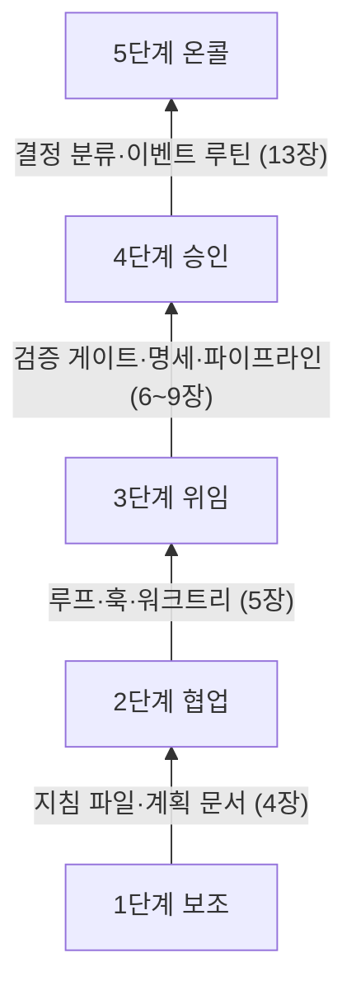

# 2장. 누가 누구를 부르는가 — 자율성의 다섯 단계

지난주 당신은 에이전트의 '승인' 버튼을 몇 번 눌렀을까? 그리고 그 버튼은 무엇을 지켜 줬을까?

Claude Code를 기본 권한 모드로 쓰면 에이전트는 파일을 고치거나 명령을 실행하기 전에 매번 허락을 구한다. 처음 며칠은 diff를 한 줄씩 읽는다. 그러다 어느 순간 손가락이 눈보다 먼저 나간다. 테스트 실행을 허락하고, 포맷터 실행을 허락하고, 제대로 읽지도 않은 수정을 허락한다. 버튼은 그대로 있는데 버튼이 지키던 것은 조금씩 빠져나간다. 뒷맛이 찜찜하다.

그렇다고 버튼을 떼어 버리면 어떻게 될까? 에이전트가 무엇을 하는지 모르는 채 결과만 받아 들게 된다. 이쪽도 불안하기는 마찬가지다. 결국 질문은 둘로 모인다. AI에게 얼마나 맡길지는 무엇으로 정해야 할까? 그리고 나는 지금 어디쯤 서 있을까? 1장에서 팩토리의 목적을 검증된 출하량으로 못 박았다면, 이제는 그 팩토리 안에서 사람이 설 자리를 정할 차례다. 이 질문에 답하려고 여러 사람이 사다리를 그렸다. 그 사다리들부터 차례로 올라가 보자.

## 업계가 그린 사다리

### 다크 팩토리까지 이어진 계단

1장에서 잠깐 만난 Dan Shapiro의 단계론부터 보자. 2026년 1월 23일에 발표된 이 단계론은 자율주행 단계에 빗대 AI 코딩을 0단계부터 5단계까지 나눈다.

0단계 'Spicy autocomplete'는 말 그대로 매콤한 자동완성이다. Shapiro는 이 단계를, vi를 쓰든 Visual Studio를 쓰든 당신의 승인 없이는 글자 하나도 디스크에 닿지 않는 상태라고 묘사했다. 1단계 'The coding intern'과 2단계 'The junior developer'를 지나면 3단계 'The developer'에 이른다. 여기서 Shapiro의 문장이 날카롭다. 당신은 더 이상 시니어 개발자가 아니고, 그건 이제 AI의 일이며, 당신은 매니저라는 것이다. 4단계 'The engineering team'에서 사람은 명세를 쓰고, 그 명세를 두고 AI와 논쟁하고, 스킬을 다듬는다. 5단계가 1장에서 본 'The dark software factory'다. 명세를 넣으면 소프트웨어가 나오는 블랙박스다.

Shapiro는 두 가지 관찰을 덧붙였다. 하나는 거의 모든 사람이 3단계에서 정체한다는 것이다. 다른 하나는 더 흥미롭다. 2단계부터는 매 단계가 꼭대기에 다 오른 것처럼 느껴지지만, 실제로는 아직 오를 계단이 남아 있다는 것이다.

Steve Yegge도 2026년 1월에 개발자와 에이전트의 관계를 8단계로 정리했다. 원문은 열람하지 못했고, 다른 블로그에 인용된 문장으로 확인한 것은 1·5·6·7·8단계뿐이다. Stage 1은 AI를 거의 쓰지 않고 가끔 자동완성이나 채팅을 쓰는 상태다. Stage 5는 CLI에서 에이전트 하나를 YOLO로, 곧 묻지도 따지지도 않고 실행하게 두는 단계인데, diff가 화면을 스쳐 지나가고 그걸 볼 수도 안 볼 수도 있다. Stage 6에서는 병렬 인스턴스 3~5개를 일상적으로 돌리고, Stage 7에서는 에이전트 10개 이상을 손으로 관리하다가 한계에 부딪힌다. Stage 8은 자기만의 오케스트레이터를 만드는 단계다. 2~4단계의 원래 문구는 확인하지 못했으니 추측으로 빈칸을 채우지는 않겠다.

두 사다리를 나란히 놓으면 공통된 축이 보인다. 위로 갈수록 사람은 코드를 덜 들여다보고, 에이전트는 늘어난다. 그렇다면 사람은 들여다보는 대신 무엇을 하는가? 두 사다리는 이 질문에 분명하게 답하지 않는다.

### 루프 안, 루프 위, 루프 밖

이 질문에 정면으로 답한 사람이 Kief Morris다. 그는 2026년 3월 4일 martinfowler.com에 올린 글에서 두 개의 루프를 구분했다. 바깥쪽의 why 루프는 아이디어를 동작하는 소프트웨어로 바꾸는 고리이고, 사람이 소유한다. 안쪽의 how 루프는 코드와 테스트, 도구 같은 중간 산출물을 만드는 고리다. 그리고 how 루프에 대해 사람이 설 수 있는 자리를 셋으로 나눴다. 에이전트에게 맡기고 결과만 받는 루프 밖(outside the loop), 산출물을 하나하나 검사하는 루프 안(in the loop), 루프 자체를 만들고 관리하는 루프 위(on the loop)다.

루프 안에 서면 무슨 일이 생길까? Kief Morris는 에이전트가 사람이 손으로 검사하는 속도보다 빠르게 코드를 만든다고 짚는다. 사람이 곧 병목이 된다. 이 장을 연 승인 버튼의 풍경이 바로 이것이다. 반대로 루프 밖에 서면 산출물이 어떻게 만들어졌는지 모른 채 떠안게 된다.

루프 위는 무엇이 다를까? 그는 그 차이가 에이전트의 산출물이 마음에 들지 않을 때 무엇을 하느냐에서 가장 잘 드러난다고 썼다. 예를 들어 보자. 에이전트가 프로젝트에 이미 있는 날짜 유틸리티를 무시하고 날짜 계산을 새로 짰다. 루프 안의 사람은 그 코드를 직접 고친다. 루프 위의 사람은 다음에도 같은 일이 생기지 않도록 지침 파일에 한 줄을 넣거나 린트 규칙을 추가한다. 고치는 대상이 산출물에서 산출물을 만드는 하네스로 옮겨 간다.

둘의 차이는 시간이 지날수록 벌어진다. 코드를 직접 고치면 그 수고는 그 한 번으로 끝난다. 다음 주에 에이전트는 똑같은 날짜 계산을 또 새로 짤 것이다. 하네스를 고치면 다음 실행에도, 그다음 실행에도 효과가 남는다. 루프 위에 선 사람의 수고는 이렇게 쌓인다. 4장에서 첫 지침 파일을 만들 때 이 습관부터 들여 보자.

> The right place for us humans is to build and manage the working loop rather than either leaving the agents to it or micromanaging what they produce.

Kief Morris의 결론이다. 사람은 돌아가는 루프를 만들고 관리하는 자리에 서야 하고, 에이전트에게 통째로 맡겨 두는 것도 산출물을 세세하게 간섭하는 것도 그 자리에서 벗어난 것이다. 여기서 사다리를 보는 눈이 하나 바뀐다. 얼마나 덜 들여다보느냐보다 어디에서 개입하느냐가 중요해진다.

## 인간요인 공학의 오래된 답

기계에게 얼마나 맡길지는 사실 새 질문이 아니다. 사람과 자동화 기계가 일을 어떻게 나눌지는 인간요인 공학이 수십 년 동안 파고든 주제다. 그들이 남긴 답은 코딩 에이전트에도 놀라울 만큼 잘 들어맞는다.

### 기능마다 수준을 따로 정한다

출발점은 1978년 Sheridan과 Verplank의 연구다. 해저 원격 조작기 제어를 다루면서 자동화 수준을 10단계로 정리했다. 2000년에 Parasuraman, Sheridan, Wickens가 이를 이어받아 결정과 행동 선택의 10수준을 정리했는데, 코딩 에이전트에 빗대 보면 이렇다.

| 수준 | 컴퓨터가 하는 일 | 코딩 에이전트에 빗대면 |
|------|----------------|---------------------|
| 1 | 아무 도움도 주지 않는다. 사람이 모든 결정과 행동을 맡는다 | AI 없이 직접 코딩 |
| 2~4 | 대안을 모두 보여 주거나, 몇 개로 좁히거나, 하나를 제안한다 | 자동완성·채팅 제안 |
| 5 | 사람이 승인하면 제안을 실행한다 | Claude Code 기본 권한 모드 |
| 6~7 | 실행 전에 사람에게 제한된 거부 시간을 주거나, 실행한 뒤 반드시 알린다 | 자동 승인 + 훅으로 차단, 백그라운드 에이전트가 PR로 결과를 올림 |
| 8 | 사람이 물을 때만 알린다 | — |
| 9 | 컴퓨터가 알릴 필요가 있다고 판단할 때만 알린다 | 실패할 때만 알림 |
| 10 | 모든 것을 스스로 결정하고 행동하며 사람을 무시한다 | — |

오른쪽 열은 원 논문에 없는 내용으로, 이 책의 리서치 과정에서 제안된 대응이다. 그래도 감을 잡기에는 충분하다. 이 장을 연 승인 버튼은 수준 5에 해당한다.

더 중요한 기여는 따로 있다. 이들은 자동화를 네 가지 기능, 곧 정보 수집, 정보 분석, 결정과 행동 선택, 행동 실행으로 나누고, 기능마다 수준을 따로 정하자고 제안했다. 한 시스템 안에서도 정보 수집은 완전히 자동으로 두고, 행동 실행은 사람의 승인 아래 둘 수 있다는 뜻이다. 수준을 고르는 기준도 명확하다. 1차 기준은 사람의 수행에 미치는 결과, 즉 작업 부하와 상황 인식, 자기 만족(complacency), 기술 저하다. 2차 기준은 자동화의 신뢰성과, 결정이나 행동이 틀렸을 때 치르는 비용이다. 기술 저하가 1차 기준에 들어 있다는 점을 기억해두자. 15장에서 이 문제로 돌아온다.

이 기준을 코딩 에이전트에 대 보자. 승인 버튼을 누르는 수준 5에서, 실행한 뒤 알려 주는 수준 7로 올리고 싶다고 하자. 두 기준은 저마다 다른 질문을 던진다. 2차 기준은 에이전트가 틀리면 얼마나 비싼지 묻는다. 격리된 브랜치에서 고친 코드라면 되돌리기 쉬우니 비용이 작다. 운영 데이터베이스에 마이그레이션을 거는 일이라면 이야기가 완전히 달라진다. 1차 기준은 사람 쪽을 묻는다. 알림만 받는 사람이 무슨 일이 벌어졌는지 여전히 파악할 수 있는가? 알림이 너무 잦아 아무도 읽지 않게 되지는 않는가? 수준을 한 칸 올릴 때마다 이 두 쪽의 질문에 답할 수 있어야 한다.

### 자율성은 역량과 별개다

최근 연구들은 여기에 한 가지를 더 분명히 했다. Feng, McDonald, Zhang은 2025년 에세이에서 사용자가 맡는 역할을 기준으로 AI 에이전트의 자율성을 다섯 단계로 나눴다. 사용자는 직접 조작하는 operator에서 출발해 collaborator, consultant, approver를 거쳐 지켜보기만 하는 observer에 이른다. 이들의 핵심 주장은 한 문장에 담겨 있다.

> We argue that an agent's level of autonomy can be treated as a deliberate design decision, separate from its capability and operational environment.

에이전트의 자율성 수준은 그 에이전트의 역량이나 운영 환경과 떼어 놓고, 의도적인 설계 결정으로 다룰 수 있다는 것이다. Google DeepMind의 Meredith Ringel Morris 외 연구진도 'Levels of AGI'(ICML 2024 포지션 페이퍼)에서 같은 선을 그었다. AI의 성능과 범용성을 재는 축과 별도로, 'No AI'부터 'AI as an Agent'까지 자율성의 수준을 따로 두었다. 모델이 아무리 강해져도 그 모델에게 얼마나 맡길지는 따로 정해야 한다는 메시지다.

Ben Shneiderman은 한 걸음 더 나간다. 그는 2020년 인간 중심 AI를 다루면서, 자동화 수준을 한 줄로 늘어놓는 방식이 '자동화를 높이면 사람의 통제가 줄어든다'는 전제를 깔고 있다고 비판했다. 그리고 자동화 수준과 사람의 통제 수준을 서로 독립된 두 축으로 보자고 제안했다. 목표는 높은 자동화와 높은 통제를 동시에 얻는 것이다. 코딩 에이전트에 옮기면 이렇게 말할 수 있다. 사람이 개입하는 횟수와 사람이 쥔 통제력은 따로 움직인다. 개입은 드물어도 훅과 정책, 감사 로그, 되돌리기 장치로 통제력을 높게 유지하는 팩토리가 얼마든지 가능하다.

## 이 책의 다섯 단계

### 보조에서 온콜까지

이제 이 책의 사다리를 세워 보자. 앞의 단계론들을 참고하되, 각 단계에서 사람이 하는 일과 다음 단계로 가기 위해 풀어야 할 병목이 분명히 보이도록 다섯 단계로 나눴다. 1단계 보조, 2단계 협업, 3단계 위임, 4단계 승인, 5단계 온콜이다.

| 단계 | 사람의 일 | 전형적인 도구 모드 | 다음 병목 |
|------|----------|------------------|----------|
| 1단계 보조 | 직접 쓰고 AI의 제안을 고른다 | 자동완성·채팅 | 제안을 검증하는 시간, 매번 되풀이하는 맥락 설명 |
| 2단계 협업 | 에이전트와 대화하며 행동마다 승인한다 | Claude Code·Codex 대화형, 기본 권한 모드 | 사람이 승인 버튼이 된다 |
| 3단계 위임 | 루프를 걸어 두고 결과를 검토하거나 질문에 답한다 | 자동 승인 + 훅, 헤드리스 루프, 워크트리 병렬 | 루프가 믿는 초록불이 참인가 |
| 4단계 승인 | 명세와 인수 기준을 쓰고, PR을 승인한다 | GitHub Actions·클라우드 세션이 draft PR을 만든다 | 리뷰 처리량, 무인 파이프라인의 보안 |
| 5단계 온콜 | 미리 분류해 둔 결정이 필요할 때만 부름을 받는다 | 스케줄·이벤트 루틴, 증거 묶음 | 결정 분류, 드물게 불려 가는 사람의 판단력 |

1단계 보조에서 코드는 여전히 사람이 쓴다. AI는 자동완성이나 채팅으로 제안할 뿐이다. 2단계 협업에서는 에이전트가 파일을 읽고 고치고 명령을 실행하지만, 한 걸음마다 사람의 승인을 받는다. 이 장을 연 풍경이 2단계다. 3단계 위임에서 사람은 승인 버튼에서 손을 떼고, 에이전트가 구현하고 테스트하고 고치는 루프를 스스로 돌게 한다. 이때부터 새로운 걱정이 생긴다. 루프가 통과했다고 보고하는 초록불을 믿어도 될까? 4단계 승인에서 사람은 코드 대신 명세와 인수 기준을 쓰고 승인하며, 파이프라인이 만든 draft PR을 머지할지 결정한다. 5단계 온콜에서 팩토리는 이슈나 알림, 스케줄 같은 이벤트에 반응해 돌다가, 미리 분류해 둔 결정이 필요할 때만 사람을 부른다.

그림 1은 이 사다리를 아래에서 위로 그린 것이다. 화살표에 적은 것은 다음 단계로 오르기 위해 갖춰야 할 부품이고, 괄호 안은 그 부품을 다루는 장이다.

그림 1. 다섯 단계 사다리 — 화살표는 다음 단계로 오르기 위해 갖출 부품

사다리를 오르다 보면 한 가지가 뒤집힌다. 1·2단계에서는 모든 일이 사람의 프롬프트로 시작한다. 사람이 AI를 부른다. 3단계에서 사람은 일을 걸어 두고 자리를 뜨고, 에이전트는 막힐 때 사람에게 묻는다. 4단계에서는 팩토리가 명세를 승인해 달라고, PR을 머지해 달라고 사람에게 요청한다. 5단계에 이르면 팩토리가 스스로 돌다가 결정이 필요할 때만 사람을 부른다. 사람이 AI를 부르던 개발이 팩토리가 사람을 부르는 개발로 바뀌는 것이다. 이 장의 제목이 묻는 "누가 누구를 부르는가"가 바로 이 반전이다.

오해하지 말자. 5단계는 사람이 사라진 단계와 다르다. 부름의 빈도가 줄어들 뿐, 무엇을 사람에게 물을지는 사람이 미리 정한다. 그 분류를 설계하는 일이 13장의 주제다. 불을 완전히 끌지는 또 다른 판단이고, 14장에서 따로 다룬다.

앞에서 본 단계론들과는 대략 다음처럼 대응한다.

| 이 책 | Shapiro | Yegge | Feng 외 사용자 역할 | 결정·행동 수준 | Kief Morris |
|------|---------|-------|------------------|-------------|------------|
| 1단계 보조 | L0 | Stage 1 | operator | 2~4 | 루프 안 |
| 2단계 협업 | L1~L2 | (문구 미확인) | collaborator | 5 | 루프 안 |
| 3단계 위임 | L3 | Stage 5~6 | consultant | 6~7 | 루프 안에서 위로 |
| 4단계 승인 | L4 | Stage 7~8 | approver | 7 | 루프 위 |
| 5단계 온콜 | L5 쪽 | — | observer | 8~9 | why 루프에 집중 |

이 대응은 이 책이 정리한 해석이고, 원저자들이 제시한 것은 아니다. 경계가 딱 맞아떨어지지도 않는다. '대략 이 근처'로 읽으면 된다. 특히 5단계는 Shapiro의 L5와 같은 방향을 보지만, 사람 게이트를 켜 둔다는 점에서 다크 팩토리와는 거리를 둔다.

### 세 가지 원칙

사다리를 오를 때 붙잡을 원칙이 셋 있다. 앞에서 살펴본 연구들이 공통으로 가리키는 결론이다.

첫째, 자율성은 모델 역량이 아니라 설계 결정이다. 새 모델이 나왔다고 해서 팩토리가 저절로 한 단계 올라가지는 않는다. 지침 파일과 검증 게이트, 사람 게이트를 어떻게 짜느냐가 단계를 정한다. 거꾸로 말하면, 모델이 조금 부족해도 설계로 감당할 수 있는 몫이 생각보다 크다.

둘째, 자율성은 기능별로 다르게 정한다. 여기서 이 책의 예제를 소개하자. 2부부터 함께 키울 `gather`는 소규모 모임과 스터디를 위한 예약 서비스로, 이 책을 위해 만든 가상의 예제다. 모임을 열고, 예약하고 취소하고, 리마인더 알림을 받는 기능이 있다. 한 저장소 안에 Kotlin과 Spring Boot로 만든 API(`api/`), Next.js 프론트엔드(`web/`), Python 리마인더 배치(`jobs/`)가 들어 있다. 2부 끝에서 `gather`가 4단계에 올라섰을 때, 기능별 자율성은 대략 이렇게 설계할 수 있다.

| 기능 | 기능 분류 | 자율성(목표) | 이유 |
|------|----------|-------------|------|
| 코드 탐색·검색 | 정보 수집 | 완전 자동 | 읽기만 하니 틀려도 잃을 것이 거의 없다 |
| 원인 분석·계획 초안 | 정보 분석 | 에이전트가 제안하고 사람이 고른다(4) | 방향이 틀리면 뒤따르는 작업이 전부 틀어진다 |
| 코드 작성 | 행동 실행 | 격리된 브랜치에서 자동 실행, PR로 알린다(7) | 격리돼 있어 되돌리기 쉽다 |
| 테스트·린트 실행 | 행동 실행 | 완전 자동, 실패할 때만 알린다(9) | 결과가 기계적으로 판정된다 |
| 1차 리뷰 | 정보 분석 | AI 리뷰어가 결함 후보를 낸다 | 사람이 볼 범위를 좁혀 준다 |
| 머지 | 결정·행동 선택 | 사람이 승인하면 실행한다(5) | 되돌릴 수는 있지만 영향이 넓다 |
| 프로덕션 배포 | 결정·행동 선택 | 사람이 승인하면 실행한다(5) | 틀리면 사용자가 먼저 겪는다 |

괄호 안의 숫자는 앞의 10수준 표에서의 위치다. 코드 탐색은 틀려도 잃을 것이 없으니 끝까지 자동으로 두고, 프로덕션 배포는 사람이 승인해야 실행되는 수준에 묶어 둔다. 같은 팩토리 안에서도 기능마다 다른 계단에 서는 것이 자연스럽다.

셋째, 개입은 줄이되 통제는 유지한다. Shneiderman의 두 축을 떠올리자. 승인 버튼을 떼어 내는 대신 훅으로 위험한 명령을 막고(4장), 권한을 좁히고(9장), 모든 실행을 기록으로 남기고, 언제든 되돌릴 수 있게 만든다. 개입 횟수를 줄이는 만큼 통제 장치는 늘어나야 한다.

## 실제로는 어떻게 오르나

### 사용 데이터가 보여 주는 이동

실제 사용자들은 이 사다리를 어떻게 오르고 있을까? Anthropic이 2026년 2월 18일 공개한 자사 연구가 단서를 준다. 공개 API의 도구 호출 표본 약 100만 건과 Claude Code 대화형 세션 50만 건을 분석한 결과다. 자동 승인을 쓰는 비율은 50세션 미만 신규 사용자에서 약 20%였는데, 750세션에 이른 사용자에서는 40%를 넘었다. 흥미롭게도 사람이 도중에 끼어드는 턴의 비율도 함께 올랐다. 10세션 안팎 사용자는 약 5%, 경험 많은 사용자는 약 9%였다. 경험이 쌓일수록 한 걸음마다 승인하는 감독에서, 맡겨 두고 지켜보다가 필요할 때 끼어드는 감독으로 옮겨 간다는 뜻이다. 눈에 띄는 결과가 하나 더 있다. 복잡한 작업에서는 Claude Code가 스스로 멈춰 확인을 요청하는 빈도가 사람이 개입하는 빈도의 두 배를 넘었다. 에이전트가 스스로 멈추는 것도 감독의 한 형태가 된다는 이야기이고, 13장에서 이 점을 다시 쓴다.

Hedwig 연구(Shukla 외, 2026)는 코딩 에이전트 사용자 21명을 조사해, 사람들이 자율성을 맞추는 데 좌절하고 원하는 감독 수준이 작업과 시점에 따라 바뀐다는 점을 확인했다. 연구진이 만든 시스템은 고정된 권한 대신 개발자의 결정에서 지침을 배워, 신뢰가 쌓인 작업에서는 마찰을 줄이고 낯선 영역에서는 감독을 조인다. 단계는 사람에게 한 번 붙이면 끝나는 계급장과 다르다. 같은 사람도 작업마다, 영역마다 다른 계단에 선다.

그렇다면 대부분의 저장소는 지금 어디쯤 있을까? Galster 외(2026)가 저장소 2,853개를 조사해 보니, 에이전트 설정 수단은 컨텍스트 파일이 압도적이었고 그것이 저장소의 유일한 설정인 경우가 많았다. 도구 간 공용 표준으로는 AGENTS.md가 떠오르고 있었고, 스킬이나 서브에이전트 같은 고급 장치는 드물었다. 대부분이 사다리의 첫 계단, 지침 파일 하나에 서 있다는 이야기다. 2부는 바로 거기서 출발한다.

이 책의 지도도 이 사다리를 따른다. 2부(4~9장)에서는 1인 개발자가 `gather` 하나로 1단계부터 4단계까지 오른다. 지침 파일과 첫 훅(4장), 루프(5장), 검증 게이트(6장), 명세(7장), GitHub Actions 파이프라인(8장), 보안 담장(9장) 순서다. 검증을 3단계와 4단계 사이에 둔 것은 싸고 확실하게 검증할 수 있는 만큼만 자율성을 줄 수 있기 때문이고, 보안을 파이프라인 바로 뒤에 둔 것은 무인 파이프라인은 담장 안에서만 돌아야 하기 때문이다. 3부(10~12장)에서는 축을 바꿔 팀을 다룬다. 리뷰 병목, 도입 순서와 공유 하네스, 중앙 플랫폼과 비용이다. 혼자 일하는 개발자라도 3부를 건너뛰지 않기를 권한다. 10장에서 다룰 리뷰 부채는 혼자 일해도 똑같이 쌓인다. 4부(13~15장)에서는 두 경로가 5단계에서 만난다. 이벤트 트리거와 결정 분류라는 메커니즘은 같고, 누가 부름을 받는지만 다르기 때문이다. 이어서 1장의 선언으로 돌아가 다크 팩토리 논쟁을 판정하고, 드물게 불려 가는 사람이 판단력을 어떻게 지킬지 묻는다.

## 당신은 지금 어디에 서 있나

사다리를 오르기 전에 발밑부터 확인하자. 아래 질문에 솔직하게 답해 보면, 대답이 막히는 곳이 당신의 다음 계단이다.

- 지난주 에이전트가 만든 변경 가운데 diff를 끝까지 읽고 승인한 것은 몇 개였는가?
- 에이전트가 같은 실수를 두 번 했을 때, 당신은 코드를 고쳤는가, 지침 파일을 고쳤는가?
- 당신이 자리를 비운 사이에도 끝까지 도는 작업이 하나라도 있는가?
- 에이전트가 "다 됐다"고 보고할 때, 에이전트가 직접 쓴 테스트 말고 그 말을 확인할 수단이 있는가?
- 코드 탐색과 프로덕션 배포에 같은 수준의 승인을 걸어 두고 있지는 않은가?
- 에이전트가 쓴 코드를 다른 모델에게 다시 보여 준 적이 있는가?
