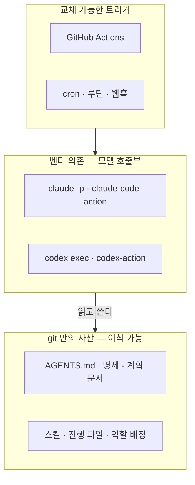

# 3장. 설비 배치 — 모델은 역할로, 도구는 표면으로

도구 선택이라고들 한다. Claude Code를 쓸까, Codex를 쓸까. Claude Opus 5.5가 나을까, GPT-6 Sol이 나을까. 새 모델이 나올 때마다 비교 글이 쏟아지고, 커뮤니티는 어느 쪽이 이겼는지를 두고 한바탕 다툰다. 하지만 팩토리를 짓는 사람의 눈으로 보면, 이 일은 도구 선택보다 인사 배치에 가깝다.

인사 배치라고 생각하면 질문이 달라진다. 누구에게 구현을 맡기고, 누구에게 그 구현을 검토하게 할까? 설계는 누가 하고, 손은 많이 가지만 판단은 가벼운 일은 누가 할까? 그리고 각자를 어디에 앉혀야 할까? 옆자리에서 대화하며 일하게 할지, 밤새 CI에서 혼자 돌게 할지, 클라우드의 격리된 작업실에 보낼지에 따라 쓸 수 있는 도구도 달라진다. 앞 장 끝의 마지막 질문, 에이전트가 쓴 코드를 다른 모델에게 보여 준 적이 있느냐는 물음도 결국 이 인사 배치의 문제다. 먼저 무엇을 기준으로 배치할지부터 정하자.

## 고르는 것은 시스템이다

### 점수판이 말해 주지 않는 것

모델을 고를 때 가장 먼저 보는 것은 벤치마크 점수다. 출시 페이지마다 점수표가 붙고, 몇 %p 차이로 순위가 갈린다. 그런데 그 점수는 정확히 무엇을 재고 있을까?

Gorinova 외(2026)는 포지션 논문에서 이렇게 짚었다.

> A coding agent in practice is not a model: it is a system harness -- a composite of models, harnesses, contexts, environments, and feedback signals, any one of which can move the benchmark score by margins comparable to those between adjacent model generations.

실무의 코딩 에이전트는 모델과 하네스, 컨텍스트, 실행 환경, 피드백 신호가 합쳐진 시스템이고, 이 가운데 하나만 바꿔도 인접한 모델 세대 사이의 차이만큼 점수가 움직인다는 것이다. 같은 모델이라도 어떤 지침 파일을 주고 어떤 테스트 신호를 돌려주느냐에 따라 한 세대만큼 차이가 난다. 모델 이름만 보고 고르는 것은 엔진 배기량만 보고 자동차를 사는 것과 비슷하다.

점수판 자체도 흔들린다. SWE-bench는 2023년 가을 발표 당시 최고 모델이 이슈의 1.96%를 푸는 데서 출발했다. 이후 전문가 검토를 거쳐 500문항으로 추린 SWE-bench Verified가 사실상 표준 점수판이 됐다. 그런데 OpenAI는 2026년 2월 23일 Verified 점수 보고를 중단했다. 과제의 27.6%를 감사해 보니 그중 59.4%에서 기능적으로 올바른 제출까지 거부하는 결함 테스트가 나왔고, 시험한 프런티어 모델 모두가 학습 중에 일부 문제와 정답을 본 흔적이 있었다는 것이다(OpenAI의 발표 원문 대신 Epoch AI가 인용한 문구를 기준으로 옮겼다). 대안으로 권고된 SWE-Bench Pro에서도 2026년 9월, 정답 누출과 보상 해킹, 과제 결함이 발견됐다는 연구가 나왔다. 2%에서 출발한 점수판이 3년이 채 안 돼 신뢰를 잃은 셈이다.

그렇다면 무엇으로 골라야 할까? 이 책의 답은 자기 저장소에서 재는 것이다. 자기 코드베이스의 실제 과제 가운데 일부를 에이전트가 볼 수 없는 곳에 따로 떼어 두고, 그 과제로 팩토리 전체를 평가한다. 6장에서 만들 홀드아웃 시나리오가 바로 이 역할을 맡는다. 그래서 이 책은 모델의 벤치마크 점수를 싣지 않는다.

## 네 가지 역할

### 빌더·리뷰어·설계자·워커

인사 배치의 첫걸음은 직무 기술서를 쓰는 일이다. 팩토리에는 네 가지 역할이 필요하다.

빌더는 구현을 맡는다. 긴 시간 스스로 계획을 세우고, 코드를 쓰고, 테스트를 돌리고, 실패를 고친다. 여러 서브에이전트를 거느리는 오케스트레이터 노릇도 한다. 리뷰어는 빌더의 산출물을 교차 검증하고, 잘 정의된 작업을 정밀하게 수행한다. 설계자는 계획과 명세의 초안을 쓰고, 큰 결정을 앞두고 선택지를 따진다. 워커는 문서 갱신, 대량 수정, 반복적인 분류처럼 양은 많고 판단은 가벼운 일을 싸고 빠르게 처리한다.

2026년 9월 말 각 벤더가 내놓은 모델과, 그들이 밝힌 용도는 다음과 같다. 표는 2026년 9월 28일 기준이고, 가격과 컨텍스트 크기 같은 세부 사항은 부록 A에 모아 두었다.

| 모델 | 출시일 | 모델 ID | 벤더가 밝힌 용도 |
|------|-------|--------|----------------|
| Claude Opus 5.5 | 2026-09-22 | `claude-opus-5-5` | 장시간 에이전트 코딩과 지식 작업 |
| Claude Fable 5.1 | — | `claude-fable-5-1` | 까다로운 추론과 긴 호흡의 에이전트 작업(상위 모델) |
| GPT-6 Sol | 2026-09-22 | `gpt-6-sol` | 복잡한 코딩과 에이전트 워크플로 |
| GPT-6 Luna | 2026-09-22 | `gpt-6-luna` | 범위가 좁고 양이 많은 작업 |
| Grok 4.7 | 2026-09-21 | `grok-4.7` | 코딩·에이전트 작업·지식노동용 프런티어 모델(xAI 발표) |
| Muse Spark 1.3 | 2026-09-02 | — | 비용 면에서 매력적인 선택지(Meta 측 발언) |

이 표와 커뮤니티의 체감을 합치면 2026년 9월의 배정은 대략 이렇게 그려진다. 빌더와 오케스트레이터 자리에는 Claude Code 위의 Claude Opus 5.5가 선다. Anthropic은 이 모델을 장시간 에이전트 코딩용으로 내놓았고, 출시 사흘째 Hacker News에는 계획을 세운 뒤 서브에이전트로 20시간 동안 입력 없이 돌렸다는 후기도 올라왔다(커뮤니티 보고). 리뷰어와 정밀 수행 자리에는 Codex 위의 GPT-6 Sol이 선다. 이전 세대부터 이어진 커뮤니티 체감은, Codex가 정밀하고 빠르지만 작업을 원자 단위로 쪼개 줘야 하고 완전히 명세된 작업에서 더 날카롭다는 쪽이다(Reddit 토론의 2차 정리). 설계자 자리에는 Claude Fable 5.1 같은 상위 모델이 어울린다. Anthropic의 모델 안내도 대부분의 작업은 Opus 5.5로 시작하되, 까다로운 추론이나 긴 호흡의 에이전트 작업, 혹은 Opus 5.5를 높은 effort로 돌려도 eval 결과가 모자랄 때 Fable 5.1을 쓰라고 권한다. 워커 자리는 GPT-6 Luna, Muse Spark, Grok이 나눠 맡는다. 싸고 빠르게 많은 양을 처리하거나, 화면 시안을 여러 벌 빨리 뽑아 보는 용도다.

### 짝짓기의 논리와 유효기간

역할을 나눴으면 짝을 지어야 한다. 커뮤니티에서 가장 널리 퍼진 짝짓기는 교차 리뷰다. 한쪽 모델이 만들고, 다른 계열의 모델이 낯선 사람처럼 다시 본다. 한 velog 글은 이를 "AI 하나는 의견, 둘의 토론은 검증"이라고 요약했다. AWS 한국 블로그의 실험도 같은 방향이다. 같은 계열의 Claude 채점관은 Claude가 만든 결함을 놓쳤다. 글쓴이는 여러 모델을 섞는 가치가 모델 자체보다 하네스 설계에서 나온다고 덧붙였다. 1장에서 본 원리, 시험 보는 사람이 채점까지 하면 안 된다는 원리가 모델 배치에서도 그대로 통한다.

물론 교차 리뷰가 만능은 아니다. Hacker News의 한 댓글은 한 LLM이 만들고 다른 LLM이 리뷰하는 것도 사실상 한 번의 패스라고 꼬집었다(커뮤니티 보고). AI 리뷰어를 하나 더 붙였다고 테스트와 린터를 건너뛸 수는 없다. 교차 리뷰는 계산적 검사 위에 한 겹 더 얹는 층이다.

두 번째 짝짓기는 비싼 모델에게 설계를, 싼 모델에게 구현을 맡기는 것이다. Steve Yegge는 설계 크루에 Fable을, 구현 함대에 Opus 5를 배치했다고 전해진다. 2026년 9월 25일 Ask HN 스레드에는 GPT-6 Sol로 계획하고 Luna로 코딩한다는 사람, Luna로 일상 작업을 하고 Opus로 설계와 명세를 한다는 사람이 함께 등장한다(커뮤니티 보고). 조합은 제각각이지만 원리는 같다. 판단이 무거운 자리에 비싼 모델을, 양이 많은 자리에 싼 모델을 둔다. 커뮤니티에서 자주 들리는 조언은 의외로 단순하다. 둘 다 쓰라는 것이다.

벤더도 같은 쪽으로 움직인다. OpenAI는 Claude Code 안에서 Codex에게 리뷰를 맡기거나 작업을 넘길 수 있는 공식 플러그인 `codex-plugin-cc`를 내놓았다. 교차 모델 리뷰가 벤더 차원의 워크플로가 됐다는 신호다.

여기서 꼭 붙여 둘 단서가 있다. Claude Opus 5.5와 GPT-6 Sol은 2026년 9월 22일에 나왔고, 9월 28일 기준으로 출시 6일째다. 위의 배정은 이전 세대의 체감과 출시 직후의 초기 인상을 합친 것이고, GPT-6 Sol에 대해서는 워크플로 수준의 회고가 아직 없다. 커뮤니티의 분업 체감은 모델 세대가 바뀔 때마다 뒤집혀 왔다. 그 단서를 안고 `gather`의 첫 역할 배정표를 만들어 보자.

| 역할 | 1차 배정 | 대안 | 맡길 일 |
|------|---------|-----|--------|
| 설계자 | Claude Fable 5.1 | GPT-6 Sol(높은 effort) | 명세 초안, 큰 변경의 계획, 선택지 비교 |
| 빌더 | Claude Opus 5.5 · Claude Code | GPT-6 Sol · Codex | 구현 → 테스트 → 수정 루프, 서브에이전트 조율 |
| 리뷰어 | GPT-6 Sol · Codex | Claude Opus 5.5(신선한 컨텍스트로) | PR 교차 리뷰 |
| 워커 | GPT-6 Luna · Muse Spark · Grok | — | 문서 갱신, 대량 수정, UI 시안 |

규칙은 하나다. 빌더와 리뷰어는 서로 다른 계열로 둔다. 빌더를 Codex로 바꾸면 리뷰어는 Claude 쪽으로 옮긴다.

## 일하는 자리, 표면

### 여섯 개의 표면

역할이 직무라면 표면은 근무지다. 같은 Claude Code라도 터미널에서 대화하며 쓸 때와 GitHub Actions 안에서 혼자 돌 때는 전혀 다른 일꾼이 된다. 2026년 9월 기준으로 쓸 수 있는 표면은 크게 여섯 가지다.

첫째는 대화형이다. CLI, IDE, 데스크톱 앱에서 사람과 주고받으며 일한다. Claude Code는 터미널·IDE·데스크톱·웹·모바일이 같은 엔진을 공유해서, CLAUDE.md와 설정, MCP 서버가 어느 표면에서든 똑같이 동작한다.

둘째는 헤드리스 실행이다. 사람 없이 스크립트에서 에이전트를 돌린다. Claude Code는 `claude -p`와 Agent SDK를, Codex는 `codex exec`를 제공한다. 스크립트에서 `claude -p`를 쓸 때는 프로젝트의 훅과 MCP 설정 등을 자동으로 불러오지 않는 `--bare` 모드가 권장되고, `--output-format json`으로 결과를 받으면 실행 비용(`total_cost_usd`)까지 함께 돌아온다. `codex exec`는 기본이 읽기 전용이라 파일을 쓰게 하려면 `--sandbox workspace-write`를 명시해야 한다.

셋째는 GitHub Actions다. `anthropics/claude-code-action@v1`은 `@claude` 멘션을 기다리는 대화 모드와, `prompt`를 주면 어떤 이벤트에서든 도는 자동화 모드를 모두 갖췄다. `openai/codex-action`은 기본값으로 sudo 권한을 뗀 채(`safety-strategy`의 `drop-sudo`) Codex를 실행한다. Copilot cloud agent(구 Copilot coding agent)는 Actions 기반 임시 환경에서 브랜치와 PR을 만드는데, 작업 하나에 59분이라는 고정 상한이 있다. GitHub Agentic Workflows는 Copilot CLI, Claude Code, Codex 등을 엔진으로 골라 마크다운 워크플로를 돌린다.

넷째는 클라우드 세션이다. Claude Code는 웹이나 `claude --cloud`로 Anthropic이 관리하는 격리된 VM에서 여러 세션을 병렬로 돌리고, `--teleport`로 로컬에 가져올 수 있다. 공식 문서의 표현대로 계획은 로컬에서, 실행은 클라우드에서 하는 방식이다. Codex cloud는 저장소별 클라우드 환경에서, 웹·GitHub·Linear·Slack 등에서 시작한 작업을 병렬로 돌려 PR로 올린다. 참고로 Codex 문서는 `learn.chatgpt.com`으로 자리를 옮긴 것으로 보이니, 예전 주소에서 헤매지 말자.

다섯째는 스케줄과 이벤트다. Claude Code의 루틴은 프롬프트와 저장소, 커넥터를 묶어 둔 설정을 스케줄이나 API 호출, GitHub 이벤트로 무인 실행한다. 익숙한 Actions의 cron도 같은 자리에 선다.

여섯째는 관리형 리뷰다. Claude Code Review는 여러 전문 에이전트가 PR을 병렬로 분석해 심각도별 코멘트를 달고, Codex는 `@codex review` 멘션에 P0·P1 이슈만 골라 리뷰한다. 팀의 리뷰 병목을 다루는 10장에서 자세히 본다.

루틴과 Claude Code Review는 리서치 프리뷰이고, GitHub Agentic Workflows도 아직 0.x 버전이다. 이 부분은 빠르게 바뀔 수 있으니 공식 문서를 함께 확인하자.

표면을 늘어놓고 보면 흥미로운 대응이 보인다. 대화형은 2단계 협업의 무대이고, 헤드리스는 3단계 위임에서 루프를 스크립트로 만드는 발판이다. GitHub Actions와 클라우드 세션은 4단계 승인의 파이프라인이 서는 자리이고, 스케줄과 이벤트는 5단계 온콜의 심장이다. 표면을 옮기는 일이 곧 사다리를 오르는 일이다. 역할과 표면을 겹쳐 보면 다음과 같다.

| 표면 | 빌더 | 리뷰어 | 설계자 | 워커 |
|------|-----|-------|-------|-----|
| 대화형 | 페어 작업(4장) | 즉석 교차 리뷰 | 명세·계획 대화 | — |
| 헤드리스 | 루프 스크립트(5장) | `codex exec`로 diff 검토 | — | 대량 수정 스크립트 |
| GitHub Actions | 이슈 → PR 구현 잡(8장) | 교차 리뷰 잡(8장) | 계획 코멘트 | 문서·라벨 정리 |
| 클라우드 세션 | 긴 작업, 병렬 작업 | — | — | 병렬 잡일 |
| 스케줄·이벤트 | 야간 루틴(13장) | 정기 점검 | — | 백로그·문서 정리 |
| 관리형 리뷰 | — | PR 리뷰(10장) | — | — |

어느 칸에서 시작하는 게 나을까? 상황에 따라 다르다. 혼자 일한다면 대화형 Claude Code를 빌더로 두고 리뷰만 Codex에 넘기는 조합이 가장 가볍다. `codex-plugin-cc`를 설치하면 Claude Code 안에서 `/codex:review`로 바로 넘길 수 있다. 팀이 GitHub을 중심으로 일한다면 처음부터 Actions 표면에 리뷰어를 세우는 편이 낫다. 모든 PR에 같은 기준이 적용되기 때문이다. 비용이 걱정이라면 워커 모델을 헤드리스로 돌릴 자리부터 찾아보자.

### 보조 설비 — Grok Build와 Muse Code

Claude Code와 Codex가 주 설비라면 Grok Build와 Muse Code는 보조 설비다. 둘 다 터미널 코딩 에이전트이고, 둘 다 워크트리에 서브에이전트를 병렬로 띄우는 구조를 갖췄다.

Grok Build는 xAI의 터미널 에이전트다. plan 모드, 워크트리 기반 병렬 서브에이전트, `-p` 헤드리스 실행을 지원하고, 발표문에 따르면 AGENTS.md와 플러그인, 훅, 스킬, MCP 서버가 별도 설정 없이 그대로 동작한다. Claude Code용으로 만든 하네스를 거의 그대로 가져다 쓸 수 있다는 뜻이고, 이것이 가장 큰 장점이다. 오픈소스 공개 소식을 다룬 Hacker News 스레드의 반응은 대체로 호의적이었다. 시각 디자인을 빠르고 보기 좋게 뽑고 값에 비해 쓸 만하다는 평이 있었고, 마무리는 결국 다른 모델로 해야 한다는 의견도 있었다(커뮤니티 보고). 더 무거운 문제는 신뢰다. 커뮤니티에서는 네트워크 트래픽을 분석해 데이터 반출을 지적한 글이 화제가 됐고, 데이터를 보관하지 않는 ZDR 옵션이 엔터프라이즈 전용이라는 점도 도마에 올랐다. 회사 코드를 맡기기 전에 한 번 더 확인해야 할 대목이다.

Muse Code는 Meta가 2026년 8월 5일 베타로 내놓은 터미널 에이전트 오케스트레이터로, Muse Spark와 짝을 이룬다. Mark Zuckerberg는 격리된 워크트리에서 병렬로 일하는 서브에이전트들로 작업을 펼친다고 소개했다. 2026년 9월 2일에 나온 Muse Spark 1.3은 이전 버전보다 도구 호출과 토큰 사용을 줄이고 프롬프트 인젝션 내성을 강화했다고 발표됐다(벤더 주장). 한 커뮤니티 리뷰(dev.to, 2026-09-04)는 읽기 쉬운 출력과 싼 요금을 장점으로 꼽으면서도, 스킬 호출이 일관되지 않고, 샌드박스가 에뮬레이터 포트까지 막고, 여러 단계로 된 작업에는 계속 재촉해야 한다는 약점을 짚었다. 갈아탈 이유는 가격 정도라는 것이 결론이었다(커뮤니티 보고).

그렇다면 이 둘을 어디에 둘까? 주 빌더나 최종 리뷰어보다는 워커와 시안 담당 자리가 어울린다. 화면 시안을 여러 벌 빠르게 뽑아 보거나, 싸게 돌려도 되는 반복 작업을 맡기거나, 주 설비와 다른 계열의 눈으로 한 번 더 훑게 하는 식이다. 흔히 가장 좋은 모델 하나로 모든 역할을 채우는 게 제일 낫다고 여기기 쉽다. 하지만 비싼 모델에게 문서 오타 수정을 맡기면 돈이 새고, 같은 모델에게 구현과 리뷰를 모두 맡기면 1장에서 본 검증의 구멍이 그대로 남는다.

## 갈아 끼울 수 있는 배치

### 이식성의 세 층

역할과 표면을 정했으면 마지막으로 물어야 할 것이 있다. 이 배치를 나중에 바꿀 수 있는가? 모델은 몇 달마다 바뀐다. 오늘 빌더로 둔 모델이 반년 뒤에도 가장 나은 빌더라는 보장은 없다. 배치를 바꿀 때마다 하네스를 새로 써야 한다면 난감한 일이다.

다행히 표준이 자리를 잡아 가고 있다. 2025년 12월 9일 Linux Foundation 산하에 Agentic AI Foundation(AAIF)이 출범했고, OpenAI는 AGENTS.md를, Anthropic은 MCP를, Block은 goose를 이곳에 기부했다. 이제 AGENTS.md는 여러 도구가 함께 읽는 지침 파일이다. Claude Code는 저장소에 AGENTS.md가 있으면 그것만 읽을 수도, CLAUDE.md와 함께 읽을 수도 있다. Grok Build는 AGENTS.md를 그대로 쓰고, Codex는 가장 가까운 AGENTS.md의 `## Code Review Rules` 절을 리뷰 규칙으로 삼는다.

공용 플러그인도 나오고 있다. 토스의 `apps-in-toss-harness`는 Claude Code·Codex·Cursor가 함께 쓰는 하네스인데, README에는 Codex가 플러그인 매니페스트를 그대로 읽으므로 Codex 전용 매니페스트가 따로 필요 없다고 적혀 있다(팀 하네스를 공유하는 사례는 11장에서 자세히 본다). 스킬의 정본을 Claude Code 쪽에 두고, Codex용 `.agents/skills/`에는 얇은 어댑터만 두는 구조도 공개 저장소에서 쓰이고 있다. `gather`도 이 구조를 따른다.

커뮤니티가 도달한 절충은 세 층으로 정리된다. 상태와 메모리, 스킬은 git 안의 마크다운으로 둔다. 트리거는 GitHub Actions나 cron처럼 갈아 끼울 수 있게 둔다. 벤더에 묶이는 부분은 모델을 호출하는 곳 하나로 좁힌다. 벤더 의존을 얼마나 감수할지에 대한 논쟁은 12장에서 따로 다룬다.


그림 1. 이식성의 세 층 — 벤더에 묶이는 부분을 모델 호출부로 좁힌다

이 구조를 역할 배정에 그대로 적용해 보자. 워크플로 파일 곳곳에 모델 이름을 박아 두면, 모델을 바꿀 때마다 파일 여러 개를 뒤져야 한다. 역할과 모델의 대응을 한 파일에 모으고, 파이프라인은 역할 이름으로 그 파일을 읽게 하는 편이 낫다. 예를 들면 이런 파일이다. 특정 도구가 정한 형식은 아니고, 원리를 보여 주려는 예시다.

```yaml
# roles.yml — 역할 배정 (2026-09-28 기준)
designer:
  tool: claude-code
  model: claude-fable-5-1
builder:
  tool: claude-code
  model: claude-opus-5-5
reviewer:
  tool: codex
  model: gpt-6-sol
worker:
  tool: codex
  model: gpt-6-luna
```

방금 우리는 `gather`의 역할 배정표를 만들었다. 이제 조금 김빠지는 이야기를 해야 한다. 이 표는 틀리게 될 것이다. 당장은 아니더라도 다음 모델 세대가 나오면 뒤집힐 가능성이 크다. 커뮤니티의 분업 체감은 늘 그래 왔다. Grok을 두고 벌어진 토론만 해도 몇 달 전에는 4.5와 4.6이 주인공이었는데, 2026년 9월 말 기준 최신은 4.7이다. 그래도 배정표는 필요하다. 다만 언제든 고쳐 쓸 수 있어야 한다. 그래서 역할은 오래 가져가고, 모델은 갈아 끼운다. 배정은 코드가 아니라 설정에 둔다.

### 이 장의 핵심

- 벤치마크 점수는 모델 혼자의 성능을 재지 못한다. 하네스·컨텍스트·환경·피드백 신호 하나만 바꿔도 세대 차만큼 움직이므로, 팩토리는 자기 저장소의 홀드아웃 과제로 평가한다.
- 모델은 빌더·리뷰어·설계자·워커라는 역할로 배치한다. 2026년 9월의 체감 배정은 빌더 Claude Opus 5.5, 리뷰어 GPT-6 Sol, 설계자 Claude Fable 5.1 같은 상위 모델, 워커 GPT-6 Luna·Muse Spark·Grok이고, 이 배정은 세대마다 뒤집힐 수 있다.
- 빌더와 리뷰어는 서로 다른 계열로 둔다. 교차 리뷰는 계산적 검사를 대신하지 못하고 그 위에 얹는 층이다.
- 대화형·헤드리스·GitHub Actions·클라우드 세션·스케줄과 이벤트·관리형 리뷰로 표면을 옮기는 일이 곧 사다리를 오르는 일이다.
- 상태와 스킬은 git 안에, 트리거는 교체 가능하게 두고, 벤더 의존은 모델 호출부로 좁힌다. 역할 배정은 설정 한 곳에 모은다.
