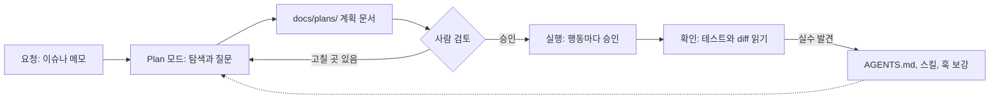

# 4장. 옆자리의 AI를 페어로 — 1·2단계와 첫 하네스

금요일 오후, 예약 취소 API를 Claude Code에 한 줄로 맡겼다고 해보자. `gather` 저장소에서 터미널을 열고 "예약 취소 API 만들어줘"라고 친다. 권한 모드는 기본값 그대로라 에이전트는 무언가를 바꾸거나 실행할 때마다 허락을 구한다. 파일을 고치겠다고 하면 승인, 다른 파일을 또 고치겠다고 하면 승인, `./gradlew test`를 돌리겠다고 하면 또 승인이다. 스무 번쯤 눌렀을 때 에이전트가 끝났다고 알린다.

diff를 열어 보니 바뀐 파일이 스물세 개다. 취소 엔드포인트는 분명히 생겼다. 그런데 `Reservation` 엔티티의 필드 이름 두 개가 "더 명확하게" 바뀌어 있고, 이미 운영 DB에 적용된 Flyway 마이그레이션 파일 하나가 수정돼 있다. 요청한 적 없는 `web/`의 포맷터 설정까지 손을 댔다. 테스트는 한 줄도 없다. 에이전트는 마지막에 "필요하시면 테스트도 추가해 드릴게요"라고 덧붙였다.

스무 번 누른 승인 버튼은 무엇을 지켜 줬을까? 솔직히 말하면 거의 아무것도 지켜 주지 못했다. 우리는 행동 하나하나를 허락했을 뿐, 그 행동들이 모여 만든 결과는 검토하지 않았다. 이 금요일 오후를 어디서부터 고쳐야 할까?

## 한 줄 요청이 남긴 것

먼저 무엇이 잘못됐는지 차근차근 짚어 보자. 에이전트가 게을렀던 걸까? 그렇게 보기는 어렵다. 에이전트는 `gather`에 대해 아는 것이 없었다. 테스트를 어떤 명령으로 돌리는지, `api`와 `web`의 경계가 어디인지, 적용된 마이그레이션은 고치지 않는다는 약속이 있는지 알 길이 없었다. 모르는 자리는 그럴듯한 추측으로 채웠고, 그 추측이 스물세 개 파일로 번졌다.

요청의 크기도 문제였다. Barke 외의 Grounded Copilot 연구(OOPSLA 2023)는 개발자가 코드 생성 도구와 두 가지 모드로 상호작용한다고 정리했다. 다음에 할 일을 이미 알고 빨리 가려고 쓰는 가속 모드, 그리고 무엇을 할지 몰라 선택지를 더듬는 탐색 모드다. "예약 취소 API"는 겉보기엔 가속 모드짜리 요청이다. 하지만 속을 열어 보면 취소 규칙, 상태 전이, 응답 형식처럼 아직 아무도 정하지 않은 결정이 잔뜩 숨어 있는 탐색 모드짜리 일이었다. 결정을 우리가 하지 않았으니 에이전트가 대신 했다. 게다가 Mozannar 외(CHI 2024)가 보여 줬듯 AI 보조 프로그래밍에서는 제안을 검증하는 데 따로 시간이 든다. 스물세 개 파일을 검증하는 시간은 우리가 아꼈다고 믿은 시간을 금방 삼킨다.

책의 다섯 단계를 잠시 떠올려 보자. 1단계 보조에서는 우리가 직접 쓰고 AI는 자동완성과 채팅으로 제안한다. 2단계 협업에서는 에이전트와 대화하며 일을 나눠 맡고, 에이전트의 행동마다 승인한다. 금요일의 우리는 도구만 2단계에 올라가 있었다. 행동마다 승인하는 방식은 2장에서 본 자동화 수준으로 치면 "사람이 승인하면 실행한다"에 해당하는데, 이 승인이 의미를 가지려면 승인하는 사람이 판단할 근거를 쥐고 있어야 한다. 근거 없이 누르는 승인은 번거롭기만 하고 뒷맛은 찜찜하다.

그렇다고 1단계를 졸업하고 버리자는 이야기로 듣지는 말자. 무엇을 쓸지 머릿속에 이미 다 있는 일, 예컨대 테스트 픽스처를 몇 개 더 만들거나 DTO에 필드 하나를 추가하는 일은 여전히 자동완성과 채팅이 가장 빠르다. 가속 모드의 일이기 때문이다. 경계선은 "숨은 결정이 있는가"다. 결정할 것이 없으면 1단계 도구로 손을 빠르게 하고, 결정할 것이 숨어 있으면 2단계로 넘겨 에이전트와 함께 결정부터 드러내자. 금요일의 실수는 2단계 도구에 1단계식 요청을 던진 데 있었다.

그렇다면 프롬프트를 더 자세히 쓰면 될까? "테스트도 같이 만들고, 마이그레이션은 건드리지 말고, 포맷터 설정은 그대로 두고…" 매번 이렇게 쓰면 어느 정도는 나아진다. 문제는 다음 주 금요일에도, 그다음 주에도 같은 문장을 다시 써야 한다는 것이다. 하나라도 빠뜨리는 날엔 같은 사고가 난다. OpenAI의 Ryan Lopopolo가 전한 원칙으로 커뮤니티에 자주 인용되는 말이 있다. 에이전트가 실패하면 더 잘 부탁하려 애쓰지 말고, 어떤 능력과 맥락과 구조가 빠졌는지 찾아 문서와 테스트와 스킬에 새겨 넣으라는 것이다. 출력을 고치지 말고 입력을 고치자. 2단계에서 우리가 할 진짜 일은 이 입력, 곧 하네스를 만드는 것이다.

## 첫 하네스는 지침 파일 한 장

하네스라는 말이 거창하게 들린다면 이렇게 생각하면 쉽다. 새로 온 동료에게 첫날 건네는 한 장짜리 안내문이다. 이 저장소는 무엇이고, 빌드는 어떻게 하고, 무엇은 건드리면 안 되는지. 에이전트는 매 세션이 첫날이니 이 안내문이 사람보다 더 절실하다. Lopopolo의 하네스 엔지니어링 글이 짚었듯, 실행 중에 컨텍스트로 닿을 수 없는 지식은 에이전트에게 없는 것과 같다.

어떤 파일에 쓸까? 2026년 9월 기준으로 답은 비교적 분명하다. `AGENTS.md`를 정본으로 두자. Claude Code 문서는 저장소에 다른 코딩 에이전트용 `AGENTS.md`가 있으면 그것만 읽거나 `CLAUDE.md`와 함께 읽을 수 있다고 밝힌다(Claude Code v2.1.283 기준). Codex는 원래 `AGENTS.md`를 읽는다. 파일 하나로 두 도구가 같은 규칙을 공유하는 셈이다. `CLAUDE.md`에는 Claude Code에만 해당하는 몇 줄만 남긴다.

길이는 짧을수록 좋다. OpenAI 팀은 `AGENTS.md`를 약 100줄짜리 목차로만 쓰고, 자세한 설계·실행 계획·제품 명세는 `docs/` 아래로 보냈다고 한다. Claude Code 비용 문서도 `CLAUDE.md`를 200줄 아래로 유지하고 특화된 지시는 스킬로 옮기라고 권한다. 왜 짧아야 할까? 지침 파일은 매 세션 컨텍스트에 실린다. 길어질수록 토큰을 먹고, 정말 중요한 규칙이 사소한 규칙 사이에 묻힌다.

`gather`의 `AGENTS.md`는 이렇게 시작해 보자.

```markdown
# gather — 에이전트 작업 안내 (정본)

소규모 모임·스터디 예약 서비스. 이 파일은 목차다. 자세한 내용은 링크를 따라간다.

## 저장소 지도
- api/  — Kotlin + Spring Boot REST API (모임·예약·회원). docs/architecture.md#api
- web/  — Next.js(TypeScript) 프론트. docs/architecture.md#web
- jobs/ — Python 리마인더 배치. docs/architecture.md#jobs
- docs/plans/ — 작업 계획. 새 작업은 docs/plans/_template.md를 복사해 시작한다.

## 명령
- 한 번에 확인: ./scripts/dev/check.sh api|web|jobs|all  (테스트·린트·타입 검사)
- api : cd api && ./gradlew test / ./gradlew ktlintCheck
- web : cd web && npm test / npm run lint / npx tsc --noEmit
- jobs: cd jobs && pytest / ruff check .

## 모듈 경계
- web은 api를 HTTP로만 부른다. api의 내부 타입을 복사하지 않는다.
- jobs는 DB를 읽기만 한다. 쓰기는 api를 거친다.
- api 패키지는 기능별(gather.reservation, gather.gathering, gather.member)이다.
  패키지 사이 호출은 서비스 인터페이스로만 한다.

## 하지 말 것
- 적용된 마이그레이션(api/src/main/resources/db/migration/) 수정 — 새 버전 파일을 추가한다.
- 요청받지 않은 파일의 포맷·이름·설정 변경.
- 테스트 삭제나 건너뛰기. 테스트가 실패하는 이유를 먼저 보고한다.
- 계획에서 승인받지 않은 의존성 추가.

## 작업 방식
- 계획 없이 구현하지 않는다. docs/plans/에 계획을 쓰고 승인을 받은 뒤 실행한다.
- 한 번의 변경은 한 가지 목적. diff가 300줄을 넘을 것 같으면 멈추고 쪼개자고 제안한다.

## 더 읽을 것
- docs/architecture.md · docs/conventions.md
```

네 가지를 담았다. 명령, 모듈 경계, 하지 말 것, 그리고 더 읽을 문서의 목차다. 빠진 것도 눈여겨보자. 들여쓰기나 import 순서 같은 스타일 규칙은 넣지 않았다. 그런 규칙은 ktlint와 ESLint가 사람보다, 그리고 지침 파일보다 훨씬 정확하게 지킨다. 도구가 강제할 수 있는 규칙은 도구에 맡기고, 지침 파일에는 도구로는 표현하기 어려운 판단만 남기자. 프로젝트의 역사나 기술 선택의 배경 같은 긴 설명도 `docs/`로 보냈다. 에이전트가 그 배경이 필요한 순간에 링크를 따라가면 된다.

명령을 정확히 적어 두는 것만으로도 효과가 크다. 에이전트가 `npm test`와 `npx jest` 사이에서 헤매거나 저장소 루트에서 Gradle을 찾아 헤매는 일이 사라진다. 세 모듈의 검사를 한 번에 돌리는 `scripts/dev/check.sh`를 입구로 하나 만들어 두면 사람과 에이전트가 같은 명령으로 "다 됐는지"를 확인할 수 있다. 이 스크립트는 뒤의 장들에서 계속 쓴다. "하지 말 것"은 금요일 오후의 사고를 그대로 옮겨 적은 목록이다.

`CLAUDE.md`는 더 짧다.

```markdown
# gather — Claude Code 메모

공통 규칙·명령·경계는 AGENTS.md가 정본이다. 여기에는 Claude Code에만 해당하는 것만 둔다.

- 새 작업은 Plan 모드로 시작한다. 계획은 docs/plans/에 저장하고 승인을 기다린다.
- api 모듈 작업은 kotlin-api-conventions 스킬을 따른다.
- 편집 뒤 포맷은 훅이 처리한다. 포맷을 맞추느라 턴을 쓰지 않는다.
```

지침 파일은 쓰고 나서부터가 시작이다. Claude Code를 만든 Boris Cherny는 Claude가 뭔가를 잘못할 때마다 그 내용을 `CLAUDE.md`에 추가한다고 말한 것으로 보도됐다(VentureBeat 인용). 실수가 규칙이 되고, 그 규칙이 다음 실수를 막는다. `gather`에서도 에이전트가 틀릴 때마다 채팅창에서 나무라는 대신 `AGENTS.md`의 "하지 말 것"에 한 줄을 더하자. 모듈이 커지면 컬리 기술블로그의 도입기처럼 지침을 계층으로 나누는 방법도 있다. 다만 한 회사의 경험담이니 우리 저장소에 맞는지는 직접 확인해 보는 편이 낫다.

지침도 낡는다는 점은 잊지 말자. 모델 세대가 바뀌면 예전 모델을 달래려고 쓴 문장이 오히려 방해가 되기도 한다. Claude Code v2.1.283에 추가된 `/doctor prompt-audit`은 `CLAUDE.md`와 스킬, 에이전트, 명령에 예전 모델용 지시 패턴이 남아 있는지 점검해 준다. 모델을 바꿀 때마다 한 번씩 돌려 보자.

## 계획과 실행을 떼어 놓자

지침 파일이 "이 저장소에서 일하는 법"이라면 계획 문서는 "이번 일을 하는 법"이다. 금요일의 한 줄 요청이 스물세 개 파일로 번진 것은 계획 없이 곧장 실행했기 때문이기도 하다.

커뮤니티에서 가장 자주 공유되는 요령이 바로 계획과 실행의 분리다. 2026년 2월 Hacker News에서 크게 화제가 된 스레드가 정리한 흐름은 단순하다. 조사하고, 계획 문서를 쓰고, 사람이 검토하고, 그다음에 실행한다. "30분 계획이 몇 시간 리뷰를 아낀다"는 한 줄 요약이 널리 돌았다(커뮤니티 보고). Every의 compound engineering 글도 같은 편에 선다. 이들은 일의 80%가 계획과 리뷰에 있고 실제 작업과 축적은 20%라고 말한다.

`gather`에서는 Claude Code의 Plan 모드로 시작한다. Plan 모드에서 에이전트는 코드를 읽고 질문하고 계획을 세우지만 파일은 고치지 않는다. 계획이 나오면 `docs/plans/` 아래 파일로 저장하게 하고, 우리가 읽고 고친 뒤에 실행을 승인한다. 계획을 파일로 남기는 데는 이유가 둘 있다. 세션이 끝나도 계획이 살아남고, 무엇을 승인했는지 기록이 남는다. 템플릿은 이 정도면 충분하다.

```markdown
# {작업 이름}

## 목표
한두 문장. 사용자에게 무엇이 달라지는가.

## 범위
- 포함:
- 제외:

## 하지 말 것
-

## 인수 기준
- [ ] Given … When … Then …

## 작업 분해 (조각마다 사람 기준 1시간 이하)
1.
2.

## 열린 질문
-
```

작업 분해에 "1시간 이하"라는 조건을 붙인 데는 근거가 있다. METR의 HCAST 벤치마크에서 당시 에이전트들은 사람이 1시간 안에 끝내는 과제를 70~80% 해냈지만, 4시간을 넘는 과제는 20%도 해내지 못했다. 모델은 그 뒤로 꽤 좋아졌지만 긴 일을 짧은 일 여러 개로 자르면 성공률이 오른다는 방향은 여전히 쓸 만하다. 한 번에 한 조각씩, 대화를 여러 턴으로 나눠 맡기자. 컬리 도입기가 권한 "작은 요청 멀티턴"과 같은 이야기다.

예약 취소를 이 흐름으로 다시 해 보면 어떻게 될까? Plan 모드의 에이전트는 코드를 둘러본 뒤 질문부터 던진다. 이미 취소된 예약을 다시 취소하면 어떻게 응답할지, 모임이 시작된 뒤에도 취소를 받을지. 우리가 답하고 나면 계획의 범위에는 "엔드포인트, 서비스 규칙, 테스트"가, 제외에는 "`web` 화면, 알림"이 들어간다. 이 계획을 `docs/plans/reservation-cancel.md`로 저장하고 승인한 뒤에야 에이전트가 코드를 쓰기 시작한다. 그림 1이 2단계의 작업 흐름이다.


그림 1. 2단계(협업)의 작업 흐름 — 계획을 승인한 뒤 실행하고, 발견한 실수는 하네스로 되돌린다

계획을 검토할 때는 무엇을 봐야 할까? 코드보다 훨씬 짧은 문서지만, 몇 군데만 집중해서 읽으면 된다. 먼저 범위가 요청보다 넓어지지 않았는지 본다. 에이전트는 "하는 김에" 주변을 정리하고 싶어 하는 경향이 있는데, 금요일의 필드 이름 변경이 딱 그랬다. 다음으로 인수 기준이 테스트로 옮길 수 있는 문장인지 본다. "취소가 잘 된다"는 기준이 아니다. "이미 취소된 예약을 다시 취소하면 200과 CANCELLED 상태를 돌려준다"여야 테스트가 된다. 마지막으로 열린 질문 칸을 본다. 이 칸이 비어 있는 계획은 오히려 의심하자. 정말 모든 것이 정해졌을 수도 있지만, 에이전트가 모르는 것을 추측으로 메웠을 가능성이 더 크다. 이 세 곳을 읽는 데는 5분이면 충분하다. 스물세 개 파일의 diff를 읽는 데 드는 시간에 비하면 아주 싼 값이다.

마지막 점선 화살표가 그림 1에서 가장 중요하다. 확인 단계에서 발견한 실수는 코드와 함께 `AGENTS.md`나 스킬, 훅에도 돌려보내자. 그래야 같은 실수를 두 번 치르지 않는다.

## 반복 설명은 스킬로, 꼭 지킬 규칙은 훅으로

몇 주쯤 이렇게 일하다 보면 불만이 두 가지 생긴다. 하나는 같은 설명을 자꾸 되풀이한다는 것이다. `api`에 엔드포인트를 추가할 때마다 "규칙은 서비스에, 컨트롤러는 변환만, 오류는 ProblemDetail로"를 다시 말한다. 다른 하나는 지침 파일에 분명히 써 둔 규칙을 에이전트가 가끔 어긴다는 것이다.

첫 번째 불만은 스킬로 푼다. 스킬은 특정 작업을 할 때만 꺼내 쓰는 지침 묶음이다. `AGENTS.md`에 넣으면 모든 세션이 짊어져야 할 내용을 필요할 때만 읽게 하니, 지침 파일을 짧게 유지하는 데도 도움이 된다. `gather`의 첫 스킬은 Kotlin API 컨벤션이다.

```markdown
---
name: kotlin-api-conventions
description: gather api 모듈에 REST 엔드포인트·서비스·테스트를 추가하거나 고칠 때 따른다.
---

# gather Kotlin API 컨벤션

1. 컨트롤러는 요청 검증과 응답 변환만 한다. 규칙은 서비스에 둔다.
2. 트랜잭션 경계는 서비스의 공개 메서드다. 컨트롤러에 @Transactional을 달지 않는다.
3. 오류는 도메인 예외로 던지고 @RestControllerAdvice에서 ProblemDetail로 바꾼다.
4. 상태를 바꾸는 API는 멱등하게. 이미 취소된 예약을 다시 취소하면 현재 상태를 그대로 돌려준다.
5. 서비스 규칙은 Kotest 단위 테스트로, 엔드포인트는 @WebMvcTest 슬라이스 테스트 하나 이상으로.
6. 참고 구현: gather.gathering 패키지의 GatheringController와 GatheringService.
```

`.claude/skills/kotlin-api-conventions/SKILL.md`에 두었다. 스킬의 디렉터리 구조와 머리말 필드는 도구 버전에 따라 달라질 수 있으니 공식 문서와 대조해 두자 (사실 확인 필요). 여섯 번째 줄처럼 "이렇게 생긴 코드를 따라 하라"는 참고 구현을 가리키는 것이 긴 설명보다 잘 먹힌다.

두 번째 불만이 더 중요하다. `AGENTS.md`에 "적용된 마이그레이션 수정 금지"라고 써 뒀는데도 에이전트가 가끔 그 파일을 고친다면 어떻게 해야 할까? 문자열로 쓴 지시는 모델이 읽고 따르기로 할 때만 작동한다. 커뮤니티에서도 모델이 읽을 수 있는 문자열 통제는 무시될 수 있다는 지적이 거듭 나왔다. pxd 기술블로그의 표현이 정확하다.

> 프롬프트 엔지니어링은 '부탁'이고, 하네스는 '강제'다.

강제는 훅이 맡는다. Claude Code의 훅은 도구를 부르기 전(PreToolUse), 부른 뒤(PostToolUse), 멈추려 할 때(Stop) 같은 수명주기 이벤트에 명령이나 스크립트를 걸어 두는 장치다. 여기서 약속 하나를 기억해두자. 훅 명령이 종료 코드 2로 끝나면 차단 오류로 취급된다. PreToolUse 훅이면 그 도구 호출이 막히고, Stop 훅이면 멈추지 못하고 대화가 이어진다(Claude Code 훅 문서, v2.1.283 기준). 결정성을 모델의 선의가 아니라 종료 코드에 두는 셈이다.

`gather`의 첫 훅은 둘이다. 훅 설정은 `.claude/settings.json`에 적는다. 정확한 JSON 형식은 공식 문서를 보고 쓰기로 하고, 여기서는 무엇을 거는지만 정리하자.

| 이벤트 | 대상 | 실행할 명령 | 효과 |
|---|---|---|---|
| PostToolUse | 파일 편집 도구 | `scripts/hooks/after-edit.sh` | 바뀐 파일을 모듈별 포맷터로 정리 |
| PreToolUse | 파일 편집 도구 | `scripts/hooks/guard-paths.sh` | 적용된 마이그레이션을 고치려 하면 종료 코드 2로 차단 |

포맷 훅이 하는 일은 단순하다. `git diff --name-only`로 바뀐 파일을 모아 `api`의 Kotlin 파일이면 ktlint 포맷을, `web`의 TypeScript 파일이면 Prettier를, `jobs`의 Python 파일이면 ruff 포맷을 돌린다. 이 훅 덕분에 에이전트는 들여쓰기를 맞추느라 턴을 쓰지 않고, 우리도 diff에서 포맷 잡음을 보지 않는다. 훅에는 셸 명령 말고도 HTTP 호출, MCP 도구, 프롬프트, 에이전트를 거는 방식이 있다. 하지만 첫 훅은 셸 명령으로 시작하는 편이 낫다. 같은 입력에 늘 같은 결과를 내는 것, 그것이 훅을 쓰는 이유이기 때문이다.

가드 훅은 이렇게 생겼다.

```bash
#!/usr/bin/env bash
# scripts/hooks/guard-paths.sh — PreToolUse 훅. 지켜야 할 경로의 편집을 막는다.
# 훅 입력(JSON)에서 편집 대상 경로를 꺼낸다.
target="$(jq -r '.tool_input.file_path // empty')"
[ -z "$target" ] && exit 0

# 적용된 마이그레이션: 기존 파일 수정은 막고, 새 버전 파일 추가는 통과시킨다.
case "$target" in
  *api/src/main/resources/db/migration/*)
    if [ -e "$target" ]; then
      echo "적용된 마이그레이션은 고치지 않는다. 새 버전 파일(V{n}__설명.sql)을 추가하자." >&2
      exit 2
    fi ;;
esac
exit 0
```

훅 입력에서 편집 대상 경로를 꺼내는 필드 이름(`tool_input.file_path`)과, 차단할 때 표준 오류에 쓴 메시지가 에이전트에게 전달되는 방식은 훅 문서와 대조해서 확정하자 (사실 확인 필요). 막는 이유를 한 줄로 적어 두는 데는 까닭이 있다. 에이전트가 왜 막혔는지 알아야 새 버전 파일을 만드는 다른 길을 찾는다. 이 가드 훅은 6장에서 채점 경로를 지키는 데 다시 쓴다. 지금은 가장 아픈 곳 하나만 막아 두자.

## 빨라졌다는 느낌을 재 보자

하네스를 갖추고 나면 일이 한결 수월해진 느낌이 든다. 정말 빨라졌을까? 이 질문 앞에서 조심스러워야 할 이유가 있다.

METR는 2025년에 숙련 오픈소스 개발자 16명이 자기가 오래 기여해 온 성숙한 대형 저장소에서 과제 246개를 수행하는 무작위 대조 실험을 했다. 과제마다 AI 허용 여부를 무작위로 정했더니, AI를 허용한 과제가 오히려 19% 더 오래 걸렸다. 더 놀라운 것은 그다음이다. 개발자들은 시작 전에 24% 단축을 기대했고, 실험이 끝난 뒤에도 20% 빨라졌다고 믿었다. 실제로는 느려졌는데 빨라졌다고 느낀 것이다.

물론 이 결과를 지금에 그대로 옮길 수는 없다. 당시 도구는 Cursor Pro와 Claude 3.5·3.7 Sonnet이 중심이었고, 과제도 참가자가 속속들이 아는 대형 저장소에서 나왔다. METR가 2026년 2월에 공개한 후속 측정은 결론이 흐릿했다. 기존 참여자와 새 참여자 모두 추정치의 신뢰구간이 0을 포함했고, 참가자의 30~50%가 AI 없이는 하기 싫은 과제 일부를 아예 제출하지 않았다고 답해, METR는 이 추정이 실제 효과의 하한일 수 있다며 실험 설계를 바꾸겠다고 했다. 이 후속 결과로는 "이제 빨라졌다"고도 "여전히 느리다"고도 말하기 어렵다.

그럼 이 연구에서 무엇을 가져가야 할까? 체감만으로는 판단할 수 없다는 교훈이다. 2단계에 들어선 1인 개발자라면 가벼운 자기 측정 습관을 들이자. 작업마다 계획에 쓴 시간, 에이전트가 일한 시간, 결과를 읽고 고친 시간을 따로 적는다. PR을 연 시각과 머지한 시각의 차이, 곧 리드타임도 남긴다. `gather`에서는 `docs/metrics.md`에 작업당 한 줄씩 적기로 했다.

```markdown
| 날짜 | 작업 | 종류 | 계획(분) | 에이전트(분) | 읽고 고침(분) | 리드타임 | 메모 |
|---|---|---|---|---|---|---|---|
| 금 | 예약 취소 API | 새 기능 | 25 | 40 | 55 | 1일 | 동시 취소 테스트를 직접 추가 |
```

몇 주 모이면 어떤 종류의 일에서 에이전트가 실제로 시간을 줄여 주는지, 어떤 일에서는 읽고 고치는 시간이 아낀 시간을 넘어서는지 보인다. 볼 곳은 "읽고 고침" 열이다. 이 열이 에이전트가 일한 시간보다 꾸준히 길다면 그 종류의 일은 아직 계획이나 하네스가 모자라다는 신호다. 반대로 이 열이 짧게 유지되는 일, 예를 들어 테스트가 탄탄한 서비스 규칙 추가 같은 일은 다음 단계에서 가장 먼저 에이전트에게 통째로 넘길 후보가 된다. 이 숫자가 3단계로 올라갈 때 무엇부터 맡길지 정하는 근거가 된다.

습관을 하나 더 권하고 싶다. 에이전트가 만든 코드를 받으면 머지하기 전에 그 코드가 무엇을 왜 하는지 스스로 설명해 보는 것이다. Anthropic 연구진의 한 실험에서 AI를 쓰면서도 이해도 점수가 높았던 참가자들은 "생성한 뒤 이해하기" 패턴을 보였다. 이 이야기는 15장에서 자세히 하자.

## 이 장을 마친 gather

금요일 오후의 사고 뒤로 `gather` 저장소에 새로 생긴 것들을 모아 보자.

```text
gather/
├── AGENTS.md                         ← 새로: 정본 지침(약 100줄 목차)
├── CLAUDE.md                         ← 새로: AGENTS.md를 가리키는 얇은 파일
├── .claude/
│   ├── settings.json                 ← 새로: 훅 두 개 등록
│   └── skills/
│       └── kotlin-api-conventions/
│           └── SKILL.md              ← 새로: 첫 스킬
├── scripts/
│   ├── dev/
│   │   └── check.sh                  ← 새로: 모듈별 테스트·린트·타입 검사 입구
│   └── hooks/
│       ├── after-edit.sh             ← 새로: 편집 뒤 포맷
│       └── guard-paths.sh            ← 새로: 적용된 마이그레이션 보호
├── docs/
│   ├── architecture.md               ← 새로: AGENTS.md가 가리키는 설명
│   ├── conventions.md                ← 새로
│   ├── metrics.md                    ← 새로: 작업 시간·리드타임 기록
│   └── plans/
│       ├── _template.md              ← 새로: 계획 템플릿
│       └── reservation-cancel.md     ← 새로: 첫 계획 문서
├── api/                              (Kotlin + Spring Boot)
├── web/                              (Next.js)
├── jobs/                             (Python)
└── .github/workflows/ci.yml          (그대로)
```

코드는 거의 늘지 않았다. 늘어난 것은 에이전트가 일하는 환경이다. 이제 에이전트는 매 세션 목차에서 출발하고, 큰 일은 계획 문서를 거쳐서만 실행되며, 반복되던 설명은 스킬이 대신하고, 마이그레이션은 훅이 지킨다. 우리는 여전히 행동마다 승인 버튼을 누르지만, 그 버튼 뒤에는 이제 우리가 읽고 승인한 계획이 있다. 계획을 승인한 다음에 누르는 버튼들이 점점 형식적으로 느껴진다면, 그것은 하네스가 제 몫을 하기 시작했다는 뜻이기도 하다. 옆자리의 AI가 비로소 페어가 되었다.
