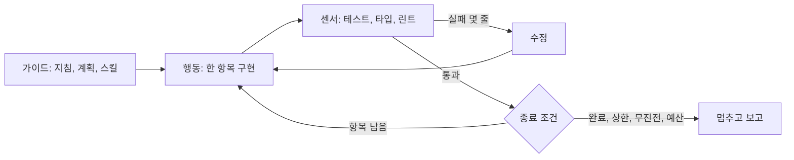
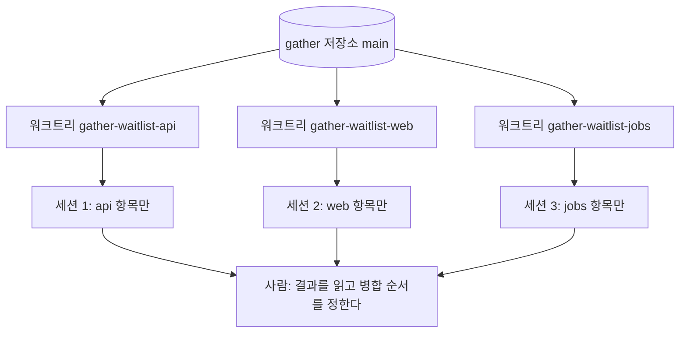

<!-- 개정: 2026-09-28 수락 게이트 1차 수정 반영 — loop.sh timeout(끊긴 호출) 명시 처리·비용 빈 값 방지, 종료 코드 설명(0·2·3·4, 6장 5)을 스크립트와 일치; --bare 전방 참조 9장으로 -->
# 5장. 루프에 일을 맡기다 — 3단계 위임

앞 장에서 우리는 에이전트가 한 걸음 움직일 때마다 승인을 눌렀다. 계획을 먼저 승인했으니 버튼 하나하나의 무게는 가벼워졌지만, 누르는 횟수는 그대로다. 그 손을 떼면 무슨 일이 생길까?

이번에 맡길 일은 제법 크다. 정원이 찬 모임에 대기 신청을 받고, 확정 예약이 취소되면 대기 1순위를 자동으로 확정해 알림을 보내는 대기자 명단 기능이다. `api`에는 도메인 규칙과 엔드포인트가, `jobs`에는 승격 알림이, `web`에는 대기 신청 버튼과 순번 표시가 필요하다. 4장의 방식대로 계획 문서를 쓰고 작업을 1시간 이하 조각으로 나눠 보니 열한 조각이 나왔다. 조각마다 승인 버튼을 스무 번씩 누른다면 하루가 버튼 누르는 일로 끝날 판이다.

3단계 위임은 이 버튼에서 손을 떼는 단계다. 에이전트가 일을 주도하고, 사람은 결과를 검토하고 질문에 답한다. 도구로 말하면 편집을 자동으로 승인하고, 위험한 행동은 훅으로 막고, 여러 세션을 나란히 돌린다. 사람이 서는 자리도 달라진다. 산출물을 한 줄씩 들여다보던 루프 안에서, 산출물을 만드는 루프 자체를 설계하고 고치는 루프 위로 올라간다(2장에서 본 Kief Morris의 구분이다). 그런데 승인 버튼이 사라지면, 에이전트가 틀렸다는 걸 누가 알려 줄까?

## 루프의 연료는 바깥에서 온다

에이전트가 스스로 틀린 걸 알아채고 고칠 수 있다면 문제는 간단하다. 아쉽게도 연구 결과는 그렇게 낙관적이지 않다. Huang 외(ICLR 2024)는 외부 피드백 없이 스스로 답을 고치게 하면 추론 성능이 좋아지지 않고 때로는 오히려 떨어진다고 보고했다. Olausson 외(ICLR 2024)는 코드 생성에서 자기 수리의 이득이 수리 비용까지 따지면 작거나 없을 때가 많다고 봤다. 병목은 모델이 자기 코드에 주는 피드백의 질이었고, 더 강한 모델이나 사람이 피드백을 주자 이득이 크게 늘었다. 반대로 Self-Debugging 연구처럼 실행 결과를 보여 주고 고치게 하면 정확도가 올랐다. 모두 당시 모델 기준의 결과지만 방향은 한결같다. 루프를 돌리는 연료는 모델 안에서 나오지 않는다. 테스트, 타입 검사, 린터 같은 바깥의 신호에서 온다.

그래서 루프의 모양은 단순하다. 구현하고, 실행하고, 실패 신호를 읽고, 고친다. 이 신호가 믿을 만할수록 루프는 멀리 간다. 커뮤니티는 이것을 역압(back pressure)이라고 부른다. 에이전트가 속일 수 없는 검사, 곧 테스트와 타입 검사기와 린터와 CI를 통과할 때까지 돌리는 것이다. Addy Osmani는 팩토리의 진짜 제약을 생성보다 검증에서 찾으며 이 역압을 강조한다. 커뮤니티의 논의를 한 줄로 줄이면 3단계 전체의 기준이 된다. 싸고 확실하게 검증할 수 있는 만큼만 자율성을 주자.

`gather`에 견주어 보면 이 기준이 금방 구체적인 선이 된다. 대기자 명단의 도메인 규칙, 예컨대 "취소가 나면 가장 먼저 신청한 대기자가 확정된다"는 Kotest 단위 테스트로 몇 초 만에 확실하게 검증된다. 이런 곳은 루프에 맡겨도 좋다. `web`의 대기 버튼이 올바른 순번을 보여 주는지는 타입 검사와 컴포넌트 테스트로 절반쯤 확인된다. 루프에 맡기되 마지막에 화면을 한 번 봐야 한다. 승격 알림 문구가 자연스러운지는 어떨까? 이건 어떤 검사로도 싸게 확인하기 어렵다. 루프가 초안을 쓰게 하더라도 판단은 사람이 한다.

신호의 양도 설계 대상이다. Anthropic의 Nicholas Carlini는 병렬 Claude 에이전트로 C 컴파일러를 만든 경험을 정리하며, 테스트 하네스는 쓸모없는 출력을 수천 바이트씩 쏟아 내지 말고 몇 줄만 보여 준 뒤 중요한 정보는 파일에 남기라고 권했다. Gradle의 긴 스택 트레이스를 통째로 컨텍스트에 붓는 루프는 금방 길을 잃는다. 그래서 4장에서 만든 `scripts/dev/check.sh`를 조금 고쳤다. 이제 실패한 테스트 이름과 첫 번째 단언 실패만 몇 줄 보여 주고, 전체 로그는 `.factory/logs/`에 남긴다. 루프에 필요한 것은 무엇이 실패했는지, 딱 그만큼이다.


그림 1. 루프의 해부 — 가이드가 행동을 이끌고, 센서의 신호로 고치며, 종료 조건이 루프를 끝낸다

## Ralph — 같은 프롬프트를 되풀이하는 루프

가장 단순한 루프에는 이름이 있다. Geoffrey Huntley가 2025년 7월에 소개한 Ralph(Wiggum) 루프다. 발상은 우스울 만큼 단순하다. 같은 프롬프트로 코딩 에이전트 CLI를 끝없이 다시 실행한다. 원래 글에 적힌 명령의 표기는 자료마다 조금씩 다르게 전해지지만, 에이전트 CLI를 반복 실행하는 셸 한 줄이라는 요지는 같다.

이 단순한 루프가 제대로 돌려면 규칙이 몇 개 필요하다. 한 번 돌 때 한 항목만 처리한다. 진행 상태는 컨텍스트 창이 아닌 파일과 git 히스토리에 둔다. 컨텍스트가 차면 새 에이전트가 그 파일을 읽고 이어받는다. 그리고 항목을 끝냈다고 치는 기준은 속일 수 없는 검사의 통과다. Huntley는 이 방식을 두고 "deterministically bad in an undeterministic world"라고 했다. 매번 조금씩 틀리지만 틀리는 방식이 예측 가능하니, 검사로 걸러 내며 앞으로 나아갈 수 있다는 뜻으로 읽으면 된다.

Anthropic은 이 기법을 Claude Code 공식 플러그인으로 내놓았다. 플러그인 README에 따르면 Stop 훅으로 Claude의 종료 시도를 가로채 같은 프롬프트를 다시 넣는다. 4장에서 본 규칙, Stop 훅이 멈춤을 막으면 멈추지 못하고 대화가 이어진다는 그 규칙이 이 루프의 엔진인 셈이다. 이 플러그인은 종료 코드 2 대신 "막는다(block)"는 결정을 JSON으로 돌려주는 방식을 쓰지만 효과는 같다. `gather`에서는 이렇게 걸 수 있다.

```text
/ralph-loop "docs/progress/waitlist.md에서 체크되지 않은 항목 하나를 골라 구현하라.
항목 옆에 적힌 검사 명령이 통과하면 그 항목을 체크하고 커밋하라.
모든 항목이 체크되면 <promise>DONE</promise>를 출력하라." --completion-promise "DONE" --max-iterations 20
```

`--completion-promise`는 에이전트가 이 문자열을 출력하면 루프를 끝낸다는 약속이고, `--max-iterations`는 그 약속이 끝내 오지 않을 때를 대비한 상한이다. 상한 없는 Ralph를 켜 두고 잠자리에 드는 장면을 떠올려 보자. 아찔하다. 루프가 무한히 돈다는 것은 토큰이 무한히 나간다는 뜻이다.

약속 문자열이 에이전트의 "다 끝났다"는 주장에 기대고 있다는 점도 눈여겨보자. 에이전트가 항목을 체크하고 약속을 출력하면 루프는 믿는다. 이 믿음에 대해서는 이 장 끝에서 다시 이야기하자.

Huntley는 한 엔지니어가 5만 달러짜리 계약의 MVP를 297달러의 비용으로 납품했다는 사례를 들었다. 저자가 전한 사례이지 검증된 측정은 아니니 가볍게 읽고 넘어가자. 그보다 오래 남는 것은 규칙 쪽이다. 한 번에 한 항목, 상태는 파일에, 끝의 기준은 검사에. 이 세 가지는 어떤 루프 도구를 쓰든 그대로 가져갈 수 있다.

어떤 일이 Ralph에 잘 맞을까? 규칙을 뒤집어 보면 답이 나온다. 항목으로 잘게 쪼갤 수 있고, 항목마다 끝났는지를 검사로 확인할 수 있는 일이다. `gather`로 치면 예전 방식으로 오류를 돌려주던 엔드포인트 스무 개를 ProblemDetail 형식으로 옮기는 일, 쌓여 있던 린트 경고 수백 개를 치우는 일, `jobs`의 테스트 커버리지를 모듈별로 채워 가는 일이 여기에 든다. 반대로 "알림 문구를 더 친근하게"처럼 끝났는지를 검사로 말할 수 없는 일, 여러 항목이 한꺼번에 바뀌어야 의미가 있는 설계 변경은 Ralph에 맞지 않는다. 그런 일에 루프를 걸면 에이전트는 끝없이 다듬거나, 아무 데서나 끝났다고 선언한다.

## 긴 작업은 인계로 버틴다

열한 조각짜리 일은 한 세션에 끝나지 않는다. 컨텍스트 창이 차고, 세션이 끊기고, 다음 세션은 앞의 일을 기억하지 못한다. Anthropic의 Justin Young은 장기 실행 에이전트를 위한 하네스 글(2025-11)에서 이 문제를 이렇게 요약했다. 긴 작업은 끊어진 세션들에 걸쳐 진행되고, 새 세션은 앞서 무슨 일이 있었는지 모르는 채 시작한다.

그들의 해법은 역할을 둘로 나누는 것이다. 첫 세션의 initializer 에이전트는 환경을 깐다. 기능 목록을 JSON으로 만들어 항목마다 통과·실패를 표시하고, 환경을 띄우는 `init.sh`와 git 저장소를 준비한다. 그 뒤의 코딩 에이전트는 세션마다 한 기능씩만 진행하고, 진행 파일과 커밋으로 다음 세션에 넘긴다. 이 글이 관찰한 실패 목록은 3단계를 설계하는 사람에게 그대로 체크리스트가 된다. 일찍 완료를 선언한다. 기록 없이 진행한다. 테스트 없이 기능을 완료로 표시한다. 현재 상태를 파악하지 못한다. 네 가지 모두 모델이 똑똑해지기를 기다릴 필요 없이 하네스로 막을 수 있는 종류다(글은 2025년 11월 당시 모델 기준이지만 원리는 지금도 유효하다).

`gather`에서는 계획 문서 옆에 진행 파일을 둔다.

```markdown
# 대기자 명단 — 진행 파일
계획: docs/plans/waitlist.md · 루프: scripts/factory/loop.sh · 환경: scripts/dev/init.sh

## 항목 (검사가 통과했을 때만 체크한다)
- [x] api: WaitlistEntry 도메인과 저장소 — check.sh api
- [x] api: 대기 신청 POST /api/gatherings/{id}/waitlist — check.sh api
- [ ] api: 확정 예약 취소 시 대기 1순위 승격(WaitlistService.promoteNext) — check.sh api
- [ ] api: 승격 이벤트를 outbox 테이블에 기록 — check.sh api
- [ ] jobs: outbox를 읽어 승격 알림 발송 — check.sh jobs
- [ ] web: 대기 신청 버튼과 순번 표시 — check.sh web
  … (나머지 다섯 항목)

## 인계 메모 (알아낸 즉시 한 줄씩)
- 모임 정원 변경 API가 있다. 정원이 늘면 한 번에 여러 명이 승격될 수 있다 → 항목 추가함.
- GatheringRepository.findForUpdate는 비관적 락이다. 동시 취소에 안전하려면 승격도 이걸 쓴다.
- jobs 테스트는 로컬 DB가 떠 있어야 한다. 새 세션은 scripts/dev/init.sh부터.
```

진행 파일에는 규칙이 두 개 있다. 항목은 검사가 통과했을 때만 체크한다. 그리고 알아낸 사실은 그 즉시 인계 메모에 적는다. 두 번째 규칙에는 사연이 있다. 한 Claude Code 사용자는 26일 동안 컴팩션을 59번 겪으며 직접 3계층 메모리를 만들었는데, 그가 얻은 교훈이 "통찰은 즉시 파일에 적고 몰아서 쓰지 말 것"이었다(커뮤니티 보고). 몰아 쓰려고 미뤄 둔 사이에 컴팩션이 먹어 버린다. 메모리를 도구 전용 경로 대신 git이 추적하는 마크다운에 두자는 목소리도 커뮤니티에서 같이 나왔다. 세션이 바뀌어도, 도구를 바꿔도 상태가 남기 때문이다.

`scripts/dev/init.sh`는 로컬 DB 컨테이너를 띄우고 세 모듈의 의존성을 설치한다. initializer 에이전트가 하던 일을 스크립트로 굳혀 둔 것이다. 새 세션이 "환경이 어떻게 돼 있지?"를 탐색하느라 턴을 쓰지 않게 하는 장치이기도 하다.

새 세션이 처음 해야 할 일도 정해 두자. `gather`에서는 루프 프롬프트의 첫머리에 세 줄을 둔다. 진행 파일을 읽는다, `init.sh`로 환경을 맞춘다, `check.sh all`을 돌려 지금 무엇이 통과하고 무엇이 실패하는지 확인한다. 이 세 턴이 Anthropic 글이 관찰한 "현재 상태를 파악하지 못함"을 막는다. 앞 세션이 체크해 둔 항목이 정말 통과하는지도 이때 드러난다. 체크 표시는 앞 세션의 주장일 뿐이고, 검사 결과가 사실이다.

## 여러 루프를 나란히 — 워크트리

루프 하나가 돌기 시작하면 욕심이 생긴다. `api`와 `web`과 `jobs`를 동시에 돌리면 어떨까? 여기서 흔한 실수가 같은 작업 디렉터리에 세션 셋을 띄우는 것이다. 한 세션이 빌드하는 사이 다른 세션이 같은 파일을 고치고, 셋째 세션은 반쯤 고쳐진 파일로 테스트를 돌린다. 누가 무엇을 깨뜨렸는지 아무도 모르는 상황, 생각만 해도 끔찍한 일이다.

답은 git 워크트리다. Claude Code 문서의 표현대로, 워크트리는 세션마다 별도의 git 체크아웃을 주니 병렬 세션이 같은 파일을 고칠 일이 없다.

```bash
git worktree add ../gather-waitlist-api  -b feat/waitlist-api
git worktree add ../gather-waitlist-web  -b feat/waitlist-web
git worktree add ../gather-waitlist-jobs -b feat/waitlist-jobs
```

터미널 셋에서 각 디렉터리에 에이전트 세션을 하나씩 띄우고, 저마다 진행 파일에서 자기 모듈 항목만 맡게 한다. 모듈별 항목이 서로 다른 줄에 있으니 나중에 브랜치를 합칠 때 진행 파일이 충돌할 일도 적다. Boris Cherny가 워크트리 3~5개에 세션을 하나씩 띄우는 방식을 Claude Code 팀이 모두 동의하는 가장 큰 생산성 요인으로 꼽았다는 이야기가 커뮤니티에 널리 퍼졌다. 여기서 그가 말한 목표를 오해하지 말자. 목표는 코드를 더 빨리 쓰는 데 있지 않고, 더 많은 에이전트를 동시에 감독하는 데 있다. 세션 다섯 개를 띄워 놓고 결과를 읽을 시간이 없다면 다섯 개를 나란히 방치하고 있는 셈이다.


그림 2. 워크트리 병렬 구조 — 워크트리 하나에 세션 하나, 사람은 결과를 모아 병합한다

한 세션 안에서 일을 나누는 방법도 있다. 2026년 9월 기준 Claude Code 문서는 병렬 실행 방식을 다섯 가지로 정리한다. 세션 안에서 일을 떼어 맡기는 서브에이전트, 백그라운드 세션들을 한눈에 보는 에이전트 뷰, 리드와 팀원으로 꾸리는 에이전트 팀, 클라우드 스레드를 조율하는 프로젝트, 그리고 Claude가 쓴 스크립트가 수십에서 수백 개의 서브에이전트를 조율하는 동적 워크플로다. 동적 워크플로는 종료 조건을 요청에 담을 수 있다는 점에서 특히 쓸모 있다. 문서의 예를 `gather`의 `web`에 옮기면 이런 요청이 된다. "워크플로를 써서 `npx tsc --noEmit`을 돌리고, 타입 검사가 통과하거나 두 번 연속 진전이 없을 때까지 보고된 오류를 고쳐라." 하나의 큰 변경을 5~30개의 워크트리 격리 서브에이전트로 쪼개는 `/batch` 스킬도 있다.

에이전트 팀은 조심해서 쓰자. 문서가 밝히듯 에이전트 팀은 팀원을 워크트리로 격리하지 않으니, 팀원마다 서로 다른 파일 묶음을 맡도록 일을 나눠야 한다. 에이전트 팀은 실험적 기능이라 기본으로 꺼져 있고 에이전트 뷰는 연구 미리보기 단계다. 이런 기능들은 빠르게 바뀔 수 있으니 공식 문서를 함께 확인하자. 이 병렬 모델은 Claude Code만의 것도 아니다. Grok Build도 워크트리에서 병렬 서브에이전트를 돌리고, Meta의 Muse Code도 격리된 워크트리의 서브에이전트로 일을 나눈다. 도구가 바뀌어도 워크트리 하나에 세션 하나라는 설계는 그대로 옮겨 갈 수 있다.

에이전트가 많아지면 누가 무엇을 하는지 정하는 일이 새 문제가 된다. Carlini의 C 컴파일러 실험에서는 16개 에이전트가 공유 git 저장소를 쓰면서, 작업을 맡을 때 `current_tasks/` 디렉터리에 텍스트 파일을 써서 락을 잡았다. 무엇을 할지 고르는 규칙도 단순했다. 각 에이전트가 서로 다른 실패 테스트를 하나씩 골랐다. Opus 4.6 시기의 실험이라 모델은 이미 구세대지만 원리는 그대로 쓸 만하다. 조율 상태를 파일에 두고, 일감의 단위를 실패 테스트처럼 검사로 확인되는 것으로 정하자.

## 스크립트로 돌리고, 확실하게 멈추게 하자

터미널을 지켜보지 않고 루프를 돌리려면 대화형 화면이 없는 실행, 곧 헤드리스 실행이 필요하다. Claude Code는 `claude -p`로, Codex는 `codex exec`로 이를 지원한다. `gather`의 루프 스크립트를 보자.

```bash
#!/usr/bin/env bash
# scripts/factory/loop.sh — 진행 파일의 항목을 하나씩 처리하는 헤드리스 루프
set -uo pipefail
PROGRESS="${1:?진행 파일 경로}"                  # 예: docs/progress/waitlist.md
MAX_ITER="${MAX_ITER:-15}"; BUDGET_USD="${BUDGET_USD:-20}"
spent=0; stalls=0; done_prev="$(grep -c '^- \[x\]' "$PROGRESS")"

for i in $(seq 1 "$MAX_ITER"); do
  if ! grep -q '^- \[ \]' "$PROGRESS"; then
    ./scripts/dev/check.sh all && { echo "완료"; exit 0; }   # 에이전트의 말 대신 검사를 믿는다
  fi

  out="$(timeout 30m claude -p "$(cat scripts/factory/prompts/next-item.md) 진행 파일: $PROGRESS" \
    --output-format json --permission-mode acceptEdits \
    --allowedTools "Bash(./scripts/dev/check.sh *),Bash(git status *),Bash(git diff *),Bash(git add *),Bash(git commit *)")"
  rc=$?                                            # 124면 timeout이 30분에서 호출을 끊은 것이다

  cost="$(jq -r '.total_cost_usd // empty' <<<"$out" 2>/dev/null)"; note=""
  if [ -z "$cost" ]; then cost=0; note=" rc=$rc 비용보고없음"; fi   # 끊기거나 실패한 호출은 비용 JSON이 없다
  spent="$(bc <<<"$spent + $cost")"
  echo "$(date -u +%FT%TZ) $PROGRESS iter=$i cost=$cost total=$spent$note" >> .factory/costs.log
  [ "$(bc <<<"$spent > $BUDGET_USD")" = 1 ] && { echo "예산 초과"; exit 4; }

  done_now="$(grep -c '^- \[x\]' "$PROGRESS")"
  if [ "$done_now" -gt "$done_prev" ]; then stalls=0; else stalls=$((stalls + 1)); fi
  done_prev="$done_now"
  [ "$stalls" -ge 2 ] && { echo "두 번 연속 진전 없음"; exit 3; }
done
echo "최대 반복 도달"; exit 2
```

플래그를 몇 개 짚고 넘어가자(Claude Code v2.1.283 기준). `--output-format json`을 주면 응답에 `total_cost_usd`와 모델별 비용이 함께 온다. 반복마다 비용을 한 줄씩 남길 수 있다는 뜻이다. `--allowedTools`는 허락할 도구를 좁힌다. 이 스크립트는 `check.sh`와 git 조회·커밋만 허락했다. 4장에서 검사 입구를 하나로 모아 둔 덕분에 허락 목록도 짧아졌다. `--permission-mode acceptEdits`는 파일 편집을 자동으로 승인한다. 루프가 멈추는 조건은 네 가지이고, 조건마다 종료 코드를 따로 두었다. 모든 항목 완료(0, 단 스크립트가 직접 검사를 돌려 확인한 경우만), 최대 반복(2), 두 번 연속 무진전(3), 예산 초과(4). 이 스크립트를 부르는 쪽은 코드를 보고 분기하면 된다. 6장에서 에이전트가 스스로 손을 드는 출구(5)가 하나 더 붙는다. `timeout`은 루프 전체 대신 호출 하나에 거는 30분 상한이다. 끊긴 호출은 비용 JSON을 남기지 않으니, 스크립트는 그 반복의 비용을 0으로 더하고 로그에 표시를 남긴다. 빈 값을 그대로 더했다면 합계가 깨져 그 뒤의 예산 검사가 조용히 꺼졌을 것이다. 진전은 여느 반복처럼 진행 파일로 판단하므로, 끊긴 호출도 체크한 항목이 없으면 무진전으로 센다. 다만 끊긴 호출이 실제로 쓴 비용은 합계에서 빠진다. 로그에 표시가 남은 날은 사용량 화면과 맞춰 보자.

`--bare`에 대해서도 한마디 해 두자. Claude Code 문서는 스크립트와 SDK 호출에 `--bare`를 권장하고, 앞으로 `-p`의 기본값이 될 거라고 예고한다. `--bare`는 훅, 스킬, 플러그인, MCP, `CLAUDE.md` 자동 탐색을 모두 건너뛴다. 우리 로컬 루프에서는 일부러 쓰지 않았다. 4장에서 만든 가드 훅과 `AGENTS.md`가 바로 이 루프의 난간이기 때문이다. 사정이 다른 곳도 있다. 문서에 따르면 `--bare` 없이 `-p`를 돌리면 한 번도 신뢰한 적 없는 폴더에서도 프로젝트의 `.claude/settings.json` 훅을 실행하고 `.mcp.json`의 서버에 연결한다. 남이 올린 코드를 체크아웃해 돌리는 CI라면 이야기가 완전히 달라진다는 뜻이다. 이 차이는 9장에서 다시 만난다.

Codex로 같은 루프를 돌리고 싶다면 `codex exec`를 쓴다(Codex CLI rust-v0.157.1 기준). 기본값이 읽기 전용이라 파일을 고치게 하려면 `--sandbox workspace-write`를 명시해야 하고, `--json`을 주면 진행 이벤트가 JSONL로 나온다. 읽기 전용이 기본이라는 점이 반갑다. 리뷰나 분석처럼 고칠 필요가 없는 루프는 아무 플래그 없이도 안전하게 시작할 수 있다. 6장에서 검증자를 만들 때 이 성질을 활용한다.

## 에이전트를 늘리기 전에

루프가 잘 돌면 에이전트를 더 붙이고 싶어진다. 역할을 나눈 에이전트 다섯이 서로 리뷰하고 토론하면 품질도 오르지 않을까? 연구는 신중하라고 말한다. MAST 연구(NeurIPS 2025)는 7개 다중 에이전트 프레임워크의 실행 기록 1,600개 이상을 분석해 실패 모드 14개를 찾았고, 그것들을 시스템 설계 문제, 에이전트 사이의 어긋남, 과제 검증 실패라는 세 범주로 묶었다. 초록의 한 문장이 요지를 말한다. 다중 에이전트 시스템에 대한 열기와 달리 벤치마크에서 얻는 성능 이득은 대개 미미하다.

반대 방향의 사례도 있다. Agentless는 LLM에게 다음 행동을 고르게 하지 않았다. 위치 파악, 수리, 검증이라는 고정된 3단계 파이프라인을 돌렸을 뿐인데, 게재판 기준 SWE-bench Lite에서 32.00%를 과제당 0.70달러에 냈다. 당시 오픈소스 에이전트들 가운데 최고 수준이었다(당시 모델 기준). 에이전트의 자유보다 파이프라인의 결정성이 이긴 셈이다. 그렇다면 `gather`의 루프에 에이전트를 더하기 전에 무엇을 물어야 할까? MAST의 세 범주를 뒤집으면 질문 셋이 된다. 역할이 분명한가, 에이전트 사이의 인계 규약이 있는가, 검증 단계가 작성자와 독립적인가. 셋 중 하나라도 흐릿하면 에이전트 수를 늘리기 전에 그것부터 고치자.

비용도 함께 는다. Claude Code 비용 문서에 따르면 에이전트 팀은 팀원이 plan 모드로 돌 때 일반 세션보다 약 7배 많은 토큰을 쓴다. 커뮤니티에는 서브에이전트 일곱 개를 띄웠다가 일이 끝나기도 전에 예산을 다 썼다는 사례, 어려운 작업을 맡겼더니 에이전트가 415개까지 불어났다는 사례가 올라온다(커뮤니티 보고). 루프 스크립트에 예산 상한을 둔 이유가 여기 있다. 상한은 에이전트를 못 믿어서 두는 장치로 보기보다, 에이전트가 잘못된 방향으로 성실해질 때를 대비하는 장치로 보는 편이 정확하다.

## 루프가 믿는 것

이제 `gather`에는 밤새 돌 수 있는 루프가 있다. 계획을 쓰고, 진행 파일을 준비하고, 워크트리 셋에 루프를 걸어 두고 퇴근할 수 있다. 종료 조건도, 예산 상한도, 비용 기록도 있다.

그런데 이 루프가 무엇을 믿고 멈추는지 다시 들여다보자. 에이전트는 검사가 통과하면 항목을 체크한다. 스크립트는 모든 항목이 체크되면 `check.sh all`을 직접 돌려 초록불을 확인한 뒤 성공으로 끝난다. 루프의 모든 판단이 결국 초록불 하나에 걸려 있다. 그 초록불을 켜는 테스트는 누가 썼는가? 같은 에이전트다. 테스트가 좀처럼 통과하지 않을 때, 루프가 찾을 수 있는 가장 싼 길은 코드를 고치는 쪽일까, 테스트를 고치는 쪽일까? 새벽에 끝난 루프가 모든 불을 초록으로 켜 둔 채 우리를 기다릴 때, 그 초록불이 거짓일 가능성을 우리는 아직 한 번도 따져 보지 않았다.
