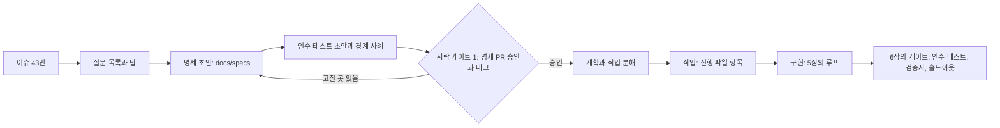

<!-- 개정: 2026-09-28 수락 게이트 1차 수정 반영 — 2장 비교표 인용 문구 정정 -->
# 7장. 사람은 명세를 쓰고 테스트를 승인한다 — 4단계 승인 (1)

명세를 빼자 성공률이 3분의 1로 떨어졌다. Scale AI 연구진이 만든 SWE-Bench Pro는 과제마다 사람이 보강한 요구사항과 인터페이스 명세를 붙여 두었는데, 이 둘을 빼고 문제 설명만 주자 GPT-5(high)의 해결률이 25.9%에서 8.40%로 내려앉았다(2025년 논문, 당시 모델 기준).

이 숫자는 조금 더 들여다볼 가치가 있다. 연구진은 하락의 한 원인을 이렇게 설명한다. 제약이 없으면 에이전트는 특히 기능 추가 과제에서 더 다양한 해법을 내놓는데, 단위 테스트는 좁은 범위의 해법만 정답으로 받아 주니 멀쩡한 해법도 오답 처리된다는 것이다. 에이전트가 갑자기 무능해졌다기보다, 에이전트가 내놓은 답과 채점기가 기대한 답이 서로 어긋났다는 이야기다. 명세가 하는 일이 바로 그 어긋남을 막는 것이다.

앞 장에서 우리는 채점기를 에이전트 손 밖으로 옮겼다. 그렇다면 그 채점기의 기준은 누가 정하는가? 4단계 승인에서 사람이 쥐는 것이 바로 그 기준이다.

## 사람이 승인하는 것이 바뀐다

TiCoder(IEEE TSE 2024)는 이 생각을 대화 방식으로 옮긴 연구다. 모델이 테스트를 먼저 제시하고 사용자가 "맞다" 또는 "틀리다"로 답하면, 그 답으로 코드 후보를 걸러 낸다. 4개 LLM과 2개 데이터셋에서 사용자 상호작용 5회 안에 pass@1이 평균 45.97%p 올랐다(절대값, 당시 모델 기준). 사용자 연구의 참가자들은 AI 코드를 더 정확하게 평가했고 인지 부하도 줄었다고 답했다. 사람이 코드를 한 줄씩 읽는 대신 테스트를 보고 의도를 확정한 셈이다.

모호함을 다루는 순서도 중요하다. ClarifyGPT(FSE 2024)는 요구사항이 모호한지 먼저 감지하고, 모호하면 코드를 쓰기 전에 표적 질문을 던진다. 사람이 참여한 평가에서 GPT-4의 Pass@1이 MBPP-sanitized 기준 70.96%에서 80.80%로 올랐다. 에이전트가 먼저 묻게 만든 것만으로 얻은 이득이다. 4장에서 "열린 질문 칸이 비어 있는 계획은 의심하자"고 했던 것과 같은 방향이다.

현장 사례도 하나 보자. 규제 산업의 오래된 제품에서 스태프 엔지니어 한 명이 AI 에이전트 넷과 명세 주도 워크플로로 원래 4인 스쿼드가 할 일을 계획 기간의 절반에 끝냈다는 사례 연구가 있다(Vilas Boas 외, 2026). 단일 사례이고 저자가 그 조직에 속했을 수 있어 일반화는 조심해야 한다. 그래도 저자들이 내린 결론은 곱씹어 볼 만하다. 1인 스쿼드의 성패를 가른 결정적 제약은 모델의 역량보다 명세의 품질과 조직의 지식이었다.

세 연구를 모으면 4단계의 모양이 보인다. 2장의 비교표에서 4단계 승인은 "명세와 인수 기준을 쓰고, PR을 승인한다"는 단계였다. 여기서 승인의 순서를 분명히 하자. 코드가 나온 뒤의 승인에 앞서, 코드가 나오기 전에 의도와 인수 기준, 그리고 인수 기준을 옮긴 인수 테스트를 먼저 승인한다. PR 승인은 사라지지 않는다. 다만 PR을 열었을 때 무엇을 확인해야 하는지 이미 알고 있게 된다. 이 앞당긴 승인이 `gather`의 사람 게이트 1이다.

테스트를 승인한다는 것은 구체적으로 무엇을 본다는 뜻일까? 세 가지만 확인하면 된다. 첫째, Given의 조건이 현실에서 일어날 법한가. "정원 0명인 모임"처럼 만들어질 수 없는 상황을 전제한 테스트는 아무것도 지켜 주지 못한다. 둘째, Then이 밖에서 관찰할 수 있는 결과인가. 응답 코드, 저장된 상태, 발행된 이벤트처럼 사용자나 다른 모듈이 볼 수 있는 것이어야 한다. 내부 메서드가 몇 번 불렸는지를 확인하는 테스트는 구현을 바꾸는 순간 깨지고, 의도는 지켜 주지 못한다. 셋째, 테스트 이름만 읽어도 규칙이 읽히는가. "시작 이후에는 취소할 수 없다"처럼 읽히면 그 테스트는 명세의 한 줄과 짝이 맞는다. 코드 수백 줄을 읽는 것과 비교하면 훨씬 짧고, 무엇보다 우리의 의도와 거리가 가깝다. 사람이 판단력을 쓰기에 가장 값싼 자리가 여기다.

## 명세의 세 가지 수준

명세 주도 개발(SDD)이라는 말은 하나지만 쓰는 사람마다 뜻이 조금씩 다르다. Böckeler는 2025년 10월 글에서 이를 세 수준으로 나눴고, Piskala(2026)의 실무 가이드도 같은 틀을 쓴다.

첫째는 spec-first다. 명세를 먼저 쓰고 그 명세로 구현을 이끈다. 구현이 끝나면 명세는 할 일을 다 한 셈이고, 이후의 변경은 코드와 테스트가 이끈다. 둘째는 spec-anchored다. 명세를 기능과 함께 계속 살려 둔다. 동작이 바뀌면 명세가 먼저 바뀌고, 명세가 바뀌면 테스트가 따라 바뀐다. 셋째는 spec-as-source다. 명세가 유일한 원본이고 코드는 명세에서 생성되는 부산물이다. 사람은 코드를 직접 고치지 않는다. Piskala의 표현을 빌리면 명세를 진실의 원천으로, 코드를 생성되거나 검증되는 부차적 산출물로 다룬다.

수준이 올라갈수록 명세의 권위가 커진다. spec-as-source는 매력적으로 들리지만 위험도 그만큼 크다. Böckeler는 이것이 모델 주도 개발(MDD)의 경직성과 LLM의 비결정성을 한데 묶을 수 있다고 경고한다. 예전 MDD는 명세를 고치기 어렵고 생성기의 한계에 갇힌다는 이유로 외면받았다. 거기에 같은 명세가 매번 조금씩 다른 코드가 되는 LLM의 성질이 더해진다면? 결정적인 생성기가 있는 좁은 영역, 예컨대 OpenAPI 명세에서 API 클라이언트를 만들거나 스키마에서 타입을 뽑는 일이 아니라면 아직은 이르다고 보는 편이 안전하다.

`gather`의 선택은 기능마다 다르다. 예약 상태 전이처럼 오래 살고 자주 손대는 핵심 규칙은 spec-anchored로 명세를 계속 고쳐 가며 쓰고, 한 번 만들고 거의 바뀌지 않을 기능은 spec-first로 충분하다. 이렇게 수준을 섞어 쓰는 것이 이상한 일은 아니다. 명세도 결국 유지보수해야 하는 산출물이니, 유지할 가치가 있는 곳에만 오래 살려 두자.

spec-anchored가 말로만 끝나지 않으려면 장치가 하나 필요하다. 명세와 코드가 따로 놀기 시작하는 것, 곧 명세 드리프트를 알아챌 방법이다. `gather`에서는 CI에 가벼운 검사를 하나 둔다. `api/src/main/kotlin/gather/reservation/` 아래의 동작 코드가 바뀌었는데 `docs/specs/reservation-*.md`는 그대로인 PR이면 경고 코멘트를 단다. 실패로 막지는 않는다. 리팩터링처럼 동작이 바뀌지 않는 변경도 있기 때문이다. 대신 사람이 PR을 열었을 때 "명세를 안 고쳐도 되는 변경인가?"를 한 번은 묻게 만든다.

## 도구들 — Spec Kit, Kiro, 그리고 가벼운 길

GitHub Spec Kit은 Specify → Plan → Tasks → Implement 네 단계로 명세 주도 흐름을 만든다(v1.0.12, 2026-09-25 기준). 모든 단계에 걸쳐 지킬 원칙을 "constitution"이라는 지속 규칙으로 둔다는 점이 눈에 띈다. `gather`로 치면 "결제·환불 로직은 건드리지 않는다"나 "모든 상태 변경 API는 멱등하다" 같은 규칙이 constitution에 들어갈 만하다. AWS의 Kiro는 `requirements.md`(버그라면 `bugfix.md`) → `design.md` → `tasks.md` 순서로 문서를 만들고, 작업 사이의 의존성을 분석해 웨이브로 묶는다. Kiro 문서의 표현대로 웨이브는 차례로 실행되고, 한 웨이브 안의 작업은 동시에 실행된다. 5장의 워크트리 병렬을 도구가 대신 짜 주는 셈이다. 8장에서 볼 genai-jerry의 공개 팩토리 저장소는 OpenSpec을 명세 도구로 쓴다.

도구 없이 가는 길도 있다. 4장의 계획 문서에 인수 기준을 Given-When-Then 시나리오로 적고, 그 시나리오를 인수 테스트로 옮기는 것만으로도 spec-first의 핵심은 얻는다. 1인 개발자에게는 이 가벼운 길이 출발점으로 가장 무난하다.

어떤 길을 고르든 에이전트가 명세를 찾아 읽게 만드는 일은 따로 챙겨야 한다. `gather`의 `AGENTS.md`에는 "명세" 절을 한 줄 더했다. 기능에 해당하는 명세가 `docs/specs/`에 있으면 구현 전에 읽고, 명세와 코드가 서로 다르면 어느 쪽도 고치지 말고 질문하라는 내용이다. 에이전트는 명세와 다른 코드를 발견하면 조용히 코드에 맞춰 명세를 고치거나, 명세에 맞춰 코드를 고치려 든다. 어느 쪽이 맞는지는 사람만 안다. Spec Kit을 쓴다면 constitution과 `AGENTS.md`의 규칙이 겹치기 쉽다는 점도 챙기자. 같은 규칙이 두 곳에 있으면 언젠가 둘이 어긋난다. 한 곳을 정본으로 정하고 다른 쪽은 그곳을 가리키게 하자.

| | Spec Kit | Kiro | 가벼운 길 |
|---|---|---|---|
| 흐름 | Specify → Plan → Tasks → Implement | requirements → design → tasks | 계획 문서 → 인수 테스트 → 구현 |
| 두드러진 장치 | constitution(지속 규칙) | 의존성 분석과 웨이브 병렬 | 4장의 템플릿과 5장의 진행 파일 |
| 잘 맞는 곳 | 여러 모듈에 걸친 새 기능 | 큰 기능을 병렬로 나눠 구현 | 1인 개발, 기존 코드베이스의 작은 기능 |
| 조심할 점 | 리뷰할 문서가 많아진다 | 도구가 정한 흐름을 따라야 한다 | 규율이 전적으로 사람에게 달렸다 |

학술 근거는 아직 얇다. Spec Kit Agents(2026-04)는 PM과 개발자 역할을 둔 다중 에이전트 SDD 파이프라인에, 단계마다 저장소의 실제 코드를 읽게 하는 탐색 훅과 중간 산출물을 검사하는 검증 훅을 붙였다. 저장소 5개, 기능 32개, 실행 128회에서 LLM 심판이 매긴 5점 척도 점수는 0.15점, 만점의 3.0% 오르는 데 그쳤다. 연구진은 커지고 변하는 저장소에서 에이전트가 여전히 "context blind" 상태로 API를 지어내고 아키텍처를 어긴다고 적었다. 명세 도구를 들인다고 저장소의 맥락이 저절로 따라 들어오지는 않는다는 경고로 읽자. 명세 주도의 효과를 뒷받침하는 가장 강한 근거는 도구 비교보다 이 장 첫머리의 간접 증거들, 곧 명세를 뺐을 때의 하락과 테스트로 의도를 확정했을 때의 상승에서 나온다.

## 폭포수가 돌아온 걸까

명세를 먼저 쓰자고 하면 꼭 나오는 반론이 있다. 2025년 11월 Hacker News의 「Spec-Driven Development: The Waterfall Strikes Back」 스레드가 대표적이다. 첫 시도에 원하는 대로 나오는 일은 드물어 어차피 반복해야 한다, 긴 명세를 쓰고 수천 줄을 생성한 뒤에야 어긋남을 발견해 원점으로 돌아간다는 목소리가 모였다(커뮤니티 보고). Böckeler도 여러 도구를 써 본 뒤 "I'd rather review code than all these markdown files"라고 적었다. 마크다운 더미를 리뷰하느니 차라리 코드를 리뷰하겠다는 것이다. 작은 수정에는 과하고, 기존 코드베이스에는 약하고, 에이전트가 명세를 무시하거나 지나치게 해석한다는 지적도 함께였다. 2025년 10월 시점의 도구를 보고 쓴 글이라 지금의 도구와는 차이가 있지만, 지적의 뼈대는 여전히 유효하다. 에이전트 코딩의 함정을 비판해 온 Lars Faye가 겨냥한 업계 분위기도 바로 이것이었다고 커뮤니티는 전한다. 계획을 생성해 놓고 코드에서는 손을 떼는 태도 말이다. 명세 주도 개발이 사람이 코드에서 눈을 돌리는 핑계가 된다면 그 비판은 정확하다.

반대편의 목소리도 만만치 않다. 인수 기준 중심의 명세를 두세 시간 쓰면 저녁에는 테스트된 다음 버전이 나온다는 경험담이 있다. 명세는 고정된 단계가 되기보다 LLM이 맥락에 들어오는 입구이며 계속 진화한다는 반론도 있다. 이것을 "빠르고 반복적인 폭포수"라고 부르는 사람도 있다(모두 커뮤니티 보고).

어느 쪽이 맞을까? 둘 다 맞는 자리가 있다. 폭포수가 비판받은 이유를 다시 떠올려 보자. 명세를 먼저 쓴다는 것 자체가 문제였을까? 더 큰 문제는 명세를 한 번 쓰고 몇 달 뒤에야 결과를 확인하는 긴 주기였다. 에이전트는 그 주기를 시간 단위로 줄인다. 명세를 쓰고 저녁에 결과를 보고, 틀렸으면 다음 날 아침에 명세를 고쳐 다시 돌릴 수 있다. 다만 작은 변경에 무거운 명세를 씌우면 Böckeler의 불평이 그대로 현실이 된다. 명세의 수준은 변경의 크기에 맞춰 고르자.

| 변경의 크기 | `gather`의 예 | 명세 수준 | 사람 게이트 1 |
|---|---|---|---|
| 동작이 바뀌지 않는 수정 | 문구 수정, 의존성 패치, 리팩터링 | 이슈 본문으로 충분 | 두지 않는다(PR 머지만) |
| 한 모듈의 작은 기능 | 모임 목록 정렬 옵션 | 계획 문서 + 인수 기준 3~5개 | 계획 승인 |
| 규칙이 있고 여러 모듈에 걸친 기능 | 예약 취소 정책 | spec-first 명세 + 인수 테스트 | 명세 PR 승인 |
| 오래 살고 자주 바뀌는 핵심 규칙 | 예약 상태 전이 | spec-anchored(명세를 계속 갱신) | 명세가 바뀔 때마다 승인 |
| 생성기가 결정적으로 만드는 코드 | OpenAPI에서 만드는 API 클라이언트 | spec-as-source | 명세 변경 승인 |

## gather — 예약 취소 명세와 사람 게이트 1

4장의 금요일 오후에 한 줄로 맡겼던 예약 취소가 다시 돌아왔다. 모임 직전 취소 때문에 빈자리가 남는다는 불평이 쌓였고, 5장에서 만든 대기자 명단도 이 문제와 얽혀 있다. 이번에는 규칙이 있고 여러 모듈에 걸친 변경이니 위 표의 셋째 줄을 따르자.

먼저 Plan 모드의 에이전트와 명세 초안을 쓴다. 에이전트에게 주는 첫 요청은 질문이다. "이 이슈를 구현하기 전에 결정되지 않은 것을 질문 목록으로 내라. 질문이 없다고 판단하면 그렇게 판단한 근거를 한 줄씩 적어라." ClarifyGPT의 순서를 그대로 옮긴 요청이다. 에이전트는 늦은 취소의 기준 시각, 시작 이후 취소 허용 여부, 늦은 취소를 제재로 이어 갈지 같은 질문을 내놓는다. 우리가 답한 결과가 한 화면 분량의 명세가 된다.

```markdown
# 예약 취소 정책 (명세) — docs/specs/reservation-cancel.md
상태: 승인됨(spec-approved/cancel-deadline) · 관련: 이슈 #43 · 계획: docs/plans/cancel-deadline.md

## 의도
모임 직전 취소로 빈자리가 남는 일을 줄인다. 대기자가 있으면 빈자리는 곧바로 채워진다.

## 경계
- 대상: 회원의 확정 예약 취소. 개설자의 모임 취소는 범위 밖이다.
- 시각 판단: 모임 시작 시각 기준, 서버 시각으로 판단한다.

## 규칙
1. 시작 24시간 전까지는 자유롭게 취소한다.
2. 24시간 이내의 취소도 받되 '늦은 취소'로 기록한다.
3. 시작 이후에는 취소할 수 없다.
4. 확정 예약이 취소되면 대기 1순위가 확정되고 승격 알림 대상이 된다.
5. 같은 예약을 다시 취소하면 상태를 바꾸지 않고 현재 상태를 돌려준다.

## 하지 말 것
- 결제·환불 로직을 건드리지 않는다.
- 늦은 취소 기록으로 회원을 자동 제재하지 않는다. 제재는 별도 결정이다.
- 기존 취소 API의 응답 형식을 바꾸지 않는다.

## 인수 기준
- 24시간 전 취소: Given 시작 48시간 전인 모임의 확정 예약 / When 취소 / Then CANCELLED, 늦은 취소 기록 없음
- 늦은 취소와 승격: Given 정원이 찬 모임, 시작 3시간 전, 대기자 2명 / When 확정 회원이 취소
  / Then 늦은 취소로 기록, 대기 1순위가 CONFIRMED, 승격 알림 outbox 1건
- 시작 후 취소: Given 이미 시작한 모임 / When 취소 / Then 409, ProblemDetail type "cancel-closed"
- 중복 취소: Given 이미 취소한 예약 / When 다시 취소 / Then 200, 상태 CANCELLED 그대로

## 열린 질문
- 없음. (늦은 취소 기준은 24시간 고정, 개설자별 설정은 이번 범위 밖으로 합의)
```

다음은 인수 테스트다. 에이전트에게 인수 기준을 `api/src/acceptanceTest/`의 테스트로 옮기게 한다. 이때 TiCoder의 방식을 빌려 명세에 없는 경계 사례도 다섯 개쯤 제안하게 하자. 모임이 자정을 넘겨 시작할 때, 대기자가 한 명도 없을 때, 정원이 줄어든 모임일 때 같은 것들이다. 우리는 코드 대신 이 테스트들을 읽고 하나씩 맞다, 틀리다를 답한다. 맞다고 한 것만 인수 테스트에 남고, 명세의 인수 기준에도 한 줄씩 더해진다.

여기서 6장의 가드 훅과 부딪힌다. 인수 테스트 경로는 채점 경로라 에이전트가 쓸 수 없게 막아 두었다. 그래서 `guard-paths.sh`에 예외를 하나 둔다. 현재 브랜치가 `spec/`으로 시작할 때만 인수 테스트 경로를 연다. 명세와 인수 테스트는 `spec/cancel-deadline` 브랜치에서만 만들어지고, 구현 브랜치에서는 여전히 읽기 전용이다. 경로를 지키는 규칙은 그대로 두고 "언제" 열리는지만 정한 셈이다.

사람 게이트 1은 이 명세 브랜치의 PR을 리뷰하고 승인하는 일이다. 의도가 맞는지, 하지 말 것이 빠지지 않았는지, 인수 테스트가 인수 기준을 빠짐없이 옮겼는지 본다. 승인할 때 그 커밋에 `spec-approved/cancel-deadline` 태그를 찍는다. 아직 구현이 없으니 인수 테스트는 실패하는 상태다. 그래서 이 PR은 main에 곧장 머지하지 않고, 구현 브랜치를 이 태그에서 딴다. CI는 구현 PR에서 명세와 인수 테스트가 태그 이후로 한 글자도 바뀌지 않았는지 `git diff`로 확인한다. 6장의 `check-protected-paths.sh`에 `BASE_REF`로 이 태그를 넘기면 된다. 다만 `actions/checkout`의 기본값으로는 이 태그가 러너에 없고, `pull_request` 이벤트에서 받는 머지 커밋에는 태그 이후 main에 들어온 변경까지 섞인다. 그래서 이 CI 잡의 checkout에는 `fetch-depth: 0`(모든 브랜치와 태그)과 `ref: ${{ github.event.pull_request.head.sha }}`를 준다. 비교의 기준점이 main에서 승인 태그로 바뀌니, 사람이 승인한 인수 테스트는 통과시키고 그 뒤에 누가 손댄 흔적만 잡아낸다. 태그를 만들 권한은 사람에게만 두자(GitHub 쪽 설정은 공식 문서를 따른다). 그래야 이 확인도 에이전트 손 밖에 머문다.


그림 1. issue → spec → plan → tasks → implement 흐름과 사람 게이트 1의 위치

공개 명세와 비공개 홀드아웃의 관계도 정해 두자. 명세의 인수 기준은 에이전트가 보는 계약이다. `gather-scenarios`의 홀드아웃 시나리오는 같은 의도에서 출발하되 명세의 예시를 베끼지 않는다. 두 명이 같은 순간에 취소할 때, 대기자가 승격 직전에 대기를 철회할 때처럼, 명세를 곧이곧대로 맞춘 구현이 놓치기 쉬운 사용자 이야기를 사람이 따로 쓴다. 명세가 과녁이라면 홀드아웃은 과녁 바깥에서 쏘아 보는 확인 사격이다. 명세를 고칠 때 홀드아웃도 함께 들여다봐야 하는 이유가 여기 있다. 의도가 바뀌었는데 시나리오가 옛 의도를 붙들고 있으면 홀드아웃이 엉뚱한 곳을 쏜다.

명세가 틀렸다는 것이 나중에 드러나면 어떻게 할까? 구현이 끝난 뒤 홀드아웃 시나리오 하나가 실패했다고 해보자. "늦은 취소를 한 회원이 같은 모임에 다시 신청할 수 있는가"를 명세가 정하지 않았고, 구현은 허용했는데 시나리오는 막아야 한다고 봤다. 이런 순간이 가장 난감하다. 코드를 고치기 전에 먼저 물을 것은 누구의 판단이 틀렸는가다. 의도가 빠졌던 것이라면 명세 브랜치로 돌아가 규칙을 한 줄 더하고, 인수 테스트를 더하고, 새 태그를 찍는다. 구현이 명세를 어긴 것이라면 명세는 그대로 두고 루프를 다시 돌린다. 이 구분을 건너뛰고 코드만 고치면 명세와 코드는 그날부터 어긋나기 시작한다.

명세는 얼마나 길어야 할까? 정답은 없다. 커뮤니티에서 공유된 한 휴리스틱은 코드 1만 줄당 명세 약 1천 줄, 계획 문서는 100~300줄이라는 감각을 전한다(커뮤니티 보고). 숫자보다 방향을 가져가자. 명세가 구현할 코드보다 길어지기 시작하면 코드로 쓸 것을 문장으로 쓰고 있을 가능성이 크다. 예약 취소 명세가 한 화면에 들어온 것도 우연이 아니다. 규칙 다섯 줄, 하지 말 것 세 줄, 인수 기준 네 줄. 사람이 5분 안에 읽고 승인할 수 있는 크기가 게이트 1의 적정 크기다.

## 그거 폭포수 아니야?

금요일 저녁, 옆 팀 동료가 모니터를 들여다본다.

"명세 먼저 쓰고, 테스트 승인하고, 그다음에 구현? 그거 폭포수 아니야?"

"순서만 보면 그렇지. 근데 이 명세 쓰는 데 한 시간 걸렸어."

"한 시간?"

"에이전트가 질문 여섯 개 던지고, 내가 답하고, 경계 사례 다섯 개 중에 네 개 승인했어. 구현은 오늘 밤에 루프가 돌려. 내일 아침에 홀드아웃에서 걸린 게 있으면 명세를 고쳐서 다시 돌리면 되고."

"그럼 코드는 안 읽어?"

"읽지. 대신 뭘 확인해야 하는지 알고 읽어. 예전엔 스물세 개 파일 열어 놓고 이게 맞는 건지부터 고민했거든."

동료는 고개를 갸웃하며 돌아간다. 폭포수를 피하는 방법이 명세를 안 쓰는 데 있지는 않았다. 명세 한 바퀴를 하루 안에 돌게 만드는 데 있었다.
