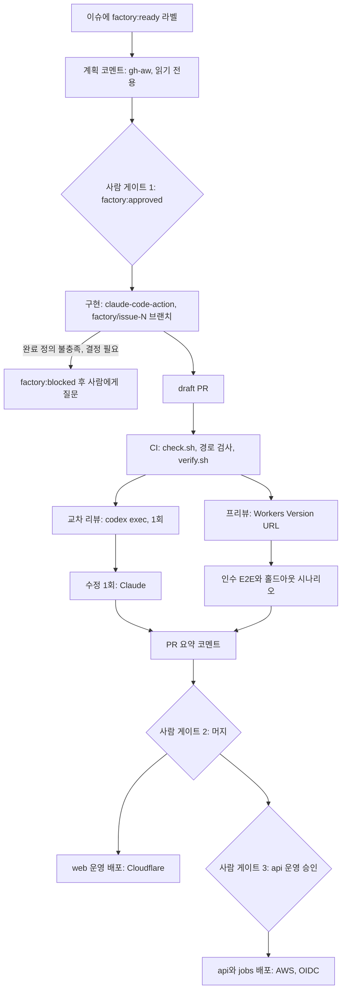
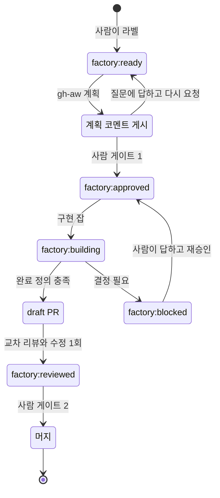

# 8장. 이슈에서 배포까지 — 4단계 승인 (2): GitHub Actions 위의 팩토리

월요일 아침, 금요일에 라벨을 붙여 둔 이슈 세 개가 draft PR과 프리뷰 URL이 되어 기다린다고 해보자. #41 모임 목록 정렬 옵션, #42 리마인더 발송 시각 설정, #43 예약 취소 마감 정책이다. 금요일 오후에 한 일은 이슈마다 `factory:ready` 라벨을 붙이고, 몇 분 뒤 달린 계획 코멘트를 읽은 다음 `factory:approved`로 바꾼 것뿐이다. #43은 7장에서 승인한 명세가 계획 승인을 대신했다.

PR마다 같은 모양의 요약 코멘트가 붙어 있다. CI 결과, 독립 검증자의 판정, Codex 리뷰 요약과 그에 대한 수정 커밋 하나, 프리뷰 URL, 인수 테스트와 홀드아웃 시나리오의 통과 수, 그리고 실행 비용 한 줄. #42에는 `factory:blocked` 라벨이 달려 있다. 발송 시각을 회원별로 둘지 모임별로 둘지 계획에 없었다며 에이전트가 멈추고 질문을 남겼다. 커피를 한 모금 마시고 #41의 프리뷰 URL부터 눌러 본다.

4장의 금요일과 무엇이 달라졌을까? 승인 버튼은 여전히 있다. 다만 누르는 횟수는 이슈당 스무 번에서 두세 번으로 줄었고, 버튼을 누를 때 손에 쥔 증거는 훨씬 많아졌다. 이 월요일 아침을 만드는 파이프라인을 조립하기 전에, 앞서 이 길을 간 사람들의 설계부터 살펴보자.

## 참조 팩토리 셋에서 배울 것

첫 번째는 Salman Ali Banani가 2026년 7월에 공개한 「A Two-Agent PR Workflow: Claude Writes, Codex Reviews」다. 흐름은 짧다. Claude가 이슈를 집어 브랜치에서 구현하고 PR을 연다. GitHub Actions가 Codex 리뷰를 자동으로 띄우고, Codex는 리뷰 요약과 인라인 코멘트를 남긴다. Claude는 그 피드백으로 딱 한 번 수정하고 같은 브랜치에 푸시한 뒤 머지한다. 설계 원칙이 흥미롭다. 저자는 한 에이전트가 리뷰하고 다른 에이전트가 고치고 다시 리뷰하는 끝없는 루프를 원하지 않았다. 그래서 수정은 한 번뿐이다. Codex는 코멘트만 남기고 승인하지 않으며, 리뷰가 끝났다는 표시는 `reviewed_by_codex` 라벨이다. 저자의 설명대로 이 구조는 Claude가 자기 작업을 채점하지 못하게 하고, Codex가 머지를 쥐지 못하게 한다. 작성자와 채점자를 떼어 놓고, 채점자와 머지 권한도 떼어 놓았다. 다만 이 흐름에서는 Claude가 머지까지 한다. `gather`는 이 마지막 단계를 사람에게 남긴다.

두 번째는 Addy Osmani의 참조 저장소 `addyosmani/factory`다. GitHub 이슈를 작업 큐로 쓰고, 클라우드 루틴 다섯 개가 스케줄러 역할을 한다. 흐름은 이슈, 트리아지, 필요하면 명세, 구현, 게이트, draft PR, 사람 리뷰, 머지로 이어진다. 독립 검증자가 diff를 차갑게 읽고 수정을 되돌려 테스트가 실제로 실패하는지 증명한 뒤에야 draft PR이 열린다. 6장의 `verify.sh`가 이 발상을 빌린 것이다. 사람이 답해야 할 미결 결정이 일정 수 이상 쌓이면 팩토리가 스스로 멈추는 `STOP_IF` 상한도 있다. 스킬은 Claude Code 스킬을 정본으로 두고, Codex에는 `.agents/skills/` 아래 정본을 가리키는 얇은 어댑터만 둔다(커뮤니티 공유 저장소). `gather`도 Codex가 리뷰어로 파이프라인에 들어오면서 이 구조를 따랐다. 4장의 `kotlin-api-conventions` 스킬은 그대로 두고, `.agents/skills/kotlin-api-conventions/`에는 정본의 위치만 적은 어댑터를 두었다.

세 번째는 `genai-jerry/claude-software-factory`다. 여기서는 GitHub 이슈와 `factory:*` 라벨이 파이프라인의 상태 그 자체다. 라벨이 바뀌는 것이 곧 공정이 넘어가는 것이다. 명세 도구로는 OpenSpec을 쓰고, 에이전트 역할을 아홉 개로 나누고, 사람 게이트를 세 개 둔다. 에이전트는 스테이징 브랜치까지만 가고, main으로 올리는 것은 사람이다. 에이전트가 보호 브랜치에 손대지 못하게 PreToolUse 훅으로 막는 부분은 4장의 가드 훅과 같은 발상이다.

세 저장소는 규모도 도구도 다르지만 같은 원리를 공유한다. 첫째, 상태는 모델 밖에 둔다. 라벨과 이슈와 파일이 상태이고, 에이전트의 기억은 상태가 아니다. Will Larson도 팩토리 패턴을 실험하며 에이전트 주도 개발을 가장 제약하는 것이 공통 작업 관리 시스템의 부재라고 짚었다. 둘째, 작성자는 채점하지 않는다. 셋째, 모든 루프에는 종료 조건이 있다. 수정 한 번, `STOP_IF`, 사람 게이트. 넷째, 사람 게이트는 한 개에서 세 개 사이로 두고 결과물은 draft PR로 받는다. Igor Ostrovsky는 모든 변경에 사람 승인이 필요하더라도 1인 프로젝트에서 이 구성이 작동한다고 말한다(커뮤니티 보고). 이 구성이 작동하는 비결은 게이트의 수보다 게이트마다 판단할 증거가 모여 있다는 데 있다.

## 부품 상자

조립에 쓸 부품을 먼저 펼쳐 보자. 모두 2026년 9월 기준이고, 몇몇은 빠르게 바뀌는 중이다.

| 부품 | 팩토리에서 맡는 일 | 기억할 점 |
|---|---|---|
| `anthropics/claude-code-action@v1` | 빌더: 이슈 → 브랜치 → PR, 한 번의 수정 | `prompt`가 없으면 `@claude` 멘션을 기다리는 interactive 모드, 있으면 어떤 이벤트에도 도는 automation 모드. `claude_args`로 `--max-turns`·`--model` 지정 |
| `codex exec` / `openai/codex-action` | 리뷰어, 검증자 | `codex exec`는 기본 읽기 전용. codex-action의 `safety-strategy`는 기본 `drop-sudo` |
| `@codex review` | 멘션형 관리 리뷰 | P0·P1만 보고, `AGENTS.md`의 `## Code Review Rules` 절을 따름 |
| Copilot cloud agent | 이슈를 할당받는 빌더 | 작업당 최대 59분(연장 불가), 저장소 하나·브랜치 하나·PR 하나 |
| GitHub Agentic Workflows(`gh aw`) | 마크다운으로 쓰는 에이전트 워크플로 | `.lock.yml`로 컴파일, 에이전트 잡은 읽기 전용, 쓰기는 safe-outputs |
| Agent HQ | 경쟁 할당 | 한 이슈에 Copilot·Claude·Codex를 동시에 맡기고 draft PR을 비교 |

`claude-code-action`에는 조립하다 보면 곧 부딪히는 규칙이 둘 있다. 하나, 이 액션은 모든 이벤트에서 봇 행위자를 거부한다. `allowed_bots`에 적어 둔 봇만 예외다. 봇끼리 서로를 깨우며 끝없이 도는 것을 막으려는 장치다. 그래서 Actions 봇이 남긴 리뷰 코멘트로 `@claude`를 깨우는 식의 연결은 기본적으로 작동하지 않는다. 둘, 기본 `GITHUB_TOKEN`으로 만든 커밋은 워크플로를 트리거하지 않는다. 빌더가 기본 토큰으로 푸시하면 그 커밋에서는 CI가 돌지 않는다. `/install-github-app`으로 설치하는 GitHub 앱을 쓰거나, 다음 단계를 같은 워크플로의 다음 잡으로 이어 붙이자. 왜 이런 규칙을 두었을까? 둘 다 버그처럼 보이지만 사실은 루프를 막는 안전장치다. 팩토리를 조립할 때는 이 안전장치를 우회하려 하지 말고 그 모양에 맞춰 흐름을 설계하는 편이 낫다.

Codex 쪽에서는 `codex exec`가 기본 읽기 전용이라는 점이 리뷰어 역할과 잘 맞는다. Actions에서 Codex를 돌릴 때 쓰는 `openai/codex-action`은 Codex CLI를 설치하고 API 키 노출을 줄이는 보안 프록시를 띄우며, `safety-strategy`로 러너 권한을 줄인다. 기본값 `drop-sudo`는 Codex를 부르기 전에 러너 사용자의 sudo 권한을 거둔다. 이 밖에 `unprivileged-user`, `read-only`, `unsafe`가 있다. 샌드박스를 정하는 옛 `sandbox` 입력 대신 `permission-profile`을 쓰라는 안내도 있으니 저장소의 README를 확인하자. `@codex review`를 쓴다면 저장소별 리뷰 규칙을 `AGENTS.md`에 적는다. 가장 가까운 `AGENTS.md`의 `## Code Review Rules` 절이 적용된다. `gather`는 이렇게 적었다.

```markdown
## Code Review Rules
- P0: 데이터 손실, 권한 우회, 정원 초과 확정, 개인정보 노출
- P1: docs/specs/와 다른 동작, 동시성 문제, 테스트 없는 동작 변경
- 인수 테스트·CI 정의·훅이 바뀌었으면 무조건 P0로 보고한다
- 보고하지 말 것: 포맷과 이름 취향(린터가 본다), 일어날 가능성이 희박한 이론적 위험
```

빌더를 꼭 Claude로 둘 필요는 없다. GitHub의 Copilot cloud agent는 이슈를 할당받으면 GitHub Actions 위의 임시 개발 환경에서 백그라운드로 일해 브랜치와 PR을 만든다. 한 작업은 저장소 하나, 브랜치 하나, PR 하나로 끝나고, 실행 시간은 최대 59분이며 늘릴 수 없다. 이 상한을 제약으로만 볼 일은 아니다. 4장에서 티켓을 사람 기준 1시간 이하로 자르자고 했는데, 59분 안에 끝나지 않는 이슈라면 애초에 쪼갤 신호로 읽으면 된다. Agent HQ는 한발 더 나가 같은 이슈를 Copilot, Claude, Codex에 동시에 맡기고 각자의 draft PR을 나란히 비교하게 한다. 어느 에이전트의 답이 나은지 고르는 일이 사람에게 남는 셈이다. 발표문에서 GitHub의 Mario Rodriguez가 한 말이 이 기능의 태도를 요약한다. 에이전트의 산출물은 "reviewed, compared, and challenged, not blindly accepted"여야 한다는 것이다. 비용은 에이전트 수만큼 늘어나니, 답이 여럿일 수 있는 설계성 이슈에만 아껴 쓰자.

gh-aw는 여전히 0.x(v0.89.21, 2026-09-23)이고 Agent HQ는 2026년 2월에 공개 미리보기로 나왔다. 둘 다 빠르게 바뀔 수 있으니 공식 문서를 함께 확인하자.

## 계획에서 draft PR까지

부품을 모아 `gather`의 파이프라인을 짜 보자. 그림 1이 전체 흐름이고, 마름모가 사람 게이트다.


그림 1. `gather`의 이슈 → 배포 파이프라인 — 사람 게이트는 셋이다

출발은 계획 코멘트다. 왜 이 단계만 다른 도구로 쓸까? 이 단계의 에이전트는 코드를 한 줄도 바꿀 필요가 없다. 쓰기 권한 없이 도는 에이전트를 가장 간단하게 만드는 도구가 GitHub Agentic Workflows다. 마크다운 파일 하나에 YAML 프런트매터로 트리거와 권한을 적고, 본문에 할 일을 자연어로 적는다.

```markdown
---
on:
  issues:
    types: [labeled]
permissions: read-all
safe-outputs:
  add-comment:
---
# gather 계획 작성기

이 이슈의 구현 계획을 docs/plans/_template.md 형식으로 써서 코멘트로 남겨라.
AGENTS.md를 먼저 읽고, 관련 명세가 docs/specs/에 있으면 링크하라.
결정되지 않은 것이 있으면 계획 대신 질문 목록을 남겨라. 저장소의 어떤 파일도 바꾸지 마라.
```

`gh aw compile`이 이 파일을 보안이 강화된 `.lock.yml` Actions 워크플로로 컴파일한다. 에이전트가 도는 잡은 기본 읽기 전용이고, 코멘트는 검증을 거친 safe-outputs 잡이 대신 쓴다. 에이전트에게 쓰기 권한을 주지 않고도 결과를 이슈에 남길 수 있는 구조다. 파일은 `.github/workflows/factory-plan.md`에 두었다 (사실 확인 필요). 두 가지는 프런트매터에 걸자. 라벨 이름이 `factory:ready`일 때만 도는 조건과 엔진 선택이다(엔진은 기본이 Copilot CLI이고 Claude Code·Codex 등으로 바꿀 수 있다). 구체 문법은 gh-aw 문서를 따르자. 본문에 "이 라벨일 때만 하라"고 적는 것은 4장에서 본 부탁에 불과하다.

사람이 계획을 읽고 `factory:approved`를 붙이면 구현이 시작된다. 이것이 사람 게이트 1이다. 명세가 필요한 크기의 이슈라면 7장의 명세 PR 승인이 게이트 1이고, 라벨은 그 승인을 파이프라인에 알리는 신호일 뿐이다. 이때 구현 브랜치는 7장처럼 승인 태그에서 딴다.

```yaml
# .github/workflows/factory-build.yml
name: factory-build
on:
  issues:
    types: [labeled]
concurrency:
  group: factory-issue-${{ github.event.issue.number }}
jobs:
  build:
    if: github.event.label.name == 'factory:approved'
    runs-on: ubuntu-latest
    timeout-minutes: 60
    permissions: { contents: write, issues: write, pull-requests: write }
    steps:
      - uses: actions/checkout@v4
      - name: 상태 전이 — 구현 중
        env: { GH_TOKEN: "${{ github.token }}" }
        run: gh issue edit ${{ github.event.issue.number }} --remove-label factory:approved --add-label factory:building
      - uses: anthropics/claude-code-action@v1
        with:
          anthropic_api_key: ${{ secrets.ANTHROPIC_API_KEY }}
          prompt: |
            이슈 #${{ github.event.issue.number }}를 구현한다.
            이슈의 승인된 계획 코멘트와, 링크된 명세가 있으면 그 명세를 먼저 읽는다.
            factory/issue-${{ github.event.issue.number }} 브랜치에서 작업하고,
            AGENTS.md의 완료 정의를 모두 만족하면 draft PR을 연다.
            계획에 없는 결정이 필요하거나 완료 정의를 만족할 수 없으면 멈추고 이유를 이슈 코멘트로 남긴다.
          claude_args: |
            --model claude-opus-5-5
            --max-turns 40
```

몇 군데를 짚어 보자. 라벨 전이는 에이전트가 하지 않고 워크플로 단계가 `gh`로 한다. 상태를 바꾸는 일은 결정적이어야 하기 때문이다. 이 발췌에는 빠졌지만, 액션이 끝난 뒤 `factory/issue-N` 브랜치의 PR이 생기지 않았으면 다음 단계가 `factory:blocked`를 붙인다. 월요일 아침 #42가 받은 라벨이 그것이다. 막힌 이슈는 사람을 부르고, 사람이 질문에 답한 뒤 다시 `factory:approved`를 붙이면 구현이 이어진다. 프롬프트에 이슈 제목이나 본문을 끼워 넣지 않고 번호만 넘긴 것도 의도한 것이다. 이슈 본문은 누구나 쓸 수 있는 신뢰할 수 없는 입력이고, 그것이 어떻게 공격 통로가 되는지는 9장에서 자세히 본다. 끝으로, 이 잡이 만든 커밋에서 CI가 돌려면 앞서 말한 대로 기본 `GITHUB_TOKEN`이 아닌 GitHub 앱 권한으로 푸시해야 한다.

## 리뷰, 프리뷰, 배포

draft PR이 열리면 `factory-pr.yml`이 이어받는다. 첫 잡은 CI다. `check.sh`, 6장의 `check-protected-paths.sh`, 그리고 `verify.sh`가 계산적 센서와 독립 검증자 노릇을 한다. CI를 통과하면 교차 리뷰 잡이 돈다. 이 잡의 권한은 `contents: read` 하나뿐이다.

```bash
# factory-pr.yml의 review 잡(권한: contents: read) 가운데 한 단계
git diff origin/main...HEAD > pr.diff
CODEX_API_KEY="${{ secrets.CODEX_API_KEY }}" codex exec -o review.md \
  "pr.diff를 AGENTS.md의 Code Review Rules에 따라 리뷰하라. P0·P1만 보고하고 각 지적에 파일, 줄, 근거를 붙여라."
```

Codex CLI를 러너에 설치하는 단계는 생략했다. API 키는 잡 전체의 환경 변수로 두지 않고 이 한 번의 호출에만 붙였다. Codex 문서가 저장소의 코드를 체크아웃해 실행하는 워크플로에서 권하는 방식이다. 리뷰 결과 `review.md`는 아티팩트로 넘기고, PR에 코멘트를 쓰는 일은 `pull-requests: write` 권한을 가진 별도의 잡이 맡는다. 에이전트가 도는 잡과 쓰기 권한을 가진 잡을 나누는 것, gh-aw의 safe-outputs와 같은 발상이다. 그다음 수정 잡이 `claude-code-action`으로 P0·P1 지적만 반영하는 수정을 한 번 커밋하고, 동의하지 않는 지적에는 이유를 코멘트로 남긴 뒤 `factory:reviewed` 라벨을 붙인다. 수정 커밋이 푸시되면 `factory-pr.yml`이 다시 돌지만, 리뷰 잡에는 `factory:reviewed` 라벨이 있으면 건너뛰는 조건을 걸어 두었다. 수정은 구조적으로 한 번뿐이다.

CI와 나란히 프리뷰 잡이 돈다. `web`을 Cloudflare Workers의 Version URL로 올리고 그 주소를 PR에 남긴다. Cloudflare 문서의 GitHub Actions 예시를 `gather`에 옮기면 이렇다.

```yaml
  preview:
    needs: ci
    runs-on: ubuntu-latest
    permissions: { contents: read, pull-requests: write }
    outputs:
      url: ${{ steps.up.outputs.url }}
    steps:
      - uses: actions/checkout@v4
      # web을 Workers용으로 빌드하는 단계 — Next.js 어댑터 설정은 Cloudflare 공식 문서를 따른다
      - id: up
        working-directory: web
        env:
          CLOUDFLARE_API_TOKEN: ${{ secrets.CLOUDFLARE_API_TOKEN }}
          GH_TOKEN: ${{ github.token }}
        run: |
          output="$(npx wrangler preview --name "pr-${{ github.event.pull_request.number }}" --json)"
          url="$(echo "$output" | jq -er '.preview.urls[0]')"
          gh pr comment ${{ github.event.pull_request.number }} --body "Preview: $url"
          echo "url=$url" >> "$GITHUB_OUTPUT"
```

Next.js를 Workers에 올리는 빌드 설정과 Wrangler 인증 변수 이름은 Cloudflare 공식 문서와 대조해서 채우자 (사실 확인 필요). 프리뷰의 `web`은 스테이징 `api`를 바라본다. 프리뷰 주소가 나오면 6장의 `holdout.yml`에 이 주소를 `base_url`로 넘기고, 인수 기준을 옮긴 Playwright E2E도 같은 주소에서 돈다. PR이 닫히면 `wrangler preview delete`로 프리뷰를 지운다. 모든 잡이 끝나면 요약 잡이 결과를 모아 월요일 아침에 본 그 코멘트 하나를 남긴다.

프론트엔드를 AWS에 올리는 팀이라면 Amplify의 PR 웹 프리뷰가 Cloudflare 프리뷰의 자리를 대신할 수 있다. PR마다 고유한 프리뷰 URL에 배포하고, 비공개 저장소라면 풀스택 앱에 PR마다 임시 백엔드를 만들었다가 PR이 닫히면 지운다. 조심할 점이 둘 있다. 공개 저장소에서는 IAM 서비스 역할이 필요한 앱의 프리뷰가 막힌다. 제3자가 올린 임의의 코드가 앱의 IAM 권한으로 실행되는 것을 막기 위해서다. 그리고 PR 하나하나가 앱당 50개인 브랜치 한도를 차지한다. 사람이 PR을 올리던 시절에는 넉넉하던 한도가, 팩토리가 PR을 쏟아 내기 시작하면 금방 바닥난다.

CI가 빨간불이면 어떻게 할까? 사람이 로그를 열어 고칠 수도 있지만, 이것도 팩토리가 맡을 수 있다. 선택지는 셋이다. Claude Code의 PR Auto-fix는 클라우드 세션이 PR을 지켜보다가 CI 실패와 리뷰 코멘트에 응답한다. 수정이 분명하면 고쳐서 푸시하고, 모호하면 사람에게 묻는다. Codex에서는 PR에 `@codex fix the P1 issue`처럼 멘션하면 PR을 맥락으로 한 클라우드 작업이 시작되고 수정을 브랜치에 푸시할 수 있다. 직접 짜고 싶다면 Codex 문서의 예처럼 실패 출력을 파이프로 넘기면 된다. `npm test 2>&1 | codex exec "summarize failing tests and propose fixes"`.

어느 쪽을 쓰든 상한은 꼭 두자. `gather`에서는 CI 자동 수정을 PR당 두 번으로 제한했다. 두 번 고쳐도 빨간불이면 `factory:blocked`를 붙이고 사람을 부른다. 5장의 "두 번 연속 진전이 없으면 멈춘다"와 같은 규칙이다. 상한이 없는 수정 루프는 조용히 비용을 태우거나, 6장에서 본 가장 싼 초록불을 향해 조금씩 미끄러진다.

사람 게이트 2는 머지다. draft PR의 요약을 읽고, 화면이 바뀌었다면 프리뷰를 눌러 보고, diff를 읽고, 준비가 됐으면 ready로 바꿔 머지한다. main에 들어오면 배포 워크플로 `deploy.yml`이 돈다. `web`은 Cloudflare Workers의 운영 버전으로 나간다. `api`와 `jobs`는 컨테이너 이미지를 만들어 AWS로 배포하는데, 장기 액세스 키를 비밀로 두는 대신 GitHub Actions의 OIDC로 짧게 사는 자격 증명을 받는다. 운영 `api` 배포에는 GitHub 환경의 승인 규칙을 걸어 한 번 더 사람이 누르게 했다. 이것이 사람 게이트 3이다. 2장에서 기능마다 자율성 수준을 다르게 두자고 했다. 되돌리기 쉬운 `web`은 머지가 곧 배포이고, 예약 데이터를 다루는 `api`는 "승인하면 실행" 수준을 지킨다. AWS 쪽 컨테이너 서비스 설정과 환경 승인 규칙의 세부는 각 공식 문서를 따르자.


그림 2. `factory:*` 라벨 상태기계 — 상태는 모델 밖, 라벨에 있다

그림 2를 보면 이 파이프라인의 상태가 모두 라벨에 있다는 것이 드러난다. 워크플로가 중간에 죽어도, 러너가 바뀌어도, 에이전트가 앞의 일을 기억하지 못해도 이슈의 라벨을 보면 지금 어디에 있는지 안다. 5장에서 진행 파일에 두었던 상태를 이슈 트래커로 옮긴 셈이다.

## 돌려 보면 만나는 것들

며칠 돌려 보면 설계도에 없던 문제들이 튀어나온다. 미리 알아 두면 덜 당황한다.

첫째, 연쇄 트리거다. Claude Code 문서는 Auto-fix가 사용자를 대신해 PR에 답글을 달 수 있고, 그래서 Atlantis나 Terraform Cloud, `issue_comment` 이벤트로 도는 자체 Actions 같은 코멘트 기반 자동화가 덩달아 깨어날 수 있다고 경고한다. 팩토리가 커질수록 자동화끼리 서로를 부르는 일이 잦아진다. `gather`가 코멘트 대신 라벨로 단계를 넘기는 이유 가운데 하나가 이것이다.

둘째, 동시 실행과 폭주다. 같은 이슈에 라벨이 두 번 붙거나 푸시가 연달아 들어오면 같은 일을 하는 실행이 겹친다. `factory-build.yml`의 `concurrency` 그룹을 이슈 번호로, `factory-pr.yml`은 PR 번호로 묶어 한 번에 하나만 돌게 하자. `timeout-minutes`와 `--max-turns`는 claude-code-action 문서가 직접 권하는 비용 가드이기도 하다.

셋째, 비용이 보이지 않는다. 월말 청구서를 받고서야 어느 이슈가 비쌌는지 거꾸로 추적하는 일은 꽤 번거롭다. 실행마다 비용을 한 줄씩 남기자. 헤드리스 호출이라면 5장에서 본 `--output-format json`의 `total_cost_usd`를 쓰면 되고, 액션이라면 실행 로그와 사용량 화면에서 모은다. PR 요약 코멘트의 마지막 줄에 그 PR이 쓴 비용을 적어 두면, 사람 게이트에서 결과와 비용을 함께 본다. 이 PR이 이 비용을 쓸 가치가 있었는지를 판단하는 것도 사람의 일이다.

넷째, 프리뷰는 공개다. Cloudflare 문서가 밝히듯 Version URL은 켜 두면 누구나 접근할 수 있다. 로그인을 요구하려면 Cloudflare Access로 막자. 한번 PR 코멘트에 남은 주소가 어디까지 흘러갈지는 아무도 모른다. Durable Object를 쓰는 Worker에는 Version URL이 생기지 않는다는 제약도 기억해 두자.

다섯째, 보안의 최소선이다. 에이전트가 도는 잡은 가능한 한 읽기 전용으로, 쓰기는 분리된 잡으로, 개인 액세스 토큰은 쓰지 않고, 이슈 본문 같은 신뢰할 수 없는 입력은 프롬프트에 끼워 넣지 않는다. 이 파이프라인은 이미 누구나 쓸 수 있는 이슈와 PR 코멘트를 읽고, 저장소 쓰기 권한과 클라우드 자격 증명을 쥔 잡을 돌린다. 이 최소선을 넘어서는 설계는 9장에서 다룬다. 밤중이나 알림 같은 이벤트로 팩토리를 깨우는 이야기는 13장의 몫이다.

## 이번 주의 과제

이번 주에 작은 이슈 하나를 골라 라벨을 붙여 보자. 파이프라인 전체를 한 번에 세울 필요는 없다. 계획 코멘트, 구현 잡, 그리고 6장의 CI만 있어도 시작할 수 있다. 교차 리뷰와 프리뷰와 홀드아웃은 두 번째 이슈부터 하나씩 더하면 된다.

그리고 세 가지를 적어 두자. 첫째, 이슈가 머지되기까지 사람이 몇 번 개입했는가. 라벨을 붙인 것, 질문에 답한 것, 리뷰, 머지를 모두 센다. 둘째, 리뷰 코멘트 가운데 실제 코드 수정으로 이어진 비율. 셋째, 이슈 하나에 든 실행 비용. 세 숫자가 몇 주 쌓이면 어느 게이트가 제 몫을 하고 어느 게이트가 도장만 찍고 있는지 보인다. 4장에서 시작한 `docs/metrics.md`에 이 세 숫자를 담을 칸을 더하면 된다.
