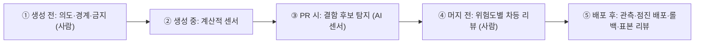

# 10장. 빨라진 개인, 막힌 팀 — 리뷰 병목

> "아침에 출근하면 리뷰 요청이 쌓여있고 각각 수백 줄인 경우가 많았습니다."

카카오페이손해보험 재무서버개발팀의 long.black이 2026년 6월 회사 기술블로그에 쓴 글의 한 문장이다. 같은 글에는 이런 문장도 있다. "하루 종일 걸리던 기능 구현이 한 시간 두 시간이면 PR로 올라오는 것을 목격하고 있습니다." 같은 팀, 같은 시기의 이야기다. 만드는 쪽은 몇 배 빨라졌는데 읽는 쪽은 아침마다 쌓인 PR 앞에 앉는다. 글의 제목이 이 장의 질문을 대신한다. 「PR을 더 느리게 만들기 위한 고민」. 빨라진 팀이 왜 일부러 느려지려 했을까?

혼자 일하는 독자라면 이 장을 건너뛰고 싶을지도 모른다. 리뷰어가 없으니 리뷰 병목도 없지 않을까? 그렇지 않다. 1인 팩토리의 리뷰어는 자기 자신이다. GeekNews에 올라온 「AI 없이 보낸 한 달」의 글쓴이는 병렬 에이전트를 늘리자 직접 하면 20분 걸릴 일을 에이전트가 5분에 써 냈지만, 쌓인 작업 탓에 리뷰는 이틀이 걸렸다고 털어놓는다(커뮤니티 보고). 5장에서 워크트리를 여럿 띄우며 목표를 "더 많은 에이전트를 동시에 감독하는 것"이라고 했던 것을 떠올려 보자. 감독하는 사람이 한 명이면 그 한 명이 병목이다. 이 장의 처방 대부분은 1인에게도 그대로 통한다.

이제 무대를 바꾸자. 2부에서 혼자 4단계까지 올린 `gather`가 자랐다. 가상의 8인 팀이 이 서비스를 맡는다. 백엔드 셋(Kotlin·Spring), 프론트엔드 둘(Next.js), 데이터·배치 하나(Python), 플랫폼 엔지니어 하나, PM 하나. 모노레포였던 저장소는 `gather-api`, `gather-web`, `gather-jobs` 셋으로 나뉘었다. 3부의 나머지 장도 이 팀과 함께 간다.

## 병목은 어디로 옮겨 갔나

### 대기열이 쌓이거나, 덜 읽힌 채 나가거나

Anthropic의 AI-Native SDLC 플레이북은 이 현상을 두 갈래로 정리한다.

> "When agents multiply code output, either the review queue builds or code ships under-reviewed."

대기열이 쌓이는 쪽의 숫자부터 보자. 개발 분석 도구를 파는 Faros AI는 2025년 7월, 1,255개 팀·1만 명 이상의 텔레메트리를 분석한 보고서를 냈다(벤더 자체 연구, 2025년 중반 도구 기준). AI를 많이 쓰는 팀의 개발자는 PR을 98% 더 머지했지만 PR 리뷰 시간은 91% 늘었고 PR 크기는 154% 커졌다. 그리고 회사 수준의 지표 개선과는 유의한 상관을 찾지 못했다. 개인이 번 시간을 리뷰가 고스란히 삼킨 셈이다. 1장에서 본 NBER 연구, 자율 에이전트로 커밋이 240% 늘어도 릴리스는 30%만 늘었다는 감쇠도 같은 그림의 다른 단면이다.

그렇다면 리뷰도 AI에게 맡기면 풀리지 않을까? ICSE 2025 산업 트랙에 실린 연구는 AI 코드 리뷰 도구를 도입한 세 프로젝트의 PR 4,335건을 분석했다. 자동 코멘트의 73.8%가 해결됐다. 그런데 PR이 닫히기까지 걸린 시간은 평균 5시간 52분에서 8시간 20분으로 늘었다. 잘못된 리뷰, 불필요한 수정 요구, 엉뚱한 코멘트가 함께 따라왔기 때문이다. 리뷰어를 하나 더 붙였더니 PR이 더 느려졌다. 난감한 결과다. AI 리뷰어를 어떻게 세워야 하는지는 뒤에서 다시 보자.

덜 리뷰된 채 나가는 쪽의 이야기는 커뮤니티에서 들린다. 사람의 리뷰가 이제 대부분 도장 찍기가 됐다는 고백, 프롬프트는 1분이고 생성은 몇 분인데 제대로 된 리뷰는 그 몇 배가 걸린다는 Armin Ronacher의 지적이 대표적이다. Dex Horthy는 진단을 한 번 더 비튼다. 문제는 PR의 양보다 나쁜 PR이 많다는 데 있다. 에이전트는 리뷰받기 좋게 쓰지 못한다. 한 번에 너무 큰 변경을 만들고 무관한 코드를 건드린다. 400줄을 건드려 30줄만큼 나아갔다는 측정담도 있다(모두 커뮤니티 보고). 쌓이는 대기열과 도장 찍기는 반대 증상처럼 보이지만 뿌리가 같다. 사람이 읽을 수 있는 속도보다 빨리, 읽기 어려운 모양으로 코드가 도착한다.

### 세 가지 부채

이 비용에 이름을 붙인 사람이 있다. 당근의 박용권은 2026년 9월 AI월드 발표에서 에이전트 코드가 빠르게 늘며 생긴 문제를 세 가지 부채로 나눴다. 검토가 밀리며 쌓이는 기술 부채, 동료가 코드를 이해하지 못해 생기는 인지 부채, 왜 그렇게 판단했는지 기록되지 않아 생기는 의도 부채.

앞의 둘은 익숙하다. 세 번째가 새롭다. 사람이 짠 코드라면 적어도 작성자에게 물어볼 수 있었다. 에이전트가 짠 코드의 "왜"는 세션이 끝나면 함께 사라진다. 리뷰가 밀리는 것도 문제지만, 리뷰할 근거 자체가 남지 않는다는 점이 더 찜찜하다.

세 부채는 1인에게도 똑같이 쌓인다. 혼자서는 인지 부채를 느끼기 어려울 뿐이다. 석 달 전 에이전트와 함께 만든 모듈을 다시 열었을 때 왜 이런 구조인지 기억나지 않는다면, 그것이 인지 부채와 의도 부채가 한꺼번에 청구된 순간이다(이해하지 못한 코드가 쌓이는 문제는 15장에서 다시 다룬다). 이 장의 처방을 읽을 때 세 부채를 렌즈로 쓰자. 대기열을 줄이는 처방은 기술 부채를, 지식을 나누는 처방은 인지 부채를, 결정을 기록하는 처방은 의도 부채를 갚는다. 카카오페이손해보험의 대응을 이 렌즈로 들여다보자.

## 카카오페이손해보험 — PR을 더 느리게 만들기

### 무엇이 일어났고, 무엇을 바꿨나

수치는 모두 회사가 직접 측정해 공개한 것이다. AI 도입 뒤 이 팀에서 개발자 한 명이 하루에 올리는 PR은 평균 0.8건에서 1.7건으로 두 배 넘게 늘었다. 리뷰는 사람 속도에 묶여 있었고, 게다가 리뷰어 한 명이 전체 리뷰의 63%를 맡고 있었다. 도메인을 가장 잘 아는 사람에게 리뷰가 몰리는 것은 흔한 일이다. 생산량이 두 배가 되자 그 한 사람이 팀 처리량의 상한이 됐다.

팀이 고른 방향이 흥미롭다. 리뷰를 빠르게 만드는 대신 PR을 느리게 만들기로 했다. 글의 표현을 빌리면 이렇다.

> "PR을 올린 뒤 빠르게 승인받는 것을 목표로 하기보다 PR 생성 전 단계, 즉 플랜과 구현 단계에서 충분히 고민하고 정리하는 것이 더 중요합니다."

처방은 세 갈래였다. 첫째, PR을 만들기 전에 AI와 함께 설계 문서를 쓰고 작업을 쪼갰다. 한 PR이 건드리는 파일 수의 중앙값이 14개에서 5개로 줄었다. 변경 라인 수와 작은 PR의 비율도 크게 달라졌는데, 그 숫자는 장 끝에서 다시 꺼내 보자.

둘째, PR 템플릿의 성격을 바꿨다. 체크리스트였던 템플릿을 의사결정 문서로 바꾸고, 리뷰어가 이렇게 묻게 했다. "왜 이렇게 했는가에 대한 답이 자명한가?" 의도 부채를 PR 단계에서 갚는 장치다.

셋째, "조르깃"이라는 4단계 AI 리뷰어를 만들고 코멘트마다 심각도 태그(`[r]`·`[c]`·`[a]`)를 붙였다. 이 태그로 AI 리뷰만으로 충분한 변경과 사람의 판단이 필요한 변경을 나누는 차등 리뷰를 운영했다. 조르깃이 단 코멘트 188개 가운데 실제 수정으로 이어진 것은 16%, 30건이었다. 이 숫자는 낮다고 읽을 수도 있고, 사람 리뷰어가 보기 전에 30건의 수정을 걸러 냈다고 읽을 수도 있다. 공정하게 보려면 나머지 84%를 읽고 넘기는 비용까지 함께 따져야 한다. AI 리뷰어의 가치는 결국 신호와 잡음의 비율로 정해진다.

### 이 사례가 알려 주는 것

이 사례에서 뽑아낼 원리는 무엇일까? 첫째는 에이전트가 절약해 준 시간을 어디에 다시 쓰느냐다. 이 팀은 그 시간을 PR 앞에 썼다. 설계 문서, 작업 분해, 의사결정 기록. 7장에서 사람이 명세와 인수 테스트를 먼저 승인하게 한 것과 같은 방향이다. **리뷰에서 할 일을 리뷰 전으로 옮기면** 리뷰어가 받는 PR은 작아지고, 왜 그렇게 했는지가 이미 적혀 있다. DORA가 AI 시대의 핵심 역량 가운데 하나로 "작은 배치로 일하기"를 꼽은 것과도 맞닿는다(11장).

둘째는 모든 PR을 같은 강도로 읽지 않는다는 것이다. 리뷰어 한 명이 63%를 맡는 구조에서는 그 사람의 시간이 가장 비싼 자원이다. 그 시간을 결제 로직과 오타 수정에 똑같이 나눠 쓸 이유가 없다. 심각도 태그는 그 시간을 어디에 쓸지 정하는 분류표였다.

셋째는 AI 리뷰어를 판결자가 아닌 분류기로 썼다는 점이다. 조르깃은 머지를 결정하지 않았다. 사람이 읽을 곳을 좁혀 주었다. 이 차이가 앞에서 본 연구, AI 리뷰를 붙였더니 PR이 더 느려진 결과와 이 팀의 결과를 가른다.

한 가지 단서를 달아 두자. 이 수치들은 한 팀이 스스로 잰 전후 비교이고 대조군이 없다. 같은 처방이 어느 팀에서나 같은 숫자를 낸다고 기대하기는 어렵다. 그래도 방향만큼은 다른 자료들과 일치한다. 이 원리들을 팀 전체의 구조로 넓힌 것이 다음 절의 재배치다.

## 리뷰가 하던 일을 다시 나눠 맡기기

리뷰를 줄이자고 하면 곧바로 반론이 나온다. 리뷰가 하던 일은 어디로 가는가? 2026년 8월 무렵 GeekNews에 실린 글 「코드는 다 읽을 수 없고, 코드 리뷰가 맡아온 책임은 사라지지 않는다」가 좋은 답을 준다(커뮤니티 자료). 코드 리뷰는 원래 다섯 가지 일을 해 왔다. 동작을 검증하고, 유지보수성을 지키고, 지식을 나누고, 나쁜 변경을 막는 문지기 노릇을 하고, 책임을 여러 사람에게 나눴다. 사람이 모든 줄을 읽을 수 없게 됐다고 이 일들이 사라지지는 않는다. 자리를 옮길 뿐이다.


그림 1. 리뷰 책임의 다섯 단계 재배치

생성 전에는 사람이 의도와 경계, 하지 말아야 할 것을 정한다. 7장의 명세와 사람 게이트 1이 여기에 해당한다. 생성 중에는 타입 검사·린트·테스트·정적 분석 같은 계산적 센서가 돈다(6장). PR 시점의 AI 리뷰어는 판결을 내리는 재판관보다 결함 후보를 넓게 잡는 센서에 가깝다. 머지 전에는 사람이 변경의 비용에 따라 강도를 달리해 리뷰한다. 배포 후에는 관측과 점진 배포, 롤백이 마지막 그물이 된다. OpenAI의 Ryan Lopopolo 팀은 사람 리뷰의 대부분을 머지 뒤 표본 검토로 옮겼다고 발표에서 전해졌다. 여기에 의사결정 로그를 더하라는 것이 그 글의 당부다.

`gather`의 예약 취소 기능으로 따라가 보자. 7장에서처럼 사람이 `reservation-cancel.md`의 인수 기준을 먼저 승인한다(①). 구현 에이전트의 코드는 타입 검사·테스트·린트를 통과해야 PR이 된다(②). 교차 리뷰 에이전트가 취소 마감 시각의 시간대 처리를 의심스럽다고 짚는다(③). 예약 로직은 "홀드아웃 통과 시 표본 리뷰" 계층이라, 홀드아웃 시나리오가 통과하자 사람은 짚인 부분만 확인하고 머지한다(④). 배포 뒤에는 취소 API의 오류율을 지켜보고, 금요일 표본 리뷰에서 이 PR이 뽑히면 누군가 처음부터 끝까지 읽는다(⑤). 사람이 코드를 줄줄이 읽은 순간은 없지만, 다섯 기능은 모두 어딘가에서 수행됐다.

다섯 기능이 어디로 가는지 이 책 나름대로 짝지어 보면 이렇다. 동작 검증은 ②의 센서와 ③의 AI 리뷰어가 나눠 갖는다. 문지기 역할은 ④의 차등 리뷰가 맡는다. 유지보수성은 ①에서 정한 경계와 ②의 복잡도 측정으로 지킨다. 남는 둘, 지식 공유와 책임 분산은 코드를 읽는 행위에 가장 깊이 붙어 있던 기능이라 옮기기가 가장 어렵다. 의사결정 로그와 배포 후 표본 리뷰가 그 빈자리를 메운다. 짝을 찾지 못한 기능이 있다면, 그 칸이 당신 팀에서 가장 먼저 무너질 칸이다.

## AI 리뷰어를 어떻게 세울까

### 최종 게이트보다 1차 필터

연구는 AI 리뷰어의 자리를 꽤 분명하게 알려 준다. MSR 2026에 실린 연구는 에이전트가 만든 PR 3,109건을 분석했다. 리뷰 에이전트만 리뷰한 PR의 머지율은 45.20%로, 사람만 리뷰한 PR(68.37%)보다 23.17%p 낮았다. 신호의 질도 문제였다. 리뷰 에이전트만 보고 닫힌 PR의 60.2%에서 쓸모 있는 코멘트의 비율이 30% 이하였고, 조사한 리뷰 에이전트 13개 가운데 12개가 평균 신호 비율 60%를 넘지 못했다. 저자들의 결론은 짧다. "CRAs should augment rather than replace human reviewers."

반대편 결과도 있다. Ericsson의 사례 연구(PROFES 2026)에서 프로젝트 맥락 지식을 주입한 전문화 리뷰 에이전트는 개발자가 검증한 이슈 200여 개에서 96%의 정확도를 보였고, 맞게 짚은 이슈의 약 69%가 "중요"로 평가됐다. 두 결과를 합치면 방향이 나온다. **AI 리뷰어는 사람을 대신하는 최종 게이트보다 1차 필터에 어울리고**, 맥락을 얼마나 먹였느냐가 그 필터의 품질을 가른다. 두 연구 모두 당시 모델 기준이다.

### 관리형, 멘션형, 자체 구축

2026년 9월 기준으로 AI 리뷰어를 들이는 방법은 크게 셋이다.

| 형태 | 예 | 특징 | 비용 감각 | 게이트로 쓰려면 |
|------|----|------|----------|----------------|
| 벤더 관리형 | Claude Code Review | 전문 에이전트 여럿이 병렬 분석, 검증 단계로 오탐 제거, 🔴 Important·🟡 Nit·🟣 Pre-existing, `REVIEW.md`로 조정 | 평균 20분, 리뷰당 평균 $15–25 | 체크런이 항상 neutral — 출력의 기계 판독 줄(`bughunter-severity`)을 자기 CI에서 파싱 |
| 벤더 멘션형 | `@codex review` | P0·P1만 보고, AGENTS.md의 `## Code Review Rules`로 저장소별 규칙, `@codex fix`로 수정 요청 | — | 기계적 검사는 CI에 남긴다 |
| 자체 구축 | Cloudflare, 하이퍼리즘 | 코디네이터와 전문 리뷰어, 모델 라우팅, 탐색·검증 분리 | Cloudflare 중앙값 $0.98 | 자기 CI의 체크로 직접 설계 |

관리형은 붙이기 쉽다. 대신 한 가지를 알고 써야 한다. 문서는 체크런이 항상 neutral로 끝나 브랜치 보호 규칙으로 머지를 막지 않는다고 적는다. 편하지만 그대로는 게이트가 되지 않는다. 막고 싶다면 출력의 심각도 줄을 자기 CI에서 읽어 판정해야 한다. `REVIEW.md`로 심각도 정의와 nit 상한을 조정할 수 있는데, 문서 스스로 길이에는 비용이 따른다고 경고한다. 긴 규칙은 중요한 규칙을 희석한다. Claude Code Review는 2026년 9월 기준 research preview라 빠르게 바뀔 수 있으니 공식 문서를 함께 확인하자.

멘션형 `@codex review`는 P0·P1 수준만 짚도록 좁혀 두었다. 문서의 조언이 인상적이다. "Leave mechanical checks in CI." 포맷이나 린트 위반을 AI 리뷰어에게 맡기지 말고 계산적 센서에 두라는 뜻이다.

자체 구축의 대표는 Cloudflare다(2026-04 공개, 자사 측정). OpenCode 기반 코디네이터가 보안·성능·품질·문서·릴리스·컴플라이언스·AGENTS.md 검증 같은 전문 리뷰어를 최대 7개 띄우고, 결과를 모아 중복을 지우고 심각도를 다시 판정한다. 상위 모델은 코디네이터에만, 중간 모델은 하위 리뷰어에, 경량 모델은 텍스트 작업에 쓴다. 10줄 이하 변경은 싼 경로로 보낸다. 30일 동안 13만여 회 리뷰의 중앙값 비용이 $0.98, 중앙값 소요가 3분 39초였다. 프롬프트에 "What NOT to Flag"를 따로 둔 것도 눈여겨볼 만하다. 일어나기 어려운 전제가 필요한 이론적 위험이나, 1차 방어가 충분한데 덧붙이는 심층 방어 제안은 짚지 말라는 것이다. 조르깃의 84%를 떠올리면 왜 이 목록이 필요한지 알 수 있다.

암호화폐를 다루는 하이퍼리즘은 코드 유출을 우려해 외부 SaaS 대신 Claude Agent SDK로 리뷰 에이전트를 직접 만들었다(2025-10). 단순 프롬프트에서 체크리스트로, 다시 두 단계 구조로 발전시켰다. 첫 단계는 높은 자율성으로 이슈를 공격적으로 탐색하고, 두 번째 단계는 근거 기반 판단이라는 강한 제약으로 검증한다. 테스트에서 잠재 이슈 57개 가운데 32개를 오탐으로 걸러 냈다. 다만 비즈니스 로직의 맥락은 잡지 못했다고 한다.

형태와 상관없이 챙길 규칙이 하나 있다. 재리뷰가 수렴하게 만드는 규칙이다. Claude Code Review 문서가 드는 예가 좋다. 첫 리뷰 뒤에는 새 nit를 누르고 Important만 올리라("after the first review, suppress new nits and post Important findings only"). 그러지 않으면 한 줄짜리 수정이 스타일 지적만으로 일곱 번째 라운드까지 간다. 8장에서 교차 리뷰의 수정을 한 번으로 묶은 것과 같은 뿌리다. Anthropic은 CI에 좁은 초점의 리뷰 에이전트를 여럿 두고 있고, 실질적인 리뷰 코멘트가 달린 PR의 비율이 16%에서 54%로 늘었다고 밝혔다(자사 수치).

## gather 팀에 적용하기

### 위험도 계층과 의사결정형 PR

`gather` 팀의 차등 리뷰 규칙을 표로 정리해 보자. 사람이 꼭 읽을 곳과 표본만 볼 곳, AI 리뷰로 충분한 곳을 변경 유형별로 나눈다.

| 변경 유형 | 예 | 자동 게이트 | AI 리뷰 | 사람 리뷰 |
|----------|----|-----------|--------|----------|
| 결제·권한 | `gather-api`의 참가비 결제, 모임 관리자 권한 | 보안 스캔·보안 테스트 필수 | 필수 | 필수 (도메인 담당 포함 2인) |
| 예약 로직 | 예약·취소·대기 순번, 리마인더 발송 조건 | 인수 테스트·홀드아웃 통과 | 필수 | 머지 후 주간 표본 |
| 데이터·배치 | `gather-jobs`의 발송 배치, 스키마 변경 | 테스트·마이그레이션 검사 | 필수 | 스키마 변경은 필수, 나머지는 표본 |
| UI·문구 | `gather-web`의 문구·스타일·레이아웃 | E2E·시각 회귀, 프리뷰 URL | 필수 | 불필요 (PM이 프리뷰 확인) |
| 의존성·CI 설정 | 라이브러리 업데이트, 워크플로 변경 | 전체 테스트·의존성 스캔 | 필수 | CI 설정 변경은 필수 (플랫폼 담당) |
| 하네스 | AGENTS.md, 스킬, 리뷰 규칙 | — | 필수 | 필수 (11장) |

규칙 몇 가지를 덧붙인다. PR이 200줄을 넘으면 CI가 경고를 달고 쪼개 달라고 요청한다. 카카오페이손해보험이 작은 PR의 기준선으로 삼은 숫자를 그대로 빌렸다. 계층 판정은 사람의 기억에 맡기지 않는다. 결제 경로를 건드리면 자동으로 "사람 필수"가 되도록 경로 기반 리뷰 규칙을 건다(GitHub의 브랜치 보호와 코드 소유자 설정이 이 역할을 한다. 세부는 공식 문서를 보자). 각 저장소 AGENTS.md의 `## Code Review Rules`에는 계층별로 AI 리뷰어가 무엇을 P0로 볼지 적어 둔다. 결제 경로라면 금액 계산과 권한 확인 누락이 P0다.

예약 로직의 "머지 후 주간 표본"에는 숨은 목적이 하나 있다. 표본을 읽는 사람을 매주 돌아가며 정하면, 코드를 읽지 않게 되며 잃었던 지식 공유가 조금이나마 돌아온다. 리뷰어 한 명에게 63%가 몰리는 구조를 피하는 방법이기도 하다.

규칙을 정했으면 효과를 재야 한다. 8장에서 이슈 하나를 파이프라인에 태우며 사람의 개입 횟수, 리뷰 코멘트 가운데 실제로 고친 비율, 실행 비용을 관찰해 보자고 했다. 팀 단위로는 여기에 둘을 더한다. PR이 열린 뒤 첫 사람 리뷰까지 걸린 시간, 그리고 머지된 PR의 변경 라인 수 중앙값이다. 앞의 것이 기술 부채의 온도계이고, 뒤의 것이 이 장의 처방이 먹히고 있는지 보여 주는 지표다.

마지막으로 PR 템플릿을 의사결정 문서로 바꾸자.

```markdown
## 무엇을 바꿨나 (한두 문장)

## 왜 이렇게 했나
- 근거가 된 명세·이슈:
- 검토했다가 버린 대안과 이유:

## 위험도 계층
- [ ] 결제·권한 (사람 필수)
- [ ] 예약 로직·스키마 (홀드아웃 + 표본)
- [ ] UI·문구·의존성 (AI 리뷰 + 자동 게이트)

## 증거
- 인수 테스트·홀드아웃 결과:
- 프리뷰 URL:
- 실행 비용(total_cost_usd):

## 리뷰어에게: 특히 봐 줬으면 하는 곳
```

이 템플릿은 에이전트가 채워도 좋다. 에이전트가 초안을 쓰면 "왜"와 "버린 대안"이 세션과 함께 사라지지 않고 PR에 남는다. 사람은 "답이 자명한가?"만 판단하면 된다. 의도 부채를 갚는 가장 싼 방법이다.

카카오페이손해보험 이야기에서 아껴 둔 숫자 둘을 이제 나란히 놓아 보자.

| | 대응 전 | 대응 후 |
|---|---|---|
| 한 PR의 변경 라인 수 중앙값 | 246줄 | 158줄 |
| 200줄 이하 PR의 비율 | 37% | 60% |

PR을 더 느리게 만들겠다던 팀이 얻은 숫자다. 느려진 것은 PR을 올리기 전의 시간이었고, 줄어든 것은 리뷰어가 한 번에 삼켜야 하는 양이었다.
