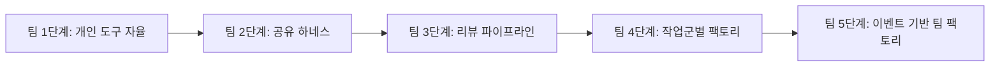
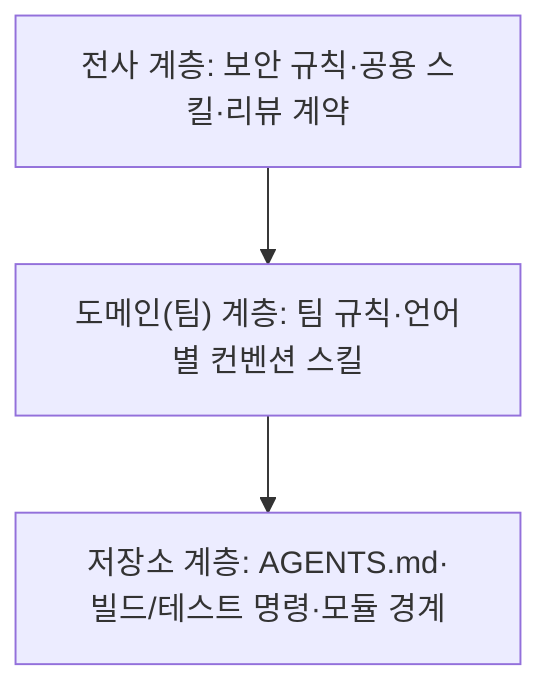

# 11장. 팀의 사다리 — 도입 순서와 공유 하네스

같은 모델, 같은 IDE를 쓰는데 왜 누구는 하루에 PR 다섯 개를 머지하고 누구는 하나도 못 할까?

`gather` 팀의 회고 자리에서 PM이 이런 숫자를 꺼냈다고 해보자. 백엔드 개발자 한 명은 매일 draft PR을 서너 개씩 올리고 대부분 무사히 머지된다. 다른 한 명은 에이전트가 만든 diff를 번번이 되돌리다 결국 손으로 짠다. 둘 다 Claude Opus 5.5를 쓰고, 같은 저장소에서 일한다. 이야기를 들어 보니 첫 번째 개발자의 로컬에는 석 달 동안 다듬은 스킬 몇 개와 계획부터 세우게 하는 습관이 있었다. 두 번째 개발자는 빈 대화창에 한 줄을 던진다.

토스의 김용성은 2026년 2월 회사 기술블로그에서 이 편차를 LLM 리터러시의 개인차로 설명했다. 이 책의 말로 옮기면, 도구는 같아도 각자 가진 하네스가 다르다는 얘기다. 그렇다면 해법은 개인을 닦달하는 쪽보다 하네스를 팀의 자산으로 만드는 쪽에 있다. 토스는 이 글의 제목에 그 방향을 담았다. 「Software 3.0 시대, Harness를 통한 조직 생산성 저점 높이기」. 가장 잘하는 사람을 더 끌어올리기보다, 가장 어려워하는 사람의 바닥을 올리자는 것이다.

팀이 팩토리를 들인다는 것은 결국 이 바닥을 올리는 일이다. 그런데 무엇부터 해야 할까? 개인의 사다리를 팀원 수만큼 복사하면 될까?

## 팀 팩토리는 개인 팩토리의 합이 아니다

### AI는 증폭기다

DORA의 2025년 보고서(Google Cloud, 약 5,000명 설문)에는 이 장 전체를 요약하는 문장이 있다.

> "AI doesn't fix a team; it amplifies what's already there. Strong teams use AI to become even better and more efficient. Struggling teams will find that AI only highlights and intensifies their existing problems."

응답자의 90%가 업무에 AI를 쓰고 있었지만 30%는 AI가 만든 코드를 거의 또는 전혀 믿지 않았다. 1장에서 본 대로 AI 도입은 전달 안정성과 음의 관계를 보였다. 같은 도구가 어떤 팀에서는 속도를, 어떤 팀에서는 불안정을 키운다. 차이는 도구 바깥, 팀이 원래 갖고 있던 습관과 설비에서 난다.

증폭이 무슨 뜻인지 `gather` 팀에 대 보면 금방 와닿는다. 가끔 이유 없이 실패하는 테스트를 다들 재실행 버튼으로 넘겨 온 팀이라면 어떻게 될까? 사람이 하루에 몇 번 누르던 재실행을 이제 에이전트가 수십 번 누른다. 에이전트는 그 실패를 진짜 결함으로 믿고 고치려 들거나, 반대로 진짜 결함을 플래키로 여기고 지나친다. 커다란 PR을 대충 승인하던 습관도, 문서가 사람 머릿속에만 있던 사정도 같은 식으로 커진다. 팩토리는 팀의 약점을 고쳐 주지 않는다. 약점이 돌아가는 속도를 높인다.

DORA는 AI의 긍정적 효과를 키우는 조직 역량 일곱 가지를 AI Capabilities Model로 정리했다. 이것을 팀 팩토리의 도입 전 점검표로 바꿔 쓰면 편하다. `gather` 팀이라면 이렇게 물을 수 있다.

| DORA 역량 | `gather` 팀의 점검 질문 |
|----------|----------------------|
| 명확히 소통된 AI 방침 (Clear and communicated AI stance) | 무엇을 에이전트에게 맡기고 무엇을 사람이 소유하는지 문서로 합의했는가? |
| 건강한 데이터 생태계 (Healthy data ecosystems) | 예약·알림 데이터의 품질과 소유자가 분명한가? |
| AI가 접근할 수 있는 내부 데이터 (AI-accessible internal data) | 설계 문서·런북·API 명세가 에이전트가 읽을 수 있는 곳에 있는가? |
| 탄탄한 버전 관리 관행 (Strong version control practices) | 하네스·명세·워크플로가 모두 git에 있고 PR로 바뀌는가? |
| 작은 배치로 일하기 (Working in small batches) | PR 크기 상한과 "사람 기준 1시간 이하" 티켓 규칙이 있는가? |
| 사용자 중심 (User-centric focus) | 에이전트가 만든 기능을 사용자 지표로 확인하는가? |
| 양질의 내부 플랫폼 (Quality internal platforms) | 공용 워크플로·프리뷰 환경·모델 접근을 누가 운영하는가? |

특히 작은 배치에 대한 설명은 앞 장의 카카오페이손해보험 사례를 그대로 요약한다. "This discipline counteracts the risk of AI generating large, unstable changes, ensuring that speed translates to better product performance." 일곱 칸 가운데 "아니오"가 많다면 팩토리를 들이기 전에 그 칸부터 채우는 편이 빠르다. 증폭기에 잡음을 넣으면 잡음이 커질 뿐이다.

### 실패의 세 얼굴과 신뢰 보정

팀이 자동화를 잘못 쓰는 방식에는 오래된 분류가 있다. Parasuraman과 Riley(1997)는 사람과 자동화의 관계에서 세 가지 실패를 구분했다. 과신해서 기대는 오용(misuse), 믿지 못해 외면하는 불용(disuse), 결과를 따지지 않고 자동화를 밀어붙이는 남용(abuse)이다. 팀 팩토리에 대 보면 이렇다. 에이전트의 PR을 읽지도 않고 머지하는 것이 오용이다. "AI는 못 믿어" 하며 아예 쓰지 않는 것이 불용이다. 현장에 무슨 일이 생기는지 보지 않고 조직이 사용을 강제하는 것이 남용이다.

곤란한 것은 한 팀 안에서 셋이 동시에 일어난다는 점이다. 회고 자리의 두 개발자 가운데 한 명은 오용 쪽으로, 다른 한 명은 불용 쪽으로 기울어 있을 수 있다. 그 위에서 "이번 분기 AI 활용률 목표"가 내려온다면 남용까지 갖춘 셈이다.

Lee와 See(2004)는 처방의 방향을 알려 준다. 신뢰는 자동화의 실제 능력에 맞게 보정돼야 하고, 과신도 불신도 부적절한 의존을 낳는다. 신뢰를 보정하려면 자동화의 목적과 과정, 성능이 사람 눈에 보여야 한다. 그러니 팀이 물어야 할 질문은 "에이전트를 믿어도 되나?"보다 "어떤 작업에서 얼마나 믿어도 되나?"다. 2장에서 자율성을 기능별로 정하자고 했던 원칙이 팀에서는 데이터가 필요한 질문이 된다. 작업 유형별로 머지 뒤 되돌린 비율, 홀드아웃 통과율, AI 리뷰 코멘트의 반영률을 팀이 함께 보는 대시보드가 있으면, 신뢰는 개인의 감 대신 공유된 숫자 위에서 조정된다.

## 팀의 다섯 단계

### 팀 1단계에서 팀 5단계까지

그렇다면 팀은 어떤 순서로 올라가야 할까? 이 책은 팀 축의 단계를 다섯으로 나눈다. 개인의 다섯 단계와 헷갈리지 않도록 "팀 1단계~팀 5단계"라고 부르자.


그림 1. 팀의 다섯 단계

팀 1단계는 각자 좋아하는 도구를 각자의 설정으로 쓰는 상태다. 실험하기에는 좋지만 앞의 두 개발자처럼 편차가 크고, 리뷰 기준도 사람마다 갈라진다. 팀 2단계에서는 AGENTS.md와 규칙, 스킬, 플러그인을 팀 공용으로 만든다. 이 장 후반의 주제다. 팀 3단계는 10장에서 본 리뷰 파이프라인이다.

왜 작업을 자동화하는 팀 4단계보다 리뷰를 먼저 둘까? 에이전트가 PR을 더 만들어 내기 전에, 늘어날 PR을 받아 낼 그릇부터 만들어야 하기 때문이다. 순서를 거꾸로 하면 10장의 대기열이 곧바로 찾아온다. 실제로 이 책이 살펴본 한국 기업 사례 여럿이 AI 코드 리뷰부터 플랫폼화했다(카카오페이손해보험, LY, 하이퍼리즘). Anthropic의 플레이북도 배포 단계의 모습을 "여러 겹의 에이전트 리뷰, 사람 리뷰는 규제 대상 코드와 핵심 코드에만"으로 그린다.

팀 4단계는 작업군별 팩토리다. 모든 일을 한꺼번에 팩토리로 만들지 않고, 정형화된 작업군부터 하나씩 떼어 낸다. Igor Ostrovsky는 2026년 9월 글에서 알림 트리아지, 이슈 트리아지, 루틴한 기능 추가, CI 수리에서는 팩토리가 잘 돌지만 새 기능 브레인스토밍이나 아키텍처 결정에는 맞지 않는다고 정리했다(커뮤니티 자료). GitHub Next가 Continuous AI라는 이름으로 묶은 범주(트리아지, 문서화, 장애 분석, 요약, 코드 개선)도 비슷하다. 연구 쪽 관찰도 같은 방향이다. 157개 프로젝트의 Claude Code PR을 분석한 연구에서 에이전트는 주로 리팩터링·문서·테스트 작업에 쓰였다. `gather` 팀이라면 첫 작업군 후보로 `gather-jobs`의 알림 발송 실패 트리아지, 의존성 업데이트, 문서 드리프트 정리, 플래키 테스트 수리를 꼽을 수 있다. 팀 5단계는 알림·배포·스케줄 같은 이벤트가 작업을 시작하고 사람은 부름을 받는 자리에 서는 단계다. 13장에서 1인의 5단계와 함께 다룬다.

### 개인의 다섯 단계와 겹치는 곳, 어긋나는 곳

책의 다섯 단계(1단계 보조부터 5단계 온콜까지)는 한 사람, 더 정확히는 한 기능의 자율성 수준이다. 팀 단계는 조직이 깔아 둔 공용 설비의 수준이다. 두 축은 서로 다르게 움직인다. 팀 1단계인 팀에도 혼자서는 4단계 승인까지 올라간 개발자가 있을 수 있다. 그 사람은 빠르지만 팀은 그 PR을 받아 줄 준비가 안 돼 있다. 10장의 병목이 바로 이런 어긋남에서 생긴다. 반대로 팀 4단계에 올라간 팀도 결제 코드만큼은 2단계 협업에 묶어 두는 편이 낫다.

| 팀 단계 | 새로 생기는 공유 자산 | 개인 단계와의 관계 | 다음 병목 |
|--------|------------------|----------------|----------|
| 팀 1단계 | 없음 (개인 설정) | 개인마다 1~4단계가 제각각 | 편차, 리뷰 기준 파편화 |
| 팀 2단계 | 공용 AGENTS.md·스킬·플러그인 | 누구나 2~3단계에 쉽게 닿음 | 늘어난 PR을 받을 리뷰 용량 |
| 팀 3단계 | 리뷰 파이프라인·차등 리뷰 규칙 | 개인의 4단계 승인이 팀에서도 안전해짐 | 반복 작업이 여전히 사람 손을 탐 |
| 팀 4단계 | 작업군별 워크플로·게이트 | 정형 작업은 팀 차원에서 4단계 | 이벤트 대응, 결정 처리량 |
| 팀 5단계 | 이벤트 루틴·온콜 체계 | 5단계 온콜을 팀이 나눠 짐 | 드물게 불려 가는 사람의 판단력 (15장) |

그렇다면 다음 단계로 올라갈 때는 언제일까? 달력으로 정하기보다 앞 단계의 병목이 풀렸는지로 정하는 편이 낫다. 이 책이 제안하는 기준은 이렇다. 팀 2단계에서 3단계로 가는 신호는 공유 하네스가 모든 저장소에 들어갔고, 회고 자리의 두 개발자 같은 편차가 눈에 띄게 줄었을 때다. 3단계에서 4단계로는 PR이 열린 뒤 첫 사람 리뷰까지 걸리는 시간이 몇 주째 안정적이고, 차등 리뷰 규칙을 두고 더는 다투지 않을 때 넘어간다. 리뷰 그릇이 넘치는데 작업군 팩토리를 켜면 대기열만 길어진다. 4단계에서 5단계로는 작업군 워크플로의 사람 개입이 사람 게이트로 정한 지점에서만 일어나고, 그 게이트에서 내린 결정이 뒤집히는 일이 드물어졌을 때 간다. 기준이 모호해 보일 수 있지만 요점은 하나다. 앞 단계가 만든 병목을 숫자로 확인하고 올라가자.

`gather` 팀은 지금 어디쯤일까? 두 개발자의 편차가 드러났다는 것 자체가 팀 1단계의 증상이다. 10장에서 리뷰 규칙을 정했으니 3단계의 모양은 먼저 갖췄지만, 규칙이 제대로 돌려면 2단계의 공유 하네스가 받쳐 줘야 한다. 이 장 후반에서 그 하네스를 만든다.

한 가지 각오도 해 두자. 도입 초기에 오히려 생산성이 꺾였다가 올라간다는 "J-커브" 이야기가 커뮤니티에서 자주 인용된다. 수치로 확인된 이야기는 아니니 각오 정도로만 받아 두면 된다. 다만 첫 달의 숫자만 보고 팀 2단계를 포기하지는 말자.

## 어떻게 퍼뜨릴까

### 보이는 동료, 실험하는 문화, 조용한 저항

라이선스를 나눠 주고 공지 메일을 보내면 퍼질까? Microsoft의 연구는 다른 답을 준다(자사 연구, 2026-07 공개). 2026년 초 수만 명의 엔지니어에게 Claude Code와 GitHub Copilot CLI를 배포한 과정을 분석했더니, 첫 사용은 주로 동료 네트워크를 타고 퍼졌고 계속 쓰는지는 인구통계보다 코딩 활동량과 더 관련이 있었다. 채택자는 그러지 않았을 경우보다 머지한 PR이 약 24% 많았고, 효과는 4개월 관찰 기간 내내 유지됐다. 연구진의 권고는 짧다. "organizations should treat visible peer use as central to rollout strategy." 옆자리 동료의 화면이 공지 메일보다 멀리 간다는 뜻이다. `gather` 팀이라면 주간 회의에 15분짜리 "에이전트 화면 공유" 시간을 두는 것으로 시작할 수 있다.

실험할 판을 깔아 주는 것도 방법이다. 토스는 2026년 4월부터 6월까지 매주 금요일을 AI 실험일로 정한 "AI Surf Day"를 운영했고, 약 200개 클럽과 142명의 에반젤리스트가 참여했다. 해커톤 1등 작품의 설명이 흥미롭다.

> "Codex가 iOS Simulator를 직접 조작하며 기능을 검증하는 Agentic 흐름을 구현했습니다. 댓글 기능 구현부터 로그인, 입력, 등록까지 직접 눌러보고 잘 동작하는지 확인한 후, 증거 영상까지 남기는 루프입니다."

실험의 결과물이 그대로 팩토리의 부품이 됐다. 증거를 남기는 검증 루프는 13장에서 팩토리가 사람을 부를 때 들고 오는 증거 묶음과 같은 발상이다.

물론 모두가 반기지는 않는다. Deepak Gupta는 2026년 8월 Security Boulevard에 실은 글에서, 시니어 엔지니어의 조용한 저항은 기술에 대한 의심이라기보다 "누구의 기술이 아직 중요한가"를 두고 치르는 국민투표에 가깝다고 짚었다. 그의 처방은 세 가지다. 무엇을 자동화하고 무엇을 사람이 소유하는지 먼저 밝힌다. 엔지니어가 자기 일에 먼저 파일럿을 돌려 보게 한다. 시니어를 코드 양이 아닌 판단력으로 평가한다. 위에서 내려오는 기대도 조심해야 한다. 코드 작성을 단순한 타이핑으로 여기는 경영진, 인력 감축을 기대하는 위층과 번아웃에 시달리는 현장의 괴리가 커뮤니티에서 반복해 보고된다. 국내 행사에서 MS의 이건복이 했다고 전해지는 말이 핵심을 찌른다. 사람이 잘못하던 절차에 AI를 끼워 넣어도 절차는 나아지지 않는다(커뮤니티 경유). 남용은 대개 이렇게 시작된다. `gather` 팀이 DORA의 첫 번째 역량, "명확히 소통된 AI 방침"을 문서 한 장으로 먼저 써 두는 이유다.

## 공유 하네스 — 바닥을 올리는 장치

### 공유 하네스의 모양

바닥을 올리는 장치가 공유 하네스다. 한국 기업들의 사례를 보면 모양이 꽤 닮았다.

토스는 플러그인 마켓플레이스를 계층으로 나눴다(2026-02). 전사 플러그인 아래 도메인(팀) 플러그인, 그 아래 로컬(프로젝트) 플러그인이 있다. 김용성의 표현을 빌리면 플러그인은 사람에게는 매뉴얼이고 LLM에게는 정확한 지시다. 문서로 적어 둔 팀 지식이 실행 가능한 형태로 바뀌는 것이다. 플러그인을 갱신하면 팀원들의 에이전트 행동이 곧바로 바뀐다는 점이 핵심이다. 교육 자료를 돌리는 것보다 훨씬 빠르게 퍼진다.

우아한형제들의 프론트엔드 팀은 규칙과 스킬로 하네스를 짰다(2026-04). 규칙마다 적용할 경로를 globs로 한정하고, 반복되는 작업은 스킬로 묶어 매번 에이전트에게 컨벤션을 설명해야 하는 번거로운 악순환을 끊었다. 토스가 2026년 8월에 저장소를 연 `apps-in-toss-harness`는 한 걸음 더 나간다. 플러그인 하나와 스킬 9종, MCP 서버 2개로 이루어진 하네스를 Claude Code·Codex·Cursor가 함께 쓴다. README의 한 줄이 3장에서 말한 이식성을 그대로 보여 준다. "Codex는 이 repo의 플러그인 manifest를 그대로 읽으므로 별도 Codex 전용 manifest가 필요 없습니다." 4장에서 본 컬리의 계층형 CLAUDE.md도 같은 계보다.

규모를 키우면 Cloudflare가 된다(2026-04 공개, 자사 사례). 3,900개 넘는 저장소에 AGENTS.md를 만들어 넣고, 사내 엔지니어링 표준을 에이전트가 읽는 스킬 묶음("Engineering Codex")으로 바꿨다. 사내 시스템에는 MCP 서버 13개로 에이전트가 닿을 수 있게 했다. DORA 점검표의 "AI가 접근할 수 있는 내부 데이터" 칸을 이렇게 채운 셈이다.

사례들에 공통된 점이 하나 있다. 팀 지식을 위키 문서로 남기는 데서 멈추지 않고, 에이전트가 읽고 실행하는 형태로 바꿨다. 위키는 사람이 찾아 읽어야 효과가 있지만, 스킬과 규칙은 에이전트가 일을 시작할 때마다 알아서 불려 온다. 가장 바쁜 사람도, 가장 도구에 서툰 사람도 같은 지식 위에서 출발한다. 바닥이 올라가는 원리가 여기에 있다.

한계도 밝혀 두자. 이 책이 모은 한국 사례는 대부분 대기업과 플랫폼 기업의 기술블로그에서 왔다. 중소 규모 팀이나 SI 현장의 목소리는 거의 찾지 못했다. 작은 팀이라면 계층 수를 줄여 받아들이면 된다. 셋 대신 둘이어도 충분하다.


그림 2. 하네스 계층 — 전사, 도메인, 저장소

### gather 팀의 공유 하네스

`gather` 팀은 8명이니 계층을 둘로 줄인다. 팀 전체가 쓰는 공유 하네스 저장소 하나, 그리고 각 서비스 저장소의 AGENTS.md다.

```text
gather-harness/              # 팀 공유 하네스 (플랫폼 엔지니어가 관리)
├── AGENTS.md                # 팀 공통 규칙의 정본 (목차형)
├── skills/                  # 스킬 정본
│   ├── kotlin-api-convention/
│   ├── nextjs-ui-convention/
│   ├── python-batch-convention/
│   └── security-review-checklist/
├── adapters/
│   ├── claude-code/         # Claude Code 플러그인으로 배포
│   └── codex/               # .agents/skills/ 로 들어가는 얇은 어댑터
├── review/
│   ├── REVIEW.md            # 관리형 리뷰 규칙
│   └── code-review-rules.md # 각 저장소 AGENTS.md의 리뷰 규칙 원본
└── CHANGELOG.md
```

각 서비스 저장소의 AGENTS.md는 짧다. 맨 위에 공유 하네스의 어느 버전을 따르는지 적고, 그 아래에 저장소만의 것들을 둔다. 빌드·테스트 명령, 모듈 경계, 그 도메인의 규칙과 금지 사항. `gather-api`라면 "결제 금액 계산은 `payment` 모듈 밖에서 하지 않는다" 같은 줄이 여기에 들어간다. 공유 하네스를 올릴 때는 버전을 바꾸는 PR 하나로 세 저장소가 따라온다.

운영 규칙은 세 가지다. 첫째, 스킬의 정본은 한 곳에만 두고 도구별로는 얇은 어댑터만 만든다. 8장에서 본 addyosmani/factory가 Claude Code 스킬을 정본으로 두고 Codex에는 `.agents/skills/` 어댑터만 둔 것과 같은 구조다. 예약 규칙이나 결제 규칙 같은 도메인 지식은 공유 하네스에 넣지 않고 각 서비스 저장소의 AGENTS.md에 둔다. 공유 하네스에는 언어 컨벤션과 보안 점검 같은 팀 공통의 방식만 담는다.

둘째, 하네스 변경도 PR로 리뷰한다. 하네스는 팀 전체 에이전트의 행동을 한꺼번에 바꾸는 코드다. 10장의 차등 리뷰 표에서 하네스를 "사람 필수"에 둔 이유다. `CHANGELOG.md`에 무엇을 왜 바꿨는지 남겨 두면, 어느 날 에이전트가 이상해졌을 때 우리 하네스 탓인지 바깥 탓인지 가르는 첫 단서가 된다(12장).

셋째, "에이전트가 틀리면 하네스를 고친다"를 팀의 의례로 만든다. 커뮤니티가 전하는 OpenAI Ryan Lopopolo의 원칙이 이것이다. 에이전트가 실패하면 더 잘 프롬프트하려 애쓰지 말고, 어떤 능력·컨텍스트·구조가 빠졌는지 찾아 문서·테스트·스킬에 새겨 넣는다. 4장에서 Boris Cherny가 Claude가 틀릴 때마다 CLAUDE.md에 한 줄씩 보탰던 습관의 팀 버전이다. `gather` 팀은 에이전트의 실수를 발견하면 `harness` 라벨을 단 이슈로 남기고, 하네스 관리자가 한 주치를 모아 PR로 만든다. 금요일 회고의 첫 5분은 "이번 주 하네스에 들어간 것"을 읽는 시간이다. 회고 자리의 첫 번째 개발자가 석 달 동안 혼자 쌓은 스킬도 이 경로를 따라 `gather-harness`로 옮겨 간다. 그 순간 두 번째 개발자의 바닥이 올라간다.

팀 팩토리가 한 단계씩 오를 때마다 전에 없던 일이 생긴다. 이름을 붙여 불러 보자.

하네스 관리자. 공유 하네스의 정본을 지키고, 에이전트의 실수를 하네스 변경으로 바꾸고, 모델이 바뀔 때마다 지침을 다시 점검하는 사람이다. `gather` 팀에서는 플랫폼 엔지니어가 먼저 떠오른다.

명세 소유자. 7장에서 사람 게이트 1을 지키던 역할이 팀에서는 기능마다 필요해진다. 인수 기준을 승인하고, 에이전트가 모호하다며 물어 올 때 답하는 사람이다. PM인가, 그 도메인을 가장 잘 아는 백엔드 개발자인가?

리뷰 계층의 문지기. 10장의 "사람 필수" 칸에 이름을 올릴 사람들이다. 리뷰어 한 명에게 63%가 몰리지 않게 순번과 표본 리뷰를 짜는 일까지 여기에 들어간다.

루프를 지켜보는 사람. 9장에서 보았듯 보안의 일은 버그에서 루프로 옮겨 간다. 권한 지도를 갱신하는 사람은 누구인가?

이 이름들 옆에 당신 팀 누군가의 이름을 적을 수 있는가? 적지 못한 칸이 있다면, 그 일은 지금 누구의 것도 아니다.
