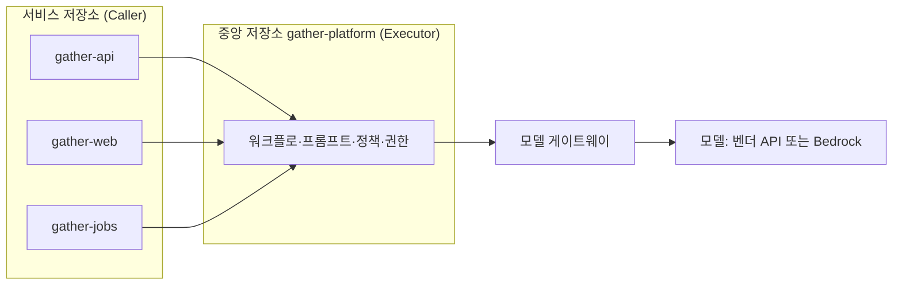

# 12장. 팩토리 운영 규칙 — 중앙 플랫폼, 거버넌스, 비용

4월 첫째 주, `gather` 팀의 스탠드업. `gather-api`를 맡은 백엔드 개발자가 먼저 말을 꺼낸다. "요즘 에이전트가 파일을 제대로 읽지도 않고 고쳐요." 프론트엔드 쪽에서도 비슷한 말이 나온다. 계획을 건너뛰고, 고친 곳 옆을 또 망가뜨린다는 것이다. 다들 짚이는 데가 있다. 누구는 지난주 CLAUDE.md에 넣은 규칙을 의심하고, 누구는 자기 프롬프트 습관을 탓한다. 그 주에만 서로 다른 지침 파일에 "수정하기 전에 관련 파일을 먼저 읽을 것" 같은 문장이 네 번 추가된다. 그래도 나아지지 않는다. 모델이 바뀐 건지, 하네스가 바뀐 건지, 사람이 바뀐 건지 아무도 확실히 모른다.

같은 무렵 Claude Code 저장소에는 이슈 하나가 올라와 있었다(2026-04-02). 한 사용자가 자기 세션 로그를 계량해, 읽기 대비 편집 비율이 6.6에서 2.0으로 떨어지고 파일을 읽지 않고 편집한 비율이 6.2%에서 33.7%로 뛰었다며 복잡한 엔지니어링에는 믿고 쓸 수 없다고 주장했다. Anthropic은 이슈가 원인으로 지목한 추론 내용 가림(thinking redaction) 헤더는 UI에만 쓰인다고 반박했다. 그리고 4월 23일, Anthropic은 품질 저하에 대한 포스트모템을 냈다. 기본 추론 effort를 high에서 medium으로 바꾼 변경, 캐시 버그, 시스템 프롬프트 변경 세 가지가 겹쳐 저하가 있었다는 내용이었다.

이 장면의 팀은 가상이지만 사건은 실제다. 가상의 팀이 저지른 실수도 흔한 것이다. 원인은 바깥에 있었는데 모두가 안쪽을 고쳤다. 각자 자기 설정을 고쳤으니 무엇이 무엇을 바꿨는지도 뒤엉켰다. 파이프라인은 모델 버전을 고정하지 않았고, 매일 도는 회귀 eval도 없었고, 팀 전체의 에이전트 사용을 한눈에 볼 자리도 없었다. 초난감한 상황이다. 여럿이 팩토리를 쓰기 시작하면 정책·권한·비용·벤더 의존을 어디서 통제할지 정해 두어야 한다. 그 자리부터 찾아보자.

## 중앙에 둘 것, 저장소에 둘 것

### LY의 Caller–Executor

개인별 설정의 비용을 가장 먼저 겪은 곳은 리뷰였다. LY Corporation LINE NEXT DevOps 팀의 이동원은 회사 기술블로그에서 이렇게 적었다.

> "각자 다른 방식으로 도구를 사용하다 보니 리뷰 기준 및 관점이 통일되지 않았습니다."

같은 조직 안에서 어떤 저장소는 엄격한 AI 리뷰를, 어떤 저장소는 느슨한 AI 리뷰를 받는다. 11장의 두 개발자 편차가 저장소 단위로 벌어지는 셈이다. 이 팀은 구조를 둘로 나눴다. 서비스 저장소는 표준 워크플로를 호출하기만 하고(Caller), 프롬프트·정책·권한·실행 로직은 중앙 저장소가 관리한다(Executor). 실행은 GitHub Actions와 조직 공용 GitHub App 러너, Amazon Bedrock의 Claude 위에서 돈다. 조직 공통 프롬프트와 서비스 특화 프롬프트를 합쳐 쓰고, 포크에서 온 PR은 `pull/${PR번호}/head` ref로 처리하며, 권한은 단기 토큰으로 최소화했다. 한 달 만에 32개 저장소에서 344회의 리뷰가 돌았다고 한다(자사 수치).

글에서 눈여겨볼 문장이 하나 더 있다. 시스템이 정한 출력 형식이 사용자의 코멘트보다 상위의 명령임을 AI에게 명시적으로 주입했다는 대목이다. 9장의 말로 옮기면, PR 코멘트라는 신뢰할 수 없는 입력보다 중앙이 정한 계약이 우선한다는 선언이다. 중앙화는 일관성만이 아니라 보안의 경계를 한곳에서 관리하는 방법이기도 하다.

`gather` 팀에 적용하면 이런 모양이 된다. 8장과 9장에서 만든 팩토리 워크플로를 세 저장소에 복사해 두는 대신, 중앙 실행 저장소 `gather-platform`에 두고 각 저장소는 호출만 한다.

그림 1. Caller–Executor 구조를 `gather`에 적용한 모습

11장의 `gather-harness`와 헷갈리지 않게 역할을 나눠 두자. `gather-harness`는 에이전트가 읽는 지식(규칙·스킬·리뷰 기준)을 모은 곳이고, `gather-platform`은 파이프라인이 도는 방식(워크플로·실행 프롬프트·권한·정책)을 모은 곳이다. 둘 다 플랫폼 엔지니어가 관리하지만, 앞의 것은 누구나 PR을 올려 고치는 팀의 자산이고 뒤의 것은 권한이 걸린 설비라 변경 문턱이 더 높다.

### 모델 호출은 한 문으로

모델을 부르는 입구도 한곳에 모을 수 있다. Cloudflare는 사내 AI 코딩 도구의 모델 호출을 단일 프록시 Worker로 통과시킨다(2026-04 공개, 자사 사례). 인증과 모델 카탈로그, 권한 통제를 모두 이 프록시가 맡는다. 글이 꼽은 장점은 이렇다.

> "per-user attribution, model catalog management, and permission enforcement later without touching any client configs."

사용자별 사용량 귀속, 모델 목록 관리, 권한 집행을 나중에 클라이언트 설정을 건드리지 않고 바꿀 수 있다는 뜻이다. 중앙 통제의 가장 큰 비용이 "모두의 설정을 바꾸게 하는 일"이라는 점을 생각하면 이 한 줄이 핵심이다. Cloudflare는 여기에 사내 MCP 서버 13개를 더해 에이전트가 닿을 수 있는 사내 시스템도 한곳에서 관리한다.

세 선택지를 나란히 놓아 보자.

| 선택지 | 중앙에 두는 것 | 얻는 것 | 치르는 것 | 어울리는 팀 |
|--------|--------------|--------|---------|-----------|
| 분산 (개인·저장소별 설정) | 없음 | 속도, 실험의 자유 | 리뷰 기준 파편화, 비용·사용 가시성 없음 | 팀 1단계, 소규모 |
| Caller–Executor | 워크플로·프롬프트·정책·권한 | 저장소가 늘어도 같은 게이트, 권한을 한곳에서 좁힘 | 중앙 저장소 운영 부담, 저장소별 예외 처리 | 저장소가 여럿인 팀 |
| 모델 게이트웨이 | 모델 호출의 입구 | 사용자별 비용 귀속, 모델 카탈로그, 권한 집행 | 프록시 자체의 가용성·운영 | 여러 팀, 많은 사용자 |

뒤의 둘은 겹쳐 쓸 수 있다. `gather` 팀은 파이프라인은 Caller–Executor로, 모델 호출은 게이트웨이로 모은다. 대화형 개인 작업은 각자 쓰던 도구를 그대로 쓰되, 어떤 모델을 쓸 수 있는지는 다음 절의 관리 설정으로 맞춘다. 분산의 자유를 전부 빼앗을 필요는 없다. 무인으로 도는 것과 돈이 흐르는 곳만 중앙으로 모으자.

## 거버넌스 장치

중앙에 자리를 만들었으면 그 자리에서 무엇을 할지 정해야 한다. 거버넌스 장치는 크게 허용, 기록, 표본, 변경 관리 네 가지로 묶인다.

허용부터 보자. Claude Code는 관리 설정으로 쓸 수 있는 모델을 `availableModels`로 정하고, 2026년 9월 25일 나온 v2.1.283부터는 `deniedModels`로 특정 모델을 막을 수 있다. `availableModels`가 허용하더라도 `deniedModels`에 적힌 모델은 막힌다. 새 모델이 나온 날, 검증하지 않은 모델을 누군가 먼저 파이프라인에 태우는 일을 막는 데 쓸모가 있다. GitHub의 Agent HQ는 조직 관리자가 저장소에서 쓸 수 있는 에이전트와 보안 정책을 정하고 감사 로그를 남기게 한다. Agent HQ는 2026년 2월 공개된 퍼블릭 프리뷰라 빠르게 바뀔 수 있으니 공식 문서를 함께 확인하자. GitHub이 이 기능을 소개하며 붙인 문장은 거버넌스의 태도를 잘 요약한다. 에이전트의 산출물은 "reviewed, compared, and challenged, not blindly accepted."

기록과 표본은 9장에서 본 Anthropic의 방식이 좋은 기준이다. 에이전트의 모든 결정을 SIEM에 남기고, 자동으로 승인된 변경은 사람이 표본으로 확인한다. 변경 관리는 11장에서 정한 대로다. 하네스와 플랫폼의 변경도 PR과 리뷰, 변경 기록을 거친다. 이 장을 연 스탠드업에서 팀에 가장 아쉬웠던 것이 바로 이 기록이다. "지난주 우리가 바꾼 것"의 목록이 있었다면 원인이 바깥에 있다는 것을 훨씬 빨리 짐작했을 것이다.

| 장치 | 질문 | `gather` 팀의 답 |
|------|------|----------------|
| 모델 허용 목록 | 어떤 모델을 쓸 수 있고 무엇을 막는가? | `availableModels`로 허용, 회귀 eval 전의 신모델은 `deniedModels`로 차단 |
| 에이전트 허용 목록 | 어떤 에이전트가 저장소에 PR을 올릴 수 있는가? | Claude Code·Codex만, 새 에이전트는 파일럿 뒤 추가 |
| 권한 | 잡별 권한이 권한 지도와 일치하는가? | 9장의 권한 지도를 분기마다 다시 그린다 |
| 기록 | 에이전트의 결정·실행·비용이 어디에 남는가? | 실행 로그와 `total_cost_usd`를 `gather-platform`에 모은다 |
| 표본 | 자동으로 통과한 변경을 사람이 얼마나 보는가? | 예약 로직 PR 주간 표본 (10장) |
| 변경 관리 | 하네스·플랫폼 변경이 PR·리뷰·변경 기록을 거치는가? | 두 저장소 모두 사람 필수 리뷰, `CHANGELOG.md` 유지 |
| 버전 고정 | 파이프라인의 모델과 설정이 고정돼 있는가? | 워크플로에 모델 ID 명시, 올릴 때는 회귀 eval 통과 뒤 |

## 비용 — 기준선, 손잡이, 서킷브레이커

### 기준선을 알고 손잡이를 돌리자

비용 논의는 흔히 "너무 비싸다"와 "그 정도는 투자다"의 말다툼으로 흐른다. 말다툼을 줄이려면 기준선부터 알아야 한다. Claude Code 비용 문서는 엔터프라이즈 배포 전반의 평균을 개발자당 활성일 하루 약 $13, 월 $150–250으로 적고, 사용자의 90%는 활성일당 $30 아래에 머문다고 밝힌다(벤더 문서, 2026-09 조회). 규모를 키우면 이야기가 달라진다. Microsoft의 롤아웃 연구는 조직 규모에서 토큰 비용이 연간 수백만 달러에 이를 수 있다고 지적했다(자사 연구). 같은 문서에 따르면 에이전트 팀은 팀원이 plan 모드로 돌 때 일반 세션보다 약 7배의 토큰을 쓴다. 평균은 얌전해도 특정 패턴 하나가 청구서를 흔든다. 10장에서 본 리뷰 비용도 그렇다. 관리형 리뷰가 리뷰당 평균 $15–25인 데 비해 Cloudflare의 자체 구축 리뷰는 중앙값 $0.98이었다. 같은 "PR 리뷰"라도 형태에 따라 비용의 단위가 다르다.

기준선을 알았으면 손잡이를 찾자.

| 손잡이 | 어떻게 | 근거 |
|--------|------|------|
| 모델 라우팅 | 상위 모델은 코디네이터에만, 중간 모델은 하위 작업, 경량 모델은 텍스트 작업 | Cloudflare 리뷰 시스템 |
| 싼 경로 | 10줄 이하 같은 작은 변경은 가벼운 경로로 (사소한 변경 평균 $0.20 vs 전체 리뷰 $1.68) | Cloudflare 리뷰 시스템 |
| 서브에이전트 모델 지정 | 탐색·요약 서브에이전트는 싼 모델로 | 커뮤니티 보고 |
| effort | 작업 난이도에 맞춰 조절 (Opus 5.5 기본값 `medium`) | Anthropic 모델 문서 |
| 반복 상한 | `claude_args`에 `--max-turns` | `claude-code-action` 문서 |
| 시간·동시성 | 워크플로 타임아웃, concurrency 제어 | `claude-code-action` 문서 |
| 컨텍스트 위생 | 작업 사이 `/clear`, CLAUDE.md 200줄 이하, 훅으로 로그 전처리 | Claude Code 비용 문서 |

표에서 가장 과소평가되는 손잡이는 서브에이전트다. 큰 작업을 맡겼더니 서브에이전트 일곱 개를 띄워 하나도 끝나기 전에 예산을 다 썼다거나, 어려운 작업에 에이전트 수백 개가 떴다는 경험담이 커뮤니티에 흔하다. 서브에이전트마다 긴 시스템 프롬프트를 다시 보낸다는 분석도 있다. 그래서 서브에이전트의 모델을 지정할 수 없게 바뀌자 모든 서브에이전트가 비싼 모델로 돈다는 불만이 이슈로 올라오기도 했다(모두 커뮤니티 보고). 3장에서 역할에 모델을 배정한 것이 비용 설계에서는 곧 손잡이가 된다.

### 추적과 서킷브레이커

손잡이를 돌렸으면 효과를 봐야 한다. 추적은 두 층이다. 사용자별로는 OpenTelemetry나 게이트웨이로 모으고(Claude Code 비용 문서가 권하는 방식이고, Cloudflare 프록시가 하는 일이다), 실행별로는 헤드리스 실행의 JSON 출력에 담기는 `total_cost_usd`를 남긴다. 8장에서 실행마다 비용을 기록하기 시작한 것이 여기서 쓸모를 찾는다.

추적만으로는 폭주를 막지 못한다. The Pragmatic Engineer는 2026년 4월 "tokenmaxxing"이라는 현상을 다루며 Shopify의 대응을 소개했다. 사내 리더보드의 이름을 "사용량 대시보드"로 바꾸고, 폭주하는 에이전트를 잡는 서킷브레이커를 두고, 사용량 상위의 사람이 실제로 가치를 냈는지 리더가 검토했다고 한다. 이름을 바꾼 이유가 중요하다. 여러 회사의 사내 토큰 리더보드가 보도됐는데, 순위표는 토큰 소비를 생산성처럼 보이게 만든다. 적게 쓴다고 찍히지 않으려고 토큰을 태운다는 고백까지 전해졌다(보도·커뮤니티 보고). 측정하는 것이 곧 목표가 되는 전형적인 함정이다.

`gather` 팀은 대시보드를 팀과 작업군 단위로만 만들고 개인 순위는 두지 않는다. 지표로는 토큰 총량 대신 "머지되어 살아남은 변경 하나당 비용"을 본다. 1장에서 팩토리의 목적을 검증된 출하량이라고 했던 것과 같은 계산이다. 작업군마다 하루 예산 상한을 두고, 넘으면 파이프라인이 멈추고 사람을 부르게 한다.

구독과 API 사이의 선택도 여기서 정리해 두자. 구독은 정액이라 예측하기 쉽지만, 사용 한도 정책이 예고 없이 바뀐다는 것이 두 진영 모두에서 가장 많이 나오는 불만이다. API는 한도에 막히지 않지만 폭주에도 상한이 없다. 에이전트가 계정을 만들고 배포까지 하는 시대에 청구서 상한이 없다는 점이 가장 큰 망설임이라는 목소리도 있다(커뮤니티 보고). CI에서 구독 토큰(`CLAUDE_CODE_OAUTH_TOKEN`)으로 인증하는 방법도 문서화돼 있다. `gather` 팀의 절충은 이렇다. 대화형 개인 작업은 구독으로, 무인 파이프라인은 게이트웨이를 거친 API로 돌리고 예산 알림과 서킷브레이커를 붙인다. 정답이라기보다 하나의 출발점이다.

## 벤더 의존과 품질 표류

### 조용한 변화에 대비하기

이 장을 연 장면으로 돌아가자. 사용자들은 이런 일을 겪고 나서 직접 감시 도구를 만들기 시작했다. Claude Code의 품질을 매일 벤치마크로 추적하는 트래커가 2026년 1월 Hacker News에서 화제가 됐고, Opus 5.5가 나온 9월에는 새 모델이 슬그머니 약해지는지 감시하겠다는 도구가 등장했다. Codex 쪽에서도 컨텍스트 창이 줄었다는 보고, 서브에이전트 프롬프트가 암호화돼 보이지 않게 됐다는 불만이 이어졌다(모두 커뮤니티 보고). 벤더를 가리지 않는 문제라는 뜻이다. 모델과 기본값, 시스템 프롬프트는 사용자가 모르는 사이에 바뀔 수 있다. 찜찜하지만 벤더 위에 파이프라인을 올린 대가다.

대비책은 세 겹이다. 첫째, 파이프라인에서는 모델 버전을 명시한다. `claude-code-action`이라면 `claude_args`에 `--model claude-opus-5-5`처럼 모델 ID를 적는다. 포스트모템이 보여 주듯 기본 effort 같은 설정도 바뀔 수 있으니, 파이프라인이 기본값에 기대지 않게 필요한 설정은 명시해 두는 편이 낫다(설정 방법은 도구마다 다르니 공식 문서를 보자). 둘째, 회귀 eval을 돌린다. Anthropic의 eval 가이드는 회귀 eval의 통과율이 거의 100%여야 하고, 에이전트를 바꿀 때마다, 모델을 올릴 때마다 CI에서 돌리는 것이 품질 문제에 대한 첫 방어선이라고 적는다. `gather` 팀은 6장의 홀드아웃 시나리오 일부와 대표 과제 스무 개를 묶어 매일 밤 돌리고 통과율의 추이를 기록한다. 스탠드업의 불평보다 먼저 빨간불이 켜지게 하는 장치다. 셋째, 새 모델은 `deniedModels`로 막아 두었다가 회귀 eval을 통과한 뒤에 허용한다.

하네스도 모델 세대를 탄다. v2.1.283에 들어간 `/doctor prompt-audit`는 CLAUDE.md와 스킬, 에이전트, 명령을 훑어 예전 모델에 맞춰 쓴 프롬프트 패턴을 찾아 준다. 옛 모델을 달래려고 적어 둔 강한 경고와 반복 지시가 새 모델에서는 오히려 과하게 작동할 수 있기 때문이다. 반대 방향의 사고도 있다. Steve Yegge의 Gas Town은 Opus 4.7에서 무너졌다고 한다. 모델이 하네스 자체를 끝없이 고치려 들었다는 것이다(Simon Willison이 전한 Yegge의 말, 커뮤니티 경유). 더 강한 모델이 더 약한 모델에 맞춘 하네스를 부술 수도 있다. 모델을 올릴 때 하네스도 함께 점검하자.

벤더 플랫폼에 파이프라인을 얼마나 올릴지는 커뮤니티에서도 의견이 갈린다. 모델이나 기능을 약하게 만들거나 없애지 않으리라는 믿음이 없다는 쪽, 스케줄은 결국 cron이고 GitHub 이벤트 연동은 20분짜리 작업이니 직접 짜겠다는 쪽이 있다. 허술한 버전을 직접 해킹하느니 벤더 기능이 더 똑똑하고 빠르고 안전하다는 반론도 만만치 않다. 3장의 이식성 3계층이 여기서 운영의 원칙이 된다. 상태·메모리·스킬은 git 안의 마크다운으로, 트리거는 Actions나 cron처럼 갈아 끼울 수 있게, 벤더에 묶이는 것은 모델 호출부뿐이게. 모델 호출을 게이트웨이 한 문으로 모아 두면, 모델을 바꿔야 하는 날 손댈 곳도 그 한 곳이다.

## 재사용 하네스냐, 맞춤 하네스냐

### 두 입장과 절충

마지막으로 11장의 공유 하네스를 한 단계 더 밀어 보자. 하네스는 팀을 넘어, 회사를 넘어 재사용할 수 있을까?

Yegge는 2026년 8월 재사용 하네스를 만드는 일을 포기했다고 밝혔다. 하네스는 곧 모두 맞춤형이 되고 애플리케이션에 "화학적으로 결합된다"는 것이다("chemically bonded in"). 재사용하려고 만든 Gas Town은 결국 Gas Town 자신을 만드는 데만 쓰였다고 한다(커뮤니티 경유). 반대편에는 토스와 우아한형제들처럼 팀 하네스를 플러그인과 규칙, 스킬로 표준화해 조직의 바닥을 올리는 쪽이 있다. 8장에서 본 addyosmani/factory나 genai-jerry/claude-software-factory 같은 참조 구현도 누군가 가져다 쓸 수 있게 공개됐다. AI Engineer World's Fair 2026에서는 모든 플랫폼이 스킬 중심으로 모인다는 흐름, 에이전트는 결국 파일이라는 관점이 정리됐다(커뮤니티 보고).

두 입장은 생각보다 가깝다. 커뮤니티 논쟁을 정리하며 나온 한 가지 해석이 쓸 만하다(커뮤니티가 명시적으로 합의한 결론은 아니다). 재사용되는 것은 패턴과 계약이다. 게이트를 어디에 두는가, 역할을 어떻게 나누는가, 상태를 어디에 저장하는가. 맞춤이 필요한 것은 도메인 지식과 검증기다. 예약이 언제 마감되는지, 결제 금액이 어떻게 계산되는지, 무엇이 통과면 합격인지.

`gather` 팀에 대 보면 경계가 선명해진다. `gather-platform`은 게이트 계약(사람 게이트의 위치, 리뷰 계층, 종료 조건)과 역할(빌더·리뷰어), 상태 저장 방식(라벨·이슈·진행 파일)을 소유한다. `gather-harness`는 언어 컨벤션과 보안 점검처럼 팀 공통의 방식을 담는다. 그리고 각 서비스 저장소가 도메인 스킬, 홀드아웃 시나리오, 보안 테스트 같은 검증기를 소유한다. 중앙이 모든 것을 가지려 하면 도메인이 질식하고, 저장소가 모든 것을 가지려 하면 10장의 파편화로 돌아간다.

이 장을 덮기 전에 당신 팀이 답해야 할 질문 세 개를 건네고 싶다. 첫째, 우리 팩토리에서 모든 저장소가 똑같이 따라야 하는 계약은 무엇이고, 한 저장소만 알아야 하는 지식은 무엇인가? 이 선이 곧 중앙 저장소와 서비스 저장소의 경계가 된다. 둘째, 모델이나 기본값이 조용히 바뀐 날 우리는 무엇으로 먼저 알아챌까? 스탠드업의 불평일까, 밤새 돈 회귀 eval의 빨간불일까? 셋째, 하네스가 모델 세대를 넘어가야 할 때 그 비용은 누가 지는가? 중앙이 한 번에 고칠 것인가, 저장소마다 각자 고칠 것인가? 세 질문에 정해진 답은 없다. 다만 답하지 않은 채 두면, 4월의 그 스탠드업은 언젠가 다시 찾아온다.

### 이 장의 핵심

- 여러 저장소와 여러 사람이 팩토리를 쓰면 개인 설정의 파편화가 리뷰 기준과 비용 가시성을 무너뜨린다. 파이프라인은 Caller–Executor로, 모델 호출은 게이트웨이로 중앙에 모을 수 있다.
- 거버넌스는 허용(`availableModels`·`deniedModels`·에이전트 허용 목록), 기록(에이전트의 결정과 실행 비용), 표본(자동 통과 변경의 사람 확인), 변경 관리(하네스·플랫폼 변경의 PR 리뷰)로 짠다.
- 비용은 기준선 측정, 손잡이(모델 라우팅·싼 경로·서브에이전트 모델·effort·`--max-turns`·타임아웃·concurrency), 추적과 서킷브레이커 순서로 다룬다. 토큰 소비량을 생산성 지표로 삼지 않는다.
- 벤더 쪽 품질 표류에는 모델 버전과 설정 고정, 매일 도는 회귀 eval, 신모델의 단계적 허용으로 대비하고, 하네스도 모델 세대에 맞춰 점검한다.
- 재사용과 맞춤의 절충: 패턴과 계약은 공유하고, 도메인 지식과 검증기는 저장소가 소유한다.
