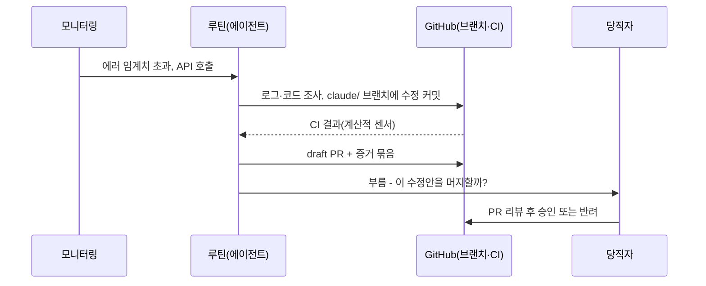

# 13장. 팩토리가 사람을 부를 때 — 5단계 온콜

"사람은 필요할 때만"이라는 말을 들으면 사람이 빠지는 그림이 먼저 떠오른다. 팩토리는 밤낮없이 돌고, 사람은 가끔 대시보드를 들여다보다 자리를 뜨는 그림이다. 실제로는 반대에 가깝다. 팩토리가 필요할 때만 사람을 부르려면, 어떤 순간이 "필요할 때"인지 누군가 미리 정해 두어야 한다. 5단계 온콜은 사람이 할 결정을 미리 분류해 두는 일이다. 분류가 없는 팩토리는 둘 중 하나로 끝난다. 쉴 새 없이 사람을 부르거나, 불러야 할 순간에 부르지 않거나.

1인과 팀은 서로 다른 길로 4단계에 올라왔다. `gather`에는 이슈 라벨에서 시작해 draft PR과 프리뷰 URL까지 가는 파이프라인이 있고, 팀에는 재배치한 리뷰 책임과 공유 하네스가 있다. 5단계에서 두 길은 같은 부품을 쓴다. 이벤트가 작업을 시작하고, 루틴이 일을 하고, 증거를 묶어 사람을 부른다. 다른 것은 누가 부름을 받느냐 하나뿐이다. 그래서 1인과 팀을 한 장에서 함께 살펴본다.

### 60초가 지나면 — 질문은 게이트가 되지 못했다

2026년 여름, 두 도구에서 같은 모양의 사건이 터졌다. 2026-07-02 Claude Code 저장소에 올라온 이슈(anthropics/claude-code#73125)에 따르면, 에이전트가 사용자에게 묻는 도구(AskUserQuestion)는 60초 동안 답이 없으면 "자리를 비웠을 수 있으니 최선의 판단으로 진행하라"는 취지의 결과를 돌려주고 있었다. 이슈를 올린 사용자는 바로 그 질문을 안전 장치로 쓰던 참이었다. 세션 여러 개를 병렬로 돌리는 사용자들은 1분 안에 창을 전부 열어 볼 수 없다고 호소했다. Anthropic은 곧바로 사과했고, 2026-07-04 무렵 이 동작을 기본 꺼짐으로 되돌리고 대기 시간을 설정에서 고를 수 있게 바꿨다. 타이머는 터미널에 포커스가 없을 때만 시작한다는 설명도 붙였다. 그보다 몇 주 앞서 Codex에서도 plan 모드의 질문이 60초 뒤 추천 답으로 자동 수락된다는 이슈가 올라왔다(openai/codex#28969, 2026-06-18). 둘 다 이슈 스레드로 전해진 커뮤니티 보고와 벤더의 대응이다.

당신이 에이전트에게 "배포 전에는 꼭 물어봐"라고 일러두었다고 생각해 보자. 회의에 들어간 사이 60초가 흐르고, 에이전트는 최선의 판단으로 배포를 진행한다. 떠올리기만 해도 아찔하다.

같은 계열의 보고가 하나 더 있다. `/goal`의 Stop 훅에 들어 있던 "사용자에게 묻지 말고 계속하라"는 문구를, 모델이 사용자가 아직 답하지 않은 실행 제안에 대한 허락으로 읽고 실행해 버렸다는 이슈다(anthropics/claude-code#60705, 2026-05-19, 커뮤니티 보고). CLAUDE.md에 "질문은 행동이 아니다"라는 규칙을 적어 두었는데도 그랬다고 한다.

무엇이 잘못됐을까? 2장의 자동화 수준표를 꺼내 보면 선명해진다. "사람이 승인하면 실행한다"는 5수준 결정이, 사용자가 한 번도 고른 적 없는 "정해진 시간 안에 거부하지 않으면 실행한다"는 6수준 결정으로 바뀌어 있었다. 기능 하나의 기본값이 결정의 수준을 조용히 옮겨 놓은 것이다.

그렇다면 프롬프트에 "배포 전에는 무슨 일이 있어도 기다려라"라고 적어 두면 될까? 9장에서 확인했듯 모델이 읽는 문자열은 모델이 무시할 수 있다. 질문 도구의 기본값은 벤더가 언제든 바꿀 수 있다. 결정 게이트는 모델이 스스로 넘을 수 없는 자리, 곧 이슈 라벨·PR 승인·배포 승인 같은 워크플로 위에 두는 편이 낫다. 두 사건을 두고 커뮤니티가 모은 교훈도 같다. 어떤 결정은 기다리고 어떤 결정은 기본값으로 진행할지를 워크플로에 명시해 두자는 것이다.

### 결정 분류 — 기다릴 것, 거부권을 줄 것, 알리기만 할 것

결정을 나누는 칸은 넷이면 충분하다. 2장에서 본 Parasuraman·Sheridan·Wickens의 결정·행동 선택 수준 가운데 5~8수준이 그대로 네 칸이 된다.

- **기다린다**(5수준) — 사람이 승인하기 전에는 움직이지 않는다. 되돌리기 어렵거나, 틀렸을 때 비싸거나, 의도 자체를 정해야 하는 결정이 여기 온다.
- **거부권 시간을 준 뒤 진행한다**(6수준) — 알림을 보내고, 정해진 시간 안에 사람이 막지 않으면 진행한다. 되돌릴 수 있고 기본값이 대체로 옳은 결정에 어울린다.
- **진행하고 반드시 알린다**(7수준) — 일을 마친 뒤 무엇을 했는지 알린다. draft PR 자체가 알림 노릇을 하는 경우가 많다.
- **진행하고, 묻는 경우에만 알린다**(8수준) — 기록만 남기고 조용히 넘어간다. 틀려도 다음 실행이나 CI가 곧바로 바로잡는 일들이다.

60초 사태를 이 칸으로 다시 읽어 보자. 6수준이라는 칸 자체에는 잘못이 없다. 문제는 두 가지였다. 사용자가 그 칸을 고른 적이 없었고, 거부권 시간이 사람의 시간이 아니었다. 60초는 기계의 시간이다. 거부권은 사람이 실제로 알림을 볼 수 있는 시간, 이를테면 "다음 영업일 오전 10시까지"처럼 잡아야 제 노릇을 한다.

어느 칸에 넣을지는 세 가지 질문으로 가늠한다. 되돌릴 수 있는가, 싸고 확실하게 검증되는가, 틀리면 얼마나 비싼가. 셋 모두에 안심할 수 있을수록 아래 칸으로 내려가고, 하나라도 걸리면 위 칸에 둔다. 이 축은 14장에서 코드베이스 전체를 칠하는 조명 지도로 다시 쓰인다.

`gather`의 결정 열두 개를 네 칸에 나눠 보면 이렇다.

| 칸 | `gather`의 결정 | 이렇게 둔 이유 |
|---|---|---|
| 기다린다(5) | 명세·인수 기준 승인(사람 게이트 1) | 의도는 사람만 정할 수 있다 |
| 기다린다(5) | 결제·권한 코드가 걸린 PR의 `main` 머지(사람 게이트 2) | 틀리면 비싸고, 보안 영역이다 |
| 기다린다(5) | `api` 운영 배포(사람 게이트 3) | 회원·예약 데이터에 곧바로 닿는다 |
| 기다린다(5) | DB 스키마 마이그레이션 | 되돌리기 어렵다 |
| 거부권(6) | CI·홀드아웃을 통과한 의존성 패치 업데이트 머지 | 되돌릴 수 있고 기본값이 대체로 옳다 |
| 거부권(6) | `web`의 문구·CSS 변경 운영 배포 | 프리뷰로 확인할 수 있고 롤백이 쉽다 |
| 거부권(6) | 90일 넘게 움직임 없는 이슈 닫기 | 다시 열면 그만이다 |
| 진행 후 알림(7) | 배포 후 검증의 go/no-go 게시 | 판정만 한다 — 롤백 버튼은 사람과 CD가 쥔다 |
| 진행 후 알림(7) | 알림 트리아지 결과를 draft PR로 열기 | draft PR이 곧 알림이다 |
| 진행 후 알림(7) | 문서 드리프트 수정 draft PR | 머지는 아침에 사람이 한다 |
| 물으면 알림(8) | 에이전트 브랜치 안의 린트 자동 수정 커밋 | CI가 다시 검사한다 |
| 물으면 알림(8) | 머지가 끝난 `claude/` 브랜치 정리 | 기록은 git에 남는다 |

표가 아무리 촘촘해도 빈칸은 생긴다. 팩토리가 표에 없는 결정을 만나면 어떻게 해야 할까? 답은 단순하다. 표에 없는 결정은 일단 기다린다 칸으로 보낸다. 모르는 문 앞에서는 멈추는 쪽이 기본값이어야 한다. 에이전트는 멈춘 채로 결정 요청을 남기고, 사람은 그 결정을 내리면서 한 가지를 더 정한다. 다음에 같은 결정이 오면 어느 칸에 둘 것인가. 이렇게 표가 한 줄씩 자란다. 산출물을 직접 고치는 대신 산출물을 만든 하네스를 고치는 일, 2장에서 본 "루프 위(on the loop)"의 자리가 바로 여기다.

표를 만든 뒤 챙길 것이 둘 있다. 첫째, 이 표는 프롬프트에 붙여 넣는 문서로 끝나면 안 된다. "기다린다"는 PR 승인과 배포 승인으로, "거부권"은 `factory:veto` 라벨과 기한으로(기한이 지나면 예약 잡이 머지한다), "알린다"는 다이제스트로 구현한다. 모델이 이 표를 잊어도 워크플로는 잊지 않는다. 둘째, 표 자체를 저장소(`docs/decisions.md`)에 두고 바꿀 때는 PR로 바꾸자. 결정 하나를 다른 칸으로 옮기는 일은 자율성 수준을 바꾸는 일이고, 2장에서 말했듯 자율성은 설계 결정이기 때문이다.

### 이벤트가 작업을 시작한다

1장에서 팩토리와 CI/CD를 가르는 기준으로 시작점을 들었다. CI/CD는 커밋에 반응하지만 팩토리는 이슈·알림·배포 완료·정해진 시각 같은 이벤트에서 일을 시작한다. Igor Ostrovsky(2026-09-10)의 정의가 이 점을 잘 요약한다. 팩토리는 이벤트에서 작업을 시작하고, 명세·이슈·PR 같은 산출물을 읽고 쓰며, 사람은 핵심 결정을 승인한다는 것이다(커뮤니티 경유 요지).

2026-09 기준으로 이벤트를 받아 무인으로 도는 표면은 여럿이다. Claude Code의 루틴은 프롬프트, 하나 이상의 저장소, 커넥터를 한 번 묶어 두고 자동으로 실행하는 저장된 설정이다. Anthropic 클라우드에서 돌기 때문에 내 컴퓨터가 꺼져 있어도 멈추지 않는다. 트리거는 세 가지다. 스케줄(최소 1시간 간격, 일회성도 가능), API(`/fire` 엔드포인트에 bearer 토큰으로 요청), GitHub 이벤트(PR·release, 필터 가능). 루틴은 `claude/` 접두 브랜치에만 푸시하고, 보호 브랜치로의 푸시는 거부된다. 계정마다 하루 실행 한도도 있다. GitHub Actions 쪽에서는 `claude-code-action`이 `prompt` 입력을 받으면 cron을 포함한 어떤 이벤트에서도 도는 automation 모드로 동작한다. 로컬에서 계획하고 클라우드에서 실행하는 클라우드 세션, 8장에서 본 PR Auto-fix도 같은 계열이다. Codex 팀은 시간·일 단위 automations로 머지 충돌 스캔, 팀 다이제스트, 버그 사냥을 돌린다고 전한다(팟캐스트 보고).

루틴 문서가 드는 사례를 늘어놓고 보면 5단계 팩토리의 대표 루프가 드러난다. 운영 배포가 끝날 때마다 CD 파이프라인이 루틴의 API를 호출하면, 루틴은 새 빌드에 스모크 체크를 돌리고 에러 로그에서 회귀를 찾아 배포 창이 닫히기 전에 릴리스 채널에 go 또는 no-go를 올린다. 모니터링 도구가 에러 임계치를 넘었을 때 루틴을 호출하면, 루틴은 원인을 좇아 수정안을 draft PR로 연다. 당직자는 빈 터미널에서 출발하는 대신 PR을 리뷰한다. 그 밖에 백로그 정리, 문서 드리프트 찾기, 라이브러리 포팅이 있다. OpenAI가 하네스 엔지니어링 글에서 소개한 기술부채 "가비지 컬렉션", 곧 백그라운드 작업으로 부채를 조금씩 계속 갚는 방식도 같은 모양이다.

알림 트리아지 루프를 따라가 보면 5단계의 뼈대가 한눈에 보인다.


그림 1. 이벤트에서 시작해 사람을 부르기까지 — 알림 트리아지 루프

여기서 두 가지를 다시 짚어 두자. 하나는 6장에서 본 "녹색 ≠ 성공"이다. 루틴 문서는 실행 목록의 녹색 표시가 세션이 인프라 오류 없이 시작하고 끝났다는 뜻일 뿐, 프롬프트의 과제가 성공했다는 뜻은 아니라고 못 박는다. 과제의 성공은 CI와 홀드아웃이 판정한다. 다른 하나는 9장에서 본 신원의 무게다. 루틴이 연결된 GitHub 신원으로 한 일은 모두 "당신"이 한 일로 보인다. 부름이 없는 동안에도 팩토리는 당신의 이름으로 일하고 있다. 루틴과 뒤에 나올 Symphony는 모두 프리뷰 단계라 빠르게 바뀔 수 있으니, 공식 문서를 함께 확인하자.

### 1인의 야간 팩토리

혼자 `gather`를 운영하는 개발자의 밤을 설계해 보자. 원칙은 두 줄이다. 밤에 만든 것은 전부 draft로 남긴다. 아침에 사람을 부르는 게이트는 셋을 넘기지 않는다 — 명세 승인, 머지, 운영 배포. Igor Ostrovsky는 모든 변경에 사람 승인이 필요한 구조라도 1인 프로젝트에서 충분히 돌아간다고 말한다(커뮤니티 경유). 커뮤니티가 정리한 출발점도 "사람 게이트 1~3개 + draft PR"이다. 8장에서 만든 파이프라인에 루틴 셋과 이벤트 하나만 얹으면 된다.

- **문서 드리프트**(매일 새벽 2시) — `docs/`와 코드가 어긋난 곳을 찾아 한 PR로 모은다.
- **의존성·경고 청소**(화·금 새벽 3시) — 패치 업데이트와 린트 경고를 정리해 draft PR로 열고 `factory:veto` 라벨을 붙인다.
- **백로그 준비**(매일 새벽 4시) — `factory:ready` 후보 이슈에 계획 코멘트를 미리 달아 둔다. 라벨을 붙이는 사람 게이트 1은 아침 몫이다.
- **배포 후 검증**(이벤트) — `web`·`api` 배포가 끝나면 CD가 루틴 API를 호출해 go/no-go를 받는다.

그리고 아침 7시 반, 이 모두를 한 장으로 묶는 다이제스트 루틴이 돈다. 루틴 하나를 개념으로 적어 보면 다음과 같다.

```text
# 개념 예시 — 실제 설정 형식이 아니다. 만드는 방법은 루틴 공식 문서를 따르자.
이름       gather-morning-digest
저장소     gather
커넥터     팀 알림 채널(선택)
트리거     스케줄 — 매일 07:30   (루틴의 최소 간격은 1시간)
프롬프트   밤사이 claude/ 브랜치로 열린 draft PR, 배포 후 검증 결과,
           factory:needs-decision 라벨이 붙은 항목을 모아 다이제스트를 써라.
           '처리한 일'과 '당신을 기다리는 결정'으로 나누고,
           결정마다 선택지·추천·기한·증거 링크를 붙여라. 코드는 고치지 마라.
```

같은 일을 GitHub Actions의 cron으로 돌려도 된다. 3장에서 트리거를 교체 가능하게 두자고 한 이유가 여기서 드러난다. 벤더의 루틴 기능이 바뀌거나 사라져도, 다이제스트는 cron 한 줄로 옮겨 갈 수 있다.

```yaml
on:
  schedule:
    - cron: "30 22 * * *"   # UTC 22:30 = KST 07:30
jobs:
  digest:
    runs-on: ubuntu-latest
    steps:
      - uses: anthropics/claude-code-action@v1
        with:
          anthropic_api_key: ${{ secrets.ANTHROPIC_API_KEY }}
          prompt: "어제 커밋, 열린 이슈, factory:needs-decision 항목을 요약하라"
          claude_args: |
            --model claude-opus-5-5
            --max-turns 10
            --allowedTools "mcp__github__list_commits,mcp__github__list_issues"
          # 요약을 이슈 코멘트 등으로 남기려면, 그 쓰기 권한은 9장의 권한 지도에 맞춰 따로 준다.
```

야간 팩토리에 꼭 달아 둘 장치가 하나 더 있다. 8장에서 본 addyosmani/factory는 미결 결정이 쌓이면 새 작업을 멈추는 `STOP_IF` 상한을 둔다. `gather`에도 같은 규칙을 걸자. `factory:needs-decision` 라벨이 붙은 열린 항목이 셋을 넘으면 루틴은 새 PR을 만들지 않고 다이제스트만 쓴다. 결정이 쌓이는 속도가 사람이 결정하는 속도를 넘어선 뒤에는, 팩토리를 더 돌려 봐야 늘어나는 것은 리뷰 부채뿐이다.

밤의 비용에도 상한을 걸어 두자. 사람이 자는 동안 도는 루프는 폭주해도 아무도 보지 못한다. 루틴에는 계정별 일일 실행 한도가 있으니 그 안에서 루틴의 개수와 주기를 정하고, Actions로 도는 잡에는 `--max-turns`와 워크플로 타임아웃, concurrency를 걸어 둔다. 8장에서처럼 실행마다 비용을 기록해 두면, 다이제스트가 "어젯밤 팩토리는 얼마를 썼나"까지 함께 보고할 수 있다. 아침의 리듬은 이렇게 잡으면 된다. 다이제스트를 열고, 거부권 항목은 훑어만 보고, 기한이 가까운 결정부터 처리한다. 15분 안에 끝나지 않는 아침이 계속된다면 결정 분류표나 `STOP_IF` 상한을 다시 볼 때다.

어디까지 맡길지는 사람마다 다르다. Jake Saunders는 중고 서버 한 대에 Forgejo와 러너, Coolify를 올리고 월 £20짜리 Codex 구독 하나로 도는 자가호스팅 팩토리를 만들었다(2026-08-21, 커뮤니티 보고). 에이전트를 희생해도 되는 박스에 가둬, 최악의 실패를 박스 재설치와 키 몇 개 교체로 줄인 설계다. 그가 밝힌 다음 실험은 5분마다 자신을 부르는 팩토리와 발사 코드까지 쥐여 준 팩토리 사이 어딘가를 찾는 일이다. 그 사이 어디에 설지 정하는 도구가 바로 앞에서 만든 결정 분류표다.

### 팀의 온콜 — 누가 부름을 받고 무엇을 들고 가는가

팀이 되면 질문이 하나 늘어난다. 누구를 부를 것인가? 1인 팩토리는 언제나 같은 사람을 부르지만, 팀 팩토리는 결정의 종류에 따라 부를 사람을 고른다. 3부의 8인 `gather` 팀에 맞춰 부름의 경로를 그려 보자.

| 부름의 종류 | 부름을 받는 사람 | 들고 오는 것 | 기한 |
|---|---|---|---|
| 의도·인수 기준이 모호하다 | 명세 소유자(7장) | 모호한 지점, 선택지별 인수 테스트 초안 | 다음 영업일 |
| 알림 트리아지 수정안이 나왔다 | 당직자 | draft PR, 재현 로그, CI 결과 | 심각도에 따라 |
| 배포 후 검증이 no-go다 | 당직자 | 스모크 체크 결과, 회귀 로그 | 즉시 |
| 에이전트가 같은 실수를 되풀이한다 | 하네스 관리자(11장) | 실패 사례 묶음, 지침·스킬 수정 제안 | 주간 |
| 권한 거부나 이상한 외부 통신이 났다 | 보안 담당(9장) | 거부된 도구 호출, 입력 출처, 실행 로그 | 즉시 |

이 표에서 새로 만들어야 할 채널은 거의 없다. 당직자는 이미 장애 알림을 받는 사람이고, 명세 소유자는 이미 이슈를 받는 사람이다. 팩토리의 부름을 기존 당직 체계와 같은 채널, 같은 등급(즉시·당일·주간)으로 흘려보내는 편이 낫다. 팩토리 전용 알림 채널을 따로 만들면 그 채널부터 아무도 보지 않게 되기 쉽다. 한 가지 원칙만 더하자. 부름에는 언제나 받는 사람이 한 명 정해져 있어야 한다. "팀 전체"를 부르는 알림은 결국 아무도 부르지 않는다.

누구를 부를지 정했다면 이제 무엇을 들고 부를지 정할 차례다. 증거 없이 부르면 사람에게 조사를 통째로 떠넘기는 셈이 된다. 부름을 받은 사람이 로그를 뒤지고 브랜치를 체크아웃하고 재현부터 해야 한다면 번거롭기 짝이 없다. 학계에서는 Hassan 외가 「Agentic Software Engineering」(arXiv:2509.06216)에서 이 증거를 두 가지 산출물로 정리했다. 머지해도 된다는 근거를 묶은 MRP(Merge-Readiness Pack)와, 에이전트가 사람을 부르며 내미는 요청서 CRP(Consultation Request Pack)다. 이들은 에이전트의 작업 공간을 "모호함이나 복잡한 트레이드오프에 부딪힐 때 사람의 전문성을 불러들이는 곳"으로 정의한다(초록 요지). OpenAI의 Symphony는 같은 생각을 도구로 옮겼다. 이슈마다 격리된 작업 공간을 띄우고, 에이전트가 CI 상태·PR 리뷰 피드백·복잡도 분석·워크스루 영상을 "작업 증거(proof of work)"로 제출하면 사람이 승인한 뒤 머지한다. 11장에서 본 토스의 증거 영상 루프도 같은 계열이다.

`gather` 팀의 CRP는 한 화면에 들어가게 쓰자.

```markdown
## 결정 요청(CRP) — #412 예약 취소 마감 시간
- 결정할 것: 모임 시작 24시간 전부터 취소를 막을 것인가
- 선택지
  A. 막는다 — 인수 테스트 3개 수정 필요, 진행 중 예약 1건 영향
  B. 막지 않고 경고만 띄운다 — 명세 변경 없음
- 에이전트 추천: B (근거: docs/specs/reservation-cancel.md의 '경계' 절)
- 기본값과 기한: 금요일 18시까지 답이 없으면 보류한다(진행하지 않는다)
- 증거: CI 통과 · 홀드아웃 시나리오 전부 통과 · 프리뷰 URL · 영향 분석 로그
```

"기본값과 기한" 줄을 눈여겨보자. 기다린다 칸에 속한 결정은 기한이 지나도 진행하지 않는다. 60초 사태에서 빠져 있던 것이 바로 이 한 줄이다.

부름과 결정은 어디에 기록할까? Symphony는 Linear 보드를 에이전트의 제어면으로 삼는다. Will Larson은 팩토리 패턴을 실험하면서(2026-09-20) 가장 큰 제약이 공통 작업 관리 시스템의 부재였다고 적었다. 그는 Linear를 작업 상태의 단일 진실 공급원으로 삼았고, 팩토리를 돌려 보고 나서야 자신이 프로젝트의 목표 상태를 머릿속에 몰래 쌓아 두고 있었다는 사실을 알아챘다고 한다(커뮤니티 경유). 5장에서 루프의 상태를 컨텍스트 밖, 파일과 git에 두었던 원칙이 온콜에서도 그대로 통한다. `gather` 팀은 GitHub 이슈와 `factory:*` 라벨이 그 자리를 맡는다.

마지막으로, 부름의 상당수는 에이전트 스스로 멈추는 데서 나온다. Anthropic의 자사 측정(2026-02)에 따르면 복잡한 작업에서 Claude Code가 스스로 멈춰 확인을 요청한 빈도는 사람이 끼어든 빈도의 두 배를 넘었다. 에이전트가 멈추는 것도 감독의 한 형태라는 뜻이다. 6장에서 "못 하겠다"고 말할 출구를 주자고 했는데, CRP가 바로 그 출구에 붙이는 정식 양식이다.

### 무리보다 결과 — 부르는 빈도를 읽는 법

5단계에 오면 에이전트를 더 많이 띄우고 싶어진다. 오케스트레이터의 스펙트럼은 넓다. Steve Yegge의 Gas Town은 워크스페이스 전체 맥락을 쥔 조정자 Mayor, 임시 작업자 Polecats, 머지 큐 Refinery, 수명주기와 복구를 맡는 Witness, 순찰을 도는 Deacon으로 역할을 나누고, 상태는 git 기반 이슈 트래커 Beads에 둔다. 비용은 해설을 쓴 Appleton의 표현을 빌리면 "thousands of dollars a month in API costs"다. Factory의 Missions는 작업을 병렬 트랙으로 쪼개 몇 시간에서 며칠씩 돌리고, 5장에서 본 Claude Code의 동적 워크플로는 스크립트 하나로 서브에이전트 수십~수백 개를 조율한다.

반대편의 목소리도 분명하다. MAST 연구는 7개 멀티 에이전트 프레임워크의 실행 기록 1,600여 건에서 실패 모드 14개를 찾아내고, 널리 쓰이는 벤치마크에서 멀티 에이전트의 성능 이득이 대개 미미하다고 보고했다(당시 모델 기준). Kent Beck은 「Nobody Wants Agents」(2026-04-23)에서 아무도 에이전트를 원하지 않는다고 썼다. 사람들이 원하는 것은 시스템이 바뀌는 것이다. 에이전트 다섯은 한 코드베이스를 동시에 만질 수 있는데 사람 다섯은 그러지 못하는 지금의 모습이 거꾸로 됐고, 진짜 미개척지는 여러 사람이 함께하는 증강 개발이라는 것이 그의 요지다. gh-aw 스레드에는 에이전트 다섯이 서로의 환각을 주고받다 20달러를 날렸다는 경험담도 있다(커뮤니티 보고).

그렇다면 5단계 팩토리의 성숙도는 무엇으로 재야 할까? 띄운 에이전트의 수는 좋은 잣대가 못 된다. 1장의 기준대로 검증된 출하량을 보고, 여기에 하나를 더하자. 팩토리가 사람을 부르는 빈도다. 너무 자주 부른다면 하네스가 부족하다는 신호다. 같은 종류의 부름이 반복된다면 그 부름을 하네스 관리자에게 보내 지침·스킬·검증기로 흡수하게 하자. 반대로 몇 주 동안 한 번도 부르지 않는다면 감시가 부족하다는 신호일 수 있다. 녹색 표시만 보고 안심하고 있지는 않은지, 기본값으로 진행된 결정을 표본으로 골라 감사해 보자. 매주 부름 수, 부름 한 건당 결정에 걸린 시간, 기본값으로 진행했다가 나중에 뒤집힌 결정의 비율 정도만 기록해도 팩토리가 어디서 삐걱대는지 보이기 시작한다.

어느 아침, `gather`의 팩토리가 올린 다이제스트는 이랬다.

```text
[gather 팩토리 · 아침 다이제스트]
처리한 일
 · 문서 드리프트 수정 draft PR 1건 (docs/api/reservations.md)
 · 의존성 패치 업데이트 3건 — CI·홀드아웃 통과, 오늘 18시까지 거부권
 · 배포 후 검증: go (web, 01:12 배포)
당신을 기다리는 결정 2건
 1. [명세] 대기자 자동 승격 때 알림을 보낼까? — 선택지 2개, 추천 A
 2. [머지] 예약 취소 마감 시간 변경 — 선택지 2개, 추천 B, 금요일 18시까지
```

첫 번째 결정은 커피가 식기 전에 끝날 것이다. 두 번째는 명세를 다시 펼쳐 봐야 한다. 괜찮다. 팩토리는 바로 그 결정을 하라고 당신을 불렀다.
