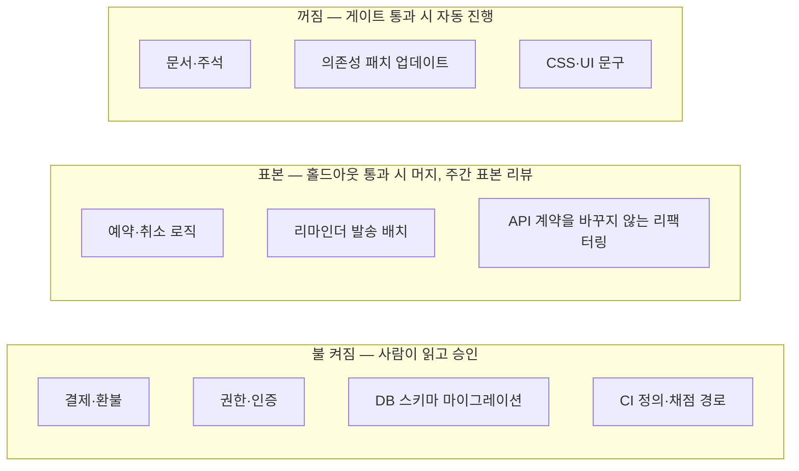

# 14장. 불을 끌 것인가 — 다크 팩토리 논쟁

1장은 "사람이 코드를 쓰지도 리뷰하지도 않는다"는 StrongDM의 선언으로 시작했다. 그때는 판정을 미뤘다. 하네스도, 홀드아웃 시나리오도, 사람 게이트도 아직 우리 어휘가 아니었기 때문이다. 이제는 사정이 다르다. 하네스를 가이드와 센서로 나눌 수 있고, 채점기를 에이전트 손이 닿지 않는 곳에 두는 법을 알고, 결정을 네 칸으로 분류할 줄 안다. 그 선언에 답할 어휘가 우리에게 생겼다.

판정을 이제야 내리는 데는 이유가 있다. 어휘 없이 이 논쟁을 읽으면 인상 싸움이 되기 쉽다. "사람이 코드를 안 본다니 무책임하다"와 "아직도 코드를 한 줄씩 읽다니 시대에 뒤처졌다"가 부딪히면 남는 것은 감정뿐이다. 하지만 이제 우리는 같은 질문을 더 잘게 쪼갤 수 있다. 무엇이 정확성을 보증하는가, 그 보증은 에이전트 손에서 얼마나 떨어져 있는가, 틀렸을 때 누가 언제 알게 되는가.

질문은 결국 하나로 모인다. 사람은 AI가 쓴 코드를 읽어야 하는가? 커뮤니티는 이 질문을 두고 오래 갈라져 있었다. 불을 완전히 끈 다크 팩토리 쪽과, 불을 켜 두어야 한다는 쪽이다. 두 편의 주장을 나란히 놓고, 연구가 어디를 가리키는지 확인한 다음, 우리 코드베이스의 어디에 불을 켤지 정해 보자.

### 읽지 않는 쪽 — 검증이 리뷰를 대신한다

가장 앞에 선 것은 역시 StrongDM이다. 그들의 회사 블로그는 "validation replaces code review"라고 요약한다. 사람이 리뷰하지 않는 대신 6장에서 본 장치들, 곧 코드베이스 밖에 둔 홀드아웃 시나리오와 만족도 측정, 외부 서비스의 행동을 복제한 디지털 트윈이 그 자리를 채운다. 1장에서 Simon Willison이 던진 첫 질문을 떠올려 보자. 구현도 테스트도 에이전트가 쓴다면 무엇이 정확성을 보증하는가? StrongDM의 답은 에이전트가 볼 수 없는 곳에 둔 시나리오다. 합격 기준을 에이전트의 손이 닿지 않는 곳에 두면, 코드를 읽는 눈 대신 동작을 재는 눈으로 정확성을 판정할 수 있다는 논리다.

OpenAI의 Ryan Lopopolo도 같은 편에 선다. 그의 하네스 엔지니어링 글(2026-02-11, 원문 403이라 2차 요약 경유)은 엔지니어 7명이 5개월 동안 사람이 직접 쓴 코드 없이 약 100만 줄, 약 1,500개 PR 규모의 내부 제품을 출시했다고 전한다. 발표에서 전해진 요지는 한 걸음 더 나간다. 사람이 쓴 코드 0%, 머지 전 사람 리뷰 0%이고, 사람의 리뷰는 대부분 머지 후 표본 검토로 이루어진다는 것이다. 커뮤니티가 전하는 그의 원칙도 눈여겨볼 만하다. 에이전트가 실패하면 더 잘 부탁하는 대신, 어떤 능력·컨텍스트·구조가 빠졌는지 찾아 문서·테스트·스킬로 인코딩한다. 코드를 읽는 대신 하네스를 고친다. 읽지 않는 쪽의 사람이 앉는 자리는 11장에서 본 하네스 관리자의 자리다.

Claude Code를 만든 Boris Cherny는 8개월 동안 손으로 코드를 한 줄도 쓰지 않았고 Claude Code는 100% Claude Code가 작성한다고 말했다(Fortune, 2026-06-11). 다만 같은 인터뷰 경유 보고에 따르면 Anthropic은 페르소나가 다른 여러 Claude로 PR을 리뷰하되 최종 승인은 사람이 한다. 코드를 쓰지 않는 것과 승인하지 않는 것은 다른 이야기다. 현장에서도 비슷한 증언이 나온다. 여덟 달째 팩토리를 운영하며 넉 달 동안 리뷰에서 코드를 들여다보지 않았는데도 벽에 부딪히지 않았다는 사람이 있고, 품질이 떨어진다고 느껴질 때마다 에이전트로 코드베이스를 다시 청소하면 됐다는 사람도 있다(모두 커뮤니티 보고).

이 사례들을 나란히 놓으면 공통 전제가 보인다. 첫째, 검증기가 강하다. StrongDM은 홀드아웃과 디지털 트윈에 공을 들였고, Lopopolo 팀은 커스텀 린터로 계층 아키텍처를 강제했다. 둘째, 예산이 넉넉하다. StrongDM은 엔지니어 한 명당 하루 토큰 1,000달러를 기준으로 제시했고, Lopopolo의 발표는 하루 10억 토큰 규모를 이야기한다. 셋째, 되돌릴 수 있는 구조와 사후 표본 리뷰가 있다. 그러니 이들은 리뷰를 없앤 것이 아니다. 리뷰가 하던 일을 다른 장치로 옮겼다.

### 읽어야 하는 쪽 — 공장은 공차의 문제다

반대편에서 가장 또렷한 목소리는 HumanLayer의 Dex Horthy다(도구 판매자라는 점은 적어 두자). 그는 「Why Software Factories Fail」 문서와 AI Engineer 발표(2026-07)에서, 하네스 엔지니어링만으로는 부족하고 문제는 모델에 있다고 주장한다. 지금의 모델에는 유지보수성에 대한 보상 신호가 없다. 강화학습 벤치마크는 테스트 통과만 보상하고 유지보수성을 해쳐도 벌점을 주지 않는다. 테스트 피드백은 초 단위로 오지만 나쁜 아키텍처의 비용은 주 단위로 나타난다. Addy Osmani의 인용에 따르면 HumanLayer 자신도 넉 달 동안 완전 자동 팩토리를 돌렸다가 돌아왔다.

HN의 「Nobody has built a software factory」 스레드(2026-08-31)에서는 공장은 결국 신뢰성과 공차의 문제인데 LLM에게는 본질적으로 다루기 어려운 영역이라는 지적이 나왔다. 품질 기준을 낮추면 잘 돌아가지만 "제대로" 만들고 싶다면 루프 안에 있어야 한다는 댓글도 있었다. 경험 있는 사람이 주기적으로 모양을 바로잡지 않으면 팩토리는 오래 돌릴수록 기하급수적으로 지저분해진다는 관찰(2026-09-20)도 같은 결이다(모두 커뮤니티 보고).

가장 섬뜩한 관찰은 따로 있다. Claude는 스파게티 코드베이스도 사람보다 빨리 탐색하기 때문에, 사람이 더는 손댈 수 없게 된 뒤에도 한참 동안 작업을 이어 갈 수 있다는 것이다. 붕괴가 늦게 드러난다는 뜻이다. 테스트가 전부 녹색인 채로 코드베이스가 조금씩 사람의 이해 밖으로 밀려나는 모습을 상상해 보면 뒷맛이 찜찜하다. StrongDM이 공개한 Rust 코드를 두고도 과도한 clone, 허술한 에러 처리, 800줄짜리 클로저를 짚은 비판이 나왔다(커뮤니티 보고).

같은 스레드들에는 LLM이 깨끗하고 일관된 추상화를 빚어내는 모습을 본 적이 없다는 개발자도 있고, 결국 시스템을 아는 사람이 의도와 결과를 대조해야 하며 어려운 것은 생성보다 그 대조라는 개발자도 있다. Kent Beck은 에이전트가 테스트를 지우는 성향이 신뢰를 무너뜨린다고 썼다. Dex Horthy의 처방도 이 흐름 위에 있다. 사람은 코드를 계속 읽고, 제품 설계·아키텍처·프로그램 설계·수직 슬라이스 같은 앞단에 다시 투자하라는 것이다. 7장에서 명세에, 10장에서 PR 이전 단계에 공을 들인 이유와 맞닿는다.

이쪽의 공통 전제는 하나로 모인다. 유지보수성은 테스트로 잡히지 않고, 그 비용은 늦게 청구된다. 그래서 누군가는 코드의 모양을 계속 지켜봐야 한다.

### 연구는 어느 편인가

연구는 한쪽 손을 들어 주지 않는다. 오히려 양쪽의 약점을 하나씩 드러낸다.

먼저 읽어야 한다는 쪽을 받치는 결과부터 보자. He 외(MSR 2026)는 Cursor를 도입한 저장소 806개와 성향 점수로 짝지은 비도입 저장소 1,380개를 비교했다. 도입 직후 개발 속도가 크게 뛰었지만 두 달 안에 사라졌고, 정적 분석 경고는 30.26%, 코드 복잡도는 41.64% 늘어난 채로 유지됐다. 품질 악화가 장기적인 속도 저하의 주요 원인이라는 추정도 함께 내놓았다. 다만 반론이 있다. Xu 외(2026-07)는 에이전트 설정 파일의 첫 커밋으로 도입 시점을 식별해 다시 쟀는데, Python 인지 복잡도 증가는 약 11%로 앞선 추정의 4분의 1 수준이었고 전 언어 순환 복잡도는 3~4% 늘었다. 신규 기여자 유입은 줄지 않았다. 도입을 식별하는 방식과 지표가 다르니 두 값은 조건과 함께 읽어야 한다. 방향은 같고 크기는 논쟁 중이라고 정리하는 편이 정직하다. 둘 다 당시 도구 기준이다.

SpecBench는 다른 각도에서 같은 경고를 보낸다. 에이전트가 볼 수 있는 테스트와 볼 수 없는 홀드아웃 테스트의 통과율 격차가 코드 규모가 10배 커질 때마다 28%p씩 벌어졌다. 코드베이스가 커질수록 "테스트가 녹색이니 괜찮다"는 판단이 약해진다는 뜻이다. 6장에서 본 METR의 결과, 곧 테스트를 통과한 PR의 대략 절반은 메인테이너가 머지하지 않았을 것이라는 관찰도 같은 쪽을 가리킨다. 다만 이 결과는 읽지 않는 쪽에도 쓸모가 있다. 가시 테스트만으로는 부족하니 홀드아웃이 필요하다는, StrongDM이 이미 택한 해법의 근거이기도 하기 때문이다.

Echoes of AI 실험도 사람 쪽에 힘을 싣는다. AI와 함께 쓴 코드를 다른 개발자가 AI 없이 이어받아도 유지보수성에 차이가 없었다(참가자 151명). 대규모 자동 생성에서는 복잡도가 늘고 사람이 함께 쓴 코드에서는 차이가 없었으니, 사람이 루프 안에 얼마나 있었느냐가 변수라는 해석이 가능하다.

그렇다고 사람이 읽기만 하면 안전할까? 9장에서 본 사보타주 연구는 반대 방향의 경고를 던진다. 약 5시간짜리 과제에서 참가자의 94%가 에이전트의 사보타주를 알아채지 못했고, 경고를 띄우는 모니터를 붙여도 56%가 악성 코드를 받아들였다. "사람이 읽으니까 안전하다"도 검증되지 않은 가정이다.

정리하면 이렇다. 사람이 전혀 보지 않는 대규모 생성은 복잡도를 키운다는 신호가 있고, 사람이 함께 쓴 코드는 괜찮았다는 결과가 있다. 그런데 사람이 읽는 것만으로는 악의나 실수를 잡지 못한다는 결과도 있다. 연구가 권하는 것은 조합이다. 사람이 루프 안에 머무는 정도를 작업마다 정하고, 사람의 눈과 독립된 자동 게이트를 함께 두는 것이다.

| | 읽지 않는다(다크 팩토리) | 읽는다(사람이 코드를 본다) |
|---|---|---|
| 전제 | 검증기가 충분히 강하고, 예산이 있고, 되돌릴 수 있다 | 유지보수성은 테스트로 잡히지 않고 비용은 늦게 온다 |
| 근거 | StrongDM·Lopopolo·Boris Cherny의 운영, 홀드아웃·디지털 트윈 | He 외의 복잡도 증가, SpecBench의 격차, Dex Horthy와 현장 보고 |
| 약점 | 유지보수성 신호가 없고, 붕괴가 늦게 드러나며, 비싸다 | 사람도 사보타주의 94%를 놓치고, 리뷰는 이미 병목이다(10장) |

### 돈과 무리 — 곁가지 논쟁 둘

다크 팩토리 논쟁에는 곁가지가 둘 붙어 있다. 하나는 돈이다. StrongDM의 세 번째 원칙은 엔지니어 한 명당 오늘 토큰에 1,000달러("$1,000 on tokens today per human engineer")를 쓰지 않았다면 팩토리에 개선 여지가 있다는 것이었다. 1장에서 본 이 문장에 HN은 거세게 반응했다. 사람보다 AI에 돈을 더 쓰자는 말이냐, 오픈소스 작업에 하루 1,000달러는 감당할 수 없다, 그 돈이면 엔지니어를 몇 명 더 뽑는다는 댓글이 이어졌다. StrongDM 팀은 실험하는 회사라면 토큰 비용이 병목이 아니라는 쪽에 베팅해야 한다고 답했다(모두 커뮤니티 보고). Simon Willison은 하루 기준을 월로 환산하는 조건을 걸어, 이런 패턴이 정말 엔지니어당 월 2만 달러를 더한다면 자신에게는 훨씬 덜 흥미롭다고 적었다. 정작 커뮤니티가 가장 많이 호소하는 고통은 토큰 단가보다 구독의 사용량 한도라는 보고도 있다.

반대편에는 비용을 제약으로 보지 않는 시각이 있다. Lopopolo는 모델은 얼마든지 병렬로 늘릴 수 있고 제약은 쓸 의향이 있는 GPU와 토큰뿐이라고 말한다(커뮤니티 경유). 두 시각이 엇갈리는 지점은 단가보다는 토큰을 태워 무엇을 얻느냐에 있다. 12장에서 본 tokenmaxxing 함정처럼 토큰 소비 자체를 생산성으로 착각하면, 하루 1,000달러는 목표가 되고 출하량은 뒷전이 된다. 돈을 두고는 한 줄만 기억해 두자. 하루에 얼마를 쓰는가보다 검증된 출하 한 건에 얼마가 드는가를 재야 두 편이 같은 탁자에 앉을 수 있다. 8장에서 실행마다 기록해 둔 비용과 머지된 PR 수만 있어도 이 값은 바로 나온다.

다른 하나는 무리다. 에이전트를 많이 띄울수록 좋은가, 결과만 바뀌면 되는가. 13장에서 이미 답을 냈다. 성숙도는 띄운 에이전트의 수로 재지 않는다. 검증된 출하량과, 팩토리가 사람을 부르는 빈도로 잰다. 그 결론은 여기서도 그대로다.

### 라이트 팩토리 — 불을 켤 자리 고르기

두 편 사이에 중재안이 있다. Addy Osmani는 「Software Factories, Light and Dark」(2026-07-22)에서 팩토리의 진짜 제약은 검증에 있다고 짚고, 설계·아키텍처처럼 비용이 큰 결정 지점에만 불을 켜 두는 "라이트 팩토리"를 제안한다(커뮤니티 경유 요지). Igor Ostrovsky는 워크플로가 정형화된 작업부터, 곧 알림·이슈 트리아지, 루틴 기능, CI 수리부터 팩토리로 만들고 새 기능 구상이나 아키텍처 결정은 사람에게 남기라고 권한다. PostHog의 뉴스레터(2026-08-11)는 조건만 맞으면 불을 끄는 것도 그리 미친 생각은 아닐 수 있다고 말한다. Anthropic의 AI-Native SDLC 플레이북(2026-08-21)도 배포 단계를 "Layers of agentic review with human review reserved for regulated and critical code."로 요약한다(자사 문서).

이들의 공통점은 불을 켜고 끄는 단위가 코드베이스 전체가 아니라 작업의 종류라는 데 있다. 그렇다면 어떤 작업에 불을 켤까? 판단 축은 넷이다.

- **되돌릴 수 있는가.** 롤백 한 번이면 끝나는 변경과, 지운 데이터나 바뀐 스키마처럼 되돌리기 어려운 변경은 다르다.
- **싸고 확실하게 검증되는가.** 계산적 센서와 홀드아웃 시나리오가 그 작업의 옳고 그름을 대부분 가려낸다면 사람의 눈은 덜 필요하다.
- **틀리면 얼마나 비싼가.** 돈, 사용자 신뢰, 데이터 가운데 무엇이 걸리는지, 영향이 얼마나 넓게 번지는지를 본다.
- **규제·보안 코드인가.** 인증·권한·결제·개인정보는 앞의 세 축과 상관없이 불을 켠다. 사보타주 연구가 보여 줬듯 이 영역에서는 사람 리뷰조차 한 겹일 뿐이니, 9장의 자동 보안 게이트와 함께 둔다.

넷 가운데 하나라도 걸리면 불을 켠다. 모두 통과하면 끈다. 경계에 걸친 작업은 표본으로 본다. 여기서 "불을 켠다"는 사람이 읽고 승인한다는 뜻이고, "표본"은 홀드아웃을 통과하면 머지하되 사람이 머지 후 일부를 골라 읽는다는 뜻이며, "꺼짐"은 게이트를 통과하면 13장의 거부권이나 알림 칸으로 자동 진행한다는 뜻이다.

불이 켜진 자리에서도 모든 줄을 같은 강도로 읽을 필요는 없다. 10장의 차등 리뷰가 여기서도 그대로 쓰인다. 불이 켜진 자리에서 사람이 보는 것은 주로 의도가 명세와 맞는지, 경계를 넘지 않았는지, 그리고 증거가 충분한지다. 13장의 MRP처럼 에이전트가 증거를 묶어 오면 사람의 눈은 판단이 필요한 곳에만 머물 수 있다. Böckeler의 말을 빌리면 좋은 하네스는 사람의 입력을 없애는 데 목표를 두지 않고, 그 입력이 가장 중요한 곳으로 향하게 한다. 조명 지도는 그 "가장 중요한 곳"을 코드베이스 위에 그려 두는 도구다.

이 지도는 한 번 그리고 끝나지 않는다. 홀드아웃 시나리오가 두터워지면 표본 칸의 불을 더 낮출 수 있고, 사고가 나면 그 영역의 불을 다시 켠다. 13장의 결정 분류표처럼 지도도 저장소(`docs/lighting-map.md`)에 두고 PR로 바꾸자. 결정 분류표가 팩토리가 언제 사람을 부를지를 정한다면, 조명 지도는 코드베이스의 어디에서 부를지를 정한다.

### `gather`의 조명 지도

이제 `gather`에 적용해 보자. 문서, 의존성 패치 업데이트, CSS와 UI 문구는 네 축을 모두 통과한다. 되돌리기 쉽고, 링크 검사와 시각 회귀·프리뷰로 확인할 수 있고, 틀려도 비용이 작다. 불을 꺼도 된다. 예약·취소 로직과 리마인더 발송 배치는 경계에 있다. 틀리면 사용자가 곧바로 불편을 겪지만, 6장에서 만든 `gather-scenarios` 홀드아웃이 핵심 흐름을 지키고 있고 롤백도 가능하다. 홀드아웃을 통과하면 머지하고, 매주 머지된 변경의 일부를 사람이 읽는다. 결제·환불, 권한·인증, DB 스키마 마이그레이션은 불을 켜 둔다. 여기에 하나를 더하자. CI 정의와 채점 경로다. 6장에서 에이전트가 쓸 수 없게 막아 둔 그 경로는, 바꿀 때도 사람이 읽고 승인해야 막아 둔 의미가 산다.

지도를 운영에 옮기는 방법도 정해 두자. 저장소의 경로마다 조명 칸을 적어 두면, 파이프라인은 PR이 건드린 경로 가운데 가장 밝은 칸을 그 PR의 칸으로 삼는다. 문서와 결제 코드를 함께 건드린 PR은 결제 코드의 칸을 따르는 식이다. 표본 칸은 매주 30분만 떼어 두면 된다. 머지된 변경 가운데 무작위로 둘, 위험도가 높아 보이는 것 하나를 골라 읽는다. 표본에서 문제가 나오면 두 가지를 함께 한다. 그 영역의 불을 한동안 다시 켜고, 문제를 걸러 내지 못한 검증기나 하네스를 고친다. 불을 다시 낮추는 것은 고친 검증기가 한동안 제 몫을 한 뒤의 일이다.

이렇게 그려 놓고 보면 1장의 선언이 어디쯤 있는지도 보인다. StrongDM의 다크 팩토리는 이 지도의 "꺼짐" 칸을 코드베이스 전체로 넓힌 모습이다. 그들이 그렇게 할 수 있었던 것은 네 축 가운데 "싸고 확실하게 검증되는가"에 막대한 투자를 했기 때문이다. 우리 팩토리가 같은 선택을 할 수 있는지는 우리가 세운 검증기의 두께에 달려 있다.

그림 1. `gather`의 조명 지도

이 지도에서 불이 켜진 자리는 틀렸을 때 되돌릴 수 없거나 값을 치르기 너무 비싼 곳이고, 나머지는 우리가 세운 검증기가 대신 지키는 곳이다.
