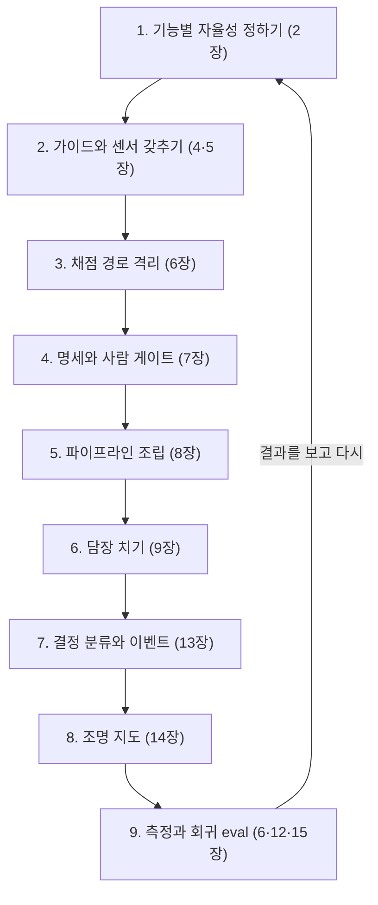

# 15장. 공장장의 기술 — 자동화의 역설과 다음 걸음

1년 뒤 어느 화요일을 상상해보자. 오늘 팩토리는 당신을 두 번 불렀다. 첫 번째는 오전 9시, 의존성 패치 업데이트 세 건에 대한 거부권 알림이었다. 다이제스트를 훑고 넘기는 데 30초가 걸렸다. 두 번째는 오후 4시에 왔다. 예약 동시성을 검증하는 홀드아웃 시나리오 하나가 간헐적으로 실패한다는 결정 요청이다. 에이전트는 원인 가설 두 개를 붙여 왔다. 예약 확정 경로의 락 순서 문제일 수도 있고, 리마인더 배치와의 경합일 수도 있다. 에이전트도 어느 쪽인지 확신하지 못한다. 증거는 충분하다. 재현 로그, 실패한 시나리오, 두 가설 각각의 수정안과 그 결과까지 들어 있다.

그런데 당신은 예약 모듈을 8개월째 직접 열어 본 적이 없다. 이 증거를 읽고, 두 가설 중 하나를 고를 수 있을까?

### 드물게 불려 가는 사람의 역설

이 장면은 새로운 문제가 아니다. 1983년 Bainbridge는 「Ironies of Automation」에서 산업 공정의 자동화를 두고 같은 역설을 짚었다. 요지는 이렇다. 대부분을 자동화하고 자동화할 수 없는 일만 사람에게 남기면, 운영자는 평소에 기술을 쓸 일이 없어 능력을 잃는다. 그런데도 드물고 어려운 비상 상황에는 개입해야 하고, 그사이 지루한 감시를 오래 버텨야 한다. 그래서 자동화가 진행될수록 운영자에게는 오히려 더 많은 훈련이 필요해진다.

5단계 팩토리를 떠올려 보면 Bainbridge가 말한 조건이 하나도 빠짐없이 들어맞는다. 대부분의 일은 자동으로 돈다. 사람은 다이제스트를 읽으며 감시한다. 그러다 드물게, 가장 어려운 결정만 사람에게 넘어온다. 산업 공정의 운영자가 계기판 앞에서 겪던 일을 이제 개발자가 다이제스트 앞에서 겪게 된 셈이다.

생성형 AI에서도 같은 구조가 관찰된다. Microsoft Research의 Simkute 외는 생성형 AI가 생산성을 떨어뜨리는 이유로 사용자의 역할이 생산에서 평가로 옮겨 가는 것, 워크플로가 비효율적으로 재구성되는 것, 흐름이 끊기는 것, 그리고 쉬운 일은 더 쉽게 어려운 일은 더 어렵게 만드는 자동화의 경향을 꼽았다. 인간요인 공학의 오랜 연구도 거든다. Parasuraman과 Manzey(2010)가 정리했듯 자동화가 대체로 잘 돌면 사람은 주의를 거두고(자기 만족), 자동화의 판단을 그대로 따르는 쪽으로 기운다(자동화 편향). Lee와 See(2004)는 신뢰가 자동화의 실제 능력에 맞게 보정되어야 한다고 했다. 과신도 불신도 부적절한 의존을 낳는다. 그런데 녹색 불이 몇 달 이어지면 보정은 과신 쪽으로 쏠리기 쉽다. 9장과 14장에서 본 사보타주 실험에서, 경고를 띄워 줘도 참가자의 절반 넘게가 악성 코드를 받아들였던 장면을 떠올려 보자.

여기서 한 가지를 정직하게 짚어야 한다. 이 역설은 우리가 13장에서 한 설계가 성공할수록 더 날카로워진다. 결정 분류를 잘할수록 쉬운 결정은 거부권과 알림 칸으로 빠져나가고, 사람에게 남는 부름은 더 드물고 더 어려워진다. 감독에 필요한 기술이 바로 위축될 수 있는 기술이라는 관찰이 여러 곳에서 나오는 이유다. 팩토리를 설계한 사람이 팩토리의 가장 약한 부품이 될 수 있다니, 난감한 일이다.

### 위임한 만큼 배우지 못한다

이 걱정에는 실증도 있다. Anthropic의 Shen과 Tamkin은 개발자 52명에게 새 비동기 라이브러리(Python Trio)를 AI 도움을 받거나 받지 않고 익히게 한 무작위 실험을 했다(자사 연구, 당시 모델 기준). AI를 쓴 집단은 이해도 퀴즈 점수가 약 17% 낮았고, 격차는 디버깅 문항에서 가장 컸다. 평균적으로 유의한 효율 향상도 없었다. 일을 통째로 맡긴 참가자는 조금 빨랐지만 라이브러리를 배우지 못했다. 저자들의 결론은 초록의 한 문장에 담겨 있다. "AI-enhanced productivity is not a shortcut to competence."

흥미로운 것은 여섯 가지 상호작용 패턴의 차이다. 점수가 낮았던 패턴은 통째로 위임하기, 점점 더 기대기, AI에게 디버깅을 반복시키기였다. 점수가 높았던 패턴은 생성한 뒤 스스로 이해하기, 코드와 설명을 함께 요청하기, 개념을 묻기였다. 같은 도구를 쓰고도 어떻게 쓰느냐에 따라 배움이 갈렸다.

Notion의 Geoffrey Litt는 발표에서 이 문제를 이해의 병목이라고 불렀다(발표에서 전해진 요지). 병목은 정확성보다 이해에 있고, 이해에는 두 종류가 있다. 결과가 맞는지 검증하기 위한 이해, 그리고 다음 수를 제안하기 위한, 곧 참여하기 위한 이해다. 뒤의 것을 잃으면 사람은 구경꾼이 된다. 앞 장면의 화요일 오후 4시에 필요한 것이 바로 이 참여를 위한 이해다.

책 곳곳에서 만난 세 가지 부채도 결국 같은 이야기다. 처음부터 다시 쓸 수 없는 코드를 리뷰하며 쌓이는 이해 부채(Addy Osmani), 팀이 공유된 이해를 쌓는 속도보다 코드가 더 빨리 생기며 쌓이는 인지 부채(Margaret-Anne Storey), 판단의 근거를 남기지 않아 쌓이는 의도 부채(당근 박용권)다. 인지 부채는 문서화 실패를 포장한 말일 수 있다는 반론도 있지만, 어느 이름으로 부르든 청구서는 드물게 불려 간 사람 앞으로 온다.

커뮤니티는 이 문제를 두고 둘로 갈린다. 한쪽은 침식을 말한다. 「Agentic Coding is a Trap」의 Lars Faye, 10년 동안 TDD를 해 온 개발자가 리뷰 병목과 테스트 결함을 겪은 뒤 AI를 끊었다는 GeekNews의 「AI 없이 보낸 한 달」, LLM에 소외된 개발자들의 모임이 필요하냐는 HN 스레드가 그쪽이다. 다른 쪽은 증폭을 말한다. Claude Code가 식었던 열정을 다시 지폈다는 60세 개발자의 글, 에이전틱 엔지니어링을 배우고 나아질 수 있는 기술로 보는 Andrej Karpathy가 그쪽이다(모두 커뮤니티 보고). 절충안은 두 사람에게서 나온다. Addy Osmani는 TDD와 페어 프로그래밍으로 기본기를 지키자고 하고, Litt는 이해를 팀의 의례로 만들자고 한다.

### 공장장의 학습 습관

그렇다면 드물게 불려 가는 사람의 판단력은 어떻게 지킬까? 하네스를 설계하듯 자기 학습도 설계하자. 에이전트가 틀리면 하네스를 고쳤듯, 판단력이 녹슬면 습관을 고친다.

첫째, 생성한 뒤 이해한다. 머지 버튼을 누르기 전에 PR 설명을 보지 않고 무엇이 왜 바뀌었는지 세 줄로 적어 보자. 적지 못한다면 아직 머지할 때가 아니다. Addy Osmani가 발표에서 강조한 "설명하지 못하면 배포하지 마라"는 요지를 이렇게 습관으로 옮길 수 있다. 13장의 결정 분류표에 한 줄을 보태도 좋다. 설명할 수 없는 변경은 기다린다 칸이다.

둘째, 코드와 설명을 함께 받고, 개념을 묻는다. 에이전트에게 "고쳐 줘" 대신 "이 락이 왜 필요한가", "이 경합은 어떤 순서에서 생기는가"를 묻자. 스킬 형성 실험에서 점수를 지킨 두 패턴이 바로 이것이다. 13장의 MRP·CRP 양식에 "왜" 칸을 넣어 두면, 증거 묶음이 판단 재료이면서 학습 재료가 된다.

셋째, 이해를 팀의 의례로 만든다. Litt가 제안한 퀴즈, 설명 문서, 의도적으로 작은 변경, 데모가 좋은 출발점이다. `gather` 팀이라면 매주 10분, 명세를 쓰지 않은 사람이 팩토리가 머지한 PR 하나를 데모하게 해 보자. 설명이 막히는 지점이 곧 인지 부채가 쌓인 지점이다.

넷째, 손을 계속 움직인다. 한 달에 한 번은 팩토리를 끄고 작은 이슈 하나를 직접 풀자. TDD 페어로 풀면 더 좋다. 14장의 조명 지도에서 불이 켜진 영역, 곧 결제·권한·마이그레이션은 사람이 돌아가며 맡아 감을 유지한다. Bainbridge의 결론이 더 많은 훈련이었다는 것도 잊지 말자. 장애 대응 훈련처럼 스테이징에서 일부러 홀드아웃 실패를 일으키고 결정 요청에 답하는 연습을 해 두면, 진짜 부름이 왔을 때 덜 낯설다.

다섯째, 체감 대신 측정한다. 4장에서 본 METR 실험의 개발자들은 AI 덕에 빨라졌다고 믿었지만 실제로는 19% 더 오래 걸렸다(당시 도구 기준). 판단력도 마찬가지다. 부름 한 건당 결정에 걸린 시간, 결정하기 전에 에이전트에게 기초부터 다시 설명해 달라고 해야 했던 횟수, 설명하지 못해 미룬 머지의 수를 적어 두자. 이 숫자가 늘어나는 영역이 다음 달에 직접 손을 움직일 영역이다.

팀이라면 새로 들어온 사람을 특히 챙기자. Boris Cherny는 Anthropic에서도 신규 입사자가 동료 대신 Claude에게 먼저 묻는 현상이 보인다고 전했다(Fortune 보도, 커뮤니티 경유). 팩토리가 잘 돌수록 새 사람은 코드베이스를 직접 헤맬 기회를 잃는다. 온보딩 첫 몇 주 동안은 불이 켜진 영역의 작은 이슈를 에이전트 없이, 선배와 페어로 풀게 하자. 몇 년 뒤 드문 부름에 답할 사람은 지금 들어온 그 사람이다.

### 다섯 단계를 한 장에

이제 지금까지의 여정을 돌아보자. 2장에서 세운 다섯 단계는 각자 핵심 부품과 다음 병목을 가지고 있었다. 한 단계의 병목이 곧 다음 장의 주제가 됐다.

| 단계 | 사람의 일 | 핵심 부품 | 다음 병목 | 다룬 장 |
|---|---|---|---|---|
| 1단계 보조 | 직접 쓰고 AI는 제안한다 | 자동완성·채팅 | 제안을 검증하는 시간 | 2·4장 |
| 2단계 협업 | 에이전트와 대화하며 행동마다 승인한다 | AGENTS.md·CLAUDE.md, 계획 문서, 첫 훅 | 승인 피로, 너무 큰 diff | 4장 |
| 3단계 위임 | 결과를 검토하고 질문에 답한다 | 루프, 워크트리 병렬, 헤드리스, 종료 조건 | 초록불을 믿을 수 있는가 | 5·6장 |
| 4단계 승인 | 명세를 쓰고 PR을 승인한다 | 검증 게이트, 명세·인수 테스트, Actions 파이프라인, 권한 지도 | 리뷰 병목, 보안 | 6~9장, 팀은 10~12장 |
| 5단계 온콜 | 부름을 받을 때 결정한다 | 결정 분류, 이벤트 루틴, 증거 묶음, 조명 지도 | 드물게 불려 가는 사람의 판단력 | 13~15장 |

표를 위에서 아래로 읽으면 부르는 방향이 뒤집히는 과정이 보인다. 1단계에서는 사람이 AI를 불렀다. 5단계에서는 팩토리가 사람을 부른다. 그 사이에서 사람의 자리는 루프 안에서 루프 위로 올라갔다. 2장의 세 원칙도 끝까지 유효했다. 자율성은 설계로 정한다. 기능마다 다르게 정한다. 개입은 줄이되 통제는 유지한다. 13장의 결정 분류표와 14장의 조명 지도는 이 세 원칙을 각각 시간과 공간 위에 그린 것이다.

이 표를 자기 진단에 쓸 때는 한 줄에 자기 이름을 적으려 하지 말자. 2장에서 말했듯 단계는 기능마다 다르다. 같은 사람이 문서와 의존성 업데이트에서는 5단계에, 새 기능 구현에서는 4단계에, 결제 코드에서는 2단계에 서 있는 것이 자연스럽다. 팀이라면 11장에서 본 팀의 다섯 단계가 이 표와 나란히 흐른다. 개인이 4단계에 올라서도 팀이 리뷰 파이프라인(팀 3단계)을 갖추지 못했다면, 10장에서 본 것처럼 늘어난 PR이 리뷰 대기열에 쌓일 뿐이다. 개인의 사다리와 팀의 사다리는 서로 발을 맞춰 올라야 한다.

### 팩토리 설계 절차

흩어진 부품을 하나의 설계 절차로 묶어 보자. 새 저장소에 팩토리를 들이든 기존 팩토리를 점검하든 같은 순서를 밟으면 된다.

그림 1. 팩토리 설계 절차

순서에는 이유가 있다. 자율성을 정하기 전에 도구부터 고르면 도구가 자율성을 정해 버린다. 채점 경로를 격리하기 전에 루프를 오래 돌리면 초록불이 거짓말을 해도 알 길이 없다. 담장을 치기 전에 무인 파이프라인을 열면 이슈 본문 한 줄이 비밀을 가져간다. 결정 분류 없이 이벤트를 받으면 팩토리는 사람을 너무 자주 부르거나 너무 드물게 부른다. 그리고 마지막 칸의 측정이 다시 첫 칸으로 돌아간다. 부름이 너무 잦은 영역은 하네스를 보강하고, 표본에서 문제가 나온 영역은 자율성을 낮춘다. 팀이라면 이 절차 앞에 11장의 도입 순서와 12장의 중앙 플랫폼이 놓이고, 절차 자체는 공유 하네스로 관리된다.

칸마다 "다 됐다"의 기준을 하나씩 정해 두면 절차가 체크리스트로 바뀐다. 기능별 자율성 표가 저장소에 있다. 지침 파일이 목차 수준으로 짧고, 훅과 루프 종료 조건이 걸려 있다. 에이전트가 쓸 수 없는 채점 경로와 비공개 홀드아웃이 있다. 인수 테스트는 사람의 승인을 거친다. 이슈 하나가 사람 손을 최소로 거쳐 draft PR과 프리뷰까지 간다. 잡마다 토큰·권한·네트워크를 적은 권한 지도가 있다. 결정 분류표와 조명 지도가 저장소에 있고 PR로만 바뀐다. 매주 부름 수와 비용을 보고, 모델이나 하네스를 바꿀 때마다 회귀 eval을 돌린다. 아홉 줄 가운데 몇 줄에 답할 수 있는지가 곧 당신 팩토리의 현재 위치다.

모델이 바뀌면 이 중 무엇이 남을까? 이 책을 쓰는 동안에도 Opus 5.5와 GPT-6 Sol이 같은 주에 나왔고, 부록 A의 스냅샷은 개정판에서 통째로 바뀔 것이다. 그래도 남는 것이 있다. 빌더·리뷰어·설계자·워커라는 역할, 명세·인수 테스트·AGENTS.md 같은 계약, 테스트·홀드아웃·게이트 같은 검증기, 그리고 이슈·라벨·파일·git에 외부화한 상태다. 새 모델이 나오면 설정의 모델 ID를 바꾸고, 회귀 eval을 돌리고, 하네스의 지침이 옛 모델에 맞춰 쓰인 곳이 없는지 점검하면 된다. 나머지는 그대로 둔다.

### 내일 아침부터 — 첫 30일, 첫 분기

1인 개발자라면 첫 30일을 이렇게 써 보자. 첫 주에는 AGENTS.md를 약 100줄짜리 목차로 쓰고, CLAUDE.md가 그것을 가리키게 하고, 계획 문서 템플릿과 포맷·린트 훅 하나를 붙인다. 이날부터 작업 시간과 PR 리드타임을 기록하기 시작한다. 둘째 주에는 루프 하나를 만든다. 타입 검사와 테스트가 통과할 때까지 돌되, 최대 반복과 "두 번 연속 진전 없음"이라는 종료 조건을 함께 건다. 셋째 주에는 난간을 세운다. 완료 정의를 "머지 가능"으로 넓히고, 채점 경로를 훅으로 보호하고, 신선한 컨텍스트의 독립 검증자를 붙이고, 홀드아웃 시나리오를 세 개만이라도 비공개로 둔다. 넷째 주에는 작은 이슈 하나를 골라 라벨에서 draft PR과 프리뷰까지 흘려 보내고, 결정 분류표의 초안을 쓴다. 그리고 공장장의 습관 하나를 골라 30일 내내 지킨다.

팀이라면 첫 분기를 셋으로 나누자. 첫 달에는 DORA의 7역량으로 팀의 바탕을 점검하고, 무엇을 자동화하고 무엇을 사람이 소유하는지 먼저 적은 뒤, 공유 하네스 저장소에 AGENTS.md와 스킬 정본을 모은다. 둘째 달에는 리뷰 파이프라인을 세운다. AI 리뷰어는 1차 필터로, 사람은 위험도에 따른 차등 리뷰로, PR에는 크기 상한을 둔다. 셋째 달에는 알림 트리아지나 의존성 업데이트처럼 정형화된 작업군 하나를 팩토리로 만들고, 실행 비용과 부름의 경로를 함께 설계한다. 한 분기 만에 5단계에 닿을 필요는 없다. 사다리는 한 칸씩, 난간을 세워 가며 오르는 것이다.

처음에 하지 않는 편이 나은 일도 있다. 에이전트 무리부터 띄우지 말자. 13장에서 봤듯 무리의 크기는 성숙도의 잣대가 되지 못한다. 불 꺼진 팩토리를 목표로 선언하지도 말자. 조명은 검증기의 두께를 보고 한 칸씩 낮추는 것이다. 벤더 전용 기능에 상태를 묻어 두지도 말자. 상태와 스킬은 git 안의 마크다운에, 트리거는 교체할 수 있는 자리에 둔다. 그리고 30일이나 한 분기가 끝나면 첫 주에 시작한 기록을 꺼내 비교하자. PR 리드타임, 사람이 개입한 횟수, 실행 비용, 리뷰 코멘트 가운데 실제로 고친 비율. 다음 칸으로 올라갈지는 체감보다 이 숫자가 알려 준다.

### 누가 누구를 부르는가

1장은 두 문장으로 시작했다. 사람이 코드를 쓰지 않는다. 사람이 코드를 리뷰하지 않는다. 열다섯 장을 지나온 지금 이 선언에 답할 수 있다. 코드를 쓰는 손은 줄어들 수 있다. 코드를 읽는 눈도 조명 지도에 따라 줄일 수 있다. 하지만 무엇이 옳은지, 어디까지 맡길지, 언제 멈출지 정하는 판단은 줄어들지 않는다. 판단이 머무는 자리가 코드 한 줄 한 줄에서 명세와 검증기와 결정 분류표로 옮겨 갔을 뿐이다. 1장에서 못 박은 문장, 팩토리의 목적은 생성량이 아니라 검증된 출하량이라는 문장의 "검증" 끝에는 여전히 이해하는 사람이 서 있다.

2장에서 던진 질문으로 돌아가 보자. 누가 누구를 부르는가? 처음에는 사람이 AI를 불렀고, 이제는 팩토리가 사람을 부른다. 그런데 팩토리가 언제, 누구를, 무엇을 들고 부를지 정한 것은 우리다. 부름의 조건을 쓰는 사람, 그 사람이 이 책이 말한 공장장이다.

좋은 팩토리는 사람을 드물게 부르되, 부를 때는 판단할 수 있는 증거를 들고 온다. 좋은 공장장은 그 부름에 답할 수 있는 사람으로 남는다. 화요일 오후 4시, 당신은 결정 요청을 열고 오랜만에 예약 모듈의 코드를 직접 따라 읽는다. 락 순서가 보인다. 가설 하나를 고르고, 그 결정의 이유를 적고, 다음에 같은 부름이 오면 어느 칸에 둘지 결정 분류표에 한 줄을 더한다. 팩토리는 다시 돌기 시작한다. 이번에는 당신이 방금 가르쳐 준 만큼 조금 더 나은 팩토리로.
