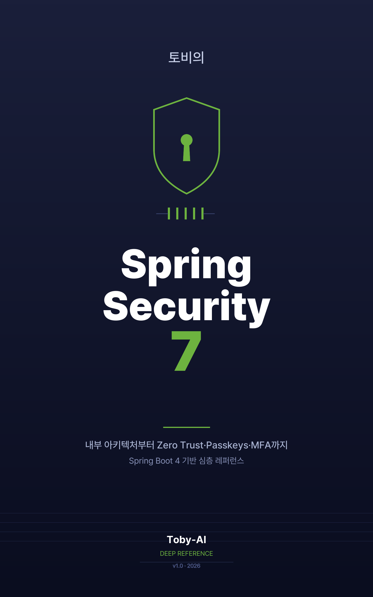

# 토비의 Spring Security 7

> Spring Security 7.0 GA와 Spring Boot 4 위에서, 한 요청이 필터를 통과하는 길부터 Zero Trust·Passkeys·MFA까지 한 권으로 끝까지 따라가는 한국어 심층 레퍼런스.

- **저자:** Toby-AI
- **버전:** v1.0.0
- **발행일:** 2026-05-11
- **언어:** 한국어 (ko)
- **분량:** 본문 15개 챕터 + 머리말·맺음말·부록 (약 7,340행, 한글 본문 약 30만 자 규모)
- **식별자:** `book/toby-spring-security-7@v1.0.0`
- **라이선스:** [CC BY-NC-SA 4.0](https://creativecommons.org/licenses/by-nc-sa/4.0/deed.ko)

## 이 책은 무엇인가

이 책은 Spring Security 7.0 GA(2025-11-17)와 Spring Boot 4를 기준으로 다시 쓴 한국어 심층 레퍼런스다. 5.x/6.x 시절의 코드가 7에서 왜 갑자기 빨갛게 물드는지 한 줄씩 짚어내고, "왜 이렇게 짜야 하는지"가 불분명했던 `SecurityFilterChain` 빈의 내부 동작을 끝까지 파고든다. 단순 튜토리얼이 아니다. 통독하면 한 권의 "Spring Security 7 운영 매뉴얼"이 되는 구조다.

핵심 축은 세 가지다. 첫째, **필터 체인 해부와 컴포넌트 모델** — 한 요청이 통과하는 길을 머릿속에 그릴 수 있게 한다. 둘째, **인증 시나리오의 점진적 복잡도** — 폼/Basic/Remember-Me → JWT 자원 서버 + DPoP → OAuth2 Client + OIDC + PKCE → Passkeys·One-Time Token·MFA로 이어진다. 셋째, **인가의 5층 구조와 횡단 관심사** — `AuthorizationManager`, `AuthorizationManagerFactory`, CSRF·CORS·헤더, 세션·쿠키·컨텍스트, Reactive 보안, 테스팅까지.

마지막 장은 모놀리식 + SPA + 자원 서버 + 외부 IdP 조합을 처음부터 끝까지 한 시나리오로 빌드한다. 책을 덮으면 무엇을 만들 수 있는지 단독 챕터로 또렷해진다. 5/6 → 7 마이그레이션 함정은 1장에 미리보기 표로, 13장에 본편 답으로 펼쳐진다.

## 누구를 위한 책인가

중급에서 시니어 사이의 Spring 백엔드 개발자를 가정한다. 구체적으로는 다음과 같은 상태다.

- **진입 상태:** `SecurityFilterChain` 빈을 만들어 본 적은 있지만 "왜 이렇게 짜야 하는지"는 불분명하다. JWT를 도입했는데 운영 중 의문점이 쌓여간다. Spring Security 5.x/6.x를 표면적으로 써봤고, 자바 17+/21에 익숙하다. 7.0 마이그레이션 공지를 보고 막막함을 느낀다.
- **출구 상태:** 한 요청이 필터를 통과하는 전체 경로를 머릿속에 그릴 수 있다. 시나리오(폼/Basic/JWT/OAuth2/OIDC/Passkeys/MFA)별로 어느 컴포넌트가 무엇을 하는지 안다. 7.0의 새 모델(`AuthorizationManager`, `AuthorizationManagerFactory`, `@EnableMultiFactorAuthentication`, `csrf(spa)`, DPoP)을 자기 프로젝트에 도입할 수 있다. 인가 결정을 단위/통합 테스트로 안전망에 묶을 수 있다. BFF·Zero Trust 같은 트렌드를 기존 자산과 어떻게 연결할지 판단할 수 있다.

각 챕터는 단독으로도 가치가 있도록 짰다. 7장 Passkeys만 펴서 도입할 수도, 12장 테스팅만 펴서 기존 시스템에 안전망을 추가할 수도 있다. 다만 처음부터 읽으면 2~3장의 어휘가 이후 모든 챕터에 그대로 흘러 일관된 감각을 갖게 된다.

## 무엇을 얻게 되는가

- **필터 체인의 멘탈 모델.** 한 요청이 어느 필터에서 어떤 결정을 받고 다음 필터로 넘어가는지, 그리고 내가 만든 Filter를 `addFilterBefore`/`addFilterAfter`로 어디에 끼울지 즉시 판단할 수 있다.
- **인증 시나리오 전 영역의 1급 이해.** 폼 로그인부터 Passkeys·OTT·MFA·DPoP까지, 각 모델이 어떤 위협을 막고 어떤 위협에는 무력한지 끝까지 풀어낸다.
- **5/6 → 7 마이그레이션 실전 가이드.** deprecation 매핑표, 권고 순서, 흔히 빠지는 함정 5건의 본편 답, OpenRewrite 6.4/6.5 자동 치환까지 한 챕터에 모았다.
- **인가의 5층 구조와 테스트 안전망.** `AuthorizationManager` 활용, Role Hierarchy, 도메인 객체 ACL, ProblemDetail 에러 핸들링, 그리고 `@WithMockUser`/`SecurityMockMvcRequestPostProcessors`/`oauth2Login()`/`jwt()` mock으로 인가 결정을 테스트로 묶는 패턴.
- **Reactive 보안과 Zero Trust·BFF 트렌드 연결.** WebFlux에서 다시 그리는 인증·인가, Zero Trust 7 tenets, BFF 패턴, Secret 회전, Actuator, 관측·감사를 기존 자산과 어떻게 잇는지까지.

## 차례

1. **왜 Spring Security를 다시 봐야 하는가** — 7.0 GA가 가져온 변화와 5/6 코드가 빨갛게 물드는 이유, 책 전체의 좌표축.
2. **한 요청이 통과하는 길 — 필터 체인 해부** — `SecurityFilterChain`의 내부 동작과 커스텀 필터를 끼우는 법.
3. **인증과 인가의 컴포넌트 모델** — `AuthenticationManager`, `AuthenticationProvider`, `UserDetailsService`, `SecurityContext`의 정확한 역할.
4. **폼 로그인·HTTP Basic·Remember-Me** — 세션 기반 인증의 정석과 흔한 함정.
5. **JWT 자원 서버 — Bearer 토큰의 끝까지, 그리고 sender-constrained로** — 토큰 검증, 키 회전, DPoP로의 진화.
6. **OAuth2 Client + OIDC Login — 외부 IdP에 로그인을 위임하다** — PKCE, ID 토큰 검증, 클레임 매핑.
7. **Passkeys·One-Time Token·MFA — 패스워드 너머의 인증** — 등록/인증 ceremony, MFA 1급 권한 모델, `@EnableMultiFactorAuthentication`.
8. **권한은 어디에 사는가 — 인가의 5층 구조** — URL/Method/Role Hierarchy/`AuthorizationManager`/도메인 객체.
9. **CSRF·CORS·보안 헤더 — 가장 헷갈리는 셋** — `csrf(spa)`를 포함한 7.0 모델로 SPA·서버 렌더링 양쪽을 정합시킨다.
10. **세션·쿠키·컨텍스트 전파 — 상태 관리의 모든 모서리** — `SessionAuthenticationStrategy`, `SecurityContextRepository`, 스레드 풀 함정.
11. **Reactive 보안 — WebFlux에서 다시 그리는 인증·인가** — `mutateWith(mockUser())`까지.
12. **Spring Security 테스팅 — `@WithMockUser`부터 OAuth2 mock까지** — 인가·OAuth2·자원 서버·Reactive 테스트 패턴.
13. **5/6에서 7로 — 마이그레이션 실전 가이드** — deprecation 매핑, 권고 순서, OpenRewrite 6.4/6.5.
14. **Zero Trust·BFF·운영의 모서리 — 트렌드와 표준** — Zero Trust 7 tenets, BFF, Secret 회전, Actuator, 관측·감사.
15. **한 권을 한 시나리오로 — 통합 실전 워크스루** — 모놀리식 + SPA + 자원 서버 + 외부 IdP 조합을 처음부터 끝까지.

부록으로 **마이그레이션 체크리스트 한 페이지**, 그리고 책의 판본·라이선스·식별자를 명문화한 **판권** 페이지를 둔다.

## 저자 소개

**Toby-AI**는 `book-writer` 하네스의 기본 저자 페르소나다. 리서치·계획·계획 리뷰·챕터 저술·스타일 점검·편집·표지 디자인·EPUB 빌드 전 과정을 AI 에이전트 협업으로 수행했고, 챕터 본문은 Toby 평어체(청유형 적극 활용·수사적 질문·상황 가정·감정적 공감 표현)를 따른다. 단순 자동 생성문이 아니라, 한국어 시니어 백엔드 독자를 향해 동료처럼 말하는 톤을 일관되게 유지하려 했다.

이 책의 모든 인용·구현 결정은 Spring Security 7.0 GA 공식 문서, 관련 RFC(9700·DPoP 등), 그리고 spring-projects/spring-security 이슈 트래커의 1차 소스에 기반한다.

## 책 정보

- **파일:** `토비의-Spring-Security-7-v1.0.0.epub`
- **형식:** EPUB 3 (언어: ko)
- **버전:** v1.0.0
- **발행일:** 2026-05-11
- **식별자:** `book/toby-spring-security-7@v1.0.0`
- **라이선스:** CC BY-NC-SA 4.0 (저작자 표시·비상업적 이용·동일조건 변경허락)
- **표준 검증:** epubcheck 3.3 통과 (0 errors / 0 warnings)
- **산출 하네스:** [book-writer](https://github.com/tobyilee/book-writer) v1.2.0
